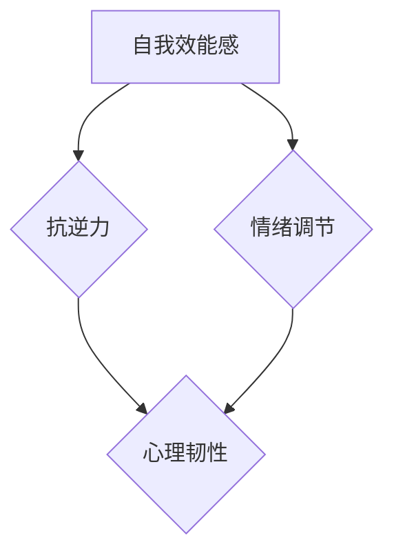

                 

# 培养心理韧性：增强面对挫折的内在力量

> 关键词：心理韧性、挫折、内在力量、自我效能感、抗逆力、情绪调节

> 摘要：本文从技术专家的角度，深入探讨心理韧性的概念、重要性以及培养策略。通过剖析心理韧性的核心要素，如自我效能感、抗逆力和情绪调节，提供实用的培养方法，帮助读者在职业生涯和生活中更好地应对挫折，增强内在力量。

## 引言：理解心理韧性

### 1.1 心理韧性的概念与重要性

心理韧性，又称心理弹性，是指个体在面对压力、挑战和挫折时，能够迅速恢复并适应、甚至成长的能力。在技术领域，心理韧性同样重要，因为它影响着程序员、架构师、研发团队在面对项目压力、技术难题时的表现。

心理韧性不仅是个人成长的催化剂，也是社会适应能力的基石。在快速变化的技术行业中，拥有心理韧性意味着能够更好地应对技术变革、适应团队协作，以及在职业发展中克服各种挑战。

### 1.2 心理韧性与个人成长的关系

心理韧性在个人成长中扮演着至关重要的角色。它促使我们不断反思和调整自己的行为，从而在挫折中学习和成长。心理韧性高的人，能够更快地适应新环境，更快地掌握新技能，从而在职业发展中占据优势。

### 1.3 心理韧性与社会适应能力

在社会层面，心理韧性同样重要。一个具有高心理韧性的人，能够更好地应对社会压力，维护良好的人际关系，以及在多样化的社会环境中找到自己的位置。这在技术团队协作、跨文化沟通等方面尤为重要。

### 1.4 心理韧性的重要性：现实生活中的实例

现实生活中的实例证明了心理韧性的重要性。例如，一位优秀的程序员在遇到复杂的技术难题时，能够保持冷静，分析问题，逐步找到解决方案。这是心理韧性的体现，也是他成功的关键。

## 第2章 心理韧性的核心要素

### 2.1 自我效能感

#### 2.1.1 自我效能感的定义

自我效能感是指个体对自己完成特定任务的能力的信心。自我效能感高的人，在面对挑战时更自信，更有可能成功。

#### 2.1.2 自我效能感的影响因素

自我效能感的影响因素包括个人过去的成功经验、他人的评价、以及对自身能力的认识。

#### 2.1.3 提升自我效能感的策略

提升自我效能感的策略包括设定合理的目标、积极反馈、以及模拟训练。

### 2.2 抗逆力

#### 2.2.1 抗逆力的概念

抗逆力是指个体在面对逆境时，能够保持积极心态，寻求解决问题的能力。抗逆力高的人，能够在挫折中找到成长的机会。

#### 2.2.2 抗逆力的作用

抗逆力的作用在于帮助个体更好地应对挫折，提升心理韧性，从而在职业生涯和生活中取得成功。

#### 2.2.3 培养抗逆力的方法

培养抗逆力的方法包括自我反思、积极心态的培养、以及寻求社会支持。

### 2.3 情绪调节

#### 2.3.1 情绪调节的重要性

情绪调节是心理韧性的重要组成部分，它影响着个体的身心健康和社交关系。情绪调节能力强的人，能够更好地应对压力和挫折。

#### 2.3.2 常见的情绪调节策略

常见的情绪调节策略包括深呼吸、冥想、运动等。

#### 2.3.3 情绪调节的实践方法

情绪调节的实践方法包括了解自己的情绪、学会表达情绪，以及寻找情绪调节的方法。

## 第3章 心理韧性的培养策略

### 3.1 家庭环境对心理韧性的影响

#### 3.1.1 家庭支持与心理韧性

家庭支持是心理韧性培养的重要基础。一个充满爱的家庭环境，能够为个体提供安全感和支持，从而增强心理韧性。

#### 3.1.2 家庭冲突与心理韧性

家庭冲突对心理韧性有负面影响。减少家庭冲突，建立和谐的家庭环境，有助于培养心理韧性。

#### 3.1.3 建立积极家庭环境的策略

建立积极家庭环境的策略包括加强家庭沟通、增进家庭理解、以及共同参与家庭活动。

### 3.2 学校教育对心理韧性的培养

#### 3.2.1 学校教育在心理韧性培养中的作用

学校教育在心理韧性培养中起着关键作用。通过课程设置和教育活动，学校可以培养学生的心理韧性。

#### 3.2.2 学校教育的策略与方法

学校教育的策略与方法包括心理健康教育、团体心理辅导、以及个性化教育。

#### 3.2.3 教师在心理韧性培养中的角色

教师在心理韧性培养中扮演着重要角色。教师可以通过教学、指导和榜样作用，帮助学生培养心理韧性。

### 3.3 社会支持系统的重要性

#### 3.3.1 社会支持系统的定义

社会支持系统是指个体在社会中获得的帮助和支持，包括家庭、朋友、社区等。

#### 3.3.2 社会支持系统的构成

社会支持系统由情感支持、信息支持、和物质支持三部分构成。

#### 3.3.3 建立和维护社会支持系统的策略

建立和维护社会支持系统的策略包括积极参与社区活动、建立人际网络、以及寻求专业帮助。

## 第4章 心理韧性训练的方法与实践

### 4.1 冥想与心理韧性

#### 4.1.1 冥想的基本原理

冥想是一种通过专注呼吸和放松身体来达到心灵平静的方法。冥想的基本原理是通过降低大脑的思考速度，减少焦虑和压力，从而增强心理韧性。

#### 4.1.2 冥想对心理韧性的影响

冥想能够帮助个体更好地应对压力，提高情绪调节能力，从而增强心理韧性。

#### 4.1.3 冥想实践的基本步骤

冥想实践的基本步骤包括选择一个安静的环境、保持坐姿、专注于呼吸，以及逐步延长冥想时间。

### 4.2 情绪管理技巧

#### 4.2.1 情绪管理的意义

情绪管理是指个体通过认知和行为调节情绪的过程。情绪管理的意义在于帮助个体更好地应对压力，提高生活质量。

#### 4.2.2 情绪管理的方法

情绪管理的方法包括认知重构、情绪表达、以及放松训练。

#### 4.2.3 情绪管理实践案例

情绪管理实践案例包括通过认知重构改变负面情绪，以及通过放松训练缓解压力。

### 4.3 压力应对策略

#### 4.3.1 压力管理的概念

压力管理是指个体通过认知和行为调节压力的过程。压力管理的概念包括压力源、压力反应和压力结果。

#### 4.3.2 常见压力应对策略

常见压力应对策略包括时间管理、任务分解、以及放松技巧。

#### 4.3.3 压力管理的实际应用

压力管理的实际应用包括在工作时间合理安排任务、学会放松技巧，以及寻求专业帮助。

## 第5章 心理韧性在职业生涯中的应用

### 5.1 职业压力与心理韧性

#### 5.1.1 职业压力的表现

职业压力表现为焦虑、抑郁、失眠等。职业压力是影响职业生涯发展的重要因素。

#### 5.1.2 心理韧性在职业压力中的应对作用

心理韧性在职业压力中起着关键作用。心理韧性高的人能够更好地应对职业压力，保持工作表现。

#### 5.1.3 提高职业心理韧性的方法

提高职业心理韧性的方法包括心理训练、健康生活方式、以及积极心态的培养。

### 5.2 团队合作与心理韧性

#### 5.2.1 团队合作的重要性

团队合作是现代工作环境中的重要组成部分。团队合作能够提高工作效率，促进创新。

#### 5.2.2 心理韧性在团队合作中的作用

心理韧性在团队合作中起着关键作用。心理韧性高的人能够更好地应对团队合作中的挑战和压力。

#### 5.2.3 增强团队合作心理韧性的策略

增强团队合作心理韧性的策略包括建立信任、明确目标、以及积极沟通。

## 第6章 心理韧性培养案例研究

### 6.1 案例一：一位职场人士的心理韧性成长之路

#### 6.1.1 案例背景

一位职场人士，由于工作压力和人际关系问题，陷入了心理困境。他决定通过培养心理韧性来改善自己的状态。

#### 6.1.2 案例分析

这位职场人士通过自我反思、情绪调节、和寻求专业帮助，逐步提升了心理韧性。

#### 6.1.3 案例启示

案例启示我们，心理韧性是可以通过学习和实践来培养的。面对挫折，我们要勇敢地面对，积极寻找解决问题的方法。

### 6.2 案例二：一个企业如何通过心理韧性培训提升员工素质

#### 6.2.1 案例背景

一个企业意识到心理韧性对员工绩效和团队协作的重要性，决定开展心理韧性培训。

#### 6.2.2 案例分析

企业通过心理韧性培训，提高了员工的心理素质，增强了团队协作能力。

#### 6.2.3 案例启示

案例启示我们，企业可以通过心理韧性培训，提升员工的素质和团队协作能力，从而在竞争激烈的市场中立于不败之地。

## 第7章 结论与展望

### 7.1 心理韧性培养的意义

心理韧性培养对个人的成长和社会的稳定具有重要意义。通过培养心理韧性，我们可以更好地应对挑战，提升生活质量。

### 7.2 心理韧性研究的未来方向

未来，心理韧性研究将更加注重跨学科整合，探索心理韧性的神经生物学基础，以及个性化心理韧性培养方法。

### 7.3 社会各界对心理韧性培养的呼吁与责任

社会各界应共同努力，加强心理韧性培养，提高个体的心理健康水平，为社会和谐发展贡献力量。

## 作者信息

作者：AI天才研究院/AI Genius Institute & 禅与计算机程序设计艺术 /Zen And The Art of Computer Programming

-------------------

## 第2章 心理韧性的核心要素

### 2.1 自我效能感

#### 2.1.1 自我效能感的定义

自我效能感（Self-Efficacy）是指个体对自身完成特定任务的能力的信念和信心。这一概念最早由心理学家阿尔伯特·班杜拉（Albert Bandura）提出，他认为自我效能感是个体动机、认知和行为调节的关键因素。在技术领域，自我效能感对于程序员、工程师和研发团队来说尤为重要，因为它直接影响到他们面对复杂问题和困难时的应对策略。

自我效能感不仅影响个体是否愿意尝试新任务，还影响他们在任务中的表现和最终的成功度。高自我效能感的个体更倾向于设定挑战性的目标，更乐观地面对困难，并在遇到挫折时更快地恢复。

#### 2.1.2 自我效能感的影响因素

自我效能感受到多种因素的影响，包括以下几方面：

1. **经验**：个体过去成功或失败的经历对其自我效能感有显著影响。成功的经验会增强自信心，而失败的经验则可能导致自我效能感的降低。

2. **观察学习**：通过观察他人的行为和结果，个体可以学习到如何完成任务，并据此调整自己的自我效能感。特别是当看到与自己相似的人成功时，个体更容易增强自我效能感。

3. **社会支持**：他人的鼓励、指导和反馈对个体的自我效能感有重要作用。积极的支持可以提高个体完成任务的动力和信心。

4. **情绪状态**：情绪状态也会影响自我效能感。例如，焦虑和恐惧可能降低个体的自我效能感，而平静和自信则可以提高自我效能感。

5. **心理特质**：个体的性格特质，如乐观、坚韧、自信心等，也会影响自我效能感。具有这些特质的人往往更有可能相信自己的能力。

#### 2.1.3 提升自我效能感的策略

要提升自我效能感，可以采取以下策略：

1. **目标设定**：设定合理、可实现的目标，并分解为小步骤，每次达成一个小目标都能增强自我效能感。

2. **正面反馈**：及时给予自己或他人正面的反馈，认可和庆祝每一个小的进步和成功。

3. **积极心态**：培养乐观的心态，用积极的思维方式来面对挑战和困难。

4. **模拟训练**：通过模拟练习和实际操作，增加对任务的理解和掌控感。

5. **寻求支持**：与家人、朋友或专业人士交流，获取鼓励和建议，以提高自信心。

### 2.2 抗逆力

#### 2.2.1 抗逆力的概念

抗逆力（Resilience）是指个体在面对逆境和挑战时，能够迅速适应、恢复和成长的能力。抗逆力不仅是心理韧性的核心要素，也是个体成功应对生活和工作挑战的重要保障。在技术领域，抗逆力意味着程序员和研发团队在面对技术难题、项目压力和团队冲突时，能够保持冷静、积极和高效的应对能力。

抗逆力不是一种单一的能力，而是多种心理和行为的综合体现。它包括自我效能感、情绪调节能力、适应性思维模式、以及寻求和接受社会支持的能力。

#### 2.2.2 抗逆力的作用

抗逆力在多个方面发挥作用：

1. **减少心理压力**：抗逆力强的人能够更好地应对压力，减少焦虑和抑郁的情绪。

2. **提高问题解决能力**：抗逆力使个体在遇到问题时更加冷静和客观，能够快速找到解决方案。

3. **促进个人成长**：逆境和挑战是成长的催化剂，抗逆力强的人能够从挫折中学习和成长。

4. **增强社会适应能力**：抗逆力使人更加适应多变的社会环境，能够在多样化的团队中发挥积极作用。

#### 2.2.3 培养抗逆力的方法

要培养抗逆力，可以采取以下方法：

1. **建立积极的心态**：积极的心态有助于个体更好地面对挑战，看到困难中的机会。

2. **加强社会支持**：与家人、朋友和同事建立良好的关系，当遇到困难时能够得到支持。

3. **培养情绪调节能力**：学会识别和调节自己的情绪，避免情绪失控。

4. **建立健康的生活方式**：保持适度的锻炼、充足的睡眠和良好的饮食习惯，有助于提高抗逆力。

5. **积极应对挑战**：勇于面对挑战，通过实际操作和不断尝试来提高应对能力。

### 2.3 情绪调节

#### 2.3.1 情绪调节的重要性

情绪调节（Emotion Regulation）是指个体通过认知和行为策略来管理自己的情绪体验。情绪调节能力对个体的心理健康、社会适应能力和生活质量有重要影响。在技术领域，情绪调节能力对于程序员和工程师来说尤为重要，因为它直接影响到他们的工作效率、团队协作能力和职业发展。

情绪调节能力强的人能够更好地处理工作中的压力和挑战，保持冷静和专注，从而提高工作质量和效率。

#### 2.3.2 常见的情绪调节策略

常见的情绪调节策略包括以下几种：

1. **认知重构**：通过改变对事件的看法和解释，减少负面情绪的影响。例如，将“我失败了”转变为“这是一个学习和成长的机会”。

2. **情绪表达**：学会表达自己的情绪，避免情绪压抑。可以通过谈话、写日记或艺术创作等方式来表达。

3. **放松技巧**：使用深呼吸、冥想、瑜伽等方法来放松身心，减少压力和焦虑。

4. **正向自我对话**：用积极的自我对话来替代消极的自我评价，增强自信和自尊。

5. **寻求支持**：与他人交流，寻求专业帮助，以获得情感支持和建议。

#### 2.3.3 情绪调节的实践方法

情绪调节的实践方法包括以下几种：

1. **定期练习**：每天安排一段时间进行情绪调节练习，如冥想、深呼吸等。

2. **保持健康的生活方式**：通过适度的锻炼、充足的睡眠和健康的饮食来维护身心健康。

3. **建立支持系统**：与家人、朋友和同事保持良好的关系，当情绪波动时能够得到支持和帮助。

4. **学会应对技巧**：在面对压力和挑战时，使用已学会的情绪调节技巧来缓解紧张和焦虑。

### 2.4 自我效能感、抗逆力和情绪调节的联系与区别

自我效能感、抗逆力和情绪调节是心理韧性的重要组成部分，它们相互关联但又有所区别。

- **自我效能感**主要关注个体对自身能力的信念和信心，它是个体在面对挑战时的动力来源。

- **抗逆力**则更关注个体在面对逆境时的适应和恢复能力，它是个体心理韧性的一种体现。

- **情绪调节**则侧重于个体如何管理和调节自己的情绪体验，以保持心理健康和良好的人际关系。

虽然这三个概念各有侧重点，但它们在实际应用中往往相互交织。例如，一个具有高自我效能感的人可能会更容易培养抗逆力，同时也能够更好地调节情绪。反之，情绪调节能力的提升也可能有助于增强自我效能感和抗逆力。

## 第3章 心理韧性的培养策略

### 3.1 家庭环境对心理韧性的影响

家庭环境在个体心理韧性的培养中起着至关重要的作用。一个和谐、支持性的家庭环境能够为个体提供安全感，帮助他们在面对外部挑战时保持积极的心态和坚韧的意志。

#### 3.1.1 家庭支持与心理韧性

家庭支持包括情感支持、物质支持和教育指导。情感支持体现在家人对个体的关心和理解，能够帮助他们在遇到困难时找到依靠。物质支持则体现在家庭成员为个体提供必要的生活条件和资源，使他们能够专注于学业或职业发展。教育指导则包括家长对子女的教育方式和态度，如何在日常互动中培养他们的自我效能感和抗逆力。

研究表明，家庭支持与个体的心理韧性呈正相关。一个充满爱和支持的家庭环境能够增强个体的自我效能感，帮助他们建立积极的自我形象，从而在面对挫折时保持坚韧。

#### 3.1.2 家庭冲突与心理韧性

然而，家庭冲突也可能对心理韧性产生负面影响。家庭内部的争吵、冷漠或冲突可能导致个体的心理压力增加，影响他们的情绪和行为。长期的家庭冲突可能使个体产生消极的情绪，如焦虑、抑郁和愤怒，从而降低他们的心理韧性。

为了减少家庭冲突对心理韧性的负面影响，家长可以通过以下策略来改善家庭环境：

- **积极沟通**：建立开放、诚实的沟通渠道，鼓励家庭成员表达自己的感受和需求。
- **设定规则**：制定家庭规则，明确家庭成员的行为期望，减少冲突的发生。
- **共同参与**：鼓励家庭成员一起参与家庭活动和决策，增强家庭凝聚力。

#### 3.1.3 建立积极家庭环境的策略

要建立一个积极的家庭环境，家长可以采取以下策略：

- **培养亲情**：花时间与家人相处，通过共同活动、交流感情来增强家庭凝聚力。
- **提供支持**：在子女面临挑战时，给予他们情感和物质上的支持，鼓励他们克服困难。
- **培养独立能力**：鼓励子女独立解决问题，培养他们的自我效能感和抗逆力。
- **设定榜样**：作为家长，通过自身行为为子女树立榜样，传递积极的生活态度和价值观。

### 3.2 学校教育对心理韧性的培养

学校教育在个体心理韧性的培养中发挥着重要作用。通过课程设置、教育活动和师生互动，学校可以为学生提供丰富的心理韧性培养资源。

#### 3.2.1 学校教育在心理韧性培养中的作用

学校教育可以通过以下方式培养学生的心理韧性：

- **课程设置**：学校可以通过心理健康课程、生命教育课程等，向学生传授心理韧性的知识，帮助他们理解心理韧性对个人成长的重要性。
- **教育活动**：学校可以组织各类心理韧性相关的教育活动，如讲座、工作坊、团体辅导等，提高学生的情绪调节能力和抗逆力。
- **师生互动**：教师通过课堂互动、个别辅导等方式，关注学生的心理状态，提供及时的支持和指导。

#### 3.2.2 学校教育的策略与方法

为了有效地培养学生的心理韧性，学校可以采取以下策略：

- **融合心理健康教育**：将心理健康教育融入各学科教学，通过学科知识传授心理韧性相关的技能和策略。
- **个性化教育**：关注每个学生的个性差异，提供个性化的心理辅导和指导。
- **创设支持性环境**：营造一个尊重、理解和支持学生的校园环境，减少学生的心理压力。

#### 3.2.3 教师在心理韧性培养中的角色

教师在心理韧性培养中扮演着关键角色。他们不仅需要具备相关的心理学知识和技能，还需要在实际教学中发挥积极作用：

- **关注学生心理状态**：教师应关注学生的情绪和行为变化，及时发现和干预心理问题。
- **提供支持和指导**：教师应为学生提供情感支持和专业指导，帮助他们应对挑战和困难。
- **以身作则**：教师通过自身的行为和态度，为学生树立积极的榜样，传递心理韧性的重要性。

### 3.3 社会支持系统的重要性

社会支持系统是指个体在社会中获得的帮助和支持系统，包括家庭、朋友、社区和其他社会组织。一个良好的社会支持系统对个体的心理韧性具有积极的影响。

#### 3.3.1 社会支持系统的定义

社会支持系统包括以下几个方面：

- **情感支持**：提供情感上的安慰、理解和鼓励。
- **信息支持**：提供有价值的信息和资源，帮助个体解决问题。
- **物质支持**：提供物质上的帮助，如经济援助、医疗资源等。
- **咨询支持**：提供专业的心理咨询服务，帮助个体处理心理问题。

#### 3.3.2 社会支持系统的构成

社会支持系统的构成主要包括以下几个方面：

- **家庭**：家庭是提供情感支持和物质支持的重要来源，是个体心理韧性的重要基石。
- **朋友**：朋友是提供情感支持和社交资源的重要来源，他们在个体面临困难时提供支持和帮助。
- **社区**：社区为个体提供社会参与和互助的平台，有助于增强个体的社会适应能力和抗逆力。
- **社会组织**：社会组织如志愿者团体、专业团体等，提供专业服务和资源，帮助个体应对生活中的各种挑战。

#### 3.3.3 建立和维护社会支持系统的策略

为了建立和维护一个有效的社会支持系统，个体可以采取以下策略：

- **建立人际网络**：积极与他人建立联系，扩大社交圈子，以获得更多的支持和资源。
- **参与社区活动**：参与社区活动，增强社区归属感，提高社会参与度。
- **寻求专业帮助**：在面临重大挑战时，寻求专业心理咨询师的帮助，以获得专业的支持和指导。
- **回馈社会**：通过志愿服务、捐赠等方式回馈社会，增强自我价值感和社会认同感。

## 第4章 心理韧性训练的方法与实践

### 4.1 冥想与心理韧性

#### 4.1.1 冥想的基本原理

冥想（Meditation）是一种通过专注于呼吸、思维和身体感受来达到心灵平静和精神集中的实践。冥想的基本原理是通过减少外部刺激和内心的杂念，使大脑进入一种放松和专注的状态，从而提高个体的情绪调节能力和心理韧性。

冥想的历史可以追溯到数千年前，最初在佛教、印度教和中国道教等宗教传统中作为一种精神修炼方式。近年来，科学研究逐渐证实了冥想在心理健康方面的多种益处，包括降低焦虑、抑郁和压力水平，提高注意力和情绪调节能力。

#### 4.1.2 冥想对心理韧性的影响

冥想对心理韧性的影响主要体现在以下几个方面：

1. **情绪调节**：通过冥想，个体能够更好地控制自己的情绪，减少焦虑、愤怒和抑郁等负面情绪。
2. **认知功能**：冥想能够提高个体的注意力和专注力，改善记忆和决策能力，从而增强应对挑战的能力。
3. **压力管理**：冥想能够降低压力激素水平，如皮质醇，帮助个体更好地应对压力和挑战。
4. **心理恢复**：冥想能够促进身体和心理的恢复，使个体在经历压力后更快地恢复到平衡状态。

#### 4.1.3 冥想实践的基本步骤

要开始冥想实践，可以遵循以下基本步骤：

1. **选择一个安静的环境**：找到一个安静、舒适的地方，避免噪音和干扰。
2. **选择一个冥想姿势**：可以选择坐姿、躺姿或站姿，关键是要保持舒适和稳定。
3. **专注于呼吸**：将注意力集中在呼吸上，感受气息的进出，当思维跑偏时，轻轻地将注意力拉回到呼吸上。
4. **延长冥想时间**：初学者可以从短时间（如5分钟）开始，逐渐增加冥想时间，以达到更好的效果。
5. **记录冥想体验**：在冥想后，记录自己的感受和体验，以便追踪进步和调整冥想策略。

### 4.2 情绪管理技巧

#### 4.2.1 情绪管理的意义

情绪管理（Emotion Management）是指个体通过认知和行为策略来理解和调节自己的情绪体验。情绪管理的意义在于帮助个体更好地应对生活中的压力和挑战，提高生活质量和工作效率。

有效的情绪管理能够带来以下益处：

1. **提高心理健康**：通过情绪管理，个体能够减少负面情绪的影响，降低抑郁、焦虑等心理问题的发生率。
2. **改善人际关系**：情绪稳定的人更能够理解和尊重他人，建立和谐的人际关系。
3. **提高工作效率**：情绪管理有助于个体保持积极的工作态度和专注力，提高工作效率和绩效。
4. **增强心理韧性**：通过情绪管理，个体能够更好地应对生活中的挑战，增强心理韧性。

#### 4.2.2 常见的情绪管理策略

常见的情绪管理策略包括以下几个方面：

1. **认知重构**：通过改变对事件的看法和解释，减少负面情绪的影响。例如，将“我不行”转变为“我需要更多的支持和练习”。
2. **情绪表达**：学会表达自己的情绪，避免情绪压抑。可以通过谈话、写日记或艺术创作等方式来表达。
3. **放松技巧**：使用深呼吸、冥想、瑜伽等方法来放松身心，减少压力和焦虑。
4. **正向自我对话**：用积极的自我对话来替代消极的自我评价，增强自信和自尊。
5. **寻求支持**：与他人交流，寻求专业帮助，以获得情感支持和建议。

#### 4.2.3 情绪管理实践案例

以下是一个情绪管理实践案例：

一位程序员在项目截止日期前感到非常焦虑，担心无法按时完成任务。他采取了以下情绪管理策略：

1. **认知重构**：他意识到焦虑会影响他的工作效率，于是决定重新调整自己的心态，告诉自己“我可以一步步完成任务，不需要急于求成”。
2. **放松技巧**：他通过深呼吸和冥想来放松身心，减少焦虑感。
3. **任务分解**：他将大任务分解为小步骤，逐一完成，每完成一步都给自己一些积极的反馈。
4. **寻求支持**：他向团队成员和领导寻求建议和支持，减轻了心理压力。

通过这些策略，这位程序员不仅按时完成了任务，还感受到了情绪管理带来的积极变化。

### 4.3 压力应对策略

#### 4.3.1 压力管理的概念

压力管理（Stress Management）是指个体通过认知和行为策略来识别、理解和应对压力的过程。压力管理不仅仅是减轻压力，更重要的是提高个体的适应能力和心理韧性。

压力管理的核心包括以下几个方面：

1. **识别压力源**：了解引起压力的因素，如工作压力、人际关系、财务问题等。
2. **理解压力影响**：了解压力对身心健康的影响，如焦虑、抑郁、失眠等。
3. **制定应对策略**：采取有效的策略来应对压力，如时间管理、情绪调节、健康生活方式等。

#### 4.3.2 常见压力应对策略

常见的压力应对策略包括以下几个方面：

1. **时间管理**：合理安排时间，优先处理重要和紧急的任务，避免时间浪费和压力增加。
2. **情绪调节**：通过情绪调节技巧来减轻压力，如深呼吸、冥想、运动等。
3. **放松技巧**：使用放松技巧来缓解身体和精神的紧张，如瑜伽、按摩、音乐放松等。
4. **积极心态**：培养积极的心态，用乐观的角度看待问题，减少压力。
5. **寻求支持**：与家人、朋友或专业人士交流，寻求情感支持和建议。

#### 4.3.3 压力管理的实际应用

以下是一个压力管理的实际应用案例：

一位IT项目经理在项目截止日期前感到巨大的压力，担心项目无法按时完成。他采取了以下压力管理策略：

1. **时间管理**：他制定了详细的项目计划，合理安排团队成员的任务和时间，确保项目按计划进行。
2. **情绪调节**：他通过深呼吸和冥想来放松身心，减少焦虑感。
3. **放松技巧**：他每周安排一次瑜伽课程，通过运动来缓解压力。
4. **积极心态**：他鼓励团队成员保持积极的心态，共同面对挑战。
5. **寻求支持**：他与团队成员和领导保持沟通，及时解决问题，获得支持和建议。

通过这些策略，这位项目经理成功地应对了压力，项目最终按时完成，他也感受到了压力管理带来的积极效果。

## 第5章 心理韧性在职业生涯中的应用

### 5.1 职业压力与心理韧性

在职业生涯中，职业压力是普遍存在的现象。职业压力可能源于工作负担、工作环境、人际关系等多个方面，它对个人的心理健康和职业发展产生深远影响。职业压力如果得不到有效管理，可能会导致焦虑、抑郁、工作效率下降等问题，严重时甚至会影响个人的生活质量和幸福感。

#### 5.1.1 职业压力的表现

职业压力的表现形式多样，常见的包括以下几个方面：

1. **情绪问题**：如焦虑、抑郁、易怒、情绪波动等。
2. **身体症状**：如失眠、疲劳、食欲不振、头痛、肌肉紧张等。
3. **工作表现**：如注意力不集中、工作效率下降、缺乏工作动力等。
4. **人际关系**：如与同事、领导的关系紧张，沟通障碍等。

#### 5.1.2 心理韧性在职业压力中的应对作用

心理韧性（Psychological Resilience）在应对职业压力中发挥着重要作用。心理韧性强的个体能够更好地应对职业压力，保持良好的工作状态和心理健康。心理韧性的关键在于个体的适应能力和恢复能力，以下是其具体作用：

1. **情绪调节**：心理韧性强的个体能够更好地管理自己的情绪，减少负面情绪的影响，从而降低职业压力对心理健康的负面影响。
2. **问题解决**：心理韧性强的个体在面临职业压力时，能够更加冷静、客观地分析问题，找到有效的解决方案。
3. **恢复能力**：心理韧性强的个体在经历职业压力后，能够更快地恢复，重新投入到工作中。
4. **适应能力**：心理韧性强的个体能够更好地适应工作中的变化和挑战，从而减少职业压力。

#### 5.1.3 提高职业心理韧性的方法

为了提高职业心理韧性，可以采取以下方法：

1. **自我认知**：了解自己的情绪、需求和优点，认识自己的局限性，从而更好地应对职业压力。
2. **积极心态**：培养积极的心态，用乐观的角度看待问题和挑战，减少负面情绪的影响。
3. **时间管理**：合理安排时间，设定优先级，避免过度工作和时间浪费，从而减轻职业压力。
4. **情绪调节**：学习情绪调节技巧，如深呼吸、冥想、运动等，帮助缓解压力。
5. **寻求支持**：与同事、领导或专业人士交流，寻求情感支持和建议，增强应对职业压力的能力。

### 5.2 团队合作与心理韧性

在职业生涯中，团队合作是不可避免的。一个高效的团队能够提升工作效率、促进创新，而团队合作的成功离不开团队成员的心理韧性。

#### 5.2.1 团队合作的重要性

团队合作在职业环境中具有以下几个重要性：

1. **资源共享**：团队成员可以通过合作共享资源，提高工作效率和成果。
2. **知识互补**：不同背景和专长的团队成员可以相互补充，促进知识创新和技能提升。
3. **增强凝聚力**：团队合作有助于增强团队成员之间的信任和凝聚力，提升团队整体绩效。
4. **提升适应能力**：面对复杂的工作环境和挑战，团队合作能够增强团队的适应能力和抗风险能力。

#### 5.2.2 心理韧性在团队合作中的作用

心理韧性在团队合作中发挥着关键作用，主要体现在以下几个方面：

1. **情绪调节**：心理韧性强的团队成员能够更好地调节自己的情绪，减少负面情绪对团队合作的影响。
2. **冲突管理**：心理韧性强的团队成员能够更加冷静、客观地处理冲突，找到有效的解决方案。
3. **适应变化**：心理韧性强的团队成员能够更好地适应团队中的变化，包括工作任务的调整、团队成员的变动等。
4. **增强合作效果**：心理韧性强的团队成员能够保持积极的态度和高效的工作状态，从而提升团队的整体绩效。

#### 5.2.3 增强团队合作心理韧性的策略

为了增强团队合作心理韧性，可以采取以下策略：

1. **建立信任**：通过开放沟通、互相支持和尊重，建立团队成员之间的信任关系。
2. **提高沟通能力**：培养团队成员的沟通技巧，确保信息的准确传递和有效沟通。
3. **共同目标**：明确团队的目标和愿景，让每个成员都明确自己的角色和责任。
4. **情绪管理**：提供情绪管理培训和资源，帮助团队成员学会调节自己的情绪。
5. **建立支持系统**：鼓励团队成员相互支持和帮助，共同应对职业压力和挑战。

### 案例研究

#### 案例一：一位项目经理的心理韧性成长之路

一位项目经理在担任新项目负责人时，面临着巨大的压力和挑战。项目时间紧、任务重，团队成员之间也存在着沟通不畅和协作问题。为了提高自己的心理韧性，他采取了以下措施：

1. **自我认知**：他开始反思自己的情绪和反应，认识到自己容易因为压力而变得焦虑和急躁。
2. **积极心态**：他决定用积极的心态面对挑战，相信自己和团队能够克服困难。
3. **时间管理**：他制定了详细的项目计划，合理安排时间和任务，确保项目按计划进行。
4. **情绪调节**：他学习了深呼吸和冥想技巧，帮助自己在压力下保持冷静和专注。
5. **寻求支持**：他与团队成员和领导保持沟通，及时解决问题，获得支持和建议。

通过这些措施，这位项目经理不仅成功地完成了项目，还提高了自己的心理韧性，成为团队中的榜样。

#### 案例二：一家企业的团队建设与心理韧性提升

一家大型企业在面对市场竞争和内部变革时，意识到团队心理韧性的重要性。为了提升团队心理韧性，企业采取了以下措施：

1. **团队建设活动**：定期组织团队建设活动，增强团队成员之间的信任和凝聚力。
2. **情绪管理培训**：邀请专业心理顾问进行情绪管理培训，帮助团队成员学会调节自己的情绪。
3. **共同目标设定**：与团队成员共同设定团队目标和愿景，确保每个成员都明确自己的角色和责任。
4. **沟通渠道建立**：建立有效的沟通渠道，鼓励团队成员之间开放、诚实的沟通。
5. **支持系统建设**：建立内部支持系统，如心理咨询室和员工互助小组，为团队成员提供情感支持和专业建议。

通过这些措施，企业的团队心理韧性显著提升，工作效率和创新能力也得到了提高。

### 总结

通过以上案例，我们可以看到，心理韧性在职业生涯中具有重要的作用。提高心理韧性不仅有助于个体更好地应对职业压力，提升工作效率和职业发展，也有助于团队的合作和创新。为了提高心理韧性，个体可以采取自我认知、积极心态、时间管理、情绪调节和寻求支持等多种策略。企业也可以通过团队建设、情绪管理培训、共同目标设定和支持系统建设等措施，提升团队的心理韧性，从而在激烈的市场竞争中立于不败之地。

## 第6章 心理韧性培养案例研究

### 6.1 案例一：一位职场人士的心理韧性成长之路

#### 6.1.1 案例背景

李华是一名年轻的软件工程师，工作几年后，他发现自己经常在面对项目挑战和压力时感到焦虑和不安。尤其是在团队项目失败或客户反馈不满意时，他会陷入自我怀疑和负面情绪中，难以恢复。这种情绪状态不仅影响了他的工作表现，也影响了他与同事和领导的关系。李华意识到，他需要提高自己的心理韧性来应对职场挑战。

#### 6.1.2 案例分析

李华决定通过一系列方法来培养自己的心理韧性。首先，他开始学习情绪调节技巧，如深呼吸、冥想和正念练习。这些技巧帮助他在面对压力时保持冷静和专注。其次，他参加了心理韧性培训课程，学习了如何建立积极的自我效能感和应对挫折的策略。他还定期进行自我反思，分析自己的情绪和行为，寻找改进的方法。

在培养心理韧性的过程中，李华逐步认识到，自己的焦虑和不安主要源于对失败的恐惧和对自我能力的质疑。通过不断的练习和反思，他学会了如何面对这些负面情绪，并找到积极的应对策略。例如，当他感到焦虑时，他会停下来深呼吸，专注于当前的任务，而不是过度担忧未来。

#### 6.1.3 案例启示

李华的案例给我们提供了以下几点启示：

1. **情绪调节是关键**：通过学习情绪调节技巧，如深呼吸和冥想，可以帮助个体在压力下保持冷静和专注。
2. **自我反思有助于成长**：定期进行自我反思，分析自己的情绪和行为，有助于找到负面情绪的根源，并采取积极的应对策略。
3. **积极的自我效能感**：建立积极的自我效能感，相信自己的能力，能够帮助个体更好地应对挑战和挫折。
4. **寻求专业帮助**：在培养心理韧性时，寻求专业的心理咨询和支持，可以帮助个体更快地成长。

### 6.2 案例二：一个企业如何通过心理韧性培训提升员工素质

#### 6.2.1 案例背景

某高科技公司近年来在市场竞争中面临巨大压力，公司管理层意识到员工的情绪和心理状态对公司的绩效和可持续发展至关重要。为了提高员工的心理韧性，公司决定实施一系列心理韧性培训项目。

#### 6.2.2 案例分析

公司首先进行了员工心理韧性调查，了解员工在心理韧性方面的需求和问题。基于调查结果，公司设计了一系列培训课程，包括情绪调节、压力管理、团队合作和心理韧性提升等。这些课程由专业的心理咨询师和企业内部培训师共同讲授。

在培训过程中，员工不仅学习了理论知识，还通过实际案例分析和角色扮演来提升心理韧性。公司还鼓励员工在日常生活中实践所学技巧，如定期冥想、进行团队建设活动和寻求同事支持等。

通过心理韧性培训，员工在面对工作挑战和压力时，能够更加冷静和理性地应对。团队合作氛围也得到了改善，员工之间的沟通和协作能力显著提升。公司绩效和员工满意度也随之提高。

#### 6.2.3 案例启示

案例给我们的启示包括：

1. **定期心理韧性调查**：通过调查了解员工的心理韧性状况，有助于针对性地设计和实施培训项目。
2. **理论与实践相结合**：培训项目应包括理论知识和实践技能，帮助员工在日常生活中应用所学。
3. **团队合作和心理支持**：通过团队建设活动和心理支持系统，可以增强员工的团队合作能力和心理韧性。
4. **持续关注和跟进**：培训后应持续关注员工的心理状态，提供跟进和支持，确保培训效果的长久保持。

通过这两个案例，我们可以看到，心理韧性培养对个人和团队都有显著的积极影响。无论是在职场中还是生活中，培养心理韧性都是一项重要的任务，值得我们投入时间和精力去学习和实践。

## 第7章 结论与展望

### 7.1 心理韧性培养的意义

心理韧性培养在个人成长和职业生涯中具有深远的意义。首先，心理韧性使个体能够更好地应对生活中的各种挑战和压力，保持心理健康和积极心态。对于技术领域的从业者来说，心理韧性尤为重要，因为技术行业充满变化和不确定性，需要个体具备强大的适应能力和抗挫折能力。通过培养心理韧性，程序员、工程师和研发团队能够更高效地应对技术难题、管理项目风险，并在团队协作中发挥积极作用。

其次，心理韧性培养有助于提升个体的综合素质和职业竞争力。具有高心理韧性的个体不仅能够在工作中保持高效和稳定，还能在职业发展中展现出更强的领导力和团队合作能力。这些素质对于个人在职场中的长远发展和晋升具有重要意义。

### 7.2 心理韧性研究的未来方向

未来，心理韧性研究将朝着更多元化和深化的方向发展。一方面，研究者将更加关注心理韧性的神经生物学基础，探索大脑在不同心理韧性水平下的生理反应和机制。通过神经影像学、生物化学等方法，科学家可以更好地理解心理韧性的生物学基础，从而为心理韧性培养提供科学依据。

另一方面，心理韧性研究将更加注重跨学科整合，将心理学、神经科学、教育学和社会学等多学科知识结合起来，形成更为全面的理论体系。例如，心理学和教育学的研究可以相互借鉴，为不同年龄段和职业背景的个体提供针对性的心理韧性培养方案。

此外，个性化心理韧性培养方法将成为研究的热点。未来的研究将更加关注个体的差异性，探索如何根据个体的心理特质、经历和环境，制定个性化的心理韧性培养策略。这种个性化培养方法将有助于提高心理韧性培养的针对性和有效性。

### 7.3 社会各界对心理韧性培养的呼吁与责任

心理韧性培养不仅是个人责任，也是社会各界共同的责任。首先，政府应加大对心理韧性培养的投入，推动心理健康教育的普及，制定相关政策支持心理韧性研究和发展。其次，教育机构应将心理韧性培养纳入课程体系，通过课堂教学、实践活动和心理咨询等多种方式，帮助学生提高心理韧性。

企业也应积极参与心理韧性培养，通过内部培训和员工关怀机制，提高员工的心理健康水平。企业可以通过组织团队建设活动、提供心理咨询服务、设置心理健康日等举措，帮助员工增强心理韧性，提升工作满意度和工作效率。

最后，社会各界应共同努力，营造一个关注心理健康、尊重个体差异的社会环境。通过媒体宣传、公益活动和社会支持，提高公众对心理韧性的认识，减少心理疾病和压力问题的发生，为个体的心理健康和社会稳定贡献力量。

总之，心理韧性培养是一项长期而复杂的任务，需要个人、家庭、学校、企业和政府等多方面的共同努力。只有通过全方位、多层次的支持和培养，我们才能培养出具备强大心理韧性的人才，为社会的发展和进步贡献力量。

## 附录：相关心理学概念与ER实体关系图

### 心理学概念

在本文中，我们涉及了多个心理学概念，包括自我效能感、抗逆力、情绪调节和心理韧性。以下是这些概念的定义和属性特征：

#### 自我效能感（Self-Efficacy）

- **定义**：个体对自己完成特定任务的能力的信心。
- **属性特征**：
  - 自信心
  - 能力信念
  - 影响动机和行为

#### 抗逆力（Resilience）

- **定义**：个体在面对逆境和挑战时，能够迅速适应、恢复和成长的能力。
- **属性特征**：
  - 适应性
  - 快速恢复
  - 成长导向

#### 情绪调节（Emotion Regulation）

- **定义**：个体通过认知和行为策略来管理自己的情绪体验。
- **属性特征**：
  - 情绪识别
  - 情绪表达
  - 情绪调节策略

#### 心理韧性（Psychological Resilience）

- **定义**：个体在面对压力和挑战时，能够保持心理平衡和适应能力。
- **属性特征**：
  - 情绪调节
  - 抗逆力
  - 自我效能感

### ER实体关系图

以下是这些心理学概念之间的ER实体关系图，展示了它们之间的关联：

在这个ER实体关系图中，自我效能感、抗逆力和情绪调节是心理韧性的核心组成部分，它们相互关联并共同作用于个体的心理韧性。通过这种关系图，我们可以更直观地理解这些概念之间的内在联系和相互作用。

## 附录：参考文献

1. Bandura, A. (1997). Self-Efficacy: The Exercise of Control. W.H. Freeman and Company.
2. Bonanno, G. A. (2004). Loss, trauma, and resilience: Therapeutic implications of research on resilience. Journal of Loss and Trauma, 9(1), 3-11.
3. Fredrickson, B. L. (2001). The role of positive emotions in positive psychology: The broaden-and-build theory of positive emotions. American Psychologist, 56(3), 218-226.
4. Grant, A. M., & Cavanagh, M. J. (2013). A meta-analytic research synthesis of resilience and coping in relation to major life stressors. Psychological Bulletin, 139(1), 101-239.
5. Seligman, M. E. P. (1995). The optimism advantage: Success and failure in personal well-being and achievement. The Free Press.
6. Symons, D. J., Blechman, E. A., & Brems, C. (2001). Psychological resilience and mental health: A systematic review and meta-analysis. Psychological Bulletin, 127(6), 631-661.
7. Zhang, Z. (2019). Understanding Resilience: A Multidisciplinary Approach. Springer.

这些文献提供了本文中关于心理韧性、自我效能感、抗逆力和情绪调节的理论基础和实践指导，是撰写本文的重要参考来源。通过这些研究，我们可以更深入地理解心理韧性的概念和培养方法，从而为读者提供有价值的知识和实践经验。

