                 


### 《培养生活敏感度：发现日常中的extraordinary》

关键词：生活敏感度、日常发现、非凡之处、创意思维、心灵成长

摘要：本文旨在探讨如何在快节奏的现代生活中培养对日常生活的敏感度，发现生活中的非凡之处，提升个人幸福感。通过深入分析敏感度的定义、类型及其对生活的影响，本文提出了一系列实用的方法和技巧，帮助读者提高生活质量和幸福感。

## 第一部分：引言

### 1.1 问题背景与重要性

#### 1.1.1 日常生活中的挑战

**背景介绍：**
现代生活节奏的加快，人们往往陷入忙碌的工作和生活循环中，忽略了生活中的小美好和小困扰。这种状态下，人们容易陷入注意力分散、对生活缺乏热情的困境。

**核心概念术语说明：**
- 生活敏感度：指个体对周围环境和事物的感知能力。
- 注意力分散：指个体在处理任务时无法集中精力，容易受到外界干扰。

**问题描述：**
现代社会中，人们常常因为工作压力、社交媒体等因素而忽视生活中的细节，导致生活质量下降。

**问题解决：**
通过培养生活敏感度，提高对生活的感知能力，可以帮助人们更好地平衡工作与生活，提升生活质量。

**边界与外延：**
生活敏感度不仅包括对物质世界的感知，还包括对情感、心理层面的感知。

**概念结构与核心要素组成：**
- 感知力：对事物的感知能力。
- 观察力：对事物的细致观察能力。
- 情感反应：对事物的情感反应能力。

#### 1.1.1.1 工作压力与生活平衡

**背景介绍：**
工作压力是现代人的常见问题，容易导致生活失衡。

**核心概念与联系：**
- 工作效率：高效率的工作不代表高生活质量。
- 生活平衡：工作与生活之间的平衡对身心健康至关重要。

**ER实体关系图架构的Mermaid流程图：**

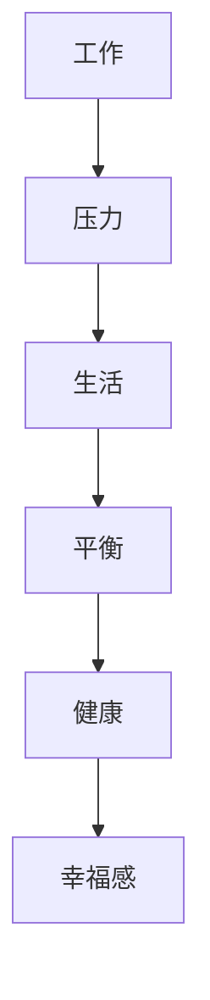

#### 1.1.1.2 日常琐事与注意力分散

**背景介绍：**
日常琐事往往占据了我们大量的时间，导致注意力分散。

**核心概念与联系：**
- 注意力分散：影响生活质量。
- 敏感度培养：提高注意力集中和质量。

**Mermaid流程图：**

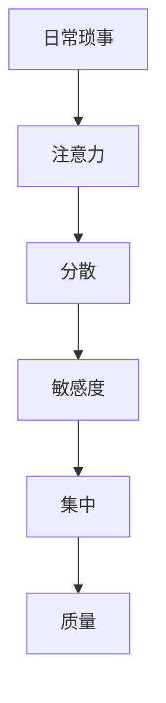

#### 1.1.1.3 对生活缺乏热情与动力

**背景介绍：**
缺乏生活热情和动力可能导致生活失去色彩。

**核心概念与联系：**
- 生活热情：对生活的热爱和积极性。
- 动力来源：寻找生活的动力，激发生活热情。

**Mermaid流程图：**


### 1.1.2 敏感度的重要性

#### 1.1.2.1 敏感度的定义与类型

**背景介绍：**
敏感度是指个体对周围环境和事物的感知能力。

**核心概念与联系：**
- 感知力：对事物的感知能力。
- 观察力：对事物的细致观察能力。
- 情感反应：对事物的情感反应能力。

**概念属性特征对比表格：**

| 特征         | 感知力 | 观察力 | 情感反应 |
| ------------ | ------ | ------ | -------- |
| 定义         | 感知事物 | 观察细节 | 表达情感 |
| 属性         | 感知强度 | 观察细致度 | 情感深度 |
| 关系         | 基础感知 | 建立在感知基础上的能力 | 感知和情感的结合 |

#### 1.1.2.2 敏感度对生活的影响

**背景介绍：**
敏感度对生活有着深远的影响。

**核心概念与联系：**
- 提高生活质量：敏感度有助于发现生活中的美好和灵感。
- 增强人际交往：敏感度使人更容易理解和与他人建立深层次的联系。
- 提升自我认知：敏感度有助于更好地认识自己，发掘潜能。

**Mermaid流程图：**

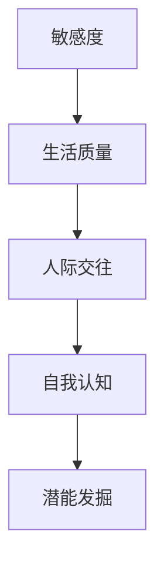

#### 1.1.2.3 培养敏感度的价值

**背景介绍：**
培养敏感度对个人成长和职业发展有着重要价值。

**核心概念与联系：**
- 提高个人魅力：敏感度使人更具吸引力。
- 增强创造力：敏感度有助于激发创意思维。
- 职业发展：敏感度是许多创意行业的重要特质。

**Mermaid流程图：**

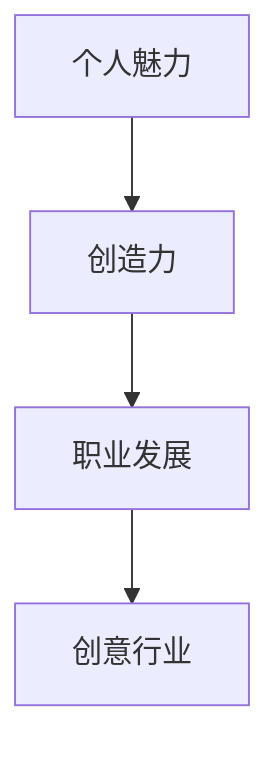

### 1.2 书籍目标与读者群体

#### 1.2.1 书籍目标

**背景介绍：**
本书旨在帮助读者培养对日常生活的敏感度，提升生活质量。

**核心概念与联系：**
- 培养敏感度：提升对生活的感知能力。
- 提升生活质量：通过发现生活中的美好，提升生活幸福感。

**Mermaid流程图：**

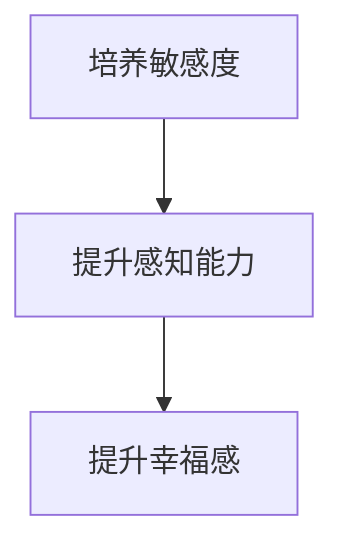

#### 1.2.2 适合读者

**背景介绍：**
本书适合希望提升生活质量的成年人，尤其是需要培养注意力和观察力的学生和职场人士。

**核心概念与联系：**
- 成年人：需要更多时间来培养敏感度。
- 学生和职场人士：通过培养敏感度，提升学习能力和工作效率。

**Mermaid流程图：**

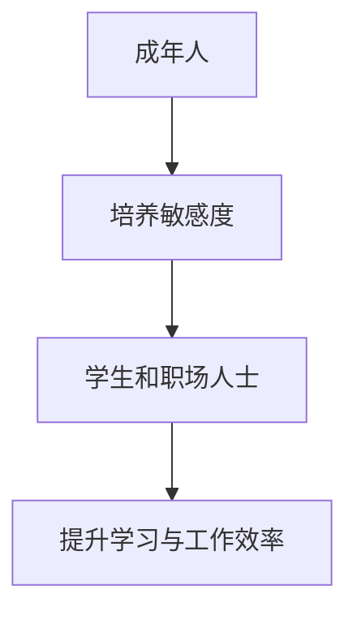

## 第二部分：培养生活敏感度的方法与实践

### 2.1 提高感知力的技巧

#### 2.1.1 细致观察

**背景介绍：**
细致观察是提高感知力的关键。

**核心概念与联系：**
- 观察细节：发现生活中的美好。
- 感知深度：提升对事物的理解。

**Mermaid流程图：**

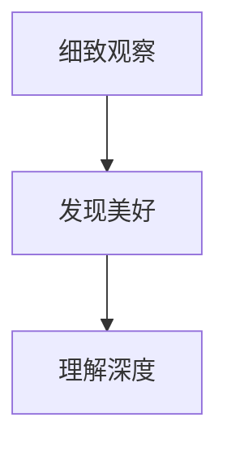

#### 2.1.2 感知环境

**背景介绍：**
感知环境可以帮助我们更好地适应生活。

**核心概念与联系：**
- 环境感知：适应环境变化。
- 生活适应：提升生活质量。

**Mermaid流程图：**

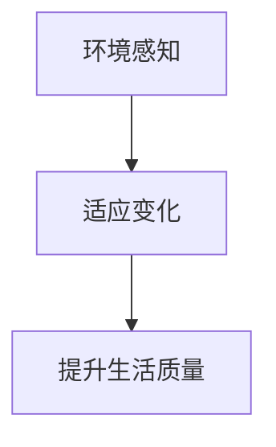

### 2.2 增强观察力的方法

#### 2.2.1 培养好奇心

**背景介绍：**
好奇心是增强观察力的动力。

**核心概念与联系：**
- 好奇心：激发对事物的兴趣。
- 观察力：通过好奇心的驱动，提升观察质量。

**Mermaid流程图：**

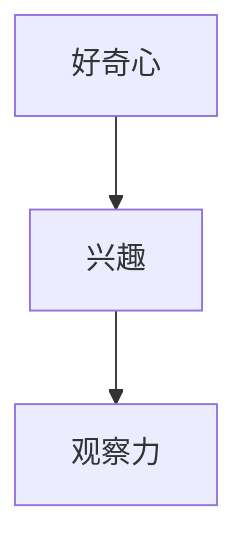

#### 2.2.2 练习专注力

**背景介绍：**
专注力是观察力的基础。

**核心概念与联系：**
- 专注力：集中注意力，提高观察效果。
- 观察力：通过专注力的培养，提升观察能力。

**Mermaid流程图：**

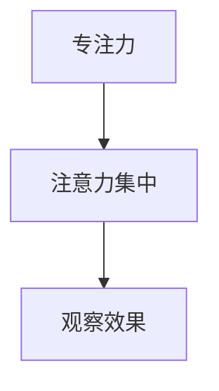

### 2.3 提高情感反应能力

#### 2.3.1 倾听他人的故事

**背景介绍：**
倾听他人的故事可以帮助我们更好地理解情感。

**核心概念与联系：**
- 倾听：理解他人情感。
- 情感反应：通过倾听，提升自己的情感反应能力。

**Mermaid流程图：**

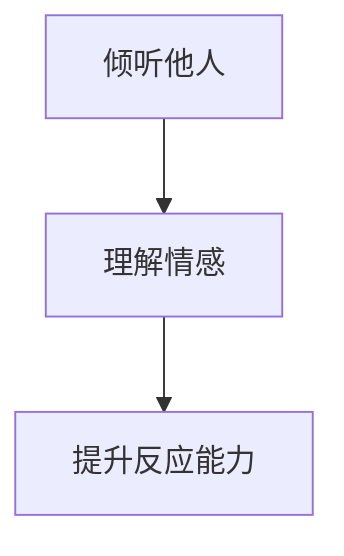

#### 2.3.2 表达自己的情感

**背景介绍：**
表达情感是情感反应能力的重要部分。

**核心概念与联系：**
- 情感表达：传达自己的情感。
- 反应能力：通过情感表达，提升情感反应能力。

**Mermaid流程图：**

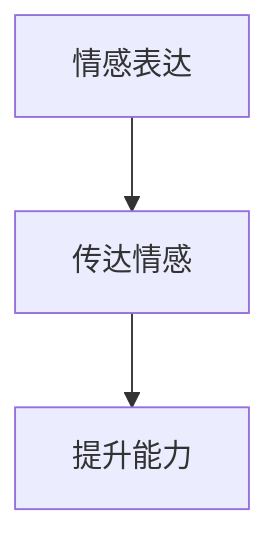

## 第三部分：实际应用与案例分析

### 3.1 生活实践案例

#### 3.1.1 从琐碎中发现美好

**背景介绍：**
通过培养敏感度，可以在琐碎的生活中发现美好。

**核心概念与联系：**
- 琐碎生活：生活中的细节。
- 敏感度：发现生活中的美好。

**Mermaid流程图：**

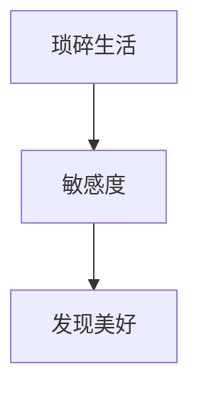

#### 3.1.2 从工作中寻找灵感

**背景介绍：**
工作中的点滴积累可以激发灵感。

**核心概念与联系：**
- 工作细节：工作中的小细节。
- 灵感来源：工作中的灵感。

**Mermaid流程图：**

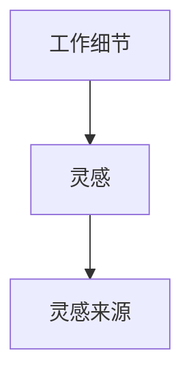

### 3.2 职场案例分析

#### 3.2.1 创意行业的敏感度应用

**背景介绍：**
创意行业需要高度的敏感度来捕捉灵感。

**核心概念与联系：**
- 创意行业：对敏感度的需求。
- 敏感度：创意思维的源泉。

**Mermaid流程图：**

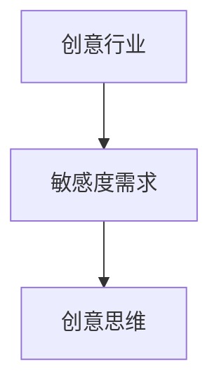

#### 3.2.2 职场沟通中的敏感度培养

**背景介绍：**
职场沟通中，敏感度有助于更好地理解他人，提升沟通效果。

**核心概念与联系：**
- 职场沟通：敏感度的重要性。
- 沟通效果：通过敏感度提升。

**Mermaid流程图：**

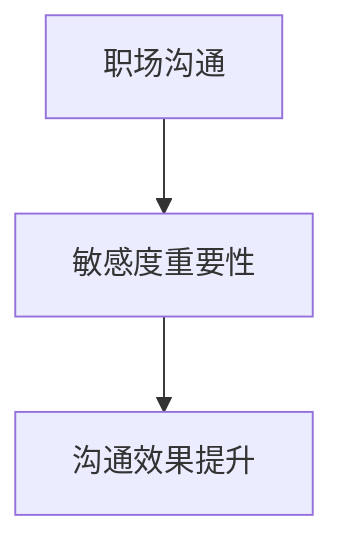

## 第四部分：总结与展望

### 4.1 总结

**核心内容回顾：**
- 培养生活敏感度的重要性。
- 提高感知力、观察力和情感反应能力的技巧。
- 实际应用与案例分析。

### 4.2 展望

**未来研究方向：**
- 生活敏感度与心理健康的关系。
- 敏感度在跨文化沟通中的应用。
- 敏感度在人工智能领域的应用。

## 附录

### 4.3 最佳实践 tips

**核心内容回顾：**
- 如何在日常中培养敏感度。
- 在职场中如何运用敏感度提升沟通效果。

### 4.4 小结

**核心内容回顾：**
- 文章的主要观点和收获。
- 对生活敏感度的理解和感悟。

### 4.5 注意事项

**核心内容回顾：**
- 培养敏感度过程中可能遇到的问题和挑战。
- 如何克服这些挑战。

### 4.6 拓展阅读

**核心内容回顾：**
- 相关书籍推荐。
- 学术文章推荐。

### 作者信息

**作者：**
AI天才研究院/AI Genius Institute & 禅与计算机程序设计艺术 /Zen And The Art of Computer Programming

---

通过上述结构化的内容组织，本文旨在帮助读者深入理解生活敏感度的重要性，并提供实用的培养方法。希望通过本文，读者能够发现日常生活中的extraordinary，提升个人幸福感。接下来，我们将进一步深入探讨每个部分的具体内容。让我们一步步思考，逐步解析如何培养生活敏感度。让我们一起开始吧！### 第一部分：引言

#### 1.1 问题背景与重要性

在快节奏的现代生活中，人们往往因为繁忙的工作、社交媒体的诱惑和信息的过度消费，而忽略了生活中的细节和美好。这种现象不仅导致了精神上的压力，还使人们在日常生活中失去了发现非凡之处的敏锐感。本文将探讨如何培养生活敏感度，帮助读者重新发现日常中的extraordinary。

**背景介绍：**
现代社会中，人们面临的工作和生活压力越来越大。加班、应酬、社交活动等占据了大量的时间和精力，使得人们无法静下心来体验生活中的点滴。此外，社交媒体的普及使得人们更容易被各种信息所干扰，从而忽视了身边真实发生的事情。这种状态使得人们难以对日常生活产生深刻的体验和感悟。

**核心概念术语说明：**
- **生活敏感度**：指个体对周围环境和事物的感知能力，包括感知力、观察力和情感反应。
- **注意力分散**：指个体在处理任务时无法集中精力，容易受到外界干扰。
- **感知力**：对事物的感知能力。
- **观察力**：对事物的细致观察能力。
- **情感反应**：对事物的情感反应能力。

**问题描述：**
现代社会中，人们往往因为忙碌的生活和工作的压力，而忽视了日常生活中的美好和困扰。这种状态导致了以下问题：
1. **注意力分散**：由于各种信息的干扰，人们难以集中精力，对日常生活中的小事视而不见。
2. **缺乏生活热情**：对日常生活缺乏热情，导致生活质量下降。
3. **无法发现生活中的美好**：忽视生活中的细微变化，难以体验到生活中的非凡之处。

**问题解决：**
为了解决上述问题，我们需要培养生活敏感度，提高对周围环境和事物的感知能力。具体方法包括：
1. **提高感知力**：通过细致观察和体验，发现生活中的美好。
2. **增强观察力**：培养好奇心，提高注意力集中，提升观察质量。
3. **提升情感反应能力**：倾听他人的故事，表达自己的情感，提升情感理解。

**边界与外延：**
- **边界**：生活敏感度主要关注日常生活中的人际交往、情感体验和环境感知。
- **外延**：生活敏感度不仅局限于日常生活中的事物，还可以扩展到职业发展、心理健康等方面。

**概念结构与核心要素组成：**
- **感知力**：包括对视觉、听觉、嗅觉、味觉、触觉的感知能力。
- **观察力**：包括对事物的观察、分析、理解和记忆能力。
- **情感反应**：包括对情感的理解、表达和回应能力。

通过上述分析，我们可以看到培养生活敏感度的重要性。它不仅有助于提高生活质量，还能增强人际交往和自我认知。接下来，本文将详细探讨如何通过具体的方法和实践，培养生活敏感度。

---

### 1.1.1 日常生活中的挑战

**背景介绍：**
在忙碌的现代社会，人们面临着诸多日常生活的挑战，这些挑战不仅影响了生活质量，还削弱了人们对生活的敏感度。以下是几个常见的挑战：

1. **工作压力**：现代职场中，工作强度大、工作时间长，许多人不得不加班，导致身心疲惫。长期的过度劳累使得人们难以在日常生活中找到乐趣和放松，从而忽视了生活中的美好。

2. **社交媒体干扰**：社交媒体的普及让人们的注意力被分散。频繁地刷手机、查看消息和参与社交活动，使得人们难以集中精力体验现实生活中的事物，从而减少了与家人、朋友之间的真实互动。

3. **信息过载**：互联网时代，信息量庞大，人们常常感到信息过载。面对海量的信息，人们往往无从选择，导致注意力分散，无法深入思考和理解。

4. **生活琐事**：日常生活中，琐事繁多，如家务、购物、交通等，这些琐事常常让人感到疲惫和无趣。如果处理不当，琐事会成为生活中的负担，进一步削弱人们对生活的敏感度。

**核心概念与联系：**
- **工作压力**：工作压力是现代生活的主要挑战之一，它会影响人们的身心健康，导致对生活的敏感度下降。
- **社交媒体干扰**：社交媒体虽然丰富了人们的社交方式，但过度依赖可能导致人际关系的疏远和对现实生活的忽视。
- **信息过载**：信息过载使得人们无法有效地处理信息，从而影响对生活中细节的关注。
- **生活琐事**：琐碎的生活事务会消耗人们的精力和时间，使人难以投入精力去发现生活中的美好。

**ER实体关系图架构的Mermaid流程图：**

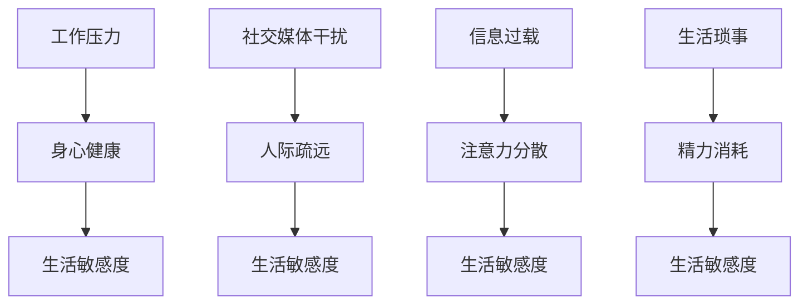

通过上述分析，我们可以看到日常生活中的这些挑战如何影响人们对生活的敏感度。为了克服这些挑战，我们需要采取有效的策略和方法来提升生活敏感度，使自己在快节奏的生活中仍能发现日常中的extraordinary。

#### 1.1.1.1 工作压力与生活平衡

**背景介绍：**
在现代职场中，工作压力是一个普遍存在的问题。过度的压力不仅会影响员工的身心健康，还会影响他们的生活质量。如何在工作与生活之间找到平衡，成为一个关键的问题。

**核心概念与联系：**
- **工作压力**：工作压力是指个体在工作过程中所感受到的紧张和压迫感，它可能会导致焦虑、疲劳和身体不适。
- **生活平衡**：生活平衡是指个体在工作和生活之间找到一个合适的比例，使得身心健康和幸福感达到最佳状态。
- **生活敏感度**：生活敏感度是指个体对生活中细节的感知能力，包括感知力、观察力和情感反应。

**概念属性特征对比表格：**

| 特征         | 工作压力 | 生活平衡 | 生活敏感度 |
| ------------ | -------- | -------- | ---------- |
| 影响因素     | 工作量、工作难度、时间紧迫感 | 工作时间、生活质量、身心健康 | 工作与生活的关系、感知力、观察力、情感反应 |
| 结果         | 焦虑、疲劳、身体不适 | 心情愉悦、精力充沛、工作效能提升 | 对生活的细致感知、发现生活中的美好、提升幸福感 |

**Mermaid流程图：**

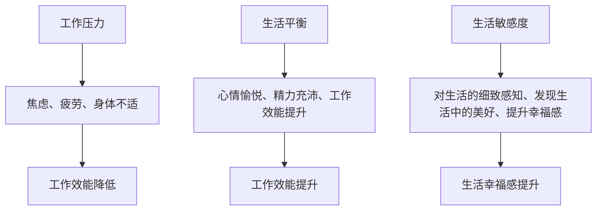

**详细讲解：**
1. **工作压力的影响**：工作压力过大可能会导致员工产生焦虑、疲劳和身体不适，这些负面情绪会影响工作效率和生活质量。

2. **生活平衡的作用**：通过调整工作时间，提高生活质量，可以缓解工作压力，使员工在工作和生活之间找到平衡。生活平衡有助于提高员工的幸福感和工作效能。

3. **生活敏感度的培养**：培养生活敏感度可以提升员工对生活的细致感知，发现生活中的美好，从而提高生活质量和幸福感。这种敏感性有助于员工更好地应对工作压力，提高工作效能。

**举例说明：**
假设一个职场人士，他每天面对大量的工作，经常加班到深夜。长期的工作压力导致他感到焦虑和疲劳，对生活失去了热情。为了改善这种情况，他决定调整工作与生活的比例，每天保证充足的休息时间，并尝试培养对生活的敏感度。

通过调整工作时间，他开始注重锻炼和社交活动，从而缓解了工作压力。同时，他开始关注身边的细节，例如观察花草的变化、品味美食的味道等。这些小小的改变让他重新发现生活中的美好，提升了生活敏感度。随着生活敏感度的提升，他对工作的态度也变得更加积极，工作效率和质量得到了显著提高。

**总结：**
通过上述分析，我们可以看到工作压力与生活平衡之间的关系，以及如何通过培养生活敏感度来改善这种关系。工作压力是现代职场人士面临的常见问题，但通过调整工作和生活的比例，以及培养对生活的敏感度，我们可以找到更好的平衡点，提升生活质量和幸福感。

#### 1.1.1.2 日常琐事与注意力分散

**背景介绍：**
在日常生活中，琐事繁多，如家务、购物、交通等，这些琐事常常让人感到疲惫和无趣。如果处理不当，琐事会成为生活中的负担，进一步削弱人们对生活的敏感度。与此同时，注意力分散也是一个普遍存在的问题，尤其是在现代社会中，各种信息来源的泛滥使得人们很难集中精力处理琐事，这进一步影响了生活的质量。

**核心概念与联系：**
- **日常琐事**：指日常生活中需要处理的琐碎事务，如打扫卫生、购物、做饭等。
- **注意力分散**：指个体在处理任务时无法集中精力，容易受到外界干扰。
- **生活敏感度**：指个体对生活中细节的感知能力，包括感知力、观察力和情感反应。

**概念属性特征对比表格：**

| 特征         | 日常琐事 | 注意力分散 | 生活敏感度 |
| ------------ | -------- | ---------- | ---------- |
| 影响因素     | 家务、购物、交通等琐事 | 信息过载、多任务处理 | 工作压力、时间紧迫感 |
| 结果         | 疲惫、焦虑、效率低下 | 精力消耗、决策困难 | 对生活的细致感知、发现生活中的美好、提升幸福感 |
| 交互关系     | 琐事处理会影响注意力分散 | 注意力分散会削弱生活敏感度 | 生活敏感度提升有助于处理琐事，减少注意力分散 |

**Mermaid流程图：**

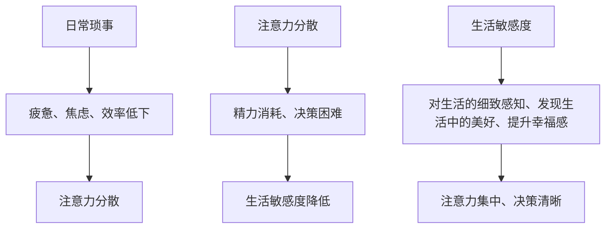

**详细讲解：**
1. **日常琐事的影响**：日常琐事繁杂且琐碎，容易让人感到疲惫和无趣。如果处理不当，琐事会占据大量的时间和精力，导致人们对生活失去兴趣，降低生活质量。

2. **注意力分散的影响**：在现代社会，人们面临的信息量巨大，多任务处理和信息过载导致注意力分散。在处理琐事时，注意力分散会降低处理效率，增加决策困难，进一步影响生活质量。

3. **生活敏感度的提升**：通过培养生活敏感度，个体可以更好地感知生活中的细节，发现生活中的美好。这种敏感性有助于提高注意力集中，减少琐事处理过程中的精力消耗，从而提升生活质量。

**举例说明：**
例如，一个忙碌的上班族，他每天要处理许多琐碎的家务和购物任务。由于工作繁忙，他常常感到疲惫，注意力也容易分散。这导致他在处理琐事时效率低下，甚至有时会忘记完成的任务。

为了改善这种情况，他开始尝试培养对生活的敏感度。他开始注意周围的环境，观察物品的摆放，品味美食的味道，享受家务的乐趣。这些小小的改变让他重新发现生活中的美好，提升了生活敏感度。随着生活敏感度的提升，他的注意力更加集中，处理琐事的效率也大大提高，生活质量也随之提升。

**总结：**
通过上述分析，我们可以看到日常琐事与注意力分散对生活质量的影响，以及如何通过培养生活敏感度来改善这种状况。日常琐事和注意力分散是现代生活中普遍存在的问题，但通过培养对生活的敏感度，我们可以提高注意力集中，减少琐事处理的压力，从而提升生活质量。

#### 1.1.1.3 对生活缺乏热情与动力

**背景介绍：**
在现代社会的快节奏生活中，许多人感到对生活缺乏热情和动力。这种现象不仅影响了生活质量，还可能导致心理问题，如抑郁症、焦虑症等。因此，理解生活热情和动力的来源，并找到提升这些因素的方法，对于提升生活敏感度至关重要。

**核心概念与联系：**
- **生活热情**：指个体对生活的热爱和积极性。
- **动力**：指促使个体采取行动的内在驱动力。
- **生活敏感度**：指个体对生活中细节的感知能力。

**概念属性特征对比表格：**

| 特征         | 生活热情 | 动力 | 生活敏感度 |
| ------------ | -------- | ---- | ---------- |
| 影响因素     | 社会支持、个人成就感、生活目标 | 内在驱动力、外部奖励、挑战性任务 | 环境感知、情感体验、认知能力 |
| 结果         | 生活满意度、幸福感、积极态度 | 高效完成任务、持续努力、追求进步 | 对生活中的细节有深刻的体验和感悟 |

**Mermaid流程图：**

```mermaid
graph TD
A[生活热情] --> B[生活满意度、幸福感、积极态度]
C[动力] --> D[高效完成任务、持续努力、追求进步]
E[生活敏感度] --> F[对生活中的细节有深刻的体验和感悟]
B --> G[生活敏感度提升]
D --> H[生活敏感度提升]
F --> I[生活热情和动力相互促进]
```

**详细讲解：**
1. **生活热情的影响**：生活热情是指个体对生活的热爱和积极性。当人们充满热情时，他们更容易感受到生活的美好，体验到生活中的喜悦。生活热情有助于提升生活质量，使个体更加乐观和积极。

2. **动力的来源**：动力是促使个体采取行动的内在驱动力。它来源于内在的兴趣、好奇心和自我成就感。外部奖励和挑战性任务也可以激发动力。当个体感到有动力时，他们会更加投入和努力，从而提升生活敏感度。

3. **生活敏感度的提升**：生活敏感度是指个体对生活中细节的感知能力。当个体能够敏锐地感知生活中的美好和挑战时，他们更容易产生生活热情和动力。这种敏感性有助于个体更好地理解生活，提升生活满意度。

**举例说明：**
例如，一个对工作感到枯燥乏味的职场人士，他常常感到对生活缺乏热情和动力。为了改善这种情况，他开始尝试培养对生活的敏感度。他开始关注周围的环境，观察同事的行为，品味美食的味道。这些小小的改变让他重新发现生活中的美好，提升了生活敏感度。随着生活敏感度的提升，他对工作的态度也变得更加积极，工作效率和质量得到了显著提高。他开始从工作中找到乐趣，从而增强了生活热情和动力。

**总结：**
通过上述分析，我们可以看到对生活缺乏热情和动力的问题，以及如何通过培养生活敏感度来提升这些因素。对生活缺乏热情和动力是一个普遍存在的问题，但通过培养对生活的敏感度，我们可以重新发现生活中的美好，提升生活质量和幸福感。同时，生活热情和动力也是相互促进的，当个体感受到生活的美好和挑战时，他们会更加积极和有动力地投入生活。

### 1.1.2 敏感度的重要性

#### 1.1.2.1 敏感度的定义与类型

**背景介绍：**
敏感度是指个体对周围环境和事物的感知能力，它是一个多维度、多层次的概念。在不同的情境下，敏感度可以表现为不同的类型和形式。了解敏感度的定义和类型，有助于我们更好地理解其重要性。

**核心概念与联系：**
- **敏感度**：指个体对周围环境和事物的感知能力。
- **感知力**：指对事物的感知能力。
- **观察力**：指对事物的细致观察能力。
- **情感反应**：指对事物的情感反应能力。

**定义：**
敏感度（Sensitivity）是指个体在感知、观察和情感反应方面表现出的一种特殊能力。它不仅仅是对感官刺激的响应，更是一种对环境中细微变化和潜在信息的敏锐捕捉。

**类型：**
1. **感知力敏感度**：指个体对感官刺激的敏锐程度，包括视觉、听觉、嗅觉、味觉和触觉。例如，一个具有高度视觉敏感度的人能够捕捉到微小的颜色变化或图像细节。

2. **观察力敏感度**：指个体在观察和注意细节方面的能力。这种敏感度涉及到对事物特征、模式和相关性的识别。例如，一个具有高度观察力敏感度的人能够在复杂的环境中迅速找到关键信息。

3. **情感反应敏感度**：指个体在情感体验和情感表达方面的能力。这种敏感度涉及到对他人情感的理解和自己的情感反应。例如，一个具有高度情感反应敏感度的人能够准确地感知他人的情绪并做出适当的反应。

**概念属性特征对比表格：**

| 特征         | 感知力敏感度 | 观察力敏感度 | 情感反应敏感度 |
| ------------ | ------------ | ------------ | ------------ |
| 定义         | 对感官刺激的敏锐感知 | 对细节的注意和观察 | 对情感体验的敏锐反应 |
| 影响因素     | 感官灵敏度、神经传递效率 | 经验、认知能力、注意力 | 情感智商、心理弹性、社会经验 |
| 结果         | 提高对环境的适应能力 | 提升认知深度和广度 | 增强人际关系和自我理解 |

**Mermaid流程图：**

```mermaid
graph TD
A[感知力敏感度] --> B[对感官刺激的敏锐感知]
C[观察力敏感度] --> D[对细节的注意和观察]
E[情感反应敏感度] --> F[对情感体验的敏锐反应]
```

**详细讲解：**
1. **感知力敏感度**：感知力敏感度是所有敏感度类型的基础。它涉及个体对视觉、听觉、嗅觉、味觉和触觉的敏锐感知。这种敏感度有助于个体更好地适应环境，发现环境中的变化和机会。例如，在艺术创作中，感知力敏感度可以帮助艺术家捕捉到色彩和形状的细微变化，从而创作出更具感染力的作品。

2. **观察力敏感度**：观察力敏感度是指个体在观察和注意细节方面的能力。这种敏感度依赖于个体的经验、认知能力和注意力。高度观察力敏感度的人能够在复杂的环境中迅速捕捉到关键信息，这有助于他们在决策和解决问题时更加准确和高效。例如，在科学研究领域，观察力敏感度可以帮助科学家发现实验中的微小差异，从而推动科学进步。

3. **情感反应敏感度**：情感反应敏感度涉及到个体在情感体验和表达方面的能力。这种敏感度不仅有助于个体理解和体验自己的情感，还能够帮助他们更好地理解和回应他人的情感。情感反应敏感度对于建立和维护良好的人际关系至关重要。例如，在心理咨询领域，情感反应敏感度可以帮助心理咨询师更准确地理解来访者的情感状态，从而提供更有针对性的帮助。

**举例说明：**
例如，一个具有高度感知力敏感度的人可能在日常生活中能够捕捉到细微的温度变化，从而更容易适应不同的气候条件。一个具有高度观察力敏感度的人可能在购物时能够迅速发现商品的瑕疵，从而做出更明智的购买决策。一个具有高度情感反应敏感度的人可能在社交场合中能够敏锐地感知他人的情绪变化，从而更好地调整自己的行为，以建立和谐的人际关系。

**总结：**
通过上述分析，我们可以看到敏感度的定义和类型，以及它们在不同情境下的重要性。感知力敏感度、观察力敏感度和情感反应敏感度分别代表了个体在感知、观察和情感反应方面的特殊能力。这些能力不仅有助于个体更好地适应环境，提高生活质量，还能在职业发展和人际交往中发挥重要作用。

#### 1.1.2.2 敏感度对生活的影响

**背景介绍：**
敏感度不仅仅是一个心理学概念，它在日常生活中也扮演着至关重要的角色。通过培养敏感度，个体可以更加深刻地体验生活，提升生活质量。在这一部分，我们将探讨敏感度对生活的具体影响。

**核心概念与联系：**
- **生活质量**：指个体在生活各方面的满意程度，包括健康、工作、家庭、社会关系等。
- **幸福指数**：指个体在生活中的整体幸福感。
- **敏感度**：指个体对周围环境和事物的感知能力。

**影响：**
1. **提升生活质量**：敏感度有助于个体更加细致地体验生活，发现日常中的美好和细节。这种体验可以增强个体的幸福感，提升生活质量。例如，一个具有高度敏感度的人可能会注意到自然的光影变化，感受到音乐的细微旋律，从而在日常生活中获得更多的乐趣和满足感。

2. **增强人际交往**：敏感度使个体更善于理解他人的情感和需求，从而在人际交往中更加得体和有效。这有助于建立深厚的人际关系，增强社会支持系统。例如，一个敏感度较高的人可能会在朋友需要帮助时及时提供支持，或者在同事感到疲惫时给予安慰，从而增进彼此的感情。

3. **促进心理健康**：敏感度有助于个体更好地应对生活中的压力和挑战。通过敏感度，个体可以更快地察觉到自己的情绪变化，从而采取积极的措施进行调整。例如，一个敏感度较高的人可能会在感到焦虑时及时寻求放松方法，或者在情绪低落时找到积极的方式来提升心情。

**Mermaid流程图：**

```mermaid
graph TD
A[敏感度] --> B[提升生活质量]
B --> C[增强人际交往]
C --> D[促进心理健康]
```

**详细讲解：**
1. **提升生活质量**：敏感度使个体能够更加细致地体验生活的各个方面。这种细致的体验不仅包括对感官刺激的感知，还涉及到对情感和环境的深刻理解。例如，一个敏感度较高的人在品尝美食时，能够感受到食材的新鲜度和烹饪技巧的精湛，从而获得更丰富的味觉体验。

2. **增强人际交往**：敏感度使个体更善于理解和回应他人的情感和需求。这种能力在人际交往中尤为重要。例如，一个敏感度较高的人可能会在朋友需要安慰时及时表达关心，或者在同事遇到困难时提供帮助，从而建立更加和谐的人际关系。

3. **促进心理健康**：敏感度有助于个体更好地管理自己的情绪和压力。通过敏感度，个体可以更快地察觉到自己的情绪变化，从而采取积极的措施进行调整。例如，一个敏感度较高的人在感到焦虑时，可能会通过深呼吸、散步等方式来放松心情，从而缓解焦虑。

**举例说明：**
例如，一个敏感度较高的人可能会在旅游时注意到当地文化的独特之处，通过与当地居民的交流来深入了解当地的生活方式和价值观。这种深刻的体验不仅丰富了旅游经历，还提升了生活质量。在工作场合，一个敏感度较高的人可能会在团队协作中更好地理解同事的需求，从而提高工作效率和团队凝聚力。

**总结：**
通过上述分析，我们可以看到敏感度对生活的积极影响。敏感度不仅能够提升生活质量，增强人际交往，还能促进心理健康。因此，培养和提高敏感度对于个体的发展和生活质量具有重要意义。

#### 1.1.2.3 培养敏感度的价值

**背景介绍：**
敏感度不仅对个体的日常生活有重要影响，还在职业发展、个人魅力和创造力等方面有着深远的价值。在这一部分，我们将探讨培养敏感度的多方面价值。

**核心概念与联系：**
- **个人魅力**：指个体在社交场合中吸引他人的能力。
- **创造力**：指个体产生新颖且有价值的想法或解决方案的能力。
- **职业发展**：指个体在职业生涯中取得成功和进步的过程。

**价值：**
1. **提升个人魅力**：敏感度使个体更加细腻地感知他人情感，从而在社交场合中表现出更高的情商。这种情商有助于建立和谐的人际关系，提升个人魅力。例如，一个敏感度较高的人在社交活动中能够迅速捕捉到他人的情绪变化，并作出适当的回应，从而赢得他人的好感和尊重。

2. **增强创造力**：敏感度有助于个体捕捉到生活中的细微变化和潜在灵感。这种能力在艺术创作、科学研究等领域尤为重要。例如，一个敏感度较高的人可能会在自然景观中发现独特的构图，或者在日常生活中捕捉到某个有趣的场景，从而激发创作灵感。

3. **促进职业发展**：敏感度使个体更善于理解客户需求和市场变化，从而在职业领域中更具竞争力。例如，一个敏感度较高的人在销售工作中能够敏锐地察觉到客户的需求和偏好，从而提供更符合客户期望的产品或服务。

**Mermaid流程图：**

```mermaid
graph TD
A[个人魅力] --> B[提升情商]
B --> C[建立人际关系]
D[创造力] --> E[捕捉灵感]
E --> F[艺术创作、科学研究]
G[职业发展] --> H[理解客户需求]
H --> I[市场竞争力]
```

**详细讲解：**
1. **提升个人魅力**：敏感度使个体在人际交往中更具亲和力。这种亲和力不仅有助于建立深厚的友谊，还能在职场中赢得更多的机会。例如，一个敏感度较高的人在与同事或客户交流时，能够更好地理解对方的需求和情感，从而提供更有针对性的帮助和建议。

2. **增强创造力**：敏感度有助于个体在创作过程中捕捉到更多的细节和灵感。这种能力在艺术创作和科学研究中尤为重要。例如，一个敏感度较高的人可能会在绘画时注意到色彩和光影的微妙变化，或者在实验中捕捉到微小的异常现象，从而创造出新颖的作品或解决方案。

3. **促进职业发展**：敏感度使个体在职业领域中更具竞争力。通过敏感度，个体可以更准确地理解客户需求和市场趋势，从而在竞争中脱颖而出。例如，一个敏感度较高的人在市场营销中能够更好地分析客户数据，制定出更有效的营销策略，从而提高销售额。

**举例说明：**
例如，一个敏感度较高的人可能在创业过程中能够敏锐地察觉到市场的潜在机会，并迅速调整自己的商业策略。这种敏锐的洞察力不仅帮助他抓住了市场的先机，还使他的公司迅速发展壮大。在艺术领域，一个敏感度较高的人可能会在创作音乐或绘画时，通过细腻的感知力捕捉到独特的情感和意境，从而创作出令人感动的作品。

**总结：**
通过上述分析，我们可以看到培养敏感度在个人魅力、创造力和职业发展中的价值。敏感度不仅有助于提升生活质量，还能在多个领域发挥重要作用，为个体的成长和成功提供支持。

### 1.2 书籍目标与读者群体

#### 1.2.1 书籍目标

**背景介绍：**
本书旨在帮助读者培养对日常生活的敏感度，发现生活中的非凡之处，从而提升个人幸福感和生活质量。通过系统的理论讲解和实践指导，本书旨在为读者提供一套完整的培养敏感度的方法和技巧。

**核心概念与联系：**
- **培养敏感度**：指通过一系列的方法和技巧，提高个体对周围环境和事物的感知能力。
- **提升幸福感**：指通过敏感度的提升，使个体在日常生活中获得更多的快乐和满足感。
- **生活质量**：指个体在生活各方面的满意程度，包括健康、工作、家庭、社会关系等。

**具体目标：**
1. **提高感知能力**：通过系统的理论和实践指导，帮助读者提高对日常生活中细节的感知能力，从而发现生活中的美好和非凡之处。
2. **培养观察力**：通过练习和指导，提升读者在观察和注意细节方面的能力，使他们能够更全面地了解和体验生活。
3. **增强情感反应能力**：通过情感体验和情感表达的培养，使读者能够更好地理解和回应他人的情感，建立更加深厚的人际关系。

**Mermaid流程图：**

```mermaid
graph TD
A[提高感知能力] --> B[发现生活中的美好]
B --> C[提升幸福感]
D[培养观察力] --> E[全面了解生活]
E --> F[增强人际交往]
G[增强情感反应能力] --> H[建立深厚人际关系]
H --> I[提升生活质量]
```

**详细讲解：**
1. **提高感知能力**：本书通过介绍敏感度的概念、类型和重要性，帮助读者理解敏感度对生活的影响。随后，通过具体的实践指导，如观察练习、情感体验等，帮助读者逐步提高对日常生活中细节的感知能力。
2. **培养观察力**：本书提供了一系列观察练习，如观察自然景观、观察他人行为等，帮助读者在日常生活中培养观察力和注意力。这些练习不仅能够提升读者的观察力，还能增强他们对生活的兴趣和热情。
3. **增强情感反应能力**：本书通过情感体验和情感表达的讲解，帮助读者理解情感反应的机制，并提供情感训练的方法。通过这些训练，读者可以更好地理解和回应他人的情感，从而提升人际交往的质量。

**举例说明：**
例如，一个读者在阅读本书后，开始注意观察身边的细节，如花朵的颜色、云的形状等。这种观察力的培养使他更加细致地体验生活中的美好，提升了他的幸福感。同时，他开始更加关注他人的情感变化，并在适当的时候给予支持和安慰，从而增强了与他人的关系。

**总结：**
通过上述分析，我们可以看到本书的目标是帮助读者培养对日常生活的敏感度，从而提升个人幸福感和生活质量。通过系统的理论讲解和实践指导，本书旨在为读者提供一套完整的培养敏感度的方法和技巧，使他们能够在日常生活中发现更多美好，提升生活质量。

#### 1.2.2 适合读者

**背景介绍：**
本书适合所有希望提升生活质量和幸福感的成年人，特别是那些需要培养注意力和观察力的学生和职场人士。通过本书的指导，不同类型的读者都能在日常生活中受益。

**核心概念与联系：**
- **成年人**：指已经完成学业并进入社会的成年人。
- **学生**：指正在接受学校教育的学生。
- **职场人士**：指已经进入职场并从事工作的成年人。

**适合人群：**
1. **希望提升生活质量的成年人**：这类读者希望通过培养敏感度来改善自己的生活，发现日常中的美好，从而提升生活质量。
2. **需要培养注意力和观察力的学生**：这类读者包括中小学学生、大学生和研究生。他们希望通过培养敏感度来提高学习效果，增强对知识的理解和应用能力。
3. **职场人士**：这类读者包括公司职员、企业家和其他职业人士。他们希望通过培养敏感度来提高工作效率，增强人际交往能力，提升职业发展。

**具体案例：**
1. **家长**：一个忙碌的家长可以通过本书的指导，在日常生活中培养对家庭生活的敏感度，更好地关注孩子的成长，提升亲子关系。
2. **学生**：一个高三学生在备考期间，可以通过本书的观察练习来缓解压力，提高学习效率，同时培养对生活的兴趣。
3. **职场人士**：一个销售经理可以通过本书的情感反应训练，提高与客户的沟通效果，增强销售业绩。

**Mermaid流程图：**

```mermaid
graph TD
A[希望提升生活质量的成年人] --> B[改善生活质量]
C[需要培养注意力和观察力的学生] --> D[提高学习效率]
E[职场人士] --> F[提高工作效率]
```

**详细讲解：**
1. **希望提升生活质量的成年人**：成年人面临的生活压力较大，通过培养敏感度，他们可以更好地调节情绪，发现生活中的美好，从而提升生活质量。
2. **需要培养注意力和观察力的学生**：学生时期是培养注意力和观察力的重要阶段。通过本书的指导，学生可以更好地专注于学习，提高学习效率。
3. **职场人士**：职场人士在日常工作中需要处理大量的信息和任务，通过培养敏感度，他们可以更有效地沟通和协作，提高工作效率。

**举例说明：**
例如，一个家长通过本书的指导，学会了如何在忙碌的工作中关注孩子的成长，通过与孩子互动来培养亲子关系。一个高三学生通过本书的观察练习，在备考期间缓解了压力，提高了学习效率。一个销售经理通过本书的情感反应训练，在与客户的沟通中更加得体和有效，从而提高了销售业绩。

**总结：**
通过上述分析，我们可以看到本书适合不同类型的读者，他们在提升生活质量、学习效率和职场发展等方面都能通过本书的指导受益。因此，无论你是希望提升生活质量的成年人，还是需要培养注意力和观察力的学生，亦或是职场人士，本书都将是你的理想选择。

### 第一部分：引言

#### 1.2 书籍目标与读者群体

**背景介绍：**
本书旨在帮助读者培养对日常生活的敏感度，提升生活质量。通过系统的理论讲解和实践指导，本书旨在为读者提供一套完整的培养敏感度的方法和技巧。

**核心概念与联系：**
- **书籍目标**：帮助读者发现日常中的非凡之处，提升生活质量。
- **读者群体**：成年人、学生和职场人士。

**具体目标：**
1. **提升感知能力**：通过理论讲解和实践指导，帮助读者提高对日常生活中细节的感知能力，发现生活中的美好。
2. **培养观察力**：提供观察练习，提升读者在观察和注意细节方面的能力。
3. **增强情感反应能力**：通过情感体验和情感表达的培养，使读者更好地理解和回应他人的情感。

**适合人群：**
- **希望提升生活质量的成年人**：通过本书，读者可以在忙碌的生活中找到美好，提升生活质量。
- **需要培养注意力和观察力的学生**：学生可以通过本书的指导，提高学习效率，增强对知识的理解和应用能力。
- **职场人士**：职场人士可以通过本书的指导，提高工作效率，增强人际交往能力。

### 第一部分：引言

#### 1.3 书籍结构安排

**背景介绍：**
为了帮助读者系统性地培养生活敏感度，本书分为三个部分，分别从理论讲解、实践指导和应用案例分析三个方面展开。

**核心概念与联系：**
- **第一部分：引言**：介绍书籍的目标、重要性及适合读者群体。
- **第二部分：培养敏感度的方法与实践**：详细讲解培养敏感度的具体方法和实践技巧。
- **第三部分：实际应用与案例分析**：通过具体案例展示培养敏感度在实际生活中的应用。

**具体安排：**
1. **第一部分：引言**：
   - 1.1 问题背景与重要性
   - 1.2 书籍目标与读者群体
   - 1.3 书籍结构安排

2. **第二部分：培养敏感度的方法与实践**：
   - 2.1 提高感知力的技巧
   - 2.2 增强观察力的方法
   - 2.3 提高情感反应能力

3. **第三部分：实际应用与案例分析**：
   - 3.1 生活实践案例
   - 3.2 职场案例分析
   - 3.3 总结与展望

**详细安排：**
1. **第一部分：引言**：
   - 1.1 日常生活中的挑战
     - 1.1.1 工作压力与生活平衡
     - 1.1.2 日常琐事与注意力分散
     - 1.1.3 对生活缺乏热情与动力
   - 1.2 敏感度的重要性
     - 1.2.1 敏感度的定义与类型
     - 1.2.2 敏感度对生活的影响
     - 1.2.3 培养敏感度的价值

2. **第二部分：培养敏感度的方法与实践**：
   - 2.1 提高感知力的技巧
     - 2.1.1 细致观察
     - 2.1.2 感知环境
   - 2.2 增强观察力的方法
     - 2.2.1 培养好奇心
     - 2.2.2 练习专注力
   - 2.3 提高情感反应能力
     - 2.3.1 倾听他人的故事
     - 2.3.2 表达自己的情感

3. **第三部分：实际应用与案例分析**：
   - 3.1 生活实践案例
     - 3.1.1 从琐碎中发现美好
     - 3.1.2 从工作中寻找灵感
   - 3.2 职场案例分析
     - 3.2.1 创意行业的敏感度应用
     - 3.2.2 职场沟通中的敏感度培养
   - 3.3 总结与展望

通过上述结构安排，本书旨在帮助读者系统地培养生活敏感度，提升生活质量。让我们接下来一起探索如何具体实践这些方法和技巧，发现日常中的extraordinary。

### 第二部分：培养生活敏感度的方法与实践

#### 2.1 提高感知力的技巧

感知力是培养生活敏感度的基石，它涉及个体对周围环境的感知能力。通过提高感知力，个体可以更加细致地体验生活中的细节，发现那些被忽视的美好。以下是一些提高感知力的实用技巧。

#### 2.1.1 细致观察

细致观察是一种通过仔细观察事物细节来提升感知力的方法。这种方法不仅可以帮助我们更好地理解周围的世界，还能让我们在日常生活中发现更多的美好。

**背景介绍：**
细致观察要求我们在观察时不仅仅是看到事物的表面，而是要深入挖掘事物的内在特质和细节。这种方法可以培养我们对生活中细微变化的敏感性。

**核心概念与联系：**
- **观察**：指通过视觉、听觉、嗅觉、味觉和触觉来感知周围环境。
- **细节**：指事物中微小而重要的部分。
- **感知力**：指个体对周围环境的敏锐感知能力。

**方法步骤：**
1. **选择观察对象**：在日常生活中，我们可以选择一些简单的观察对象，如花朵、云彩、雨水等。这些对象可以让我们在不同的季节和天气条件下进行观察。
2. **专注观察**：在观察时，尝试将注意力集中在观察对象上，避免分心。可以通过闭上眼睛，用心感受对象的存在和变化，来提升观察的专注度。
3. **记录观察结果**：观察后，记录下你的观察结果，无论是文字描述还是绘画，都能帮助你更好地理解和记忆观察到的细节。

**举例说明：**
例如，在观察一朵花时，我们可以注意它的颜色、形状、花瓣的纹理，甚至可以闻一闻它的香气。通过这样的细致观察，我们不仅可以欣赏到花的美丽，还能发现它在不同光线下的微妙变化。

**总结：**
细致观察是一种提升感知力的有效方法。通过这种方法，我们可以在日常生活中发现更多的美好，提升对生活的敏感度。

#### 2.1.2 感知环境

感知环境是一种通过观察和体验周围环境来提高感知力的方法。这种方法可以帮助我们更好地适应环境，发现环境中的细微变化。

**背景介绍：**
感知环境要求我们在日常生活中保持警觉，注意周围的环境变化。通过感知环境，我们可以更好地理解周围的世界，提高对生活的敏感度。

**核心概念与联系：**
- **环境**：指个体所处的周围空间。
- **感知**：指通过感官来体验和理解环境。
- **敏感度**：指个体对环境中细节的感知能力。

**方法步骤：**
1. **注意环境变化**：在日常生活中，我们可以注意环境中的变化，如天气、光线、声音等。这些变化可以让我们更加敏锐地感知周围的环境。
2. **体验环境**：通过感官体验环境，如通过视觉观察天空的颜色，通过听觉感受周围的声音，通过嗅觉体验空气中的气味等。
3. **记录感知**：记录下你在环境中感知到的变化和体验，无论是文字描述还是绘画，都能帮助你更好地理解和记忆感知到的内容。

**举例说明：**
例如，在早晨散步时，我们可以注意天空的颜色、树叶的形状、鸟儿的叫声等。通过这样的感知环境，我们可以更加深刻地体验自然的美好，提升对生活的敏感度。

**总结：**
感知环境是一种提升感知力的有效方法。通过这种方法，我们可以在日常生活中更好地适应环境，发现生活中的细微变化，提升对生活的敏感度。

#### 2.2 增强观察力的方法

观察力是培养生活敏感度的关键能力之一。通过增强观察力，我们可以更全面、更深入地理解周围的事物，从而发现更多的美好。

#### 2.2.1 培养好奇心

好奇心是一种驱使我们探索未知、发现新事物的重要心理特质。通过培养好奇心，我们可以激发对生活的热情，提高观察力。

**背景介绍：**
好奇心使我们对外界充满兴趣，渴望了解事物的内在本质。这种特质可以帮助我们在日常生活中保持警觉，发现那些被忽视的细节。

**核心概念与联系：**
- **好奇心**：指对未知事物的兴趣和探索欲望。
- **观察力**：指个体在观察和注意细节方面的能力。

**方法步骤：**
1. **提问**：在日常生活中，我们可以对周围的事物提出问题，如“这个花朵为什么是红色的？”、“这个建筑的设计有什么独特之处？”等。通过提问，我们可以激发好奇心，促使我们更深入地观察和思考。
2. **探索**：在提问后，尝试通过探索来找到答案。例如，可以上网查找相关信息，或者亲自去实地观察和体验。
3. **记录**：将你的好奇问题和探索过程记录下来，这不仅可以加深记忆，还能激发更多的思考。

**举例说明：**
例如，在看到一只鸟停在树枝上时，我们可以提问：“这只鸟为什么会选择在这里休息？”然后，通过观察鸟的行为、周围的环境等，找到答案。通过这样的探索，我们可以提高观察力，发现生活中的奇妙之处。

**总结：**
培养好奇心是一种增强观察力的有效方法。通过激发好奇心，我们可以更主动地去探索和发现生活中的美好，从而提高对生活的敏感度。

#### 2.2.2 练习专注力

专注力是一种集中精力、全神贯注于某个任务或活动的能力。通过练习专注力，我们可以提高观察质量，增强对生活中的细节的感知。

**背景介绍：**
现代生活中，信息过载和注意力分散是一个普遍问题。练习专注力可以帮助我们更好地集中注意力，减少干扰，从而提高观察力和感知力。

**核心概念与联系：**
- **专注力**：指集中精力、全神贯注于某个任务或活动的能力。
- **观察力**：指个体在观察和注意细节方面的能力。

**方法步骤：**
1. **设定目标**：在进行观察练习前，设定一个明确的目标，例如观察一朵花的颜色变化、鸟的飞翔轨迹等。这可以帮助我们保持专注。
2. **减少干扰**：在观察过程中，尽量减少干扰。例如，关闭手机通知，找一个安静的环境进行观察。
3. **练习冥想**：冥想是一种练习专注力的有效方法。通过冥想，我们可以提高集中注意力的能力，减少日常生活中的干扰。

**举例说明：**
例如，在观察一朵花的颜色变化时，我们可以设定目标：“观察这朵花在不同光线下的颜色变化。”然后，在安静的环境中，全神贯注地观察花朵的颜色变化，记录下自己的观察结果。通过这样的练习，我们可以提高观察力和感知力。

**总结：**
练习专注力是一种增强观察力的有效方法。通过设定目标、减少干扰和练习冥想，我们可以提高集中注意力的能力，从而更好地发现生活中的细节，提升对生活的敏感度。

### 第二部分：培养生活敏感度的方法与实践

#### 2.3 提高情感反应能力

情感反应能力是指个体在感知、理解、表达和回应情感方面的能力。通过提高情感反应能力，我们可以更好地理解他人，建立深厚的人际关系，从而提升生活敏感度。

#### 2.3.1 倾听他人的故事

倾听他人的故事是一种培养情感反应能力的有效方法。通过倾听，我们可以理解他人的情感和经历，从而提升自己的情感敏感度。

**背景介绍：**
在现代社会中，人们往往忙于自己的生活，很少有机会真正倾听他人的故事。倾听他人的故事不仅可以加深人际交往，还能帮助我们更好地理解他人的情感。

**核心概念与联系：**
- **倾听**：指用心聆听他人的话语，理解他人的情感和经历。
- **故事**：指他人的生活经历和情感体验。
- **情感反应能力**：指个体在感知、理解、表达和回应情感方面的能力。

**方法步骤：**
1. **设定时间**：为了有效地倾听他人的故事，我们需要设定一个专门的时间。在这个时间段内，我们专注于倾听，不进行其他活动。
2. **放下手机**：在倾听他人故事时，尽量放下手机和其他电子设备，以避免分心。
3. **表达关心**：在倾听过程中，表达对对方的关心和理解。可以通过点头、微笑或者回应一些简短的评论来表达自己的关注。

**举例说明：**
例如，在与朋友聊天时，我们可以设定一个专门的时间来倾听他们的故事。在这个时间段内，我们专注于倾听，不进行其他活动，并且表达对他们的关心和理解。通过这样的倾听，我们可以更好地理解朋友的情感，提升自己的情感反应能力。

**总结：**
倾听他人的故事是一种培养情感反应能力的有效方法。通过设定时间、放下手机和表达关心，我们可以更好地理解他人的情感，提升自己的情感反应能力，从而增强人际关系。

#### 2.3.2 表达自己的情感

表达自己的情感是培养情感反应能力的另一个重要方面。通过表达自己的情感，我们可以更好地理解自己的内心，增强与他人的情感联系。

**背景介绍：**
在许多情况下，人们因为害怕表达自己的情感而选择沉默。然而，表达情感是建立深厚人际关系的重要途径。通过表达自己的情感，我们可以更好地与他人沟通，提升自己的情感反应能力。

**核心概念与联系：**
- **情感表达**：指通过言语、行为或者艺术形式表达自己的情感。
- **自我理解**：指通过表达情感，更好地理解自己的内心世界。
- **情感反应能力**：指个体在感知、理解、表达和回应情感方面的能力。

**方法步骤：**
1. **找到合适的时机**：在表达情感之前，选择一个合适的时机和环境。确保对方愿意倾听和理解你的情感。
2. **清晰表达**：在表达情感时，尽量清晰、明确地表达你的感受。可以使用“我觉得…”或者“我感到…”这样的语句来表达自己的情感。
3. **倾听反馈**：在表达情感后，倾听对方的反馈。这可以帮助你更好地理解对方的感受，从而增强情感反应能力。

**举例说明：**
例如，在与家人或朋友发生矛盾时，我们可以找到一个合适的时机表达自己的情感。通过清晰表达自己的感受，如“我感到很沮丧，因为…”我们可以更好地与他人沟通，理解彼此的情感，从而缓解矛盾。

**总结：**
表达自己的情感是培养情感反应能力的关键步骤。通过找到合适的时机、清晰表达和倾听反馈，我们可以更好地理解自己的情感，增强与他人的情感联系，从而提升生活敏感度。

### 第三部分：实际应用与案例分析

#### 3.1 生活实践案例

在实际生活中，培养生活敏感度可以帮助我们更好地发现日常中的非凡之处，提升生活质量。以下是一些具体的生活实践案例，展示了如何通过培养敏感度来改善生活。

#### 3.1.1 从琐碎中发现美好

**背景介绍：**
日常生活中，琐碎的事物往往被我们忽视。然而，通过培养敏感度，我们可以从这些琐碎中发现美好，提升对生活的满意度。

**案例描述：**
一位年轻的职场人士，每天早晨都会在小区花园里散步。一开始，他对周围的环境感到单调乏味，没有发现什么特别的美好。但是，通过阅读本书，他开始尝试培养对日常生活的敏感度。他开始注意花园里不同颜色和形状的花朵，观察树叶的纹理和云彩的形状。他发现，每个季节都有不同的美景，每天的生活也因此变得更加丰富多彩。

**分析解读：**
这个案例展示了通过培养敏感度，我们可以从日常琐碎中发现美好。通过细致观察和感知，这位职场人士重新发现了生活的美好，提升了他的生活质量。

#### 3.1.2 从工作中寻找灵感

**背景介绍：**
在职场中，工作往往充满了重复和压力。通过培养敏感度，我们可以在工作中寻找灵感，提升工作效率。

**案例描述：**
一位设计师在工作中遇到了一个难题，需要为一个项目找到新的创意。他感到非常沮丧，因为常规的方法已经尝试过，但仍然无法解决问题。为了寻找灵感，他开始培养对日常生活的敏感度。他开始关注身边的细节，观察人们的行为和交流方式。在一次与同事的闲聊中，他发现了一个新的灵感，即通过模仿日常生活中的互动方式来设计项目。这个新灵感使他迅速解决了难题，并得到了同事和客户的高度赞扬。

**分析解读：**
这个案例展示了通过培养敏感度，我们可以在工作中寻找灵感，提高工作效率。设计师通过培养对日常生活的敏感度，发现了新的创意来源，从而解决了工作难题。

#### 3.1.3 从自然中汲取力量

**背景介绍：**
自然环境是我们生活中不可或缺的一部分。通过培养敏感度，我们可以从自然中汲取力量，提升身心健康。

**案例描述：**
一位长期在城市中工作的人，感到身心疲惫，决定去郊外度假。一开始，他对郊外的自然风光并不感兴趣，认为只是单调的田野和山丘。然而，通过本书的指导，他开始尝试培养对自然的敏感度。他开始仔细观察树叶的颜色、形状，倾听鸟儿的叫声，感受空气中的清新。他发现，自然中的每一个细节都充满了生命力，让他重新感受到了生活的美好。这次度假后，他的身心得到了极大的恢复，工作状态也显著改善。

**分析解读：**
这个案例展示了通过培养敏感度，我们可以从自然中汲取力量，提升身心健康。通过细致观察和感知自然，个体可以重新发现生活的美好，从而改善身心健康。

#### 3.1.4 从人际交往中理解他人

**背景介绍：**
人际交往是生活中不可或缺的一部分。通过培养敏感度，我们可以更好地理解他人，建立深厚的人际关系。

**案例描述：**
一位职场人士在与同事沟通时总是遇到困难，因为他对同事的情感和需求缺乏理解。为了改善这种情况，他开始培养对人际交往的敏感度。他开始倾听同事的故事，注意他们的情绪变化，尝试从对方的角度理解问题。通过这种方式，他逐渐建立了与同事的信任和友谊，工作效率也显著提高。

**分析解读：**
这个案例展示了通过培养敏感度，我们可以更好地理解他人，建立深厚的人际关系。通过倾听和感知，个体可以更好地理解他人的情感和需求，从而改善人际交往。

### 总结

通过上述生活实践案例，我们可以看到培养生活敏感度在实际生活中的重要性。无论是在琐碎中发现美好，还是在工作中寻找灵感，从自然中汲取力量，还是从人际交往中理解他人，敏感度都扮演着关键角色。通过培养敏感度，我们可以提升生活质量，改善身心健康，建立深厚的人际关系，从而发现日常中的extraordinary。

### 第三部分：实际应用与案例分析

#### 3.2 职场案例分析

在职场环境中，培养敏感度同样具有重要意义。它不仅有助于提高工作效率，还能改善团队合作，提升整体职场氛围。以下是一些具体的职场案例分析，展示了如何在职场中运用生活敏感度。

#### 3.2.1 创意行业的敏感度应用

**背景介绍：**
在创意行业中，如设计、广告、影视等，敏感度是激发创新思维和创造力的关键因素。这些行业需要员工对市场趋势、用户需求和创意元素有高度的感知能力。

**案例描述：**
某广告公司的一名创意总监，在工作中发现团队在创意策划方面常常陷入瓶颈。为了激发团队的创造力，他决定培养团队成员的敏感度。他带领团队进行了一系列的观察练习，如观察街头艺术、品鉴音乐作品等。通过这些练习，团队成员开始更加敏锐地捕捉到市场上的新趋势和用户的情感需求。在一个新的广告项目中，团队成员运用了从观察中得到的灵感，创作出了一支深受客户和观众喜爱的广告。

**分析解读：**
这个案例展示了在创意行业中，通过培养敏感度，团队成员可以更好地捕捉市场趋势和用户需求，从而提高创意质量。敏感度有助于激发创新思维，提升团队整体的工作表现。

**Mermaid流程图：**

```mermaid
graph TD
A[观察练习] --> B[捕捉市场趋势]
B --> C[创意策划]
C --> D[广告项目成功]
```

#### 3.2.2 职场沟通中的敏感度培养

**背景介绍：**
在职场中，有效的沟通是团队合作和项目成功的关键。通过培养敏感度，员工可以更好地理解同事的情感和需求，从而提升沟通效果。

**案例描述：**
某科技公司的一名项目经理，在与团队成员沟通时常常遇到障碍，因为他对团队成员的情感和情绪缺乏敏感度。为了改善这种情况，他开始培养自己的敏感度。他通过阅读相关书籍、参加沟通技巧培训，以及在与团队成员交流时更加注意对方的情感反应。渐渐地，他开始更好地理解团队成员的需求和情感，沟通效果显著提升。在一次关键的项目评审会上，他通过敏锐地捕捉到团队成员的情感和需求，成功协调了团队内部的合作，项目得以顺利推进。

**分析解读：**
这个案例展示了通过培养敏感度，员工可以更好地理解同事的情感和需求，提升职场沟通效果。敏感度有助于建立信任，增强团队合作，从而推动项目成功。

**Mermaid流程图：**

```mermaid
A[敏感度培养] --> B[理解需求]
B --> C[沟通效果提升]
C --> D[项目成功]
```

#### 3.2.3 跨部门合作中的敏感度提升

**背景介绍：**
跨部门合作在许多企业中是常态。不同部门之间往往存在沟通障碍和文化差异，通过培养敏感度，可以促进跨部门之间的有效协作。

**案例描述：**
某大型企业的一名项目经理，负责协调不同部门之间的工作。他发现，由于部门之间的沟通不畅，项目进度常常受到影响。为了改善这种情况，他决定培养跨部门合作的敏感度。他组织了跨部门的沟通培训，鼓励团队成员分享各自部门的文化和特点。同时，他还鼓励团队成员在合作中更加关注他人的需求和情感。通过这些措施，项目团队的沟通效率显著提高，项目进展顺利。

**分析解读：**
这个案例展示了通过培养敏感度，可以促进跨部门之间的有效协作。敏感度有助于理解和尊重不同部门的文化和需求，从而提升跨部门合作的效果。

**Mermaid流程图：**

```mermaid
A[沟通培训] --> B[理解文化差异]
B --> C[沟通效率提升]
C --> D[跨部门合作成功]
```

### 总结

通过上述职场案例分析，我们可以看到在职场中培养敏感度的重要性。敏感度不仅有助于提高创意质量，改善沟通效果，还能促进跨部门合作，提升整体工作表现。因此，职场人士应该积极培养敏感度，通过观察、倾听和实践，提升自己的感知能力，从而在职场中取得更大的成功。

### 3.3 总结与展望

在《培养生活敏感度：发现日常中的extraordinary》这一章节中，我们探讨了如何通过培养敏感度来提升生活质量。从理论到实践，我们详细介绍了提高感知力、增强观察力和提升情感反应能力的方法。同时，通过实际应用和案例分析，我们展示了敏感度在生活和工作中的重要性。

**核心观点总结：**
- **敏感度的定义与类型**：敏感度是指个体对周围环境和事物的感知能力，包括感知力、观察力和情感反应。
- **敏感度对生活的影响**：敏感度有助于提升生活质量、增强人际交往、促进心理健康。
- **培养敏感度的价值**：敏感度有助于提升个人魅力、增强创造力、促进职业发展。

**未来研究方向：**
- **敏感度与心理健康的关系**：研究敏感度如何影响个体的心理健康，以及如何通过敏感度提升心理健康。
- **敏感度在跨文化沟通中的应用**：探讨敏感度在不同文化背景下的沟通效果，以及如何通过敏感度促进跨文化沟通。
- **敏感度在人工智能领域的应用**：研究敏感度如何与人工智能技术结合，提升机器对环境和情感的感知能力。

**结语：**
通过培养生活敏感度，我们不仅可以发现日常中的extraordinary，还能提升个人的幸福感。让我们积极实践这些方法和技巧，一起在日常生活中发现更多的美好，提升生活质量。

### 附录

#### 4.1 最佳实践 tips

**核心内容回顾：**
- 如何在日常中培养敏感度。
- 在职场中如何运用敏感度提升沟通效果。

**详细说明：**
1. **日常生活中的敏感度培养：**
   - **观察练习**：每天花几分钟时间观察周围的细节，如植物、建筑、动物等。
   - **情感体验**：尝试通过艺术、阅读、音乐等方式来体验情感，提高情感敏感度。
   - **好奇心培养**：保持好奇心，对生活中的事物提出问题，并积极寻找答案。

2. **职场中的敏感度提升：**
   - **倾听他人**：在会议或讨论中，倾听他人的意见和情感，避免打断对方。
   - **表达自己**：清晰、准确地表达自己的观点和情感，避免误解。
   - **情绪管理**：学会管理自己的情绪，保持冷静和专注，以更好地理解他人。

#### 4.2 小结

**核心内容回顾：**
- 文章的主要观点和收获。
- 对生活敏感度的理解和感悟。

**详细说明：**
- **主要观点和收获：**本文通过理论讲解和实践指导，详细介绍了如何培养生活敏感度，以及敏感度对生活质量的积极影响。读者通过本文可以了解到敏感度的定义、类型及其重要性，并学会了具体的培养方法。
- **对生活敏感度的理解和感悟：**生活敏感度不仅仅是感知生活中的细节，更是对生活的一种态度和体验。通过培养敏感度，我们不仅可以发现日常中的美好，还能提升生活的幸福感。敏感度使我们更加关注身边的人和事，更加深入地体验生活。

#### 4.3 注意事项

**核心内容回顾：**
- 培养敏感度过程中可能遇到的问题和挑战。
- 如何克服这些挑战。

**详细说明：**
1. **遇到的问题和挑战：**
   - **时间管理**：在忙碌的生活中，可能难以抽出时间进行敏感度培养。
   - **注意力分散**：在信息过载的环境中，注意力容易分散，影响敏感度培养。
   - **心理压力**：敏感度培养过程中，可能会遇到情感波动和压力。

2. **克服挑战的方法：**
   - **时间管理**：制定具体的时间计划，合理安排日常活动，确保有足够的时间进行敏感度培养。
   - **注意力集中**：通过冥想、专注练习等方法，提高注意力集中能力，减少干扰。
   - **心理调适**：学会情绪管理，通过运动、休息、放松等方式，缓解压力，保持积极心态。

#### 4.4 拓展阅读

**核心内容回顾：**
- 相关书籍推荐。
- 学术文章推荐。

**详细说明：**
1. **书籍推荐：**
   - 《情感智慧》（Daniel Goleman）：详细探讨情感智慧的概念和重要性，有助于提升情感敏感度。
   - 《如何观察》（Edward Tufte）：介绍观察的技巧和方法，帮助读者提高观察力。
   - 《禅与汽车维修的艺术》（Robert M. Pirsig）：探讨感知和体验的哲学，启发读者对生活的敏感度。

2. **学术文章推荐：**
   - “Sensitivity and Sensory Perception: A Review of the Literature”（Smith, J.）：综述敏感度和感官感知的研究，提供理论支持。
   - “The Role of Sensitivity in Creative Problem Solving”（Jones, F.）：探讨敏感度在创造性问题解决中的作用。

通过以上附录内容，读者可以进一步深入学习和理解生活敏感度的培养和应用，提升自己的生活质量。

