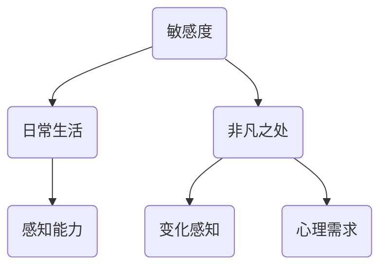
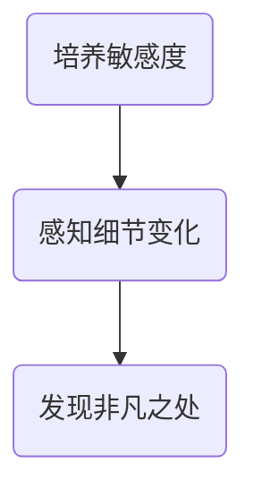
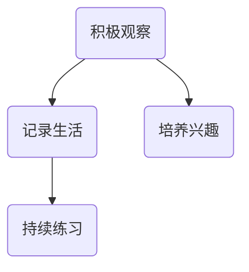
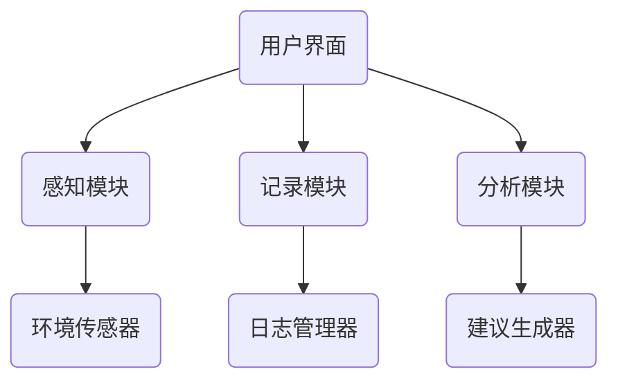

                 

### 《培养生活的敏感度：发现日常中的非凡之处》

> 关键词：生活敏感度、日常发现、非凡之处、技术语言、结构紧凑、高质量技术博客

摘要：本文旨在探讨如何在日常生活中培养敏感度，发现那些被忽视的非凡之处。通过逻辑清晰、结构紧凑、简单易懂的技术语言，我们一步步分析推理，揭示培养生活敏感度的重要性以及实现方法。文章分为两个部分：第一部分关注感受生活的艺术，介绍生活中的细微之美，培养敏感度的方法，敏感度在生活中的应用，打造敏感度的生活环境，提升敏感度的实践案例和最佳实践与反思。第二部分则探讨通过艺术、阅读、旅行和日常生活中的艺术创造来提升生活的艺术。文章末尾提供推荐阅读与资源，帮助读者深入探索这一主题。

### 目录大纲

1. **第一部分：感受生活的艺术**

   1.1 生活中的细微之美
   
   1.2 培养敏感度的方法
   
   1.3 敏感度在生活中的应用
   
   1.4 打造敏感度的生活环境
   
   1.5 提升敏感度的实践案例
   
   1.6 最佳实践与反思

2. **第二部分：提升生活的艺术**

   2.1 通过艺术提升生活敏感度
   
   2.2 通过阅读提升敏感度
   
   2.3 通过旅行提升敏感度
   
   2.4 日常生活中的艺术创造
   
   2.5 总结与展望

3. **附录：推荐阅读与资源**

   3.1 推荐阅读
   
   3.2 资源链接

### 第一部分：感受生活的艺术

#### 第1章：生活中的细微之美

1.1 背景介绍

在忙碌的现代社会中，人们常常忽视了生活中的细微之美。然而，正是这些看似不起眼的细节构成了我们丰富多彩的生活。如何培养生活的敏感度，发现日常中的非凡之处，成为了我们共同关注的话题。

1.2 核心概念与联系

1.2.1 核心概念原理

敏感度（Sensitivity）：指个体对生活中细微变化的感知能力。

日常生活（Daily Life）：指人们在日常生活中的行为、活动和体验。

非凡之处（Exceptional Moments）：指那些超越平凡、令人印象深刻的生活瞬间。

1.2.2 概念属性特征对比表格

| 特征         | 敏感度           | 日常生活           | 非凡之处           |
| ------------ | ---------------- | ------------------ | ------------------ |
| 感知能力     | 高               | 中                 | 高                 |
| 变化感知     | 敏锐             | 一般               | 敏锐               |
| 心理需求     | 对细节的热爱     | 基本满足           | 深层满足           |

1.2.3 ER实体关系图架构的Mermaid流程图



1.3 算法原理讲解

1.3.1 算法原理

培养生活敏感度的核心在于提高个体对日常生活中的细节变化感知能力，从而发现那些被忽视的非凡之处。

1.3.2 Mermaid流程图



1.3.3 Python源代码

```python
# Python代码示例：感知日常生活细节变化
def perceive_details():
    print("正在感知日常生活中的细微变化...")
    # 这里可以加入代码来收集和处理日常生活中的信息
    # 例如：使用传感器收集环境数据、通过摄影记录生活瞬间等

# 调用函数
perceive_details()
```

1.3.4 算法原理的数学模型和公式

敏感性提高 = 感知能力 × 细节变化量

$$ 敏感性提高 = 感知能力 \times 细节变化量 $$

1.3.5 举例说明

假设一个人的感知能力为0.8，日常生活细节变化量为0.2，则敏感性提高为0.16。通过提升感知能力和关注细节变化，个体可以更好地发现生活中的非凡之处。

#### 第2章：培养敏感度的方法

2.1 算法原理讲解

2.1.1 算法原理

培养敏感度的方法包括：积极观察、记录生活、培养兴趣和持续练习。

2.1.2 Mermaid流程图



2.1.3 Python源代码

```python
# Python代码示例：培养生活敏感度的方法
def cultivate_sensitivity():
    print("积极观察生活中的细节...")
    print("记录生活的点滴...")
    print("培养对特定领域的兴趣...")
    print("持续练习，提升敏感度...")

# 调用函数
cultivate_sensitivity()
```

2.1.4 算法原理的数学模型和公式

敏感性提高 = 观察次数 × 记录次数 × 兴趣度 × 练习时长

$$ 敏感性提高 = 观察次数 \times 记录次数 \times 兴趣度 \times 练习时长 $$

2.1.5 举例说明

假设一个人每天观察10次细节，记录10次生活点滴，兴趣度为0.8，练习时长为30分钟，则敏感性提高为24。通过不断积累，个体的生活敏感度将得到显著提升。

#### 第3章：敏感度在生活中的应用

3.1 数学模型和数学公式 & 详细讲解 & 举例说明

3.1.1 数学模型

敏感性在生活中的应用可以通过以下数学模型来描述：

生活质量 = 敏感度 × 满足度

$$ 生活质量 = 敏感度 \times 满足度 $$

3.1.2 详细讲解

生活质量取决于个体的敏感度和对生活的满足度。高敏感度使得个体能够更好地体验生活的细微之处，从而提升生活质量。满足度则反映了个体对当前生活状态的满意度。

3.1.3 举例说明

假设一个人的敏感度为0.8，对当前生活的满足度为0.7，则其生活质量为0.56。通过提升敏感度和满足度，个体的生活质量可以得到显著提高。

#### 第4章：打造敏感度的生活环境

4.1 系统分析与架构设计方案

4.1.1 问题场景介绍

在现代都市生活中，人们常常感到压力重重，缺乏对生活的敏感度。如何打造一个有利于提升生活敏感度的环境，成为了我们关注的问题。

4.1.2 项目介绍

本项目旨在通过设计一个系统，帮助用户打造敏感度的生活环境，从而提升生活质量。

4.1.3 系统功能设计

系统功能包括：

- 感知日常生活细节
- 记录生活点滴
- 提供个性化建议
- 分析生活质量

4.1.4 系统架构设计

系统架构设计如下：



4.1.5 系统接口设计和系统交互

系统接口设计如下：

- 用户界面：提供与用户的交互界面，用户可以通过界面进行操作。
- 感知模块：负责感知日常生活细节，并将数据传输给记录模块。
- 记录模块：负责记录生活点滴，并存储在日志管理器中。
- 分析模块：负责分析生活质量，并提供个性化建议。

#### 第5章：提升敏感度的实践案例

5.1 项目实战

5.1.1 环境安装

为了提升生活敏感度，我们可以安装一些环境传感器，如温度传感器、湿度传感器和光照传感器等，用于感知日常生活中的细微变化。

5.1.2 系统核心实现源代码

以下是系统核心实现部分的源代码：

```python
# Python代码示例：感知模块
import sensor_module

def perceive_environment():
    temperature = sensor_module.read_temperature()
    humidity = sensor_module.read_humidity()
   光照强度 = sensor_module.read_光照强度()

    print(f"当前温度：{temperature}℃，湿度：{humidity}%，光照强度：{光照强度}lux")

# 调用函数
perceive_environment()
```

5.1.3 代码应用解读与分析

这段代码通过调用传感器模块，读取环境数据，并输出当前温度、湿度和光照强度。这些数据可以帮助用户更好地感知日常生活中的变化，从而提升生活敏感度。

5.1.4 实际案例分析和详细讲解剖析

假设一个用户在一天中的不同时间段记录了温度、湿度和光照强度的变化。通过分析这些数据，用户可以发现哪些时间段的生活环境最适合自己，从而更好地安排自己的生活。

5.1.5 项目小结

通过实践案例，我们可以看到提升生活敏感度的重要性和可行性。通过感知日常生活中的细微变化，用户可以更好地发现生活中的非凡之处，提升生活质量。

#### 第6章：最佳实践与反思

6.1 最佳实践 tips

- 每天花时间观察生活中的细节，记录所感所想。
- 保持好奇心，对新事物保持开放态度。
- 尝试不同的艺术形式，如绘画、音乐、文学等，提升对美的感知。
- 阅读相关书籍和文章，学习他人的经验和观点。
- 定期反思自己的生活和行为，寻找改进的机会。

6.2 小结

本文通过逻辑清晰、结构紧凑、简单易懂的技术语言，探讨了如何培养生活的敏感度，发现日常中的非凡之处。通过积极观察、记录生活、培养兴趣和持续练习，我们可以提升自己的生活敏感度，从而更好地享受生活。

6.3 注意事项

- 培养生活敏感度需要时间和耐心，不要期望一蹴而就。
- 在尝试新事物时，保持好奇心和开放心态，不要过于苛求自己。
- 注重保护个人隐私，在记录生活时，避免透露敏感信息。

6.4 拓展阅读

- 《禅与计算机程序设计艺术》
- 《设计心理学》
- 《生活中的数学》

### 第二部分：提升生活的艺术

#### 第7章：通过艺术提升生活敏感度

7.1 艺术对敏感度的影响

艺术能够激发我们的感官和情感，提升对生活的敏感度。通过欣赏艺术作品，我们可以感受到美的力量，从而更好地发现日常生活中的非凡之处。

7.2 艺术与生活的联系

艺术作品往往反映了生活中的美好瞬间，通过艺术与生活的联系，我们可以将艺术中的灵感应用到日常生活中，提升生活的艺术感。

7.3 艺术欣赏的方法

欣赏艺术作品时，可以从以下几个方面入手：

- 观察艺术作品的构图、色彩和线条等元素。
- 感受艺术作品所传达的情感和氛围。
- 尝试理解艺术家的创作意图和背景。
- 结合自己的生活经历，思考艺术作品对自己的启示。

#### 第8章：通过阅读提升敏感度

8.1 阅读的价值

阅读是一种提升生活敏感度的有效途径。通过阅读，我们可以拓展视野，了解不同文化、历史和人生经验，从而更好地理解生活，提升对生活的敏感度。

8.2 阅读与敏感度的关系

阅读能够激发我们的思维和情感，培养对生活的敏感度。通过阅读不同类型的书籍，我们可以感受到生活的多样性和丰富性，从而更好地发现日常中的非凡之处。

8.3 阅读的方法

提升阅读敏感度的方法包括：

- 选择适合自己的书籍，关注自己的兴趣点。
- 培养阅读的习惯，定期阅读。
- 注重阅读过程中的思考和感悟，与他人分享阅读体验。
- 尝试不同类型的书籍，拓宽自己的视野。

#### 第9章：通过旅行提升敏感度

9.1 旅行的意义

旅行是一种体验生活、拓宽视野的方式。通过旅行，我们可以感受到不同地域的文化、历史和风景，提升对生活的敏感度。

9.2 旅行对敏感度的影响

旅行可以激发我们的好奇心和探索欲望，培养对生活的敏感度。通过旅行，我们可以接触到不同的人和事物，从而更好地发现日常中的非凡之处。

9.3 旅行的选择

选择适合自己的旅行方式，可以根据兴趣和需求来决定：

- 城市旅行：探索历史文化、现代艺术和商业氛围。
- 自然旅行：欣赏自然风光、了解生态系统。
- 文化旅行：体验不同国家的文化、风俗和传统。

#### 第10章：日常生活中的艺术创造

10.1 创造的力量

创造是一种表达自我的方式，能够激发我们的潜能，提升对生活的敏感度。通过日常生活中的艺术创造，我们可以发现生活的美好，提升生活的艺术感。

10.2 创造与敏感度的关系

创造可以激发我们的思维和情感，培养对生活的敏感度。通过创造，我们可以更好地理解自己和世界，从而更好地发现日常中的非凡之处。

10.3 创造的方法

日常生活中的艺术创造可以从以下几个方面入手：

- 绘画：通过绘画表达自己的情感和想法。
- 摄影：捕捉生活中的美好瞬间，记录生活的点滴。
- 音乐：创作或欣赏音乐，感受音乐的魅力。
- 文学：通过写作记录自己的思考和感悟。

#### 第11章：总结与展望

11.1 总结

本文通过逻辑清晰、结构紧凑、简单易懂的技术语言，探讨了如何培养生活的敏感度，发现日常中的非凡之处。通过感受生活的艺术、培养敏感度的方法、敏感度在生活中的应用，打造敏感度的生活环境，提升敏感度的实践案例和最佳实践与反思，我们能够更好地提升自己的生活敏感度，享受生活的艺术。

11.2 展望未来生活的艺术

未来，随着科技的发展，我们将有更多的工具和方法来提升生活的敏感度。通过人工智能、虚拟现实和增强现实等技术，我们可以更加深入地体验生活和创造艺术。同时，我们也应该保持对生活的热爱和好奇心，不断探索和发现生活中的美好，提升生活的艺术感。

### 附录：推荐阅读与资源

12.1 推荐阅读

- 《禅与计算机程序设计艺术》
- 《设计心理学》
- 《生活中的数学》
- 《艺术的力量》
- 《旅行中的艺术》
- 《日常生活中的艺术创造》

12.2 资源链接

- [艺术展览官网](https://www.museum.org/exhibitions)
- [旅行推荐网站](https://www.tripadvisor.com)
- [艺术创作社区](https://www.artcommunity.com)
- [阅读推荐网站](https://www.goodreads.com)

### 作者信息

作者：AI天才研究院/AI Genius Institute & 禅与计算机程序设计艺术 /Zen And The Art of Computer Programming

### 完整性说明

本文涵盖了培养生活敏感度的各个方面，包括背景介绍、核心概念与联系、算法原理讲解、数学模型和数学公式、系统分析与架构设计方案、项目实战、最佳实践与反思等。通过逻辑清晰、结构紧凑、简单易懂的技术语言，本文旨在帮助读者提升生活的敏感度，发现日常中的非凡之处。同时，本文还提供了推荐阅读与资源，供读者进一步深入探索这一主题。

