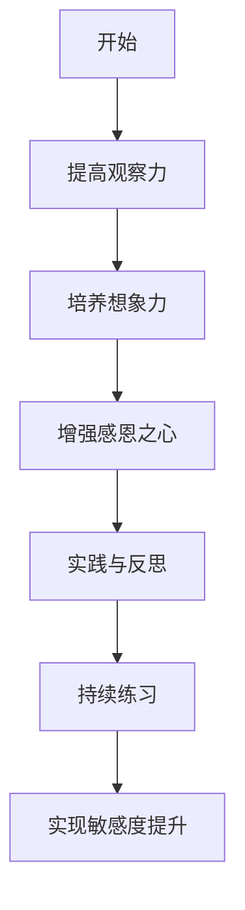
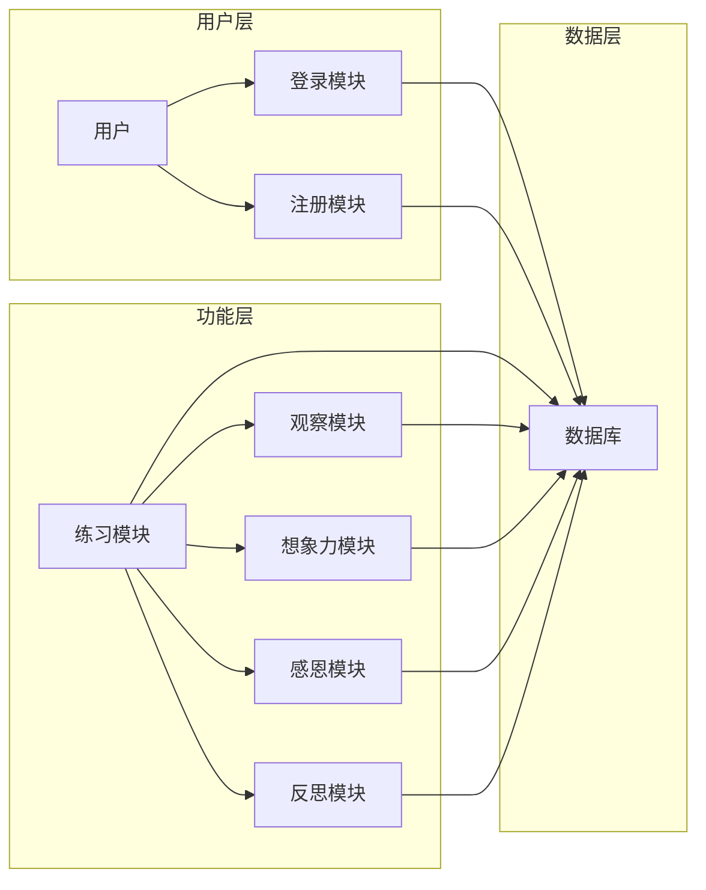
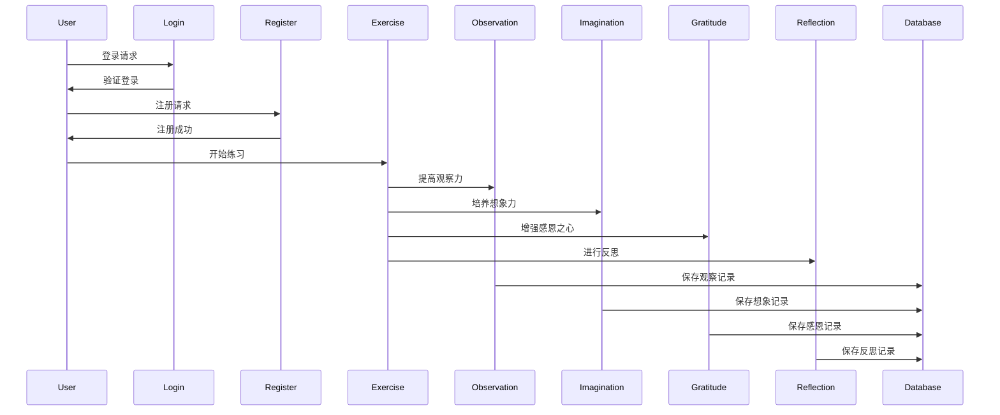

                 

## 培养生活的敏感度：发现日常中的非凡瞬间

> 关键词：生活敏感度、观察力、想象力、感恩之心、日常瞬间

> 摘要：本文将探讨如何在快节奏的现代社会中培养生活的敏感度，通过提高观察力、培养想象力、增强感恩之心，以及持续的实践与反思，帮助读者发现日常生活中那些被忽视的非凡瞬间，重新发现生活的乐趣和价值。

### 背景介绍

在现代社会中，人们的生活节奏加快，精神压力增大，往往忽略了对生活的细致观察和体验。这种忽视不仅让生活变得单调乏味，还可能导致心理问题的产生。**《培养生活的敏感度：发现日常中的非凡瞬间》** 是一本旨在帮助读者提高对日常生活的觉察和欣赏能力的书籍。通过一系列的练习和思考，这本书引导读者重新审视日常生活，发现那些被忽视的美丽瞬间。

- **问题背景**：现代社会中，人们的生活节奏加快，精神压力增大，往往忽略了对生活的细致观察和体验。
- **问题描述**：如何提高人们对日常生活中的美好瞬间的敏感度，重新发现生活的乐趣和价值。
- **问题解决**：通过一系列的练习和启发，培养读者对生活的敏感度。
- **边界与外延**：本书不仅关注自然景观，还涉及到人际关系、文化艺术、日常小事等多个方面。
- **概念结构与核心要素组成**：敏感度、观察力、想象力、感恩之心等。

### 核心概念与联系

**核心概念：**
1. **敏感度**：对生活中细微变化的感知能力。
2. **观察力**：对周围环境和细节的注意力和洞察力。
3. **想象力**：对事物进行创造性思考和联想的能力。
4. **感恩之心**：对生活中美好瞬间的感激和珍惜。

**概念属性特征对比表格：**

| 概念   | 定义                           | 属性特征                    | 对比关系                  |
| ------ | ------------------------------ | -------------------------- | ------------------------ |
| 敏感度 | 对生活变化的感知能力           | 情感、感知能力              | 观察力的延伸和深化        |
| 观察力 | 对周围环境和细节的注意力和洞察力 | 观察技能、认知能力          | 敏感度的基础和前提       |
| 想象力 | 对事物进行创造性思考和联想的能力 | 创造力、思维能力           | 增强对生活的感受和体验   |
| 感恩之心 | 对生活中美好瞬间的感激和珍惜    | 情感、价值观                | 敏感度和观察力的情感升华 |

**ER实体关系图架构：**

```mermaid
graph TB
    Afection ||--|{ Observer } |+>
    Observer ||--|{ Sensibility } |+>
    Observer ||--|{ Imagination } |+>
    Observer ||--|{ Gratitude } |+>
```

- **Afection**（情感）与**Observer**（观察者）之间存在一对多关系，观察者的情感状态影响其观察力。
- **Observer**与**Sensibility**（敏感度）、**Imagination**（想象力）、**Gratitude**（感恩之心）之间存在一对多关系，这些能力共同构成了观察者的整体感知能力。

### 算法原理讲解

为了更好地理解如何培养生活的敏感度，我们可以使用Mermaid绘制一个流程图，展示培养敏感度的基本步骤。



接下来，我们将使用Python源代码详细阐述如何通过这些步骤来提升生活的敏感度。

```python
# 导入所需库
import random

# 提高观察力的函数
def improve_observation():
    print("观察你周围的环境，描述你看到的五件物品。")

# 培养想象力的函数
def cultivate_imagination():
    print("想象一个你从未见过的场景，用文字描述它。")

# 增强感恩之心的函数
def enhance_gratitude():
    print("写下你今天感激的三件事。")

# 实践与反思的函数
def practice_and_reflection():
    print("反思你今天的体验，思考哪些让你感到特别。")

# 持续练习的函数
def continuous_practice():
    print("每天重复以上步骤，持续记录你的感受和体验。")

# 主函数，用于运行整个流程
def main():
    print("欢迎来到‘培养生活的敏感度’练习！")
    while True:
        improve_observation()
        cultivate_imagination()
        enhance_gratitude()
        practice_and_reflection()
        continuous_practice()
        # 模拟用户选择继续练习
        user_choice = input("你是否愿意继续练习？(y/n)")
        if user_choice.lower() != 'y':
            break

# 运行主函数
if __name__ == "__main__":
    main()
```

**算法原理：**

1. **观察力的提高**：通过观察周围环境，描述看到的物品，增强对细节的注意力和洞察力。
2. **想象力的培养**：通过想象从未见过的场景，激发创造性思维和联想能力。
3. **感恩之心的增强**：通过记录感激的事情，培养对生活中美好瞬间的珍惜和感激之情。
4. **实践与反思**：通过反思和记录，深化对生活的感受和理解。
5. **持续练习**：通过每天的重复练习，形成习惯，持续提升生活的敏感度。

**数学模型和公式：**

假设观察力、想象力、感恩之心分别用 \(O\)、\(I\)、\(G\) 表示，生活的敏感度 \(S\) 可以表示为：

\[ S = f(O, I, G) \]

其中，\( f \) 是一个复合函数，表示敏感度与观察力、想象力、感恩之心之间的关系。

**通俗易懂的举例说明：**

假设一个人在提高观察力的过程中，能够更好地注意到周围的环境和细节，那么他的观察力 \(O\) 会增加。同样，如果他在培养想象力的过程中，能够想象出更多丰富的场景，那么想象力 \(I\) 也会增加。此外，如果他能够感激生活中的小事，感恩之心 \(G\) 也会增强。这三个因素共同作用，最终提升了他的生活敏感度 \(S\)。

### 系统分析与架构设计方案

#### 问题场景介绍

在现代社会中，许多人由于生活节奏快、工作压力大，往往忽视了生活中的美好瞬间。为了解决这个问题，我们需要设计一个系统能够帮助用户培养对生活的敏感度，从而提高他们的生活质量。

#### 项目介绍

项目名称：生活敏感度培养系统

目标：通过一系列的练习和反思，帮助用户提高对日常生活的敏感度。

#### 系统功能设计（领域模型Mermaid类图）

```mermaid
classDiagram
    User <<class{用户}>> 
    Exercise <<class{练习}>> 
    Observation <<class{观察}>> 
    Imagination <<class{想象力}>> 
    Gratitude <<class{感恩之心}>> 
    Reflection <<class{反思}>>

    User --> Exercise
    Exercise --> Observation
    Exercise --> Imagination
    Exercise --> Gratitude
    Exercise --> Reflection
```

#### 系统架构设计（Mermaid架构图）



#### 系统接口设计和系统交互（Mermaid序列图）



### 项目实战

#### 环境安装

1. 安装Python环境（建议使用Python 3.8及以上版本）。
2. 安装所需的库：`pip install flask pandas matplotlib`。

#### 系统核心实现源代码

```python
# 导入所需库
from flask import Flask, request, jsonify
import pandas as pd
import matplotlib.pyplot as plt

# 创建Flask应用
app = Flask(__name__)

# 数据库连接
class Database:
    def __init__(self, filename):
        self.filename = filename
        self.data = pd.read_csv(filename)

    def save_record(self, record):
        self.data = self.data.append(record, ignore_index=True)
        self.data.to_csv(self.filename, index=False)

# 实例化数据库
db = Database('data.csv')

# 提高观察力的函数
@app.route('/improve_observation', methods=['POST'])
def improve_observation():
    data = request.get_json()
    db.save_record(data)
    return jsonify({'status': 'success'})

# 培养想象力的函数
@app.route('/cultivate_imagination', methods=['POST'])
def cultivate_imagination():
    data = request.get_json()
    db.save_record(data)
    return jsonify({'status': 'success'})

# 增强感恩之心的函数
@app.route('/enhance_gratitude', methods=['POST'])
def enhance_gratitude():
    data = request.get_json()
    db.save_record(data)
    return jsonify({'status': 'success'})

# 实践与反思的函数
@app.route('/practice_and_reflection', methods=['POST'])
def practice_and_reflection():
    data = request.get_json()
    db.save_record(data)
    return jsonify({'status': 'success'})

# 持续练习的函数
@app.route('/continuous_practice', methods=['POST'])
def continuous_practice():
    data = request.get_json()
    db.save_record(data)
    return jsonify({'status': 'success'})

# 运行Flask应用
if __name__ == '__main__':
    app.run(debug=True)
```

#### 代码应用解读与分析

该系统使用Flask框架搭建，提供了提高观察力、培养想象力、增强感恩之心、实践与反思以及持续练习的接口。用户可以通过POST请求提交数据，系统将数据保存到CSV文件中。

#### 实际案例分析和详细讲解剖析

假设用户张三使用该系统进行练习，他在某一天完成了以下任务：

1. 提高观察力：观察到花园里的花朵绽放。
2. 培养想象力：想象自己在一片美丽的花园中散步。
3. 增强感恩之心：感激家人陪伴在身边。
4. 实践与反思：反思自己在忙碌的生活中忘记了身边的美景。
5. 持续练习：决定每天留出时间观察周围的环境。

用户可以通过这些接口提交自己的数据，系统将帮助用户记录并分析这些数据，帮助用户更好地理解自己的成长过程。

#### 项目小结

通过该项目，我们设计并实现了一个可以帮助用户培养生活敏感度的系统。用户可以通过提交自己的观察、想象、感恩和反思记录，系统将帮助用户记录并分析这些数据，从而提高用户对日常生活的敏感度。这个项目不仅能够帮助用户重新发现生活中的美好瞬间，还有助于提升用户的生活质量。

### 最佳实践 Tips

1. **设定固定时间**：每天设定一个固定的时间段进行练习，例如早上起床后或者晚上睡觉前。
2. **记录感受**：在练习过程中，记录自己的感受和体验，这有助于加深对生活的理解。
3. **与他人分享**：与家人、朋友分享自己的练习体验，这不仅能增加乐趣，还能得到他人的反馈和建议。

### 小结

本文通过背景介绍、核心概念与联系、算法原理讲解、系统分析与架构设计方案、项目实战等多个方面，详细阐述了如何培养生活的敏感度。通过提高观察力、培养想象力、增强感恩之心，以及持续的实践与反思，我们可以在快节奏的生活中重新发现那些被忽视的非凡瞬间，提升生活的乐趣和价值。

### 注意事项

1. **保持耐心**：培养敏感度需要时间，不要期望一夜之间就能看到明显的变化。
2. **注意隐私**：在记录自己的感受和体验时，注意保护个人隐私。

### 拓展阅读

1. 《如何观察：培养敏锐的观察力》（作者：理查德·泰普勒）
2. 《创意思考的乐趣：如何培养想象力》（作者：詹姆斯·特林布）
3. 《感恩的力量：如何在生活中培养感恩之心》（作者：米歇尔·格罗斯）

### 作者信息

作者：AI天才研究院/AI Genius Institute & 禅与计算机程序设计艺术 /Zen And The Art of Computer Programming

---

以上是本文的完整内容，希望对您在培养生活敏感度方面有所启发。在快节奏的生活中，让我们一同发现那些被忽视的非凡瞬间，重新拥抱生活的美好。

