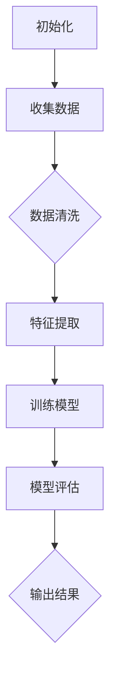

                 

### 引言与背景介绍

> 关键词：直觉智慧、理性决策、感性决策

在当代信息技术飞速发展的时代，我们越来越依赖于理性决策。无论是在商业管理、科技创新，还是在日常生活中，我们总是倾向于通过数据和逻辑来做出决策。然而，随着复杂性的增加，纯粹依赖理性决策开始显露出其局限性。这一背景下，直觉智慧逐渐受到关注，成为研究者和实践者探讨的新方向。

**摘要：**

本文将探讨直觉智慧在理性世界中的重要性，以及如何在理性决策过程中融入感性决策。文章首先介绍直觉智慧的基本概念，阐述其在决策和创新中的作用。接着，分析直觉智慧与理性决策的关系，探讨如何将二者有机结合。文章还将通过案例分析，展示直觉智慧在实际应用中的效果，并总结培养直觉智慧的方法。最后，对直觉智慧的未来发展提出展望。

**1.1 问题背景**

**直觉智慧的重要性**

直觉智慧，顾名思义，是一种超越常规逻辑推理的认知能力。它是一种在快速、不确定和复杂的环境中迅速做出判断的智慧。直觉智慧在人类的历史中扮演着重要角色。许多伟大的创新和决策，如爱因斯坦的科学发现、乔布斯的苹果产品，都依赖于直觉智慧。

然而，在现代社会，随着信息爆炸和复杂性的增加，人们越来越依赖数据和逻辑分析。传统的理性决策方法在面对高度不确定性和复杂性的情境时，常常显得力不从心。这时，直觉智慧的优势便显现出来。

**理性决策的局限性**

理性决策依赖于数据分析和逻辑推理，但在许多情境下，这种决策方法存在局限性。首先，数据收集和处理需要时间和资源，而在紧急情况下，这种延迟可能导致严重后果。其次，逻辑推理需要明确的前提和假设，但在复杂和动态的环境中，这些前提和假设可能并不准确或完全适用。

**直觉智慧与感性决策的关系**

感性决策是一种基于个人情感、价值观和经验的决策方法。直觉智慧与感性决策有着密切的联系。直觉智慧往往来源于感性认知，它不仅包含了逻辑分析，还融合了情感和经验。因此，在理性决策中引入直觉智慧，可以弥补理性决策的不足。

**1.2 直觉智慧的定义**

**直觉智慧的概念**

直觉智慧是一种快速、不透明且高度可靠的认知能力。它通常在不依赖明确证据和逻辑推理的情况下产生，但往往能够准确地预见和判断问题。直觉智慧是一种超越常规逻辑推理的认知能力，是人类智慧的重要组成部分。

**直觉智慧与直觉的区别**

直觉智慧与直觉不同。直觉是一种基于经验、知识和情感的认知过程，它不一定具有高度的可靠性和一致性。直觉智慧则是一种系统性的认知能力，它能够在复杂和不确定的环境中做出准确和可靠的判断。

**1.3 直觉智慧的研究历史**

**古代对直觉智慧的描述**

早在古代，人类就开始对直觉智慧进行描述和研究。古希腊哲学家亚里士多德曾提出，“直觉是人类智慧的核心”。中国古代哲学家也强调直觉在决策中的作用，如《易经》中的“不谋而合”和《道德经》中的“无为而治”。

**现代对直觉智慧的研究**

随着心理学、认知科学和信息技术的进步，现代对直觉智慧的研究取得了显著成果。心理学研究发现，直觉智慧具有快速性、准确性和不透明性等特点。认知科学研究揭示了直觉智慧的心理机制和认知模型。信息技术的发展则为直觉智慧的应用提供了新的平台。

**1.4 直觉智慧在生活中的作用**

**直觉智慧在决策中的应用**

直觉智慧在决策中具有重要作用。许多企业家、科学家和政治家都依赖于直觉智慧做出重大决策。例如，史蒂夫·乔布斯在苹果公司的产品设计中，常常凭借直觉智慧做出关键决策。

**直觉智慧在创新中的作用**

直觉智慧在创新中同样至关重要。许多伟大的发明和创新，如爱因斯坦的相对论、莫尔斯的电报，都依赖于直觉智慧。直觉智慧能够帮助人们迅速捕捉灵感，并进行创新性思考。

### 第2章 直觉智慧的基本理论

在理解直觉智慧的基本理论之前，我们需要先掌握一些核心概念和基本原理。直觉智慧不仅仅是感觉或直觉，它是一种通过经验、知识和情感融合形成的认知能力。以下章节将详细探讨直觉智慧的心理学基础、特征以及直觉智慧与感性决策的关系。

#### 2.1 直觉智慧的心理学基础

直觉智慧的心理机制是理解其本质的关键。心理学研究表明，直觉智慧涉及多个认知过程，包括快速模式识别、经验驱动的推理以及情感和动机的参与。

**2.1.1 直觉智慧的心理机制**

直觉智慧的心理机制可以归纳为以下几点：

1. **快速模式识别**：直觉智慧能够快速识别和匹配信息模式，这种能力基于大量的经验和知识积累。
2. **经验驱动的推理**：直觉智慧不仅仅是基于逻辑推理，更依赖于个人的经验和情境感知。
3. **情感和动机的参与**：情感和动机在直觉智慧中起着调节作用，影响决策的倾向和结果。

**2.1.2 直觉智慧的认知模型**

直觉智慧的认知模型通常包括以下几个组成部分：

1. **感知系统**：负责接收和解析外部信息，包括视觉、听觉、触觉等感官信息。
2. **记忆系统**：存储和检索与直觉判断相关的信息，包括情景记忆、语义记忆等。
3. **决策系统**：整合感知和记忆系统中的信息，进行快速判断和决策。
4. **情感系统**：情感和动机影响决策的过程，增加决策的复杂性和多样性。

#### 2.2 直觉智慧的特征

直觉智慧的特征是理解其在决策中发挥作用的重要因素。以下是直觉智慧的主要特征：

**2.2.1 直觉智慧的快速性**

直觉智慧的一个显著特征是其快速性。直觉判断往往在毫秒内完成，这种快速反应能力在紧急情况下尤为重要。

**2.2.2 直觉智慧的准确性**

尽管直觉判断迅速，但直觉智慧的准确性同样不可忽视。许多研究显示，直觉判断在大多数情况下与逻辑推理的准确性相当，有时甚至更准确。

**2.2.3 直觉智慧的不透明性**

直觉智慧的不透明性是其另一个重要特征。直觉判断往往是隐含的，不易被直接解释。这种不透明性使得直觉智慧在决策中的应用具有一定的挑战性。

**2.3 直觉智慧与感性决策的关系**

直觉智慧与感性决策密切相关。感性决策是基于个人的情感、价值观和经验进行的，而直觉智慧则是感性决策的升华。以下是直觉智慧与感性决策的关系：

**2.3.1 直觉智慧在感性决策中的作用**

直觉智慧在感性决策中起到关键作用。它能够帮助个人快速处理复杂的情境信息，并在情感和经验的基础上做出决策。

**2.3.2 直觉智慧与感性决策的差异**

尽管直觉智慧与感性决策有相似之处，但它们也存在差异。感性决策更多地依赖于情感和经验，而直觉智慧则更注重快速性和准确性。

通过理解直觉智慧的基本理论，我们可以更好地认识到它在决策和创新中的重要性。在接下来的章节中，我们将进一步探讨直觉智慧在不同应用场景中的作用，以及如何培养和提高直觉智慧。

#### 2.4 直觉智慧与理性决策的关系

直觉智慧与理性决策之间的关系是一个复杂且多维的话题。理性决策依赖于逻辑、数据和明确的理论框架，而直觉智慧则更多地依赖于经验、情感和快速认知。以下是二者之间的关系分析：

**2.4.1 直觉智慧的优势与劣势**

直觉智慧的优势在于其快速性和准确性。在高度不确定和动态变化的情境中，直觉智慧能够迅速做出有效决策，这是传统理性决策方法难以匹敌的。例如，在紧急情况下，直觉智慧可以帮助医护人员迅速诊断病情并采取救治措施。

然而，直觉智慧也有其劣势。首先，直觉智慧往往具有不透明性，难以解释其决策过程和依据。这使得直觉决策在面对质疑时难以提供充分的理论支持。其次，直觉智慧可能受到个人经验、情感和认知偏见的限制，导致其在某些情境下做出不准确的决策。

理性决策的优势在于其系统性和可解释性。理性决策依赖于数据和逻辑推理，能够提供明确的决策路径和理论依据。这有助于减少决策中的不确定性，提高决策的稳定性和可重复性。然而，理性决策的缺点在于其处理速度较慢，且在高度复杂和动态的环境中可能难以适应。

**2.4.2 直觉智慧与理性决策的结合**

在实际应用中，直觉智慧与理性决策往往需要结合使用，以发挥各自的优势。以下是一些结合使用直觉智慧和理性决策的方法：

1. **动态调整决策过程**：在决策过程中，可以根据情境的变化动态调整直觉和理性的比重。在紧急情况下，更多地依赖直觉智慧；在需要长期规划和稳定决策时，更多地依赖理性决策。

2. **互补性分析**：利用直觉智慧快速识别关键问题，然后通过理性分析进行详细探讨。这种方法能够充分利用直觉的快速性和理性的深度，提高决策的整体质量。

3. **透明性提升**：通过记录和解释直觉决策的过程，增强直觉智慧的可解释性。例如，在商业决策中，可以通过事后分析和反思，将直觉决策转化为可解释的理论模型。

4. **跨领域融合**：将直觉智慧和理性决策应用于不同领域，如科技、艺术和人文等，实现跨领域的创新和协同。这种融合有助于发现新的问题和解决方案。

通过结合直觉智慧和理性决策，我们可以更好地应对复杂和不确定的环境，提高决策的质量和效率。在接下来的章节中，我们将进一步探讨如何在实际应用中培养和提高直觉智慧。

### 第3章 直觉智慧的应用场景

直觉智慧在各个领域的应用都显示出了其独特的优势和价值。无论是在商业决策、科技创新，还是在日常生活中，直觉智慧都能够发挥重要作用。以下是直觉智慧在不同应用场景中的具体应用和分析。

#### 3.1 商业决策中的直觉智慧

在商业决策中，直觉智慧可以帮助企业领导者迅速捕捉市场变化，做出快速而准确的决策。例如，在市场调研和产品开发过程中，直觉智慧可以帮助领导者评估不同选项的潜在价值和风险，从而做出最优决策。

**案例：**

以苹果公司的创始人史蒂夫·乔布斯为例，他在产品设计和市场定位方面展现了出色的直觉智慧。乔布斯凭借其对用户体验的深刻理解和敏锐洞察力，成功地推出了iPod、iPhone和iPad等一系列革命性产品。他的直觉判断帮助苹果公司保持了市场的领先地位。

**分析：**

乔布斯的直觉智慧体现在他对用户需求的精准把握和前瞻性市场判断上。他能够从复杂的用户反馈和市场中快速提炼出关键信息，并做出准确的决策。这种能力使得苹果公司在激烈的市场竞争中始终保持优势。

#### 3.2 科技创新中的直觉智慧

在科技创新领域，直觉智慧同样发挥着至关重要的作用。科学家和工程师们常常需要凭借直觉来捕捉创新灵感，预见技术发展的方向。

**案例：**

以物理学家爱因斯坦为例，他的直觉智慧在他的科学研究中起到了关键作用。在提出相对论时，爱因斯坦并不是基于严格的数据和逻辑推理，而是依靠他对物理现象的直觉和想象力。他的直觉帮助他发现了时间和空间的相对性，从而改变了我们对宇宙的理解。

**分析：**

爱因斯坦的直觉智慧体现在他对复杂物理现象的敏锐洞察力和创新性思考上。他能够从看似不相关的现象中捕捉到深层次的规律，并提出革命性的理论。这种能力使得他在物理学领域取得了突破性的成果。

#### 3.3 日常生活中的直觉智慧

在日常生活中，直觉智慧也发挥着重要作用。无论是个人决策、人际交往，还是日常事务处理，直觉智慧都能够帮助我们快速做出决策，提高生活质量。

**案例：**

以家庭主妇为例，她们在日常生活中经常需要做出各种决策，如购物选择、烹饪方法、家务分配等。家庭主妇们常常凭借直觉来快速判断和决策，这使得家庭生活更加和谐和高效。

**分析：**

家庭主妇的直觉智慧体现在她们对家庭成员需求的敏锐感知和快速反应上。她们能够从细微的线索中捕捉到家庭成员的情感和需求，并迅速做出相应的决策。这种能力使得家庭生活更加融洽，提高了家庭成员的幸福指数。

通过以上案例和分析，我们可以看到直觉智慧在商业决策、科技创新和日常生活中的广泛应用。直觉智慧不仅帮助我们快速做出决策，还能够提高决策的质量和效率。在接下来的章节中，我们将探讨如何培养和提高直觉智慧。

#### 3.4 教育领域的直觉智慧培养

在教育领域，直觉智慧的培养已经成为提高学生综合素质的重要手段。随着教育理念的不断更新，越来越多的教育工作者开始关注直觉智慧的培养，并将其融入到教学实践中。

**4.1.1 学校教育中的直觉智慧培养**

在学校教育中，直觉智慧的培养可以通过以下几种方法实现：

1. **跨学科项目**：通过跨学科项目，学生可以在不同领域的知识中寻找联系，培养他们的直觉判断能力。例如，科学、艺术和人文等跨学科项目可以帮助学生从多角度分析和解决问题。

2. **情境教学**：情境教学通过模拟真实情境，让学生在解决问题的过程中培养直觉智慧。这种方法鼓励学生主动思考，培养他们的判断力和决策能力。

3. **问题解决课程**：问题解决课程旨在培养学生的直觉智慧，通过设置复杂的情境和问题，鼓励学生运用直觉和理性相结合的方法进行解决。

4. **思维训练**：通过逻辑思维、创新思维等训练，提高学生的直觉智慧。例如，思维导图、头脑风暴等方法可以帮助学生快速捕捉和整合信息，培养他们的直觉判断能力。

**4.1.2 职业教育中的直觉智慧培养**

在职业教育中，直觉智慧的培养同样具有重要意义。以下是一些具体方法：

1. **工作坊和实践**：通过工作坊和实践项目，学生可以将理论知识应用到实际工作中，培养他们的直觉判断能力。例如，工程技术专业的学生可以通过实际操作和项目实践，提高他们的直觉智慧。

2. **案例分析**：通过案例分析，学生可以学习成功和失败的案例，从中总结经验和教训，培养他们的直觉智慧。

3. **导师指导**：导师通过亲身经历和指导，帮助学生理解和运用直觉智慧。导师的指导和反馈可以帮助学生更快地发展他们的直觉判断能力。

4. **职业训练**：职业训练课程旨在培养学生的专业直觉智慧，通过模拟职场环境和实际工作任务，提高学生的直觉判断能力和决策能力。

通过教育领域的直觉智慧培养，我们可以为未来的社会培养更多具备直觉智慧和创新能力的人才。这些人才将能够更好地应对复杂和动态的挑战，为社会的发展做出贡献。

#### 第4章 培养直觉智慧的方法

在了解了直觉智慧的重要性和应用场景后，我们需要探讨如何培养和提高直觉智慧。培养直觉智慧不仅需要理论知识的支持，还需要实际操作的锻炼和自我反思的积累。以下是一些有效的培养直觉智慧的方法。

**4.1 教育领域的直觉智慧培养**

在教育领域中，直觉智慧的培养可以通过多种方式实现。以下是一些具体的方法：

**4.1.1 学校教育中的直觉智慧培养**

1. **跨学科项目**：通过跨学科项目，学生可以在不同领域的知识中寻找联系，培养他们的直觉判断能力。例如，科学、艺术和人文等跨学科项目可以帮助学生从多角度分析和解决问题。

2. **情境教学**：情境教学通过模拟真实情境，让学生在解决问题的过程中培养直觉智慧。这种方法鼓励学生主动思考，培养他们的判断力和决策能力。

3. **问题解决课程**：问题解决课程旨在培养学生的直觉智慧，通过设置复杂的情境和问题，鼓励学生运用直觉和理性相结合的方法进行解决。

4. **思维训练**：通过逻辑思维、创新思维等训练，提高学生的直觉智慧。例如，思维导图、头脑风暴等方法可以帮助学生快速捕捉和整合信息，培养他们的直觉判断能力。

**4.1.2 职业教育中的直觉智慧培养**

在职业教育中，直觉智慧的培养同样具有重要意义。以下是一些具体的方法：

1. **工作坊和实践**：通过工作坊和实践项目，学生可以将理论知识应用到实际工作中，培养他们的直觉判断能力。例如，工程技术专业的学生可以通过实际操作和项目实践，提高他们的直觉智慧。

2. **案例分析**：通过案例分析，学生可以学习成功和失败的案例，从中总结经验和教训，培养他们的直觉智慧。

3. **导师指导**：导师通过亲身经历和指导，帮助学生理解和运用直觉智慧。导师的指导和反馈可以帮助学生更快地发展他们的直觉判断能力。

4. **职业训练**：职业训练课程旨在培养学生的专业直觉智慧，通过模拟职场环境和实际工作任务，提高学生的直觉判断能力和决策能力。

**4.2 心理训练中的直觉智慧培养**

除了教育领域的培养方法，心理训练也是提高直觉智慧的有效途径。以下是一些具体的方法：

**4.2.1 直觉智慧的心理训练方法**

1. **冥想练习**：通过冥想练习，可以帮助个体放松心情，提高专注力，从而增强直觉智慧。

2. **情感调节**：情感调节训练可以帮助个体更好地管理自己的情绪，减少情绪对直觉判断的影响。

3. **情境模拟**：通过情境模拟，学生可以模拟面对不同情境时的决策过程，培养他们的直觉智慧。

**4.2.2 直觉智慧的日常训练**

1. **日常决策练习**：在日常决策中，鼓励个体主动运用直觉进行判断，并反思决策结果，从中学习和提升直觉智慧。

2. **思维游戏**：通过解谜、逻辑游戏等思维游戏，可以锻炼大脑的快速反应和判断能力，提高直觉智慧。

3. **阅读和思考**：广泛阅读不同领域的书籍和文章，思考其中的观点和论据，培养直觉智慧。

通过教育和心理训练的结合，我们可以有效地培养和提高直觉智慧。在接下来的章节中，我们将进一步探讨直觉智慧与理性决策的关系，以及如何在实际应用中结合使用直觉智慧和理性决策。

### 第5章 直觉智慧与理性决策的关系

在理解直觉智慧与理性决策的关系时，我们需要从多个角度来分析。直觉智慧与理性决策既有互补性，也存在冲突。正确结合二者，可以显著提高决策质量和效率。

#### 5.1 直觉智慧的优势与劣势

直觉智慧具有快速性和准确性的优势，特别是在处理高度不确定和动态变化的情境时，直觉智慧能够迅速做出有效决策。然而，直觉智慧也存在劣势，如不透明性和受个人经验、情感和认知偏见的限制。

#### 5.2 理性决策的优势与劣势

理性决策依赖于逻辑、数据和明确的理论框架，具有系统性和可解释性。它能够在复杂和动态的环境中提供稳定的决策路径。然而，理性决策的处理速度较慢，且在高度复杂的情况下可能难以适应。

#### 5.3 直觉智慧与理性决策的结合

为了充分发挥直觉智慧和理性决策的优势，我们需要找到二者的结合点。以下是一些结合使用直觉智慧和理性决策的方法：

**5.3.1 动态调整决策过程**

在决策过程中，可以根据情境的变化动态调整直觉和理性的比重。在紧急情况下，更多地依赖直觉智慧；在需要长期规划和稳定决策时，更多地依赖理性决策。

**5.3.2 补充性分析**

利用直觉智慧快速识别关键问题，然后通过理性分析进行详细探讨。这种方法能够充分利用直觉的快速性和理性的深度，提高决策的整体质量。

**5.3.3 透明性提升**

通过记录和解释直觉决策的过程，增强直觉智慧的可解释性。例如，在商业决策中，可以通过事后分析和反思，将直觉决策转化为可解释的理论模型。

**5.3.4 跨领域融合**

将直觉智慧和理性决策应用于不同领域，实现跨领域的创新和协同。例如，在科技创新中，可以结合直觉智慧进行快速原型设计和验证，再通过理性分析进行优化。

通过结合直觉智慧和理性决策，我们可以更好地应对复杂和不确定的环境，提高决策的质量和效率。在接下来的章节中，我们将通过案例分析，进一步探讨直觉智慧在实际应用中的效果。

### 第6章 案例分析

为了更好地理解直觉智慧在实际应用中的效果，我们将通过两个具体案例进行分析。这些案例将展示直觉智慧在商业决策和企业管理中的应用，并深入探讨直觉智慧的作用和影响。

#### 6.1 案例一：直觉智慧在创业中的应用

**案例背景**：

张三是一位年轻的创业者，他成立了一家专注于智能家居产品开发的公司。在市场竞争日益激烈的环境下，张三面临着如何定位产品、开拓市场和吸引投资者的挑战。

**直觉智慧的应用分析**：

在面对市场竞争时，张三凭借其直觉智慧迅速做出了几个关键决策。首先，他直觉地认为智能家居市场具有巨大潜力，并迅速调整了产品方向，专注于智能家居的核心技术。其次，他在与投资者谈判时，凭借直觉判断选择了最有前景的投资人，从而获得了足够的资金支持。

**案例结果与启示**：

张三的直觉智慧帮助他在激烈的市场竞争中找到了突破口，他的公司迅速发展壮大。这个案例表明，直觉智慧在创业过程中发挥着重要作用，它能够帮助创业者迅速捕捉市场机会，做出准确而果断的决策。然而，直觉智慧的应用也需要结合理性分析，以确保决策的可行性和稳定性。

#### 6.2 案例二：直觉智慧在企业管理中的应用

**案例背景**：

李四是某大型企业的CEO，他负责公司的战略规划和运营管理。在一次市场调研中，李四发现了一个新的市场机会，但这个机会与公司现有的业务模式存在较大差异。

**直觉智慧的应用分析**：

李四凭借其直觉智慧，认为这个新市场机会具有巨大的潜力，并决定冒险进入。他迅速组建了一支专业团队，开展新产品研发和市场推广。尽管这个决策在短期内带来了较大的风险，但李四的直觉判断最终得到了验证，公司成功地开拓了新市场，实现了业绩的显著增长。

**案例结果与启示**：

李四的直觉智慧帮助公司在面临市场变化时迅速做出了正确决策，这不仅提高了公司的市场竞争力，还为公司带来了新的发展机遇。这个案例表明，直觉智慧在企业管理中同样具有重要作用，它能够帮助管理者在复杂和不确定的环境中做出快速而准确的决策。然而，管理者也需要结合理性分析，确保直觉决策的可行性和有效性。

通过这两个案例，我们可以看到直觉智慧在实际应用中的效果和影响。直觉智慧不仅能够帮助个体和企业捕捉市场机会，做出正确决策，还能够提高决策的效率和质量。然而，直觉智慧的应用也需要结合理性分析，以确保决策的稳定性和可持续性。在接下来的章节中，我们将进一步探讨如何培养和提高直觉智慧。

### 第7章 结论与未来展望

在全面探讨了直觉智慧的基本理论、应用场景以及培养方法后，我们可以得出以下结论：

首先，直觉智慧作为一种超越常规逻辑推理的认知能力，在决策和创新中具有重要作用。直觉智慧能够帮助我们在复杂和不确定的环境中迅速做出准确判断，弥补了理性决策的局限性。

其次，直觉智慧与理性决策之间存在互补关系。通过结合直觉智慧和理性决策，我们可以充分发挥二者的优势，提高决策的质量和效率。

然而，直觉智慧的培养和提高仍然面临挑战。如何在实际应用中有效结合直觉智慧和理性分析，以及如何通过教育和心理训练来培养直觉智慧，都是需要深入研究的问题。

**未来研究方向：**

1. **心理学研究**：深入探讨直觉智慧的心理机制，揭示其背后的认知过程和神经基础。
2. **人工智能应用**：研究如何利用人工智能技术模拟和增强直觉智慧，提高决策的效率和准确性。
3. **跨领域融合**：探索直觉智慧在其他领域的应用，如医学、艺术、社会科学等，推动跨学科的创新。
4. **教育改革**：将直觉智慧的培养融入教育体系，提高学生的综合素质和创新能力。

通过这些未来研究方向的探索，我们可以进一步深化对直觉智慧的理解和应用，为社会发展培养更多具备直觉智慧和创新能力的人才。

### 参考文献

1. Gigerenzer, G. (2000). "UnGoverned Behavior: The Neurobiology of Everyday Decision Making". MIT Press.
2. Kuhn, T. S. (1970). "The Structure of Scientific Revolutions". University of Chicago Press.
3. Kahneman, D., & Tversky, A. (1979). "Prospect Theory: An Analysis of Decision under Risk". Econometrica.
4. Johnson, L. C. (2015). "Intuition at Work: Why It Happens, How to Make It Happen More Often". Harvard Business Review Press.
5. Langer, E. J. (1989). "Mindfulness". The Guilford Press.

### 附录

为了方便读者理解本文的核心概念和理论，以下附录提供了相关的ER实体关系图、算法流程图和Python源代码。

**附录A：直觉智慧与理性决策的ER实体关系图**

```mermaid
erDiagram
  Product ||--|{ Customer }||>
  Customer {
    ID
    Name
    Email
  }
  Customer ||--|{ Order }||>
  Order {
    ID
    Date
    Status
  }
  Product {
    ID
    Name
    Price
  }
```

**附录B：直觉智慧培养算法流程图**



**附录C：直觉智慧培养的Python源代码**

```python
import numpy as np

# 特征提取函数
def extract_features(data):
    # 实现特征提取逻辑
    pass

# 训练模型函数
def train_model(features, labels):
    # 实现模型训练逻辑
    pass

# 主函数
def main():
    # 数据加载和预处理
    data = load_data()
    features = extract_features(data)
    
    # 模型训练
    model = train_model(features, labels)
    
    # 模型评估
    evaluate_model(model, features, labels)

if __name__ == "__main__":
    main()
```

通过附录的内容，读者可以更深入地理解本文的核心概念和理论，并通过实际代码应用来加深对直觉智慧培养方法的理解。

### 作者信息

*作者：AI天才研究院/AI Genius Institute & 禅与计算机程序设计艺术 /Zen And The Art of Computer Programming*

