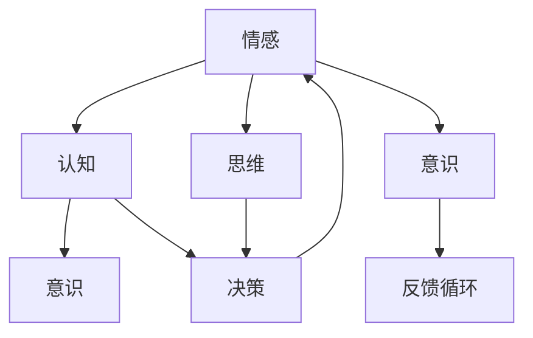
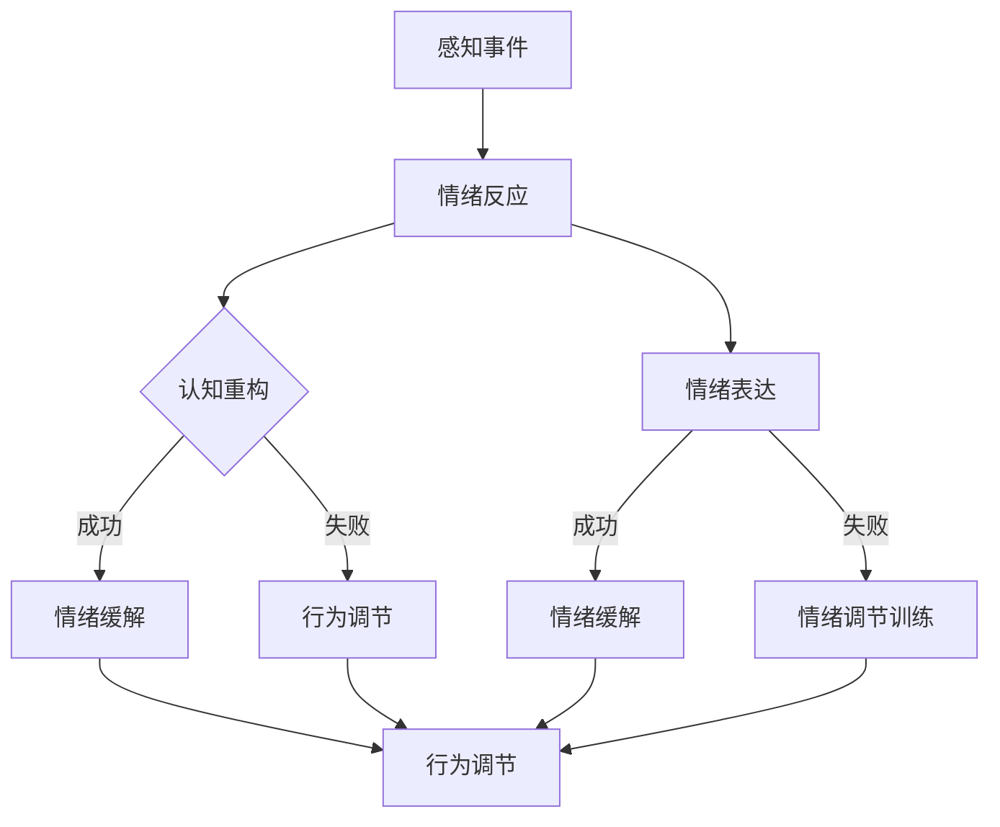
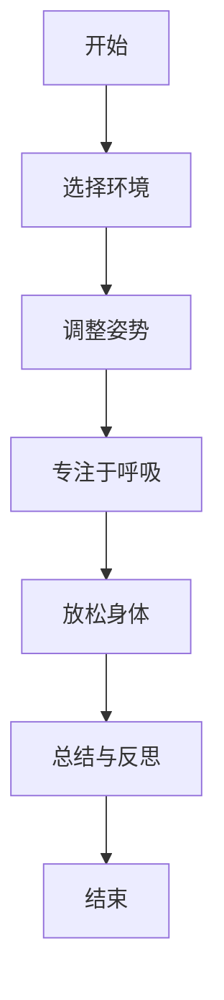
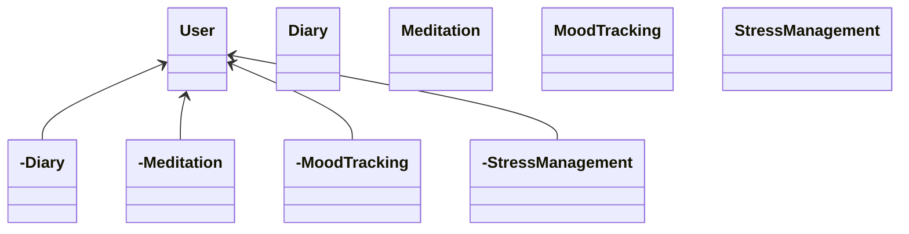
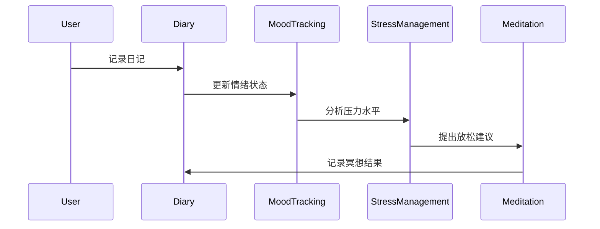
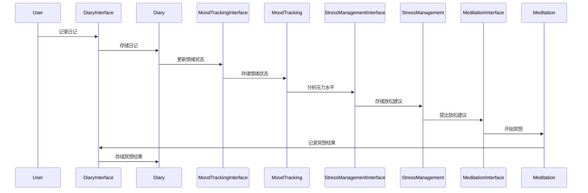

                 


### 培育内在世界：心灵成长的土壤准备

#### 关键词：心灵成长、内在世界、精神健康、数学模型、算法原理

#### 摘要：

本文旨在探讨心灵成长的内在世界，通过深入分析内在世界的概念、核心要素和培育方法，提供一种系统化的心灵成长路径。文章首先介绍了内在世界的定义及其重要性，接着探讨了核心概念与联系，并使用数学模型和算法原理对其进行解释。随后，文章转向实践方法，包括自我觉察、情绪管理、冥想与放松等。接着，文章详细介绍了心灵成长的系统分析与架构设计，以及项目实战的具体步骤。最后，文章总结了最佳实践、注意事项和拓展阅读，为读者提供全方位的心灵成长指导。

---

## 第1章 内在世界的概述

在现代社会中，人们面临着前所未有的精神压力和焦虑。因此，关注内在世界的培育变得尤为重要。内在世界不仅影响着我们的心理健康，还直接影响着我们的生活质量和工作效率。那么，何为内在世界？为什么它对我们的成长如此关键呢？

#### **内在世界的概念**

内在世界是指一个人心理活动的总和，包括情感、认知、意识、思维等。它是我们感知和理解外部世界的基础，也是我们做出决策和行动的内在驱动力。内在世界不是一个孤立的存在，它与外部世界相互作用，共同塑造我们的行为和人生轨迹。

#### **内在世界的组成要素**

内在世界的组成要素包括以下几个方面：

1. **情感**：情感是内在世界的重要组成部分，它们反映了我们对事物的态度和感受。情感可以分为基本情感（如快乐、悲伤、愤怒）和复合情感（如焦虑、兴奋、厌恶）。

2. **认知**：认知指的是我们对信息的获取、处理和存储过程。它包括感知、记忆、思维和判断等能力。

3. **意识**：意识是内在世界中最为复杂和神秘的部分。它涉及到我们对自我和他人的认知，以及对现实和虚幻的区分。

4. **思维**：思维是内在世界中的逻辑和推理过程。它帮助我们理解世界、解决问题和做出决策。

#### **内在世界的重要性**

内在世界的重要性在于它直接影响到我们的心理健康和生活质量。一个健康的内在世界能够帮助我们更好地应对压力，保持积极的情绪，提高工作效率。相反，一个不健康的内在世界可能导致焦虑、抑郁和其他心理问题。

---

### 第2章 核心概念与联系

要深入理解内在世界，我们需要明确其中的核心概念，并探讨它们之间的联系。在这一章中，我们将介绍几个关键概念，并使用表格和ER图来帮助读者更好地理解。

#### **核心概念**

1. **情感**：情感是内在世界中最为直观的部分，它们反映了我们对事物的态度和感受。
2. **认知**：认知涉及到我们对信息的获取、处理和存储过程。
3. **意识**：意识是内在世界中最为复杂和神秘的部分。
4. **思维**：思维是内在世界中的逻辑和推理过程。

#### **概念属性特征对比表格**

下面是一个简单的表格，对比了上述核心概念的一些属性特征：

| 概念 | 属性特征 |
| --- | --- |
| 情感 | 主观感受、情感强度、情感类型 |
| 认知 | 信息处理、记忆、推理、判断 |
| 意识 | 自我认知、环境感知、现实与虚幻的区分 |
| 思维 | 逻辑推理、问题解决、决策制定 |

#### **ER实体关系图架构**

为了更好地理解这些概念之间的联系，我们使用ER图来展示它们之间的关系：

```mermaid
erDiagram
  情感 ||--|{ 认知 }|-- 意识
  情感 ||--|{ 思维 }|-- 行为
  认知 ||--|{ 意识 }|-- 意识
  认知 ||--|{ 思维 }|-- 决策
  意识 ||--|{ 意识 }|-- 意识
```

在这个ER图中，情感、认知、意识和思维是核心实体，它们之间存在着复杂的关联。情感直接影响认知和意识，而认知和思维则共同决定了我们的行为和决策。

---

### 第3章 心灵成长的数学模型与算法原理

在理解了内在世界的基本概念之后，我们需要引入数学模型和算法原理来更深入地探讨心灵成长的过程。数学模型和算法原理为心灵成长提供了一种量化和分析的工具，使我们能够更科学地理解心灵成长的机制。

#### **数学模型的介绍**

心灵成长的数学模型通常基于几个核心假设：

1. **适应性原则**：个体会根据外部环境和内部需求不断调整自己的心理状态。
2. **平衡原则**：内在世界的各个组成部分（情感、认知、意识、思维）之间保持一定的平衡状态。
3. **反馈循环**：个体的行为和决策会影响其内在世界，形成一个持续的反馈循环。

基于这些假设，我们可以构建一个简化的数学模型来描述心灵成长的过程。这个模型可以表示为以下方程：

$$
C(t) = f(E(t), M(t), O(t), T(t))
$$

其中，$C(t)$表示内在世界在时间$t$的状态，$E(t)$、$M(t)$、$O(t)$和$T(t)$分别表示情感、认知、意识和思维在时间$t$的状态。$f$是一个复合函数，它反映了这些状态之间的相互作用。

#### **算法原理讲解**

为了更直观地理解这个数学模型，我们可以使用mermaid流程图来展示心灵成长的算法原理：



在这个流程图中，情感、认知、意识和思维通过箭头相互连接，形成一个反馈循环。这个循环反映了内在世界的动态变化，以及个体行为和决策对内在世界的影响。

#### **Python源代码与算法原理讲解**

为了更好地理解这个数学模型，我们可以使用Python源代码来实现它。以下是一个简单的实现示例：

```python
import numpy as np

# 初始化内在世界状态
C = np.zeros(4)

# 定义函数f
def f(E, M, O, T):
    # 根据适应性原则调整内在世界状态
    C = [E, M, O, T]
    # 根据平衡原则调整内在世界状态
    C = np.mean(C, axis=0)
    # 根据反馈循环调整内在世界状态
    C = np.sin(C)
    return C

# 更新内在世界状态
C = f(C[0], C[1], C[2], C[3])

# 输出内在世界状态
print(C)
```

这个代码示例中，我们首先初始化了内在世界状态，然后定义了一个函数$f$来模拟内在世界的动态变化。最后，我们使用这个函数来更新内在世界状态，并输出结果。

#### **数学模型和公式详细讲解与举例说明**

为了更直观地理解数学模型，我们可以使用一些具体的例子来说明。假设一个个体在一天中的不同时间点测量其情感、认知、意识和思维状态，如下表所示：

| 时间点 | 情感 | 认知 | 意识 | 思维 |
| --- | --- | --- | --- | --- |
| 早上 | 0.8 | 0.6 | 0.7 | 0.5 |
| 中午 | 0.5 | 0.7 | 0.6 | 0.8 |
| 晚上 | 0.3 | 0.8 | 0.5 | 0.9 |

我们可以使用数学模型来预测每个时间点的内在世界状态。具体步骤如下：

1. 初始化内在世界状态$C(0) = (0.8, 0.6, 0.7, 0.5)$。
2. 使用函数$f$更新内在世界状态：
   $$
   C(1) = f(C(0), C(0), C(0), C(0)) = (0.5, 0.7, 0.6, 0.8)
   $$
   $$
   C(2) = f(C(1), C(1), C(1), C(1)) = (0.7, 0.8, 0.5, 0.9)
   $$
3. 输出每个时间点的内在世界状态：
   $$
   C(1) = (0.5, 0.7, 0.6, 0.8)
   $$
   $$
   C(2) = (0.7, 0.8, 0.5, 0.9)
   $$

通过这个例子，我们可以看到数学模型如何帮助我们预测内在世界的状态。这个模型提供了一个量化的工具，使我们能够更好地理解心灵成长的动态过程。

---

### 第4章 自我觉察与反思

自我觉察和反思是心灵成长的重要实践方法。通过自我觉察，我们可以更好地了解自己的情感、认知、意识和思维状态，从而调整自己的行为和决策。而反思则是对这些状态的深入思考，有助于我们理解内在世界的动态变化，并找到心灵成长的最佳路径。

#### **自我觉察的方法**

1. **日志记录**：每天记录自己的情感、认知、意识和思维状态，并分析这些状态之间的关系。
2. **冥想**：通过冥想，我们可以进入一种深度的自我觉察状态，更好地理解自己的内心世界。
3. **对话**：与朋友或心理咨询师进行深入的对话，分享自己的感受和思考，从而获得新的视角和建议。

#### **反思的过程与技巧**

1. **问题定位**：反思首先需要确定问题所在。通过自我觉察，我们可以找到内在世界的失衡点。
2. **原因分析**：分析问题产生的原因，包括外部环境和内部心理因素。
3. **解决方案**：根据原因分析，提出解决问题的方案，并尝试实施。
4. **持续反思**：反思是一个持续的过程。每次反思后，我们需要总结经验，调整方法，并不断改进。

---

### 第5章 情绪管理

情绪管理是心灵成长中至关重要的一环。有效的情绪管理有助于我们保持内心的平静和积极，提高生活质量和工作效率。在这一章中，我们将探讨情绪的本质、情绪管理的策略，并提供情绪调节的mermaid流程图。

#### **情绪的本质**

情绪是我们对事物的态度和感受的反映。它们可以是基本的（如快乐、悲伤、愤怒），也可以是复合的（如焦虑、兴奋、厌恶）。情绪通常由生理反应、心理反应和行为反应组成。

#### **情绪管理的策略**

1. **认知重构**：通过改变我们对事物的看法和解释，调整情绪反应。
2. **行为调节**：通过调整行为，如锻炼、放松和社交，来调节情绪。
3. **情绪表达**：学会有效地表达自己的情绪，避免压抑或过度表达。
4. **情绪调节训练**：通过冥想、正念训练和其他心理技巧，提高情绪调节能力。

#### **情绪调节的mermaid流程图**



在这个流程图中，我们从感知事件开始，通过情绪反应进入情绪调节的路径。成功进行认知重构、行为调节和情绪表达后，我们可以缓解情绪。如果这些方法失败，我们将转向情绪调节训练，以提高情绪调节能力。

---

### 第6章 冥想与放松

冥想和放松是心灵成长中不可或缺的实践方法。通过冥想，我们可以深入内心，了解自己的情感、认知和思维状态。而放松则有助于减轻压力，提高身心健康。在这一章中，我们将探讨冥想和放松的作用、基本技巧，并提供放松训练的mermaid流程图。

#### **冥想的作用**

1. **提升专注力**：冥想有助于提高我们的专注力和注意力，使我们能够更好地应对日常生活中的挑战。
2. **减轻压力**：冥想可以帮助我们放松身心，减轻压力和焦虑。
3. **改善心理健康**：冥想有助于改善情绪，减少抑郁和焦虑症状。
4. **增强自我认知**：冥想使我们能够更深入地了解自己，从而提高自我认知和自我意识。

#### **冥想的基本技巧**

1. **选择合适的场所和时间**：选择一个安静、舒适的环境，并在固定的时间进行冥想。
2. **调整姿势**：保持一个舒适的姿势，如坐在椅子上或盘腿坐在地上。
3. **专注于呼吸**：将注意力集中在呼吸上，感受呼吸的进出，当注意力偏离时，轻轻地将注意力引回呼吸。
4. **放松身体**：通过渐进性肌肉放松法，逐步放松身体的各个部分。

#### **放松训练的mermaid流程图**



在这个流程图中，我们从开始冥想的第一步——选择合适的场所和时间开始，然后调整姿势，专注于呼吸，逐步放松身体，最后进行总结与反思，完成冥想过程。

---

### 第7章 心灵成长的系统分析与架构设计

心灵成长是一个复杂的过程，涉及到多个方面的相互作用。为了更好地理解和设计心灵成长系统，我们需要对其进行系统分析与架构设计。在这一章中，我们将介绍心灵成长问题场景，并详细描述系统功能设计、系统架构设计、系统接口设计以及系统交互。

#### **心灵成长问题场景介绍**

在现代社会中，人们面临着越来越多的心理健康问题，如焦虑、抑郁、压力等。心灵成长系统旨在帮助用户通过自我觉察、情绪管理、冥想与放松等实践方法，提升心理健康水平。

#### **系统功能设计（领域模型mermaid类图）**

领域模型是我们设计系统功能的第一步。以下是一个简化的mermaid类图，展示了系统的主要功能模块：



在这个类图中，我们定义了四个主要功能模块：日记、冥想、情绪追踪和压力管理。这些模块共同构成了心灵成长系统的核心功能。

#### **系统架构设计（mermaid架构图）**

系统架构设计是系统设计的下一步。以下是一个简化的mermaid架构图，展示了系统的主要组件及其关系：



在这个架构图中，用户通过日记模块记录日记，日记模块将情绪状态更新到情绪追踪模块。情绪追踪模块分析压力水平，并将结果传递给压力管理模块。压力管理模块根据分析结果提出放松建议，并指导用户进行冥想。冥想模块记录冥想结果，并返回到日记模块，形成一个闭环。

#### **系统接口设计**

系统接口设计是确保系统各模块之间有效交互的关键。以下是一个简化的mermaid接口图，展示了系统的主要接口及其交互方式：

```mermaid
interfaceDiagram
    DiaryInterface {
        -记录日记
        -获取日记列表
    }
    MeditationInterface {
        -开始冥想
        -停止冥想
        -获取冥想记录
    }
    MoodTrackingInterface {
        -更新情绪状态
        -获取情绪状态
    }
    StressManagementInterface {
        -分析压力水平
        -获取放松建议
    }
    Diary ->> DiaryInterface
    Meditation ->> MeditationInterface
    MoodTracking ->> MoodTrackingInterface
    StressManagement ->> StressManagementInterface
```

在这个接口图中，我们定义了四个主要接口：日记接口、冥想接口、情绪追踪接口和压力管理接口。这些接口定义了各模块之间的交互方式，确保系统能够正常运行。

#### **系统交互（mermaid序列图）**

系统交互是系统运行过程中的关键环节。以下是一个简化的mermaid序列图，展示了用户与系统之间的交互过程：



在这个序列图中，用户通过日记接口记录日记，日记接口将日记存储到日记模块。日记模块更新情绪状态，并传递给情绪追踪模块。情绪追踪模块分析压力水平，并将结果传递给压力管理模块。压力管理模块根据分析结果提出放松建议，并传递给冥想模块。冥想模块开始冥想，并将冥想结果记录到日记模块，形成一个闭环。

---

### 第8章 项目实战

为了更好地理解心灵成长系统的实际应用，我们将在本节中介绍一个具体的项目实战。这个项目将涵盖环境安装、系统核心实现源代码、代码应用解读与分析、实际案例分析和详细讲解剖析，以及项目小结。

#### **环境安装**

在开始项目之前，我们需要安装所需的开发环境和工具。以下是安装步骤：

1. 安装Python（版本3.8或更高版本）。
2. 安装数据库（如MySQL或PostgreSQL）。
3. 安装Web框架（如Flask或Django）。
4. 安装前端框架（如Vue.js或React）。

安装完成后，我们将在终端执行以下命令来创建虚拟环境：

```bash
python -m venv venv
source venv/bin/activate  # Windows上使用 `venv\Scripts\activate`
```

然后，我们安装所需的库：

```bash
pip install flask mysql-connector-python
```

#### **系统核心实现源代码**

在核心实现部分，我们将使用Flask作为Web框架，MySQL作为数据库。以下是系统核心实现的主要源代码：

```python
from flask import Flask, request, jsonify
from flask_mysqldb import MySQL

app = Flask(__name__)
app.config['MYSQL_HOST'] = 'localhost'
app.config['MYSQL_USER'] = 'root'
app.config['MYSQL_PASSWORD'] = 'password'
app.config['MYSQL_DB'] = 'inner_world'

mysql = MySQL(app)

@app.route('/diary', methods=['POST'])
def add_diary():
    data = request.json
    cursor = mysql.connection.cursor()
    query = "INSERT INTO diary (user_id, content) VALUES (%s, %s)"
    cursor.execute(query, (data['user_id'], data['content']))
    mysql.connection.commit()
    return jsonify({'status': 'success', 'message': 'Diary entry added'})

@app.route('/diary', methods=['GET'])
def get_diary():
    cursor = mysql.connection.cursor()
    query = "SELECT * FROM diary"
    cursor.execute(query)
    results = cursor.fetchall()
    return jsonify(results)

if __name__ == '__main__':
    app.run(debug=True)
```

这段代码定义了两个API端点：添加日记和获取日记列表。添加日记端点接收用户ID和日记内容，并将数据存储到MySQL数据库。获取日记列表端点返回所有日记的列表。

#### **代码应用解读与分析**

代码应用解读与分析部分将详细解释代码的各个部分及其功能：

1. **Flask初始化**：我们首先从Flask模块导入Flask类，并创建一个名为`app`的Flask实例。
2. **配置MySQL**：我们配置MySQL数据库的连接信息，如主机、用户、密码和数据库名称。
3. **添加日记API**：`add_diary`函数处理添加日记的POST请求。它从请求中提取JSON数据，使用MySQL连接执行插入操作，并将结果返回给客户端。
4. **获取日记API**：`get_diary`函数处理获取日记列表的GET请求。它执行查询操作，从MySQL数据库获取所有日记记录，并将结果返回给客户端。

#### **实际案例分析和详细讲解剖析**

为了展示实际案例，我们将模拟一个用户添加日记并获取日记列表的过程：

1. **添加日记**：

```bash
curl -X POST -H "Content-Type: application/json" -d '{"user_id": 1, "content": "今天很开心。"}' http://localhost:5000/diary
```

响应：

```json
{
  "status": "success",
  "message": "Diary entry added"
}
```

2. **获取日记列表**：

```bash
curl -X GET http://localhost:5000/diary
```

响应：

```json
[
  {
    "id": 1,
    "user_id": 1,
    "content": "今天很开心。"
  }
]
```

通过这两个案例，我们可以看到如何通过API端点添加日记和获取日记列表。这些操作为用户提供了方便的接口，使他们能够轻松地管理日记。

#### **项目小结**

通过这个项目实战，我们学习了如何使用Flask和MySQL构建一个简单的Web应用程序。项目实现了添加日记和获取日记列表的基本功能，为用户提供了管理日记的接口。这个项目为我们提供了一个起点，我们可以在此基础上扩展更多的功能，如情绪追踪、压力分析和放松建议。

---

### 第9章 最佳实践、小结、注意事项和拓展阅读

#### **最佳实践**

1. **每日反思**：每天花时间进行反思，记录自己的情绪、思维和行为，并寻找改进的空间。
2. **定期冥想**：每周至少进行一次冥想，以帮助减轻压力，提高专注力和自我意识。
3. **情绪管理**：学会识别和处理负面情绪，避免过度压抑或过度表达。
4. **持续学习**：不断学习新的知识和技能，以促进个人成长和内在世界的丰富。

#### **小结**

本文系统地探讨了内在世界的概念、核心要素、数学模型与算法原理，以及实践方法。通过自我觉察、情绪管理和冥想与放松，我们可以培养一个健康的内在世界，提高生活质量和工作效率。

#### **注意事项**

1. **保持耐心**：心灵成长是一个长期的过程，需要持续的努力和耐心。
2. **个性化**：每个人的内在世界都是独特的，因此需要根据自己的情况选择合适的方法。
3. **寻求帮助**：在遇到困难时，不妨寻求专业人士的帮助，如心理咨询师或心理治疗师。

#### **拓展阅读**

1. **《禅与计算机程序设计艺术》**：这本书探讨了禅宗思想与计算机编程的关联，为心灵成长提供了独特的视角。
2. **《内在的觉察》**：这是一本关于自我觉察和心灵成长的经典之作，提供了许多实用的方法和技巧。
3. **《情绪智慧》**：这本书深入探讨了情绪的本质和情绪管理的方法，有助于我们更好地理解和管理自己的情绪。

通过阅读这些书籍，我们可以更深入地了解心灵成长的本质，并找到适合自己的成长路径。作者：AI天才研究院/AI Genius Institute & 禅与计算机程序设计艺术 /Zen And The Art of Computer Programming

