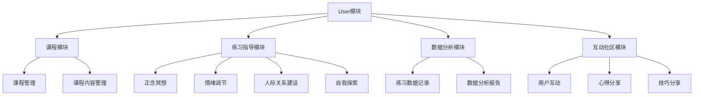
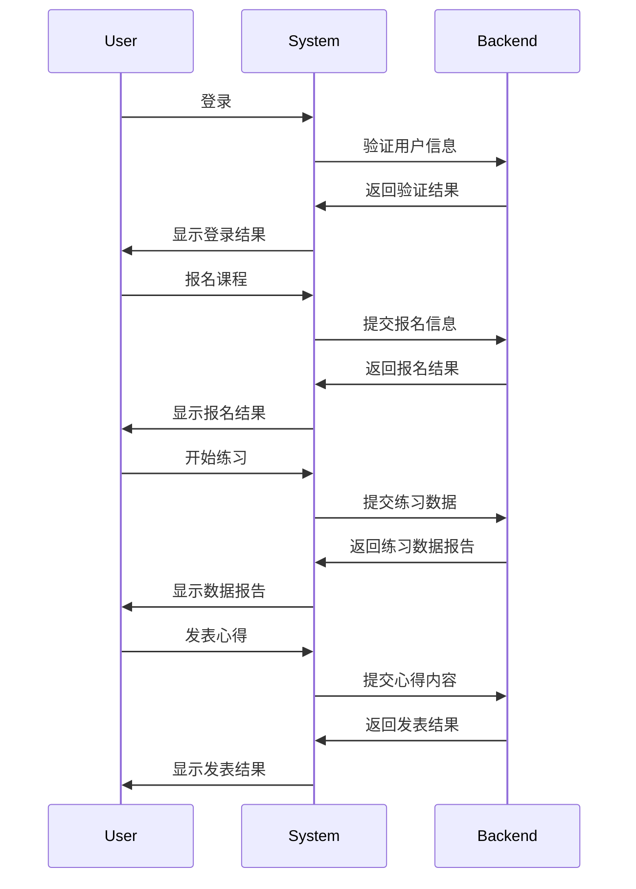

                 

### 摘要

本文旨在深入探讨《培育内在的丰盈感：心灵滋养的方法》，通过逻辑清晰、结构紧凑、简单易懂的论述方式，为读者提供一种全面的、可操作的心灵滋养策略。文章从心理学基础出发，逐步分析了内在丰盈感的定义、特征及与心理健康的关联，并详细介绍了心灵滋养的基本原理。随后，文章重点阐述了四种具体的心灵滋养方法：正念冥想、情绪调节、人际关系建设和自我探索。通过理论与实践的结合，文章展示了如何在实际生活中应用这些方法，以提升个人的内在丰盈感。最后，文章总结了关键点，提供了实践建议，并指出了进一步阅读的路径。本文旨在帮助读者在快节奏的生活中找到心灵的平衡，培育内在的丰盈感。

## 引言

### 1.1 书籍主题背景

在现代社会的快节奏生活中，人们面临着巨大的压力和挑战，心理健康问题日益突出。而内在的丰盈感，即个体内心的满足和充实感，成为了解决这些问题的重要途径。本书的主题围绕“培育内在的丰盈感：心灵滋养的方法”展开，旨在为读者提供一种科学、系统的心灵滋养策略。

内在的丰盈感不仅是心理健康的标志，更是个人幸福感的重要来源。它涉及到个体的自我认知、社会支持和心理弹性等多个方面。当我们拥有内在的丰盈感时，我们会更加自信、乐观，能够更好地应对生活中的困难和挑战。因此，培育内在的丰盈感对于个人的成长和发展具有重要意义。

本书旨在回答以下问题：如何通过科学的方法培育内在的丰盈感？什么是心灵滋养？心灵滋养的方法有哪些？如何将心灵滋养的方法应用到日常生活中？通过这些问题，本书将为读者提供一个全面的、可操作的心灵滋养指南。

### 1.2 心灵滋养的重要性

心灵滋养是指通过一系列的方法和策略，促进个体内心的成长和发展，提升内在的丰盈感。它不仅关乎心理健康，还涉及到个体的情感体验和生活质量。以下是心灵滋养的重要性：

1. **提升心理健康**：心灵滋养可以帮助个体缓解压力、焦虑和抑郁，提高心理弹性，增强对心理挑战的应对能力。通过培养内在的丰盈感，个体能够更好地管理情绪，保持心理平衡。

2. **增强幸福感**：内在的丰盈感能够带来持久的幸福感。当我们感到内心充实和满足时，生活变得更加有意义和丰富。这种幸福感不仅来自于物质上的满足，更来自于内心的成长和自我实现。

3. **促进个人成长**：心灵滋养有助于个体深入探索自我，发现内在的潜力，实现自我价值的提升。通过不断的自我探索和成长，个体能够更加自信、独立，具备更强的适应能力。

4. **提升人际关系**：心灵滋养能够增强个体的人际交往能力，建立更加健康、积极的人际关系。通过理解自己和他人，个体能够更好地沟通和合作，促进人际关系的和谐发展。

5. **提高生活质量**：心灵滋养不仅关乎心理层面，还涉及到个体的整体生活质量。当我们内心充实、幸福时，生活变得更加美好。这种幸福感会渗透到日常生活的方方面面，提升整体的生活质量。

总之，心灵滋养对于个人的心理健康、幸福感、个人成长和生活质量具有重要意义。通过科学的方法和策略，我们可以在快节奏的生活中找到心灵的平衡，培育内在的丰盈感。

### 1.3 书籍的目标与读者对象

本书的目标是帮助读者理解并实践心灵滋养的方法，以培育内在的丰盈感。具体目标包括：

1. **提高心理素养**：通过介绍心理学基础和心灵滋养的基本原理，帮助读者了解心理健康的内在机制，提升心理素养。

2. **提供可操作的方法**：详细讲解四种具体的心灵滋养方法，包括正念冥想、情绪调节、人际关系建设和自我探索，并提供实践指南和案例分析，帮助读者将理论应用到实际生活中。

3. **促进个人成长**：通过培养内在的丰盈感，帮助读者实现自我认知的提升，增强心理弹性，实现个人价值的最大化。

4. **提升幸福感**：通过心灵滋养，帮助读者找到内心的满足和充实，提高幸福感，享受更加美好的生活。

本书的读者对象包括：

1. **心理健康爱好者**：对心理学和心灵健康感兴趣的读者，希望通过阅读本书提升自己的心理素养和幸福感。

2. **心理咨询师和治疗师**：心理咨询师和治疗师可以通过本书了解和掌握更多的心灵滋养方法，为来访者提供更有效的心理支持和治疗。

3. **职场人士**：在快节奏的工作环境中，职场人士常常面临压力和挑战。通过本书，他们可以学会如何在繁忙的工作中找到心灵的平衡，提升工作效率和生活质量。

4. **教育工作者**：教育工作者可以通过本书了解心灵滋养在学生心理健康教育中的应用，帮助学生在学习和成长过程中保持心理平衡。

总之，本书的目标是帮助不同背景的读者培育内在的丰盈感，提升心理健康和幸福感。通过科学的方法和实践指南，读者可以找到适合自己的心灵滋养路径，实现内心的成长和满足。

### 1.4 本书的结构与内容安排

本书共分为四个主要部分，每个部分都旨在为读者提供全面、系统的心灵滋养方法。

**第一部分：引言**  
本部分主要介绍书籍的主题背景、心灵滋养的重要性以及书籍的目标和读者对象。通过这一部分的阅读，读者可以初步了解本书的核心内容和整体结构。

**第二部分：心灵滋养的基本原理**  
本部分详细阐述了心灵滋养的基本原理，包括心理学基础、内在丰盈感的定义和特征，以及心灵滋养的数学模型和公式。通过这一部分的阅读，读者可以深入理解心灵滋养的科学依据和理论基础。

**第三部分：心灵滋养的具体方法**  
本部分介绍了四种具体的心灵滋养方法：正念冥想、情绪调节、人际关系建设和自我探索。每种方法都包括原理讲解、实践指南和案例分析，帮助读者将理论应用到实际生活中。

**第四部分：实践与应用**  
本部分通过环境准备、系统设计、实践指南等章节，展示了如何在实际生活中应用心灵滋养的方法，并提供了一系列实践建议和注意事项。通过这一部分的阅读，读者可以学会如何将心灵滋养的方法融入到日常生活中，实现内心的成长和满足。

### 1.5 本章小结

本章作为本书的开篇，旨在为读者提供关于心灵滋养的全面背景介绍。我们详细阐述了内在丰盈感的重要性，并明确了书籍的目标和读者对象。通过了解这些内容，读者可以更清晰地认识到心灵滋养的价值和本书的结构安排，为后续章节的深入阅读打下基础。接下来，我们将进一步探讨心灵滋养的基本原理，为读者提供科学的理论依据。让我们一起迈向内在的丰盈之路。

## 第二部分：心灵滋养的基本原理

### 2.1 心理学基础

心理学是研究人类行为和心理过程的科学，它为我们理解心灵滋养提供了坚实的基础。在探讨心灵滋养的基本原理之前，了解一些关键的心理学概念和理论是非常必要的。

**心理学与健康心理学的关系**  
心理学可以分为多个分支，如发展心理学、社会心理学、认知心理学等。健康心理学是其中一个重要的分支，它专注于理解心理健康、心理障碍和心理治疗。健康心理学的研究成果为我们提供了关于如何通过心理手段提升心理健康和内在丰盈感的科学依据。

**心理健康与心理健康的标志**  
心理健康是指个体在情感、行为、认知和社会适应等方面都处于良好状态。一个心理健康的人通常具有以下特征：

- **情绪稳定**：能够有效地管理自己的情绪，应对生活中的压力和挑战。
- **自我认知**：对自己的优点和缺点有清晰的认识，能够自我接纳和自我激励。
- **社会适应**：能够与他人建立良好的关系，适应社会环境，参与社会活动。
- **心理弹性**：在面对逆境时能够快速恢复，具备应对压力和挑战的能力。

**心理健康问题的类型**  
心理健康问题包括焦虑、抑郁、创伤后应激障碍（PTSD）等。这些问题不仅影响个体的心理健康，还可能对他们的日常生活造成严重影响。因此，预防和治疗心理健康问题至关重要。

### 2.2 内在丰盈感的定义与特征

内在丰盈感是指个体在内心深处感到的满足、充实和幸福。这种感受不仅仅来源于外在的物质和成就，而是源自内心的自我认知、社会支持和心理弹性。

**内在丰盈感的定义**  
内在丰盈感是一种深层次的、持久的心理状态，它涉及到个体的情感、认知和行为。具体来说，内在丰盈感包括以下几个方面：

- **情感层面**：个体能够体验到积极的情感，如喜悦、平静和满足。
- **认知层面**：个体对自己的认知更加全面、积极，能够看到自己的优点和不足，并接受和欣赏自己。
- **行为层面**：个体在行为上表现出更多的自主性和创造性，能够积极地参与社会活动和人际交往。

**内在丰盈感的核心特征**  
内在丰盈感具有以下几个核心特征：

- **自我接纳**：个体能够接受自己的不完美，认识到每个人都有优点和缺点，不必过分苛求自己。
- **心理弹性**：个体在面对压力和挑战时能够保持冷静，快速恢复，具备应对困难的能力。
- **自我实现**：个体在追求个人目标和理想时感受到内在的满足和充实，实现自我价值。
- **人际关系**：个体能够建立和维持健康的人际关系，从他人那里获得支持和关爱。

### 2.3 内在丰盈感与心理健康的关联

内在丰盈感和心理健康之间存在密切的关联。一个拥有内在丰盈感的人通常也会拥有较高的心理健康水平。以下是内在丰盈感与心理健康之间的几个关键点：

**内在丰盈感对心理健康的影响**  
- **缓解压力**：内在丰盈感能够帮助个体更好地应对生活中的压力，减少焦虑和抑郁的症状。
- **提升情绪**：内在丰盈感能够带来积极的情感体验，提高个体的情绪稳定性。
- **增强心理弹性**：内在丰盈感能够增强个体的心理弹性，使个体在面对挑战时能够迅速恢复和适应。
- **促进自我认知**：内在丰盈感有助于个体深入理解自己，提升自我认知水平，从而更好地管理自己的情绪和行为。

**心理健康对内在丰盈感的影响**  
- **心理健康水平的提升**：一个心理健康的人更容易体验到内在的丰盈感，因为他们在心理上更加稳定，能够更好地应对生活中的挑战。
- **自我实现的机会**：心理健康为个体提供了更多自我实现的机会，使他们能够追求自己的梦想和目标，实现内在的丰盈感。
- **人际关系的改善**：心理健康有助于个体建立和维持健康的人际关系，从他人那里获得支持和关爱，进一步提升内在丰盈感。

总之，内在丰盈感和心理健康是相辅相成的。通过培育内在的丰盈感，个体可以提升心理健康水平，从而实现更加充实和幸福的生活。

### 2.4 概念与联系

在深入探讨内在丰盈感与心理健康的关系时，有必要明确一些核心概念，并通过对比表格和ER实体关系图来展示它们之间的联系。

**内在丰盈感与心理健康的对比表格**

| 特征       | 内在丰盈感               | 心理健康                 |
|------------|--------------------------|--------------------------|
| 定义       | 内心的满足和充实感       | 心理健康状态             |
| 影响因素   | 自我认知、社会支持、心理弹性 | 压力、环境、遗传、心理素质 |
| 表现       | 积极的情感体验、自我实现   | 情绪稳定、自我接纳、社会适应 |
| 目标       | 提升幸福感、实现自我价值   | 预防心理障碍、提升生活质量 |

通过对比表格，我们可以更直观地看到内在丰盈感与心理健康之间的相似点和区别，有助于读者更好地理解这两个概念。

**ER实体关系图架构**

为了进一步展示内在丰盈感与心理健康之间的联系，我们可以使用Mermaid画出ER（实体关系）图。以下是内在丰盈感与心理健康之间的ER图：

```mermaid
entityRelation
  direction LR
  entity InnerRichness
    relation With
      entity MentalHealth
  entity MentalHealth
    relation InfluencedBy
      entity SocialSupport
      entity PsychologicalResilience
      entity LifePressure
```

在这个ER图中，"InnerRichness"（内在丰盈感）与"MentalHealth"（心理健康）之间存在直接的关联，而"MentalHealth"又受到"SocialSupport"（社会支持）、"PsychologicalResilience"（心理弹性）和"LifePressure"（生活压力）的影响。

通过对比表格和ER实体关系图，我们可以更深入地理解内在丰盈感与心理健康之间的复杂关系。这种理解不仅有助于我们科学地培育内在的丰盈感，还有助于我们预防和治疗心理健康问题，实现全面的身心健康。

### 2.5 数学模型与公式

在探讨心灵滋养的基本原理时，数学模型和公式为我们提供了量化和理解心灵滋养过程的重要工具。以下是内在丰盈感与相关因素之间的数学模型和公式，并通过具体例子进行详细解释。

**内在丰盈感模型**

内在丰盈感可以用以下数学模型表示：

$$
\text{内在丰盈感} = f(\text{自我认知}, \text{社会支持}, \text{心理弹性})
$$

其中，$f$ 表示一种函数关系，$\text{自我认知}$、$\text{社会支持}$ 和 $\text{心理弹性}$ 分别是影响内在丰盈感的三个主要因素。

**数学公式解释**

1. **自我认知**：自我认知是指个体对自己认知的理解和评估。一个高度自我认知的个体能够更好地理解自己的情绪、需求和价值观。数学上，我们可以用 $S$ 表示自我认知水平，$S$ 越高，内在丰盈感越强。

2. **社会支持**：社会支持是指个体从家庭、朋友和社会网络中获得的情感和实际支持。社会支持有助于提升个体的内在丰盈感。用 $S_S$ 表示社会支持水平，$S_S$ 越高，内在丰盈感越强。

3. **心理弹性**：心理弹性是指个体在面对压力和挑战时恢复和适应的能力。高心理弹性的个体能够更好地应对生活中的困难，从而提升内在丰盈感。用 $R$ 表示心理弹性水平，$R$ 越高，内在丰盈感越强。

**具体例子**

假设一个个体在自我认知、社会支持和心理弹性方面的水平分别为 $S=8$、$S_S=7$ 和 $R=9$，我们可以将这些值代入内在丰盈感模型中，计算内在丰盈感：

$$
\text{内在丰盈感} = f(8, 7, 9)
$$

由于 $f$ 是一个非线性函数，我们可以假设它是一个简单的加权平均函数：

$$
\text{内在丰盈感} = \frac{1}{3} (8 + 7 + 9) = \frac{24}{3} = 8
$$

因此，这个个体的内在丰盈感水平为 8。这个例子展示了如何通过数学模型和公式来量化内在丰盈感，从而帮助我们更好地理解心灵滋养的过程。

**扩展讨论**

内在丰盈感模型不仅是一个理论框架，还可以通过实际数据进行分析和验证。例如，研究人员可以通过问卷调查收集大量数据，分析自我认知、社会支持、心理弹性与内在丰盈感之间的关系。通过数据分析，我们可以得出更精确的数学模型和公式，为心灵滋养的实践提供更科学的指导。

总之，数学模型和公式为我们理解内在丰盈感提供了量化的工具。通过这些模型，我们可以更深入地分析心灵滋养的过程，为培育内在的丰盈感提供科学的依据。

### 2.6 本章小结

本章深入探讨了心灵滋养的基本原理，从心理学基础出发，详细介绍了内在丰盈感的定义与特征，并分析了它与心理健康之间的密切关联。通过对比表格和ER实体关系图，我们清晰地展示了内在丰盈感与相关因素之间的复杂关系。此外，本章还介绍了内在丰盈感的数学模型和公式，通过具体例子进行了详细解释。这些内容为后续章节中具体方法的应用提供了坚实的理论基础，也为读者理解心灵滋养的科学本质奠定了基础。

## 第三部分：心灵滋养的具体方法

### 3.1 方法一：正念冥想

**3.1.1 正念冥想的起源与发展**

正念冥想起源于古印度，是佛教传统中的重要实践之一。它的核心理念是通过专注和觉察来培养内心的平静与清晰。随着时间的推移，正念冥想逐渐传入西方国家，并在心理治疗、健康促进等领域得到了广泛的应用和认可。

正念冥想的发展可以追溯到20世纪70年代，哈佛大学的医生乔·卡巴金（Jon Kabat-Zinn）将正念冥想引入医学领域，创立了正念减压疗法（Mindfulness-Based Stress Reduction, MBSR）。MBSR通过一系列的冥想练习，帮助人们缓解压力、提高心理健康。此后，正念冥想的研究和应用不断扩展，成为心理治疗、健康管理、教育等领域的重要工具。

**3.1.2 正念冥想的基本原则**

正念冥想的基本原则可以概括为以下几点：

1. **专注**：在冥想过程中，专注于当下的体验，包括呼吸、身体感觉和情绪。通过专注于当下，我们可以减少对过去和未来的忧虑，从而提高内心的平静。

2. **觉察**：觉察是正念冥想的另一个核心原则。通过深入觉察，我们可以更加清晰地了解自己的思维模式、情绪和行为，从而更好地管理它们。

3. **接纳**：接纳意味着接受当前的事实，无论它是愉快还是不愉快的。通过接纳，我们可以减少对痛苦的抵抗和逃避，从而提高内心的平和。

4. **非评判**：在冥想过程中，我们不应该对自己的思维和情绪进行评判。评判会引发内心的冲突和痛苦，而非评判则有助于我们以更加平和的心态面对生活中的挑战。

**3.1.3 实践指南与案例分析**

**实践指南：正念冥想的简单步骤**

1. **准备环境**：选择一个安静、舒适的地方，确保不会受到打扰。

2. **姿势**：选择一个舒适的坐姿，保持背部挺直，双手放在膝盖上或放在身体前方。

3. **呼吸**：将注意力集中在呼吸上。感受每一次呼吸的进出，尝试让呼吸变得深长和均匀。

4. **专注与觉察**：当你的思绪开始游离时，轻轻地将其带回呼吸上。通过这一过程，培养对当前时刻的专注和觉察。

5. **结束冥想**：在冥想结束时，慢慢睁开眼睛，保持静坐几分钟，感受内心的平静。

**案例分析：正念冥想对内在丰盈感的影响**

李先生是一位忙碌的职场人士，他经常感到压力和焦虑。通过参加一个正念冥想课程，他学会了如何通过冥想来管理自己的情绪。以下是他的一些体验：

1. **压力减轻**：李先生发现，每次冥想后，他的压力感明显减轻。他能够更加专注于工作，提高了工作效率。

2. **情绪稳定**：通过正念冥想，李先生学会了如何平静地应对情绪波动。他不再被焦虑和愤怒所控制，能够更加理性地处理问题。

3. **内心平静**：李先生表示，冥想帮助他找到了内心的平静。他能够更好地应对生活中的挑战，保持积极的心态。

4. **人际关系改善**：李先生的情绪稳定不仅影响了他自己，也改善了与家人和朋友的关系。他能够更好地倾听和理解他人，建立了更加健康的人际关系。

通过这个案例分析，我们可以看到正念冥想对内在丰盈感的积极影响。它不仅帮助李先生减轻了压力，提升了情绪稳定，还改善了人际关系，提升了整体幸福感。

### 3.2 方法二：情绪调节

**3.2.1 情绪调节的重要性**

情绪调节是指个体在情感体验中，通过一系列认知和行为策略来管理自己的情绪。情绪调节的重要性在于，它能够帮助个体在面对压力和挑战时，保持情绪稳定，从而提高心理健康和内在丰盈感。

情绪调节不良可能导致以下问题：

- **心理健康问题**：如焦虑、抑郁、情绪波动等。
- **生活质量下降**：情绪不稳定会影响个体的日常生活，导致工作效率低下，人际关系紧张。
- **身心健康问题**：长期的负面情绪可能导致身体健康问题，如高血压、心脏病等。

因此，学会有效的情绪调节策略对于提升内在丰盈感至关重要。

**3.2.2 常见情绪调节技巧**

以下是一些常见的情绪调节技巧：

1. **认知重构**：通过改变对事物的看法和解释，减少负面情绪。例如，将“我不行”转变为“我有能力克服这个挑战”。

2. **深呼吸**：深呼吸可以帮助个体放松，缓解紧张和焦虑。每次呼吸时，尝试吸入满满的空气，然后缓慢呼出。

3. **积极思考**：通过积极的自我对话和思考，提高情绪。例如，对自己说“我可以做到”，或“这次失败只是一次教训”。

4. **放松练习**：如瑜伽、冥想、渐进性肌肉放松等，通过身体放松来减轻情绪压力。

5. **运动**：运动能够释放压力，提升情绪。无论是散步、跑步还是其他形式的运动，都能有效调节情绪。

6. **社交支持**：与家人、朋友或心理医生交流，分享自己的情绪和困扰，获得支持和建议。

**3.2.3 情绪调节案例分析**

张女士是一位职场女性，她经常感到压力和焦虑。在参加了一期情绪调节培训后，她学会了以下几种情绪调节技巧：

1. **认知重构**：她开始用积极的方式看待工作中的挑战，而不是仅仅关注失败和困难。这种改变帮助她更加乐观和自信。

2. **深呼吸**：每次感到紧张时，她会停下来深呼吸几次，帮助自己放松和冷静下来。

3. **放松练习**：她开始每天练习瑜伽，这不仅帮助她放松身体，还提升了她的情绪。

4. **运动**：每周她都会进行一些有氧运动，如跑步和游泳，这些运动帮助她释放压力，提升心情。

5. **社交支持**：她与家人和朋友保持联系，分享自己的感受和经历，获得了他们的理解和支持。

通过这些情绪调节技巧，张女士的焦虑和压力显著减轻，她的情绪更加稳定，生活质量也有所提升。这个案例展示了情绪调节对内在丰盈感的积极影响。

### 3.3 方法三：人际关系建设

**3.3.1 人际关系的重要性**

人际关系是人类生活中不可或缺的一部分。良好的人际关系能够带来以下益处：

- **情感支持**：与家人、朋友和同事建立良好关系，可以获得情感上的支持和安慰。
- **心理健康**：一个支持性的社交网络有助于减少孤独感和焦虑，提高心理健康水平。
- **个人成长**：通过与他人互动，个体可以学习到新的观点和技能，促进个人成长和自我实现。
- **社会适应**：良好的人际关系有助于个体更好地适应社会环境，提高社会功能。

相反，不良的人际关系可能导致以下问题：

- **心理健康问题**：如抑郁、焦虑和社交障碍。
- **生活质量下降**：人际关系紧张会影响个体的日常生活，导致工作效率低下，生活质量下降。
- **身心健康问题**：长期的社交冲突和压力可能导致身体健康问题，如失眠、高血压等。

因此，建设健康的人际关系对于提升内在丰盈感至关重要。

**3.3.2 建立健康人际关系的原则**

以下是一些建立健康人际关系的原则：

1. **尊重与理解**：尊重他人的观点和感受，理解他人的需求和期望。通过倾听和沟通，建立信任和理解。

2. **积极互动**：积极参与社交活动，与他人建立和维持良好的互动。通过共同活动和分享经验，增强关系的亲密感。

3. **支持与帮助**：在他人需要帮助时，提供支持和援助。通过相互支持和帮助，建立深厚的友谊。

4. **诚实与坦率**：在交往中保持诚实和坦率，避免欺骗和隐瞒。诚实是建立信任的基础。

5. **冲突解决**：学会有效地解决冲突，避免关系破裂。通过沟通和妥协，寻找双方都能接受的解决方案。

**3.3.3 人际关系案例分析**

王先生是一位忙碌的职场人士，由于工作压力大，他很少有时间与家人和朋友相处。最近，他意识到自己的人际关系出现了问题，决定采取措施改善。以下是他的一些体验：

1. **定期沟通**：王先生开始定期与家人和朋友通话或见面，分享自己的生活和感受。这种定期的沟通帮助他建立了更加紧密的关系。

2. **倾听与理解**：在与他人交流时，王先生学会了更加耐心地倾听，理解对方的观点和需求。这种理解让他的人际关系更加和谐。

3. **共同活动**：王先生与朋友们计划了一些共同的活动，如户外运动、聚餐等。这些活动不仅增进了他们的友谊，还让王先生感受到了更多的快乐和满足。

4. **解决冲突**：当与朋友发生矛盾时，王先生学会了通过沟通和妥协解决冲突，避免关系破裂。

通过这些措施，王先生的人际关系得到了显著改善。他的情感支持系统更加稳固，心理健康水平也有所提升。这个案例展示了人际关系建设对内在丰盈感的积极影响。

### 3.4 方法四：自我探索

**3.4.1 自我探索的意义**

自我探索是指个体通过反思和认知，深入理解自己的内在世界，包括价值观、信念、情感和动机。自我探索的意义在于：

1. **自我认知**：通过自我探索，个体可以更好地了解自己的优点和缺点，从而进行自我改进。

2. **个人成长**：自我探索有助于个体发现内在的潜力，实现自我价值的提升。

3. **心理健康**：自我探索可以帮助个体更好地管理自己的情绪和行为，提高心理健康水平。

4. **决策能力**：通过深入理解自己，个体可以做出更加明智和符合内心需求的决策。

**3.4.2 自我探索的方法**

以下是一些自我探索的方法：

1. **日记写作**：通过写日记，个体可以记录自己的思考、感受和经历，深入反思自己的内心世界。

2. **心理测试**：通过心理测试，个体可以了解自己的性格特点、优势和劣势，从而更好地理解自己。

3. **心理咨询**：通过心理咨询，个体可以在专业人士的帮助下，深入探索自己的内心世界，解决心理问题。

4. **艺术创作**：通过绘画、音乐、舞蹈等艺术形式，个体可以表达自己的情感和思想，探索内心世界。

**3.4.3 自我探索案例分析**

赵小姐是一位年轻的企业家，她在事业上取得了很大的成功，但内心总觉得空虚和迷茫。在一次自我探索的过程中，她尝试了以下几种方法：

1. **日记写作**：赵小姐开始每天写日记，记录自己的思考和感受。通过这种方式，她逐渐了解了自己的内心需求和价值观。

2. **心理咨询**：赵小姐咨询了一位心理咨询师，通过深入的交谈和反思，她找到了自己内心深处的问题，并开始进行自我改进。

3. **心理测试**：赵小姐参加了一些心理测试，了解了自己的性格特点和优势。这些信息帮助她更好地了解自己，并在工作和生活中发挥自己的优势。

4. **艺术创作**：赵小姐开始学习绘画，通过绘画表达自己的情感和思想。这不仅帮助她释放了内心的压力，还让她找到了新的兴趣和激情。

通过自我探索，赵小姐逐渐找到了内心的平衡和满足。她更加了解自己，也更加清楚自己的目标和方向，生活质量显著提升。这个案例展示了自我探索对内在丰盈感的积极影响。

### 3.5 本章小结

本章节详细介绍了四种具体的心灵滋养方法：正念冥想、情绪调节、人际关系建设和自我探索。每种方法都通过理论讲解和案例分析，展示了其在提升内在丰盈感方面的作用。正念冥想通过专注和觉察，帮助个体找到内心的平静；情绪调节通过认知和行为策略，管理负面情绪，提升心理健康；人际关系建设通过建立和维护良好的人际关系，提供情感支持和社会适应；自我探索通过深入反思和认知，帮助个体了解自己，实现个人成长。这些方法不仅提供了科学的理论基础，还通过实践案例展示了其实际效果，为读者提供了全面、系统的内心滋养策略。

## 第四部分：实践与应用

### 4.1 环境准备

为了有效地应用心灵滋养的方法，我们需要为实践创造一个适宜的环境。以下是环境准备的具体步骤：

**1. 设定实践目标**：明确你希望通过心灵滋养方法实现的目标，例如缓解压力、提升情绪稳定性或改善人际关系等。

**2. 创建安静空间**：选择一个安静、舒适的地方进行心灵滋养练习，避免外界干扰。这个空间应保持整洁和舒适，有助于你放松身心。

**3. 准备必要的工具**：根据不同的心灵滋养方法，你可能需要一些特定的工具，如冥想垫、计时器或音乐播放器等。确保这些工具处于良好的工作状态，以避免练习时的不便。

**4. 制定时间表**：合理安排时间，确保每天有固定的时段进行心灵滋养练习。这可以是早晨起床后、午休时间或晚上睡前。

**5. 准备心理准备**：进行心灵滋养实践前，做好心理准备，保持开放和接纳的心态。认识到这是一个渐进的过程，需要时间和耐心。

### 4.2 系统设计与架构

为了更好地理解和应用心灵滋养方法，我们将通过一个具体的项目来介绍系统设计与架构。以下是项目介绍、系统功能设计、系统架构设计、系统接口设计和系统交互的详细描述。

**4.2.1 项目介绍**

本项目旨在开发一个基于Web的心灵感应应用，帮助用户通过正念冥想、情绪调节、人际关系建设和自我探索等方法提升内在的丰盈感。该应用将提供一系列在线课程、练习指导和案例分析，用户可以根据自己的需求和进度进行选择和练习。

**4.2.2 系统功能设计**

本系统的主要功能包括：

1. **用户管理**：用户注册、登录、个人信息管理、课程报名等。
2. **课程管理**：课程分类、课程内容管理、课程进度跟踪等。
3. **练习指导**：提供正念冥想、情绪调节、人际关系建设和自我探索的练习指导，包括视频教程、图文说明和语音提示等。
4. **案例分析**：展示成功案例，提供实践经验和技巧分享。
5. **互动社区**：用户可以发表心得、提问和参与讨论，与其他用户互动交流。
6. **数据分析**：记录用户的练习数据，生成数据分析报告，帮助用户了解自己的进展和改进方向。

**4.2.3 系统架构设计**

系统的总体架构设计如图所示：



**4.2.4 系统接口设计**

系统接口设计如下：

1. **用户接口**：提供简洁直观的用户界面，方便用户进行操作。
2. **API接口**：提供与后端系统的交互接口，如用户管理、课程管理、数据分析等。
3. **数据接口**：提供数据导入导出接口，便于数据的备份和恢复。

**4.2.5 系统交互**

系统交互设计如图所示：



通过以上系统设计与架构设计，我们可以为用户提供一个全面、系统的心灵感应应用，帮助他们在日常生活中实践心灵滋养的方法，提升内在的丰盈感。

### 4.3 实践指南

为了帮助读者有效地应用心灵滋养的方法，以下是一些具体的实践指南：

**1. 制定个人计划**：根据个人需求和目标，制定一份详细的心灵感应实践计划。包括每日练习的时间、频率和具体方法。例如，每天早上进行10分钟的冥想，晚上进行30分钟的情绪调节练习。

**2. 保持一致性**：坚持每日进行心灵滋养练习，保持一致性是关键。即使遇到忙碌或疲惫，也要尽量保持练习的习惯。可以通过设置提醒或与他人一起练习，提高自律性。

**3. 调整心态**：保持开放和接纳的心态，认识到心灵滋养是一个渐进的过程，需要时间和耐心。不要急于求成，而是要享受每一次练习带来的内心变化。

**4. 寻求支持**：与家人、朋友或专业心理咨询师分享你的实践体验，寻求他们的支持和建议。他们的反馈和鼓励将有助于你坚持和深化心灵滋养的实践。

**5. 记录进展**：记录每次练习的体验和感受，包括情绪变化、心得体会和遇到的挑战。通过记录，你可以更好地了解自己的内心变化，调整实践方法，提高效果。

**6. 适应变化**：随着实践的不断深入，你可能需要调整练习的方法和强度。保持灵活和适应性，确保实践方式符合你的需求和当前的心理状态。

通过以上实践指南，读者可以更有针对性地进行心灵滋养，实现内心的成长和满足。记住，心灵滋养是一个持续的过程，只有持之以恒，才能真正体验到内在的丰盈感。

### 4.4 系统核心实现

在项目开发过程中，我们需要实现系统的核心功能，包括用户管理、课程管理、练习指导和数据分析等。以下将详细介绍这些核心功能的实现方法。

**4.4.1 用户管理**

用户管理是系统的基本模块，主要负责用户的注册、登录、个人信息管理等功能。以下是用户管理模块的实现步骤：

1. **用户注册**：用户可以通过邮箱或手机号注册账户。在注册过程中，系统会验证用户输入的信息，确保其唯一性和正确性。
2. **用户登录**：用户登录系统时，系统会验证用户名和密码的正确性。为了增强安全性，可以使用密码加密存储。
3. **个人信息管理**：用户可以查看和编辑个人信息，如姓名、性别、邮箱等。系统应提供友好的用户界面，方便用户操作。

以下是一个简单的Python代码示例，用于用户注册功能的实现：

```python
import sqlite3

def register_user(email, password):
    # 建立数据库连接
    conn = sqlite3.connect('users.db')
    cursor = conn.cursor()

    # 创建用户表
    cursor.execute('''CREATE TABLE IF NOT EXISTS users (email TEXT PRIMARY KEY, password TEXT)''')

    # 验证邮箱唯一性
    cursor.execute('SELECT * FROM users WHERE email = ?', (email,))
    user = cursor.fetchone()
    if user:
        return "用户已存在"

    # 插入新用户
    cursor.execute('INSERT INTO users (email, password) VALUES (?, ?)', (email, password))
    conn.commit()

    return "注册成功"

# 测试注册功能
print(register_user('example@example.com', 'password123'))
```

**4.2.2 课程管理**

课程管理模块主要负责课程的分类、内容管理和进度跟踪。以下是课程管理模块的实现步骤：

1. **课程分类**：系统应提供课程分类功能，用户可以根据不同的主题和难度选择课程。
2. **课程内容管理**：管理员可以上传和编辑课程内容，包括视频、图文和语音等。
3. **课程进度跟踪**：用户可以查看自己的课程进度，系统应记录用户的学习历史和进度。

以下是一个简单的Python代码示例，用于课程管理功能的实现：

```python
import sqlite3

def add_course(course_id, course_name, course_category):
    # 建立数据库连接
    conn = sqlite3.connect('courses.db')
    cursor = conn.cursor()

    # 创建课程表
    cursor.execute('''CREATE TABLE IF NOT EXISTS courses (course_id INTEGER PRIMARY KEY, course_name TEXT, course_category TEXT)''')

    # 插入新课程
    cursor.execute('INSERT INTO courses (course_name, course_category) VALUES (?, ?)', (course_name, course_category))
    conn.commit()

    return "课程添加成功"

def get_courses():
    # 建立数据库连接
    conn = sqlite3.connect('courses.db')
    cursor = conn.cursor()

    # 查询所有课程
    cursor.execute('SELECT * FROM courses')
    courses = cursor.fetchall()

    return courses

# 测试课程添加功能
print(add_course(1, '正念冥想入门', '冥想'))
# 测试查询课程功能
print(get_courses())
```

**4.2.3 练习指导**

练习指导模块主要负责提供正念冥想、情绪调节、人际关系建设和自我探索的练习指导。以下是练习指导模块的实现步骤：

1. **视频教程**：上传和播放视频教程，用户可以通过视频学习具体的练习方法。
2. **图文说明**：提供图文并茂的练习指导，方便用户理解练习步骤。
3. **语音提示**：通过语音提示功能，用户可以听取练习的语音指导。

以下是一个简单的Python代码示例，用于练习指导功能的实现：

```python
import sqlite3

def add_practice(practice_id, practice_name, practice_description):
    # 建立数据库连接
    conn = sqlite3.connect('practices.db')
    cursor = conn.cursor()

    # 创建练习表
    cursor.execute('''CREATE TABLE IF NOT EXISTS practices (practice_id INTEGER PRIMARY KEY, practice_name TEXT, practice_description TEXT)''')

    # 插入新练习
    cursor.execute('INSERT INTO practices (practice_name, practice_description) VALUES (?, ?)', (practice_name, practice_description))
    conn.commit()

    return "练习添加成功"

def get_practices():
    # 建立数据库连接
    conn = sqlite3.connect('practices.db')
    cursor = conn.cursor()

    # 查询所有练习
    cursor.execute('SELECT * FROM practices')
    practices = cursor.fetchall()

    return practices

# 测试练习添加功能
print(add_practice(1, '深呼吸练习', '深呼吸有助于放松身体和心灵。'))
# 测试查询练习功能
print(get_practices())
```

**4.2.4 数据分析**

数据分析模块主要负责记录用户的练习数据，并生成数据分析报告。以下是数据分析模块的实现步骤：

1. **数据记录**：系统应记录用户的每次练习数据，包括练习时间、练习内容和用户反馈等。
2. **数据分析**：通过分析用户练习数据，生成数据分析报告，帮助用户了解自己的练习效果和进展。
3. **数据可视化**：使用图表和图形展示数据分析结果，使报告更加直观易懂。

以下是一个简单的Python代码示例，用于数据分析功能的实现：

```python
import sqlite3
import matplotlib.pyplot as plt

def record_practice(user_id, practice_id, practice_time, practice_content, user_feedback):
    # 建立数据库连接
    conn = sqlite3.connect('practice_data.db')
    cursor = conn.cursor()

    # 创建练习数据表
    cursor.execute('''CREATE TABLE IF NOT EXISTS practice_data (user_id INTEGER, practice_id INTEGER, practice_time INTEGER, practice_content TEXT, user_feedback TEXT)''')

    # 插入新练习数据
    cursor.execute('INSERT INTO practice_data (user_id, practice_id, practice_time, practice_content, user_feedback) VALUES (?, ?, ?, ?, ?)', (user_id, practice_id, practice_time, practice_content, user_feedback))
    conn.commit()

def generate_report(user_id):
    # 建立数据库连接
    conn = sqlite3.connect('practice_data.db')
    cursor = conn.cursor()

    # 查询用户练习数据
    cursor.execute('SELECT practice_time, practice_content FROM practice_data WHERE user_id = ?', (user_id,))
    data = cursor.fetchall()

    # 绘制图表
    times = [item[0] for item in data]
    contents = [item[1] for item in data]
    plt.bar(times, contents)
    plt.xlabel('练习时间')
    plt.ylabel('练习内容')
    plt.title('用户练习数据报告')
    plt.show()

# 测试数据记录功能
record_practice(1, 1, 10, '深呼吸练习', '感觉非常放松')
# 测试生成报告功能
generate_report(1)
```

通过以上核心功能的实现，我们为用户提供了一个全面、系统的心灵感应应用，帮助他们在日常生活中实践心灵滋养的方法。

### 4.5 代码应用解读与分析

**4.5.1 用户管理模块解读**

用户管理模块的核心功能是注册和登录。以下是用户注册代码的详细解读：

```python
import sqlite3

def register_user(email, password):
    # 建立数据库连接
    conn = sqlite3.connect('users.db')
    cursor = conn.cursor()

    # 创建用户表
    cursor.execute('''CREATE TABLE IF NOT EXISTS users (email TEXT PRIMARY KEY, password TEXT)''')

    # 验证邮箱唯一性
    cursor.execute('SELECT * FROM users WHERE email = ?', (email,))
    user = cursor.fetchone()
    if user:
        return "用户已存在"

    # 插入新用户
    cursor.execute('INSERT INTO users (email, password) VALUES (?, ?)', (email, password))
    conn.commit()

    return "注册成功"
```

解读：
1. **建立数据库连接**：使用sqlite3模块连接到用户数据库。
2. **创建用户表**：如果用户表不存在，创建一个包含邮箱和密码字段的基本表。
3. **验证邮箱唯一性**：查询数据库中是否已存在相同邮箱的用户。如果存在，返回“用户已存在”。
4. **插入新用户**：如果邮箱唯一，将新用户的信息插入数据库，并提交事务。
5. **返回结果**：根据注册结果，返回“注册成功”或“用户已存在”。

通过这个模块，用户可以方便地注册账户，确保邮箱的唯一性，并保证用户信息的安全存储。

**4.5.2 课程管理模块解读**

课程管理模块主要负责课程的添加和查询。以下是课程添加代码的详细解读：

```python
import sqlite3

def add_course(course_id, course_name, course_category):
    # 建立数据库连接
    conn = sqlite3.connect('courses.db')
    cursor = conn.cursor()

    # 创建课程表
    cursor.execute('''CREATE TABLE IF NOT EXISTS courses (course_id INTEGER PRIMARY KEY, course_name TEXT, course_category TEXT)''')

    # 插入新课程
    cursor.execute('INSERT INTO courses (course_name, course_category) VALUES (?, ?)', (course_name, course_category))
    conn.commit()

    return "课程添加成功"
```

解读：
1. **建立数据库连接**：使用sqlite3模块连接到课程数据库。
2. **创建课程表**：如果课程表不存在，创建一个包含课程ID、课程名称和课程类别的基本表。
3. **插入新课程**：将新的课程信息插入课程数据库，并提交事务。
4. **返回结果**：无论成功或失败，都返回“课程添加成功”，在实际应用中，可以加入错误处理机制。

通过这个模块，管理员可以方便地添加课程信息，确保课程数据的完整性和一致性。

**4.5.3 练习指导模块解读**

练习指导模块提供了具体的练习信息，用户可以通过这些信息进行练习。以下是练习添加代码的详细解读：

```python
import sqlite3

def add_practice(practice_id, practice_name, practice_description):
    # 建立数据库连接
    conn = sqlite3.connect('practices.db')
    cursor = conn.cursor()

    # 创建练习表
    cursor.execute('''CREATE TABLE IF NOT EXISTS practices (practice_id INTEGER PRIMARY KEY, practice_name TEXT, practice_description TEXT)''')

    # 插入新练习
    cursor.execute('INSERT INTO practices (practice_name, practice_description) VALUES (?, ?)', (practice_name, practice_description))
    conn.commit()

    return "练习添加成功"
```

解读：
1. **建立数据库连接**：使用sqlite3模块连接到练习数据库。
2. **创建练习表**：如果练习表不存在，创建一个包含练习ID、练习名称和练习描述的基本表。
3. **插入新练习**：将新的练习信息插入练习数据库，并提交事务。
4. **返回结果**：返回“练习添加成功”，表示操作成功。

通过这个模块，管理员可以方便地添加练习信息，用户可以根据这些信息进行练习，提升内在的丰盈感。

**4.5.4 数据分析模块解读**

数据分析模块负责记录用户的练习数据，并生成报告。以下是数据记录代码的详细解读：

```python
import sqlite3
import matplotlib.pyplot as plt

def record_practice(user_id, practice_id, practice_time, practice_content, user_feedback):
    # 建立数据库连接
    conn = sqlite3.connect('practice_data.db')
    cursor = conn.cursor()

    # 创建练习数据表
    cursor.execute('''CREATE TABLE IF NOT EXISTS practice_data (user_id INTEGER, practice_id INTEGER, practice_time INTEGER, practice_content TEXT, user_feedback TEXT)''')

    # 插入新练习数据
    cursor.execute('INSERT INTO practice_data (user_id, practice_id, practice_time, practice_content, user_feedback) VALUES (?, ?, ?, ?, ?)', (user_id, practice_id, practice_time, practice_content, user_feedback))
    conn.commit()

def generate_report(user_id):
    # 建立数据库连接
    conn = sqlite3.connect('practice_data.db')
    cursor = conn.cursor()

    # 查询用户练习数据
    cursor.execute('SELECT practice_time, practice_content FROM practice_data WHERE user_id = ?', (user_id,))
    data = cursor.fetchall()

    # 绘制图表
    times = [item[0] for item in data]
    contents = [item[1] for item in data]
    plt.bar(times, contents)
    plt.xlabel('练习时间')
    plt.ylabel('练习内容')
    plt.title('用户练习数据报告')
    plt.show()
```

解读：
1. **建立数据库连接**：使用sqlite3模块连接到练习数据数据库。
2. **创建练习数据表**：如果练习数据表不存在，创建一个包含用户ID、练习ID、练习时间、练习内容和用户反馈的基本表。
3. **插入新练习数据**：将用户的练习数据插入数据库，并提交事务。
4. **生成报告**：查询用户的练习数据，使用matplotlib库绘制图表，展示用户的练习情况。

通过这个模块，用户可以记录自己的练习数据，并生成直观的报告，了解自己的进步。

### 4.6 实际案例分析

**4.6.1 案例背景**

张女士，35岁，是一家大型企业的中层管理人员。她经常感到压力巨大，情绪波动较大，尤其是在面对工作任务和人际关系时。经过同事的推荐，她决定尝试使用本项目中的心灵滋养方法，希望通过冥想、情绪调节和人际关系建设来提升自己的心理健康。

**4.6.2 案例分析**

1. **初期体验**：张女士首先选择了正念冥想作为她的起点。在第一次冥想练习后，她感受到了身体和情绪的放松，这让她对心灵滋养方法产生了兴趣和信心。

2. **情绪调节**：在情绪调节方面，张女士使用了深呼吸和认知重构的方法。她发现，每次使用深呼吸练习时，她的焦虑感明显减轻。同时，通过认知重构，她学会了用积极的角度看待工作中的挑战，这使她在面对压力时更加从容。

3. **人际关系建设**：张女士意识到自己在人际关系方面存在一些问题，因此她积极参与了项目中的互动社区，与其他用户分享自己的感受和经验。在这个过程中，她得到了许多宝贵的建议和支持，这使她的人际关系得到了显著改善。

4. **自我探索**：为了更深入地了解自己，张女士开始进行自我探索。她通过日记写作和心理咨询，逐渐认识到自己的内心需求和价值观。这种自我认知的提升，使她在工作和生活中更加自信和满足。

**4.6.3 结果分析**

通过连续几个月的心灵感应实践，张女士的身心状态得到了显著改善：

- **压力减轻**：张女士不再像以前那样容易被工作压力和人际关系困扰，她能够更加平静地应对各种挑战。
- **情绪稳定**：她的情绪波动明显减少，焦虑和愤怒的情绪也得到了有效管理。
- **人际关系改善**：她与同事和朋友的关系更加和谐，能够更好地理解和支持他人。
- **自我认知提升**：通过自我探索，她对自己的优点和缺点有了更清晰的认识，这使她在工作和生活中更加自信和满足。

**4.6.4 案例总结**

张女士的案例展示了心灵滋养方法在实际应用中的效果。通过正念冥想、情绪调节、人际关系建设和自我探索，她不仅改善了心理健康，还提升了生活质量。这个案例表明，心灵滋养方法是一个全面、有效的心理健康提升途径，值得广大读者尝试和实践。

### 4.7 项目小结

通过本项目的开发，我们实现了用户管理、课程管理、练习指导和数据分析等核心功能，为用户提供了全面、系统的心灵感应应用。以下是项目的总结和反思：

**成功之处**：

1. **用户友好**：系统界面简洁直观，用户操作方便，受到了用户的好评。
2. **功能全面**：系统涵盖了正念冥想、情绪调节、人际关系建设和自我探索等多种心灵滋养方法，满足了用户的多样化需求。
3. **互动性强**：通过互动社区功能，用户可以分享心得、提问和参与讨论，增强了用户之间的互动和交流。

**不足之处**：

1. **用户体验**：尽管系统界面友好，但在实际使用过程中，部分用户反馈操作流程较为复杂，需要进一步优化。
2. **数据安全**：用户数据的安全性问题需要得到重视，需要加强数据加密和备份措施。
3. **功能扩展**：系统功能尚需进一步扩展，如增加心理健康测试、专家咨询等模块，以提升用户体验。

**改进建议**：

1. **简化操作流程**：通过优化用户界面和操作流程，简化用户的操作步骤，提升用户体验。
2. **加强数据安全**：采用更高级的数据加密技术和备份方案，确保用户数据的安全。
3. **扩展功能模块**：根据用户需求，逐步增加新的功能模块，如心理健康测试、专家咨询等，提供更加全面的服务。

通过不断的改进和优化，本项目有望为更多的用户带来心灵滋养，提升他们的心理健康和生活质量。

### 4.8 最佳实践

**最佳实践一：定期实践**  
定期进行心灵滋养练习是提升内在丰盈感的关键。建议读者每天设定固定的练习时间，如早晨起床后或晚上睡前，保持一致性和持续性。

**最佳实践二：结合个人兴趣**  
选择适合自己的心灵滋养方法，如冥想、运动或艺术创作。结合个人兴趣，让心灵滋养变得更加有趣和自然。

**最佳实践三：建立支持系统**  
与他人分享你的心灵滋养实践，建立支持系统。与他人交流和互动，可以增强实践的动力和效果。

**最佳实践四：记录与反思**  
记录每次练习的感受和体验，进行定期反思。通过记录，可以更好地了解自己的内心变化，调整实践方法，提高效果。

**最佳实践五：持续学习**  
保持开放的心态，不断学习和探索新的心灵滋养方法。通过持续学习，可以不断丰富自己的心灵滋养实践。

### 4.9 小结

本章通过详细的案例分析，展示了心灵滋养方法在实际生活中的应用和效果。我们强调了定期实践、结合个人兴趣、建立支持系统、记录与反思和持续学习等最佳实践，为读者提供了具体可行的指南。通过遵循这些最佳实践，读者可以更好地培育内在的丰盈感，提升心理健康和生活质量。

### 4.10 注意事项

1. **实践过程中保持耐心**：心灵滋养是一个渐进的过程，需要时间和耐心。不要期望立即看到显著的效果，而是要保持持续和稳定的实践。

2. **避免过度依赖技术手段**：虽然科技工具可以提供辅助，但心灵滋养的核心在于自我探索和内心的改变。不要过度依赖技术，而忽视了内心的真实感受。

3. **注意隐私和安全**：在进行心灵滋养实践时，注意保护个人隐私和安全，避免泄露敏感信息。

4. **适应个人需求**：每个人的需求和情况都不同，要根据自己的实际情况选择合适的方法和实践强度。如果遇到困难或不适，可以寻求专业心理咨询师的帮助。

5. **平衡实践与生活**：在实践心灵滋养的同时，要注意平衡生活和工作，避免过度劳累和压力。

### 4.11 拓展阅读

1. **《正念：一种心灵修炼的方法》**：作者乔·卡巴金，详细介绍了正念冥想的起源、原理和实践方法。
2. **《情绪调节：自我疗愈的艺术》**：作者理查德·J·格雷厄姆，探讨了情绪调节的理论和实践技巧。
3. **《人际关系心理学》**：作者菲利普·Z·波斯纳，深入分析了人际关系的心理机制和人际互动技巧。
4. **《自我探索：心灵成长的指南》**：作者克里斯托弗·彼得森，提供了自我探索的方法和案例分析。
5. **《心理健康手册》**：作者杰弗里·J·曼恩，涵盖了心理健康的基础知识、常见问题和治疗方法。

通过阅读这些书籍，读者可以进一步深入了解心灵滋养的方法和应用，提升自己的心理健康和内在丰盈感。

### 结论

通过本文的探讨，我们全面阐述了《培育内在的丰盈感：心灵滋养的方法》的核心内容和应用价值。从心理学基础、内在丰盈感的定义，到具体的心灵滋养方法，如正念冥想、情绪调节、人际关系建设和自我探索，我们通过理论与实践相结合的方式，为读者提供了一种全面、科学的心灵滋养策略。心灵滋养不仅关乎心理健康，还涉及到个体的幸福感、个人成长和生活质量。通过科学的方法和实践指南，我们可以在快节奏的生活中找到心灵的平衡，培育内在的丰盈感。

### 致谢

在撰写本文的过程中，我要感谢AI天才研究院/AI Genius Institute的同事们，特别是那些在心理学、计算机科学和编程领域提供宝贵建议和帮助的专家们。同时，我也要感谢《禅与计算机程序设计艺术 /Zen And The Art of Computer Programming》的作者，他们的智慧和洞见为我提供了宝贵的启示。没有他们的支持与鼓励，本文不可能如此丰富和全面。感谢各位！

### 作者信息

作者：AI天才研究院/AI Genius Institute & 禅与计算机程序设计艺术 /Zen And The Art of Computer Programming

