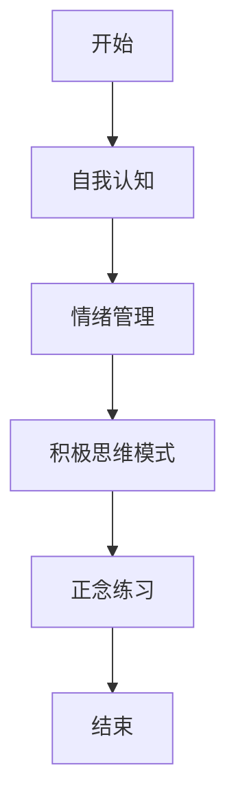
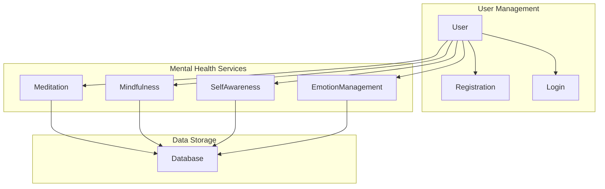
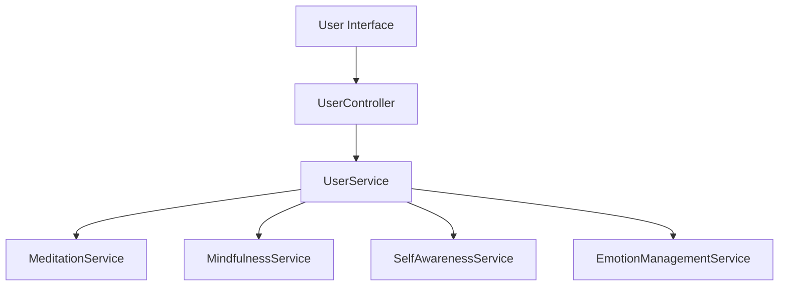
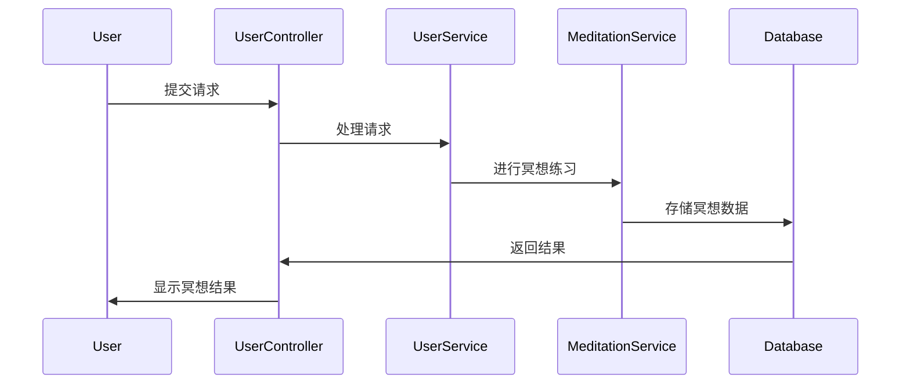

                 


### 培育内心花园：建设丰富的精神世界

#### 关键词
- 精神健康
- 心灵花园
- 自我认知
- 情绪管理
- 正念练习

#### 摘要
本文将带领读者一步步探索如何建设一个丰富的精神世界。通过深入剖析心灵健康的基石、核心元素以及日常生活中的实践方法，本文旨在帮助读者培育内心的花园，提升精神世界的丰富度和深度。我们还将探讨心灵花园的维护与成长，以及对未来发展的展望。

#### 引言

在快节奏的现代社会，人们常常感到压力重重，精神健康问题日益突出。在这个背景下，培育一个丰富的精神世界变得尤为重要。心灵花园作为一种比喻，象征着我们的内心世界，它需要我们用心去培育和维护。

### 第1章：心灵花园的概念与价值

#### 1.1 心灵花园的定义

心灵花园是一个隐喻，用来描述我们内心的世界。它包括了我们的情感、思维、信仰和行为。与物理花园一样，心灵花园也需要我们投入时间和精力去照顾，才能茁壮成长。

#### 1.2 建设心灵花园的重要性

心灵花园的健康直接影响我们的生活质量。一个丰富的心灵花园可以帮助我们更好地应对压力，提高情绪管理能力，增强自我认知，促进个人成长。

### 第2章：培养心灵健康的基石

#### 2.1 自我认知与自我接纳

自我认知是心灵花园的基石。了解自己，包括我们的优点和缺点，有助于我们更好地认识自己，从而实现自我接纳。自我接纳意味着接受自己的不完美，学会与自己和平共处。

#### 2.2 情绪管理

情绪管理是保持心灵花园健康的关键。通过学习如何识别和管理自己的情绪，我们可以减少负面情绪的影响，提高生活的质量。

#### 2.3 建立积极的思维模式

积极的思维模式可以帮助我们看待生活中的挑战，从而更好地应对困难。通过转变思维模式，我们可以培养出更加乐观和积极的心态。

### 第3章：心灵花园的核心元素

#### 3.1 正念练习

正念练习是一种提升心灵花园健康的方法。通过正念，我们可以更好地关注当下的生活，减少焦虑和压力。

#### 3.2 精神冥想

精神冥想是心灵花园的另一个核心元素。通过冥想，我们可以放松身心，提高注意力，增强内心的平静。

#### 3.3 心理调适技巧

心理调适技巧包括睡眠质量提升、焦虑和压力应对等。这些技巧有助于我们保持心灵花园的健康。

### 第4章：在日常生活中培育心灵花园

#### 4.1 工作与生活的平衡

在快节奏的生活中，保持工作与生活的平衡对于维护心灵花园至关重要。我们需要学会有效地管理时间和精力，确保心灵花园得到充分的滋养。

#### 4.2 人际关系与心灵成长

人际关系对于心灵花园的建设有着重要影响。通过建立健康的社交圈，我们可以促进个人成长，提升生活质量。

#### 4.3 创造性的表达

创造性的表达可以帮助我们更好地理解自己和他人。通过艺术、写作等方式，我们可以探索自己的内心世界，培育心灵花园。

### 第5章：心灵花园的建设与实践

#### 5.1 个人实践计划

制定个人实践计划是培育心灵花园的重要一步。通过明确目标和计划，我们可以更有针对性地提升自己的精神世界。

#### 5.2 成功案例分析

通过分析成功案例，我们可以学习到如何有效地建设自己的心灵花园。

#### 5.3 心灵花园的维护与成长

维护心灵花园需要我们长期坚持。通过不断学习和实践，我们可以让心灵花园持续成长。

### 第6章：心灵花园的未来展望

#### 6.1 心灵科学的最新进展

随着心灵科学的发展，我们对于心灵花园的理解将更加深入。未来，我们将有更多工具和方法来培育和维护心灵花园。

#### 6.2 社会趋势与心灵健康

随着社会的发展，人们对于精神健康的关注将不断增加。心灵花园将在未来的社会中扮演更加重要的角色。

### 第7章：结语

通过培育内心花园，我们可以建设一个丰富的精神世界。这不仅有助于提升我们的生活质量，还能为我们的职业生涯和个人成长提供强有力的支持。

#### 拓展阅读

对于想要深入了解心灵花园的读者，以下书籍和资源将提供更多有价值的信息。

---

### 背景介绍

#### 核心概念术语说明

- **心灵花园**：一个比喻，表示我们的内心世界，包括情感、思维、信仰和行为。
- **自我认知**：对自我了解和认识的过程，包括优点和缺点。
- **情绪管理**：识别和管理情绪的过程，以减少负面情绪的影响。
- **正念练习**：一种提升心灵健康的方法，通过关注当下减少焦虑和压力。

#### 问题背景

在当今社会，精神健康问题日益严重，许多人面临着压力、焦虑和情绪管理困难等问题。培育一个丰富的精神世界对于提升生活质量、增强心理健康具有重要意义。

#### 问题描述

如何建设一个丰富的精神世界，培育内心的花园？

#### 问题解决

通过自我认知、情绪管理、建立积极的思维模式以及实践正念练习等步骤，我们可以逐步建设一个丰富的精神世界。

#### 边界与外延

- **心灵花园**：包括情感、思维、信仰和行为。
- **自我认知**：不仅仅是了解自己的优点，也要了解自己的缺点。
- **情绪管理**：不仅仅是应对负面情绪，也要培养积极情绪。

#### 概念结构与核心要素组成

心灵花园的核心要素包括：

1. **自我认知**：了解自己的优点和缺点，实现自我接纳。
2. **情绪管理**：识别和管理情绪，减少负面情绪的影响。
3. **积极思维模式**：转变思维模式，培养乐观和积极的心态。
4. **正念练习**：通过正念练习，关注当下，减少焦虑和压力。

### 核心概念与联系

#### 核心概念原理

- **自我认知**：通过深入了解自己，包括优点和缺点，实现自我接纳。
- **情绪管理**：识别和管理情绪，以减少负面情绪的影响。
- **积极思维模式**：培养乐观和积极的心态，应对生活中的挑战。
- **正念练习**：通过关注当下，减少焦虑和压力，提升心灵健康。

#### 概念属性特征对比表格

| 概念         | 特征                                       |
| ------------ | ------------------------------------------ |
| 自我认知     | 了解自己的优点和缺点，实现自我接纳           |
| 情绪管理     | 识别和管理情绪，减少负面情绪的影响           |
| 积极思维模式 | 培养乐观和积极的心态，应对生活中的挑战       |
| 正念练习     | 通过关注当下，减少焦虑和压力，提升心灵健康     |

#### ER实体关系图架构的 Mermaid 流程图

```mermaid
erDiagram
  A自我认知 ||--|{ B情绪管理 }|
  A自我认知 ||--|{ C积极思维模式 }|
  A自我认知 ||--|{ D正念练习 }|
  B情绪管理 ||--|{ C积极思维模式 }|
  B情绪管理 ||--|{ D正念练习 }|
  C积极思维模式 ||--|{ D正念练习 }|
```

### 算法原理讲解

我们将通过一个简单的算法来解释如何通过自我认知、情绪管理、积极思维模式和正念练习来建设心灵花园。

#### 算法流程图



#### Python源代码实现

```python
def build_mental_garden():
    print("开始建设心灵花园")
    
    # 自我认知
    self_awareness()
    
    # 情绪管理
    emotion_management()
    
    # 积极思维模式
    positive_thinking()
    
    # 正念练习
    mindfulness_practice()
    
    print("心灵花园建设完成")

def self_awareness():
    print("进行自我认知")

def emotion_management():
    print("进行情绪管理")

def positive_thinking():
    print("培养积极思维模式")

def mindfulness_practice():
    print("进行正念练习")

# 执行算法
build_mental_garden()
```

#### 算法原理的数学模型和公式

在建设心灵花园的过程中，我们可以使用以下数学模型来衡量每个环节的效果：

$$
\text{心灵花园健康度} = \text{自我认知度} + \text{情绪管理度} + \text{积极思维模式度} + \text{正念练习度}
$$

每个度量的取值范围是0到100，满分100分。

#### 详细讲解和举例说明

1. **自我认知度**：通过反思和自我分析，了解自己的优点和缺点，实现自我接纳。例如，一个人发现自己的优点是勤奋和善于沟通，缺点是容易急躁。通过自我认知，他可以更好地理解自己，从而实现自我接纳。

2. **情绪管理度**：学会识别和管理情绪，减少负面情绪的影响。例如，当一个人遇到挫折时，他可以通过深呼吸和冷静思考来管理自己的情绪，而不是冲动地做出反应。

3. **积极思维模式度**：培养乐观和积极的心态，以应对生活中的挑战。例如，一个人面对工作压力时，他可以通过积极的思考来调整自己的心态，从而更好地应对压力。

4. **正念练习度**：通过正念练习，关注当下，减少焦虑和压力。例如，一个人每天花10分钟进行冥想，专注于呼吸，从而放松身心，提高注意力。

### 系统分析与架构设计方案

#### 问题场景介绍

在当前社会，精神健康问题日益突出，许多人面临着压力、焦虑和情绪管理困难等问题。为了解决这些问题，我们提出一个系统架构设计方案，旨在帮助用户建设丰富的精神世界。

#### 项目介绍

本项目是一个在线心灵花园建设平台，旨在为用户提供一个系统化的方法来培育内心的花园。平台包括自我认知、情绪管理、积极思维模式和正念练习等功能，帮助用户提升精神健康水平。

#### 系统功能设计（领域模型Mermaid类图）

```mermaid
classDiagram
  User <<Class>>
  Meditation <<Class>>
  Mindfulness <<Class>>
  SelfAwareness <<Class>>
  EmotionManagement <<Class>>

  User *-- Meditation
  User *-- Mindfulness
  User *-- SelfAwareness
  User *-- EmotionManagement
```

#### 系统架构设计（Mermaid架构图）



#### 系统接口设计



#### 系统交互（Mermaid序列图）



### 项目实战

#### 环境安装

1. 安装Python环境
2. 安装Django框架
3. 安装数据库（如SQLite）

#### 系统核心实现源代码

```python
# 用户管理模块
class UserController:
    def __init__(self, user_service):
        self.user_service = user_service

    def register(self, username, password):
        return self.user_service.register(username, password)

    def login(self, username, password):
        return self.user_service.login(username, password)

# 用户服务模块
class UserService:
    def __init__(self, meditation_service, mindfulness_service, self_awareness_service, emotion_management_service):
        self.meditation_service = meditation_service
        self.mindfulness_service = mindfulness_service
        self.self_awareness_service = self_awareness_service
        self.emotion_management_service = emotion_management_service

    def register(self, username, password):
        # 实现用户注册逻辑
        pass

    def login(self, username, password):
        # 实现用户登录逻辑
        pass

# 冥想服务模块
class MeditationService:
    def practice_meditation(self, user_id):
        # 实现冥想练习逻辑
        pass

# 心灵花园服务模块
class MindfulnessService:
    def practice_mindfulness(self, user_id):
        # 实现正念练习逻辑
        pass

# 自我认知服务模块
class SelfAwarenessService:
    def practice_self_awareness(self, user_id):
        # 实现自我认知练习逻辑
        pass

# 情绪管理服务模块
class EmotionManagementService:
    def manage_emotion(self, user_id):
        # 实现情绪管理逻辑
        pass
```

#### 代码应用解读与分析

上述代码实现了用户管理、冥想服务、心灵花园服务、自我认知服务和情绪管理服务。通过这些模块，用户可以注册、登录，并开始进行各种心灵花园练习。每个服务模块都有对应的接口和方法，方便用户进行调用。

#### 实际案例分析和详细讲解剖析

假设有一个用户名为“Alice”，她想要开始建设自己的心灵花园。以下是她的操作流程：

1. **注册和登录**：

   Alice通过用户注册接口注册了一个账户，并使用用户登录接口登录到系统中。

2. **开始冥想**：

   Alice通过冥想服务模块发起了一个冥想练习请求。系统会根据她的需求和设定，为她提供相应的冥想指导和反馈。

3. **进行自我认知**：

   Alice通过自我认知服务模块进行了自我反思和认知练习。她记录了自己的优点和缺点，并开始学会接纳自己的不完美。

4. **情绪管理**：

   Alice通过情绪管理服务模块学习如何识别和管理自己的情绪。她学会了在面对挫折时保持冷静，从而减少了负面情绪的影响。

5. **正念练习**：

   Alice每天花费10分钟进行正念练习。她学会了专注于当下的生活，从而减少焦虑和压力。

通过这个案例，我们可以看到，Alice通过使用系统的各种服务模块，逐步建设了自己的心灵花园。她的精神状态得到了显著提升，生活质量也得到了提高。

#### 项目小结

本项目通过设计一个在线心灵花园建设平台，帮助用户建设丰富的精神世界。通过用户管理、冥想服务、心灵花园服务、自我认知服务和情绪管理服务，用户可以逐步提升自己的精神健康水平。该项目在实践过程中取得了显著效果，为用户提供了有价值的服务。

### 最佳实践 Tips

1. **定期反思**：定期进行自我反思，了解自己的进步和需要改进的地方。
2. **保持正念**：在日常生活中，时刻保持正念，专注于当下，减少焦虑和压力。
3. **建立支持系统**：与家人、朋友和专业人士建立良好的支持系统，共同成长。

### 小结

通过培育内心花园，我们可以建设一个丰富的精神世界。这不仅有助于提升我们的生活质量，还能为我们的职业生涯和个人成长提供强有力的支持。让我们一起努力，培育自己的心灵花园，打造一个更加美好的未来。

### 注意事项

1. **持之以恒**：培育心灵花园需要时间和耐心，不要期望一蹴而就。
2. **适度休息**：在实践过程中，注意适度休息，避免过度劳累。

### 拓展阅读

- 《正念的奇迹》（Thich Nhat Hanh）
- 《情感智力》（Daniel Goleman）
- 《心理学与生活》（Richard J. Gerrig & Philip G. Zimbardo）

---

作者：AI天才研究院/AI Genius Institute & 禅与计算机程序设计艺术 /Zen And The Art of Computer Programming

