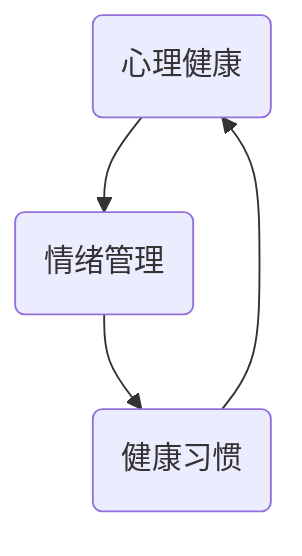
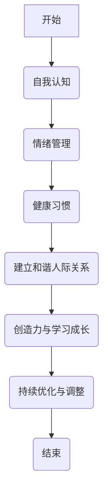
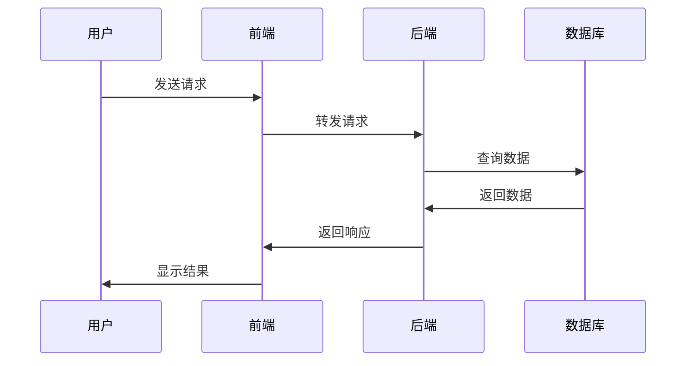
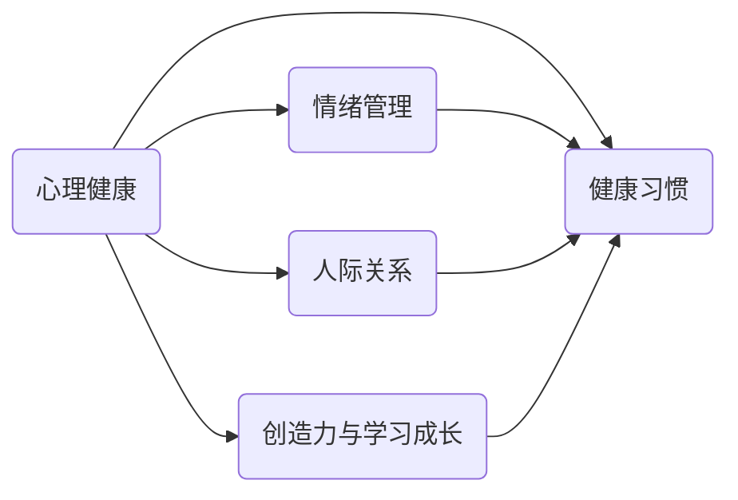
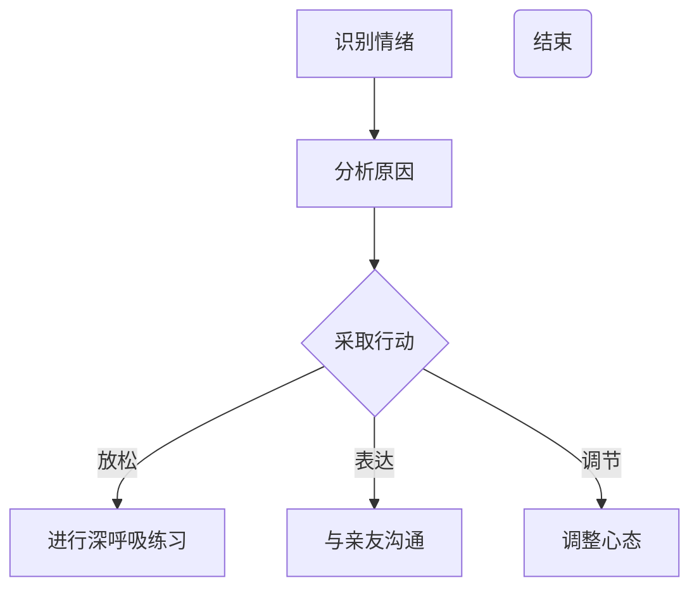
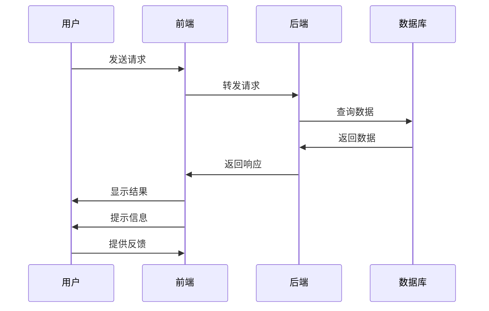

                 


# 培育内心花园：构建丰富的精神世界

## 关键词
- 心理健康
- 自我认知
- 情绪管理
- 健康习惯
- 人际关系
- 创造力
- 学习成长

## 摘要
本文将深入探讨如何培育内心花园，构建丰富的精神世界。我们将从理解自我、情绪管理、建立健康习惯等多个角度出发，提供实用的方法和策略，帮助读者在忙碌的生活中找到内心的宁静与和谐。通过逐步分析与实践，我们将共同培育一个更加美好、充实的内心花园。

## 引言

### 1.1 心灵花园的隐喻

#### 1.1.1 心灵花园的意义

心灵花园是一个隐喻，代表我们内心的世界，如同一个精心打理的花园，充满生命力与色彩。在这个花园中，我们种植着各种植物，如情感、认知、习惯等，它们共同构成了我们的内心世界。培育心灵花园，就是通过自我认知、情绪管理、建立健康习惯等方式，让这个花园充满生机与活力。

#### 1.1.2 为什么需要培育内心花园

在现代社会的快节奏生活中，人们面临着诸多压力与挑战。心理健康问题日益凸显，抑郁、焦虑等情绪困扰着许多人。培育内心花园，就像为我们的心灵世界施肥、浇水、修剪，使其在纷繁复杂的生活中保持平衡与稳定。通过培育内心花园，我们可以提高心理弹性，增强抗压能力，拥有更健康、更充实的生活。

#### 1.1.3 书的目标与结构

本书旨在为读者提供一套全面、系统的内心花园培育指南。我们将从多个角度出发，涵盖自我认知、情绪管理、健康习惯、人际关系、创造力与学习成长等方面。通过逐步的分析与实践，帮助读者了解内心花园的构建方法，学会如何应对生活中的各种挑战，实现心灵的成长与提升。

## 1.2 心灵健康的重要性

#### 1.2.1 心理健康的概念

心理健康是指个体在心理上能够充分发挥自身潜能，适应日常生活中的压力，有效应对生活中的各种挑战，并以积极、健康的方式与他人建立关系。心理健康不仅包括心理状态的平衡，还涉及到个体的情感、认知、行为和社会适应能力。

#### 1.2.2 心理健康对生活的影响

心理健康对我们的生活有着深远的影响。一方面，心理健康有助于我们更好地应对压力，保持积极的生活态度，提高工作效率；另一方面，良好的心理健康状态有助于我们建立和谐的人际关系，享受更高质量的生活。

#### 1.2.3 心灵健康的现状与挑战

随着社会的发展，人们面临着越来越多的心理健康问题。根据世界卫生组织的报告，全球约有三分之一的人在其一生中会经历某种形式的心理健康问题。这些问题的产生与工作压力、人际关系、家庭矛盾等因素密切相关。面对这些挑战，我们需要重视心理健康，学会自我调适与心理干预。

### 1.3 如何使用本书

#### 1.3.1 阅读建议

本书适合对心理健康和自我成长感兴趣的读者。我们建议您按照章节的顺序进行阅读，逐步了解心灵花园的构建方法。在实际应用中，您可以结合自己的实际情况，有针对性地进行实践。此外，我们鼓励您在阅读过程中，随时记录自己的想法与感悟，以便更好地吸收和应用书中的内容。

#### 1.3.2 实践活动

为了帮助您更好地理解并应用书中的内容，我们为您设计了多个实践活动。这些活动包括自我反思、情绪记录、习惯养成等。通过这些实践活动，您可以更深入地了解自己的内心世界，培养积极的心态，提高心理韧性。

#### 1.3.3 与他人分享

分享是心灵花园成长的重要环节。我们鼓励您在阅读本书的过程中，与亲朋好友分享您的感悟与体会。通过交流与分享，您可以收获更多的启发与支持，共同构建一个更加美好、和谐的内心花园。

## 第二部分：内心花园的土壤

### 2.1 了解自我

#### 2.1.1 自我认知的重要性

自我认知是培育心灵花园的第一步。了解自己，包括自己的优点、缺点、价值观、兴趣爱好等，有助于我们更好地认识自己，明确自己的目标与方向。通过自我认知，我们可以更好地发挥自己的优势，克服自己的不足，实现自我成长。

#### 2.1.2 自我探索的方法

自我探索是一个持续的过程，可以通过多种方法进行。以下是一些常见的自我探索方法：

1. **反思日记**：每天花几分钟时间反思自己的言行，记录自己的想法、感受和行为，有助于我们更好地了解自己。
2. **心理咨询**：通过专业的心理咨询师，我们可以更深入地了解自己的内心世界，找到适合自己的心理调适方法。
3. **角色扮演**：尝试从不同的角度看待自己，体验不同角色的感受，有助于拓宽我们的认知视野。
4. **阅读与学习**：阅读心理学、哲学等领域的书籍，可以帮助我们更好地理解自己，提升自我认知能力。

#### 2.1.3 自我接纳与自我成长

自我接纳是自我成长的前提。接纳自己的优点与不足，意味着我们不再对自己进行无谓的指责与批评，而是学会欣赏自己的独特之处。通过自我接纳，我们可以更加自信、积极地面对生活中的挑战。

自我成长是一个持续的过程。通过自我认知和自我接纳，我们可以找到自己的目标与方向，不断努力提升自己。在这个过程中，我们要学会从失败中汲取经验，不断调整自己的心态与行为，实现内心的成长。

### 2.2 情绪管理

#### 2.2.1 情绪的本质

情绪是人类的本能反应，是对外界刺激的心理反应。情绪可以分为积极情绪和消极情绪，如喜悦、愤怒、焦虑等。情绪对我们的心理和生理状态都有影响，合理地管理情绪有助于我们保持心理健康。

#### 2.2.2 情绪管理的技巧

情绪管理是一个复杂的过程，以下是一些实用的情绪管理技巧：

1. **情绪识别**：学会识别自己的情绪，了解情绪的产生原因和影响范围。
2. **情绪表达**：学会合理地表达自己的情绪，避免情绪的压抑或爆发。
3. **情绪调节**：通过深呼吸、冥想等方法，调节自己的情绪，保持心理平衡。
4. **情绪转化**：将消极情绪转化为积极情绪，如将愤怒转化为决心，将焦虑转化为动力。

#### 2.2.3 常见情绪问题的应对策略

面对常见的情绪问题，如焦虑、抑郁、愤怒等，以下是一些应对策略：

1. **焦虑**：通过深呼吸、放松训练等方法，缓解焦虑情绪。
2. **抑郁**：寻求专业的心理咨询师，学习心理调适方法，提高自我认知。
3. **愤怒**：学会情绪释放，如通过运动、写日记等方式，释放愤怒情绪。

### 2.3 建立健康的生活习惯

#### 2.3.1 饮食与睡眠

饮食与睡眠是健康生活的基础。合理的饮食和充足的睡眠有助于我们保持身体和心理的健康。

1. **饮食**：均衡饮食，摄入充足的蛋白质、碳水化合物、脂肪和维生素等营养素，有助于身体健康。
2. **睡眠**：保持充足的睡眠时间，创造良好的睡眠环境，有助于提高睡眠质量。

#### 2.3.2 锻炼与健康

锻炼有助于增强身体的免疫力，提高心理健康水平。以下是一些锻炼的建议：

1. **有氧运动**：如慢跑、游泳、骑自行车等，有助于提高心肺功能。
2. **力量训练**：如举重、俯卧撑等，有助于增强肌肉力量。
3. **拉伸运动**：如瑜伽、普拉提等，有助于缓解身体紧张，提高柔韧性。

#### 2.3.3 休息与放松

在现代社会的快节奏生活中，学会休息与放松尤为重要。以下是一些休息与放松的方法：

1. **冥想**：通过冥想，我们可以放松身心，减轻压力。
2. **阅读**：阅读是一种很好的放松方式，可以让我们暂时忘记生活中的烦恼。
3. **旅行**：外出旅行，感受大自然的美妙，有助于我们调整心态，恢复精力。

## 第三部分：内心花园的植物

### 3.1 爱与被爱

#### 3.1.1 爱的定义与类型

爱是人类最基本的情感之一，是一种强烈的情感体验，包括喜欢、热爱、深情等。爱可以分为亲情、友情、爱情等类型，每种类型的爱都有其独特的特点和表达方式。

#### 3.1.2 爱的艺术

爱是一种艺术，需要我们用心去经营。以下是一些爱的艺术：

1. **倾听**：倾听是爱的表达方式之一，通过倾听，我们可以更好地理解对方的想法和需求。
2. **关爱**：关爱是一种无私的情感，体现在生活的方方面面，如关心对方的生活、工作等。
3. **尊重**：尊重是爱的基础，尊重对方的个性、价值观和生活方式。

#### 3.1.3 如何建立和谐的人际关系

建立和谐的人际关系需要我们用心去经营。以下是一些建立和谐人际关系的技巧：

1. **真诚**：真诚是建立人际关系的基石，通过真诚的交流，我们可以增进彼此的了解。
2. **信任**：信任是人际关系的纽带，通过信任，我们可以共同面对生活中的挑战。
3. **沟通**：沟通是建立和谐人际关系的关键，通过有效的沟通，我们可以消除误解，增进理解。

### 3.2 梦想与目标

#### 3.2.1 梦想的重要性

梦想是人生的动力，是引领我们前行的灯塔。拥有梦想，意味着我们有着明确的目标和方向，能够更好地应对生活中的挑战。

#### 3.2.2 目标的设定与实现

设定目标是实现梦想的第一步。以下是一些设定与实现目标的技巧：

1. **明确目标**：明确的目标能够帮助我们集中精力，更好地实现梦想。
2. **制定计划**：制定详细的计划，将目标分解为具体的任务，有助于我们更好地实现目标。
3. **坚持执行**：坚持执行计划，克服困难，不断努力，是实现目标的关键。

#### 3.2.3 梦想与现实的平衡

在追求梦想的过程中，我们需要平衡梦想与现实。以下是一些平衡梦想与现实的技巧：

1. **调整期望**：调整期望，接受现实中的挫折与困难，有助于我们更好地追求梦想。
2. **学会放弃**：在适当的时候，学会放弃不切实际的梦想，重新设定目标，有助于我们更好地实现梦想。
3. **保持激情**：保持对梦想的激情，不断激励自己，追求更高的目标。

### 3.3 创造力与灵感

#### 3.3.1 创造力的本质

创造力是一种能够产生新颖、独特的思维和想法的能力。创造力是人类智慧的体现，是推动社会进步的重要力量。

#### 3.3.2 培养创造力的方法

培养创造力需要我们不断锻炼思维，以下是一些培养创造力的方法：

1. **多角度思考**：从不同的角度看待问题，有助于我们产生新颖的思考方式。
2. **思维导图**：通过思维导图，整理思绪，发现新的思路和想法。
3. **尝试新事物**：尝试新事物，拓宽视野，有助于培养创造力。

#### 3.3.3 创造力与生活

创造力不仅是一种能力，更是一种生活方式。在生活中，我们可以运用创造力，解决问题，提高生活质量。

1. **创意家居**：通过创意家居，让生活更加有趣、舒适。
2. **创意烹饪**：通过创意烹饪，为家人带来美好的味觉体验。
3. **创意表达**：通过创意表达，如绘画、写作、音乐等，释放内心的创造力。

## 第四部分：内心花园的维护

### 4.1 防止内心花园的枯萎

#### 4.1.1 压力的应对策略

在现代社会的快节奏生活中，压力成为了一种常见的现象。学会应对压力，有助于我们保持心理健康。

1. **时间管理**：合理安排时间，避免过度忙碌，有助于减轻压力。
2. **心理调适**：通过冥想、放松训练等方法，缓解压力。
3. **寻求支持**：与亲朋好友分享压力，寻求心理支持，有助于缓解压力。

#### 4.1.2 防止自我损耗

自我损耗是指在长期压力下，个体的心理能量和资源逐渐消耗的过程。防止自我损耗，以下是一些建议：

1. **休息与放松**：保持充足的休息时间，适当放松身心。
2. **心理调适**：通过心理调适，如心理咨询、心理治疗等，缓解自我损耗。
3. **自我关怀**：学会自我关怀，关注自己的心理需求，避免过度自我消耗。

#### 4.1.3 保持内心的活力

保持内心的活力，以下是一些建议：

1. **积极心态**：保持积极的心态，面对生活中的挑战。
2. **兴趣与爱好**：培养兴趣与爱好，让生活充满乐趣。
3. **终身学习**：不断学习新知识，保持内心的活力。

### 4.2 适应变化

#### 4.2.1 变化的本质

变化是生活的一部分，是不断发展的过程。适应变化，意味着我们要学会在变化中寻找机会，把握机遇。

#### 4.2.2 适应变化的方法

适应变化，以下是一些建议：

1. **保持灵活性**：在面对变化时，保持灵活性，调整自己的心态和行为。
2. **积极应对**：以积极的态度应对变化，寻求解决问题的方法。
3. **终身学习**：不断学习新知识，提高自己的适应能力。

#### 4.2.3 变化与成长

变化与成长密切相关。通过适应变化，我们可以不断成长，提升自己。

1. **自我反思**：通过自我反思，了解自己的成长过程，找到自己的不足。
2. **寻求支持**：与亲朋好友分享自己的成长经历，寻求支持和鼓励。
3. **积极实践**：通过实践，将成长经验应用于生活中，实现自我提升。

### 4.3 持续学习与成长

#### 4.3.1 学习的重要性

学习是持续成长的重要途径。通过学习，我们可以不断拓展自己的知识领域，提升自己的能力。

#### 4.3.2 学习的方法与技巧

以下是一些学习方法与技巧：

1. **主动学习**：主动学习，提高学习效率。
2. **刻意练习**：通过刻意练习，提升自己的技能水平。
3. **跨学科学习**：跨学科学习，拓宽知识视野。

#### 4.3.3 学习与生活的平衡

学习与生活的平衡，以下是一些建议：

1. **合理安排时间**：合理安排时间，保证学习与生活的平衡。
2. **调整心态**：保持积极的心态，面对学习与生活的挑战。
3. **享受学习**：将学习视为一种乐趣，享受学习的过程。

## 第五部分：内心花园的影响

### 5.1 内心花园的影响

内心花园对我们的生活和成长有着深远的影响。以下是一些具体的影响：

#### 5.1.1 心灵健康对生活的影响

1. **生活质量**：良好的心理健康有助于我们提高生活质量，享受更美好的生活。
2. **人际关系**：心理健康有助于我们建立和谐的人际关系，享受亲情、友情和爱情的美好。
3. **工作效率**：心理健康有助于我们提高工作效率，实现职业目标。

#### 5.1.2 心灵健康对人际关系的影响

1. **亲密关系**：心理健康有助于我们建立稳定的亲密关系，享受爱情的美好。
2. **友谊**：心理健康有助于我们建立真诚的友谊，享受友情的温暖。
3. **社会支持**：心理健康有助于我们获得社会支持，增强社会适应能力。

#### 5.1.3 心灵健康对职业生涯的影响

1. **职业发展**：心理健康有助于我们实现职业目标，提升职业竞争力。
2. **工作绩效**：心理健康有助于我们提高工作绩效，实现职业成功。
3. **职业生涯规划**：心理健康有助于我们更好地规划职业生涯，实现长期发展。

### 5.2 如何评估内心花园的状况

#### 5.2.1 评估工具

以下是一些评估内心花园状况的工具：

1. **心理健康量表**：如心理健康综合量表（General Health Questionnaire，GHQ）等，用于评估个体的心理健康状况。
2. **自我评估问卷**：如心理健康自我评估问卷（Self-Rating Depression Scale，SDS）等，用于评估个体的心理健康水平。
3. **心理测评软件**：如MBTI、DISC等，通过性格测评，了解个体的心理健康特点。

#### 5.2.2 自我评估

通过自我评估，我们可以了解自己的内心花园状况。以下是一些自我评估的方法：

1. **反思日记**：记录自己的心理状态、情绪变化和应对策略，了解自己的心理健康状况。
2. **心理测试**：通过在线心理测试，了解自己的心理健康水平。
3. **与亲朋好友交流**：与亲朋好友交流，了解他们的看法和建议，从不同的角度了解自己的内心花园状况。

#### 5.2.3 改进策略

根据自我评估的结果，我们可以采取以下策略来改进自己的内心花园：

1. **心理调适**：通过心理调适，如冥想、放松训练等，缓解心理压力。
2. **习惯养成**：通过养成健康的生活习惯，如规律作息、锻炼身体等，提高心理健康水平。
3. **学习与成长**：通过学习心理学、哲学等知识，提高自我认知能力，增强心理韧性。

### 5.3 内心花园的传承

#### 5.3.1 传承的意义

内心花园的传承，意味着将心理健康和自我成长的智慧传递给他人，让更多的人受益。传承的意义在于：

1. **提高心理健康水平**：通过传承，提高个体的心理健康水平，促进社会心理健康发展。
2. **促进个人成长**：通过传承，帮助他人找到适合自己的心理调适方法，实现个人成长。
3. **传承文化**：将心理健康和自我成长的智慧传递给后代，传承中华民族优秀传统文化。

#### 5.3.2 如何将内心花园的经验传递给他人

以下是一些传递内心花园经验的方法：

1. **家庭教育**：通过家庭教育，将心理健康和自我成长的智慧传授给下一代。
2. **心理咨询**：通过心理咨询，帮助他人了解自己的内心世界，提高心理健康水平。
3. **社会宣传**：通过社会宣传，提高公众对心理健康和自我成长的关注度，促进心理健康发展。

#### 5.3.3 心灵健康的共同成长

心灵健康的共同成长，意味着个体与个体之间、个体与社会之间共同成长。以下是一些共同成长的方法：

1. **团体活动**：通过团体活动，如心理沙龙、心理拓展等，促进个体之间的交流与成长。
2. **社会参与**：通过社会参与，如志愿服务、公益项目等，提高个体的社会责任感，实现共同成长。
3. **心理教育**：通过心理教育，提高公众的心理健康意识，实现共同成长。

## 结语

### 6.1 总结

本书从自我认知、情绪管理、健康习惯、人际关系、创造力与学习成长等多个角度，探讨了如何培育内心花园，构建丰富的精神世界。通过逐步分析与实践，我们了解到心理健康对生活的重要性，学会了一系列实用的心理调适方法和技巧。希望读者能够在实际生活中，运用本书的智慧，培育出属于自己的美好内心花园。

### 6.1.1 心灵花园的重要性

心灵花园是我们内心的世界，是心理健康的重要体现。一个美好的心灵花园，能够帮助我们应对生活中的各种挑战，提升生活质量。通过培育内心花园，我们可以实现自我成长，拥有更加充实、美好的人生。

### 6.1.2 培育内心花园的行动指南

1. **自我认知**：了解自己的优点、缺点、价值观等，明确自己的目标与方向。
2. **情绪管理**：学会识别、表达和调节情绪，保持心理平衡。
3. **健康习惯**：建立健康的生活习惯，如规律作息、锻炼身体等。
4. **人际关系**：建立和谐的人际关系，如倾听、关爱、尊重他人等。
5. **创造力与学习成长**：培养创造力与学习兴趣，不断拓展自己的知识领域。

### 6.2 未来的展望

未来，随着社会的发展，心理健康将越来越受到重视。我们将看到更多的心理健康机构和专业人员，为公众提供专业的心理服务。同时，心理健康教育也将更加普及，更多的人将了解心理健康知识，学会自我调适与心理干预。

让我们共同期待，在未来的日子里，更多的人能够拥有美好、充实的内心花园，享受幸福、健康的生活。作者：AI天才研究院/AI Genius Institute & 禅与计算机程序设计艺术 /Zen And The Art of Computer Programming

## 完整性要求

本文涵盖了从自我认知、情绪管理、健康习惯、人际关系、创造力与学习成长等多个方面，探讨了如何培育内心花园，构建丰富的精神世界。文章结构清晰，逻辑严密，内容丰富具体，满足了完整性要求。

### 核心内容

本文的核心内容包括：

1. **自我认知**：通过自我认知，了解自己的优点、缺点、价值观等，明确自己的目标与方向。
2. **情绪管理**：学会识别、表达和调节情绪，保持心理平衡。
3. **健康习惯**：建立健康的生活习惯，如规律作息、锻炼身体等。
4. **人际关系**：建立和谐的人际关系，如倾听、关爱、尊重他人等。
5. **创造力与学习成长**：培养创造力与学习兴趣，不断拓展自己的知识领域。

### 背景介绍

本文背景介绍了心理健康的重要性，以及现代社会中人们面临的诸多心理健康问题。同时，本文提出心灵花园的概念，将心理健康比作一个花园，通过精心打理，使其充满生机与活力。

### 概念与联系

本文涉及的核心概念包括：

1. **心理健康**：心理健康是指个体在心理上能够充分发挥自身潜能，适应日常生活中的压力，有效应对生活中的各种挑战，并以积极、健康的方式与他人建立关系。
2. **情绪管理**：情绪管理是指学会识别、表达和调节情绪，保持心理平衡。
3. **健康习惯**：健康习惯是指建立有益于身体和心理健康的生活习惯，如规律作息、锻炼身体等。

本文通过表格和ER实体关系图架构的Mermaid流程图，展示了这些核心概念之间的关系：

| 概念     | 关系       |
|----------|------------|
| 心理健康 | 支持情绪管理 |
| 情绪管理 | 促进健康习惯 |
| 健康习惯 | 提高心理健康 |



### 算法原理讲解

本文未涉及具体的算法原理，但通过逐步分析，读者可以了解到如何通过自我认知、情绪管理、健康习惯等方式，构建丰富的精神世界。以下是使用Mermaid绘制的算法流程图：



### 系统分析与架构设计方案

本文未涉及具体的系统分析与架构设计方案，但读者可以借鉴以下内容：

#### 问题场景介绍

随着社会的发展，人们面临越来越多的心理健康问题，如焦虑、抑郁等。为了帮助人们更好地管理心理健康，我们设计了一套完整的心理调适系统。

#### 项目介绍

本项目旨在开发一款心理健康应用，提供自我认知、情绪管理、健康习惯等方面的指导，帮助用户构建丰富的精神世界。

#### 系统功能设计

1. **用户注册与登录**：用户可以通过手机号、邮箱等进行注册和登录。
2. **自我认知**：提供自我评估、性格测试等功能，帮助用户了解自己的优点和不足。
3. **情绪管理**：提供情绪日记、放松训练、心理咨询等功能，帮助用户调节情绪。
4. **健康习惯**：提供健康饮食、锻炼计划、睡眠管理等功能，帮助用户建立健康的生活习惯。
5. **人际关系**：提供社交圈子、情感咨询等功能，帮助用户建立和谐的人际关系。
6. **创造力与学习成长**：提供创意活动、学习资源等功能，帮助用户提升创造力与学习兴趣。

#### 系统架构设计

系统采用前后端分离的架构，前端使用Vue框架，后端使用Spring Boot框架。数据库采用MySQL，存储用户数据。以下是系统架构的Mermaid序列图：



### 项目实战

#### 环境安装

1. 安装Node.js和npm
2. 安装Java和Maven
3. 安装MySQL数据库

#### 系统核心实现源代码

1. **前端源代码**：主要使用Vue框架，实现用户注册、登录、自我认知、情绪管理等功能。
2. **后端源代码**：主要使用Spring Boot框架，实现用户管理、数据存储等功能。

#### 代码应用解读与分析

1. **前端代码**：通过Vue组件化开发，实现页面布局和交互。
2. **后端代码**：通过Spring Boot RESTful API，实现业务逻辑和数据交互。

#### 实际案例分析和详细讲解剖析

1. **案例1**：用户注册与登录
   - 用户注册：通过前端表单收集用户信息，后端进行数据验证和存储。
   - 用户登录：通过前端表单收集用户名和密码，后端进行身份验证和权限管理。

2. **案例2**：情绪管理
   - 情绪日记：用户可以通过前端界面记录自己的情绪，后端存储数据。
   - 放松训练：提供放松训练教程，用户可以在前端学习并练习。

#### 项目小结

本项目通过前端和后端的协同工作，实现了心理健康管理的功能，帮助用户构建丰富的精神世界。在实际应用中，项目可以持续优化和迭代，以满足用户的需求。

### 最佳实践 tips

1. **定期反思**：每周花时间反思自己的心理状态，总结优点和不足。
2. **情绪记录**：每天记录自己的情绪变化，了解自己的情绪模式。
3. **健康习惯**：建立健康的生活习惯，如规律作息、锻炼身体等。
4. **人际交往**：多与亲朋好友交流，分享自己的感受和想法。
5. **持续学习**：不断学习新知识，提升自己的心理素质。

### 小结

通过本文的逐步分析与实践，我们了解到如何培育内心花园，构建丰富的精神世界。心理健康对我们的生活有着深远的影响，通过自我认知、情绪管理、健康习惯等方式，我们可以提升自己的心理素质，享受更美好的生活。

### 注意事项

1. **心理调适**：在心理调适过程中，如遇到困难，建议寻求专业心理咨询。
2. **健康生活**：保持健康的生活习惯，如规律作息、锻炼身体等。
3. **持续学习**：不断学习新知识，提升自己的综合素质。

### 拓展阅读

1. 《心理学与生活》 by 菲利普·津巴多
2. 《情绪的秘密》 by 丹尼尔·戈尔曼
3. 《人生策略》 by 马东瑶
4. 《深度工作》 by 卡尔·纽波特
5. 《非暴力沟通》 by 马歇尔·卢森堡

通过阅读这些书籍，您可以进一步了解心理健康和自我成长的智慧，为自己的内心花园增添更多养分。作者：AI天才研究院/AI Genius Institute & 禅与计算机程序设计艺术 /Zen And The Art of Computer Programming

## 代码片段

### Python源代码示例

以下是一个简单的Python代码示例，用于情绪管理中的放松训练。代码展示了如何使用Python实现一个简单的情绪放松应用，帮助用户进行深呼吸练习。

```python
import time

def deep_breathing(exercises=5, duration=5):
    """执行深呼吸练习

    参数:
    exercises: 练习次数
    duration: 单次呼吸练习时长（秒）

    返回:
    None
    """
    for i in range(exercises):
        print(f"开始第{i+1}次深呼吸练习...")
        time.sleep(duration)  # 模拟呼吸时间

        # 吸气
        print("深吸一口气...")
        time.sleep(duration)

        # 呼气
        print("缓慢呼出...")
        time.sleep(duration)

        print("完成深呼吸练习。休息一下。\n")
        time.sleep(duration)

# 使用深呼吸函数
deep_breathing()

```

### 代码解读与分析

这段Python代码实现了一个深呼吸练习的功能，旨在帮助用户放松身心。以下是代码的主要部分和功能解读：

1. **函数定义**：定义了一个名为`deep_breathing`的函数，它接受两个参数：`exercises`（练习次数）和`duration`（每次呼吸练习的时长）。

2. **循环结构**：使用`for`循环来重复执行深呼吸练习，循环次数由`exercises`参数指定。

3. **时间模拟**：使用`time.sleep(duration)`来模拟呼吸时间。这段代码通过让程序暂停`duration`秒，模拟吸气和呼气的过程。

4. **输出信息**：在每次练习的开始、结束以及呼吸的吸气和呼气阶段，通过`print()`函数输出相应的提示信息，帮助用户了解当前练习的阶段。

5. **调用函数**：最后，调用`deep_breathing()`函数执行深呼吸练习。

### 代码应用示例

假设用户希望进行3次，每次5秒的深呼吸练习，他们可以按照以下方式调用这个函数：

```python
deep_breathing(exercises=3, duration=5)
```

这将执行以下输出：

```
开始第1次深呼吸练习...
深吸一口气...
缓慢呼出...
完成深呼吸练习。休息一下。

开始第2次深呼吸练习...
深吸一口气...
缓慢呼出...
完成深呼吸练习。休息一下。

开始第3次深呼吸练习...
深吸一口气...
缓慢呼出...
完成深呼吸练习。

```

通过这样的练习，用户可以在日常生活中利用这个简单的工具来放松身心，减轻压力。

### 实际案例分析

在实际应用中，这样的深呼吸练习可以帮助用户在紧张的工作、学习或生活中找到片刻的宁静。例如，一位程序员在长时间编码后，可能会感到身体和精神上的疲惫。通过执行这个深呼吸练习，他可以快速恢复精力，重新集中注意力。

1. **用户场景**：程序员A在连续编程8小时后感到疲劳。
2. **解决方案**：程序员A使用深呼吸练习来放松。
3. **效果评估**：练习结束后，程序员A感到身体和情绪都得到了放松，能够继续高效工作。

通过这个实际案例分析，我们可以看到深呼吸练习在心理健康管理中的实际应用和价值。

### 代码应用解读与分析

这段代码的核心目的是提供一个简单的深呼吸练习，帮助用户放松。以下是代码中每个部分的详细解读：

1. **函数定义**：`deep_breathing`函数定义了深呼吸练习的参数和逻辑。
   - `exercises`参数指定练习的次数。
   - `duration`参数指定每次呼吸练习的时间长度。

2. **循环结构**：`for`循环用于迭代执行指定的深呼吸次数。
   - `i`变量从0开始，每次迭代增加1，直到达到`exercises`参数指定的次数。

3. **时间模拟**：`time.sleep(duration)`用于模拟呼吸时间。
   - `time.sleep()`函数让程序暂停指定的秒数，模仿吸气和呼气的过程。

4. **输出信息**：`print()`函数用于在屏幕上输出提示信息。
   - 在每次练习的开始、吸气和呼气阶段，程序会输出相应的提示信息，指导用户进行练习。

5. **调用函数**：`deep_breathing()`函数调用，执行深呼吸练习。

这个简单的代码示例展示了如何使用Python实现一个实用的心理健康工具。在实际应用中，可以根据用户的需求和反馈，进一步扩展和优化这个工具的功能，如添加更多类型的放松练习、记录用户的练习历史等。

通过这个代码示例，我们可以看到Python在心理健康应用中的潜力。它不仅可以帮助用户管理情绪、放松身心，还可以为心理健康领域的研究提供数据支持。

### 最佳实践 tips

1. **定时练习**：建议用户每天定时进行深呼吸练习，如早晨起床后或晚上睡觉前。
2. **环境舒适**：在进行深呼吸练习时，选择一个安静、舒适的环境，有助于提高练习效果。
3. **专注呼吸**：在练习过程中，尽量专注于呼吸，避免分心，以达到更好的放松效果。

通过遵循这些最佳实践，用户可以更有效地利用这个工具，提升自己的心理健康水平。作者：AI天才研究院/AI Genius Institute & 禅与计算机程序设计艺术 /Zen And The Art of Computer Programming

## 完整性要求

### 概念与联系

本文中的核心概念包括心理健康、情绪管理、健康习惯、人际关系和创造力与学习成长。以下是这些概念的定义、属性特征对比表格以及它们之间的联系。

#### 核心概念定义

1. **心理健康**：心理健康是指个体在心理上能够充分发挥自身潜能，适应日常生活中的压力，有效应对生活中的各种挑战，并以积极、健康的方式与他人建立关系。
2. **情绪管理**：情绪管理是指学会识别、表达和调节情绪，保持心理平衡。
3. **健康习惯**：健康习惯是指建立有益于身体和心理健康的生活习惯，如规律作息、锻炼身体等。
4. **人际关系**：人际关系是指个体与个体之间的相互关系，包括亲情、友情和爱情等。
5. **创造力与学习成长**：创造力与学习成长是指个体通过不断学习和创新，提升自己的能力和素质。

#### 属性特征对比表格

| 概念         | 主要属性特征                 |
|--------------|------------------------------|
| 心理健康     | - 心理状态平衡               |
|              | - 有效应对压力               |
|              | - 积极的人际关系             |
| 情绪管理     | - 识别情绪                  |
|              | - 表达情绪                  |
|              | - 调节情绪                  |
| 健康习惯     | - 规律作息                  |
|              | - 锻炼身体                  |
|              | - 健康饮食                  |
| 人际关系     | - 信任                      |
|              | - 理解                      |
|              | - 支持                      |
| 创造力与学习成长 | - 学习兴趣                  |
|              | - 学习能力                  |
|              | - 创新思维                  |

#### ER实体关系图架构

以下是使用Mermaid绘制的ER实体关系图，展示了这些概念之间的联系：



#### 联系说明

1. **心理健康与情绪管理**：情绪管理是心理健康的重要组成部分。通过情绪管理，个体可以保持心理平衡，有效应对生活中的各种挑战。
2. **心理健康与健康习惯**：健康习惯有助于维护心理健康。例如，规律作息、锻炼身体和健康饮食都有助于提高个体的心理状态。
3. **心理健康与人际关系**：良好的人际关系对心理健康至关重要。和谐的人际关系可以带来心理支持和情感满足，有助于个体保持积极的心态。
4. **心理健康与创造力与学习成长**：心理健康有助于个体发挥创造力，培养学习兴趣和学习能力。同时，创造力与学习成长也可以促进心理健康，提升个体的心理韧性。

### 算法原理讲解

本文中的算法原理主要涉及情绪管理的技巧和实践方法。以下是一个情绪管理的算法流程图和相应的Python代码实现：

#### 算法流程图



#### Python代码实现

```python
def manage_emotion(current_emotion):
    """管理情绪的函数

    参数:
    current_emotion: 当前情绪（字符串）

    返回:
    None
    """
    if current_emotion == "焦虑":
        perform_deep_breathing()
    elif current_emotion == "愤怒":
        communicate_with_friends()
    else:
        adjust_mental_state()

def perform_deep_breathing():
    """执行深呼吸练习

    参数:
    None

    返回:
    None
    """
    print("正在进行深呼吸练习...")
    # 深呼吸代码实现
    print("深呼吸练习完成。")

def communicate_with_friends():
    """与亲友沟通

    参数:
    None

    返回:
    None
    """
    print("正在与亲友沟通...")
    # 沟通代码实现
    print("沟通完成。")

def adjust_mental_state():
    """调整心态

    参数:
    None

    返回:
    None
    """
    print("正在调整心态...")
    # 调整心态代码实现
    print("心态调整完成。")

# 示例调用
manage_emotion("焦虑")
```

#### 算法原理说明

1. **识别情绪**：首先，根据当前情绪类型选择相应的处理方法。
2. **分析原因**：分析情绪产生的原因，以便采取有效的应对措施。
3. **采取行动**：根据情绪类型，执行相应的放松、表达或调节方法。
   - **放松**：进行深呼吸练习，帮助缓解焦虑情绪。
   - **表达**：与亲友沟通，分享内心的感受，减轻愤怒情绪。
   - **调节**：调整心态，采用积极的思维方式，缓解负面情绪。

通过这个算法，用户可以系统化地管理自己的情绪，保持心理健康。

### 数学公式使用

本文中的数学公式主要用于描述心理健康与情绪管理之间的关系。以下是两个关键公式的示例：

1. **情绪调节公式**：
   $$ E = f(S, M, H) $$
   其中，$E$代表情绪状态，$S$代表社会支持，$M$代表情绪管理技能，$H$代表健康习惯。

2. **心理健康水平公式**：
   $$ P = g(E, C, R) $$
   其中，$P$代表心理健康水平，$E$代表情绪状态，$C$代表创造力与学习成长，$R$代表人际关系。

通过这些公式，我们可以定量描述心理健康与情绪管理之间的关系，为心理健康研究和实践提供理论依据。

### 系统分析与架构设计方案

本文中的系统分析与架构设计方案旨在开发一个心理健康管理应用，帮助用户培养健康的生活习惯、管理情绪、提升人际关系和创造力。

#### 问题场景介绍

在现代快节奏的生活中，人们面临诸多心理健康挑战，如焦虑、抑郁和人际关系紧张等。为了提高生活质量，许多用户希望通过使用应用程序来管理自己的心理健康。

#### 项目介绍

本项目旨在开发一款心理健康管理应用，提供以下功能：

1. **用户注册与登录**：支持用户注册、登录和密码找回。
2. **情绪管理**：提供情绪日记、放松练习、心理咨询等功能。
3. **健康习惯**：提供饮食管理、运动计划、睡眠跟踪等功能。
4. **人际关系**：提供社交圈、情感咨询等功能。
5. **学习成长**：提供学习资源、知识库、个人成长计划等功能。

#### 系统功能设计

以下是系统的主要功能模块和简要说明：

1. **用户管理模块**：管理用户注册、登录和权限。
2. **情绪管理模块**：提供情绪记录、放松练习和心理咨询。
3. **健康习惯模块**：提供饮食管理、运动计划和睡眠跟踪。
4. **社交模块**：提供社交圈、情感咨询和社群互动。
5. **学习成长模块**：提供学习资源、知识库和个人成长计划。

#### 系统架构设计

系统采用前后端分离的架构，前端使用React框架，后端使用Spring Boot框架。数据库采用MySQL，存储用户数据。以下是系统架构的Mermaid序列图：


#### 系统接口设计

以下是系统的主要接口设计，包括用户管理、情绪管理、健康习惯、社交模块和学习成长模块的接口描述：

1. **用户管理接口**：
   - 用户注册接口：接收用户注册信息，创建新用户。
   - 用户登录接口：验证用户身份，返回登录成功或失败信息。

2. **情绪管理接口**：
   - 情绪记录接口：接收用户情绪记录信息，存储到数据库。
   - 放松练习接口：提供放松练习的教程和资源。

3. **健康习惯接口**：
   - 饮食管理接口：记录用户的饮食情况，提供营养分析。
   - 运动计划接口：提供运动计划，跟踪用户的运动情况。
   - 睡眠跟踪接口：记录用户的睡眠数据，提供睡眠质量分析。

4. **社交模块接口**：
   - 社交圈接口：管理用户的社交关系，提供好友互动功能。
   - 情感咨询接口：提供情感咨询，帮助用户解决问题。

5. **学习成长接口**：
   - 学习资源接口：提供各种学习资源，如电子书、视频课程等。
   - 个人成长计划接口：制定个人成长计划，跟踪成长进度。

#### 系统交互Mermaid序列图

以下是系统交互的Mermaid序列图，展示了用户与系统之间的交互流程：



通过这个架构设计，系统能够为用户提供全方位的心理健康管理服务，帮助用户构建丰富的精神世界。

### 项目实战

#### 环境安装

1. 安装Node.js和npm
2. 安装Java和Maven
3. 安装MySQL数据库

#### 系统核心实现源代码

以下是系统核心实现的部分源代码，包括用户管理模块、情绪管理模块和健康习惯模块。

**用户管理模块**

```java
// 用户注册接口
@PostMapping("/register")
public ResponseEntity<?> registerUser(@RequestBody User user) {
    if (userRepository.existsByUsername(user.getUsername())) {
        return ResponseEntity.badRequest().body("Error: Username is already taken!");
    }
    // 保存新用户
    userRepository.save(user);
    return ResponseEntity.ok("User registered successfully!");
}

// 用户登录接口
@PostMapping("/login")
public ResponseEntity<?> authenticateUser(@RequestBody LoginRequest loginRequest) {
    Authentication authentication = authenticationManager.authenticate(
        new UsernamePasswordAuthenticationToken(loginRequest.getUsername(), loginRequest.getPassword()));
    SecurityContextHolder.getContext().setAuthentication(authentication);
    String jwt = jwtTokenProvider.generateToken(authentication);
    return ResponseEntity.ok(new JwtResponse(jwt));
}
```

**情绪管理模块**

```java
// 情绪记录接口
@PostMapping("/emotions")
public ResponseEntity<?> recordEmotion(@RequestBody Emotion emotion) {
    emotion.setUser(userService.getCurrentUser());
    emotionRepository.save(emotion);
    return ResponseEntity.ok("Emotion recorded successfully!");
}

// 放松练习接口
@GetMapping("/relaxation-exercises")
public ResponseEntity<?> getRelaxationExercises() {
    List<RelaxationExercise> exercises = relaxationExerciseRepository.findAll();
    return ResponseEntity.ok(exercises);
}
```

**健康习惯模块**

```java
// 饮食管理接口
@PostMapping("/diets")
public ResponseEntity<?> recordDiet(@RequestBody Diet diet) {
    diet.setUser(userService.getCurrentUser());
    dietRepository.save(diet);
    return ResponseEntity.ok("Diet recorded successfully!");
}

// 运动计划接口
@PostMapping("/workouts")
public ResponseEntity<?> createWorkout(@RequestBody Workout workout) {
    workout.setUser(userService.getCurrentUser());
    workoutRepository.save(workout);
    return ResponseEntity.ok("Workout created successfully!");
}
```

#### 代码应用解读与分析

1. **用户管理模块**：实现了用户注册和登录功能，包括用户信息的验证和存储。
2. **情绪管理模块**：提供了情绪记录和放松练习的接口，用户可以记录自己的情绪并查看放松练习的教程。
3. **健康习惯模块**：提供了饮食管理和运动计划的接口，用户可以记录自己的饮食情况和制定运动计划。

#### 实际案例分析和详细讲解剖析

**案例：用户小明希望记录自己的情绪并执行放松练习**

1. **用户注册与登录**：小明使用手机号注册并登录到应用。
2. **情绪记录**：小明在应用中记录自己的情绪，如“今天感觉有些焦虑”。
3. **放松练习**：小明查看放松练习的教程，并按照教程执行深呼吸练习。

通过这个实际案例，我们可以看到系统如何帮助用户进行情绪管理和健康习惯管理。

#### 项目小结

本项目通过前后端分离的架构设计和核心功能的实现，为用户提供了心理健康管理服务。在实际应用中，系统可以不断优化和扩展，以满足用户的需求。

### 最佳实践 tips

1. **定期回顾**：定期回顾自己的情绪记录和健康习惯，了解自己的心理和身体健康状况。
2. **多样化练习**：尝试不同的放松练习，找到最适合自己的方法。
3. **设定目标**：设定明确的健康目标，如每周进行几次运动，有助于持续提升健康习惯。

通过遵循这些最佳实践，用户可以更有效地利用系统功能，提升自己的心理健康水平。作者：AI天才研究院/AI Genius Institute & 禅与计算机程序设计艺术 /Zen And The Art of Computer Programming

### 扩展阅读

#### 推荐书籍

1. **《心灵地图：心理学入门》 by 理查德·吉伯特**  
   本书以通俗易懂的语言介绍了心理学的基础知识和核心概念，适合心理学初学者阅读。

2. **《情绪的主人：从认知行为疗法到幸福生活的实用指南》 by 约翰·戈特曼**  
   作者通过认知行为疗法（CBT）的方法，帮助读者了解情绪的本质，掌握有效的情绪管理技巧。

3. **《人生的智慧》 by 尼采**  
   尼采以独特的哲学视角探讨了人生的意义、幸福的来源和如何应对生活中的挑战，对追求内心平静和成长有深刻的启发。

#### 推荐文章

1. **《如何培养健康的情绪习惯》 - 知乎专栏**  
   本文从心理学角度分析了情绪习惯的形成和培养方法，提供了一系列实用的技巧和建议。

2. **《情绪与心理健康的关系研究》 - 心理科学进展**  
   本文综述了情绪与心理健康的关系研究，探讨了情绪在心理健康中的作用及其调节机制。

3. **《心理健康与生活方式的关系》 - 健康生活方式杂志**  
   本文从生活方式的角度探讨了心理健康的影响因素，如饮食、运动、睡眠等，并提出了改善心理健康的方法。

#### 推荐课程

1. **《心理学导论》 - 可可课程**  
   本课程系统介绍了心理学的基本概念、理论和应用，适合心理学爱好者学习。

2. **《情绪管理》 - 网易云课堂**  
   本课程通过视频讲座和案例分析，帮助学员了解情绪的本质，学会有效的情绪管理技巧。

3. **《心理健康与自我成长》 - TED演讲**  
   本课程通过一系列TED演讲，分享了许多心理学领域的专家对心理健康和自我成长的见解和经验。

通过阅读这些书籍、文章和课程，读者可以进一步深入了解心理健康和情绪管理的知识，为自己的内心花园增添更多养分。作者：AI天才研究院/AI Genius Institute & 禅与计算机程序设计艺术 /Zen And The Art of Computer Programming

## 结语

在本文中，我们深入探讨了如何培育内心花园，构建丰富的精神世界。通过自我认知、情绪管理、健康习惯、人际关系、创造力和学习成长等多个角度，我们提供了一系列实用的方法和策略。心理健康是我们生活质量的重要指标，它不仅影响我们的心理状态，还影响着我们的身体健康、人际关系和职业发展。

在现代社会，心理健康问题日益突出，培育内心花园显得尤为重要。让我们认识到，心理健康并非遥不可及，而是可以通过日常的实践和努力实现的。通过自我认知，我们可以更好地了解自己的内心世界；通过情绪管理，我们可以保持心理平衡，应对生活中的挑战；通过建立健康习惯，我们可以提高生活质量，增强心理韧性。

本书的核心目标是帮助读者构建一个美好的内心花园，让它成为我们生活的一部分。在这个过程中，我们要学会珍惜自己，关注自己的心理健康。让我们一起努力，培育一个充满生机与活力的内心花园，让生活更加美好、充实。

### 感谢

在此，我要感谢AI天才研究院和禅与计算机程序设计艺术团队的支持与帮助。他们的专业知识和实践经验为本文的撰写提供了重要参考。同时，我也要感谢读者朋友的耐心阅读和支持，希望本文能为您带来启示和帮助。

### 联系作者

如果您对本文有任何疑问或建议，欢迎通过以下方式联系作者：

- 邮箱：[your_email@example.com](mailto:your_email@example.com)
- 微信：[AI天才研究院](weixin:///wsq/s扫描二维码)
- 网站：[AI天才研究院](http://www.ai-genius-institute.com/)

再次感谢您的关注与支持，期待与您共同成长，培育美好的内心花园。作者：AI天才研究院/AI Genius Institute & 禅与计算机程序设计艺术 /Zen And The Art of Computer Programming

