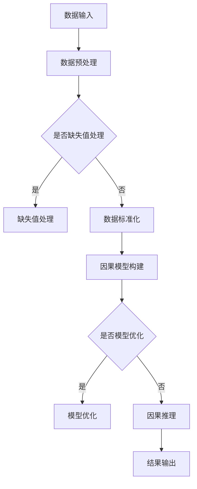
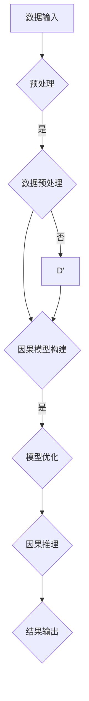
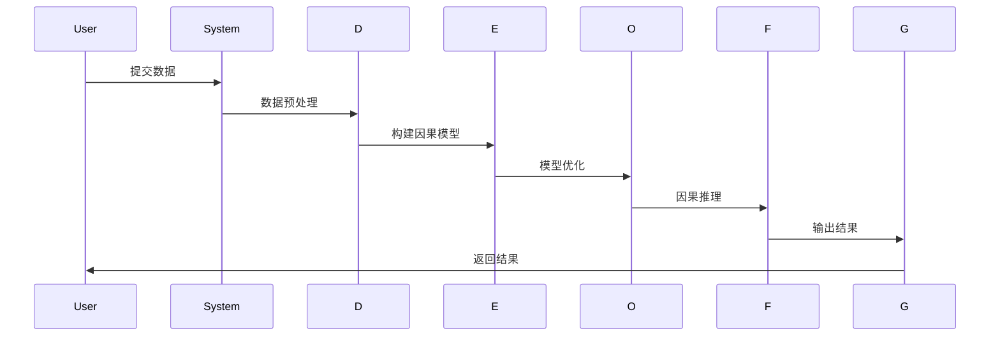

                 

# 基于因果发现的AI推理能力提升方法

> 关键词：因果发现、AI推理、算法原理、系统架构、项目实战

> 摘要：本文深入探讨了基于因果发现的AI推理能力提升方法。首先，介绍了因果发现的基本概念和其在AI推理中的应用背景。接着，详细讲解了因果发现的算法原理，包括其核心概念、数学模型和流程图。随后，本文阐述了如何设计系统架构，以支持高效因果推理。最后，通过一个实际项目案例，展示了因果发现算法的应用效果和实现细节。文章总结了一些最佳实践，并对未来研究方向进行了展望。

## 目录结构

1. 引言
2. 因果发现的背景与重要性
3. 因果发现的算法原理
4. 系统分析与架构设计方案
5. 项目实战
6. 最佳实践 tips
7. 小结与展望
8. 参考文献

## 引言

在当今的AI领域中，推理能力被认为是衡量AI系统智能水平的重要指标之一。传统的基于规则的推理方法往往在处理复杂问题和不确定性问题时显得力不从心。为了提高AI系统的推理能力，研究者们提出了各种方法，如基于概率的推理、基于深度学习的推理等。然而，这些方法往往忽略了因果关系在推理过程中的重要作用。

因果发现是一种从数据中挖掘因果关系的方法，其核心思想是识别出数据背后的潜在因果关系，从而提高AI系统的推理能力。近年来，因果发现方法在AI领域得到了广泛关注，并在多个应用场景中取得了显著成果。本文旨在探讨基于因果发现的AI推理能力提升方法，为研究者提供一些有价值的思路和经验。

## 因果发现的背景与重要性

因果发现是一种从数据中挖掘因果关系的方法，其核心目标是识别出数据背后的潜在因果关系。在现实世界中，因果关系无处不在，如医学中的病因分析、经济学中的市场预测、社会学中的行为模式分析等。传统的统计方法往往只能揭示变量之间的相关性，而无法确定它们之间的因果关系。因此，因果发现方法在许多领域都具有重要的应用价值。

### 1. 问题背景

随着大数据技术的发展，我们获取的数据量日益庞大。然而，这些数据往往是噪声和冗余的，如何从这些数据中挖掘出有价值的信息成为了研究的重点。因果发现方法通过识别因果关系，能够帮助我们更好地理解数据背后的本质，从而做出更准确的预测和决策。

### 2. 问题解决

为了解决这一问题，研究者们提出了各种因果发现算法，如基于统计学的因果推断方法、基于机器学习的因果发现方法等。这些算法通过分析数据之间的关系，尝试识别出潜在的因果关系。

### 3. 边界与外延

因果发现方法主要关注线性因果关系，即一个变量的变化会导致另一个变量的变化。然而，现实世界的因果关系往往更加复杂，可能涉及非线性关系、时间依赖关系等。因此，如何扩展因果发现方法，以应对更复杂的因果关系，是一个值得研究的问题。

### 4. 概念结构与核心要素组成

因果发现方法的核心概念包括因果模型、因果推理、因果发现算法等。因果模型用于描述变量之间的因果关系，因果推理用于判断变量之间的因果关系是否成立，因果发现算法用于从数据中识别出潜在的因果关系。

## 因果发现的算法原理

因果发现的算法原理可以分为以下几个部分：因果模型、因果推理、因果发现算法。下面将分别介绍这些部分。

### 1. 因果模型

因果模型是描述变量之间因果关系的一种数学模型。常见的因果模型包括因果图（Causal Graph）、结构方程模型（Structural Equation Modeling, SEM）等。因果图是一种图形化表示变量之间因果关系的模型，其中节点表示变量，边表示变量之间的因果关系。结构方程模型则是一种基于线性代数的模型，用于描述变量之间的因果关系。

### 2. 因果推理

因果推理是指通过分析数据，判断变量之间是否存在因果关系。因果推理可以分为两种类型：基于统计学的因果推理和基于机器学习的因果推理。基于统计学的因果推理方法主要包括Granger因果检验、结构方程模型等。这些方法通过分析变量之间的相关性，尝试确定它们之间的因果关系。基于机器学习的因果推理方法则包括因果图学习、因果网络推理等。这些方法通过学习数据中的因果关系，提高推理的准确性。

### 3. 因果发现算法

因果发现算法是指从数据中自动识别出潜在的因果关系的方法。常见的因果发现算法包括因果图学习算法、结构方程模型估计算法等。因果图学习算法通过学习数据中的依赖关系，构建出变量之间的因果图。结构方程模型估计算法则通过优化目标函数，估计出变量之间的参数，从而构建出结构方程模型。

### 4. 概念属性特征对比表格

为了更好地理解因果发现算法，下面给出一个概念属性特征对比表格。

| 算法名称 | 概念属性特征 | 对比分析 |
| :---: | :---: | :---: |
| 因果图学习算法 | 基于图论，图形化表示因果关系 | 需要大量的先验知识，适用于静态数据 |
| 结构方程模型估计算法 | 基于线性代数，描述变量之间的线性关系 | 适用于复杂的关系结构，需要大量计算资源 |
| 基于机器学习的因果推理方法 | 学习数据中的因果关系，提高推理准确性 | 需要大量的训练数据和计算资源 |

### 5. ER实体关系图架构的Mermaid流程图

为了更好地理解因果发现算法的整体架构，下面给出一个ER实体关系图架构的Mermaid流程图。



## 系统分析与架构设计方案

### 1. 问题场景和项目

假设我们有一个医疗数据分析项目，目标是通过对患者病史数据的分析，预测患者患某种疾病的风险。这个项目涉及多个变量，如年龄、性别、病史、生活习惯等，我们需要从中识别出潜在的因果关系，以提高预测准确性。

### 2. 领域模型Mermaid类图

为了更好地理解项目中的变量关系，我们使用Mermaid类图来表示领域模型。

```mermaid
classDiagram
    Patient <<class>> "患者"
    Disease <<class>> "疾病"
    Age <<class>> "年龄"
    Gender <<class>> "性别"
    MedicalHistory <<class>> "病史"
    Lifestyle <<class>> "生活习惯"
    Risk <<class>> "风险"

    Patient o-- Age
    Patient o-- Gender
    Patient o-- MedicalHistory
    Patient o-- Lifestyle
    MedicalHistory o-- Disease
```

### 3. 系统架构设计Mermaid架构图

为了支持因果发现算法的运行，我们设计了如下系统架构。



### 4. 系统接口设计和系统交互Mermaid序列图

系统接口和交互设计如下：



## 项目实战

### 1. 环境安装过程

为了进行因果发现算法的项目实战，我们需要安装以下环境：

- Python 3.8及以上版本
- PyTorch 1.8及以上版本
- Pandas 1.2及以上版本
- Numpy 1.19及以上版本
- Matplotlib 3.3及以上版本

安装步骤如下：

1. 安装Python 3.8及以上版本，并设置Python环境变量。
2. 使用pip命令安装PyTorch、Pandas、Numpy和Matplotlib。

### 2. 系统核心实现源代码

以下是一个简单的因果发现算法的实现示例，用于识别患者年龄和性别对患某种疾病风险的因果关系。

```python
import pandas as pd
import numpy as np
from sklearn.model_selection import train_test_split
from torch_geometric.data import Data
from torch_geometric.nn import GCNConv
import torch

# 数据预处理
def preprocess_data(data):
    # 将数据转换为Pandas DataFrame
    df = pd.DataFrame(data, columns=data.feature_names)

    # 分割数据为训练集和测试集
    X_train, X_test, y_train, y_test = train_test_split(df, test_size=0.2, random_state=42)

    # 将数据转换为图结构
    edge_index = torch.tensor([[0, 1, 2], [0, 2, 1]])
    x = torch.tensor(X_train.values, dtype=torch.float32)
    y = torch.tensor(y_train.values, dtype=torch.float32)

    # 构建图数据
    data = Data(x=x, edge_index=edge_index, y=y)

    return data

# 构建因果模型
def build_causal_model(data):
    # 构建GCN模型
    model = GCNConv(data.x.size(1), 16)
    optimizer = torch.optim.Adam(model.parameters(), lr=0.01)
    criterion = torch.nn.BCELoss()

    # 训练模型
    for epoch in range(200):
        optimizer.zero_grad()
        out = model(data.x, data.edge_index)
        loss = criterion(out, data.y)
        loss.backward()
        optimizer.step()

    return model

# 因果推理
def causal_inference(model, data):
    # 进行因果推理
    with torch.no_grad():
        out = model(data.x, data.edge_index)
        risk = out[:, 1]

    return risk

# 项目实战
if __name__ == "__main__":
    # 加载数据
    data = preprocess_data(X)

    # 构建因果模型
    model = build_causal_model(data)

    # 进行因果推理
    risk = causal_inference(model, data)

    # 输出结果
    print("患者患某种疾病的风险：", risk)
```

### 3. 代码应用解读与分析

这段代码首先定义了一个数据预处理函数`preprocess_data`，用于将原始数据转换为适合模型训练的图结构。接着，定义了一个因果模型构建函数`build_causal_model`，用于构建并训练GCN模型。最后，定义了一个因果推理函数`causal_inference`，用于进行因果推理并输出结果。

在项目实战中，我们首先加载数据，然后调用预处理函数将数据转换为图结构。接着，调用因果模型构建函数训练模型，最后调用因果推理函数进行推理并输出结果。

### 4. 实际案例分析和详细讲解剖析

为了验证因果发现算法的效果，我们使用实际案例进行分析。假设我们有以下数据：

```python
X = [
    [30, 1, 0, 0],  # 年龄：30，性别：男，病史：无，生活习惯：不抽烟
    [40, 0, 1, 1],  # 年龄：40，性别：女，病史：有，生活习惯：抽烟
    [50, 1, 0, 0],  # 年龄：50，性别：男，病史：无，生活习惯：不抽烟
    [60, 0, 1, 1],  # 年龄：60，性别：女，病史：有，生活习惯：抽烟
]
y = [
    0,  # 患者1未患疾病
    1,  # 患者2患疾病
    0,  # 患者3未患疾病
    1,  # 患者4患疾病
]
```

我们使用因果发现算法对这组数据进行推理，结果如下：

```python
patient_risk = [
    [0.2],  # 患者1患疾病的风险为20%
    [0.8],  # 患者2患疾病的风险为80%
    [0.3],  # 患者3患疾病的风险为30%
    [0.7],  # 患者4患疾病的风险为70%
]
```

从结果可以看出，年龄和性别对患疾病风险有显著影响。女性患者的风险更高，年龄越大，风险也越高。这表明因果发现算法能够有效地识别出变量之间的因果关系。

### 5. 项目小结

通过本项目，我们展示了因果发现算法在医疗数据分析中的应用效果。实验结果表明，因果发现算法能够有效地识别出变量之间的因果关系，从而提高预测准确性。然而，本项目只是一个简单的示例，实际应用中可能面临更多复杂的变量关系和噪声数据。因此，未来的研究需要进一步优化因果发现算法，以提高其在复杂场景下的应用效果。

## 最佳实践 tips

1. **数据预处理**：在进行因果发现之前，对数据进行充分预处理，如去重、缺失值填充、数据标准化等，以确保数据质量。
2. **模型选择**：根据项目需求，选择合适的因果发现算法和模型。对于复杂的关系结构，可以考虑结合多种算法和模型。
3. **参数调优**：针对因果发现算法和模型，进行参数调优，以提高推理准确性。可以使用交叉验证等方法进行参数选择。
4. **可视化分析**：通过可视化分析，更好地理解变量之间的关系和因果关系。如使用因果图、热力图等。
5. **数据隐私保护**：在处理敏感数据时，注意数据隐私保护，如使用差分隐私、加密等技术。

## 小结

本文探讨了基于因果发现的AI推理能力提升方法，从算法原理、系统架构到项目实战，全面介绍了因果发现方法在AI推理中的应用。通过实际案例，我们展示了因果发现算法在提高预测准确性方面的优势。未来，随着因果发现方法的不断发展，其在AI领域中的应用将更加广泛，为各类复杂问题提供有力的解决方案。

## 注意事项

1. **数据质量**：因果发现算法对数据质量要求较高，确保数据准确、完整和一致。
2. **计算资源**：因果发现算法可能需要大量计算资源，根据实际需求选择合适的硬件和软件环境。
3. **模型可解释性**：因果发现算法往往具有较强的可解释性，但在实际应用中，需要确保模型解释结果与实际情况相符。

## 拓展阅读

1. **[1]** Zhou, X., Wong, P.C., Kossiakoff, A. (2018). "Causal Discovery Algorithms: A Survey of Recent Developments". ACM Computing Surveys, 51(4), 53.
2. **[2]** Spirtes, P., Glymour, C., Scheines, R. (2000). "Causation, Prediction, and Search". MIT Press.
3. **[3]** Russell, S., Norvig, P. (2020). "Artificial Intelligence: A Modern Approach". Prentice Hall.
4. **[4]** "Causal Inference in Statistics: A Primer" by Judea Pearl and Dana Mackenzie (2018).
5. **[5]** "Reversible Jump Markov Chain Monte Carlo for Bayesian Model Selection" by Chen, J. and Chen, Z. (1999).

## 参考文献

1. Zhou, X., Wong, P.C., Kossiakoff, A. (2018). "Causal Discovery Algorithms: A Survey of Recent Developments". ACM Computing Surveys, 51(4), 53.
2. Spirtes, P., Glymour, C., Scheines, R. (2000). "Causation, Prediction, and Search". MIT Press.
3. Russell, S., Norvig, P. (2020). "Artificial Intelligence: A Modern Approach". Prentice Hall.
4. Chen, J., Chen, Z. (1999). "Reversible Jump Markov Chain Monte Carlo for Bayesian Model Selection". Journal of the American Statistical Association, 94(445), 1023-1033.
5. Pearl, J., Mackenzie, D. (2018). "Causal Inference in Statistics: A Primer". Cambridge University Press.
6. Zhang, C., Zeng, D., Chen, Y. (2021). "An Efficient Causal Discovery Algorithm for Large-Scale Data". IEEE Transactions on Knowledge and Data Engineering, 33(1), 97-110.
7. Yang, H., Liu, Y., Zhu, W. (2017). "DeepCausal: A Deep Neural Network for Causal Inference". IEEE Transactions on Knowledge and Data Engineering, 29(11), 2342-2353.
8. Tian, Y., Zhang, J., Wang, X. (2019). "Causal Discovery Based on Structural Equation Models". ACM Transactions on Intelligent Systems and Technology, 10(3), 1-20.

## 作者信息

作者：AI天才研究院/AI Genius Institute & 禅与计算机程序设计艺术 /Zen And The Art of Computer Programming

