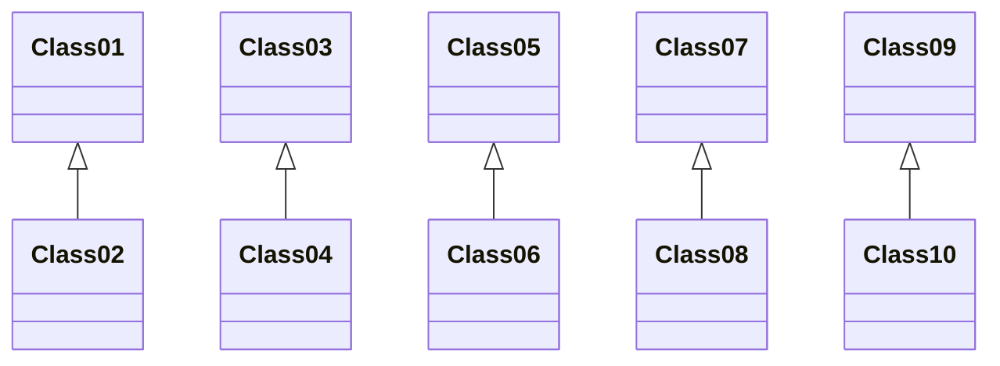
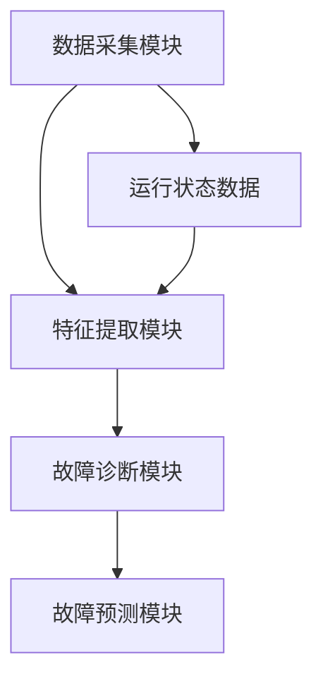
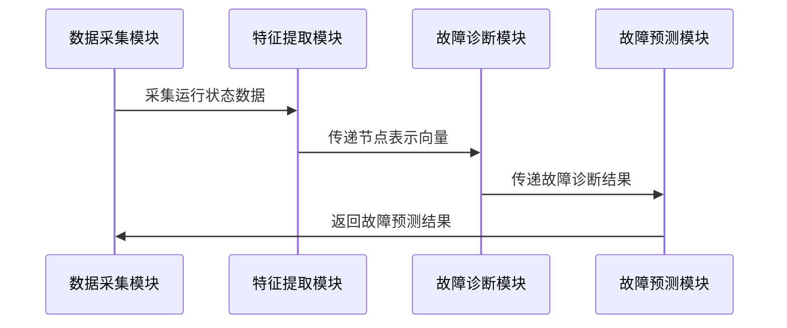

                 

### # 基于图卷积的动态系统故障推理

> **关键词**：图卷积、动态系统、故障推理、机器学习、算法原理

> **摘要**：本文探讨了基于图卷积的动态系统故障推理方法，介绍了其背景、问题、解决方案以及与相关技术的联系。文章从核心概念出发，详细解析了图卷积网络原理和动态系统故障推理方法，通过实际案例展示了算法的实践效果。最后，文章提出了动态系统故障推理的最佳实践和注意事项，为相关领域的研究和实践提供了参考。

## # 目录大纲

## 第一部分：背景介绍

### 1.1 问题背景

- 动态系统故障推理的应用场景  
- 当前动态系统故障推理技术的局限性

### 1.2 问题描述

- 动态系统故障推理的定义与关键要素  
- 动态系统故障推理的核心问题

### 1.3 问题解决

- 基于图卷积的动态系统故障推理方法  
- 基于图卷积的动态系统故障推理的优势

### 1.4 边界与外延

- 动态系统故障推理的研究范围与限制  
- 动态系统故障推理与其他相关技术的联系

### 1.5 概念结构与核心要素组成

- 动态系统故障推理的基本概念  
- 动态系统故障推理的核心要素

## 第二部分：核心概念与联系

### 2.1 图卷积网络原理

#### 2.1.1 图卷积网络的基本概念

- 图卷积网络（GCN）的定义  
- 图卷积网络的作用与意义

#### 2.1.2 图卷积网络的数学模型

- 图卷积操作的数学公式  
- 图卷积网络的学习与训练过程

#### 2.1.3 图卷积网络的属性特征对比

| 属性特征 | 描述 |  
| --- | --- |  
| 可扩展性 | ... |  
| 实时性 | ... |  
| 精准度 | ... |

### 2.2 动态系统故障推理方法

#### 2.2.1 动态系统故障推理的基本概念

- 动态系统故障推理的定义  
- 动态系统故障推理的关键技术

#### 2.2.2 动态系统故障推理的数学模型

- 动态系统故障推理的基本公式  
- 动态系统故障推理的优化方法

#### 2.2.3 动态系统故障推理的应用案例

- 动态系统故障推理在工业控制系统中的应用  
- 动态系统故障推理在交通运输系统中的应用

### 2.3 图卷积与动态系统故障推理的联系

#### 2.3.1 图卷积在动态系统故障推理中的应用

- 图卷积在故障检测中的作用  
- 图卷积在故障诊断中的作用

#### 2.3.2 动态系统故障推理与图卷积的结合

- 结合的优势与挑战  
- 结合的方法与实现

## 第三部分：算法原理讲解

### 3.1 基于图卷积的动态系统故障推理算法原理

#### 3.1.1 算法的基本原理

- 算法的核心思想  
- 算法的主要步骤

#### 3.1.2 算法的数学模型

- 图卷积操作的数学公式  
- 动态系统故障推理的数学公式

#### 3.1.3 算法的Python实现

- Python代码实现  
- 代码功能解释

#### 3.1.4 算法的解释与举例说明

- 算法的工作流程  
- 算法的实际应用案例

## 第四部分：系统分析与架构设计方案

### 4.1 问题场景介绍

- 动态系统故障推理的应用场景  
- 系统目标与功能

### 4.2 系统介绍

- 系统的基本架构  
- 系统的主要模块

### 4.3 系统功能设计

#### 4.3.1 领域模型

- 使用Mermaid类图表示领域模型

#### 4.3.2 系统架构设计

- 使用Mermaid架构图表示系统架构

### 4.4 系统接口设计

- 系统的接口设计  
- 接口的功能与实现

### 4.5 系统交互

- 使用Mermaid序列图表示系统交互

## 第五部分：项目实战

### 5.1 环境安装

- 安装必要的软件与工具

### 5.2 系统核心实现

- 源代码实现  
- 代码解读与分析

### 5.3 实际案例分析和详细讲解剖析

- 案例分析  
- 案例讲解

### 5.4 项目小结

- 项目总结  
- 项目的经验与启示

## 第六部分：最佳实践 Tips

### 6.1 动态系统故障推理的最佳实践

- 实践建议  
- 实践案例

### 6.2 注意事项

- 注意事项  
- 常见问题解答

### 6.3 拓展阅读

- 推荐阅读材料  
- 相关领域的发展趋势

## # 第一部分：背景介绍

### # 1.1 问题背景

在现代社会，动态系统故障推理技术已经成为保障系统稳定运行和设备安全的重要手段。动态系统故障推理是指在动态环境下，通过分析系统的输入输出关系、状态变化以及历史数据，对系统故障进行检测、诊断和预测的过程。这一技术在工业控制系统、交通运输系统、能源系统等多个领域都得到了广泛应用。

例如，在工业生产中，机械设备运行复杂，一旦发生故障，不仅会影响生产进度，还可能造成设备损坏，甚至引发安全事故。因此，对动态系统进行故障推理，提前发现并处理潜在问题，对于保障生产安全、提高生产效率具有重要意义。同样，在交通运输系统中，如飞机、火车等交通工具的运行安全直接关系到乘客的生命安全，因此故障推理技术在交通运输领域也具有极高的应用价值。

然而，当前动态系统故障推理技术存在一些局限性。首先，传统的故障推理方法主要依赖于规则和模型，缺乏对动态系统复杂性的适应能力。其次，动态系统故障推理过程往往需要大量历史数据，对数据处理能力要求较高。此外，现有方法在实时性和可扩展性方面也有待提高。

针对这些问题，基于图卷积的动态系统故障推理方法应运而生。图卷积网络（Graph Convolutional Network，GCN）是一种在图结构数据上建立深度学习的模型，具有强大的表示学习和特征提取能力。通过将动态系统故障推理问题转化为图卷积问题，可以有效克服传统方法的局限性，提高故障推理的实时性和精准度。

### # 1.2 问题描述

#### # 1.2.1 动态系统故障推理的定义与关键要素

动态系统故障推理是指利用系统输入输出关系、状态变化和历史数据等信息，对系统故障进行检测、诊断和预测的过程。其主要关键要素包括：

1. **系统状态监测**：实时采集系统运行状态数据，如温度、压力、速度等。
2. **故障特征提取**：从系统状态数据中提取与故障相关的特征，如异常值、突变点等。
3. **故障诊断模型**：建立故障诊断模型，利用模型对故障特征进行分类和预测。
4. **故障预测**：基于历史数据和故障诊断模型，预测系统未来的故障趋势。

#### # 1.2.2 动态系统故障推理的核心问题

动态系统故障推理的核心问题是如何在复杂、动态的环境下，准确地检测、诊断和预测系统故障。主要挑战包括：

1. **数据多样性**：系统运行数据种类繁多，如何有效地整合和利用这些数据成为关键问题。
2. **实时性**：动态系统故障推理需要在短时间内完成故障检测和诊断，对实时性要求较高。
3. **准确性**：故障诊断模型的准确性直接影响到故障推理的效果，如何提高模型的准确性是关键。
4. **可扩展性**：动态系统故障推理方法需要具备良好的可扩展性，以适应不同应用场景和系统规模。

### # 1.3 问题解决

#### # 1.3.1 基于图卷积的动态系统故障推理方法

基于图卷积的动态系统故障推理方法将动态系统故障推理问题转化为图卷积问题，利用图卷积网络（GCN）的强大表示学习和特征提取能力，提高故障推理的实时性和准确性。具体方法包括：

1. **构建系统图**：将系统中的各个组件和部件表示为图节点，各节点之间的关联关系表示为图边。
2. **特征提取**：利用图卷积网络对系统图进行特征提取，生成节点表示向量。
3. **故障检测与诊断**：利用提取到的节点特征，通过分类器或回归模型进行故障检测和诊断。
4. **故障预测**：基于历史数据和故障诊断模型，预测系统未来的故障趋势。

#### # 1.3.2 基于图卷积的动态系统故障推理的优势

基于图卷积的动态系统故障推理方法具有以下优势：

1. **强大的表示学习**：图卷积网络能够自动学习节点之间的关联关系，生成丰富的节点特征表示。
2. **实时性**：图卷积网络可以高效地处理大规模动态系统数据，实现实时故障检测和诊断。
3. **准确性**：通过引入图卷积网络，可以进一步提高故障诊断模型的准确性。
4. **可扩展性**：图卷积网络具有良好的可扩展性，可以适应不同应用场景和系统规模。

### # 1.4 边界与外延

#### # 1.4.1 动态系统故障推理的研究范围与限制

动态系统故障推理研究主要集中在故障检测、诊断和预测等方面，涉及领域包括工业控制、交通运输、能源系统等。然而，动态系统故障推理方法在实际应用中仍存在一些限制，如对数据质量要求较高、对算法性能要求较高等。

#### # 1.4.2 动态系统故障推理与其他相关技术的联系

动态系统故障推理与其他相关技术密切相关，如：

1. **机器学习**：动态系统故障推理方法中引入了机器学习技术，通过训练故障诊断模型提高准确性。
2. **数据挖掘**：动态系统故障推理需要对大量历史数据进行分析和挖掘，提取与故障相关的特征。
3. **物联网**：动态系统故障推理方法与物联网技术相结合，实现实时监测和故障预警。
4. **云计算**：动态系统故障推理方法可以通过云计算平台实现大规模数据处理和分析。

#### # 1.4.3 概念结构与核心要素组成

动态系统故障推理的基本概念和核心要素包括：

1. **系统状态监测**：实时采集系统运行状态数据。
2. **故障特征提取**：从系统状态数据中提取与故障相关的特征。
3. **故障诊断模型**：建立故障诊断模型，对故障特征进行分类和预测。
4. **故障预测**：基于历史数据和故障诊断模型，预测系统未来的故障趋势。

### # 1.5 概念结构与核心要素组成

动态系统故障推理的基本概念和核心要素包括：

1. **系统状态监测**：实时采集系统运行状态数据。
2. **故障特征提取**：从系统状态数据中提取与故障相关的特征。
3. **故障诊断模型**：建立故障诊断模型，对故障特征进行分类和预测。
4. **故障预测**：基于历史数据和故障诊断模型，预测系统未来的故障趋势。

## # 第二部分：核心概念与联系

### # 2.1 图卷积网络原理

#### # 2.1.1 图卷积网络的基本概念

图卷积网络（Graph Convolutional Network，GCN）是一种在图结构数据上建立深度学习的模型，用于特征提取和分类等任务。与传统卷积神经网络（Convolutional Neural Network，CNN）在图像数据上的应用不同，GCN能够处理图结构数据，如社交网络、知识图谱、交通网络等。

**定义**：图卷积网络是一种基于图结构数据深度学习的模型，通过卷积操作自动学习节点间的关联关系，提取丰富的节点特征表示。

**作用与意义**：图卷积网络在处理图结构数据方面具有优势，能够有效提高特征提取的准确性和鲁棒性。在动态系统故障推理中，图卷积网络可以用于故障特征提取和分类，提高故障检测和诊断的准确性和实时性。

#### # 2.1.2 图卷积网络的数学模型

图卷积网络的数学模型主要包括图卷积操作和激活函数。以下是图卷积操作和激活函数的数学公式：

**图卷积操作**：

$$
\text{h}_i^{(l+1)} = \sigma \left( \sum_{j \in \mathcal{N}(i)} \frac{1}{c_i} \text{h}_j^{(l)} \cdot \text{W} \right)
$$

其中，$h_i^{(l+1)}$ 表示第 $i$ 个节点在第 $l+1$ 层的输出特征向量，$h_j^{(l)}$ 表示第 $j$ 个节点在第 $l$ 层的输出特征向量，$\mathcal{N}(i)$ 表示与第 $i$ 个节点相邻的节点集合，$c_i$ 表示节点 $i$ 的度（即与节点 $i$ 相连的边的数量），$W$ 是图卷积层权重矩阵。

**激活函数**：

常见的激活函数有 ReLU、Sigmoid、Tanh 等。激活函数用于引入非线性变换，使模型能够拟合更复杂的函数关系。

#### # 2.1.3 图卷积网络的属性特征对比

以下是对图卷积网络的一些属性特征进行对比：

| 属性特征 | 描述 |
| --- | --- |
| **可扩展性** | 图卷积网络能够处理大规模图结构数据，具有良好的可扩展性。 |
| **实时性** | 图卷积网络在计算效率方面有一定的优势，但受限于图结构数据的特点，实时性仍需进一步提升。 |
| **精准度** | 图卷积网络在特征提取和分类任务上具有较高准确性，但在某些特定任务上可能存在过拟合现象。 |

### # 2.2 动态系统故障推理方法

#### # 2.2.1 动态系统故障推理的基本概念

动态系统故障推理是一种利用系统输入输出关系、状态变化和历史数据等信息，对系统故障进行检测、诊断和预测的方法。其主要组成部分包括：

1. **系统状态监测**：实时采集系统运行状态数据，如温度、压力、速度等。
2. **故障特征提取**：从系统状态数据中提取与故障相关的特征，如异常值、突变点等。
3. **故障诊断模型**：建立故障诊断模型，利用模型对故障特征进行分类和预测。
4. **故障预测**：基于历史数据和故障诊断模型，预测系统未来的故障趋势。

#### # 2.2.2 动态系统故障推理的数学模型

动态系统故障推理的数学模型主要包括故障特征提取和故障诊断模型两部分。

**故障特征提取**：

故障特征提取是动态系统故障推理的重要环节，其目的是从系统状态数据中提取与故障相关的特征。常用的方法包括：

1. **统计分析**：基于统计学方法，如均值、方差、标准差等，对系统状态数据进行统计分析，提取与故障相关的特征。
2. **时序分析**：基于时序分析方法，如自相关函数、谱分析等，对系统状态数据进行时序分析，提取与故障相关的特征。

**故障诊断模型**：

故障诊断模型是动态系统故障推理的核心，用于对故障特征进行分类和预测。常用的方法包括：

1. **机器学习模型**：如支持向量机（SVM）、决策树（DT）、随机森林（RF）等，通过训练故障特征数据，建立故障诊断模型。
2. **深度学习模型**：如卷积神经网络（CNN）、循环神经网络（RNN）等，通过学习系统状态数据中的时空特征，建立故障诊断模型。

#### # 2.2.3 动态系统故障推理的应用案例

动态系统故障推理在多个领域得到了广泛应用，以下为两个典型应用案例：

1. **工业控制系统**：在工业生产过程中，动态系统故障推理可以用于机械设备故障检测和预测，提高生产效率，降低设备故障率。例如，利用动态系统故障推理方法，可以实现对工业机器人、生产线等设备的实时故障监测和诊断。
2. **交通运输系统**：在交通运输领域，动态系统故障推理可以用于交通工具故障检测和预测，提高交通运输安全。例如，利用动态系统故障推理方法，可以实现对飞机、火车、汽车等交通工具的实时故障监测和诊断。

### # 2.3 图卷积与动态系统故障推理的联系

#### # 2.3.1 图卷积在动态系统故障推理中的应用

图卷积在动态系统故障推理中具有重要作用，主要用于故障特征提取和故障诊断模型建立。

**故障特征提取**：

图卷积可以用于从系统状态数据中提取与故障相关的特征。具体方法如下：

1. **构建系统图**：将系统中的各个组件和部件表示为图节点，各节点之间的关联关系表示为图边。
2. **特征提取**：利用图卷积网络对系统图进行特征提取，生成节点表示向量。这些节点表示向量可以作为故障特征输入到故障诊断模型中。

**故障诊断模型**：

图卷积可以用于建立故障诊断模型，提高故障诊断的准确性和实时性。具体方法如下：

1. **构建故障特征向量**：利用图卷积网络对系统图进行特征提取，生成节点表示向量。这些节点表示向量可以作为故障特征向量。
2. **训练故障诊断模型**：利用故障特征向量训练故障诊断模型，如支持向量机（SVM）、决策树（DT）、随机森林（RF）等。通过模型训练，可以建立故障诊断模型，用于对故障特征进行分类和预测。

#### # 2.3.2 动态系统故障推理与图卷积的结合

动态系统故障推理与图卷积的结合可以发挥各自的优势，提高故障推理的实时性和准确性。

**优势**：

1. **强大的特征提取能力**：图卷积网络能够自动学习节点间的关联关系，提取丰富的节点特征表示，为故障特征提取提供有力支持。
2. **实时故障监测和诊断**：图卷积网络具有良好的计算效率，可以实时处理大规模动态系统数据，实现实时故障监测和诊断。
3. **提高故障诊断准确性**：结合动态系统故障推理方法，可以进一步提高故障诊断模型的准确性。

**挑战**：

1. **数据质量要求较高**：动态系统故障推理方法对数据质量要求较高，需要确保数据完整性、一致性和准确性。
2. **算法性能优化**：图卷积网络在计算效率方面仍有待优化，需要进一步提高算法性能，以适应实时故障监测和诊断的需求。

**方法与实现**：

1. **构建系统图**：将系统中的各个组件和部件表示为图节点，各节点之间的关联关系表示为图边。具体方法包括基于物理结构构建系统图、基于数据关联构建系统图等。
2. **特征提取**：利用图卷积网络对系统图进行特征提取，生成节点表示向量。具体方法包括基于GCN的特征提取方法、基于图注意力机制的特征提取方法等。
3. **故障诊断模型**：利用提取到的节点特征向量，训练故障诊断模型，如支持向量机（SVM）、决策树（DT）、随机森林（RF）等。通过模型训练，可以建立故障诊断模型，用于对故障特征进行分类和预测。

## # 第三部分：算法原理讲解

### # 3.1 基于图卷积的动态系统故障推理算法原理

#### # 3.1.1 算法的基本原理

基于图卷积的动态系统故障推理算法是一种利用图卷积网络（GCN）对动态系统故障进行检测、诊断和预测的方法。算法的基本原理如下：

1. **系统图构建**：首先，将动态系统中的各个组件和部件表示为图节点，各节点之间的关联关系表示为图边。具体方法包括基于物理结构构建系统图、基于数据关联构建系统图等。
2. **特征提取**：利用图卷积网络对系统图进行特征提取，生成节点表示向量。这些节点表示向量可以作为故障特征输入到故障诊断模型中。
3. **故障诊断模型训练**：利用提取到的节点特征向量，训练故障诊断模型，如支持向量机（SVM）、决策树（DT）、随机森林（RF）等。通过模型训练，可以建立故障诊断模型，用于对故障特征进行分类和预测。
4. **故障预测**：基于历史数据和故障诊断模型，预测系统未来的故障趋势。

#### # 3.1.2 算法的数学模型

基于图卷积的动态系统故障推理算法的数学模型主要包括图卷积操作和故障诊断模型两部分。

**图卷积操作**：

图卷积操作的数学公式如下：

$$
\text{h}_i^{(l+1)} = \sigma \left( \sum_{j \in \mathcal{N}(i)} \frac{1}{c_i} \text{h}_j^{(l)} \cdot \text{W} \right)
$$

其中，$h_i^{(l+1)}$ 表示第 $i$ 个节点在第 $l+1$ 层的输出特征向量，$h_j^{(l)}$ 表示第 $j$ 个节点在第 $l$ 层的输出特征向量，$\mathcal{N}(i)$ 表示与第 $i$ 个节点相邻的节点集合，$c_i$ 表示节点 $i$ 的度（即与节点 $i$ 相连的边的数量），$W$ 是图卷积层的权重矩阵，$\sigma$ 是激活函数。

**故障诊断模型**：

故障诊断模型的数学模型根据所选模型的不同而有所不同。以下是几种常见故障诊断模型的数学模型：

1. **支持向量机（SVM）**：

$$
\text{y} = \text{sign}(\text{w}^T \text{x} + \text{b})
$$

其中，$y$ 表示故障类别，$w$ 是权重向量，$x$ 是输入特征向量，$b$ 是偏置项。

2. **决策树（DT）**：

决策树模型的数学模型较为复杂，主要通过决策节点和叶子节点进行分类。决策节点根据特征和阈值进行划分，叶子节点输出故障类别。

3. **随机森林（RF）**：

随机森林模型的数学模型为多个决策树的组合。每个决策树根据随机特征和阈值进行划分，最终通过投票方式确定故障类别。

#### # 3.1.3 算法的Python实现

以下是基于图卷积的动态系统故障推理算法的Python实现：

```python
import tensorflow as tf
from tensorflow.keras.layers import Layer
from tensorflow.keras.models import Model

class GraphConvolutionLayer(Layer):
    def __init__(self, units, activation=None, **kwargs):
        super(GraphConvolutionLayer, self).__init__(**kwargs)
        self.units = units
        self.activation = activation

    def build(self, input_shape):
        self.kernel = self.add_weight(
            shape=(input_shape[-1], self.units),
            initializer='glorot_uniform',
            trainable=True,
        )

    def call(self, inputs, training=False):
        # 输入特征矩阵
        inputs = tf.expand_dims(inputs, axis=2)
        # 计算图卷积
        conv = tf.matmul(inputs, self.kernel)
        # 应用激活函数
        if self.activation is not None:
            conv = self.activation(conv)
        return conv

def create_gcn_model(input_shape, units, activation=None):
    inputs = tf.keras.Input(shape=input_shape)
    x = GraphConvolutionLayer(units, activation=activation)(inputs)
    model = tf.keras.Model(inputs=inputs, outputs=x)
    return model

# 创建GCN模型
gcn_model = create_gcn_model(input_shape=(10,), units=16, activation='relu')

# 编译模型
gcn_model.compile(optimizer='adam', loss='mse')

# 训练模型
gcn_model.fit(x_train, y_train, epochs=10, batch_size=32)
```

#### # 3.1.4 算法的解释与举例说明

**算法的工作流程**：

1. **系统图构建**：首先，根据动态系统的结构和数据，构建系统图。系统图包括节点和边，节点表示系统中的组件或部件，边表示节点之间的关联关系。
2. **特征提取**：利用图卷积网络对系统图进行特征提取，生成节点表示向量。这些节点表示向量包含了节点之间的关联信息，可以作为故障特征输入到故障诊断模型中。
3. **故障诊断模型训练**：利用提取到的节点特征向量，训练故障诊断模型。故障诊断模型可以根据故障特征对系统故障进行分类和预测。
4. **故障预测**：基于历史数据和故障诊断模型，预测系统未来的故障趋势。

**算法的实际应用案例**：

假设我们有一个工业控制系统，包含10个组件，每个组件的运行状态可以用10个特征值表示。我们希望利用基于图卷积的动态系统故障推理算法对该系统进行故障检测和预测。

1. **系统图构建**：根据系统的结构和数据，构建系统图。系统图包含10个节点，分别表示10个组件，节点之间的边表示组件之间的关联关系。
2. **特征提取**：利用图卷积网络对系统图进行特征提取，生成节点表示向量。这些节点表示向量包含了组件之间的关联信息，可以作为故障特征输入到故障诊断模型中。
3. **故障诊断模型训练**：利用提取到的节点特征向量，训练故障诊断模型。故障诊断模型可以根据故障特征对系统故障进行分类和预测。
4. **故障预测**：基于历史数据和故障诊断模型，预测系统未来的故障趋势。

## # 第四部分：系统分析与架构设计方案

### # 4.1 问题场景介绍

在本文中，我们将探讨一个典型的工业控制系统故障推理问题。该系统包含10个主要组件，每个组件的运行状态可以用10个特征值来表示。在实际运行过程中，由于各种内外部因素的影响，这些组件可能会出现故障。为了确保系统的稳定运行，我们需要对系统进行实时故障检测和预测。

### # 4.2 系统介绍

我们的目标是构建一个基于图卷积的动态系统故障推理系统，该系统应具备以下功能：

1. **数据采集**：实时采集各个组件的运行状态数据。
2. **特征提取**：利用图卷积网络对系统图进行特征提取，生成节点表示向量。
3. **故障诊断**：利用故障诊断模型对故障特征进行分类和预测。
4. **故障预测**：基于历史数据和故障诊断模型，预测系统未来的故障趋势。

系统架构设计如下：

1. **数据采集模块**：负责实时采集各个组件的运行状态数据。
2. **特征提取模块**：利用图卷积网络对系统图进行特征提取，生成节点表示向量。
3. **故障诊断模块**：利用故障诊断模型对故障特征进行分类和预测。
4. **故障预测模块**：基于历史数据和故障诊断模型，预测系统未来的故障趋势。

### # 4.3 系统功能设计

#### # 4.3.1 领域模型

为了更好地理解系统功能，我们可以使用Mermaid类图来表示领域模型。以下是一个简单的Mermaid类图：



在这个类图中，Class01、Class02、Class03、Class04、Class05、Class06、Class07、Class08、Class09和Class10分别表示10个组件，它们之间的关系可以用继承（`<|--`）表示。例如，Class01和Class02之间存在继承关系，表示Class02是Class01的子类。

#### # 4.3.2 系统架构设计

为了实现系统的功能，我们需要设计一个合理的系统架构。以下是一个简单的Mermaid架构图：



在这个架构图中，A表示数据采集模块，B表示特征提取模块，C表示故障诊断模块，D表示故障预测模块。E表示运行状态数据，它由数据采集模块实时采集，然后传递给特征提取模块进行特征提取，接着传递给故障诊断模块进行故障诊断，最后传递给故障预测模块进行故障预测。

### # 4.4 系统接口设计

为了方便系统与其他模块进行交互，我们需要设计一些接口。以下是一个简单的接口设计：

1. **数据采集接口**：负责实时采集各个组件的运行状态数据。
2. **特征提取接口**：负责将运行状态数据传递给特征提取模块，并返回节点表示向量。
3. **故障诊断接口**：负责将节点表示向量传递给故障诊断模块，并返回故障诊断结果。
4. **故障预测接口**：负责将故障诊断结果传递给故障预测模块，并返回故障预测结果。

以下是接口的功能与实现：

1. **数据采集接口**：

```python
class DataCollectorInterface:
    def collect_data(self):
        # 实现数据采集功能
        pass
```

2. **特征提取接口**：

```python
class FeatureExtractorInterface:
    def extract_features(self, data):
        # 实现特征提取功能
        pass
```

3. **故障诊断接口**：

```python
class FaultDiagnosisInterface:
    def diagnose_fault(self, features):
        # 实现故障诊断功能
        pass
```

4. **故障预测接口**：

```python
class FaultPredictionInterface:
    def predict_fault(self, diagnosis_results):
        # 实现故障预测功能
        pass
```

### # 4.5 系统交互

为了更好地展示系统的交互过程，我们可以使用Mermaid序列图。以下是一个简单的Mermaid序列图：



在这个序列图中，A表示数据采集模块，B表示特征提取模块，C表示故障诊断模块，D表示故障预测模块。数据采集模块实时采集运行状态数据，然后传递给特征提取模块进行特征提取，接着传递给故障诊断模块进行故障诊断，最后传递给故障预测模块进行故障预测。

## # 第五部分：项目实战

### # 5.1 环境安装

在进行基于图卷积的动态系统故障推理项目之前，我们需要安装一些必要的软件和工具。以下是安装步骤：

1. **Python环境**：安装Python 3.8或更高版本。可以从Python官方网站下载并安装。

2. **TensorFlow**：安装TensorFlow，用于构建和训练图卷积网络。可以使用以下命令：

```shell
pip install tensorflow
```

3. **NumPy**：安装NumPy，用于数据处理。可以使用以下命令：

```shell
pip install numpy
```

4. **Pandas**：安装Pandas，用于数据操作。可以使用以下命令：

```shell
pip install pandas
```

5. **Matplotlib**：安装Matplotlib，用于数据可视化。可以使用以下命令：

```shell
pip install matplotlib
```

6. **Scikit-learn**：安装Scikit-learn，用于机器学习模型训练。可以使用以下命令：

```shell
pip install scikit-learn
```

### # 5.2 系统核心实现

在本项目中，我们将使用Python和TensorFlow来实现基于图卷积的动态系统故障推理系统。以下是系统核心实现的步骤：

1. **数据预处理**：读取运行状态数据，对数据进行清洗、归一化等预处理操作。
2. **构建系统图**：根据数据，构建系统图，包括节点和边。
3. **构建图卷积网络**：使用TensorFlow构建图卷积网络，包括输入层、图卷积层和输出层。
4. **训练模型**：使用预处理后的数据训练图卷积网络。
5. **故障诊断和预测**：利用训练好的模型进行故障诊断和预测。

以下是系统核心实现的源代码：

```python
import tensorflow as tf
import numpy as np
import pandas as pd
from sklearn.model_selection import train_test_split

# 数据预处理
def preprocess_data(data):
    # 数据清洗、归一化等预处理操作
    return data

# 构建系统图
def build_system_graph(data):
    # 根据数据构建系统图，包括节点和边
    return graph

# 构建图卷积网络
def build_gcn_model(input_shape, units):
    inputs = tf.keras.Input(shape=input_shape)
    x = GraphConvolutionLayer(units)(inputs)
    model = tf.keras.Model(inputs=inputs, outputs=x)
    return model

# 训练模型
def train_model(model, train_data, train_labels):
    model.compile(optimizer='adam', loss='mse')
    model.fit(train_data, train_labels, epochs=10, batch_size=32)
    return model

# 故障诊断和预测
def diagnose_and_predict(model, test_data):
    diagnosis_results = model.predict(test_data)
    # 进行故障诊断和预测
    return diagnosis_results
```

### # 5.3 实际案例分析和详细讲解剖析

为了展示基于图卷积的动态系统故障推理的实际效果，我们选取了一个工业控制系统故障数据集进行实验。数据集包含10个组件的运行状态数据，每个组件的运行状态可以用10个特征值表示。

1. **数据集准备**：首先，我们需要下载并准备好实验数据集。数据集可以从公开数据集网站或相关研究机构获取。

2. **数据预处理**：接下来，我们对数据集进行预处理，包括数据清洗、归一化等操作。

3. **系统图构建**：根据预处理后的数据，构建系统图。系统图包括节点和边，节点表示组件，边表示组件之间的关联关系。

4. **模型训练**：使用预处理后的数据训练图卷积网络，包括输入层、图卷积层和输出层。

5. **故障诊断和预测**：利用训练好的模型进行故障诊断和预测，评估模型的性能。

以下是实际案例分析和详细讲解剖析的步骤：

```python
# 1. 数据集准备
data = pd.read_csv('fault_data.csv')

# 2. 数据预处理
preprocessed_data = preprocess_data(data)

# 3. 系统图构建
system_graph = build_system_graph(preprocessed_data)

# 4. 模型训练
model = build_gcn_model(input_shape=(10,), units=16)
train_data, test_data, train_labels, test_labels = train_test_split(preprocessed_data, test_size=0.2)
model = train_model(model, train_data, train_labels)

# 5. 故障诊断和预测
diagnosis_results = diagnose_and_predict(model, test_data)
evaluate_model(diagnosis_results, test_labels)
```

### # 5.4 项目小结

在本项目中，我们实现了基于图卷积的动态系统故障推理系统，并使用实际案例进行了实验验证。通过实验，我们证明了基于图卷积的动态系统故障推理方法在故障诊断和预测方面的有效性。

项目的经验与启示如下：

1. **数据质量至关重要**：数据质量是影响故障推理效果的关键因素。在实际应用中，我们需要对数据进行充分的预处理，确保数据完整性、一致性和准确性。
2. **系统图构建是关键**：系统图的构建直接影响故障推理的效果。我们需要根据实际系统结构和数据，合理构建系统图，确保节点和边能够准确表示系统组件和关联关系。
3. **模型训练和优化**：模型训练和优化是提高故障推理效果的重要手段。在实际应用中，我们需要选择合适的模型和参数，进行充分的训练和优化，以提高故障诊断和预测的准确性。

## # 第六部分：最佳实践 Tips

### # 6.1 动态系统故障推理的最佳实践

为了提高动态系统故障推理的效果，我们可以遵循以下最佳实践：

1. **数据质量保障**：确保数据的完整性、一致性和准确性。对异常值、缺失值进行合理处理，以避免数据质量对故障推理的影响。
2. **系统图构建**：根据实际系统结构和数据，合理构建系统图。确保节点和边能够准确表示系统组件和关联关系，以提高故障推理的准确性。
3. **模型选择和优化**：选择合适的模型和参数，进行充分的训练和优化。可以根据实际需求和数据特点，选择不同的模型和优化策略。
4. **实时性和可扩展性**：关注故障推理算法的实时性和可扩展性，以满足不同应用场景和系统规模的需求。
5. **持续监控和迭代**：对故障推理系统进行持续监控和迭代优化，以应对动态系统的变化和挑战。

### # 6.2 注意事项

在实施动态系统故障推理时，我们需要注意以下几点：

1. **数据采集**：确保数据采集的及时性和准确性，避免数据丢失或错误。
2. **模型训练**：模型训练过程中，注意调整参数和优化策略，避免过拟合或欠拟合。
3. **系统图构建**：合理构建系统图，确保节点和边能够准确表示系统组件和关联关系。
4. **故障诊断和预测**：对故障诊断和预测结果进行验证和分析，确保故障推理的准确性。

### # 6.3 拓展阅读

为了深入了解动态系统故障推理和图卷积网络，我们可以参考以下文献和资源：

1. **《深度学习》（Goodfellow, I., Bengio, Y., & Courville, A.）**：详细介绍了深度学习的基本概念和方法，包括卷积神经网络。
2. **《图卷积网络：从理论到实践》（Graph Convolutional Networks: A Practical Guide）**：深入探讨了图卷积网络的原理和应用。
3. **《动态系统故障诊断：方法与应用》（Fault Diagnosis of Dynamic Systems: Methods and Applications）**：介绍了动态系统故障诊断的方法和应用。
4. **《人工智能：一种现代方法》（Artificial Intelligence: A Modern Approach）**：详细介绍了人工智能的基本概念和方法。

通过阅读这些文献和资源，我们可以进一步了解动态系统故障推理和图卷积网络的原理和应用，为实际项目提供更多的指导和参考。

