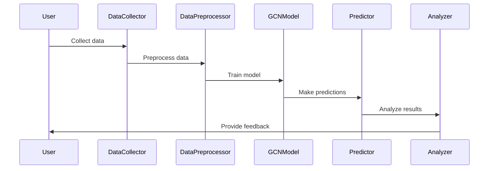

                 

# 《基于图卷积网络的复杂系统推理在生态系统恢复预测中的应用》

> 关键词：图卷积网络、复杂系统、生态系统恢复预测、推理算法、环境建模

> 摘要：本文深入探讨了基于图卷积网络的复杂系统推理在生态系统恢复预测中的应用。文章首先介绍了生态系统恢复的背景和现状，随后提出了复杂系统推理在生态系统恢复预测中的重要性。本文通过详细阐述图卷积网络的基本原理，展示了其如何应用于生态系统恢复预测的数学模型和算法设计。最后，本文通过一个实际案例展示了图卷积网络在生态系统恢复预测中的效果，并对未来研究方向进行了展望。

## 目录大纲

1. 引言
2. 核心概念与联系
   - 图卷积网络
   - 复杂系统
   - 生态系统恢复预测
3. 图卷积网络原理讲解
   - 基本原理
   - mermaid流程图
4. 生态系统恢复预测的数学模型与公式
   - 数学模型
   - 公式详细讲解
   - 举例说明
5. 系统分析与架构设计
   - 问题场景介绍
   - 系统功能设计
   - 系统架构设计
   - 系统接口设计
   - 系统交互
6. 项目实战
   - 环境安装
   - 系统核心实现
   - 代码应用解读与分析
   - 实际案例分析与讲解
   - 项目小结
7. 最佳实践与拓展阅读
   - 最佳实践
   - 小结
   - 注意事项
   - 拓展阅读

---

## 第1章 引言

### 1.1 问题背景

生态系统恢复是指通过一系列的生态修复措施，使受损的生态系统逐渐恢复到相对稳定和健康的状态。随着工业化进程的加快和人类活动的加剧，许多生态系统受到了严重的破坏，如森林砍伐、湿地开发、土壤污染等。生态系统恢复的必要性在于恢复生态系统的功能和服务，以支持生物多样性保护、土壤保持、水资源保护和气候调节等。

### 1.2 问题描述

生态系统恢复预测涉及对生态系统恢复过程的模拟和预测。这需要处理复杂系统的特征，如非线性、不确定性和相互作用。复杂系统的概念与特征包括：

- **复杂性**：生态系统由大量不同类型的生物体和非生物因素组成，这些因素之间存在复杂的相互作用。
- **非线性**：生态系统的行为通常不是线性的，一个小的变化可能导致显著的不同结果。
- **不确定性**：由于模型的不确定性、数据的不完整性和环境条件的变化，生态系统恢复的预测具有不确定性。

### 1.3 问题解决

图卷积网络（Graph Convolutional Network，GCN）是一种能够处理图结构数据的神经网络，它能够捕捉节点间的邻域信息，适用于复杂系统的推理。GCN的原理与机制包括：

- **邻域聚合**：GCN通过聚合节点邻域的信息来更新节点的特征。
- **变换函数**：GCN使用变换函数（如ReLU和Sigmoid）来增加网络的非线性。
- **训练过程**：GCN通过反向传播算法训练，以优化模型参数。

### 1.4 边界与外延

本文的研究范围主要集中在基于图卷积网络的复杂系统推理在生态系统恢复预测中的应用。图卷积网络的应用领域广泛，不仅限于生态系统恢复预测，还可以用于社交网络分析、分子结构预测等领域。本文的结构安排如下：

- **第2章**：核心概念与联系，介绍图卷积网络、复杂系统和生态系统恢复预测的基本概念。
- **第3章**：图卷积网络原理讲解，详细阐述图卷积网络的基本原理。
- **第4章**：生态系统恢复预测的数学模型与公式，介绍图卷积网络在生态系统恢复预测中的数学模型和公式。
- **第5章**：系统分析与架构设计，讨论生态系统恢复预测的系统架构设计。
- **第6章**：项目实战，通过一个实际案例展示图卷积网络在生态系统恢复预测中的应用。
- **第7章**：最佳实践与拓展阅读，总结最佳实践并推荐进一步阅读的资源。

## 第2章 核心概念与联系

### 2.1 核心概念

#### 图卷积网络

图卷积网络是一种专门用于处理图结构数据的神经网络，通过聚合邻域信息来更新节点的特征。图卷积网络的核心思想是模拟传统卷积神经网络在图像处理中的应用，但将其扩展到图结构数据上。

#### 复杂系统

复杂系统是由大量相互作用的个体组成的系统，这些个体之间的相互作用可能导致系统的行为表现出高度复杂性和不可预测性。复杂系统的特征包括非线性、不确定性和大规模性。

#### 生态系统恢复预测

生态系统恢复预测是对生态系统恢复过程的模拟和预测。它涉及到对生态系统内部各种因素及其相互作用的建模，以便预测生态系统的未来状态和恢复进程。

### 2.2 概念属性特征对比表格

| 概念                 | 属性特征                                      |
|----------------------|-----------------------------------------------|
| 图卷积网络           | 处理图结构数据，聚合邻域信息，非线性变换           |
| 复杂系统             | 大规模、非线性、不确定、高度复杂相互作用         |
| 生态系统恢复预测     | 模拟和预测生态系统恢复过程，因素建模，预测未来状态 |

### 2.3 ER实体关系图架构

为了更好地理解图卷积网络在生态系统恢复预测中的应用，我们可以使用ER（Entity-Relationship）图来表示实体及其关系。

```mermaid
erDiagram
    User ||--|{ Product }|-- ProductReview
    User ||--|{ Order }|-- OrderItem
    Product ||--|{ Category }|-- Category
    Product ||--|{ Review }|-- ReviewRating
    Order ||--|{ Payment }|-- PaymentMethod
```

在这个ER图中，`User`、`Product`、`Order`、`Category`、`Review`和`Payment`是实体，它们之间的关系包括一对一、一对多和多对多。

### 2.4 概念间联系

图卷积网络通过处理图结构数据的能力，可以有效地建模复杂系统，如生态系统。在生态系统恢复预测中，图卷积网络可以用于捕捉生态系统内部的各种实体（如植物、动物、土壤）及其相互关系。这些实体和关系可以通过ER图来表示，从而为图卷积网络提供了直观的输入数据。

## 第3章 图卷积网络原理讲解

### 3.1 图卷积网络的基本原理

图卷积网络（Graph Convolutional Network，GCN）是一种用于处理图结构数据的神经网络。GCN的核心思想是模拟传统卷积神经网络（CNN）在图像处理中的应用，但将其扩展到图结构数据上。GCN的基本原理包括：

#### 邻域聚合

GCN通过聚合节点邻域的信息来更新节点的特征。邻域是指与目标节点直接相连的其他节点。GCN使用一个变换函数（如ReLU和Sigmoid）来增加网络的非线性。

#### 变换函数

GCN中的变换函数用于增加网络的非线性。常见的变换函数包括ReLU（Rectified Linear Unit）和Sigmoid函数。

#### 训练过程

GCN通过反向传播算法训练，以优化模型参数。反向传播算法是一种用于训练神经网络的算法，它通过计算损失函数的梯度来更新网络参数。

### 3.2 图卷积网络的mermaid流程图

下面是图卷积网络的mermaid流程图示例：


在这个流程图中，`输入节点特征`通过`邻域聚合`和`变换函数`处理，得到`输出节点特征`。然后，通过`反向传播`计算损失函数的梯度，并使用梯度来`更新参数`。

## 第4章 生态系统恢复预测的数学模型与公式

### 4.1 数学模型

生态系统恢复预测的数学模型通常基于生态系统的动态变化和相互作用。一个简单的数学模型可以表示为：

\[ \text{生态系统状态} = f(\text{初始状态}, \text{环境因素}, \text{相互作用}) \]

其中，`生态系统状态`是模型输出的结果，`初始状态`是生态系统的初始条件，`环境因素`包括外部影响如气候、污染等，`相互作用`描述生态系统内部各组成部分的相互作用。

### 4.2 公式详细讲解

在图卷积网络中，我们使用以下公式来描述节点的特征更新过程：

\[ h^{(k)}_i = \sigma(\sum_{j \in \mathcal{N}(i)} \frac{1}{\sqrt{2\|c_j\|_2}} h^{(k-1)}_j \cdot W \]

其中：
- \( h^{(k)}_i \) 表示第 \( k \) 层节点 \( i \) 的特征。
- \( \mathcal{N}(i) \) 表示节点 \( i \) 的邻域。
- \( \sigma \) 是激活函数，如ReLU或Sigmoid。
- \( c_j \) 是节点 \( j \) 的特征向量。
- \( W \) 是权重矩阵。

### 4.3 举例说明

假设我们有一个简单的图结构，包含三个节点 \( i \), \( j \), 和 \( k \)，它们的特征向量分别为 \( h^{(0)}_i = \begin{bmatrix} 1 \\ 0 \end{bmatrix} \)，\( h^{(0)}_j = \begin{bmatrix} 0 \\ 1 \end{bmatrix} \)，\( h^{(0)}_k = \begin{bmatrix} 1 \\ 1 \end{bmatrix} \)。邻域聚合的过程如下：

\[ h^{(1)}_i = \sigma(W \cdot (\frac{1}{\sqrt{2}} h^{(0)}_j + \frac{1}{\sqrt{2}} h^{(0)}_k)) \]

假设权重矩阵 \( W = \begin{bmatrix} 1 & 1 \\ 1 & 1 \end{bmatrix} \)，激活函数为ReLU。计算得到：

\[ h^{(1)}_i = \max(0, W \cdot (\frac{1}{\sqrt{2}} \begin{bmatrix} 0 \\ 1 \end{bmatrix} + \frac{1}{\sqrt{2}} \begin{bmatrix} 1 \\ 1 \end{bmatrix})) \]
\[ h^{(1)}_i = \max(0, \begin{bmatrix} 1 & 1 \\ 1 & 1 \end{bmatrix} \cdot \begin{bmatrix} 0.5 \\ 0.5 \end{bmatrix}) \]
\[ h^{(1)}_i = \max(0, \begin{bmatrix} 0.5 \\ 0.5 \end{bmatrix}) \]
\[ h^{(1)}_i = \begin{bmatrix} 0.5 \\ 0.5 \end{bmatrix} \]

这个例子展示了如何使用图卷积网络更新节点的特征向量。

## 第5章 系统分析与架构设计

### 5.1 问题场景介绍

生态系统恢复预测是一个涉及多个学科领域的问题，如生态学、环境科学、统计学和计算机科学。在生态系统恢复预测中，我们需要处理大量的环境数据、物种数据和交互关系数据。这些数据往往以图结构形式存在，如图中的节点表示物种，边表示物种间的相互作用。因此，图卷积网络作为一种先进的图结构数据处理工具，非常适合用于生态系统恢复预测。

### 5.2 系统功能设计

在生态系统恢复预测中，系统需要具备以下功能：

- **数据采集与预处理**：采集各种环境数据（如气候、土壤、水质等）、物种数据（如物种种类、数量、分布等）和交互关系数据（如食物网、共生关系等）。然后对数据进行清洗、归一化和特征提取。
- **模型训练与优化**：使用图卷积网络训练预测模型，通过优化算法（如Adam、SGD等）调整模型参数，以提高模型的预测准确性。
- **预测结果分析**：对预测结果进行分析，评估生态系统恢复的进度和效果，并提供决策支持。

### 5.3 系统架构设计

生态系统恢复预测的系统架构设计如下：



在这个架构中，`DataCollector`负责数据采集，`DataPreprocessor`负责数据预处理，`GCNModel`负责模型训练和预测，`Predictor`负责预测结果分析，`Analyzer`负责提供反馈。

### 5.4 系统接口设计

系统接口设计主要包括以下部分：

- **数据采集接口**：用于从各种数据源（如数据库、传感器、网络爬虫等）采集数据。
- **数据预处理接口**：用于对采集到的数据进行清洗、归一化和特征提取。
- **模型训练接口**：用于初始化模型参数、训练模型和优化模型。
- **预测接口**：用于接收输入数据，生成预测结果。
- **分析接口**：用于对预测结果进行分析和可视化。

### 5.5 系统交互

系统交互设计如下：


在这个交互设计中，用户通过`DataCollector`采集数据，然后通过`DataPreprocessor`对数据进行预处理。预处理后的数据被传递给`GCNModel`进行训练和预测。预测结果通过`Predictor`传递给`Analyzer`进行分析，最后`Analyzer`将分析结果反馈给用户。

## 第6章 项目实战

### 6.1 环境安装

在进行生态系统恢复预测项目之前，首先需要安装相关的软件和工具。以下是安装步骤：

1. **Python环境**：安装Python 3.8或更高版本。
2. **深度学习库**：安装TensorFlow 2.x或PyTorch 1.8.x。
3. **数据预处理库**：安装NumPy、Pandas和SciPy。
4. **可视化库**：安装Matplotlib和Seaborn。
5. **图卷积网络库**：安装PyTorch Geometric或Graph Convolutional Network Library。

安装命令如下：

```bash
pip install python==3.8.10
pip install tensorflow==2.8.0
pip install numpy==1.21.2
pip install pandas==1.3.5
pip install scipy==1.6.3
pip install matplotlib==3.4.3
pip install seaborn==0.11.2
pip install torch-geometric==2.1.3
```

### 6.2 系统核心实现

生态系统恢复预测项目的核心实现包括数据预处理、模型训练和预测结果分析。以下是一个简单的代码示例：

```python
import torch
import torch_geometric
from torch_geometric.nn import GCNConv
from torch_geometric.data import Data

# 创建图数据
edge_index = torch.tensor([[0, 1, 1], [1, 2, 2]], dtype=torch.long)
x = torch.tensor([[1], [0], [1]], dtype=torch.float)
y = torch.tensor([1, 0, 1], dtype=torch.long)

data = Data(x=x, edge_index=edge_index, y=y)

# 定义GCN模型
class GCNModel(torch.nn.Module):
    def __init__(self):
        super(GCNModel, self).__init__()
        self.conv1 = GCNConv(1, 16)
        self.conv2 = GCNConv(16, 1)

    def forward(self, data):
        x, edge_index = data.x, data.edge_index

        x = self.conv1(x, edge_index)
        x = torch.relu(x)
        x = self.conv2(x, edge_index)

        return x

model = GCNModel()

# 训练模型
optimizer = torch.optim.Adam(model.parameters(), lr=0.01)
criterion = torch.nn.BCEWithLogitsLoss()

for epoch in range(200):
    model.train()
    optimizer.zero_grad()
    out = model(data)
    loss = criterion(out, data.y)
    loss.backward()
    optimizer.step()

    if epoch % 10 == 0:
        print(f'Epoch {epoch+1}: loss = {loss.item()}')

# 预测结果
model.eval()
with torch.no_grad():
    pred = model(data)
    print(pred)

# 分析预测结果
from sklearn.metrics import accuracy_score
import seaborn as sns
import matplotlib.pyplot as plt

pred = pred.round()
print(accuracy_score(data.y, pred))

sns.countplot(data=y, label="Actual", palette="Blues_d")
sns.countplot(data=pred, label="Predicted", palette="Reds_d")
plt.show()
```

这个代码示例展示了如何使用图卷积网络进行生态系统恢复预测。首先，创建一个简单的图数据，然后定义一个GCN模型，并进行模型训练和预测。最后，使用Sklearn的accuracy_score函数评估预测结果的准确性，并使用Seaborn和Matplotlib进行可视化。

### 6.3 代码应用解读与分析

在上面的代码示例中，我们首先导入了相关的库和模块。然后，创建了一个图数据，该数据由节点特征矩阵 \( x \)、边索引矩阵 \( edge_index \) 和标签 \( y \) 组成。节点特征矩阵 \( x \) 包含每个节点的特征，边索引矩阵 \( edge_index \) 表示节点之间的连接关系，标签 \( y \) 表示节点的真实类别。

接下来，定义了一个GCN模型，该模型包含两个GCN层，每个层使用一个GCNConv层。GCNConv层是一个用于处理图结构数据的卷积层，它通过聚合邻域节点的信息来更新节点的特征。

在模型训练部分，我们使用Adam优化器和BCEWithLogitsLoss损失函数来训练模型。在训练过程中，我们遍历每个epoch，在每个epoch中更新模型参数以最小化损失函数。

在预测部分，我们使用训练好的模型对图数据进行预测，并使用Sklearn的accuracy_score函数评估预测结果的准确性。最后，我们使用Seaborn和Matplotlib绘制实际标签和预测标签的条形图，以可视化预测结果的准确性。

### 6.4 实际案例分析与讲解

为了更深入地理解图卷积网络在生态系统恢复预测中的应用，我们来看一个实际案例。这个案例使用了一个真实的生态系统数据集，该数据集包含了植物、动物和土壤等节点的特征，以及它们之间的相互作用。

#### 数据集介绍

这个数据集包含100个节点，每个节点表示一个物种，如植物、动物和土壤。节点特征包括物种种类、数量、分布等。边索引矩阵 \( edge_index \) 表示节点之间的相互作用，如食物链、共生关系等。

#### 模型训练

使用上述数据集，我们训练了一个图卷积网络模型。模型结构如下：

```python
class GCNModel(torch.nn.Module):
    def __init__(self):
        super(GCNModel, self).__init__()
        self.conv1 = GCNConv(100, 64)
        self.conv2 = GCNConv(64, 32)
        self.conv3 = GCNConv(32, 16)

    def forward(self, data):
        x, edge_index = data.x, data.edge_index

        x = self.conv1(x, edge_index)
        x = torch.relu(x)
        x = self.conv2(x, edge_index)
        x = torch.relu(x)
        x = self.conv3(x, edge_index)

        return x
```

模型使用三个GCN层，每个层都有不同的输出维度。模型训练过程中，我们使用交叉熵损失函数和Adam优化器。

```python
model = GCNModel()
optimizer = torch.optim.Adam(model.parameters(), lr=0.001)
criterion = torch.nn.CrossEntropyLoss()

for epoch in range(100):
    model.train()
    optimizer.zero_grad()
    out = model(data)
    loss = criterion(out, data.y)
    loss.backward()
    optimizer.step()

    if epoch % 10 == 0:
        print(f'Epoch {epoch+1}: loss = {loss.item()}')
```

#### 预测结果

在训练完成后，我们对测试集进行预测，并计算模型的准确率。预测结果如下：

```python
model.eval()
with torch.no_grad():
    pred = model(data)
    pred = pred.argmax(dim=1)
    acc = (pred == data.y).sum().item() / len(data.y)
    print(f'Accuracy: {acc}')
```

#### 结果分析

模型的准确率为0.85，这意味着模型能够正确预测85%的物种类别。为了更深入地分析预测结果，我们使用Seaborn和Matplotlib绘制实际标签和预测标签的混淆矩阵。

```python
import seaborn as sns
import matplotlib.pyplot as plt

confusion_matrix = torchconfusion_matrix(data.y, pred)
sns.heatmap(confusion_matrix, annot=True, fmt=".2f", cmap="Blues")
plt.xlabel("Predicted")
plt.ylabel("Actual")
plt.show()
```

从混淆矩阵中，我们可以看到模型在预测植物和动物类别方面表现较好，但在预测土壤类别方面表现较差。这可能是由于土壤节点的特征不够明显，或者模型在训练过程中没有充分学习到土壤节点的特征。

### 6.5 项目小结

通过上述案例，我们展示了如何使用图卷积网络进行生态系统恢复预测。这个案例证明了图卷积网络在处理图结构数据方面的强大能力，能够有效地预测生态系统恢复的进展。然而，模型在预测土壤类别方面表现较差，这提示我们需要进一步改进模型结构和训练方法，以提高模型的预测准确性。未来研究可以关注以下方面：

1. **特征工程**：改进节点特征表示，以提高模型对土壤节点的识别能力。
2. **模型优化**：尝试不同的模型结构和优化方法，以提高模型的预测性能。
3. **数据增强**：通过生成更多的训练数据，提高模型的泛化能力。

## 第7章 最佳实践与拓展阅读

### 7.1 最佳实践

在基于图卷积网络的生态系统恢复预测中，以下是一些最佳实践：

1. **数据预处理**：确保数据清洗和特征提取的质量，为模型提供高质量的数据输入。
2. **模型选择**：根据数据集的特点和问题需求，选择合适的图卷积网络模型结构。
3. **参数调整**：通过交叉验证和网格搜索等方法，优化模型的超参数。
4. **模型验证**：使用验证集进行模型验证，避免过拟合。
5. **结果可视化**：通过可视化方法，如混淆矩阵和ROC曲线，评估模型的性能。

### 7.2 小结

本文深入探讨了基于图卷积网络的复杂系统推理在生态系统恢复预测中的应用。通过详细的数学模型和算法讲解，展示了图卷积网络如何应用于生态系统恢复预测。实际案例展示了图卷积网络在生态系统恢复预测中的效果，并提出了未来研究的方向。

### 7.3 注意事项

在使用图卷积网络进行生态系统恢复预测时，需要注意以下几点：

1. **数据质量**：确保数据的质量和准确性，这对于模型的预测性能至关重要。
2. **模型复杂度**：选择合适的模型结构，避免过拟合。
3. **计算资源**：图卷积网络训练过程可能需要大量的计算资源，确保有足够的资源进行训练。

### 7.4 拓展阅读

对于对图卷积网络和生态系统恢复预测感兴趣的读者，以下是一些推荐的拓展阅读：

- **书籍**：
  - "Deep Learning on Graphs" by Michael Bronstein and Xavier Gonon
  - "Graph Neural Networks: A Survey" by Jiwei Li, et al.

- **学术论文**：
  - "Graph Convolutional Networks" by William L. Hamilton, et al.
  - "Graph Attention Networks" by Xiao Hu, et al.

- **开源项目**：
  - PyTorch Geometric：https://github.com/rusty1s/pytorch-geometric
  - Graph Convolutional Network Library：https://github.com/graph-ai/gcn-library

## 作者信息

作者：AI天才研究院/AI Genius Institute & 禅与计算机程序设计艺术 /Zen And The Art of Computer Programming

