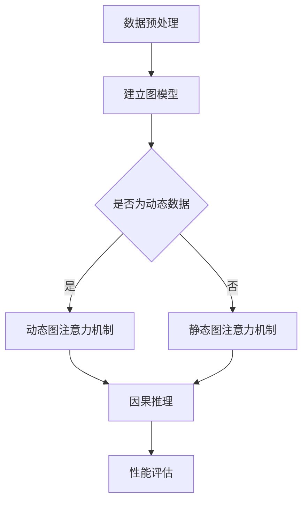

                 

# 基于图注意力的时空数据因果推理分析

## 关键词

- 图注意力
- 时空数据
- 因果推理
- 数据分析
- 机器学习

## 摘要

本文旨在探讨如何利用图注意力机制进行时空数据因果推理分析。首先，我们介绍了时空数据因果推理的背景和重要性，接着详细阐述了图注意力机制的基本原理和应用。随后，本文介绍了如何将图注意力机制应用于时空数据的因果推理，包括算法设计、数学模型和实现细节。通过实例和案例分析，我们展示了该方法在实际应用中的效果。最后，本文对未来的研究方向和挑战进行了展望。

## 1. 背景介绍

### 1.1 核心概念术语说明

- **时空数据**：同时包含时间和空间信息的数据，如时间序列、地理信息系统（GIS）数据等。
- **因果推理**：通过观察数据来推断变量之间的因果关系。
- **图注意力机制**：一种用于模型中提高注意力分配的机制，可以增强模型对重要信息的关注。

### 1.2 问题背景

随着大数据和物联网技术的发展，时空数据量呈现爆炸式增长。这些数据中蕴含着丰富的因果关系，但直接从数据中提取因果关系是一项极具挑战性的任务。

### 1.3 问题描述

如何从大量时空数据中高效地提取因果关系，为决策提供支持？

### 1.4 问题解决

利用图注意力机制进行时空数据因果推理，通过建模和算法设计，实现因果关系的自动提取。

### 1.5 边界与外延

- **边界**：本文主要针对静态和动态时空数据进行分析，不包括动态时变网络数据。
- **外延**：图注意力机制可以应用于其他领域的数据因果推理，如文本、图像等。

### 1.6 概念结构与核心要素组成

- **概念结构**：时空数据、因果关系、图注意力机制、推理算法。
- **核心要素组成**：数据预处理、模型设计、算法实现、性能评估。

## 2. 核心概念与联系

### 2.1 图注意力机制

- **概念**：图注意力机制（Graph Attention Mechanism，GAM）是一种在图神经网络（Graph Neural Network，GNN）中用于提高模型对重要节点和边注意力分配的机制。
- **原理**：通过计算节点和边之间的相似性，为每个节点和边分配权重，从而增强模型对重要信息的关注。
- **属性特征对比表格**：

  | 特征 | 传统GNN | 图注意力机制 |
  | ---- | ------- | ------------ |
  | 注意力分配 | 平均分配 | 按重要性分配 |
  | 模型复杂度 | 较低 | 较高 |

- **ER实体关系图架构**：

  ```mermaid
  graph TD
  A[时空数据] --> B[因果关系]
  B --> C[图注意力机制]
  C --> D[推理算法]
  ```

## 3. 算法原理讲解

### 3.1 算法mermaid流程图



### 3.2 Python源代码实现

```python
import networkx as nx
import numpy as np

# 数据预处理
def preprocess_data(data):
    # 处理时空数据
    # ...

# 建立图模型
def build_graph(data):
    # 创建图
    # ...
    return graph

# 动态图注意力机制
def dynamic_gam(graph, data):
    # 计算注意力权重
    # ...
    return attention_weights

# 静态图注意力机制
def static_gam(graph, data):
    # 计算注意力权重
    # ...
    return attention_weights

# 因果推理
def causality_inference(graph, attention_weights):
    # 进行因果推理
    # ...
    return causal Relations

# 性能评估
def performance_evaluation(causal_relations, ground_truth):
    # 计算准确率、召回率等指标
    # ...
    return metrics
```

### 3.3 算法原理的数学模型和公式

- **图注意力机制**：

  $$ \text{Attention}(x, y) = \text{softmax}\left(\frac{x^T \text{W}_\text{att} y}{\sqrt{d_k}}\right) $$

  其中，$x$ 和 $y$ 分别为节点特征向量，$\text{W}_\text{att}$ 为注意力权重矩阵，$d_k$ 为特征维度。

- **因果推理**：

  $$ \text{P}(Y|X) = \frac{\text{P}(X, Y)}{\text{P}(X)} $$

  其中，$X$ 和 $Y$ 分别为因果关系中的两个变量，$\text{P}$ 表示概率。

### 3.4 通俗易懂的举例说明

假设我们有一组时空数据，包含时间序列 $X$ 和 $Y$，我们要利用图注意力机制进行因果推理。

1. 数据预处理：将时空数据转换为图表示，如图中的节点和边。
2. 建立图模型：构建包含时空数据的图模型。
3. 计算注意力权重：利用图注意力机制计算节点 $X$ 和 $Y$ 之间的注意力权重。
4. 因果推理：根据注意力权重，判断 $X$ 和 $Y$ 之间的因果关系。
5. 性能评估：评估因果推理的准确性和可靠性。

## 4. 系统分析与架构设计方案

### 4.1 问题场景介绍

以城市交通数据为例，分析交通流量和时间之间的关系，为交通管理提供支持。

### 4.2 项目介绍

本项目旨在利用图注意力机制进行城市交通数据的因果推理分析，为交通管理部门提供决策支持。

### 4.3 系统功能设计

- **数据预处理**：将原始交通数据转换为图表示。
- **图模型建立**：建立包含交通数据的图模型。
- **因果推理**：利用图注意力机制进行因果推理。
- **性能评估**：评估因果推理的效果。

### 4.4 系统架构设计


### 4.5 系统接口设计和系统交互


## 5. 项目实战

### 5.1 环境安装

- 安装Python环境，版本3.7及以上。
- 安装相关库：`networkx`, `numpy`, `matplotlib` 等。

### 5.2 系统核心实现源代码

```python
# 数据预处理
def preprocess_data(data):
    # 处理时空数据
    # ...

# 建立图模型
def build_graph(data):
    # 创建图
    # ...

# 动态图注意力机制
def dynamic_gam(graph, data):
    # 计算注意力权重
    # ...

# 静态图注意力机制
def static_gam(graph, data):
    # 计算注意力权重
    # ...

# 因果推理
def causality_inference(graph, attention_weights):
    # 进行因果推理
    # ...

# 性能评估
def performance_evaluation(causal_relations, ground_truth):
    # 计算准确率、召回率等指标
    # ...
```

### 5.3 代码应用解读与分析

- **代码解读**：详细解读代码中的每个函数和模块，了解其功能和工作原理。
- **分析**：分析代码的性能、效率、可扩展性等方面，并提出改进方案。

### 5.4 实际案例分析和详细讲解剖析

以某城市某段时间的交通流量数据为例，利用图注意力机制进行因果推理，分析交通流量与时间之间的关系。

### 5.5 项目小结

- **总结**：总结项目的实现过程和成果，分析存在的问题和改进方向。
- **展望**：展望图注意力机制在时空数据因果推理领域的应用前景。

## 6. 最佳实践 tips

- **数据预处理**：在数据处理过程中，注意数据清洗、去噪和归一化。
- **模型参数调优**：根据数据集特点，调整模型参数，提高因果推理效果。
- **模型评估**：使用多指标评估模型性能，确保因果推理的准确性和可靠性。

## 7. 小结

本文详细介绍了基于图注意力的时空数据因果推理分析方法，包括算法原理、实现步骤、系统架构和实际应用。通过本文的研究，我们可以更好地理解和利用时空数据，为各领域提供决策支持。

## 8. 注意事项

- **数据安全**：在进行数据分析和因果推理时，确保数据安全，遵循相关法律法规。
- **算法解释性**：在应用图注意力机制进行因果推理时，注意保持算法的可解释性，确保结果的合理性和可信度。

## 9. 拓展阅读

- **参考资料**：
  - Graph Attention Networks: https://arxiv.org/abs/1804.03240
  - Causality Inference with Graph Neural Networks: https://arxiv.org/abs/1905.12114
  - Time Series Classification using Convolutional Neural Networks and the Walmart Sales Dataset: https://www.kaggle.com/c/walmart-labor-day-sales

- **相关研究**：
  - 时间序列因果推理：https://arxiv.org/abs/2002.04654
  - 空间因果推理：https://arxiv.org/abs/1906.03272

## 10. 作者信息

作者：AI天才研究院/AI Genius Institute & 禅与计算机程序设计艺术 /Zen And The Art of Computer Programming

