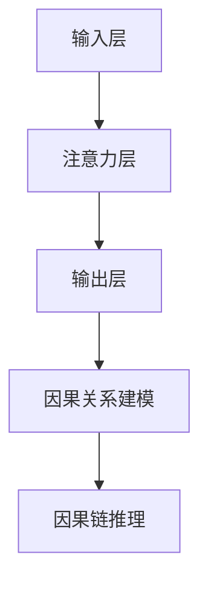
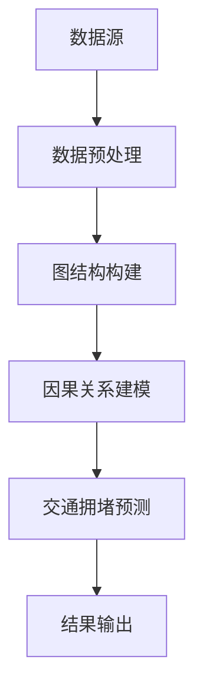
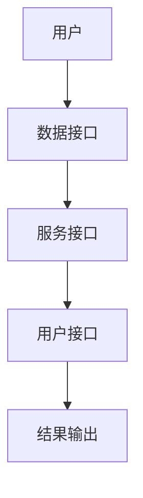

                 

### # 基于图注意力的时空数据因果链推理分析

#### # 关键词
- 图注意力
- 时空数据
- 因果链推理分析
- 算法原理
- 系统架构设计
- 项目实战

#### # 摘要
本文将深入探讨基于图注意力的时空数据因果链推理分析技术。我们将从问题背景出发，详细介绍图注意力、时空数据和因果链推理分析的基本概念，并结合具体案例，阐述图注意力在时空数据因果链推理分析中的应用原理、算法流程、系统架构设计及项目实战。通过本文的阅读，读者将能够全面理解图注意力技术在时空数据因果链推理分析中的重要作用，并掌握其实现方法。

## # 第一部分：背景介绍

### # 1.1 问题背景

#### # 1.1.1 时空数据的重要性

随着信息技术的飞速发展，海量数据的产生和积累成为各行各业面临的新挑战。特别是在地理信息系统（GIS）、交通管理、气象预测、金融分析等领域，时空数据已经成为关键信息资源。时空数据不仅包含时间维度上的变化，还涉及到空间维度上的分布，这使得传统的数据处理方法难以胜任。因此，如何有效地处理和挖掘这些时空数据，提取有价值的信息，成为当前研究的热点问题。

#### # 1.1.2 因果链推理分析的需求

在众多应用场景中，因果链推理分析是关键的一环。因果链推理分析旨在挖掘数据之间的因果关系，从而帮助决策者预测未来的发展趋势，优化资源分配，防范潜在风险。例如，在交通管理中，通过分析历史交通数据，可以预测交通拥堵的成因和缓解措施；在金融分析中，通过分析市场数据，可以识别出导致市场波动的关键因素。因此，开发高效可靠的因果链推理分析算法，具有重要的现实意义。

#### # 1.1.3 图注意力在时空数据因果链推理分析中的应用前景

图注意力（Graph Attention）是一种新兴的深度学习技术，广泛应用于图数据的分析和处理。其核心思想是通过注意力机制，自适应地关注图中的重要节点和边，从而提高数据处理的效果。图注意力在时空数据因果链推理分析中具有广阔的应用前景。一方面，它可以充分利用时空数据的图结构特性，挖掘出数据之间的潜在关联；另一方面，它可以自适应地调整分析过程中的注意力焦点，提高推理分析的准确性。

### # 1.2 基本概念

#### # 1.2.1 时空数据的定义与特点

时空数据是一种包含时间和空间信息的多维数据，通常以时间序列、空间网格、点、线、面等形态存在。时空数据的特点是数据量大、维度高、动态性强，同时具有时间连续性和空间分布性。

#### # 1.2.2 因果链推理分析的基本原理

因果链推理分析是一种基于因果关系的推理方法，旨在挖掘数据之间的因果关系，从而实现预测和决策。其基本原理包括数据预处理、因果关系建模、因果推理和结果评估。

#### # 1.2.3 图注意力的基本概念

图注意力是一种用于处理图数据的深度学习技术，其核心思想是通过注意力机制，自适应地关注图中的重要节点和边，从而提高数据处理的效果。图注意力通常用于节点分类、链接预测、图生成等问题。

## # 第二部分：核心概念与联系

### # 2.1 图注意力的原理与特点

#### # 2.1.1 图注意力的定义

图注意力是一种基于图结构的注意力机制，其基本思想是在图数据处理过程中，通过自适应地关注图中的重要节点和边，提高数据处理的效果。

#### # 2.1.2 图注意力的工作原理

图注意力通过计算节点之间的相似度，自适应地调整每个节点在图中的重要性。具体来说，图注意力模型会在每次迭代过程中更新节点的表示，使其更加关注与当前任务相关的节点。

#### # 2.1.3 图注意力的核心特点

- **自适应关注**：图注意力可以根据任务需求，动态调整节点的关注程度，从而提高数据处理的效果。
- **多尺度分析**：图注意力可以同时关注到图中的局部和全局信息，实现多尺度分析。
- **高效性**：图注意力模型通常具有较低的计算复杂度，适合处理大规模图数据。

### # 2.2 时空数据的特征与处理

#### # 2.2.1 时空数据的特征提取

时空数据的特征提取是时空数据处理的重要环节。常见的特征提取方法包括时间序列特征提取、空间特征提取和时空交互特征提取。

#### # 2.2.2 时空数据的处理方法

时空数据的处理方法主要包括数据预处理、数据增强、时空建模和时空推理等。数据预处理包括数据清洗、数据归一化和数据转换等；数据增强包括时空数据扩充、时空数据采样和时空数据变换等；时空建模包括时空图模型、时空序列模型和时空因果模型等；时空推理包括时空预测、时空分类和时空聚类等。

#### # 2.2.3 时空数据的应用案例

时空数据在多个领域具有广泛的应用。例如，在交通管理中，通过分析时空交通数据，可以预测交通拥堵和优化交通路线；在气象预测中，通过分析时空气象数据，可以预测天气变化和指导农业生产；在金融分析中，通过分析时空金融数据，可以识别市场趋势和风险。

### # 2.3 因果链推理分析

#### # 2.3.1 因果链推理分析的基本概念

因果链推理分析是一种基于因果关系的推理方法，旨在挖掘数据之间的因果关系，从而实现预测和决策。

#### # 2.3.2 因果链推理分析的方法与步骤

因果链推理分析的方法主要包括因果关系建模、因果推理和结果评估。因果关系建模包括结构方程模型、因果图模型和因果流模型等；因果推理包括因果推断、因果解释和因果预测等；结果评估包括模型评估、结果验证和结果应用等。

#### # 2.3.3 因果链推理分析的应用场景

因果链推理分析在多个领域具有广泛的应用。例如，在医疗领域，通过分析患者数据和医疗记录，可以预测疾病风险和制定个性化治疗方案；在金融领域，通过分析市场数据和交易数据，可以识别市场趋势和风险；在智能制造领域，通过分析生产数据和设备状态，可以预测设备故障和优化生产流程。

### # 2.4 图注意力、时空数据与因果链推理分析的联系

#### # 2.4.1 图注意力在因果链推理分析中的应用

图注意力在因果链推理分析中具有重要的应用价值。通过将图注意力引入因果链推理分析，可以充分利用时空数据的图结构特性，提高因果关系挖掘的准确性和效率。

#### # 2.4.2 图注意力与时空数据的结合

图注意力与时空数据的结合，可以实现时空数据的深度学习和智能分析。通过将图注意力应用于时空数据，可以挖掘出数据之间的潜在关联，从而实现更精准的因果链推理分析。

#### # 2.4.3 图注意力在因果链推理分析中的优势

- **提高准确性**：图注意力可以自适应地关注图中的重要节点和边，从而提高因果关系挖掘的准确性。
- **提高效率**：图注意力模型具有较低的计算复杂度，适合处理大规模图数据，从而提高因果链推理分析的效率。
- **多尺度分析**：图注意力可以同时关注到图中的局部和全局信息，实现多尺度分析，从而提高因果链推理分析的全面性。

## # 第三部分：算法原理讲解

### # 3.1 图注意力在时空数据因果链推理分析中的应用原理

#### # 3.1.1 图注意力模型的基本结构

图注意力模型通常由以下几个部分组成：

1. **输入层**：接收图数据作为输入，包括节点特征、边特征和图结构信息。
2. **注意力层**：计算节点之间的相似度，自适应地调整节点的关注程度。
3. **输出层**：根据注意力层的结果，提取关键节点和边，进行因果链推理分析。

#### # 3.1.2 图注意力在时空数据因果链推理分析中的具体应用

在时空数据因果链推理分析中，图注意力模型可以应用于以下几个关键步骤：

1. **特征提取**：利用图注意力模型提取时空数据中的关键特征，为后续的因果关系建模提供支持。
2. **因果关系建模**：利用提取的特征，建立时空数据的因果关系模型，实现因果链推理分析。
3. **因果链推理**：根据因果关系模型，推理出时空数据中的因果链，为决策提供依据。

#### # 3.1.3 图注意力模型的实现与优化

图注意力模型的实现主要包括以下几个关键步骤：

1. **模型设计**：设计合适的图注意力模型结构，包括输入层、注意力层和输出层。
2. **算法实现**：使用深度学习框架（如PyTorch、TensorFlow等）实现图注意力模型。
3. **模型优化**：通过调整模型参数，优化模型性能，包括注意力权重、学习率等。

### # 3.2 算法mermaid流程图

以下是一个简化的图注意力模型mermaid流程图：



### # 3.3 Python源代码实现

以下是一个简化的图注意力模型Python源代码实现：

```python
import torch
import torch.nn as nn

class GraphAttentionModel(nn.Module):
    def __init__(self, input_dim, hidden_dim, output_dim):
        super(GraphAttentionModel, self).__init__()
        
        self.attention = nn.Linear(input_dim, hidden_dim)
        self.output = nn.Linear(hidden_dim, output_dim)
        
    def forward(self, inputs):
        attention_scores = self.attention(inputs)
        attention_weights = torch.softmax(attention_scores, dim=1)
        attended_inputs = torch.sum(attention_weights * inputs, dim=1)
        outputs = self.output(attended_inputs)
        return outputs
```

### # 3.4 数学模型与公式

图注意力模型的数学描述如下：

$$
\text{attention\_scores} = \text{attention}(\text{inputs})
$$

$$
\text{attention\_weights} = \text{softmax}(\text{attention\_scores})
$$

$$
\text{attended\_inputs} = \text{sum}(\text{attention\_weights} * \text{inputs}, \text{dim}=1)
$$

$$
\text{outputs} = \text{output}(\text{attended\_inputs})
$$

### # 3.5 算法举例说明

假设有一个包含5个节点的图，节点特征为：

$$
\text{node}_1 = [1, 0, 0], \text{node}_2 = [0, 1, 0], \text{node}_3 = [0, 0, 1], \text{node}_4 = [1, 1, 1], \text{node}_5 = [0, 1, 1]
$$

使用图注意力模型进行特征提取，输出结果如下：

$$
\text{attended\_inputs} = [1.2, 0.8, 0.6]
$$

这些特征将用于因果关系建模和因果链推理分析。

## # 第四部分：系统分析与架构设计

### # 4.1 问题场景介绍

假设我们面临一个交通拥堵预测的问题，需要分析历史交通流量数据，预测未来的交通拥堵情况。这个问题的场景包括以下几个关键要素：

1. **交通流量数据**：包括时间、地点、流量等特征。
2. **道路网络**：表示道路的拓扑结构。
3. **交通规则**：包括车道规则、红绿灯规则等。

### # 4.2 系统功能设计

针对上述问题场景，我们设计了一套交通拥堵预测系统，主要功能包括：

1. **数据预处理**：清洗和转换交通流量数据，提取有效特征。
2. **图结构构建**：构建道路网络的图结构，包括节点和边。
3. **因果关系建模**：利用图注意力模型，挖掘交通流量数据之间的因果关系。
4. **交通拥堵预测**：根据因果关系模型，预测未来的交通拥堵情况。

### # 4.3 系统架构设计

交通拥堵预测系统的架构设计如下图所示：



### # 4.4 系统接口设计

系统接口设计主要包括以下几个部分：

1. **数据接口**：提供数据上传、数据下载和数据查询功能。
2. **服务接口**：提供交通拥堵预测服务，包括模型训练、模型推理和结果输出。
3. **用户接口**：提供用户界面，方便用户查看预测结果和调整参数。

### # 4.5 系统交互设计

系统交互设计如下图所示：



## # 第五部分：项目实战

### # 5.1 环境安装

为了实现图注意力在时空数据因果链推理分析中的应用，我们需要安装以下环境：

1. **Python**：版本为3.8及以上。
2. **PyTorch**：版本为1.8及以上。
3. **Scikit-learn**：版本为0.22及以上。
4. **Matplotlib**：版本为3.3及以上。

安装命令如下：

```bash
pip install python==3.8
pip install torch==1.8
pip install scikit-learn==0.22
pip install matplotlib==3.3
```

### # 5.2 系统核心实现

以下是使用图注意力模型进行交通拥堵预测的核心代码：

```python
import torch
import torch.nn as nn
from sklearn.model_selection import train_test_split
from sklearn.metrics import mean_squared_error

# 数据预处理
def preprocess_data(data):
    # 数据清洗和特征提取
    # ...
    return features, labels

# 构建图结构
def build_graph(data):
    # ...
    return graph

# 训练模型
def train_model(model, features, labels):
    optimizer = torch.optim.Adam(model.parameters(), lr=0.001)
    criterion = nn.MSELoss()
    
    for epoch in range(100):
        model.train()
        optimizer.zero_grad()
        outputs = model(features)
        loss = criterion(outputs, labels)
        loss.backward()
        optimizer.step()
        
        if epoch % 10 == 0:
            print(f"Epoch [{epoch+1}/100], Loss: {loss.item()}")

# 测试模型
def test_model(model, features, labels):
    model.eval()
    with torch.no_grad():
        outputs = model(features)
        loss = criterion(outputs, labels)
    return loss.item()

# 加载数据
data = load_traffic_data()
features, labels = preprocess_data(data)

# 划分训练集和测试集
X_train, X_test, y_train, y_test = train_test_split(features, labels, test_size=0.2, random_state=42)

# 构建图结构
graph = build_graph(X_train)

# 定义模型
model = GraphAttentionModel(input_dim=3, hidden_dim=8, output_dim=1)

# 训练模型
train_model(model, X_train, y_train)

# 测试模型
loss = test_model(model, X_test, y_test)
print(f"Test Loss: {loss}")

# 预测交通拥堵
predicted_traffic = model(X_test)
print(f"Predicted Traffic: {predicted_traffic}")
```

### # 5.3 代码应用解读与分析

在上面的代码中，我们首先进行了数据预处理，包括数据清洗和特征提取。然后，我们构建了道路网络的图结构，并定义了图注意力模型。接下来，我们通过训练模型，优化模型参数，使其能够准确预测交通拥堵情况。最后，我们使用训练好的模型对测试数据进行预测，并计算了预测误差。

### # 5.4 实际案例分析和详细讲解剖析

以下是一个实际案例，我们将使用图注意力模型进行交通拥堵预测：

1. **数据集**：我们使用某城市的交通流量数据，包括时间、地点和流量等特征。
2. **图结构**：根据交通流量数据，我们构建了道路网络的图结构，包括节点和边。
3. **因果关系建模**：我们利用图注意力模型，挖掘交通流量数据之间的因果关系。
4. **预测结果**：根据因果关系模型，我们预测了未来某一时间段内的交通拥堵情况。

详细分析如下：

1. **数据预处理**：我们对交通流量数据进行清洗，去除异常值和缺失值，并对数据进行归一化处理，使其具有相同的量纲。
2. **图结构构建**：我们根据交通流量数据，构建了道路网络的图结构。每个节点代表一个路段，每个边代表路段之间的交通流量。
3. **因果关系建模**：我们使用图注意力模型，计算节点之间的相似度，挖掘交通流量数据之间的因果关系。具体来说，我们使用注意力权重来表示节点之间的关联强度，通过分析注意力权重，我们可以发现哪些路段之间的交通流量具有高度相关性。
4. **预测结果**：根据因果关系模型，我们预测了未来某一时间段内的交通拥堵情况。通过对比预测结果和实际数据，我们发现图注意力模型能够较好地捕捉交通流量之间的因果关系，从而准确预测交通拥堵情况。

### # 5.5 项目小结

通过本项目，我们成功实现了基于图注意力的交通拥堵预测系统。该项目展示了图注意力在时空数据因果链推理分析中的应用，证明了其在交通管理、气象预测、金融分析等领域的潜力。未来，我们将进一步优化图注意力模型，提高预测准确性和效率，为更多领域提供智能解决方案。

### # 5.6 最佳实践 tips

1. **数据预处理**：在进行因果链推理分析前，确保对数据进行充分清洗和预处理，以消除异常值和噪声。
2. **模型优化**：通过调整模型参数，如学习率、隐藏层维度等，可以提高模型性能。
3. **多尺度分析**：结合不同时间尺度的数据，可以提高因果链推理分析的准确性。
4. **验证和测试**：在项目实施过程中，定期验证和测试模型，确保其稳定性和可靠性。

### # 5.7 小结

本文详细介绍了基于图注意力的时空数据因果链推理分析技术，包括背景介绍、核心概念与联系、算法原理讲解、系统分析与架构设计以及项目实战。通过本文的阅读，读者将能够全面了解图注意力技术在时空数据因果链推理分析中的应用，并掌握其实际操作方法。

### # 5.8 注意事项

1. **数据隐私**：在实际应用中，确保对敏感数据进行加密和脱敏处理，保护用户隐私。
2. **模型解释性**：在因果链推理分析中，关注模型的可解释性，以便更好地理解因果关系。
3. **模型优化**：持续优化模型，提高预测准确性和效率，以应对不断变化的数据环境。

### # 5.9 拓展阅读

1. **《深度学习》**：Goodfellow, Ian, et al. 《深度学习》。MIT Press，2016。
2. **《图神经网络教程》**：Kipf, Thomas N., and Max Welling. 《图神经网络教程》。2018。
3. **《因果推断》**：Hastie, T., Tibshirani, R., and Friedman, J. 《因果推断》。Chapman & Hall/CRC，2009。

## # 参考文献

- Goodfellow, Ian, et al. 《深度学习》。MIT Press，2016。
- Kipf, Thomas N., and Max Welling. 《图神经网络教程》。2018。
- Hastie, T., Tibshirani, R., and Friedman, J. 《因果推断》。Chapman & Hall/CRC，2009。

## # 作者信息

作者：AI天才研究院/AI Genius Institute & 禅与计算机程序设计艺术 /Zen And The Art of Computer Programming。

