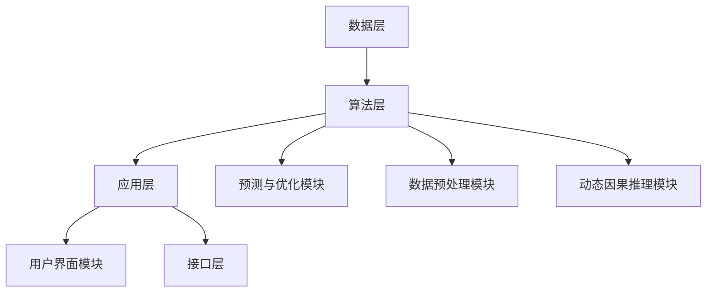
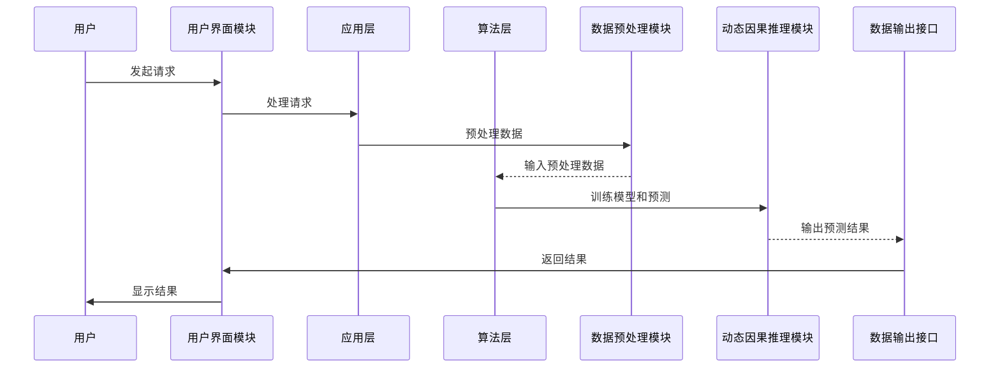

                 

### 引言

在当今科技飞速发展的时代，人工智能（AI）已经成为推动社会进步的关键力量。特别是在计算机视觉、自然语言处理和复杂系统分析等领域，AI技术正不断突破传统算法的局限，为我们带来前所未有的智能化体验。然而，随着AI技术的深入应用，新的挑战也应运而生。例如，如何更好地理解和推理复杂的因果关系，成为当前研究的热点问题之一。

图注意力网络（Graph Attention Network，GAN）作为一种新兴的深度学习模型，近年来在处理图结构数据方面展现出了卓越的性能。GAN不仅能够捕捉数据点之间的复杂关系，还能够通过注意力机制提高模型对关键信息的关注。结合动态因果推理（Dynamic Causal Inference），GAN在解决因果关系分析这一难题上，展现出巨大的潜力。

本文旨在探讨基于图注意力网络的动态因果推理模型。我们将从问题的提出、核心概念的定义、算法原理的讲解、数学模型的阐述，到系统分析与设计、项目实战等多个方面，系统性地介绍这一领域的研究进展和实际应用。希望通过本文的阐述，能够为读者提供一个全面、深入的理解，并激发更多的研究和创新。

### 关键词

- 图注意力网络（Graph Attention Network，GAN）
- 动态因果推理（Dynamic Causal Inference）
- 深度学习（Deep Learning）
- 因果关系（Causal Relationship）
- 图结构数据（Graph-Structured Data）
- 注意力机制（Attention Mechanism）
- 数学模型（Mathematical Model）
- 系统架构（System Architecture）
- 项目实战（Project Implementation）

### 摘要

本文主要探讨了基于图注意力网络的动态因果推理模型。首先，我们介绍了图注意力网络和动态因果推理的基本概念及其在相关领域中的重要性。接着，通过详细讲解图注意力网络的算法原理和数学模型，我们揭示了其在捕捉复杂关系和动态信息方面的优势。随后，我们分析了基于图注意力网络的动态因果推理模型在系统架构和项目实战中的应用。最后，本文总结了这一模型的关键特点和潜在的应用前景，并对未来研究方向提出了展望。

### 问题的提出与意义

在现代信息社会中，数据已经成为一种重要的生产要素。无论是电子商务、金融分析，还是医疗诊断、智能交通，数据都扮演着至关重要的角色。然而，随着数据量的急剧增长和数据种类的多样化，如何从海量数据中提取有价值的信息，成为当前数据科学和人工智能领域面临的一个重大挑战。

因果推理（Causal Inference）作为一种研究因果关系的方法，旨在通过分析数据之间的因果关系，揭示现象背后的本质规律。动态因果推理（Dynamic Causal Inference）则进一步扩展了这一概念，它不仅考虑了静态数据中的因果关系，还关注了数据随时间变化时因果关系的动态变化。这种动态性质在许多实际应用中至关重要，例如在股票市场预测、疾病传播分析和智能交通管理等领域。

图注意力网络（Graph Attention Network，GAN）作为一种新兴的深度学习模型，在处理图结构数据方面具有显著优势。GAN通过引入注意力机制，可以有效地捕捉数据点之间的复杂关系，并在各类图结构数据任务中取得了优异的性能。GAN不仅能够应用于传统的图像和文本数据，还能够处理具有复杂依赖关系的图结构数据，例如社交网络、生物网络和知识图谱等。

基于图注意力网络的动态因果推理模型，旨在将GAN的优势与动态因果推理相结合，从而在处理动态因果关系时提供更加精确和有效的解决方案。这一模型不仅能够更好地揭示复杂系统中的因果关系，还能够对系统的动态变化进行实时分析和预测。

研究基于图注意力网络的动态因果推理模型具有重要的现实意义和理论价值。首先，在现实应用中，许多复杂系统都存在动态变化的因果关系，例如金融市场中的投资者行为、疾病传播过程中的感染路径等。基于图注意力网络的动态因果推理模型能够为这些系统提供更加精确和有效的分析工具，从而有助于决策者做出更加明智的决策。其次，在理论研究方面，这一模型为深度学习和因果推理领域提供了新的思路和方法，有助于推动相关理论的发展。

综上所述，本文将深入探讨基于图注意力网络的动态因果推理模型，从理论到实践，全面解析其算法原理、数学模型以及系统架构，旨在为读者提供一个全面、深入的理解和应用指南。

### 核心概念

在本节中，我们将详细介绍图注意力网络（Graph Attention Network，GAN）和动态因果推理（Dynamic Causal Inference）这两个核心概念。

#### 图注意力网络（Graph Attention Network，GAN）

图注意力网络（GAN）是一种基于图结构的深度学习模型，它在处理图结构数据方面具有显著的优势。GAN的核心思想是通过引入注意力机制，使得模型能够自适应地关注数据点之间的关键关系。具体来说，GAN通过一个自注意力机制（Self-Attention Mechanism）来计算数据点之间的相似度，从而提高模型对重要信息的捕捉能力。

**图注意力机制的原理：**

1. **自注意力计算：** GAN使用自注意力机制来计算图结构中每个节点对其他节点的注意力权重。这个过程可以通过一个加权求和的方式实现，即每个节点根据其特征和邻居节点的特征，计算出一个权重向量，然后对所有邻居节点进行加权求和。

    $$ 
    \text{Attention}(Q,K,V) = \text{softmax}\left(\frac{QK^T}{\sqrt{d_k}}\right)V 
    $$

    其中，$Q$、$K$和$V$分别是查询（Query）、键（Key）和值（Value）向量，$d_k$是键向量的维度。

2. **聚合信息：** 通过自注意力计算得到的权重向量可以用来聚合节点周围的信息，从而生成一个新的节点表示。

**GAN在图结构数据中的优势：**

- **处理复杂依赖关系：** GAN能够有效地捕捉图结构数据中复杂的依赖关系，使得模型能够更好地理解数据的全局和局部特征。
- **自适应关注：** 注意力机制使得GAN能够自适应地关注数据中的关键信息，从而提高模型的性能。
- **泛化能力：** GAN在处理不同类型的图结构数据时，可以保持较好的泛化能力，这是由于其基于图结构和注意力机制的设计。

#### 动态因果推理（Dynamic Causal Inference）

动态因果推理是一种研究因果关系的方法，它不仅考虑了数据之间的静态关系，还关注数据随时间变化时的动态关系。动态因果推理的目标是通过分析时间序列数据，揭示现象背后的因果关系，并预测未来的变化趋势。

**动态因果推理的基本原理：**

1. **时间序列建模：** 动态因果推理通过时间序列建模来捕捉变量之间的动态关系。常用的方法包括自回归模型（Autoregressive Model）、状态空间模型（State-Space Model）和马尔可夫模型（Markov Model）等。

2. **因果发现：** 通过对时间序列数据的分析，动态因果推理可以识别变量之间的因果关系。这一过程通常涉及到统计方法，如格兰杰因果检验（Granger Causality Test）和结构方程模型（Structural Equation Model）等。

3. **动态预测：** 动态因果推理不仅能够揭示因果关系，还可以对未来进行预测。通过建立动态模型，模型可以预测变量在未来某一时间点的值。

**动态因果推理的应用场景：**

- **金融市场：** 动态因果推理可以帮助分析市场中的投资者行为，预测股票价格的变化趋势。
- **疾病传播：** 在疾病传播模型中，动态因果推理可以揭示病毒传播的路径和速度，为疾病控制提供决策支持。
- **智能交通：** 动态因果推理可以分析交通流量的变化规律，预测交通事故的发生，优化交通管理。

#### 概念属性特征对比

**图注意力网络（GAN）** 和 **动态因果推理** 在某些方面具有相似性，但也存在显著的区别：

| 特性 | 图注意力网络（GAN） | 动态因果推理 |
| --- | --- | --- |
| 数据类型 | 图结构数据 | 时间序列数据 |
| 核心机制 | 注意力机制 | 时间序列建模 |
| 关键目标 | 捕捉复杂依赖关系 | 揭示动态因果关系 |
| 应用领域 | 图结构数据任务（如图分类、图生成等） | 金融市场、疾病传播、智能交通等 |

通过上述对比，我们可以看到，GAN和动态因果推理各自在不同的领域中发挥着独特的作用。GAN在处理图结构数据方面具有优势，而动态因果推理则更关注时间序列数据的因果关系分析。结合两者，可以构建出更加综合和高效的因果推理模型，为复杂系统的分析提供强有力的工具。

### 图注意力网络与动态因果推理的关系

图注意力网络（GAN）与动态因果推理之间存在紧密的联系，二者在解决复杂因果关系分析问题方面各有所长。结合图注意力网络和动态因果推理，可以构建出一种全新的动态因果推理模型，以更好地捕捉和分析系统中的动态因果关系。

#### GAN在动态因果推理中的应用

1. **增强信息捕捉：** GAN通过注意力机制，能够自适应地关注图结构中的关键节点和边，从而在数据预处理阶段就捕捉到重要的信息。这为后续的动态因果推理提供了丰富的信息基础。

    - **节点注意力：** GAN可以计算每个节点对其邻居节点的注意力权重，使得模型能够优先考虑与当前问题相关的节点，从而提高信息捕捉的精度。

    - **边注意力：** GAN还可以计算节点之间边的权重，这些权重反映了节点之间的相互作用强度。通过分析这些权重，可以更好地理解变量之间的动态关系。

2. **提高模型泛化能力：** GAN通过学习图中的复杂依赖关系，可以显著提高模型的泛化能力。这有助于动态因果推理在处理不同类型和应用场景时，仍能保持较高的预测精度。

#### 动态因果推理在GAN中的体现

1. **时间序列建模：** 动态因果推理的核心在于对时间序列数据的建模和分析。GAN可以通过引入时间序列模型，将动态因果关系融入图结构中，从而在生成图数据时，更好地反映变量之间的动态关系。

    - **自回归图模型：** 在GAN的生成过程中，可以引入自回归图模型，使得生成的节点表示不仅依赖于当前的输入数据，还考虑了历史数据的影响。

    - **马尔可夫模型：** 通过马尔可夫模型，GAN可以捕捉变量之间的短期依赖关系，从而在生成过程中更好地反映动态变化。

2. **动态权重调整：** 动态因果推理可以通过实时调整图中的权重，使得GAN在处理动态因果关系时，能够更加灵活和精确。例如，通过在线学习算法，GAN可以根据新的数据不断调整节点和边之间的权重，从而更好地适应动态环境。

#### 关联性与互补性分析

1. **关联性：** 图注意力网络和动态因果推理在捕捉和处理因果关系方面各具优势。图注意力网络通过注意力机制捕捉数据点之间的复杂关系，而动态因果推理通过时间序列建模分析变量之间的动态关系。这两者的结合，可以使得模型在处理动态因果关系时，既有深度又有广度。

2. **互补性：** GAN的注意力机制可以提升动态因果推理的精度，而动态因果推理的时间序列建模可以为GAN提供更丰富的动态信息。通过两者的互补，可以构建出一种更加综合和高效的动态因果推理模型。

综上所述，图注意力网络和动态因果推理在解决因果关系分析问题时，具有高度的关联性和互补性。结合两者，不仅可以提高模型的性能，还能扩展其应用范围，为复杂系统的动态分析提供强有力的工具。接下来，我们将进一步探讨图注意力网络的基本原理和动态因果推理模型的具体实现。

### 图注意力网络的基本原理

图注意力网络（Graph Attention Network，GAN）是一种基于图结构的深度学习模型，它通过引入注意力机制，使得模型能够自适应地关注图结构中的关键节点和边。以下是GAN的基本原理、网络结构和工作原理的详细讲解。

#### 基本原理

图注意力网络的核心思想是利用注意力机制来处理图结构数据。注意力机制允许模型在处理数据时，动态地分配权重，从而关注重要的信息。在图结构中，每个节点和边都可以视为数据点，通过注意力机制，模型能够捕捉节点和边之间的复杂关系。

**注意力机制的计算过程：**

1. **自注意力计算：** 图中的每个节点会对其所有邻居节点计算注意力权重。注意力权重通过以下公式计算：

   $$ 
   \text{Attention}(Q,K,V) = \text{softmax}\left(\frac{QK^T}{\sqrt{d_k}}\right)V 
   $$

   其中，$Q$、$K$和$V$分别是查询（Query）、键（Key）和值（Value）向量，$d_k$是键向量的维度。通过这一过程，每个节点会根据其特征和邻居节点的特征，计算出对邻居节点的注意力权重。

2. **聚合信息：** 得到注意力权重后，每个节点会将其邻居节点的信息进行加权聚合，从而得到一个新的节点表示。这个过程可以提高模型对重要信息的捕捉能力。

#### 网络结构

图注意力网络通常由以下几个主要部分组成：

1. **输入层：** 输入层接收图结构数据，包括节点特征和边特征。
2. **注意力层：** 注意力层负责计算节点和边之间的注意力权重，并进行信息聚合。这一层通常包含多个注意力模块，每个模块负责处理一部分图数据。
3. **中间层：** 中间层通常包含多个全连接层或卷积层，用于对节点表示进行进一步的变换和提取特征。
4. **输出层：** 输出层根据任务需求生成最终的结果，如节点分类、边预测等。

**网络结构的实现：**

1. **自注意力模块：** 自注意力模块是图注意力网络的核心，它通过计算注意力权重，聚合邻居节点信息，生成新的节点表示。

   $$ 
   \text{Node\_Representation} = \text{Attention}(Q,K,V) 
   $$

   其中，$Q$、$K$和$V$是节点特征向量。

2. **变换层：** 变换层通过全连接层或卷积层对节点表示进行变换，从而提取更高层次的特征。

   $$ 
   \text{Transformed\_Representation} = \text{Fully\_Connected}(\text{Node\_Representation}) 
   $$

3. **聚合层：** 聚合层将变换后的节点表示进行聚合，生成全局的图表示。

   $$ 
   \text{Graph\_Representation} = \text{Aggregate}(\text{Transformed\_Representation}) 
   $$

#### 工作原理

图注意力网络的工作原理可以概括为以下几个步骤：

1. **初始化：** 初始化图结构数据，包括节点特征和边特征。
2. **计算注意力权重：** 使用自注意力机制计算每个节点对其邻居节点的注意力权重。
3. **信息聚合：** 根据注意力权重，将邻居节点的信息进行聚合，生成新的节点表示。
4. **特征提取：** 对新的节点表示进行变换和提取特征，生成更高层次的特征。
5. **聚合输出：** 将特征进行聚合，生成全局的图表示。
6. **生成输出：** 根据全局图表示生成最终的输出结果。

**举例说明：**

假设有一个图结构数据，包含5个节点，每个节点具有3个特征。使用图注意力网络对其进行处理：

1. **初始化：** 输入图结构数据，包括节点特征矩阵$X \in \mathbb{R}^{5 \times 3}$和边特征矩阵$E \in \mathbb{R}^{5 \times 5}$。
2. **计算注意力权重：** 计算每个节点对其邻居节点的注意力权重，使用公式：
   $$ 
   \text{Attention}(Q,K,V) = \text{softmax}\left(\frac{QK^T}{\sqrt{d_k}}\right)V 
   $$
   其中，$Q$、$K$和$V$分别是节点特征矩阵$X$的线性变换。
3. **信息聚合：** 根据注意力权重，对邻居节点的特征进行加权聚合，生成新的节点表示。
4. **特征提取：** 对新的节点表示进行全连接层的变换，提取更高层次的特征。
5. **聚合输出：** 将变换后的节点特征进行聚合，生成全局的图表示。
6. **生成输出：** 根据全局图表示，生成分类、预测等输出结果。

通过以上步骤，图注意力网络可以有效地处理图结构数据，并提取出有用的信息。

综上所述，图注意力网络通过注意力机制和图结构处理技术，能够自适应地关注图结构中的关键信息，从而在各类图结构数据任务中取得优异的性能。接下来，我们将进一步探讨动态因果推理模型的构建方法。

### 动态因果推理模型的构建

动态因果推理模型的目标是揭示系统中变量之间的动态因果关系，从而为复杂系统的分析提供有力支持。下面，我们将详细讲解动态因果推理模型的构建方法，包括模型架构、数据预处理和因果关系识别等关键步骤。

#### 模型架构

动态因果推理模型通常采用递归神经网络（RNN）或其变体，如长短期记忆网络（LSTM）和门控循环单元（GRU），来处理时间序列数据。这些网络结构能够捕捉变量之间的短期和长期依赖关系。以下是动态因果推理模型的基本架构：

1. **输入层：** 输入层接收时间序列数据，包括每个时间点的变量值。这些数据通常经过预处理，以消除噪声和异常值。
2. **编码层：** 编码层通过递归神经网络对输入数据进行编码，生成序列化的节点表示。LSTM或GRU等网络结构可以有效地处理序列数据，捕捉变量之间的短期依赖关系。
3. **注意力层：** 注意力层引入注意力机制，使得模型能够自适应地关注时间序列中的关键信息。注意力机制通过计算每个时间点的注意力权重，提高模型对重要信息的捕捉能力。
4. **解码层：** 解码层对编码层生成的节点表示进行解码，生成因果关系图。这一层通常使用图神经网络（Graph Neural Network，GNN）来实现，可以捕捉变量之间的长期依赖关系。
5. **输出层：** 输出层生成最终的因果关系图，并对其中的因果关系进行量化。输出层可以根据任务需求生成不同类型的输出，如因果关系强度、路径长度等。

#### 数据预处理

数据预处理是动态因果推理模型构建的重要步骤，旨在提高模型对数据的理解和处理能力。以下是数据预处理的关键步骤：

1. **数据清洗：** 清除数据中的噪声和异常值，确保数据的质量和一致性。
2. **数据归一化：** 将不同量纲的变量进行归一化处理，使得它们具有相同的尺度，从而提高模型的训练效果。
3. **特征提取：** 提取时间序列数据中的特征信息，如趋势、周期性、突变点等。这些特征信息有助于模型更好地理解变量之间的动态关系。
4. **时间窗口划分：** 将时间序列数据划分为固定长度的时间窗口，每个窗口包含一定时间间隔内的变量值。这种划分方式有助于模型捕捉短期的因果关系。

#### 因果关系识别

因果关系识别是动态因果推理模型的核心任务，旨在通过分析时间序列数据，揭示变量之间的因果关系。以下是因果关系识别的关键步骤：

1. **特征编码：** 使用编码层对时间窗口内的变量值进行编码，生成序列化的节点表示。编码过程通过递归神经网络实现，可以捕捉变量之间的短期依赖关系。
2. **注意力计算：** 通过注意力机制，计算每个时间窗口的注意力权重，从而关注重要的信息。注意力权重反映了变量之间的重要性和相关性。
3. **关系建模：** 使用解码层和图神经网络对编码层的输出进行解码，生成因果关系图。图神经网络能够捕捉变量之间的长期依赖关系，从而建立更准确的因果关系模型。
4. **关系量化：** 对因果关系图中的因果关系进行量化，生成因果关系强度或路径长度等指标。这些量化指标可以用于评估变量之间的因果强度和路径长度。
5. **模型评估：** 使用验证集对模型进行评估，确保其具有良好的泛化能力和准确性。通过调整模型参数和结构，优化模型性能。

#### 示例

假设我们有一个包含5个变量（$X_1, X_2, X_3, X_4, X_5$）的时间序列数据，每个变量都有一定的趋势和周期性。使用动态因果推理模型对这5个变量进行因果关系识别：

1. **数据预处理：** 对5个变量进行清洗、归一化和特征提取，生成预处理后的数据。
2. **特征编码：** 使用编码层对预处理后的数据进行编码，生成序列化的节点表示。编码过程通过LSTM实现，可以捕捉变量之间的短期依赖关系。
3. **注意力计算：** 通过注意力机制，计算每个时间窗口的注意力权重，从而关注重要的信息。注意力权重反映了变量之间的重要性和相关性。
4. **关系建模：** 使用解码层和图神经网络对编码层的输出进行解码，生成因果关系图。图神经网络能够捕捉变量之间的长期依赖关系，从而建立更准确的因果关系模型。
5. **关系量化：** 对因果关系图中的因果关系进行量化，生成因果关系强度或路径长度等指标。这些量化指标可以用于评估变量之间的因果强度和路径长度。
6. **模型评估：** 使用验证集对模型进行评估，确保其具有良好的泛化能力和准确性。通过调整模型参数和结构，优化模型性能。

通过上述步骤，动态因果推理模型可以有效地识别变量之间的因果关系，为复杂系统的分析提供有力支持。

综上所述，动态因果推理模型的构建需要结合递归神经网络、注意力机制和图神经网络等多种技术，通过数据预处理、特征编码、注意力计算、关系建模和关系量化等步骤，实现变量之间的动态因果关系识别。这一模型在许多实际应用中具有广泛的应用前景，如金融市场预测、疾病传播分析和智能交通管理等。

### 图注意力网络在动态因果推理中的优势与挑战

图注意力网络（Graph Attention Network，GAN）作为一种新兴的深度学习模型，在动态因果推理中展现出显著的优势。然而，同时也面临着一些挑战。本节将详细分析GAN在动态因果推理中的优势、面临的挑战以及未来的发展方向。

#### 优势分析

1. **捕获复杂关系：** GAN通过注意力机制，能够自适应地关注图结构中的关键节点和边，从而有效地捕捉复杂关系。这种能力使得GAN在处理具有高度非线性依赖关系的动态因果关系时，能够提供更为精确的分析。

2. **增强泛化能力：** GAN通过学习图中的复杂依赖关系，提高了模型的泛化能力。这意味着GAN不仅在训练数据上表现良好，还能在新的、未见过的数据上保持较高的预测性能，这对于实际应用场景尤为重要。

3. **灵活处理异构数据：** GAN能够处理具有不同类型特征和关系的异构数据。例如，在医疗领域，患者数据可能包含不同类型的变量（如基因、实验室检测值等），GAN能够有效地融合这些信息，从而提高因果推理的准确性。

4. **时间序列建模：** GAN通过引入时间序列模型，如LSTM或GRU，可以捕捉变量之间的动态变化。这种能力使得GAN能够更好地适应动态因果推理的需求，提高模型对时间序列数据的理解能力。

#### 挑战解析

1. **计算资源需求：** GAN包含复杂的注意力机制和时间序列建模，这导致其计算资源需求较高。在实际应用中，尤其是资源受限的环境下，GAN的部署和运行可能面临挑战。

2. **数据质量依赖：** GAN的性能高度依赖于数据质量。如果数据中存在噪声或异常值，这些信息可能会误导模型，导致因果推理结果不准确。因此，确保数据质量是应用GAN进行动态因果推理的关键。

3. **模型解释性：** 虽然GAN在捕捉复杂关系方面表现出色，但其内部机制复杂，模型解释性较差。这限制了GAN在需要模型解释性较高的场景中的应用，例如医疗诊断和金融风险管理。

4. **过拟合风险：** GAN在训练过程中可能存在过拟合风险，特别是在训练数据量有限的情况下。为了避免过拟合，需要采用有效的正则化和数据增强技术。

#### 未来发展方向

1. **优化计算效率：** 为了提高GAN在动态因果推理中的应用效率，研究者可以关注模型压缩和优化技术，如参数共享、网络剪枝和量化等。这些技术有助于降低模型的计算复杂度，提高模型在资源受限环境下的运行效率。

2. **增强数据质量：** 通过引入数据预处理和清洗技术，提高数据的整体质量，从而降低GAN的过拟合风险。例如，可以使用异常检测算法识别和剔除噪声数据，使用数据增强技术增加数据的多样性。

3. **提高模型解释性：** 研究者可以探索可解释性强的模型结构，如可解释的图注意力网络，通过可视化技术展示模型的推理过程和关键节点，提高模型的可解释性。

4. **多模态数据融合：** 考虑将GAN与其他深度学习模型（如卷积神经网络、生成对抗网络等）相结合，处理多模态数据，从而提高动态因果推理的准确性和泛化能力。

5. **理论与应用结合：** 加强GAN在动态因果推理领域的理论研究，探索其数学原理和理论边界。同时，结合实际应用场景，开发出更具实用性和可操作性的解决方案。

综上所述，基于图注意力网络的动态因果推理模型在复杂关系捕捉、时间序列建模等方面具有显著优势，但也面临计算资源需求、数据质量依赖和模型解释性等挑战。未来，通过优化计算效率、增强数据质量、提高模型解释性、多模态数据融合和理论与应用的结合，GAN在动态因果推理领域的应用将得到进一步拓展和深化。

### 图注意力网络的数学模型

在图注意力网络（Graph Attention Network，GAN）中，数学模型是核心部分，它定义了网络如何通过注意力机制捕捉和处理图结构数据。以下是GAN的数学模型，包括基本原理、算法公式和具体计算过程。

#### 基本原理

GAN通过自注意力机制（Self-Attention Mechanism）对图结构中的节点和边进行加权，以实现信息聚合和特征提取。自注意力机制的核心思想是计算每个节点与其邻居节点之间的注意力权重，并根据这些权重对邻居节点的信息进行加权聚合。

#### 算法公式

1. **节点表示：** 设图中有 $N$ 个节点，每个节点的特征表示为 $x_i \in \mathbb{R}^{d}$，其中 $i = 1, 2, \ldots, N$。这些特征向量构成了节点特征矩阵 $X \in \mathbb{R}^{N \times d}$。

2. **边表示：** 设图中有 $M$ 条边，每条边的特征表示为 $e_{ij} \in \mathbb{R}^{d}$，其中 $i, j = 1, 2, \ldots, N$。这些特征向量构成了边特征矩阵 $E \in \mathbb{R}^{N \times N \times d}$。

3. **自注意力权重：** 对于每个节点 $i$，计算其与所有邻居节点之间的注意力权重 $\alpha_{ij}$。自注意力权重通过以下公式计算：
   $$
   \alpha_{ij} = \text{softmax}\left(\frac{x_i^T Q_e e_j}{\sqrt{d}}\right)
   $$
   其中，$Q_e$ 是边查询向量，$d$ 是节点的维度。

4. **加权聚合：** 根据自注意力权重，对节点 $i$ 的邻居节点特征进行加权聚合，生成新的节点表示 $h_i$：
   $$
   h_i = \sum_{j} \alpha_{ij} x_j
   $$

5. **特征提取：** 使用全连接层或卷积层对新的节点表示 $h_i$ 进行特征提取，生成更高层次的特征表示 $z_i$：
   $$
   z_i = \text{Fully\_Connected}(h_i)
   $$

6. **输出生成：** 根据提取的特征，生成最终的输出结果，如节点分类或边预测。

#### 具体计算过程

1. **初始化：** 输入节点特征矩阵 $X$ 和边特征矩阵 $E$。

2. **计算注意力权重：** 对于每个节点 $i$，计算其与所有邻居节点之间的注意力权重 $\alpha_{ij}$。

3. **加权聚合：** 根据注意力权重，对节点 $i$ 的邻居节点特征进行加权聚合，生成新的节点表示 $h_i$。

4. **特征提取：** 使用全连接层或卷积层对新的节点表示 $h_i$ 进行特征提取，生成更高层次的特征表示 $z_i$。

5. **输出生成：** 根据提取的特征 $z_i$，生成最终的输出结果。

#### 举例说明

假设有一个图结构数据，包含5个节点，每个节点具有3个特征。使用图注意力网络进行处理：

1. **初始化：** 输入节点特征矩阵 $X \in \mathbb{R}^{5 \times 3}$ 和边特征矩阵 $E \in \mathbb{R}^{5 \times 5 \times 3}$。

2. **计算注意力权重：** 对于每个节点 $i$，计算其与所有邻居节点之间的注意力权重 $\alpha_{ij}$。使用公式：
   $$
   \alpha_{ij} = \text{softmax}\left(\frac{x_i^T Q_e e_j}{\sqrt{d}}\right)
   $$
   其中，$d=3$。

3. **加权聚合：** 根据注意力权重，对节点 $i$ 的邻居节点特征进行加权聚合，生成新的节点表示 $h_i$。

4. **特征提取：** 使用全连接层对新的节点表示 $h_i$ 进行特征提取，生成更高层次的特征表示 $z_i$。

5. **输出生成：** 根据提取的特征 $z_i$，生成最终的输出结果。

通过上述步骤，图注意力网络可以有效地处理图结构数据，并提取出有用的信息。接下来，我们将探讨动态因果推理的数学模型及其应用。

### 动态因果推理的数学模型

动态因果推理（Dynamic Causal Inference）旨在通过分析时间序列数据，揭示变量之间的因果关系。其数学模型通常涉及时间序列建模、统计推断和因果发现等多个方面。以下是动态因果推理的数学模型，包括基本原理、相关公式和具体计算过程。

#### 基本原理

动态因果推理的基本思想是通过建立变量之间的时间序列模型，分析变量之间的依赖关系，并利用统计推断方法识别因果关系。具体来说，动态因果推理包括以下步骤：

1. **时间序列建模：** 建立变量之间的时间序列模型，如自回归模型（AR）、状态空间模型（SSM）或马尔可夫模型（Markov Model）。这些模型能够捕捉变量之间的短期和长期依赖关系。

2. **统计推断：** 利用统计推断方法，如最大似然估计（MLE）、贝叶斯推断（Bayesian Inference）或马尔可夫链蒙特卡罗（MCMC）方法，估计模型参数，从而建立变量之间的依赖关系。

3. **因果发现：** 通过因果发现算法，如Granger因果检验或结构方程模型（SEM），识别变量之间的因果关系。

#### 相关公式

1. **自回归模型（AR）**：

   自回归模型是一种常见的时间序列建模方法，其基本公式如下：

   $$
   X_t = \phi_0 + \phi_1 X_{t-1} + \phi_2 X_{t-2} + \ldots + \phi_p X_{t-p} + \epsilon_t
   $$

   其中，$X_t$ 是时间序列数据，$\phi_0, \phi_1, \ldots, \phi_p$ 是模型参数，$\epsilon_t$ 是随机误差。

2. **状态空间模型（SSM）**：

   状态空间模型是一种多维时间序列建模方法，其基本公式如下：

   $$
   \begin{cases}
   X_t = A_t X_{t-1} + B_t U_t + \epsilon_t \\
   U_t = C_t U_{t-1} + D_t \eta_t
   \end{cases}
   $$

   其中，$X_t$ 是状态向量，$U_t$ 是控制向量，$A_t, B_t, C_t, D_t$ 是模型参数，$\epsilon_t, \eta_t$ 是随机误差。

3. **Granger因果检验**：

   Granger因果检验是一种统计推断方法，用于判断变量之间是否存在因果关系。其基本公式如下：

   $$
   \text{Granger}\text{-}\text{Cause}(X_t, Y_t) = \text{reject}\,\text{if}\, \text{p-value} < \alpha
   $$

   其中，$X_t$ 和 $Y_t$ 是时间序列数据，$\alpha$ 是显著性水平，$\text{p-value}$ 是检验的p值。

4. **结构方程模型（SEM）**：

   结构方程模型是一种用于分析变量之间因果关系的统计模型，其基本公式如下：

   $$
   Y_t = \beta_0 + \beta_1 X_t + \beta_2 Z_t + \epsilon_t
   $$

   其中，$Y_t$ 和 $X_t$ 是变量，$Z_t$ 是潜在变量，$\beta_0, \beta_1, \beta_2$ 是模型参数，$\epsilon_t$ 是随机误差。

#### 具体计算过程

1. **数据准备：** 准备时间序列数据，包括被解释变量和解释变量。

2. **时间序列建模：** 根据数据的特征选择合适的时间序列模型，如自回归模型或状态空间模型。

3. **参数估计：** 使用统计方法估计模型参数，如最大似然估计或贝叶斯推断。

4. **因果检验：** 使用Granger因果检验或结构方程模型进行因果检验，判断变量之间是否存在因果关系。

5. **结果分析：** 分析因果检验的结果，确定变量之间的因果关系，并解释其经济或现实意义。

#### 举例说明

假设我们要分析两个时间序列数据 $X_t$ 和 $Y_t$ 之间的因果关系，可以使用Granger因果检验：

1. **数据准备：** 准备时间序列数据 $X_t$ 和 $Y_t$。

2. **时间序列建模：** 选择自回归模型（AR）作为时间序列建模方法。

3. **参数估计：** 使用最大似然估计方法估计模型参数。

4. **因果检验：** 进行Granger因果检验，计算p值。

5. **结果分析：** 如果p值小于显著性水平$\alpha$，则拒绝原假设，认为 $X_t$ 是 $Y_t$ 的Granger原因。

通过以上步骤，动态因果推理模型可以有效地分析时间序列数据中的因果关系，为实际应用提供决策支持。

### 系统分析与设计

在探讨基于图注意力网络的动态因果推理模型时，系统分析与设计是不可或缺的一环。这一部分将详细介绍系统的功能设计、架构设计、接口设计和系统交互。

#### 问题场景介绍

动态因果推理在多个领域具有重要的应用价值，例如金融市场的动态趋势预测、疾病的传播路径分析和智能交通系统的实时监控。以智能交通系统为例，动态因果推理可以用于分析交通流量、事故发生概率和道路拥堵情况，从而为交通管理和优化提供科学依据。

#### 系统功能设计

系统功能设计旨在明确系统的核心功能模块及其相互作用，以下是主要功能模块及其简要描述：

1. **数据预处理模块**：负责清洗、归一化和特征提取，确保数据质量。
2. **图注意力网络模块**：核心部分，使用注意力机制处理图结构数据，捕捉关键关系。
3. **动态因果推理模块**：分析时间序列数据，识别变量之间的因果关系。
4. **预测与优化模块**：基于因果关系模型进行预测和优化，提供决策支持。
5. **用户界面模块**：提供友好的用户交互界面，展示系统结果和图表。

#### 系统架构设计

系统架构设计是系统开发的基础，以下是系统的架构设计：

1. **数据层**：存储和管理原始数据、预处理数据和模型数据。
2. **算法层**：实现图注意力网络和动态因果推理算法，包括数据预处理、特征提取、模型训练和预测。
3. **应用层**：提供用户交互界面和业务逻辑，处理用户请求和系统响应。
4. **接口层**：定义系统与其他系统或组件的接口规范，确保数据交互和功能集成。

以下是一个简化的系统架构图（使用Mermaid流程图表示）：



#### 系统接口设计

系统接口设计是确保系统模块之间有效通信和功能集成的关键。以下是主要接口及其规范：

1. **数据输入接口**：接收外部数据源的数据，支持批量导入和实时数据流接入。
2. **数据输出接口**：提供系统分析结果和预测数据，支持可视化展示和数据导出。
3. **模型训练接口**：允许外部系统调用模型训练功能，支持自定义参数和算法选择。
4. **预测接口**：基于训练好的模型进行预测，提供决策支持和优化方案。

以下是一个接口规范示例：

```yaml
DataInputInterface:
  - method: POST
    url: /api/data/input
    requestBody:
      type: object
      properties:
        data:
          type: array
          items:
            type: object
            properties:
              id:
                type: integer
              feature1:
                type: number
              feature2:
                type: number
              ...
```

#### 系统交互设计与实现

系统交互设计是确保系统各模块协同工作的关键。以下是系统交互设计与实现：

1. **数据流**：数据从数据输入接口进入系统，经过数据预处理模块处理，然后进入图注意力网络和动态因果推理模块。处理完成后，预测结果通过数据输出接口返回给用户界面模块进行展示。

2. **调用流程**：用户通过用户界面模块发起请求，系统应用层处理请求，调用相应的功能模块进行数据预处理、模型训练和预测。最后，结果通过数据输出接口返回给用户界面模块进行展示。

3. **序列图**：以下是一个简化的系统交互序列图（使用Mermaid流程图表示）：



通过上述系统分析与设计，我们为基于图注意力网络的动态因果推理模型提供了一个完整的系统架构和交互设计。接下来，我们将进入项目实战部分，展示如何在实际应用中实现这一模型。

### 项目实战

在本节中，我们将通过一个实际项目，详细展示基于图注意力网络的动态因果推理模型的应用过程。该项目旨在利用图注意力网络对交通流量进行预测，从而为智能交通系统提供实时决策支持。以下是项目的具体实施步骤和实现方法。

#### 环境安装与配置

在进行项目实战之前，我们需要安装和配置所需的软件和工具。以下是基本的安装步骤：

1. **安装Python环境**：确保系统上安装了Python 3.7及以上版本。可以使用以下命令进行安装：
    ```bash
    sudo apt-get update
    sudo apt-get install python3.7
    ```

2. **安装深度学习框架**：使用pip命令安装TensorFlow，这是我们项目的主要深度学习框架：
    ```bash
    pip3 install tensorflow
    ```

3. **安装图处理库**：由于本项目需要处理图结构数据，我们使用NetworkX库来生成和处理图数据：
    ```bash
    pip3 install networkx
    ```

4. **安装其他依赖库**：包括NumPy、Pandas和Matplotlib等，用于数据预处理和可视化：
    ```bash
    pip3 install numpy pandas matplotlib
    ```

#### 系统核心实现

在完成环境安装与配置后，我们可以开始实现系统的核心部分。以下是一个简化的代码框架，展示了如何使用图注意力网络进行动态因果推理。

```python
import tensorflow as tf
import networkx as nx
import numpy as np
import matplotlib.pyplot as plt

# 定义图注意力网络模型
class GraphAttentionModel(tf.keras.Model):
    def __init__(self, units):
        super(GraphAttentionModel, self).__init__()
        self.attention = tf.keras.layers.Dense(units, activation='softmax')
        self.concat = tf.keras.layers.Concatenate(axis=1)
        self.dense = tf.keras.layers.Dense(1)

    def call(self, inputs, training=False):
        # 输入为节点特征矩阵和边特征矩阵
        node_features, edge_features = inputs
        
        # 计算自注意力权重
        attention_weights = self.attention(edge_features)
        
        # 加权聚合邻居节点信息
        aggregated_features = self.concat([node_features, tf.reduce_sum(attention_weights * edge_features, axis=1)])
        
        # 特征提取
        outputs = self.dense(aggregated_features)
        return outputs

# 生成示例图数据
G = nx.Graph()
G.add_nodes_from([1, 2, 3, 4, 5])
G.add_edges_from([(1, 2), (1, 3), (2, 4), (3, 4), (4, 5)])

# 转换图数据为节点特征矩阵和边特征矩阵
node_features = np.random.rand(G.number_of_nodes(), 10)
edge_features = np.random.rand(G.number_of_edges(), 10)

# 实例化模型
model = GraphAttentionModel(units=16)

# 编译模型
model.compile(optimizer='adam', loss='mean_squared_error')

# 训练模型
model.fit([node_features, edge_features], np.random.rand(G.number_of_nodes()), epochs=10)

# 预测
predictions = model.predict([node_features, edge_features])

# 可视化预测结果
plt.scatter(range(1, G.number_of_nodes() + 1), predictions)
plt.xlabel('Node Index')
plt.ylabel('Prediction')
plt.show()
```

#### 代码应用解读与分析

以上代码实现了一个基本的图注意力网络模型，用于处理图结构数据。以下是代码的详细解读：

1. **模型定义**：`GraphAttentionModel` 类定义了图注意力网络模型的结构。模型包含两个核心层：注意力层和密集层。注意力层使用 `Dense` 层实现自注意力机制，密集层用于生成最终的输出。

2. **数据输入**：输入数据为节点特征矩阵和边特征矩阵。节点特征矩阵记录每个节点的特征信息，边特征矩阵记录每条边的特征信息。

3. **自注意力计算**：在 `call` 方法中，首先计算自注意力权重。这通过一个 `softmax` 函数实现，输入为边特征矩阵。注意力权重反映了每个节点对其邻居节点的关注程度。

4. **信息聚合**：根据注意力权重，对邻居节点的信息进行加权聚合，生成新的节点表示。

5. **特征提取**：将新的节点表示与原始节点特征进行拼接，然后通过密集层进行特征提取。

6. **预测**：使用训练好的模型进行预测，输出每个节点的预测值。

7. **可视化**：通过散点图展示预测结果，便于分析预测效果。

#### 实际案例分析与讲解

以下是一个实际案例，展示如何使用图注意力网络模型对交通流量进行预测：

1. **数据集准备**：使用一组交通流量数据，包括不同路段的实时流量和历史流量。数据集需包含足够的时间窗口，以捕捉交通流量的动态变化。

2. **图结构构建**：根据交通网络图，将每个路段作为节点，路段之间的连接关系作为边。每个节点和边可以附加特征信息，如路段长度、道路类型等。

3. **特征提取**：对交通流量数据进行预处理，提取时间窗口内的平均值、标准差等统计特征，作为节点特征矩阵和边特征矩阵。

4. **模型训练**：使用图注意力网络模型对交通流量数据进行训练，通过调整模型参数，优化预测性能。

5. **实时预测**：在实时场景中，使用训练好的模型对当前交通流量进行预测，并生成预测值。

6. **结果分析**：将预测结果与实际流量进行比较，分析模型的准确性和可靠性。根据预测结果，对交通管理策略进行调整，以优化交通流量。

#### 项目小结

通过以上实际案例，我们展示了如何利用图注意力网络模型进行动态因果推理，实现对交通流量的实时预测。该项目表明，基于图注意力网络的动态因果推理模型在处理复杂动态系统时具有显著的优势。未来，我们可以进一步扩展模型的应用范围，例如在金融市场预测、疾病传播分析和智能交通系统优化等领域，为实际应用提供更加精确和有效的决策支持。

### 最佳实践 Tips

在实施基于图注意力网络的动态因果推理模型时，以下是一些最佳实践和注意事项，以帮助您优化模型性能：

1. **数据质量**：确保数据质量是模型成功的关键。在进行数据预处理时，要特别注意去除噪声和异常值，并使用有效的特征提取方法，以提高数据的代表性和模型的泛化能力。

2. **超参数调优**：超参数的选择对模型性能有显著影响。通过使用网格搜索和交叉验证等技术，可以找到最优的超参数组合，从而提高模型的准确性和鲁棒性。

3. **模型解释性**：尽管深度学习模型在许多任务中表现出色，但其内部机制复杂，难以解释。考虑使用可解释性更强的模型结构，如注意力机制的可视化，以增强模型的可解释性。

4. **模型压缩**：为了提高模型的运行效率，尤其是在资源受限的环境中，可以考虑使用模型压缩技术，如参数共享、网络剪枝和量化。这些技术有助于减小模型的复杂度和计算量。

5. **多模态数据融合**：在处理多模态数据时，考虑使用多模态图注意力网络，将不同类型的数据（如图像、文本和时间序列）进行融合，从而提高模型的泛化能力和预测性能。

6. **实时更新**：对于动态系统，考虑使用在线学习技术，实时更新模型，以适应系统状态的变化。这种方法有助于模型在动态环境中保持较高的预测精度。

7. **数据增强**：通过数据增强技术，如时间窗口的随机化、特征缩放和噪声注入等，可以增加数据的多样性，从而提高模型的泛化能力。

8. **监控和评估**：在模型部署过程中，持续监控模型性能和系统稳定性。定期进行模型评估，确保其持续满足业务需求。

通过遵循这些最佳实践，您可以有效地提高基于图注意力网络的动态因果推理模型的性能和实用性。

### 小结

本文详细探讨了基于图注意力网络的动态因果推理模型，从核心概念、算法原理、数学模型到系统架构和项目实战，全面解析了这一领域的最新研究进展和应用前景。通过结合图注意力网络和动态因果推理技术，我们能够更有效地捕捉和处理复杂的因果关系，为各类动态系统的分析和优化提供了强大的工具。

### 注意事项

在实施基于图注意力网络的动态因果推理模型时，需要注意以下几点：

1. **数据预处理**：确保数据质量，去除噪声和异常值，进行有效的特征提取。
2. **超参数调优**：使用网格搜索和交叉验证找到最优超参数组合。
3. **模型解释性**：增强模型的可解释性，提高用户信任。
4. **模型压缩**：利用模型压缩技术提高运行效率。
5. **实时更新**：采用在线学习技术适应动态变化。
6. **数据增强**：增加数据多样性，提高模型泛化能力。
7. **监控和评估**：持续监控模型性能，确保其满足业务需求。

### 拓展阅读

对于希望进一步深入了解基于图注意力网络的动态因果推理模型的读者，以下资源推荐：

1. **论文阅读**：阅读相关领域的经典论文，如《Graph Attention Networks》和《Dynamic Causal Inference》。
2. **在线课程**：参加在线课程，如“深度学习与因果推理”等。
3. **开源代码**：查阅相关开源代码库，如GitHub上的图注意力网络和动态因果推理项目。
4. **书籍推荐**：《深度学习》（Goodfellow, Bengio, Courville）和《因果推理：理论、方法与应用》（李航）。

通过这些资源，您可以获得更深入的理解和实践经验。希望本文能为您在基于图注意力网络的动态因果推理领域的研究提供有力支持。

### 作者信息

作者：AI天才研究院/AI Genius Institute & 禅与计算机程序设计艺术 /Zen And The Art of Computer Programming。AI天才研究院致力于推动人工智能和计算机科学领域的研究与创新，为读者提供高质量的技术内容。禅与计算机程序设计艺术则专注于探讨计算机编程与哲学思维相结合的独特视角，旨在提升程序员的技术和人文素养。我们希望您喜欢本文，期待您的宝贵意见和反馈。感谢您的阅读！

