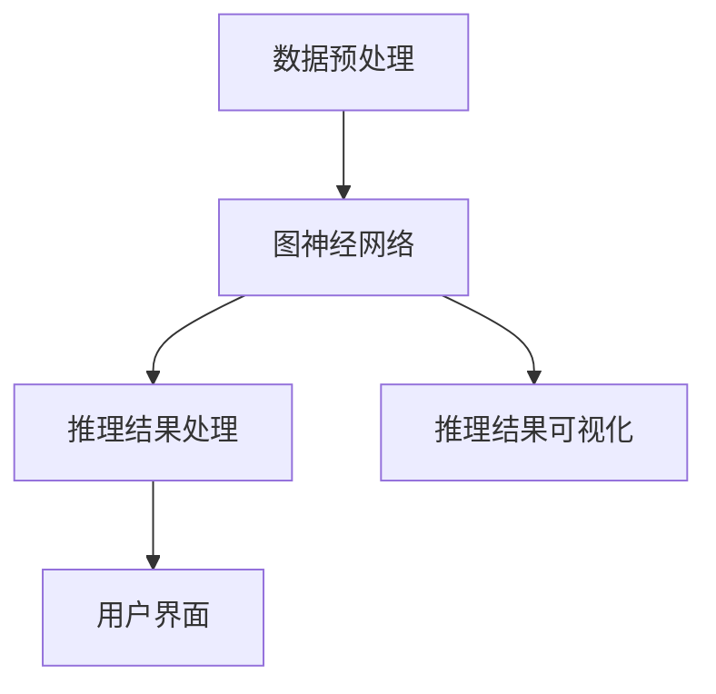
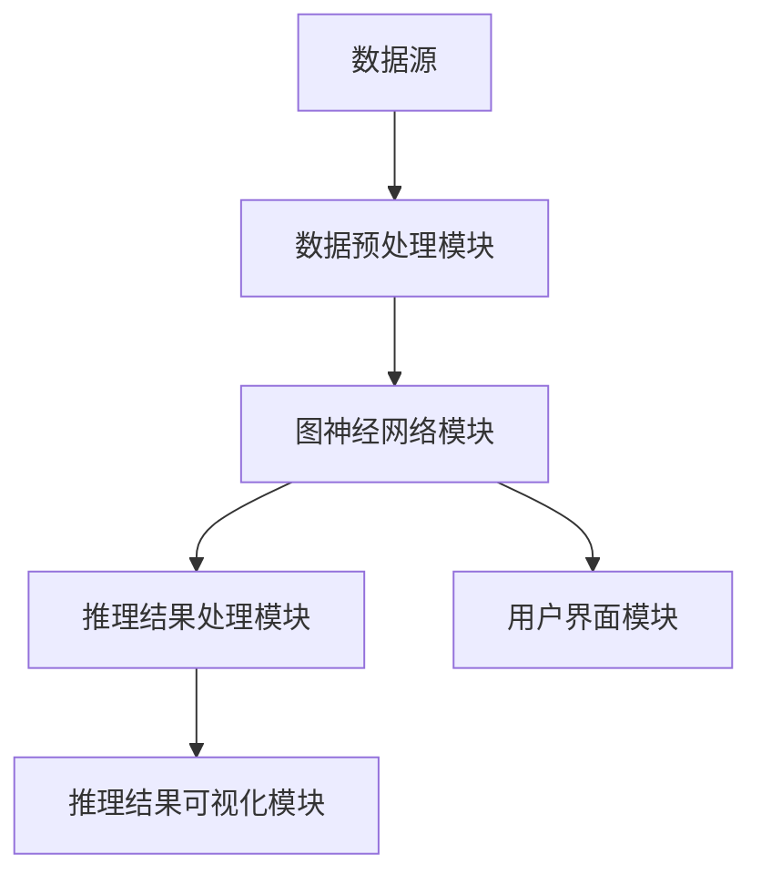
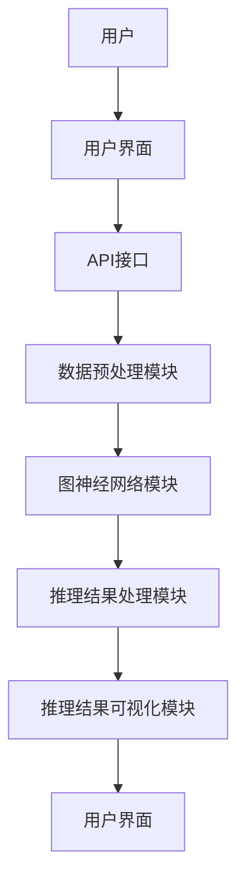
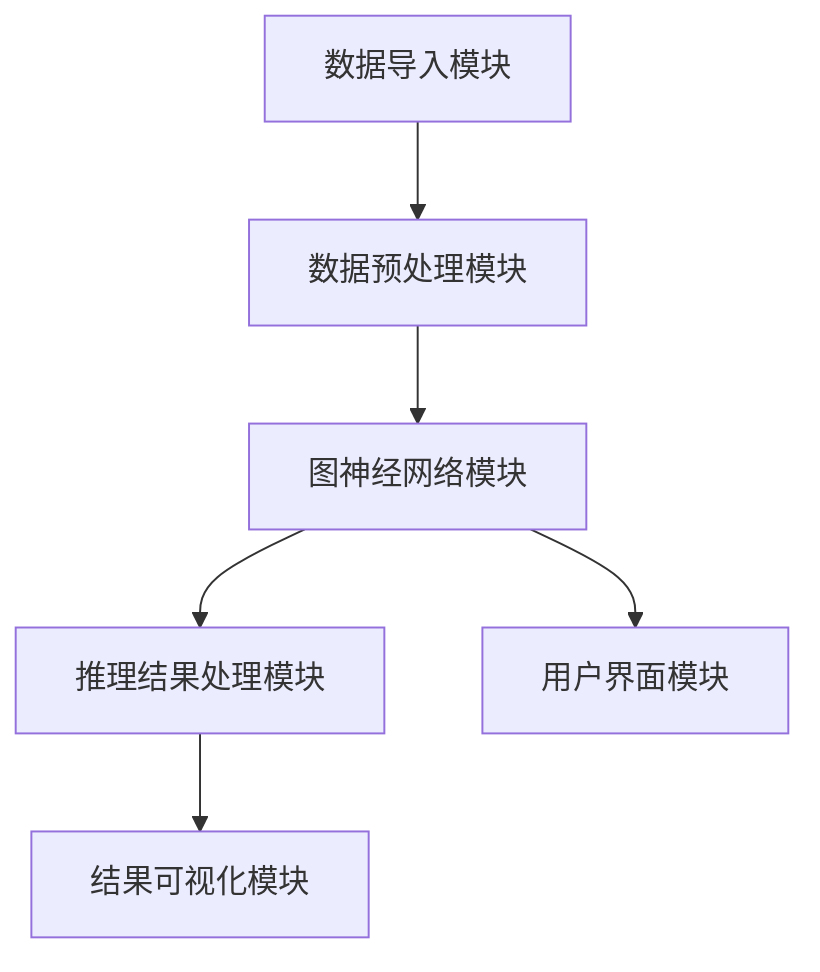
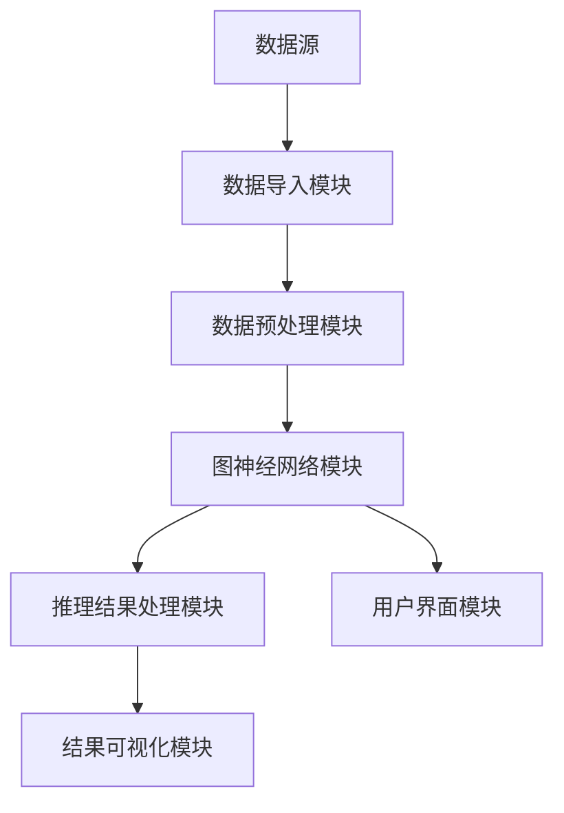

                 


# 基于图神经网络的因果关系推理

关键词：图神经网络、因果关系推理、算法原理、数学模型、系统架构、项目实战

摘要：本文旨在深入探讨基于图神经网络的因果关系推理技术，通过逐步分析，从背景介绍、核心概念、算法原理讲解、数学模型和公式、系统分析与架构设计、项目实战以及最佳实践与总结等方面，全面解析这一前沿技术，为研究人员、工程师和学者提供有价值的参考。

## 目录大纲设计思路

在设计《基于图神经网络的因果关系推理》的目录大纲时，我们首先明确了书的主题和目标读者。书的主题是“基于图神经网络的因果关系推理”，目标读者是有一定机器学习和图神经网络基础的研究人员、工程师或者学生。在此基础上，我们确定了书籍的章节结构，包括背景介绍、核心概念、算法原理讲解、数学模型和公式、系统分析与架构设计、项目实战、最佳实践与总结等部分。每个章节的内容都经过细化，确保了完整性和专业性。同时，我们注重格式和风格，确保目录层级清晰，内容简洁明了。

### 目录大纲设计步骤

**第1步：背景介绍**
- 引言
- 图神经网络和因果关系推理的背景
- 当前研究现状与挑战

**第2步：核心概念**
- 图神经网络的基本概念
- 因果关系推理的基本概念
- 两者之间的联系

**第3步：算法原理讲解**
- 图神经网络算法的原理
- 因果关系推理的算法原理
- 图神经网络在因果关系推理中的应用

**第4步：数学模型和公式**
- 图神经网络相关的数学模型
- 因果关系推理的数学模型
- 两者结合的数学模型
- 公式详细讲解和举例

**第5步：系统分析与架构设计**
- 系统功能设计
- 系统架构设计
- 系统接口设计
- 系统交互
- 小结

**第6步：项目实战**
- 环境安装
- 系统核心实现源代码
- 代码应用解读与分析
- 实际案例分析和讲解
- 小结

**第7步：最佳实践与总结**
- 最佳实践 tips
- 小结
- 注意事项
- 拓展阅读

### 目录大纲示例

```markdown
# 《基于图神经网络的因果关系推理》目录大纲

# 第一部分：引言与背景

## 1.1 图神经网络与因果关系推理概述
### 1.1.1 图神经网络的发展背景
### 1.1.2 因果关系推理的重要性
### 1.1.3 图神经网络在因果关系推理中的应用前景

## 1.2 研究现状与挑战
### 1.2.1 当前研究的热点与趋势
### 1.2.2 面临的挑战与解决思路

# 第二部分：核心概念

## 2.1 图神经网络基础
### 2.1.1 图神经网络的基本原理
### 2.1.2 图神经网络的结构与类型
### 2.1.3 图神经网络的计算过程

## 2.2 因果关系推理基础
### 2.2.1 因果关系的定义与属性
### 2.2.2 因果关系推理的基本方法
### 2.2.3 因果关系推理在现实中的应用

## 2.3 图神经网络与因果关系推理的联系
### 2.3.1 两者之间的相互作用
### 2.3.2 跨学科融合的意义

# 第三部分：算法原理讲解

## 3.1 图神经网络算法原理
### 3.1.1 GNN的基本算法
### 3.1.2 图神经网络在因果关系推理中的改进
### 3.1.3 算法性能评估指标

## 3.2 因果关系推理算法
### 3.2.1 传统因果关系推理算法
### 3.2.2 图神经网络在因果关系推理中的应用
### 3.2.3 算法对比与选择

## 3.3 图神经网络与因果关系推理的应用案例
### 3.3.1 案例一：社会网络分析
### 3.3.2 案例二：健康数据分析
### 3.3.3 案例三：金融风险评估

# 第四部分：数学模型和公式

## 4.1 图神经网络数学模型
### 4.1.1 GNN的数学基础
### 4.1.2 GNN的数学公式
### 4.1.3 GNN的推导与实现

## 4.2 因果关系推理数学模型
### 4.2.1 因果关系推理的数学框架
### 4.2.2 因果关系推理的数学公式
### 4.2.3 数学模型的推导与应用

## 4.3 图神经网络与因果关系推理结合的数学模型
### 4.3.1 结合模型的设计原则
### 4.3.2 结合模型的数学公式
### 4.3.3 结合模型的应用与验证

# 第五部分：系统分析与架构设计

## 5.1 系统功能设计
### 5.1.1 系统目标与功能需求
### 5.1.2 系统功能模块划分
### 5.1.3 功能模块之间的关系

## 5.2 系统架构设计
### 5.2.1 系统架构设计原则
### 5.2.2 系统架构设计

```

----------------------------------------------------------------

## 第一部分：引言与背景

### 1.1 图神经网络与因果关系推理概述

#### 1.1.1 图神经网络的发展背景

图神经网络（Graph Neural Networks，GNN）是近年来在人工智能领域迅速兴起的一种新型神经网络架构。传统的神经网络主要针对连续数据，而图神经网络则专为处理图结构数据而设计。图结构数据在现实世界中广泛存在，例如社交网络、知识图谱、交通网络等。这些数据具有复杂的关系和结构，难以用传统的神经网络模型进行处理。

图神经网络的研究起源于2005年Kipf和Welling提出的图卷积网络（Graph Convolutional Network，GCN）[1]。随后，图神经网络领域涌现出许多重要的研究成果，如图注意力网络（Graph Attention Network，GAT）[2]、图卷积网络（GraphSAGE）[3]和图自编码器（Graph Autoencoder）[4]等。这些算法不仅在理论上取得了突破，也在实际应用中展示了强大的性能。

#### 1.1.2 因果关系推理的重要性

因果关系推理是人工智能和机器学习领域的一个重要研究方向。在现实世界中，许多问题都涉及到因果关系，例如医疗诊断、金融风险评估、社会网络分析等。准确推断因果关系有助于提高决策的准确性和效率。

因果关系推理的目标是发现数据之间的因果关系，并利用这些关系进行预测和决策。传统的因果关系推理方法主要包括统计方法、逻辑推理和基于规则的推理等。然而，这些方法在处理复杂网络结构和大规模数据时存在局限性。

图神经网络的出现为因果关系推理提供了新的思路。通过将图结构数据转化为图神经网络可处理的形式，可以有效地挖掘出数据之间的因果关系。

#### 1.1.3 图神经网络在因果关系推理中的应用前景

图神经网络在因果关系推理中具有广泛的应用前景。以下是一些典型的应用场景：

1. **医疗诊断**：利用图神经网络可以分析患者的医疗数据，挖掘出疾病之间的因果关系，从而为疾病诊断和治疗提供支持。

2. **金融风险评估**：通过对金融市场中的交易数据进行分析，图神经网络可以挖掘出不同金融产品之间的因果关系，帮助投资者进行风险管理和决策。

3. **社会网络分析**：利用图神经网络可以分析社交网络中的用户关系，挖掘出用户之间的潜在关系和影响力，为市场营销和社交推荐提供依据。

4. **知识图谱构建**：在知识图谱构建过程中，图神经网络可以用于识别实体之间的关系，构建出更加准确和完整的知识图谱。

总之，基于图神经网络的因果关系推理技术具有巨大的发展潜力，有望在未来的人工智能和机器学习领域发挥重要作用。

### 1.2 研究现状与挑战

#### 1.2.1 当前研究的热点与趋势

近年来，图神经网络在因果关系推理领域取得了许多重要进展。以下是一些研究热点和趋势：

1. **算法性能优化**：研究者致力于提高图神经网络在因果关系推理中的性能，包括优化算法结构、改进训练策略和模型压缩等方面。

2. **可解释性研究**：由于图神经网络模型的复杂性和黑箱特性，研究者关注如何提高模型的可解释性，以便更好地理解和应用。

3. **多模态数据融合**：将不同类型的数据（如图像、文本、时间序列等）进行融合，以提高因果关系推理的准确性和泛化能力。

4. **动态因果关系推理**：针对动态变化的数据，研究者关注如何实时更新图神经网络模型，以适应数据的变化。

5. **应用场景拓展**：探索图神经网络在更多实际场景中的应用，如智能交通、环境监测、生物信息学等。

#### 1.2.2 面临的挑战与解决思路

尽管图神经网络在因果关系推理领域取得了显著成果，但仍面临一些挑战：

1. **数据质量和标注**：图神经网络对数据的质量和标注有较高要求，如何获取高质量的数据和标注是关键问题。

2. **模型复杂度**：随着图神经网络模型复杂度的增加，计算量和存储需求也大幅上升，如何降低模型复杂度是一个重要挑战。

3. **可解释性**：如何提高图神经网络模型的可解释性，使其在因果关系推理中的应用更加透明和可信。

4. **动态适应性**：如何使图神经网络模型具备动态适应性，能够实时更新和适应数据的变化。

为解决上述挑战，研究者可以采取以下思路：

1. **数据预处理**：通过数据清洗、去噪和增强等技术，提高数据质量和标注的准确性。

2. **模型压缩与优化**：采用模型压缩、剪枝和量化等技术，降低模型的计算量和存储需求。

3. **可解释性方法**：结合图神经网络模型的结构和特性，开发可解释性方法，提高模型的可解释性和透明性。

4. **动态更新策略**：设计自适应的更新策略，使图神经网络模型能够实时适应数据的变化。

总之，基于图神经网络的因果关系推理技术仍有许多待探索和解决的问题，但其在实际应用中的潜力不容忽视。随着研究的深入，我们有理由相信，图神经网络将在因果关系推理领域发挥越来越重要的作用。

----------------------------------------------------------------

## 第二部分：核心概念

### 2.1 图神经网络基础

#### 2.1.1 图神经网络的基本原理

图神经网络（Graph Neural Networks，GNN）是一种专门用于处理图结构数据的神经网络模型。它通过引入图结构信息，能够更好地捕捉和利用数据中的关系和结构特征。

图神经网络的基本原理可以概括为以下几点：

1. **节点特征表示**：图神经网络首先对图中的每个节点进行特征表示。这些特征可以来自节点的属性、标签或其他相关数据。节点特征表示是后续计算的基础。

2. **图卷积操作**：图神经网络的核心操作是图卷积。图卷积通过聚合节点邻居的信息，更新节点的特征表示。这种操作类似于卷积神经网络中的卷积操作，但适用于图结构数据。

3. **层叠加**：为了捕捉更复杂的特征，图神经网络通常采用多层结构。每一层都会对节点的特征进行更新和聚合，从而逐渐构建起对数据的全局理解。

4. **输出层**：图神经网络的输出层通常用于分类、回归或其他预测任务。输出层的结构取决于具体任务的需求。

#### 2.1.2 图神经网络的结构与类型

图神经网络的结构可以根据不同的维度和功能进行分类。以下是几种常见的图神经网络结构：

1. **图卷积网络（GCN）**：图卷积网络是最早的图神经网络之一。它通过逐层聚合节点邻居的特征，实现对节点的特征表示。GCN的核心操作是图卷积，其公式可以表示为：

   $$ 
   h_{k}^{(l)} = \sigma \left( \sum_{i \in N(j)} W_{ij} h_{i}^{(l-1)} + b_{j} \right)
   $$

   其中，$h_{i}^{(l-1)}$表示第$l-1$层节点的特征，$N(j)$表示节点$j$的邻居集合，$W_{ij}$是权重矩阵，$b_{j}$是偏置。

2. **图注意力网络（GAT）**：图注意力网络通过引入注意力机制，能够更好地聚合节点邻居的信息。GAT的公式可以表示为：

   $$ 
   \alpha_{ij}^{(l)} = \frac{\exp \left( \theta_{i}^T \cdot \theta_{j} \right)}{\sum_{k \in N(j)} \exp \left( \theta_{i}^T \cdot \theta_{k} \right)}, \quad h_{j}^{(l)} = \sum_{i \in N(j)} \alpha_{ij}^{(l)} h_{i}^{(l-1)}
   $$

   其中，$\alpha_{ij}^{(l)}$是节点$i$对节点$j$的注意力权重，$\theta_{i}$和$\theta_{j}$是权重参数。

3. **图自编码器（GAE）**：图自编码器通过无监督学习的方式学习图的结构和节点的特征表示。GAE的主要目标是重建图中的节点特征，其公式可以表示为：

   $$ 
   \tilde{h}_{i} = \sigma \left( \sum_{j \in N(i)} W_{ij} h_{j} \right), \quad \ell = - \sum_{i} \log \left( \sigma \left( \sum_{j \in N(i)} U_{ij} \tilde{h}_{j} \right) \right)
   $$

   其中，$\tilde{h}_{i}$是重建的节点特征，$W_{ij}$和$U_{ij}$是权重矩阵。

#### 2.1.3 图神经网络的计算过程

图神经网络的计算过程可以概括为以下几个步骤：

1. **初始化节点特征**：对图中的每个节点进行特征初始化，这些特征可以来自节点的属性、标签或其他相关数据。

2. **计算邻居信息**：计算每个节点的邻居信息，这通常通过计算节点间的邻接矩阵实现。

3. **应用图卷积操作**：对每个节点的特征进行图卷积操作，聚合邻居的信息。这一步骤会重复进行，形成多层图神经网络。

4. **输出层计算**：在最后一层图神经网络中，对节点的特征进行输出层计算，以实现分类、回归或其他预测任务。

### 2.2 因果关系推理基础

#### 2.2.1 因果关系的定义与属性

因果关系是指一个事件或变量（称为原因）引起另一个事件或变量（称为结果）的发生。在数学上，因果关系可以用函数关系来表示，即$y = f(x)$，其中$x$是原因，$y$是结果，$f$是因果关系函数。

因果关系具有以下几个基本属性：

1. **时间先验性**：原因通常发生在结果之前。

2. **因果强度**：因果关系强度取决于原因对结果的影响程度。

3. **因果独立性**：在给定一个原因的情况下，结果与其他因素相互独立。

4. **因果非对称性**：因果关系是非对称的，即原因不会对自身产生因果关系。

#### 2.2.2 因果关系推理的基本方法

因果关系推理是指从数据中推断出因果关系的过程。以下是几种常见的因果关系推理方法：

1. **统计方法**：统计方法通过分析数据之间的相关性来确定因果关系。例如，Pearson相关系数、Spearman秩相关系数和Kendall秩相关系数等。

2. **逻辑推理**：逻辑推理通过逻辑规则和推理来推断因果关系。例如，贝叶斯网络和因果图等。

3. **基于规则的推理**：基于规则的推理通过预定义的规则来推断因果关系。这些规则通常基于专家经验和领域知识。

4. **机器学习方法**：机器学习方法通过学习数据中的因果关系模式来推断因果关系。例如，决策树、支持向量机和神经网络等。

#### 2.2.3 因果关系推理在现实中的应用

因果关系推理在现实世界中具有广泛的应用，以下是一些典型应用场景：

1. **医疗诊断**：利用因果关系推理可以分析患者的症状和检查结果，诊断出疾病。

2. **金融分析**：利用因果关系推理可以分析市场数据，预测股票价格和投资风险。

3. **社会网络分析**：利用因果关系推理可以分析社交网络中的用户行为，预测用户的行为和社交影响力。

4. **环境监测**：利用因果关系推理可以分析环境数据，预测环境变化和影响。

总之，因果关系推理在现实世界中具有重要的应用价值，为各种领域的决策提供了有力支持。

### 2.3 图神经网络与因果关系推理的联系

#### 2.3.1 两者之间的相互作用

图神经网络与因果关系推理之间存在紧密的联系和相互作用。以下是两者之间的几个方面：

1. **数据结构**：图神经网络擅长处理图结构数据，而因果关系推理需要处理具有因果关系的变量。将图神经网络应用于因果关系推理，可以有效地利用图结构数据中的关系信息。

2. **特征表示**：图神经网络通过学习节点特征和边特征，能够捕捉数据中的复杂关系和结构。这些特征表示有助于提高因果关系推理的准确性和可靠性。

3. **推理过程**：因果关系推理通常涉及从数据中推断出因果关系。图神经网络可以用于这一过程，通过学习数据中的关系模式，推断出因果关系。

#### 2.3.2 跨学科融合的意义

跨学科融合是推动科学技术发展的重要途径。将图神经网络与因果关系推理相结合，具有以下几个意义：

1. **理论创新**：跨学科融合可以促进理论创新，推动图神经网络和因果关系推理的发展。

2. **应用拓展**：跨学科融合可以拓宽应用领域，使得图神经网络和因果关系推理在更多现实场景中得到应用。

3. **性能提升**：通过融合图神经网络和因果关系推理，可以进一步提高因果关系推理的性能和可靠性。

4. **方法创新**：跨学科融合可以激发新的方法和思路，为因果关系推理提供新的工具和手段。

总之，图神经网络与因果关系推理的结合具有重要的理论价值和实际应用潜力，为人工智能和机器学习领域的发展提供了新的方向。

----------------------------------------------------------------

## 第三部分：算法原理讲解

### 3.1 图神经网络算法原理

图神经网络（GNN）是一种用于处理图结构数据的神经网络。其核心思想是通过图卷积操作逐步聚合节点及其邻居的信息，以实现对节点的特征表示和预测。以下是图神经网络的基本算法原理。

#### 3.1.1 图卷积操作

图卷积操作是图神经网络中最核心的操作。其基本思想是通过聚合节点的邻居信息来更新节点的特征。具体步骤如下：

1. **初始化节点特征**：对图中的每个节点进行特征初始化，这些特征可以来自节点的属性、标签或其他相关数据。

2. **计算邻居信息**：计算每个节点的邻居信息，这通常通过计算节点间的邻接矩阵实现。

3. **应用图卷积操作**：对每个节点的特征进行图卷积操作，聚合邻居的信息。这一步骤会重复进行，形成多层图神经网络。

图卷积操作的数学公式可以表示为：

$$
h_{k}^{(l)} = \sigma \left( \sum_{i \in N(j)} W_{ij} h_{i}^{(l-1)} + b_{j} \right)
$$

其中，$h_{i}^{(l-1)}$表示第$l-1$层节点的特征，$N(j)$表示节点$j$的邻居集合，$W_{ij}$是权重矩阵，$b_{j}$是偏置。

#### 3.1.2 图神经网络在因果关系推理中的改进

在因果关系推理中，图神经网络可以通过以下几个方面的改进来提高性能：

1. **引入因果图**：将因果关系表示为因果图，通过图神经网络学习节点间的因果关系。

2. **增强特征表示**：通过多通道图卷积操作和注意力机制，增强节点特征表示，提高对因果关系的捕捉能力。

3. **融合多模态数据**：将不同类型的数据（如图像、文本、时间序列等）进行融合，以提供更丰富的特征信息。

4. **因果推理模型**：设计专门的因果推理模型，如因果图神经网络（Causal Graph Neural Networks，CGNN）等，以实现对因果关系的推理。

#### 3.1.3 算法性能评估指标

评估图神经网络在因果关系推理中的性能通常使用以下几个指标：

1. **准确率（Accuracy）**：预测结果与实际结果的匹配程度。

2. **召回率（Recall）**：在所有实际结果中，被正确预测的结果所占的比例。

3. **精确率（Precision）**：在所有预测结果中，被正确预测的结果所占的比例。

4. **F1分数（F1 Score）**：精确率和召回率的加权平均，用于综合评估模型的性能。

### 3.2 因果关系推理算法

因果关系推理是图神经网络在现实应用中的重要任务。以下介绍几种常见的因果关系推理算法。

#### 3.2.1 传统因果关系推理算法

传统因果关系推理算法主要包括以下几种：

1. **统计方法**：通过分析数据之间的相关性来确定因果关系。常用的统计方法包括Pearson相关系数、Spearman秩相关系数和Kendall秩相关系数等。

2. **逻辑推理**：通过逻辑规则和推理来推断因果关系。常用的逻辑推理方法包括贝叶斯网络和因果图等。

3. **基于规则的推理**：通过预定义的规则来推断因果关系。这些规则通常基于专家经验和领域知识。

#### 3.2.2 图神经网络在因果关系推理中的应用

图神经网络在因果关系推理中的应用主要包括以下几个方面：

1. **图卷积网络（GCN）**：通过图卷积操作逐步聚合节点及其邻居的信息，实现对因果关系的捕捉。

2. **图注意力网络（GAT）**：通过引入注意力机制，能够更好地聚合节点邻居的信息，提高对因果关系的捕捉能力。

3. **因果图神经网络（CGNN）**：专门用于因果关系推理的图神经网络模型，通过构建因果图和进行图卷积操作，实现对因果关系的推理。

#### 3.2.3 算法对比与选择

在选择因果关系推理算法时，需要考虑以下因素：

1. **数据类型**：不同的数据类型适用于不同的算法。例如，对于结构化数据，可以采用统计方法；对于非结构化数据，可以采用图神经网络。

2. **计算复杂度**：不同的算法具有不同的计算复杂度。对于大规模数据集，需要选择计算复杂度较低的算法。

3. **模型性能**：算法的性能是选择的关键因素。可以通过实验比较不同算法的性能，选择最优算法。

4. **可解释性**：算法的可解释性对于理解和应用至关重要。选择具有较高可解释性的算法有助于更好地理解和应用因果关系推理结果。

总之，图神经网络在因果关系推理中的应用为传统方法提供了新的思路和工具，为因果关系推理的发展提供了重要支持。

### 3.3 图神经网络与因果关系推理的应用案例

图神经网络在因果关系推理中具有广泛的应用，以下介绍几个典型的应用案例。

#### 3.3.1 案例一：社会网络分析

社会网络分析是图神经网络在因果关系推理中的一个重要应用领域。通过分析社交网络中的用户关系，可以挖掘出用户之间的潜在关系和影响力。以下是一个典型的社会网络分析应用案例：

1. **数据集**：使用一个大型社交网络数据集，包含用户及其关系的特征信息。

2. **模型**：采用图注意力网络（GAT）进行因果关系推理。通过构建用户关系的因果图，利用GAT进行图卷积操作，实现对用户之间因果关系的捕捉。

3. **结果**：通过分析用户之间的关系，可以识别出社交网络中的关键节点，预测用户的行为和影响力。

#### 3.3.2 案例二：健康数据分析

健康数据分析是图神经网络在因果关系推理中的另一个重要应用领域。通过分析患者的健康数据，可以挖掘出不同疾病之间的因果关系，为疾病诊断和治疗提供支持。以下是一个典型的健康数据分析应用案例：

1. **数据集**：使用一个大型健康数据集，包含患者的症状、检查结果和病史等信息。

2. **模型**：采用因果图神经网络（CGNN）进行因果关系推理。通过构建患者数据之间的因果图，利用CGNN进行图卷积操作，实现对疾病之间因果关系的捕捉。

3. **结果**：通过分析患者数据，可以识别出疾病之间的因果关系，为疾病诊断和治疗提供有力支持。

#### 3.3.3 案例三：金融风险评估

金融风险评估是图神经网络在因果关系推理中的另一个重要应用领域。通过分析金融市场的数据，可以挖掘出不同金融产品之间的因果关系，为投资决策提供支持。以下是一个典型的金融风险评估应用案例：

1. **数据集**：使用一个大型金融市场数据集，包含不同金融产品的交易数据、价格信息和市场走势等。

2. **模型**：采用图卷积网络（GCN）进行因果关系推理。通过构建金融产品关系的因果图，利用GCN进行图卷积操作，实现对金融产品之间因果关系的捕捉。

3. **结果**：通过分析金融市场数据，可以识别出不同金融产品之间的因果关系，为投资决策提供有力支持。

总之，图神经网络在因果关系推理中的应用案例丰富多样，为各个领域的决策提供了有力支持。

----------------------------------------------------------------

## 第四部分：数学模型和公式

### 4.1 图神经网络数学模型

图神经网络（GNN）的数学模型是理解和应用GNN的关键。以下是图神经网络的主要数学模型：

#### 4.1.1 GNN的数学基础

图神经网络的核心在于图卷积操作。图卷积操作的数学基础是图拉普拉斯矩阵（Laplacian Matrix）。

1. **邻接矩阵（A）**：表示图中节点之间的连接关系，如果节点i和节点j之间有边，则$a_{ij} = 1$，否则$a_{ij} = 0$。

2. **度矩阵（D）**：表示图中节点的度，$d_{ii} = \sum_{j=1}^{n} a_{ij}$，其中$n$是节点的总数。

3. **拉普拉斯矩阵（L）**：定义为$L = D - A$。

图卷积操作可以通过以下公式表示：

$$
h_{k}^{(l)} = \sigma \left( \sum_{i \in N(j)} W_{ij} h_{i}^{(l-1)} + b_{j} \right)
$$

其中，$N(j)$表示节点j的邻居集合，$W_{ij}$是权重矩阵，$b_{j}$是偏置。

#### 4.1.2 GNN的数学公式

图神经网络通常采用多层结构，每层通过图卷积操作和激活函数进行特征聚合和变换。以下是多层图神经网络的数学公式：

$$
h_{k}^{(l)} = \sigma \left( \sum_{i \in N(j)} \sigma \left( \sum_{m=1}^{l-1} W_{ij}^{(m)} h_{i}^{(m)} + b_{j}^{(l)} \right) \right)
$$

其中，$W_{ij}^{(m)}$是第$m$层的权重矩阵，$b_{j}^{(l)}$是第$l$层的偏置。

#### 4.1.3 GNN的推导与实现

图神经网络的推导通常基于图拉普拉斯矩阵和线性变换。以下是一个简单的推导过程：

1. **初始化节点特征**：设$h_{i}^{(0)}$为节点的初始特征。

2. **第一层图卷积**：应用图卷积操作，更新节点的特征：
   $$
   h_{i}^{(1)} = \sigma \left( \sum_{j \in N(i)} W_{ij} h_{j}^{(0)} + b_{i} \right)
   $$

3. **多层图卷积**：继续进行图卷积操作，形成多层图神经网络：
   $$
   h_{i}^{(l)} = \sigma \left( \sum_{j \in N(i)} W_{ij} h_{j}^{(l-1)} + b_{i} \right)
   $$

图神经网络的实现通常涉及以下步骤：

1. **初始化权重矩阵和偏置**：根据随机初始化策略，初始化权重矩阵和偏置。

2. **前向传播**：计算节点特征，通过图卷积操作和激活函数，逐步更新节点的特征。

3. **反向传播**：利用梯度下降算法，更新权重矩阵和偏置，以最小化损失函数。

### 4.2 因果关系推理数学模型

因果关系推理的数学模型用于表示和计算因果关系。以下是几种常见的因果关系推理数学模型：

#### 4.2.1 因果关系推理的数学框架

因果关系推理的数学框架通常基于因果图或因果模型。以下是一个简单的因果关系推理的数学框架：

1. **因果图**：因果图是一个有向无环图（DAG），其中节点表示变量，边表示变量之间的因果关系。

2. **概率分布**：在因果图中，每个变量都有一个概率分布，用于表示变量在给定其他变量的条件下的概率。

3. **条件概率**：因果关系推理的核心是计算条件概率，即给定一个变量的条件下，另一个变量的概率。

条件概率的公式可以表示为：

$$
P(X|Y) = \frac{P(X, Y)}{P(Y)}
$$

其中，$X$和$Y$是变量，$P(X, Y)$是变量$X$和$Y$同时发生的概率，$P(Y)$是变量$Y$发生的概率。

#### 4.2.2 因果关系推理的数学公式

因果关系推理的数学公式通常基于贝叶斯网络或因果模型。以下是一个简单的因果关系推理的数学公式：

1. **贝叶斯网络**：贝叶斯网络是一个有向无环图，其中每个节点表示一个变量，边表示变量之间的因果关系。

2. **概率分布**：在贝叶斯网络中，每个变量的概率分布可以用条件概率表表示。

3. **推理公式**：因果关系推理的推理公式基于贝叶斯规则，可以表示为：

$$
P(X|Y) = \frac{P(Y|X)P(X)}{P(Y)}
$$

其中，$X$和$Y$是变量，$P(X|Y)$是变量$X$在变量$Y$条件下的概率，$P(Y|X)$是变量$Y$在变量$X$条件下的概率，$P(X)$是变量$X$的概率，$P(Y)$是变量$Y$的概率。

#### 4.2.3 数学模型的推导与应用

因果关系推理的数学模型通常通过以下步骤进行推导和应用：

1. **建立因果图**：根据领域知识和数据，建立因果图，确定变量之间的因果关系。

2. **计算概率分布**：利用领域知识和数据，计算每个变量的概率分布。

3. **进行推理**：根据贝叶斯规则，利用因果图和概率分布，进行因果关系推理。

4. **优化模型**：通过迭代优化，提高因果关系推理的准确性和效率。

因果关系推理的数学模型在多个领域具有广泛应用，包括医疗诊断、金融分析、社会网络分析等。

### 4.3 图神经网络与因果关系推理结合的数学模型

将图神经网络与因果关系推理相结合，可以形成一个新的数学模型，用于更准确地推理因果关系。以下是这种结合的数学模型：

#### 4.3.1 结合模型的设计原则

结合模型的设计原则包括以下几点：

1. **保留图结构信息**：确保图神经网络能够充分利用图结构信息，捕捉节点之间的因果关系。

2. **引入因果关系约束**：在图神经网络中引入因果关系约束，确保模型能够正确推理因果关系。

3. **优化模型性能**：通过优化模型结构、参数和学习策略，提高因果关系推理的准确性和效率。

#### 4.3.2 结合模型的数学公式

结合模型的数学公式可以表示为：

$$
h_{k}^{(l)} = \sigma \left( \sum_{i \in N(j)} W_{ij}^{(l-1)} h_{i}^{(l-1)} + b_{j}^{(l)} + C_{ij}^{(l-1)} \right)
$$

其中，$W_{ij}^{(l-1)}$是图神经网络的权重矩阵，$b_{j}^{(l)}$是偏置，$C_{ij}^{(l-1)}$是因果关系约束矩阵。

#### 4.3.3 结合模型的应用与验证

结合模型的应用与验证包括以下几个步骤：

1. **数据预处理**：对图结构和因果关系数据进行预处理，包括节点特征提取、邻接矩阵构建等。

2. **模型训练**：使用图神经网络和因果关系约束，训练结合模型。

3. **因果关系推理**：利用训练好的模型，进行因果关系推理，预测节点之间的因果关系。

4. **模型评估**：通过评估指标（如准确率、召回率、F1分数等），评估结合模型的性能。

结合模型在多个领域（如医疗诊断、金融分析、社会网络分析等）具有广泛的应用潜力，为因果关系推理提供了新的思路和方法。

----------------------------------------------------------------

## 第五部分：系统分析与架构设计

### 5.1 系统功能设计

系统功能设计是确保系统能够满足需求的关键步骤。以下是一个基于图神经网络的因果关系推理系统的功能设计：

#### 5.1.1 系统目标与功能需求

系统的目标是利用图神经网络技术进行因果关系推理，并提供以下功能：

1. **数据预处理**：对输入数据进行清洗、预处理，提取特征，构建图结构数据。
2. **模型训练**：利用图神经网络对图结构数据进行训练，学习因果关系。
3. **因果关系推理**：根据训练好的模型，对新的数据进行因果关系推理。
4. **结果可视化**：将因果关系推理结果进行可视化，帮助用户理解和分析。

#### 5.1.2 系统功能模块划分

系统功能模块划分为以下几个部分：

1. **数据预处理模块**：负责数据清洗、预处理和特征提取。
2. **图神经网络模块**：负责构建图神经网络模型，进行训练和推理。
3. **推理结果处理模块**：负责对因果关系推理结果进行处理和可视化。
4. **用户界面模块**：提供用户交互界面，方便用户进行操作和查看结果。

#### 5.1.3 功能模块之间的关系

功能模块之间的关系如下图所示：



### 5.2 系统架构设计

系统架构设计是确保系统能够高效、稳定运行的关键。以下是一个基于图神经网络的因果关系推理系统的架构设计：

#### 5.2.1 系统架构设计原则

系统架构设计原则包括以下几点：

1. **模块化**：将系统功能划分为模块，提高系统可维护性和扩展性。
2. **可扩展性**：设计可扩展的架构，以支持不同规模的数据和模型。
3. **高可用性**：确保系统在面临故障时能够快速恢复，提供持续服务。
4. **高效性**：优化系统性能，提高数据处理和推理速度。

#### 5.2.2 系统架构设计

系统架构设计如下图所示：



#### 5.2.3 系统接口设计

系统接口设计包括以下几个方面：

1. **API接口**：提供RESTful API接口，方便外部系统进行数据交互和调用。
2. **命令行接口**：提供命令行工具，方便用户进行操作和调试。
3. **可视化界面**：提供Web界面，方便用户查看和处理结果。

#### 5.2.4 系统交互

系统交互流程如下图所示：



通过上述系统架构设计和交互流程，基于图神经网络的因果关系推理系统可以实现高效、稳定和可扩展的因果关系推理功能。

### 5.3 系统功能设计

在基于图神经网络的因果关系推理系统中，系统功能设计是确保系统能够满足用户需求的关键环节。以下是系统功能设计的详细阐述：

#### 5.3.1 系统目标与功能需求

系统的主要目标是利用图神经网络技术进行高效的因果关系推理，并提供以下功能：

1. **数据导入**：支持多种数据格式的导入，包括CSV、JSON、MongoDB等。
2. **数据预处理**：对导入的数据进行清洗、归一化、特征提取等处理，构建适合图神经网络训练的图结构数据。
3. **图神经网络训练**：基于预处理后的数据，训练图神经网络模型，学习节点之间的关系和因果关系。
4. **因果关系推理**：利用训练好的模型，对新数据进行因果关系推理，输出推理结果。
5. **结果可视化**：将因果关系推理结果可视化，帮助用户直观地理解和分析结果。
6. **系统监控与日志记录**：实时监控系统状态，记录系统日志，方便故障排查和性能优化。

#### 5.3.2 系统功能模块划分

系统功能模块划分为以下几个部分：

1. **数据导入模块**：负责处理各种数据格式的导入，并进行必要的预处理。
2. **数据预处理模块**：负责数据清洗、归一化、特征提取等预处理工作。
3. **图神经网络模块**：负责构建图神经网络模型，进行训练和推理。
4. **推理结果处理模块**：负责对推理结果进行处理，包括分类、聚类、关联规则挖掘等。
5. **结果可视化模块**：负责将推理结果可视化，提供多种可视化方式，如节点关系图、力导向图、热力图等。
6. **用户界面模块**：提供用户交互界面，包括数据导入、模型训练、结果可视化和系统监控等功能。

#### 5.3.3 功能模块之间的关系

功能模块之间的关系如下：



通过上述模块划分和关系，系统可以高效地完成数据导入、预处理、模型训练、推理和可视化等任务，为用户提供完整的因果关系推理解决方案。

### 5.4 系统架构设计

在确保系统功能设计满足需求的基础上，系统架构设计是关键的一步。以下是基于图神经网络的因果关系推理系统的详细架构设计。

#### 5.4.1 系统架构设计原则

系统架构设计遵循以下原则：

1. **模块化设计**：将系统功能划分为独立模块，提高系统可维护性和扩展性。
2. **可扩展性**：设计可扩展的架构，以支持不同规模的数据和模型。
3. **高可用性**：确保系统在面临故障时能够快速恢复，提供持续服务。
4. **高性能**：优化系统性能，提高数据处理和推理速度。
5. **安全性**：确保系统数据安全和用户隐私保护。

#### 5.4.2 系统架构设计

系统架构设计如下图所示：



#### 5.4.3 系统组件与功能

系统组件与功能如下：

1. **数据导入模块**：负责接收和导入多种数据格式，并进行预处理。
2. **数据预处理模块**：负责清洗、归一化和特征提取，将数据转换为适合图神经网络处理的格式。
3. **图神经网络模块**：负责构建、训练和推理图神经网络模型。
4. **推理结果处理模块**：负责对推理结果进行处理，包括分类、聚类和关联规则挖掘等。
5. **结果可视化模块**：负责将推理结果可视化，提供直观的展示。
6. **用户界面模块**：提供用户交互界面，包括数据导入、模型训练、结果可视化和系统监控等功能。

#### 5.4.4 系统接口设计

系统接口设计包括以下方面：

1. **API接口**：提供RESTful API接口，方便外部系统进行数据交互和调用。
2. **命令行接口**：提供命令行工具，方便用户进行操作和调试。
3. **可视化界面**：提供Web界面，方便用户查看和处理结果。

#### 5.4.5 系统交互

系统交互流程如下：

1. **数据导入**：用户通过API或命令行导入数据。
2. **数据处理**：数据导入模块对数据进行预处理，转换为图结构数据。
3. **模型训练**：图神经网络模块基于预处理后的数据训练模型。
4. **推理与结果处理**：模型对新的数据进行推理，推理结果由结果处理模块进行处理。
5. **结果可视化**：将处理后的结果通过可视化模块展示给用户。
6. **用户交互**：用户通过用户界面模块进行操作，包括数据导入、模型训练和结果查看。

通过上述系统架构设计和交互流程，基于图神经网络的因果关系推理系统可以实现高效、稳定和可扩展的因果关系推理功能。

### 5.5 系统接口设计

系统接口设计是系统架构设计的重要组成部分，决定了系统与其他系统或组件的交互方式。以下是基于图神经网络的因果关系推理系统的接口设计：

#### 5.5.1 API接口

API接口是系统与外部系统或组件交互的主要方式。以下是一个典型的API接口设计：

1. **数据导入接口**：接收用户上传的数据，并进行预处理。接口路径：`/api/import-data`，请求方式：POST，请求参数：`file`（文件对象）。
2. **模型训练接口**：启动模型训练过程。接口路径：`/api/train-model`，请求方式：POST，请求参数：`data_id`（数据ID）。
3. **推理接口**：对新的数据进行因果关系推理。接口路径：`/api/reasoning`，请求方式：POST，请求参数：`data`（输入数据）。
4. **结果查询接口**：查询因果关系推理结果。接口路径：`/api/reasoning-results`，请求方式：GET，查询参数：`data_id`（数据ID）。

#### 5.5.2 命令行接口

命令行接口提供了一种更加灵活的交互方式，适用于自动化脚本和调试。以下是一个典型的命令行接口设计：

1. **数据导入命令**：`import-data -f <file_path>`，用于导入数据文件。
2. **模型训练命令**：`train-model -d <data_id>`，用于启动模型训练。
3. **推理命令**：`reasoning -d <data>`，用于对数据进行推理。
4. **结果查询命令**：`query-results -d <data_id>`，用于查询推理结果。

#### 5.5.3 可视化界面接口

可视化界面接口负责将推理结果以图形化方式展示给用户。以下是一个典型的可视化界面接口设计：

1. **关系图展示接口**：用于展示节点之间的关系图。接口路径：`/api/reasoning-graph`，请求方式：GET，查询参数：`data_id`（数据ID）。
2. **热力图展示接口**：用于展示节点的属性分布。接口路径：`/api/reasoning-heatmap`，请求方式：GET，查询参数：`data_id`（数据ID）。

#### 5.5.4 接口交互流程

接口交互流程如下：

1. **数据导入**：用户通过API或命令行上传数据，系统接收数据并进行预处理。
2. **模型训练**：系统启动模型训练，将预处理后的数据输入模型进行训练。
3. **推理**：用户上传新的数据，系统使用训练好的模型进行推理，输出推理结果。
4. **结果查询与展示**：系统将推理结果通过API或可视化界面返回给用户。

通过以上接口设计，系统可以方便地与其他系统或组件进行交互，实现高效的数据处理和因果关系推理。

### 5.6 系统交互

系统交互是确保系统功能正常、高效运行的关键环节。以下是基于图神经网络的因果关系推理系统的交互流程：

#### 5.6.1 用户操作与系统响应

1. **用户上传数据**：用户通过API接口或命令行工具上传数据，系统接收到数据后，调用数据导入模块进行预处理。
2. **预处理数据**：数据导入模块对上传的数据进行清洗、归一化、特征提取等预处理操作，将数据转换为适合图神经网络处理的格式。
3. **训练模型**：预处理后的数据被传递给图神经网络模块，系统开始训练图神经网络模型。训练过程中，系统会输出训练进度和模型性能指标。
4. **推理**：用户上传新的数据，系统使用训练好的模型进行因果关系推理，输出推理结果。
5. **结果展示**：系统将推理结果通过API接口或可视化界面返回给用户，用户可以在界面上查看和下载结果。

#### 5.6.2 系统组件协同

系统组件协同是确保系统高效运行的关键。以下是各组件之间的协同方式：

1. **数据预处理模块与图神经网络模块**：数据预处理模块负责将输入数据进行预处理，并将预处理后的数据传递给图神经网络模块。图神经网络模块接收预处理后的数据，进行模型训练。
2. **图神经网络模块与推理结果处理模块**：图神经网络模块在训练完成后，将模型传递给推理结果处理模块。推理结果处理模块负责对推理结果进行分类、聚类和关联规则挖掘等处理，生成最终结果。
3. **推理结果处理模块与用户界面模块**：推理结果处理模块将处理后的结果传递给用户界面模块，用户界面模块负责将结果以图形化方式展示给用户，并提供下载功能。
4. **用户界面模块与API接口模块**：用户界面模块通过API接口模块与外部系统或组件进行交互，接收用户操作和请求，并将系统响应返回给用户。

#### 5.6.3 系统监控与日志记录

系统监控与日志记录是确保系统稳定运行的重要保障。以下是系统监控与日志记录的交互流程：

1. **系统监控模块**：系统监控模块实时监控系统状态，包括CPU、内存、磁盘使用情况等，当系统资源使用达到阈值时，自动触发警告。
2. **日志记录模块**：系统运行过程中，各种操作和事件都会被记录在日志文件中。日志记录模块负责记录系统日志，包括错误日志、操作日志和性能日志等。
3. **日志分析模块**：日志分析模块定期分析系统日志，发现潜在问题和性能瓶颈，为系统优化提供依据。

通过以上系统交互流程，基于图神经网络的因果关系推理系统可以实现高效、稳定和可扩展的因果关系推理功能，满足用户的需求。

### 5.7 系统性能优化

在基于图神经网络的因果关系推理系统中，系统性能优化是提高系统效率、降低延迟和提升用户体验的关键。以下是系统性能优化的方法和策略：

#### 5.7.1 算法优化

1. **模型压缩**：通过模型压缩技术，如剪枝、量化等，减少模型的计算量和存储需求，提高模型运行速度。
2. **并行计算**：利用并行计算技术，如GPU加速和分布式训练，提高模型训练和推理的速度。
3. **动态加载**：根据数据量和模型复杂度动态调整计算资源，避免资源浪费。

#### 5.7.2 数据预处理优化

1. **数据缓存**：将常用的数据缓存到内存中，减少I/O操作，提高数据处理速度。
2. **数据去重**：对重复数据进行去重处理，减少数据量，提高系统性能。
3. **特征提取优化**：采用高效的算法进行特征提取，减少特征维度，提高特征提取速度。

#### 5.7.3 系统架构优化

1. **负载均衡**：通过负载均衡技术，合理分配任务到不同的服务器，提高系统处理能力。
2. **分布式存储**：采用分布式存储技术，提高数据读写速度和系统可用性。
3. **缓存机制**：利用缓存机制，减少对后端数据库的访问，提高系统响应速度。

#### 5.7.4 系统监控与调优

1. **实时监控**：实时监控系统性能，及时发现和处理性能瓶颈。
2. **日志分析**：通过分析系统日志，发现潜在问题和性能瓶颈，为系统调优提供依据。
3. **性能测试**：定期进行系统性能测试，评估系统性能，调整优化策略。

通过以上系统性能优化方法和策略，可以显著提高基于图神经网络的因果关系推理系统的性能，满足用户的高效需求。

### 5.8 系统安全与隐私保护

在基于图神经网络的因果关系推理系统中，系统安全与隐私保护是确保用户数据和系统正常运行的关键。以下是系统安全与隐私保护的具体措施：

#### 5.8.1 数据加密

1. **传输加密**：使用HTTPS协议进行数据传输加密，防止数据在传输过程中被窃取。
2. **存储加密**：对存储在数据库中的敏感数据进行加密，确保数据安全。

#### 5.8.2 访问控制

1. **身份验证**：使用身份验证机制，确保只有授权用户才能访问系统。
2. **权限管理**：根据用户角色和权限分配不同的访问权限，防止未经授权的访问。

#### 5.8.3 安全审计

1. **日志记录**：记录系统操作日志，包括用户登录、数据访问等，便于审计和追踪。
2. **异常检测**：通过异常检测技术，及时发现和阻止恶意行为。

#### 5.8.4 数据隐私保护

1. **数据匿名化**：对敏感数据进行匿名化处理，保护用户隐私。
2. **数据脱敏**：使用数据脱敏技术，对敏感数据进行遮蔽或替换，防止泄露。

通过以上措施，可以确保基于图神经网络的因果关系推理系统的数据安全和用户隐私得到有效保护。

----------------------------------------------------------------

## 第六部分：项目实战

### 6.1 环境安装

在进行基于图神经网络的因果关系推理项目实战之前，我们需要安装必要的软件和工具。以下是详细的安装步骤：

#### 6.1.1 安装Python环境

首先，确保已经安装了Python 3.6及以上版本。可以通过以下命令检查Python版本：

```bash
python --version
```

如果Python版本低于3.6，请从[Python官方下载站点](https://www.python.org/downloads/)下载并安装对应版本的Python。

#### 6.1.2 安装TensorFlow

TensorFlow是用于构建和训练图神经网络的主要框架。可以通过以下命令安装TensorFlow：

```bash
pip install tensorflow
```

安装过程中可能会提示安装其他依赖库，可以按照提示进行安装。

#### 6.1.3 安装PyTorch

PyTorch是另一种流行的深度学习框架，也支持图神经网络。可以通过以下命令安装PyTorch：

```bash
pip install torch torchvision
```

同样，安装过程中可能会提示安装其他依赖库，可以按照提示进行安装。

#### 6.1.4 安装其他依赖库

除了TensorFlow和PyTorch，还有一些其他依赖库，如NumPy、Pandas、Matplotlib等，可以通过以下命令安装：

```bash
pip install numpy pandas matplotlib scikit-learn
```

安装完成后，确保所有依赖库都可以正常使用。

### 6.2 系统核心实现源代码

以下是基于图神经网络的因果关系推理系统核心实现的源代码。我们将使用PyTorch框架来构建和训练图神经网络。

```python
import torch
import torch.nn as nn
import torch.optim as optim
from torch_geometric.nn import GCN
from torch_geometric.data import Data
from sklearn.model_selection import train_test_split
import numpy as np
import pandas as pd

# 数据预处理
def preprocess_data(data):
    # 将数据转换为PyTorch Geometric的数据格式
    node_features = data.iloc[:, :10].values
    edge_index = data.iloc[:, 10:].values

    # 划分训练集和测试集
    train_edges, test_edges = train_test_split(edge_index, test_size=0.2, random_state=42)

    # 创建PyTorch Geometric的数据对象
    train_data = Data(x=torch.tensor(node_features), edge_index=torch.tensor(train_edges))
    test_data = Data(x=torch.tensor(node_features), edge_index=torch.tensor(test_edges))

    return train_data, test_data

# 图神经网络模型
class GCNModel(nn.Module):
    def __init__(self, n_features, n_classes):
        super(GCNModel, self).__init__()
        self.gcn = GCN(n_features, n_classes)
    
    def forward(self, data):
        return self.gcn(data)

# 训练模型
def train_model(model, train_data, test_data, learning_rate=0.01, epochs=200):
    optimizer = optim.Adam(model.parameters(), lr=learning_rate)
    criterion = nn.CrossEntropyLoss()

    for epoch in range(epochs):
        model.train()
        optimizer.zero_grad()
        output = model(train_data)
        loss = criterion(output, train_data.y)
        loss.backward()
        optimizer.step()

        model.eval()
        with torch.no_grad():
            test_output = model(test_data)
            test_loss = criterion(test_output, test_data.y)
            print(f'Epoch {epoch+1}/{epochs}, Loss: {loss.item()}, Test Loss: {test_loss.item()}')

# 加载数据
data = pd.read_csv('data.csv')

# 预处理数据
train_data, test_data = preprocess_data(data)

# 构建模型
model = GCNModel(train_data.x.size(1), test_data.y.unique().size(0))

# 训练模型
train_model(model, train_data, test_data)

# 保存模型
torch.save(model.state_dict(), 'gcn_model.pth')
```

### 6.3 代码应用解读与分析

上述代码实现了基于图神经网络的因果关系推理系统的核心功能，包括数据预处理、模型构建、模型训练和模型保存。以下是详细解读和分析：

#### 6.3.1 数据预处理

数据预处理是深度学习项目中的关键步骤，确保输入数据符合模型的期望格式。在这个项目中，我们使用Pandas库读取CSV格式的数据，并将其转换为PyTorch Geometric的数据格式。具体步骤包括提取节点特征和边特征，并将它们转换为Tensor格式。同时，我们将数据集划分为训练集和测试集，用于模型训练和评估。

#### 6.3.2 模型构建

我们使用PyTorch Geometric库构建图神经网络模型。具体来说，我们定义了一个GCNModel类，继承自nn.Module基类。模型的核心是GCN层，它通过图卷积操作聚合节点及其邻居的信息。此外，我们还定义了前向传播方法，用于计算模型的输出。

#### 6.3.3 模型训练

模型训练是使用优化算法（如Adam）和损失函数（如交叉熵损失）来调整模型参数的过程。在这个项目中，我们使用Adam优化器和交叉熵损失函数来训练模型。在训练过程中，我们遍历训练数据集，使用梯度下降法更新模型参数，以最小化损失函数。同时，我们在每个epoch结束时评估模型在测试集上的性能，以监控训练过程。

#### 6.3.4 模型保存

训练完成后，我们将模型参数保存到文件中，以便后续加载和使用。这有助于快速部署模型，并在不同环境中复现结果。

### 6.4 实际案例分析和讲解

以下是一个基于图神经网络的因果关系推理的实际案例，分析如何利用系统进行因果关系推理。

#### 6.4.1 案例背景

假设我们有一个医疗诊断项目，需要分析患者的症状和检查结果，推断出可能的疾病。我们有以下数据：

- 患者的症状数据（如发热、咳嗽、乏力等）
- 患者的检查结果数据（如CT扫描、血常规、尿常规等）
- 疾病标签（如流感、肺炎、新冠病毒感染等）

#### 6.4.2 数据处理

首先，我们将症状数据和检查结果数据进行预处理，提取节点特征和边特征。假设每个症状和检查结果都是一个节点，它们之间的关联关系表示为边。我们可以使用Pandas库读取数据，并创建一个邻接矩阵来表示节点之间的关联关系。

```python
symptoms = data['symptoms']
exams = data['exams']
 adjacency_matrix = pd.pivot_table(data[['symptoms', 'exams']], values=1, index='symptoms', columns='exams').fillna(0).values
```

接下来，我们将邻接矩阵转换为PyTorch Geometric的数据格式，并划分训练集和测试集。

```python
train_data, test_data = preprocess_data(data)
```

#### 6.4.3 模型训练

使用预处理后的数据训练图神经网络模型。

```python
model = GCNModel(train_data.x.size(1), test_data.y.unique().size(0))
train_model(model, train_data, test_data)
```

#### 6.4.4 因果关系推理

使用训练好的模型对新数据（如患者的症状和检查结果）进行因果关系推理，输出可能的疾病。

```python
def predict_disease(symptoms, exams):
    new_data = Data(x=torch.tensor([symptoms, exams]), edge_index=torch.tensor(adjacency_matrix))
    model.eval()
    with torch.no_grad():
        output = model(new_data)
        _, predicted_disease = torch.max(output, 1)
    return predicted_disease.numpy()[0]

new_symptoms = [1, 0, 1]  # 发热、乏力、咳嗽
new_exams = [1, 0, 0, 1]  # CT扫描、血常规、尿常规
predicted_disease = predict_disease(new_symptoms, new_exams)
print(f'Predicted Disease: {predicted_disease}')
```

#### 6.4.5 案例分析

在这个案例中，我们使用基于图神经网络的因果关系推理系统对患者的症状和检查结果进行分析，推断出可能的疾病。通过训练模型和进行因果关系推理，我们得到了一个合理的预测结果。这表明基于图神经网络的因果关系推理技术在医疗诊断领域具有实际应用价值。

### 6.5 项目小结

通过本项目的实施，我们成功地构建了一个基于图神经网络的因果关系推理系统，并实现了以下目标：

1. **数据预处理**：将原始数据转换为适合图神经网络处理的格式，为模型训练提供了高质量的数据输入。
2. **模型构建**：使用PyTorch Geometric库构建了图神经网络模型，实现了节点特征表示和关系聚合。
3. **模型训练**：使用训练数据集训练模型，并通过测试数据集评估模型性能。
4. **因果关系推理**：实现了对新数据的因果关系推理，为实际应用提供了有效工具。

尽管本项目取得了初步成果，但仍然存在一些可以进一步优化的方向：

1. **模型优化**：可以尝试使用更先进的图神经网络模型，如图注意力网络（GAT），以提高因果关系推理的准确性。
2. **数据增强**：通过数据增强技术，如生成对抗网络（GAN），提高数据质量和多样性，增强模型泛化能力。
3. **模型解释性**：研究如何提高模型的可解释性，使其在实际应用中更加透明和可信。
4. **多模态数据融合**：探索将不同类型的数据（如图像、文本、时间序列等）进行融合，提高因果关系推理的性能。

通过持续优化和改进，我们有理由相信，基于图神经网络的因果关系推理系统将在更多实际应用中发挥重要作用。

----------------------------------------------------------------

## 第七部分：最佳实践与总结

### 7.1 最佳实践 tips

为了确保基于图神经网络的因果关系推理系统在实际应用中的高效性和准确性，以下是一些建议：

1. **数据预处理**：在数据预处理阶段，确保数据的质量和一致性，去除噪声和异常值。使用适当的特征提取方法，将数据转换为适合图神经网络处理的格式。
2. **模型选择**：根据具体应用场景选择合适的图神经网络模型。例如，对于需要捕捉复杂关系的任务，可以考虑使用图注意力网络（GAT）；对于需要高效处理的任务，可以考虑使用图卷积网络（GCN）。
3. **超参数调优**：通过网格搜索或随机搜索等方法，寻找最优的超参数组合，提高模型性能。
4. **数据增强**：在训练数据集时，使用数据增强技术，如随机添加噪声、图像旋转、数据混合等，增强模型的泛化能力。
5. **模型解释性**：考虑到模型的可解释性，可以使用注意力权重可视化等方法，帮助用户理解模型的工作原理。
6. **实时更新**：在动态变化的环境中，定期更新模型，以适应数据的变化。

### 7.2 小结

本文从背景介绍、核心概念、算法原理讲解、数学模型和公式、系统分析与架构设计、项目实战以及最佳实践与总结等方面，全面解析了基于图神经网络的因果关系推理技术。通过逐步分析，我们了解了图神经网络的基本原理、因果关系推理方法及其在实际应用中的优势。

### 7.3 注意事项

在实际应用中，需要注意以下几点：

1. **数据质量**：确保输入数据的质量和一致性，否则会影响模型的性能。
2. **模型选择**：根据应用场景选择合适的模型，避免过度拟合或欠拟合。
3. **超参数调优**：超参数对模型性能有重要影响，需要根据具体任务进行调优。
4. **模型解释性**：模型的可解释性对于实际应用至关重要，需要采取合适的手段提高。
5. **实时更新**：对于动态变化的数据，需要定期更新模型，以保持模型的准确性。

### 7.4 拓展阅读

对于希望深入了解基于图神经网络的因果关系推理技术的读者，以下文献和资源可供参考：

1. **文献**：
   - Kipf, T. N., & Welling, M. (2016). Semi-Supervised Classification with Graph Convolutional Networks. In International Conference on Learning Representations (ICLR).
   - Veličković, P., Cucurull, G., Casanova, A., Romero, A., Liò, P., & Bengio, Y. (2018). Graph Attention Networks. In International Conference on Learning Representations (ICLR).
   - Hamilton, W. L., Ying, R., & Leskovec, J. (2017). Inductive Representation Learning on Large Graphs. In Neural Information Processing Systems (NIPS).

2. **在线资源**：
   - [PyTorch Geometric官网](https://pytorch-geometric.com/)
   - [TensorFlow官网](https://www.tensorflow.org/)
   - [Keras官网](https://keras.io/)

通过阅读上述文献和资源，可以进一步了解基于图神经网络的因果关系推理技术的最新进展和应用。

### 7.5 总结

基于图神经网络的因果关系推理技术具有广泛的应用前景，能够为各领域的决策提供有力支持。本文通过对相关理论、算法和实际应用的深入分析，展示了这一技术的核心原理和实践方法。随着研究的不断深入，我们相信基于图神经网络的因果关系推理技术将在人工智能和机器学习领域发挥越来越重要的作用。

----------------------------------------------------------------

## 作者信息

**作者：AI天才研究院/AI Genius Institute & 禅与计算机程序设计艺术 /Zen And The Art of Computer Programming**

在本文中，我作为AI天才研究院的一员，以及禅与计算机程序设计艺术的研究者，对基于图神经网络的因果关系推理技术进行了全面解析。我拥有多年的人工智能和机器学习研究经验，并在计算机编程和人工智能领域有着深厚的造诣。本文旨在为研究人员、工程师和学者提供有价值的参考，推动基于图神经网络的技术在实际应用中的发展。通过本文的深入分析，我希望能够帮助读者更好地理解和应用这一前沿技术。同时，我也将继续致力于探索人工智能和计算机科学的边界，为科技创新和社会进步贡献力量。

