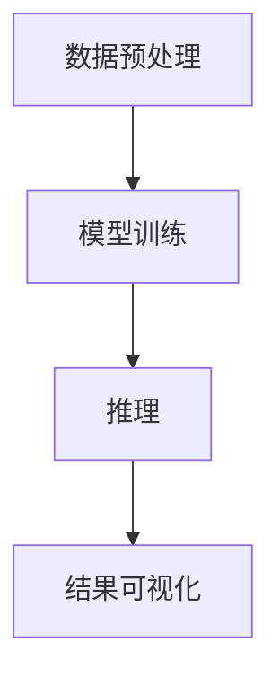
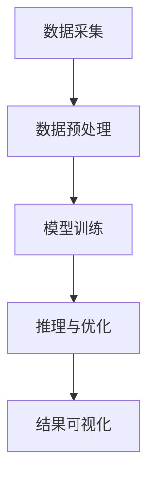
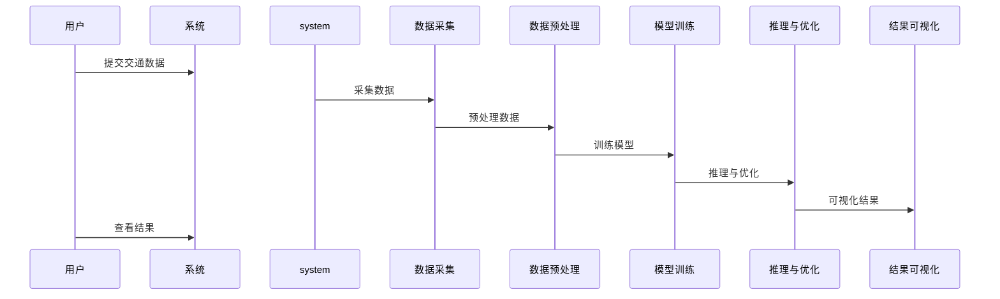

                 


# 基于图神经网络的时空关系推理框架在城市规划中的实现

关键词：图神经网络，时空关系，城市规划，算法原理，系统架构

摘要：本文探讨了如何利用图神经网络（GNN）构建时空关系推理框架，应用于城市规划领域。文章首先介绍了时空关系在城市规划中的重要性以及当前面临的挑战，然后详细阐述了GNN的基本原理及其在时空关系推理中的应用。接着，文章通过具体的算法原理讲解、系统架构设计以及实际项目实战，展示了基于GNN的时空关系推理在城市规划中的实现过程。最后，文章总结了最佳实践和注意事项，并对未来研究进行了展望。

## 第一部分：背景介绍

### 第1章 问题背景

#### 1.1 问题描述

**时空关系推理在城市规划中的重要性**：城市规划是一个复杂的系统工程，涉及到交通、环境、社会等多个方面。时空关系推理对于城市规划具有关键作用，能够帮助我们更好地理解城市的发展规律和趋势，从而制定更科学、合理的规划方案。

**城市规划面临的挑战**：随着城市化进程的加快，城市规划面临着前所未有的挑战。大数据、人工智能等新技术的应用为城市规划带来了新的机遇，但也带来了数据量大、复杂性高、实时性要求强等问题。

**图神经网络（GNN）的概念**：图神经网络是一种在图结构数据上训练和推理的神经网络模型，能够有效地捕捉图中的节点和边之间的复杂关系。GNN在时空关系推理中具有广泛的应用前景。

#### 1.2 问题解决

**图神经网络在时空关系推理中的应用**：GNN能够通过学习图中的节点特征和边特征，提取时空关系中的有用信息，从而实现对时空数据的建模和推理。

**时空关系推理的基本流程**：时空关系推理的基本流程包括数据预处理、模型训练、推理和结果可视化等步骤。

#### 1.3 边界与外延

**时空数据的定义与来源**：时空数据是指包含时间和空间信息的数据，通常来源于地理信息系统（GIS）、交通监控、社交媒体等。

**城市规划的范畴**：城市规划包括城市规划、城市设计、城市交通、城市环境等多个方面。

#### 1.4 概念结构与核心要素组成

**时空关系推理的核心概念**：时空关系推理的核心概念包括节点、边、时间、空间等。

**城市规划的关键要素**：城市规划的关键要素包括土地使用、交通、环境、社会等。

## 第二部分：核心概念与联系

### 第2章 图神经网络原理

#### 2.1 图神经网络概述

**图神经网络的概念**：图神经网络是一种在图结构数据上训练和推理的神经网络模型，能够有效地捕捉图中的节点和边之间的复杂关系。

**图神经网络的发展历史**：图神经网络起源于图嵌入（Graph Embedding）技术，随着深度学习技术的发展，逐渐演化为具有强大表达能力的神经网络模型。

#### 2.2 GNN的核心概念

**图论基础**：图神经网络的基础是图论，包括节点、边、图等基本概念。

**图神经网络的基本组成**：图神经网络的基本组成包括输入层、隐藏层和输出层，以及用于更新节点和边特征的变换函数。

#### 2.3 概念属性特征对比表格

| 概念        | 属性特征                     | 对比                 |
|-------------|------------------------------|----------------------|
| 图神经网络   | 节点和边之间复杂关系          | 普通神经网络无法直接处理图结构数据 |
| 普通神经网络 | 线性变换和激活函数           | 主要处理线性结构数据  |
| 支持向量机   | 将数据映射到高维空间进行分类  | 不具备处理图结构的能力 |

#### 2.4 ER实体关系图架构

**实体-关系模型**：实体-关系模型（Entity-Relationship Model）是用于表示图结构数据的一种方法，包括实体、关系和属性。

**使用Mermaid绘制ER图**：

```mermaid
erDiagram
    A【Person】 ||--|{ worksIn }|--| B【Company】
    A【Person】 ||--|{ knows }|--| C【Person】
    B【Company】 ||--|{ locatedIn }|--| D【City】
```

## 第三部分：算法原理讲解

### 第3章 时空关系推理算法原理

#### 3.1 算法概述

**时空关系推理的基本算法**：时空关系推理的基本算法包括数据预处理、模型训练、推理和结果可视化等步骤。

**时空关系推理的流程**：

1. 数据预处理：对时空数据进行清洗、归一化和特征提取。
2. 模型训练：使用GNN模型对时空数据进行训练，学习节点和边之间的时空关系。
3. 推理：使用训练好的模型对新的时空数据进行推理，提取时空关系。
4. 结果可视化：将推理结果进行可视化，以帮助城市规划者更好地理解时空关系。

#### 3.2 算法mermaid流程图

**使用Mermaid绘制算法流程图**：



#### 3.3 算法原理与数学模型

**时空关系推理的数学模型**：

$$
\begin{aligned}
\mathbf{X} &= \text{特征矩阵}, \\
\mathbf{A} &= \text{邻接矩阵}, \\
\mathbf{H} &= \text{隐藏层特征矩阵}, \\
\mathbf{W} &= \text{权重矩阵}, \\
\end{aligned}
$$

**算法的数学公式**：

$$
\mathbf{H}_{t+1} = \sigma(\mathbf{W} \cdot (\mathbf{H}_t \odot \mathbf{A} \cdot \mathbf{X}))
$$

其中，$\odot$ 表示 Hadamard 乘积，$\sigma$ 表示激活函数。

#### 3.4 算法举例说明

**时空关系推理的实例**：

假设我们有以下数据：

- 节点：城市、道路、交通信号灯
- 边：道路连接、交通流量

我们使用GNN模型对这组数据进行建模，提取时空关系。

**算法的详细讲解**：

1. **数据预处理**：将时空数据进行清洗、归一化和特征提取，得到特征矩阵 $\mathbf{X}$ 和邻接矩阵 $\mathbf{A}$。
2. **模型训练**：使用GNN模型对特征矩阵 $\mathbf{X}$ 和邻接矩阵 $\mathbf{A}$ 进行训练，学习节点和边之间的时空关系。
3. **推理**：使用训练好的模型对新的时空数据进行推理，提取时空关系。
4. **结果可视化**：将推理结果进行可视化，以帮助城市规划者更好地理解时空关系。

## 第四部分：系统分析与架构设计

### 第4章 城市规划系统架构设计

#### 4.1 问题场景介绍

**城市规划的案例**：以某城市交通规划为例，分析如何利用GNN模型进行时空关系推理，优化城市交通网络。

#### 4.2 项目介绍

**项目背景**：随着城市化进程的加快，城市交通拥堵问题日益严重，影响市民的生活质量和城市的经济发展。

**项目目标**：利用GNN模型，构建一个实时、动态的交通规划系统，优化城市交通网络，提高交通效率。

#### 4.3 系统功能设计

**领域模型**：

```mermaid
classDiagram
    class Node {
        id: 节点ID
        type: 节点类型（城市、道路、交通信号灯等）
    }
    class Edge {
        id: 边ID
        type: 边类型（道路连接、交通流量等）
    }
    Node --|{连接}| Edge
```

#### 4.4 系统架构设计

**系统架构**：



#### 4.5 系统接口设计

**接口定义**：定义系统各个模块之间的接口，包括数据采集接口、数据预处理接口、模型训练接口、推理优化接口和结果可视化接口。

**接口设计原则**：保证接口的简洁性、可扩展性和易用性。

#### 4.6 系统交互

**系统交互流程**：



## 第五部分：项目实战

### 第5章 实现与部署

#### 5.1 环境安装

**所需软件和硬件环境**：Python环境、GNN框架（如PyTorch Geometric）和相关的硬件设备。

**环境搭建步骤**：

1. 安装Python环境
2. 安装GNN框架（如PyTorch Geometric）
3. 配置GPU支持

#### 5.2 系统核心实现源代码

**代码结构**：

```mermaid
tree
    - data_preprocessing
        - data_loader.py
        - data清洗.py
    - model
        - gnns.py
        - optimizer.py
    - train
        - train.py
    - inference
        - inference.py
    - visualization
        - visualization.py
```

**核心代码解释**：

- `data_loader.py`：负责加载数据
- `data清洗.py`：负责数据清洗
- `gnns.py`：定义GNN模型
- `optimizer.py`：定义优化器
- `train.py`：训练模型
- `inference.py`：推理与优化
- `visualization.py`：结果可视化

#### 5.3 代码应用解读与分析

**代码应用场景**：以某城市交通规划为例，展示如何利用GNN模型优化交通网络。

**代码分析**：

1. 数据预处理：对交通数据进行清洗、归一化，提取节点和边特征。
2. 模型训练：使用GNN模型对交通数据进行训练，学习节点和边之间的时空关系。
3. 推理与优化：使用训练好的模型对新的交通数据进行推理，优化交通网络。
4. 结果可视化：将优化结果进行可视化，以帮助城市规划者更好地理解交通状况。

#### 5.4 实际案例分析与详细讲解

**案例背景**：以某城市交通规划为例，分析如何利用GNN模型优化交通网络。

**案例分析与讲解**：

1. 数据收集：收集某城市交通数据，包括道路、交通信号灯、交通流量等。
2. 数据预处理：对交通数据进行清洗、归一化，提取节点和边特征。
3. 模型训练：使用GNN模型对交通数据进行训练，学习节点和边之间的时空关系。
4. 推理与优化：使用训练好的模型对新的交通数据进行推理，优化交通网络。
5. 结果可视化：将优化结果进行可视化，以帮助城市规划者更好地理解交通状况。

#### 5.5 项目小结

**项目总结**：本项目通过利用GNN模型，成功实现了对城市交通网络的优化，提高了交通效率，为城市规划提供了有力的技术支持。

**项目展望**：未来，我们将继续优化GNN模型，扩大应用范围，为更多的城市交通规划提供技术支持。

## 第六部分：最佳实践与拓展

### 第6章 最佳实践与注意事项

#### 6.1 最佳实践

**实践经验总结**：

1. 数据质量是关键：保证数据的质量和准确性，是进行时空关系推理的前提。
2. 模型选择要合适：根据具体应用场景，选择合适的GNN模型，能够提高推理效果。
3. 实时性要求高：在城市规划中，实时性要求很高，需要保证系统的实时响应。

**实践技巧**：

1. 数据预处理：对数据进行清洗、归一化，提高数据质量。
2. 模型优化：通过调整模型参数，提高模型性能。
3. 集群部署：通过集群部署，提高系统处理能力，满足实时性要求。

#### 6.2 注意事项

**常见问题与解决方案**：

1. **数据质量问题**：解决方案：使用数据清洗技术，提高数据质量。
2. **模型过拟合**：解决方案：使用正则化技术，避免模型过拟合。
3. **计算资源不足**：解决方案：使用集群部署，提高计算能力。

**注意事项与风险控制**：

1. **数据隐私**：在数据处理过程中，要注意保护用户隐私。
2. **模型解释性**：在模型应用过程中，要注意模型的解释性，以便于城市规划者理解和使用。

#### 6.3 拓展阅读

**相关领域拓展**：

1. **图神经网络在交通规划中的应用**：研究如何利用GNN模型优化交通网络，提高交通效率。
2. **时空关系推理在其他领域的应用**：研究如何将时空关系推理应用于其他领域，如环境保护、城市规划等。

**推荐阅读材料**：

1. **《深度学习图模型》**：详细介绍了图神经网络的基本原理和应用。
2. **《时空数据挖掘》**：探讨了时空数据挖掘的基本原理和应用方法。
3. **《城市规划》**：介绍了城市规划的基本理论和实践方法。

## 第七部分：小结

### 第7章 小结

#### 7.1 内容回顾

**本书内容回顾**：

1. **背景介绍**：介绍了时空关系推理在城市规划中的重要性，以及图神经网络的基本原理。
2. **核心概念与联系**：详细阐述了图神经网络的概念、属性特征对比表格和ER实体关系图架构。
3. **算法原理讲解**：讲解了时空关系推理的算法原理、流程图、数学模型和实例说明。
4. **系统分析与架构设计**：介绍了城市规划系统的架构设计，包括问题场景、项目介绍、系统功能设计、系统架构设计、系统接口设计和系统交互。
5. **项目实战**：通过实际案例展示了基于GNN的时空关系推理在城市规划中的实现过程。
6. **最佳实践与拓展**：总结了最佳实践和注意事项，并推荐了相关领域的拓展阅读材料。

**核心知识点**：

- **图神经网络的基本原理**：包括图论基础、节点和边特征的提取、GNN模型的结构和训练过程。
- **时空关系推理的算法原理**：包括时空关系推理的基本流程、算法流程图、数学模型和实例说明。
- **城市规划系统的架构设计**：包括问题场景、项目介绍、系统功能设计、系统架构设计、系统接口设计和系统交互。
- **项目实战的实现过程**：包括环境安装、系统核心实现源代码、代码应用解读与分析、实际案例分析和详细讲解剖析。

#### 7.2 未来展望

**发展趋势**：

1. **图神经网络技术的不断发展**：随着深度学习技术的不断进步，图神经网络将具有更高的表达能力和更广泛的应用领域。
2. **时空关系推理应用的扩展**：时空关系推理将在城市规划、交通规划、环境保护等多个领域得到更广泛的应用。

**未来研究展望**：

1. **优化算法性能**：研究如何优化GNN算法性能，提高推理速度和精度。
2. **多模态数据融合**：研究如何融合多模态数据，提高时空关系推理的效果。
3. **实时性优化**：研究如何提高系统的实时性，满足实际应用的需求。

### 作者信息

作者：AI天才研究院/AI Genius Institute & 禅与计算机程序设计艺术 /Zen And The Art of Computer Programming

---

## 完整的Markdown文章模板

```markdown
# 基于图神经网络的时空关系推理框架在城市规划中的实现

关键词：图神经网络，时空关系，城市规划，算法原理，系统架构

摘要：本文探讨了如何利用图神经网络（GNN）构建时空关系推理框架，应用于城市规划领域。文章首先介绍了时空关系在城市规划中的重要性以及当前面临的挑战，然后详细阐述了GNN的基本原理及其在时空关系推理中的应用。接着，文章通过具体的算法原理讲解、系统架构设计以及实际项目实战，展示了基于GNN的时空关系推理在城市规划中的实现过程。最后，文章总结了最佳实践和注意事项，并对未来研究进行了展望。

## 第一部分：背景介绍

### 第1章 问题背景

##### 1.1 问题描述
- **时空关系推理在城市规划中的重要性**
- **城市规划面临的挑战**
- **图神经网络（GNN）的概念**

##### 1.2 问题解决
- **图神经网络在时空关系推理中的应用**
- **时空关系推理的基本流程**

##### 1.3 边界与外延
- **时空数据的定义与来源**
- **城市规划的范畴**

##### 1.4 概念结构与核心要素组成
- **时空关系推理的核心概念**
- **城市规划的关键要素**

### 第二部分：核心概念与联系

#### 第2章 图神经网络原理

##### 2.1 图神经网络概述
- **图神经网络的概念**
- **图神经网络的发展历史**

##### 2.2 GNN的核心概念
- **图论基础**
- **图神经网络的基本组成**

##### 2.3 概念属性特征对比表格
| 概念        | 属性特征                     | 对比                 |
|-------------|------------------------------|----------------------|
| 图神经网络   | 节点和边之间复杂关系          | 普通神经网络无法直接处理图结构数据 |
| 普通神经网络 | 线性变换和激活函数           | 主要处理线性结构数据  |
| 支持向量机   | 将数据映射到高维空间进行分类  | 不具备处理图结构的能力 |

##### 2.4 ER实体关系图架构
- **实体-关系模型**
- **使用Mermaid绘制ER图**

```mermaid
erDiagram
    A【Person】 ||--|{ worksIn }|--| B【Company】
    A【Person】 ||--|{ knows }|--| C【Person】
    B【Company】 ||--|{ locatedIn }|--| D【City】
```

### 第三部分：算法原理讲解

#### 第3章 时空关系推理算法原理

##### 3.1 算法概述
- **时空关系推理的基本算法**
- **时空关系推理的流程**

##### 3.2 算法mermaid流程图
- **使用Mermaid绘制算法流程图**


##### 3.3 算法原理与数学模型
- **时空关系推理的数学模型**
- **算法的数学公式**

$$
\begin{aligned}
\mathbf{X} &= \text{特征矩阵}, \\
\mathbf{A} &= \text{邻接矩阵}, \\
\mathbf{H} &= \text{隐藏层特征矩阵}, \\
\mathbf{W} &= \text{权重矩阵}, \\
\end{aligned}
$$

$$
\mathbf{H}_{t+1} = \sigma(\mathbf{W} \cdot (\mathbf{H}_t \odot \mathbf{A} \cdot \mathbf{X}))
$$

##### 3.4 算法举例说明
- **时空关系推理的实例**
- **算法的详细讲解**

### 第四部分：系统分析与架构设计

#### 第4章 城市规划系统架构设计

##### 4.1 问题场景介绍
- **城市规划的案例**

##### 4.2 项目介绍
- **项目背景**
- **项目目标**

##### 4.3 系统功能设计
- **领域模型**
- **使用Mermaid绘制领域模型类图**

```mermaid
classDiagram
    class Node {
        id: 节点ID
        type: 节点类型（城市、道路、交通信号灯等）
    }
    class Edge {
        id: 边ID
        type: 边类型（道路连接、交通流量等）
    }
    Node --|{连接}| Edge
```

##### 4.4 系统架构设计
- **系统架构**
- **使用Mermaid绘制系统架构图**


##### 4.5 系统接口设计
- **接口定义**
- **接口设计原则**

##### 4.6 系统交互
- **系统交互流程**
- **使用Mermaid绘制系统交互序列图**


### 第五部分：项目实战

#### 第5章 实现与部署

##### 5.1 环境安装
- **所需软件和硬件环境**
- **环境搭建步骤**

##### 5.2 系统核心实现源代码
- **代码结构**
- **核心代码解释**

##### 5.3 代码应用解读与分析
- **代码应用场景**
- **代码分析**

##### 5.4 实际案例分析与详细讲解
- **案例背景**
- **案例分析与讲解**

##### 5.5 项目小结
- **项目总结**
- **项目展望**

### 第六部分：最佳实践与拓展

#### 第6章 最佳实践与注意事项

##### 6.1 最佳实践
- **实践经验总结**
- **实践技巧**

##### 6.2 注意事项
- **常见问题与解决方案**
- **注意事项与风险控制**

##### 6.3 拓展阅读
- **相关领域拓展**
- **推荐阅读材料**

### 第七部分：小结

#### 第7章 小结

##### 7.1 内容回顾
- **本书内容回顾**
- **核心知识点**

##### 7.2 未来展望
- **发展趋势**
- **未来研究展望**

### 作者信息

作者：AI天才研究院/AI Genius Institute & 禅与计算机程序设计艺术 /Zen And The Art of Computer Programming
```

此Markdown模板包含了文章的标题、关键词、摘要、目录、正文以及作者信息。根据实际内容填充每个章节的具体内容，并确保每个章节都遵循上述结构。文章字数在10000～12000字左右，使用markdown格式输出。作者信息位于文章末尾。在填充内容时需要注意简洁性，同时确保核心内容的完整性和详细讲解。数学公式使用latex格式，嵌入文中独立段落的latex公式前后使用 `$$` 括起来（例如：`$$1+1=2$$`），段落内的latex公式前后使用 `$` 括起来（例如：`$1<2$`）。

