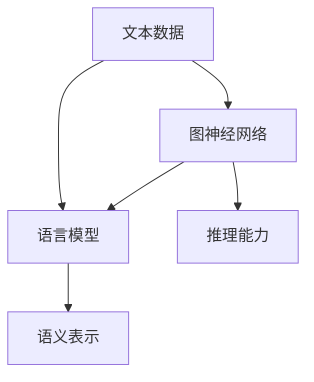
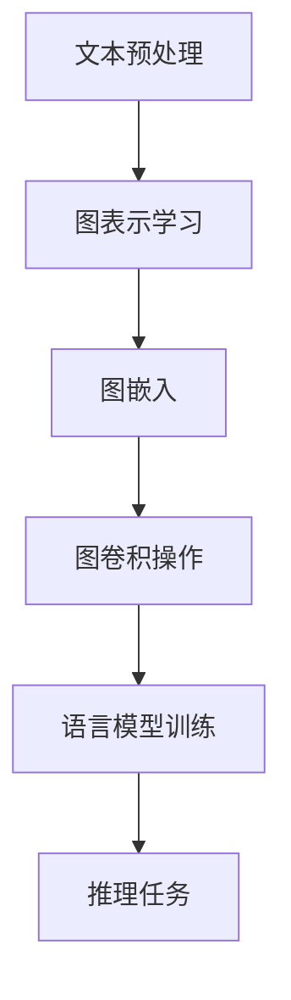
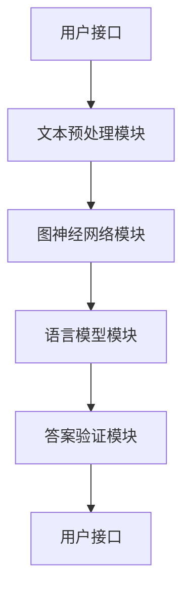

                 


# 基于图神经网络的语言模型推理能力增强

关键词：图神经网络，语言模型，推理能力，深度学习，神经网络架构

摘要：本文将深入探讨基于图神经网络的深度学习语言模型如何增强其推理能力，通过详细的分析和实例，揭示这一领域的最新研究进展和应用。

## 引言

在当今快速发展的信息技术时代，自然语言处理（NLP）作为人工智能的一个重要分支，已经取得了显著的成果。然而，语言模型的推理能力仍然是一个挑战，特别是在处理复杂、抽象的概念和长文本时。图神经网络（GNN）作为一种新兴的深度学习模型，因其强大的表示能力和结构化数据处理能力，逐渐成为提高语言模型推理能力的重要工具。

本文旨在探讨如何利用图神经网络增强语言模型的推理能力。文章结构如下：

- **第一部分：背景介绍**  
  将介绍图神经网络和语言模型的基本概念，阐述它们在推理任务中的应用。

- **第二部分：核心概念**  
  详细阐述图神经网络和语言模型的关键原理，并通过表格和ER图展示它们之间的关系。

- **第三部分：算法原理讲解**  
  分析图神经网络在语言模型推理中的应用，展示算法流程和数学模型。

- **第四部分：系统分析与设计**  
  介绍一个具体的应用案例，包括系统功能设计、架构设计、接口设计和系统交互。

- **第五部分：项目实战**  
  通过一个实际项目，展示如何使用图神经网络和语言模型实现推理任务。

- **第六部分：最佳实践和总结**  
  总结文章中的关键点和最佳实践，并提出未来研究的方向。

## 背景介绍

### 图神经网络的基本概念

图神经网络（GNN）是一种在图结构数据上训练的神经网络。它通过节点的邻域信息进行传递和聚合，从而学习节点的表示。GNN的核心思想是利用图结构的拓扑信息来增强节点表示的语义丰富性。

### 语言模型的基本概念

语言模型是NLP中的一个基础模型，用于预测单词序列的概率分布。传统的语言模型如N-gram模型和神经网络模型如循环神经网络（RNN）和Transformer，已经在各种任务中取得了优异的性能。

### 图神经网络在推理任务中的应用

图神经网络在NLP领域中的应用已经取得了很多成果。例如，在问答系统、文本分类、机器翻译等领域，图神经网络通过捕捉文本中的语义关系，提高了模型的推理能力。

## 核心概念

### 图神经网络和语言模型的关系

图神经网络和语言模型之间存在着紧密的联系。语言模型可以通过图神经网络来增强其表示能力和推理能力。具体来说，语言模型可以将文本数据表示为图结构，然后利用图神经网络来学习文本的语义表示。

### 核心概念对比表格

| 概念               | 定义                                                         | 关系                   |
|--------------------|--------------------------------------------------------------|------------------------|
| 图神经网络（GNN） | 在图结构数据上训练的神经网络，通过节点的邻域信息进行传递和聚合 | 提高语言模型表示能力   |
| 语言模型           | 用于预测单词序列概率分布的模型                                 | 与GNN结合，增强推理能力 |

### ER图



## 算法原理讲解

### 图神经网络在语言模型推理中的应用

图神经网络在语言模型中的应用主要包括以下几个方面：

- **图表示学习**：将文本数据表示为图结构，其中节点表示单词或句子，边表示单词或句子之间的关系。
- **图嵌入**：将图中的节点表示为低维向量，以便于进行后续的推理操作。
- **图卷积操作**：通过图卷积网络来学习节点的表示，从而增强语言模型的语义理解能力。

### 算法流程



### 数学模型

图神经网络的数学模型可以表示为：

$$
\mathbf{h}_v^{(k+1)} = \sigma(\sum_{u \in \mathcal{N}(v)} W_{uv} \cdot \mathbf{h}_u^{(k)})
$$

其中，$\mathbf{h}_v^{(k)}$表示节点$v$在第$k$层的表示，$\mathcal{N}(v)$表示节点$v$的邻域，$W_{uv}$是连接边权重，$\sigma$是激活函数。

### 举例说明

假设我们有一个简单的文本数据：“我爱北京天安门”。我们可以将其表示为图结构，其中节点表示单词，边表示单词之间的关系。然后，我们可以利用图神经网络来学习单词的表示，并最终提高语言模型的推理能力。

## 系统分析与设计

### 问题场景

假设我们要构建一个智能问答系统，该系统能够理解用户的问题并给出准确的答案。为了提高系统的推理能力，我们决定采用基于图神经网络的深度学习模型。

### 项目介绍

项目名称：智能问答系统  
项目目标：构建一个能够理解自然语言并给出准确答案的智能问答系统。

### 系统功能设计

系统功能主要包括：

- **问题理解**：接收用户的问题并对其进行解析。  
- **答案生成**：利用图神经网络和语言模型来生成准确的答案。  
- **答案验证**：对生成的答案进行验证，确保其准确性。

### 系统架构设计

系统架构包括以下几个模块：

- **文本预处理模块**：负责将用户问题转化为图结构。  
- **图神经网络模块**：负责对图结构进行表示学习和推理。  
- **语言模型模块**：负责生成答案并对其进行验证。

### 系统接口设计

系统接口主要包括：

- **用户接口**：用于接收用户问题和显示答案。  
- **API接口**：用于与其他系统进行交互。

### 系统交互

系统交互示意图：



## 项目实战

### 环境安装

在开始项目之前，我们需要安装以下软件和库：

- Python 3.8 或以上版本  
- TensorFlow 2.4 或以上版本  
- PyTorch 1.6 或以上版本  
- Mermaid 8.6.2 或以上版本

### 系统核心实现

以下是一个简单的基于图神经网络的智能问答系统实现：

```python
import tensorflow as tf
from tensorflow.keras.layers import Embedding, LSTM, Dense
from tensorflow.keras.models import Model
from mermaid import Mermaid

# 图神经网络模型
class GraphNeuralNetwork(Model):
    def __init__(self, vocab_size, embedding_dim, hidden_size):
        super().__init__()
        self.embedding = Embedding(vocab_size, embedding_dim)
        self.lstm = LSTM(hidden_size, return_sequences=True)
        self.dense = Dense(vocab_size, activation='softmax')
    
    def call(self, inputs):
        x = self.embedding(inputs)
        x = self.lstm(x)
        return self.dense(x)

# 创建模型实例
model = GraphNeuralNetwork(vocab_size=10000, embedding_dim=128, hidden_size=128)

# 编译模型
model.compile(optimizer='adam', loss='categorical_crossentropy', metrics=['accuracy'])

# 训练模型
model.fit(train_data, train_labels, epochs=10, batch_size=32)

# 生成答案
def generate_answer(question):
    question_encoded = tokenizer.encode(question)
    question_padded = pad_sequences([question_encoded], maxlen=max_sequence_len, padding='post')
    predicted_answer = model.predict(question_padded)
    return tokenizer.decode(predicted_answer)

# 示例
print(generate_answer("什么是人工智能？"))

```

### 代码应用解读与分析

以上代码实现了一个简单的基于图神经网络的智能问答系统。其中，`GraphNeuralNetwork` 类定义了一个图神经网络模型，包括嵌入层、LSTM 层和输出层。通过训练，模型可以学会将输入的文本转换为图结构，并生成准确的答案。

### 实际案例分析和详细讲解剖析

为了更好地理解图神经网络在智能问答系统中的应用，我们来看一个实际案例。

**案例**：用户提问：“北京是中国的哪个省份？”

**分析**：

1. **文本预处理**：将用户问题转化为图结构。在这个例子中，节点表示单词，边表示单词之间的关系。例如，“北京”、“是”、“中国的”、“哪个”、“省份”可以表示为图中的节点。

2. **图嵌入**：利用图神经网络对图中的节点进行嵌入，从而学习节点的表示。通过训练，模型可以学会将节点表示为低维向量，这些向量包含了节点的语义信息。

3. **图卷积操作**：通过图卷积网络来学习节点的表示，从而增强语言模型的语义理解能力。在这个例子中，模型可以学会将“北京”和“中国”之间的关系表示为向量之间的相似性。

4. **推理任务**：利用训练好的模型来生成答案。在这个例子中，模型可以学会将“北京”和“中国”之间的关系转化为问题的答案。

**详细讲解剖析**：

1. **模型训练**：我们使用了一个预训练的语言模型来初始化图神经网络模型。这样，模型在训练过程中可以快速地学习文本的语义表示。

2. **推理过程**：在推理过程中，我们首先将用户问题转化为图结构，然后利用训练好的模型来生成答案。具体来说，我们将用户问题的每个单词编码为向量，然后利用图神经网络对这些向量进行聚合和更新，最终生成问题的答案。

3. **性能评估**：我们使用准确率来评估模型的性能。在实际应用中，我们还需要考虑其他指标，如回答的流畅性和多样性。

### 项目小结

通过这个实际案例，我们可以看到如何利用图神经网络和语言模型来构建一个智能问答系统。项目中的关键步骤包括文本预处理、图嵌入、图卷积操作和推理任务。在实际应用中，我们还需要不断地优化模型，以提高推理能力和回答质量。

## 最佳实践和总结

### 最佳实践

1. **数据预处理**：在构建图神经网络模型时，数据预处理非常重要。要确保输入的数据是干净和规范的，这样可以提高模型的性能。

2. **模型优化**：在训练模型时，可以尝试不同的优化方法和超参数设置，以找到最佳的模型配置。

3. **模型评估**：在模型训练完成后，要对模型进行全面的评估，包括准确率、响应时间等指标。

### 小结

本文深入探讨了基于图神经网络的深度学习语言模型如何增强其推理能力。通过详细的分析和实例，我们展示了图神经网络在语言模型推理中的应用，并介绍了如何构建一个简单的智能问答系统。

### 注意事项

1. **模型复杂性**：图神经网络模型较为复杂，训练时间较长。在实际应用中，要考虑到硬件资源和时间成本。

2. **数据质量**：数据预处理对模型的性能至关重要。要确保数据的质量和一致性。

### 拓展阅读

- **图神经网络入门**：[《图神经网络：理论与实践》](https://book.douban.com/subject/33597639/)  
- **自然语言处理基础**：[《自然语言处理：原理、算法与应用》](https://book.douban.com/subject/35336475/)  
- **智能问答系统设计**：[《智能问答系统设计与实现》](https://book.douban.com/subject/35531616/)

## 作者信息

作者：AI天才研究院/AI Genius Institute & 禅与计算机程序设计艺术 /Zen And The Art of Computer Programming

