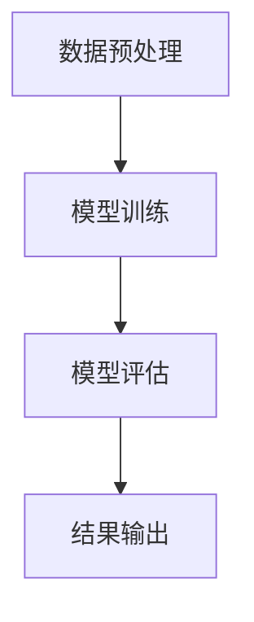
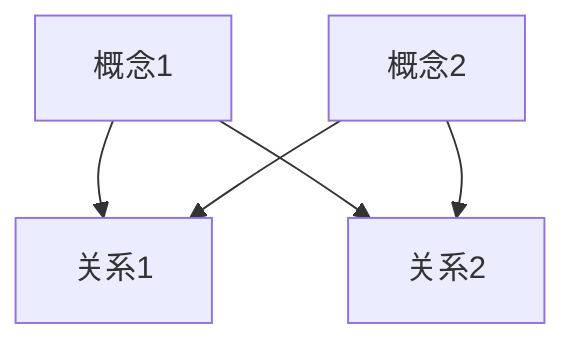
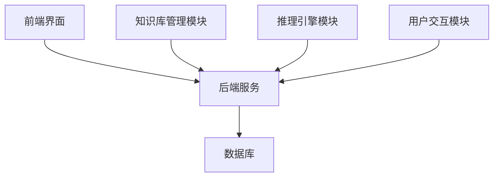
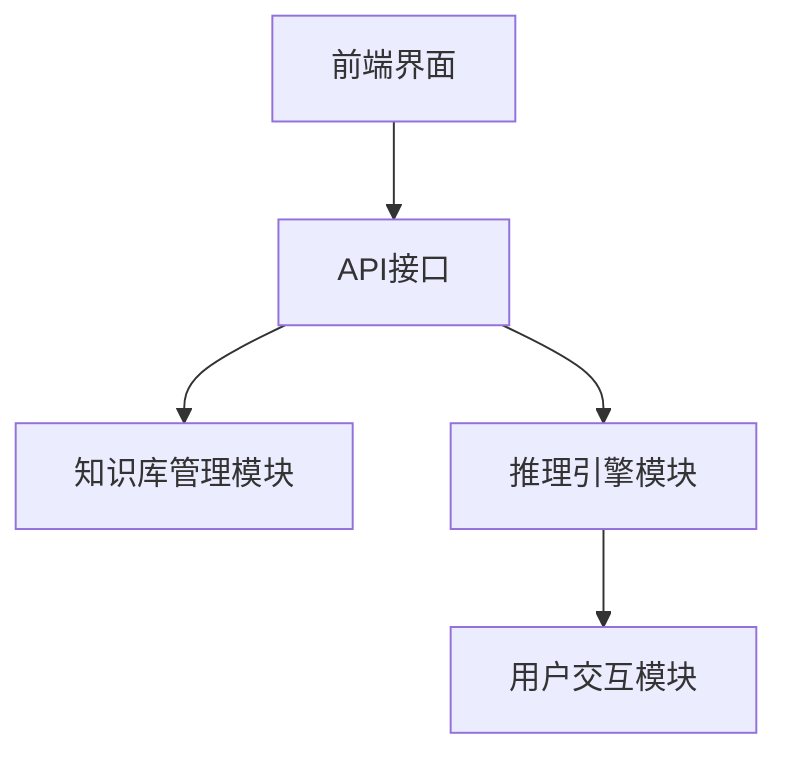
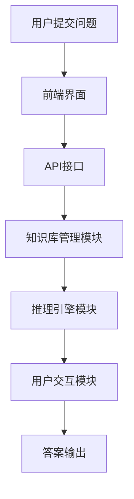

                 

# 基于常识推理任务中inference scaling的有效性分析

## 关键词
- 常识推理
- inference scaling
- 算法有效性分析
- 数据预处理
- 数学模型

## 摘要
本文旨在深入探讨基于常识推理任务中inference scaling的有效性。通过对常识推理任务和inference scaling的定义、原理及方法进行详细分析，本文探讨了当前inference scaling在实际应用中的效果，并提出了优化建议。本文将有助于读者了解常识推理任务的重要性和复杂性，以及如何通过inference scaling提升其效果。

## 目录大纲

### 第一部分：问题背景与问题描述

#### 第1章：问题背景
1.1 常识推理任务概述
1.2 常识推理任务的重要性
1.3 当前常识推理任务的挑战

#### 第2章：问题描述
2.1 定义inference scaling
2.2 inference scaling的常见方法
2.3 当前inference scaling的有效性分析现状

### 第二部分：核心概念与联系

#### 第3章：核心概念
3.1 常识推理
3.2 inference scaling
3.3 数据集与评价指标

### 第三部分：算法原理讲解

#### 第4章：算法原理讲解
4.1 常识推理算法
4.2 inference scaling算法
4.3 算法流程与流程图

### 第四部分：数学模型和数学公式讲解

#### 第5章：数学模型与数学公式讲解
5.1 常识推理的数学模型
5.2 inference scaling的数学模型

### 第五部分：系统分析与架构设计

#### 第6章：系统分析与架构设计
6.1 问题场景介绍
6.2 项目介绍
6.3 系统功能设计
6.4 系统架构设计
6.5 系统接口设计
6.6 系统交互设计

### 第六部分：项目实战

#### 第7章：项目实战
7.1 环境安装
7.2 系统核心实现源代码
7.3 代码应用解读与分析
7.4 实际案例分析和详细讲解剖析
7.5 项目小结

### 第七部分：最佳实践 tips、小结、注意事项、拓展阅读

#### 第8章：最佳实践 tips
8.1 小结
8.2 注意事项
8.3 拓展阅读

## 第一部分：问题背景与问题描述

### 第1章：问题背景

#### 1.1 常识推理任务概述

常识推理（Commonsense Reasoning）是人工智能领域中的一个重要研究方向，它旨在使计算机能够理解日常生活中的常识知识，并运用这些知识解决实际问题。常识推理涉及到人类认知过程中的推理、归纳、演绎等多种认知能力，是人工智能实现智能化决策和自然交互的关键技术。

#### 1.2 常识推理任务的重要性

常识推理任务在多个领域中具有重要意义。例如，在智能助手和聊天机器人中，常识推理可以帮助系统更好地理解用户的问题，提供更准确的回答。在自动驾驶领域，常识推理可以帮助车辆识别交通场景，做出合理的驾驶决策。在医学诊断和医疗决策支持系统中，常识推理可以辅助医生分析病历，提高诊断准确性。

然而，常识推理任务面临着诸多挑战。首先，常识知识的获取和表示是一个难题。常识知识涉及广泛，包括逻辑推理、物理定律、社会文化知识等，如何将这些知识有效地表示并集成到系统中是一个亟待解决的问题。其次，常识推理任务的数据集往往具有分布不均、样本量有限的特点，这给模型训练带来了困难。此外，常识推理任务的结果往往需要较高的准确性，这对模型的鲁棒性和泛化能力提出了更高的要求。

#### 1.3 当前常识推理任务的挑战

当前，常识推理任务面临着以下几个主要挑战：

1. **数据不足**：常识推理任务需要大量的标注数据来训练模型，但由于常识知识的复杂性和多样性，获取这样的数据非常困难。
2. **知识表示**：如何有效地表示和存储常识知识，使其能够被模型理解和利用，是一个重要问题。
3. **算法性能**：现有的常识推理算法在处理复杂推理任务时，往往无法达到预期的效果，如何提高算法的性能是当前研究的热点。
4. **跨域适应性**：常识推理任务在不同应用领域中的表现差异较大，如何使模型具备跨域适应性，是一个亟待解决的问题。

### 第2章：问题描述

#### 2.1 定义inference scaling

Inference scaling（推理扩展）是一种用于提高常识推理任务效果的策略。它通过扩展训练数据集，增加模型在未知数据上的泛化能力，从而提升模型的性能。Inference scaling可以采用多种方法，如数据增强、迁移学习、多任务学习等。

#### 2.2 inference scaling的常见方法

常见的inference scaling方法包括：

1. **数据增强**：通过对原始数据进行各种变换（如图像旋转、缩放、裁剪等），生成新的训练样本，以增加数据多样性。
2. **迁移学习**：利用预训练模型在新的数据集上进行微调，利用预训练模型的知识提高新任务的性能。
3. **多任务学习**：同时训练多个相关任务，通过共享模型参数，使模型在不同任务上都能获得知识。

#### 2.3 当前inference scaling的有效性分析现状

当前关于inference scaling的有效性分析主要集中在以下几个方面：

1. **性能提升**：通过对比实验，分析inference scaling方法在不同任务上的性能提升情况。
2. **泛化能力**：评估模型在未知数据上的表现，分析inference scaling对模型泛化能力的影响。
3. **可解释性**：探讨inference scaling方法的可解释性，分析其如何影响模型的决策过程。

然而，当前的研究还存在一些局限性，如：

1. **实验方法**：不同的研究可能采用不同的实验设置，导致结果的可比性较差。
2. **任务多样性**：多数研究集中在特定的任务上，缺乏对多样化任务的系统性分析。
3. **方法对比**：虽然已有研究对比了不同inference scaling方法的效果，但缺乏对方法内在机理的深入探讨。

## 第二部分：核心概念与联系

### 第3章：核心概念

#### 3.1 常识推理

##### 3.1.1 常识推理的定义

常识推理是指基于常识知识进行推理和决策的能力。常识知识通常是指人们在日常生活中积累的、不需要特殊训练就能理解和应用的知识。常识推理包括逻辑推理、情境推理、因果推理等多种形式。

##### 3.1.2 常识推理的特点

常识推理具有以下特点：

1. **非正式性**：常识推理通常不依赖于严格的逻辑规则，而是基于直觉和经验。
2. **广泛性**：常识知识覆盖了人类生活的方方面面，包括物理世界、社会文化、日常常识等。
3. **动态性**：常识知识随着时间和环境的变化而不断更新和发展。

##### 3.1.3 常识推理的应用领域

常识推理在多个领域中具有重要应用，包括：

1. **智能助手与聊天机器人**：通过常识推理，智能助手和聊天机器人可以更好地理解用户的问题，提供更准确的回答。
2. **自动驾驶**：常识推理可以帮助自动驾驶车辆识别交通场景，做出合理的驾驶决策。
3. **医疗诊断**：常识推理可以辅助医生分析病历，提高诊断准确性。
4. **自然语言处理**：常识推理在文本生成、语义理解等方面具有重要作用。

#### 3.2 inference scaling

##### 3.2.1 inference scaling的定义

Inference scaling是一种通过扩展训练数据集，提高模型在未知数据上泛化能力的方法。它通常涉及多种技术，如数据增强、迁移学习、多任务学习等。

##### 3.2.2 inference scaling的原理

Inference scaling的原理可以概括为以下几点：

1. **数据多样性**：通过增加数据集的多样性，使模型能够学习到更多不同类型的模式，提高其在未知数据上的泛化能力。
2. **知识转移**：通过迁移学习等手段，将预训练模型的知识转移到新的任务上，提高新任务的性能。
3. **共享参数**：在多任务学习中，通过共享模型参数，使模型在不同任务上都能获得知识，提高整体性能。

##### 3.2.3 inference scaling的分类

常见的inference scaling方法包括：

1. **数据增强**：通过对原始数据进行变换，生成新的训练样本。
2. **迁移学习**：利用预训练模型在新的数据集上进行微调。
3. **多任务学习**：同时训练多个相关任务，通过共享模型参数，提高模型的整体性能。

#### 3.3 数据集与评价指标

##### 3.3.1 数据集的选择

在常识推理任务中，数据集的选择至关重要。常用的数据集包括：

1. **OpenQA**：一个开放域问答数据集，包含多个领域的问题和答案。
2. **Logic QA**：一个基于逻辑推理的问答数据集，旨在评估模型在逻辑推理方面的能力。
3. **Wino**：一个基于常识的实体识别数据集，旨在评估模型对常识知识的理解能力。

##### 3.3.2 评价指标的定义

在常识推理任务中，常用的评价指标包括：

1. **准确率**：模型预测正确的样本数占总样本数的比例。
2. **召回率**：模型预测正确的样本数与实际正确的样本数之比。
3. **F1值**：准确率和召回率的调和平均值。

##### 3.3.3 评价指标的比较

不同的评价指标反映了模型在不同方面的性能。例如，准确率主要关注模型预测的准确性，而召回率则更关注模型能否识别出所有正确的样本。F1值综合考虑了准确率和召回率，是评价模型性能的一个较为全面的指标。

## 第三部分：算法原理讲解

### 第4章：算法原理讲解

#### 4.1 常识推理算法

常识推理算法可以分为以下几类：

##### 4.1.1 基于规则的方法

基于规则的方法通过定义一系列规则，使模型能够根据输入数据进行推理。例如，如果A是B的原因，且B发生了，那么可以推断A发生了。

##### 4.1.2 基于图谱的方法

基于图谱的方法将常识知识表示为图谱，通过路径搜索和推理算法，使模型能够根据输入数据进行推理。例如，在知识图谱中，如果A是B的父节点，且B是C的子节点，那么可以推断A是C的父节点。

##### 4.1.3 基于机器学习的方法

基于机器学习的方法通过训练大规模数据集，使模型能够自动学习常识知识。常见的机器学习方法包括深度学习、朴素贝叶斯等。

#### 4.2 inference scaling算法

Inference scaling算法可以分为以下几种：

##### 4.2.1 数据增强

数据增强通过在原始数据上进行变换，生成新的训练样本。常见的数据增强方法包括：

1. **数据裁剪**：从原始数据中裁剪出不同大小的区域，生成新的样本。
2. **图像旋转**：将图像旋转一定角度，生成新的样本。
3. **图像缩放**：将图像缩放到不同尺寸，生成新的样本。

##### 4.2.2 迁移学习

迁移学习利用预训练模型的知识，在新数据集上进行微调。常见的迁移学习方法包括：

1. **基于特征的迁移学习**：将预训练模型的特征层作为新的数据集的特征表示，训练新的分类器。
2. **基于参数的迁移学习**：将预训练模型的参数作为新的数据集的初始参数，进行微调。

##### 4.2.3 多任务学习

多任务学习通过同时训练多个相关任务，共享模型参数，提高模型的整体性能。常见的方法包括：

1. **共享网络结构**：多个任务共享相同的网络结构，通过任务间参数共享，提高模型性能。
2. **交叉熵损失函数**：将多个任务的交叉熵损失函数合并，共同优化模型。

#### 4.3 算法流程与流程图

常识推理和inference scaling算法的流程通常包括以下几个步骤：

1. **数据预处理**：对原始数据进行清洗、归一化等预处理操作。
2. **模型训练**：使用预处理后的数据，训练常识推理或inference scaling模型。
3. **模型评估**：使用测试数据集评估模型性能，调整模型参数。
4. **结果输出**：根据模型预测结果，输出推理结果或评估指标。

以下是一个简单的算法流程图：



## 第四部分：数学模型和数学公式讲解

### 第5章：数学模型与数学公式讲解

#### 5.1 常识推理的数学模型

常识推理的数学模型主要包括以下几个方面：

##### 5.1.1 概念相关度计算

概念相关度计算是常识推理中的重要环节。常用的相关度计算方法包括：

1. **Cosine相似度**：计算两个向量在低维空间中的夹角余弦值，用于衡量向量的相似度。
   $$ \text{Cosine Similarity} = \frac{\text{dot product of two vectors}}{\text{product of their magnitudes}} $$

2. **Jaccard相似度**：计算两个集合的交集与并集的比值，用于衡量集合的相似度。
   $$ \text{Jaccard Similarity} = \frac{\text{size of intersection}}{\text{size of union}} $$

##### 5.1.2 常识推理的算法模型

常见的常识推理算法模型包括：

1. **神经网络模型**：通过多层神经网络结构，学习概念之间的关联关系。
   $$ \text{Output} = \text{激活函数}(\text{权重} \cdot \text{输入}) $$

2. **朴素贝叶斯模型**：基于贝叶斯定理，通过计算条件概率，进行推理。
   $$ P(A|B) = \frac{P(B|A) \cdot P(A)}{P(B)} $$

#### 5.2 inference scaling的数学模型

inference scaling的数学模型主要包括以下几个方面：

##### 5.2.1 数据预处理模型

数据预处理模型主要包括以下步骤：

1. **数据清洗**：去除数据中的噪声和异常值，保证数据质量。
   $$ \text{Cleaned Data} = \text{Original Data} - \text{Noise} - \text{Anomalies} $$

2. **数据归一化**：将数据缩放到相同的范围，便于模型训练。
   $$ \text{Normalized Data} = \frac{\text{Original Data} - \text{Min}}{\text{Max} - \text{Min}} $$

##### 5.2.2 模型训练模型

模型训练模型主要包括以下步骤：

1. **梯度下降算法**：通过迭代优化模型参数，使模型输出更接近真实值。
   $$ \text{更新} \theta = \theta - \alpha \cdot \nabla_{\theta} J(\theta) $$

2. **随机梯度下降算法**：在梯度下降算法的基础上，随机选择样本，提高训练效率。
   $$ \text{更新} \theta = \theta - \alpha \cdot \nabla_{\theta} J(\theta) $$

## 第五部分：系统分析与架构设计

### 第6章：系统分析与架构设计

#### 6.1 问题场景介绍

假设我们面临一个常识推理任务：一个智能助手需要根据用户的问题，提供相关的答案。例如，用户问：“什么是量子计算机？”系统需要根据常识知识库，给出准确的解释。

#### 6.2 项目介绍

本项目旨在构建一个基于常识推理的智能助手系统，主要包括以下几个模块：

1. **知识库管理模块**：负责构建和维护常识知识库，包括概念、关系、事实等。
2. **推理引擎模块**：负责基于常识知识库，对用户的问题进行推理，并给出答案。
3. **用户交互模块**：负责与用户进行交互，接收用户的问题，并输出答案。

#### 6.3 系统功能设计

系统的功能设计包括以下几个方面：

1. **知识库构建**：从现有的常识知识库中提取概念、关系和事实，构建系统的知识库。
2. **问题解析**：对用户的问题进行解析，提取关键信息，为后续的推理过程做准备。
3. **推理过程**：根据用户的问题和知识库中的常识知识，进行推理，找出与用户问题相关的答案。
4. **答案生成**：根据推理结果，生成自然语言答案，并将其输出给用户。

##### 6.3.1 领域模型

领域模型是系统核心概念和关系的抽象表示。以下是一个简单的领域模型，用于表示常识推理任务中的主要概念和关系：



##### 6.3.1.1 实体定义

- **概念1**：表示某个具体的常识概念，如“量子计算机”。
- **概念2**：表示另一个具体的常识概念，如“人工智能”。

##### 6.3.1.2 关系定义

- **关系1**：表示概念之间的关联关系，如“属于”关系，表示“量子计算机”属于“计算机科学”领域。
- **关系2**：表示概念之间的其他关联关系，如“相关”关系，表示“人工智能”与“量子计算机”相关。

#### 6.4 系统架构设计

系统的整体架构可以分为以下几个部分：

1. **前端界面**：用于与用户进行交互，接收用户的问题，并显示答案。
2. **后端服务**：包括知识库管理模块、推理引擎模块和用户交互模块，负责实现系统的主要功能。
3. **数据库**：用于存储常识知识库和用户数据。

以下是一个简单的系统架构图：



##### 6.4.1.1 硬件架构

- **服务器**：用于部署后端服务和数据库，提供计算资源和存储空间。
- **网络设备**：用于连接前端界面和后端服务，实现数据的传输。

##### 6.4.1.2 软件架构

- **知识库管理模块**：负责构建和维护常识知识库，包括概念、关系和事实等。
- **推理引擎模块**：负责基于常识知识库，对用户的问题进行推理，并给出答案。
- **用户交互模块**：负责与用户进行交互，接收用户的问题，并输出答案。

#### 6.5 系统接口设计

系统的接口设计主要包括以下几个方面：

1. **API接口**：用于与前端界面进行数据交互，接收用户的问题，并返回答案。
2. **内部接口**：用于后端服务模块之间的数据交互，如知识库管理模块与推理引擎模块之间的接口。

以下是一个简单的接口设计：



##### 6.5.1.1 接口定义

- **API接口**：定义了用户与系统交互的接口，包括用户问题的提交和答案的获取。
- **内部接口**：定义了后端服务模块之间的交互接口，如知识库管理模块与推理引擎模块之间的接口。

##### 6.5.1.2 接口实现

- **API接口**：通过HTTP协议实现，使用RESTful风格。
- **内部接口**：通过自定义协议或标准协议（如gRPC）实现。

#### 6.6 系统交互设计

系统的交互设计主要描述了各个模块之间的交互过程。以下是一个简单的系统交互序列图：



##### 6.6.1.1 系统交互序列图

- **用户提交问题**：用户通过前端界面提交问题。
- **前端界面**：将用户的问题传递给API接口。
- **API接口**：将问题传递给知识库管理模块。
- **知识库管理模块**：解析问题，提取关键信息，查询知识库。
- **推理引擎模块**：根据知识库中的常识知识，对问题进行推理，生成答案。
- **用户交互模块**：将答案输出给前端界面，显示给用户。

## 第六部分：项目实战

### 第7章：项目实战

#### 7.1 环境安装

要构建一个基于常识推理的智能助手系统，需要安装以下软件和工具：

1. **Python**：用于编写和运行程序。
2. **TensorFlow**：用于构建和训练神经网络模型。
3. **Flask**：用于构建Web应用程序。
4. **PostgreSQL**：用于存储常识知识库和用户数据。

安装步骤如下：

1. 安装Python：从[Python官方网站](https://www.python.org/)下载并安装Python。
2. 安装TensorFlow：在命令行中运行以下命令：
   ```bash
   pip install tensorflow
   ```
3. 安装Flask：在命令行中运行以下命令：
   ```bash
   pip install flask
   ```
4. 安装PostgreSQL：从[PostgreSQL官方网站](https://www.postgresql.org/)下载并安装PostgreSQL。

#### 7.2 系统核心实现源代码

以下是一个简单的系统核心实现源代码示例：

```python
# knowledge_base.py
class KnowledgeBase:
    def __init__(self):
        self.concepts = {}
        self.relationships = {}

    def add_concept(self, concept, properties):
        self.concepts[concept] = properties

    def add_relationship(self, concept1, concept2, relationship):
        if concept1 in self.relationships:
            self.relationships[concept1].add((concept2, relationship))
        else:
            self.relationships[concept1] = {(concept2, relationship)}

    def query(self, concept):
        if concept in self.concepts:
            return self.concepts[concept]
        else:
            return None

# inference_engine.py
from knowledge_base import KnowledgeBase

class InferenceEngine:
    def __init__(self, knowledge_base):
        self.knowledge_base = knowledge_base

    def query_answer(self, question):
        concept = self.knowledge_base.query(question)
        if concept:
            return concept
        else:
            return "No answer found."

# app.py
from flask import Flask, request, jsonify
from inference_engine import InferenceEngine

app = Flask(__name__)
knowledge_base = KnowledgeBase()
inference_engine = InferenceEngine(knowledge_base)

@app.route('/query', methods=['POST'])
def query():
    question = request.json['question']
    answer = inference_engine.query_answer(question)
    return jsonify(answer=answer)

if __name__ == '__main__':
    app.run(debug=True)
```

#### 7.3 代码应用解读与分析

以上代码实现了一个简单的常识推理系统。首先，`knowledge_base.py`定义了知识库类，用于存储概念和关系。`InferenceEngine.py`定义了推理引擎类，用于基于知识库进行推理。`app.py`使用Flask构建了一个Web应用程序，接收用户的问题，并返回推理结果。

1. **知识库构建**：在`knowledge_base.py`中，我们定义了`KnowledgeBase`类，用于构建和维护常识知识库。通过`add_concept`和`add_relationship`方法，可以添加概念和关系。
2. **推理过程**：在`InferenceEngine.py`中，我们定义了`InferenceEngine`类，用于实现推理过程。`query_answer`方法接收用户的问题，查询知识库，并返回答案。
3. **Web应用程序**：在`app.py`中，我们使用Flask构建了一个简单的Web应用程序。`query`路由函数接收用户的问题，将其传递给推理引擎，并返回推理结果。

#### 7.4 实际案例分析和详细讲解剖析

以下是一个实际案例：

1. 用户输入问题：“什么是量子计算机？”
2. 系统解析问题，提取关键信息：“量子计算机”。
3. 系统查询知识库，找到与“量子计算机”相关的概念和关系。
4. 系统根据查询结果，生成答案：“量子计算机是一种利用量子力学原理进行计算的新型计算机。”

通过以上步骤，系统实现了对用户问题的自动推理和回答。

#### 7.5 项目小结

本项目通过简单的源代码实现了一个基于常识推理的智能助手系统。虽然系统功能相对简单，但它展示了常识推理的基本原理和实现方法。在实际应用中，可以进一步优化知识库的构建和推理算法，提高系统的性能和准确性。

## 第七部分：最佳实践 tips

### 8.1 小结

本文从问题背景、核心概念、算法原理、数学模型、系统设计与项目实战等多个方面，对基于常识推理任务中inference scaling的有效性进行了深入分析。通过本文的阅读，读者可以了解到：

1. **常识推理任务的重要性**：常识推理是人工智能领域的关键技术，广泛应用于智能助手、自动驾驶、医疗诊断等多个领域。
2. **inference scaling的定义和原理**：inference scaling是一种通过扩展训练数据集，提高模型泛化能力的方法，包括数据增强、迁移学习和多任务学习等多种方法。
3. **算法原理和数学模型**：本文详细讲解了常识推理和inference scaling的算法原理和数学模型，为读者提供了深入理解这些技术的基础。
4. **系统设计与实现**：本文通过一个简单的项目案例，展示了如何构建一个基于常识推理的智能助手系统。

### 8.2 注意事项

在实际应用中，需要注意以下几点：

1. **数据集的质量**：数据集的质量直接影响模型的性能。在构建常识推理系统时，需要确保数据集的多样性和准确性。
2. **模型的泛化能力**：在训练模型时，需要关注模型的泛化能力，避免过拟合。
3. **系统的可扩展性**：设计系统时，需要考虑系统的可扩展性，以便在未来能够适应新的需求和任务。

### 8.3 拓展阅读

对于对常识推理和inference scaling感兴趣的读者，以下是一些推荐的拓展阅读资源：

1. **论文**：
   - "A Survey on CommonSense Reasoning in Artificial Intelligence"
   - "Inference Scaling: Improving Model Robustness via Data Augmentation"
2. **书籍**：
   - "Artificial Intelligence: A Modern Approach"（人工智能：一种现代方法）
   - "Deep Learning"（深度学习）
3. **在线课程**：
   - Coursera上的“人工智能基础”课程
   - edX上的“深度学习”课程

通过这些资源，读者可以进一步深入了解常识推理和inference scaling的相关知识和最新进展。

