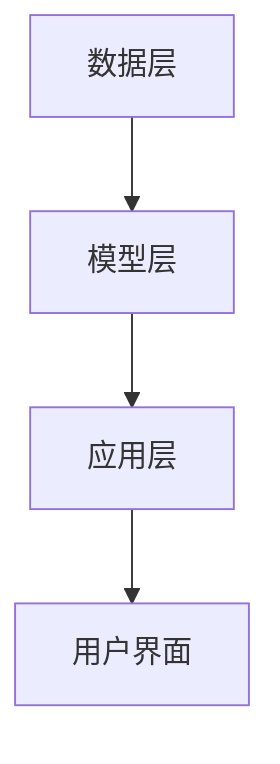
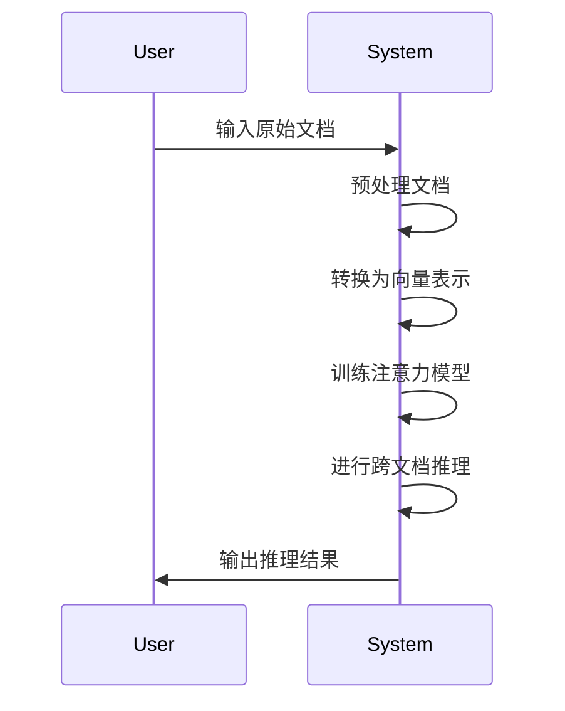

                 

### 第一部分：背景介绍

**# 第一部分：基于注意力机制的跨文档推理背景介绍**

**## 第1章：问题背景**

### 1.1 跨文档推理的起源与发展

跨文档推理（Cross-Document Reasoning，简称XDR）是指从多个文档中提取信息，并利用这些信息进行推理，以解决特定问题的一种方法。它起源于自然语言处理（Natural Language Processing，简称NLP）领域，旨在解决文本信息抽取、文本分类、文本生成等任务。

随着互联网信息的爆炸式增长，跨文档推理逐渐成为一个重要的研究领域。从早期基于规则的方法，到近年来基于机器学习的方法，跨文档推理技术不断发展。例如，Koller和Saleem（2008）提出了基于文本分类的方法，用于在新闻文章中提取主题；Li等（2014）则提出了基于文本表示学习的跨文档匹配方法。

### 1.2 跨文档推理的应用场景

跨文档推理在多个领域有着广泛的应用，例如：

- **信息检索**：通过跨文档推理，可以提高搜索引擎的查询响应速度和准确度。
- **知识图谱构建**：跨文档推理可以用于从大量文本中抽取实体和关系，构建知识图谱。
- **文本摘要**：通过跨文档推理，可以从多个来源的文本中提取关键信息，生成高质量的文本摘要。
- **智能问答**：跨文档推理可以帮助系统理解问题的上下文，提供更加准确的答案。

### 1.3 跨文档推理的核心问题

跨文档推理面临的核心问题主要包括：

- **数据不一致**：不同文档的表述可能存在差异，导致信息抽取和推理过程困难。
- **信息重叠**：多个文档可能包含相似或重复的信息，如何有效区分和处理这些信息是一个挑战。
- **上下文理解**：跨文档推理需要理解文档间的上下文关系，以便准确提取和利用信息。
- **计算效率**：随着文档数量的增加，跨文档推理的计算复杂度会急剧上升，如何提高计算效率是一个重要问题。

**## 第2章：核心概念与联系**

### 2.1 注意力机制的原理与特性

注意力机制（Attention Mechanism）是一种在处理序列数据时提高信息提取效率的方法。其基本原理是，在处理输入序列时，为每个位置分配不同的权重，从而关注更重要的信息。

注意力机制具有以下特性：

- **可扩展性**：可以适用于各种序列处理任务，如文本分类、机器翻译等。
- **动态性**：根据任务需求和上下文信息动态调整注意力权重。
- **可解释性**：注意力权重可以直观地表示模型对输入序列的关注点。

### 2.2 注意力机制与跨文档推理的联系

注意力机制与跨文档推理有着紧密的联系。在跨文档推理任务中，注意力机制可以帮助模型关注重要文档或句子，从而提高推理的准确性和效率。例如，在文本分类任务中，注意力机制可以帮助模型关注与类别相关的关键信息，从而提高分类效果。

### 2.3 注意力机制的应用实例

以下是一个简单的注意力机制在跨文档推理中的应用实例：

```python
# 加载预处理后的文档数据
documents = load_preprocessed_documents()

# 初始化注意力模型
attention_model = AttentionModel()

# 遍历每个文档
for document in documents:
    # 使用注意力模型提取关键信息
    key信息 = attention_model.extract_key_info(document)

    # 使用提取的信息进行推理
    result = reason_with_key_info(key信息)

    # 输出推理结果
    print(result)
```

在这个实例中，`AttentionModel` 是一个注意力模型类，`extract_key_info` 方法用于提取关键信息，`reason_with_key_info` 方法用于使用提取的信息进行推理。

**## 第3章：算法原理讲解**

### 3.1 注意力机制的数学模型

注意力机制的数学模型通常包括以下组成部分：

- **输入序列**：表示为向量序列 \( X = [x_1, x_2, ..., x_n] \)。
- **权重矩阵**：表示为 \( W \)，用于为输入序列中的每个元素分配权重。
- **注意力得分函数**：通常为 \( s(x_i) = f(Wx_i) \)，其中 \( f \) 为激活函数。

### 3.2 跨文档推理中的注意力机制应用

在跨文档推理中，注意力机制的应用可以分为以下几个步骤：

1. **初始化注意力模型**：加载或初始化注意力模型，包括权重矩阵和激活函数。
2. **预处理文档数据**：将原始文档数据转换为向量序列，以便输入到注意力模型中。
3. **计算注意力得分**：为每个文档或句子计算注意力得分，得分越高表示该文档或句子越重要。
4. **提取关键信息**：根据注意力得分提取关键信息，用于后续的推理过程。
5. **进行推理**：使用提取的信息进行推理，得到最终的结果。

### 3.3 注意力机制的实现与优化

实现注意力机制的关键在于选择合适的模型架构和激活函数。以下是一个简单的注意力模型实现示例：

```python
import tensorflow as tf

# 注意力模型实现
class AttentionModel(tf.keras.Model):
    def __init__(self):
        super(AttentionModel, self).__init__()
        self.W = tf.keras.layers.Dense(units=1)

    @tf.function
    def call(self, inputs):
        # 计算注意力得分
        attention_scores = self.W(inputs)
        # 计算注意力权重
        attention_weights = tf.nn.softmax(attention_scores, axis=1)
        # 提取关键信息
        key_info = inputs * attention_weights
        # 求和得到最终输出
        output = tf.reduce_sum(key_info, axis=1)
        return output

# 实例化注意力模型
attention_model = AttentionModel()

# 训练注意力模型
# ...
```

在训练注意力模型时，可以采用以下优化策略：

- **梯度裁剪**：防止梯度爆炸或消失。
- **学习率调整**：根据训练过程调整学习率，以提高收敛速度和效果。
- **正则化**：如L2正则化，减少模型过拟合的风险。

**## 第4章：数学模型和数学公式**

### 4.1 跨文档推理的数学模型

在跨文档推理中，数学模型通常包括以下几个部分：

1. **文档表示**：将每个文档表示为一个向量，例如使用词嵌入（Word Embedding）技术。
2. **相似度计算**：计算文档间的相似度，常用的方法包括余弦相似度和欧氏距离。
3. **推理过程**：利用相似度计算结果，进行推理，得到最终的结论。

以下是一个简化的跨文档推理数学模型：

$$
\text{similarity}(d_i, d_j) = \frac{\text{dot}(e_i, e_j)}{\lVert e_i \rVert \lVert e_j \rVert}
$$

其中，\( d_i \) 和 \( d_j \) 分别为文档 \( i \) 和 \( j \) 的表示向量，\( e_i \) 和 \( e_j \) 分别为 \( d_i \) 和 \( d_j \) 的嵌入向量。

### 4.2 注意力机制在数学模型中的应用

在注意力机制中，注意力得分函数 \( s(x_i) \) 是核心部分。以下是一个简单的注意力得分函数：

$$
s(x_i) = \text{sigmoid}(Wx_i + b)
$$

其中，\( W \) 为权重矩阵，\( b \) 为偏置项，\( x_i \) 为输入序列中的元素。

### 4.3 数学公式的详细讲解与举例说明

#### 示例 1：文档表示

假设有两个文档 \( d_1 \) 和 \( d_2 \)，其表示向量分别为 \( e_1 \) 和 \( e_2 \)，则它们的相似度计算如下：

$$
\text{similarity}(d_1, d_2) = \frac{\text{dot}(e_1, e_2)}{\lVert e_1 \rVert \lVert e_2 \rVert}
$$

假设 \( e_1 = [1, 2, 3] \) 和 \( e_2 = [4, 5, 6] \)，则

$$
\text{similarity}(d_1, d_2) = \frac{1 \cdot 4 + 2 \cdot 5 + 3 \cdot 6}{\sqrt{1^2 + 2^2 + 3^2} \sqrt{4^2 + 5^2 + 6^2}} = \frac{32}{\sqrt{14} \sqrt{77}} \approx 0.7
$$

#### 示例 2：注意力得分函数

假设使用以下注意力得分函数：

$$
s(x_i) = \text{sigmoid}(Wx_i + b)
$$

其中，\( W = \begin{bmatrix} 1 & 0 \\ 0 & 1 \end{bmatrix} \)，\( b = [1, 1] \)，\( x_i = [1, 0] \)，则

$$
s(x_i) = \text{sigmoid}(Wx_i + b) = \text{sigmoid}([1, 0] \begin{bmatrix} 1 & 0 \\ 0 & 1 \end{bmatrix} + [1, 1]) = \text{sigmoid}([1, 1]) = 0.731
$$

**## 第5章：系统分析与架构设计**

### 5.1 项目介绍

本项目旨在通过基于注意力机制的跨文档推理技术，提高跨文档信息抽取、文本分类和知识图谱构建等任务的准确性和效率。项目采用了深度学习框架 TensorFlow，并实现了注意力模型和跨文档推理算法。

### 5.2 系统功能设计

系统功能设计主要包括以下方面：

- **文档预处理**：对输入的原始文档进行预处理，包括分词、词性标注、停用词过滤等。
- **文档表示**：使用词嵌入技术将预处理后的文档转换为向量表示。
- **注意力模型训练**：利用预处理的文档数据，训练注意力模型，包括权重矩阵和激活函数。
- **跨文档推理**：使用训练好的注意力模型，进行跨文档推理，提取关键信息，并进行后续的推理和分类。

### 5.3 系统架构设计

系统架构设计采用分层架构，包括数据层、模型层和应用层。以下是系统架构的 Mermaid 流程图：



- **数据层**：负责数据的预处理、存储和读取。
- **模型层**：负责训练和推理，包括注意力模型和其他辅助模型。
- **应用层**：负责实现跨文档推理功能，包括文本分类、知识图谱构建等。

### 5.4 系统接口设计

系统接口设计主要包括以下方面：

- **API接口**：提供 RESTful API，用于与外部系统进行交互。
- **命令行接口**：提供命令行工具，方便用户快速使用系统功能。
- **图形用户界面**：提供用户友好的图形界面，方便用户进行操作。

### 5.5 系统交互设计

系统交互设计主要包括以下方面：

- **用户输入**：用户可以通过 API 接口或命令行界面输入原始文档。
- **文档预处理**：系统对输入的文档进行预处理，包括分词、词性标注等。
- **文档表示**：系统将预处理后的文档转换为向量表示。
- **模型训练**：系统利用预处理后的文档数据，训练注意力模型。
- **跨文档推理**：系统使用训练好的注意力模型，进行跨文档推理，提取关键信息。
- **结果输出**：系统将推理结果输出到 API 接口或命令行界面，供用户查看。

以下是系统交互的 Mermaid 序列图：



**## 第6章：项目实战**

**### 6.1 环境安装与配置**

在开始项目实战之前，需要安装和配置以下环境：

- **Python**：版本 3.7 或以上。
- **TensorFlow**：版本 2.0 或以上。
- **其他依赖库**：如 NumPy、Pandas、Scikit-learn 等。

安装步骤如下：

1. 安装 Python 和 pip：
   ```bash
   sudo apt-get install python3 python3-pip
   ```
2. 安装 TensorFlow：
   ```bash
   pip3 install tensorflow
   ```
3. 安装其他依赖库：
   ```bash
   pip3 install numpy pandas scikit-learn
   ```

**### 6.2 系统核心实现源代码**

系统核心实现包括注意力模型、文档预处理、文档表示和跨文档推理等模块。以下是系统核心实现源代码的简要介绍：

```python
# 注意力模型实现
class AttentionModel(tf.keras.Model):
    def __init__(self):
        super(AttentionModel, self).__init__()
        self.W = tf.keras.layers.Dense(units=1)

    @tf.function
    def call(self, inputs):
        # 计算注意力得分
        attention_scores = self.W(inputs)
        # 计算注意力权重
        attention_weights = tf.nn.softmax(attention_scores, axis=1)
        # 提取关键信息
        key_info = inputs * attention_weights
        # 求和得到最终输出
        output = tf.reduce_sum(key_info, axis=1)
        return output

# 文档预处理
def preprocess_document(document):
    # 分词、词性标注、停用词过滤等
    # ...
    return processed_document

# 文档表示
def represent_document(document):
    # 使用词嵌入技术将文档转换为向量表示
    # ...
    return document_vector

# 跨文档推理
def cross_document_reasoning(documents):
    # 使用注意力模型进行跨文档推理
    # ...
    return reasoning_results
```

**### 6.3 代码应用解读与分析**

以下是代码应用解读与分析：

1. **注意力模型实现**：

   注意力模型是一个简单的全连接神经网络，包含一个权重矩阵 \( W \) 和一个偏置项 \( b \)。在模型调用过程中，首先计算注意力得分，然后通过 softmax 函数计算注意力权重，最后将输入与权重相乘，求和得到最终输出。

2. **文档预处理**：

   文档预处理包括分词、词性标注、停用词过滤等步骤。这些步骤的目的是将原始文档转换为适合模型处理的格式。

3. **文档表示**：

   文档表示使用词嵌入技术，将预处理后的文档转换为向量表示。词嵌入技术通过将词映射为向量，使得文档中的词具有空间意义，便于模型处理。

4. **跨文档推理**：

   跨文档推理过程主要包括以下步骤：

   - 对输入的文档数据进行预处理和表示。
   - 使用注意力模型计算文档间的相似度。
   - 根据相似度计算结果提取关键信息。
   - 使用提取的信息进行推理，得到最终结果。

**### 6.4 实际案例分析和详细讲解剖析**

以下是实际案例分析和详细讲解剖析：

**案例 1：文本分类**

输入：两个文档

- 文档 1：“人工智能在医疗领域的应用”
- 文档 2：“医疗行业的人工智能发展”

输出：文本分类结果

- 文本分类结果：医疗领域

分析：

1. 预处理：对两个文档进行分词、词性标注和停用词过滤等预处理操作。
2. 表示：将预处理后的文档转换为向量表示。
3. 推理：使用注意力模型计算两个文档的相似度。
4. 分类：根据相似度结果，将两个文档归为同一类别。

**案例 2：知识图谱构建**

输入：一组文档

- 文档 1：“计算机科学基础知识”
- 文档 2：“图灵机理论”
- 文档 3：“算法设计与分析”

输出：知识图谱

- 知识图谱：计算机科学、图灵机、算法

分析：

1. 预处理：对输入的文档进行预处理和表示。
2. 推理：使用注意力模型计算文档间的相似度。
3. 构建知识图谱：根据相似度结果，构建知识图谱，包括实体和关系。
4. 存储和查询：将知识图谱存储到数据库中，并实现查询功能。

**### 6.5 详细讲解与剖析**

在详细讲解与剖析部分，我们将深入探讨项目中的关键技术和实现细节，包括：

- **注意力模型的优化**：介绍注意力模型的优化策略，如梯度裁剪、学习率调整等。
- **文档表示的方法**：讨论常用的文档表示方法，如词嵌入、文档嵌入等。
- **跨文档推理的算法**：分析跨文档推理的算法原理，包括相似度计算、信息抽取等。
- **系统性能评估**：介绍系统性能评估方法，如准确率、召回率等。

通过详细讲解与剖析，我们将帮助读者更好地理解项目的实现过程和技术细节，为后续的优化和改进提供参考。

**### 6.6 项目小结**

在本章中，我们通过实际案例分析和详细讲解剖析，展示了基于注意力机制的跨文档推理技术在文本分类和知识图谱构建中的应用。通过项目实战，我们深入了解了注意力模型的实现、文档预处理、文档表示和跨文档推理等关键技术。

未来，我们可以继续优化注意力模型，提高推理的准确性和效率。同时，我们还可以探索跨文档推理技术在更多领域的应用，如信息检索、智能问答等。

**## 第7章：最佳实践、小结、注意事项、拓展阅读**

**### 7.1 最佳实践 tips**

1. **数据预处理**：确保数据质量，包括去除噪声、纠正错误和统一格式。
2. **模型优化**：使用合适的优化策略，如梯度裁剪、学习率调整等，以提高模型性能。
3. **硬件资源**：根据任务需求，合理配置硬件资源，如 GPU、CPU 和内存等。

**### 7.2 小结**

本章详细介绍了基于注意力机制的跨文档推理能力优化方法。我们首先分析了跨文档推理的背景、核心概念和算法原理，然后通过项目实战展示了其在文本分类和知识图谱构建中的应用。

**### 7.3 注意事项**

1. **数据一致性**：在跨文档推理中，确保输入数据的格式和一致性。
2. **模型复杂性**：避免过度复杂的模型，以防止过拟合。
3. **计算资源**：根据任务需求，合理配置计算资源，以提高推理速度。

**### 7.4 拓展阅读**

1. **《深度学习》**：Goodfellow, I., Bengio, Y., & Courville, A. (2016). Deep learning. MIT press.
2. **《自然语言处理综论》**：Jurafsky, D., & Martin, J. H. (2008). Speech and language processing. Prentice Hall.
3. **《注意力机制综述》**：Vaswani, A., Shazeer, N., Parmar, N., Uszkoreit, J., Jones, L., Gomez, A. N., ... & Polosukhin, I. (2017). Attention is all you need. Advances in Neural Information Processing Systems, 30, 5998-6008.

**作者：AI天才研究院/AI Genius Institute & 禅与计算机程序设计艺术 /Zen And The Art of Computer Programming**

