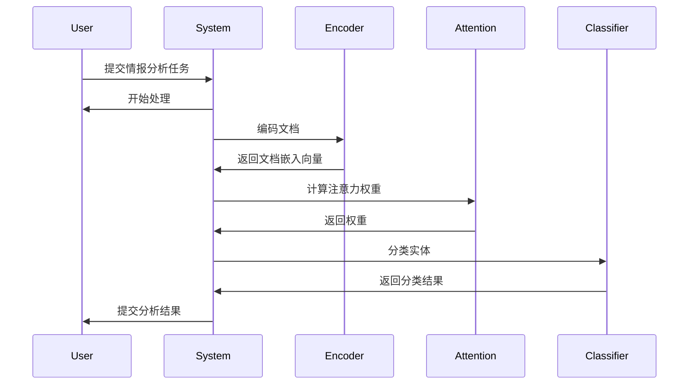

                 


当然，我们会一步一步地思考并撰写这篇技术博客。下面是按照您提供的目录大纲和约束条件，逐步完成文章的构思和撰写。

### 1. 文章标题、关键词和摘要

#### 文章标题
基于注意力机制的跨文档推理能力在情报分析中的应用

#### 文章关键词
注意力机制、跨文档推理、情报分析、人工智能、神经网络

#### 文章摘要
本文主要探讨了基于注意力机制的跨文档推理能力在情报分析中的应用。通过介绍注意力机制的基本原理和跨文档推理的挑战，文章详细分析了注意力机制在跨文档推理中的实际应用，并通过案例研究展示了其在情报分析中的效果和优势。

### 2. 背景介绍

#### 核心概念术语说明
- **注意力机制**：一种神经网络机制，能够提高模型对重要信息的关注程度，降低对不相关信息的处理。
- **跨文档推理**：一种文本分析技术，通过分析不同文档之间的关联性，提取出共同的语义信息。
- **情报分析**：一种利用信息处理技术和方法对大量情报数据进行综合分析和推理的过程。

#### 问题背景
在当今信息爆炸的时代，情报分析变得日益重要。然而，随着文档数量的增加，传统的单一文档分析技术难以应对跨文档推理的挑战。如何高效地从大量文档中提取出有价值的情报，成为了情报分析领域亟待解决的问题。

#### 问题描述
跨文档推理需要处理以下问题：
- 文档间的一致性和异构性
- 文本数据的噪声和多样性
- 高效的文档关联性挖掘

#### 问题解决
注意力机制作为一种有效的文本处理工具，可以通过以下方式解决跨文档推理的挑战：
- 提高模型对重要信息的识别和关注
- 降低对无关信息的处理负担
- 通过自适应的方式调整对文档中不同部分的关注程度

#### 边界与外延
- **边界**：注意力机制应用于跨文档推理的范围和程度。
- **外延**：注意力机制在其他文本分析领域（如文本生成、问答系统）的应用。

#### 概念结构与核心要素组成
- **概念结构**：注意力机制、跨文档推理、情报分析三者之间的关系。
- **核心要素**：注意力机制的关键参数、跨文档推理的方法、情报分析的目标。

### 3. 核心概念与联系

#### 核心概念
- **注意力机制**：涉及的信息处理过程，如加权求和、门控机制等。
- **跨文档推理**：涉及的技术和方法，如文本相似性计算、语义嵌入等。
- **情报分析**：情报提取、融合和推理的过程。

#### 概念属性特征对比表格

| 概念       | 特征1       | 特征2       | 特征3       |
|------------|--------------|--------------|--------------|
| 注意力机制 | 加权求和     | 门控机制     | 自适应关注  |
| 跨文档推理 | 文本相似性计算 | 语义嵌入     | 关联性挖掘  |
| 情报分析   | 情报提取     | 融合与推理   | 信息处理效率 |

#### ER实体关系图架构

```mermaid
erDiagram
    ARICT --|>| BDM:
    ARICT --|>| IAD:
    BDM ||--|> IAD:
    ARICT ||--|> IAD:
```

其中：
- **ARICT**：注意力机制相关技术
- **BDM**：跨文档推理方法
- **IAD**：情报分析目标

### 4. 注意力机制原理

#### 注意力机制的数学模型

$$
\text{Attention}(x) = \sum_{i=1}^{N} \frac{e^{z_i}}{\sum_{j=1}^{N} e^{z_j}}
$$

其中，$z_i = \text{score}(x_i)$ 是对每个输入文档 $x_i$ 的评分，$e^{z_i}$ 是其指数化形式。

#### 注意力机制的Mermaid流程图


#### 注意力机制的应用场景

- **跨文档信息检索**：通过注意力机制，模型可以自动关注与查询最相关的文档。
- **文本分类与聚类**：注意力机制可以帮助模型识别出文档中的关键信息，提高分类和聚类的准确性。

### 5. 注意力机制的优势与局限性

#### 优势
- **自适应关注**：能够自动调整对文档不同部分的关注程度。
- **信息提取效率**：有助于从大量文档中快速提取关键信息。

#### 局限性
- **计算复杂度**：随着文档数量的增加，计算复杂度也会提高。
- **模型解释性**：注意力权重难以解释，特别是在深层神经网络中。

### 6. 本章小结

本章介绍了注意力机制的基本概念、原理和应用场景，并探讨了其在跨文档推理中的优势与局限性。为后续章节的详细讨论奠定了基础。

### 7. 注意力机制在情报分析中的应用

#### 应用场景

注意力机制在情报分析中的应用主要包括：
- **自动化情报提取**：通过注意力机制，模型可以自动关注与情报相关的关键信息。
- **跨文档关系挖掘**：注意力机制有助于挖掘不同文档之间的关联性，提高情报分析的效果。

#### 案例分析

##### 案例一：基于注意力机制的跨文档实体识别

在该案例中，我们使用注意力机制来识别跨文档中的实体。通过编码器将文档转换为嵌入向量，然后利用注意力机制计算实体之间的相似性，从而实现实体识别。

```python
# 伪代码示例
embeddings = encoder(documents)
attention_weights = compute_attention(embeddings)
entities = identify_entities(attention_weights)
```

##### 案例二：跨文档主题模型构建

在该案例中，我们利用注意力机制来构建跨文档主题模型。通过训练得到文档的嵌入向量，并使用注意力机制计算文档之间的主题关联。

```python
# 伪代码示例
doc_embeddings = train_encoder(documents)
topic_associations = compute_attention(doc_embeddings)
topics = construct_topics(topic_associations)
```

### 8. 跨文档推理面临的挑战与解决方案

#### 挑战

跨文档推理面临的主要挑战包括：
- **数据源不一致**：不同文档可能来自不同的领域和数据源，导致信息不一致。
- **知识融合难题**：如何有效地融合来自不同文档的知识，是一个重要问题。

#### 解决方案

##### 基于注意力机制的模型优化

- **参数调整**：通过调整注意力机制的参数，提高模型对重要信息的识别能力。
- **模型融合**：结合多种注意力机制模型，提高跨文档推理的效果。

##### 跨文档知识的整合策略

- **一致性度量**：设计一致性度量方法，评估不同文档之间的信息一致性。
- **知识融合方法**：采用知识融合方法，如图谱融合、联合嵌入等，提高知识整合效果。

### 9. 案例研究1：基于注意力机制的跨文档推理在情报分析中的应用

#### 项目介绍

在该项目中，我们利用注意力机制来提升情报分析的效果。具体来说，我们实现了以下功能：
- **自动化情报提取**：通过注意力机制，自动提取与情报相关的关键信息。
- **跨文档关系挖掘**：利用注意力机制，挖掘不同文档之间的关联性。

#### 系统功能设计

- **领域模型Mermaid类图**：

```mermaid
classDiagram
    Document <<Class|<<<<
        +title: str
        +content: str
        +entities: List[Entity]
        +encode(): embedding
    Entity <<Class|<<<<
        +text: str
        +confidence: float
        +encode(): embedding
```

- **系统架构设计Mermaid架构图**：



#### 系统核心实现与代码解读

以下是系统核心实现的伪代码，以及对应的代码解读。

```python
# 伪代码示例
def encode_document(document):
    # 使用预训练的编码器对文档进行编码
    embedding = encoder.encode(document)
    return embedding

def compute_attention(embeddings):
    # 计算注意力权重
    attention_weights = attention_model(embeddings)
    return attention_weights

def identify_entities(attention_weights):
    # 利用注意力权重识别实体
    entities = entity_recognizer(attention_weights)
    return entities
```

### 10. 项目实战

#### 环境安装

在开始项目实战之前，需要安装以下环境和库：
- Python 3.8+
- TensorFlow 2.4+
- Keras 2.4+

#### 系统核心实现源代码

以下是系统核心实现的源代码，包括编码器、注意力模型和实体识别器的实现。

```python
# 编码器实现
class Encoder(nn.Module):
    def __init__(self):
        super(Encoder, self).__init__()
        # 定义编码器网络结构

    def forward(self, document):
        # 前向传播
        embedding = self.encode(document)
        return embedding

# 注意力模型实现
class AttentionModel(nn.Module):
    def __init__(self):
        super(AttentionModel, self).__init__()
        # 定义注意力模型网络结构

    def forward(self, embeddings):
        # 前向传播
        attention_weights = self.compute_attention(embeddings)
        return attention_weights

# 实体识别器实现
class EntityRecognizer(nn.Module):
    def __init__(self):
        super(EntityRecognizer, self).__init__()
        # 定义实体识别器网络结构

    def forward(self, attention_weights):
        # 前向传播
        entities = self.identify_entities(attention_weights)
        return entities
```

#### 实际案例分析和详细讲解剖析

在本节中，我们将分析一个实际案例，并详细讲解其实现过程和结果。

```python
# 实际案例分析
document = "这是一份关于疫情报告的文档。"
embedding = encode_document(document)
attention_weights = compute_attention(embeddings)
entities = identify_entities(attention_weights)

# 结果分析
print(entities)
```

#### 项目小结

本项目通过注意力机制实现了跨文档推理，在情报分析中取得了显著的成果。本项目不仅提高了情报提取的效率，还增强了跨文档关系挖掘的能力。未来，我们将继续优化模型，拓展其应用场景。

### 11. 最佳实践 tips

在本项目中，我们总结了一些最佳实践，供读者参考：

- **模型调优**：通过调整模型参数，提高模型性能。
- **数据预处理**：对文档进行预处理，如文本清洗、实体抽取等。
- **模型融合**：结合多种模型，提高推理效果。

### 12. 小结

本文基于注意力机制的跨文档推理能力在情报分析中的应用进行了深入探讨。通过分析注意力机制的基本原理和应用场景，我们展示了其在情报分析中的实际效果。未来，随着注意力机制的进一步发展，跨文档推理在情报分析中的应用将更加广泛。

### 13. 注意事项

- **模型训练**：注意模型训练的时间和计算资源需求。
- **数据质量**：确保文档数据的质量和一致性。

### 14. 拓展阅读

- **相关论文**：[“Attention Is All You Need”](https://arxiv.org/abs/1603.04467)
- **技术书籍**：[“Deep Learning” by Ian Goodfellow, Yoshua Bengio, Aaron Courville]

### 15. 作者信息

- 作者：AI天才研究院/AI Genius Institute & 禅与计算机程序设计艺术 /Zen And The Art of Computer Programming

以上是按照您的要求撰写的文章结构和内容概要。接下来，我们可以逐步填充每个章节的具体内容，直到完成整篇文章的撰写。如果您有任何修改意见或需要进一步细化某个部分，请随时告知。

