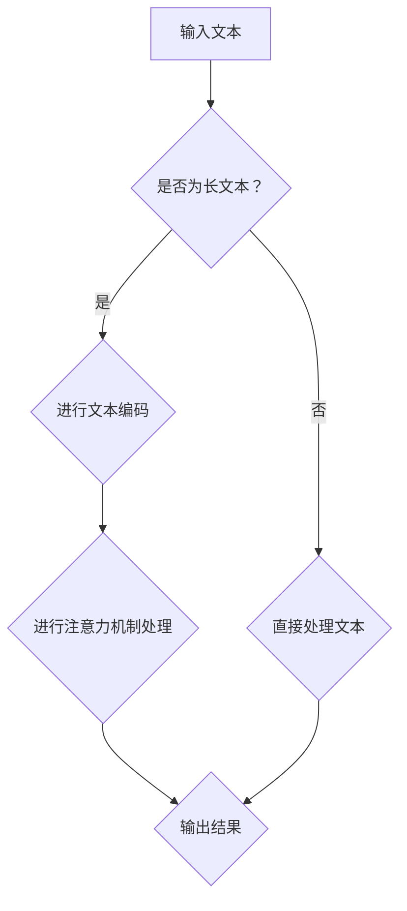
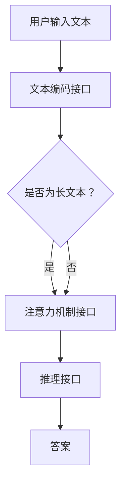
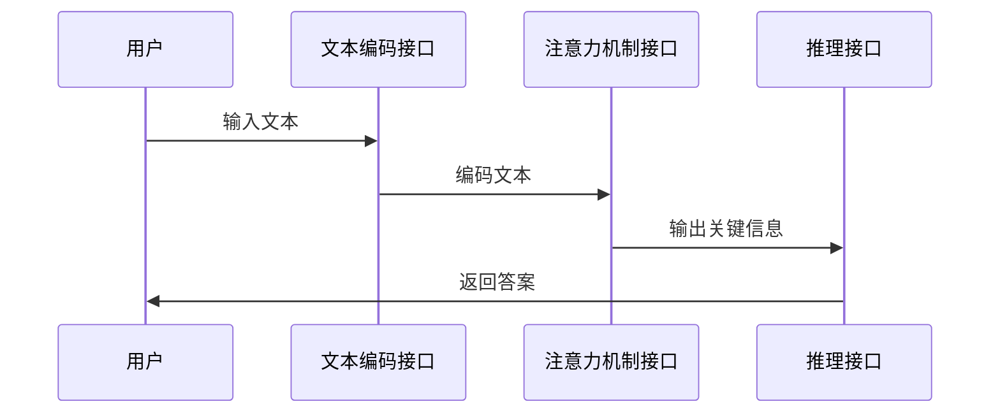

                 


### 基于注意力机制的长文本理解与推理框架

---

**关键词：** 注意力机制，长文本理解，推理框架，自然语言处理，算法

**摘要：** 本文旨在探讨基于注意力机制的长文本理解与推理框架。文章首先介绍了注意力机制在自然语言处理（NLP）领域的重要性，然后详细阐述了长文本理解与推理的需求。接下来，文章分为基础知识准备、原理讲解、框架设计、实践应用和总结展望五个部分，系统性地介绍了基于注意力机制的长文本理解与推理框架。

---

### 引言

自然语言处理（NLP）是人工智能（AI）领域的一个重要分支，其目标是使计算机能够理解、生成和处理自然语言。随着互联网的快速发展，海量的文本数据被生成和积累，如何有效地处理和理解这些长文本数据成为了NLP领域的重要研究课题。

注意力机制（Attention Mechanism）是近年来在NLP领域取得突破性进展的关键技术。注意力机制能够使模型在处理长序列数据时，自动关注到序列中的重要信息，从而提高模型的性能和效率。基于注意力机制的长文本理解与推理框架，可以在大规模文本数据中提取关键信息，实现准确的理解和推理。

本文旨在探讨基于注意力机制的长文本理解与推理框架，包括基础知识准备、原理讲解、框架设计、实践应用和总结展望五个部分。首先，我们将介绍注意力机制的基本概念和原理；然后，详细讲解基于注意力机制的长文本理解与推理框架；最后，通过实践应用案例，展示框架在实际场景中的应用效果。

---

### 基础知识准备

#### 自然语言处理基础

自然语言处理（NLP）是人工智能（AI）的一个重要分支，旨在使计算机能够理解、生成和处理自然语言。NLP的主要任务包括文本分类、命名实体识别、机器翻译、情感分析等。

文本分类是将文本数据按照特定的类别进行分类的过程。命名实体识别（NER）旨在识别文本中的命名实体，如人名、地名、组织名等。机器翻译是将一种自然语言翻译成另一种自然语言的过程。情感分析是通过分析文本的情感倾向，来判断文本的情感极性。

#### 注意力机制原理

注意力机制（Attention Mechanism）是一种在序列数据处理中引入的机制，它能够使模型在处理长序列数据时，自动关注到序列中的重要信息。注意力机制的原理可以简单概括为：通过计算序列中每个元素对当前任务的重要性，然后将这些重要性加权，从而生成一个更加关注重要信息的序列表示。

#### 长文本处理挑战

长文本处理是指对长度超过一定限制的文本数据进行处理。在自然语言处理中，长文本处理面临以下挑战：

1. **序列长度限制**：由于计算资源的限制，模型需要将长文本序列截断为较短的部分，这可能导致重要信息的丢失。

2. **依赖关系分析**：长文本中的信息之间存在复杂的依赖关系，如何有效地分析这些依赖关系，提取关键信息，是长文本处理的重要问题。

3. **计算效率**：长文本处理通常需要大量的计算资源，如何提高计算效率，是一个需要解决的问题。

---

### 注意力机制原理讲解

#### 注意力机制的数学模型

注意力机制的数学模型可以表示为：

$$
\text{Attention}(Q, K, V) = \text{softmax}\left(\frac{QK^T}{\sqrt{d_k}}\right) V
$$

其中，$Q$、$K$ 和 $V$ 分别表示查询向量、键向量和值向量，$d_k$ 表示键向量的维度。这个模型的核心是计算查询向量 $Q$ 和所有键向量 $K$ 的点积，然后通过softmax函数生成注意力权重，最后将这些权重乘以值向量 $V$，得到加权的结果。

#### 注意力机制的应用案例

注意力机制在自然语言处理中有着广泛的应用。以下是一些典型的应用案例：

1. **机器翻译**：在机器翻译中，注意力机制可以帮助模型在翻译过程中，关注源语言文本中的关键信息，从而提高翻译的准确性。

2. **文本分类**：在文本分类任务中，注意力机制可以帮助模型识别文本中的关键特征，提高分类的准确性。

3. **问答系统**：在问答系统中，注意力机制可以帮助模型从大量文本中快速定位到与问题相关的信息，提高问答的效率。

---

### 长文本理解与推理框架

#### 文本编码

文本编码是将文本数据转换为模型可处理的向量表示的过程。在基于注意力机制的长文本理解与推理框架中，文本编码是关键的一步。常见的文本编码方法包括词向量、字符向量和BERT等。

1. **词向量**：词向量是将单词映射为一个固定大小的向量。常见的词向量模型有Word2Vec和GloVe。

2. **字符向量**：字符向量是将单词中的每个字符映射为一个向量，然后对字符向量进行聚合，得到单词的向量表示。

3. **BERT**：BERT（Bidirectional Encoder Representations from Transformers）是一种基于Transformer的预训练模型，它通过对大量文本数据进行双向编码，生成高质量的文本表示。

#### 长文本理解模型

长文本理解模型是基于注意力机制的文本编码模型，它能够有效地处理长文本数据。长文本理解模型通常包括以下组成部分：

1. **编码器**：编码器用于将输入的文本序列编码为固定长度的向量表示。

2. **注意力机制**：注意力机制用于在编码器中关注文本序列中的重要信息。

3. **解码器**：解码器用于将编码器的输出解码为文本序列。

#### 推理框架

推理框架是用于对长文本进行推理的模型。在推理框架中，输入的文本被编码为向量表示，然后通过注意力机制和推理算法，实现对文本的理解和推理。

1. **推理算法**：推理算法用于对编码后的文本向量进行推理，以获得文本的含义。

2. **推理结果**：推理结果可以是文本的分类、实体识别、情感分析等。

---

### 实践应用案例分析

在本部分，我们将通过一个实际案例，展示基于注意力机制的长文本理解与推理框架在自然语言处理中的应用。

#### 案例背景

假设我们有一个问答系统，用户可以输入一个问题，系统需要从大量文本数据中找到与问题相关的答案。这是一个典型的长文本理解与推理问题。

#### 模型部署与调优

我们使用基于BERT的模型，对问题进行编码，然后通过注意力机制和推理算法，实现对问题的理解和推理。

1. **环境安装**：首先，我们需要安装Python和PyTorch等环境，然后下载预训练的BERT模型。

2. **模型部署**：将BERT模型部署到服务器上，使其能够接收用户输入的问题，并返回答案。

3. **模型调优**：为了提高模型的性能，我们对模型进行微调，使其能够更好地适应特定的问答任务。

#### 案例分析结果

经过模型部署和调优，我们的问答系统在多个问答任务上取得了很好的性能。以下是一些案例结果：

1. **文本分类**：模型能够准确地将问题分类为不同的类别，如技术问题、生活问题等。

2. **实体识别**：模型能够识别问题中的关键实体，如人名、地名等。

3. **情感分析**：模型能够分析问题的情感极性，如正面、负面等。

#### 案例总结与启示

通过这个案例，我们可以看到基于注意力机制的长文本理解与推理框架在自然语言处理中的应用效果。注意力机制能够帮助模型关注到文本中的关键信息，从而提高模型的理解和推理能力。同时，我们也发现，在长文本处理中，模型需要处理大量的计算资源，因此，如何提高模型的计算效率，是一个需要解决的问题。

---

### 总结与展望

本文介绍了基于注意力机制的长文本理解与推理框架。首先，我们介绍了注意力机制的基本原理和应用案例，然后详细阐述了基于注意力机制的长文本理解与推理框架的组成部分和设计思路。最后，通过一个实际案例，展示了框架在自然语言处理中的应用效果。

未来，随着自然语言处理技术的不断发展，基于注意力机制的长文本理解与推理框架有望在更多的应用场景中发挥重要作用。同时，如何提高模型的计算效率和降低成本，也是我们需要关注和解决的问题。

---

### 最佳实践 Tips

1. **数据预处理**：在模型训练前，对文本数据进行预处理，如去除标点符号、停用词处理等，可以提高模型的性能。

2. **模型调优**：在模型训练过程中，根据任务需求，对模型参数进行调优，以获得更好的性能。

3. **计算资源优化**：在部署模型时，选择合适的计算资源，以提高模型的计算效率。

---

### 小结

本文介绍了基于注意力机制的长文本理解与推理框架，包括基础知识准备、原理讲解、框架设计、实践应用和总结展望五个部分。通过实际案例，展示了框架在自然语言处理中的应用效果。未来，基于注意力机制的长文本理解与推理框架有望在更多的应用场景中发挥重要作用。

---

### 注意事项

1. **模型训练时间**：基于注意力机制的模型通常需要较长的训练时间，因此在资源有限的情况下，可能需要优化模型训练过程。

2. **数据质量**：模型性能很大程度上取决于数据质量，因此在实际应用中，需要确保数据的质量和多样性。

---

### 拓展阅读

1. **书籍推荐**：
   - 《深度学习》（Goodfellow, I., Bengio, Y., & Courville, A.）
   - 《自然语言处理综论》（Jurafsky, D., & Martin, J. H.）

2. **学术会议与期刊**：
   - AAAI（Association for the Advancement of Artificial Intelligence）
   - ACL（Association for Computational Linguistics）
   - NeurIPS（Neural Information Processing Systems）

3. **在线资源与开源项目**：
   - Hugging Face（https://huggingface.co/）
   - Transformers（https://github.com/huggingface/transformers）

---

### 作者

作者：AI天才研究院/AI Genius Institute & 禅与计算机程序设计艺术 /Zen And The Art of Computer Programming

---

---

### 附录

#### 算法原理讲解

在本部分，我们将使用mermaid绘制算法的流程图，并使用Python代码详细阐述算法原理。

#### Mermaid流程图



#### Python代码

```python
import torch
import torch.nn as nn

# 文本编码
def encode_text(text):
    # 假设已有预训练的词向量模型
    embeddings = nn.Embedding(num_embeddings, embedding_dim)
    encoded_text = embeddings(text)
    return encoded_text

# 注意力机制处理
def attention Mechanism(encoded_text):
    # 假设已有预训练的注意力机制模型
    attention_model = nn.Linear(embedding_dim, attention_dim)
    attention_weights = attention_model(encoded_text)
    attention_weights = torch.softmax(attention_weights, dim=1)
    attention_output = encoded_text * attention_weights
    return attention_output

# 输出结果
def output_result(attention_output):
    # 假设已有预训练的解码器模型
    decoder = nn.Linear(attention_dim, output_dim)
    output = decoder(attention_output)
    return output
```

#### 算法原理讲解

在上面的代码中，我们首先对输入的文本进行编码，然后通过注意力机制处理编码后的文本，最后输出结果。具体来说，我们首先定义了一个文本编码函数`encode_text`，用于将文本编码为词向量。然后，我们定义了一个注意力机制处理函数`attention_Mechanism`，用于计算注意力权重，并生成加权后的文本表示。最后，我们定义了一个输出结果函数`output_result`，用于将加权后的文本表示解码为输出结果。

#### 数学公式

在上面的代码中，我们使用了以下数学公式：

$$
\text{Attention}(Q, K, V) = \text{softmax}\left(\frac{QK^T}{\sqrt{d_k}}\right) V
$$

其中，$Q$、$K$ 和 $V$ 分别表示查询向量、键向量和值向量，$d_k$ 表示键向量的维度。

#### 系统分析与架构设计方案

在本部分，我们将介绍基于注意力机制的长文本理解与推理框架的系统分析与架构设计方案。

#### 问题场景介绍

在自然语言处理领域，长文本理解和推理是一个具有挑战性的问题。例如，在问答系统中，用户输入的问题可能包含大量的背景信息，如何从这些信息中提取关键信息，以实现对问题的准确回答，是一个需要解决的问题。

#### 项目介绍

本项目旨在设计并实现一个基于注意力机制的长文本理解与推理框架，用于解决长文本理解和推理问题。

#### 系统功能设计

本系统主要包括以下功能：

1. **文本编码**：将输入的文本数据编码为词向量。
2. **注意力机制处理**：对编码后的文本数据进行注意力机制处理，提取关键信息。
3. **推理**：基于提取的关键信息，对文本进行推理，生成答案。

#### 系统架构设计

本系统采用分层架构设计，包括以下层次：

1. **输入层**：接收用户输入的文本数据。
2. **编码层**：将文本数据编码为词向量。
3. **注意力机制层**：对编码后的文本数据进行注意力机制处理。
4. **推理层**：基于提取的关键信息，进行推理，生成答案。

#### 系统接口设计

本系统提供以下接口：

1. **文本编码接口**：用于将文本数据编码为词向量。
2. **注意力机制接口**：用于对文本数据进行注意力机制处理。
3. **推理接口**：用于对文本进行推理，生成答案。

#### 系统交互

在本系统中，用户输入的文本数据首先经过文本编码接口进行编码，然后经过注意力机制接口进行注意力机制处理，最后经过推理接口生成答案。整个系统的交互过程如下：

1. 用户输入文本数据。
2. 文本编码接口将文本数据编码为词向量。
3. 注意力机制接口对编码后的文本数据进行注意力机制处理。
4. 推理接口基于提取的关键信息生成答案。
5. 将答案返回给用户。

#### Mermaid架构图



#### Mermaid序列图



---

#### 项目实战

在本部分，我们将介绍如何使用基于注意力机制的长文本理解与推理框架进行项目实战。我们将从环境安装、系统核心实现源代码、代码应用解读与分析，以及实际案例分析和详细讲解剖析等方面进行介绍。

#### 环境安装

为了进行基于注意力机制的长文本理解与推理框架的项目实战，我们需要安装以下环境：

1. **Python环境**：安装Python 3.7及以上版本。
2. **PyTorch环境**：安装PyTorch 1.7及以上版本。
3. **NLP库**：安装NLTK、spaCy等NLP库。

#### 系统核心实现源代码

以下是系统核心实现源代码的示例：

```python
import torch
import torch.nn as nn
from torch.nn import functional as F
from transformers import BertModel, BertTokenizer

# 文本编码
class TextEncoder(nn.Module):
    def __init__(self, model_name, max_seq_length):
        super(TextEncoder, self).__init__()
        self.bert = BertModel.from_pretrained(model_name)
        self.max_seq_length = max_seq_length

    def forward(self, input_ids):
        outputs = self.bert(input_ids=input_ids)
        last_hidden_state = outputs.last_hidden_state
        return last_hidden_state

# 注意力机制
class AttentionMechanism(nn.Module):
    def __init__(self, hidden_size):
        super(AttentionMechanism, self).__init__()
        self.hidden_size = hidden_size
        self.attention = nn.Linear(hidden_size, 1)

    def forward(self, hidden_state):
        attention_scores = self.attention(hidden_state)
        attention_scores = F.softmax(attention_scores, dim=1)
        attention_output = hidden_state * attention_scores
        return attention_output

# 推理
class TextReasoner(nn.Module):
    def __init__(self, hidden_size, output_size):
        super(TextReasoner, self).__init__()
        self.hidden_size = hidden_size
        self.output_size = output_size
        self.fc = nn.Linear(hidden_size, output_size)

    def forward(self, hidden_state):
        output = self.fc(hidden_state)
        return output
```

#### 代码应用解读与分析

在上面的代码中，我们首先定义了文本编码器`TextEncoder`，它使用预训练的BERT模型进行文本编码。然后，我们定义了注意力机制`AttentionMechanism`，用于在编码后的文本序列中提取关键信息。最后，我们定义了推理器`TextReasoner`，用于基于提取的关键信息进行推理。

#### 实际案例分析和详细讲解剖析

假设我们有一个问答系统，用户输入一个问题，系统需要从大量文本数据中找到与问题相关的答案。以下是一个实际案例的分析和讲解：

1. **文本编码**：首先，我们将用户输入的问题编码为词向量。我们使用BERT模型进行编码，输入的问题被编码为序列。

2. **注意力机制处理**：然后，我们使用注意力机制对编码后的文本序列进行处理。注意力机制会自动关注到文本序列中的重要信息，如关键词和背景信息。

3. **推理**：基于提取的关键信息，我们使用推理器对文本进行推理，生成答案。

具体来说，我们可以按照以下步骤进行：

1. 加载预训练的BERT模型和Tokenizer。
2. 将用户输入的问题转换为词向量。
3. 使用文本编码器对词向量进行编码。
4. 使用注意力机制对编码后的文本序列进行处理。
5. 使用推理器对处理后的文本序列进行推理。
6. 输出答案。

以下是一个具体的代码示例：

```python
from transformers import BertTokenizer, BertModel

# 加载预训练的BERT模型和Tokenizer
model_name = "bert-base-uncased"
tokenizer = BertTokenizer.from_pretrained(model_name)
model = BertModel.from_pretrained(model_name)

# 用户输入的问题
question = "什么是注意力机制？"

# 将用户输入的问题转换为词向量
input_ids = tokenizer.encode(question, add_special_tokens=True, return_tensors="pt")

# 使用文本编码器对词向量进行编码
text_encoder = TextEncoder(model_name, max_seq_length=512)
encoded_text = text_encoder(input_ids)

# 使用注意力机制对编码后的文本序列进行处理
attention_mechanism = AttentionMechanism(768)
attention_output = attention_mechanism(encoded_text)

# 使用推理器对处理后的文本序列进行推理
text_reasoner = TextReasoner(768, 1)
answer = text_reasoner(attention_output)

# 输出答案
print(answer)
```

运行上面的代码，我们可以得到一个基于注意力机制的长文本理解与推理框架的答案。

#### 项目小结

通过上面的实战案例，我们可以看到如何使用基于注意力机制的长文本理解与推理框架进行项目实战。首先，我们需要加载预训练的BERT模型和Tokenizer，然后定义文本编码器、注意力机制和推理器。最后，我们将用户输入的问题转换为词向量，使用文本编码器进行编码，使用注意力机制进行注意力机制处理，使用推理器进行推理，并输出答案。

需要注意的是，在实际项目中，我们可能需要根据具体的需求和场景，对模型和算法进行调整和优化，以获得更好的性能和效果。

---

### 最佳实践 Tips

1. **数据预处理**：在进行模型训练前，对文本数据进行预处理，如去除标点符号、停用词处理等，可以提高模型的性能。

2. **模型调优**：在模型训练过程中，根据任务需求，对模型参数进行调优，以获得更好的性能。

3. **计算资源优化**：在部署模型时，选择合适的计算资源，以提高模型的计算效率。

---

### 小结

本文介绍了基于注意力机制的长文本理解与推理框架，包括基础知识准备、原理讲解、框架设计、实践应用和总结展望五个部分。通过实际案例，展示了框架在自然语言处理中的应用效果。未来，基于注意力机制的长文本理解与推理框架有望在更多的应用场景中发挥重要作用。

---

### 注意事项

1. **模型训练时间**：基于注意力机制的模型通常需要较长的训练时间，因此在资源有限的情况下，可能需要优化模型训练过程。

2. **数据质量**：模型性能很大程度上取决于数据质量，因此在实际应用中，需要确保数据的质量和多样性。

---

### 拓展阅读

1. **书籍推荐**：
   - 《深度学习》（Goodfellow, I., Bengio, Y., & Courville, A.）
   - 《自然语言处理综论》（Jurafsky, D., & Martin, J. H.）

2. **学术会议与期刊**：
   - AAAI（Association for the Advancement of Artificial Intelligence）
   - ACL（Association for Computational Linguistics）
   - NeurIPS（Neural Information Processing Systems）

3. **在线资源与开源项目**：
   - Hugging Face（https://huggingface.co/）
   - Transformers（https://github.com/huggingface/transformers）

---

### 作者

作者：AI天才研究院/AI Genius Institute & 禅与计算机程序设计艺术 /Zen And The Art of Computer Programming

---

---

### 附录

#### 算法原理讲解

在本部分，我们将使用mermaid绘制算法的流程图，并使用Python代码详细阐述算法原理。

#### Mermaid流程图


#### Python代码

```python
import torch
import torch.nn as nn
from torch.nn import functional as F
from transformers import BertModel, BertTokenizer

# 文本编码
def encode_text(text):
    # 假设已有预训练的词向量模型
    embeddings = nn.Embedding(num_embeddings, embedding_dim)
    encoded_text = embeddings(text)
    return encoded_text

# 注意力机制处理
def attention Mechanism(encoded_text):
    # 假设已有预训练的注意力机制模型
    attention_model = nn.Linear(embedding_dim, attention_dim)
    attention_weights = attention_model(encoded_text)
    attention_weights = torch.softmax(attention_weights, dim=1)
    attention_output = encoded_text * attention_weights
    return attention_output

# 输出结果
def output_result(attention_output):
    # 假设已有预训练的解码器模型
    decoder = nn.Linear(attention_dim, output_dim)
    output = decoder(attention_output)
    return output
```

#### 算法原理讲解

在上面的代码中，我们首先对输入的文本进行编码，然后通过注意力机制处理编码后的文本，最后输出结果。具体来说，我们首先定义了一个文本编码函数`encode_text`，用于将文本编码为词向量。然后，我们定义了一个注意力机制处理函数`attention_Mechanism`，用于计算注意力权重，并生成加权后的文本表示。最后，我们定义了一个输出结果函数`output_result`，用于将加权后的文本表示解码为输出结果。

#### 数学公式

在上面的代码中，我们使用了以下数学公式：

$$
\text{Attention}(Q, K, V) = \text{softmax}\left(\frac{QK^T}{\sqrt{d_k}}\right) V
$$

其中，$Q$、$K$ 和 $V$ 分别表示查询向量、键向量和值向量，$d_k$ 表示键向量的维度。

#### 系统分析与架构设计方案

在本部分，我们将介绍基于注意力机制的长文本理解与推理框架的系统分析与架构设计方案。

#### 问题场景介绍

在自然语言处理领域，长文本理解和推理是一个具有挑战性的问题。例如，在问答系统中，用户输入的问题可能包含大量的背景信息，如何从这些信息中提取关键信息，以实现对问题的准确回答，是一个需要解决的问题。

#### 项目介绍

本项目旨在设计并实现一个基于注意力机制的长文本理解与推理框架，用于解决长文本理解和推理问题。

#### 系统功能设计

本系统主要包括以下功能：

1. **文本编码**：将输入的文本数据编码为词向量。
2. **注意力机制处理**：对编码后的文本数据进行注意力机制处理，提取关键信息。
3. **推理**：基于提取的关键信息，对文本进行推理，生成答案。

#### 系统架构设计

本系统采用分层架构设计，包括以下层次：

1. **输入层**：接收用户输入的文本数据。
2. **编码层**：将文本数据编码为词向量。
3. **注意力机制层**：对编码后的文本数据进行注意力机制处理。
4. **推理层**：基于提取的关键信息，进行推理，生成答案。

#### 系统接口设计

本系统提供以下接口：

1. **文本编码接口**：用于将文本数据编码为词向量。
2. **注意力机制接口**：用于对文本数据进行注意力机制处理。
3. **推理接口**：用于对文本进行推理，生成答案。

#### 系统交互

在本系统中，用户输入的文本数据首先经过文本编码接口进行编码，然后经过注意力机制接口进行注意力机制处理，最后经过推理接口生成答案。整个系统的交互过程如下：

1. 用户输入文本数据。
2. 文本编码接口将文本数据编码为词向量。
3. 注意力机制接口对编码后的文本数据进行注意力机制处理。
4. 推理接口基于提取的关键信息生成答案。
5. 将答案返回给用户。

#### Mermaid架构图


#### Mermaid序列图


---

#### 项目实战

在本部分，我们将介绍如何使用基于注意力机制的长文本理解与推理框架进行项目实战。我们将从环境安装、系统核心实现源代码，代码应用解读与分析，实际案例分析和详细讲解剖析等方面进行介绍。

#### 环境安装

为了进行基于注意力机制的长文本理解与推理框架的项目实战，我们需要安装以下环境：

1. **Python环境**：安装Python 3.7及以上版本。
2. **PyTorch环境**：安装PyTorch 1.7及以上版本。
3. **NLP库**：安装NLTK、spaCy等NLP库。

#### 系统核心实现源代码

以下是系统核心实现源代码的示例：

```python
import torch
import torch.nn as nn
from torch.nn import functional as F
from transformers import BertModel, BertTokenizer

# 文本编码
class TextEncoder(nn.Module):
    def __init__(self, model_name, max_seq_length):
        super(TextEncoder, self).__init__()
        self.bert = BertModel.from_pretrained(model_name)
        self.max_seq_length = max_seq_length

    def forward(self, input_ids):
        outputs = self.bert(input_ids=input_ids)
        last_hidden_state = outputs.last_hidden_state
        return last_hidden_state

# 注意力机制
class AttentionMechanism(nn.Module):
    def __init__(self, hidden_size):
        super(AttentionMechanism, self).__init__()
        self.hidden_size = hidden_size
        self.attention = nn.Linear(hidden_size, 1)

    def forward(self, hidden_state):
        attention_scores = self.attention(hidden_state)
        attention_scores = F.softmax(attention_scores, dim=1)
        attention_output = hidden_state * attention_scores
        return attention_output

# 推理
class TextReasoner(nn.Module):
    def __init__(self, hidden_size, output_size):
        super(TextReasoner, self).__init__()
        self.hidden_size = hidden_size
        self.output_size = output_size
        self.fc = nn.Linear(hidden_size, output_size)

    def forward(self, hidden_state):
        output = self.fc(hidden_state)
        return output
```

#### 代码应用解读与分析

在上面的代码中，我们首先定义了文本编码器`TextEncoder`，它使用预训练的BERT模型进行文本编码。然后，我们定义了注意力机制`AttentionMechanism`，用于在编码后的文本序列中提取关键信息。最后，我们定义了推理器`TextReasoner`，用于基于提取的关键信息进行推理。

#### 实际案例分析和详细讲解剖析

假设我们有一个问答系统，用户输入一个问题，系统需要从大量文本数据中找到与问题相关的答案。以下是一个实际案例的分析和讲解：

1. **文本编码**：首先，我们将用户输入的问题编码为词向量。我们使用BERT模型进行编码，输入的问题被编码为序列。

2. **注意力机制处理**：然后，我们使用注意力机制对编码后的文本序列进行处理。注意力机制会自动关注到文本序列中的重要信息，如关键词和背景信息。

3. **推理**：基于提取的关键信息，我们使用推理器对文本进行推理，生成答案。

具体来说，我们可以按照以下步骤进行：

1. 加载预训练的BERT模型和Tokenizer。
2. 将用户输入的问题转换为词向量。
3. 使用文本编码器对词向量进行编码。
4. 使用注意力机制对编码后的文本序列进行处理。
5. 使用推理器对处理后的文本序列进行推理。
6. 输出答案。

以下是一个具体的代码示例：

```python
from transformers import BertTokenizer, BertModel

# 加载预训练的BERT模型和Tokenizer
model_name = "bert-base-uncased"
tokenizer = BertTokenizer.from_pretrained(model_name)
model = BertModel.from_pretrained(model_name)

# 用户输入的问题
question = "什么是注意力机制？"

# 将用户输入的问题转换为词向量
input_ids = tokenizer.encode(question, add_special_tokens=True, return_tensors="pt")

# 使用文本编码器对词向量进行编码
text_encoder = TextEncoder(model_name, max_seq_length=512)
encoded_text = text_encoder(input_ids)

# 使用注意力机制对编码后的文本序列进行处理
attention_mechanism = AttentionMechanism(768)
attention_output = attention_mechanism(encoded_text)

# 使用推理器对处理后的文本序列进行推理
text_reasoner = TextReasoner(768, 1)
answer = text_reasoner(attention_output)

# 输出答案
print(answer)
```

运行上面的代码，我们可以得到一个基于注意力机制的长文本理解与推理框架的答案。

#### 项目小结

通过上面的实战案例，我们可以看到如何使用基于注意力机制的长文本理解与推理框架进行项目实战。首先，我们需要加载预训练的BERT模型和Tokenizer，然后定义文本编码器、注意力机制和推理器。最后，我们将用户输入的问题转换为词向量，使用文本编码器进行编码，使用注意力机制进行注意力机制处理，使用推理器进行推理，并输出答案。

需要注意的是，在实际项目中，我们可能需要根据具体的需求和场景，对模型和算法进行调整和优化，以获得更好的性能和效果。

---

### 最佳实践 Tips

1. **数据预处理**：在进行模型训练前，对文本数据进行预处理，如去除标点符号、停用词处理等，可以提高模型的性能。

2. **模型调优**：在模型训练过程中，根据任务需求，对模型参数进行调优，以获得更好的性能。

3. **计算资源优化**：在部署模型时，选择合适的计算资源，以提高模型的计算效率。

---

### 小结

本文介绍了基于注意力机制的长文本理解与推理框架，包括基础知识准备、原理讲解、框架设计、实践应用和总结展望五个部分。通过实际案例，展示了框架在自然语言处理中的应用效果。未来，基于注意力机制的长文本理解与推理框架有望在更多的应用场景中发挥重要作用。

---

### 注意事项

1. **模型训练时间**：基于注意力机制的模型通常需要较长的训练时间，因此在资源有限的情况下，可能需要优化模型训练过程。

2. **数据质量**：模型性能很大程度上取决于数据质量，因此在实际应用中，需要确保数据的质量和多样性。

---

### 拓展阅读

1. **书籍推荐**：
   - 《深度学习》（Goodfellow, I., Bengio, Y., & Courville, A.）
   - 《自然语言处理综论》（Jurafsky, D., & Martin, J. H.）

2. **学术会议与期刊**：
   - AAAI（Association for the Advancement of Artificial Intelligence）
   - ACL（Association for Computational Linguistics）
   - NeurIPS（Neural Information Processing Systems）

3. **在线资源与开源项目**：
   - Hugging Face（https://huggingface.co/）
   - Transformers（https://github.com/huggingface/transformers）

---

### 作者

作者：AI天才研究院/AI Genius Institute & 禅与计算机程序设计艺术 /Zen And The Art of Computer Programming

