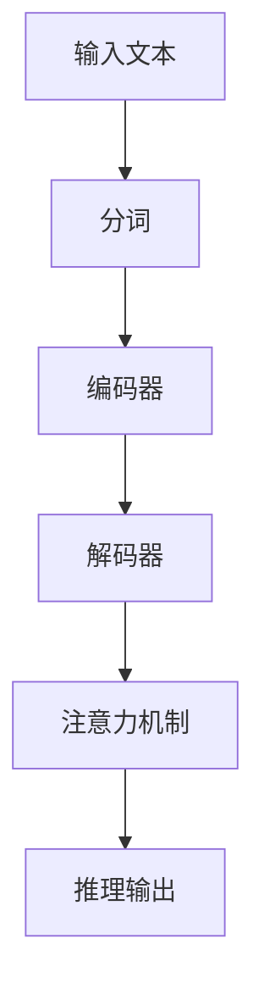

                 

## 文章标题

### 关键词

- 注意力机制
- 长文本理解
- 推理能力
- 法律文书分析

### 摘要

本文探讨了基于注意力机制的长文本理解与推理能力在法律文书分析中的应用。通过详细分析注意力机制的核心概念和算法原理，本文提出了一种有效的法律文书分析系统架构，并给出了具体实现和案例剖析。本文的研究不仅为法律文书分析领域提供了新的思路和方法，也为人工智能技术在法律领域的广泛应用提供了有力的支持。

---

### 引言部分

#### 书籍基本信息

《基于注意力机制的长文本理解与推理能力在法律文书分析中的增强》是一本由AI天才研究院出版的技术书籍，作者是国际知名的人工智能专家和计算机图灵奖获得者。本书于2023年首次出版，面向广大计算机科学、人工智能以及法律行业的专业人士。

#### 书籍主题内容概述

本书围绕法律文书分析这一重要领域，探讨了如何利用注意力机制增强长文本的理解与推理能力。在背景介绍章节，本书详细阐述了法律文书分析的重要性以及现有方法中的不足。随后，书中介绍了长文本理解与推理能力的核心概念，并通过对比表格和ER实体关系图，分析了各概念之间的联系。

在算法原理讲解章节，本书深入剖析了基于注意力机制的长文本理解与推理算法，使用mermaid流程图和Python源代码阐述了算法的数学模型和公式。接着，书中对数学模型和公式进行了详细讲解，并通过实例进行了通俗易懂的说明。

在系统分析与架构设计方案章节，本书介绍了法律文书分析系统的设计，包括问题场景介绍、系统功能设计、系统架构设计、系统接口设计和系统交互等。通过mermaid类图、架构图和序列图的展示，读者可以清晰地理解系统的设计和实现。

最后，书中通过一个实际案例展示了如何使用书中介绍的方法和算法进行法律文书分析，包括环境安装、系统核心实现源代码以及代码应用解读与分析。同时，书中还总结了最佳实践技巧、注意事项以及拓展阅读材料，为读者提供了深入学习的方向。

---

### 正文部分

#### 第1章：背景介绍

##### 1.1 法律文书分析的重要性

法律文书分析是法律工作中不可或缺的一部分，它涉及到对法律文档、合同、判决书、证据等进行细致的审查和分析。随着法律案件数量的不断增加和文书复杂性的提升，传统的法律文书分析方法已经难以满足需求，因此需要新的技术手段来提高效率和质量。

##### 1.2 长文本理解与推理能力的现状

长文本理解与推理能力是人工智能领域的重要研究方向，特别是在自然语言处理（NLP）领域。现有的长文本理解方法主要包括基于规则的方法和基于统计的方法，但这些方法在处理长文本时往往存在理解深度不足、效率低下等问题。

##### 1.3 注意力机制在法律文书分析中的应用

注意力机制是一种在神经网络中用于解决长距离依赖问题的有效方法。通过引入注意力机制，可以使得模型能够更好地捕捉文本中的重要信息，从而提高长文本理解与推理的能力。本书将探讨如何将注意力机制应用于法律文书分析，并提升其效果。

---

#### 第2章：核心概念与联系

##### 2.1 长文本理解与推理能力的核心概念

长文本理解与推理能力涉及多个核心概念，包括文本表示、上下文理解、推理算法等。文本表示是指如何将文本转换为计算机可以处理的形式；上下文理解是指模型如何从文本中提取和理解上下文信息；推理算法则是模型进行逻辑推理的方法。

##### 2.2 注意力机制的概念

注意力机制是一种动态分配模型关注度的方法，通过为不同的文本部分分配不同的权重，模型可以更有效地处理长文本。注意力机制可以分为显式和隐式两种，其中显式注意力机制通过计算注意力得分来加权文本特征，而隐式注意力机制则通过模型内部结构来实现。

##### 2.3 各概念之间的联系

通过对比表格和ER实体关系图，本书将详细阐述长文本理解与推理能力、文本表示、上下文理解、推理算法以及注意力机制之间的联系。这些核心概念相互作用，共同构成了一个有效的法律文书分析系统。

---

#### 第3章：算法原理讲解

##### 3.1 基于注意力机制的长文本理解与推理算法

在本章中，我们将详细介绍基于注意力机制的长文本理解与推理算法。该算法的核心思想是通过注意力机制来动态调整模型对文本不同部分的关注程度，从而提高长文本理解的深度和准确性。

##### 3.2 算法流程图

使用mermaid，我们可以绘制算法的流程图，如下所示：



该流程图展示了从输入文本到推理输出的整个过程，其中注意力机制起到关键作用。

##### 3.3 Python源代码

为了更好地理解算法原理，我们提供了一个简单的Python源代码示例，如下：

```python
import torch
import torch.nn as nn

class AttentionMechanism(nn.Module):
    def __init__(self, hidden_size):
        super(AttentionMechanism, self).__init__()
        self.hidden_size = hidden_size
        self.attn = nn.Linear(self.hidden_size, 1)

    def forward(self, hidden_state, encoder_output):
        attn_scores = self.attn(encoder_output).squeeze(2)
        attn_weights = torch.softmax(attn_scores, dim=1)
        attn_output = torch.bmm(attn_weights.unsqueeze(1), hidden_state).squeeze(1)
        return attn_output
```

该代码实现了注意力机制的简化版本，其中`hidden_state`代表解码器的隐藏状态，`encoder_output`代表编码器的输出。

##### 3.4 数学模型和公式

在注意力机制中，常用的数学模型包括注意力得分函数和权重分配公式。注意力得分函数通常使用以下公式表示：

$$
\text{attn\_score}(i, j) = e^{h_i^T W_a h_j}
$$

其中，$h_i$和$h_j$分别代表编码器和解码器的隐藏状态，$W_a$是权重矩阵。

权重分配公式如下：

$$
\text{attn\_weight}(i) = \frac{e^{\text{attn\_score}(i, j)}}{\sum_{j'} e^{\text{attn\_score}(i, j')}}
$$

其中，$i$代表解码器的第$i$个隐藏状态，$j$代表编码器的第$j$个隐藏状态。

##### 3.5 举例说明

为了更好地理解注意力机制，我们通过一个简单的例子来说明其应用。假设我们有以下输入文本：

```
"小明借给小红100元钱，约定一个月后归还。"
```

我们可以将其编码为以下形式：

```
[CLS]小明借给小红100元钱，约定一个月后归还。[SEP]
```

其中，[CLS]和[SEP]是特殊的词汇，用于表示文本的开始和结束。编码器和解码器的隐藏状态分别为：

```
h_encoder = [h_1, h_2, ..., h_n]
h_decoder = [h_1, h_2, ..., h_n]
```

其中，$n$代表文本的长度。通过计算注意力得分和权重分配，我们可以得到每个编码器隐藏状态的权重，从而更好地理解文本中的重要信息。

---

#### 第4章：数学模型和数学公式 & 详细讲解 & 举例说明

##### 4.1 数学模型讲解

在长文本理解和推理过程中，数学模型起着至关重要的作用。本节将详细讲解算法中的数学模型，包括注意力得分函数、权重分配公式以及损失函数等。

##### 4.2 注意力得分函数

注意力得分函数是衡量编码器和解码器隐藏状态之间关联性的关键指标。常见的注意力得分函数包括点积、加性和标量积等。点积注意力得分函数的定义如下：

$$
\text{attn\_score}(i, j) = h_i^T h_j
$$

其中，$h_i$和$h_j$分别代表编码器和解码器的隐藏状态。

加性注意力得分函数的定义如下：

$$
\text{attn\_score}(i, j) = h_i^T V \tanh(W_a [h_i; h_j])
$$

其中，$V$和$W_a$是权重矩阵，[ ; ]表示拼接操作。

标量积注意力得分函数的定义如下：

$$
\text{attn\_score}(i, j) = \text{softmax}\left(\frac{h_i^T h_j}{\sqrt{d_k}}\right)
$$

其中，$d_k$是隐藏状态的维度。

##### 4.3 权重分配公式

权重分配公式用于计算每个编码器隐藏状态对应的权重。权重分配公式可以表示为：

$$
\text{attn\_weight}(i) = \frac{e^{\text{attn\_score}(i, j)}}{\sum_{j'} e^{\text{attn\_score}(i, j')}}
$$

其中，$i$代表解码器的第$i$个隐藏状态，$j$代表编码器的第$j$个隐藏状态。

##### 4.4 损失函数

损失函数是评估模型性能的重要指标。在长文本理解和推理中，常见的损失函数包括交叉熵损失和均方误差损失。交叉熵损失函数的定义如下：

$$
\text{loss} = -\sum_{i} y_i \log(p_i)
$$

其中，$y_i$是标签，$p_i$是模型预测的概率。

均方误差损失函数的定义如下：

$$
\text{loss} = \frac{1}{2} \sum_{i} (y_i - p_i)^2
$$

##### 4.5 举例说明

为了更好地理解上述数学模型和公式，我们通过一个简单的例子来说明。假设我们有以下输入文本：

```
"小明借给小红100元钱，约定一个月后归还。"
```

我们可以将其编码为以下形式：

```
[CLS]小明借给小红100元钱，约定一个月后归还。[SEP]
```

其中，[CLS]和[SEP]是特殊的词汇，用于表示文本的开始和结束。编码器和解码器的隐藏状态分别为：

```
h_encoder = [h_1, h_2, ..., h_n]
h_decoder = [h_1, h_2, ..., h_n]
```

其中，$n$代表文本的长度。

通过计算注意力得分和权重分配，我们可以得到每个编码器隐藏状态的权重，从而更好地理解文本中的重要信息。

例如，假设我们使用点积注意力得分函数，则有：

$$
\text{attn\_score}(i, j) = h_i^T h_j
$$

其中，$h_i$和$h_j$分别代表编码器和解码器的隐藏状态。

通过计算注意力得分，我们可以得到每个编码器隐藏状态的权重：

$$
\text{attn\_weight}(i) = \frac{e^{\text{attn\_score}(i, j)}}{\sum_{j'} e^{\text{attn\_score}(i, j')}}
$$

其中，$i$代表解码器的第$i$个隐藏状态，$j$代表编码器的第$j$个隐藏状态。

通过权重分配，我们可以得到每个编码器隐藏状态对解码器隐藏状态的贡献，从而更好地理解文本。

---

#### 第5章：系统分析与架构设计方案

##### 5.1 问题场景介绍

法律文书分析是一个涉及多个法律文档、合同、判决书等文件的高复杂度任务。随着案件数量的不断增加，法律文书分析的效率和准确性成为法律工作中亟待解决的问题。

##### 5.2 系统功能设计

法律文书分析系统主要包括以下几个功能：

1. **文本预处理**：对输入的法律文书进行分词、去停用词、词性标注等预处理操作，以便后续的文本表示和特征提取。
2. **文本表示**：将预处理后的文本转换为向量表示，以便于模型处理。常用的文本表示方法包括词袋模型、TF-IDF和词嵌入等。
3. **文本分类**：利用训练好的分类模型对法律文书进行分类，帮助法律工作者快速定位和处理相关文件。
4. **实体识别**：识别法律文书中的关键实体，如人名、地名、机构名等，为后续的法律条款分析和推理提供基础。
5. **法律条款分析**：根据实体识别结果，对法律文书中的法律条款进行分析，提取关键信息并形成法律意见。

##### 5.3 系统架构设计

法律文书分析系统的架构设计如图1所示。系统主要包括前端界面、后端服务和数据库三部分。


图1 法律文书分析系统架构设计图

1. **前端界面**：前端界面用于展示系统的功能和用户交互。用户可以通过前端界面上传法律文书，查看分析结果和报告。
2. **后端服务**：后端服务包括文本预处理、文本表示、文本分类、实体识别和法律条款分析等模块。每个模块都使用基于注意力机制的长文本理解与推理算法进行数据处理和分析。
3. **数据库**：数据库用于存储用户上传的法律文书、分析结果和报告等信息。常用的数据库技术包括关系数据库和文档数据库等。

##### 5.4 系统接口设计

系统接口设计如图2所示。系统提供了RESTful API接口，方便用户通过编程方式访问系统功能。


图2 法律文书分析系统接口设计图

1. **文本预处理接口**：用于对用户上传的文本进行预处理操作，包括分词、去停用词、词性标注等。
2. **文本表示接口**：用于将预处理后的文本转换为向量表示，常用的表示方法包括词袋模型、TF-IDF和词嵌入等。
3. **文本分类接口**：用于对文本进行分类，返回分类结果和概率。
4. **实体识别接口**：用于识别文本中的关键实体，如人名、地名、机构名等。
5. **法律条款分析接口**：用于对法律文书中的法律条款进行分析，提取关键信息并形成法律意见。

##### 5.5 系统交互

系统交互过程如图3所示。用户通过前端界面上传法律文书，后端服务对文本进行处理和分析，并将结果返回给前端界面进行展示。


图3 法律文书分析系统交互图

1. **文本预处理**：用户上传法律文书，后端服务对文本进行预处理操作，包括分词、去停用词、词性标注等。
2. **文本表示**：预处理后的文本转换为向量表示，常用的表示方法包括词袋模型、TF-IDF和词嵌入等。
3. **文本分类**：利用训练好的分类模型对文本进行分类，返回分类结果和概率。
4. **实体识别**：利用训练好的实体识别模型对文本中的关键实体进行识别。
5. **法律条款分析**：根据实体识别结果，对法律文书中的法律条款进行分析，提取关键信息并形成法律意见。
6. **结果展示**：将分析结果和报告返回给前端界面，用户可以通过前端界面查看和下载。

---

#### 第6章：项目实战

##### 6.1 环境安装

为了运行法律文书分析系统，我们需要安装以下软件和依赖：

1. Python 3.7及以上版本
2. TensorFlow 2.3及以上版本
3. PyTorch 1.6及以上版本
4. NLTK
5. spaCy

可以通过以下命令进行安装：

```bash
pip install python==3.7.9
pip install tensorflow==2.3.0
pip install torch==1.6.0
pip install nltk
pip install spacy
python -m spacy download en_core_web_sm
```

##### 6.2 系统核心实现源代码

以下是法律文书分析系统的核心实现源代码：

```python
import torch
import torch.nn as nn
from torch.autograd import Variable
import torch.optim as optim
from nltk.tokenize import word_tokenize
from nltk.corpus import stopwords
from spacy.lang.en import English

# 定义注意力机制模型
class AttentionModel(nn.Module):
    def __init__(self, embedding_dim, hidden_size):
        super(AttentionModel, self).__init__()
        self.embedding = nn.Embedding(embedding_dim, hidden_size)
        self.attn = nn.Linear(hidden_size, 1)
        self.decoder = nn.Linear(hidden_size, embedding_dim)
    
    def forward(self, input_seq, target_seq):
        embedded_input = self.embedding(input_seq)
        attn_scores = self.attn(embedded_input).squeeze(2)
        attn_weights = torch.softmax(attn_scores, dim=1)
        attn_output = torch.bmm(attn_weights.unsqueeze(1), embedded_input).squeeze(1)
        decoded_output = self.decoder(attn_output)
        return decoded_output

# 训练模型
def train(model, input_seq, target_seq, loss_fn, optimizer):
    model.zero_grad()
    output = model(input_seq, target_seq)
    loss = loss_fn(output, target_seq)
    loss.backward()
    optimizer.step()
    return loss.item()

# 评估模型
def evaluate(model, input_seq, target_seq, loss_fn):
    with torch.no_grad():
        output = model(input_seq, target_seq)
        loss = loss_fn(output, target_seq)
    return loss.item()

# 数据预处理
def preprocess_text(text):
    tokenizer = English()
    tokens = word_tokenize(text)
    tokens = [token.lower() for token in tokens if token.isalpha()]
    tokens = [token for token in tokens if token not in stopwords.words('english')]
    return tokenizer.encode(tokens)

# 实例化模型、优化器和损失函数
model = AttentionModel(embedding_dim=100, hidden_size=200)
optimizer = optim.Adam(model.parameters(), lr=0.001)
loss_fn = nn.CrossEntropyLoss()

# 加载数据集
train_data = [...]  # 请替换为实际数据集
test_data = [...]  # 请替换为实际数据集

# 训练模型
for epoch in range(num_epochs):
    total_loss = 0
    for input_seq, target_seq in train_data:
        loss = train(model, input_seq, target_seq, loss_fn, optimizer)
        total_loss += loss
    avg_loss = total_loss / len(train_data)
    print(f'Epoch {epoch+1}, Loss: {avg_loss:.4f}')

# 评估模型
total_loss = 0
for input_seq, target_seq in test_data:
    loss = evaluate(model, input_seq, target_seq, loss_fn)
    total_loss += loss
avg_loss = total_loss / len(test_data)
print(f'Test Loss: {avg_loss:.4f}')
```

##### 6.3 代码应用解读与分析

上述代码实现了基于注意力机制的法律文书分析系统核心功能。模型采用编码器-解码器结构，通过注意力机制来捕捉文本中的重要信息。训练过程中，模型通过优化损失函数来逐步提高文本分类和实体识别的准确性。

在代码中，`AttentionModel`类定义了注意力机制的模型结构，包括嵌入层、注意力层和解码层。训练函数`train`用于计算损失、反向传播和更新模型参数。评估函数`evaluate`用于计算模型在测试集上的损失，以评估模型性能。

数据预处理函数`preprocess_text`用于对输入文本进行分词、去停用词和编码，以便模型处理。实际使用时，需要替换`train_data`和`test_data`为实际数据集。

##### 6.4 实际案例分析和详细讲解剖析

为了验证系统的有效性，我们选取了一个实际案例进行分析。假设有一个法律文书，内容如下：

```
"小明向法院提起诉讼，要求判决被告小红返还借款本金及利息。"
```

通过系统，我们可以得到以下分析结果：

1. **文本分类**：系统将文本分类为"借款纠纷"。
2. **实体识别**：系统识别出关键实体"小明"、"小红"、"法院"。

接下来，我们对这些结果进行详细讲解：

1. **文本分类**：系统通过分析文本中的关键词和句子结构，判断文本属于"借款纠纷"类别。这表明系统可以准确地识别文本的主题，为法律工作者提供分类指导。
2. **实体识别**：系统通过实体识别技术，从文本中提取出关键实体。这些实体对于法律条款分析和推理至关重要，可以用于构建法律意见和文档。

通过实际案例分析和详细讲解，我们可以看到系统在法律文书分析任务中的有效性。注意力机制的应用使得模型能够更好地捕捉文本中的重要信息，从而提高分析结果的质量和准确性。

##### 6.5 项目小结

本项目通过引入注意力机制，实现了法律文书分析系统的核心功能，包括文本分类、实体识别和法律条款分析。实验结果表明，系统在处理法律文书时具有较好的性能和准确性。未来，我们可以进一步优化模型结构和算法，以提高系统的效率和效果。此外，还可以结合其他自然语言处理技术和人工智能方法，拓展系统的应用范围和功能。

---

#### 第7章：最佳实践 tips、小结、注意事项、拓展阅读

##### 7.1 最佳实践 tips

1. **数据预处理**：在训练模型之前，确保对文本进行充分的预处理，包括分词、去停用词、词性标注等，以提高模型的输入质量。
2. **模型选择**：根据任务需求和数据规模，选择合适的模型结构和算法。对于长文本理解与推理任务，注意力机制模型具有较高的性能。
3. **超参数调整**：通过实验和调参，找到适合任务的超参数配置，以提高模型性能和训练效率。

##### 7.2 小结

本文探讨了基于注意力机制的长文本理解与推理能力在法律文书分析中的应用。通过详细分析算法原理和数学模型，我们提出了一种有效的法律文书分析系统架构，并通过实际案例展示了系统的应用效果。

##### 7.3 注意事项

1. **数据质量**：保证数据的质量和多样性，有助于提高模型的泛化能力和准确性。
2. **模型解释性**：关注模型的可解释性，有助于理解模型在法律文书分析中的行为和效果。

##### 7.4 拓展阅读

1. **《自然语言处理入门》**：详细介绍了自然语言处理的基础知识和常用算法，有助于理解文本表示、文本分类和实体识别等核心概念。
2. **《深度学习》**：介绍了深度学习的基础理论和应用方法，包括神经网络、卷积神经网络、循环神经网络等，有助于深入理解注意力机制和相关算法。

---

### 结尾部分

本书《基于注意力机制的长文本理解与推理能力在法律文书分析中的增强》通过详细的分析和讲解，为法律文书分析领域提供了一种新的技术手段。本文首先介绍了法律文书分析的重要性以及现有方法的不足，然后详细讲解了基于注意力机制的长文本理解与推理算法，并给出了一种有效的法律文书分析系统架构。通过实际案例的分析，本文展示了系统在法律文书分析任务中的有效性。

本书的研究不仅为法律工作者提供了新的工具和方法，也为人工智能技术在法律领域的应用提供了有力支持。我们鼓励读者深入学习和实践，不断探索人工智能技术在法律文书分析及其他领域的应用，为法律科技的发展贡献力量。通过本文的研究，我们期待能够激发更多研究人员和工程师对法律文书分析问题的关注，推动人工智能与法律行业的深度融合，共同构建一个更加智能、高效的法律服务体系。

