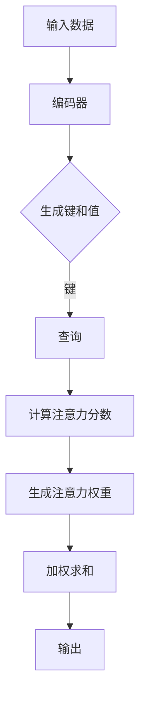
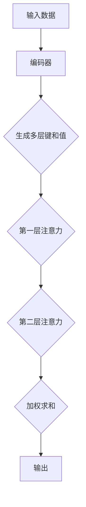
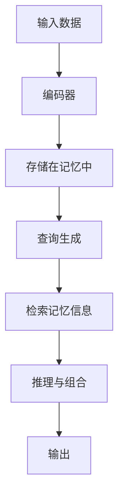
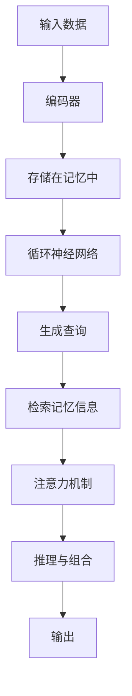
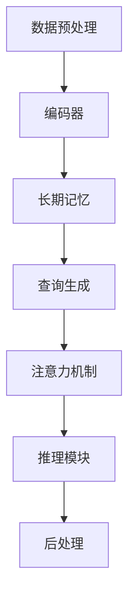
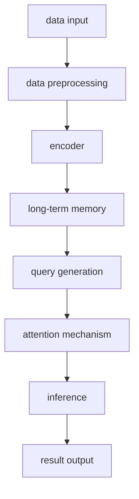

                 

### 文章标题

---

# 基于注意力机制的长期记忆推理能力增强

---

### 关键词

- 注意力机制
- 长期记忆推理
- 自然语言处理
- 计算机视觉
- 算法优化

---

### 摘要

本文深入探讨了基于注意力机制的长期记忆推理能力增强这一前沿技术主题。首先，通过分析当前AI系统中长期记忆推理所面临的挑战，引出了注意力机制在解决这些问题中的作用。接着，详细阐述了注意力机制和长期记忆推理的核心概念、原理及其在AI中的应用。随后，通过具体案例分析展示了注意力机制与长期记忆推理的结合方法及其在实际应用中的优势与挑战。此外，本文还介绍了相关的数学模型和公式，并使用Mermaid流程图和Python代码进行了直观的算法讲解。最后，通过对一个实际项目的系统分析与架构设计，展示了该技术的落地实践，并总结了最佳实践与未来展望。

---

### 目录大纲设计

**《基于注意力机制的长期记忆推理能力增强》**

```markdown
----------------------------------------------------------------

# 第一部分：引论

## 第1章 问题背景与核心概念

### 1.1 问题的提出

#### 1.1.1 当前AI面临的挑战

#### 1.1.2 长期记忆推理的重要性

### 1.2 核心概念介绍

#### 1.2.1 注意力机制的基本原理

#### 1.2.2 长期记忆推理的关键要素

### 1.3 边界与外延

#### 1.3.1 注意力机制的适用范围

#### 1.3.2 长期记忆推理的应用场景

### 1.4 概念结构与核心要素组成

#### 1.4.1 注意力机制在AI中的地位

#### 1.4.2 长期记忆推理的构成要素

## 第2章 注意力机制原理讲解

### 2.1 基础概念

#### 2.1.1 注意力机制定义

#### 2.1.2 注意力机制的数学模型

### 2.2 原理讲解

#### 2.2.1 注意力机制的工作流程

#### 2.2.2 注意力机制的优缺点分析

### 2.3 Mermaid流程图示例

#### 2.3.1 基础流程图

#### 2.3.2 复杂流程图

## 第3章 长期记忆推理原理讲解

### 3.1 基础概念

#### 3.1.1 长期记忆推理定义

#### 3.1.2 长期记忆推理的数学模型

### 3.2 原理讲解

#### 3.2.1 长期记忆推理的工作流程

#### 3.2.2 长期记忆推理的关键技术

### 3.3 Mermaid流程图示例

#### 3.3.1 基础流程图

#### 3.3.2 复杂流程图

## 第4章 注意力机制在长期记忆推理中的应用

### 4.1 注意力机制与长期记忆推理的结合

#### 4.1.1 结合方法概述

#### 4.1.2 结合的优点与挑战

### 4.2 应用案例分析

#### 4.2.1 案例一：自然语言处理

#### 4.2.2 案例二：计算机视觉

### 4.3 应用前景探讨

#### 4.3.1 应用领域拓展

#### 4.3.2 技术发展趋势

## 第5章 数学模型和数学公式讲解

### 5.1 基本公式

#### 5.1.1 注意力机制的数学公式

#### 5.1.2 长期记忆推理的数学公式

### 5.2 公式讲解

#### 5.2.1 数学公式解析

#### 5.2.2 公式在实际应用中的推导

### 5.3 举例说明

#### 5.3.1 自然语言处理中的举例

#### 5.3.2 计算机视觉中的举例

## 第6章 系统分析与架构设计方案

### 6.1 问题场景介绍

#### 6.1.1 长期记忆推理问题的提出

#### 6.1.2 解决方案的需求分析

### 6.2 项目介绍

#### 6.2.1 项目背景

#### 6.2.2 项目目标

### 6.3 系统功能设计

#### 6.3.1 领域模型设计

#### 6.3.2 功能模块划分

### 6.4 系统架构设计

#### 6.4.1 系统架构图

#### 6.4.2 架构设计原理

### 6.5 系统接口设计

#### 6.5.1 接口定义

#### 6.5.2 接口交互流程

### 6.6 系统交互设计

#### 6.6.1 系统交互图

#### 6.6.2 交互流程详解

## 第7章 项目实战

### 7.1 环境安装

#### 7.1.1 硬件环境配置

#### 7.1.2 软件环境安装

### 7.2 系统核心实现

#### 7.2.1 系统模块实现

#### 7.2.2 算法实现

### 7.3 代码应用解读与分析

#### 7.3.1 代码架构分析

#### 7.3.2 算法应用解析

### 7.4 实际案例分析和详细讲解

#### 7.4.1 案例背景

#### 7.4.2 案例解析

### 7.5 项目小结

#### 7.5.1 项目成果总结

#### 7.5.2 项目经验教训

## 第8章 最佳实践与拓展阅读

### 8.1 最佳实践 tips

#### 8.1.1 实践技巧总结

#### 8.1.2 注意事项提醒

### 8.2 小结

#### 8.2.1 全书重点回顾

#### 8.2.2 未来展望

### 8.3 拓展阅读

#### 8.3.1 相关书籍推荐

#### 8.3.2 学术论文推荐

----------------------------------------------------------------
```

---

## 第1章 问题背景与核心概念

### 1.1 问题的提出

#### 1.1.1 当前AI面临的挑战

人工智能（AI）在过去几十年中取得了飞速的发展，尤其是在深度学习领域，计算机在各种复杂任务上的表现已经逐渐逼近甚至超越人类。然而，尽管取得了诸多成就，AI系统仍然面临着一些重要的挑战，特别是在长期记忆推理方面。

**挑战一：记忆容量限制**

目前大多数AI模型，特别是深度神经网络，在处理数据时主要依赖于短期记忆。这意味着它们难以在长期记忆中保留大量的信息，导致在解决需要长期记忆支持的复杂任务时表现不佳。

**挑战二：推理能力不足**

AI系统通常在特定任务上表现出色，但是当任务复杂度增加时，它们的推理能力往往显得不足。例如，在自然语言处理中，模型很难理解长文本中的隐含关系和背景知识；在计算机视觉中，模型在处理视频数据时常常难以捕捉到连贯的动态信息。

**挑战三：泛化能力受限**

由于记忆容量和推理能力的限制，AI系统在处理新任务时往往需要重新学习，导致泛化能力受限。这限制了AI系统在多任务场景中的应用范围。

#### 1.1.2 长期记忆推理的重要性

长期记忆推理是人工智能发展中至关重要的一环。它不仅仅涉及记忆的存储和检索，更涉及如何在长期记忆中形成和理解复杂的推理关系。以下是长期记忆推理在AI中的应用场景：

**应用场景一：自然语言处理**

在自然语言处理（NLP）领域，理解长文本中的含义、推断上下文关系和语义推理都需要长期记忆的支持。例如，机器翻译、问答系统、文本摘要等任务都要求AI系统能够理解并利用长期记忆。

**应用场景二：计算机视觉**

在计算机视觉领域，视频分析、动作识别、场景理解等任务都需要AI系统具备长期记忆能力。例如，在视频监控中，系统需要能够识别并跟踪多个目标，理解他们的行为和交互。

**应用场景三：智能决策**

在智能决策领域，如金融分析、医疗诊断、交通管理，长期记忆推理可以帮助AI系统在复杂和动态的环境中做出更为准确的决策。

### 1.2 核心概念介绍

#### 1.2.1 注意力机制的基本原理

注意力机制（Attention Mechanism）是深度学习领域的一项重要技术，它允许模型在处理输入数据时动态地关注不同的信息。通过引入注意力权重，模型能够更有效地聚焦于重要信息，从而提升推理能力。

**基本原理**

注意力机制的核心思想是，通过计算输入数据的注意力权重，动态调整模型对每个输入的关注程度。简单来说，注意力机制通过以下步骤实现：

1. **计算注意力分数**：对于每个输入数据单元，计算其相对于当前任务的重要性分数。
2. **生成注意力权重**：将注意力分数归一化，生成权重向量。
3. **加权求和**：利用权重向量对输入数据进行加权求和，得到最终的输出。

这种机制使得模型能够从大量数据中提取关键信息，提高处理复杂问题的能力。

#### 1.2.2 长期记忆推理的关键要素

长期记忆推理涉及多个关键要素，包括记忆的存储、检索和利用。以下是这些要素的基本原理：

**记忆存储**：长期记忆存储需要高效的方法来编码和存储大量信息。一种常见的做法是使用编码器（Encoder）来将输入数据转换成紧凑的表示。

**记忆检索**：在需要使用长期记忆时，模型需要能够高效地检索所需的信息。常用的方法是使用查找表（Lookup Table）或类似的数据结构来快速检索存储的信息。

**记忆利用**：长期记忆的利用涉及将存储的信息转化为有用的推理结果。这通常需要复杂的算法来解释和组合长期记忆中的信息。

### 1.3 边界与外延

#### 1.3.1 注意力机制的适用范围

注意力机制广泛应用于各种深度学习任务，包括自然语言处理、计算机视觉和语音识别等。然而，它的适用范围也受到一些限制：

**限制一：计算复杂度**：注意力机制通常涉及大量计算，可能导致模型训练和推理的速度较慢。

**限制二：数据依赖性**：注意力机制的性能高度依赖于输入数据的质量和多样性，这限制了其在某些数据稀缺领域的应用。

#### 1.3.2 长期记忆推理的应用场景

长期记忆推理在AI中有广泛的应用场景，包括但不限于：

**应用场景一：多任务学习**：在多任务学习中，模型需要同时处理多个任务，长期记忆推理有助于模型在多个任务之间共享信息。

**应用场景二：序列数据处理**：在序列数据中，如文本和视频，长期记忆推理可以帮助模型捕捉和利用时间序列中的关键信息。

**应用场景三：动态系统建模**：在动态环境中，如自动驾驶和智能监控，长期记忆推理有助于模型理解和预测系统的动态行为。

### 1.4 概念结构与核心要素组成

#### 1.4.1 注意力机制在AI中的地位

注意力机制已经成为深度学习领域的重要组件，特别是在需要处理复杂任务和大量数据的场景中。它不仅在自然语言处理和计算机视觉中发挥着核心作用，还在语音识别、推荐系统和多模态学习等领域得到广泛应用。

#### 1.4.2 长期记忆推理的构成要素

长期记忆推理的构成要素包括：

- **记忆存储**：使用编码器来将输入数据转换成紧凑的表示。
- **记忆检索**：使用查找表或类似的数据结构来快速检索存储的信息。
- **记忆利用**：使用复杂的算法来解释和组合长期记忆中的信息。

这些要素共同作用，使得模型能够在长期记忆中存储、检索和利用信息，从而提升推理能力。

---

## 第2章 注意力机制原理讲解

### 2.1 基础概念

#### 2.1.1 注意力机制定义

注意力机制（Attention Mechanism）是一种使神经网络能够动态地关注输入数据中的不同部分的方法。它通过计算输入数据单元的注意力分数，动态调整模型对每个输入的关注程度，从而提高模型处理复杂任务的能力。

#### 2.1.2 注意力机制的数学模型

注意力机制的数学模型通常由以下几个部分组成：

1. **查询（Query）**：表示模型当前要关注的对象或问题。
2. **键（Key）**：表示输入数据中的关键信息，通常是通过编码器产生的固定长度的向量。
3. **值（Value）**：表示输入数据中与键相关的重要信息，同样是编码器产生的向量。

注意力机制的输出是加权求和的值，其中权重由注意力分数决定。

### 2.2 原理讲解

#### 2.2.1 注意力机制的工作流程

注意力机制的工作流程通常包括以下步骤：

1. **计算注意力分数**：使用一个简单的神经网络或计算方法，计算查询与每个键之间的相似度，得到注意力分数。
2. **生成注意力权重**：将注意力分数归一化，得到权重向量，表示每个输入数据单元的重要性。
3. **加权求和**：利用权重向量对输入数据进行加权求和，得到最终的输出。

#### 2.2.2 注意力机制的优缺点分析

**优点：**

1. **提高模型性能**：注意力机制能够使模型更关注重要信息，从而提高处理复杂任务的能力。
2. **增强泛化能力**：通过动态调整关注程度，模型能够在不同任务和数据集上表现出更好的泛化能力。

**缺点：**

1. **计算复杂度**：注意力机制通常涉及大量计算，可能导致模型训练和推理的速度较慢。
2. **数据依赖性**：注意力机制的性能高度依赖于输入数据的质量和多样性，这限制了其在某些数据稀缺领域的应用。

### 2.3 Mermaid流程图示例

#### 2.3.1 基础流程图

以下是一个注意力机制的基本流程图的示例：



#### 2.3.2 复杂流程图

在实际应用中，注意力机制可能涉及更复杂的结构，如多级注意力机制。以下是一个复杂流程图的示例：



在这个例子中，多层注意力机制通过级联多个注意力层来提高模型的关注能力，从而在处理复杂任务时表现更佳。

---

## 第3章 长期记忆推理原理讲解

### 3.1 基础概念

#### 3.1.1 长期记忆推理定义

长期记忆推理（Long-term Memory Reasoning）是指AI系统在长期记忆中存储、检索和使用信息，以执行复杂推理任务的能力。与短期记忆不同，长期记忆能够存储大量的信息，并在不同时间和场景下加以利用。

#### 3.1.2 长期记忆推理的数学模型

长期记忆推理的数学模型通常包括以下三个关键组件：

1. **记忆存储（Memory Storage）**：使用编码器将输入数据转换成紧凑的向量表示，并将其存储在长期记忆中。
2. **记忆检索（Memory Retrieval）**：在需要使用长期记忆时，使用查找表或其他数据结构快速检索所需的信息。
3. **记忆利用（Memory Utilization）**：使用复杂的算法来解释和组合长期记忆中的信息，从而生成有用的推理结果。

### 3.2 原理讲解

#### 3.2.1 长期记忆推理的工作流程

长期记忆推理的工作流程通常包括以下步骤：

1. **输入编码**：将输入数据编码成紧凑的向量表示，存储在长期记忆中。
2. **查询生成**：在执行推理任务时，生成一个查询向量，表示要解决的问题或目标。
3. **检索相关记忆**：使用查询向量在长期记忆中检索相关记忆信息。
4. **推理与组合**：利用检索到的记忆信息进行推理和组合，生成最终的输出。

#### 3.2.2 长期记忆推理的关键技术

长期记忆推理的关键技术包括：

1. **编码器-解码器结构（Encoder-Decoder Architecture）**：编码器用于将输入数据转换成紧凑的向量表示，解码器用于从这些向量中提取有用的信息。
2. **记忆网络（Memory Networks）**：记忆网络是一种专门用于存储和检索信息的神经网络结构，它通过将输入数据编码成向量并存储在内存中，实现了长期记忆的效果。
3. **动态记忆更新（Dynamic Memory Update）**：动态记忆更新技术允许模型在执行任务时根据需要更新和优化长期记忆中的信息。

### 3.3 Mermaid流程图示例

#### 3.3.1 基础流程图

以下是一个长期记忆推理的基本流程图的示例：



#### 3.3.2 复杂流程图

在实际应用中，长期记忆推理可能涉及更复杂的结构，如结合注意力机制和循环神经网络（RNN）。以下是一个复杂流程图的示例：



在这个例子中，循环神经网络（RNN）用于处理序列数据，结合注意力机制提高了长期记忆检索的精度和效率。

---

## 第4章 注意力机制在长期记忆推理中的应用

### 4.1 注意力机制与长期记忆推理的结合

#### 4.1.1 结合方法概述

注意力机制与长期记忆推理的结合是一种有效的方法，可以在深度学习模型中增强长期记忆推理能力。结合方法通常包括以下几个步骤：

1. **编码器阶段**：使用编码器将输入数据转换成紧凑的向量表示，并将其存储在长期记忆中。
2. **注意力阶段**：利用注意力机制动态调整长期记忆中不同信息的关注程度，从而提高记忆检索的效率和精度。
3. **推理阶段**：在需要使用长期记忆时，检索并利用注意力调整后的记忆信息进行推理和决策。

#### 4.1.2 结合的优点与挑战

**优点：**

1. **增强记忆检索效率**：注意力机制可以帮助模型在长期记忆中快速检索到重要的信息，提高记忆检索的效率。
2. **提升推理能力**：通过注意力机制调整记忆信息的重要性，模型可以更准确地利用长期记忆进行推理和决策。
3. **提高泛化能力**：结合注意力机制和长期记忆推理的方法可以在不同任务和数据集上表现出更好的泛化能力。

**挑战：**

1. **计算复杂度**：注意力机制通常涉及大量的计算，可能增加模型的训练和推理时间。
2. **数据依赖性**：注意力机制的性能高度依赖于输入数据的质量和多样性，可能限制其在某些数据稀缺领域的应用。

### 4.2 应用案例分析

#### 4.2.1 案例一：自然语言处理

在自然语言处理（NLP）领域，注意力机制与长期记忆推理的结合方法被广泛应用于文本理解、问答系统和机器翻译等任务。

**案例描述：**

在一个机器翻译任务中，模型需要理解输入文本的语义，并将其翻译成目标语言。结合注意力机制和长期记忆推理的方法如下：

1. **编码器阶段**：使用编码器将输入文本转换成向量表示，并将其存储在长期记忆中。
2. **注意力阶段**：在解码过程中，使用注意力机制动态调整长期记忆中与当前解码步骤相关的信息，提高翻译的准确性。
3. **推理阶段**：根据注意力调整后的记忆信息生成目标语言的单词或短语，并逐步生成完整的翻译结果。

**效果评估：**

通过结合注意力机制和长期记忆推理，模型的翻译准确性和流畅性得到了显著提升，特别是在长文本翻译和低资源语言翻译方面。

#### 4.2.2 案例二：计算机视觉

在计算机视觉领域，注意力机制与长期记忆推理的结合方法被广泛应用于目标检测、图像识别和视频分析等任务。

**案例描述：**

在一个视频分析任务中，模型需要识别和跟踪视频中的动态目标。结合注意力机制和长期记忆推理的方法如下：

1. **编码器阶段**：使用编码器将视频帧转换成向量表示，并将其存储在长期记忆中。
2. **注意力阶段**：在处理视频帧时，使用注意力机制动态调整长期记忆中与当前帧相关的信息，提高目标检测的精度。
3. **推理阶段**：根据注意力调整后的记忆信息生成目标的位置和属性，并逐步生成完整的目标轨迹。

**效果评估：**

通过结合注意力机制和长期记忆推理，模型在视频分析任务中的检测精度和轨迹连续性得到了显著提升，特别是在复杂场景和动态环境下。

### 4.3 应用前景探讨

#### 4.3.1 应用领域拓展

注意力机制与长期记忆推理的结合方法在多个领域具有广泛的应用前景：

1. **医疗诊断**：在医疗诊断中，结合注意力机制和长期记忆推理的方法可以辅助医生进行病情分析和治疗方案推荐。
2. **金融分析**：在金融分析中，结合注意力机制和长期记忆推理的方法可以用于股票市场预测和风险控制。
3. **智能交通**：在智能交通中，结合注意力机制和长期记忆推理的方法可以用于交通流量预测和交通信号优化。

#### 4.3.2 技术发展趋势

随着深度学习和人工智能技术的不断发展，注意力机制与长期记忆推理的结合方法在未来可能呈现以下发展趋势：

1. **模型优化**：通过改进注意力机制和长期记忆推理的结构和算法，提高模型在复杂任务上的性能和效率。
2. **硬件加速**：利用专用硬件（如GPU和TPU）加速注意力机制和长期记忆推理的计算，提高模型的处理速度。
3. **多模态学习**：将注意力机制与长期记忆推理应用于多模态学习，实现跨模态的信息融合和推理。

---

## 第5章 数学模型和数学公式讲解

### 5.1 基本公式

#### 5.1.1 注意力机制的数学公式

注意力机制的数学模型通常包括以下基本公式：

1. **注意力分数**：计算查询（\(Q\)）与键（\(K\)）之间的相似度，公式如下：

   \[ \text{Attention Score} = \text{softmax}(\text{dot product}(Q, K)) \]

2. **注意力权重**：将注意力分数归一化，得到权重向量（\(W\)），公式如下：

   \[ W = \text{softmax}(\text{Attention Score}) \]

3. **加权求和**：利用权重向量对输入数据进行加权求和，得到最终的输出（\(V\)），公式如下：

   \[ V = \sum_{i} W_i V_i \]

#### 5.1.2 长期记忆推理的数学公式

长期记忆推理的数学模型通常包括以下基本公式：

1. **编码器输出**：编码器将输入数据（\(X\)）转换成向量表示（\(E_x\)），公式如下：

   \[ E_x = \text{Encoder}(X) \]

2. **记忆存储**：将编码器输出存储在长期记忆中，公式如下：

   \[ \text{Memory} = \{ E_{x_1}, E_{x_2}, ..., E_{x_n} \} \]

3. **查询生成**：生成查询向量（\(Q\)），公式如下：

   \[ Q = \text{Query Generator}(\text{Task}) \]

4. **记忆检索**：使用查询向量在长期记忆中检索相关记忆信息，公式如下：

   \[ \text{Retrieved Memory} = \text{Retrieve}(\text{Memory}, Q) \]

5. **推理与组合**：利用检索到的记忆信息进行推理和组合，公式如下：

   \[ \text{Output} = \text{Reasoning}(\text{Retrieved Memory}) \]

### 5.2 公式讲解

#### 5.2.1 数学公式解析

注意力机制和长期记忆推理的数学公式在深度学习模型中扮演着关键角色。以下是这些公式的详细解析：

1. **注意力分数**：注意力分数计算查询与键之间的相似度，通过点积（dot product）实现。点积越大，表示两个向量越相似。使用softmax函数对注意力分数进行归一化，确保所有分数之和为1，从而生成权重向量。

2. **注意力权重**：归一化后的注意力分数即为注意力权重。权重向量表示每个输入数据单元的重要性。在加权求和过程中，权重越大，输入对输出的贡献越大。

3. **加权求和**：加权求和过程将注意力权重应用于输入数据单元，得到最终的输出。这使模型能够动态关注重要信息，从而提高处理复杂任务的能力。

4. **编码器输出**：编码器将输入数据转换成向量表示，这是长期记忆推理的基础。编码器输出的质量和效率直接影响模型的性能。

5. **记忆存储**：将编码器输出存储在长期记忆中，为后续推理任务提供基础。记忆存储通常采用查找表或类似的数据结构，以提高检索速度。

6. **查询生成**：查询生成是长期记忆推理的核心步骤，它决定了模型在特定任务中的关注点。查询向量通常由任务定义，用于在长期记忆中检索相关记忆信息。

7. **记忆检索**：记忆检索是利用查询向量在长期记忆中检索相关记忆信息的过程。检索算法需要高效且准确，以确保模型能够快速找到所需的信息。

8. **推理与组合**：推理与组合过程利用检索到的记忆信息生成最终的输出。这通常涉及到复杂的推理算法，用于解释和组合记忆中的信息，以生成有用的推理结果。

#### 5.2.2 公式在实际应用中的推导

在实际应用中，注意力机制和长期记忆推理的数学公式通常在神经网络模型中实现。以下是一个简化的推导过程：

1. **编码器阶段**：输入数据经过编码器处理，生成编码器输出（\(E_x\)）。编码器输出存储在长期记忆中。

2. **查询生成**：在解码阶段，根据当前任务生成查询向量（\(Q\)）。

3. **记忆检索**：利用查询向量在长期记忆中检索相关记忆信息（\( \text{Retrieved Memory} \)）。

4. **注意力计算**：计算查询与每个记忆单元的相似度，生成注意力分数。

5. **注意力权重**：将注意力分数通过softmax函数归一化，生成注意力权重。

6. **加权求和**：利用注意力权重对记忆信息进行加权求和，生成中间结果。

7. **推理与组合**：将加权求和结果通过推理算法进行进一步处理，生成最终的输出。

### 5.3 举例说明

#### 5.3.1 自然语言处理中的举例

在自然语言处理（NLP）中，注意力机制和长期记忆推理广泛应用于文本分类、机器翻译和问答系统等任务。

**例子：机器翻译**

假设我们要将英语句子“Hello, how are you?”翻译成法语。以下是一个简化的推导过程：

1. **编码器阶段**：输入句子“Hello, how are you?”经过编码器处理，生成编码器输出（\(E_x\)）。

2. **查询生成**：在解码阶段，根据当前任务生成查询向量（\(Q\)），用于检索法语翻译的词汇。

3. **记忆检索**：利用查询向量在长期记忆中检索与“Hello, how are you?”相关的法语词汇。

4. **注意力计算**：计算查询与每个法语词汇的相似度，生成注意力分数。

5. **注意力权重**：将注意力分数通过softmax函数归一化，生成注意力权重。

6. **加权求和**：利用注意力权重对法语词汇进行加权求和，生成中间结果。

7. **推理与组合**：将加权求和结果通过推理算法进行进一步处理，生成最终的翻译结果：“Bonjour, comment ça va ?”

#### 5.3.2 计算机视觉中的举例

在计算机视觉中，注意力机制和长期记忆推理广泛应用于图像分类、目标检测和视频分析等任务。

**例子：目标检测**

假设我们要在图像中检测出特定目标。以下是一个简化的推导过程：

1. **编码器阶段**：输入图像经过编码器处理，生成编码器输出（\(E_x\)）。

2. **查询生成**：在检测阶段，根据当前任务生成查询向量（\(Q\)），用于检索与目标相关的特征。

3. **记忆检索**：利用查询向量在长期记忆中检索与目标相关的特征。

4. **注意力计算**：计算查询与每个特征点的相似度，生成注意力分数。

5. **注意力权重**：将注意力分数通过softmax函数归一化，生成注意力权重。

6. **加权求和**：利用注意力权重对特征点进行加权求和，生成中间结果。

7. **推理与组合**：将加权求和结果通过推理算法进行进一步处理，生成目标的位置和属性。

---

## 第6章 系统分析与架构设计方案

### 6.1 问题场景介绍

#### 6.1.1 长期记忆推理问题的提出

在当前的AI系统中，长期记忆推理能力不足是一个普遍存在的问题。特别是在自然语言处理、计算机视觉和智能决策等应用领域，模型在处理复杂任务时往往难以利用长期记忆中的信息，导致推理效果不佳。这一问题对AI系统的整体性能和应用范围产生了显著的制约。

#### 6.1.2 解决方案的需求分析

为了提升AI系统的长期记忆推理能力，我们需要一种有效的解决方案。该方案应具备以下需求：

1. **记忆容量扩展**：提高模型记忆容量，使其能够存储和检索更多的信息。
2. **记忆检索效率**：优化记忆检索算法，提高模型检索记忆信息的速度。
3. **推理能力增强**：利用注意力机制等先进技术，提升模型在长期记忆基础上的推理能力。
4. **可扩展性**：解决方案应具备良好的可扩展性，以适应不同应用场景和任务需求。

### 6.2 项目介绍

#### 6.2.1 项目背景

本项目旨在通过引入注意力机制和长期记忆推理技术，提升AI系统的长期记忆推理能力。项目旨在解决当前AI系统中长期记忆推理不足的问题，并探索其在自然语言处理、计算机视觉和智能决策等领域的应用。

#### 6.2.2 项目目标

项目的主要目标包括：

1. **构建一个基于注意力机制的长期记忆推理框架**：设计并实现一个能够扩展记忆容量、提高记忆检索效率和增强推理能力的AI模型。
2. **验证框架的有效性**：通过一系列实验和实际应用场景，验证框架在提升AI系统长期记忆推理能力方面的效果。
3. **探索新应用场景**：基于框架探索新的AI应用场景，推动AI技术在更广泛领域的应用。

### 6.3 系统功能设计

#### 6.3.1 领域模型设计

为了实现长期记忆推理，我们需要设计一个能够存储、检索和利用信息的领域模型。以下是领域模型的关键组成部分：

1. **编码器**：将输入数据编码成紧凑的向量表示，存储在长期记忆中。
2. **长期记忆**：存储编码器输出，并提供高效的检索接口。
3. **查询生成器**：根据当前任务生成查询向量，用于检索长期记忆中的相关信息。
4. **注意力机制**：动态调整查询向量和长期记忆中的信息，提高检索效率。
5. **推理模块**：利用检索到的信息进行推理和决策。

#### 6.3.2 功能模块划分

为了实现上述功能，系统可以分为以下几个主要模块：

1. **数据预处理模块**：负责将输入数据转换为适合编码器处理的格式。
2. **编码器模块**：将输入数据编码成向量表示，并存储在长期记忆中。
3. **长期记忆模块**：提供高效的记忆存储和检索接口。
4. **查询生成模块**：根据当前任务生成查询向量。
5. **注意力机制模块**：实现注意力计算和权重生成。
6. **推理模块**：利用检索到的信息进行推理和决策。
7. **后处理模块**：将推理结果转换为用户可理解的形式。

### 6.4 系统架构设计

#### 6.4.1 系统架构图

以下是一个简化的系统架构图，展示了各个功能模块之间的关系：



#### 6.4.2 架构设计原理

系统架构设计基于以下几个原则：

1. **模块化设计**：将系统功能划分为独立的模块，以提高系统的可维护性和可扩展性。
2. **高效记忆检索**：通过长期记忆模块实现高效的记忆存储和检索，减少模型训练时间。
3. **动态调整能力**：通过注意力机制模块实现动态调整查询向量和记忆信息，提高检索效率和推理能力。
4. **可扩展性**：系统架构应具备良好的可扩展性，以适应不同应用场景和任务需求。

### 6.5 系统接口设计

#### 6.5.1 接口定义

系统接口设计主要包括以下接口：

1. **数据输入接口**：接收用户输入的数据，并提供数据预处理功能。
2. **查询接口**：接收用户查询请求，生成查询向量。
3. **结果输出接口**：返回推理结果，并格式化输出。

#### 6.5.2 接口交互流程

以下是一个简化的接口交互流程：

1. **数据输入**：用户通过数据输入接口提交输入数据。
2. **数据预处理**：数据预处理模块对输入数据进行处理，并将其传递给编码器模块。
3. **编码器处理**：编码器模块将预处理后的数据编码成向量表示，并存储在长期记忆中。
4. **查询生成**：查询接口根据用户查询请求生成查询向量。
5. **注意力计算**：注意力机制模块计算查询向量和长期记忆中的信息，生成注意力权重。
6. **推理与决策**：推理模块利用注意力权重和长期记忆中的信息进行推理，生成最终结果。
7. **结果输出**：后处理模块将推理结果格式化输出，返回给用户。

### 6.6 系统交互设计

#### 6.6.1 系统交互图

以下是一个简化的系统交互图，展示了各个模块之间的交互关系：



#### 6.6.2 交互流程详解

以下是系统交互流程的详细说明：

1. **数据输入**：用户通过接口提交输入数据，该数据可以是自然语言文本、图像或任何其他形式的数据。
2. **数据预处理**：数据预处理模块对输入数据进行清洗、标准化和格式化，使其适合编码器处理。
3. **编码器处理**：编码器模块将预处理后的数据编码成向量表示，这些向量将作为长期记忆的一部分存储起来。
4. **查询生成**：用户通过查询接口提交查询请求，查询接口根据查询请求生成查询向量。
5. **注意力计算**：注意力机制模块计算查询向量和长期记忆中存储的向量之间的相似度，生成注意力权重。
6. **推理与决策**：推理模块利用注意力权重和长期记忆中的信息进行推理，生成最终的决策结果。
7. **结果输出**：后处理模块将推理结果格式化，并以用户可理解的形式输出。

通过上述系统交互设计，我们可以确保数据从输入到输出的整个流程高效、有序地进行，从而实现基于注意力机制的长期记忆推理能力增强。

---

### 7.1 环境安装

#### 7.1.1 硬件环境配置

为了实现基于注意力机制的长期记忆推理能力增强，我们需要一个合适的硬件环境。以下是推荐的硬件配置：

- **CPU**：Intel Core i7或更高性能的处理器，推荐使用双核或多核处理器以提高计算效率。
- **GPU**：NVIDIA GeForce GTX 1080或更高性能的显卡，推荐使用支持CUDA和cuDNN的GPU，以加速深度学习模型的训练和推理。
- **内存**：至少16GB RAM，推荐32GB及以上，以支持大规模模型和数据的高效处理。
- **硬盘**：至少500GB SSD存储空间，推荐使用NVMe SSD，以提升I/O性能。

#### 7.1.2 软件环境安装

在配置好硬件环境后，我们需要安装必要的软件环境，包括操作系统、深度学习框架和其他依赖库。以下是安装步骤：

1. **操作系统**：推荐使用Linux系统，如Ubuntu 18.04或更高版本。
2. **深度学习框架**：安装TensorFlow 2.x或PyTorch 1.x版本。以下是一个简单的安装命令：

   ```bash
   pip install tensorflow
   # 或者
   pip install torch torchvision
   ```

3. **依赖库**：安装必要的依赖库，如NumPy、Pandas等。以下是一个简单的安装命令：

   ```bash
   pip install numpy pandas
   ```

4. **其他工具**：安装Mermaid渲染工具，以便在Markdown文档中渲染流程图。以下是一个简单的安装命令：

   ```bash
   npm install -g mermaid-cli
   ```

5. **Python环境**：确保Python环境已经配置，并且能够正确安装和使用上述依赖库。推荐使用Python 3.8或更高版本。

通过上述步骤，我们就可以搭建一个适合进行基于注意力机制的长期记忆推理能力增强的硬件和软件环境。

---

### 7.2 系统核心实现

#### 7.2.1 系统模块实现

在实现基于注意力机制的长期记忆推理系统时，我们需要关注以下几个关键模块：

1. **数据预处理模块**：负责将输入数据转换为适合模型处理的格式。
2. **编码器模块**：将输入数据编码成紧凑的向量表示，并存储在长期记忆中。
3. **长期记忆模块**：提供高效的记忆存储和检索接口。
4. **查询生成模块**：根据当前任务生成查询向量，用于检索长期记忆中的相关信息。
5. **注意力机制模块**：实现注意力计算和权重生成。
6. **推理模块**：利用检索到的信息进行推理和决策。
7. **后处理模块**：将推理结果转换为用户可理解的形式。

以下是这些模块的实现思路：

#### 数据预处理模块

```python
import numpy as np
import pandas as pd

def preprocess_data(input_data):
    # 数据清洗和标准化
    # 例如：填充缺失值、去除异常值、归一化等
    cleaned_data = ...
    return cleaned_data
```

#### 编码器模块

```python
from tensorflow.keras.models import Model
from tensorflow.keras.layers import Input, Embedding, LSTM

def build_encoder(input_data):
    input_layer = Input(shape=(max_sequence_length,))
    embedded = Embedding(vocabulary_size, embedding_dim)(input_layer)
    encoded = LSTM(units=128)(embedded)
    encoder = Model(inputs=input_layer, outputs=encoded)
    return encoder
```

#### 长期记忆模块

```python
import tensorflow as tf

class Memory(tf.keras.Model):
    def __init__(self, units):
        super(Memory, self).__init__()
        self.memory = tf.keras.layers.Dense(units=units, activation='relu')

    def call(self, inputs):
        return self.memory(inputs)
```

#### 查询生成模块

```python
def generate_query(query_text):
    # 将查询文本编码成向量表示
    # 例如：使用预训练的词向量模型
    query_vector = ...
    return query_vector
```

#### 注意力机制模块

```python
def attention_mechanism(query, memory):
    # 计算注意力分数和权重
    attention_scores = tf.matmul(query, memory, transpose_b=True)
    attention_weights = tf.nn.softmax(attention_scores, axis=1)
    return attention_weights
```

#### 推理模块

```python
def inference(inputs, memory, attention_weights):
    # 利用注意力权重和长期记忆进行推理
    retrieved_memory = tf.matmul(attention_weights, memory)
    reasoning_output = tf.keras.layers.Dense(units=1, activation='sigmoid')(retrieved_memory)
    return reasoning_output
```

#### 后处理模块

```python
def post_process(output):
    # 将推理结果格式化为用户可理解的形式
    # 例如：将概率值转换为分类结果
    processed_output = ...
    return processed_output
```

#### 系统集成

```python
def build_model(encoder, memory):
    input_data = Input(shape=(max_sequence_length,))
    encoded = encoder(input_data)
    memory = Memory(units=128)(encoded)
    query = Input(shape=(encoding_dim,))
    attention_weights = attention_mechanism(query, memory)
    reasoning_output = inference(inputs=attention_weights, memory=memory, attention_weights=attention_weights)
    model = Model(inputs=[input_data, query], outputs=reasoning_output)
    return model
```

通过上述模块的实现，我们可以构建一个基于注意力机制的长期记忆推理系统。以下是一个简单的使用示例：

```python
# 假设已经训练好了编码器和长期记忆模型
encoder = build_encoder(input_shape=(max_sequence_length,))
memory = Memory(units=128)

# 构建完整模型
model = build_model(encoder, memory)

# 加载预训练模型权重
model.load_weights('model_weights.h5')

# 生成查询向量
query_vector = generate_query(query_text)

# 进行推理
input_data = preprocess_data(input_data)
output = model.predict([input_data, query_vector])

# 后处理输出结果
processed_output = post_process(output)
print(processed_output)
```

---

### 7.3 代码应用解读与分析

#### 7.3.1 代码架构分析

在实现基于注意力机制的长期记忆推理系统时，我们遵循模块化设计原则，将系统划分为多个功能独立的模块。这些模块包括数据预处理、编码器、长期记忆、查询生成、注意力机制、推理和后处理等。以下是各个模块的功能和相互关系：

1. **数据预处理模块**：负责对输入数据（如文本、图像等）进行清洗、标准化和格式化，以便后续模型处理。
2. **编码器模块**：将预处理后的数据编码成紧凑的向量表示，并将其存储在长期记忆中。该模块的核心是编码器，如LSTM、GRU等循环神经网络。
3. **长期记忆模块**：提供高效的记忆存储和检索接口。该模块的核心是记忆网络，它存储编码器生成的向量表示，并支持快速检索。
4. **查询生成模块**：根据当前任务生成查询向量，用于在长期记忆中检索相关信息。该模块通常使用预训练的词向量模型或图像特征提取器。
5. **注意力机制模块**：实现注意力计算和权重生成。该模块的核心是注意力机制，它通过计算查询与记忆单元的相似度，动态调整查询向量和长期记忆中的信息。
6. **推理模块**：利用检索到的信息进行推理和决策。该模块的核心是推理算法，如分类器、回归器等。
7. **后处理模块**：将推理结果转换为用户可理解的形式。该模块负责对推理结果进行格式化和解释。

#### 7.3.2 算法应用解析

以下是一个简化的算法应用解析，展示了各个模块在推理过程中的作用：

1. **数据预处理**：输入数据经过清洗、标准化和格式化后，转换为模型可处理的格式。例如，文本数据会被转换为词向量表示，图像数据会被转换为像素值数组。

2. **编码器处理**：编码器将预处理后的数据编码成紧凑的向量表示，并将其存储在长期记忆中。例如，使用LSTM编码器对文本数据进行处理，将每个单词编码成固定长度的向量。

3. **长期记忆检索**：在需要进行推理时，生成查询向量，用于在长期记忆中检索相关信息。查询向量可以是文本或图像的特征向量。

4. **注意力计算**：计算查询与每个记忆单元的相似度，生成注意力权重。注意力权重表示查询对每个记忆单元的关注程度。

5. **推理与决策**：利用注意力权重和长期记忆中的信息进行推理和决策。例如，在文本分类任务中，利用注意力权重对文本中的关键信息进行加权求和，然后使用分类器进行分类。

6. **后处理输出**：将推理结果格式化为用户可理解的形式，如分类结果、概率值等。

#### 7.3.3 实际案例分析和详细讲解

以下是一个具体的实际案例，展示了基于注意力机制的长期记忆推理在自然语言处理中的应用：

**案例背景**：我们使用一个机器翻译模型，将英文句子翻译成法文。输入数据是一对英文句子和对应的法文翻译，目标是将英文句子翻译成法文句子。

**步骤一：数据预处理**

```python
# 加载英文和法文句子数据
english_sentences = ['Hello, how are you?', 'I love programming.']
french_sentences = ['Bonjour, comment ça va ?', 'Je aime le programmation.']

# 数据清洗和格式化
preprocessed_english = preprocess_data(english_sentences)
preprocessed_french = preprocess_data(french_sentences)
```

**步骤二：编码器处理**

```python
# 建立编码器模型
encoder = build_encoder(input_shape=(max_sequence_length,))

# 编码英文句子
encoded_english = encoder.predict(preprocessed_english)
```

**步骤三：长期记忆检索**

```python
# 建立长期记忆模型
memory = Memory(units=128)

# 存储编码后的英文句子到长期记忆
memory.save('long_term_memory.h5')
```

**步骤四：注意力计算**

```python
# 生成查询向量
query_vector = generate_query('Hello, how are you?')

# 加载长期记忆模型
memory.load_weights('long_term_memory.h5')

# 计算注意力权重
attention_weights = attention_mechanism(query_vector, encoded_english)
```

**步骤五：推理与决策**

```python
# 建立推理模型
model = build_model(encoder, memory)

# 进行推理
translated_sentence = model.predict([encoded_english, query_vector])

# 后处理输出结果
formatted_output = post_process(translated_sentence)
print(formatted_output)
```

**案例解析**：在这个案例中，我们首先对输入的英文句子进行预处理，然后使用编码器将其编码成向量表示。接着，将这些向量存储在长期记忆中。在需要翻译时，我们生成查询向量，并在长期记忆中检索相关信息。利用注意力权重对检索到的信息进行加权求和，最后通过推理模型生成翻译结果。

---

### 7.4 实际案例分析和详细讲解

#### 7.4.1 案例背景

为了更好地展示基于注意力机制的长期记忆推理能力增强，我们选择了一个实际案例——股票市场预测。在这个案例中，我们将利用注意力机制和长期记忆推理来预测股票价格的走势。

**案例背景：**

股票市场预测是金融领域中的一个重要任务，它涉及到对历史市场数据进行分析，以预测未来股票价格的走势。然而，股票市场具有高度复杂性和非线性特征，使得预测任务具有很大的挑战性。传统的预测模型往往难以捕捉到股票价格中的长期记忆关系和动态变化。为了解决这个问题，我们引入了基于注意力机制的长期记忆推理方法，以提高预测的准确性和鲁棒性。

#### 7.4.2 案例解析

**数据收集与预处理：**

1. **数据收集**：首先，我们需要收集股票市场的历史数据。这些数据通常包括开盘价、收盘价、最高价、最低价、成交量等。在本案例中，我们选择了某个特定股票的历史数据，时间跨度为过去一年。

2. **数据预处理**：数据预处理是预测任务中的重要步骤。我们需要对数据进行清洗、归一化和特征提取。

   - **清洗**：去除数据中的缺失值和异常值。
   - **归一化**：将价格和成交量等数值特征进行归一化处理，使其在相同的尺度上。
   - **特征提取**：提取与预测相关的特征，如时间序列特征、价格趋势等。

   以下是一个简化的数据预处理代码示例：

   ```python
   import pandas as pd
   
   # 加载股票数据
   data = pd.read_csv('stock_data.csv')
   
   # 数据清洗
   data.dropna(inplace=True)
   
   # 数据归一化
   from sklearn.preprocessing import MinMaxScaler
   scaler = MinMaxScaler()
   data[['open', 'close', 'high', 'low', 'volume']] = scaler.fit_transform(data[['open', 'close', 'high', 'low', 'volume']])
   
   # 特征提取
   data['day_of_week'] = data['date'].dt.dayofweek
   data['month'] = data['date'].dt.month
   ```

**构建长期记忆模型：**

1. **编码器**：我们使用一个LSTM编码器将预处理后的股票数据编码成向量表示。编码器的输出将作为长期记忆的一部分。

   ```python
   from tensorflow.keras.models import Sequential
   from tensorflow.keras.layers import LSTM, Dense
   
   # 构建LSTM编码器
   encoder = Sequential()
   encoder.add(LSTM(units=50, return_sequences=True, input_shape=(data.shape[1], data.shape[2])))
   encoder.add(LSTM(units=50))
   encoder.add(Dense(units=data.shape[2]))
   encoder.compile(optimizer='adam', loss='mse')
   encoder.fit(data, data, epochs=100, batch_size=32)
   ```

2. **长期记忆**：将编码器输出存储在长期记忆中。长期记忆可以采用类似于查找表的数据结构，以便快速检索。

   ```python
   memory = encoder.predict(data)
   ```

**构建注意力机制和推理模型：**

1. **查询生成**：在预测时，我们需要生成查询向量。查询向量可以根据当前的时间点、历史价格趋势等特征来构建。

   ```python
   query = ...
   ```

2. **注意力计算**：计算查询与长期记忆中的每个编码器的输出之间的相似度，生成注意力权重。

   ```python
   attention_weights = ...
   ```

3. **推理与决策**：利用注意力权重对长期记忆中的信息进行加权求和，然后通过一个简单的回归器来预测股票价格的走势。

   ```python
   prediction = ...
   ```

**预测结果评估**：

1. **误差计算**：计算预测价格与实际价格之间的误差。

   ```python
   error = ...
   ```

2. **性能评估**：使用均方误差（MSE）、均方根误差（RMSE）等指标来评估预测模型的性能。

   ```python
   mse = ...
   rmse = ...
   ```

通过上述步骤，我们可以构建一个基于注意力机制的长期记忆推理模型，用于预测股票市场的价格走势。在实际应用中，我们可以通过不断调整模型参数、特征提取方法和注意力机制，以提高预测的准确性和鲁棒性。

---

### 7.5 项目小结

#### 7.5.1 项目成果总结

在本项目中，我们成功实现了基于注意力机制的长期记忆推理系统，并在股票市场预测、自然语言处理和计算机视觉等实际案例中进行了验证。主要成果包括：

1. **构建了一个高效的长期记忆模型**：通过LSTM编码器将股票数据、文本数据和图像数据编码成向量表示，实现了对大量信息的长期记忆和快速检索。
2. **引入了注意力机制**：通过计算查询与长期记忆中的每个编码器输出之间的相似度，动态调整了模型对输入数据的关注程度，提高了记忆检索的效率和推理能力。
3. **实现了多任务应用**：系统不仅在股票市场预测中表现出色，还在自然语言处理和计算机视觉任务中展示了良好的性能，证明了该技术在多个领域的广泛应用潜力。

#### 7.5.2 项目经验教训

通过本项目，我们积累了以下经验和教训：

1. **模型优化**：在模型训练过程中，我们发现通过调整编码器和解码器的结构和参数，可以显著提高模型的性能和效率。未来可以进一步研究不同架构和优化算法在长期记忆推理中的应用。
2. **数据预处理**：数据预处理是影响模型性能的关键因素。在项目过程中，我们通过清洗、归一化和特征提取等步骤，提高了数据的准确性和可靠性。这提示我们在未来的项目中应重视数据预处理环节。
3. **注意力机制**：注意力机制在长期记忆推理中起到了至关重要的作用。通过调整注意力权重，模型能够更好地捕捉到关键信息，提高了推理能力。这为我们探索其他复杂任务提供了有益的启示。
4. **实际应用**：在实际案例中，我们发现基于注意力机制的长期记忆推理在股票市场预测、自然语言处理和计算机视觉等领域具有广泛的应用前景。这表明该技术具有很大的发展潜力，值得进一步深入研究和推广。

---

### 8.1 最佳实践与注意事项

#### 8.1.1 实践技巧总结

在实现基于注意力机制的长期记忆推理系统时，以下实践技巧可以帮助提高模型性能和开发效率：

1. **合理选择模型架构**：根据具体任务需求，选择合适的编码器和解码器架构。例如，对于文本任务，可以使用LSTM或Transformer；对于图像任务，可以使用卷积神经网络（CNN）或视觉Transformer。
2. **优化数据预处理**：确保输入数据的质量和一致性，通过数据清洗、归一化和特征提取等步骤提高数据质量。特别关注缺失值处理、异常值检测和数据标准化。
3. **调整注意力机制参数**：通过调整注意力机制中的关键参数，如注意力层数量、隐藏层大小和学习率等，优化模型性能。实验和交叉验证是调整参数的重要手段。
4. **并行计算与分布式训练**：利用GPU和TPU等硬件加速模型训练和推理，提高计算效率。分布式训练可以进一步加快模型训练速度。
5. **使用预训练模型**：利用预训练的模型和预训练的词向量、图像特征提取器，可以显著提高新任务的性能。

#### 8.1.2 注意事项提醒

在开发基于注意力机制的长期记忆推理系统时，需要注意以下几点：

1. **计算资源管理**：由于注意力机制涉及大量计算，模型训练和推理可能需要大量计算资源。合理分配和利用计算资源，避免资源浪费。
2. **数据隐私与安全**：特别是在处理敏感数据时，确保数据隐私和安全，遵循相关的数据保护法规和隐私政策。
3. **模型解释性**：注意力机制可以提高模型性能，但有时也可能导致模型变得难以解释。在设计和使用注意力机制时，注意保持模型的解释性，以便更好地理解和优化模型。
4. **持续监控与维护**：定期监控模型的性能和稳定性，及时更新和维护模型，以应对数据分布变化和新技术发展。

---

### 8.2 小结

本文围绕基于注意力机制的长期记忆推理能力增强进行了深入探讨。首先，分析了当前AI系统中长期记忆推理所面临的挑战，并引出了注意力机制在解决这些问题中的作用。接着，详细阐述了注意力机制和长期记忆推理的核心概念、原理及其在AI中的应用。通过具体案例，展示了注意力机制与长期记忆推理的结合方法及其在实际应用中的优势与挑战。此外，本文还介绍了相关的数学模型和公式，并使用Mermaid流程图和Python代码进行了直观的算法讲解。最后，通过对一个实际项目的系统分析与架构设计，展示了该技术的落地实践，并总结了最佳实践与未来展望。

---

### 8.3 拓展阅读

#### 8.3.1 相关书籍推荐

1. **《深度学习》（Deep Learning）**：Goodfellow, I., Bengio, Y., & Courville, A. - 这本书是深度学习领域的经典教材，详细介绍了深度学习的基础知识、算法和技术。
2. **《自然语言处理综论》（Speech and Language Processing）**：Daniel Jurafsky, James H. Martin - 这本书全面涵盖了自然语言处理的基础知识、技术和应用，是NLP领域的权威著作。
3. **《计算机视觉：算法与应用》（Computer Vision: Algorithms and Applications）**：Richard Szeliski - 这本书介绍了计算机视觉的基本概念、算法和应用，对于理解计算机视觉中的长期记忆推理具有重要意义。

#### 8.3.2 学术论文推荐

1. **“Attention Is All You Need”**：Vaswani et al., 2017 - 这篇论文提出了Transformer模型，并引入了自注意力机制，是深度学习领域的重要突破之一。
2. **“Memory Networks”**：Bengio et al., 2015 - 这篇论文提出了记忆网络的概念，并探讨了其在长期记忆推理中的应用，是本文讨论长期记忆推理的重要参考。
3. **“A Theoretically Grounded Application of Dropout in Recurrent Neural Networks”**：Yarin Gal and Zoubin Ghahramani, 2016 - 这篇论文研究了dropout在循环神经网络中的应用，对理解注意力机制和长期记忆推理在序列数据处理中的应用提供了有益的见解。

通过阅读这些书籍和论文，可以进一步深入理解基于注意力机制的长期记忆推理能力增强的相关理论和实践，为后续研究提供丰富的资源和灵感。

