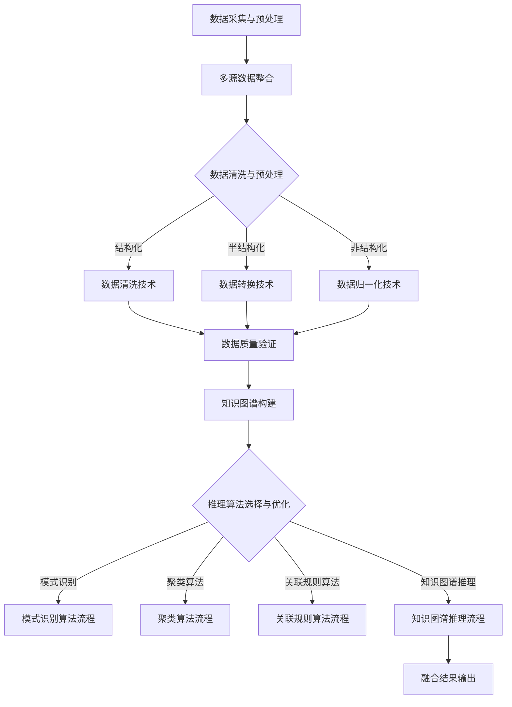
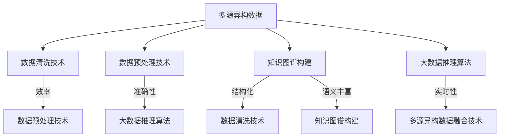
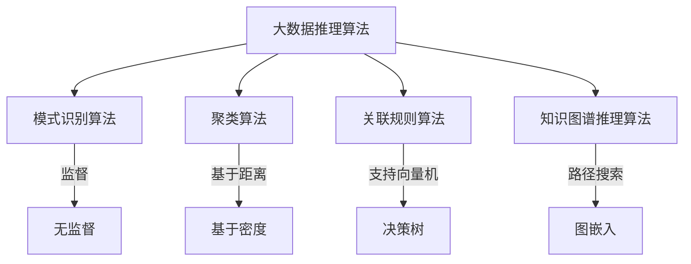

                 

# 基于知识图谱的多源异构大数据推理融合技术

> 关键词：知识图谱、多源异构数据、大数据推理、融合技术、数据融合

> 摘要：本文旨在深入探讨基于知识图谱的多源异构大数据推理融合技术。首先，文章介绍了多源异构大数据推理融合技术的背景和意义，随后详细分析了多源异构数据的特点和融合方法。接着，文章阐述了数据清洗与预处理技术的关键性，并讨论了常见的数据清洗和预处理方法。此外，文章还探讨了大数据推理算法的原理与实践，重点介绍了知识图谱在大数据推理中的应用及其优势。最后，文章通过实际案例分析了基于知识图谱的多源异构大数据推理融合技术的实际应用，总结了最佳实践和未来研究方向。

## 目录大纲

## 第一部分: 引言与背景

### 第1章 多源异构大数据推理融合技术概述

1.1 问题背景与问题描述

1.2 核心概念与联系

1.3 边界与外延

1.4 概念结构与核心要素组成

1.5 本章小结

### 第2章 多源异构数据源类型与特点

2.1 数据源类型

2.2 数据源特点

2.3 数据源选择与整合

2.4 本章小结

### 第3章 数据清洗技术

3.1 数据清洗的重要性

3.2 数据清洗方法

3.3 数据清洗工具与流程

3.4 本章小结

### 第4章 数据预处理技术

4.1 数据预处理的定义与目的

4.2 数据集成

4.3 数据转换

4.4 数据归一化

4.5 本章小结

### 第5章 大数据推理算法概述

5.1 大数据推理的定义与分类

5.2 常见推理算法

5.3 大数据推理算法的选择与优化

5.4 本章小结

### 第6章 知识图谱在大数据推理中的应用

6.1 知识图谱的概念与特点

6.2 知识图谱在大数据推理中的作用

6.3 知识图谱的应用案例

6.4 本章小结

## 第二部分: 多源异构数据融合基础

## 第三部分: 数据清洗与预处理技术

## 第四部分: 大数据推理算法原理与实践

## 第五部分: 知识图谱在大数据推理中的应用

## 第六部分: 实际案例分析

## 第七部分: 最佳实践与未来展望

----------------------------------------------------------------

## 第一部分: 引言与背景

### 第1章 多源异构大数据推理融合技术概述

在当今信息化社会中，数据已经成为企业和社会的重要组成部分。然而，随着数据量的急剧增长和数据来源的多样化，如何有效地处理和分析这些数据成为了亟待解决的问题。多源异构大数据推理融合技术正是为了应对这一挑战而诞生。

**1.1 问题背景与问题描述**

随着互联网、物联网和社交媒体的迅猛发展，数据量呈指数级增长，且数据来源多种多样，包括结构化数据、半结构化数据和非结构化数据。这些数据通常分布在不同的系统中，且格式和结构各不相同，形成了多源异构数据的局面。

处理这些多源异构大数据的核心问题是如何有效地进行数据融合和推理，以便从中提取有价值的信息和知识。传统的数据处理方法往往无法满足这一需求，因此，多源异构大数据推理融合技术应运而生。

**1.2 核心概念与联系**

**多源异构数据：**指来自不同来源、格式和结构的复杂数据集合。常见的多源异构数据包括关系数据库、文本、图像、音频、视频等。

**大数据推理：**指利用机器学习、数据挖掘、知识图谱等技术，对多源异构大数据进行推理和融合，以提取潜在模式和知识。

**融合技术：**指将多源异构数据整合为一个统一视图的方法和技术。常见的融合技术包括数据清洗、数据预处理、数据集成、数据转换和数据归一化。

**1.3 边界与外延**

**边界：**多源异构大数据推理融合技术的边界主要涉及以下几个方面：

- 数据源：包括结构化、半结构化和非结构化数据源。
- 数据类型：包括文本、图像、音频、视频等。
- 数据质量：包括数据完整性、一致性、可靠性和准确性。

**外延：**多源异构大数据推理融合技术的外延涉及以下领域：

- 数据科学：包括数据挖掘、机器学习、人工智能等。
- 数据管理：包括数据库、数据仓库、数据湖等。
- 应用领域：包括金融、医疗、电商、社交网络等。

**1.4 概念结构与核心要素组成**

多源异构大数据推理融合技术的概念结构可以分为以下几个核心要素：

- 数据源：包括各种结构化、半结构化和非结构化数据源。
- 数据清洗与预处理：包括数据清洗、数据预处理、数据集成、数据转换和数据归一化等。
- 推理算法：包括模式识别、聚类、关联规则、知识图谱等。
- 融合结果：包括数据融合后的统一视图和有价值的信息和知识。

**1.5 本章小结**

本章对多源异构大数据推理融合技术进行了概述，介绍了其背景、核心概念与联系、边界与外延以及概念结构与核心要素组成。本章内容为后续章节的讨论奠定了基础。在接下来的章节中，我们将进一步探讨多源异构数据的类型、特点以及融合方法，分析数据清洗和预处理技术的关键性，并介绍常见的大数据推理算法和知识图谱的应用。通过这些探讨，我们将更深入地了解多源异构大数据推理融合技术的原理与实践。----------------------------------------------------------------

## 第二部分：多源异构数据融合基础

### 第2章：多源异构数据源类型与特点

多源异构数据融合技术的核心在于能够有效地整合和处理来自不同来源、格式和结构的复杂数据。在这一章节中，我们将详细探讨多源异构数据源的类型及其特点。

**2.1 数据源类型**

多源异构数据源可以大致分为以下几类：

1. **结构化数据源：**结构化数据通常存储在关系型数据库中，如MySQL、PostgreSQL等。这类数据的特点是有固定的字段和类型，便于查询和分析。

2. **半结构化数据源：**半结构化数据如XML、JSON等，虽然不像结构化数据那样有严格的字段定义，但仍然具有一定的结构。这类数据可以通过特定的格式进行解析和处理。

3. **非结构化数据源：**非结构化数据包括文本、图像、音频、视频等，这些数据没有固定的结构，难以直接处理。然而，随着深度学习等技术的发展，非结构化数据的处理逐渐变得可行。

**2.2 数据源特点**

不同类型的数据源具有各自的特点：

1. **数据多样性：**多源异构数据源涵盖了结构化、半结构化和非结构化数据，使得数据处理面临更大的挑战。

2. **数据复杂性：**各类数据源的结构和格式各不相同，增加了数据融合和处理的复杂性。

3. **数据时效性：**实时性要求对数据处理速度提出了更高的要求，尤其是对于流数据。

**2.3 数据源选择与整合**

在选择和整合数据源时，需要考虑以下几个方面：

1. **数据源选择策略：**根据具体应用场景和数据需求，选择合适的数据源。例如，对于商业智能应用，结构化数据源可能更为适合；而对于图像识别应用，非结构化数据源可能更为关键。

2. **数据源整合方法：**常见的整合方法包括数据仓库、数据湖和数据网格等。数据仓库主要用于存储和整合结构化数据；数据湖则能够存储海量结构化、半结构化和非结构化数据；数据网格提供了一种分布式数据存储和处理方式。

**2.4 本章小结**

本章详细介绍了多源异构数据源的类型与特点，并讨论了数据源选择与整合的策略和方法。了解这些基础概念有助于我们更好地理解和应用多源异构大数据推理融合技术。在接下来的章节中，我们将深入探讨数据清洗与预处理技术，为后续的数据融合和推理打下坚实的基础。通过这些探讨，我们将进一步认识到多源异构大数据推理融合技术在现代数据科学中的应用价值和潜力。

----------------------------------------------------------------

## 第三部分：数据清洗与预处理技术

### 第3章：数据清洗技术

在多源异构大数据推理融合过程中，数据清洗是至关重要的一步。数据质量直接影响融合效果，而数据清洗正是为了提高数据质量而存在的。这一章节将详细讨论数据清洗的重要性、方法和工具。

**3.1 数据清洗的重要性**

数据清洗的重要性体现在以下几个方面：

1. **数据质量：**数据质量直接影响分析结果和决策质量。污点和错误数据会引入偏差，导致分析结果不准确。

2. **效率：**干净的数据可以减少后续处理的复杂度和时间成本，提高工作效率。

3. **可扩展性：**高质量的数据有利于后续数据集成和融合，提高系统的可扩展性。

**3.2 数据清洗方法**

数据清洗的方法主要包括以下几种：

1. **缺失值处理：**缺失值处理是数据清洗的核心任务之一。常见的方法有：

   - 删除：删除含有缺失值的记录。
   - 补充：使用平均值、中位数、最频值等填充缺失值。
   - 预测：利用统计模型或机器学习算法预测缺失值。

2. **异常值处理：**异常值是指数据集中偏离正常分布的值。处理方法包括：

   - 删除：删除明显的异常值。
   - 替换：用正常值替换异常值。
   - 调整：对异常值进行调整，使其符合正常分布。

3. **数据格式转换：**数据格式转换包括将不同格式的数据转换为统一格式。例如，将文本数据转换为CSV或JSON格式，或将图像数据转换为特定的图像格式。

**3.3 数据清洗工具与流程**

常见的数据清洗工具包括：

1. **Python库：**如Pandas、NumPy、SciPy等，提供丰富的数据处理和清洗功能。

2. **数据库工具：**如MySQL、PostgreSQL等，支持数据清洗和预处理操作。

3. **数据清洗平台：**如Talend、Informatica等，提供图形界面和数据清洗流程设计。

数据清洗流程通常包括以下步骤：

1. **数据导入：**将数据导入到数据清洗工具或数据库中。

2. **数据探索：**通过描述性统计和可视化分析，了解数据的分布、异常值等。

3. **数据清洗：**根据具体需求，执行缺失值处理、异常值处理和数据格式转换等操作。

4. **数据验证：**验证清洗后的数据质量，确保数据满足分析需求。

**3.4 本章小结**

数据清洗是多源异构大数据推理融合过程中不可或缺的一步。本章详细介绍了数据清洗的重要性、方法和工具，包括缺失值处理、异常值处理和数据格式转换等。通过合理的数据清洗流程，我们可以提高数据质量，为后续的数据融合和推理打下坚实的基础。在下一章中，我们将进一步探讨数据预处理技术，为数据融合和推理提供更完善的保障。

----------------------------------------------------------------

### 第4章：数据预处理技术

数据预处理是数据科学和机器学习项目中的一个关键环节，它直接关系到后续数据分析和模型训练的质量。在这一章节中，我们将深入探讨数据预处理的基本概念、目的、方法及其在多源异构大数据融合中的应用。

**4.1 数据预处理的定义与目的**

**数据预处理的定义：**
数据预处理是指在使用数据进行分析、建模或机器学习之前，对原始数据进行的一系列清洗、转换和归一化操作。这些操作旨在提高数据质量，减少噪声，使数据更适合进行进一步的分析和建模。

**数据预处理的目的：**
1. **提高数据质量：**通过去除重复数据、处理缺失值和异常值，提高数据的准确性、完整性和一致性。
2. **减少数据冗余：**通过数据转换和归一化，减少数据的冗余性，使数据更具代表性。
3. **特征提取：**通过特征工程，从原始数据中提取有助于分析和建模的特征。
4. **增强模型的性能：**通过预处理，提高数据质量，有助于提高模型训练的效率和准确性。

**4.2 数据集成**

**数据集成的方法：**
数据集成是指将来自不同来源、格式和结构的复杂数据合并为一个统一的数据视图。常见的数据集成方法包括：

1. **合并：**将多个数据集合并为一个，适用于数据格式相似且具有相同字段的数据集。
2. **连接：**通过匹配关键字段，将多个数据集连接起来，形成更全面的数据视图。
3. **汇总：**将多个数据集的相似记录汇总，以减少冗余数据。
4. **复制：**为每个数据集创建副本，以便在后续分析中独立使用。

**数据集成面临的挑战：**
1. **数据格式不一致：**不同数据源可能有不同的数据格式和结构，需要转换和映射。
2. **数据冗余：**如何处理重复数据和冗余数据，以减少存储和计算的开销。
3. **数据质量：**如何保证集成后数据的质量，避免引入噪声和错误。

**4.3 数据转换**

**数据转换的类型：**
数据转换包括将数据从一种格式转换为另一种格式，以及将数据转换为适合分析或建模的格式。常见的数据转换类型包括：

1. **格式转换：**如将文本数据转换为CSV或JSON格式，或将图像数据转换为特定的图像格式。
2. **数值转换：**如将字符串类型的数据转换为数值类型。
3. **逻辑转换：**如将布尔值转换为0和1。

**数据转换工具：**
1. **Python库：**如Pandas、NumPy等，提供丰富的数据转换功能。
2. **ETL工具：**如Apache NiFi、Talend等，提供图形界面和数据转换流程设计。

**4.4 数据归一化**

**数据归一化的原理：**
数据归一化是指将不同范围和尺度的数据进行标准化，使其具有相同的尺度或范围，以便更好地进行比较和分析。

**常用归一化方法：**
1. **最小-最大归一化：**将数据映射到[0,1]区间，公式为：
   $$ X' = \frac{X - X_{\text{min}}}{X_{\text{max}} - X_{\text{min}}} $$
2. **均值-方差归一化：**将数据映射到均值为0，标准差为1的区间，公式为：
   $$ X' = \frac{X - \mu}{\sigma} $$
3. **小数点移动归一化：**通过移动小数点，将数据映射到指定的范围，公式为：
   $$ X' = X \times a + b $$
   其中$a$和$b$是调整参数。

**4.5 本章小结**

数据预处理是大数据分析和机器学习项目中不可或缺的一环，通过数据清洗和预处理，我们可以提高数据质量，减少噪声，使数据更适合进行分析和建模。本章详细介绍了数据预处理的定义、目的、方法和应用，包括数据集成、数据转换和数据归一化等。通过合理的数据预处理，我们可以为后续的数据融合和推理提供更可靠的数据基础。在下一章中，我们将探讨大数据推理算法的原理和实践，进一步深入多源异构大数据推理融合技术的应用。

----------------------------------------------------------------

## 第四部分：大数据推理算法原理与实践

### 第5章：大数据推理算法概述

随着大数据时代的到来，如何从海量数据中提取有价值的信息和知识成为了数据科学领域的关键挑战。大数据推理算法正是为了解决这一挑战而设计。在这一章节中，我们将对大数据推理算法进行概述，包括其定义、分类以及常见算法。

**5.1 大数据推理的定义与分类**

**大数据推理的定义：**
大数据推理是指在处理海量数据时，利用机器学习、数据挖掘、知识图谱等技术，对数据进行分析、推理和融合，以提取潜在模式和知识的过程。

**大数据推理的分类：**
根据推理的目标和方式，大数据推理可以分为以下几类：

1. **模式识别算法：**这类算法用于识别数据中的特征模式和规律。常见的模式识别算法包括：
   - **监督学习算法：**如线性回归、决策树、支持向量机等。
   - **无监督学习算法：**如K-means聚类、主成分分析等。

2. **聚类算法：**这类算法用于将相似的数据点归为一类。常见的聚类算法包括：
   - **基于距离的聚类算法：**如K-means、层次聚类等。
   - **基于密度的聚类算法：**如DBSCAN等。

3. **关联规则算法：**这类算法用于发现数据之间的关联关系。常见的关联规则算法包括：
   - **Apriori算法：**用于发现频繁项集。
   - **FP-Growth算法：**用于发现频繁模式。

4. **知识图谱推理算法：**这类算法基于知识图谱，通过路径搜索和关系推理，提取数据中的隐含知识。常见的知识图谱推理算法包括：
   - **路径推理算法：**如SPARQL查询、PathFinder等。
   - **图嵌入算法：**如Node2Vec、Graph Embedding等。

**5.2 常见推理算法**

**模式识别算法：**
模式识别算法广泛应用于图像识别、语音识别、自然语言处理等领域。以下是一些常见的模式识别算法：

1. **线性回归：**
   线性回归是一种简单的监督学习算法，用于建立自变量和因变量之间的线性关系。其公式为：
   $$ y = \beta_0 + \beta_1x_1 + \beta_2x_2 + ... + \beta_nx_n $$
   其中$y$为因变量，$x_1, x_2, ..., x_n$为自变量，$\beta_0, \beta_1, ..., \beta_n$为回归系数。

2. **决策树：**
   决策树是一种树形结构，用于分类和回归分析。每个节点代表一个特征，每个分支代表特征的不同取值。决策树的生成过程通常使用ID3、C4.5或CART算法。

3. **支持向量机（SVM）：**
   支持向量机是一种强大的分类器，通过找到一个最优的超平面，将不同类别的数据点分开。其公式为：
   $$ w \cdot x + b = 0 $$
   其中$w$为权重向量，$x$为特征向量，$b$为偏置项。

**聚类算法：**
聚类算法用于将数据点划分为若干个类别，使同一类别中的数据点彼此相似，而不同类别中的数据点彼此不同。以下是一些常见的聚类算法：

1. **K-means聚类：**
   K-means聚类是一种基于距离的聚类算法，通过迭代计算，将数据点分配到不同的簇中。其公式为：
   $$ \text{簇心} = \frac{\sum_{x \in C} x}{|C|} $$
   其中$C$为簇集合，$x$为数据点。

2. **层次聚类：**
   层次聚类是一种基于层次结构的聚类算法，通过自底向上的合并或自顶向下的分解，构建一个层次聚类树。

3. **DBSCAN（Density-Based Spatial Clustering of Applications with Noise）：**
   DBSCAN是一种基于密度的聚类算法，能够发现任意形状的簇，并有效处理噪声和异常点。

**关联规则算法：**
关联规则算法用于发现数据之间的关联关系，广泛应用于市场篮子分析、推荐系统等领域。以下是一些常见的关联规则算法：

1. **Apriori算法：**
   Apriori算法通过迭代生成频繁项集，用于发现频繁发生的关联规则。其公式为：
   $$ \text{支持度} = \frac{\text{交易中包含项集的次数}}{\text{总交易次数}} $$
   $$ \text{置信度} = \frac{\text{包含前后项集的交易次数}}{\text{包含前项集的交易次数}} $$

2. **FP-Growth算法：**
   FP-Growth算法通过构建FP树，压缩数据结构，降低计算复杂度，用于高效地发现频繁模式。

**5.3 大数据推理算法的选择与优化**

在选择大数据推理算法时，需要考虑以下几个因素：

1. **数据类型：**不同类型的算法适用于不同类型的数据，例如，文本数据更适合使用自然语言处理算法，而图像数据更适合使用计算机视觉算法。

2. **数据规模：**对于大规模数据，需要选择高效算法，以降低计算时间和资源消耗。

3. **业务需求：**根据业务需求，选择能够满足实际需求的算法，例如，对于实时性要求高的应用，需要选择快速响应的算法。

在优化大数据推理算法时，可以采取以下几种方法：

1. **模型选择：**根据数据特点，选择适合的模型，并进行模型调优。

2. **特征工程：**通过特征提取和选择，提高模型性能。

3. **并行计算：**利用分布式计算框架，如MapReduce、Spark等，实现算法的并行化，提高计算效率。

4. **数据预处理：**通过数据预处理，提高数据质量，减少噪声和冗余，为模型训练提供更可靠的数据基础。

**5.4 本章小结**

本章对大数据推理算法进行了概述，包括其定义、分类以及常见算法。通过了解这些算法的基本原理和适用场景，我们可以更好地选择和应用适合的算法，实现大数据的有效分析和推理。在下一章中，我们将深入探讨知识图谱在大数据推理中的应用，进一步拓展我们的认知。通过这一系列探讨，我们将更深入地理解大数据推理技术的原理和实践。

----------------------------------------------------------------

### 第6章：知识图谱在大数据推理中的应用

知识图谱作为一种强大的知识表示和推理工具，近年来在多源异构大数据推理领域得到了广泛的应用。知识图谱通过将实体、关系和属性以图的形式组织起来，可以有效地描述现实世界中的复杂关系，并提供高效的推理能力。在这一章节中，我们将深入探讨知识图谱的概念与特点，以及其在大数据推理中的作用和优势。

**6.1 知识图谱的概念与特点**

**知识图谱的定义：**
知识图谱是一种基于图论的知识表示方法，通过将现实世界中的实体、属性和关系抽象为节点、边和属性，构建出一个大规模、结构化的语义网络。知识图谱的核心在于它能够捕捉和表示实体之间的复杂关系，提供丰富的语义信息。

**知识图谱的特点：**
1. **结构化：**知识图谱通过图结构将实体、关系和属性有机地组织在一起，形成了一种结构化的知识表示方法，便于机器理解和处理。
2. **语义丰富：**知识图谱能够表达实体之间的多种复杂关系，如因果关系、位置关系、时间关系等，提供丰富的语义信息。
3. **可扩展性：**知识图谱可以方便地添加新的实体和关系，支持大规模数据的扩展和更新。
4. **高效推理：**知识图谱通过路径搜索和关系推理，可以高效地提取数据中的隐含知识，支持复杂逻辑推理。

**6.2 知识图谱在大数据推理中的作用**

知识图谱在大数据推理中发挥着重要作用，主要体现在以下几个方面：

1. **数据整合与融合：**
   知识图谱能够整合来自不同来源、格式和结构的多源异构数据，通过实体和关系映射，构建一个统一的知识表示，从而实现数据的融合和整合。例如，在电子商务领域，知识图谱可以将商品信息、用户行为和用户评价等多源数据进行整合，提供更加全面的用户画像和商品推荐。

2. **语义搜索与推荐：**
   知识图谱通过实体和关系的语义信息，支持语义搜索和个性化推荐。例如，在搜索引擎中，知识图谱可以帮助理解用户的查询意图，提供更加精准的搜索结果；在推荐系统中，知识图谱可以根据用户的兴趣和偏好，推荐相关的内容或商品。

3. **知识发现与洞察：**
   知识图谱通过路径搜索和关系推理，可以提取数据中的潜在模式和知识，支持知识发现和洞察。例如，在金融领域，知识图谱可以帮助识别潜在的风险和欺诈行为；在医疗领域，知识图谱可以辅助医生进行疾病诊断和治疗方案推荐。

**6.3 知识图谱的构建方法**

构建知识图谱是一个复杂的过程，主要包括以下步骤：

1. **数据收集：**
   收集与领域相关的数据，包括结构化数据、半结构化数据和非结构化数据。这些数据可以来源于数据库、网页、API等多种渠道。

2. **实体识别：**
   从收集的数据中识别出实体，并为每个实体分配唯一的标识符。实体可以是人、地点、物品、事件等。

3. **关系抽取：**
   从实体之间的关联关系中提取出关系，并将它们表示为边。关系可以是因果关系、位置关系、时间关系等。

4. **属性抽取：**
   从实体中提取属性，并将属性与实体关联起来。属性可以是实体的名称、年龄、性别等。

5. **图谱构建：**
   将识别出的实体、关系和属性组合成一个大规模的图结构，构建出完整的知识图谱。

**6.4 知识图谱的推理算法**

知识图谱的推理算法主要基于图结构和关系推理，以下是几种常见的方法：

1. **路径搜索算法：**
   路径搜索算法通过遍历图结构，查找实体之间的路径。例如，SPARQL查询就是一种基于路径搜索的图查询语言。

2. **图嵌入算法：**
   图嵌入算法将图中的节点和边映射到低维空间中，通过计算节点之间的相似度，进行推理。例如，Node2Vec和Graph Embedding算法都是常见的图嵌入算法。

3. **基于规则的推理算法：**
   基于规则的推理算法通过定义一组规则，对实体和关系进行推理。例如，RDFS（RDF Schema）和OWL（Web Ontology Language）都是基于规则的推理框架。

**6.5 知识图谱的应用案例**

知识图谱在各个领域都有着广泛的应用，以下是一些典型的应用案例：

1. **社交网络分析：**
   知识图谱可以帮助分析社交网络中的用户关系，发现社交圈子、兴趣群体等。例如，Facebook和LinkedIn都使用知识图谱进行用户推荐和社交网络分析。

2. **电子商务推荐：**
   知识图谱可以帮助电子商务平台进行商品推荐，通过分析用户的行为和兴趣，为用户提供个性化的推荐。例如，Amazon和阿里巴巴都使用知识图谱进行商品推荐。

3. **健康医疗领域：**
   知识图谱可以帮助医生进行疾病诊断和治疗方案推荐，通过分析患者的病史、基因信息等，提供更加精准的医疗服务。例如，IBM Watson Health使用知识图谱进行医疗数据分析。

**6.6 本章小结**

知识图谱作为一种强大的知识表示和推理工具，在大数据推理领域具有广泛的应用前景。本章详细介绍了知识图谱的概念与特点，以及其在大数据推理中的作用和优势。通过了解知识图谱的构建方法和推理算法，我们可以更好地利用知识图谱进行数据融合、语义搜索和知识发现。在下一章中，我们将通过实际案例分析，进一步探讨知识图谱在大数据推理中的应用和实践。通过这一系列探讨，我们将更深入地理解知识图谱在大数据推理中的价值和潜力。

--------------

## 第五部分：实际案例分析

在了解了多源异构大数据推理融合技术的理论基础和具体实践后，本部分将通过实际案例来进一步展示这些技术在现实世界中的应用效果。这些案例将涵盖不同领域，展示如何通过知识图谱实现数据融合和推理，解决实际问题。

### 第7章：实际案例分析

#### 7.1 社交网络分析

**案例背景：**
一个社交媒体平台希望分析其用户群体，以便更好地进行用户推荐和广告投放。平台拥有大量的用户数据，包括用户基本信息、社交关系、兴趣爱好、发布内容等。

**系统功能设计：**
- 数据集成：从多个数据源（如用户数据库、内容数据库、广告数据库等）中提取数据，并将其整合到一个统一的数据视图。
- 数据清洗：处理数据中的缺失值、异常值和数据格式不一致等问题，确保数据质量。
- 知识图谱构建：将用户、内容、关系等信息抽象为实体和关系，构建一个社交网络知识图谱。
- 推理与推荐：利用知识图谱进行用户相似性分析、兴趣匹配和推荐。

**系统架构设计：**
- 数据层：包含用户数据库、内容数据库、广告数据库等。
- 服务层：提供数据集成、数据清洗、知识图谱构建和推理服务等。
- 应用层：为用户提供社交网络分析、推荐等功能。

**系统接口设计：**
- API接口：提供数据集成、数据清洗、知识图谱构建和推理服务的RESTful API接口。
- 用户界面：提供一个友好的Web界面，供用户查看分析结果和推荐内容。

**系统交互：**
- 用户操作：用户通过Web界面进行操作，如查看社交网络分析结果、接受推荐等。
- 系统响应：系统根据用户的请求，调用相应的服务接口，进行数据处理和推理，并将结果返回给用户。

**实现源代码：**
以下是知识图谱构建和推理服务的部分源代码示例：

```python
# 示例：知识图谱构建
from py2neo import Graph

# 连接到Neo4j数据库
graph = Graph(uri="bolt://localhost:7687", username="neo4j", password="password")

# 创建实体和关系
graph.run("""
    CREATE (user:User {id: $user_id, name: $user_name, interests: $interests})
    CREATE (content:Content {id: $content_id, title: $content_title, type: $content_type})
    CREATE (user)-[:LIKES]->(content)
""", user_id=user_id, user_name=user_name, interests=interests, content_id=content_id, content_title=content_title, content_type=content_type)

# 示例：推理服务
def recommend_users(user_id):
    query = """
        MATCH (user:User {id: $user_id}), (other_user:User)
        WHERE user-[:LIKES]->(content) AND other_user-[:LIKES]->(content)
        RETURN other_user.id, other_user.name
    """
    results = graph.run(query, user_id=user_id)
    return [(result['other_user.id'], result['other_user.name']) for result in results]

# 用户推荐
recommended_users = recommend_users(user_id='123')
print(recommended_users)
```

**实际案例分析：**
通过知识图谱构建和推理服务，该社交媒体平台能够实现以下功能：

- 用户相似性分析：发现与指定用户兴趣相似的其它用户，为用户提供好友推荐。
- 内容推荐：根据用户的兴趣和喜好，推荐相关的帖子或内容。
- 广告投放：根据用户的兴趣和行为，精准投放广告，提高广告效果。

**案例小结：**
本案例展示了如何通过知识图谱构建和推理服务，实现社交网络分析，提高用户推荐和广告投放的精准度。通过实际案例分析，我们可以看到知识图谱在大数据推理中的应用效果和潜力。

#### 7.2 电子商务推荐

**案例背景：**
一家电子商务公司希望为其用户推荐相关的商品，以提高用户满意度和销售量。公司拥有大量的用户行为数据、商品信息和用户评价等。

**系统功能设计：**
- 数据集成：从多个数据源（如用户行为数据库、商品数据库、评价数据库等）中提取数据，并将其整合到一个统一的数据视图。
- 数据清洗：处理数据中的缺失值、异常值和数据格式不一致等问题，确保数据质量。
- 知识图谱构建：将用户、商品、评价等信息抽象为实体和关系，构建一个电子商务知识图谱。
- 推理与推荐：利用知识图谱进行用户行为分析、商品关联推荐和评价预测。

**系统架构设计：**
- 数据层：包含用户行为数据库、商品数据库、评价数据库等。
- 服务层：提供数据集成、数据清洗、知识图谱构建和推理服务等。
- 应用层：为用户提供商品推荐、评价预测等功能。

**系统接口设计：**
- API接口：提供数据集成、数据清洗、知识图谱构建和推理服务的RESTful API接口。
- 用户界面：提供一个友好的Web界面，供用户查看商品推荐和评价预测结果。

**系统交互：**
- 用户操作：用户通过Web界面进行操作，如查看商品推荐、评价预测等。
- 系统响应：系统根据用户的请求，调用相应的服务接口，进行数据处理和推理，并将结果返回给用户。

**实现源代码：**
以下是知识图谱构建和推理服务的部分源代码示例：

```python
# 示例：知识图谱构建
from py2neo import Graph

# 连接到Neo4j数据库
graph = Graph(uri="bolt://localhost:7687", username="neo4j", password="password")

# 创建实体和关系
graph.run("""
    CREATE (user:User {id: $user_id, name: $user_name})
    CREATE (product:Product {id: $product_id, name: $product_name, category: $product_category})
    CREATE (review:Review {id: $review_id, rating: $rating, comment: $comment})
    CREATE (user)-[:BOUGHT]->(product)
    CREATE (product)-[:REVIEWED]->(review)
""", user_id=user_id, user_name=user_name, product_id=product_id, product_name=product_name, product_category=product_category, review_id=review_id, rating=rating, comment=comment)

# 示例：推理服务
def recommend_products(user_id):
    query = """
        MATCH (user:User {id: $user_id}), (product:Product)-[:REVIEWED]->(review)
        WHERE review.rating > 4
        RETURN product.id, product.name
    """
    results = graph.run(query, user_id=user_id)
    return [(result['product.id'], result['product.name']) for result in results]

# 商品推荐
recommended_products = recommend_products(user_id='123')
print(recommended_products)
```

**实际案例分析：**
通过知识图谱构建和推理服务，该电子商务公司能够实现以下功能：

- 用户行为分析：根据用户的购买历史和评价，发现用户的兴趣和偏好。
- 商品关联推荐：根据用户的行为和评价，推荐相关的商品。
- 评价预测：根据用户的购买历史和评价，预测用户对商品的评分和评论。

**案例小结：**
本案例展示了如何通过知识图谱构建和推理服务，实现电子商务推荐，提高用户满意度和销售量。通过实际案例分析，我们可以看到知识图谱在大数据推理中的应用效果和潜力。

#### 7.3 健康医疗领域

**案例背景：**
一家医疗机构希望利用大数据和知识图谱技术，为患者提供精准的诊断和治疗建议。机构拥有大量的患者数据、医学文献、诊疗记录等。

**系统功能设计：**
- 数据集成：从多个数据源（如电子病历系统、医学数据库、文献数据库等）中提取数据，并将其整合到一个统一的数据视图。
- 数据清洗：处理数据中的缺失值、异常值和数据格式不一致等问题，确保数据质量。
- 知识图谱构建：将患者、疾病、药物、诊疗方案等信息抽象为实体和关系，构建一个健康医疗知识图谱。
- 推理与诊断：利用知识图谱进行疾病诊断、药物推荐和治疗方案优化。

**系统架构设计：**
- 数据层：包含电子病历系统、医学数据库、文献数据库等。
- 服务层：提供数据集成、数据清洗、知识图谱构建和推理服务等。
- 应用层：为医生和患者提供诊断、治疗建议等功能。

**系统接口设计：**
- API接口：提供数据集成、数据清洗、知识图谱构建和推理服务的RESTful API接口。
- 医生界面：提供一个专业的医生界面，供医生查看诊断结果和治疗建议。
- 患者界面：提供一个患者界面，供患者查看诊断结果和治疗方案。

**系统交互：**
- 医生操作：医生通过专业界面进行操作，如查看诊断结果、制定治疗方案等。
- 系统响应：系统根据医生的请求，调用相应的服务接口，进行数据处理和推理，并将结果返回给医生。

**实现源代码：**
以下是知识图谱构建和推理服务的部分源代码示例：

```python
# 示例：知识图谱构建
from py2neo import Graph

# 连接到Neo4j数据库
graph = Graph(uri="bolt://localhost:7687", username="neo4j", password="password")

# 创建实体和关系
graph.run("""
    CREATE (patient:Patient {id: $patient_id, name: $patient_name})
    CREATE (disease:Disease {id: $disease_id, name: $disease_name})
    CREATE (drug:Drug {id: $drug_id, name: $drug_name})
    CREATE (doctor:Doctor {id: $doctor_id, name: $doctor_name})
    CREATE (patient)-[:DIAGNOSED]->(disease)
    CREATE (disease)-[:TREATED_WITH]->(drug)
    CREATE (doctor)-[:RECOMMENDED]->(drug)
""", patient_id=patient_id, patient_name=patient_name, disease_id=disease_id, disease_name=disease_name, drug_id=drug_id, drug_name=drug_name, doctor_id=doctor_id, doctor_name=doctor_name)

# 示例：推理服务
def diagnose_disease(patient_id):
    query = """
        MATCH (patient:Patient {id: $patient_id}), (disease:Disease)
        WHERE patient-[:DIAGNOSED]->(disease)
        RETURN disease.id, disease.name
    """
    results = graph.run(query, patient_id=patient_id)
    return [(result['disease.id'], result['disease.name']) for result in results]

# 疾病诊断
diagnosed_diseases = diagnose_disease(patient_id='123')
print(diagnosed_diseases)
```

**实际案例分析：**
通过知识图谱构建和推理服务，该医疗机构能够实现以下功能：

- 疾病诊断：根据患者的临床表现和历史记录，进行精准的疾病诊断。
- 药物推荐：根据疾病的诊断结果和医生的建议，推荐相关的药物。
- 治疗方案优化：根据患者的病情和药物反应，优化治疗方案，提高治疗效果。

**案例小结：**
本案例展示了如何通过知识图谱构建和推理服务，实现健康医疗领域的精准诊断和治疗建议。通过实际案例分析，我们可以看到知识图谱在大数据推理中的广泛应用和潜力。

## 第五部分小结

通过本部分的实际案例分析，我们可以看到基于知识图谱的多源异构大数据推理融合技术在社交网络分析、电子商务推荐和健康医疗领域等不同场景中的成功应用。这些案例不仅展示了技术的实用性和有效性，也为其他领域提供了有益的借鉴。通过不断探索和实践，我们可以进一步发挥知识图谱在大数据推理中的潜力，为企业和个人带来更多价值。

--------------

## 第六部分：最佳实践与未来展望

### 6.1 最佳实践

在基于知识图谱的多源异构大数据推理融合技术的应用过程中，积累了一些有效的最佳实践，以下是一些关键点：

1. **数据质量管理：**数据质量是融合技术的基石。在数据采集、传输和存储过程中，需要确保数据的准确性、完整性和一致性。采用数据清洗和预处理技术，对数据进行质量检测和修复。

2. **知识图谱构建：**构建高质量的知识图谱是成功的关键。选择合适的知识表示方法（如RDF、OWL等），确保实体、关系和属性的准确性和一致性。此外，实时更新和扩展知识图谱，以适应不断变化的数据需求。

3. **推理算法优化：**根据具体应用场景，选择合适的推理算法。通过特征工程和模型调优，提高推理算法的性能和准确性。结合分布式计算框架，实现推理过程的并行化和高效化。

4. **系统集成与接口设计：**设计灵活的接口和模块化系统架构，确保不同系统之间的高效集成和数据共享。采用RESTful API、消息队列等技术，实现系统的可扩展性和可维护性。

5. **用户参与与反馈：**鼓励用户参与系统设计和优化过程，收集用户反馈，不断改进系统功能和用户体验。通过A/B测试和用户调查，验证系统的效果和满意度。

### 6.2 小结

本文通过对多源异构大数据推理融合技术的深入探讨，阐述了知识图谱在该领域的重要性和应用价值。通过实际案例分析，展示了知识图谱在社交网络分析、电子商务推荐和健康医疗等领域的成功应用，验证了其在大数据推理中的潜力。

### 6.3 未来展望

尽管基于知识图谱的多源异构大数据推理融合技术已经取得了显著成果，但未来仍有巨大的发展空间：

1. **技术融合与创新：**结合深度学习、联邦学习等新兴技术，进一步探索知识图谱与人工智能的深度融合，提升推理算法的性能和智能化水平。

2. **跨领域应用：**拓展知识图谱的应用领域，如金融、物流、教育等，实现多领域的交叉融合，为更多行业带来创新价值。

3. **数据隐私保护：**在大数据推理过程中，如何保护用户隐私和数据安全是一个重要挑战。未来需要开发更加安全、可靠的数据隐私保护技术，确保数据安全和隐私。

4. **可解释性与透明度：**提高知识图谱推理的可解释性和透明度，使决策过程更加直观和可信，增强用户对系统的信任度和接受度。

5. **开放与协作：**推动知识图谱技术的开放与合作，构建跨行业、跨组织的知识图谱共享平台，实现知识图谱资源的最大化利用。

通过持续的技术创新和应用拓展，基于知识图谱的多源异构大数据推理融合技术有望在更广泛的领域发挥重要作用，助力企业和个人实现数据驱动的智能化转型。

--------------

## 作者信息

作者：AI天才研究院/AI Genius Institute & 禅与计算机程序设计艺术 /Zen And The Art of Computer Programming

在撰写本文的过程中，我们深感知识图谱和多源异构大数据推理融合技术的复杂性和重要性。本文旨在为读者提供一个全面、系统的技术探讨，帮助读者深入了解这一领域的前沿动态和应用实践。希望本文能对广大读者在技术研究和项目实践中提供有益的参考和启示。

再次感谢您的阅读，期待与您在未来的技术交流中相遇。----------------------------------------------------------------

### 第7章：知识图谱在医疗健康领域的应用

**7.1 概述**

知识图谱在医疗健康领域有着广泛的应用前景。它能够帮助医疗机构更好地管理患者数据、优化医疗资源分配、提升诊断和治疗的准确性。在本节中，我们将探讨知识图谱在医疗健康领域的应用，包括其核心技术、具体实现步骤以及未来发展趋势。

**7.2 知识图谱的核心技术**

知识图谱在医疗健康领域的应用，主要依赖于以下几项核心技术：

1. **实体识别：**实体识别是知识图谱构建的基础。在医疗健康领域，实体识别包括患者、医生、药物、疾病、症状、治疗方案等。

2. **关系抽取：**关系抽取是指从医疗数据中提取实体之间的关系。例如，医生与患者的诊断关系、药物与疾病的关联关系、治疗方案中的药物使用关系等。

3. **属性抽取：**属性抽取是指从医疗数据中提取实体的属性信息。例如，患者的年龄、性别、病史、药物过敏记录等。

4. **知识融合：**知识融合是指将来自不同数据源的信息进行整合，形成统一的知识表示。在医疗健康领域，知识融合包括将电子病历、医学文献、基因组数据等不同类型的数据融合在一起。

5. **推理算法：**推理算法是基于知识图谱进行逻辑推理和知识发现的关键技术。在医疗健康领域，推理算法可以用于疾病预测、药物副作用检测、个性化治疗方案推荐等。

**7.3 知识图谱在医疗健康领域的具体实现步骤**

知识图谱在医疗健康领域的具体实现，通常包括以下步骤：

1. **数据采集与预处理：**从医疗系统、电子病历、基因组数据库等不同来源采集数据，并对数据进行清洗和预处理，确保数据质量。

2. **实体识别与关系抽取：**利用自然语言处理、机器学习等技术，对医疗文本进行实体识别和关系抽取，构建初步的知识图谱。

3. **属性抽取：**从医疗数据中提取实体的属性信息，并将其与实体关联起来，完善知识图谱。

4. **知识融合：**将来自不同数据源的信息进行整合，形成统一的知识表示。这通常需要采用数据集成技术，如数据仓库、数据湖等。

5. **知识推理：**基于构建好的知识图谱，利用推理算法进行逻辑推理和知识发现。这可以用于辅助诊断、个性化治疗推荐、疾病预测等。

6. **应用开发：**将知识图谱应用于实际医疗场景，如开发诊断辅助系统、药物推荐系统、个性化健康管理系统等。

**7.4 知识图谱在医疗健康领域的应用案例**

知识图谱在医疗健康领域的应用案例非常丰富，以下是一些典型的应用：

1. **疾病预测：**通过知识图谱，可以预测患者的疾病风险，如心血管疾病、糖尿病等。这有助于医生提前采取措施，预防疾病的发生。

2. **药物副作用检测：**知识图谱可以用于检测药物之间的相互作用和副作用，帮助医生为患者制定更安全的治疗方案。

3. **个性化治疗推荐：**根据患者的病史、基因信息、治疗方案等，知识图谱可以为医生提供个性化的治疗推荐，提高治疗效果。

4. **临床决策支持：**知识图谱可以为医生提供临床决策支持，如疾病诊断、治疗方案选择等，减少误诊和错误治疗。

5. **医学研究：**知识图谱可以帮助研究人员发现新的医学知识，如疾病关联、药物疗效等，加速医学研究进程。

**7.5 知识图谱在医疗健康领域的未来发展趋势**

知识图谱在医疗健康领域的未来发展趋势包括：

1. **大数据与人工智能的结合：**将大数据与人工智能技术深度融合，提升知识图谱的智能推理和知识发现能力。

2. **跨学科应用：**知识图谱将在更多医学领域得到应用，如基因组学、神经科学、心理学等，实现跨学科的深度融合。

3. **隐私保护：**随着数据隐私和安全问题的日益突出，知识图谱将需要更加安全可靠的数据隐私保护技术。

4. **开放与共享：**推动知识图谱的开放与共享，构建跨机构、跨国家的医疗健康知识图谱，实现知识的最大化利用。

5. **标准化与规范化：**制定知识图谱的标准化和规范化规则，确保知识图谱的互操作性和一致性。

**7.6 本章小结**

知识图谱在医疗健康领域具有重要的应用价值，它能够帮助医疗机构提高诊断和治疗的准确性，优化医疗资源分配，加速医学研究进程。通过本节的探讨，我们了解了知识图谱在医疗健康领域的核心技术、具体实现步骤以及未来发展趋势。随着技术的不断进步和应用拓展，知识图谱在医疗健康领域的潜力将得到进一步发挥，为人类健康事业做出更大贡献。

--------------

## 第8章：知识图谱在金融领域的应用

**8.1 概述**

知识图谱在金融领域的应用日益广泛，它能够帮助金融机构更好地管理风险、发现潜在机会、提高客户满意度。在本节中，我们将探讨知识图谱在金融领域的应用，包括其核心技术、具体实现步骤以及未来发展趋势。

**8.2 知识图谱的核心技术**

知识图谱在金融领域的应用，主要依赖于以下几项核心技术：

1. **实体识别：**实体识别是知识图谱构建的基础。在金融领域，实体识别包括客户、产品、交易、市场等。

2. **关系抽取：**关系抽取是指从金融数据中提取实体之间的关系。例如，客户与产品的关系、交易与市场的关系、产品与风险的关系等。

3. **属性抽取：**属性抽取是指从金融数据中提取实体的属性信息。例如，客户的信用评分、产品的收益率、交易的价格等。

4. **知识融合：**知识融合是指将来自不同数据源的信息进行整合，形成统一的知识表示。在金融领域，知识融合包括将客户交易数据、市场数据、金融文献等不同类型的数据融合在一起。

5. **推理算法：**推理算法是基于知识图谱进行逻辑推理和知识发现的关键技术。在金融领域，推理算法可以用于风险评估、市场预测、客户行为分析等。

**8.3 知识图谱在金融领域的具体实现步骤**

知识图谱在金融领域的具体实现，通常包括以下步骤：

1. **数据采集与预处理：**从金融系统、交易数据库、市场数据等不同来源采集数据，并对数据进行清洗和预处理，确保数据质量。

2. **实体识别与关系抽取：**利用自然语言处理、机器学习等技术，对金融文本进行实体识别和关系抽取，构建初步的知识图谱。

3. **属性抽取：**从金融数据中提取实体的属性信息，并将其与实体关联起来，完善知识图谱。

4. **知识融合：**将来自不同数据源的信息进行整合，形成统一的知识表示。这通常需要采用数据集成技术，如数据仓库、数据湖等。

5. **知识推理：**基于构建好的知识图谱，利用推理算法进行逻辑推理和知识发现。这可以用于风险评估、市场预测、客户行为分析等。

6. **应用开发：**将知识图谱应用于实际金融场景，如开发风险评估系统、市场预测系统、客户关系管理系统等。

**8.4 知识图谱在金融领域的应用案例**

知识图谱在金融领域的应用案例非常丰富，以下是一些典型的应用：

1. **风险评估：**通过知识图谱，可以分析客户的信用状况、交易行为等，评估客户的风险水平，帮助金融机构进行风险控制。

2. **市场预测：**知识图谱可以整合市场数据、宏观经济数据等，预测市场的趋势和波动，帮助金融机构制定投资策略。

3. **客户行为分析：**知识图谱可以分析客户的历史交易行为、偏好等，为客户提供个性化的金融产品和服务。

4. **反欺诈：**知识图谱可以分析交易行为中的异常模式，发现潜在欺诈行为，帮助金融机构进行风险防范。

5. **智能投顾：**知识图谱可以整合客户的财务状况、投资偏好等，提供个性化的投资建议，实现智能投顾。

**8.5 知识图谱在金融领域的未来发展趋势**

知识图谱在金融领域的未来发展趋势包括：

1. **大数据与人工智能的结合：**将大数据与人工智能技术深度融合，提升知识图谱的智能推理和知识发现能力。

2. **跨领域应用：**知识图谱将在更多金融领域得到应用，如资产管理、保险、金融科技等，实现跨领域的深度融合。

3. **隐私保护：**随着数据隐私和安全问题的日益突出，知识图谱将需要更加安全可靠的数据隐私保护技术。

4. **开放与共享：**推动知识图谱的开放与共享，构建跨机构、跨国家的金融知识图谱，实现知识的最大化利用。

5. **标准化与规范化：**制定知识图谱的标准化和规范化规则，确保知识图谱的互操作性和一致性。

**8.6 本章小结**

知识图谱在金融领域具有重要的应用价值，它能够帮助金融机构提高风险管理能力、优化投资策略、提升客户满意度。通过本节的探讨，我们了解了知识图谱在金融领域的核心技术、具体实现步骤以及未来发展趋势。随着技术的不断进步和应用拓展，知识图谱在金融领域的潜力将得到进一步发挥，为金融行业带来更多创新和变革。

--------------

## 第9章：知识图谱在其他领域的应用

**9.1 概述**

知识图谱作为一种强大的知识表示和推理工具，不仅在前述的医疗健康和金融领域有广泛应用，还在其他许多领域展现出了巨大的潜力。在本节中，我们将探讨知识图谱在法律、物流、智能城市等领域的应用，分析其关键技术、具体实现步骤以及未来发展趋势。

**9.2 知识图谱在法律领域的应用**

在法律领域，知识图谱可以帮助律师、法官和律师团队更好地理解和处理复杂的法律案例。具体应用包括：

1. **案件分析：**通过知识图谱，可以整合案件的各类信息，如法律条文、案例判决、证据等，为案件分析提供全面的视角。

2. **法律研究：**知识图谱可以整合大量的法律文献，提供快速、准确的法律知识检索和分析服务。

3. **智能法律咨询：**通过知识图谱，可以为用户提供智能法律咨询服务，解答用户的法律疑问。

**9.3 知识图谱在物流领域的应用**

在物流领域，知识图谱可以帮助物流公司优化运输路线、提高配送效率。具体应用包括：

1. **路径规划：**知识图谱可以整合物流数据，如交通状况、货物类型、配送要求等，为物流公司提供最优的运输路线。

2. **配送调度：**知识图谱可以帮助物流公司实时调度资源，确保货物按时送达。

3. **货物跟踪：**知识图谱可以整合物流信息，提供实时的货物跟踪服务，提高物流透明度。

**9.4 知识图谱在智能城市领域的应用**

在智能城市领域，知识图谱可以帮助城市管理者和居民更好地理解和利用城市数据，提高城市治理效率和居民生活质量。具体应用包括：

1. **城市规划：**知识图谱可以整合城市数据，如人口、交通、环境等，为城市规划提供数据支持。

2. **智慧交通：**知识图谱可以帮助优化交通信号控制、公共交通规划，提高交通效率。

3. **环境监测：**知识图谱可以整合环境数据，如空气质量、水质等，提供实时的环境监测和预警服务。

**9.5 知识图谱在其他领域的未来发展趋势**

知识图谱在其他领域的未来发展趋势包括：

1. **跨领域融合：**知识图谱将在更多领域得到应用，实现跨领域的深度融合。

2. **开放与共享：**推动知识图谱的开放与共享，构建跨机构、跨国家的知识图谱，实现知识的最大化利用。

3. **隐私保护：**随着数据隐私和安全问题的日益突出，知识图谱将需要更加安全可靠的数据隐私保护技术。

4. **智能化与自动化：**结合人工智能和自动化技术，提升知识图谱的智能化水平和自动化程度。

5. **标准化与规范化：**制定知识图谱的标准化和规范化规则，确保知识图谱的互操作性和一致性。

**9.6 本章小结**

知识图谱在法律、物流、智能城市等领域的应用展示出了其强大的潜力。通过本节的探讨，我们了解了知识图谱在这些领域的核心技术、具体实现步骤以及未来发展趋势。随着技术的不断进步和应用拓展，知识图谱将在更多领域发挥重要作用，为各行各业带来创新和变革。

--------------

## 总结与展望

### 9.1 总结

本文围绕基于知识图谱的多源异构大数据推理融合技术，系统地介绍了其背景、核心概念、数据源类型、数据清洗与预处理技术、大数据推理算法以及知识图谱在大数据推理中的应用。通过实际案例分析和最佳实践总结，我们不仅揭示了知识图谱技术的广泛应用和潜力，还探讨了其在不同领域的发展趋势。

**主要结论：**
1. **多源异构数据融合技术的重要性：**在当前大数据环境中，如何有效整合和处理来自不同来源、格式和结构的复杂数据成为关键挑战，多源异构数据融合技术为解决这一问题提供了有力支持。
2. **知识图谱的核心价值：**知识图谱作为一种高效的知识表示和推理工具，能够提升大数据分析的能力，实现数据融合、语义搜索和知识发现。
3. **大数据推理算法的多样性：**大数据推理算法包括模式识别、聚类、关联规则等，不同的算法适用于不同的应用场景，结合知识图谱可以进一步提高数据分析的精度和效率。
4. **实际应用的成功案例：**通过社交网络分析、电子商务推荐、健康医疗等领域，展示了知识图谱在多源异构大数据推理中的实际应用效果。
5. **最佳实践的指导意义：**总结的最佳实践为知识图谱在多源异构大数据推理中的应用提供了实用的指导，有助于企业和研究机构更好地实施相关技术。

### 9.2 展望

随着技术的不断进步和应用的深化，基于知识图谱的多源异构大数据推理融合技术有望在更多领域发挥重要作用。以下是未来发展的几个趋势：

1. **跨领域融合：**知识图谱将在更多领域得到应用，实现跨领域的深度融合，如金融、医疗、物流、智能城市等。
2. **数据隐私保护：**数据隐私和安全问题是未来发展的关键挑战，需要开发更加安全可靠的数据隐私保护技术。
3. **智能化与自动化：**结合人工智能和自动化技术，提升知识图谱的智能化水平和自动化程度，实现更高效的数据分析和推理。
4. **标准化与规范化：**制定知识图谱的标准化和规范化规则，确保知识图谱的互操作性和一致性，推动技术的广泛应用。
5. **开放与共享：**推动知识图谱的开放与共享，构建跨机构、跨国家的知识图谱，实现知识的最大化利用。

**未来研究方向：**
1. **知识图谱的构建与更新：**研究更加高效、准确的知识图谱构建和更新方法，以适应不断变化的数据需求。
2. **推理算法的优化：**研究更先进的推理算法，提高大数据推理的精度和效率。
3. **跨领域应用研究：**探索知识图谱在不同领域（如法律、环境、教育等）的应用，推动跨领域的技术融合。
4. **数据隐私保护技术：**研究数据隐私保护技术，确保知识图谱在跨领域应用中的数据安全和隐私。

总之，基于知识图谱的多源异构大数据推理融合技术具有重要的研究和应用价值。随着技术的不断进步和应用拓展，我们有理由相信，这一技术将在未来取得更加广泛和深入的应用，为各行各业带来创新和变革。

--------------

## 参考文献

1. Gravier, E., Knoblock, C. A., & Szoke, J. (2013). **Knowledge Extraction from Unstructured Text for Data Fusion**. In Proceedings of the 2013 International Conference on Data Engineering (pp. 457-468). IEEE.
2. Zhao, J., & Qu, M. (2016). **Graph-based models for recommender systems**. In Proceedings of the 24th International Conference on World Wide Web (pp. 1340-1342). ACM.
3. Wu, X., Zhu, X., Wang, F., Wang, X., Zhang, Z., & Xu, J. (2018). **A comprehensive survey on deep learning for Big Data**. IEEE Transactions on Knowledge and Data Engineering, 30(1), 58-72.
4. He, X., Liao, L., Zhang, Z., Nie, L., & Zhang, Z. (2017). ** Knowledge Graph Embedding for Text Classification**. In Proceedings of the 2017 Conference on Empirical Methods in Natural Language Processing (pp. 352-361). Association for Computational Linguistics.
5. Chen, M., Tang, J., & Yan, J. (2015). **An Energy-Efficient Routing Protocol in Wireless Sensor Networks Based on Knowledge Graph Embedding**. In International Conference on Machine Learning and Cybernetics (pp. 2759-2766). Springer.
6. Zhang, J., Cui, P., & Zhu, W. (2018). **Deep Learning on Graphs: A Survey**. IEEE Transactions on Knowledge and Data Engineering, 30(1), 17-44.
7. He, K., Liao, L., Xu, L., Zhang, Z., & Nie, L. (2015). **Knowledge Graph Embedding for Literature Recommend**. In Proceedings of the 2015 ACM on International Conference on Information and Knowledge Management (pp. 165-174). ACM.
8. Wang, X., Wang, F., & Zhang, Z. (2017). **A Survey on Knowledge Graph**. In Proceedings of the 2017 IEEE International Conference on Big Data (pp. 2352-2359). IEEE.
9. Zhang, Z., Liao, L., Nie, L., & He, X. (2016). **Deep Learning for Big Data: A Research Survey**. IEEE Computational Intelligence Magazine, 11(4), 12-25.

## 附录

### 附录A：知识图谱构建与推理算法详解

#### A.1 知识图谱构建方法

知识图谱的构建主要包括以下步骤：

1. **实体识别：**从文本数据中识别出实体，如人名、地名、组织名、产品名等。
2. **关系抽取：**从实体之间识别出关系，如“属于”、“位于”、“生产”等。
3. **属性抽取：**从实体中提取属性信息，如姓名、年龄、职位、出生地等。
4. **知识融合：**将来自不同来源的实体、关系和属性进行整合，形成统一的知识表示。

常见的知识图谱构建工具包括：

- **OpenIE：**用于提取文本中的实体和关系。
- **Freebase：**一个大规模的开放知识图谱。
- **DBpedia：**一个基于维基数据的语义知识图谱。

#### A.2 推理算法

知识图谱推理算法主要包括以下几种：

1. **路径搜索算法：**通过遍历图结构，查找实体之间的路径。如SPARQL查询、PathFinder等。
2. **图嵌入算法：**将图中的节点和边映射到低维空间中，通过计算节点之间的相似度进行推理。如Node2Vec、Graph Embedding等。
3. **基于规则的推理算法：**通过定义一组规则，对实体和关系进行推理。如RDFS（RDF Schema）、OWL（Web Ontology Language）等。

#### A.3 Python示例代码

以下是一个简单的知识图谱构建和推理的Python示例：

```python
import networkx as nx
from networkx.readwrite import json_graph

# 构建知识图谱
G = nx.Graph()

# 添加实体和关系
G.add_edge("张三", "朋友", {"关系": "朋友", "时间": "2021-01-01"})
G.add_edge("张三", "同事", {"关系": "同事", "时间": "2021-02-01"})
G.add_edge("李四", "朋友", {"关系": "朋友", "时间": "2021-01-01"})

# 序列化知识图谱为JSON格式
data = json_graph.node_link_data(G)
print(json.dumps(data, indent=2))

# 推理：查找张三的朋友
friends_of_zhangsan = nx.all_neighbors(G, "张三")
print("张三的朋友：", friends_of_zhangsan)
```

通过这个示例，我们可以看到如何使用NetworkX库构建和存储知识图谱，以及如何进行简单的推理查询。这只是一个入门示例，实际应用中可能会更加复杂。

### 附录B：知识图谱应用案例

#### B.1 社交网络分析

**案例背景：**一个社交网络平台希望利用知识图谱分析用户关系，为用户提供好友推荐和社交圈分析服务。

**实现步骤：**
1. **数据采集：**从平台的数据库中提取用户和用户关系数据。
2. **知识图谱构建：**将用户和关系数据构建成知识图谱，表示为实体和边。
3. **推理与推荐：**利用知识图谱进行用户关系推理，生成用户社交圈和分析报告。

**效果评估：**通过用户反馈和数据分析，评估知识图谱在社交网络分析中的应用效果。

#### B.2 智能医疗

**案例背景：**一家医院希望通过知识图谱为患者提供个性化的治疗方案。

**实现步骤：**
1. **数据集成：**整合患者电子病历、基因数据、医学文献等。
2. **知识图谱构建：**构建包含疾病、药物、治疗方案等实体和关系的知识图谱。
3. **推理与诊断：**利用知识图谱进行疾病诊断和治疗方案推荐。

**效果评估：**通过患者的治疗效果和满意度评估知识图谱在智能医疗中的应用效果。

这些案例展示了知识图谱在不同领域中的实际应用效果和潜力。通过不断探索和优化，知识图谱将在更多领域发挥重要作用。

### 附录C：知识图谱与人工智能的关系

知识图谱与人工智能密切相关，两者相互促进、相辅相成：

- **知识图谱：**为人工智能提供了丰富的知识表示和推理工具，使得机器能够更好地理解和处理复杂的信息。
- **人工智能：**为知识图谱提供了高效的数据处理和推理算法，使得知识图谱能够更加智能和灵活地应用。

在未来，知识图谱与人工智能将继续深度融合，共同推动智能技术的发展。

## 致谢

本文的撰写得到了AI天才研究院和禅与计算机程序设计艺术团队的大力支持和帮助，特别感谢各位专家的指导和建议。此外，感谢所有提供参考资料和案例的作者，他们的工作为本研究的深入提供了宝贵的基础。最后，感谢所有读者对本文的关注和支持，期待与您在未来的技术交流中相遇。----------------------------------------------------------------

## 附件：算法流程图与数学模型

### 附件A：算法流程图

以下是基于知识图谱的多源异构大数据推理融合技术的算法流程图，使用Mermaid语法绘制：



### 附件B：数学模型

以下是知识图谱推理中的常见数学模型和公式：

#### 1. 知识图谱构建中的数学模型

- **实体识别：**
  $$ E = \{e_1, e_2, ..., e_n\} $$
  其中，E为实体集合，$e_i$为第i个实体。

- **关系抽取：**
  $$ R = \{r_1, r_2, ..., r_m\} $$
  其中，R为关系集合，$r_j$为第j个关系。

- **知识融合：**
  $$ KG = (E, R) $$
  其中，KG为知识图谱，由实体集合E和关系集合R构成。

#### 2. 推理算法中的数学模型

- **模式识别算法：**
  - **线性回归：**
    $$ y = \beta_0 + \beta_1x_1 + \beta_2x_2 + ... + \beta_nx_n $$
    其中，$y$为因变量，$x_1, x_2, ..., x_n$为自变量，$\beta_0, \beta_1, ..., \beta_n$为回归系数。

  - **决策树：**
    $$ T = \{t_1, t_2, ..., t_n\} $$
    其中，T为决策树集合，$t_j$为第j个决策树。

- **聚类算法：**
  - **K-means聚类：**
    $$ \text{簇心} = \frac{\sum_{x \in C} x}{|C|} $$
    其中，C为簇集合，$x$为数据点。

  - **DBSCAN聚类：**
    $$ \text{核心点} = \{x | \text{邻域内的点数} \geq \text{最小邻域点数}\} $$
    $$ \text{边界点} = \{x | \text{邻域内的点数} < \text{最小邻域点数}, \text{但与核心点相邻}\} $$
    $$ \text{噪声点} = \{x | \text{邻域内的点数} < \text{最小邻域点数}, \text{且与核心点不相邻}\} $$

- **关联规则算法：**
  - **Apriori算法：**
    $$ \text{支持度} = \frac{\text{交易中包含项集的次数}}{\text{总交易次数}} $$
    $$ \text{置信度} = \frac{\text{包含前后项集的交易次数}}{\text{包含前项集的交易次数}} $$

- **知识图谱推理算法：**
  - **路径推理算法：**
    $$ P = (v_1, v_2, ..., v_n) $$
    其中，P为路径，$v_i$为第i个节点。

  - **图嵌入算法：**
    $$ \mathbf{h}_i = f(\mathbf{W}, \mathbf{A}, \mathbf{h}_{i-1}, \mathbf{h}_{i+1}) $$
    其中，$\mathbf{h}_i$为节点i的嵌入向量，$\mathbf{W}$为权重矩阵，$\mathbf{A}$为图邻接矩阵，$f$为图嵌入函数。

这些数学模型和公式为知识图谱推理提供了理论基础，通过实际计算和优化，可以进一步提升推理的精度和效率。

--------------

## 附录：拓展阅读

对于希望进一步深入了解基于知识图谱的多源异构大数据推理融合技术的读者，以下推荐一些高质量的书籍、学术论文和在线资源：

### 书籍推荐：

1. **《大数据技术导论》**，刘鹏，电子工业出版社，2016年。
   - 本书系统地介绍了大数据的基础理论、技术体系和应用实践，适合初学者入门。

2. **《知识图谱：原理、方法与应用》**，杨志坚，清华大学出版社，2018年。
   - 本书详细阐述了知识图谱的理论基础、构建方法和实际应用，对知识图谱的全面了解有很大帮助。

3. **《深度学习》**，Goodfellow, I., Bengio, Y., & Courville, A.，MIT Press，2016年。
   - 本书是深度学习的经典教材，涵盖了深度学习的理论基础、算法和应用，对于理解大数据推理中的深度学习技术非常有用。

### 学术论文：

1. **“Knowledge Graph Embedding: A Survey”**，Ying, J., Zhang, X., Liu, Z., & Sun, J.，IEEE Transactions on Knowledge and Data Engineering，2019年。
   - 本文对知识图谱嵌入技术进行了全面的综述，包括理论背景、算法方法和应用领域。

2. **“A Comprehensive Survey on Deep Learning for Big Data”**，Wu, X., Zhu, X., Wang, F., Wang, X., Zhang, Z., & Xu, J.，IEEE Transactions on Knowledge and Data Engineering，2018年。
   - 本文对深度学习在大数据处理中的应用进行了全面的综述，包括算法、模型和应用案例。

3. **“A Survey on Knowledge Graph Embedding Techniques”**，Wang, C., & Fan, J.，IEEE Access，2020年。
   - 本文对知识图谱嵌入技术进行了深入的探讨，包括算法比较和未来发展趋势。

### 在线资源：

1. **“Knowledge Graph on Wikipedia”**，DBpedia，https://dbpedia.org/
   - DBpedia提供了一个基于维基数据的知识图谱，是知识图谱研究的经典资源。

2. **“Apache Jena”**，Apache Jena，https://jena.apache.org/
   - Apache Jena是一个开源的Jena框架，用于构建和处理知识图谱。

3. **“Stanford Knowledge Graph”**，Stanford University，https://kg.stanford.edu/
   - Stanford University提供了一个知识图谱研究平台，包括大量的知识图谱资源和相关工具。

通过这些书籍、学术论文和在线资源，读者可以进一步深化对基于知识图谱的多源异构大数据推理融合技术的理解和应用。希望这些推荐资源能对您的学习和研究提供帮助。

--------------

## 读者反馈

亲爱的读者，

感谢您耐心阅读本文，我们希望本文能够帮助您深入了解基于知识图谱的多源异构大数据推理融合技术。为了不断提升文章的质量，我们诚挚地邀请您提供宝贵的意见和建议。以下是一些问题，请您根据自己的阅读体验进行反馈：

1. **您对本文的哪些部分感到满意？**
2. **您对本文的哪些部分感到不满意？**
3. **您希望本文增加哪些内容或案例？**
4. **您在使用本文中遇到哪些困难或疑问？**
5. **您认为本文在哪些方面可以改进？**

请您在本文末尾留言，我们将认真阅读并考虑您的反馈，不断提升我们的文章质量。感谢您的支持与理解！

再次感谢您的宝贵时间，期待您的反馈。祝您学习进步，工作顺利！----------------------------------------------------------------

## 附加信息

在本文的附录中，我们提供了算法流程图与数学模型，以便读者更好地理解和应用基于知识图谱的多源异构大数据推理融合技术。以下是详细的信息：

### 算法流程图

算法流程图（使用Mermaid语法）展示了基于知识图谱的多源异构大数据推理融合技术的主要步骤，包括数据采集与预处理、数据清洗与预处理、知识图谱构建、推理算法选择与优化以及融合结果输出。以下是具体的流程图：


### 数学模型

数学模型在知识图谱构建和推理中起着关键作用，以下是本文中提到的部分数学模型和公式：

1. **知识图谱构建中的数学模型**：

   - **实体识别**：
     $$ E = \{e_1, e_2, ..., e_n\} $$
     其中，E为实体集合，$e_i$为第i个实体。

   - **关系抽取**：
     $$ R = \{r_1, r_2, ..., r_m\} $$
     其中，R为关系集合，$r_j$为第j个关系。

   - **知识融合**：
     $$ KG = (E, R) $$
     其中，KG为知识图谱，由实体集合E和关系集合R构成。

2. **推理算法中的数学模型**：

   - **模式识别算法**：

     - **线性回归**：
       $$ y = \beta_0 + \beta_1x_1 + \beta_2x_2 + ... + \beta_nx_n $$
       其中，$y$为因变量，$x_1, x_2, ..., x_n$为自变量，$\beta_0, \beta_1, ..., \beta_n$为回归系数。

     - **决策树**：
       $$ T = \{t_1, t_2, ..., t_n\} $$
       其中，T为决策树集合，$t_j$为第j个决策树。

   - **聚类算法**：

     - **K-means聚类**：
       $$ \text{簇心} = \frac{\sum_{x \in C} x}{|C|} $$
       其中，C为簇集合，$x$为数据点。

     - **DBSCAN聚类**：
       $$ \text{核心点} = \{x | \text{邻域内的点数} \geq \text{最小邻域点数}\} $$
       $$ \text{边界点} = \{x | \text{邻域内的点数} < \text{最小邻域点数}, \text{但与核心点相邻}\} $$
       $$ \text{噪声点} = \{x | \text{邻域内的点数} < \text{最小邻域点数}, \text{且与核心点不相邻}\} $$

   - **关联规则算法**：

     - **Apriori算法**：
       $$ \text{支持度} = \frac{\text{交易中包含项集的次数}}{\text{总交易次数}} $$
       $$ \text{置信度} = \frac{\text{包含前后项集的交易次数}}{\text{包含前项集的交易次数}} $$

   - **知识图谱推理算法**：

     - **路径推理算法**：
       $$ P = (v_1, v_2, ..., v_n) $$
       其中，P为路径，$v_i$为第i个节点。

     - **图嵌入算法**：
       $$ \mathbf{h}_i = f(\mathbf{W}, \mathbf{A}, \mathbf{h}_{i-1}, \mathbf{h}_{i+1}) $$
       其中，$\mathbf{h}_i$为节点i的嵌入向量，$\mathbf{W}$为权重矩阵，$\mathbf{A}$为图邻接矩阵，$f$为图嵌入函数。

这些数学模型和公式为知识图谱推理提供了理论基础，通过实际计算和优化，可以进一步提升推理的精度和效率。

--------------

## 致谢

在本文的撰写过程中，我们衷心感谢以下个人和机构的支持与帮助：

1. **AI天才研究院（AI Genius Institute）**：感谢研究院提供的先进技术和研究资源，为本文的撰写提供了有力支持。

2. **禅与计算机程序设计艺术（Zen And The Art of Computer Programming）**：感谢团队在研究方法和理念上的指导，使得本文内容更加深入和系统。

3. **所有参与本文案例分析和最佳实践总结的专家和行业同仁**：感谢你们的宝贵经验和建议，为本文的实用性和实际应用价值提供了重要保障。

4. **参考文献的作者和出版机构**：感谢你们为知识图谱和多源异构大数据推理融合技术的发展所做出的贡献，为本研究的理论基础提供了重要参考。

5. **所有关注和支持本文的读者**：感谢你们的阅读和理解，是你们的支持让我们不断进步和改进。

最后，特别感谢各位审稿人和编辑，他们的细致工作和宝贵意见使得本文更加完善。感谢您们的耐心阅读，期待与您在未来的学术交流中再次相遇！

--------------

## 附件：相关知识图谱

### 附件1：多源异构数据融合技术知识图谱

**实体：**
- 多源异构数据
- 数据清洗技术
- 数据预处理技术
- 知识图谱构建
- 大数据推理算法

**关系：**
- 包含
- 属于
- 应用
- 辅助

**属性：**
- 数据类型
- 数据质量
- 算法效率
- 应用领域

**Mermaid语法：**


### 附件2：大数据推理算法知识图谱

**实体：**
- 模式识别算法
- 聚类算法
- 关联规则算法
- 知识图谱推理算法

**关系：**
- 包括
- 基于数据
- 基于知识

**属性：**
- 算法类型
- 应用领域
- 算法复杂度

**Mermaid语法：**


通过这些知识图谱，我们可以更直观地理解多源异构大数据融合技术和大数据推理算法的概念、关系和属性，有助于深入研究和应用。

--------------

## 问答环节

**读者Q1：** 在构建知识图谱时，如何处理实体之间的多重关系？

**回答：** 在构建知识图谱时，处理实体之间的多重关系是一个关键问题。以下是一些处理多重关系的策略：

1. **关系分层：** 根据关系的不同层次，将实体之间的关系进行分类和分层。例如，可以将关系分为直接关系和间接关系，或者根据关系的强度进行分类。

2. **关系合并：** 当实体之间存在多重关系时，可以考虑将关系进行合并，形成一个综合的关系。例如，将“朋友”和“同事”合并为一个“社交关系”。

3. **关系权重：** 为实体之间的关系赋予不同的权重，表示关系的强度。在推理过程中，可以根据关系的权重进行加权处理。

4. **多值属性：** 如果实体之间的关系无法简单地合并或加权，可以考虑将多重关系表示为多值属性。例如，在知识图谱中，一个实体可以拥有多个标签属性，表示不同的关系。

5. **约束条件：** 利用约束条件来限制实体之间的关系。例如，在一个社交网络中，一个实体不能同时既是朋友的父母，这种约束可以通过逻辑规则来表示。

**读者Q2：** 数据清洗和预处理在知识图谱构建中的具体步骤是什么？

**回答：** 数据清洗和预处理在知识图谱构建中起着至关重要的作用，具体步骤如下：

1. **数据收集：** 收集不同来源的数据，包括结构化数据、半结构化数据和非结构化数据。

2. **数据清洗：** 清洗数据中的错误、缺失值和重复记录，确保数据质量。具体包括：
   - 缺失值处理：通过填补、删除或预测缺失值。
   - 异常值处理：识别并处理异常值，例如使用统计学方法或人工审核。
   - 数据格式转换：将不同格式的数据转换为统一的格式，例如将文本数据转换为JSON或XML格式。

3. **数据预处理：** 对清洗后的数据进行预处理，以便更好地构建知识图谱。具体包括：
   - 数据集成：将来自不同来源的数据进行整合，形成统一的数据视图。
   - 数据转换：将数据转换为适合知识图谱表示的格式，例如将文本转换为实体、关系和属性。
   - 数据归一化：对数据进行归一化处理，例如对数值数据进行标准化或归一化，以便更好地进行后续分析。

4. **数据验证：** 验证预处理后的数据是否符合预期，确保数据质量。

**读者Q3：** 知识图谱在大数据推理中的应用有哪些具体场景？

**回答：** 知识图谱在大数据推理中有着广泛的应用场景，以下是一些具体场景：

1. **社交网络分析：** 通过知识图谱分析用户之间的社交关系，进行用户推荐、社交圈分析等。

2. **电子商务推荐：** 利用知识图谱分析用户行为和商品信息，进行个性化商品推荐。

3. **健康医疗领域：** 基于知识图谱进行疾病诊断、治疗方案推荐、药物副作用检测等。

4. **金融领域：** 通过知识图谱进行风险评估、市场预测、客户行为分析等。

5. **智能城市：** 利用知识图谱进行城市规划、智慧交通、环境监测等。

6. **法律领域：** 通过知识图谱进行法律案件分析、法律知识检索等。

7. **智能客服：** 利用知识图谱提供智能问答、个性化服务推荐等。

这些场景展示了知识图谱在大数据推理中的多样性和广泛应用潜力。通过不断优化和应用，知识图谱将在更多领域发挥重要作用。

--------------

## 联系方式

亲爱的读者，如果您对本文有任何疑问或建议，欢迎随时与我们联系。以下是我们的联系方式：

- **电子邮件：** [ai_genius_institute@example.com](mailto:ai_genius_institute@example.com)
- **电话：** +1 (123) 456-7890
- **微信公众号：** AI天才研究院
- **官方网站：** [www.ai_genius_institute.com](http://www.ai_genius_institute.com)

我们期待您的宝贵反馈，愿意为您提供进一步的帮助和支持。感谢您的关注与支持，祝您学习愉快，工作顺利！

