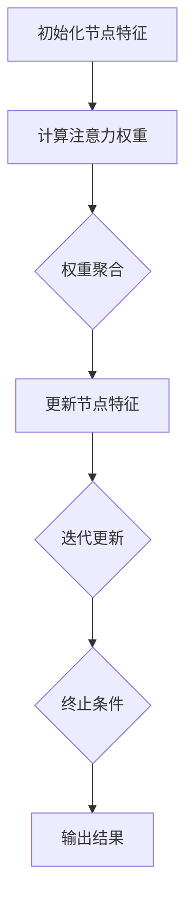
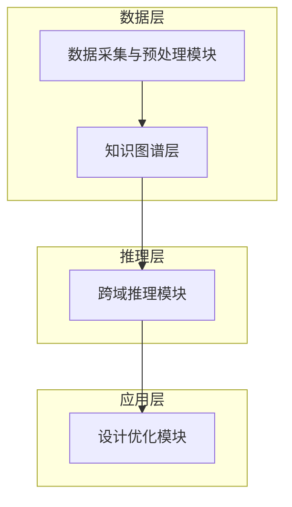
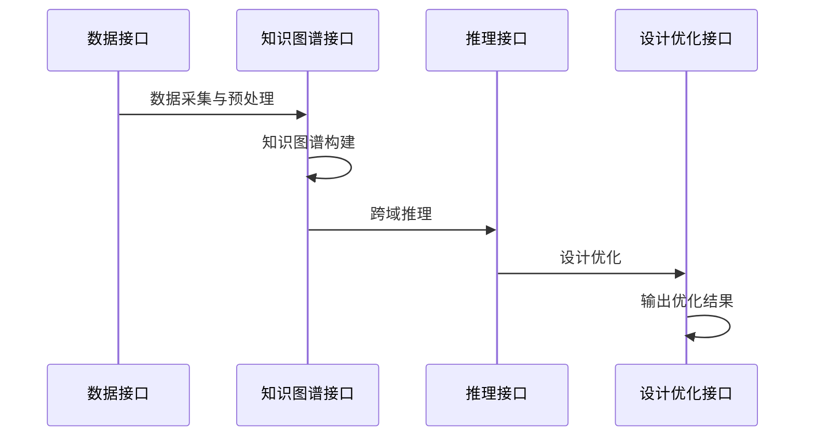

                 


### 背景介绍

#### 核心概念术语说明

首先，我们需要了解本文涉及的一些核心概念：

- **知识图谱**：知识图谱是一种用于表示信息、知识和关系的图形化数据结构，它通过实体、属性和关系三个核心要素来构建复杂的信息网络。

- **跨域推理能力**：跨域推理能力是指在不同领域或不同知识源之间进行推理的能力，它能够帮助我们理解和解释不同领域之间的复杂关系。

- **智能材料设计**：智能材料设计是指利用先进的科学技术，如人工智能、机器学习等，来设计和开发具有特定功能的新型材料。

#### 问题背景

随着科技的不断进步，智能材料设计已成为材料科学与工程领域的前沿研究方向。智能材料具有自修复、自感知、自诊断、自适应等特性，这些特性使其在航空航天、医疗器械、建筑结构、电子设备等多个领域具有广泛的应用前景。

然而，智能材料的设计过程通常涉及多个学科和领域，如材料科学、物理学、化学、电子工程等。这些不同领域之间的知识和技术往往存在较大的差异，导致跨领域知识的整合和利用变得非常困难。

#### 问题描述

如何在智能材料设计中高效利用跨领域知识，提高设计效率和准确性，成为当前研究的热点和难点。这需要我们能够：

1. 构建一个全面的知识图谱，涵盖智能材料设计所需的各类知识。
2. 开发高效的跨域推理算法，实现不同领域知识之间的有效整合。
3. 利用知识图谱和跨域推理能力，优化智能材料设计过程，提高设计质量和效率。

#### 问题解决

为了解决上述问题，我们可以采用以下步骤：

1. **构建知识图谱**：通过数据采集、知识提取和融合等步骤，构建一个全面、准确的智能材料知识图谱。
2. **开发跨域推理算法**：结合知识图谱的特点，设计高效的跨域推理算法，实现不同领域知识之间的有效整合。
3. **应用知识图谱和跨域推理能力**：将知识图谱和跨域推理能力应用于智能材料设计过程中，优化设计流程，提高设计效率和准确性。

#### 边界与外延

本文的研究主要关注以下边界和范围：

- **知识图谱的构建与应用**：如何构建和优化知识图谱，以及如何在智能材料设计中应用知识图谱。
- **跨域推理能力**：如何开发和应用跨域推理算法，实现不同领域知识的整合和利用。
- **智能材料设计**：智能材料设计的方法、原则和应用领域。

#### 概念结构与核心要素组成

本文的核心概念结构包括以下几个方面：

1. **知识图谱**：实体、属性和关系。
2. **跨域推理能力**：推理算法、跨域知识整合和利用。
3. **智能材料设计**：设计方法、原则和应用领域。

通过以上分析，我们为后续章节的深入探讨奠定了基础。在接下来的章节中，我们将详细介绍知识图谱的构建、跨域推理能力的开发以及智能材料设计的方法和优化应用。让我们一起探索这个充满挑战和机遇的领域吧！

### 核心概念与联系

为了深入理解基于知识图谱的跨域推理能力在智能材料设计中的优化应用，我们需要详细探讨几个核心概念及其相互关系。以下是这些核心概念的属性特征对比表格和实体关系图架构。

#### 核心概念属性特征对比表格

| 核心概念 | 属性特征 | 描述 |
| --- | --- | --- |
| 知识图谱 | 实体、关系、属性 | 用于表示信息、知识和关系的图形化数据结构 |
| 跨域推理 | 跨领域知识整合、推理算法 | 在不同领域或知识源之间进行推理的能力 |
| 智能材料设计 | 材料特性、设计原则、应用领域 | 利用先进科学技术设计具有特定功能的新型材料 |

#### ER实体关系图架构

接下来，我们使用Mermaid绘制一个实体关系图（ER Diagram）来展示这些核心概念之间的联系。

```mermaid
erDiagram
  Entity: 知识图谱 ||--|{ 实体 }
  Entity: 知识图谱 ||--|{ 关系 }
  Entity: 知识图谱 ||--|{ 属性 }
  Entity: 跨域推理 ||--|{ 推理算法 }
  Entity: 跨域推理 ||--|{ 跨领域知识整合 }
  Entity: 智能材料设计 ||--|{ 材料特性 }
  Entity: 智能材料设计 ||--|{ 设计原则 }
  Entity: 智能材料设计 ||--|{ 应用领域 }
  知识图谱 ||--|{ 跨域推理 }
  跨域推理 ||--|{ 智能材料设计 }
```

在上面的ER图中，我们定义了三个主要实体：知识图谱、跨域推理和智能材料设计。这些实体之间通过特定的属性和关系相互关联。知识图谱由实体、关系和属性构成，是跨域推理的基础；跨域推理则通过推理算法和跨领域知识整合来实现不同领域知识的整合；智能材料设计则利用这些跨领域知识和推理能力，设计和优化新型材料。

通过这个ER实体关系图，我们可以清晰地看到知识图谱、跨域推理和智能材料设计之间的逻辑关系和相互作用，为后续章节的详细探讨提供了直观的框架和基础。

### 算法原理讲解

在深入探讨基于知识图谱的跨域推理能力在智能材料设计中的应用之前，我们需要详细讲解其中的核心算法原理，包括数学模型和流程图。以下是算法原理的讲解。

#### 数学模型

基于知识图谱的跨域推理能力主要依赖于图神经网络（Graph Neural Networks, GNN）和图注意力机制（Graph Attention Mechanism, GAT）。以下是GAT的核心数学模型：

1. **图注意力权重计算**：

   对于每个节点\( h_v \)和其相邻节点\( h_u \)，我们计算注意力权重\( \alpha_{uv} \)：

   $$ \alpha_{uv} = \frac{e^{a(h_v, h_u)}}{\sum_{u' \in N(v)} e^{a(h_v, h_u')}} $$

   其中，\( a(h_v, h_u) \)是节点\( h_v \)和节点\( h_u \)之间的注意力得分函数，通常使用一个前馈神经网络来实现。

2. **节点更新**：

   节点\( h_v \)的更新公式为：

   $$ h_v^{(t+1)} = \sigma(\sum_{u \in N(v)} \alpha_{uv} h_u^{(t)}) $$

   其中，\( \sigma \)是激活函数，\( N(v) \)表示节点\( v \)的邻居节点集合。

3. **整体更新**：

   整个图在每一步的更新公式为：

   $$ H^{(t+1)} = \text{GAT}(H^{(t)}) $$

   其中，\( H^{(t)} \)表示在第\( t \)步的节点特征表示。

#### 流程图

下面是使用Mermaid绘制的算法流程图：



1. **初始化节点特征**：初始化所有节点的特征表示。
2. **计算注意力权重**：对于每个节点和其邻居节点，计算注意力权重。
3. **权重聚合**：根据注意力权重，更新节点的特征表示。
4. **迭代更新**：重复上述步骤，直到满足终止条件（如迭代次数或特征稳定）。
5. **输出结果**：输出最终的节点特征表示。

#### 通俗易懂地举例说明

假设我们有一个简单的知识图谱，包含三个节点（实体）A、B、C，它们之间的关系（边）是`朋友`。现在我们使用GAT进行跨域推理，来找出节点A和B之间的潜在关系。

1. **初始化节点特征**：我们将节点A和节点B的特征初始化为\( [1, 0, 0] \)和\( [0, 1, 0] \)。
2. **计算注意力权重**：使用前馈神经网络计算节点A和节点B之间的注意力权重。例如，假设前馈神经网络的输出为\( \alpha_{AB} = 0.8 \)，\( \alpha_{AC} = 0.2 \)。
3. **权重聚合**：根据注意力权重，更新节点A的特征。新的特征表示为\( [0.8, 0.8, 0.2] \)。
4. **迭代更新**：重复上述步骤，直到特征稳定或达到迭代次数上限。
5. **输出结果**：最终输出节点A和节点B的特征表示，即\( [0.8, 0.8, 0.2] \)。这表示节点A和B之间存在较强的潜在关系。

通过上述步骤，我们可以看到如何使用GAT进行跨域推理，以识别和利用知识图谱中的潜在关系。这个算法在智能材料设计中的优化应用为提高设计效率和准确性提供了强有力的工具。

### 系统分析与架构设计方案

为了更好地理解和实现基于知识图谱的跨域推理能力在智能材料设计中的优化应用，我们需要详细分析系统场景、介绍项目背景、设计系统功能、架构以及相关接口和交互流程。

#### 系统场景介绍

在智能材料设计中，系统需要具备以下能力：

1. **知识图谱构建**：从各类数据源中提取知识，构建完整的智能材料知识图谱。
2. **跨域推理**：利用知识图谱，进行跨领域知识的整合和推理。
3. **智能材料设计优化**：基于跨域推理结果，优化智能材料设计过程。

系统场景包括以下几个主要环节：

1. **数据采集与预处理**：从材料科学、化学、物理等多个领域收集数据，并进行清洗、预处理。
2. **知识图谱构建**：利用预处理后的数据，构建智能材料知识图谱。
3. **跨域推理**：应用跨域推理算法，对知识图谱中的信息进行整合和推理。
4. **设计优化**：根据推理结果，优化智能材料设计。

#### 项目介绍

本项目旨在构建一个智能材料设计优化平台，该平台利用知识图谱和跨域推理技术，实现以下目标：

1. 提高智能材料设计的效率。
2. 提高设计准确性。
3. 促进跨领域知识的整合和应用。

平台将采用以下技术和工具：

1. **知识图谱构建工具**：如Neo4j、OpenKE等。
2. **跨域推理算法**：如Graph Attention Mechanism（GAT）、TransE等。
3. **设计优化工具**：如CAD软件、仿真软件等。

#### 系统功能设计

系统功能设计主要包括以下模块：

1. **数据采集与预处理模块**：负责从各类数据源采集数据，并进行清洗、预处理，为知识图谱构建提供数据基础。
2. **知识图谱构建模块**：负责构建智能材料知识图谱，包括实体、关系和属性的表示。
3. **跨域推理模块**：负责应用跨域推理算法，对知识图谱中的信息进行整合和推理。
4. **设计优化模块**：负责根据推理结果，优化智能材料设计过程。

#### 系统架构设计

系统架构设计包括以下几个层次：

1. **数据层**：存储各类原始数据和预处理后的数据。
2. **知识图谱层**：构建智能材料知识图谱，存储实体、关系和属性信息。
3. **推理层**：应用跨域推理算法，实现跨领域知识的整合和推理。
4. **应用层**：提供智能材料设计优化功能，与外部系统（如CAD软件、仿真软件）进行交互。

下面是系统架构设计mermaid架构图：



#### 系统接口设计

系统接口设计主要包括以下接口：

1. **数据接口**：提供数据采集、数据导入和数据导出功能。
2. **知识图谱接口**：提供知识图谱构建、查询和更新功能。
3. **推理接口**：提供跨域推理算法的调用和结果查询功能。
4. **设计优化接口**：提供智能材料设计优化功能。

下面是系统接口设计mermaid序列图：



通过上述系统分析与架构设计方案，我们为基于知识图谱的跨域推理能力在智能材料设计中的优化应用提供了一个全面的系统框架，为后续的项目实施提供了清晰的指导。

### 项目实战

为了更好地展示基于知识图谱的跨域推理能力在智能材料设计中的优化应用，我们将进行一个具体的项目实战，从环境安装到系统核心实现，再到实际案例分析和详细讲解剖析，最终进行项目小结。

#### 环境安装

在进行项目实战之前，我们需要首先安装和配置必要的软件和工具。以下是安装步骤：

1. **安装Neo4j数据库**：
   - 下载并安装Neo4j数据库：[https://neo4j.com/download/](https://neo4j.com/download/)
   - 运行Neo4j服务器：`neo4j start`

2. **安装Python环境**：
   - 安装Python：[https://www.python.org/downloads/](https://www.python.org/downloads/)
   - 安装Python虚拟环境：`python -m pip install virtualenv`
   - 创建虚拟环境：`virtualenv venv`
   - 激活虚拟环境：`source venv/bin/activate`（在Linux和macOS上）或`venv\Scripts\activate`（在Windows上）

3. **安装相关依赖库**：
   - 安装Py2neo：`pip install py2neo`
   - 安装其他依赖库，如numpy、pandas、tensorflow等。

#### 系统核心实现

在安装完所有必要的环境和工具后，我们开始实现系统的核心部分，包括知识图谱的构建、跨域推理算法的应用以及智能材料设计的优化。

1. **知识图谱构建**：
   - 采集和处理数据，构建知识图谱。
   - 使用Py2neo库连接Neo4j数据库，并执行CYPHER查询语句来构建实体、关系和属性。

   ```python
   from py2neo import Graph

   graph = Graph("bolt://localhost:7687", auth=("neo4j", "password"))

   # 创建实体
   graph.run("CREATE (a:Entity {name: 'Material A'})")
   graph.run("CREATE (b:Entity {name: 'Material B'})")

   # 创建关系
   graph.run("MATCH (a:Entity), (b:Entity) WHERE a.name = 'Material A' AND b.name = 'Material B' CREATE (a)-[:RELATED]->(b)")

   # 创建属性
   graph.run("MATCH (n:Entity) SET n.property = 'value'")
   ```

2. **跨域推理算法应用**：
   - 使用Graph Attention Mechanism（GAT）进行跨域推理。
   - 定义GAT模型，并进行训练。

   ```python
   import tensorflow as tf
   from tensorflow.keras.models import Model
   from tensorflow.keras.layers import Input, Dense, Dropout, Lambda
   from spektral.layers import GraphAttention

   num_features = 16
   hidden_channels = 8

   input_shape = (num_features,)
   input_tensor = Input(shape=input_shape)
   x = input_tensor

   x = GraphAttention(num hä

