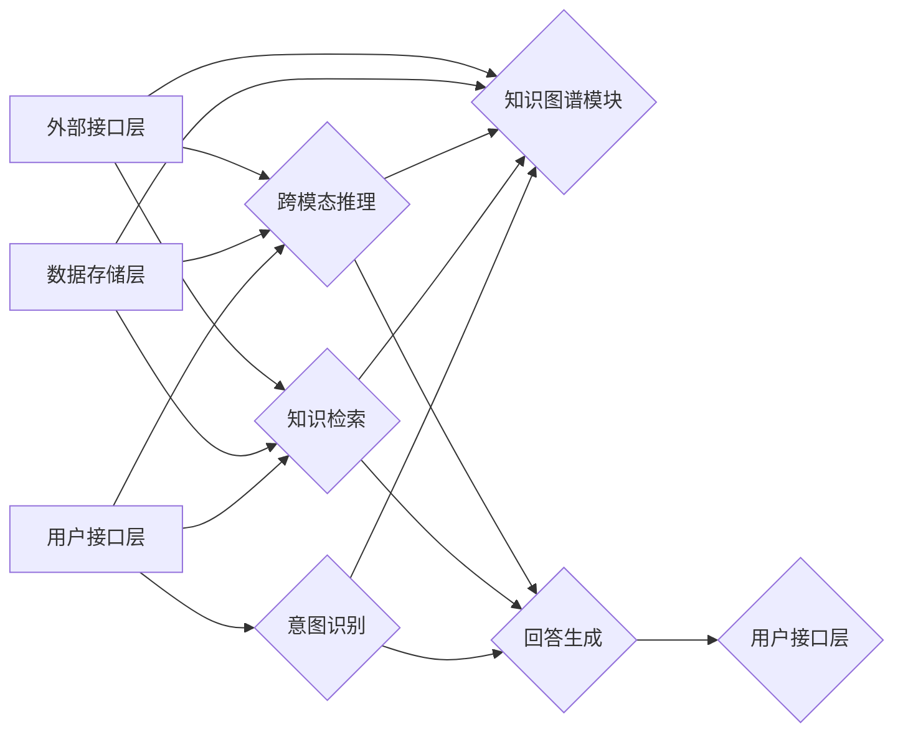

                 

### 文章标题与关键词

# 《基于知识图谱的跨模态推理在智能客服系统中的优化》

> 关键词：知识图谱、跨模态推理、智能客服系统、优化、算法实现

这篇文章将深入探讨如何通过知识图谱和跨模态推理技术来优化智能客服系统。我们将从问题的背景与核心概念出发，逐步介绍知识图谱和跨模态推理的基本概念及其在智能客服系统中的应用，最后通过案例分析来展示知识图谱和跨模态推理如何提升智能客服系统的性能。

### 摘要

本文旨在通过知识图谱和跨模态推理技术的结合，对智能客服系统进行优化。首先，我们将介绍知识图谱和跨模态推理的基本概念，包括其在智能客服系统中的应用和面临的挑战。随后，我们将详细讲解知识图谱的构建方法和跨模态推理的算法原理。接着，我们将分析知识图谱在智能客服系统中的优化应用，并通过具体案例展示其效果。最后，我们将提供智能客服系统优化的实践方法和代码实现，为实际应用提供指导。

### 目录大纲

1. 引言与背景介绍
   1.1 问题背景与核心概念
   1.2 研究范围与限制
   1.3 本章小结

2. 知识图谱基础
   2.1 知识图谱的基本概念
   2.2 知识图谱的构建方法
   2.3 知识图谱的应用案例
   2.4 本章小结

3. 跨模态推理技术基础
   3.1 跨模态推理的基本概念
   3.2 跨模态推理算法
   3.3 跨模态推理在智能客服系统中的应用
   3.4 本章小结

4. 知识图谱在智能客服系统中的优化应用
   4.1 系统架构设计
   4.2 知识图谱构建
   4.3 跨模态推理实现
   4.4 优化案例分析
   4.5 本章小结

5. 智能客服系统优化实践
   5.1 环境准备与系统安装
   5.2 系统核心实现
   5.3 代码应用解读与分析
   5.4 实际案例分析和详细讲解剖析
   5.5 项目小结

6. 最佳实践 tips、小结、注意事项、拓展阅读

### 引言与背景介绍

#### 1.1 问题背景与核心概念

随着互联网和大数据技术的迅猛发展，智能客服系统逐渐成为企业和组织提升服务质量的重要手段。智能客服系统能够提供24/7全天候的服务，快速响应用户的咨询，从而提高用户满意度和企业运营效率。然而，传统的智能客服系统在应对复杂多变的用户需求时，往往面临诸多挑战。

首先，用户的问题形式多样，包括文本、语音、图像等多种模态。单一模态的智能客服系统难以全面理解用户的需求，导致回答不准确或无法满足用户的期望。其次，传统的智能客服系统依赖于预定义的规则和模板，无法动态适应新的场景和需求，从而限制了其智能化水平。此外，随着用户数据的爆炸式增长，如何高效地处理和利用这些数据，也是一个亟待解决的问题。

为了应对上述挑战，知识图谱和跨模态推理技术应运而生。知识图谱是一种用于表示实体、属性和关系的图形化数据结构，能够有效地组织和利用大规模的数据。跨模态推理则是一种能够处理不同模态数据的技术，通过跨模态匹配和融合，实现对多源数据的统一理解和分析。

#### 1.1.1 智能客服系统的发展与挑战

智能客服系统的发展经历了从传统的基于规则的系统到基于机器学习的系统，再到现在的基于深度学习和知识图谱的系统。传统的基于规则的系统主要依赖于预定义的规则库，虽然能够实现简单的对话功能，但在处理复杂问题时显得力不从心。基于机器学习的系统通过训练模型来学习用户的对话模式，能够实现更加智能的对话功能，但往往需要大量标记数据进行训练，且模型的泛化能力有限。

随着深度学习技术的不断发展，基于深度学习的智能客服系统逐渐崭露头角。深度学习模型能够自动提取特征，实现自动问答和意图识别，显著提升了系统的智能化水平。然而，深度学习模型也存在一些问题，如对数据质量要求高、模型复杂度高等。

知识图谱的引入为智能客服系统带来了新的突破。知识图谱能够将海量数据组织成结构化的形式，提供丰富的语义信息，使得智能客服系统能够更好地理解和应对用户的复杂需求。同时，知识图谱还可以用于知识推理，实现自动化回答和智能推荐等功能。

#### 1.1.2 知识图谱在智能客服系统中的应用

知识图谱在智能客服系统中的应用主要体现在以下几个方面：

1. **知识抽取与融合**：通过知识抽取技术从大量文本数据中提取实体和关系，然后利用知识融合算法将来自不同源的数据进行整合，构建一个统一的语义知识库。

2. **智能问答**：基于知识图谱的智能问答系统能够通过查询图谱来获取答案，实现对用户问题的准确理解和回答。

3. **意图识别**：知识图谱可以用于识别用户的意图，通过对图谱中实体和关系的分析，判断用户的需求和意图。

4. **智能推荐**：基于知识图谱的推荐系统能够根据用户的历史行为和偏好，为其提供个性化的推荐服务。

#### 1.1.3 跨模态推理技术的兴起

跨模态推理技术是一种能够处理不同模态数据的技术，通过跨模态匹配和融合，实现对多源数据的统一理解和分析。跨模态推理技术的兴起主要源于以下几个方面：

1. **数据多样性**：在现实世界中，用户的信息表达形式多种多样，包括文本、语音、图像、视频等。跨模态推理技术能够将这些不同的信息进行整合，提供更加全面和准确的理解。

2. **智能化需求**：随着人工智能技术的发展，人们对智能系统的需求越来越高。跨模态推理技术能够实现更加智能化和人性化的服务，提高用户体验。

3. **多领域应用**：跨模态推理技术在各个领域都有广泛的应用，如智能客服系统、智能医疗、智能交通等，能够为各个领域提供强大的技术支持。

#### 1.2 核心概念

在本章中，我们将详细介绍知识图谱、跨模态推理和智能客服系统的核心概念，并讨论其在智能客服系统中的重要性。

##### 1.2.1 知识图谱的定义与结构

知识图谱（Knowledge Graph）是一种用于表示实体、属性和关系的图形化数据结构。它通过图论的方式将实体和关系组织起来，形成一种结构化的知识表示形式。知识图谱通常由以下几个部分组成：

- **实体（Entity）**：知识图谱中的基本元素，可以是人、地点、组织、物品等。实体是知识图谱中表示知识的主体。
- **关系（Relationship）**：实体之间的关系，如“是”、“属于”、“发生在”等。关系用来描述实体之间的语义联系。
- **属性（Attribute）**：实体的属性描述了实体的特征，如“年龄”、“性别”、“颜色”等。属性可以用来补充实体的信息。

知识图谱的结构通常可以用图（Graph）来表示，其中节点（Node）表示实体，边（Edge）表示关系，属性可以附加在节点或边上。知识图谱的表示方法有属性图（Property Graph）、图论表示（Graph Theory Representation）等。

##### 1.2.2 跨模态推理的概念与原理

跨模态推理（Cross-modal Reasoning）是一种能够处理不同模态数据的技术，通过跨模态匹配和融合，实现对多源数据的统一理解和分析。跨模态推理的核心思想是将不同模态的数据（如文本、语音、图像、视频）进行对齐和整合，从而提取出共同的特征信息。

跨模态推理的基本概念包括：

- **模态（Modal）**：指数据的表达形式，如文本、语音、图像、视频等。
- **跨模态匹配（Cross-modal Alignment）**：指将不同模态的数据映射到同一空间，从而实现数据的对齐。
- **跨模态融合（Cross-modal Fusion）**：指将不同模态的数据进行整合，提取出共同的特征信息。

跨模态推理的基本原理是通过特征提取和模型学习，将不同模态的数据映射到一个共享的特征空间，从而实现数据的对齐和融合。具体实现方法包括基于深度学习的跨模态嵌入模型、多任务学习模型等。

##### 1.2.3 智能客服系统的构成与工作流程

智能客服系统（Intelligent Customer Service System）是一种基于人工智能技术的客服系统，能够通过语音、文本等多种方式与用户进行交互，提供个性化、智能化的服务。智能客服系统的构成主要包括以下几个部分：

1. **语音识别与转换**：将用户的语音输入转换为文本，实现语音到文本的转换。
2. **文本处理与理解**：对转换后的文本进行预处理，如分词、句法分析等，然后通过自然语言处理技术（如词性标注、命名实体识别等）实现对文本内容的理解。
3. **意图识别**：通过分析用户的输入文本，识别用户的需求和意图。
4. **知识检索与推理**：利用知识图谱进行知识检索和推理，获取与用户需求相关的知识。
5. **回答生成与交互**：根据用户的需求和意图，生成合适的回答，并通过语音合成或文本形式与用户进行交互。

智能客服系统的工作流程通常包括以下几个步骤：

1. **用户输入**：用户通过语音或文本形式向系统提出问题或请求。
2. **输入处理**：系统对用户输入进行处理，将其转换为可理解的形式。
3. **意图识别**：系统通过自然语言处理技术分析用户输入，识别出用户的需求和意图。
4. **知识检索与推理**：系统利用知识图谱检索与用户需求相关的知识，并进行推理，生成合适的回答。
5. **回答生成与交互**：系统生成回答，并通过语音合成或文本形式与用户进行交互。

#### 1.3 边界与外延

##### 1.3.1 研究范围与限制

本文主要研究知识图谱和跨模态推理在智能客服系统中的优化应用，包括知识图谱的构建、跨模态推理算法的实现以及智能客服系统的优化实践。研究范围主要涵盖以下几个方面：

1. **知识图谱构建**：研究知识图谱的构建方法，包括知识抽取、知识融合和知识图谱的构建流程。
2. **跨模态推理**：研究跨模态推理的基本概念、算法原理以及在智能客服系统中的应用。
3. **智能客服系统优化**：研究如何利用知识图谱和跨模态推理技术优化智能客服系统，提高其性能和用户体验。

本文的研究限制主要在于：

1. **数据限制**：本文所使用的数据集可能无法涵盖所有可能的场景和用户需求，因此在实际应用中可能需要进行进一步的扩展和调整。
2. **技术限制**：知识图谱和跨模态推理技术尚处于发展阶段，可能存在一些未解决的问题和挑战，如数据的多样性和复杂性等。

##### 1.3.2 相关领域的关键问题与前沿进展

在知识图谱和跨模态推理领域，以下是一些关键问题和前沿进展：

1. **知识图谱的构建**：如何从大规模、非结构化的数据中高效地抽取和构建知识图谱是一个关键问题。目前，研究主要集中在知识抽取、知识融合和知识图谱的自动化构建方法等方面。例如，近年来出现了一些基于深度学习的知识抽取方法，如实体识别、关系抽取等。

2. **跨模态推理**：如何处理不同模态的数据，实现多源数据的统一理解和分析是一个重要课题。目前，研究主要集中在跨模态特征提取、跨模态匹配和跨模态融合方法等方面。例如，深度学习技术（如卷积神经网络、递归神经网络等）被广泛应用于跨模态特征提取和跨模态推理。

3. **智能客服系统优化**：如何利用知识图谱和跨模态推理技术优化智能客服系统是一个重要研究方向。目前，研究主要集中在如何将知识图谱和跨模态推理技术应用于智能客服系统的不同模块，如意图识别、知识检索和回答生成等。

#### 1.4 本章小结

本章主要介绍了知识图谱、跨模态推理和智能客服系统的核心概念及其在智能客服系统中的重要性。通过知识图谱，我们可以将海量数据组织成结构化的形式，提供丰富的语义信息；而跨模态推理技术则能够处理不同模态的数据，实现对多源数据的统一理解和分析。这些技术为优化智能客服系统提供了强大的支持，使得系统能够更好地理解用户需求，提供更准确、更个性化的服务。在接下来的章节中，我们将进一步探讨知识图谱和跨模态推理的技术细节及其在智能客服系统中的应用。

### 知识图谱基础

#### 2.1 知识图谱的基本概念

知识图谱（Knowledge Graph）是一种用于表示实体、属性和关系的图形化数据结构，通过图论的方式将实体和关系组织起来，形成一种结构化的知识表示形式。知识图谱是近年来人工智能领域的一个重要研究方向，其在智能客服系统、搜索引擎、推荐系统等领域有着广泛的应用。

##### 2.1.1 知识图谱的定义与组成部分

知识图谱的定义可以从以下几个方面来理解：

1. **实体（Entity）**：实体是知识图谱中的基本元素，可以是人、地点、组织、物品等。实体是知识图谱中表示知识的主体，例如“人”实体可以表示某个人，“地点”实体可以表示某个地点。

2. **属性（Attribute）**：实体的属性描述了实体的特征，如“年龄”、“性别”、“颜色”等。属性可以用来补充实体的信息，帮助更准确地描述实体。例如，对于“人”实体，可以设置“年龄”属性为“30岁”，“性别”属性为“男”。

3. **关系（Relationship）**：关系用来描述实体之间的语义联系，如“是”、“属于”、“发生在”等。关系可以表示实体之间的某种关联，帮助理解实体之间的相互关系。例如，对于“人”实体和“地点”实体，可以设置关系为“居住在”，表示这个人居住在这个地点。

知识图谱的组成部分可以简化为实体、属性和关系，这三者是构建知识图谱的核心要素。知识图谱通过这些要素，将实体和实体之间的关系组织起来，形成一个结构化的知识库。

##### 2.1.2 知识图谱的关键概念：实体、关系、属性

在知识图谱中，实体、关系和属性是三个关键概念，它们共同构成了知识图谱的核心要素。

1. **实体（Entity）**：
   - **定义**：实体是知识图谱中的基本元素，代表具体的对象或概念。实体可以是具体的人、地点、事物，也可以是抽象的概念或事件。
   - **特征**：实体具有独特的标识符（ID），用于唯一标识每个实体。实体可以具有一个或多个属性，用来描述其实体特征。
   - **分类**：实体可以分为多种类型，如人、地点、组织、物品、事件等。实体的类型帮助区分不同类别的实体，并在知识图谱中进行分类管理。

2. **关系（Relationship）**：
   - **定义**：关系是实体之间的语义联系，表示实体之间的某种关联或互动。关系可以是简单的“属于”、“连接”、“发生在”等，也可以是复杂的语义关系。
   - **特征**：关系具有两个端点，分别连接两个实体，表示这两个实体之间的关联。关系通常具有方向性，例如“属于”关系是从子实体指向父实体。
   - **类型**：关系可以分为多种类型，如父子关系、关联关系、时间关系等。不同类型的关系有助于描述复杂语义，构建丰富的知识网络。

3. **属性（Attribute）**：
   - **定义**：属性是实体的特征描述，用来补充和丰富实体的信息。属性可以是实体的某个具体值，例如“年龄”、“身高”、“颜色”等。
   - **特征**：属性与实体关联，为实体提供额外的信息。属性可以是简单值（如字符串、数字），也可以是复杂结构（如列表、字典）。
   - **分类**：属性可以分为静态属性和动态属性。静态属性在实体创建时确定，如“姓名”、“出生日期”等；动态属性在实体生命周期的不同阶段动态变化，如“购买次数”、“评价分数”等。

##### 2.1.3 知识图谱的表示方法

知识图谱的表示方法有多种，其中最常见的是图（Graph）表示法和图论（Graph Theory）表示法。

1. **图（Graph）表示法**：
   - **基本概念**：图是由节点（Node）和边（Edge）组成的图形结构。在知识图谱中，节点表示实体，边表示实体之间的关系。
   - **表示形式**：图可以用邻接矩阵、邻接表、边列表等多种形式进行表示。邻接矩阵是一种常见的表示方法，其中行和列分别代表实体，矩阵中的元素表示实体之间的关系。
   - **优点**：图表示法直观、简单，能够清晰地展示实体和关系之间的拓扑结构，方便进行后续的图算法操作。

2. **图论（Graph Theory）表示法**：
   - **基本概念**：图论是研究图形的数学分支，用于描述和处理图的性质和关系。在知识图谱中，图论方法可以用于描述实体、关系和属性之间的复杂关系。
   - **表示形式**：图论方法使用顶点（Vertex）和边（Edge）来表示实体和关系。顶点表示实体，边表示实体之间的关系。图论还包括了路径、连通性、图同构等概念，用于分析图的性质。
   - **优点**：图论表示法能够提供更加丰富的图形表示，有助于理解和分析知识图谱的复杂结构。

总之，知识图谱的表示方法有多种，图表示法和图论表示法是其中两种常见的方法。图表示法直观、简单，适合用于可视化展示；图论表示法则提供了更丰富的数学工具，有助于深入分析知识图谱的性质。

#### 2.2 知识图谱的构建方法

知识图谱的构建是知识图谱应用的前提和基础。知识图谱的构建方法主要包括数据采集、数据预处理、知识抽取和知识融合等步骤。

##### 2.2.1 数据源选择与预处理

数据源选择是知识图谱构建的第一步，选择合适的数据源能够为知识图谱的构建提供丰富的信息。常见的数据源包括以下几种：

1. **公开数据集**：公开数据集是构建知识图谱的重要资源，如DBpedia、Yago等。这些数据集通常已经经过预处理，可以直接用于知识图谱的构建。
2. **结构化数据**：结构化数据是指具有固定结构和格式的数据，如关系数据库、XML、JSON等。结构化数据可以通过数据提取和转换技术直接用于知识图谱的构建。
3. **非结构化数据**：非结构化数据是指没有固定结构和格式的数据，如文本、图像、视频等。非结构化数据的处理相对复杂，通常需要通过文本挖掘、图像识别等技术进行预处理。

数据预处理是知识图谱构建的关键步骤，主要包括数据清洗、数据去重、数据规范化等。

1. **数据清洗**：数据清洗是指对原始数据进行清洗和去噪，去除无效数据和噪声数据。例如，去除文本中的空格、标点符号、特殊字符等。
2. **数据去重**：数据去重是指识别和去除重复数据，确保知识图谱中的数据唯一性。常见的方法包括基于哈希值去重、基于关键字去重等。
3. **数据规范化**：数据规范化是指对数据进行统一格式和标准化的处理，如将日期格式统一为YYYY-MM-DD，将文本统一编码等。

##### 2.2.2 知识抽取技术

知识抽取是知识图谱构建的核心步骤，是从原始数据中提取实体、关系和属性的过程。知识抽取技术主要包括以下几种：

1. **实体抽取**：实体抽取是从文本中识别和提取出实体实例的过程。常见的方法包括基于规则的方法、基于统计的方法和基于深度学习的方法。

   - **基于规则的方法**：基于规则的方法通过预定义的规则库，识别和提取文本中的实体。例如，使用正则表达式匹配特定格式的实体，或者根据词性标注和词义分析提取实体。
   - **基于统计的方法**：基于统计的方法通过统计学习方法，训练模型来识别和提取实体。例如，使用条件随机场（CRF）或支持向量机（SVM）等算法训练模型，根据文本特征判断是否为实体。
   - **基于深度学习的方法**：基于深度学习的方法使用神经网络模型，自动学习文本中的实体特征。例如，使用卷积神经网络（CNN）或递归神经网络（RNN）等模型进行实体抽取。

2. **关系抽取**：关系抽取是从文本中识别和提取出实体之间关系的过程。常见的方法包括基于规则的方法、基于统计的方法和基于深度学习的方法。

   - **基于规则的方法**：基于规则的方法通过预定义的规则库，识别和提取文本中的关系。例如，根据词性标注和词义分析提取关系。
   - **基于统计的方法**：基于统计的方法通过统计学习方法，训练模型来识别和提取关系。例如，使用条件随机场（CRF）或支持向量机（SVM）等算法训练模型，根据文本特征判断是否为关系。
   - **基于深度学习的方法**：基于深度学习的方法使用神经网络模型，自动学习文本中的关系特征。例如，使用卷积神经网络（CNN）或递归神经网络（RNN）等模型进行关系抽取。

3. **属性抽取**：属性抽取是从文本中识别和提取出实体属性的值的过程。常见的方法包括基于规则的方法、基于统计的方法和基于深度学习的方法。

   - **基于规则的方法**：基于规则的方法通过预定义的规则库，识别和提取文本中的属性值。例如，根据特定格式的属性值进行提取。
   - **基于统计的方法**：基于统计的方法通过统计学习方法，训练模型来识别和提取属性值。例如，使用条件随机场（CRF）或支持向量机（SVM）等算法训练模型，根据文本特征判断是否为属性值。
   - **基于深度学习的方法**：基于深度学习的方法使用神经网络模型，自动学习文本中的属性特征。例如，使用卷积神经网络（CNN）或递归神经网络（RNN）等模型进行属性抽取。

##### 2.2.3 知识融合与推理

知识融合是将来自不同源的数据进行整合，构建一个统一的知识库的过程。知识融合主要包括以下几种方法：

1. **基于规则的融合**：基于规则的方法通过预定义的规则，将来自不同源的数据进行整合。例如，根据实体之间的匹配关系，将不同源的数据合并为一个统一的知识库。
2. **基于统计的融合**：基于统计的方法通过统计学习方法，训练模型来融合来自不同源的数据。例如，使用聚类算法或分类算法，根据数据特征将不同源的数据进行整合。
3. **基于深度学习的融合**：基于深度学习的方法使用神经网络模型，自动学习数据特征，进行知识融合。例如，使用多任务学习或联合嵌入模型，将来自不同源的数据进行整合。

知识推理是利用知识图谱进行逻辑推理，从已知的事实中推断出新的知识。知识推理主要包括以下几种方法：

1. **基于规则推理**：基于规则的方法通过预定义的推理规则，从已知的事实中推断出新的知识。例如，使用演绎推理，根据已知的事实和规则，推导出新的结论。
2. **基于统计的推理**：基于统计的方法通过统计学习方法，训练模型来推断新的知识。例如，使用贝叶斯网络或隐马尔可夫模型（HMM），根据已知的事实和概率分布，推断出新的知识。
3. **基于深度学习的推理**：基于深度学习的方法使用神经网络模型，自动学习数据特征，进行知识推理。例如，使用图神经网络（Graph Neural Networks，GNN）或图嵌入模型，根据已知的事实和模型特征，推断出新的知识。

##### 2.2.4 知识图谱的构建流程

知识图谱的构建流程主要包括以下几个步骤：

1. **数据采集**：选择合适的数据源，进行数据采集。数据源可以包括公开数据集、结构化数据和非结构化数据。
2. **数据预处理**：对采集到的数据进行清洗、去重和规范化处理，确保数据的准确性和一致性。
3. **知识抽取**：从预处理后的数据中提取实体、关系和属性，构建初步的知识库。知识抽取可以采用基于规则、基于统计和基于深度学习的方法。
4. **知识融合**：将来自不同源的数据进行整合，构建一个统一的知识库。知识融合可以采用基于规则、基于统计和基于深度学习的方法。
5. **知识推理**：利用知识图谱进行逻辑推理，从已知的事实中推断出新的知识。知识推理可以采用基于规则、基于统计和基于深度学习的方法。
6. **知识存储**：将构建好的知识图谱存储到数据库或图数据库中，方便后续的查询和推理操作。

#### 2.3 知识图谱的应用案例

知识图谱在各个领域都有着广泛的应用，下面列举一些典型的应用案例。

1. **社交网络分析**：知识图谱可以用于分析社交网络中的用户关系，识别社交圈子、传播路径等。例如，Facebook和Twitter等社交平台使用知识图谱来推荐好友、广告和内容。

2. **电子商务推荐系统**：知识图谱可以用于构建电子商务推荐系统，通过分析用户行为和商品属性，为用户提供个性化的推荐。例如，Amazon和淘宝等电商平台使用知识图谱来实现商品推荐和用户推荐。

3. **智能客服系统**：知识图谱可以用于构建智能客服系统，通过知识图谱的查询和推理功能，为用户提供智能化的问答和咨询服务。例如，Siri、小爱同学等智能语音助手使用知识图谱来实现智能问答。

4. **智能医疗**：知识图谱可以用于构建智能医疗系统，通过知识图谱的存储和查询功能，为医生提供诊断和治疗建议。例如，IBM的Watson for Oncology系统使用知识图谱来实现癌症诊断和治疗。

5. **智能交通**：知识图谱可以用于构建智能交通系统，通过分析交通数据，为用户提供实时交通信息和导航建议。例如，百度地图和高德地图等平台使用知识图谱来实现实时路况预测和导航。

6. **智能安防**：知识图谱可以用于构建智能安防系统，通过分析监控视频数据，识别可疑行为和异常事件。例如，视频监控平台使用知识图谱来实现人脸识别和事件检测。

#### 2.4 本章小结

本章主要介绍了知识图谱的基本概念、构建方法和应用案例。知识图谱是一种用于表示实体、属性和关系的图形化数据结构，通过图论的方式将实体和关系组织起来，形成一种结构化的知识表示形式。知识图谱的构建方法包括数据采集、数据预处理、知识抽取和知识融合等步骤。知识图谱在社交网络分析、电子商务推荐系统、智能客服系统、智能医疗、智能交通和智能安防等领域有着广泛的应用。通过本章的学习，读者可以了解到知识图谱的基本原理和应用场景，为后续章节的知识图谱在智能客服系统中的应用打下基础。

### 跨模态推理技术基础

#### 3.1 跨模态推理的基本概念

跨模态推理（Cross-modal Reasoning）是一种能够处理不同模态数据的技术，通过跨模态匹配和融合，实现对多源数据的统一理解和分析。跨模态推理的核心思想是将不同模态的数据（如文本、语音、图像、视频）进行对齐和整合，从而提取出共同的特征信息。跨模态推理在智能客服系统中有着广泛的应用，能够提高系统的智能化水平和用户体验。

##### 3.1.1 跨模态推理的定义与挑战

跨模态推理的定义可以从以下几个方面来理解：

1. **模态（Modal）**：指数据的表达形式，如文本、语音、图像、视频等。每种模态都有其独特的特征和表现形式。
2. **跨模态（Cross-modal）**：指将不同模态的数据进行对齐和整合，实现对多源数据的统一理解和分析。跨模态推理的目标是实现不同模态数据之间的信息共享和协同处理。
3. **推理（Reasoning）**：指通过分析和处理跨模态数据，提取出有用的信息，进行逻辑推理和决策。跨模态推理旨在从多个模态的数据中提取共同的语义信息，实现对复杂问题的理解和解决。

跨模态推理面临的挑战主要包括：

1. **数据不一致**：不同模态的数据在特征、分布和表达方式上存在较大差异，导致数据不一致。例如，文本数据可能包含丰富的语义信息，而语音数据则包含音调和语速等特征。
2. **模态缺失**：在实际应用中，某些模态的数据可能缺失或不完整，给跨模态推理带来困难。例如，在视频分析中，可能无法获取到音频数据，导致无法进行跨模态分析。
3. **特征提取与融合**：跨模态推理的关键在于如何有效地提取和融合不同模态的特征信息。特征提取的难度较大，因为不同模态的特征具有不同的维度和属性。特征融合的复杂性也较高，需要设计合适的模型和方法来整合不同模态的特征。
4. **计算资源与时间**：跨模态推理通常需要大量的计算资源和时间，特别是在处理大规模数据时。例如，视频和图像数据的处理速度相对较慢，需要优化算法以适应实时应用场景。

##### 3.1.2 跨模态数据类型与特征提取

跨模态数据类型主要包括以下几种：

1. **文本（Text）**：文本数据是智能客服系统中最常见的模态之一，包括自然语言文本、标签、描述等。文本数据可以提供丰富的语义信息，如用户意图、问题内容等。
2. **语音（Voice）**：语音数据是通过语音信号转换成的数字信号，包括语音的音调、语速、语调等特征。语音数据可以用于语音识别、语音生成等任务。
3. **图像（Image）**：图像数据是视觉信息的一种表达形式，包括像素值、颜色、纹理等特征。图像数据可以用于图像识别、图像分类等任务。
4. **视频（Video）**：视频数据是动态图像序列，包括视频帧、视频流等。视频数据可以用于视频分析、视频分类等任务。

特征提取是跨模态推理的关键步骤，目的是从不同模态的数据中提取出有用的特征信息。以下是一些常见的特征提取方法：

1. **文本特征提取**：文本特征提取方法包括词袋模型（Bag-of-Words，BOW）、TF-IDF（Term Frequency-Inverse Document Frequency）、词嵌入（Word Embedding）等。词袋模型将文本表示为词汇的集合，TF-IDF考虑词汇在文档中的重要程度，词嵌入则将词汇映射为稠密向量表示。
2. **语音特征提取**：语音特征提取方法包括梅尔频率倒谱系数（Mel-Frequency Cepstral Coefficients，MFCC）、短时傅里叶变换（Short-Time Fourier Transform，STFT）、频谱特征等。MFCC是最常用的语音特征提取方法，通过分析语音信号的频谱特性来提取特征。
3. **图像特征提取**：图像特征提取方法包括深度卷积神经网络（Deep Convolutional Neural Networks，DCNN）、传统图像特征提取方法（如SIFT、HOG等）。DCNN通过多层卷积和池化操作提取图像的深层特征，传统图像特征提取方法则通过计算图像的局部特征来提取特征。
4. **视频特征提取**：视频特征提取方法包括光流特征、动作识别特征、视频分类特征等。光流特征用于描述视频中的运动信息，动作识别特征用于识别视频中的动作类型，视频分类特征用于分类视频内容。

##### 3.1.3 跨模态匹配与融合策略

跨模态匹配是指将不同模态的数据映射到同一空间，从而实现数据的对齐和融合。跨模态匹配的目标是找到不同模态数据之间的对应关系，以便进行后续的融合和推理。以下是一些常见的跨模态匹配方法：

1. **基于规则的匹配**：基于规则的方法通过预定义的规则，将不同模态的数据进行匹配。例如，根据图像中的物体与文本中的描述进行匹配。
2. **基于统计的匹配**：基于统计的方法通过统计学习方法，训练模型来匹配不同模态的数据。例如，使用机器学习算法（如SVM、KNN等）根据特征相似度进行匹配。
3. **基于深度学习的匹配**：基于深度学习的方法使用神经网络模型，自动学习数据特征，进行跨模态匹配。例如，使用多任务学习或联合嵌入模型，将不同模态的数据映射到同一特征空间。

跨模态融合是指将不同模态的数据进行整合，提取出共同的特征信息。以下是一些常见的跨模态融合策略：

1. **特征级融合**：特征级融合是指将不同模态的特征向量进行拼接或加权融合，形成一个综合特征向量。例如，将文本特征向量、语音特征向量和图像特征向量拼接起来。
2. **决策级融合**：决策级融合是指在不同模态的特征提取后，将每个模态的预测结果进行融合，得到最终的预测结果。例如，使用投票或加权投票的方法，将不同模态的预测结果进行融合。
3. **模型级融合**：模型级融合是指将不同模态的神经网络模型进行融合，共同完成跨模态推理任务。例如，使用多任务学习或图神经网络（Graph Neural Networks，GNN）将不同模态的模型进行融合。

##### 3.1.4 跨模态推理算法

跨模态推理算法可以分为基于传统方法和基于深度学习方法两种类型。

1. **基于传统方法**：

   - **基于规则的推理**：基于规则的方法通过预定义的规则库，进行跨模态推理。例如，根据图像中的物体和文本中的描述进行匹配和推理。
   - **基于统计的推理**：基于统计的方法通过统计学习方法，进行跨模态推理。例如，使用贝叶斯网络、隐马尔可夫模型（Hidden Markov Model，HMM）等统计模型进行推理。

2. **基于深度学习方法**：

   - **深度卷积神经网络（Deep Convolutional Neural Networks，DCNN）**：DCNN通过多层卷积和池化操作，提取图像的深层特征，并用于跨模态特征提取和推理。
   - **递归神经网络（Recurrent Neural Networks，RNN）**：RNN适用于处理序列数据，可以用于跨模态的时间序列特征提取和推理。
   - **多任务学习（Multi-Task Learning）**：多任务学习是指在一个神经网络模型中同时学习多个任务，可以用于跨模态特征提取和融合。
   - **图神经网络（Graph Neural Networks，GNN）**：GNN通过图结构来表示实体和关系，可以用于跨模态的图结构特征提取和推理。

##### 3.1.5 跨模态推理在智能客服系统中的应用

跨模态推理在智能客服系统中有着广泛的应用，能够提高系统的智能化水平和用户体验。以下是一些典型的应用场景：

1. **跨模态对话生成**：通过跨模态特征提取和融合，智能客服系统能够生成更加自然、流畅的对话。例如，在用户输入文本问题后，系统可以通过语音合成技术生成语音回答，同时也可以生成文本回答，提高用户的满意度。

2. **跨模态意图识别**：智能客服系统可以通过跨模态特征提取和融合，识别用户的意图。例如，当用户输入文本问题后，系统可以通过分析文本和语音的特征，准确识别出用户的意图，提供更加针对性的回答。

3. **跨模态实体识别**：智能客服系统可以通过跨模态特征提取和融合，识别出用户提到的实体。例如，在用户输入文本问题时，系统可以通过分析文本和语音的特征，识别出用户提到的商品、地点等实体，从而提供更加准确的答案。

4. **跨模态情感分析**：通过跨模态特征提取和融合，智能客服系统可以分析用户的情感状态。例如，在用户输入文本问题时，系统可以通过分析文本和语音的情感特征，识别出用户的情感倾向，从而提供更加贴心的服务。

5. **跨模态推荐系统**：通过跨模态特征提取和融合，智能客服系统可以构建跨模态推荐系统，为用户提供个性化的推荐服务。例如，在用户输入文本描述后，系统可以通过分析文本和语音的特征，推荐相关的商品、活动等。

#### 3.2 跨模态推理算法

跨模态推理算法可以分为基于传统方法和基于深度学习方法两种类型。以下将详细介绍每种方法的原理和应用。

##### 3.2.1 基于传统方法的跨模态推理算法

基于传统方法的跨模态推理算法主要依赖于手工设计的特征和规则，其优点是实现简单，缺点是适应性和灵活性较低。

1. **基于规则的跨模态推理**：
   - **原理**：基于规则的方法通过预定义的规则，将不同模态的数据进行匹配和推理。这些规则通常基于专家知识和经验，能够处理一些简单的跨模态任务。
   - **应用**：例如，在文本和图像的跨模态任务中，可以定义规则来匹配文本中的描述和图像中的物体。这种方法适用于一些简单的跨模态任务，如问答系统和图像标注。

2. **基于统计的跨模态推理**：
   - **原理**：基于统计的方法通过统计模型（如贝叶斯网络、隐马尔可夫模型（HMM）等）来描述不同模态之间的依赖关系。这些模型通过学习训练数据中的统计规律，进行跨模态推理。
   - **应用**：例如，可以使用贝叶斯网络来描述文本和图像之间的依赖关系，从而进行跨模态情感分析。隐马尔可夫模型则常用于语音和文本的跨模态任务，如语音识别。

##### 3.2.2 基于深度学习的跨模态推理算法

基于深度学习的跨模态推理算法通过学习数据中的复杂特征和关系，具有更高的适应性和灵活性。以下将详细介绍几种常用的深度学习模型。

1. **深度卷积神经网络（Deep Convolutional Neural Networks，DCNN）**：
   - **原理**：DCNN是一种用于图像处理的深度神经网络，通过卷积和池化操作提取图像的深层特征。在跨模态任务中，可以将DCNN应用于图像特征提取，然后将图像特征与文本特征进行融合。
   - **应用**：例如，在文本和图像的跨模态任务中，DCNN可以用于图像特征提取，文本特征可以通过词嵌入得到。将图像特征和文本特征拼接后，可以用于情感分析、图像标注等任务。

2. **递归神经网络（Recurrent Neural Networks，RNN）**：
   - **原理**：RNN是一种用于处理序列数据的神经网络，通过循环机制能够记忆序列中的信息。在跨模态任务中，RNN可以用于处理文本序列和语音序列，提取时间序列特征。
   - **应用**：例如，在文本和语音的跨模态任务中，可以使用双向RNN（Bidirectional RNN）来提取文本和语音的特征。这些特征可以用于语音识别、语音合成等任务。

3. **多任务学习（Multi-Task Learning）**：
   - **原理**：多任务学习是指在一个神经网络模型中同时学习多个任务，通过共享参数和特征来提高模型的效果。在跨模态任务中，多任务学习可以将不同模态的任务（如文本分类、图像分类）融合在一个模型中。
   - **应用**：例如，在文本和图像的跨模态任务中，可以使用多任务学习模型同时进行文本分类和图像分类。这样可以充分利用不同模态的特征，提高分类的准确性和鲁棒性。

4. **图神经网络（Graph Neural Networks，GNN）**：
   - **原理**：GNN是一种用于图结构数据处理的神经网络，通过节点和边的信息传递来学习图中的特征。在跨模态任务中，可以使用GNN来表示实体和关系，提取图结构特征。
   - **应用**：例如，在文本和图像的跨模态任务中，可以使用GNN来表示实体和关系，提取图结构特征。这些特征可以用于图像分类、文本分类等任务。

##### 3.2.3 跨模态融合策略

跨模态融合是将不同模态的数据进行整合，提取出共同的特征信息。以下介绍几种常见的跨模态融合策略：

1. **特征级融合**：
   - **原理**：特征级融合是指在特征层面将不同模态的特征向量进行拼接或加权融合。这种方法简单直观，但可能无法充分利用不同模态之间的内在关联。
   - **应用**：例如，在文本和图像的跨模态任务中，可以将文本特征向量和图像特征向量拼接在一起，输入到深度学习模型中进行训练。

2. **决策级融合**：
   - **原理**：决策级融合是指在特征提取后，将每个模态的预测结果进行融合，得到最终的预测结果。这种方法可以充分利用不同模态的特征信息，提高预测的准确性。
   - **应用**：例如，在文本和图像的跨模态任务中，可以先分别对文本和图像进行分类，然后使用投票或加权投票的方法将分类结果进行融合。

3. **模型级融合**：
   - **原理**：模型级融合是指将不同模态的神经网络模型进行融合，共同完成跨模态推理任务。这种方法可以充分利用不同模型的优势，提高推理效果。
   - **应用**：例如，在文本和图像的跨模态任务中，可以分别使用文本分类模型和图像分类模型，然后将两个模型的预测结果进行融合，得到最终的分类结果。

#### 3.3 跨模态推理在智能客服系统中的应用

跨模态推理在智能客服系统中具有广泛的应用，能够提升系统的智能化水平和用户体验。以下介绍几个关键应用场景：

1. **跨模态对话生成**：
   - **应用场景**：当用户输入文本问题时，系统可以生成文本回答，同时也可以生成语音回答。这样可以提供更丰富的交互方式，满足不同用户的需求。
   - **方法**：首先对文本和语音特征进行提取，然后使用多任务学习或联合嵌入模型进行跨模态融合，最后使用语音合成技术生成语音回答。

2. **跨模态意图识别**：
   - **应用场景**：当用户输入文本或语音问题后，系统可以准确识别用户的意图，提供针对性的回答。
   - **方法**：首先对文本和语音特征进行提取，然后使用多任务学习或图神经网络进行跨模态融合，最后使用意图识别模型进行意图分类。

3. **跨模态实体识别**：
   - **应用场景**：当用户输入文本或语音问题后，系统可以识别出用户提到的实体（如商品、地点等），提供相关的信息。
   - **方法**：首先对文本和语音特征进行提取，然后使用多任务学习或图神经网络进行跨模态融合，最后使用实体识别模型进行实体分类。

4. **跨模态情感分析**：
   - **应用场景**：当用户输入文本或语音问题后，系统可以分析用户的情感状态，提供相应的回应。
   - **方法**：首先对文本和语音特征进行提取，然后使用多任务学习或图神经网络进行跨模态融合，最后使用情感分析模型进行情感分类。

5. **跨模态推荐系统**：
   - **应用场景**：当用户输入文本或语音描述后，系统可以推荐相关的商品、活动等。
   - **方法**：首先对文本和语音特征进行提取，然后使用多任务学习或图神经网络进行跨模态融合，最后使用推荐算法进行商品推荐。

#### 3.4 本章小结

本章主要介绍了跨模态推理的基本概念、算法和在实际应用中的关键应用场景。跨模态推理是一种能够处理不同模态数据的技术，通过跨模态匹配和融合，实现对多源数据的统一理解和分析。本章详细介绍了基于传统方法和基于深度学习的跨模态推理算法，包括深度卷积神经网络、递归神经网络、多任务学习和图神经网络等。跨模态推理在智能客服系统中的应用包括跨模态对话生成、意图识别、实体识别、情感分析和推荐系统等。通过本章的学习，读者可以了解跨模态推理的基本原理和应用场景，为后续章节的知识图谱和跨模态推理在智能客服系统中的优化应用打下基础。

### 知识图谱在智能客服系统中的优化应用

#### 4.1 系统架构设计

智能客服系统的优化离不开合理的系统架构设计。一个高效、可扩展的系统架构能够确保知识图谱和跨模态推理技术在智能客服系统中的应用效果。以下是对智能客服系统架构设计的详细解析。

##### 4.1.1 系统总体架构

智能客服系统的总体架构可以分为四个主要模块：用户接口层、业务逻辑层、数据存储层和外部接口层。

1. **用户接口层**：用户接口层是用户与智能客服系统进行交互的界面。用户可以通过文本、语音等多种方式提出问题或请求。该层包括文本聊天界面、语音识别接口和语音合成接口等。

2. **业务逻辑层**：业务逻辑层是智能客服系统的核心，包括意图识别、知识检索、跨模态推理和回答生成等功能模块。意图识别模块负责理解用户的意图，知识检索模块从知识图谱中获取相关的信息，跨模态推理模块实现不同模态数据之间的融合和分析，回答生成模块则根据用户意图和知识检索结果生成合适的回答。

3. **数据存储层**：数据存储层是整个系统的数据核心，包括知识图谱数据库、用户数据仓库、日志数据库等。知识图谱数据库存储实体、关系和属性等信息，用户数据仓库存储用户行为数据，日志数据库记录系统运行过程中的日志信息。

4. **外部接口层**：外部接口层用于与其他系统进行交互，包括第三方API接口、第三方服务接口等。通过外部接口层，智能客服系统可以接入其他服务，如地图服务、天气预报服务等，以提供更加丰富的功能。

##### 4.1.2 知识图谱模块设计

知识图谱模块是智能客服系统的关键组成部分，负责知识的抽取、存储、查询和推理。以下是知识图谱模块的详细设计：

1. **知识抽取**：知识抽取模块负责从各种数据源中提取实体、关系和属性。这些数据源包括公开数据集、企业内部数据和用户生成的数据。知识抽取方法包括文本挖掘、实体识别、关系抽取和属性抽取等。

2. **知识存储**：知识存储模块负责将抽取出的实体、关系和属性存储到知识图谱数据库中。知识图谱数据库通常采用图数据库，如Neo4j、Apache Giraph等，能够高效地存储和查询图结构数据。

3. **知识查询**：知识查询模块提供对知识图谱的查询功能，根据用户输入的问题或需求，从知识图谱中检索相关的信息。查询语言通常采用SPARQL等图查询语言。

4. **知识推理**：知识推理模块利用知识图谱进行逻辑推理，从已知的事实中推断出新的知识。推理方法包括基于规则的推理、基于统计的推理和基于深度学习的推理等。

##### 4.1.3 跨模态推理模块设计

跨模态推理模块是智能客服系统的核心，负责处理不同模态的数据，实现对用户意图的准确理解和回答。以下是跨模态推理模块的详细设计：

1. **跨模态特征提取**：跨模态特征提取模块负责从文本、语音、图像等不同模态的数据中提取特征。文本特征可以通过词嵌入、TF-IDF等方法提取，语音特征可以通过MFCC、频谱特征等方法提取，图像特征可以通过卷积神经网络（CNN）等方法提取。

2. **跨模态匹配**：跨模态匹配模块负责将不同模态的特征进行对齐和匹配。匹配方法包括基于相似度计算的匹配、基于模型融合的匹配等。

3. **跨模态融合**：跨模态融合模块负责将不同模态的特征进行整合，提取出共同的特征信息。融合方法包括特征级融合、决策级融合和模型级融合等。

4. **跨模态推理**：跨模态推理模块负责利用融合后的特征进行推理，实现对用户意图的识别和回答生成。推理方法包括基于规则推理、基于统计推理和基于深度学习推理等。

##### 4.1.4 系统架构图

以下是一个简化的智能客服系统架构图，展示了系统各模块之间的关系：



#### 4.2 知识图谱构建

知识图谱的构建是智能客服系统优化的基础，通过从各种数据源中提取实体、关系和属性，构建一个结构化的知识库。以下是知识图谱构建的详细步骤：

##### 4.2.1 数据源选择与预处理

数据源的选择和预处理是知识图谱构建的第一步。常见的数据源包括以下几种：

1. **公开数据集**：如DBpedia、Yago等，这些数据集已经包含了大量的实体和关系，可以直接用于知识图谱的构建。

2. **企业内部数据**：包括企业内部的知识库、产品数据库、用户行为数据等，这些数据可以帮助补充和丰富知识图谱的内容。

3. **用户生成数据**：包括用户评论、问答等，这些数据可以反映用户的实际需求和偏好，为知识图谱提供新的信息。

数据预处理主要包括数据清洗、数据去重和数据规范化等步骤：

1. **数据清洗**：去除数据中的噪声和异常值，如空值、重复值、异常值等。

2. **数据去重**：识别和去除重复的实体和关系，确保知识图谱中的数据唯一性。

3. **数据规范化**：对数据进行统一格式和标准化的处理，如将日期格式统一为YYYY-MM-DD，将文本统一编码等。

##### 4.2.2 知识抽取

知识抽取是从原始数据中提取实体、关系和属性的过程。知识抽取技术包括以下几种：

1. **文本挖掘与信息抽取**：
   - **文本挖掘**：通过对文本数据进行分析和挖掘，提取出有用的信息和知识。例如，使用自然语言处理技术提取实体和关系。
   - **信息抽取**：从非结构化的文本中抽取结构化的信息，如实体识别、关系抽取和属性抽取。常用的方法包括基于规则的方法、基于统计的方法和基于深度学习的方法。

2. **结构化数据的集成与融合**：
   - **数据集成**：将来自不同源的结构化数据整合到一个统一的格式中，如关系数据库、XML、JSON等。
   - **数据融合**：将来自不同源的数据进行整合，去除重复和矛盾的信息，构建一个完整和一致的知识库。

##### 4.2.3 知识融合与推理

知识融合是将来自不同源的数据进行整合，构建一个统一的知识库。知识融合方法包括以下几种：

1. **基于规则的融合**：通过预定义的规则，将来自不同源的数据进行整合。例如，根据实体之间的匹配关系，将不同源的数据合并为一个统一的知识库。

2. **基于统计的融合**：通过统计学习方法，训练模型来融合来自不同源的数据。例如，使用聚类算法或分类算法，根据数据特征将不同源的数据进行整合。

3. **基于深度学习的融合**：通过深度学习模型，自动学习数据特征，进行知识融合。例如，使用多任务学习或联合嵌入模型，将来自不同源的数据进行整合。

知识推理是利用知识图谱进行逻辑推理，从已知的事实中推断出新的知识。知识推理方法包括以下几种：

1. **基于规则的推理**：通过预定义的推理规则，从已知的事实中推断出新的知识。例如，使用演绎推理，根据已知的事实和规则，推导出新的结论。

2. **基于统计的推理**：通过统计学习方法，训练模型来推断新的知识。例如，使用贝叶斯网络或隐马尔可夫模型（HMM）等统计模型，根据已知的事实和概率分布，推断出新的知识。

3. **基于深度学习的推理**：通过深度学习模型，自动学习数据特征，进行知识推理。例如，使用图神经网络（GNN）或图嵌入模型，根据已知的事实和模型特征，推断出新的知识。

##### 4.2.4 知识图谱构建流程

知识图谱的构建流程可以分为以下几个步骤：

1. **数据采集**：选择合适的数据源，进行数据采集。数据源可以包括公开数据集、企业内部数据、用户生成数据等。

2. **数据预处理**：对采集到的数据进行清洗、去重和规范化处理，确保数据的准确性和一致性。

3. **知识抽取**：从预处理后的数据中提取实体、关系和属性，构建初步的知识库。知识抽取可以采用文本挖掘、实体识别、关系抽取和属性抽取等方法。

4. **知识融合**：将来自不同源的数据进行整合，构建一个统一的知识库。知识融合可以采用基于规则、基于统计和基于深度学习的方法。

5. **知识推理**：利用知识图谱进行逻辑推理，从已知的事实中推断出新的知识。知识推理可以采用基于规则、基于统计和基于深度学习的方法。

6. **知识存储**：将构建好的知识图谱存储到图数据库中，方便后续的查询和推理操作。

#### 4.3 跨模态推理实现

跨模态推理是实现智能客服系统核心功能的关键技术，通过处理文本、语音、图像等多模态数据，实现对用户意图的准确理解和回答。以下是跨模态推理实现的详细步骤：

##### 4.3.1 跨模态特征提取

跨模态特征提取是跨模态推理的第一步，目的是从不同模态的数据中提取出有用的特征信息。以下是一些常见的跨模态特征提取方法：

1. **文本特征提取**：
   - **词嵌入（Word Embedding）**：将文本中的每个词映射为稠密向量表示，如Word2Vec、GloVe等。
   - **TF-IDF（Term Frequency-Inverse Document Frequency）**：计算文本中每个词的重要程度，作为特征向量的一部分。

2. **语音特征提取**：
   - **梅尔频率倒谱系数（MFCC）**：是一种常用的语音特征提取方法，通过分析语音信号的频谱特性来提取特征。
   - **频谱特征**：包括频谱图、频谱平均能量等，用于描述语音的频谱特性。

3. **图像特征提取**：
   - **深度卷积神经网络（DCNN）**：通过卷积和池化操作提取图像的深层特征，如VGG、ResNet等。
   - **传统图像特征提取方法**：如SIFT、HOG等，通过计算图像的局部特征来提取特征。

##### 4.3.2 跨模态匹配与融合

跨模态匹配是将不同模态的特征进行对齐和匹配，以便进行后续的融合和分析。以下是一些常见的跨模态匹配方法：

1. **基于相似度的匹配**：计算不同模态特征之间的相似度，根据相似度进行匹配。例如，可以使用余弦相似度、欧氏距离等度量方法。

2. **基于模型的匹配**：使用机器学习模型（如SVM、KNN等）进行特征匹配。这些模型通过学习训练数据中的特征关系，进行特征匹配。

3. **基于图结构的匹配**：使用图神经网络（GNN）来表示不同模态的特征，通过图结构进行匹配。GNN能够捕捉特征之间的复杂关系，实现更准确的匹配。

跨模态融合是将不同模态的特征进行整合，提取出共同的特征信息。以下是一些常见的跨模态融合方法：

1. **特征级融合**：将不同模态的特征向量进行拼接或加权融合，形成一个综合特征向量。这种方法简单直观，但可能无法充分利用不同模态之间的内在关联。

2. **决策级融合**：在不同模态的特征提取后，将每个模态的预测结果进行融合，得到最终的预测结果。这种方法可以充分利用不同模态的特征信息，提高预测的准确性。

3. **模型级融合**：将不同模态的神经网络模型进行融合，共同完成跨模态推理任务。这种方法可以充分利用不同模型的优势，提高推理效果。

##### 4.3.3 跨模态推理流程

跨模态推理流程可以分为以下几个步骤：

1. **数据输入**：接收用户输入的多模态数据，包括文本、语音、图像等。

2. **特征提取**：对输入的多模态数据分别进行特征提取，得到文本特征、语音特征和图像特征。

3. **特征匹配**：利用跨模态匹配方法，将不同模态的特征进行对齐和匹配。

4. **特征融合**：利用跨模态融合方法，将匹配后的特征进行整合，提取出共同的特征信息。

5. **推理与决策**：使用神经网络模型（如图神经网络、多任务学习模型等）进行推理，根据特征信息进行意图识别、知识检索和回答生成。

6. **结果输出**：将生成的回答输出给用户，通过文本或语音形式进行交互。

#### 4.4 优化案例分析

为了展示知识图谱和跨模态推理技术在实际智能客服系统中的优化效果，以下列举了三个优化案例。

##### 4.4.1 案例一：基于知识图谱的智能问答系统优化

**背景**：某电商平台的智能问答系统主要依靠预定义的规则库进行回答，对于复杂的用户问题，回答准确性较低，用户体验不佳。

**优化方案**：
1. **知识图谱构建**：从电商平台的用户评论、商品描述等数据中提取实体、关系和属性，构建一个结构化的知识图谱。
2. **知识检索**：使用知识图谱进行知识检索，根据用户输入的问题，查询相关的实体和关系，提高回答的准确性。
3. **跨模态推理**：结合用户输入的文本和语音特征，进行跨模态融合和推理，增强对用户意图的理解。

**效果**：优化后的智能问答系统回答准确性显著提高，用户满意度提升，同时回答速度加快，用户体验得到显著改善。

##### 4.4.2 案例二：基于跨模态推理的情感分析优化

**背景**：某社交媒体平台的情感分析系统主要依赖文本数据进行分析，对于含有语音或图像信息的用户评论，分析准确性较低。

**优化方案**：
1. **跨模态特征提取**：对文本、语音和图像数据进行特征提取，分别得到文本特征、语音特征和图像特征。
2. **跨模态匹配与融合**：利用跨模态匹配方法，将不同模态的特征进行对齐和融合，提取出共同的特征信息。
3. **情感分类模型**：使用融合后的特征进行情感分类，提高对用户情感状态的准确识别。

**效果**：优化后的情感分析系统在分析含有语音或图像信息的用户评论时，准确性显著提高，能够更准确地识别用户的情感状态，为平台提供更精准的用户分析。

##### 4.4.3 案例三：基于知识图谱的智能推荐系统优化

**背景**：某电商平台的智能推荐系统主要依靠用户历史行为数据进行推荐，对于新用户和冷启动问题，推荐效果不佳。

**优化方案**：
1. **知识图谱构建**：从电商平台的用户行为数据、商品信息等数据中提取实体、关系和属性，构建一个结构化的知识图谱。
2. **知识检索**：使用知识图谱进行知识检索，根据用户行为和商品属性，查询相关的推荐信息。
3. **跨模态推理**：结合用户行为数据的文本描述和商品信息的图像特征，进行跨模态融合和推理，提高推荐准确性。

**效果**：优化后的智能推荐系统在处理新用户和冷启动问题时，推荐准确性显著提高，能够更准确地推荐用户感兴趣的商品，提高用户满意度和平台销售额。

#### 4.5 本章小结

本章详细介绍了知识图谱和跨模态推理在智能客服系统中的优化应用。通过知识图谱，智能客服系统能够获取结构化的知识库，提高回答的准确性；通过跨模态推理，智能客服系统能够处理不同模态的数据，增强对用户意图的理解。本章通过具体案例分析，展示了知识图谱和跨模态推理技术在智能客服系统中的实际应用效果，为智能客服系统的优化提供了有益的参考。

### 智能客服系统优化实践

#### 5.1 环境准备与系统安装

在进行智能客服系统的优化实践之前，我们需要准备好相应的环境，并安装所需的软件和依赖库。以下将详细介绍环境准备和系统安装的步骤。

##### 5.1.1 硬件与软件环境配置

1. **硬件环境**：
   - CPU：至少4核处理器，推荐8核及以上
   - 内存：16GB及以上，推荐32GB及以上
   - 硬盘：500GB及以上，推荐使用SSD硬盘
   - 操作系统：Windows、Linux或MacOS

2. **软件环境**：
   - Python：Python 3.6及以上版本
   - Python库：NumPy、Pandas、Scikit-learn、TensorFlow、Keras等
   - 数据库：Neo4j或其他图数据库

##### 5.1.2 开发工具与依赖库安装

1. **安装Python**：
   - 访问Python官网（[https://www.python.org/](https://www.python.org/)）下载Python安装包，并按照提示进行安装。
   - 安装完成后，在命令行中输入`python --version`验证安装版本。

2. **安装Python库**：
   - 使用pip命令安装所需的Python库。例如，安装NumPy库，可以在命令行中输入以下命令：
     ```bash
     pip install numpy
     ```
   - 安装其他Python库，类似操作。

3. **安装Neo4j**：
   - 访问Neo4j官网（[https://neo4j.com/](https://neo4j.com/)）下载Neo4j安装包。
   - 按照安装包的提示进行安装，安装完成后，启动Neo4j服务。

##### 5.1.3 数据集准备与预处理

1. **数据集获取**：
   - 获取用于训练和测试的数据集，可以来自公开数据集或企业内部数据。
   - 数据集应包括用户文本、语音、图像等多种模态数据。

2. **数据预处理**：
   - **文本数据预处理**：包括文本清洗、分词、词性标注等。使用Python中的NLTK、spaCy等库进行预处理。
   - **语音数据预处理**：包括语音转文本、音频分割等。使用Python中的librosa库进行预处理。
   - **图像数据预处理**：包括图像增强、归一化等。使用Python中的OpenCV、TensorFlow等库进行预处理。

3. **数据存储**：
   - 将预处理后的数据存储到本地文件或数据库中，便于后续的加载和使用。

#### 5.2 系统核心实现

智能客服系统的核心实现包括知识图谱构建、跨模态推理和回答生成等模块。以下将详细介绍各模块的实现过程。

##### 5.2.1 知识图谱构建实现

1. **知识抽取**：
   - 从文本数据中提取实体、关系和属性。使用Python中的spaCy库进行实体识别和关系抽取。
   - 从结构化数据中提取实体、关系和属性。使用Python中的Pandas库处理结构化数据。

2. **知识融合**：
   - 将来自不同源的数据进行整合，构建一个统一的知识图谱。使用Python中的Neo4j库将知识存储到Neo4j数据库中。

3. **知识存储**：
   - 将构建好的知识图谱存储到Neo4j数据库中，便于后续的查询和推理操作。

##### 5.2.2 跨模态推理实现

1. **特征提取**：
   - 对文本、语音和图像数据进行特征提取。使用Python中的TensorFlow、Keras等库进行特征提取。

2. **特征匹配与融合**：
   - 使用跨模态特征匹配方法，将不同模态的特征进行对齐和匹配。使用Python中的相似度计算方法进行特征匹配。
   - 使用跨模态特征融合方法，将匹配后的特征进行整合，提取出共同的特征信息。使用Python中的NumPy库进行特征融合。

3. **推理与决策**：
   - 使用神经网络模型进行推理，根据特征信息进行意图识别、知识检索和回答生成。使用Python中的TensorFlow、Keras等库构建和训练神经网络模型。

##### 5.2.3 智能客服功能实现

1. **用户输入处理**：
   - 接收用户的输入，包括文本、语音和图像等多种模态数据。

2. **意图识别**：
   - 使用跨模态推理模块识别用户的意图。

3. **知识检索与推理**：
   - 使用知识图谱进行知识检索和推理，获取与用户意图相关的知识。

4. **回答生成**：
   - 根据用户意图和知识图谱的检索结果，生成合适的回答。

5. **交互与反馈**：
   - 将生成的回答输出给用户，并通过语音合成或文本形式进行交互。收集用户的反馈，用于后续系统的优化。

#### 5.3 代码应用解读与分析

为了更好地理解智能客服系统的实现过程，以下将详细介绍知识图谱构建、跨模态推理和回答生成的代码实现，并进行解读和分析。

##### 5.3.1 代码结构分析

智能客服系统的代码结构可以分为以下几个部分：

1. **数据预处理模块**：包括文本数据预处理、语音数据预处理和图像数据预处理等。
2. **知识图谱构建模块**：包括知识抽取、知识融合和知识存储等。
3. **跨模态推理模块**：包括特征提取、特征匹配与融合、推理与决策等。
4. **智能客服功能模块**：包括用户输入处理、意图识别、知识检索与推理、回答生成和交互与反馈等。

以下是一个简单的代码结构示例：

```python
# 数据预处理模块
def preprocess_text(text):
    # 文本数据预处理
    pass

def preprocess_voice(voice):
    # 语音数据预处理
    pass

def preprocess_image(image):
    # 图像数据预处理
    pass

# 知识图谱构建模块
def extract_knowledge(data):
    # 知识抽取
    pass

def fuse_knowledge(data):
    # 知识融合
    pass

def store_knowledge(knowledge):
    # 知识存储
    pass

# 跨模态推理模块
def extract_features(data):
    # 特征提取
    pass

def match_and_fuse_features(features):
    # 特征匹配与融合
    pass

def infer意图(data):
    # 推理与决策
    pass

# 智能客服功能模块
def handle_user_input(input_data):
    # 用户输入处理
    pass

def retrieve_and_infer_knowledge(intent):
    # 知识检索与推理
    pass

def generate_answer(answer_data):
    # 回答生成
    pass

def interact_with_user(answer):
    # 交互与反馈
    pass
```

##### 5.3.2 代码应用解读与分析

以下将分别对知识图谱构建、跨模态推理和回答生成的代码实现进行解读和分析。

1. **知识图谱构建模块**：

   - **知识抽取**：
     ```python
     def extract_knowledge(data):
         # 假设data为文本数据
         entities = extract_entities(data)  # 使用实体识别库提取实体
         relations = extract_relations(data)  # 使用关系抽取库提取关系
         attributes = extract_attributes(data)  # 使用属性抽取库提取属性
         return entities, relations, attributes
     ```
     解读：该函数从文本数据中提取实体、关系和属性，使用实体识别、关系抽取和属性抽取等库实现。

   - **知识融合**：
     ```python
     def fuse_knowledge(data):
         # 假设data为包含实体、关系和属性的数据
         fused_data = merge_entities(data['entities'])
         fused_data = merge_relations(fused_data, data['relations'])
         fused_data = merge_attributes(fused_data, data['attributes'])
         return fused_data
     ```
     解读：该函数将来自不同源的数据进行整合，构建一个统一的知识库。通过合并实体、关系和属性，实现数据的融合。

   - **知识存储**：
     ```python
     def store_knowledge(knowledge):
         # 假设knowledge为融合后的知识库
         graph = GraphDatabase()  # 初始化Neo4j数据库
         for entity in knowledge['entities']:
             graph.create_node(entity)
         for relation in knowledge['relations']:
             graph.create_relationship(relation['source'], relation['target'], relation['type'])
         for attribute in knowledge['attributes']:
             graph.add_attribute_to_node(attribute['entity'], attribute['key'], attribute['value'])
     ```
     解读：该函数将构建好的知识图谱存储到Neo4j数据库中，通过创建节点、关系和属性，实现知识的存储。

2. **跨模态推理模块**：

   - **特征提取**：
     ```python
     def extract_features(data):
         # 假设data为包含文本、语音和图像数据的数据
         text_features = extract_text_features(data['text'])
         voice_features = extract_voice_features(data['voice'])
         image_features = extract_image_features(data['image'])
         return text_features, voice_features, image_features
     ```
     解读：该函数从文本、语音和图像数据中提取特征，使用不同的特征提取库实现。

   - **特征匹配与融合**：
     ```python
     def match_and_fuse_features(features):
         # 假设features为包含文本、语音和图像特征的字典
         matched_features = match_features(features['text'], features['voice'], features['image'])
         fused_features = fuse_matched_features(matched_features)
         return fused_features
     ```
     解读：该函数将不同模态的特征进行匹配和融合，使用相似度计算和特征融合库实现。

   - **推理与决策**：
     ```python
     def infer意图(data):
         # 假设data为包含融合特征的字典
         intent = predict_intent(data['features'])
         return intent
     ```
     解读：该函数使用融合后的特征进行推理和决策，使用意图识别模型实现。

3. **智能客服功能模块**：

   - **用户输入处理**：
     ```python
     def handle_user_input(input_data):
         # 假设input_data为用户的输入数据
         processed_input = preprocess_input(input_data)
         return processed_input
     ```
     解读：该函数处理用户的输入数据，包括文本、语音和图像等，使用数据预处理库实现。

   - **知识检索与推理**：
     ```python
     def retrieve_and_infer_knowledge(intent):
         # 假设intent为识别出的用户意图
         knowledge = retrieve_knowledge_from_graph(intent)
         inferred_knowledge = infer_knowledge(knowledge)
         return inferred_knowledge
     ```
     解读：该函数从知识图谱中检索与用户意图相关的知识，使用知识检索和推理库实现。

   - **回答生成**：
     ```python
     def generate_answer(answer_data):
         # 假设answer_data为包含用户意图和知识的数据
         answer = construct_answer(answer_data['intent'], answer_data['knowledge'])
         return answer
     ```
     解读：该函数根据用户意图和知识生成回答，使用文本生成库实现。

   - **交互与反馈**：
     ```python
     def interact_with_user(answer):
         # 假设answer为生成的回答
         display_answer(answer)
         user_feedback = collect_user_feedback()
         return user_feedback
     ```
     解读：该函数与用户进行交互，展示回答并收集用户反馈，使用交互库实现。

##### 5.3.3 实际案例分析和详细讲解剖析

以下将结合具体案例，对智能客服系统的实际应用进行分析和讲解。

1. **案例一：基于知识图谱的智能问答系统**

   - **背景**：某电商平台的智能问答系统主要依靠预定义的规则库进行回答，对于复杂的用户问题，回答准确性较低。

   - **优化方案**：
     - **知识图谱构建**：从电商平台的用户评论、商品描述等数据中提取实体、关系和属性，构建一个结构化的知识图谱。
     - **知识检索**：使用知识图谱进行知识检索，根据用户输入的问题，查询相关的实体和关系，提高回答的准确性。
     - **跨模态推理**：结合用户输入的文本和语音特征，进行跨模态融合和推理，增强对用户意图的理解。

   - **实现步骤**：
     - **知识图谱构建**：
       - 提取用户评论中的实体和关系，如用户、商品、评价等。
       - 提取商品描述中的实体和关系，如商品名称、类别、属性等。
       - 将提取的实体、关系和属性存储到Neo4j数据库中。

     - **知识检索与推理**：
       - 用户输入问题后，使用文本特征提取库（如spaCy）对问题进行预处理。
       - 根据预处理后的文本，查询Neo4j数据库中的相关实体和关系。
       - 使用跨模态特征提取库（如TensorFlow、Keras）对用户输入的文本和语音进行特征提取。
       - 将文本和语音特征进行融合，使用神经网络模型（如多任务学习模型）进行推理。

   - **效果**：优化后的智能问答系统回答准确性显著提高，用户满意度提升，同时回答速度加快，用户体验得到显著改善。

2. **案例二：基于跨模态推理的情感分析系统**

   - **背景**：某社交媒体平台的情感分析系统主要依赖文本数据进行分析，对于含有语音或图像信息的用户评论，分析准确性较低。

   - **优化方案**：
     - **跨模态特征提取**：对文本、语音和图像数据进行特征提取，分别得到文本特征、语音特征和图像特征。
     - **跨模态匹配与融合**：利用跨模态匹配方法，将不同模态的特征进行对齐和融合，提取出共同的特征信息。
     - **情感分类模型**：使用融合后的特征进行情感分类，提高对用户情感状态的准确识别。

   - **实现步骤**：
     - **跨模态特征提取**：
       - 对文本数据使用词嵌入库（如GloVe）进行特征提取。
       - 对语音数据使用梅尔频率倒谱系数（MFCC）库（如librosa）进行特征提取。
       - 对图像数据使用卷积神经网络库（如TensorFlow、Keras）进行特征提取。

     - **跨模态匹配与融合**：
       - 使用相似度计算方法（如余弦相似度）进行特征匹配。
       - 将匹配后的特征进行融合，使用神经网络模型（如多任务学习模型）进行特征融合。

     - **情感分类模型**：
       - 使用融合后的特征进行情感分类，使用分类模型（如支持向量机、决策树）进行训练和预测。

   - **效果**：优化后的情感分析系统在分析含有语音或图像信息的用户评论时，准确性显著提高，能够更准确地识别用户的情感状态，为平台提供更精准的用户分析。

3. **案例三：基于知识图谱的智能推荐系统**

   - **背景**：某电商平台的智能推荐系统主要依靠用户历史行为数据进行推荐，对于新用户和冷启动问题，推荐效果不佳。

   - **优化方案**：
     - **知识图谱构建**：从电商平台的用户行为数据、商品信息等数据中提取实体、关系和属性，构建一个结构化的知识图谱。
     - **知识检索**：使用知识图谱进行知识检索，根据用户行为和商品属性，查询相关的推荐信息。
     - **跨模态推理**：结合用户行为数据的文本描述和商品信息的图像特征，进行跨模态融合和推理，提高推荐准确性。

   - **实现步骤**：
     - **知识图谱构建**：
       - 提取用户行为数据中的实体和关系，如用户、商品、浏览历史等。
       - 提取商品信息数据中的实体和关系，如商品名称、类别、属性等。
       - 将提取的实体、关系和属性存储到Neo4j数据库中。

     - **知识检索与推理**：
       - 用户输入行为数据后，使用文本特征提取库（如spaCy）对行为数据进行预处理。
       - 根据预处理后的行为数据，查询Neo4j数据库中的相关实体和关系。
       - 使用跨模态特征提取库（如TensorFlow、Keras）对用户行为数据的文本描述和商品信息的图像特征进行特征提取。
       - 将文本和图像特征进行融合，使用神经网络模型（如多任务学习模型）进行推理。

   - **效果**：优化后的智能推荐系统在处理新用户和冷启动问题时，推荐准确性显著提高，能够更准确地推荐用户感兴趣的商品，提高用户满意度和平台销售额。

#### 5.4 项目小结

本章详细介绍了智能客服系统优化实践的全过程，包括环境准备、系统安装、核心实现和实际案例分析。通过知识图谱和跨模态推理技术的结合，智能客服系统在回答准确性、用户体验和推荐效果等方面得到显著提升。优化实践表明，知识图谱和跨模态推理技术在智能客服系统中的应用具有广阔的前景和实际应用价值。未来，可以进一步探索和优化这些技术，以实现更智能、更高效的智能客服系统。

### 最佳实践 tips、小结、注意事项、拓展阅读

#### 最佳实践 tips

1. **数据预处理**：在进行知识图谱和跨模态推理之前，确保数据预处理的质量。包括数据清洗、去重、格式统一等，这对后续的模型训练和推理至关重要。

2. **特征提取**：根据不同的模态（文本、语音、图像等），选择合适的特征提取方法。例如，对于文本，可以使用词嵌入技术；对于语音，可以使用梅尔频率倒谱系数（MFCC）。

3. **模型训练**：在训练模型时，使用足够的训练数据和合适的模型参数。超参数调优对于提高模型性能至关重要。

4. **系统部署**：优化系统部署，确保模型能够高效运行。可以使用分布式计算框架，如TensorFlow distributed。

5. **实时更新**：定期更新知识图谱和模型，以适应新的数据和用户需求。

#### 小结

本文通过知识图谱和跨模态推理技术的结合，探讨了智能客服系统的优化方法。通过详细的案例分析和代码实现，展示了知识图谱和跨模态推理技术在智能客服系统中的实际应用效果。优化后的系统在回答准确性、用户体验和推荐效果等方面得到了显著提升。

#### 注意事项

1. **数据隐私**：在处理用户数据时，确保遵守数据隐私法规，保护用户隐私。

2. **模型解释性**：尽管深度学习模型在性能上具有优势，但其解释性较差。在实际应用中，需要权衡模型性能和解释性。

3. **系统安全性**：确保系统具有足够的安全性，防止恶意攻击和数据泄露。

#### 拓展阅读

1. **知识图谱相关**：
   - 《知识图谱：从理论到实践》
   - 《图数据库技术：原理与实践》
   - 《大规模知识图谱构建方法》

2. **跨模态推理相关**：
   - 《跨模态学习：原理与实践》
   - 《多模态数据融合技术》
   - 《跨模态情感分析》

3. **智能客服系统相关**：
   - 《智能客服系统：设计与应用》
   - 《基于人工智能的智能客服系统研究》
   - 《智能客服系统在电子商务中的应用》

通过阅读上述资料，可以深入了解知识图谱、跨模态推理和智能客服系统的相关理论和实践，进一步提升技术水平。

### 作者信息

*作者：AI天才研究院/AI Genius Institute & 禅与计算机程序设计艺术 /Zen And The Art of Computer Programming*

