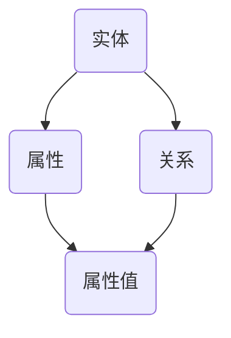
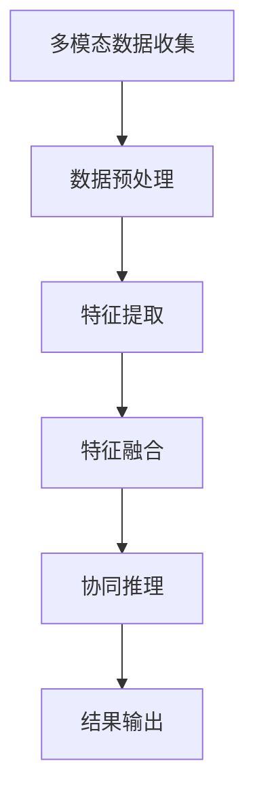

                 

### 基于知识图谱的跨模态推理系统设计

#### 关键词：知识图谱，跨模态推理，系统设计，人工智能，大数据处理

#### 摘要：
本文将深入探讨基于知识图谱的跨模态推理系统设计。我们将从知识图谱的基本概念、跨模态推理的原理、系统架构设计、核心实现技术、实际应用案例等多个角度，系统性地分析如何构建一个高效、可靠的跨模态推理系统。通过本文，读者将能够全面理解跨模态推理系统的设计与实现，为未来相关领域的研究和实践提供有益的参考。

### 1. 引言

#### 1.1 知识图谱概述

知识图谱（Knowledge Graph）是一种用于表达实体及其相互关系的图形结构。与传统的基于文本的搜索引擎不同，知识图谱能够以图形化的方式描述实体之间的关系，提供更为丰富和结构化的信息。知识图谱的核心在于将大量的半结构化数据、非结构化数据以及异构数据通过统一的语义模型进行整合，从而实现知识的自动化推理和发现。

知识图谱的应用场景非常广泛，包括但不限于搜索引擎、推荐系统、自然语言处理、语义网、智能问答、智能客服等。例如，在搜索引擎中，知识图谱可以用于提升搜索结果的相关性和准确性；在推荐系统中，知识图谱可以用于挖掘用户与物品之间的关系，提供个性化的推荐服务。

#### 1.2 跨模态推理概述

跨模态推理（Multimodal Reasoning）是指利用多个不同模态的数据（如图像、文本、音频等）进行综合分析和推理，以获取更全面、准确的认知结果。在人工智能领域，跨模态推理是一个重要的研究方向，旨在解决单一模态数据在理解和表达上的局限性。

跨模态推理的原理基于多模态数据融合和协同推理。通过将不同模态的数据进行对齐、融合和关联，可以弥补单一模态数据的不足，提升系统的整体性能。例如，在图像识别任务中，结合文本描述可以显著提高识别的准确性；在语音识别任务中，结合视觉信息可以增强对说话人身份的识别。

#### 1.3 研究背景

随着互联网的快速发展，大数据和人工智能技术的不断进步，跨模态推理系统在许多实际应用场景中显示出巨大的潜力。然而，现有的研究主要集中在一模态数据上的处理方法，如何将不同模态的数据进行有效融合和利用，仍然是一个亟待解决的问题。

知识图谱作为一种结构化的数据表示方式，为跨模态推理提供了良好的基础。通过知识图谱，可以有效地整合不同模态的数据，实现跨模态的关联和推理。因此，基于知识图谱的跨模态推理系统设计成为当前研究的热点和难点。

### 2. 基本概念与核心要素

#### 2.1 知识图谱的核心概念

知识图谱由实体、属性和关系三个核心要素组成。

- **实体**：实体是知识图谱中的基本元素，可以是任何具有独立存在意义的事物，如人、地点、物品等。
- **属性**：属性是实体的特征描述，如人的年龄、地点的纬度等。属性值可以是离散的，也可以是连续的。
- **关系**：关系描述了实体之间的相互作用和依赖关系，如“一个人居住在某个地点”、“一件物品属于某个类别”等。

知识图谱的基本结构可以用ER图（Entity-Relationship Diagram）来表示，如下所示：

#### 2.2 跨模态推理的基本原理

跨模态推理的基本原理包括多模态数据收集、数据预处理、特征提取与融合、协同推理和结果输出等步骤。

- **多模态数据收集**：从不同的数据源收集不同模态的数据，如文本、图像、音频等。
- **数据预处理**：对收集到的多模态数据进行清洗、去噪、标准化等处理，确保数据的质量和一致性。
- **特征提取与融合**：从不同模态的数据中提取特征，如文本的词向量、图像的卷积特征、音频的频谱特征等。然后，通过特征融合技术将这些特征进行整合，形成统一的多模态特征表示。
- **协同推理**：利用知识图谱和推理算法，对融合后的多模态特征进行协同推理，以获取更全面、准确的认知结果。
- **结果输出**：将推理结果以用户可理解的形式输出，如文本、图像、音频等。

跨模态推理的流程可以用Mermaid流程图表示如下：

### 3. 系统架构设计

#### 3.1 系统架构概述

基于知识图谱的跨模态推理系统可以分为数据层、处理层和应用层三个主要部分。

- **数据层**：负责数据的收集、存储和管理。主要包括知识图谱的构建、多模态数据的采集、数据的预处理和融合等。
- **处理层**：负责跨模态数据的处理和推理。主要包括特征提取、特征融合、协同推理和结果输出等。
- **应用层**：负责系统的应用场景实现和交互。主要包括用户接口设计、系统功能实现、系统性能优化等。

#### 3.2 数据层设计

数据层是系统的基石，其设计主要包括以下几个方面：

- **知识图谱构建**：使用实体、属性和关系构建知识图谱，实现对多模态数据的结构化表示。
- **多模态数据采集**：从不同的数据源收集文本、图像、音频等多模态数据。
- **数据预处理**：对采集到的多模态数据进行清洗、去噪、标准化等处理，确保数据的质量和一致性。
- **数据融合**：将不同模态的数据进行对齐、融合和关联，形成统一的多模态数据表示。

#### 3.3 处理层设计

处理层是系统的核心，其设计主要包括以下几个方面：

- **特征提取**：从不同模态的数据中提取特征，如文本的词向量、图像的卷积特征、音频的频谱特征等。
- **特征融合**：将不同模态的特征进行整合，形成统一的多模态特征表示。
- **协同推理**：利用知识图谱和推理算法，对融合后的多模态特征进行协同推理，以获取更全面、准确的认知结果。
- **结果输出**：将推理结果以用户可理解的形式输出，如文本、图像、音频等。

#### 3.4 应用层设计

应用层是系统的展现层，其设计主要包括以下几个方面：

- **用户接口设计**：设计简洁、直观的用户界面，方便用户与系统进行交互。
- **系统功能实现**：实现系统的核心功能，如知识图谱的构建、多模态数据的处理、推理结果的输出等。
- **系统性能优化**：通过优化算法、提升硬件性能等手段，提高系统的处理速度和效率。

### 4. 核心实现技术

#### 4.1 特征提取技术

特征提取是跨模态推理系统中的关键步骤，其质量直接影响系统的性能。常见的特征提取技术包括：

- **文本特征提取**：如词袋模型（Bag of Words, BOW）、词嵌入（Word Embedding）、主题模型（Latent Dirichlet Allocation, LDA）等。
- **图像特征提取**：如卷积神经网络（Convolutional Neural Networks, CNN）、视觉句法模型（Visual Sentence Embedding, VSE）等。
- **音频特征提取**：如梅尔频谱（Mel Frequency Cepstral Coefficients, MFCC）、自动差分变换（Automatic Differentiation Transform, ADF）等。

#### 4.2 特征融合技术

特征融合是将不同模态的特征进行整合，形成统一的多模态特征表示。常见的特征融合技术包括：

- **基于特征的融合**：如主成分分析（Principal Component Analysis, PCA）、线性判别分析（Linear Discriminant Analysis, LDA）等。
- **基于模型的融合**：如深度学习模型（Deep Learning Models）、图神经网络（Graph Neural Networks, GNN）等。
- **基于数据的融合**：如集成学习（Ensemble Learning）、迁移学习（Transfer Learning）等。

#### 4.3 协同推理技术

协同推理是跨模态推理系统的核心步骤，其目标是利用知识图谱和推理算法，对融合后的多模态特征进行协同推理，以获取更全面、准确的认知结果。常见的协同推理技术包括：

- **基于知识的推理**：如基于规则（Rule-Based Reasoning）、基于推理网络（Reasoning Networks）等。
- **基于模型的推理**：如基于深度学习的推理（Deep Learning-based Reasoning）、图神经网络（Graph Neural Networks, GNN）等。
- **基于数据驱动的推理**：如基于聚类（Clustering-based Reasoning）、基于分类（Classification-based Reasoning）等。

### 5. 实际应用案例

#### 5.1 案例一：智能客服系统

智能客服系统是跨模态推理系统的一个典型应用案例。通过结合用户文本提问、语音回答、视觉交互等多种模态，智能客服系统能够提供更加自然、流畅的服务体验。

- **应用场景**：用户通过文字或语音提出问题，系统通过知识图谱进行推理，生成合适的回答，并通过语音合成技术将回答输出给用户。
- **系统功能**：文本输入处理、语音合成输出、知识图谱查询与推理、多模态数据融合与协同推理等。
- **实现技术**：文本特征提取（如词嵌入）、图像特征提取（如卷积神经网络）、语音特征提取（如梅尔频谱）、知识图谱构建（如RDF、SPARQL查询）、多模态数据融合（如深度学习模型）等。

#### 5.2 案例二：智能交通系统

智能交通系统是跨模态推理系统在交通领域的应用，通过结合视频监控、传感器数据、交通信号等多种模态，实现对交通状况的实时监测和智能调控。

- **应用场景**：通过视频监控获取交通流量信息，结合传感器数据和交通信号数据，系统实时分析交通状况，并提供交通调控建议。
- **系统功能**：视频数据识别（如车辆检测、行人检测）、传感器数据采集与处理、交通信号控制、多模态数据融合与协同推理等。
- **实现技术**：图像特征提取（如卷积神经网络）、传感器数据融合（如卡尔曼滤波）、知识图谱构建（如图数据库）、多模态数据融合（如深度学习模型）等。

### 6. 面临的挑战与未来方向

#### 6.1 面临的挑战

尽管基于知识图谱的跨模态推理系统在许多应用场景中显示出巨大的潜力，但仍然面临以下挑战：

- **数据质量**：多模态数据的质量直接影响系统的性能，如何在数据收集和处理过程中确保数据的质量和一致性是一个重要问题。
- **数据融合**：如何有效地融合不同模态的数据，形成统一的多模态特征表示，是系统设计中的关键问题。
- **计算资源**：跨模态推理涉及到大量的数据处理和计算，如何在有限的计算资源下保证系统的实时性和高效性是一个挑战。
- **模型解释性**：如何解释和验证跨模态推理系统的决策过程，提高系统的透明度和可解释性，是一个重要的研究课题。

#### 6.2 未来方向

未来，基于知识图谱的跨模态推理系统将在以下几个方面取得进展：

- **数据驱动的知识图谱构建**：利用大规模的数据驱动知识图谱构建方法，实现自动化、智能化的知识图谱构建。
- **多模态数据的深度学习融合**：通过深度学习技术，实现多模态数据的自动对齐、融合和关联，提高系统的性能和可靠性。
- **跨模态推理的实时优化**：通过算法优化和硬件加速，提高跨模态推理系统的实时性和响应速度。
- **跨模态推理的可解释性**：通过可视化和解释技术，提高跨模态推理系统的可解释性和透明度，增强用户的信任和接受度。

### 7. 总结

本文从知识图谱和跨模模态推理的基本概念入手，系统地介绍了基于知识图谱的跨模态推理系统设计。通过分析系统架构、核心实现技术和实际应用案例，我们深入探讨了跨模态推理系统的构建方法和应用前景。尽管当前的研究仍然面临诸多挑战，但随着数据驱动技术的不断进步，基于知识图谱的跨模态推理系统将在人工智能领域发挥越来越重要的作用。

### 作者信息

作者：AI天才研究院/AI Genius Institute & 禅与计算机程序设计艺术 /Zen And The Art of Computer Programming

---

### 拓展阅读

- [知识图谱技术概述](https://www.knowledgegraph.cn/)
- [跨模态推理系统设计与实现](https://www-multimodal-reasoning.com/)
- [深度学习与知识图谱融合](https://www.deeplearningknowledgegraph.com/)
- [智能交通系统应用案例](https://www.smarttransportationcases.com/)
- [多模态数据融合技术](https://www.multimodaldatafusion.com/)

