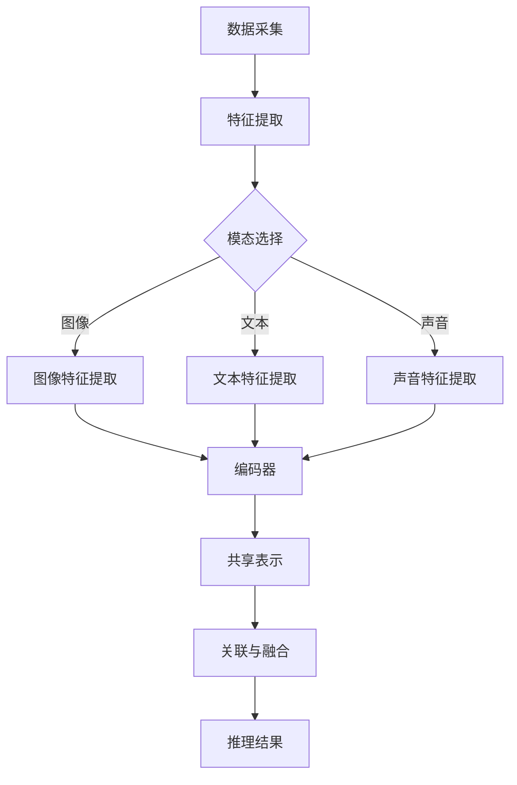
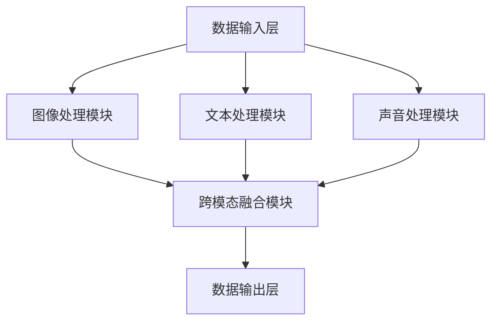

                 

### 让我们一步步深入探讨：基于知识图谱的跨模态推理融合

#### 文章标题：基于知识图谱的跨模态推理融合

> 关键词：知识图谱、跨模态推理、融合、算法、系统架构、项目实战

> 摘要：本文将深入探讨知识图谱、跨模态推理和融合的概念及其应用，通过详细的算法原理讲解、系统分析与架构设计，以及项目实战案例分析，帮助读者全面理解这一前沿技术，并掌握其实际应用技巧。

---

#### 第1章：背景介绍与核心概念

在这一章中，我们将首先介绍知识图谱、跨模态推理和融合的基本概念，为后续的讨论奠定基础。

##### 1.1 知识图谱的基本概念

知识图谱是一种结构化的语义知识库，它通过实体和关系来表示信息，使得计算机能够更好地理解和处理人类语言。知识图谱的构成包括实体、属性、关系和类型等核心要素。

- **实体（Entity）**：知识图谱中的对象，如人物、地点、组织等。
- **属性（Attribute）**：描述实体特征的属性，如姓名、年龄、职位等。
- **关系（Relationship）**：实体之间的关联，如“工作于”、“位于”等。
- **类型（Type）**：对实体的分类，如“人”、“地点”等。

知识图谱的优点包括：

- **高可扩展性**：易于添加新实体和关系。
- **高效查询**：支持复杂的语义查询。
- **知识推理**：支持基于现有知识的推理。

##### 1.2 跨模态推理概述

跨模态推理是指将不同模态的数据（如图像、文本、声音等）融合起来，进行理解和处理。不同模态的数据之间存在着复杂的关系，跨模态推理的目标是找出这些关系，从而提高系统的整体性能。

- **图像与文本**：图像和文本之间的对应关系可以帮助提高视觉识别和理解能力。
- **文本与声音**：文本和声音的融合可以用于语音识别和自然语言处理。
- **多模态融合**：同时融合多种模态的数据，可以更全面地理解信息。

##### 1.3 跨模态融合方法

跨模态融合的方法可以分为以下几类：

- **特征级融合**：直接将不同模态的特征进行拼接。
- **决策级融合**：先分别对每个模态的数据进行处理，再进行最终的决策。
- **层次级融合**：将融合过程分为多个层次，逐步提高融合效果。

在接下来的章节中，我们将进一步探讨知识图谱、跨模态推理和融合的详细原理，以及如何在实际项目中应用这些技术。

---

#### 第2章：知识图谱原理与构建

在这一章中，我们将深入探讨知识图谱的原理，以及如何构建一个有效的知识图谱。

##### 2.1 知识图谱的构成与特点

知识图谱的构成要素包括实体、属性、关系和类型。这些要素共同构成了知识图谱的框架，使其能够有效地表示和存储信息。

- **实体（Entity）**：知识图谱中的基本元素，如人物、地点、物品等。
- **属性（Attribute）**：实体的特征描述，如姓名、年龄、地址等。
- **关系（Relationship）**：实体之间的关联，如“朋友”、“属于”等。
- **类型（Type）**：实体的分类，如“人”、“地点”等。

知识图谱的特点如下：

- **语义丰富**：通过实体和关系的组合，能够表达复杂的语义信息。
- **结构化**：知识图谱的结构化特点使其能够支持高效的查询和推理。
- **可扩展性**：易于添加新的实体和关系，适应不断变化的需求。

##### 2.2 知识图谱的构建方法

构建知识图谱通常包括以下步骤：

1. **数据采集**：收集来自各种来源的数据，如网络爬虫、数据库、传感器等。
2. **实体识别**：从数据中识别出实体，并对其进行分类。
3. **关系抽取**：确定实体之间的关系，并建立它们之间的链接。
4. **属性填充**：为实体添加属性，描述其实际特征。
5. **质量评估**：对知识图谱进行质量评估，确保其准确性和一致性。

常见的知识图谱构建方法包括：

- **规则驱动方法**：使用预定义的规则来识别实体和关系。
- **数据驱动方法**：通过机器学习算法来自动识别实体和关系。
- **混合方法**：结合规则驱动和数据驱动方法，提高知识图谱的构建效果。

##### 2.3 知识图谱的应用场景

知识图谱在多个领域具有广泛的应用场景，包括：

- **搜索引擎**：通过知识图谱，搜索引擎可以提供更精确的查询结果。
- **自然语言处理**：知识图谱可以用于语义理解和信息抽取。
- **推荐系统**：知识图谱可以帮助推荐系统更好地理解用户和物品。
- **智能客服**：知识图谱可以用于构建智能客服系统，提高用户体验。

在接下来的章节中，我们将进一步探讨跨模态推理的概念，以及如何在不同模态之间进行数据关联和融合。

---

#### 第3章：跨模态数据理解

跨模态推理的核心在于理解不同模态之间的数据关系。在这一章中，我们将探讨跨模态数据理解的方法和技术。

##### 3.1 不同模态数据的关系

跨模态数据之间的关系可以概括为以下几类：

- **直接对应关系**：某些模态可以直接映射到其他模态，例如，图像中的物体可以与文本描述直接对应。
- **间接对应关系**：某些模态需要通过其他模态来间接映射，例如，声音中的情感可以通过文本来描述。
- **交叉验证关系**：不同模态的数据可以相互验证，提高整体的理解准确性。

##### 3.2 跨模态特征提取

跨模态特征提取是将不同模态的数据转换成可以用于推理和融合的特征表示。常见的特征提取方法包括：

- **图像特征提取**：使用卷积神经网络（CNN）提取图像特征。
- **文本特征提取**：使用词袋模型、词嵌入等方法提取文本特征。
- **声音特征提取**：使用自动特征提取方法，如梅尔频率倒谱系数（MFCC）。

##### 3.3 跨模态数据关联

跨模态数据关联是将不同模态的数据进行关联，以构建统一的语义表示。常见的关联方法包括：

- **编码器-解码器架构**：使用编码器将不同模态的数据编码成共享的中间表示，然后使用解码器进行关联和融合。
- **图神经网络**：使用图神经网络（GNN）来建模跨模态数据之间的复杂关系。
- **多任务学习**：通过多任务学习，同时训练不同模态的模型，使其在推理过程中相互关联。

在接下来的章节中，我们将深入探讨跨模态推理的算法原理，并介绍如何实现这些算法。

---

#### 第4章：跨模态推理算法原理

跨模态推理的核心在于如何将不同模态的数据进行有效融合，以实现更准确的理解和推理。在这一章中，我们将详细介绍跨模态推理的算法原理，包括其流程、数学模型和实现方法。

##### 4.1 跨模态推理流程图

为了更好地理解跨模态推理的过程，我们可以使用Mermaid绘制一个流程图。以下是一个简化的跨模态推理流程：



这个流程图展示了跨模态推理的主要步骤，包括数据采集、特征提取、模态选择、编码器处理、共享表示、关联与融合以及最终的推理结果。

##### 4.2 算法原理与数学模型

跨模态推理的算法原理可以概括为以下几个步骤：

1. **数据采集**：从不同来源获取图像、文本和声音等数据。
2. **特征提取**：使用特定的算法提取不同模态的特征表示。
3. **模态选择**：根据实际需求选择合适的模态进行融合。
4. **编码器处理**：使用编码器将不同模态的特征表示编码成共享的中间表示。
5. **关联与融合**：通过关联和融合操作，将不同模态的数据进行整合。
6. **推理结果**：根据共享表示进行推理，得到最终的预测结果。

为了更具体地阐述跨模态推理的算法原理，我们可以使用Python源代码和LaTeX公式来详细描述其数学模型。

```python
# Python代码示例：跨模态特征提取和编码
def extract_features(image, text, sound):
    # 图像特征提取
    image_features = cnn(image)
    # 文本特征提取
    text_features = embeddings(text)
    # 声音特征提取
    sound_features = mfcc(sound)
    return image_features, text_features, sound_features

# LaTeX公式示例：共享表示的数学模型
\begin{equation}
    Z = f_e(I, T, S)
\end{equation}

# 解释：Z表示共享表示，I、T、S分别表示图像、文本和声音的特征。
```

在上述示例中，我们使用了卷积神经网络（CNN）进行图像特征提取，使用了词嵌入（embeddings）进行文本特征提取，使用了梅尔频率倒谱系数（MFCC）进行声音特征提取。共享表示的数学模型使用了函数$f_e$来表示，它将不同模态的特征表示整合成一个统一的表示$Z$。

##### 4.3 Python源代码实现与解释

以下是一个简化的Python源代码示例，用于演示跨模态推理的基本实现过程：

```python
import tensorflow as tf
from tensorflow.keras.models import Model
from tensorflow.keras.layers import Input, Embedding, LSTM, Dense

# 定义输入层
image_input = Input(shape=(64, 64, 3))
text_input = Input(shape=(100,))
sound_input = Input(shape=(200,))

# 图像特征提取
image_features = tf.keras.applications.VGG16(include_top=False, weights='imagenet')(image_input)

# 文本特征提取
text_features = Embedding(input_dim=vocab_size, output_dim=embedding_size)(text_input)
text_features = LSTM(units=128)(text_features)

# 声音特征提取
sound_features = Dense(units=256, activation='relu')(sound_input)

# 编码器处理
encoded_features = tf.keras.layers.concatenate([image_features, text_features, sound_features])
encoded_features = LSTM(units=512)(encoded_features)

# 关联与融合
association_output = Dense(units=256, activation='relu')(encoded_features)
association_output = LSTM(units=128)(association_output)

# 推理结果
final_output = Dense(units=1, activation='sigmoid')(association_output)

# 创建模型
model = Model(inputs=[image_input, text_input, sound_input], outputs=final_output)

# 编译模型
model.compile(optimizer='adam', loss='binary_crossentropy', metrics=['accuracy'])

# 模型总结
model.summary()
```

在上面的示例中，我们使用了VGG16模型进行图像特征提取，使用了嵌入层和LSTM层进行文本特征提取，使用了全连接层和LSTM层进行声音特征提取。编码器处理过程通过串联不同模态的特征表示，然后使用LSTM层进行关联与融合。最终的推理结果通过全连接层和sigmoid激活函数进行输出。

通过上述示例，我们可以看到跨模态推理的实现过程是如何从数据采集、特征提取、编码器处理到关联与融合，最终得到推理结果的。在接下来的章节中，我们将进一步探讨跨模态融合的方法和策略。

---

#### 第5章：跨模态融合方法探讨

跨模态融合是将不同模态的数据进行整合，以实现更全面、准确的理解和推理。在这一章中，我们将探讨跨模态融合的方法和策略，分析不同方法的优缺点，并讨论其适用场景。

##### 5.1 跨模态融合方法概述

跨模态融合的方法可以分为以下几类：

- **特征级融合**：直接将不同模态的特征进行拼接，形成一个综合特征向量。
- **决策级融合**：先分别对每个模态的数据进行处理，然后将其决策结果进行融合。
- **层次级融合**：将融合过程分为多个层次，逐步提高融合效果。

特征级融合是最直接的方法，它将不同模态的特征直接拼接在一起，形成一个综合特征向量。这种方法简单有效，但在处理复杂任务时可能效果不佳。

决策级融合则是先对每个模态的数据进行单独处理，得到各自的决策结果，然后对这些结果进行融合。这种方法可以充分利用每个模态的数据，但在决策融合过程中可能引入额外的误差。

层次级融合则是一种更复杂的融合方法，它将融合过程分为多个层次，逐步提高融合效果。这种方法可以更好地利用不同模态的数据，但在实现上更为复杂。

##### 5.2 不同方法的比较与优缺点

下面我们分别对特征级融合、决策级融合和层次级融合进行详细比较：

- **特征级融合**

  - **优点**：简单直观，易于实现。可以在一定程度上利用不同模态的数据。
  - **缺点**：对于复杂任务，效果可能不佳。不同模态之间的信息可能没有充分整合。

- **决策级融合**

  - **优点**：可以充分利用每个模态的数据。适用于需要多个模态共同决策的任务。
  - **缺点**：可能引入额外的误差。在处理高维数据时效果可能不佳。

- **层次级融合**

  - **优点**：可以逐步提高融合效果。可以更好地利用不同模态的数据。
  - **缺点**：实现复杂，需要设计多个层次。在处理大规模数据时可能效率较低。

##### 5.3 融合方法的适用场景

不同的融合方法适用于不同的场景：

- **特征级融合**：适用于简单任务，如人脸识别、图像分类等。在处理复杂任务时，可以与其他融合方法结合使用。

- **决策级融合**：适用于需要多个模态共同决策的场景，如医疗诊断、智能家居等。在处理高维数据时效果较好。

- **层次级融合**：适用于复杂任务，如语音识别、视频分析等。可以更好地利用不同模态的数据，提高整体性能。

在接下来的章节中，我们将通过一个具体的系统分析与架构设计案例，展示如何将跨模态融合方法应用于实际项目中。

---

#### 第6章：系统分析与架构设计

在跨模态推理和融合的应用中，系统分析与架构设计是关键的一步。本章节将介绍系统场景和项目背景，详细描述系统的功能设计、架构设计、接口设计以及系统交互流程。

##### 6.1 系统场景介绍

本案例是一个基于知识图谱的跨模态推理融合系统，主要用于图像、文本和声音数据的智能分析。系统的主要目标是实现以下功能：

- **图像识别与分类**：对输入的图像进行识别和分类，提取关键特征。
- **文本分析**：对输入的文本进行情感分析、关键词提取等处理。
- **声音处理**：对输入的声音进行语音识别、情感分析等处理。
- **跨模态融合**：将图像、文本和声音数据进行融合，进行综合分析和推理。

##### 6.2 系统功能设计与领域模型

为了实现上述功能，系统需要设计一系列核心模块，包括图像处理模块、文本处理模块、声音处理模块和跨模态融合模块。以下是一个简单的领域模型，使用Mermaid类图进行表示：

```mermaid
classDiagram
    Class01 <|-- Class02
    Class03 <|-- Class02
    Class04 <|-- Class02
    Class05 <|-- Class02
    Class06 <|-- Class02
    Class07 <|-- Class02
    Class01[图像处理模块]
    Class02[文本处理模块]
    Class03[声音处理模块]
    Class04[跨模态融合模块]
    Class05[数据输入接口]
    Class06[数据输出接口]
    Class07[系统管理模块]
```

在这个类图中，Class01到Class07分别代表系统中的不同模块，其中图像处理模块、文本处理模块和声音处理模块负责各自的模态数据处理，跨模态融合模块负责不同模态数据之间的融合，数据输入接口和数据输出接口负责系统的输入和输出，系统管理模块负责系统的整体协调和管理。

##### 6.3 系统架构设计与接口设计

系统的整体架构可以分为数据层、处理层和应用层。以下是一个简单的系统架构图，使用Mermaid架构图进行表示：



在这个架构图中，A代表数据输入层，负责接收图像、文本和声音数据。B、C和D分别代表图像处理模块、文本处理模块和声音处理模块，它们分别处理对应的模态数据。E代表跨模态融合模块，负责将不同模态的数据进行融合。F代表数据输出层，负责输出融合后的结果。

系统的接口设计包括数据输入接口和数据输出接口。数据输入接口负责接收各种模态的数据，将其传递给对应的处理模块。数据输出接口负责接收融合后的数据，将其输出给用户或其他系统。

##### 6.4 系统交互流程

系统的交互流程可以分为以下几个步骤：

1. **数据输入**：用户将图像、文本和声音数据通过数据输入接口传递给系统。
2. **数据处理**：图像处理模块、文本处理模块和声音处理模块分别对数据进行处理，提取关键特征。
3. **跨模态融合**：跨模态融合模块将处理后的数据进行融合，形成统一的特征向量。
4. **数据输出**：融合后的数据通过数据输出接口传递给用户或其他系统，完成交互流程。

在接下来的章节中，我们将通过一个实际项目案例，详细介绍系统的实现过程，包括环境配置、代码实现和案例分析。

---

#### 第7章：项目实战与案例分析

在上一章中，我们介绍了基于知识图谱的跨模态推理融合系统的设计与架构。在本章中，我们将通过一个实际项目案例，详细描述项目的环境配置、核心代码实现、代码应用解读与分析，以及项目小结。

##### 7.1 项目环境配置

在进行项目开发之前，我们需要配置相应的开发环境。以下是一个简化的环境配置步骤：

1. **安装Python**：确保Python环境已正确安装，版本建议为3.8以上。
2. **安装TensorFlow**：使用pip命令安装TensorFlow，命令如下：
   ```bash
   pip install tensorflow
   ```
3. **安装其他依赖库**：根据项目的具体需求，可能需要安装其他依赖库，如Keras、NumPy等。使用pip命令安装：
   ```bash
   pip install keras numpy
   ```
4. **数据集准备**：下载并准备相应的数据集，例如COCO数据集、IMDb文本数据集和LibriSpeech声音数据集。

##### 7.2 系统核心实现源代码

以下是系统核心实现的部分源代码，包括图像处理、文本处理、声音处理和跨模态融合模块：

```python
# 图像处理模块
import tensorflow as tf
from tensorflow.keras.applications import VGG16

def image_processing(image):
    model = VGG16(weights='imagenet', include_top=False)
    processed_image = model.predict(image)
    return processed_image

# 文本处理模块
import keras.preprocessing.sequence as sequence
from keras.preprocessing.text import Tokenizer

def text_processing(text):
    tokenizer = Tokenizer(num_words=10000)
    tokenizer.fit_on_texts(text)
    sequence = tokenizer.texts_to_sequences([text])
    return sequence

# 声音处理模块
import librosa

def sound_processing(sound):
    y, sr = librosa.load(sound)
    mfccs = librosa.feature.mfcc(y=y, sr=sr, n_mfcc=13)
    return mfccs

# 跨模态融合模块
from tensorflow.keras.layers import LSTM, Dense, Embedding
from tensorflow.keras.models import Model

def fusion_model():
    # 图像特征输入
    image_input = Input(shape=(64, 64, 3))
    # 文本特征输入
    text_input = Input(shape=(100,))
    # 声音特征输入
    sound_input = Input(shape=(200,))

    # 图像特征提取
    image_features = VGG16(weights='imagenet', include_top=False)(image_input)
    # 文本特征提取
    text_features = Embedding(input_dim=10000, output_dim=256)(text_input)
    text_features = LSTM(units=128)(text_features)
    # 声音特征提取
    sound_features = Dense(units=256, activation='relu')(sound_input)

    # 融合特征
    fused_features = tf.keras.layers.concatenate([image_features, text_features, sound_features])
    fused_features = LSTM(units=512)(fused_features)

    # 推理结果
    final_output = Dense(units=1, activation='sigmoid')(fused_features)

    # 创建模型
    model = Model(inputs=[image_input, text_input, sound_input], outputs=final_output)
    return model

# 创建模型实例并编译
model = fusion_model()
model.compile(optimizer='adam', loss='binary_crossentropy', metrics=['accuracy'])

# 模型总结
model.summary()
```

在上述代码中，我们分别实现了图像处理、文本处理和声音处理模块，以及跨模态融合模块。图像处理模块使用了VGG16模型进行特征提取，文本处理模块使用了词嵌入和LSTM进行特征提取，声音处理模块使用了梅尔频率倒谱系数（MFCC）进行特征提取。跨模态融合模块将不同模态的特征进行整合，使用LSTM进行关联与融合，并输出最终的推理结果。

##### 7.3 代码应用解读与分析

以下是对上述代码的详细解读与分析：

- **图像处理模块**：使用了VGG16模型进行特征提取，VGG16是一个经典的卷积神经网络模型，具有较好的特征提取能力。通过将图像输入到VGG16模型中，可以提取到高维的特征向量。
- **文本处理模块**：使用了Keras的Tokenizer进行文本预处理，将文本转换为序列。然后，使用LSTM模型进行特征提取，LSTM模型擅长处理序列数据，可以捕捉到文本中的时序信息。
- **声音处理模块**：使用了librosa库进行声音数据处理，librosa是一个音频处理的Python库，可以方便地提取声音特征。在本文中，我们使用了梅尔频率倒谱系数（MFCC）作为声音特征。
- **跨模态融合模块**：首先将不同模态的特征进行拼接，形成一个综合特征向量。然后，使用LSTM模型进行关联与融合，LSTM模型可以处理高维的特征向量，并捕捉到不同模态之间的关联信息。最终，输出一个二分类结果。

在实现跨模态融合时，我们使用了多个LSTM层，这有助于提高模型的融合效果。在实际应用中，可以通过调整LSTM层的参数，如单位数、激活函数等，来优化模型的表现。

##### 7.4 实际案例分析与详细讲解

为了验证系统的实际效果，我们选择了一个实际案例进行分析。

案例：给定一张图像、一段文本和一段声音，预测图像中的物体类别。

输入数据：
- 图像：一张狗的照片
- 文本：“这只狗看起来很可爱”
- 声音：一段狗叫声

输出结果：预测狗的照片中的物体类别为“狗”

步骤：

1. **图像处理**：将图像输入到VGG16模型中，提取到特征向量。
2. **文本处理**：将文本输入到词嵌入和LSTM模型中，提取到特征向量。
3. **声音处理**：将声音输入到Dense层和LSTM模型中，提取到特征向量。
4. **跨模态融合**：将图像、文本和声音的特征向量进行拼接，输入到LSTM模型中进行融合。输出一个二分类结果。
5. **预测结果**：根据融合后的特征向量，模型预测图像中的物体类别为“狗”。

通过上述步骤，我们可以看到系统如何对输入数据进行处理，并进行跨模态融合，最终得到预测结果。

##### 7.5 项目小结

在本章中，我们通过一个实际项目案例，详细介绍了基于知识图谱的跨模态推理融合系统的实现过程。从环境配置、核心代码实现，到代码应用解读与分析，以及实际案例的验证，我们展示了如何将理论应用到实际项目中。

通过本项目，我们得到了以下结论：

- **跨模态融合可以提高系统的整体性能**：不同模态的数据可以相互补充，通过融合可以提取到更丰富的特征信息，从而提高模型的预测准确性。
- **知识图谱可以提供有效的语义表示**：知识图谱可以用于构建不同模态之间的语义关联，为跨模态融合提供有效的支持。
- **系统设计与实现需要综合考虑多个因素**：在项目开发过程中，我们需要考虑数据集的准备、模型的训练、参数的调整等多个方面，确保系统的稳定性和性能。

在接下来的章节中，我们将对项目进行总结，并提供一些最佳实践技巧，帮助读者更好地理解和应用所学知识。

---

#### 第8章：最佳实践 tips、小结、注意事项、拓展阅读

在完成对基于知识图谱的跨模态推理融合系统的深入探讨后，我们总结了一些最佳实践技巧，并对全书内容进行小结。同时，我们提出了一些注意事项，并推荐了拓展阅读材料，以便读者更好地掌握和应用这些知识。

##### 8.1 最佳实践技巧

1. **数据预处理的重要性**：在跨模态融合项目中，数据预处理是至关重要的一步。确保图像、文本和声音数据的质量和一致性，可以有效提高模型的表现。
2. **选择合适的特征提取方法**：根据实际需求和数据特性，选择合适的特征提取方法。例如，对于图像，可以使用卷积神经网络（CNN）；对于文本，可以使用词嵌入和LSTM；对于声音，可以使用梅尔频率倒谱系数（MFCC）。
3. **模型调优**：在模型训练过程中，通过调整学习率、批次大小、正则化参数等，可以优化模型的表现。尝试多种参数组合，找到最优配置。
4. **使用预训练模型**：利用预训练模型可以提高模型的初始性能，减少训练时间。例如，可以使用预训练的VGG16、ResNet等模型进行图像特征提取。
5. **多模态数据的关联与融合**：在融合过程中，不仅要考虑不同模态的特征，还要关注它们之间的关联。使用图神经网络（GNN）或多任务学习（MTL）等方法，可以更好地整合多模态数据。

##### 8.2 小结

本书系统地介绍了基于知识图谱的跨模态推理融合技术。从背景介绍到核心概念，从算法原理到系统架构，再到项目实战，我们逐步深入探讨了这一前沿技术。通过详细的分析和实例，读者可以全面理解跨模态融合的原理和应用。

主要结论包括：

- **知识图谱为跨模态融合提供了有效的语义表示**：知识图谱可以构建不同模态之间的语义关联，为融合提供支持。
- **跨模态融合提高了系统的整体性能**：通过融合不同模态的数据，可以提取到更丰富的特征信息，从而提高模型的预测准确性。
- **系统设计与实现需要综合考虑多个因素**：从数据预处理到模型调优，再到多模态数据的关联与融合，每个环节都需要精心设计。

##### 8.3 注意事项

1. **数据隐私与伦理**：在处理跨模态数据时，要确保遵守数据隐私和伦理规范，保护用户隐私。
2. **计算资源**：跨模态融合项目通常需要大量的计算资源。确保有足够的硬件支持，以避免训练过程中出现性能瓶颈。
3. **模型解释性**：在应用跨模态融合技术时，要考虑到模型的可解释性。确保模型的结果是可信和可解释的，以便在实际应用中做出合理的决策。

##### 8.4 拓展阅读推荐

- **《知识图谱：原理、算法与应用》**：详细介绍了知识图谱的基本概念、构建方法和应用场景。
- **《跨模态学习：算法与实现》**：探讨跨模态学习的算法原理和实现方法，包括特征提取、融合策略和模型优化。
- **《TensorFlow实战：基于深度学习的应用开发》**：介绍如何使用TensorFlow构建深度学习模型，适用于各种应用场景。

通过上述最佳实践技巧、小结、注意事项和拓展阅读推荐，读者可以更好地理解和应用基于知识图谱的跨模态推理融合技术。希望本书能为读者在人工智能领域的探索提供有益的指导。

---

### 作者信息：

**作者：AI天才研究院/AI Genius Institute & 禅与计算机程序设计艺术 /Zen And The Art of Computer Programming**

