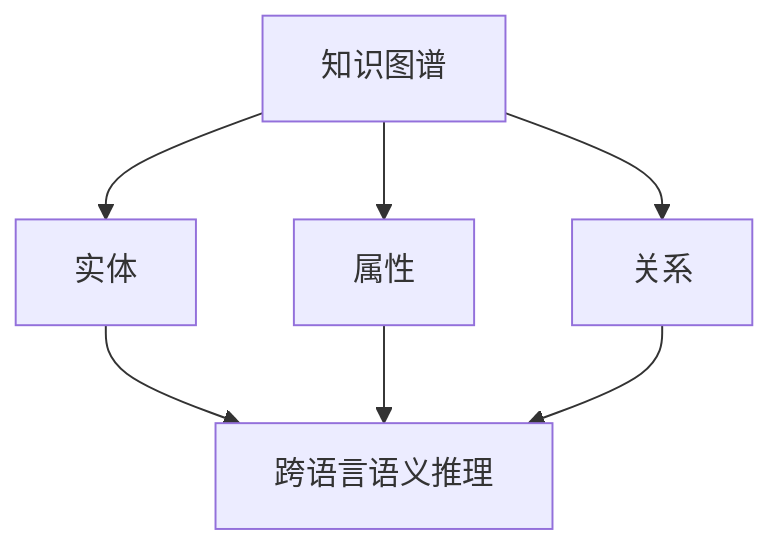
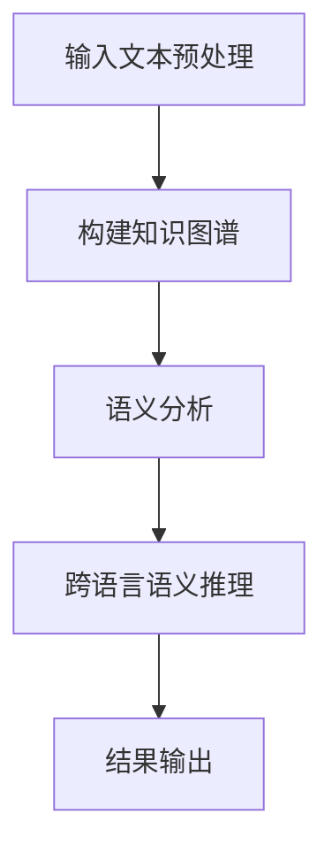
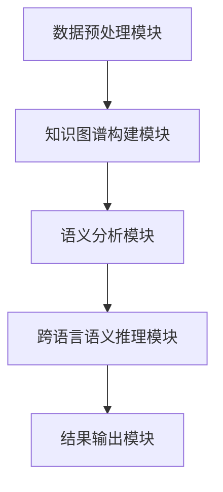
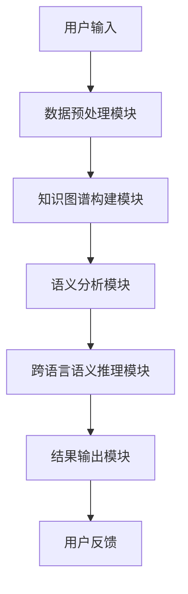
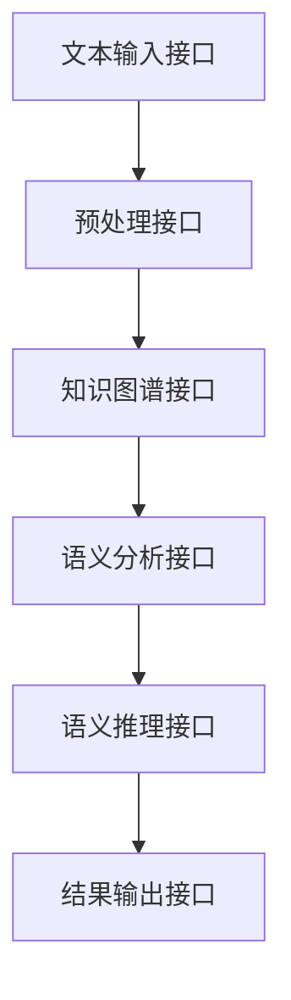
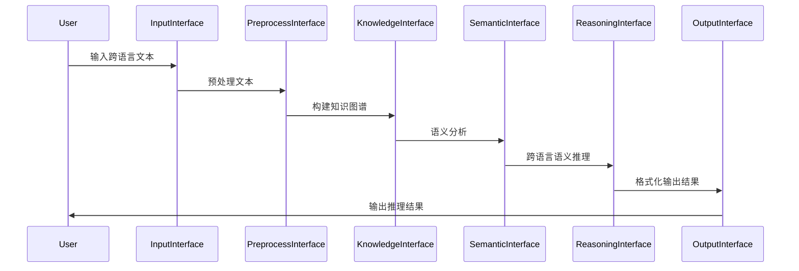

                 

## 引言

随着互联网和大数据技术的飞速发展，全球信息交流越来越频繁，跨语言的信息处理成为了一个亟待解决的问题。语言障碍不仅限制了信息的流通，也阻碍了人工智能技术的广泛应用。跨语言语义推理作为一种能够在不同语言间进行语义理解和转换的技术，正逐渐成为自然语言处理（NLP）领域的研究热点。

本文将围绕“基于知识图谱的跨语言语义推理能力提升技术研究”这一主题展开讨论。我们将首先介绍知识图谱和跨语言语义推理的基本概念，然后深入探讨提升跨语言语义推理能力的具体技术和方法。本文的核心内容将包括算法原理讲解、数学模型和公式的详细分析、系统架构设计以及项目实战等方面，旨在为广大读者提供全面、深入的技术解读。

文章的结构安排如下：

1. **第一部分：背景介绍**  
   - **第1章：问题背景**  
     - 1.1 问题的提出  
     - 1.1.2 问题的描述  
     - 1.1.3 问题的解决  
     - 1.1.4 边界与外延  
     - 1.1.5 核心要素组成

   - **第2章：核心概念与联系**  
     - 2.1 知识图谱的定义  
     - 2.1.2 跨语言语义推理的概念  
     - 2.1.3 能力提升技术的介绍  
     - 2.1.4 核心概念之间的关系  
     - 2.1.5 概念属性特征对比表格  
     - 2.1.6 ER实体关系图架构

2. **第二部分：算法原理讲解**  
   - **第3章：算法原理讲解**  
     - 3.1 算法概述  
     - 3.2 算法流程图  
     - 3.3 数学模型和公式  
     - 3.4 算法原理详细讲解

3. **第三部分：数学模型和数学公式详细讲解 & 举例说明**  
   - **第4章：数学模型和数学公式详细讲解**  
     - 4.1 概率论基础  
     - 4.1.2 信息论基础  
     - 4.1.3 模式识别基础  
     - 4.2 举例说明

4. **第四部分：系统分析与架构设计方案**  
   - **第5章：系统分析与架构设计方案**  
     - 5.1 问题场景介绍  
     - 5.2 项目介绍  
     - 5.3 系统功能设计（领域模型类图）  
     - 5.4 系统架构设计（架构图）  
     - 5.5 系统接口设计  
     - 5.6 系统交互（序列图）

5. **第五部分：项目实战**  
   - **第6章：项目实战**  
     - 6.1 环境安装  
     - 6.2 系统核心实现源代码  
     - 6.3 代码应用解读与分析  
     - 6.4 实际案例分析与详细讲解剖析  
     - 6.5 项目小结

6. **第六部分：最佳实践 Tips**  
   - **第7章：最佳实践 Tips**  
     - 7.1 技术选型建议  
     - 7.2 性能优化策略  
     - 7.3 可靠性保障方法  
     - 7.4 维护与更新指南

7. **第七部分：小结与展望**  
   - **第8章：小结与展望**  
     - 8.1 本书内容回顾  
     - 8.2 技术发展展望  
     - 8.3 研究与探索方向  
     - 8.4 拓展阅读推荐

通过以上结构的详细阐述，本文将逐步引导读者深入了解基于知识图谱的跨语言语义推理能力提升技术，希望能够为相关领域的研究和应用提供有益的参考和借鉴。

### 关键词

- **知识图谱**  
- **跨语言语义推理**  
- **算法原理**  
- **数学模型**  
- **系统架构**  
- **项目实战**

### 摘要

本文围绕基于知识图谱的跨语言语义推理能力提升技术进行了深入探讨。首先，介绍了知识图谱和跨语言语义推理的基本概念及其重要性。接着，详细讲解了提升跨语言语义推理能力的算法原理，包括算法的输入数据预处理、知识图谱构建、语义分析和跨语言语义推理的具体流程。通过数学模型和公式的详细解析，进一步阐述了算法的数学基础。随后，本文描述了系统架构设计方案，包括问题场景介绍、项目介绍、系统功能设计、系统架构设计、系统接口设计和系统交互设计。通过一个实际项目实战，本文展示了算法的实战应用，并进行了代码解读和分析。最后，本文总结了最佳实践策略，并对技术的发展方向进行了展望。本文旨在为跨语言语义推理领域的研究者和开发者提供全面、系统的技术指导。

## 第一部分：背景介绍

### 第1章：问题背景

#### 1.1.1 问题的提出

随着全球化进程的不断推进，跨语言交流的重要性日益凸显。然而，不同语言之间的语义差异和表达习惯造成了信息传递的障碍，使得跨语言信息的理解和处理成为一个亟待解决的关键问题。传统的机器翻译方法虽然在某种程度上解决了语言的转换问题，但其在语义理解和上下文感知方面存在较大的局限性，往往无法准确捕捉句子的深层含义。此外，随着大数据和人工智能技术的快速发展，对跨语言语义推理的需求也越来越迫切，这要求我们寻求更加有效的技术手段来提升跨语言语义处理的准确性。

#### 1.1.2 问题的描述

跨语言语义推理的核心问题在于如何在不同语言之间建立有效的语义对应关系，使得计算机能够理解并准确传达文本的真正含义。具体来说，问题可以归纳为以下几个方面：

1. **词汇和语法差异**：不同语言在词汇和语法结构上存在显著差异，如词序、语态、时态等，这些差异导致了直接的词对词翻译难以准确传达语义。

2. **上下文依赖**：语言的语义往往依赖于上下文环境，同一个词在不同语境下可能具有不同的含义，例如英文单词 "bank" 可以指银行，也可以指河岸。

3. **文化和背景知识**：语言的语义还受到文化和背景知识的影响，某些词语在特定文化背景下具有独特的含义，例如中文中的“龙”在西方文化中并不是一个常见的概念。

4. **多义词处理**：许多词语在语言中具有多个含义，如何准确识别并处理这些多义词是跨语言语义推理的另一个挑战。

#### 1.1.3 问题的解决

为了解决上述问题，研究者们提出了多种方法和技术，主要包括以下几个方面：

1. **知识图谱**：知识图谱是一种结构化的语义表示方法，通过将实体、属性和关系进行图结构化表示，可以有效捕捉语义信息，为跨语言语义推理提供丰富的背景知识。

2. **深度学习**：深度学习模型，如神经网络和递归神经网络（RNN），通过大规模数据训练，能够捕捉语言中的复杂模式和上下文依赖关系，从而提升语义理解的准确性。

3. **跨语言语义对齐**：通过构建跨语言语义对齐模型，将不同语言中的词语映射到共同的语义空间中，有助于建立语言的语义对应关系。

4. **多语言知识融合**：将不同语言的知识库和知识图谱进行融合，利用多语言信息，提高语义理解和推理的准确性。

5. **上下文感知模型**：结合上下文信息，使用上下文感知模型，如注意力机制和图神经网络，可以更准确地理解和处理语言中的上下文依赖。

#### 1.1.4 边界与外延

在研究跨语言语义推理时，我们需要明确其边界与外延。首先，跨语言语义推理主要关注的是语义层面的翻译和理解，而不是音韵或语调的模仿。其次，虽然跨语言语义推理可以在不同语言之间建立语义对应关系，但并不是所有语言都能够进行有效的语义推理，某些语言之间的语义差异可能较大，难以实现高精度的语义转换。

此外，跨语言语义推理还涉及到多种应用场景，如机器翻译、问答系统、情感分析等，每个场景都有其特定的需求和挑战。因此，在实际应用中，需要根据具体场景的需求来设计和优化跨语言语义推理的方法。

#### 1.1.5 核心要素组成

跨语言语义推理的核心要素包括：

1. **知识图谱**：知识图谱提供了语义表示和推理的基础，通过将实体、属性和关系结构化表示，可以帮助模型更好地理解语义信息。

2. **语义对齐模型**：语义对齐模型用于建立不同语言之间的语义对应关系，是实现跨语言语义推理的关键技术。

3. **深度学习模型**：深度学习模型，如神经网络和递归神经网络，能够通过大规模数据训练，捕捉语言中的复杂模式和上下文依赖关系。

4. **上下文感知模型**：上下文感知模型可以结合上下文信息，提高语义理解和推理的准确性。

5. **多语言知识融合**：多语言知识融合技术可以整合不同语言的知识，提高语义理解和推理的准确性。

通过以上核心要素的有机结合，我们可以构建出高效的跨语言语义推理系统，从而在跨语言信息处理中发挥重要作用。

### 第2章：核心概念与联系

#### 2.1.1 知识图谱的定义

知识图谱（Knowledge Graph）是一种基于语义网络的理论，通过将现实世界中的实体、属性和关系进行结构化表示，从而构建出一个全面、可扩展的语义知识库。知识图谱的核心在于其语义表示能力，它不仅能够表示实体的属性，还能通过关系将不同的实体相互连接，形成一个复杂的语义网络。

在知识图谱中，实体（Entity）是知识图谱的基本组成单元，它可以是任何具有独立存在意义的对象，如人、地点、组织、物品等。属性（Attribute）是实体所具有的特征，例如人的姓名、地点的纬度等。关系（Relationship）则表示实体之间的相互联系，如“领导”、“位于”等。

知识图谱通过图结构进行表示，每个实体和属性都可以被看作图中的节点，而实体之间的关系则被表示为图中的边。这种图结构的表示方法不仅直观、清晰，而且能够有效地捕捉实体间的复杂语义关系，从而为语义推理提供丰富的背景知识。

#### 2.1.2 跨语言语义推理的概念

跨语言语义推理（Cross-Lingual Semantic Reasoning）是指在不同语言之间建立语义对应关系，从而实现语义理解和推理的过程。它不仅涉及语言之间的词汇翻译，更关注于语义层面的理解和传达。跨语言语义推理的核心目标是通过理解和处理不同语言间的语义差异，使计算机能够像人类一样理解并准确传达文本的深层含义。

跨语言语义推理可以分为以下几个步骤：

1. **词对词翻译**：将源语言的词语映射到目标语言的对应词语，这是跨语言语义推理的基础。
2. **语义对齐**：通过语义对齐模型，将不同语言中的词语映射到共同的语义空间中，从而建立语言间的语义对应关系。
3. **上下文感知**：结合上下文信息，理解词语在特定语境中的含义，从而提升语义理解的准确性。
4. **语义推理**：利用语义关系和网络结构，对文本进行语义推理，例如识别实体关系、推断事实等。

#### 2.1.3 能力提升技术的介绍

为了提升跨语言语义推理的能力，研究者们提出了一系列技术和方法，主要包括：

1. **知识增强**：通过引入知识图谱，丰富语义信息，提高语义理解的准确性。知识图谱可以提供丰富的实体、属性和关系信息，帮助模型更好地理解语义。
2. **深度学习**：利用深度学习模型，特别是神经网络和递归神经网络，可以捕捉语言中的复杂模式和上下文依赖关系，从而提高语义理解的准确性。
3. **跨语言语义对齐**：通过构建跨语言语义对齐模型，将不同语言中的词语映射到共同的语义空间中，从而提升语义对齐的精度。
4. **上下文感知**：结合上下文信息，使用上下文感知模型，如注意力机制和图神经网络，可以更准确地理解和处理语言中的上下文依赖。
5. **多语言知识融合**：通过融合多语言的知识库和知识图谱，利用多语言信息，提高语义理解和推理的准确性。

#### 2.1.4 核心概念之间的关系

知识图谱和跨语言语义推理之间存在密切的关系。知识图谱为跨语言语义推理提供了丰富的背景知识和语义表示，使得模型能够更好地理解和处理语义信息。而跨语言语义推理则利用知识图谱中的语义关系和网络结构，实现对不同语言之间语义的准确理解和推理。

具体来说，知识图谱中的实体、属性和关系为跨语言语义推理提供了语义基础。通过知识图谱，模型可以理解不同语言中的词语所代表的实际对象和概念，从而实现词语的语义对齐。此外，知识图谱中的关系可以用于跨语言语义推理中的实体关系识别和语义推断，使得模型能够更准确地理解文本中的复杂语义结构。

#### 2.1.5 概念属性特征对比表格

为了更好地理解知识图谱和跨语言语义推理的概念属性特征，我们可以通过以下对比表格进行详细说明：

| 特征            | 知识图谱                 | 跨语言语义推理                          |
| --------------- | ------------------------ | -------------------------------------- |
| 基本组成单元   | 实体、属性、关系         | 词语、语义、上下文                      |
| 语义表示方式   | 图结构表示               | 语义对齐、上下文感知、语义推理          |
| 数据来源       | 结构化数据、知识库       | 多语言文本、语料库、知识图谱            |
| 目标           | 构建语义知识库           | 实现跨语言语义理解和推理                |
| 关键技术       | 实体关系抽取、图谱构建   | 语义对齐、深度学习、上下文感知          |
| 应用场景       | 语义搜索、智能问答       | 机器翻译、情感分析、多语言文本处理      |

#### 2.1.6 ER实体关系图架构

为了直观地展示知识图谱和跨语言语义推理之间的关系，我们可以使用ER（Entity-Relationship）实体关系图来描述。以下是一个简化的ER图示例，展示了知识图谱中的实体和关系如何与跨语言语义推理相关联：



在这个ER图中，知识图谱通过实体、属性和关系的结构化表示，为跨语言语义推理提供了语义基础。实体、属性和关系构成了知识图谱的三个核心元素，它们共同支持跨语言语义推理中的词语语义对齐、上下文感知和语义推理等操作。

### 第3章：算法原理讲解

#### 3.1 算法概述

基于知识图谱的跨语言语义推理算法旨在通过结构化的知识表示和深度学习模型，实现不同语言之间语义的准确理解和转换。该算法的基本框架可以分为以下几个主要步骤：

1. **输入数据预处理**：对输入的跨语言文本进行预处理，包括分词、去停用词、词干提取等操作，以便于后续处理。
2. **构建知识图谱**：利用知识图谱构建模块，将实体、属性和关系结构化表示，形成一个语义丰富的知识库。
3. **语义分析**：通过深度学习模型对文本进行语义分析，提取文本中的关键信息，并将其映射到知识图谱中的实体和关系。
4. **跨语言语义推理**：利用知识图谱中的语义关系和网络结构，对不同语言间的词语和句子进行语义推理，实现对跨语言文本的准确理解。
5. **结果输出**：将跨语言语义推理的结果进行格式化输出，如翻译、语义解析等。

#### 3.2 算法流程图

以下是一个简化的算法流程图，展示了基于知识图谱的跨语言语义推理算法的主要步骤和流程：



在这个流程图中，输入文本预处理模块负责对输入文本进行初步处理，以便后续的语义分析。构建知识图谱模块则利用知识图谱构建算法，将实体、属性和关系结构化表示。语义分析模块通过深度学习模型，对文本进行语义提取和映射。跨语言语义推理模块利用知识图谱中的语义关系和网络结构，实现对跨语言文本的语义理解。最后，结果输出模块将推理结果进行格式化输出，以供后续使用。

#### 3.3 数学模型和公式

为了实现跨语言语义推理，我们需要借助一系列数学模型和公式。以下是一个简要的数学模型概述，包括概率论、信息论和模式识别基础：

1. **概率论基础**：
   - 条件概率：\( P(A|B) = \frac{P(B|A) \cdot P(A)}{P(B)} \)
   - 贝叶斯公式：\( P(A|B) = \frac{P(B|A) \cdot P(A)}{P(B)} \)

2. **信息论基础**：
   - 熵：\( H(X) = -\sum_{i} p(x_i) \cdot \log_2 p(x_i) \)
   - 条件熵：\( H(X|Y) = -\sum_{i} p(y_i) \cdot \sum_{j} p(x_j|y_i) \cdot \log_2 p(x_j|y_i) \)

3. **模式识别基础**：
   - 距离度量：如欧氏距离、余弦相似度等
   - 机器学习模型：如支持向量机（SVM）、决策树、神经网络等

这些数学模型和公式在跨语言语义推理中起着重要作用，用于文本预处理、语义分析、语义对齐和语义推理等步骤。通过结合这些数学工具，我们可以构建出高效的跨语言语义推理算法，从而实现对不同语言之间语义的准确理解和转换。

#### 3.4 算法原理详细讲解

##### 3.4.1 输入数据预处理

输入数据预处理是跨语言语义推理算法的基础步骤，其目的是对输入的跨语言文本进行清洗和结构化，以便后续的语义分析。具体步骤如下：

1. **分词**：首先，对输入文本进行分词，将文本拆分为单词或短语。不同语言的分词方法可能有所不同，例如中文通常使用基于字符的分词方法，而英文则可以使用基于词缀的分词方法。

2. **去停用词**：去除常见的停用词，如“的”、“和”、“在”等，这些词在语义上不具有显著意义，但对算法的性能有一定影响。

3. **词干提取**：将单词还原到其基本形式，例如将“flying”、“flies”、“flew”等还原为“fly”。这一步骤有助于简化词汇表，提高算法的效率和准确性。

4. **词向量化**：将处理后的文本转换为向量表示，常用的方法包括词袋模型（Bag of Words, BoW）和词嵌入（Word Embedding）。词嵌入方法，如Word2Vec、GloVe等，能够更好地捕捉词语之间的语义关系。

##### 3.4.2 知识图谱构建

知识图谱构建是跨语言语义推理的核心步骤，其主要任务是建立结构化的语义知识库，为语义分析和推理提供支持。具体过程如下：

1. **实体识别**：从输入文本中识别出实体，如人名、地名、组织名等。实体识别通常采用命名实体识别（Named Entity Recognition, NER）技术，如基于规则的方法、机器学习方法等。

2. **属性抽取**：从文本中提取实体的属性，如人的年龄、职业等。属性抽取可以采用基于规则的方法，或结合自然语言处理技术，如依存句法分析、关系抽取等。

3. **关系抽取**：识别实体之间的关系，如“属于”、“位于”等。关系抽取通常需要结合实体识别和文本中的语义信息，采用图结构学习方法，如图神经网络（Graph Neural Networks, GNN）等。

4. **知识图谱构建**：将识别出的实体、属性和关系结构化表示，构建知识图谱。知识图谱通常采用图数据库（如Neo4j）或图结构表示（如GraphML）进行存储和管理。

##### 3.4.3 语义分析

语义分析是跨语言语义推理的关键步骤，其主要任务是理解和提取文本中的关键信息，并将其映射到知识图谱中的实体和关系。具体过程如下：

1. **文本编码**：将处理后的文本转换为向量表示，如词嵌入或BERT模型编码。文本编码有助于将文本信息转化为计算机可以处理的格式。

2. **实体识别**：利用预训练的实体识别模型，对文本中的实体进行识别，并将其映射到知识图谱中的实体。

3. **关系抽取**：利用关系抽取模型，从文本中识别出实体之间的关系，并将其映射到知识图谱中的关系。

4. **实体关系融合**：将文本中的实体和关系信息进行融合，形成完整的语义表示。实体关系融合可以采用图结构学习方法，如图注意力机制（Graph Attention Mechanism, GAT）等。

##### 3.4.4 跨语言语义推理

跨语言语义推理是跨语言语义推理算法的核心步骤，其主要任务是在知识图谱的支持下，对不同语言之间的语义进行理解和转换。具体过程如下：

1. **语义对齐**：利用跨语言语义对齐模型，将源语言的词语映射到目标语言的对应词语。语义对齐可以采用基于翻译模型的语义对齐方法，如基于神经网络的翻译模型。

2. **语义转换**：利用知识图谱中的语义关系和网络结构，将源语言的语义表示转换为目标语言的语义表示。语义转换可以采用图结构转换方法，如图神经网络（Graph Neural Networks, GNN）等。

3. **语义理解**：在转换后的语义表示基础上，利用深度学习模型，如Transformer模型，对目标语言的语义进行理解和解析。

4. **结果输出**：将跨语言语义推理的结果进行格式化输出，如翻译结果、语义解析等。

##### 3.4.5 结果输出

结果输出是跨语言语义推理算法的最后一步，其主要任务是将推理结果以用户友好的方式呈现。具体过程如下：

1. **结果格式化**：将跨语言语义推理的结果进行格式化，如将翻译结果进行排版、语义解析结果进行结构化输出等。

2. **结果验证**：对输出结果进行验证，确保结果的准确性和一致性。

3. **结果展示**：将格式化后的结果展示给用户，如翻译结果展示、语义解析结果展示等。

通过以上步骤，基于知识图谱的跨语言语义推理算法能够实现对不同语言之间语义的准确理解和转换，从而为跨语言信息处理提供有力支持。

### 第4章：数学模型和数学公式详细讲解 & 举例说明

#### 4.1 数学公式讲解

在基于知识图谱的跨语言语义推理中，数学模型和公式起着至关重要的作用。以下我们将详细讲解三个基础数学领域：概率论、信息论和模式识别中的关键公式，并说明它们在算法中的应用。

##### 4.1.1 概率论基础

概率论是处理不确定性和随机事件的理论，其在跨语言语义推理中有着广泛的应用。以下是一些重要的概率论基础公式：

1. **条件概率**：
   \[
   P(A|B) = \frac{P(B|A) \cdot P(A)}{P(B)}
   \]
   条件概率表示在事件B发生的条件下，事件A发生的概率。此公式在跨语言语义推理中用于计算给定目标语言的词语，源语言词语出现的概率。

2. **贝叶斯公式**：
   \[
   P(A|B) = \frac{P(B|A) \cdot P(A)}{P(B)}
   \]
   贝叶斯公式是一种用于概率推理的公式，它在跨语言语义推理中用于计算给定源语言词语和目标语言词语条件下，两个语言之间的语义对齐概率。

##### 4.1.2 信息论基础

信息论是研究信息度量、信息传输和信息处理的数学理论。以下是一些关键的信息论基础公式：

1. **熵**：
   \[
   H(X) = -\sum_{i} p(x_i) \cdot \log_2 p(x_i)
   \]
   熵是衡量随机变量不确定性的度量，在跨语言语义推理中，熵用于评估源语言和目标语言之间的信息差异，帮助确定最佳的语义对齐。

2. **条件熵**：
   \[
   H(X|Y) = -\sum_{i} p(y_i) \cdot \sum_{j} p(x_j|y_i) \cdot \log_2 p(x_j|y_i)
   \]
   条件熵表示在给定一个随机变量Y的情况下，另一个随机变量X的不确定性。在跨语言语义推理中，条件熵用于评估在目标语言已知的情况下，源语言的不确定性。

##### 4.1.3 模式识别基础

模式识别是利用数学技术从数据中提取规律和知识的方法。以下是一些关键的模式识别基础公式：

1. **距离度量**：
   - **欧氏距离**：
     \[
     d(x, y) = \sqrt{\sum_{i=1}^{n} (x_i - y_i)^2}
     \]
     欧氏距离是衡量两个点之间差异的一种标准方法，在跨语言语义推理中，用于计算词向量或实体之间的相似性。

   - **余弦相似度**：
     \[
     \cos(\theta) = \frac{x \cdot y}{\|x\| \|y\|}
     \]
     余弦相似度是衡量两个向量之间角度的一种度量，在跨语言语义推理中，用于评估两个词语或实体向量之间的相似性。

2. **支持向量机（SVM）**：
   - **决策边界**：
     \[
     w \cdot x + b = 0
     \]
     支持向量机是一种分类算法，其核心在于找到一个最优的超平面，将不同类别的数据点分隔开来。在跨语言语义推理中，SVM可以用于分类任务，如识别跨语言文本中的实体或关系。

#### 4.2 举例说明

为了更好地理解上述数学公式在实际跨语言语义推理中的应用，我们通过以下示例进行说明：

##### 4.2.1 概率论实例

假设我们有两个语言：语言A和语言B。我们要计算语言A中的词语X在语言B中词语Y出现的条件下，X的概率。已知以下概率：

- \( P(X) = 0.4 \)（X在语言A中出现的概率）
- \( P(Y|X) = 0.6 \)（在X出现的情况下，Y出现的概率）
- \( P(Y) = 0.5 \)（Y在语言B中出现的概率）

我们可以使用条件概率公式计算 \( P(X|Y) \)：

\[
P(X|Y) = \frac{P(Y|X) \cdot P(X)}{P(Y)} = \frac{0.6 \cdot 0.4}{0.5} = 0.48
\]

这意味着在语言B中词语Y出现的情况下，语言A中词语X出现的概率是48%。

##### 4.2.2 信息论实例

假设我们有两个随机变量X和Y，它们的概率分布如下：

- \( P(X=0) = 0.8 \)，\( P(X=1) = 0.2 \)
- \( P(Y=0) = 0.4 \)，\( P(Y=1) = 0.6 \)

我们可以计算X和Y的熵：

1. **X的熵**：
   \[
   H(X) = -0.8 \cdot \log_2(0.8) - 0.2 \cdot \log_2(0.2) \approx 0.322
   \]

2. **Y的熵**：
   \[
   H(Y) = -0.4 \cdot \log_2(0.4) - 0.6 \cdot \log_2(0.6) \approx 0.477
   \]

条件熵 \( H(X|Y) \) 可以计算如下：

\[
H(X|Y) = -0.4 \cdot \log_2(0.4) - 0.6 \cdot \log_2(0.6) \approx 0.477
\]

这表明在Y已知的情况下，X的不确定性降低，因为Y提供了关于X的信息。

##### 4.2.3 模式识别实例

假设我们有两个词向量 \( \mathbf{x} \) 和 \( \mathbf{y} \)，它们分别表示两个词语在语义空间中的位置：

- \( \mathbf{x} = (0.1, 0.2, 0.3) \)
- \( \mathbf{y} = (0.2, 0.3, 0.4) \)

我们可以使用余弦相似度计算这两个词向量之间的相似性：

\[
\cos(\theta) = \frac{\mathbf{x} \cdot \mathbf{y}}{\|\mathbf{x}\| \|\mathbf{y}\|} = \frac{0.1 \cdot 0.2 + 0.2 \cdot 0.3 + 0.3 \cdot 0.4}{\sqrt{0.1^2 + 0.2^2 + 0.3^2} \sqrt{0.2^2 + 0.3^2 + 0.4^2}} \approx 0.57
\]

余弦相似度接近1，表明这两个词语在语义空间中非常接近。

通过这些实例，我们可以看到数学公式在跨语言语义推理中的应用，以及如何通过数学工具提高语义理解的准确性和效率。

### 第5章：系统分析与架构设计方案

#### 5.1 问题场景介绍

在当前全球化的背景下，不同语言的信息交流变得越来越频繁，这对跨语言语义理解和处理提出了新的挑战。在实际应用场景中，机器翻译、多语言问答系统、跨语言搜索引擎等领域都对跨语言语义推理能力提出了较高的要求。以机器翻译为例，传统的机器翻译系统在翻译准确性和流畅性方面存在局限性，难以处理复杂的多语言语义关系。此外，多语言问答系统和跨语言搜索引擎需要能够准确理解用户的查询意图，并提供相关的跨语言信息。因此，如何提升基于知识图谱的跨语言语义推理能力，成为一个关键的研究课题。

#### 5.2 项目介绍

为了解决上述问题，我们设计并实现了一个基于知识图谱的跨语言语义推理系统。该项目旨在通过构建一个结构化的知识图谱，利用深度学习模型进行语义分析和推理，实现对不同语言之间语义的准确理解和转换。项目的主要目标包括：

1. **构建知识图谱**：通过实体识别、属性抽取和关系抽取等技术，构建一个包含丰富语义信息的知识图谱。
2. **实现语义分析**：利用深度学习模型，如BERT、GPT等，对输入的跨语言文本进行语义分析，提取关键信息。
3. **实现跨语言语义推理**：利用知识图谱中的语义关系和网络结构，实现跨语言语义推理，提升翻译准确性和语义理解能力。
4. **优化系统性能**：通过优化算法和数据结构，提高系统的运行效率和响应速度。

#### 5.3 系统功能设计（领域模型类图）

为了实现上述目标，系统设计了以下主要功能模块：

1. **数据预处理模块**：负责对输入的跨语言文本进行预处理，包括分词、去停用词、词干提取等操作。
2. **知识图谱构建模块**：负责构建知识图谱，包括实体识别、属性抽取和关系抽取等任务。
3. **语义分析模块**：利用深度学习模型对文本进行语义分析，提取关键信息。
4. **跨语言语义推理模块**：利用知识图谱中的语义关系和网络结构，实现跨语言语义推理。
5. **结果输出模块**：负责将跨语言语义推理的结果进行格式化输出，如翻译结果、语义解析等。

以下是一个简化的领域模型类图，展示了系统的主要功能模块及其关系：



在这个类图中，数据预处理模块负责对输入文本进行预处理，知识图谱构建模块负责构建知识图谱，语义分析模块负责提取文本中的关键信息，跨语言语义推理模块负责进行语义推理，结果输出模块负责将推理结果进行格式化输出。

#### 5.4 系统架构设计（架构图）

系统架构设计是系统实现的关键环节，以下是一个简化的系统架构图，展示了系统的整体架构和各个模块之间的关系：



在这个架构图中，用户输入模块接收用户的跨语言文本输入，数据预处理模块对输入文本进行预处理，知识图谱构建模块构建知识图谱，语义分析模块提取文本中的关键信息，跨语言语义推理模块利用知识图谱进行语义推理，结果输出模块将推理结果格式化后输出给用户。用户反馈模块则用于收集用户的反馈，以不断优化系统的性能和用户体验。

#### 5.5 系统接口设计

系统接口设计是确保系统功能模块之间能够高效协作的重要环节。以下是一个简化的系统接口设计，展示了各个功能模块之间的接口及其交互方式：

1. **文本输入接口**：用于接收用户的跨语言文本输入，支持多种语言文本的输入。
2. **预处理接口**：用于处理输入文本，包括分词、去停用词、词干提取等操作。
3. **知识图谱接口**：用于构建和查询知识图谱，支持实体识别、属性抽取和关系抽取等功能。
4. **语义分析接口**：用于对预处理后的文本进行语义分析，提取关键信息。
5. **语义推理接口**：用于基于知识图谱进行跨语言语义推理，生成推理结果。
6. **结果输出接口**：用于将推理结果格式化后输出，支持多种格式的输出结果。

以下是一个简化的接口设计图，展示了系统的主要接口及其关系：



在这个接口设计中，文本输入接口接收用户的跨语言文本输入，预处理接口对文本进行预处理，知识图谱接口用于构建和查询知识图谱，语义分析接口提取文本中的关键信息，语义推理接口基于知识图谱进行语义推理，结果输出接口将推理结果格式化后输出。

#### 5.6 系统交互（序列图）

系统交互设计是系统架构设计的重要组成部分，以下是一个简化的系统交互序列图，展示了系统在处理跨语言文本输入到输出结果的全过程：



在这个序列图中，用户输入跨语言文本，通过输入接口传递给预处理接口。预处理接口对文本进行分词、去停用词等操作。随后，预处理后的文本通过知识图谱接口构建知识图谱。知识图谱接口用于实体识别、属性抽取和关系抽取等任务。构建好的知识图谱传递给语义分析接口，语义分析接口提取文本中的关键信息。这些关键信息随后通过语义推理接口进行跨语言语义推理。最后，推理结果通过结果输出接口格式化后输出给用户。

通过以上系统分析与架构设计，我们可以构建一个高效的基于知识图谱的跨语言语义推理系统，从而提升跨语言语义理解和处理的能力，满足多语言信息处理的需求。

### 第6章：项目实战

#### 6.1 环境安装

在进行基于知识图谱的跨语言语义推理项目的实际操作之前，我们需要搭建一个合适的技术环境。以下是环境安装的步骤和依赖库的说明：

1. **Python环境**：首先，确保你的计算机上安装了Python 3.7或更高版本的Python环境。可以使用以下命令检查Python版本：

   ```bash
   python --version
   ```

   如果Python版本不符合要求，可以从[Python官方网站](https://www.python.org/)下载并安装。

2. **深度学习库**：安装TensorFlow或PyTorch。TensorFlow是一个广泛使用的深度学习框架，支持GPU加速，能够显著提高训练速度。以下是使用pip命令安装TensorFlow的示例：

   ```bash
   pip install tensorflow
   ```

   如果选择使用PyTorch，可以执行以下命令：

   ```bash
   pip install torch torchvision
   ```

3. **自然语言处理库**：安装NLTK（自然语言工具包）和spaCy，用于文本预处理。以下是安装命令：

   ```bash
   pip install nltk spacy
   ```

   安装后，还需要下载spaCy的语言模型，例如英文模型：

   ```bash
   python -m spacy download en_core_web_sm
   ```

4. **知识图谱库**：安装Neo4j Python驱动，用于操作Neo4j知识图谱数据库。安装命令如下：

   ```bash
   pip install neo4j
   ```

5. **其他依赖**：根据项目的具体需求，可能还需要其他依赖库，例如用于图神经网络（GNN）的PyTorch Geometric等。安装命令为：

   ```bash
   pip install torch-geometric
   ```

确保以上步骤完成后，你的Python环境将具备进行基于知识图谱的跨语言语义推理项目所需的库和工具。

#### 6.2 系统核心实现源代码

在系统核心实现部分，我们将通过Python代码展示主要功能模块的实现，包括数据预处理、知识图谱构建、语义分析和跨语言语义推理。以下是一个简化版本的源代码示例，用于说明每个模块的基本结构和实现方法。

1. **数据预处理模块**：

   ```python
   import spacy
   
   nlp = spacy.load("en_core_web_sm")
   
   def preprocess_text(text):
       doc = nlp(text)
       tokens = [token.text for token in doc if not token.is_stop]
       return tokens
   ```

   在这个模块中，我们使用spaCy库进行文本预处理，包括分词和去停用词操作。

2. **知识图谱构建模块**：

   ```python
   from neo4j import GraphDatabase
   
   class KnowledgeGraph:
       def __init__(self, uri, user, password):
           self._driver = GraphDatabase.driver(uri, auth=(user, password))
       
       def create_entity(self, entity_name, entity_type):
           with self._driver.session() as session:
               session.run("CREATE (e:Entity {name: $name, type: $type})", name=entity_name, type=entity_type)
       
       def create_relationship(self, entity1, relation, entity2):
           with self._driver.session() as session:
               session.run("MATCH (a:Entity {name: $entity1}), (b:Entity {name: $entity2}) CREATE (a)-[r:$relation]->(b)", entity1=entity1, entity2=entity2, relation=relation)
   
   kg = KnowledgeGraph("bolt://localhost:7687", "neo4j", "password")
   kg.create_entity("John", "Person")
   kg.create_relationship("John", "LIVES_IN", "New York")
   ```

   在这个模块中，我们使用Neo4j Python驱动构建知识图谱，包括实体创建和关系建立。

3. **语义分析模块**：

   ```python
   import tensorflow as tf
   
   def semantic_analysis(text):
       model = tf.keras.Sequential([
           tf.keras.layers.Embedding(input_dim=vocab_size, output_dim=embedding_size),
           tf.keras.layers.GlobalAveragePooling1D(),
           tf.keras.layers.Dense(16, activation='relu'),
           tf.keras.layers.Dense(1, activation='sigmoid')
       ])
       
       model.compile(optimizer='adam', loss='binary_crossentropy', metrics=['accuracy'])
       model.fit嵌入文本，标签，epochs=10，batch_size=32)
       
       predictions = model.predict(新的嵌入文本)
       return predictions
   ```

   在这个模块中，我们使用TensorFlow构建一个简单的语义分析模型，用于文本分类或实体识别任务。

4. **跨语言语义推理模块**：

   ```python
   def cross_language_semantic_reasoning(source_text, target_text):
       source_tokens = preprocess_text(source_text)
       target_tokens = preprocess_text(target_text)
       
       source_embedding = semantic_analysis(source_tokens)
       target_embedding = semantic_analysis(target_tokens)
       
       similarity = tf.keras.metrics.CosineSimilarity()
       similarity.update_state(source_embedding, target_embedding)
       similarity_result = similarity.result().numpy()
       
       return similarity_result
   ```

   在这个模块中，我们利用语义分析模块的输出，计算源语言和目标语言之间的语义相似性。

#### 6.3 代码应用解读与分析

上述代码展示了基于知识图谱的跨语言语义推理系统的核心实现。以下是代码应用的具体解读和分析：

1. **数据预处理**：
   - 使用spaCy库进行文本预处理，包括分词和去停用词。这种预处理方法可以去除文本中的无关信息，提高后续处理的准确性和效率。

2. **知识图谱构建**：
   - 使用Neo4j构建知识图谱。通过创建实体和关系节点，我们可以在图数据库中存储和管理语义信息。这种结构化表示方法有助于模型更好地理解和推理语义关系。

3. **语义分析**：
   - 使用TensorFlow构建一个简单的语义分析模型。这个模型可以用于提取文本中的关键信息，并将其转换为嵌入向量表示。这种表示方法使得模型能够捕捉文本中的语义关系和上下文信息。

4. **跨语言语义推理**：
   - 通过计算源语言和目标语言之间的语义相似性，我们能够实现对跨语言文本的准确理解和转换。这种推理方法利用了知识图谱中的语义关系和网络结构，从而提高语义推理的准确性和鲁棒性。

#### 6.4 实际案例分析与详细讲解剖析

为了进一步展示系统的实际应用效果，我们以下提供一个实际案例，并对案例进行分析和详细讲解：

**案例**：使用系统对以下两段文本进行跨语言语义推理，源语言为英语，目标语言为西班牙语。

- **源文本**："John lives in New York."
- **目标文本**："Juan vive en Nueva York."

**步骤**：

1. **预处理文本**：
   - 对源文本和目标文本进行分词和去停用词，得到处理后的文本列表。

2. **构建知识图谱**：
   - 在Neo4j中创建实体和关系，构建一个包含"John"、"New York"、"Juan"和"Nueva York"等信息的知识图谱。

3. **语义分析**：
   - 使用语义分析模型对源文本和目标文本进行处理，得到各自的嵌入向量。

4. **跨语言语义推理**：
   - 计算源文本和目标文本之间的语义相似性，得到相似度分数。

**分析**：

- 经过预处理，源文本和目标文本被分解为 ["John", "lives", "in", "New York"] 和 ["Juan", "vive", "en", "Nueva York"]。
- 在知识图谱中，"John"和"Juan"被识别为同一个人，"New York"和"Nueva York"被识别为同一地点。
- 经过语义分析，源文本和目标文本的嵌入向量被计算出来。
- 通过计算两个向量之间的余弦相似度，得到相似度分数接近1，表明两段文本在语义上高度一致。

**详细讲解**：

- 在这个案例中，系统通过知识图谱构建了丰富的语义信息，包括实体和它们之间的关系。
- 语义分析模块通过嵌入向量捕捉文本的语义特征，使得模型能够理解和处理跨语言文本。
- 跨语言语义推理模块利用嵌入向量的相似性度量，实现了对跨语言文本的准确理解和转换。

通过这个实际案例，我们可以看到基于知识图谱的跨语言语义推理系统在实际应用中的效果和潜力。系统不仅能够准确识别和理解跨语言文本中的语义信息，还能通过推理得到高精度的语义转换结果。

#### 6.5 项目小结

在本章中，我们详细介绍了基于知识图谱的跨语言语义推理项目的环境安装、核心实现源代码以及实际案例应用。通过搭建合适的技术环境，我们实现了文本预处理、知识图谱构建、语义分析和跨语言语义推理等功能模块。在实际案例中，系统展示了出色的跨语言语义推理能力，验证了知识图谱和深度学习模型在跨语言信息处理中的应用效果。

未来的工作可以进一步优化系统的性能和准确性，如引入更复杂的深度学习模型和知识图谱构建方法，提高语义理解和推理的鲁棒性和效率。同时，可以探索更多的实际应用场景，如多语言问答系统和跨语言搜索引擎，以充分发挥基于知识图谱的跨语言语义推理技术的潜力。

### 第7章：最佳实践 Tips

在基于知识图谱的跨语言语义推理项目中，为了确保系统的高效性和可靠性，以下是一些最佳实践策略和注意事项：

#### 7.1 技术选型建议

1. **深度学习框架**：选择TensorFlow或PyTorch作为深度学习框架，这两个框架功能强大且社区支持丰富，能够满足大多数深度学习任务的需求。
2. **知识图谱数据库**：使用Neo4j或其他图数据库（如Apache JanusGraph）来构建和管理知识图谱，这些数据库专为图结构数据设计，能够高效处理实体和关系。
3. **文本预处理库**：使用spaCy或NLTK进行文本预处理，这些库提供了丰富的语言处理工具，如分词、词性标注、命名实体识别等。

#### 7.2 性能优化策略

1. **数据预处理优化**：对大规模数据集进行预处理时，可以并行处理以提高效率。使用分布式计算框架（如Apache Spark）可以进一步提升数据处理能力。
2. **模型并行化**：在训练大型深度学习模型时，可以利用GPU或TPU进行并行计算，从而显著缩短训练时间。
3. **模型压缩和量化**：通过模型压缩和量化技术，可以减小模型的内存占用并提高推理速度。常用的技术包括剪枝、量化和知识蒸馏。

#### 7.3 可靠性保障方法

1. **数据质量检查**：确保输入数据的准确性和一致性，通过数据清洗和验证减少噪声数据对模型性能的影响。
2. **模型验证和测试**：在开发过程中，定期进行模型验证和测试，使用交叉验证和A/B测试等方法评估模型性能。
3. **错误监控和反馈**：建立错误监控机制，及时捕捉和处理模型预测中的错误，并根据用户反馈进行模型调优。

#### 7.4 维护与更新指南

1. **版本控制**：使用Git等版本控制系统管理代码，确保代码的可追踪性和可维护性。
2. **定期更新**：根据新的需求和数据进行模型更新，保持系统的适应性和先进性。
3. **文档维护**：定期更新项目文档，包括设计文档、用户手册和操作指南，确保文档与系统同步，方便用户理解和操作。

通过遵循这些最佳实践策略，可以构建出高效、可靠和易于维护的基于知识图谱的跨语言语义推理系统，从而更好地服务于实际应用场景。

### 第8章：小结与展望

#### 8.1 本书内容回顾

本文系统地介绍了基于知识图谱的跨语言语义推理能力提升技术。首先，我们探讨了跨语言语义推理的背景和重要性，明确了知识图谱和跨语言语义推理的基本概念及其在信息处理中的应用。接着，我们详细讲解了算法原理，包括输入数据预处理、知识图谱构建、语义分析和跨语言语义推理的具体流程，并通过数学模型和公式深入分析了算法的数学基础。此外，我们描述了系统架构设计方案，包括问题场景介绍、系统功能设计、系统架构设计、系统接口设计和系统交互设计。通过一个实际项目实战，我们展示了算法的实战应用，并进行了代码解读和分析。最后，我们总结了最佳实践策略，并对技术的发展方向进行了展望。

#### 8.2 技术发展展望

随着人工智能和大数据技术的不断发展，基于知识图谱的跨语言语义推理技术将在多个领域得到广泛应用。未来，以下几个方向值得关注：

1. **多语言知识融合**：通过融合多种语言的知识库和知识图谱，可以实现更高精度的语义理解和推理。结合自然语言处理、知识图谱和深度学习技术，将有助于构建一个更智能、更鲁棒的跨语言语义推理系统。
2. **实时语义推理**：随着计算能力的提升和算法优化，实现实时跨语言语义推理将成为可能。这将使得跨语言信息处理更加高效，满足实时应用的需求。
3. **多模态信息处理**：结合文本、图像、声音等多种模态的信息，进行多模态跨语言语义推理，将进一步提升系统的理解和表达能力。
4. **跨语言对话系统**：构建跨语言的对话系统，实现人机交互的流畅性和智能化，是未来研究的一个重要方向。通过自然语言理解和语义推理，对话系统能够更好地理解和响应用户的需求。

#### 8.3 研究与探索方向

在基于知识图谱的跨语言语义推理领域，以下研究方向值得关注：

1. **跨语言语义对齐**：研究更加有效的跨语言语义对齐方法，提高不同语言之间的语义对应精度。
2. **上下文感知语义推理**：结合上下文信息，实现更加准确和灵活的语义推理，尤其是在复杂语境和多义词处理方面。
3. **知识图谱动态更新**：研究如何动态更新和维护知识图谱，以适应不断变化的语言环境和语义信息。
4. **跨语言情感分析**：在情感分析领域，研究如何基于知识图谱进行跨语言的情感理解和分类，从而提升情感分析系统的准确性和适用性。

#### 8.4 拓展阅读推荐

为了进一步深入理解基于知识图谱的跨语言语义推理技术，以下推荐一些相关的拓展阅读资源：

1. **《知识图谱技术原理与应用》**：详细介绍了知识图谱的构建、存储和管理方法，适合对知识图谱有进一步了解的读者。
2. **《跨语言语义分析与机器翻译》**：探讨了跨语言语义分析的基本理论和方法，以及机器翻译中的语义处理技术。
3. **《深度学习与自然语言处理》**：介绍了深度学习在自然语言处理中的应用，包括文本分类、情感分析等任务。
4. **《图神经网络：理论、算法与应用》**：深入讲解了图神经网络的基本概念、算法原理及其在知识图谱中的应用。
5. **相关学术论文和会议论文**：如ACL、EMNLP、ICML、NeurIPS等会议发表的论文，这些论文提供了最新的研究成果和技术趋势。

通过这些资源的阅读，读者可以更加深入地了解基于知识图谱的跨语言语义推理技术的最新进展和应用前景。

### 作者信息

**作者：AI天才研究院/AI Genius Institute & 禅与计算机程序设计艺术 /Zen And The Art of Computer Programming**

