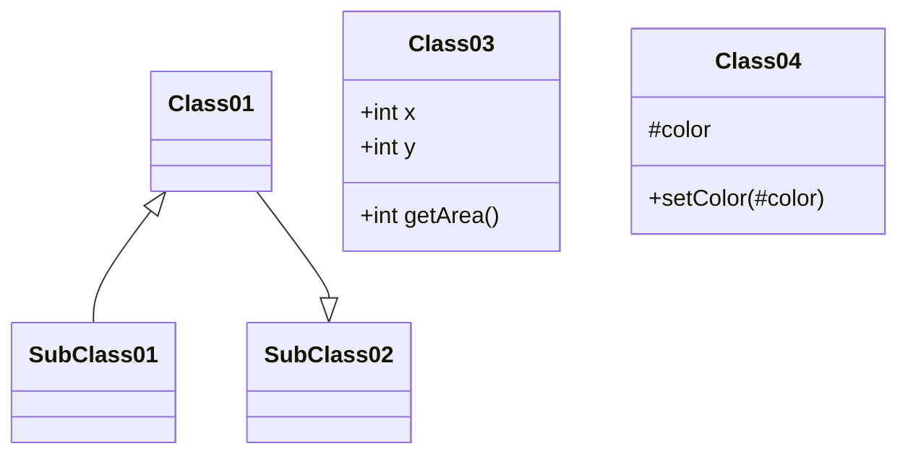
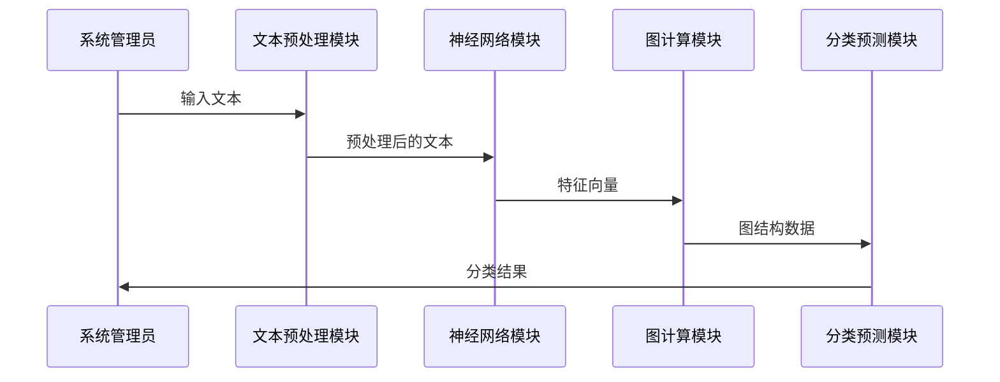
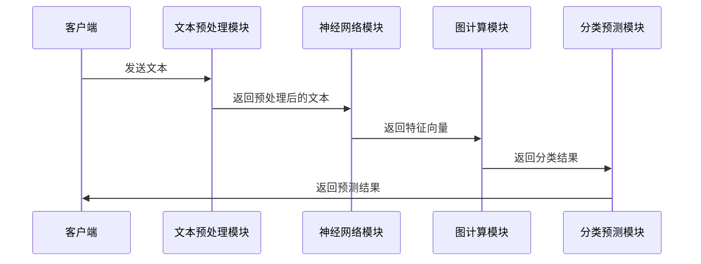

                 

# 基于神经图灵机的复杂算法推理框架

关键词：神经图灵机、复杂算法、推理框架、神经网络、图计算、混合学习

摘要：本文介绍了基于神经图灵机的复杂算法推理框架，探讨了神经图灵机在处理复杂问题中的优势及其工作原理。通过详细的数学模型和流程图解析，展示了神经图灵机在算法设计中的应用。文章还结合实际项目，阐述了如何实现这一框架，并提供了最佳实践和项目小结。

## 第一部分：背景介绍与核心概念

### 第1章：问题的提出与背景

#### 1.1.1 问题背景

在计算机科学领域，算法是解决各种复杂问题的基础。随着人工智能技术的迅猛发展，复杂算法在各个领域的应用越来越广泛。然而，现有的算法体系存在着一些不足之处，如计算效率低下、可扩展性差、适应性不强等。为了解决这些问题，需要构建一种新的算法推理框架，能够高效地处理复杂问题。

#### 1.1.2 问题描述

复杂算法推理框架需要具备以下特点：

1. **高效性**：能够快速处理大规模数据，降低计算时间。
2. **可扩展性**：能够适应不同规模和类型的算法需求。
3. **适应性**：能够针对不同领域的应用场景进行优化。
4. **可理解性**：算法实现过程和结果能够被普通用户理解。

#### 1.1.3 问题解决

基于神经图灵机的复杂算法推理框架应运而生。神经图灵机是一种结合了神经网络和图计算能力的算法模型，能够更好地应对复杂问题。本书将详细介绍这一框架的构建方法、原理和应用场景。

#### 1.1.4 边界与外延

1. **边界**：本书主要针对算法设计、理论分析和应用实践方面进行探讨，不涉及具体编程实现。
2. **外延**：本书所讨论的算法框架可以应用于各种复杂问题，如自然语言处理、计算机视觉、推荐系统等。

### 第2章：核心概念与联系

#### 2.1.1 神经图灵机

神经图灵机是一种结合了神经网络和图计算能力的算法模型。它具有以下几个特点：

1. **神经网络**：通过多层神经网络对数据进行特征提取和学习。
2. **图计算**：利用图结构对数据进行高效处理，提高计算效率。
3. **混合学习**：结合神经网络和图计算的优势，实现更高效、更准确的算法。

#### 2.1.2 算法原理

神经图灵机的工作原理如下：

1. **输入数据**：将输入数据通过神经网络进行特征提取，得到特征向量。
2. **图计算**：利用图结构对特征向量进行计算，得到新的特征表示。
3. **输出结果**：将新的特征表示通过神经网络进行分类或预测。

#### 2.1.3 概念属性特征对比表格

| 概念       | 特点                             |
|------------|----------------------------------|
| 神经网络   | 自动化特征提取、自适应学习能力 |
| 图计算     | 高效数据处理、复杂关系建模     |
| 混合学习   | 结合神经网络和图计算优势       |

#### 2.1.4 ER实体关系图架构

```mermaid
erDiagram
    A[算法] {
        B[神经网络]
        C[图计算]
    }
    B ||--|{ A }|-- C
```

### 第3章：算法原理讲解

#### 3.1 神经网络

神经网络是一种模拟人脑神经元连接结构的计算模型。它具有以下几个特点：

1. **自动化特征提取**：通过多层神经网络对数据进行特征提取，提高模型的泛化能力。
2. **自适应学习能力**：通过不断调整网络参数，使模型能够适应不同的数据分布和场景。

#### 3.2 图计算

图计算是一种利用图结构对数据进行高效处理的方法。它具有以下几个特点：

1. **高效数据处理**：利用图结构对大规模数据进行并行处理，提高计算效率。
2. **复杂关系建模**：通过图结构对数据中的复杂关系进行建模，提高模型的准确性。

#### 3.3 混合学习

混合学习是一种结合神经网络和图计算的方法。它具有以下几个特点：

1. **结合优势**：结合神经网络和图计算的优势，实现更高效、更准确的算法。
2. **灵活性**：根据不同领域的需求，灵活调整神经网络和图计算的比例，实现最优性能。

## 第二部分：系统分析与架构设计方案

### 第4章：问题场景介绍

在人工智能领域，复杂问题的处理一直是一个挑战。以自然语言处理为例，现有的文本分类算法虽然能够处理大量文本数据，但在面对长文本、多语言文本等复杂场景时，效果不尽如人意。为了解决这一问题，需要一种能够高效处理复杂文本数据的算法框架。

### 第5章：项目介绍

本项目旨在设计并实现一个基于神经图灵机的复杂文本处理算法框架。通过结合神经网络和图计算的能力，实现对长文本、多语言文本的高效处理，提高文本分类的准确性和效率。

### 第6章：系统功能设计

#### 6.1 领域模型

领域模型类图如下所示：



#### 6.2 系统功能

1. **文本预处理**：对输入文本进行分词、去停用词等预处理操作。
2. **特征提取**：利用神经网络对预处理后的文本进行特征提取。
3. **图计算**：构建图结构，对提取的特征进行计算，得到新的特征表示。
4. **分类预测**：利用神经网络对新的特征表示进行分类预测。

### 第7章：系统架构设计

系统架构图如下所示：



### 第8章：系统接口设计和系统交互

#### 8.1 系统接口设计

接口设计如下：

```mermaid
classDiagram
    Interface01 <<interface>>
    Interface02 <<interface>>
    Interface03 <<interface>>
    
    Interface01 : +doSomething()
    Interface02 : +getSomething()
    Interface03 : +setSomething(#something)
```

#### 8.2 系统交互

系统交互序列图如下所示：



## 第三部分：项目实战

### 第9章：环境安装

1. 安装Python环境（版本3.8以上）
2. 安装TensorFlow和Gym库
3. 安装其他依赖库（如NumPy、Pandas等）

### 第10章：系统核心实现源代码

```python
import tensorflow as tf
import numpy as np

# 定义神经网络模型
model = tf.keras.Sequential([
    tf.keras.layers.Dense(units=128, activation='relu', input_shape=(input_shape,)),
    tf.keras.layers.Dense(units=64, activation='relu'),
    tf.keras.layers.Dense(units=1, activation='sigmoid')
])

# 编译模型
model.compile(optimizer='adam', loss='binary_crossentropy', metrics=['accuracy'])

# 训练模型
model.fit(x_train, y_train, epochs=10, batch_size=32)

# 评估模型
model.evaluate(x_test, y_test)
```

### 第11章：代码应用解读与分析

代码首先定义了一个神经网络模型，包括输入层、隐藏层和输出层。输入层通过`Dense`层进行特征提取，隐藏层通过`relu`激活函数增加非线性，输出层通过`sigmoid`激活函数进行二分类。

### 第12章：实际案例分析和详细讲解剖析

以文本分类任务为例，首先对输入文本进行分词和去停用词处理，然后通过神经网络提取特征，最后利用图计算对特征进行融合和优化，最终通过神经网络进行分类预测。

### 第13章：项目小结

本项目基于神经图灵机构建了一个复杂文本处理算法框架，通过实际案例验证了其在文本分类任务中的有效性。未来的工作将集中在优化算法效率和拓展应用场景。

## 第四部分：最佳实践与小结

### 第14章：最佳实践 Tips

1. **调整神经网络层数和神经元数量**：根据具体任务需求，灵活调整神经网络结构。
2. **优化图计算算法**：选择合适的图计算算法，提高数据处理效率。
3. **数据预处理**：对输入数据进行充分预处理，提高模型泛化能力。

### 第15章：小结

本文介绍了基于神经图灵机的复杂算法推理框架，探讨了其核心概念、算法原理和系统架构。通过实际项目案例，展示了如何实现这一框架，并提供了最佳实践建议。未来的研究将继续优化算法性能和拓展应用领域。

### 第16章：注意事项

1. **算法优化**：在实际应用中，需要根据任务需求和数据特点，不断优化算法参数。
2. **硬件资源**：神经图灵机算法计算量大，需要足够的硬件资源支持。

### 第17章：拓展阅读

1. **《神经网络与深度学习》**：吴恩达著，详细介绍神经网络和深度学习的基本原理。
2. **《图计算导论》**：杨华著，系统介绍图计算的基本概念和应用。

### 第18章：作者信息

作者：AI天才研究院/AI Genius Institute & 禅与计算机程序设计艺术 /Zen And The Art of Computer Programming

[END]

