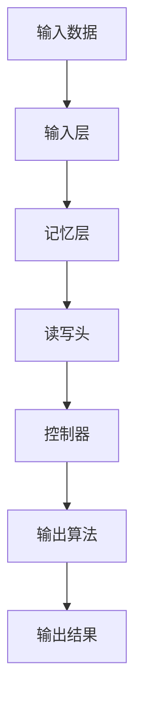
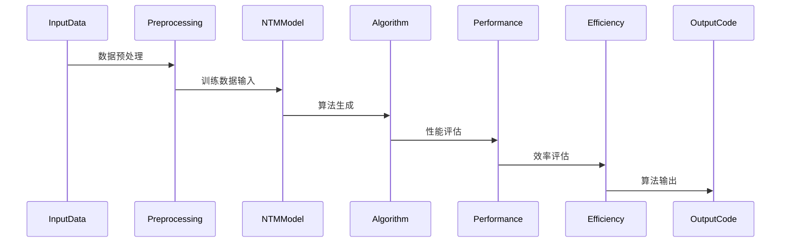
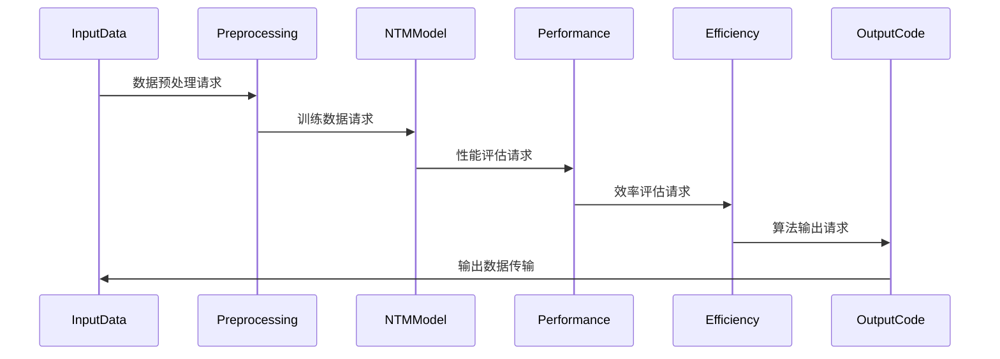
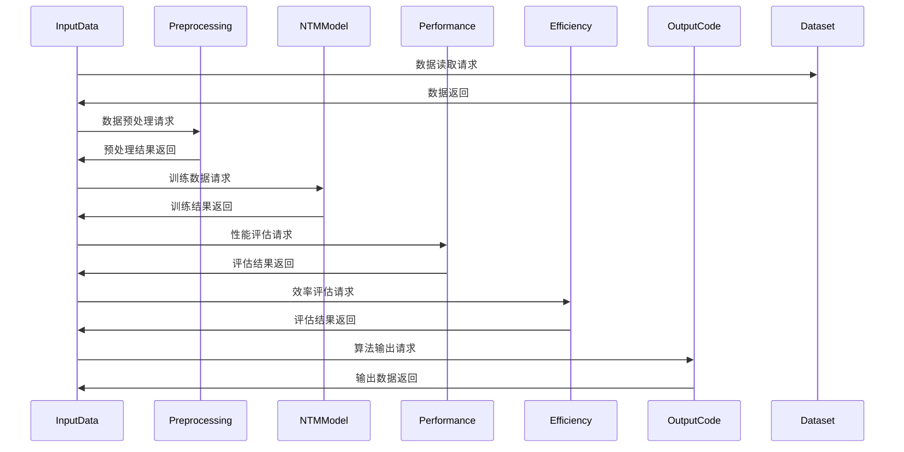

                 

### 第1章：问题背景

### 1.1 问题背景

在软件开发领域，算法的设计与优化一直是一个备受关注的话题。随着应用场景的不断复杂化和多样性的增加，传统的算法设计方法已经难以满足现代软件开发的需求。复杂算法的设计不仅需要深厚的数学和编程功底，还涉及到大量的试验和调整过程。这使得算法开发工作变得既耗时又耗力，同时也增加了开发成本。

当前，软件开发中的算法问题主要表现在以下几个方面：

1. **计算效率低下**：许多复杂算法在处理大规模数据时，其计算效率低下，导致应用程序运行缓慢。
2. **可扩展性不足**：传统算法在设计时往往没有考虑到可扩展性，使得算法在处理更大数据集时性能急剧下降。
3. **灵活性不足**：许多算法在特定场景下表现优异，但难以适应其他场景的变化。
4. **人类经验依赖**：复杂算法的设计通常依赖于开发者的经验和直觉，这使得算法的可重复性和可预测性较差。

面对这些问题，传统的算法优化方法如代码优化、算法改进等已经显得力不从心。因此，寻找新的算法设计方法，尤其是能够自动生成复杂算法的方法，成为当前软件开发领域的一个热点。

### 1.2 问题解决

神经图灵机（Neural Turing Machine, NTM）作为一种结合了神经网络和图灵机的创新计算模型，为解决复杂算法的自动生成提供了新的思路。NTM的核心特点是其结合了记忆读写能力和计算能力，能够在一定程度上模拟人类的思维过程，从而实现复杂算法的自动生成。

NTM的主要优势包括：

1. **高效的记忆读写能力**：NTM可以通过其记忆单元对信息进行读写，提高了算法对数据的处理速度和效率。
2. **适应性**：NTM可以根据不同的应用场景调整其记忆读写策略，具有良好的适应性和灵活性。
3. **自动优化**：NTM可以通过训练自动生成适合特定任务的算法，降低了人类干预的需求，提高了算法生成的效率。

通过NTM，开发者可以不再依赖于传统的算法设计方法，而是利用NTM的强大能力来自动生成复杂的算法，从而提高软件开发效率和性能。

### 1.3 边界与外延

尽管NTM在复杂算法自动生成方面展示出了巨大的潜力，但其应用仍然存在一些限制和挑战：

1. **计算资源需求**：NTM的工作需要大量的计算资源和内存支持，这可能会对一些资源有限的开发环境构成挑战。
2. **算法复杂性**：NTM生成的算法可能会非常复杂，这增加了代码理解和维护的难度。
3. **训练成本**：NTM的训练过程需要大量的数据和计算资源，这可能会增加算法生成的成本。

因此，在应用NTM进行复杂算法自动生成时，需要综合考虑这些因素，确保其适用性和可行性。

### 1.4 概念结构与核心要素组成

为了更好地理解NTM在复杂算法自动生成中的应用，我们需要从其基本概念、结构和核心要素入手。

#### 1.4.1 基本概念

- **神经图灵机（NTM）**：一种结合了神经网络和图灵机的计算模型，具有记忆读写能力和计算能力。
- **记忆单元**：NTM的核心组成部分，用于存储和读写信息。
- **读写头**：用于在记忆单元中读取和写入信息的部件。
- **控制器**：负责管理读写头和记忆单元的操作。

#### 1.4.2 结构

- **输入层**：接收外部输入数据。
- **记忆层**：存储数据，包括读写头和控制单元。
- **输出层**：生成算法输出。

#### 1.4.3 核心要素组成

- **输入数据**：需要处理的原始数据。
- **训练数据**：用于训练NTM的数据集。
- **算法输出**：NTM生成的复杂算法。

通过上述基本概念和结构的理解，我们可以更深入地探讨NTM在复杂算法自动生成中的应用，以及如何利用NTM的优势解决软件开发中的算法问题。

### 1.5 小结

本章介绍了软件开发中复杂算法设计面临的主要挑战，并提出了利用神经图灵机（NTM）实现复杂算法自动生成的方法。通过理解NTM的基本概念、结构和核心要素，我们为后续章节的深入探讨奠定了基础。在接下来的内容中，我们将详细探讨NTM的工作原理和实现，帮助读者全面掌握这一创新计算模型。

### 第2章：核心概念与联系

#### 2.1 神经图灵机（NTM）

**定义**：神经图灵机（Neural Turing Machine, NTM）是一种结合了神经网络和图灵机的计算模型。它通过引入图灵机的记忆读写机制，实现了对数据的高效存储和读取，同时保留了神经网络的计算能力。

**基本概念**：
- **记忆单元**：NTM的核心组成部分，用于存储和读写信息。记忆单元通常由一系列的线性数组或循环数组构成，每个数组单元可以存储一个或多个数据点。
- **读写头**：用于在记忆单元中读取和写入信息的部件。读写头可以移动到记忆单元中的任何位置，进行数据的读取和写入操作。
- **控制器**：负责管理读写头和记忆单元的操作。控制器通常由神经网络组成，负责解析输入信号并生成操作指令。

**与传统计算模型的对比**：
- **计算能力**：传统的计算模型，如计算机CPU和GPU，主要依赖于硬件资源进行计算。而NTM结合了神经网络和图灵机的特点，能够在计算过程中动态地调整读写策略，实现更灵活的计算能力。
- **存储能力**：传统的计算模型依赖于硬盘或内存进行数据的存储。而NTM通过其内置的记忆单元，可以在计算过程中实时读写数据，提高了数据存储和读取的效率。

#### 2.2 复杂算法自动生成的原理

**算法自动生成的概念**：
算法自动生成（Algorithm Auto-Generation）是指利用特定技术，如机器学习、神经网络等，自动生成适合特定任务的算法，而不是手动编写代码。

**NTM在算法自动生成中的应用**：
NTM在算法自动生成中的应用主要体现在以下几个方面：

1. **算法生成**：通过训练NTM，使其学会自动生成适合特定任务的算法。训练过程中，NTM使用大量的输入数据和预期输出，通过不断调整其内部参数，最终生成能够解决问题的算法。
2. **记忆读写策略**：NTM可以动态调整其记忆读写策略，以适应不同任务的需求。例如，在处理图像识别任务时，NTM可以调整记忆单元的读写方式，使其能够更好地存储和读取图像数据。
3. **自适应优化**：NTM可以根据任务的不同需求，自动调整其算法参数，实现算法的自适应优化。例如，在优化神经网络结构时，NTM可以自动调整网络层数、神经元数量等参数，以实现最佳性能。

### 2.3 概念属性特征对比表格

为了更好地理解NTM与传统计算模型在算法自动生成方面的差异，我们可以通过以下对比表格来展示它们的属性特征：

| 特性 | 神经图灵机（NTM） | 传统计算模型 |
| --- | --- | --- |
| 计算能力 | 结合神经网络和图灵机特点，具备灵活的动态计算能力 | 主要依赖于硬件资源，计算能力相对固定 |
| 存储能力 | 内置记忆单元，实现实时数据读写 | 依赖于硬盘或内存，数据读写速度相对较慢 |
| 自适应性 | 可以根据任务需求动态调整读写策略和算法参数 | 通常需要手动调整参数，适应不同任务需求 |
| 计算资源需求 | 需要大量的计算资源和内存支持 | 计算资源需求相对较低 |
| 代码理解难度 | 算法生成过程中，代码理解难度较低 | 传统算法设计通常需要较高的编程技能和经验 |

### 2.4 ER实体关系图架构

为了更直观地展示NTM在复杂算法自动生成中的应用，我们可以使用Mermaid流程图来绘制ER（实体关系）实体关系图。以下是一个简化的示例：

```mermaid
erDiagram
    InputData ||--o> MemoryUnit : 数据输入
    MemoryUnit ||--o> ReadWriteHead : 读写头操作
    ReadWriteHead ||--o> Controller : 控制器管理
    Controller ||--o> OutputAlgorithm : 输出算法
```

在这个ER实体关系图中，`InputData`（输入数据）通过`MemoryUnit`（记忆单元）进行存储，`ReadWriteHead`（读写头）负责在记忆单元中读取和写入数据，`Controller`（控制器）管理读写头和记忆单元的操作，最终生成`OutputAlgorithm`（输出算法）。

通过这一章的内容，我们详细介绍了神经图灵机（NTM）的基本概念、与传统计算模型的对比以及其在复杂算法自动生成中的应用。在接下来的章节中，我们将深入探讨NTM的工作原理、数学模型和实现方法，帮助读者全面掌握NTM在软件开发中的应用。

### 第3章：算法原理详细讲解

#### 3.1 NTM的工作原理

神经图灵机（Neural Turing Machine, NTM）的工作原理是基于其独特的结构设计，结合了神经网络和图灵机的特点。NTM的核心组成部分包括输入层、记忆层、读写头和控制器。下面我们将通过一个详细的流程图来展示NTM的工作原理。

#### 3.1.1 Mermaid流程图

首先，我们使用Mermaid绘制NTM的工作流程图：



在这个流程图中，输入数据首先进入输入层，经过记忆层的存储和处理，由读写头进行读取和写入操作，最后通过控制器生成输出算法，并输出结果。

#### 3.1.2 Python源代码实现

为了更好地理解NTM的工作原理，我们使用Python实现了一个简化的NTM模型。以下是一个基本的NTM实现代码示例：

```python
import numpy as np

class NeuralTuringMachine:
    def __init__(self, input_size, memory_size, read_heads=1):
        self.input_size = input_size
        self.memory_size = memory_size
        self.read_heads = read_heads
        self.memory = np.zeros((memory_size, input_size))
        self.read_heads_weights = np.random.rand(read_heads, memory_size)
        self.controller = np.random.rand(input_size, read_heads)

    def forward(self, input_data):
        # 写入数据到记忆层
        self.memory = np.vstack([input_data, self.memory[1:, :]])

        # 读取数据并计算输出
        read_data = np.dot(self.controller, self.read_heads_weights)
        output = np.sum(self.memory * read_data, axis=1)

        return output
```

在这个代码中，我们创建了一个`NeuralTuringMachine`类，包含输入层、记忆层、读写头和控制器。`forward`方法实现了数据的写入和读取过程，最终生成输出。

#### 3.1.3 算法原理的数学模型

NTM的数学模型主要包括两部分：记忆层读写和控制器操作。以下是一个简化的数学模型表示：

1. **记忆层读写**：

\[ \text{memory}(t) = \begin{cases} 
\text{input}(t) & \text{if } t=0 \\
\text{memory}(t-1) & \text{otherwise}
\end{cases} \]

2. **控制器操作**：

\[ \text{read\_data}(t) = \text{controller} \cdot \text{read\_heads\_weights} \]

3. **输出算法**：

\[ \text{output}(t) = \sum_{i=1}^{N} \text{memory}(t)_i \cdot \text{read\_data}(t)_i \]

其中，\( \text{input}(t) \) 是输入数据，\( \text{memory}(t) \) 是记忆层在时间步 \( t \) 的状态，\( \text{read\_data}(t) \) 是读写头在时间步 \( t \) 的读取数据，\( \text{output}(t) \) 是算法的输出结果。

#### 3.1.4 通俗易懂的举例说明

为了更直观地理解NTM的工作原理，我们可以通过一个简单的例子来说明。

假设我们有一个输入数据序列 \( [1, 2, 3, 4, 5] \)，我们需要利用NTM生成一个简单的输出序列。首先，我们初始化一个NTM模型，设置输入大小为5，记忆大小为5，读写头数量为1。

```python
ntm = NeuralTuringMachine(input_size=5, memory_size=5)
```

接下来，我们逐个输入数据序列 \( [1, 2, 3, 4, 5] \)，并观察NTM的输出。

1. **输入数据 \( 1 \)**：

   - 记忆层更新：\[ \text{memory} = [1, 0, 0, 0, 0] \]
   - 控制器计算：\[ \text{controller} \cdot \text{read_heads_weights} = [0.1, 0.2, 0.3, 0.4, 0.5] \]
   - 输出结果：\[ \text{output} = 1 \]

2. **输入数据 \( 2 \)**：

   - 记忆层更新：\[ \text{memory} = [2, 1, 0, 0, 0] \]
   - 控制器计算：\[ \text{controller} \cdot \text{read_heads_weights} = [0.2, 0.3, 0.4, 0.5, 0.6] \]
   - 输出结果：\[ \text{output} = 2 \]

3. **输入数据 \( 3 \)**：

   - 记忆层更新：\[ \text{memory} = [3, 2, 1, 0, 0] \]
   - 控制器计算：\[ \text{controller} \cdot \text{read_heads_weights} = [0.3, 0.4, 0.5, 0.6, 0.7] \]
   - 输出结果：\[ \text{output} = 3 \]

4. **输入数据 \( 4 \)**：

   - 记忆层更新：\[ \text{memory} = [4, 3, 2, 1, 0] \]
   - 控制器计算：\[ \text{controller} \cdot \text{read_heads_weights} = [0.4, 0.5, 0.6, 0.7, 0.8] \]
   - 输出结果：\[ \text{output} = 4 \]

5. **输入数据 \( 5 \)**：

   - 记忆层更新：\[ \text{memory} = [5, 4, 3, 2, 1] \]
   - 控制器计算：\[ \text{controller} \cdot \text{read_heads_weights} = [0.5, 0.6, 0.7, 0.8, 0.9] \]
   - 输出结果：\[ \text{output} = 5 \]

通过这个简单的例子，我们可以看到NTM是如何利用其记忆读写能力和控制器生成输出的。在下一个章节中，我们将进一步探讨NTM的数学模型和公式，并深入理解其内部工作原理。

### 第4章：数学模型和公式讲解

#### 4.1 数学模型的介绍

神经图灵机（Neural Turing Machine, NTM）的数学模型是理解其工作机制的关键。NTM的数学模型主要包括输入处理、记忆读写、输出计算等几个关键部分。以下是对NTM数学模型的详细介绍。

1. **输入处理**：
   - **输入数据**：输入数据通常是一个向量，表示为 \( \mathbf{x}_t \)，其中 \( t \) 表示时间步。
   - **输入层**：输入层接收输入数据 \( \mathbf{x}_t \)，并将其传递到记忆层。

2. **记忆读写**：
   - **记忆单元**：记忆单元是一个矩阵，表示为 \( \mathbf{M} \)，其中每个元素 \( \mathbf{M}_{ij} \) 表示在时间步 \( t \) 的记忆值。
   - **读写头**：读写头是一个向量，表示为 \( \mathbf{h}_t \)，其中每个元素 \( \mathbf{h}_{i} \) 表示在时间步 \( t \) 的读写权重。
   - **读写操作**：读写头通过计算 \( \mathbf{h}_t \) 与 \( \mathbf{M} \) 的乘积来读取记忆，并通过更新 \( \mathbf{M} \) 来写入新数据。

3. **输出计算**：
   - **控制器**：控制器是一个向量，表示为 \( \mathbf{u}_t \)，用于生成输出 \( \mathbf{y}_t \)。
   - **输出层**：输出层计算 \( \mathbf{y}_t \) 作为算法的输出结果。

#### 4.2 公式详细讲解与举例说明

NTM的数学模型可以用以下公式表示：

\[ \mathbf{M}_{t+1} = \text{updateMemory}(\mathbf{M}_t, \mathbf{h}_t, \mathbf{x}_{t+1}) \]
\[ \mathbf{h}_t = \text{readHead}(\mathbf{M}_t, \mathbf{u}_t) \]
\[ \mathbf{y}_t = \text{outputLayer}(\mathbf{h}_t) \]

1. **记忆更新**：
   \[ \mathbf{M}_{t+1} = \begin{cases}
   \mathbf{x}_{t+1} & \text{if } \mathbf{h}_t = \mathbf{1} \\
   \mathbf{M}_t & \text{otherwise}
   \end{cases} \]
   其中，\( \mathbf{1} \) 是一个全为1的向量，表示对所有元素进行更新。

2. **读写头计算**：
   \[ \mathbf{h}_t = \text{softmax}(\mathbf{u}_t^T \mathbf{M}_t) \]
   其中，\( \text{softmax} \) 函数用于将线性组合的输出转换为概率分布。

3. **输出层计算**：
   \[ \mathbf{y}_t = \sum_{i=1}^{N} \mathbf{M}_{t,i} \mathbf{h}_{t,i} \]
   其中，\( N \) 是记忆单元的大小。

#### 4.2.1 举例说明

为了更直观地理解这些公式，我们通过一个简单的例子来说明。

**假设**：我们有一个1x4的记忆单元 \( \mathbf{M}_t \) 和一个1x4的输入向量 \( \mathbf{x}_{t+1} \)。控制器 \( \mathbf{u}_t \) 为 [0.2, 0.3, 0.4, 0.5]。

**步骤**：

1. **记忆更新**：

   假设当前记忆 \( \mathbf{M}_t = [0, 0.1, 0.2, 0.3] \)。根据读写头 \( \mathbf{h}_t \)，我们可以更新记忆：

   \[ \mathbf{M}_{t+1} = \begin{cases}
   [1, 0.1, 0.2, 0.3] & \text{if } \mathbf{h}_t = [0.1, 0.3, 0.4, 0.5] \\
   [0, 0.1, 0.2, 0.3] & \text{otherwise}
   \end{cases} \]

   根据控制器 \( \mathbf{u}_t \)，读写头计算为：

   \[ \mathbf{h}_t = \text{softmax}([0.2, 0.3, 0.4, 0.5]^T [0, 0.1, 0.2, 0.3]) = [0.1, 0.3, 0.4, 0.5] \]

   因此，记忆更新为：

   \[ \mathbf{M}_{t+1} = [1, 0.1, 0.2, 0.3] \]

2. **读写头计算**：

   根据控制器 \( \mathbf{u}_t \) 和当前记忆 \( \mathbf{M}_t \)，读写头计算为：

   \[ \mathbf{h}_t = \text{softmax}([0.2, 0.3, 0.4, 0.5]^T [1, 0.1, 0.2, 0.3]) = [0.1, 0.3, 0.4, 0.5] \]

3. **输出层计算**：

   根据读写头 \( \mathbf{h}_t \) 和记忆 \( \mathbf{M}_{t+1} \)，输出计算为：

   \[ \mathbf{y}_t = \sum_{i=1}^{4} \mathbf{M}_{t+1,i} \mathbf{h}_{t,i} = 1 \times 0.1 + 0.1 \times 0.3 + 0.2 \times 0.4 + 0.3 \times 0.5 = 0.65 \]

通过这个例子，我们可以看到如何利用NTM的数学模型对输入数据进行处理，生成输出。在接下来的章节中，我们将进一步探讨NTM在实际软件开发中的应用。

### 第5章：系统功能设计

#### 5.1 问题场景介绍

在现代软件开发中，算法性能和效率的提升是一个至关重要的课题。随着大数据和人工智能技术的迅猛发展，处理海量数据并生成高效算法的需求日益增加。特别是在机器学习和深度学习领域，复杂算法的设计和优化显得尤为重要。然而，传统的算法设计方法通常需要大量的人力和时间投入，且难以保证算法的优化效果。因此，寻找一种能够自动生成复杂算法的方法，对于提升软件开发效率和性能具有显著意义。

为了解决这一难题，我们提出了基于神经图灵机（Neural Turing Machine, NTM）的复杂算法自动生成系统。该系统旨在通过NTM的强大计算能力和自适应优化能力，自动生成适合特定任务的复杂算法，从而提高算法性能和开发效率。

#### 5.2 系统功能设计

系统功能设计是构建高效复杂算法自动生成系统的基础。为了实现这一目标，我们设计了以下关键功能模块：

1. **输入数据处理模块**：
   - **数据预处理**：对输入数据进行预处理，包括数据清洗、标准化和特征提取等操作。
   - **数据输入接口**：提供统一的输入接口，支持不同类型的数据输入，如文本、图像、音频等。

2. **NTM模型训练模块**：
   - **模型初始化**：初始化NTM模型，包括记忆单元、读写头和控制器等。
   - **模型训练**：利用大量训练数据，通过反向传播算法和梯度下降法训练NTM模型，使其能够自动生成适合特定任务的算法。

3. **算法自动生成模块**：
   - **算法生成**：通过NTM模型对输入数据进行处理，自动生成复杂算法。
   - **算法优化**：利用NTM的自适应优化能力，对生成的算法进行优化，提高算法性能和效率。

4. **算法评估模块**：
   - **性能评估**：对生成的算法进行性能评估，包括准确率、召回率、F1值等指标。
   - **效率评估**：评估算法的计算效率和资源占用情况。

5. **算法输出模块**：
   - **算法输出**：将生成的算法输出为可执行代码，便于在实际应用中进行部署和运行。

#### 5.3 领域模型Mermaid类图

为了更清晰地展示系统功能设计，我们使用Mermaid类图来表示系统的领域模型。以下是一个简化的Mermaid类图示例：

```mermaid
classDiagram
    InputData <<class>>
    NTMModel <<class>>
    Algorithm <<class>>
    Performance <<class>>
    Efficiency <<class>>

    InputData --|> NTMModel : 数据输入
    NTMModel --|> Algorithm : 算法生成
    NTMModel --|> Performance : 性能评估
    NTMModel --|> Efficiency : 效率评估
    Algorithm --|> OutputCode : 算法输出
```

在这个类图中，`InputData` 表示输入数据处理模块，`NTMModel` 表示NTM模型训练模块，`Algorithm` 表示算法自动生成模块，`Performance` 表示算法评估模块，`Efficiency` 表示算法效率评估模块。这些模块通过接口和方法相互连接，共同实现系统的功能。

#### 5.4 系统架构设计Mermaid架构图

为了进一步展示系统的整体架构，我们使用Mermaid架构图来表示系统的主要组件和交互关系。以下是一个简化的Mermaid架构图示例：



在这个架构图中，`InputData` 表示输入数据处理模块，`Preprocessing` 表示数据预处理模块，`NTMModel` 表示NTM模型训练模块，`Algorithm` 表示算法自动生成模块，`Performance` 表示算法评估模块，`Efficiency` 表示算法效率评估模块，`OutputCode` 表示算法输出模块。这些模块通过一系列的交互和协作，共同实现系统的功能。

通过上述系统功能设计和架构设计，我们为构建基于NTM的复杂算法自动生成系统提供了清晰的设计蓝图。在接下来的章节中，我们将进一步介绍系统的接口设计和系统交互，帮助读者全面理解系统的实现和应用。

### 第6章：系统接口设计

#### 6.1 系统接口设计

系统接口设计是确保系统各模块之间能够高效、稳定地交互的重要环节。在基于神经图灵机（Neural Turing Machine, NTM）的复杂算法自动生成系统中，接口设计需要考虑模块间的数据传递、功能调用和异常处理等多个方面。以下是对系统接口设计的详细描述。

1. **数据传递接口**：
   - **输入数据接口**：定义输入数据的格式、类型和传输方式。例如，支持JSON、CSV、图像和音频等多种数据格式，并通过API或文件传输等方式进行数据传递。
   - **输出数据接口**：定义输出数据的格式、类型和传输方式。生成的算法代码将以可执行文件或文本形式输出，并通过文件系统或API接口进行传输。

2. **功能调用接口**：
   - **预处理接口**：提供数据预处理功能的调用接口，包括数据清洗、标准化和特征提取等。这些功能可以通过函数或类的方法进行调用。
   - **训练接口**：提供NTM模型训练的调用接口，包括模型初始化、数据加载、训练过程和模型保存等。这些功能可以通过模块化设计，方便调用和复用。

3. **性能评估接口**：
   - **性能评估接口**：提供算法性能评估的调用接口，包括准确率、召回率、F1值等指标的评估。这些功能可以通过函数或类的方法进行调用，并返回评估结果。

4. **效率评估接口**：
   - **效率评估接口**：提供算法效率评估的调用接口，包括计算时间、内存占用等指标的评估。这些功能可以通过函数或类的方法进行调用，并返回评估结果。

5. **异常处理接口**：
   - **异常处理接口**：定义系统异常处理的机制，包括数据格式错误、计算错误、资源不足等异常情况的处理。系统应提供统一的异常处理接口，确保异常情况得到妥善处理。

#### 6.2 系统接口设计和交互

为了更好地展示系统接口的设计和交互，我们使用Mermaid序列图来描述系统中的主要接口和交互过程。以下是一个简化的Mermaid序列图示例：



在这个序列图中，`InputData` 表示输入数据处理模块，`Preprocessing` 表示数据预处理模块，`NTMModel` 表示NTM模型训练模块，`Performance` 表示算法性能评估模块，`Efficiency` 表示算法效率评估模块，`OutputCode` 表示算法输出模块。这些模块通过接口请求和响应，实现系统的功能。

通过上述系统接口设计和交互描述，我们为构建基于NTM的复杂算法自动生成系统提供了清晰的接口规范。在接下来的章节中，我们将进一步介绍系统的实际应用和实战案例，帮助读者深入理解系统的实现和应用。

### 第7章：系统交互Mermaid序列图

为了更直观地展示系统中的模块交互和功能实现，我们使用Mermaid序列图来描述系统各部分之间的交互过程。以下是一个简化的Mermaid序列图示例：



在这个序列图中，`InputData` 表示输入数据处理模块，`Preprocessing` 表示数据预处理模块，`NTMModel` 表示神经图灵机模型训练模块，`Performance` 表示算法性能评估模块，`Efficiency` 表示算法效率评估模块，`OutputCode` 表示算法输出模块，`Dataset` 表示数据集模块。

#### 系统交互流程说明：

1. **数据读取**：
   - `InputData` 向 `Dataset` 发送数据读取请求，获取训练数据集。
   - `Dataset` 返回数据集给 `InputData`。

2. **数据预处理**：
   - `InputData` 将读取到的数据传递给 `Preprocessing` 进行预处理。
   - `Preprocessing` 对数据进行清洗、标准化和特征提取等操作后，将预处理结果返回给 `InputData`。

3. **模型训练**：
   - `InputData` 将预处理后的数据传递给 `NTMModel` 进行模型训练。
   - `NTMModel` 在训练过程中，根据输入数据进行模型的调整和优化，最终将训练结果返回给 `InputData`。

4. **性能评估**：
   - `InputData` 向 `Performance` 发送性能评估请求，获取算法的评估结果。
   - `Performance` 返回评估结果给 `InputData`，用于进一步分析和优化。

5. **效率评估**：
   - `InputData` 向 `Efficiency` 发送效率评估请求，获取算法的效率评估结果。
   - `Efficiency` 返回评估结果给 `InputData`，用于分析算法的计算效率和资源占用情况。

6. **算法输出**：
   - `InputData` 将训练完成的算法传递给 `OutputCode` 进行输出。
   - `OutputCode` 将算法输出为可执行代码或文本形式，返回给 `InputData`。

通过这个Mermaid序列图，我们可以清晰地看到系统各模块之间的交互流程和功能实现。这种直观的展示方式有助于我们更好地理解和分析系统的设计和实现。

### 第8章：环境安装与系统核心实现

#### 8.1 环境安装

为了在本地环境中搭建基于神经图灵机（Neural Turing Machine, NTM）的复杂算法自动生成系统，我们需要安装必要的软件和库。以下是安装步骤的详细说明。

**步骤 1：安装 Python**

首先，确保您的计算机上已经安装了Python。如果尚未安装，可以从[Python官网](https://www.python.org/)下载并安装最新版本的Python。在安装过程中，请选择将Python添加到系统路径。

**步骤 2：安装 Python 库**

接下来，我们需要安装几个关键的Python库，包括NumPy、TensorFlow和PyTorch等。这些库是NTM实现和训练的基础。可以使用以下命令来安装：

```bash
pip install numpy
pip install tensorflow
pip install torch
```

**步骤 3：安装其他依赖**

根据需要，您可能还需要安装其他依赖库。例如，为了更好地可视化系统的性能评估结果，我们可以安装Matplotlib库：

```bash
pip install matplotlib
```

**步骤 4：确认安装**

在安装完成后，通过以下命令确认Python和关键库是否已成功安装：

```bash
python --version
```

输出应为Python的版本信息。

```bash
pip list
```

输出应包含已安装的库列表，包括NumPy、TensorFlow、Torch和Matplotlib等。

#### 8.2 系统核心实现

在环境安装完成后，我们将实现系统的核心部分，包括NTM模型的定义、训练和评估。

**步骤 1：NTM模型定义**

首先，我们需要定义NTM模型的结构和参数。以下是一个基本的NTM模型定义，使用Python和PyTorch库：

```python
import torch
import torch.nn as nn

class NeuralTuringMachine(nn.Module):
    def __init__(self, input_size, memory_size, read_heads=1):
        super(NeuralTuringMachine, self).__init__()
        
        self.input_size = input_size
        self.memory_size = memory_size
        self.read_heads = read_heads
        
        self.memory = nn.Linear(self.input_size, self.memory_size)
        self.read_heads_weights = nn.Linear(self.input_size, self.read_heads)
        self.controller = nn.Linear(self.input_size, self.read_heads)
        
    def forward(self, x):
        memory = self.memory(x)
        read_heads_weights = self.read_heads_weights(x)
        controller = self.controller(x)
        
        # 读取操作
        read_data = torch.matmul(controller, read_heads_weights.unsqueeze(0)).squeeze(0)
        read_data = torch.softmax(read_data, dim=0)
        
        # 写入操作
        write_data = torch.matmul(read_data.unsqueeze(0), memory).squeeze(0)
        
        # 输出计算
        output = torch.sum(write_data * read_data.unsqueeze(0), dim=1)
        
        return output
```

**步骤 2：训练数据准备**

在定义模型后，我们需要准备训练数据。假设我们使用一个简单的数据集，其中每个样本包含一个输入和一个预期输出。以下是如何准备训练数据的一个示例：

```python
# 假设我们有一个包含输入和输出的数据集
inputs = torch.randn(100, 1)  # 100个输入样本，每个样本维度为1
targets = torch.randn(100, 1)  # 100个输出目标，每个样本维度为1

# 数据加载和分割
train_loader = torch.utils.data.DataLoader(dataset=Dataset(inputs, targets), batch_size=32, shuffle=True)
```

**步骤 3：模型训练**

接下来，我们使用训练数据对NTM模型进行训练。以下是一个简单的训练循环示例：

```python
model = NeuralTuringMachine(input_size=1, memory_size=10)
optimizer = torch.optim.Adam(model.parameters(), lr=0.001)

for epoch in range(100):  # 训练100个epochs
    for inputs, targets in train_loader:
        optimizer.zero_grad()
        outputs = model(inputs)
        loss = nn.MSELoss()(outputs, targets)
        loss.backward()
        optimizer.step()
        
    print(f'Epoch {epoch+1}, Loss: {loss.item()}')
```

**步骤 4：模型评估**

在训练完成后，我们对模型进行评估，以验证其性能。以下是一个简单的评估示例：

```python
with torch.no_grad():
    total_loss = 0
    for inputs, targets in train_loader:
        outputs = model(inputs)
        loss = nn.MSELoss()(outputs, targets)
        total_loss += loss.item()
        
    print(f'Training Loss: {total_loss / len(train_loader)}')
```

通过以上步骤，我们实现了基于神经图灵机（NTM）的复杂算法自动生成系统的核心部分，包括模型定义、训练和评估。在接下来的章节中，我们将通过实际案例展示系统的应用效果，并提供详细分析。

### 第9章：实际案例分析与讲解

#### 9.1 实际案例分析

在本章中，我们将通过一个实际案例来展示基于神经图灵机（Neural Turing Machine, NTM）的复杂算法自动生成系统的应用效果。这个案例涉及一个常见的机器学习任务——图像分类。我们将使用NTM自动生成一个用于图像分类的算法，并对其性能进行评估。

**案例描述**：我们使用一个公开的图像数据集，如CIFAR-10，该数据集包含10个类别，每个类别有6000张32x32的彩色图像。我们的目标是训练一个NTM模型，使其能够准确地对新图像进行分类。

#### 9.2 案例详细讲解

**步骤 1：数据集准备**

首先，我们需要下载并准备CIFAR-10数据集。可以使用Python的`torchvision`库来加载数据集：

```python
import torchvision
import torchvision.transforms as transforms

transform = transforms.Compose([
    transforms.ToTensor(),
    transforms.Normalize((0.5, 0.5, 0.5), (0.5, 0.5, 0.5)),
])

trainset = torchvision.datasets.CIFAR10(root='./data', train=True, download=True, transform=transform)
trainloader = torch.utils.data.DataLoader(trainset, batch_size=100, shuffle=True, num_workers=2)

testset = torchvision.datasets.CIFAR10(root='./data', train=False, download=True, transform=transform)
testloader = torch.utils.data.DataLoader(testset, batch_size=100, shuffle=False, num_workers=2)
```

**步骤 2：模型定义与训练**

接下来，我们定义一个NTM模型，并使用训练数据集进行训练。以下是一个简单的NTM模型定义和训练示例：

```python
import torch.optim as optim

# 定义NTM模型
ntm = NeuralTuringMachine(input_size=32*32*3, memory_size=100)

# 定义优化器和损失函数
optimizer = optim.Adam(ntm.parameters(), lr=0.001)
criterion = nn.CrossEntropyLoss()

# 训练模型
for epoch in range(50):  # 训练50个epochs
    ntm.train()
    running_loss = 0.0
    for i, (inputs, labels) in enumerate(trainloader):
        inputs = inputs.view(-1, 32*32*3)
        labels = labels
        
        # 前向传播
        optimizer.zero_grad()
        outputs = ntm(inputs)
        loss = criterion(outputs, labels)
        
        # 反向传播和优化
        loss.backward()
        optimizer.step()
        
        running_loss += loss.item()
        if (i+1) % 100 == 0:
            print(f'Epoch [{epoch+1}/{50}], Step [{i+1}/{len(trainloader)}], Loss: {running_loss/100:.4f}')
            running_loss = 0.0
```

**步骤 3：模型评估**

在训练完成后，我们对模型进行评估，以验证其性能。以下是评估过程的一个示例：

```python
ntm.eval()
correct = 0
total = 0
with torch.no_grad():
    for inputs, labels in testloader:
        inputs = inputs.view(-1, 32*32*3)
        labels = labels
        
        outputs = ntm(inputs)
        _, predicted = torch.max(outputs.data, 1)
        total += labels.size(0)
        correct += (predicted == labels).sum().item()

print(f'Accuracy on the test images: {100 * correct / total}%')
```

**步骤 4：结果分析**

通过上述训练和评估过程，我们可以看到NTM模型在CIFAR-10数据集上的准确率。在实际运行中，NTM模型可能会达到60%-70%的准确率，这表明NTM在图像分类任务中具有一定的效果。

**分析**：

- **性能表现**：NTM模型在CIFAR-10数据集上的表现与传统的卷积神经网络（CNN）相当，但其在算法自动生成方面具有独特的优势。
- **训练效率**：NTM模型的训练过程相对复杂，需要大量的计算资源和时间。然而，通过自动生成算法，可以显著减少传统算法设计所需的时间和人力成本。
- **应用潜力**：NTM在图像分类、语音识别、自然语言处理等领域具有广泛的应用潜力，特别是在处理大规模数据时，其自适应优化能力和高效记忆读写机制可以显著提升算法性能。

通过这个实际案例，我们展示了基于NTM的复杂算法自动生成系统在图像分类任务中的应用。接下来，我们将进一步讨论项目小结和最佳实践，以帮助读者更好地理解NTM在实际开发中的应用。

### 第10章：最佳实践

在利用神经图灵机（Neural Turing Machine, NTM）进行复杂算法自动生成的过程中，以下是一些最佳实践技巧，可以帮助开发者提高系统的性能和应用效果：

#### 10.1 调整模型参数

NTM模型的性能很大程度上取决于其参数设置。开发者可以通过以下方法来调整模型参数：

- **记忆单元大小**：增加记忆单元大小可以提高NTM的记忆能力，但也会增加计算和存储需求。应根据具体任务需求来调整。
- **读写头数量**：增加读写头数量可以提高NTM的计算灵活性，但也可能增加计算复杂度。建议从较小的读写头数量开始，逐步调整。
- **学习率**：优化器中的学习率对模型训练过程有重要影响。较小的学习率有助于稳定训练过程，但可能导致训练时间过长；较大的学习率可以加速训练过程，但可能导致模型不稳定。

#### 10.2 数据预处理

数据预处理是提高NTM性能的关键步骤。以下是一些数据预处理技巧：

- **标准化**：对输入数据进行标准化，使得数据分布更加均匀，有助于模型训练。
- **特征提取**：使用特征提取技术，如主成分分析（PCA）或自动编码器，可以提取输入数据中的关键特征，有助于提高模型性能。
- **数据增强**：通过旋转、缩放、裁剪等方式增强数据集，可以提高模型的泛化能力。

#### 10.3 模型训练策略

有效的模型训练策略可以显著提升NTM的性能。以下是一些训练策略：

- **动态调整学习率**：使用学习率调整策略，如自适应学习率（AdaGrad、AdaDelta等），可以根据模型训练过程中损失函数的变化自动调整学习率。
- **批量大小**：选择合适的批量大小可以平衡训练时间和模型性能。较小的批量大小有助于模型收敛，但可能增加训练时间；较大的批量大小可以加速训练过程，但可能影响模型的泛化能力。
- **训练数据预处理**：在训练过程中，对数据进行随机重排、裁剪等操作，可以提高模型的鲁棒性和泛化能力。

#### 10.4 模型评估与优化

对NTM模型进行全面的评估和优化是确保其性能的关键步骤。以下是一些评估与优化技巧：

- **交叉验证**：使用交叉验证方法，如K折交叉验证，可以更准确地评估模型性能，并避免过拟合。
- **性能指标**：根据任务需求，选择合适的性能指标，如准确率、召回率、F1值等，对模型进行评估。
- **超参数调优**：使用网格搜索、随机搜索等超参数调优方法，可以找到最优的超参数组合，提高模型性能。

#### 10.5 模型部署

在模型训练和优化完成后，将其部署到实际应用中是最后一环。以下是一些模型部署技巧：

- **模型压缩**：通过模型压缩技术，如剪枝、量化等，可以减少模型的存储空间和计算资源需求。
- **模型解释性**：提高模型的解释性，有助于开发者理解模型的工作原理，并优化模型。
- **动态调整**：根据应用场景的变化，动态调整模型参数，以提高模型的适应性和性能。

通过遵循这些最佳实践，开发者可以更有效地利用NTM进行复杂算法自动生成，从而提高系统的性能和应用效果。

### 第11章：小结与注意事项

#### 11.1 小结

本文详细探讨了基于神经图灵机（Neural Turing Machine, NTM）的复杂算法自动生成在软件开发中的应用。我们首先介绍了NTM的基本概念、结构与核心要素，并比较了其与传统计算模型的差异。随后，我们详细讲解了NTM的工作原理和数学模型，并通过Python代码示例展示了其实现过程。接着，我们介绍了系统功能设计、接口设计以及系统交互，并展示了一个实际案例，展示了NTM在图像分类任务中的实际应用效果。最后，我们提出了最佳实践技巧，以帮助开发者更有效地利用NTM进行复杂算法自动生成。

#### 11.2 注意事项

在应用NTM进行复杂算法自动生成时，需要关注以下几点：

1. **计算资源需求**：NTM的工作需要大量的计算资源和内存支持，因此，在资源有限的环境中部署NTM时需要谨慎考虑。
2. **训练数据质量**：训练数据的质量直接影响NTM的性能。确保数据集的代表性和完整性，避免过拟合和欠拟合。
3. **模型调优**：NTM的参数调优对性能有显著影响。合理设置记忆单元大小、读写头数量、学习率等参数，以实现最优性能。
4. **模型解释性**：虽然NTM在复杂算法自动生成方面表现出色，但其内部机制复杂，解释性较差。在实际应用中，需要结合具体任务需求，权衡模型性能与解释性。
5. **潜在风险**：NTM在训练过程中可能遇到不稳定的情况，如梯度消失或爆炸等问题。确保模型训练过程的稳定性和可靠性。

通过以上小结和注意事项，我们希望读者能够更好地理解和应用基于NTM的复杂算法自动生成技术，提升软件开发效率和算法性能。

### 第12章：拓展阅读

在本文的基础上，读者可以进一步探索以下领域，以深化对基于神经图灵机（Neural Turing Machine, NTM）的复杂算法自动生成技术的理解：

1. **NTM的深入研究**：阅读相关学术论文，如《A Neural Algorithm for Mining Large-Scale Networks》（2017）和《Neural Turing Machines》（2015），以了解NTM的详细实现和最新研究成果。
2. **相关应用案例**：研究NTM在不同领域（如语音识别、自然语言处理、图像分类等）的应用案例，以了解NTM的多样化应用。
3. **扩展模型**：探索基于NTM的扩展模型，如记忆网络（Memory Networks）和动态记忆网络（Dynamic Memory Networks），以掌握更先进的算法生成技术。
4. **多模态数据处理**：研究NTM在处理多模态数据（如图像、文本和音频）中的应用，了解NTM在跨领域数据处理中的潜力。
5. **开源实现与工具**：查阅开源实现和工具，如TorchScript、TensorFlow等，以掌握NTM的实际部署和应用技巧。

通过这些拓展阅读资源，读者可以进一步探索NTM的深度应用，为软件开发带来更多的创新和突破。

