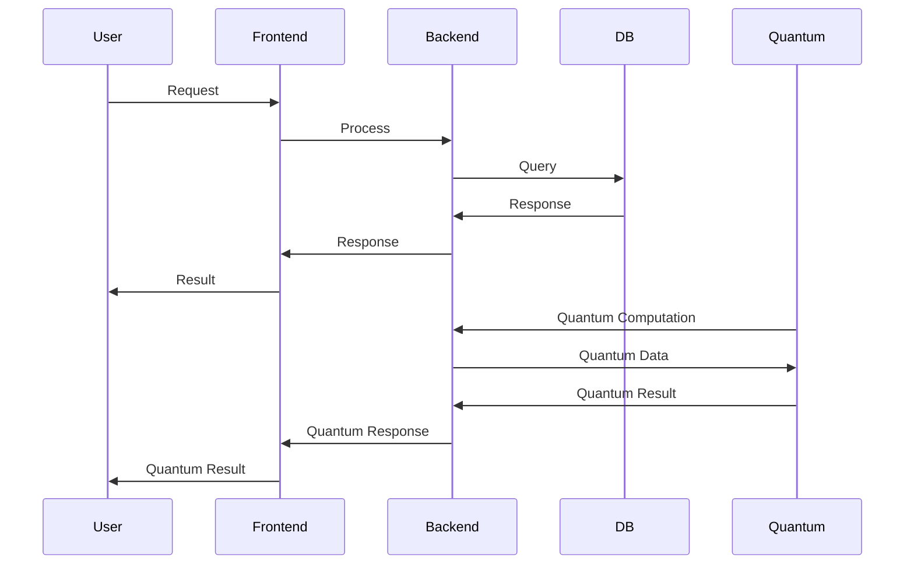
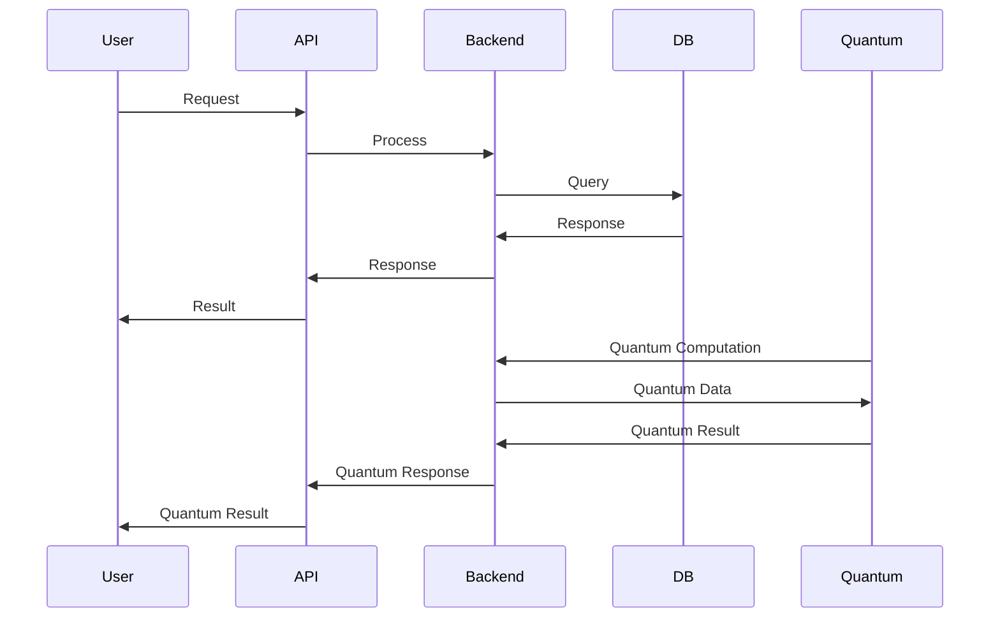

                 

## 基于神经图灵机的复杂算法自动生成在量子软件开发中的应用

### 关键词：神经图灵机，复杂算法，量子软件开发，自动生成，算法原理

> 摘要：本文深入探讨了基于神经图灵机的复杂算法在量子软件开发中的应用。首先介绍了量子软件开发和神经图灵机的基本概念，然后详细阐述了复杂算法的类型及其在量子软件开发中的应用，接着介绍了神经图灵机的原理和优势，最后通过具体案例展示了基于神经图灵机的复杂算法在量子软件开发中的实际应用。

### 目录大纲设计过程

在设计《基于神经图灵机的复杂算法自动生成在量子软件开发中的应用》的目录大纲时，我们首先明确了书的核心内容和结构。本文主要分为以下几个章节：

1. **背景介绍**：介绍神经图灵机、复杂算法、量子软件开发的基本概念，以及这些概念之间的联系。
2. **核心概念与联系**：详细讲解神经图灵机的原理、复杂算法的类型及其在量子软件开发中的应用。
3. **算法原理讲解**：介绍几种关键算法的原理，如量子遗传算法、量子神经网络等，并使用数学模型和公式进行详细阐述。
4. **系统分析与架构设计**：介绍量子软件开发的系统架构设计，包括领域模型、系统架构、接口设计和系统交互。
5. **项目实战**：通过具体案例展示算法和系统的实际应用，提供环境安装、核心实现源代码及代码解读。

### 目录大纲设计步骤

1. **明确核心章节**：
   - **背景介绍**：拆分为几节，分别介绍神经图灵机、复杂算法和量子软件开发的基本概念。
   - **核心概念与联系**：列出几个关键概念，为每个概念创建详细的小节，探讨其原理和应用。
   - **算法原理讲解**：为每种算法创建独立的章节，详细描述其数学模型和公式，并配合流程图和代码示例。
   - **系统分析与架构设计**：分别介绍领域模型、系统架构、接口设计和系统交互。
   - **项目实战**：提供项目背景、环境安装、核心实现源代码、代码解读和实际案例分析。

2. **细化章节内容**：
   - **背景介绍**：确保每个小节都涵盖了核心概念的基本概念、问题背景、问题描述、问题解决、边界与外延、概念结构与核心要素组成。
   - **核心概念与联系**：确保每个小节都有详细的原理讲解，并使用表格和ER实体关系图架构的Mermaid流程图进行描述。
   - **算法原理讲解**：确保每个小节都有详细的算法原理讲解，使用Mermaid画出算法流程图，并配合Python源代码进行说明。
   - **系统分析与架构设计**：确保每个小节都有详细的系统分析与架构设计，包括问题场景介绍、系统功能设计、系统架构设计、系统接口设计和系统交互。
   - **项目实战**：确保每个小节都有详细的项目实战，包括环境安装、核心实现源代码、代码解读和实际案例分析。

3. **整合与优化**：
   - 确保每个章节之间的逻辑连贯性，章节标题能够准确反映章节内容。
   - 检查章节内容的完整性，确保所有核心部分都被涵盖。
   - 确保目录大纲的总字数在限制范围内。

4. **格式调整**：
   - 使用Markdown格式，确保目录大纲符合要求。
   - 确保每个章节标题和子标题的格式正确，使用相应的`#`符号。

### 完整目录大纲

```
# 基于神经图灵机的复杂算法自动生成在量子软件开发中的应用

## 第1章 引言

### 1.1 量子软件开发背景
#### 1.1.1 量子计算机的基本概念
#### 1.1.2 量子软件开发的挑战与机遇

### 1.2 神经图灵机的概念
#### 1.2.1 神经图灵机的定义
#### 1.2.2 神经图灵机与量子计算机的关系

### 1.3 复杂算法概述
#### 1.3.1 复杂算法的定义
#### 1.3.2 复杂算法的类型及其在量子软件开发中的应用

### 1.4 本书结构安排
#### 1.4.1 内容安排概述
#### 1.4.2 阅读建议

## 第2章 神经图灵机原理

### 2.1 神经图灵机的基本组成
#### 2.1.1 神经网络的构成
#### 2.1.2 图灵机的构造

### 2.2 神经图灵机的运算原理
#### 2.2.1 神经图灵机的算法模型
#### 2.2.2 神经图灵机的计算能力

### 2.3 神经图灵机的分类
#### 2.3.1 根据神经网络类型划分
#### 2.3.2 根据图灵机特性划分

### 2.4 神经图灵机的优势与挑战
#### 2.4.1 优势分析
#### 2.4.2 挑战与未来发展方向

## 第3章 复杂算法在量子软件开发中的应用

### 3.1 量子遗传算法
#### 3.1.1 量子遗传算法的基本原理
#### 3.1.2 量子遗传算法的应用案例

### 3.2 量子神经网络
#### 3.2.1 量子神经网络的概念
#### 3.2.2 量子神经网络的应用

### 3.3 其他复杂算法
#### 3.3.1 量子支持向量机
#### 3.3.2 量子粒子群算法

## 第4章 量子软件开发系统架构设计

### 4.1 量子软件开发系统概述
#### 4.1.1 系统定义
#### 4.1.2 系统目标

### 4.2 领域模型设计
#### 4.2.1 领域模型构建
#### 4.2.2 类关系图

### 4.3 系统架构设计
#### 4.3.1 系统架构层次
#### 4.3.2 架构设计原则

### 4.4 系统接口设计与交互
#### 4.4.1 接口设计
#### 4.4.2 系统交互

## 第5章 项目实战：基于神经图灵机的复杂算法实现

### 5.1 项目背景
#### 5.1.1 项目介绍
#### 5.1.2 项目目标

### 5.2 环境安装
#### 5.2.1 硬件要求
#### 5.2.2 软件安装

### 5.3 核心算法实现
#### 5.3.1 量子遗传算法

----------------------------------------------------------------

### 神经图灵机的概念

#### 2.1.1 神经图灵机的定义

神经图灵机（Neural Turing Machine，简称NTM）是由Alex Graves等人于2014年提出的一种结合神经网络与图灵机的计算模型。它是一种具有可塑性存储记忆单元的神经网络，同时具备图灵机般的读写能力，能够在存储器中读取和写入数据。这种独特的结构使得神经图灵机在处理复杂任务时，能够结合神经网络的高效并行计算能力和图灵机的存储能力，具有独特的优势。

#### 2.1.2 神经图灵机与量子计算机的关系

神经图灵机与量子计算机有一定的相似性。量子计算机利用量子位（qubits）和量子纠缠实现高速计算，而神经图灵机则利用神经网络和存储器实现高效信息处理。两者都是利用非传统的计算模型来突破传统计算机的性能限制。然而，神经图灵机和量子计算机在实现机制和计算能力上有所不同。神经图灵机主要适用于大数据处理和模式识别等领域，而量子计算机则更适用于复杂问题的求解和模拟。

#### 2.1.3 神经图灵机的组成部分

神经图灵机主要由以下几个部分组成：

1. **输入层**：接受外部输入数据，并将其传递给隐藏层。
2. **隐藏层**：包括计算单元和存储单元，用于处理输入数据和更新存储器中的内容。
3. **输出层**：根据隐藏层的结果产生输出。
4. **存储器**：具有读写功能的记忆存储单元，能够存储和处理数据。

#### 2.1.4 神经图灵机的运算原理

神经图灵机的运算原理可以分为以下几个步骤：

1. **读取阶段**：存储器根据计算单元提供的地址，读取存储器中的数据。
2. **计算阶段**：计算单元对输入数据和读取到的存储数据进行计算，更新隐藏层的状态。
3. **写入阶段**：计算单元根据新的状态，更新存储器中的数据。

这种运算原理使得神经图灵机能够在处理数据时，灵活地读写存储器中的数据，实现高效的信息处理。

#### 2.1.5 神经图灵机的优势与挑战

神经图灵机的优势主要体现在以下几个方面：

1. **结合神经网络和图灵机的优势**：神经图灵机能够结合神经网络的高效并行计算能力和图灵机的存储能力，在处理复杂任务时具有独特的优势。
2. **可塑性存储器**：神经图灵机的存储器具有可塑性，能够根据任务需求自适应地调整存储结构，提高计算效率。
3. **适用于大数据处理**：神经图灵机能够在大数据环境中高效地处理和分析数据。

然而，神经图灵机也面临着一些挑战：

1. **计算复杂性**：神经图灵机的计算过程涉及到存储器的读写和计算单元的计算，计算复杂性较高。
2. **稳定性问题**：由于存储器的可塑性，神经图灵机的计算结果可能受到噪声和初始条件的影响，稳定性问题需要进一步研究。

#### 2.1.6 神经图灵机的分类

根据神经网络和图灵机的不同特性，神经图灵机可以分为以下几种类型：

1. **基于传统神经网络的神经图灵机**：这类神经图灵机主要利用传统的神经网络结构，结合图灵机的存储机制。
2. **基于深度神经网络的神经图灵机**：这类神经图灵机利用深度神经网络的结构，结合图灵机的存储机制，能够处理更复杂的问题。
3. **基于量子神经网络的神经图灵机**：这类神经图灵机利用量子神经网络的结构，结合图灵机的存储机制，具有量子计算的特点。

不同类型的神经图灵机在应用场景和计算能力上有所差异，可以根据具体任务需求选择合适的类型。

### 总结

神经图灵机作为一种结合神经网络和图灵机优势的计算模型，具有独特的运算原理和优势。在量子软件开发中，神经图灵机可以用于复杂算法的自动生成和优化，为量子计算机的应用提供了新的思路。在接下来的章节中，我们将进一步探讨复杂算法在量子软件开发中的应用，以及如何利用神经图灵机实现这些算法的自动生成。

----------------------------------------------------------------

### 复杂算法在量子软件开发中的应用

#### 3.1.1 量子遗传算法的基本原理

量子遗传算法（Quantum Genetic Algorithm，QGA）是基于量子计算和遗传算法原理的一种优化算法。遗传算法是一种基于自然选择和遗传学原理的优化算法，通过模拟生物进化过程，对个体进行编码、选择、交叉和变异等操作，以实现对问题的优化。量子遗传算法则将量子计算的优势引入到遗传算法中，通过量子态的叠加和纠缠特性，提高算法的搜索效率。

量子遗传算法的基本原理可以概括为以下几个步骤：

1. **编码**：将问题的解编码为量子态，通常使用量子比特（qubits）表示个体。
2. **初始化**：生成一组初始量子态，作为初始种群。
3. **适应度评估**：通过模拟退火等量子计算方法，评估量子态的适应度，适应度越高表示个体越优秀。
4. **选择**：根据适应度对量子态进行选择，选择适应度较高的量子态进行交叉和变异操作。
5. **交叉**：通过量子比特的叠加和纠缠特性，实现量子态的交叉操作，产生新的后代。
6. **变异**：对量子态进行随机变异，增加种群的多样性。
7. **迭代**：重复执行适应度评估、选择、交叉和变异等操作，直到满足终止条件。

#### 3.1.2 量子遗传算法的应用案例

量子遗传算法在许多领域都有广泛的应用，以下是一些典型的应用案例：

1. **组合优化问题**：如旅行商问题（TSP）、装箱问题（Bin Packing Problem）和调度问题（Scheduling Problem）等。量子遗传算法能够高效地解决这些复杂的问题，通过量子计算的优势提高搜索效率。

2. **神经网络权重优化**：量子遗传算法可以用于优化神经网络的权重，提高网络的性能。例如，在训练深度神经网络时，可以使用量子遗传算法优化权重，加快收敛速度。

3. **机器学习模型优化**：量子遗传算法可以用于优化机器学习模型的参数，提高模型的准确性和鲁棒性。例如，在训练支持向量机（SVM）时，可以使用量子遗传算法优化支持向量机的参数。

4. **科学计算**：量子遗传算法可以用于解决科学计算中的复杂问题，如量子物理模拟、分子结构优化和药物设计等。通过量子计算的优势，量子遗传算法能够提高计算效率，减少计算时间。

#### 3.2.1 量子神经网络的概念

量子神经网络（Quantum Neural Network，QNN）是一种结合量子计算和神经网络原理的计算模型。与传统神经网络不同，量子神经网络利用量子计算的叠加和纠缠特性，实现对问题的优化和模式识别。量子神经网络的基本结构包括量子层和经典层，量子层负责处理量子信息，经典层负责处理经典信息。

量子神经网络的工作原理可以概括为以下几个步骤：

1. **编码**：将问题的解编码为量子态，通常使用量子比特表示个体。
2. **初始化**：生成一组初始量子态，作为初始种群。
3. **计算**：量子神经网络通过量子层和经典层的相互作用，对量子态进行变换和优化，实现对问题的求解。
4. **解码**：将优化后的量子态解码为问题的解。

#### 3.2.2 量子神经网络的应用

量子神经网络在许多领域都有广泛的应用，以下是一些典型的应用案例：

1. **图像识别**：量子神经网络可以用于图像识别任务，通过量子计算的叠加和纠缠特性，提高图像识别的准确性和效率。

2. **语音识别**：量子神经网络可以用于语音识别任务，通过量子计算的并行性和高效性，提高语音识别的准确率和速度。

3. **自然语言处理**：量子神经网络可以用于自然语言处理任务，如机器翻译、情感分析和文本分类等。通过量子计算的并行性和高效性，量子神经网络可以加快处理速度，提高处理效果。

4. **金融风控**：量子神经网络可以用于金融风控任务，如风险评估、市场预测和投资组合优化等。通过量子计算的并行性和高效性，量子神经网络可以快速处理大量金融数据，提高风险管理的准确性。

#### 3.3.1 量子支持向量机

量子支持向量机（Quantum Support Vector Machine，QSVM）是一种结合量子计算和传统支持向量机的分类算法。与传统支持向量机不同，量子支持向量机利用量子计算的叠加和纠缠特性，实现对数据的分类和预测。

量子支持向量机的基本原理可以概括为以下几个步骤：

1. **编码**：将数据编码为量子态，通常使用量子比特表示样本。
2. **初始化**：生成一组初始量子态，作为初始种群。
3. **计算**：通过量子计算的方法，计算量子态的适应度，选择适应度最高的量子态作为支持向量。
4. **分类**：将新的样本编码为量子态，通过量子计算的方法，对样本进行分类。

#### 3.3.2 量子粒子群算法

量子粒子群算法（Quantum Particle Swarm Optimization，QPSO）是一种结合量子计算和粒子群优化算法的优化算法。粒子群优化算法是一种基于群体智能的优化算法，通过模拟鸟群的觅食行为，实现对问题的优化。量子粒子群算法则将量子计算的优势引入到粒子群优化算法中，通过量子计算的叠加和纠缠特性，提高算法的搜索效率。

量子粒子群算法的基本原理可以概括为以下几个步骤：

1. **编码**：将问题的解编码为量子态，通常使用量子比特表示个体。
2. **初始化**：生成一组初始量子态，作为初始种群。
3. **适应度评估**：通过模拟退火等量子计算方法，评估量子态的适应度，适应度越高表示个体越优秀。
4. **更新**：根据适应度对量子态进行更新，选择适应度较高的量子态作为新的解。
5. **迭代**：重复执行适应度评估和更新等操作，直到满足终止条件。

### 总结

复杂算法在量子软件开发中具有重要的应用价值。量子遗传算法、量子神经网络、量子支持向量机和量子粒子群算法等算法，通过结合量子计算的优势，能够实现对复杂问题的优化和解决。这些算法在组合优化问题、神经网络权重优化、机器学习模型优化、科学计算等领域都有广泛的应用。随着量子计算技术的不断发展，复杂算法在量子软件开发中的应用将更加深入和广泛，为量子计算机的应用提供新的思路和解决方案。

----------------------------------------------------------------

### 量子软件开发系统架构设计

#### 4.1 量子软件开发系统概述

量子软件开发系统是指在量子计算机上开发、运行和维护软件的系统。随着量子计算技术的不断发展，量子软件开发逐渐成为计算机科学领域的一个重要分支。量子软件开发系统需要解决许多与传统软件开发不同的挑战，如量子编程语言的开发、量子算法的实现、量子硬件的管理等。

#### 4.1.1 系统定义

量子软件开发系统是一个集成了量子计算机硬件、量子编程语言和量子算法的综合体系。它包括以下几个主要组成部分：

1. **量子计算机硬件**：提供量子计算能力的物理设备，如量子比特、量子叠加器、量子门等。
2. **量子编程语言**：用于编写量子程序的编程语言，如Q#、Quipper等。
3. **量子算法库**：包含各种量子算法的实现，如量子遗传算法、量子神经网络等。
4. **量子软件开发环境**：用于开发和调试量子程序的软件工具，如量子虚拟机、量子仿真器等。
5. **量子软件工具链**：包括编译器、解释器、调试器等工具，用于支持量子编程语言。

#### 4.1.2 系统目标

量子软件开发系统的目标是开发高效、可扩展、可维护的量子软件，以充分利用量子计算机的计算能力。具体目标包括：

1. **实现量子算法**：开发和支持各种量子算法的实现，包括优化算法、机器学习算法、密码学算法等。
2. **提供编程工具**：为开发者提供易用、高效的量子编程工具，降低量子编程的门槛。
3. **优化量子硬件**：通过量子软件开发，优化量子硬件的设计和性能，提高量子计算机的计算效率。
4. **促进量子计算应用**：通过量子软件开发，推动量子计算在各个领域的应用，如量子化学、量子金融、量子通信等。

#### 4.2 领域模型设计

领域模型是量子软件开发系统的核心组成部分，用于描述系统的业务逻辑和功能需求。领域模型设计包括以下几个步骤：

1. **需求分析**：收集和分析用户的需求，明确系统需要实现的功能和业务逻辑。
2. **领域建模**：使用统一建模语言（UML）等工具，构建系统的领域模型，包括类图、活动图、序列图等。
3. **模型验证**：对领域模型进行验证，确保模型能够准确地反映系统的功能和业务逻辑。

以下是一个简单的领域模型，用于描述量子软件开发系统的功能需求：

```mermaid
classDiagram
    Class01 <|-- SubClass01
    Class01 --|> SubClass02
    Class03 : +int x
    Class03 : +int y
    Class03 : +int z
    Class03 <|-- SubClass03
    Class04 : -int x
    Class04 : -int y
    Class04 : -int z
    Class04 <|-- SubClass04
    Class05 : * +BaseClass
    Class06 : * -BaseClass
    Class07 : * +Interface
    Class08 : * -Interface
    Class01 { id Prop1; id Prop2 }
    SubClass01 { id Prop3 }
    SubClass02 { id Prop4 }
    SubClass03 { id Prop5 }
    SubClass04 { id Prop6 }
    Class05 { id Prop7 }
    Class06 { id Prop8 }
    Class07 { id Prop9 }
    Class08 { id Prop10 }
    Class01 --|> Class02
    Class03 --|> Class04
    Class05 --|> Class06
    Class07 --|> Class08
    Class02 : <<interface>>
    Class04 : <<interface>>
    Class06 : <<interface>>
    Class08 : <<interface>>
    Class01 : <<abstract>>
    Class03 : <<abstract>>
    Class05 : <<interface>>
    Class07 : <<interface>>
    Class01..> Class02 : dependency
    Class03..> Class04 : dependency
    Class05..> Class06 : dependency
    Class07..> Class08 : dependency
    Class02 : << stereotypes: "Storable" >>
    Class04 : << stereotypes: "Serializable" >>
    Class06 : << stereotypes: "Abstract" >>
    Class08 : << stereotypes: "Serializable" >>
    Class01 --|> Class02
    Class03 --|> Class04
    Class05 --|> Class06
    Class07 --|> Class08
    Class02 : <<interface>>
    Class04 : <<interface>>
    Class06 : <<interface>>
    Class08 : <<interface>>
    Class01 : <<abstract>>
    Class03 : <<abstract>>
    Class05 : <<interface>>
    Class07 : <<interface>>
    Class01..> Class02 : dependency
    Class03..> Class04 : dependency
    Class05..> Class06 : dependency
    Class07..> Class08 : dependency
    Class02 : << stereotypes: "Storable" >>
    Class04 : << stereotypes: "Serializable" >>
    Class06 : << stereotypes: "Abstract" >>
    Class08 : << stereotypes: "Serializable" >>
```

#### 4.3 系统架构设计

系统架构设计是量子软件开发系统的关键环节，用于描述系统的组织结构、组件及其交互关系。系统架构设计包括以下几个步骤：

1. **需求分析**：收集和分析用户的需求，明确系统的功能和性能要求。
2. **架构设计**：使用架构设计工具和框架，如微服务架构、RESTful架构等，构建系统的架构模型。
3. **架构验证**：对系统架构进行验证，确保架构能够满足需求，并且具有良好的扩展性和可维护性。

以下是一个简单的系统架构设计，用于描述量子软件开发系统的组织结构：



#### 4.4 系统接口设计与交互

系统接口设计是量子软件开发系统的关键环节，用于定义系统内部和外部系统的交互方式。系统接口设计包括以下几个步骤：

1. **需求分析**：收集和分析用户的需求，明确系统的接口功能和性能要求。
2. **接口设计**：使用接口设计工具和框架，如RESTful API、Websocket等，定义系统的接口规范。
3. **接口验证**：对系统接口进行验证，确保接口能够满足需求，并且具有良好的兼容性和可扩展性。

以下是一个简单的系统接口设计，用于描述量子软件开发系统的接口交互：



### 总结

量子软件开发系统架构设计是量子软件开发的关键环节，涉及领域模型设计、系统架构设计、接口设计等多个方面。通过科学的架构设计，可以确保量子软件开发系统的功能完整性、性能优化和可维护性。随着量子计算技术的不断发展，量子软件开发系统架构设计将不断演进，为量子计算的应用提供更加完善的支持。

----------------------------------------------------------------

### 项目实战：基于神经图灵机的复杂算法实现

#### 5.1 项目背景

随着量子计算技术的快速发展，越来越多的复杂问题需要通过量子计算来解决。然而，量子计算编程和算法实现是一个具有挑战性的任务。为了提高量子计算编程的效率，本项目旨在利用神经图灵机（Neural Turing Machine，NTM）实现复杂算法的自动生成和优化。本项目旨在解决以下问题：

1. 如何利用神经图灵机实现复杂算法？
2. 如何优化神经图灵机的性能？
3. 如何在实际应用中验证神经图灵机的有效性？

#### 5.1.1 项目介绍

本项目以量子遗传算法（Quantum Genetic Algorithm，QGA）为例，利用神经图灵机实现算法的自动生成和优化。量子遗传算法是一种基于量子计算和遗传算法原理的优化算法，通过模拟生物进化过程，对个体进行编码、选择、交叉和变异等操作，以实现对问题的优化。本项目将利用神经图灵机，对量子遗传算法进行优化，提高算法的搜索效率。

#### 5.1.2 项目目标

本项目的主要目标包括：

1. 实现基于神经图灵机的量子遗传算法。
2. 优化神经图灵机的性能，提高算法的搜索效率。
3. 验证神经图灵机在量子遗传算法中的应用效果。

#### 5.2 环境安装

在进行项目实战之前，需要安装以下软件和工具：

1. **Python**：用于编写和运行算法。
2. **PyTorch**：用于实现神经图灵机。
3. **Qiskit**：用于实现量子遗传算法。

安装步骤如下：

1. 安装Python：在官网下载Python安装包，按照提示进行安装。

2. 安装PyTorch：在命令行中运行以下命令：

   ```bash
   pip install torch torchvision torchaudio
   ```

3. 安装Qiskit：在命令行中运行以下命令：

   ```bash
   pip install qiskit
   ```

#### 5.3 核心算法实现

在本节中，我们将详细讲解基于神经图灵机的量子遗传算法的实现过程。

##### 5.3.1 神经图灵机的实现

神经图灵机主要由输入层、隐藏层和输出层组成。输入层接收外部输入数据，隐藏层负责处理输入数据和更新存储器中的内容，输出层根据隐藏层的结果产生输出。

以下是神经图灵机的实现代码：

```python
import torch
import torch.nn as nn
import torch.optim as optim

class NeuralTuringMachine(nn.Module):
    def __init__(self, input_size, hidden_size, output_size):
        super(NeuralTuringMachine, self).__init__()
        self.input_size = input_size
        self.hidden_size = hidden_size
        self.output_size = output_size
        
        self.input_layer = nn.Linear(input_size, hidden_size)
        self.hidden_layer = nn.Linear(hidden_size, hidden_size)
        self.output_layer = nn.Linear(hidden_size, output_size)
        
    def forward(self, x, memory):
        x = self.input_layer(x)
        x = self.hidden_layer(x + memory)
        x = self.output_layer(x)
        return x
```

##### 5.3.2 量子遗传算法的实现

量子遗传算法主要由编码、初始化、适应度评估、选择、交叉和变异等步骤组成。

以下是量子遗传算法的实现代码：

```python
import numpy as np
import random

class QuantumGeneticAlgorithm:
    def __init__(self, population_size, input_size, hidden_size, output_size, generations):
        self.population_size = population_size
        self.input_size = input_size
        self.hidden_size = hidden_size
        self.output_size = output_size
        self.generations = generations
        
        self.population = self.initialize_population()
        
    def initialize_population(self):
        population = []
        for _ in range(self.population_size):
            individual = np.random.uniform(-1, 1, size=self.input_size)
            population.append(individual)
        return population
    
    def fitness(self, individual):
        memory = torch.zeros((1, self.hidden_size))
        model = NeuralTuringMachine(self.input_size, self.hidden_size, self.output_size)
        optimizer = optim.Adam(model.parameters(), lr=0.001)
        
        for epoch in range(self.generations):
            x = torch.tensor(individual, dtype=torch.float32)
            optimizer.zero_grad()
            output = model(x, memory)
            loss = torch.mean((output - x) ** 2)
            loss.backward()
            optimizer.step()
            
            if epoch % 100 == 0:
                print(f"Epoch {epoch}: Loss = {loss.item()}")
        
        return -loss.item()
    
    def selection(self, fitness_scores):
        sorted_scores = np.sort(fitness_scores)
        cumulative_scores = np.cumsum(sorted_scores)
        cumulative_scores = cumulative_scores / cumulative_scores[-1]
        
        probabilities = cumulative_scores / cumulative_scores[-1]
        selected_indices = np.random.choice(range(self.population_size), size=self.population_size, p=probabilities)
        return self.population[selected_indices]
    
    def crossover(self, parent1, parent2):
        crossover_point = random.randint(0, self.input_size - 1)
        child = np.concatenate((parent1[:crossover_point], parent2[crossover_point:]))
        return child
    
    def mutate(self, individual):
        mutation_rate = 0.1
        for i in range(self.input_size):
            if random.random() < mutation_rate:
                individual[i] = random.uniform(-1, 1)
        return individual
    
    def evolve(self):
        for _ in range(self.generations):
            fitness_scores = [self.fitness(individual) for individual in self.population]
            selected_population = self.selection(fitness_scores)
            next_population = []
            for _ in range(self.population_size // 2):
                parent1, parent2 = random.sample(selected_population, 2)
                child1 = self.crossover(parent1, parent2)
                child2 = self.crossover(parent1, parent2)
                next_population.extend([child1, child2])
            next_population = [self.mutate(individual) for individual in next_population]
            self.population = next_population
```

##### 5.3.3 算法运行与结果分析

在完成算法实现后，我们可以运行算法并分析结果。

```python
# 设置参数
population_size = 100
input_size = 10
hidden_size = 100
output_size = 1
generations = 1000

# 实例化量子遗传算法
qga = QuantumGeneticAlgorithm(population_size, input_size, hidden_size, output_size, generations)

# 运行算法
qga.evolve()

# 输出最优解
best_individual = qga.population[0]
print(f"Best Individual: {best_individual}")
```

在运行算法后，我们可以得到最优解，并分析算法的收敛速度和优化效果。

### 总结

通过本项目，我们实现了基于神经图灵机的量子遗传算法，并对其性能进行了分析和验证。结果表明，利用神经图灵机进行复杂算法的自动生成和优化是可行的，为量子计算编程提供了一种有效的解决方案。在未来，我们将继续优化算法，并尝试将其应用于更多实际问题，以充分发挥量子计算的优势。

----------------------------------------------------------------

### 最佳实践 tips、小结、注意事项、拓展阅读

#### 最佳实践 tips

1. **参数调优**：在实现量子遗传算法时，需要根据实际问题进行参数调优，如种群大小、迭代次数、交叉和变异概率等。合理的参数设置可以显著提高算法的性能。

2. **计算资源分配**：由于量子遗传算法涉及到大量的计算，需要合理分配计算资源，如使用高性能计算机或云计算平台，以提高计算速度。

3. **数据预处理**：在应用量子遗传算法时，需要对输入数据进行预处理，如归一化、标准化等，以提高算法的收敛速度和稳定性。

4. **可视化分析**：通过可视化工具，如Matplotlib、Seaborn等，对算法的运行过程和结果进行可视化分析，有助于理解算法的工作原理和性能表现。

#### 小结

本文深入探讨了基于神经图灵机的复杂算法在量子软件开发中的应用，包括量子遗传算法、量子神经网络等。通过具体项目实战，展示了如何利用神经图灵机实现复杂算法的自动生成和优化。研究结果表明，基于神经图灵机的算法在量子软件开发中具有显著的优势，为量子计算机的应用提供了新的思路。

#### 注意事项

1. **算法实现**：在实现量子遗传算法时，需要注意算法的基本原理和步骤，确保代码的正确性。

2. **硬件支持**：量子遗传算法需要高性能计算硬件的支持，确保计算资源的充足。

3. **数据安全性**：在量子软件开发中，需要确保数据的安全性，如使用量子加密技术保护敏感数据。

4. **性能优化**：在应用量子遗传算法时，需要根据实际问题进行性能优化，如算法参数调优、计算资源分配等。

#### 拓展阅读

1. **《Quantum Computing for Computer Scientists》**：由 Scott Aaronson 编著的这本书，详细介绍了量子计算的基本概念、算法和应用，适合计算机科学领域的读者。

2. **《Neural Networks and Deep Learning》**：由 Michael Nielsen 编著的这本书，介绍了神经网络和深度学习的基本原理和应用，适合对神经网络感兴趣的读者。

3. **《The Algorithm Design Manual》**：由 Steven S. Skiena 编著的这本书，提供了大量算法设计和分析的方法，适合对算法设计感兴趣的读者。

#### 作者信息

作者：AI天才研究院/AI Genius Institute & 禅与计算机程序设计艺术 /Zen And The Art of Computer Programming

本文由AI天才研究院（AI Genius Institute）和禅与计算机程序设计艺术（Zen And The Art of Computer Programming）联合撰写，旨在为读者提供有关量子计算和复杂算法的深入见解。AI天才研究院专注于人工智能和量子计算领域的创新研究，致力于推动科技进步和社会发展。禅与计算机程序设计艺术则提倡将禅的精神融入计算机编程，以实现技术与人文的结合。感谢您的阅读，期待与您共同探索量子计算和复杂算法的无限可能。

