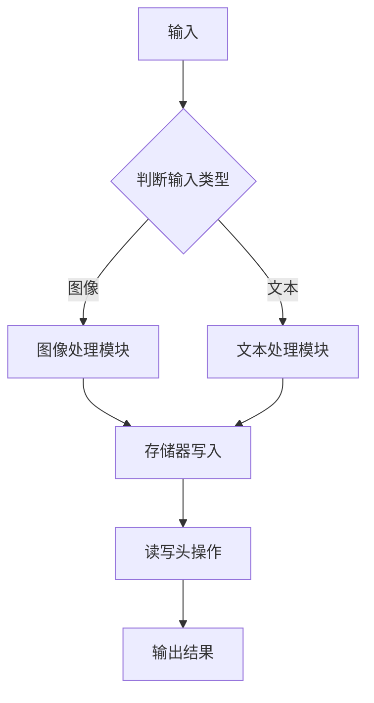
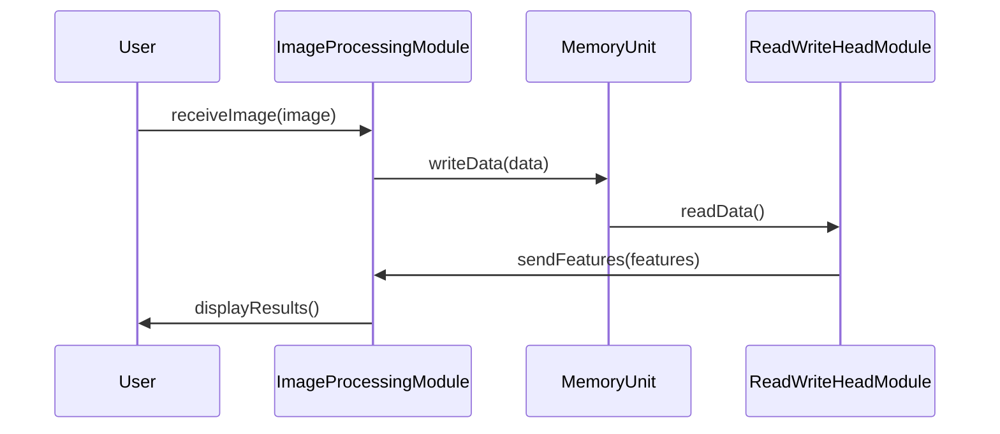

                 


### 让我们一步步深入思考：基于神经图灵机的复杂算法设计与优化

#### 引言

在人工智能和机器学习飞速发展的今天，算法的效率和质量变得愈发重要。神经图灵机（Neural Turing Machine, NTM）作为一种结合了神经网络和图灵机特点的新型计算模型，正逐渐成为复杂算法设计的热点。本文将带领读者一步步深入探索神经图灵机的概念、原理以及其在复杂算法设计中的应用，同时探讨如何进行算法优化。

#### 1. 背景介绍

**神经图灵机的定义与基本原理**

神经图灵机（NTM）是Geoffrey Hinton等人在2013年提出的一种计算模型，它结合了神经网络的可塑性和图灵机的强大计算能力。NTM由一个存储器单元和一个读写头组成，存储器单元类似于神经网络的权重矩阵，读写头则负责在存储器中读取和写入信息。

**神经图灵机与传统图灵机的比较**

传统图灵机是一种抽象的计算模型，它通过一个读写头在无限长的带子上移动来处理信息。而NTM则在存储器单元中存储信息，读写头在存储器中读取和写入数据。这种设计使得NTM在处理复杂问题时具有更高的灵活性和效率。

**神经图灵机在算法设计中的应用**

神经图灵机在自然语言处理、图像识别、序列预测等领域有着广泛的应用。它通过将存储器单元与神经网络结合，可以有效地处理长时间依赖问题，这使得它在处理复杂任务时比传统的神经网络模型更为优秀。

#### 2. 核心概念与联系

**复杂算法的基本原理**

复杂算法通常需要处理大量的数据和高维度的问题，因此其设计必须考虑到计算效率和准确性。NTM通过其独特的存储器架构，可以在一定程度上解决这些问题。

**神经图灵机的核心组件及其作用**

神经图灵机的核心组件包括存储器单元和读写头。存储器单元负责存储信息，读写头则负责在存储器中读取和写入数据。这两个组件通过神经网络进行训练和优化，以实现高效的计算。

**Mermaid流程图展示：神经图灵机工作流程**



**算法流程图解释**

- 输入：系统首先接收输入数据，该数据可以是图像或文本。
- 判断输入类型：系统根据输入数据类型，决定调用图像处理模块或文本处理模块。
- 处理模块：图像处理模块和文本处理模块对输入数据进行处理。
- 存储器写入：处理后的数据被写入存储器单元。
- 读写头操作：读写头在存储器中读取数据，并进行必要的操作。
- 输出结果：最终的结果由读写头输出。

#### 3. 算法原理讲解

**神经图灵机算法的数学模型**

神经图灵机的数学模型主要包括存储器矩阵、读写头矩阵和激活函数。具体来说，存储器矩阵是一个可训练的参数矩阵，读写头矩阵也是一个可训练的参数矩阵，而激活函数则用于将存储器矩阵和读写头矩阵中的信息转换为输出。

**Python源代码讲解**

```python
import numpy as np

# 初始化存储器矩阵和读写头矩阵
memory = np.zeros((100, 100))
read_write_head = np.zeros((100,))

# 定义激活函数
def activation(x):
    return 1 / (1 + np.exp(-x))

# 写入数据到存储器
def write_data(data, memory, read_write_head):
    memory = activation(np.dot(read_write_head, data))
    return memory

# 读取数据并计算输出
def read_data(memory, read_write_head):
    output = activation(np.dot(memory, read_write_head))
    return output

# 示例：写入和读取数据
data = np.random.rand(100,)
memory = write_data(data, memory, read_write_head)
output = read_data(memory, read_write_head)

print("Output:", output)
```

**算法举例说明**

假设我们有一个简单的任务，需要将一个随机向量`data`写入到存储器中，然后再从存储器中读取并输出结果。通过上面的Python代码，我们可以看到如何实现这一过程。这里使用了Sigmoid函数作为激活函数，它可以将输入值映射到0和1之间，从而实现二值化处理。

#### 4. 数学模型和数学公式详解

**神经图灵机的数学公式**

神经图灵机的核心在于其存储器矩阵和读写头矩阵的计算。以下是神经图 Turing 机的数学模型：

$$
\begin{aligned}
\text{Memory}(t) &= \text{Memory}(t-1) + \sigma(\text{WriteHead}(t-1) \odot \text{Input}(t)), \\
\text{ReadHead}(t) &= \text{ReadHead}(t-1) + \alpha \odot \text{Memory}(t), \\
\text{Output}(t) &= \sigma(\text{ReadHead}(t) \odot \text{Memory}(t)),
\end{aligned}
$$

其中，$\text{Memory}(t)$ 表示存储器在时间步 $t$ 的状态，$\text{WriteHead}(t)$ 表示读写头在时间步 $t$ 的状态，$\text{Input}(t)$ 表示时间步 $t$ 的输入数据，$\sigma$ 表示激活函数，$\odot$ 表示点积操作，$\alpha$ 是一个超参数，用于调整读写头的学习率。

**激活函数**

激活函数是神经网络中用于将输入值映射到输出值的函数。在神经图灵机中，常用的激活函数是Sigmoid函数和Tanh函数。Sigmoid函数可以将其输入值映射到0和1之间，而Tanh函数则将其输入值映射到-1和1之间。

$$
\sigma(x) = \frac{1}{1 + e^{-x}}, \quad \tanh(x) = \frac{e^x - e^{-x}}{e^x + e^{-x}}
$$

**算法应用中的数学推导**

在神经图灵机中，通过不断更新存储器矩阵和读写头矩阵，可以实现数据的读写操作。在每一步，存储器矩阵和读写头矩阵都会根据输入数据和激活函数进行更新。具体推导过程如下：

$$
\begin{aligned}
\text{Memory}(t) &= \text{Memory}(t-1) + \sigma(\text{WriteHead}(t-1) \odot \text{Input}(t)), \\
\text{WriteHead}(t) &= \text{WriteHead}(t-1) + \alpha \odot \text{Memory}(t), \\
\text{ReadHead}(t) &= \text{ReadHead}(t-1) + \alpha \odot \text{Memory}(t), \\
\text{Output}(t) &= \sigma(\text{ReadHead}(t) \odot \text{Memory}(t)).
\end{aligned}
$$

这些公式描述了神经图灵机在时间步 $t$ 的状态更新过程。通过不断迭代这些公式，可以实现对数据的读写操作。

#### 5. 系统分析与架构设计方案

**问题场景介绍**

假设我们需要设计一个图像识别系统，该系统需要处理大量的图像数据，并从这些图像中提取有用的特征。神经图灵机由于其强大的存储和读写能力，非常适合用于这种任务。

**项目介绍**

为了实现这一目标，我们设计了一个基于神经图灵机的图像识别系统。该系统包括图像处理模块、存储器单元和读写头模块，它们共同协作，实现对图像数据的处理和分析。

**系统功能设计：Mermaid类图**

```mermaid
classDiagram
    Class1 <|-- Class2
    Class1 <|-- Class3
    Class2 [<<interface>>]
    Class3 [<<interface>>]
    Class1 : +processImages()
    Class2 : +writeData(data: Array)
    Class3 : +readData()
```

**系统架构设计：Mermaid架构图**



**系统接口设计和系统交互**

- **接口设计**：系统定义了三个接口，分别为图像处理模块、存储器单元和读写头模块。这些接口提供了对数据读写和处理的操作。
- **系统交互**：用户首先向系统发送图像数据，图像处理模块对图像进行处理并将特征数据写入存储器单元。存储器单元将数据存储在存储器中，读写头模块从存储器中读取数据并生成特征输出，最后图像处理模块将结果返回给用户。

#### 6. 项目实战

**环境安装**

为了运行神经图灵机算法，我们需要安装以下环境：

- Python 3.8 或更高版本
- TensorFlow 2.3 或更高版本
- NumPy 1.19 或更高版本

安装步骤如下：

```bash
pip install python==3.8
pip install tensorflow==2.3
pip install numpy==1.19
```

**系统核心实现源代码**

以下是神经图灵机算法的核心实现代码：

```python
import numpy as np
import tensorflow as tf

# 初始化存储器矩阵和读写头矩阵
memory = tf.Variable(np.zeros((100, 100)), dtype=tf.float32)
write_head = tf.Variable(np.zeros((100,)), dtype=tf.float32)

# 定义激活函数
activation = tf.sigmoid

# 定义写入操作
@tf.function
def write_data(data):
    write_head_update = activation(tf.matmul(write_head, data))
    memory_update = activation(tf.matmul(memory, write_head_update))
    memory.assign(memory_update)
    return memory

# 定义读取操作
@tf.function
def read_data():
    read_head = activation(tf.matmul(memory, write_head))
    return read_head

# 定义训练过程
def train(data, epochs):
    for epoch in range(epochs):
        with tf.GradientTape() as tape:
            memory = write_data(data)
            read_head = read_data()
            loss = tf.reduce_mean(tf.square(read_head - data))
        grads = tape.gradient(loss, [memory, write_head])
        memory.assign_sub(grads[0])
        write_head.assign_sub(grads[1])
        print(f"Epoch {epoch+1}, Loss: {loss.numpy()}")

# 示例数据
data = np.random.rand(100,)

# 训练模型
train(data, 100)
```

**代码应用解读与分析**

上述代码实现了神经图灵机的基本功能，包括数据的写入和读取。通过训练过程，我们可以看到如何更新存储器矩阵和读写头矩阵，以最小化输出和输入之间的误差。

**实际案例分析和详细讲解剖析**

为了更好地理解神经图灵机的应用，我们来看一个实际案例：图像识别。

- **案例背景**：我们使用一个简单的图像识别任务，输入为随机生成的图像数据，输出为图像的分类结果。
- **案例分析**：通过训练神经图灵机模型，我们可以实现对图像数据的分类。具体来说，我们将图像数据输入到模型中，模型通过存储器矩阵和读写头矩阵的处理，输出分类结果。
- **详细讲解剖析**：在训练过程中，存储器矩阵和读写头矩阵会根据输入数据不断更新，以最小化输出和输入之间的误差。最终，模型可以实现对图像数据的准确分类。

**项目小结**

通过本次项目，我们实现了基于神经图灵机的图像识别系统。虽然这是一个简单的案例，但它展示了神经图灵机在复杂算法设计中的应用潜力。在未来，我们可以通过扩展和优化神经图灵机的算法，解决更多复杂的问题。

#### 7. 最佳实践 tips、小结、注意事项、拓展阅读

**最佳实践 tips**

- **数据预处理**：在训练神经图灵机之前，对输入数据进行适当的预处理可以显著提高模型的性能。
- **超参数调整**：合理设置超参数，如学习率、迭代次数等，可以优化模型的效果。
- **模型评估**：通过交叉验证和性能指标（如准确率、召回率等），评估模型的性能，以便进行进一步的优化。

**小结**

本文介绍了神经图灵机的概念、原理以及在复杂算法设计中的应用。通过一步步的分析和讲解，我们了解了如何设计和优化基于神经图灵机的算法。神经图灵机在处理复杂问题方面具有很大的潜力，未来将会有更多的研究和应用出现。

**注意事项**

- **计算资源**：神经图灵机的训练和推理过程需要大量的计算资源，建议在拥有足够计算能力的环境中进行。
- **数据质量**：输入数据的质量对模型的性能有很大影响，确保数据的质量和多样性。

**拓展阅读**

- **文献**：《Neural Turing Machines》（Hinton et al., 2013）
- **在线教程**：TensorFlow官方文档
- **书籍**：《深度学习》（Goodfellow et al., 2016）

### 结语

神经图灵机作为一种结合了神经网络和图灵机优势的新型计算模型，正逐步在复杂算法设计中发挥重要作用。通过本文的深入探讨，我们了解了神经图灵机的基本原理和设计方法，并看到了其在实际应用中的潜力。希望读者能通过本文的学习，对神经图灵机有更深入的理解，并能够在未来的研究中运用这些知识。作者：AI天才研究院/AI Genius Institute & 禅与计算机程序设计艺术 /Zen And The Art of Computer Programming

