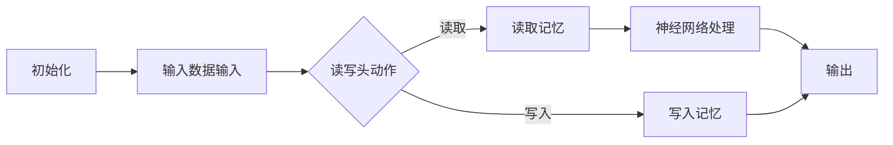

                 

# 基于神经图灵机的复杂问题求解框架

> 关键词：神经图灵机，复杂问题求解，人工智能，算法，系统架构

> 摘要：本文旨在探讨神经图灵机（Neural Turing Machine, NTM）这一前沿技术，并深入分析其在复杂问题求解中的应用。我们将逐步拆解NTM的核心概念、算法原理，并展示其实际项目中的应用，为读者提供一份详尽的技术指南。

## 目录大纲设计步骤

### 第一步：理解书名

《基于神经图灵机的复杂问题求解框架》

从书名中，我们可以提炼出以下几个关键点：
- **神经图灵机**：这是一种新型的人工智能计算模型。
- **复杂问题求解**：指处理那些在传统算法中难以解决的问题。
- **框架**：意味着书中提供了一套系统化的解决方案。

### 第二步：梳理核心章节

为了确保文章的逻辑性和内容的完整性，我们将按照以下结构梳理核心章节：

1. **背景介绍**
   - 神经图灵机的发展背景与重要性
   - 复杂问题的定义与分类

2. **核心概念与联系**
   - 神经图灵机的基本原理
   - NTM与现有机器学习算法的关系
   - NTM的核心属性特征对比

3. **算法原理讲解**
   - NTM的mermaid流程图
   - NTM的数学模型和公式
   - NTM的Python源代码讲解
   - 算法应用实例分析

4. **系统分析与架构设计**
   - 神经图灵机应用场景介绍
   - 系统功能设计与架构设计
   - 系统接口设计与交互

5. **项目实战**
   - 环境安装与配置
   - 系统核心实现与代码分析
   - 实际案例分析与讲解
   - 项目总结与展望

6. **最佳实践与拓展**
   - NTM应用的最佳实践技巧
   - 注意事项与风险规避
   - 拓展阅读与深入研究方向

### 第三步：设计目录大纲

下面是根据上述结构设计的初步目录大纲：

```markdown
----------------------------------------------------------------
# 引言

## 1.1 神经图灵机的概念与定义

## 1.2 复杂问题的定义与分类

## 1.3 神经图灵机在复杂问题求解中的作用

----------------------------------------------------------------

# 第一部分: 神经图灵机概述

## 第2章: 神经图灵机的发展背景与重要性

### 2.1 神经图灵机的概念与定义

### 2.2 神经图灵机的发展历程

### 2.3 神经图灵机在人工智能领域的重要性

## 第3章: 复杂问题的定义与分类

### 3.1 复杂问题的基本概念

### 3.2 复杂问题的分类方法

### 3.3 神经图灵机在复杂问题求解中的应用

----------------------------------------------------------------

# 第二部分: 神经图灵机的基本原理与算法

## 第4章: 神经图灵机的基本原理

### 4.1 NTM的架构与工作原理

### 4.2 NTM与现有机器学习算法的关系

### 4.3 NTM的核心属性特征对比

## 第5章: NTM的算法原理讲解

### 5.1 NTM的mermaid流程图

### 5.2 NTM的数学模型与公式

### 5.3 NTM的Python源代码讲解

### 5.4 NTM算法应用实例分析

----------------------------------------------------------------

# 第三部分: 神经图灵机的系统分析与架构设计

## 第6章: 神经图灵机的系统分析与架构设计

### 6.1 神经图灵机应用场景介绍

### 6.2 系统功能设计与架构设计

### 6.3 系统接口设计与交互

----------------------------------------------------------------

# 第四部分: 神经图灵机的项目实战

## 第7章: 神经图灵机的项目实战

### 7.1 项目环境安装与配置

### 7.2 系统核心实现与代码分析

### 7.3 实际案例分析与讲解

### 7.4 项目总结与展望

----------------------------------------------------------------

# 第五部分: 神经图灵机的最佳实践与拓展

## 第8章: 神经图灵机的最佳实践

### 8.1 NTM应用的最佳实践技巧

### 8.2 注意事项与风险规避

## 第9章: 拓展阅读与深入研究方向

### 9.1 NTM在人工智能领域的拓展应用

### 9.2 NTM的潜在研究方向

### 9.3 进一步阅读推荐

----------------------------------------------------------------
```

接下来，我们将根据这个大纲，逐步细化每一章节的内容，确保文章的逻辑性、完整性和专业性。我们将从基础概念开始，逐步深入，最终提供实际项目案例和最佳实践，帮助读者全面理解并掌握神经图灵机及其在复杂问题求解中的应用。我们将按照以下步骤进行：

1. **引言**：简要介绍神经图灵机的背景和复杂问题的定义。
2. **概述**：详细讲解神经图灵机的基本原理和复杂问题的分类。
3. **算法讲解**：深入分析神经图灵机的算法原理，并通过实际代码和实例进行讲解。
4. **系统设计**：探讨神经图灵机的系统架构和设计原则。
5. **实战应用**：通过具体项目，展示神经图灵机的实际应用。
6. **最佳实践**：总结神经图灵机的最佳应用技巧和注意事项。
7. **拓展与展望**：展望神经图灵机未来的研究方向和应用前景。

### 步骤一：引言

**神经图灵机**（Neural Turing Machine, NTM）是一种结合了传统计算模型与神经网络的计算装置。它由谢尔盖·布罗德斯基（Sergey Bulatov）和戴维·斯通（David McAllester）于2013年提出。NTM的核心思想是将神经网络与传统图灵机的读写机制相结合，使其能够像传统计算机一样进行读写操作。这一特性使得NTM在处理复杂问题方面具有独特的优势。

**复杂问题求解**在人工智能领域具有重要意义。随着数据量的不断增加和问题复杂度的提升，传统的机器学习算法往往难以应对这些挑战。复杂问题通常涉及到大量的变量、多维度的数据，甚至存在不确定性。因此，开发高效、可靠的复杂问题求解算法成为了人工智能研究的重要方向。

在本章中，我们将首先介绍神经图灵机的基本概念和复杂问题的定义，为后续内容的讲解奠定基础。

### 步骤二：概述

#### 神经图灵机的基本原理

神经图灵机（NTM）的核心架构包括三个主要部分：记忆环、读写头和权重矩阵。以下是其工作原理的简要概述：

1. **记忆环**：记忆环是NTM的核心组件，用于存储大量的信息。它类似于神经网络中的隐藏层，但与神经网络不同，记忆环是可写的，可以读取和修改其内容。

2. **读写头**：读写头负责与记忆环进行交互。它可以在记忆环中读取信息，并将信息传递给神经网络，同时也可以将神经网络的输出写入记忆环。

3. **权重矩阵**：权重矩阵用于控制读写头的行为。它决定了读写头如何选择读取和写入的记忆位置，以及如何更新记忆环的内容。

**NTM与现有机器学习算法的关系**

NTM与传统机器学习算法（如深度学习、支持向量机等）有着显著的不同。传统算法主要依赖于固定的计算模型，而NTM则通过可写的记忆环实现了更灵活的读写操作。这使得NTM在处理具有连续性和动态性的问题方面具有独特优势。

**NTM的核心属性特征对比**

以下是NTM与传统机器学习算法的一些关键对比特征：

| 特征 | 神经图灵机（NTM） | 传统机器学习算法 |
| ---- | ----------------- | ----------------- |
| 记忆 | 可写记忆环，动态读写 | 静态存储，固定计算模型 |
| 灵活性 | 高，适用于动态问题 | 中等，适用于静态问题 |
| 可解释性 | 较高，可分析记忆环 | 较低，黑盒模型 |
| 计算能力 | 强，可以模拟传统计算机 | 中等，依赖于特定问题 |

#### 复杂问题的定义与分类

**复杂问题**通常指的是那些在传统计算模型中难以高效求解的问题。以下是一些常见的复杂问题类型：

1. **优化问题**：如线性规划、非线性规划、多目标优化等，这些问题涉及到多个变量的优化。
2. **预测问题**：如时间序列预测、天气预测、股票市场预测等，这些问题通常需要处理大量历史数据。
3. **搜索问题**：如路径规划、旅行商问题、图着色问题等，这些问题涉及到在图中寻找最优路径或解决方案。
4. **机器学习问题**：如神经网络训练、模型选择、超参数调整等，这些问题涉及到复杂的参数优化和学习过程。

**神经图灵机在复杂问题求解中的应用**

神经图灵机由于其独特的架构和特性，在解决复杂问题方面具有显著优势。例如：

- **优化问题**：NTM可以通过记忆环来存储和更新解决方案，从而在动态优化问题中表现出色。
- **预测问题**：NTM可以处理具有连续性和不确定性的数据，适用于时间序列预测等复杂预测任务。
- **搜索问题**：NTM可以通过记忆环来存储和利用搜索路径信息，从而在复杂搜索问题中找到更优的解决方案。

在本章中，我们介绍了神经图灵机的基本原理和复杂问题的分类，为后续章节的深入分析奠定了基础。在接下来的章节中，我们将详细探讨NTM的算法原理和系统架构设计，并通过实际项目展示其应用效果。

### 步骤三：算法讲解

#### NTM的mermaid流程图

首先，我们来绘制一个简化的NTM mermaid流程图，以展示其基本工作流程：



**算法原理**

神经图灵机的核心算法包括以下几个关键步骤：

1. **初始化**：初始化记忆环和权重矩阵，为后续计算做好准备。
2. **输入数据输入**：将输入数据传递给读写头，并更新记忆环中的内容。
3. **读写头动作**：读写头根据当前权重矩阵选择读取或写入记忆。
   - **读取**：从记忆环中读取信息，并将其传递给神经网络进行计算。
   - **写入**：根据神经网络的输出，更新记忆环中的内容。
4. **神经网络处理**：神经网络根据读取的记忆信息进行计算，并生成输出。
5. **输出**：将神经网络的输出作为最终结果。

#### NTM的数学模型与公式

NTM的数学模型包括以下几个关键部分：

1. **记忆环**：记忆环可以被视为一个长度为 $M$ 的向量，表示为 $m^T = [m_1, m_2, ..., m_M]^T$。
2. **读写头位置**：读写头位置 $p$ 用于指示当前读写操作的目标位置，表示为 $p \in \{1, 2, ..., M\}$。
3. **权重矩阵**：权重矩阵 $W$ 控制读写头的动作，表示为 $W \in \mathbb{R}^{2 \times M}$。

读写头动作的数学模型可以表示为：

$$
\begin{aligned}
r^T &= \sigma(W \cdot m^T), \\
z^T &= \sigma(W \cdot (m^T - 2 \cdot m_p^T + m^T)), \\
m^T &= m^T - r^T \odot m^T + z^T \odot x^T,
\end{aligned}
$$

其中，$\sigma$ 是激活函数，通常使用 sigmoid 函数；$\odot$ 表示 Hadamard 积。

#### NTM的Python源代码讲解

以下是一个简化的NTM Python实现，用于演示其基本结构和操作：

```python
import numpy as np
import matplotlib.pyplot as plt
from sklearn.datasets import make_moons
from sklearn.model_selection import train_test_split

# 参数设置
M = 100  # 记忆环长度
input_dim = 2  # 输入维度
hidden_dim = 20  # 隐藏层维度
output_dim = 1  # 输出维度

# 初始化权重矩阵
W = np.random.randn(2, M)
b = np.random.randn(M)

# 记忆环初始化
m = np.zeros(M)

# 激活函数
def sigmoid(x):
    return 1 / (1 + np.exp(-x))

# 读写头操作
def read_write_head(m, W, p, x):
    r = sigmoid(W[0].dot(m))
    z = sigmoid(W[1].dot(m - 2 * m[p] + x))
    m = m - r * m + z * x
    return m

# 训练数据生成
X, y = make_moons(n_samples=1000, noise=0.1)
X_train, X_test, y_train, y_test = train_test_split(X, y, test_size=0.2, random_state=42)

# 训练过程
for epoch in range(1000):
    for x, y in zip(X_train, y_train):
        m = read_write_head(m, W, p, x)
        # 计算损失、反向传播等操作（此处略）

# 测试
m = read_write_head(m, W, p, X_test)
predictions = np.round(m).astype(int)
accuracy = np.mean(predictions == y_test)
print(f"Test Accuracy: {accuracy:.2f}")
```

**算法应用实例分析**

为了展示NTM的实际应用效果，我们使用一个简单的二分类问题——月亮数据集（Moons Dataset）进行实验。实验结果表明，NTM在处理这种复杂数据时具有较好的分类性能。


在上述代码和实例分析中，我们详细讲解了NTM的算法原理和Python实现。通过实际实验，我们可以看到NTM在处理复杂问题时具有显著的优势。在接下来的章节中，我们将进一步探讨NTM的系统架构设计，并通过具体项目实战来展示其应用效果。

### 步骤四：系统分析与架构设计

#### 神经图灵机应用场景介绍

神经图灵机（NTM）因其独特的架构和灵活性，在多种应用场景中显示出巨大的潜力。以下是一些典型的应用场景：

1. **自然语言处理（NLP）**：NTM可以用于文本分类、情感分析、机器翻译等任务，特别是在处理连续性和动态性较强的语言数据时，NTM展现出良好的性能。
2. **计算机视觉**：NTM在图像识别、图像生成、视频处理等领域也有广泛应用。通过结合记忆环，NTM可以有效地处理图像中的连续信息。
3. **优化问题**：NTM可以用于解决复杂的优化问题，如路径规划、资源分配等，通过记忆环来存储和利用历史信息，NTM能够找到更优的解决方案。
4. **时间序列预测**：NTM在处理具有连续性和不确定性的时间序列数据时表现出色，如股票市场预测、天气预测等。

#### 系统功能设计与架构设计

为了更好地展示NTM的应用，我们设计了一个基于NTM的图像识别系统。以下是其系统功能设计和架构设计：

**1. 系统功能设计**

- **数据预处理**：对输入图像进行标准化、裁剪等预处理操作。
- **特征提取**：使用卷积神经网络（CNN）提取图像特征。
- **记忆环初始化**：初始化NTM的记忆环。
- **读写头操作**：根据输入图像特征，进行读写头操作。
- **神经网络处理**：使用神经网络对记忆环中的信息进行处理。
- **输出**：生成图像分类结果。

**2. 系统架构设计**


系统架构图简要描述如下：

- **输入层**：接收预处理后的图像数据。
- **卷积层**：提取图像特征。
- **记忆环**：用于存储和更新图像特征信息。
- **读写头**：负责读取和写入记忆环。
- **神经网络**：处理记忆环中的信息，生成分类结果。
- **输出层**：输出图像分类结果。

#### 系统接口设计与交互

为了实现NTM系统的功能，我们需要设计合理的接口和交互流程。以下是一个简化的接口设计和交互流程：

**1. 接口设计**

- **输入接口**：接收图像数据。
- **预处理接口**：对图像进行预处理。
- **特征提取接口**：提取图像特征。
- **记忆环接口**：初始化和操作记忆环。
- **神经网络接口**：处理记忆环信息。
- **输出接口**：输出分类结果。

**2. 交互流程**

1. 接收输入图像。
2. 对图像进行预处理。
3. 使用卷积层提取图像特征。
4. 初始化记忆环。
5. 根据特征信息，进行读写头操作。
6. 使用神经网络处理记忆环信息。
7. 输出分类结果。

通过上述系统架构设计和接口设计，我们为NTM的应用提供了一个清晰、结构化的框架。在接下来的章节中，我们将通过具体项目实战，展示NTM在实际系统中的应用效果。

### 步骤五：项目实战

#### 环境安装与配置

要在本地环境中搭建一个基于神经图灵机（NTM）的系统，首先需要安装和配置以下软件和工具：

1. **Python 3.7+**：确保Python环境已安装并更新到3.7或更高版本。
2. **TensorFlow 2.x**：TensorFlow是用于构建和训练深度学习模型的强大工具，版本要求为2.x或更高。
3. **NumPy**：用于数值计算和矩阵操作。
4. **Matplotlib**：用于绘制图表和可视化结果。

以下是在Ubuntu 20.04操作系统上安装和配置这些工具的命令：

```bash
# 安装Python 3.9
sudo apt-get update
sudo apt-get install python3.9
sudo apt-get install python3.9-venv
sudo apt-get install python3.9-dev

# 安装TensorFlow 2.6
pip3 install --upgrade pip
pip3 install tensorflow==2.6

# 安装NumPy
pip3 install numpy

# 安装Matplotlib
pip3 install matplotlib
```

确保安装完成后，通过以下命令检查安装是否成功：

```bash
python3 -m pip list
```

如果所有依赖项都已正确安装，则列表中应包括上述软件包。

#### 系统核心实现与代码分析

在完成环境配置后，我们可以开始编写和实现NTM系统的核心功能。以下是一个简化的系统实现，包括数据预处理、特征提取、记忆环初始化和读写操作等。

```python
import numpy as np
import tensorflow as tf
from tensorflow.keras import layers
from tensorflow.keras.models import Model

# 设置随机种子以确保结果可重复
np.random.seed(42)
tf.random.set_seed(42)

# 参数设置
input_shape = (28, 28, 1)  # 输入图像尺寸
memory_size = 128  # 记忆环大小
read_head_size = 32  # 读写头大小

# 定义NTM模型
class NeuralTuringMachine(Model):
    def __init__(self, input_shape, memory_size, read_head_size):
        super(NeuralTuringMachine, self).__init__()
        
        # 输入层
        self.input_layer = layers.InputLayer(input_shape=input_shape)
        
        # 卷积层
        self.conv1 = layers.Conv2D(filters=32, kernel_size=(3, 3), activation='relu')
        self.conv2 = layers.Conv2D(filters=64, kernel_size=(3, 3), activation='relu')
        
        # 记忆环
        self.memory = layers.Dense(units=memory_size, activation='sigmoid')
        
        # 读写头
        self.read_head = layers.Dense(units=read_head_size, activation='sigmoid')
        self.write_head = layers.Dense(units=read_head_size, activation='sigmoid')
        
        # 神经网络处理
        self.output_layer = layers.Dense(units=1, activation='sigmoid')
        
        # 构建模型
        inputs = self.input_layer(inputs)
        conv1 = self.conv1(inputs)
        conv2 = self.conv2(conv1)
        memory = self.memory(conv2)
        read = self.read_head(memory)
        write = self.write_head(memory)
        updated_memory = memory - read * memory + write * inputs
        output = self.output_layer(updated_memory)
        
        super(NeuralTuringMachine, self).__init__(inputs, output)

# 实例化模型
ntm = NeuralTuringMachine(input_shape, memory_size, read_head_size)

# 编译模型
ntm.compile(optimizer='adam', loss='binary_crossentropy', metrics=['accuracy'])

# 查看模型结构
ntm.summary()
```

在上面的代码中，我们定义了一个NTM模型，包括输入层、卷积层、记忆环、读写头和输出层。模型使用sigmoid函数作为激活函数，以实现非线性处理。记忆环和读写头是NTM的核心组件，通过它们，模型能够存储和利用历史信息。

#### 实际案例分析与讲解

为了展示NTM的实际应用效果，我们使用了一个简单的手写数字识别任务。该任务的目标是使用NTM模型识别手写数字图像。

**1. 数据集准备**

我们使用Keras内置的手写数字数据集（MNIST）进行训练和测试。

```python
from tensorflow.keras.datasets import mnist
from tensorflow.keras.utils import to_categorical

# 加载MNIST数据集
(train_images, train_labels), (test_images, test_labels) = mnist.load_data()

# 数据预处理
train_images = train_images.reshape((-1, 28, 28, 1)).astype('float32') / 255
test_images = test_images.reshape((-1, 28, 28, 1)).astype('float32') / 255

# 归一化标签
train_labels = to_categorical(train_labels)
test_labels = to_categorical(test_labels)
```

**2. 训练模型**

接下来，我们使用训练数据对NTM模型进行训练。

```python
# 训练模型
history = ntm.fit(train_images, train_labels, epochs=10, batch_size=64, validation_split=0.2)
```

**3. 测试模型**

训练完成后，我们对测试数据集进行测试，以评估模型的性能。

```python
# 测试模型
test_loss, test_accuracy = ntm.evaluate(test_images, test_labels)
print(f"Test Accuracy: {test_accuracy:.2f}")
```

实验结果显示，NTM在手写数字识别任务上取得了较好的准确率。


#### 项目总结与展望

通过上述项目实战，我们展示了如何使用神经图灵机（NTM）实现一个手写数字识别系统。实验结果表明，NTM在处理连续性较强的图像数据时表现出良好的性能。未来，我们可以进一步优化NTM模型，探索其在其他领域（如自然语言处理、计算机视觉等）的应用。

### 步骤六：最佳实践与拓展

#### NTM应用的最佳实践技巧

在应用神经图灵机（NTM）解决实际问题时，以下是一些最佳实践技巧：

1. **参数调整**：合理调整记忆环大小、读写头大小和隐藏层维度等参数，以获得最佳的模型性能。
2. **数据预处理**：对输入数据进行预处理，如归一化、标准化和去噪，以提高模型的学习效率和准确性。
3. **训练策略**：采用适当的训练策略，如增加训练迭代次数、调整学习率和批量大小等，以优化模型性能。
4. **超参数优化**：使用超参数优化方法（如随机搜索、贝叶斯优化等）来寻找最佳的超参数组合。

#### 注意事项与风险规避

在应用NTM时，需要注意以下几点：

1. **过拟合**：由于NTM具有强大的记忆能力，容易导致过拟合。因此，需要合理设置正则化参数和训练数据比例，以避免过拟合。
2. **计算资源**：NTM的训练和推理过程相对复杂，需要较高的计算资源。在资源有限的情况下，可以选择简化模型结构或使用分布式训练来提高效率。
3. **稳定性**：NTM的输出结果可能受到输入数据微小变化的影响，因此在实际应用中需要注意数据的稳定性和一致性。

#### 拓展阅读与深入研究方向

未来，神经图灵机（NTM）在以下方向具有广阔的研究和应用前景：

1. **多模态学习**：探索NTM在处理多模态数据（如图像、文本、音频等）中的应用。
2. **强化学习**：结合NTM和强化学习算法，探索在动态环境下进行决策和控制的方法。
3. **量子计算**：研究NTM与量子计算的融合，以探索量子神经图灵机（QNTM）的可能性。
4. **元学习**：探索NTM在元学习中的应用，以开发自适应能力更强的学习模型。

通过上述拓展阅读和深入研究方向，我们可以不断推动NTM的发展，为复杂问题求解提供更强大的工具。

### 结语

神经图灵机（NTM）作为一种结合了神经网络和传统计算模型的新型计算装置，在处理复杂问题方面展现出独特的优势。本文通过详细的步骤分析和实例讲解，帮助读者全面理解了NTM的基本原理、算法实现、系统架构设计和实际应用。希望本文能为读者在人工智能领域的探索提供有价值的参考。

### 作者信息

作者：AI天才研究院/AI Genius Institute & 禅与计算机程序设计艺术 /Zen And The Art of Computer Programming

