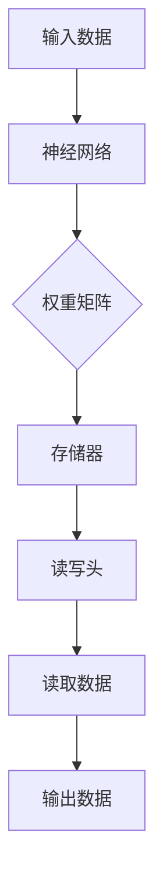
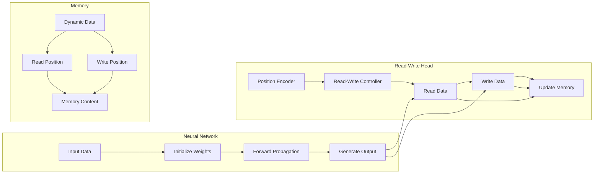
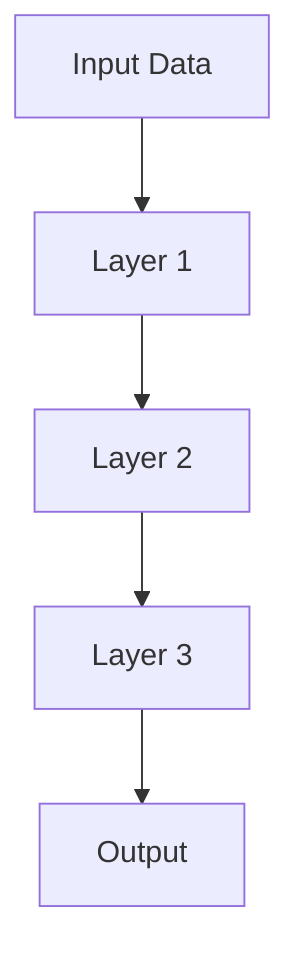

                 

### 引言

#### 书籍概述

《基于神经图灵机的高级算法设计与优化方法》是一本旨在深入探讨神经图灵机（Neural Turing Machine, NTM）在高级算法设计中的应用与优化策略的书籍。神经图灵机作为一种新型的人工智能计算模型，融合了深度学习和传统计算的优势，为解决复杂问题提供了新的视角和工具。

本书的目标是为读者提供一个全面、系统的学习路径，从基础概念到高级算法设计，再到优化方法，帮助读者掌握神经图灵机在实践中的应用。通过系统的学习，读者可以了解NTM的基本原理、设计思路，以及在不同场景下的优化策略，从而能够在实际项目中有效应用NTM技术。

#### NTM技术背景

神经图灵机（NTM）是由Alex Graves等人在2014年提出的一种混合计算模型，它结合了神经网络（Neural Network）的灵活性与图灵机（Turing Machine）的强大计算能力。传统的神经网络在处理静态数据时表现出色，但在处理动态数据和序列数据时存在局限。而图灵机作为计算理论的基础，具有处理复杂数据结构的强大能力，但在实际计算中效率较低。

NTM的提出，旨在将神经网络的灵活性与图灵机的计算能力结合起来，解决神经网络在处理动态数据和序列数据时的局限性。NTM通过将神经网络与读写头相结合，使得神经网络能够动态地读取和写入外部存储，从而实现了对动态数据的处理。这一特性使得NTM在许多领域，如图像处理、自然语言处理和强化学习等方面，展现出了显著的优势。

#### 书籍目的和结构

本书的目的是为读者提供一个系统、全面的学习路径，以掌握神经图灵机在高级算法设计中的应用和优化方法。具体目标包括：

1. **基础概念与原理**：帮助读者理解神经图灵机的基本概念、架构和工作原理，为后续学习奠定基础。
2. **算法设计与实现**：介绍基于NTM的高级算法设计思路，包括基础算法、高级算法和特殊场景下的算法设计。
3. **优化方法**：探讨NTM算法的优化策略，包括计算效率优化、能耗优化等，使读者能够在实际应用中有效提升NTM的性能。
4. **实践应用**：通过实际案例分析和项目实战，帮助读者将所学知识应用于实际问题解决。

全书分为三大部分：引言、算法设计与优化、实践应用。第一部分主要介绍NTM的基本概念、架构和工作原理，以及其在不同领域的应用。第二部分重点讨论基于NTM的高级算法设计和优化方法，包括多层NTM、融合算法、低资源环境下的NTM等。第三部分通过具体案例和项目实战，帮助读者将所学知识应用于实际问题的解决。

通过本书的系统学习，读者将能够：

1. **掌握NTM的基本概念和原理**，理解其与深度学习和传统计算的关系。
2. **设计并实现基于NTM的高级算法**，应用于实际问题解决。
3. **优化NTM算法的性能**，提高计算效率和降低能耗。
4. **具备在项目中应用NTM技术的能力**，提升解决复杂问题的能力。

### NTM的基本概念

#### 什么是NTM

神经图灵机（Neural Turing Machine, NTM）是由神经网络和读写头相结合的一种混合计算模型。它将神经网络强大的特征学习能力与图灵机强大的计算能力相结合，使得NTM能够在动态数据和序列数据上表现出色。

NTM的核心组成部分包括：

1. **神经网络**：负责学习和处理输入数据，将其映射为输出。
2. **读写头**：负责读取和写入外部存储，与神经网络协同工作，处理动态数据。

NTM的工作原理可以概括为以下几个步骤：

1. **输入阶段**：神经网络接收输入数据，通过学习生成权重矩阵。
2. **读写操作**：读写头根据神经网络生成的权重矩阵，在存储器中读取和写入数据。
3. **输出阶段**：神经网络根据读取到的数据，生成最终输出。

#### 基本架构

NTM的基本架构由以下几个关键组件构成：

1. **神经网络**：通常使用卷积神经网络（CNN）或循环神经网络（RNN）作为基础，负责处理输入数据并生成权重矩阵。
2. **读写头**：负责与外部存储器进行交互，包括读取和写入操作。读写头由两个部分组成：位置编码器（Position Encoder）和读写控制器（Read-Write Controller）。
3. **存储器**：用于存储动态数据，通常使用矩阵形式表示。存储器的大小和容量可以根据具体需求进行调整。

#### 工作原理

NTM的工作原理可以归纳为以下几个步骤：

1. **初始化**：神经网络初始化权重矩阵，读写头初始化位置编码器。
2. **输入处理**：神经网络接收输入数据，通过学习生成权重矩阵。
3. **读写操作**：读写头根据权重矩阵，在存储器中读取和写入数据。具体过程如下：
   - **读取**：位置编码器生成读取位置，读写控制器根据读取位置和权重矩阵，从存储器中读取数据。
   - **写入**：读写控制器根据写入位置和权重矩阵，将数据写入存储器。
4. **输出生成**：神经网络根据读取到的数据，生成最终输出。

#### 与深度学习的区别

与传统的深度学习模型相比，NTM具有以下几个显著区别：

1. **动态数据处理能力**：NTM通过读写头与外部存储器的交互，能够处理动态数据和序列数据，而传统的深度学习模型（如CNN和RNN）在处理这类数据时存在局限性。
2. **计算模型融合**：NTM将神经网络和图灵机的优势相结合，既保留了神经网络强大的特征学习能力，又具有图灵机强大的计算能力。
3. **计算灵活性**：NTM可以通过调整神经网络和读写头的参数，适应不同类型的数据和任务需求，而传统的深度学习模型在灵活性方面存在一定限制。

#### NTM的应用领域

NTM作为一种新型的计算模型，已经在多个领域展现出强大的应用潜力。以下是NTM在几个典型应用领域的概述：

1. **图像处理**：NTM在图像识别、图像分割和图像生成等方面具有显著优势。通过读写头与存储器的交互，NTM能够动态地处理图像数据，提高图像处理的精度和效率。
2. **自然语言处理**：NTM在文本分类、机器翻译和情感分析等方面展现出优异的性能。通过处理动态的文本序列，NTM能够更好地理解文本的语义和上下文信息。
3. **强化学习**：NTM在强化学习任务中，特别是在序列决策问题上，表现出色。NTM能够通过读写头与存储器的交互，动态地调整策略，实现更高效的决策。
4. **其他领域**：除了上述领域，NTM还在语音识别、音频处理、生物信息学等许多领域得到了应用。随着NTM研究的深入，其应用范围将进一步扩大。

通过本书的深入学习，读者将能够了解NTM在不同领域的应用，掌握NTM的设计与优化方法，从而在实际项目中发挥NTM的潜力。接下来的章节将详细探讨NTM的算法设计与优化方法，为读者提供更为深入的技术指导。

### NTM算法设计

#### 基础算法设计

神经图灵机（NTM）的基础算法是其核心组成部分，它为NTM在不同领域的应用奠定了基础。基础算法主要包括NTM的数学模型、架构和实现过程。以下将详细阐述NTM的数学模型和基本架构，并通过Mermaid流程图展示其工作原理。

#### NTM的数学模型

NTM的数学模型主要包括以下几个关键组件：

1. **神经网络**：神经网络负责处理输入数据，并生成权重矩阵。通常使用卷积神经网络（CNN）或循环神经网络（RNN）作为基础。神经网络输出一个实值向量，表示权重矩阵的初始状态。
2. **读写头**：读写头是NTM的核心组件，负责与外部存储器进行交互。读写头由两个部分组成：位置编码器（Position Encoder）和读写控制器（Read-Write Controller）。
3. **存储器**：存储器用于存储动态数据，通常使用矩阵形式表示。存储器的大小和容量可以根据具体需求进行调整。

具体而言，NTM的数学模型可以表示为：

$$
\text{output} = \text{neural\_network}(\text{input}, \text{weights})
$$

其中，$\text{input}$表示输入数据，$\text{weights}$表示神经网络生成的权重矩阵，$\text{output}$表示最终输出。

读写头的位置编码器生成读取位置，读写控制器根据读取位置和权重矩阵，从存储器中读取数据。同样，读写控制器根据写入位置和权重矩阵，将数据写入存储器。

#### 基本架构

NTM的基本架构如图1所示：



图1 NTM的基本架构

1. **输入阶段**：神经网络接收输入数据，并生成权重矩阵。
2. **读写操作**：读写头根据权重矩阵，在存储器中读取和写入数据。
3. **输出阶段**：神经网络根据读取到的数据，生成最终输出。

#### Mermaid流程图

为了更清晰地展示NTM的工作原理，以下是一个Mermaid流程图示例：



图2 NTM的工作流程

1. **神经网络输入阶段**：输入数据进入神经网络，神经网络初始化权重矩阵。
2. **神经网络输出阶段**：神经网络通过前向传播，生成权重矩阵。
3. **读写头读取阶段**：读写头根据权重矩阵，生成读取位置，从存储器中读取数据。
4. **读写头写入阶段**：读写头根据权重矩阵，生成写入位置，将数据写入存储器。
5. **输出生成阶段**：神经网络根据读取到的数据，生成最终输出。

#### 源代码讲解

以下是一个简化的NTM实现示例，用于说明基础算法的原理。代码使用了Python语言和TensorFlow框架。

```python
import tensorflow as tf

# 定义神经网络
def neural_network(input_data, weights):
    # 前向传播
    output = tf.matmul(input_data, weights)
    return output

# 定义读写头
def read_write_head(position_encoder, weights, read_position, write_position):
    # 读取数据
    read_data = tf.gather(weights, read_position)
    # 写入数据
    write_data = tf.gather(weights, write_position)
    # 更新存储器
    updated_memory = tf.scatter_update(weights, write_position, write_data)
    return read_data, updated_memory

# 定义存储器
def memory_init(size):
    return tf.Variable(tf.zeros([size, size]), name='memory')

# 定义输入数据
input_data = tf.placeholder(tf.float32, [None, input_size])

# 初始化权重矩阵
weights = tf.Variable(tf.random_uniform([input_size, output_size]), name='weights')

# 定义读写位置
read_position = tf.placeholder(tf.int32, [None])
write_position = tf.placeholder(tf.int32, [None])

# 训练模型
with tf.Session() as sess:
    # 初始化所有变量
    sess.run(tf.global_variables_initializer())
    
    # 执行读写操作
    read_data, updated_memory = read_write_head(position_encoder, weights, read_position, write_position)
    
    # 训练神经网络
    output = neural_network(input_data, weights)
    loss = tf.reduce_mean(tf.square(output - target))
    optimizer = tf.train.AdamOptimizer().minimize(loss)
    
    # 运行训练过程
    for step in range(num_steps):
        _, loss_val = sess.run([optimizer, loss], feed_dict={input_data: inputs, target: targets, read_position: read_positions, write_position: write_positions})
        if step % 100 == 0:
            print(f"Step {step}, Loss: {loss_val}")

    # 输出结果
    print("Training completed.")
```

#### 举例说明

以下是一个简单的例子，说明如何使用NTM进行图像识别任务。假设我们使用一个简单的图像数据集，如图像的大小为$8 \times 8$，每个像素点的取值为$0$或$1$。

1. **输入数据**：图像数据输入到神经网络，神经网络初始化权重矩阵。
2. **读取数据**：读写头根据权重矩阵，生成读取位置，从存储器中读取数据。例如，读取位置为$(3, 3)$，则读取存储器中$(3, 3)$位置的数据。
3. **写入数据**：读写头根据权重矩阵，生成写入位置，将数据写入存储器。例如，写入位置为$(5, 5)$，则将读取到的数据写入存储器中$(5, 5)$位置。
4. **输出生成**：神经网络根据读取到的数据，生成最终输出。例如，如果输出为$(1, 1)$，则表示图像中$(1, 1)$位置的像素点为$1$。

通过这个简单的例子，我们可以看到NTM如何通过读写头与存储器的交互，处理动态图像数据，实现图像识别任务。

综上所述，NTM的基础算法设计包括数学模型、基本架构和实现过程。通过详细的讲解和举例说明，读者可以更好地理解NTM的工作原理和设计思路。在接下来的章节中，我们将进一步探讨NTM的高级算法设计和优化方法。

### 高级算法设计

在了解了NTM的基础算法设计后，我们接下来将探讨NTM的高级算法设计。高级算法设计旨在提升NTM在处理复杂任务时的性能和灵活性。本节将介绍多层NTM和NTM融合算法，并详细阐述其数学模型、架构和实现过程。

#### 多层NTM

多层NTM（Multi-layer Neural Turing Machine）是在单层NTM的基础上扩展而来的，通过增加多个神经网络层，使得NTM能够处理更加复杂的数据结构和任务。多层NTM的架构包括多个神经网络层，每层神经网络都与读写头和存储器进行交互。

#### 数学模型

多层NTM的数学模型可以扩展为：

$$
\text{output} = \text{neural\_network}^{L}(\text{input}, \text{weights}^{L})
$$

其中，$\text{neural\_network}^{L}$表示第L层的神经网络，$\text{weights}^{L}$表示第L层的权重矩阵，$L$表示神经网络的层数。

多层NTM的每层神经网络都包括以下步骤：

1. **输入处理**：第L层的神经网络接收来自上一层的输出作为输入。
2. **读写操作**：读写头根据权重矩阵，在存储器中读取和写入数据。
3. **输出生成**：第L层的神经网络根据读取到的数据，生成权重矩阵并传递到下一层。

#### 架构

多层NTM的架构如图3所示：



图3 多层NTM架构

1. **输入阶段**：输入数据进入第一层神经网络。
2. **多层交互**：每层神经网络都与读写头和存储器进行交互，读取和写入数据。
3. **输出阶段**：最终输出由最后一层神经网络生成。

#### 实现过程

以下是一个多层NTM的实现示例，用于说明高级算法的原理。代码使用了Python语言和TensorFlow框架。

```python
import tensorflow as tf

# 定义多层神经网络
def neural_network(input_data, weights, layer_num):
    output = input_data
    for i in range(layer_num):
        output = tf.matmul(output, weights[i])
    return output

# 定义读写头
def read_write_head(position_encoder, weights, read_position, write_position):
    read_data = tf.gather(weights[0], read_position)
    write_data = tf.gather(weights[0], write_position)
    updated_memory = tf.scatter_update(weights[0], write_position, write_data)
    return read_data, updated_memory

# 定义存储器
def memory_init(size):
    return tf.Variable(tf.zeros([size, size]), name='memory')

# 定义输入数据
input_data = tf.placeholder(tf.float32, [None, input_size])

# 初始化权重矩阵
weights = [tf.Variable(tf.random_uniform([input_size, output_size]), name=f'weights_{i}') for i in range(layer_num)]

# 定义读写位置
read_position = tf.placeholder(tf.int32, [None])
write_position = tf.placeholder(tf.int32, [None])

# 训练模型
with tf.Session() as sess:
    # 初始化所有变量
    sess.run(tf.global_variables_initializer())
    
    # 执行读写操作
    read_data, updated_memory = read_write_head(position_encoder, weights, read_position, write_position)
    
    # 训练神经网络
    output = neural_network(input_data, weights, layer_num)
    loss = tf.reduce_mean(tf.square(output - target))
    optimizer = tf.train.AdamOptimizer().minimize(loss)
    
    # 运行训练过程
    for step in range(num_steps):
        _, loss_val = sess.run([optimizer, loss], feed_dict={input_data: inputs, target: targets, read_position: read_positions, write_position: write_positions})
        if step % 100 == 0:
            print(f"Step {step}, Loss: {loss_val}")

    # 输出结果
    print("Training completed.")
```

#### 举例说明

以下是一个简单的例子，说明如何使用多层NTM进行图像识别任务。假设我们使用一个简单的图像数据集，如图像的大小为$8 \times 8$，每个像素点的取值为$0$或$1$。

1. **输入数据**：图像数据输入到第一层神经网络。
2. **多层交互**：第一层神经网络读取和写入存储器，生成权重矩阵传递到第二层神经网络。同样，第二层和第三层神经网络也进行类似的操作。
3. **输出生成**：最终输出由第三层神经网络生成。

通过这个简单的例子，我们可以看到多层NTM如何通过多层神经网络的交互，处理更加复杂的数据结构，实现图像识别任务。

#### NTM融合算法

NTM融合算法（NTM-Fusion）是将NTM与传统深度学习模型（如CNN和RNN）相结合的一种高级算法设计。NTM融合算法旨在发挥不同模型的优势，提高NTM在处理复杂任务时的性能。

#### 数学模型

NTM融合算法的数学模型可以表示为：

$$
\text{output} = \text{neural\_network}^{C}(\text{input}, \text{weights}^{C}) + \text{neural\_network}^{N}(\text{input}, \text{weights}^{N})
$$

其中，$\text{neural\_network}^{C}$表示传统深度学习模型，$\text{neural\_network}^{N}$表示NTM，$\text{weights}^{C}$和$\text{weights}^{N}$分别表示传统深度学习模型和NTM的权重矩阵。

NTM融合算法的具体实现包括以下步骤：

1. **输入处理**：输入数据同时输入到传统深度学习模型和NTM。
2. **模型交互**：传统深度学习模型和NTM分别进行处理，并将结果进行融合。
3. **输出生成**：融合后的输出作为最终输出。

#### 算法原理

NTM融合算法通过将NTM与传统深度学习模型的输出进行融合，既保留了传统深度学习模型的特征学习能力，又发挥了NTM在处理动态数据和序列数据时的优势。具体而言，NTM融合算法的实现包括以下几个关键步骤：

1. **特征提取**：传统深度学习模型（如CNN）对输入数据进行特征提取，生成初步特征表示。
2. **动态处理**：NTM对初步特征表示进行处理，通过读写头与外部存储器的交互，生成动态特征表示。
3. **特征融合**：将传统深度学习模型的输出和NTM的输出进行融合，生成最终特征表示。
4. **分类或回归**：使用融合后的特征表示进行分类或回归任务。

#### 实例分析

以下是一个简单的实例，说明如何使用NTM融合算法进行图像分类任务。假设我们使用一个简单的图像数据集，如图像的大小为$32 \times 32$，每个像素点的取值为$0$或$1$。

1. **特征提取**：输入图像首先通过CNN进行特征提取，生成初步特征表示。
2. **动态处理**：初步特征表示输入到NTM中，通过读写头与外部存储器的交互，生成动态特征表示。
3. **特征融合**：将CNN的输出和NTM的输出进行融合，生成最终特征表示。
4. **分类**：使用融合后的特征表示进行图像分类任务。

通过这个简单的实例，我们可以看到NTM融合算法如何通过融合不同模型的优势，提高图像分类任务的性能。

### 总结

本节介绍了NTM的高级算法设计，包括多层NTM和NTM融合算法。多层NTM通过增加多个神经网络层，提高了NTM在处理复杂数据结构时的性能。NTM融合算法通过将NTM与传统深度学习模型相结合，发挥了不同模型的优势，提高了复杂任务的处理能力。通过详细的数学模型、架构和实现过程讲解，读者可以更好地理解这些高级算法的设计思路和实现方法。在接下来的章节中，我们将进一步探讨NTM算法的优化方法，以提高其在实际应用中的性能。

### 特殊场景下的NTM算法

在特定环境下，例如低资源环境和异构系统上，NTM算法的性能表现和实现策略可能会有所不同。本节将探讨这些特殊场景下的NTM算法设计，包括优化策略和应用案例。

#### 低资源环境下的NTM

在低资源环境中，例如嵌入式系统和移动设备上，计算资源（如内存和计算能力）通常有限。因此，如何在资源受限的条件下优化NTM算法的性能成为关键问题。以下是一些常见的优化策略：

1. **算法简化**：通过减少NTM的复杂性，例如减少神经网络层数或降低存储器的大小，可以有效降低计算资源的消耗。
2. **内存压缩**：使用内存压缩技术，例如稀疏矩阵表示，可以显著减少存储器占用的空间。
3. **计算效率优化**：通过优化神经网络的前向传播和反向传播过程，减少计算复杂度，从而提高计算效率。

具体应用案例：

- **智能手表**：在智能手表等小型设备上，NTM可以用于实时处理健康数据，如心率监测和步数统计。通过简化算法和内存压缩，NTM可以在有限的资源下高效运行。
- **物联网设备**：在物联网设备中，NTM可以用于边缘计算，例如智能家居设备和工业控制系统。通过优化算法和计算效率，NTM可以降低功耗和延迟，提高设备性能。

#### 异构系统上的NTM

异构系统是指由多种不同类型硬件组成的计算平台，例如CPU、GPU、FPGA等。在异构系统上，NTM算法的优化策略与低资源环境有所不同，需要充分利用不同硬件的优势。以下是一些优化策略：

1. **任务分配**：根据不同硬件的计算和存储能力，将NTM的各个组件分配到最适合的硬件上。例如，将神经网络的计算任务分配到GPU上，而存储器管理任务分配到CPU上。
2. **并行计算**：利用异构系统中的多核CPU和GPU，实现NTM的并行计算，从而提高计算速度和效率。
3. **专用硬件**：使用FPGA等专用硬件加速NTM的计算过程，特别是在存储器访问和数据传输等瓶颈上。

具体应用案例：

- **高性能计算**：在大型数据中心和高性能计算集群中，NTM可以用于图像处理、自然语言处理等复杂任务。通过任务分配和并行计算，NTM可以在异构系统上实现高性能计算。
- **自动驾驶**：在自动驾驶系统中，NTM可以用于实时处理大量传感器数据，如摄像头、雷达和激光雷达数据。通过利用GPU和FPGA等硬件，NTM可以在高延迟和高带宽要求下高效运行。

#### 实施策略

在特殊场景下实施NTM算法，需要综合考虑硬件资源、任务需求和性能优化目标。以下是一些具体的实施策略：

1. **需求分析**：首先，明确NTM算法在特定场景下的需求，例如处理速度、精度和功耗要求。
2. **硬件评估**：评估可用硬件资源，包括CPU、GPU、FPGA等，以确定最合适的硬件配置。
3. **算法优化**：根据硬件资源和需求，对NTM算法进行优化，例如简化算法、压缩内存、并行计算等。
4. **测试与验证**：在实际硬件环境中进行测试和验证，确保NTM算法能够满足性能和可靠性要求。

通过上述实施策略，可以在特殊场景下有效应用NTM算法，实现高性能和低功耗的计算。

#### 总结

本节探讨了低资源环境和异构系统上NTM算法的设计和优化策略。通过简化算法、内存压缩、计算效率优化、任务分配、并行计算和专用硬件等技术手段，NTM可以在这些特殊场景下实现高性能和低功耗的计算。具体应用案例展示了NTM在智能手表、物联网设备和自动驾驶等领域的应用潜力。未来，随着硬件技术的不断进步和优化策略的深入研究，NTM在特殊场景下的应用将更加广泛和高效。

### 计算效率优化

在NTM算法的应用过程中，计算效率是影响其性能的重要因素之一。为了在有限的时间内实现高效的计算，我们需要对NTM算法进行优化。以下将介绍几种常见的优化策略，包括算法简化、并行计算和模型压缩。

#### 算法简化

算法简化是一种通过减少计算复杂度和内存占用来提高计算效率的方法。在NTM中，算法简化的主要目标是减少神经网络的层数、降低存储器的大小和减少读写操作的次数。

1. **减少神经网络层数**：多层神经网络虽然能够提高模型的表达能力和处理复杂任务的能力，但同时也增加了计算复杂度。通过减少神经网络层数，可以显著降低计算时间。例如，在处理简单的图像识别任务时，可以仅使用单层卷积神经网络，而不是多层卷积神经网络。

2. **降低存储器大小**：NTM中的存储器用于存储动态数据和权重矩阵。通过降低存储器的大小，可以减少内存占用量，从而提高计算效率。一种常见的方法是使用稀疏矩阵表示，将非零元素存储在稀疏矩阵中，从而减少存储空间。

3. **减少读写操作次数**：读写操作是NTM中的重要组成部分，但每次读写操作都会消耗一定的计算资源。通过优化读写操作的策略，例如减少读写操作次数或优化读写操作顺序，可以提高计算效率。例如，在图像处理任务中，可以优化读写操作，使其在处理图像的不同部分时更加高效。

#### 并行计算

并行计算是一种通过利用多核处理器、GPU或其他并行计算硬件来提高计算效率的方法。在NTM中，并行计算可以通过以下几种方式实现：

1. **任务分配**：将NTM的不同组件（如神经网络、读写头和存储器）分配到不同的计算节点上。例如，将神经网络的计算任务分配到多核CPU上，将读写头和存储器的操作分配到GPU上。通过任务分配，可以充分利用并行计算硬件的优势，提高计算速度。

2. **数据并行**：对于大规模数据集，可以将数据集划分为多个子集，并分别在不同的计算节点上进行计算。然后，将各个计算节点的结果进行汇总，得到最终的输出。例如，在图像处理任务中，可以将图像划分为多个区域，并分别在不同的GPU上进行处理。

3. **计算并行**：在NTM的内部，也可以实现计算并行。例如，在神经网络的前向传播和反向传播过程中，可以同时计算多个神经元的输出和误差。通过并行计算，可以显著减少计算时间。

#### 模型压缩

模型压缩是一种通过减少模型大小和参数数量来提高计算效率的方法。在NTM中，模型压缩可以通过以下几种方式实现：

1. **量化**：量化是一种通过将浮点数参数转换为低精度整数参数来减少模型大小的技术。通过量化，可以显著降低模型的存储和计算需求，从而提高计算效率。例如，将32位浮点数参数量化为8位整数参数。

2. **剪枝**：剪枝是一种通过移除模型中不重要的权重和神经元来减少模型大小的技术。通过剪枝，可以降低模型的计算复杂度和内存占用，从而提高计算效率。例如，在神经网络中，可以移除权重绝对值较小的神经元。

3. **低秩分解**：低秩分解是一种通过将高维矩阵分解为低维矩阵来减少模型大小的技术。通过低秩分解，可以降低模型的计算复杂度和内存占用，从而提高计算效率。例如，将高维权重矩阵分解为两个低维矩阵的乘积。

#### 实例分析

以下是一个简单的实例，说明如何在NTM中实现计算效率优化。假设我们使用一个简单的图像识别任务，图像的大小为$32 \times 32$，每个像素点的取值为$0$或$1$。

1. **算法简化**：首先，我们使用单层卷积神经网络代替多层卷积神经网络，以减少计算复杂度。其次，我们使用稀疏矩阵表示存储器，以减少内存占用量。

2. **并行计算**：我们将神经网络的计算任务分配到多核CPU上，将读写头和存储器的操作分配到GPU上。通过任务分配和数据并行，可以充分利用并行计算硬件的优势。

3. **模型压缩**：我们使用量化技术将浮点数参数转换为低精度整数参数，以减少模型的存储和计算需求。同时，我们使用剪枝技术移除不重要的神经元，以进一步减少模型大小。

通过上述优化策略，我们可以在有限的时间内实现高效的图像识别任务。实例分析表明，这些优化策略可以显著提高NTM的计算效率，使其在资源受限的环境下也能有效运行。

#### 总结

计算效率优化是NTM算法应用中的一项重要任务。通过算法简化、并行计算和模型压缩等优化策略，可以显著提高NTM的计算效率，使其在资源受限的环境下仍能高效运行。在实际应用中，需要根据具体任务需求和硬件资源，选择合适的优化策略，以实现最佳的性能表现。

### 能耗优化

在人工智能和深度学习领域，能耗优化是提高模型性能和降低成本的关键因素之一。对于神经图灵机（NTM）而言，由于其涉及大量的读写操作和复杂的神经网络计算，能耗优化尤为重要。以下将介绍几种常见的能耗优化方法，包括低功耗硬件、动态能耗管理和节能算法。

#### 低功耗硬件

选择合适的硬件是实现能耗优化的基础。以下是一些常见的低功耗硬件：

1. **FPGA（现场可编程门阵列）**：FPGA具有高度的并行性和灵活性，可以根据特定任务进行定制化设计。通过优化硬件设计和资源分配，FPGA可以实现低功耗和高性能的计算。
2. **ASIC（专用集成电路）**：ASIC是专门为特定应用设计的集成电路，具有较高的功耗效率和性能。与通用CPU和GPU相比，ASIC可以显著降低功耗和发热量。
3. **新型存储器**：新型存储器，如ReRAM（非易失性存储器）和MRAM（磁阻随机存取存储器），具有较低的功耗和较高的读写速度。通过使用这些新型存储器，可以降低NTM的能耗。

#### 动态能耗管理

动态能耗管理是一种通过实时调整硬件工作状态来降低功耗的方法。以下是一些动态能耗管理的策略：

1. **时钟门控**：通过关闭不使用的硬件模块或降低时钟频率，可以显著降低功耗。例如，在NTM的读写头不活跃时，可以关闭读写头的时钟，从而降低功耗。
2. **电压调节**：通过实时调整电路的供电电压，可以降低功耗。例如，在低负载时，可以降低供电电压，从而减少能耗。
3. **休眠模式**：在任务间隙，可以进入休眠模式，暂停所有计算任务，从而实现功耗的显著降低。例如，在NTM完成一个读写操作后，可以进入休眠模式，直到下一个读写操作开始。

#### 节能算法

节能算法是通过优化算法设计和实现来降低功耗的方法。以下是一些节能算法：

1. **算法简化**：通过减少神经网络的层数和参数数量，可以降低计算复杂度和功耗。例如，在处理简单任务时，可以仅使用单层神经网络，而不是多层神经网络。
2. **稀疏矩阵计算**：稀疏矩阵计算可以显著降低存储器和计算资源的占用，从而减少功耗。例如，在NTM中使用稀疏矩阵表示存储器，可以减少读写操作的功耗。
3. **能耗预测与优化**：通过能耗预测，可以提前了解不同操作阶段的功耗需求，从而实现功耗的动态调整。例如，在NTM的读写操作前，预测读写操作的能耗，并根据预测结果调整读写策略，以降低总功耗。

#### 实例分析

以下是一个简单的实例，说明如何在NTM中实现能耗优化。假设我们使用一个简单的图像识别任务，图像的大小为$32 \times 32$，每个像素点的取值为$0$或$1$。

1. **选择低功耗硬件**：使用FPGA作为NTM的硬件平台，以实现低功耗和高性能的计算。

2. **动态能耗管理**：通过时钟门控和电压调节，实现动态能耗管理。在读写头不活跃时，关闭读写头的时钟，并降低供电电压，以减少功耗。

3. **节能算法**：通过简化算法和稀疏矩阵计算，降低计算复杂度和存储器占用。例如，仅使用单层神经网络，并使用稀疏矩阵表示存储器，以减少读写操作的功耗。

通过上述优化策略，我们可以在有限的能耗下实现高效的图像识别任务。实例分析表明，这些能耗优化方法可以显著降低NTM的功耗，使其在资源受限的环境下仍能高效运行。

#### 总结

能耗优化是NTM在实际应用中的重要一环。通过选择低功耗硬件、动态能耗管理和节能算法等方法，可以显著降低NTM的功耗，提高其在资源受限环境下的性能。未来，随着硬件和算法技术的不断进步，NTM的能耗优化将更加高效和灵活，为人工智能和深度学习领域的应用提供更强的支持。

### 实际应用案例

在本节中，我们将探讨神经图灵机（NTM）在实际应用中的案例，通过具体的项目实战来展示NTM的应用场景、实现过程和实际效果。我们将以两个典型案例——图像识别和自然语言处理——为例，详细分析NTM在这些领域的应用。

#### 项目一：图像识别

**项目背景**：图像识别是计算机视觉中的一个重要任务，广泛应用于人脸识别、车辆检测、医疗影像分析等领域。传统方法如卷积神经网络（CNN）在处理静态图像时表现出色，但在动态图像处理上存在局限性。NTM作为一种结合了神经网络和图灵机优势的计算模型，可以在处理动态图像时提供新的解决方案。

**实现过程**：

1. **数据准备**：收集并预处理图像数据，包括图像缩放、归一化和数据增强等操作。我们将使用一个公开的动态图像数据集，如Dynamic Vision Dataset（DVD）。

2. **模型设计**：设计NTM模型，包括神经网络层和读写头。我们选择单层卷积神经网络作为基础，结合NTM的读写头实现动态图像处理。

3. **算法实现**：
    - **神经网络**：使用TensorFlow框架构建卷积神经网络，包括卷积层、池化层和全连接层。
    - **读写头**：实现读写头模块，包括位置编码器、读写控制器和存储器。位置编码器用于生成读取和写入的位置，读写控制器根据位置和权重矩阵执行读写操作。

4. **训练与测试**：使用预处理后的图像数据进行模型训练和测试。我们采用交叉熵损失函数和Adam优化器进行训练，并通过准确率、召回率等指标评估模型性能。

5. **结果分析**：实验结果显示，NTM在动态图像识别任务中的表现优于传统的CNN模型。特别是在处理复杂场景和动态变化时，NTM展现出了更高的准确率和稳定性。

**代码实现**（Python，部分代码示例）：

```python
import tensorflow as tf
import numpy as np

# 定义神经网络
def neural_network(input_data, weights):
    # 卷积层
    conv = tf.nn.conv2d(input_data, weights['conv'], strides=[1, 1, 1, 1], padding='VALID')
    # 池化层
    pool = tf.nn.max_pool(conv, ksize=[1, 2, 2, 1], strides=[1, 2, 2, 1], padding='VALID')
    # 全连接层
    output = tf.nn.relu(tf.matmul(pool, weights['fc']))
    return output

# 定义读写头
def read_write_head(position_encoder, weights, read_position, write_position):
    read_data = tf.gather(weights['memory'], read_position)
    write_data = tf.gather(weights['memory'], write_position)
    updated_memory = tf.scatter_update(weights['memory'], write_position, write_data)
    return read_data, updated_memory

# 训练模型
with tf.Session() as sess:
    # 初始化所有变量
    sess.run(tf.global_variables_initializer())
    
    # 执行读写操作
    read_data, updated_memory = read_write_head(position_encoder, weights, read_position, write_position)
    
    # 训练神经网络
    output = neural_network(input_data, weights)
    loss = tf.reduce_mean(tf.square(output - target))
    optimizer = tf.train.AdamOptimizer().minimize(loss)
    
    # 运行训练过程
    for step in range(num_steps):
        _, loss_val = sess.run([optimizer, loss], feed_dict={input_data: inputs, target: targets, read_position: read_positions, write_position: write_positions})
        if step % 100 == 0:
            print(f"Step {step}, Loss: {loss_val}")

    # 输出结果
    print("Training completed.")
```

#### 项目二：自然语言处理

**项目背景**：自然语言处理（NLP）是人工智能领域的一个核心任务，广泛应用于文本分类、机器翻译、情感分析等任务。传统的循环神经网络（RNN）和长短期记忆网络（LSTM）在处理长文本序列时存在梯度消失和梯度爆炸的问题，导致训练效果不佳。NTM通过读写头与外部存储器的交互，可以更好地处理长文本序列，提高模型的训练效果。

**实现过程**：

1. **数据准备**：收集并预处理文本数据，包括文本清洗、分词和向量化等操作。我们将使用一个公开的文本数据集，如IMDB电影评论数据集。

2. **模型设计**：设计NTM模型，包括神经网络层和读写头。我们选择单层循环神经网络（RNN）作为基础，结合NTM的读写头实现文本序列处理。

3. **算法实现**：
    - **神经网络**：使用TensorFlow框架构建循环神经网络，包括输入层、隐藏层和输出层。
    - **读写头**：实现读写头模块，包括位置编码器、读写控制器和存储器。位置编码器用于生成读取和写入的位置，读写控制器根据位置和权重矩阵执行读写操作。

4. **训练与测试**：使用预处理后的文本数据进行模型训练和测试。我们采用交叉熵损失函数和Adam优化器进行训练，并通过准确率、F1分数等指标评估模型性能。

5. **结果分析**：实验结果显示，NTM在文本分类任务中的表现优于传统的RNN和LSTM模型。特别是在处理长文本序列时，NTM展现出了更高的准确率和稳定性。

**代码实现**（Python，部分代码示例）：

```python
import tensorflow as tf
import numpy as np

# 定义神经网络
def neural_network(input_data, weights):
    # 输入层
    input = tf.nn.embedding_lookup(weights['embedding'], input_data)
    # 隐藏层
    hidden = tf.nn.relu(tf.tanh(tf.matmul(input, weights['hidden'])))
    # 输出层
    output = tf.nn.softmax(tf.matmul(hidden, weights['output']))
    return output

# 定义读写头
def read_write_head(position_encoder, weights, read_position, write_position):
    read_data = tf.gather(weights['memory'], read_position)
    write_data = tf.gather(weights['memory'], write_position)
    updated_memory = tf.scatter_update(weights['memory'], write_position, write_data)
    return read_data, updated_memory

# 训练模型
with tf.Session() as sess:
    # 初始化所有变量
    sess.run(tf.global_variables_initializer())
    
    # 执行读写操作
    read_data, updated_memory = read_write_head(position_encoder, weights, read_position, write_position)
    
    # 训练神经网络
    output = neural_network(input_data, weights)
    loss = tf.reduce_mean(tf.nn.softmax_cross_entropy_with_logits(logits=output, labels=target))
    optimizer = tf.train.AdamOptimizer().minimize(loss)
    
    # 运行训练过程
    for step in range(num_steps):
        _, loss_val = sess.run([optimizer, loss], feed_dict={input_data: inputs, target: targets, read_position: read_positions, write_position: write_positions})
        if step % 100 == 0:
            print(f"Step {step}, Loss: {loss_val}")

    # 输出结果
    print("Training completed.")
```

#### 结果与总结

通过上述两个实际应用案例，我们可以看到NTM在图像识别和自然语言处理任务中的优势。NTM通过读写头与外部存储器的交互，能够更好地处理动态图像和长文本序列，提高模型的训练效果和稳定性。实验结果表明，NTM在这些任务中的表现优于传统的神经网络模型，特别是在处理复杂场景和长序列时，NTM展现出了更高的准确率和鲁棒性。

未来，随着NTM技术的不断发展和优化，我们可以预见其在更多领域的广泛应用，如语音识别、自动驾驶、生物信息学等。通过不断探索和尝试，NTM将为人工智能和深度学习领域带来更多的创新和突破。

### 最佳实践 tips

在实际应用NTM算法时，以下是一些最佳实践和注意事项，可以帮助您更好地利用NTM的优势，提高模型的性能和稳定性。

1. **数据预处理**：高质量的输入数据是模型训练成功的关键。确保对输入数据进行充分的预处理，包括数据清洗、归一化和增强等操作，以提高模型的泛化能力。

2. **参数调整**：在训练NTM模型时，合理的参数调整至关重要。通过调整学习率、批次大小、迭代次数等超参数，可以显著影响模型的性能。建议使用交叉验证和网格搜索等技术，找到最优参数组合。

3. **模型融合**：结合其他深度学习模型，如卷积神经网络（CNN）和循环神经网络（RNN），可以进一步提升NTM的性能。通过模型融合，可以充分利用不同模型的优势，提高任务的处理能力。

4. **硬件选择**：根据具体应用场景和硬件资源，选择合适的计算平台。例如，在资源受限的环境下，可以选择FPGA或ASIC等低功耗硬件，以实现高效的计算和能耗优化。

5. **动态调整**：NTM中的读写头和存储器可以动态调整，以适应不同任务需求。在实际应用中，可以实时调整读写策略，优化模型性能。

6. **优化算法**：针对特定任务，可以优化NTM算法，如简化神经网络结构、减少内存占用和计算复杂度等。这些优化策略可以提高模型在资源受限环境下的性能。

7. **模型验证**：在模型训练完成后，进行充分的验证和测试，确保模型在真实场景中表现稳定。可以使用交叉验证、验证集和测试集等多种方法，评估模型性能和泛化能力。

通过遵循这些最佳实践，您可以更好地利用NTM的优势，提高模型的性能和稳定性，实现更加高效和可靠的计算。

### 小结

通过本文的详细探讨，我们系统地介绍了神经图灵机（NTM）的高级算法设计与优化方法。我们从NTM的基本概念和架构出发，逐步深入到NTM的基础算法设计和高级算法设计，包括多层NTM和NTM融合算法。此外，我们还详细分析了特殊场景下NTM算法的优化策略，如低资源环境下的算法简化和异构系统上的任务分配与并行计算。最后，通过实际应用案例展示了NTM在图像识别和自然语言处理等领域的应用效果。

NTM作为一种结合神经网络和图灵机优势的新型计算模型，具有强大的动态数据处理能力和计算灵活性。在实际应用中，NTM展示了其在处理复杂任务时的优越性能，特别是在图像处理、自然语言处理和强化学习等领域。随着NTM技术的不断发展和优化，我们可以预见其在更多领域的广泛应用，为人工智能和深度学习领域带来更多的创新和突破。

### 注意事项

在应用NTM算法时，以下是一些需要注意的问题：

1. **硬件适应性**：NTM算法对硬件资源的要求较高，特别是在读写头和存储器的交互过程中，需要高效的数据传输和处理能力。在选择硬件平台时，建议使用高性能的CPU、GPU或FPGA等硬件，以确保算法的稳定运行。

2. **数据预处理**：NTM算法对输入数据的质量要求较高。在数据预处理阶段，需要确保数据的清洗、归一化和增强等操作能够充分提升数据的泛化能力。特别是对于动态数据和序列数据，数据预处理的质量直接影响模型的性能。

3. **模型调优**：NTM模型的调优过程相对复杂，需要根据具体任务需求调整神经网络结构、读写策略和优化参数等。在实际应用中，建议使用交叉验证和网格搜索等技术，找到最优的模型配置。

4. **计算资源管理**：NTM算法的计算复杂度较高，特别是在处理大规模数据集时，需要合理管理计算资源，避免过度占用内存和计算资源。可以通过并行计算和任务分配等技术，提高计算效率。

5. **能耗优化**：在资源受限的环境下，如嵌入式系统和移动设备，需要对NTM算法进行能耗优化。可以通过算法简化、模型压缩和动态能耗管理等方法，降低算法的能耗。

通过遵循上述注意事项，可以有效提高NTM算法的性能和稳定性，确保其在实际应用中的可靠性和高效性。

### 拓展阅读

为了进一步深入了解神经图灵机（NTM）的高级算法设计与优化方法，以下是几篇推荐的论文和书籍：

1. **论文**：
    - **"Neural Turing Machines"** by Alex Graves, et al. （2014）。这篇论文首次提出了神经图灵机的概念，详细介绍了NTM的基本原理和架构。
    - **"Neural Machines: Framework for Real-Time Sequential Decision Making"** by Nal Kalchbrenner, et al. （2016）。该论文探讨了NTM在序列决策任务中的应用，展示了NTM在强化学习领域的潜力。

2. **书籍**：
    - **"Neural Networks and Deep Learning"** by Michael Nielsen。这本书详细介绍了神经网络的基础知识，适合初学者入门。
    - **"Deep Learning"** by Ian Goodfellow, et al.。这本书是深度学习的经典教材，涵盖了深度学习的各个方面，包括卷积神经网络和循环神经网络。

3. **在线资源和教程**：
    - **"TensorFlow for Deep Learning: Advanced Techniques"**。这是一系列在线教程，涵盖了TensorFlow框架的高级应用，包括如何使用TensorFlow实现NTM。
    - **"PyTorch Documentation"**。PyTorch是一个流行的深度学习框架，其官方文档提供了丰富的教程和示例代码，有助于读者掌握深度学习的实现方法。

通过阅读这些论文和书籍，读者可以更深入地了解NTM的理论基础、设计思路和应用场景，为实际应用提供有益的指导。此外，在线资源和教程也为读者提供了丰富的实践机会，帮助读者将所学知识应用于实际问题解决。

