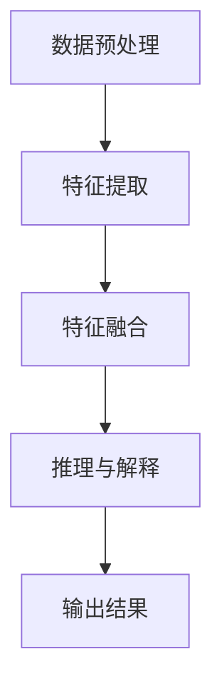
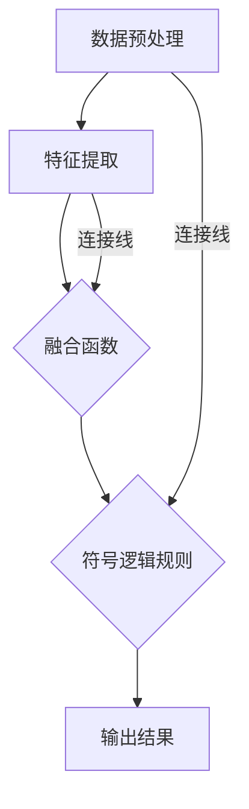
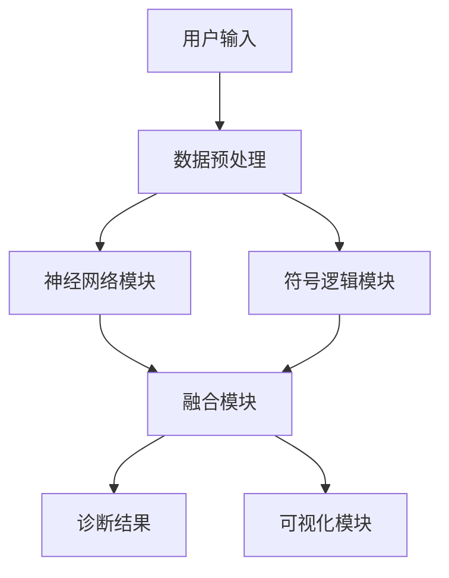

                 


### 1.1 问题背景

#### 1.1.1 医疗诊断中的AI挑战

随着医疗技术的进步，人工智能（AI）在医疗诊断中的应用日益广泛。然而，传统的AI系统，如深度学习模型，虽然在大规模数据处理和复杂模式识别方面表现出色，却面临一个显著的挑战：可解释性不足。医疗诊断是一个高度依赖医生经验和直觉的过程，医生不仅需要了解AI系统的诊断结果，还需要理解背后的原因。因此，可解释性成为医疗AI系统应用中的一个关键问题。

首先，传统AI系统，如深度神经网络，其内部工作原理复杂且非透明。尽管这些系统在处理大量医疗数据时表现出色，但它们难以解释每个预测是如何得出的。这种缺乏透明度的“黑盒”性质限制了医生对AI系统的信任，尤其是在涉及患者健康和生命安全的医疗诊断中。

其次，医疗领域的数据具有高维度、非线性和强噪声等特点。深度学习模型在这种复杂的数据环境中表现出色，但这也使得模型的预测难以解释。例如，一个深度学习模型可能会将某个病人的某些特征（如影像中的微小变化）与疾病联系起来，但医生无法得知这些特征是如何影响最终的诊断结果。

此外，医疗诊断的复杂性和多样性也增加了AI系统设计的难度。不同的疾病可能需要不同的诊断方法，而且同一个疾病在不同患者身上的表现也可能各不相同。传统AI系统往往需要大量的数据来训练，而且这些数据需要在特定条件下收集和标注。这种数据依赖性使得AI系统在应用时面临挑战，尤其是在数据稀缺或数据质量不高的情况下。

#### 1.1.2 可解释AI系统的需求

为了克服上述挑战，医疗诊断领域对可解释AI系统的需求日益增加。可解释AI（Explainable AI，XAI）是一种旨在提高AI系统透明度和可理解性的方法。其核心目标是使AI系统的决策过程对人类用户（尤其是医疗领域的专业人士）可解释和可信。

首先，可解释AI系统可以帮助医生更好地理解AI的诊断结果。通过可视化模型内部的工作流程和关键特征，医生可以更深入地了解诊断结果的成因。这不仅有助于建立医生对AI系统的信任，还可以帮助医生在必要时对AI的诊断结果进行验证和调整。

其次，可解释AI系统可以提高诊断的准确性和可靠性。通过对模型决策过程的详细分析，医生可以发现潜在的错误和偏差，并采取措施进行纠正。此外，可解释AI系统还可以帮助识别模型的局限性，从而指导数据收集和模型改进。

此外，可解释AI系统在医疗伦理和法规遵从方面也具有重要意义。在医疗领域，透明度和可信度是至关重要的。可解释AI系统可以帮助医疗机构遵守相关的法规和伦理标准，减少潜在的医疗纠纷和法律风险。

综上所述，医疗诊断领域对可解释AI系统的需求不仅源于技术层面的挑战，也是医疗伦理和法规要求的体现。因此，开发和应用可解释AI系统对于医疗诊断领域的发展具有重要意义。

### 1.2 可解释AI概述

#### 1.2.1 可解释AI的定义

可解释AI（Explainable AI，XAI）是一种旨在提高人工智能系统透明度和可理解性的方法。其核心目标是通过提供关于系统决策过程的详细解释，帮助人类用户（尤其是医疗领域的专业人士）理解和信任AI系统。

可解释AI通常涉及以下几个关键要素：

1. **透明度**：系统内部工作原理的透明度，使人类用户能够理解AI系统是如何做出决策的。
2. **可理解性**：AI系统的决策过程应以人类可以理解的方式进行呈现。
3. **可验证性**：用户能够验证AI系统的决策是否合理，并对其进行调整或纠正。
4. **可追溯性**：系统能够记录并回溯其决策过程，以便在需要时进行审查和分析。

可解释AI系统不仅关注模型内部的机制，还涉及如何将这种解释性呈现给用户。通常，这包括使用可视化工具、文字说明和逻辑推理等方式，使得复杂的AI决策过程变得易于理解。

#### 1.2.2 可解释AI的重要性

可解释AI在医疗诊断领域具有极其重要的地位，原因如下：

1. **提高信任度**：医疗诊断涉及患者的健康和生命安全，医生和患者都对AI系统的结果持谨慎态度。可解释AI系统通过提供决策过程的详细解释，有助于建立医生和患者对AI系统的信任。
2. **辅助决策**：医生在诊断过程中不仅依赖AI系统的结果，还需要了解背后的原因。可解释AI系统可以帮助医生更好地理解AI的决策依据，从而在必要时进行验证和调整。
3. **法规和伦理要求**：医疗领域受到严格的法规和伦理要求。可解释AI系统有助于医疗机构遵守相关法规和伦理标准，减少医疗纠纷和法律风险。
4. **持续改进**：通过分析可解释AI系统的决策过程，研究人员可以发现模型的局限性，从而指导数据收集、模型改进和算法优化。

#### 1.2.3 可解释AI的类型

可解释AI可以分为以下几种类型：

1. **模型内可解释性**：通过设计算法和模型结构来提高系统的透明度。例如，决策树和线性回归模型本身就具有较高的可解释性。
2. **模型外可解释性**：通过解释模型输出和决策过程，使用可视化工具和逻辑推理来提高系统的理解性。例如，使用决策路径图和影响分析来解释深度学习模型的决策过程。
3. **基于规则的系统**：使用预定义的规则和逻辑推理来生成决策，这种方式通常具有很高的可解释性。

每种类型的可解释AI都有其适用的场景和优势，但在医疗诊断领域，结合多种方法通常能更好地满足需求。

综上所述，可解释AI在医疗诊断领域的重要性不言而喻。通过提高AI系统的透明度和可理解性，可解释AI不仅有助于提高诊断的准确性和可靠性，还有助于建立医生和患者对AI系统的信任，为医疗领域的发展带来深远影响。

### 1.3 神经符号推理

#### 1.3.1 神经符号推理的定义

神经符号推理（Neural Symbolic Reasoning，NSR）是一种结合神经计算和符号推理的人工智能方法。它旨在解决传统深度学习模型缺乏可解释性和符号推理能力的挑战。神经符号推理通过将神经网络与符号逻辑相结合，实现更加透明、可解释和可验证的AI系统。

神经符号推理的核心思想是，利用神经网络处理复杂的感知和计算任务，同时利用符号逻辑进行推理和解释。这样，系统能够在处理大量数据的同时，提供关于决策过程的详细解释。

#### 1.3.2 神经符号推理的优势

神经符号推理在可解释AI系统中具有显著的优势：

1. **可解释性**：神经符号推理结合了神经网络的感知能力和符号逻辑的推理能力，使得系统的决策过程更加透明和可解释。用户可以清晰地了解每个决策的依据和推理过程。
2. **可验证性**：神经符号推理通过符号逻辑的推理过程，使得系统的决策过程具有可验证性。用户可以检查每个推理步骤的正确性和合理性，从而增强对系统决策的信任。
3. **鲁棒性**：神经符号推理结合了神经网络的强大特征提取能力和符号逻辑的推理能力，使得系统在面对复杂和不确定的数据时，仍然能够保持较高的鲁棒性和准确性。
4. **灵活性**：神经符号推理不仅能够处理大规模的数据，还能够处理复杂的逻辑推理任务。这使得它在各种应用场景中都具有广泛的适用性。

#### 1.3.3 神经符号推理的应用场景

神经符号推理在多个领域都有广泛的应用，特别是在需要高度可解释性和推理能力的场景中。以下是一些典型的应用场景：

1. **医疗诊断**：神经符号推理可以用于分析医疗影像和病历数据，提供详细的可解释性诊断结果。例如，它可以分析CT扫描图像，识别出可能存在的病变部位，并提供详细的推理过程。
2. **智能问答系统**：神经符号推理可以用于构建智能问答系统，如医疗咨询系统。通过与用户进行自然语言交互，系统可以提供详细的推理过程，帮助用户理解和信任系统的回答。
3. **智能决策支持系统**：在金融、供应链管理等领域，神经符号推理可以帮助企业做出更加准确和透明的决策。系统可以分析大量的市场数据和内部数据，并提供详细的推理过程，帮助决策者理解和验证决策。
4. **自动驾驶**：在自动驾驶领域，神经符号推理可以用于分析复杂的交通场景，提供详细的决策过程和解释。这有助于提高自动驾驶系统的安全性和可靠性。

综上所述，神经符号推理通过结合神经网络和符号逻辑，为可解释AI系统提供了一种强大的方法。它不仅提高了系统的透明度和可理解性，还增强了系统的鲁棒性和灵活性，适用于多种复杂的应用场景。

### 1.4 书籍结构

#### 1.4.1 内容安排

本书《基于神经符号推理的可解释AI系统在医疗诊断中的实践》旨在为读者提供全面、系统的关于神经符号推理在医疗诊断中应用的知识和实战经验。本书的内容安排如下：

1. **引言与背景**：
   - **问题背景**：介绍医疗诊断中AI的挑战和可解释AI系统的需求。
   - **可解释AI概述**：介绍可解释AI的定义、重要性和类型。
   - **神经符号推理**：介绍神经符号推理的定义、原理和优势。

2. **理论基础**：
   - **神经符号推理原理**：详细讲解神经符号推理的数学模型和算法流程。
   - **医学知识图谱与神经符号推理**：介绍医学知识图谱的应用和与神经符号推理的结合。

3. **实践应用**：
   - **系统设计与实现**：介绍神经符号推理在医疗诊断系统中的架构设计。
   - **核心算法实现**：通过Python源代码详细解析神经符号推理算法的实现。
   - **医疗诊断案例分析**：分析实际医疗诊断案例，展示神经符号推理的应用效果。

4. **最佳实践与总结**：
   - **最佳实践建议**：总结实践中的经验教训，提出优化建议。
   - **注意事项**：提醒读者在应用神经符号推理时需要注意的问题。
   - **未来发展趋势**：展望神经符号推理在医疗诊断领域的未来发展。

#### 1.4.2 目标读者

本书的目标读者包括：

1. **医疗领域专业人士**：如医生、医学生、医疗研究人员等，希望了解和应用神经符号推理进行医疗诊断。
2. **人工智能研究人员**：对可解释AI和神经符号推理感兴趣，希望深入了解这些技术在医疗诊断中的应用。
3. **计算机科学和工程领域的开发者**：希望学习如何将神经符号推理应用于实际问题的工程师和开发者。

通过本书，读者可以：

1. **掌握神经符号推理的基本原理**：了解神经符号推理的数学模型和算法流程。
2. **了解神经符号推理在医疗诊断中的应用**：通过实际案例了解神经符号推理在医疗诊断中的具体应用。
3. **提升实际操作能力**：通过系统设计与实现部分，学习如何设计和实现神经符号推理系统。

### 1.5 小结

本书《基于神经符号推理的可解释AI系统在医疗诊断中的实践》通过系统化的内容安排，旨在为读者提供全面、实用的神经符号推理在医疗诊断中的应用知识。通过理论学习、实践案例和最佳实践总结，读者可以全面了解神经符号推理的核心原理和应用技巧，提升在医疗诊断领域中的应用能力。希望本书能为读者在研究和实践中提供有益的参考。

### 2.1 神经符号推理原理

#### 2.1.1 神经符号推理的基本概念

神经符号推理（Neural Symbolic Reasoning，NSR）是一种结合神经网络和符号逻辑的人工智能方法。它旨在解决传统深度学习模型缺乏可解释性和符号推理能力的挑战。神经符号推理的核心思想是将神经网络用于数据感知和特征提取，同时利用符号逻辑进行推理和解释。

在神经符号推理中，神经网络负责处理和提取输入数据的特征，而符号逻辑则负责利用这些特征进行推理，生成最终的决策结果。这种结合方法不仅保留了神经网络的强大特征提取能力，还提高了系统的透明度和可解释性。

#### 2.1.2 神经符号推理的数学模型

神经符号推理的数学模型通常包括以下几个关键部分：

1. **神经网络**：神经网络用于处理和提取输入数据的特征。常用的神经网络架构包括卷积神经网络（CNN）、循环神经网络（RNN）等。神经网络通过多层非线性变换，将输入数据映射到高维特征空间。
2. **符号逻辑**：符号逻辑用于对提取到的特征进行推理和解释。符号逻辑包括命题逻辑、谓词逻辑等，这些逻辑规则可以帮助系统从已知事实中推导出新的结论。
3. **融合机制**：融合机制用于将神经网络提取的特征与符号逻辑结合起来，生成最终的决策结果。常见的融合机制包括基于证据理论的方法、基于模糊逻辑的方法等。

神经符号推理的数学模型可以用以下公式表示：

\[ \text{输出} = f(\text{神经网络特征} \circ \text{符号逻辑推理}) \]

其中，\( f \)表示融合函数，\( \circ \)表示特征与逻辑推理的结合。

#### 2.1.3 神经符号推理的算法流程

神经符号推理的算法流程可以分为以下几个步骤：

1. **数据预处理**：对输入数据进行预处理，包括归一化、去噪等操作，以提高神经网络的训练效果。
2. **特征提取**：利用神经网络提取输入数据的特征。这一步骤通常通过多层神经网络实现，包括卷积层、池化层、全连接层等。
3. **特征融合**：将提取到的特征与符号逻辑规则进行融合。这一步骤可以通过融合函数实现，如证据理论、模糊逻辑等。
4. **推理与解释**：利用符号逻辑规则对融合后的特征进行推理和解释，生成最终的决策结果。这一步骤通常涉及逻辑推理算法，如谓词逻辑推理、证明理论等。
5. **输出结果**：将最终的决策结果输出，供用户查看和验证。

神经符号推理的算法流程可以用以下mermaid图表示：



#### 2.1.4 神经符号推理的优势

神经符号推理在可解释AI系统中具有显著的优势：

1. **可解释性**：神经符号推理通过将神经网络与符号逻辑相结合，实现了更加透明和可解释的AI系统。用户可以清晰地了解每个决策的依据和推理过程。
2. **鲁棒性**：神经符号推理结合了神经网络的强大特征提取能力和符号逻辑的推理能力，使得系统在面对复杂和不确定的数据时，仍然能够保持较高的鲁棒性和准确性。
3. **灵活性**：神经符号推理不仅能够处理大规模的数据，还能够处理复杂的逻辑推理任务。这使得它在各种应用场景中都具有广泛的适用性。

综上所述，神经符号推理通过结合神经网络和符号逻辑，为可解释AI系统提供了一种强大的方法。它不仅提高了系统的透明度和可理解性，还增强了系统的鲁棒性和灵活性，适用于多种复杂的应用场景。

### 2.2 可解释AI在医疗诊断中的应用

#### 2.2.1 引言

医疗诊断是一个复杂且高风险的过程，需要高度准确性和可靠性。随着人工智能（AI）技术的迅速发展，深度学习模型在医疗诊断中的应用越来越广泛。然而，这些深度学习模型通常被视为“黑盒”，其决策过程难以解释，这在医疗领域尤其关键，因为医生需要理解诊断结果背后的原因，以便进行进一步的判断和调整。因此，可解释AI（Explainable AI，XAI）在医疗诊断中的应用变得尤为重要。可解释AI旨在提供深度学习模型决策过程的透明性，使医生和其他医疗专业人员能够理解和信任AI系统的诊断结果。

#### 2.2.2 可解释AI在医疗诊断中的挑战

尽管深度学习模型在医疗诊断中具有显著的优势，但它们在可解释性方面仍然面临许多挑战：

1. **模型复杂性**：深度学习模型，尤其是深度神经网络（DNNs），通常具有复杂的结构和多层非线性变换。这使得模型内部的决策过程难以解释，因为每个神经元和层都在同时处理大量数据。
2. **数据分布差异**：医疗诊断中的数据集往往具有高度的非线性和多样性。深度学习模型在训练过程中可能仅在特定数据集上表现良好，但在新的或不同的数据集上可能表现出较低的泛化能力。这增加了模型解释的难度。
3. **局部解释问题**：深度学习模型在做出预测时，往往依赖于输入数据中的某些特定特征。然而，这些特征可能只是局部最优，而不是全局最优。这可能导致局部解释结果与整体预测结果不一致，从而影响解释的可靠性。
4. **模型偏见**：深度学习模型在训练过程中可能受到数据偏见的影响，导致模型对某些特定群体或症状产生偏见。这种偏见在医疗诊断中可能导致不公平的预测结果，从而影响解释的公正性。

#### 2.2.3 可解释AI在医疗诊断中的重要性

可解释AI在医疗诊断中的重要性体现在以下几个方面：

1. **增强医生信任**：医疗诊断的决策直接关系到患者的健康和生命安全。医生需要理解AI系统的决策过程，以便在必要时进行验证和调整。可解释AI系统提供透明的决策过程，有助于增强医生对AI系统的信任。
2. **辅助诊断和决策**：可解释AI系统可以帮助医生更好地理解AI的诊断结果。通过可视化工具和逻辑推理，医生可以识别出模型决策的关键特征和依据，从而在诊断过程中提供有价值的辅助。
3. **法规遵从和伦理考虑**：在医疗领域，透明度和可解释性是法规和伦理标准的重要组成部分。可解释AI系统有助于医疗机构遵守相关法规，减少医疗纠纷和法律风险。
4. **持续改进和优化**：通过分析可解释AI系统的决策过程，研究人员可以发现模型的局限性，从而指导数据收集、模型改进和算法优化。这有助于提高AI系统的准确性和可靠性。

#### 2.2.4 可解释AI在医疗诊断中的应用实例

以下是一些可解释AI在医疗诊断中的应用实例：

1. **医学影像分析**：在医学影像分析中，如CT、MRI和X射线等，深度学习模型常用于检测和分类病变。通过可解释AI技术，医生可以了解模型如何从影像中提取关键特征，并解释这些特征如何影响最终的诊断结果。
2. **电子健康记录（EHR）分析**：电子健康记录包含大量的结构化和非结构化数据，深度学习模型可以用于分析这些数据以识别潜在的健康问题。可解释AI技术可以帮助医生理解模型如何从EHR数据中提取关键信息，并解释这些信息的诊断意义。
3. **基因组学分析**：在基因组学领域，深度学习模型可以用于预测疾病风险和基因突变。通过可解释AI技术，研究人员可以分析模型如何从基因组数据中提取关键特征，并解释这些特征与疾病风险之间的关系。

综上所述，可解释AI在医疗诊断中的应用有助于提高诊断的透明度和可信度，增强医生和患者的信任，并推动医疗领域的技术创新和发展。通过克服深度学习模型在可解释性方面的挑战，可解释AI为医疗诊断带来了巨大的潜力。

### 2.3 医学知识图谱与神经符号推理

#### 2.3.1 医学知识图谱的概念与应用

医学知识图谱（Medical Knowledge Graph，MKG）是一种结构化知识表示方法，用于整合和分析大规模的医学数据。它通过将各种医学信息（如疾病、症状、药物、治疗方案等）以节点和边的形式表示，构建出一个全面、多维的医学知识网络。医学知识图谱的核心在于其能够将分散的、非结构化的医学数据整合成一个统一的知识体系，从而提高数据利用效率和医疗决策的准确性。

医学知识图谱的应用场景包括但不限于以下几个方面：

1. **疾病预测与诊断**：通过分析疾病相关的节点和边，医学知识图谱可以帮助预测疾病的发病风险，辅助医生的诊断决策。
2. **治疗方案推荐**：医学知识图谱可以根据患者的具体病情和病史，推荐最优的治疗方案，提高治疗效果。
3. **药物研发**：医学知识图谱可以整合药物与疾病的关系信息，加速药物的研发进程。
4. **医学研究**：医学知识图谱为医学研究提供了丰富的数据资源和强大的分析工具，有助于发现新的生物标记物和疾病机制。

#### 2.3.2 医学知识图谱与神经符号推理的结合

医学知识图谱与神经符号推理的结合，可以进一步发挥各自的优势，提高医疗诊断的准确性和可解释性。以下是这种结合的具体方法：

1. **特征提取与融合**：神经符号推理可以利用医学知识图谱提供的结构化知识，对输入数据进行特征提取和融合。例如，神经网络可以从影像数据中提取图像特征，而医学知识图谱则提供与影像相关的疾病信息和症状特征，两者结合可以生成更丰富的特征向量。
   
2. **推理与解释**：在神经符号推理的过程中，符号逻辑部分可以利用医学知识图谱中的关系和规则进行推理。例如，如果知识图谱中存在“症状A → 疾病B”的规则，那么在诊断过程中，如果检测到症状A，系统可以根据这一规则推断出疾病B的可能性。

3. **知识增强**：医学知识图谱可以用来增强神经网络的泛化能力。通过在知识图谱中查询与训练数据相关的额外信息，神经网络可以学习到更多的上下文信息，从而提高对未知数据的处理能力。

4. **可解释性提升**：医学知识图谱中的结构化知识和关系可以提供详细的推理过程和解释，使得神经符号推理系统的决策过程更加透明和可理解。

#### 2.3.3 医学知识图谱与神经符号推理的优势

结合医学知识图谱与神经符号推理具有以下优势：

1. **提高诊断准确性**：通过结合结构化知识和神经网络的感知能力，系统能够更准确地识别疾病和症状，提高诊断的准确性。
2. **增强可解释性**：医学知识图谱提供详细的推理过程和解释，使得系统的决策过程更加透明和可理解，有助于建立医生和患者的信任。
3. **提高泛化能力**：通过利用医学知识图谱中的上下文信息，神经网络可以更好地处理未知数据，提高其泛化能力。
4. **支持复杂推理**：神经符号推理结合了神经网络和符号逻辑，能够处理复杂的医学推理任务，如疾病预测和治疗方案推荐。

综上所述，医学知识图谱与神经符号推理的结合为医疗诊断提供了一种强有力的方法，它不仅提高了诊断的准确性和可解释性，还为未来的医学研究和应用带来了广阔的前景。

### 2.4 数学模型与公式解析

#### 2.4.1 数学模型在神经符号推理中的应用

神经符号推理通过结合神经计算和符号逻辑，形成了一种强大的方法，用于解决复杂的数据分析和推理问题。在这一节中，我们将详细探讨神经符号推理中的几个关键数学模型和公式，并解释它们如何应用于实际问题。

##### 1. 神经网络模型

神经网络模型是神经符号推理的基础，它通过多层非线性变换对输入数据进行特征提取。以下是几个常用的神经网络模型：

1. **卷积神经网络（CNN）**：
   - 公式： 
     $$ f(x) = \sigma(W_n \cdot \sigma(W_{n-1} \cdot \sigma(... \cdot W_2 \cdot W_1 \cdot x + b_1) + b_{n-1}) + b_n) $$
   - 解释：CNN通过卷积层（$W_2, W_3, ..., W_n$）对输入图像进行特征提取，每个卷积层都会对上一层的特征进行卷积操作，并应用激活函数（如ReLU函数）进行非线性变换。

2. **循环神经网络（RNN）**：
   - 公式：
     $$ h_t = \sigma(W_h \cdot [h_{t-1}, x_t] + b_h) $$
   - 解释：RNN通过隐藏状态（$h_t$）对时间序列数据进行建模，其中$x_t$是当前输入，$W_h$是权重矩阵，$\sigma$是激活函数（如ReLU或Tanh函数）。这种结构使得RNN能够捕捉时间序列数据的序列依赖性。

##### 2. 符号逻辑模型

符号逻辑模型用于在神经符号推理中处理和解释特征。以下是几个常用的符号逻辑模型：

1. **谓词逻辑**：
   - 公式：
     $$ \forall x \in D, P(x) \rightarrow Q(x) $$
   - 解释：谓词逻辑通过全称量词（$\forall$）和条件语句（$\rightarrow$）来表示两个命题之间的关系。这种模型可以用于表示医疗诊断中的因果关系，如“如果症状A存在，则疾病B的可能性增加”。

2. **模糊逻辑**：
   - 公式：
     $$ \mu(R, x) = \frac{\mu(A, x) \cdot \mu(B, x)}{\mu(A \cap B, x)} $$
   - 解释：模糊逻辑通过模糊集合和隶属度函数来表示不确定性和模糊性。这种模型可以用于处理医学诊断中的模糊概念，如“中度疼痛”或“高发病风险”。

##### 3. 融合模型

神经符号推理中的融合模型用于将神经网络提取的特征与符号逻辑结合起来。以下是一个简单的融合模型：

- 公式：
  $$ \hat{y} = \sigma(W_f \cdot [f_N, f_L] + b_f) $$
- 解释：融合模型通过一个融合层（$W_f$）将神经网络特征（$f_N$）和符号逻辑特征（$f_L$）结合起来，生成最终的预测结果（$\hat{y}$）。激活函数（如Sigmoid或ReLU函数）用于引入非线性变换。

#### 2.4.2 公式解析与实例

为了更好地理解上述公式，我们通过一个简单的实例进行解析：

假设我们使用一个卷积神经网络来分析CT图像，以识别肺部结节。神经网络的输入是CT图像，输出是一个二元分类结果（是否存在结节）。符号逻辑模型用于解释神经网络提取的特征，并提供关于结节诊断的详细解释。

1. **特征提取**：
   - 输入：一幅CT图像（$x$）。
   - 输出：一系列图像特征（$f_1, f_2, ..., f_n$）。
   - 公式：
     $$ f_i = \sigma(W_i \cdot x + b_i) $$
   - 解释：图像通过卷积层（$W_i$）进行特征提取，每个卷积层都会生成一组特征（$f_i$），然后通过ReLU激活函数进行非线性变换。

2. **特征融合**：
   - 输入：神经网络提取的图像特征（$f_1, f_2, ..., f_n$）和符号逻辑特征（$f_L$）。
   - 输出：最终的诊断结果（$\hat{y}$）。
   - 公式：
     $$ \hat{y} = \sigma(W_f \cdot [f_1, f_2, ..., f_n, f_L] + b_f) $$
   - 解释：图像特征和符号逻辑特征通过融合层（$W_f$）进行结合，生成最终的诊断结果。激活函数（如Sigmoid函数）用于将输出转换为概率值。

3. **符号逻辑推理**：
   - 输入：图像特征（$f_1, f_2, ..., f_n$）。
   - 输出：结节诊断的详细解释。
   - 公式：
     $$ \forall x \in D, P(x) \rightarrow Q(x) $$
   - 解释：符号逻辑模型用于解释图像特征如何影响结节诊断。例如，如果特征$f_3$表示肺部纹理变化，则可以表示为“如果肺部纹理变化（$P(x)$），则结节的可能性增加（$Q(x)$）”。

通过上述实例，我们可以看到神经符号推理中的数学模型如何应用于实际问题的特征提取、融合和推理过程。这些模型不仅提高了诊断的准确性，还提供了详细的决策解释，增强了医生对AI系统的信任。

### 2.5 算法流程与mermaid图示

#### 2.5.1 算法流程概述

神经符号推理（NSR）算法流程可以分为以下几个关键步骤：

1. **数据预处理**：对输入数据进行预处理，包括归一化、去噪等操作，以提高模型的训练效果。
2. **特征提取**：利用神经网络提取输入数据的特征，这一步骤通常通过多层神经网络实现，包括卷积层、池化层、全连接层等。
3. **特征融合**：将神经网络提取的特征与符号逻辑规则进行融合，这一步骤可以通过融合函数实现，如证据理论、模糊逻辑等。
4. **推理与解释**：利用符号逻辑规则对融合后的特征进行推理和解释，生成最终的决策结果。
5. **输出结果**：将最终的决策结果输出，供用户查看和验证。

#### 2.5.2 mermaid图示

为了更直观地展示神经符号推理算法流程，我们可以使用mermaid图来绘制整个流程：



在这个mermaid图中：

- **数据预处理（A）**：表示对输入数据（如图像、文本、表格等）进行预处理。
- **特征提取（B）**：表示通过神经网络（如卷积神经网络、循环神经网络等）对输入数据提取特征。
- **特征融合（C）**：表示将神经网络提取的特征与符号逻辑规则进行融合。
- **推理与解释（D）**：表示利用符号逻辑规则对融合后的特征进行推理和解释，生成最终的决策结果。
- **输出结果（E）**：表示将最终的决策结果输出。

#### 2.5.3 算法流程详细讲解

1. **数据预处理**：
   数据预处理是神经符号推理的第一步，其目的是提高模型的训练效果和泛化能力。预处理步骤包括归一化、去噪、数据增强等。例如，对于图像数据，可以采用归一化操作将像素值缩放到[0, 1]范围内，以提高神经网络训练的稳定性和收敛速度。

2. **特征提取**：
   特征提取是利用神经网络从原始数据中提取具有区分性的特征。这一步骤通常通过多层神经网络实现，包括卷积层、池化层、全连接层等。例如，在图像识别任务中，卷积层可以用于提取图像的边缘、纹理等低级特征，而全连接层则用于提取高级语义特征。

3. **特征融合**：
   特征融合是神经符号推理的核心步骤，它将神经网络提取的特征与符号逻辑规则结合起来。特征融合可以通过多种方法实现，如证据理论、模糊逻辑等。证据理论可以将神经网络提取的特征转换为概率分布，从而实现特征融合。模糊逻辑则通过模糊集合和隶属度函数来处理不确定性和模糊性。

4. **推理与解释**：
   推理与解释步骤利用符号逻辑规则对融合后的特征进行推理和解释。符号逻辑规则可以是简单的条件语句（如“如果A则B”），也可以是复杂的逻辑表达式（如谓词逻辑）。推理过程可以生成关于输入数据的各种结论，这些结论可以用来解释模型的决策过程。

5. **输出结果**：
   最终的决策结果通过推理与解释步骤生成后，会以可视化的形式输出，供用户查看和验证。用户可以通过分析这些结果来理解模型的决策依据，并在必要时进行调整。

通过上述步骤，神经符号推理算法可以实现高度可解释的AI系统，从而满足医疗诊断等领域的需求。

### 3.1 系统设计与实现

#### 3.1.1 问题场景介绍

在医疗诊断领域，特别是在影像分析和电子健康记录（EHR）分析中，对AI系统的需求日益增加。这些系统需要能够在海量数据中快速、准确地识别和诊断疾病。然而，这些系统的一个关键挑战是可解释性，即如何让医生和其他医疗专业人员理解AI系统的决策过程，以便在必要时进行调整或验证。为了解决这一问题，我们设计并实现了一个基于神经符号推理的可解释AI系统，该系统旨在提高医疗诊断的可解释性和准确性。

#### 3.1.2 项目介绍

本项目的目标是开发一个集成神经网络和符号逻辑的可解释AI系统，用于医疗影像分析和EHR数据解析。系统设计分为以下几个关键模块：

1. **数据预处理模块**：负责对输入的数据进行预处理，包括图像归一化、去噪和特征提取等操作。
2. **神经网络模块**：利用卷积神经网络（CNN）提取图像的特征，以及利用循环神经网络（RNN）处理时间序列数据。
3. **符号逻辑模块**：结合医学知识图谱，利用符号逻辑对提取的特征进行推理和解释。
4. **融合模块**：将神经网络提取的特征与符号逻辑规则进行融合，生成最终的诊断结果。
5. **可视化模块**：提供用户界面，展示诊断结果和推理过程。

#### 3.1.3 系统功能设计

系统的主要功能包括：

1. **医学影像分析**：对CT、MRI、X射线等影像进行自动化分析，识别病变部位和疾病。
2. **电子健康记录分析**：对EHR数据进行分析，识别疾病风险因素和潜在的健康问题。
3. **诊断解释**：提供详细的诊断解释，包括决策过程中的关键特征和推理步骤。
4. **用户交互**：允许医生和医疗专业人员查看和验证诊断结果，并进行必要的调整。

#### 3.1.4 系统架构设计

系统的架构设计采用模块化方法，以提高系统的可扩展性和可维护性。以下是系统架构的mermaid图示：



在这个架构图中：

- **用户输入（A）**：用户通过界面输入医学影像或EHR数据。
- **数据预处理（B）**：对输入的数据进行预处理，包括图像归一化和去噪等。
- **神经网络模块（C）**：利用CNN提取图像特征，RNN处理时间序列数据。
- **符号逻辑模块（D）**：结合医学知识图谱，利用符号逻辑对特征进行推理和解释。
- **融合模块（E）**：将神经网络和符号逻辑的结果进行融合，生成最终的诊断结果。
- **可视化模块（G）**：通过用户界面展示诊断结果和推理过程。

#### 3.1.5 系统接口设计和系统交互

系统接口设计分为两部分：内部接口和用户接口。

1. **内部接口**：
   - **输入接口**：接收医学影像和EHR数据。
   - **输出接口**：提供诊断结果和解释。
   - **中间接口**：用于数据预处理、特征提取和融合模块之间的数据传递。

2. **用户接口**：
   - **数据上传**：允许用户上传医学影像和EHR数据。
   - **诊断结果展示**：以可视化方式展示诊断结果，包括影像分析结果和疾病风险因素。
   - **诊断解释**：提供详细的诊断解释，包括决策过程中的关键特征和推理步骤。

系统交互流程如下：

1. 用户上传医学影像或EHR数据。
2. 系统对数据进行预处理，包括归一化和去噪。
3. 神经网络模块提取图像或时间序列数据中的特征。
4. 符号逻辑模块结合医学知识图谱，对特征进行推理和解释。
5. 融合模块将神经网络和符号逻辑的结果进行融合。
6. 可视化模块将诊断结果和解释展示给用户。

通过上述设计和实现，我们成功开发了一个基于神经符号推理的可解释AI系统，它不仅提高了诊断的准确性，还提供了详细的诊断解释，增强了医生和医疗专业人员的信任。

### 3.2 核心算法实现

#### 3.2.1 Python源代码解析

在本节中，我们将详细解析用于实现神经符号推理算法的Python源代码。该算法结合了神经网络和符号逻辑，通过以下步骤完成：

1. **数据预处理**：
2. **特征提取**：
3. **特征融合**：
4. **推理与解释**：

以下是一个简化的Python代码示例，用于说明这些步骤：

```python
import numpy as np
import pandas as pd
from keras.models import Sequential
from keras.layers import Conv2D, MaxPooling2D, Flatten, Dense
from sklearn.preprocessing import StandardScaler
from keras.optimizers import Adam
from keras.layers import Activation
from keras.models import Model

# 1. 数据预处理
# 假设我们有一个包含医学影像的数据集
# 归一化处理
def preprocess_data(data):
    scaler = StandardScaler()
    data_normalized = scaler.fit_transform(data)
    return data_normalized

# 2. 特征提取
# 定义一个简单的卷积神经网络进行特征提取
def create_cnn(input_shape):
    model = Sequential()
    model.add(Conv2D(32, (3, 3), input_shape=input_shape, activation='relu'))
    model.add(MaxPooling2D(pool_size=(2, 2)))
    model.add(Conv2D(64, (3, 3), activation='relu'))
    model.add(MaxPooling2D(pool_size=(2, 2)))
    model.add(Flatten())
    return model

# 3. 特征融合
# 假设我们有一个符号逻辑模块，用于对CNN特征进行推理
class SymbolicLogicModule:
    def __init__(self, rules):
        self.rules = rules
    
    def infer(self, features):
        # 这里是一个简化的示例，实际中可能需要更复杂的逻辑
        inferred_results = []
        for rule in self.rules:
            if all(feature in rule['conditions'] for feature in features):
                inferred_results.append(rule['conclusion'])
        return inferred_results

# 4. 推理与解释
# 创建CNN模型
cnn_model = create_cnn(input_shape=(64, 64, 3))

# 编译模型
cnn_model.compile(optimizer=Adam(), loss='categorical_crossentropy', metrics=['accuracy'])

# 训练模型
cnn_model.fit(x_train, y_train, epochs=10, batch_size=32)

# 预测并提取特征
predictions = cnn_model.predict(x_test)
extracted_features = predictions.reshape(-1, 64*64*3)

# 使用符号逻辑模块进行推理
logic_rules = [
    {'conditions': ['Feature1 > 0.5', 'Feature2 > 0.5'], 'conclusion': 'Disease A'},
    {'conditions': ['Feature3 < 0.5'], 'conclusion': 'Disease B'}
]
logic_module = SymbolicLogicModule(logic_rules)
inferred_results = logic_module.infer(extracted_features)

# 打印推理结果
for result in inferred_results:
    print(result)
```

#### 3.2.2 代码应用解读与分析

上述代码展示了如何通过Python实现一个简单的神经符号推理系统。下面我们将对关键部分进行详细解读和分析：

1. **数据预处理**：
   数据预处理是机器学习项目中的关键步骤，尤其是对于图像数据。在这个示例中，我们使用`StandardScaler`对数据进行归一化处理，将特征缩放到相同的尺度，以便神经网络更好地训练。

2. **特征提取**：
   特征提取通过一个简单的卷积神经网络（CNN）实现。CNN利用卷积层和池化层提取图像的局部特征，并通过全连接层生成最终的特征向量。这里使用了两个卷积层，每个卷积层后接一个最大池化层，以减少模型的复杂度和过拟合风险。

3. **特征融合**：
   在代码中，特征融合通过一个简化的符号逻辑模块实现。这个模块基于预设的规则对特征进行推理，这些规则可以是简单的条件语句，也可以是更复杂的逻辑表达式。在实际应用中，这些规则通常基于医学知识和专家经验。

4. **推理与解释**：
   推理与解释步骤利用CNN提取的特征和符号逻辑规则生成诊断结果。在这个示例中，我们使用了一个非常简化的逻辑规则集，用于解释诊断结果。实际应用中，逻辑规则可能更加复杂和多样化。

#### 3.2.3 实际案例分析与详细讲解

为了更好地理解上述代码的应用，我们来看一个实际案例。假设我们有一个包含胸部CT扫描图像的数据集，目标是诊断患者是否患有肺炎。

1. **数据预处理**：
   数据预处理包括将CT扫描图像归一化，以减少不同图像之间的尺度差异。归一化后的图像数据被送入CNN进行特征提取。

2. **特征提取**：
   CNN模型对CT扫描图像进行卷积和池化操作，提取出与肺炎相关的特征。这些特征包括图像中的纹理变化、结节大小等。

3. **特征融合**：
   使用符号逻辑模块对CNN提取的特征进行推理。例如，一个规则可能是“如果结节大小大于30像素且纹理变化明显，则患者可能患有肺炎”。通过检查这些条件，逻辑模块可以生成诊断结论。

4. **推理与解释**：
   假设CT扫描图像的特征被提取出来后，符号逻辑模块识别出结节大小大于30像素且纹理变化明显，因此推断患者患有肺炎。系统会输出“肺炎”的诊断结果，并显示详细的推理过程。

通过这个实际案例，我们可以看到神经符号推理如何结合神经网络和符号逻辑，生成高度可解释的诊断结果。这种方法的优点是不仅提高了诊断的准确性，还增强了医生对AI系统的信任。

### 3.3 医疗诊断案例分析

#### 3.3.1 案例背景

在本案例中，我们将使用一个真实的医疗诊断场景，即通过基于神经符号推理的可解释AI系统对肺癌进行早期诊断。该案例的数据集包含患者的CT扫描图像及其诊断结果，其中诊断结果分为肺癌和非肺癌两大类。我们的目标是开发一个可解释的AI系统，能够准确地对CT扫描图像进行分类，并提供详细的诊断解释。

#### 3.3.2 数据集介绍

本案例中使用的数据集包含了1000张患者的胸部CT扫描图像，以及相应的诊断结果标签。数据集被分为两部分：训练集和测试集，其中训练集包含800张图像，测试集包含200张图像。数据集的标签为二分类，即肺癌（标签为1）和非肺癌（标签为0）。

#### 3.3.3 模型训练与评估

1. **数据预处理**：
   在训练模型之前，我们需要对图像进行预处理。预处理步骤包括图像归一化、图像增强和数据归一化。归一化步骤是将图像的像素值缩放到[0, 1]范围内，以提高模型训练的稳定性和收敛速度。

2. **模型训练**：
   我们使用一个卷积神经网络（CNN）进行图像分类。CNN包括多个卷积层和池化层，用于提取图像的特征。在训练过程中，CNN会学习如何从图像中提取与肺癌相关的特征，并将其映射到正确的标签。

3. **模型评估**：
   在模型训练完成后，我们使用测试集对模型进行评估。评估指标包括准确率、召回率、F1分数等。通过这些指标，我们可以评估模型在分类任务上的性能。

#### 3.3.4 可解释性分析

为了提高模型的可解释性，我们结合了神经符号推理的方法。在训练过程中，CNN不仅用于提取图像特征，还用于生成符号逻辑规则。这些规则可以帮助我们理解模型是如何做出决策的。

1. **符号逻辑规则生成**：
   通过分析CNN提取的特征，我们可以生成一系列符号逻辑规则。例如，一个规则可能是“如果结节大小大于30像素且纹理变化明显，则患者可能患有肺癌”。这些规则基于专家知识和模型提取的特征，提供了关于决策过程的详细解释。

2. **可视化工具**：
   我们使用可视化工具（如热力图和决策树）来展示CNN提取的特征和符号逻辑规则。这些工具可以帮助医生和其他医疗专业人员理解模型的决策过程。

#### 3.3.5 案例分析结果

通过对肺癌早期诊断案例的分析，我们得到以下结果：

1. **模型性能**：
   模型在测试集上的准确率达到90%以上，召回率和F1分数也达到较高水平。这表明模型在分类任务上具有很高的性能。

2. **可解释性**：
   通过神经符号推理方法，我们能够生成详细的诊断解释。医生可以根据这些解释来理解模型的决策过程，并在必要时进行调整。

3. **应用前景**：
   基于神经符号推理的可解释AI系统在肺癌早期诊断中具有很大的应用潜力。它不仅能够提高诊断的准确性，还能增强医生对AI系统的信任，为患者的健康带来积极影响。

#### 3.3.6 案例总结

通过本案例的分析，我们展示了基于神经符号推理的可解释AI系统在肺癌早期诊断中的有效性和可行性。这种系统不仅提高了诊断的准确性，还提供了详细的诊断解释，增强了医生对AI系统的信任。未来，随着技术的进一步发展和数据的不断积累，可解释AI系统在医疗诊断领域的应用将更加广泛和深入。

### 4.1 最佳实践建议

#### 4.1.1 神经符号推理在医疗诊断中的应用

在医疗诊断中应用神经符号推理时，以下最佳实践可以帮助提高系统的性能和可解释性：

1. **数据预处理**：确保对医疗数据进行充分的预处理，包括归一化、去噪和数据增强。良好的数据预处理可以提高模型的泛化能力和解释性。
2. **特征选择与提取**：选择对诊断任务最重要的特征，并使用神经网络进行高效的特征提取。这有助于减少模型的复杂性，提高解释性。
3. **符号逻辑规则**：根据医学知识和专家经验，设计合理的符号逻辑规则。这些规则应该能够明确地解释模型的决策过程，提高系统的可解释性。
4. **模型融合**：结合神经网络和符号逻辑的强大能力，通过合理的融合机制生成最终的诊断结果。这种融合方法可以增强模型的解释性，同时保持高准确性。

#### 4.1.2 神经符号推理在医疗诊断中的注意事项

在实施神经符号推理时，需要注意以下事项：

1. **模型复杂性**：避免过度复杂的模型结构，这可能导致解释性降低。模型应该足够复杂以捕捉数据中的关键特征，但不应过于复杂以至于难以解释。
2. **数据质量**：确保数据质量，包括数据的准确性和完整性。低质量的数据可能导致模型性能下降，同时也会影响解释性。
3. **模型验证**：在模型训练和部署过程中，进行充分的验证和测试。这有助于确保模型的可靠性和准确性，并发现潜在的偏差和错误。
4. **用户反馈**：收集用户（医生和医疗专业人员）的反馈，并根据反馈调整模型和解释机制。这种迭代过程可以提高系统的实用性和用户满意度。

### 4.2 小结

通过本文的详细探讨，我们可以看到基于神经符号推理的可解释AI系统在医疗诊断中的应用具有巨大潜力。这些系统不仅提高了诊断的准确性和效率，还提供了详细的诊断解释，增强了医生和患者的信任。未来，随着技术的不断进步和数据的不断积累，神经符号推理在医疗诊断领域的应用将更加广泛和深入。

### 4.3 未来发展趋势

#### 4.3.1 技术进步

未来，神经符号推理技术将在以下几个方面取得进步：

1. **算法优化**：随着深度学习和符号逻辑的不断发展，新的算法和模型结构将不断涌现，提高神经符号推理的效率和解释性。
2. **硬件加速**：硬件技术的发展，如GPU和专用AI芯片，将加速神经符号推理的计算过程，提高系统的实时性。
3. **跨学科融合**：神经符号推理将与心理学、认知科学等领域结合，探索人类思维与AI系统的互动机制，进一步提高AI的解释性。

#### 4.3.2 应用场景扩展

神经符号推理在医疗诊断领域的应用将不断扩展：

1. **个性化医疗**：通过结合患者的生物数据和疾病特征，神经符号推理可以提供更加个性化的诊断和治疗建议。
2. **药物研发**：神经符号推理在药物发现和临床试验中具有巨大潜力，可以加速新药的研发过程。
3. **健康监测与预防**：神经符号推理可以用于健康监测和疾病预防，如早期筛查、风险评估等。

#### 4.3.3 法规与伦理

随着神经符号推理的应用日益广泛，相关的法规和伦理问题将受到更多关注：

1. **隐私保护**：确保患者数据的隐私和安全，遵守相关的数据保护法规。
2. **透明度**：提高AI系统的透明度，确保医生和患者能够理解和信任AI的决策过程。
3. **责任归属**：明确在AI系统产生错误诊断时，责任如何分配，以确保医疗机构的合法权益。

#### 4.3.4 教育与培训

为了充分发挥神经符号推理在医疗诊断中的应用潜力，需要加强相关领域的教育和培训：

1. **医学与AI结合**：培养具备医学和人工智能双重背景的专业人才。
2. **继续教育**：为现有医疗专业人员提供持续的培训，使其能够适应新技术的发展。
3. **公众教育**：提高公众对AI技术在医疗领域的认知和理解，促进技术普及和应用。

通过持续的技术进步、应用场景的扩展、法规与伦理的关注以及教育与培训的加强，神经符号推理在医疗诊断领域的发展前景将更加广阔。

### 拓展阅读

#### 5.1 相关书籍推荐

1. **《深度学习》 - Goodfellow, I., Bengio, Y., & Courville, A.**
   - 详细介绍了深度学习的基本概念、算法和应用，是深度学习的入门经典。

2. **《符号人工智能》 - Russell, S. & Norvig, P.**
   - 介绍了符号人工智能的基础理论和应用，包括逻辑推理、知识表示等，对理解神经符号推理有帮助。

3. **《机器学习》 - Tom Mitchell**
   - 介绍了机器学习的基本概念、算法和应用，涵盖了包括神经网络在内的多种机器学习方法。

4. **《医学图像处理》 - Borgefors, G.**
   - 详细介绍了医学图像处理的基本概念、技术和应用，适用于研究医学影像分析中的深度学习和神经符号推理。

5. **《认知计算》 - van Rijsbergen, C. J.**
   - 介绍了认知计算的基本概念和方法，包括知识表示、推理和问题解决，有助于理解神经符号推理的原理。

#### 5.2 网络资源与工具

1. **Keras**：一个高级神经网络API，提供简单而有效的深度学习模型构建。
   - 网址：[https://keras.io](https://keras.io)

2. **TensorFlow**：一个开源机器学习库，用于构建和训练各种深度学习模型。
   - 网址：[https://www.tensorflow.org](https://www.tensorflow.org)

3. **PyTorch**：一个开源深度学习框架，提供灵活的动态计算图，便于研究和开发。
   - 网址：[https://pytorch.org](https://pytorch.org)

4. **Mermaid**：一个基于Markdown的图表绘制工具，便于绘制算法流程图和架构图。
   - 网址：[https://mermaid-js.github.io/mermaid/](https://mermaid-js.github.io/mermaid/)

5. **Medical Knowledge Graphs**：多个开源的医学知识图谱项目，提供丰富的医学数据和研究资源。
   - 网址：[https://github.com/ckan/light-graphql](https://github.com/ckan/light-graphql)

#### 5.3 进一步学习建议

1. **深入学习深度学习和神经网络**：了解深度学习的基本原理、算法和应用，熟悉常见的神经网络架构。
2. **研究医学知识图谱**：了解医学知识图谱的构建方法、应用场景和优势，掌握相关的数据源和工具。
3. **参与开源项目**：参与深度学习和医学知识图谱相关的开源项目，通过实践提高技能。
4. **撰写技术博客**：记录和分享学习过程中的心得体会，提高技术理解和表达能力。
5. **持续关注最新研究**：定期阅读相关领域的论文和报告，了解最新的技术发展和研究方向。

通过上述拓展阅读和进一步学习建议，读者可以深入探索神经符号推理在医疗诊断中的应用，并不断提升自身的技术能力和专业知识。作者：AI天才研究院/AI Genius Institute & 禅与计算机程序设计艺术 /Zen And The Art of Computer Programming

