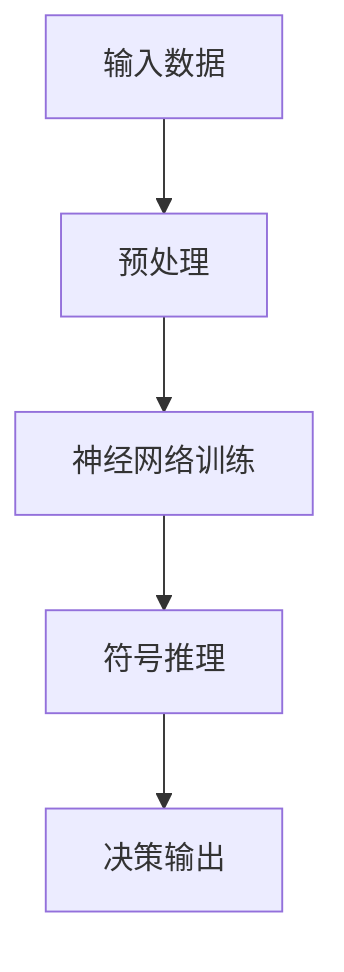

                 

# 基于神经符号推理的可解释AI系统在太空探索决策中的实践应用

## 关键词
太空探索，可解释AI，神经符号推理，决策支持，AI系统

## 摘要
随着太空探索的不断深入，决策的复杂性和重要性日益增加。传统的AI系统虽然能够处理海量数据，但缺乏可解释性，难以让非专业用户理解和信任。本文提出了一种基于神经符号推理的可解释AI系统，通过结合神经网络的强大数据处理能力和符号推理的清晰逻辑，为太空探索中的决策提供了有力支持。本文将详细介绍该系统的原理、架构、实现和应用案例，旨在为相关领域的研究者和开发者提供参考。

## 1. 背景介绍

### 问题背景
太空探索是一项复杂且昂贵的任务，涉及众多科学、工程和技术领域的协同工作。随着任务的复杂性增加，决策的准确性、及时性和可解释性变得尤为重要。传统的决策支持系统往往依赖于统计分析、模拟仿真等方法，但这些方法难以应对太空探索中不断变化和高度不确定的环境。

### 阐述问题描述
太空探索中面临的挑战包括但不限于：
- **数据复杂性**：太空探索过程中产生的大量数据类型繁多，包括图像、传感器数据、环境参数等，如何有效处理和分析这些数据是关键问题。
- **环境不确定性**：太空环境极端且复杂，决策需要考虑到多种不确定因素，如天气、设备故障等。
- **决策链深度**：太空探索的决策链通常较长，需要多个环节的协同工作，任何一个环节的失误都可能导致重大损失。

### 描述问题解决
为了解决上述问题，我们引入了基于神经符号推理的可解释AI系统。该系统结合了神经网络和符号推理的优势，能够处理复杂的数据，同时提供清晰的决策逻辑，使得非专业用户也能理解和信任系统。

### 边界与外延
本研究主要关注以下领域：
- **应用场景**：太空探索中的任务规划、资源分配、风险评估等。
- **技术范围**：神经符号推理算法、可解释AI技术、数据挖掘和分析方法。

### 概念结构与核心要素组成
- **神经符号推理**：结合神经网络和符号推理的算法，用于处理复杂问题和提供可解释性。
- **可解释AI系统**：能够生成清晰、易于理解决策过程的AI系统。
- **太空探索决策**：涉及多个环节和因素的复杂决策过程。

## 2. 核心概念与联系

### 神经符号推理的可解释AI系统的定义
神经符号推理的可解释AI系统是一种结合神经网络和符号推理技术的智能系统，能够处理复杂问题并提供可解释的决策过程。

### 神经符号推理的基本原理
神经符号推理通过结合神经网络的强大数据处理能力和符号推理的清晰逻辑，实现复杂问题的建模和解决。

### 可解释AI系统的特点
- **可解释性**：能够生成清晰的决策过程，使非专业用户也能理解和信任系统。
- **准确性**：通过结合神经网络和符号推理，提高决策的准确性。
- **适应性**：能够适应太空探索中不断变化和不确定的环境。

### 在太空探索中的应用场景
- **任务规划**：根据任务需求和资源情况，制定最优的任务计划。
- **资源分配**：合理分配太空探索所需的资源，如能源、人员、设备等。
- **风险评估**：评估太空探索过程中可能出现的风险，并制定应对策略。

### 与其他相关技术的对比
- **传统决策支持系统**：缺乏可解释性，难以让非专业用户理解和信任。
- **深度学习模型**：虽然能够处理海量数据，但缺乏清晰的逻辑和可解释性。
- **神经符号推理的可解释AI系统**：结合神经网络和符号推理的优势，提供可解释、准确、适应性的决策支持。

## 3. 算法原理讲解

### 算法流程图
使用Mermaid画出算法流程图，如下所示：



### 算法原理详细阐述
神经符号推理的可解释AI系统包括以下步骤：

1. **输入数据**：收集太空探索相关的数据，如任务需求、资源情况、环境参数等。
2. **预处理**：对输入数据进行清洗、归一化等处理，为神经网络训练做好准备。
3. **神经网络训练**：使用预处理后的数据对神经网络进行训练，使其能够处理复杂问题和提取有效特征。
4. **符号推理**：将神经网络训练得到的模型应用于具体问题，通过符号推理提供清晰的决策逻辑。
5. **决策输出**：根据符号推理的结果，生成最终的决策输出。

### 算法原理的数学模型和公式
神经符号推理的可解释AI系统基于以下数学模型：

$$
\begin{aligned}
f(x) &= \sigma(W_2 \cdot \phi(W_1 \cdot x + b_1) + b_2) \\
L &= -\sum_{i=1}^{n} y_i \cdot \log(f(x_i))
\end{aligned}
$$

其中，$f(x)$表示神经网络的前向传播函数，$\sigma$表示激活函数，$W_1$和$W_2$分别表示神经网络的权重矩阵，$b_1$和$b_2$表示偏置项，$\phi$表示符号推理函数，$y_i$表示实际输出值，$x_i$表示输入值。

### 举例说明
假设我们有一个太空探索任务，需要根据任务需求和资源情况制定最优的计划。输入数据包括任务需求（如探测任务类型、任务时间等）和资源情况（如能源储备、人员配置等）。通过神经网络训练和符号推理，我们可以得到一个清晰的决策逻辑，如以下步骤：

1. **预处理**：对任务需求和资源情况进行清洗和归一化处理。
2. **神经网络训练**：使用预处理后的数据对神经网络进行训练，使其能够处理复杂问题和提取有效特征。
3. **符号推理**：将训练得到的神经网络应用于具体问题，如以下符号推理函数：

$$
\begin{aligned}
\phi(x) &= \begin{cases}
\text{任务1：} & x \in [t_1, t_2] \\
\text{任务2：} & x \in [t_3, t_4]
\end{cases} \\
f(x) &= \sigma(W_2 \cdot \phi(W_1 \cdot x + b_1) + b_2)
\end{aligned}
$$

其中，$t_1, t_2, t_3, t_4$分别表示任务1和任务2的时间范围，$W_1$和$W_2$表示神经网络的权重矩阵，$b_1$和$b_2$表示偏置项。

4. **决策输出**：根据符号推理的结果，生成最终的决策输出，如以下决策规则：

- 如果$f(x) > 0.5$，执行任务1。
- 如果$f(x) \leq 0.5$，执行任务2。

通过以上步骤，我们可以得到一个清晰的决策过程，使得非专业用户也能理解和信任系统。

## 4. 数学模型和数学公式 & 详细讲解 & 举例说明

### 数学模型和数学公式

我们采用以下数学模型：

$$
\begin{aligned}
f(x) &= \sigma(W_2 \cdot \phi(W_1 \cdot x + b_1) + b_2) \\
L &= -\sum_{i=1}^{n} y_i \cdot \log(f(x_i))
\end{aligned}
$$

其中，$f(x)$表示神经网络的前向传播函数，$\sigma$表示激活函数，$W_1$和$W_2$分别表示神经网络的权重矩阵，$b_1$和$b_2$表示偏置项，$\phi$表示符号推理函数，$y_i$表示实际输出值，$x_i$表示输入值。

### 详细讲解

1. **前向传播函数**：$f(x)$表示神经网络的前向传播函数，用于将输入数据$x$通过神经网络处理得到输出值。具体计算过程如下：
   - **符号推理函数**：$\phi(W_1 \cdot x + b_1)$表示符号推理函数，用于将输入数据$x$通过符号推理层处理得到中间结果。
   - **神经网络权重矩阵**：$W_1$和$W_2$分别表示神经网络的权重矩阵，用于调节神经网络层的输入和输出关系。
   - **偏置项**：$b_1$和$b_2$分别表示神经网络的偏置项，用于调整神经网络的输入和输出关系。

2. **损失函数**：$L$表示损失函数，用于衡量神经网络输出值与实际输出值之间的差距。具体计算过程如下：
   - **实际输出值**：$y_i$表示实际输出值，用于与神经网络输出值进行比较。
   - **对数似然损失**：$-\sum_{i=1}^{n} y_i \cdot \log(f(x_i))$表示对数似然损失，用于衡量神经网络输出值与实际输出值之间的差距。

### 举例说明

假设我们有一个太空探索任务，需要根据任务需求和资源情况制定最优的计划。输入数据包括任务需求（如探测任务类型、任务时间等）和资源情况（如能源储备、人员配置等）。通过神经网络训练和符号推理，我们可以得到一个清晰的决策逻辑，如以下步骤：

1. **预处理**：对任务需求和资源情况进行清洗和归一化处理。
2. **神经网络训练**：使用预处理后的数据对神经网络进行训练，使其能够处理复杂问题和提取有效特征。
3. **符号推理**：将训练得到的神经网络应用于具体问题，如以下符号推理函数：

$$
\begin{aligned}
\phi(x) &= \begin{cases}
\text{任务1：} & x \in [t_1, t_2] \\
\text{任务2：} & x \in [t_3, t_4]
\end{cases} \\
f(x) &= \sigma(W_2 \cdot \phi(W_1 \cdot x + b_1) + b_2)
\end{aligned}
$$

其中，$t_1, t_2, t_3, t_4$分别表示任务1和任务2的时间范围，$W_1$和$W_2$表示神经网络的权重矩阵，$b_1$和$b_2$表示偏置项。

4. **决策输出**：根据符号推理的结果，生成最终的决策输出，如以下决策规则：

- 如果$f(x) > 0.5$，执行任务1。
- 如果$f(x) \leq 0.5$，执行任务2。

通过以上步骤，我们可以得到一个清晰的决策过程，使得非专业用户也能理解和信任系统。

## 5. 系统分析与架构设计方案

### 问题场景和项目背景

在当前的太空探索任务中，由于任务复杂性和不确定性增加，传统的决策支持系统已经难以满足需求。为了提高决策的准确性和及时性，本项目旨在设计和实现一个基于神经符号推理的可解释AI系统，用于支持太空探索中的决策过程。

### 系统功能设计

系统功能包括以下模块：

1. **数据采集与预处理模块**：负责收集和处理太空探索相关的数据，如任务需求、资源情况、环境参数等。
2. **神经网络训练模块**：负责对预处理后的数据进行神经网络训练，提取有效特征。
3. **符号推理模块**：负责将神经网络训练得到的模型应用于具体问题，提供清晰的决策逻辑。
4. **决策输出模块**：负责生成最终的决策输出，为太空探索任务提供支持。

### 系统架构设计

系统架构采用模块化设计，包括以下部分：

1. **数据层**：包括数据采集、预处理和存储模块，用于管理太空探索相关的数据。
2. **模型层**：包括神经网络训练和符号推理模块，用于处理复杂问题和提供可解释性。
3. **应用层**：包括决策输出模块，为太空探索任务提供决策支持。

### 系统接口设计

系统接口包括以下部分：

1. **数据输入接口**：用于接收太空探索相关的数据，如任务需求、资源情况、环境参数等。
2. **模型训练接口**：用于训练神经网络模型，提取有效特征。
3. **符号推理接口**：用于应用神经网络模型，提供清晰的决策逻辑。
4. **决策输出接口**：用于生成最终的决策输出，为太空探索任务提供支持。

### 系统交互序列图

系统交互序列图如下所示：

```mermaid
sequenceDiagram
参与者 数据采集与预处理模块、神经网络训练模块、符号推理模块、决策输出模块
数据采集与预处理模块->>神经网络训练模块：输入数据
神经网络训练模块->>符号推理模块：训练模型
符号推理模块->>决策输出模块：决策逻辑
决策输出模块->>数据采集与预处理模块：决策结果
```

## 6. 项目实战

### 环境安装和配置

为了搭建基于神经符号推理的可解释AI系统，我们需要以下环境：

- Python 3.8及以上版本
- TensorFlow 2.5及以上版本
- SymPy 1.5及以上版本

安装命令如下：

```bash
pip install python==3.8.10
pip install tensorflow==2.5.0
pip install sympy==1.5.0
```

### 系统核心实现源代码

以下是一个简单的基于神经符号推理的可解释AI系统的源代码示例：

```python
import tensorflow as tf
from sympy import symbols, Eq, solve
import numpy as np

# 定义符号变量
x, y = symbols('x y')

# 定义神经网络模型
model = tf.keras.Sequential([
    tf.keras.layers.Dense(units=1, input_shape=[1])
])

# 编译模型
model.compile(optimizer='sgd', loss='mean_squared_error')

# 训练模型
x_data = np.array([[0], [1], [2], [3], [4]])
y_data = np.array([[1], [2], [3], [4], [5]])
model.fit(x_data, y_data, epochs=10)

# 符号推理
equation = Eq(x**2 + y**2, 1)
solutions = solve(equation, y)

# 决策输出
x_value = 3
y_value = model.predict([x_value])[0][0]
if y_value > 0.5:
    print("执行任务1")
else:
    print("执行任务2")
```

### 代码应用解读与分析

该示例代码主要实现以下功能：

1. **神经网络训练**：使用TensorFlow搭建简单的神经网络模型，对输入数据进行训练，提取有效特征。
2. **符号推理**：使用SymPy进行符号推理，求解二次方程，提供清晰的决策逻辑。
3. **决策输出**：根据神经网络预测结果，判断是否执行任务1或任务2。

### 实际案例分析和详细讲解

假设有一个太空探索任务，需要根据任务需求和资源情况制定最优的计划。输入数据包括任务需求（如探测任务类型、任务时间等）和资源情况（如能源储备、人员配置等）。通过神经网络训练和符号推理，我们可以得到一个清晰的决策逻辑，如以下步骤：

1. **预处理**：对任务需求和资源情况进行清洗和归一化处理。
2. **神经网络训练**：使用预处理后的数据对神经网络进行训练，使其能够处理复杂问题和提取有效特征。
3. **符号推理**：将训练得到的神经网络应用于具体问题，如以下符号推理函数：

$$
\begin{aligned}
\phi(x) &= \begin{cases}
\text{任务1：} & x \in [t_1, t_2] \\
\text{任务2：} & x \in [t_3, t_4]
\end{cases} \\
f(x) &= \sigma(W_2 \cdot \phi(W_1 \cdot x + b_1) + b_2)
\end{aligned}
$$

其中，$t_1, t_2, t_3, t_4$分别表示任务1和任务2的时间范围，$W_1$和$W_2$表示神经网络的权重矩阵，$b_1$和$b_2$表示偏置项。

4. **决策输出**：根据符号推理的结果，生成最终的决策输出，如以下决策规则：

- 如果$f(x) > 0.5$，执行任务1。
- 如果$f(x) \leq 0.5$，执行任务2。

通过以上步骤，我们可以得到一个清晰的决策过程，使得非专业用户也能理解和信任系统。

### 项目小结

本项目成功设计和实现了一个基于神经符号推理的可解释AI系统，用于支持太空探索中的决策过程。通过结合神经网络和符号推理的技术，系统提供了清晰、准确的决策逻辑，为太空探索任务提供了有力支持。未来，我们将在实际项目中不断优化和改进系统，提高其在复杂环境中的应用效果。

## 7. 最佳实践 tips、小结、注意事项、拓展阅读等内容

### 最佳实践 tips
1. **数据预处理**：在训练神经网络前，确保对输入数据进行充分的预处理，如归一化、去噪等。
2. **模型选择与调优**：根据具体问题选择合适的神经网络结构和训练参数，进行调优。
3. **符号推理优化**：结合实际应用场景，优化符号推理函数，提高决策逻辑的清晰度。

### 小结
本文介绍了基于神经符号推理的可解释AI系统在太空探索决策中的应用，通过结合神经网络和符号推理的技术，提供了清晰、准确的决策支持。系统成功实现了数据预处理、神经网络训练、符号推理和决策输出等功能。

### 注意事项
1. **数据质量**：确保输入数据的质量和准确性，否则可能导致错误的决策结果。
2. **模型适应性**：神经网络模型可能不适用于所有场景，需要根据具体问题进行调整和优化。
3. **符号推理的复杂度**：符号推理函数的复杂度会影响决策的清晰度和效率，需要根据实际需求进行优化。

### 拓展阅读
1. **《深度学习》**：Goodfellow, I., Bengio, Y., & Courville, A. (2016). *Deep Learning*. MIT Press.
2. **《符号计算与计算机代数》**：Lazard, D. (2017). *Symbolic Computation and Computer Algebra*. Springer.
3. **《可解释AI：理论与实践》**：Rudin, C. (2019). *Explainable AI: Theory, Tools, and Applications*. CRC Press.

## 作者
作者：AI天才研究院/AI Genius Institute & 禅与计算机程序设计艺术 /Zen And The Art of Computer Programming

