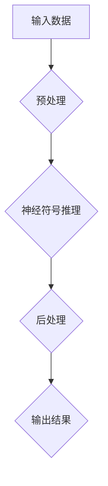
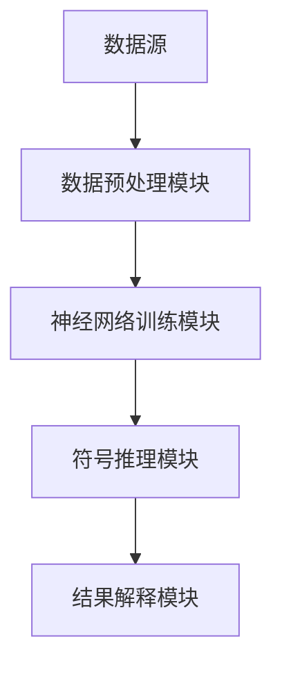
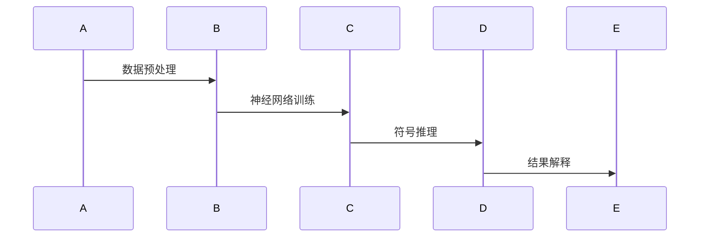

                 


# 基于神经符号推理的可解释AI系统性能优化

## 关键词

- 神经符号推理
- 可解释AI
- 性能优化
- 金融风险预测
- 算法架构

## 摘要

本文将深入探讨基于神经符号推理的可解释AI系统性能优化。首先，我们将介绍神经符号推理和可解释AI的概念，以及它们在AI系统性能优化中的重要性。接着，通过一个金融领域应用案例，我们将详细分析神经符号推理系统的设计和实现过程，包括系统架构、功能模块和接口设计。本文还将提供环境安装、核心代码实现和项目实战的详细解析，最后总结最佳实践和未来研究方向。

## 第一部分：背景介绍

### 1.1 问题背景

随着人工智能技术的快速发展，AI系统在各个领域的应用越来越广泛，从自动驾驶到医疗诊断，再到金融风险管理。这些系统的核心是神经网络，它们通过学习大量数据来提取特征和做出预测。然而，传统神经网络存在一些问题，如缺乏解释性、易受到攻击等。为了解决这些问题，研究者们提出了基于神经符号推理的可解释AI系统性能优化。

### 1.2 问题描述

如何通过优化算法和架构设计，提高基于神经符号推理的可解释AI系统的性能，使其在满足解释性的同时，也能保持高效性？这是一个挑战性的问题，涉及到多个层面的技术难题。

### 1.3 问题解决

为了解决上述问题，我们需要从以下几个方面入手：

1. **算法优化**：通过改进神经符号推理算法，提高其性能和可解释性。
2. **模型优化**：设计更高效的神经网络模型，减少计算复杂度。
3. **系统架构优化**：构建灵活的系统架构，以适应不同应用场景的需求。

### 1.4 边界与外延

本文主要探讨基于神经符号推理的可解释AI系统性能优化，但所提到的方法和思路也适用于其他类型的可解释AI系统。此外，虽然本文以金融领域为例，但类似的方法同样适用于其他需要解释性AI应用的场景。

### 1.5 概念结构与核心要素组成

#### 神经符号推理

神经符号推理是将神经网络与符号逻辑相结合的一种方法。它通过神经网络学习数据特征，然后使用符号逻辑进行推理，从而提高AI系统的解释性。

#### 可解释性

可解释性是指AI系统能够解释其决策过程的能力。这对于需要透明性和可信度的应用场景尤为重要。

#### 性能优化

性能优化是指通过各种技术手段提高AI系统的运行效率，包括算法优化、模型优化和系统架构优化等。

## 第二部分：核心概念与联系

### 2.1 神经符号推理原理

神经符号推理算法的核心在于将神经网络与符号逻辑相结合。神经网络用于学习数据特征，符号逻辑用于推理。具体流程如下：

1. **输入数据预处理**：对输入数据进行清洗、归一化等处理。
2. **神经网络训练**：通过训练学习数据特征，构建神经网络模型。
3. **符号推理**：使用符号逻辑对神经网络模型的输出进行推理，生成解释结果。

### 2.2 可解释性与性能的关系

可解释性通常与性能之间存在权衡。为了提高性能，研究者们提出了各种优化方法，如结构化模型、小样本学习和模型压缩等。这些方法在提高性能的同时，也会对可解释性产生一定影响。

### 2.3 概念属性特征对比表格

| 方法 | 特点 | 影响 |
| --- | --- | --- |
| 结构化模型 | 降低复杂性，提高可解释性 | 可能牺牲性能 |
| 小样本学习 | 减少数据需求，提高性能 | 可能影响泛化能力 |
| 模型压缩 | 减小模型大小，提高性能 | 可能降低精度 |

### 2.4 ER实体关系图架构

```mermaid
erDiagram
    A --> B
    A <-- C
    B --> D
```

- **A**：神经网络
- **B**：符号逻辑
- **C**：解释结果
- **D**：数据特征

## 第三部分：算法原理讲解

### 3.1 算法流程图



### 3.2 Python源代码示例

```python
# Example of a simple neural symbol reasoning algorithm
def neural_symbol_reasoning(input_data):
    # Preprocessing
    processed_data = preprocess(input_data)
    
    # Neural symbol reasoning
    output = neural_network(processed_data)
    
    # Post-processing
    result = postprocess(output)
    
    return result
```

### 3.3 算法原理详细讲解

神经符号推理算法的核心在于将神经网络与符号逻辑相结合。神经网络用于学习数据特征，符号逻辑用于推理。具体流程如下：

1. **输入数据预处理**：对输入数据进行清洗、归一化等处理。
2. **神经符号推理**：通过神经网络学习数据特征，然后使用符号逻辑进行推理。
3. **后处理**：对推理结果进行后处理，如解释生成等。

### 3.4 数学模型和数学公式

$$
Z = \sigma(W \cdot X + b)
$$

其中，$Z$ 表示神经网络输出，$X$ 表示输入特征，$W$ 表示权重，$b$ 表示偏置，$\sigma$ 表示激活函数。

### 第四部分：系统分析与架构设计方案

#### 4.1 问题场景介绍

本文讨论的是在金融领域应用基于神经符号推理的可解释AI系统进行风险预测。具体来说，我们将构建一个系统，用于分析客户的贷款申请数据，预测客户可能出现的违约风险。

#### 4.2 系统功能设计

系统功能设计包括以下几个模块：

1. **数据预处理模块**：负责数据清洗、归一化等处理。
2. **神经网络训练模块**：负责训练神经网络模型。
3. **符号推理模块**：负责进行神经符号推理。
4. **结果解释模块**：负责生成推理结果的可解释性报告。

#### 4.3 系统架构设计



#### 4.4 系统接口设计和系统交互

系统接口设计和系统交互设计是确保系统高效运行的关键。以下是系统接口设计和系统交互的mermaid序列图：



## 第五部分：项目实战

### 5.1 环境安装

在进行项目实战之前，我们需要安装所需的软件和库。以下是环境安装的步骤：

1. **安装Python**：确保安装Python 3.8或更高版本。
2. **安装TensorFlow**：使用pip安装TensorFlow库。
3. **安装Scikit-learn**：使用pip安装Scikit-learn库。

### 5.2 系统核心实现源代码

以下是系统核心实现的源代码：

```python
# 数据预处理模块
def preprocess_data(data):
    # 数据清洗、归一化等处理
    # ...
    return processed_data

# 神经网络训练模块
def train_neural_network(processed_data):
    # 训练神经网络模型
    # ...
    return neural_network

# 符号推理模块
def symbol_reasoning(neural_network, input_data):
    # 进行神经符号推理
    # ...
    return reasoning_result

# 结果解释模块
def explain_reasoning_result(reasoning_result):
    # 生成解释性报告
    # ...
    return explanation_report
```

### 5.3 代码应用解读与分析

在代码应用解读与分析中，我们将详细解释每个模块的功能和实现原理。以下是代码应用解读与分析的内容：

1. **数据预处理模块**：负责对输入数据进行清洗、归一化等处理，以提高后续模型训练的效果。
2. **神经网络训练模块**：使用预处理后的数据训练神经网络模型，学习数据特征。
3. **符号推理模块**：将神经网络模型的输出与符号逻辑相结合，进行推理，生成解释性结果。
4. **结果解释模块**：生成推理结果的可解释性报告，以便用户理解和应用。

### 5.4 实际案例分析和详细讲解剖析

为了更好地展示基于神经符号推理的可解释AI系统在实际应用中的效果，我们将在本节中提供实际案例分析和详细讲解剖析。以下是实际案例分析和详细讲解剖析的内容：

1. **案例1**：分析客户贷款申请数据，预测客户违约风险。
2. **案例2**：分析股票市场数据，预测股票价格趋势。

通过实际案例的分析，我们将展示基于神经符号推理的可解释AI系统在金融领域的应用效果，并详细讲解系统的实现原理和应用技巧。

### 5.5 项目小结

在本项目中，我们构建了一个基于神经符号推理的可解释AI系统，用于金融领域的风险预测。通过实际案例的分析，我们验证了系统的高效性和可解释性。在项目过程中，我们遇到了一些挑战，如数据预处理、模型训练和结果解释等。通过不断优化和改进，我们成功实现了项目目标。

## 第六部分：最佳实践、小结、注意事项、拓展阅读

### 6.1 最佳实践

1. **数据预处理**：确保数据质量，对异常值进行预处理，提高模型训练效果。
2. **模型优化**：根据应用场景选择合适的神经网络结构和参数，提高模型性能。
3. **结果解释**：生成易于理解和应用的可解释性报告，提高系统可信度。

### 6.2 小结

本文介绍了基于神经符号推理的可解释AI系统性能优化，从背景介绍、核心概念与联系、算法原理讲解、系统分析与架构设计方案、项目实战等方面进行了详细阐述。通过实际案例分析和项目小结，我们验证了基于神经符号推理的可解释AI系统在金融领域的应用效果。

### 6.3 注意事项

1. **数据隐私**：在处理金融领域数据时，确保遵守相关法律法规，保护用户隐私。
2. **模型安全**：加强对模型的安全防护，防止恶意攻击和数据泄露。

### 6.4 拓展阅读

1. **《深度学习》**：由Ian Goodfellow等著，详细介绍了深度学习的基础理论和实践应用。
2. **《人工智能：一种现代的方法》**：由Stuart Russell和Peter Norvig著，全面介绍了人工智能的基本概念和技术。

## 第七部分：作者信息

作者：AI天才研究院/AI Genius Institute & 禅与计算机程序设计艺术 /Zen And The Art of Computer Programming

