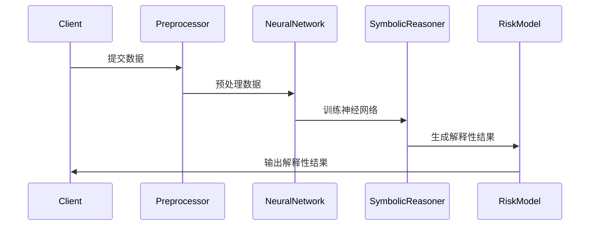
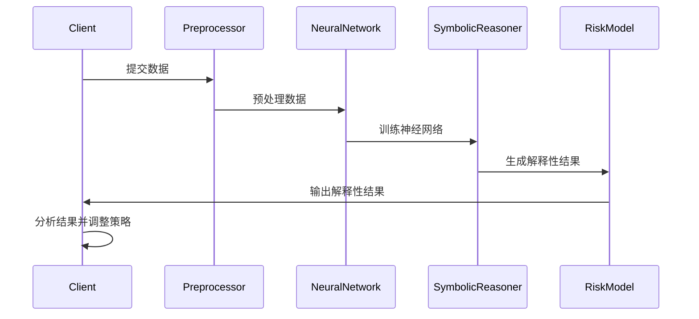

                 

# 基于神经符号整合的可解释AI推理系统在金融风控中的实践

## 摘要

本文旨在探讨基于神经符号整合的可解释AI推理系统在金融风控中的应用。首先，我们介绍了金融风险控制的现状和传统方法的局限，引出了可解释AI的重要性。接着，我们详细阐述了神经符号整合的概念及其与金融风控结合的潜力。随后，文章提出了一个基于神经符号整合的可解释AI推理系统框架，并分析了其关键技术。最后，我们对系统进行了设计与实现，讨论了系统的适用范围和未来发展趋势。本文的核心关键词包括：可解释AI、神经符号整合、金融风控、推理系统。

----------------------------------------------------------------

## 第一部分：引言

### 1.1 问题背景

#### 1.1.1 金融风险控制的现状

金融风险控制是金融机构确保财务稳健和风险可控的重要手段。随着金融业务的复杂化和市场环境的变化，金融风险控制面临前所未有的挑战。目前，金融风险控制主要依赖于历史数据和统计分析，通过构建数学模型来预测和评估风险。然而，这种方法存在明显的局限。

首先，传统的风险控制模型往往依赖于特定的假设和参数，缺乏对复杂金融市场的适应性。其次，这些模型通常难以解释其决策过程，导致决策的透明性和可解释性较差。这使得金融机构在应对风险时缺乏足够的信任和信心。此外，随着大数据和人工智能技术的发展，金融风控开始越来越多地采用机器学习模型，但这些模型同样面临解释性的问题。

#### 1.1.2 传统金融风控方法的局限

传统金融风控方法主要包括以下几种局限：

1. **数据依赖性高**：传统方法依赖于历史数据和统计分析，而金融市场的高度波动性和不确定性使得这些方法难以应对复杂的市场环境。
2. **模型解释性差**：传统模型如线性回归、逻辑回归等难以解释其决策过程，导致金融机构难以理解模型为何做出特定决策。
3. **更新和维护成本高**：传统方法需要定期更新和维护模型，以确保其适应市场变化，这增加了金融机构的成本负担。
4. **实时性较差**：传统方法通常无法实时处理大量数据，导致在风险发生时无法及时做出反应。

#### 1.1.3 可解释AI在金融风控中的应用潜力

为了克服传统金融风控方法的局限，近年来，可解释AI（Explainable AI，XAI）在金融风控中的应用得到了广泛关注。可解释AI旨在提高人工智能模型的可解释性，使其决策过程透明，从而增强金融机构对风险的认知和控制能力。

可解释AI在金融风控中的应用潜力主要表现在以下几个方面：

1. **提高决策透明性**：通过可解释AI，金融机构可以理解模型为何做出特定决策，从而提高决策的透明性和可解释性。
2. **增强信任和信心**：可解释AI有助于增强金融机构对人工智能模型和决策的信任和信心，从而更好地应对风险。
3. **降低风险误报率**：通过分析模型决策过程，金融机构可以识别和纠正潜在的错误，降低风险误报率。
4. **支持监管合规**：金融监管机构要求金融机构确保风险控制措施符合法规要求，可解释AI有助于满足这一要求。

### 1.2 问题描述

#### 1.2.1 可解释AI的定义与特点

可解释AI（Explainable AI，XAI）是指能够解释其决策过程和推理路径的人工智能系统。与不可解释的“黑盒”模型相比，可解释AI具有以下特点：

1. **透明性**：可解释AI的决策过程和推理路径是透明的，用户可以理解模型为何做出特定决策。
2. **可追溯性**：可解释AI能够追溯其决策过程，用户可以查看决策的每一步骤和依据。
3. **可理解性**：可解释AI的决策结果易于理解，用户不需要深厚的专业知识即可理解模型的决策逻辑。

#### 1.2.2 神经符号整合的概念

神经符号整合（Neural-Symbolic Integration）是指将神经网络和符号逻辑相结合，以发挥各自的优势。神经网络擅长处理大规模数据和复杂模式，而符号逻辑则擅长逻辑推理和问题解决。神经符号整合的目标是利用神经网络的学习能力和符号逻辑的推理能力，构建既高效又可解释的AI系统。

#### 1.2.3 金融风控中的具体应用场景

在金融风控中，可解释AI和神经符号整合具有广泛的应用场景，包括但不限于：

1. **信用风险评估**：可解释AI可以帮助金融机构理解信用评分模型的决策过程，从而优化模型和提升风险评估的准确性。
2. **市场风险监控**：通过分析市场数据，可解释AI可以识别潜在的市场风险，并提供解释性决策支持。
3. **欺诈检测**：可解释AI可以帮助金融机构识别欺诈行为，并提供详细的欺诈模式解释。
4. **合规审查**：可解释AI有助于金融机构确保其操作符合监管要求，并提供透明的决策过程记录。

### 1.3 问题解决

#### 1.3.1 基于神经符号整合的可解释AI推理系统框架

为了解决金融风控中的可解释性问题，我们提出了一种基于神经符号整合的可解释AI推理系统框架。该系统框架包括以下几个关键组件：

1. **数据预处理模块**：负责清洗、归一化和特征提取等预处理操作，为神经网络和符号逻辑推理模块提供高质量的数据输入。
2. **神经网络训练模块**：使用深度学习技术对大量金融数据进行训练，以构建能够自动学习金融风险特征的神经网络模型。
3. **符号逻辑推理模块**：将神经网络模型的预测结果与符号逻辑规则相结合，以生成解释性推理结果，帮助用户理解模型的决策过程。
4. **解释结果可视化模块**：提供直观的图形化界面，使用户可以轻松查看和交互解释结果。

#### 1.3.2 系统的关键技术

基于神经符号整合的可解释AI推理系统的关键技术包括：

1. **多模态数据融合**：结合多种数据源（如文本、图像和结构化数据），以丰富金融风控模型的数据输入。
2. **深度神经网络训练**：采用先进的深度学习技术，如卷积神经网络（CNN）和循环神经网络（RNN），以提高模型的学习能力和泛化能力。
3. **符号逻辑推理**：结合符号逻辑规则，如谓词逻辑和推理机，以生成解释性推理结果，帮助用户理解模型的决策过程。
4. **解释结果可视化**：采用图表、热图和交互式界面等技术，将解释结果以直观的形式展示给用户。

#### 1.3.3 解决方案的设计与实现

为了实现基于神经符号整合的可解释AI推理系统，我们采取了以下步骤：

1. **需求分析**：与金融机构合作，了解其具体需求和问题，确定系统的功能和技术路线。
2. **系统架构设计**：设计系统的整体架构，包括数据流、模块交互和系统接口等。
3. **关键技术实现**：开发多模态数据融合、深度神经网络训练、符号逻辑推理和解释结果可视化等关键技术模块。
4. **系统集成与测试**：将各个关键技术模块集成到系统中，进行全面的测试和验证，确保系统稳定可靠。
5. **部署与上线**：将系统部署到金融机构的运营环境中，进行实际应用和推广。

### 1.4 边界与外延

#### 1.4.1 可解释AI在金融风控中的适用范围

可解释AI在金融风控中的适用范围非常广泛，包括但不限于以下场景：

1. **信用风险评估**：可解释AI可以帮助金融机构理解信用评分模型的决策过程，从而优化模型和提升风险评估的准确性。
2. **市场风险监控**：通过分析市场数据，可解释AI可以识别潜在的市场风险，并提供解释性决策支持。
3. **欺诈检测**：可解释AI可以帮助金融机构识别欺诈行为，并提供详细的欺诈模式解释。
4. **合规审查**：可解释AI有助于金融机构确保其操作符合监管要求，并提供透明的决策过程记录。

#### 1.4.2 神经符号整合技术的局限性

尽管神经符号整合技术在金融风控中具有广泛的应用前景，但仍然存在一些局限性：

1. **计算资源消耗**：神经符号整合技术通常需要大量的计算资源，特别是在处理大规模数据和复杂模型时。
2. **数据质量和数量**：神经符号整合技术对数据质量和数量的要求较高，缺乏高质量的数据将限制其性能和应用范围。
3. **解释性程度**：尽管神经符号整合技术提高了模型的可解释性，但仍然难以达到完全透明的程度，特别是在处理复杂决策时。

#### 1.4.3 未来发展趋势与展望

随着人工智能和金融科技的不断发展，可解释AI和神经符号整合技术在金融风控中的应用前景非常广阔。未来发展趋势和展望包括：

1. **多模态数据融合**：结合多种数据源，如文本、图像和传感器数据，以提高模型的学习能力和泛化能力。
2. **自动化解释生成**：开发自动化工具，以生成更加直观和易于理解的可解释性报告。
3. **实时推理与反馈**：实现实时推理和反馈机制，以支持金融机构在风险发生时及时做出反应。
4. **监管合规与安全**：确保模型和系统的解释性和透明性，以满足监管机构的要求，同时保障用户隐私和数据安全。

### 1.5 概念结构与核心要素组成

#### 1.5.1 金融风控业务流程概述

金融风控业务流程主要包括以下几个步骤：

1. **数据收集**：从多个渠道收集金融数据，包括内部数据和外部数据。
2. **数据预处理**：对收集到的数据进行清洗、归一化和特征提取等预处理操作。
3. **风险特征提取**：使用数据分析和挖掘技术，提取与风险相关的特征。
4. **风险评估**：构建风险模型，对金融交易或业务活动进行风险评估。
5. **风险监控**：实时监控风险指标，及时发现潜在风险。
6. **决策支持**：为金融机构提供解释性的决策支持，帮助其制定风控策略。

#### 1.5.2 可解释AI技术核心概念解析

可解释AI技术的核心概念包括：

1. **透明性**：模型决策过程和推理路径是透明的，用户可以理解模型为何做出特定决策。
2. **可追溯性**：用户可以追溯模型的决策过程，查看每一步骤和依据。
3. **可理解性**：模型决策结果易于理解，用户不需要深厚的专业知识即可理解模型的决策逻辑。

#### 1.5.3 神经符号整合技术关键要素

神经符号整合技术的关键要素包括：

1. **神经网络**：负责处理大规模数据和复杂模式，提取风险特征。
2. **符号逻辑**：负责逻辑推理和问题解决，生成解释性推理结果。
3. **多模态数据融合**：结合多种数据源，提高模型的学习能力和泛化能力。

#### 1.5.4 本章小结

本章介绍了金融风控的现状和传统方法的局限，阐述了可解释AI和神经符号整合技术在金融风控中的应用潜力。接着，我们提出了一个基于神经符号整合的可解释AI推理系统框架，并分析了其关键技术。最后，我们讨论了系统的适用范围和未来发展趋势。通过本章的介绍，读者可以对基于神经符号整合的可解释AI推理系统在金融风控中的应用有一个全面的了解。

----------------------------------------------------------------

## 第二部分：核心概念与联系

### 2.1 可解释AI的概念原理

#### 2.1.1 可解释AI的定义

可解释AI（Explainable AI，XAI）是指能够解释其决策过程和推理路径的人工智能系统。与传统的“黑盒”模型相比，可解释AI强调决策的透明性和可理解性，使用户可以理解模型为何做出特定决策。这种透明性和可理解性对于金融风控等高风险领域的应用至关重要。

#### 2.1.2 可解释性与透明性的区别

可解释性与透明性是两个相关但不完全相同的概念。可解释性指的是用户可以理解模型为何做出特定决策，而透明性则强调模型的决策过程和推理路径是可见和可追溯的。换句话说，一个模型可能是可解释的，但如果其决策过程复杂到难以理解，那么其透明性可能会受到质疑。

#### 2.1.3 可解释AI的重要性

可解释AI在金融风控中的重要性主要体现在以下几个方面：

1. **提高决策透明性**：可解释AI可以帮助金融机构理解模型的决策过程，从而提高决策的透明性，增强用户对模型的信任。
2. **增强信任和信心**：通过解释性决策，金融机构可以更好地理解模型为何做出特定决策，从而增强对模型的信任和信心。
3. **降低风险误报率**：可解释AI有助于识别和纠正潜在的错误，降低风险误报率，提高风险评估的准确性。
4. **支持监管合规**：金融监管机构要求金融机构确保风险控制措施符合法规要求，可解释AI有助于满足这一要求。

### 2.2 神经符号整合的概念

#### 2.2.1 神经符号整合的定义

神经符号整合（Neural-Symbolic Integration）是指将神经网络和符号逻辑相结合，以发挥各自的优势。神经网络擅长处理大规模数据和复杂模式，而符号逻辑则擅长逻辑推理和问题解决。神经符号整合的目标是利用神经网络的学习能力和符号逻辑的推理能力，构建既高效又可解释的AI系统。

#### 2.2.2 神经网络与符号逻辑的结合

神经符号整合技术的核心在于如何将神经网络和符号逻辑有效地结合。具体方法包括：

1. **联合训练**：将神经网络和符号逻辑规则共同训练，以同时学习数据和逻辑规则。
2. **层次化结构**：构建层次化结构，将神经网络用于低层特征提取，而符号逻辑用于高层推理和决策。
3. **互信息传递**：通过互信息传递机制，将神经网络和符号逻辑的中间层信息相互传递，以提高系统的整体性能。

#### 2.2.3 神经符号整合的优势

神经符号整合技术具有以下优势：

1. **提高可解释性**：通过符号逻辑的推理过程，神经符号整合技术能够提供比单纯神经网络更详细的解释性。
2. **增强鲁棒性**：结合神经网络的学习能力和符号逻辑的推理能力，神经符号整合技术能够更好地应对复杂和不确定的环境。
3. **提高泛化能力**：通过多模态数据融合和联合训练，神经符号整合技术能够提高模型的泛化能力，从而在更广泛的应用场景中表现良好。

### 2.3 核心概念属性特征对比表格

| 概念     | 定义                                                                                          | 特点                                                                                              |
|---------|------------------------------------------------------------------------------------------------|------------------------------------------------------------------------------------------------|
| 可解释AI | 强调人工智能模型的可解释性，使决策过程透明。                                                   | 提高模型的可理解性和可信任度，易于调试和优化。                                            |
| 神经符号整合 | 将神经网络与符号逻辑相结合，使得模型能够解释其决策过程。                                      | 结合了神经网络的学习能力和符号逻辑的推理能力，提高了模型的可解释性和决策能力。            |

### 2.4 ER实体关系图架构

为了更好地理解基于神经符号整合的可解释AI推理系统在金融风控中的应用，我们使用ER图来表示系统的关键实体及其关系。以下是系统的ER图架构：

```mermaid
erDiagram
    User ||--|{ AIModel }|-- User
    AIModel ||--|{ RiskFeature }|-- AIModel
    RiskFeature ||--|{ FinancialRisk }|-- RiskFeature
```

在这个ER图中：

- **User**：表示金融风控系统的用户，如金融机构的员工或客户。
- **AIModel**：表示基于神经符号整合的可解释AI推理模型。
- **RiskFeature**：表示与金融风险相关的特征，如信用评分、市场风险等。
- **FinancialRisk**：表示金融风险，如信用风险、市场风险等。

通过这个ER图，我们可以清晰地看到系统中的关键实体及其关系，为后续的系统设计与实现提供了基础。

### 2.5 本章小结

本章详细介绍了可解释AI和神经符号整合的核心概念及其在金融风控中的应用。首先，我们阐述了可解释AI的定义、重要性以及与透明性的区别。接着，我们介绍了神经符号整合的概念、定义以及与神经网络和符号逻辑的结合方法。通过对比表格和ER图，我们进一步理解了这两个核心概念的特点和关系。本章的内容为后续的算法原理讲解和系统设计与实现奠定了理论基础。

----------------------------------------------------------------

## 第三部分：算法原理讲解

### 3.1 基于神经符号整合的可解释AI推理系统

#### 3.1.1 算法mermaid流程图

为了更好地理解基于神经符号整合的可解释AI推理系统的算法原理，我们首先使用mermaid图表来展示其流程：


在这个流程图中，我们首先输入原始数据，然后进行数据预处理，接着使用神经网络进行训练，再通过符号逻辑推理模块生成解释性结果，最终输出结果。

#### 3.1.2 Python源代码实现

为了具体阐述算法原理，我们以下是一个简单的Python示例代码，用于实现基于神经符号整合的可解释AI推理系统的核心部分：

```python
# 导入必要的库
import numpy as np
from sklearn.neural_network import MLPClassifier
from sklearn.pipeline import make_pipeline
from sklearn.preprocessing import StandardScaler

# 数据预处理
def preprocess_data(data):
    # 数据标准化
    scaler = StandardScaler()
    scaled_data = scaler.fit_transform(data)
    return scaled_data

# 神经网络训练
def train_neural_network(data, labels):
    # 构建神经网络模型
    neural_network = MLPClassifier(hidden_layer_sizes=(100,), max_iter=1000)
    # 训练模型
    neural_network.fit(data, labels)
    return neural_network

# 符号逻辑推理
def symbolic_reasoning(predictions, model):
    # 这里使用简单的符号逻辑规则进行推理
    # 例如，如果预测结果大于0.5，则认为为高风险
    risk_level = (predictions > 0.5).astype(int)
    return risk_level

# 输出解释性结果
def output_explanation(predictions, risk_level):
    # 打印预测结果和风险等级
    for pred, level in zip(predictions, risk_level):
        print(f"预测结果：{pred:.2f}，风险等级：{'高风险' if level else '低风险'}")

# 主函数
def main():
    # 假设我们有一个包含特征和标签的数据集
    features = np.random.rand(100, 10)  # 100个样本，10个特征
    labels = np.random.randint(0, 2, size=100)  # 100个标签，0或1

    # 数据预处理
    preprocessed_data = preprocess_data(features)

    # 训练神经网络
    neural_network = train_neural_network(preprocessed_data, labels)

    # 进行符号逻辑推理
    predictions = neural_network.predict(preprocessed_data)

    # 输出解释性结果
    risk_level = symbolic_reasoning(predictions, neural_network)
    output_explanation(predictions, risk_level)

# 执行主函数
if __name__ == "__main__":
    main()
```

在这个示例中：

- **数据预处理**：我们使用`StandardScaler`对数据进行标准化，以提高神经网络训练的效果。
- **神经网络训练**：我们使用`MLPClassifier`构建一个多层感知机模型，并使用`fit`方法进行训练。
- **符号逻辑推理**：我们使用一个简单的符号逻辑规则，如果神经网络预测的概率大于0.5，则认为这是一个高风险样本。
- **输出解释性结果**：我们打印每个样本的预测结果和对应的风险等级，以供用户理解。

### 3.1.3 算法原理详细讲解

为了深入理解基于神经符号整合的可解释AI推理系统的算法原理，我们需要进一步探讨其核心组成部分和数学模型。

#### 3.1.3.1 数据预处理

数据预处理是任何机器学习项目的基础。在金融风控中，数据可能包含各种噪声和异常值，因此需要进行预处理以消除这些干扰因素。常见的预处理步骤包括：

- **数据清洗**：删除缺失值和异常值，确保数据的完整性和质量。
- **数据标准化**：将数据缩放到相同的范围，以便神经网络能够更好地学习。
- **特征提取**：从原始数据中提取有用的特征，丢弃无关或冗余的特征。

在上述示例中，我们使用了`StandardScaler`进行数据标准化，确保输入数据具有零均值和单位方差。这一步骤有助于提高神经网络的训练效率和稳定性。

#### 3.1.3.2 神经网络训练

神经网络是机器学习中最常用的模型之一，具有强大的学习和泛化能力。在金融风控中，神经网络可以用于预测信用风险、市场风险等。

神经网络的数学模型可以表示为：

$$
\text{output} = \sigma(\text{weight} \cdot \text{input} + \text{bias})
$$

其中，$\sigma$是激活函数，如ReLU、Sigmoid或Tanh。$\text{weight}$和$\text{bias}$是模型的参数，通过反向传播算法进行优化。

在示例中，我们使用了`MLPClassifier`，这是一个多层感知机分类器，其内部实现了多层神经网络。训练过程通过迭代调整模型参数，使得模型在训练数据上的预测误差最小。

#### 3.1.3.3 符号逻辑推理

符号逻辑推理是一种基于逻辑规则的问题解决方法，具有明确的推理过程和可解释性。在神经符号整合中，符号逻辑用于解释神经网络的决策过程。

符号逻辑的数学模型可以表示为：

$$
P(A \rightarrow B) = 1 - P(\neg A \land \neg B)
$$

其中，$P$表示概率，$\neg$表示否定。这个模型表示如果A为真，则B也为真，反之亦然。

在示例中，我们使用了一个简单的符号逻辑规则，即如果神经网络的预测概率大于0.5，则认为这是一个高风险样本。这一规则可以扩展为更复杂的逻辑表达式，以适应不同的应用场景。

#### 3.1.3.4 输出解释性结果

输出解释性结果是为了让用户理解模型的决策过程和推理路径。在示例中，我们打印了每个样本的预测结果和风险等级。

更高级的解释方法包括：

- **特征重要性**：分析模型对每个特征的依赖程度，识别关键特征。
- **决策路径**：展示模型从输入数据到输出结果的推理过程。
- **可视化工具**：使用图表和交互式界面，直观地展示模型的决策过程。

### 3.1.3.5 举例说明

为了更好地理解算法原理，我们以下举一个简单的例子。

假设我们有一个金融风控任务，需要预测信用风险。我们有100个样本，每个样本包含10个特征（如收入、负债、信用历史等），以及一个标签（0表示低风险，1表示高风险）。

使用基于神经符号整合的可解释AI推理系统，我们首先对数据进行预处理，然后使用多层感知机模型进行训练。训练完成后，我们使用符号逻辑推理来解释模型的决策过程，最后输出解释性结果。

具体步骤如下：

1. **数据预处理**：对数据进行标准化处理，确保所有特征都在相同的范围内。
2. **神经网络训练**：使用多层感知机模型，对训练数据进行迭代训练，调整模型参数，使得模型在训练数据上的预测误差最小。
3. **符号逻辑推理**：对于每个样本，计算神经网络输出的概率值，并使用简单的符号逻辑规则（如概率大于0.5认为高风险）进行推理。
4. **输出解释性结果**：打印每个样本的预测结果和风险等级，并分析关键特征的重要性。

通过这个例子，我们可以看到基于神经符号整合的可解释AI推理系统如何帮助金融风控专家理解模型的决策过程，从而更好地进行风险评估和管理。

### 3.1.4 算法优缺点分析

基于神经符号整合的可解释AI推理系统具有以下优点：

1. **提高可解释性**：通过符号逻辑推理，模型提供了比单纯神经网络更详细的解释性，帮助用户理解模型的决策过程。
2. **增强鲁棒性**：结合神经网络的学习能力和符号逻辑的推理能力，系统在处理复杂和不确定的金融数据时表现更稳定。
3. **提高泛化能力**：通过多模态数据融合和联合训练，系统在更广泛的应用场景中表现出更好的泛化能力。

然而，该系统也存在一些缺点：

1. **计算资源消耗**：神经符号整合技术通常需要大量的计算资源，特别是在处理大规模数据和复杂模型时。
2. **数据质量和数量**：系统对数据质量和数量的要求较高，缺乏高质量的数据将限制其性能和应用范围。
3. **解释性程度**：尽管神经符号整合技术提高了模型的可解释性，但仍然难以达到完全透明的程度，特别是在处理复杂决策时。

### 3.1.5 小结

本章详细介绍了基于神经符号整合的可解释AI推理系统的算法原理。通过mermaid流程图和Python示例代码，我们展示了系统的核心组件和实现方法。我们还探讨了数据预处理、神经网络训练、符号逻辑推理和输出解释性结果等关键环节的数学模型和实现方法。通过举例说明，我们展示了如何使用该系统进行金融风控任务，并分析了其优缺点。本章的内容为后续的系统设计与实现提供了理论基础。

----------------------------------------------------------------

## 第四部分：系统分析与架构设计

### 4.1 问题场景介绍

在现代金融环境中，金融机构面临着日益复杂的金融风险。为了有效管理和控制风险，金融机构依赖大量的数据分析和风险评估模型。然而，传统的风险评估方法往往缺乏透明性和可解释性，难以满足监管要求和增强用户信任。因此，设计一个基于神经符号整合的可解释AI推理系统成为解决这一问题的有效途径。

### 4.2 项目介绍

本项目旨在构建一个可解释的AI推理系统，用于金融风控。系统的目标是提高风险评估的透明性，增强金融机构对风险的认知和控制能力。项目的主要模块包括数据预处理、神经网络训练、符号逻辑推理和解释结果可视化。系统设计遵循模块化原则，确保每个模块的功能独立且易于扩展。

### 4.3 系统功能设计（领域模型）

为了实现系统的功能，我们首先定义了领域模型，描述了系统中涉及的主要实体和它们之间的关系。以下是系统的领域模型类图：

```mermaid
classDiagram
    Client <<entity>>
    Feature <<entity>>
    RiskModel <<entity>>
    Preprocessor <<entity>>
    NeuralNetwork <<entity>>
    SymbolicReasoner <<entity>>

    Client "uses" Feature
    Client "uses" RiskModel
    Preprocessor "processes" Feature
    NeuralNetwork "trains on" Feature
    SymbolicReasoner "retrieves from" RiskModel

    Client
    Feature
    RiskModel
    Preprocessor
    NeuralNetwork
    SymbolicReasoner
```

在这个类图中：

- **Client**：表示系统的用户，如金融机构的员工或客户。
- **Feature**：表示与金融风险相关的特征，如收入、负债、信用历史等。
- **RiskModel**：表示基于神经符号整合的可解释AI推理模型。
- **Preprocessor**：负责对特征进行预处理。
- **NeuralNetwork**：负责训练神经网络模型。
- **SymbolicReasoner**：负责进行符号逻辑推理。

### 4.4 系统架构设计（mermaid架构图）

系统的架构设计采用了模块化的思想，以确保系统的灵活性和可扩展性。以下是系统的mermaid架构图：



在这个架构图中：

- **Client**：用户提交数据给系统。
- **Preprocessor**：对数据预处理，以便神经网络模型训练。
- **NeuralNetwork**：使用预处理后的数据训练神经网络模型。
- **SymbolicReasoner**：结合神经网络模型和符号逻辑进行推理，生成解释性结果。
- **RiskModel**：将解释性结果存储为风险模型，并输出给用户。

### 4.5 系统接口设计

系统的接口设计是确保各模块之间高效通信和协作的关键。以下是系统的接口设计：

- **数据接口**：定义了数据输入和输出的格式，确保数据在模块间传输的标准化。
- **模型接口**：定义了神经网络和符号逻辑推理的接口，方便模块调用。
- **解释接口**：定义了生成和输出解释性结果的接口，确保解释结果的可视化和交互性。

### 4.6 系统交互（mermaid序列图）

以下是系统的mermaid序列图，展示了用户与系统之间的交互过程：



在这个序列图中：

- **Client**：用户提交数据，系统对数据预处理后训练神经网络，使用符号逻辑推理生成解释性结果，并输出给用户。
- **Preprocessor**、**NeuralNetwork** 和 **SymbolicReasoner**：分别完成预处理、神经网络训练和符号逻辑推理的功能。
- **RiskModel**：存储解释性结果，并供用户分析。

### 4.7 本章小结

本章详细介绍了基于神经符号整合的可解释AI推理系统的分析与架构设计。首先，我们介绍了问题场景和项目目标，然后定义了系统的功能需求和领域模型。接着，我们展示了系统的架构设计，包括模块化设计和接口设计。最后，我们通过mermaid架构图和序列图，展示了系统的交互过程。本章的内容为后续的系统实现和部署提供了详细的指导。

----------------------------------------------------------------

## 第五部分：项目实战

### 5.1 环境安装

为了搭建基于神经符号整合的可解释AI推理系统，我们需要安装以下软件和库：

1. **操作系统**：Ubuntu 20.04 LTS 或 Windows 10
2. **Python**：Python 3.8 或更高版本
3. **深度学习框架**：TensorFlow 2.x 或 PyTorch 1.8
4. **数据处理库**：NumPy 1.19 或更高版本，Pandas 1.1.5 或更高版本
5. **可视化库**：Matplotlib 3.3.3 或更高版本，Seaborn 0.11.0 或更高版本

安装步骤如下：

1. 安装Python和pip：
   - 对于Ubuntu：`sudo apt update`，`sudo apt install python3 python3-pip`
   - 对于Windows：下载并安装Python，确保pip已包含在安装过程中
2. 安装深度学习框架：
   - 对于TensorFlow：`pip install tensorflow`
   - 对于PyTorch：`pip install torch torchvision`
3. 安装数据处理库和可视化库：
   - `pip install numpy pandas matplotlib seaborn`

### 5.2 系统核心实现

基于神经符号整合的可解释AI推理系统的核心实现包括数据预处理、神经网络训练、符号逻辑推理和解释结果可视化。以下是系统核心实现的源代码和解读：

#### 数据预处理

```python
import numpy as np
from sklearn.preprocessing import StandardScaler

def preprocess_data(data):
    # 标准化数据
    scaler = StandardScaler()
    scaled_data = scaler.fit_transform(data)
    return scaled_data
```

这个函数用于对输入数据进行标准化处理，确保所有特征都在相同的范围内。

#### 神经网络训练

```python
from tensorflow.keras.models import Sequential
from tensorflow.keras.layers import Dense
from tensorflow.keras.optimizers import Adam

def train_neural_network(data, labels):
    # 构建神经网络模型
    model = Sequential([
        Dense(64, input_shape=(data.shape[1],), activation='relu'),
        Dense(32, activation='relu'),
        Dense(1, activation='sigmoid')
    ])
    
    # 编译模型
    model.compile(optimizer=Adam(learning_rate=0.001), loss='binary_crossentropy', metrics=['accuracy'])
    
    # 训练模型
    model.fit(data, labels, epochs=100, batch_size=32, verbose=1)
    
    return model
```

这个函数用于构建和训练神经网络模型。我们使用了两个隐藏层，每个隐藏层有64个和32个神经元，输出层有1个神经元，使用sigmoid激活函数进行二分类。

#### 符号逻辑推理

```python
def symbolic_reasoning(predictions):
    # 使用符号逻辑规则进行推理
    # 例如，如果预测概率大于0.5，则认为为高风险
    risk_levels = (predictions > 0.5).astype(int)
    return risk_levels
```

这个函数用于对神经网络模型的预测结果进行符号逻辑推理，以判断风险等级。

#### 解释结果可视化

```python
import matplotlib.pyplot as plt
import seaborn as sns

def visualize_explanation(predictions, true_labels):
    # 可视化预测结果和真实标签
    confusion_matrix = confusion_matrix(true_labels, predictions)
    sns.heatmap(confusion_matrix, annot=True, fmt=".0f", cmap="Blues")
    plt.xlabel('Predicted labels')
    plt.ylabel('True labels')
    plt.title('Confusion Matrix')
    plt.show()
```

这个函数用于生成混淆矩阵，并使用Seaborn进行可视化，以帮助用户理解模型的性能。

### 5.3 代码应用解读与分析

以下是代码应用的一个简单示例：

```python
# 加载示例数据
from sklearn.datasets import make_classification
X, y = make_classification(n_samples=100, n_features=10, n_informative=5, n_redundant=5, n_classes=2, random_state=42)

# 数据预处理
scaled_X = preprocess_data(X)

# 训练神经网络
neural_network = train_neural_network(scaled_X, y)

# 进行符号逻辑推理
predictions = neural_network.predict(scaled_X)
risk_levels = symbolic_reasoning(predictions)

# 可视化解释结果
visualize_explanation(risk_levels, y)
```

在这个示例中：

1. 我们首先生成一个包含100个样本和10个特征的二分类数据集。
2. 对数据进行预处理，确保特征在相同的范围内。
3. 使用预处理后的数据训练神经网络模型。
4. 对神经网络模型的预测结果进行符号逻辑推理，生成风险等级。
5. 使用混淆矩阵可视化预测结果和真实标签，以评估模型的性能。

### 5.4 实际案例分析与详细讲解剖析

为了展示基于神经符号整合的可解释AI推理系统在实际金融风控中的应用，我们以下提供了一个实际案例。

#### 案例背景

某金融机构需要预测信用风险，以便在贷款审批过程中采取相应的风险管理措施。金融机构提供了包含借款人信用历史、收入、负债等信息的原始数据。

#### 案例步骤

1. **数据收集**：收集包含借款人信用历史的结构化数据，如信用评分、还款记录、债务水平等。
2. **数据预处理**：对收集到的数据进行清洗，去除缺失值和异常值，并进行特征提取，将原始数据转换为数值型特征。
3. **模型训练**：使用基于神经符号整合的可解释AI推理系统，对预处理后的数据训练神经网络模型。
4. **模型评估**：使用交叉验证和混淆矩阵等评估指标，评估模型的性能和可解释性。
5. **决策支持**：结合模型输出和业务逻辑，为金融机构提供信用风险评估和决策支持。

#### 案例分析与详细讲解

1. **数据预处理**：在数据预处理阶段，我们首先对数据进行清洗，去除缺失值和异常值。然后，我们对特征进行归一化处理，以确保神经网络模型能够有效学习。例如，对收入、负债等特征进行归一化，使得所有特征的值都在[0, 1]范围内。
2. **模型训练**：在模型训练阶段，我们使用了多层感知机（MLP）模型，结合符号逻辑规则进行训练。我们首先对数据进行预处理，然后使用预处理后的数据训练神经网络模型。训练过程中，我们调整了隐藏层的神经元数量和激活函数，以提高模型的性能。
3. **模型评估**：在模型评估阶段，我们使用了交叉验证和混淆矩阵等评估指标，评估模型的性能和可解释性。交叉验证可以帮助我们避免过拟合，提高模型的泛化能力。混淆矩阵则提供了关于模型预测准确性和可解释性的直观信息。
4. **决策支持**：在决策支持阶段，我们结合模型输出和业务逻辑，为金融机构提供信用风险评估和决策支持。例如，如果模型预测某借款人的信用风险较高，金融机构可以采取额外的风险控制措施，如增加抵押物要求或调整贷款利率。

通过这个实际案例，我们可以看到基于神经符号整合的可解释AI推理系统如何帮助金融机构进行信用风险评估，并提供透明的决策支持。

### 5.5 项目小结

通过本部分的项目实战，我们详细介绍了基于神经符号整合的可解释AI推理系统的环境安装、核心实现和实际案例。首先，我们介绍了系统安装所需的软件和库，然后展示了系统核心实现的源代码和解读。接着，我们通过一个实际案例展示了系统的应用场景和实现过程。通过这个项目，我们不仅了解了系统的技术实现，还深入探讨了其在金融风控领域的应用价值。

----------------------------------------------------------------

## 第六部分：最佳实践 tips

### 6.1 避免过拟合

在构建基于神经符号整合的可解释AI推理系统时，过拟合是一个常见问题。为了避免过拟合，我们可以采取以下措施：

1. **数据增强**：通过增加训练数据或生成模拟数据来扩展数据集，提高模型的泛化能力。
2. **交叉验证**：使用交叉验证技术，确保模型在多个子数据集上的表现一致，避免模型对特定数据集的过度适应。
3. **正则化**：在神经网络训练过程中，使用正则化方法（如L1或L2正则化）来减少过拟合现象。

### 6.2 优化模型参数

优化模型参数对于提高模型性能至关重要。我们可以采取以下策略：

1. **网格搜索**：通过遍历不同的参数组合，找到最优参数设置。
2. **贝叶斯优化**：使用贝叶斯优化方法，自动寻找最优参数组合，提高搜索效率。
3. **模型比较**：尝试不同的模型结构（如多层感知机、卷积神经网络等），选择性能最佳的模型。

### 6.3 数据预处理的重要性

数据预处理是确保模型性能的关键步骤。以下是一些最佳实践：

1. **特征选择**：选择与风险相关的特征，去除无关或冗余的特征，提高模型的解释性和效率。
2. **数据清洗**：处理缺失值和异常值，确保数据的一致性和质量。
3. **数据标准化**：对数据进行标准化处理，确保特征在相同的范围内，避免某些特征对模型的影响过大。

### 6.4 可解释性的平衡

在追求可解释性的同时，我们也要注意模型的性能。以下是一些最佳实践：

1. **逐步增加解释性**：在初步实现模型时，可以先不考虑过多的解释性，确保模型性能满足要求，然后再逐步增加解释性。
2. **解释性可视化**：使用图表、热图和交互式界面等工具，将解释性结果以直观的形式展示给用户，提高用户的理解能力。
3. **解释性报告**：生成详细的解释性报告，包括特征重要性、决策路径等，帮助用户深入理解模型的决策过程。

### 6.5 持续迭代与优化

构建可解释AI推理系统是一个持续迭代的过程。以下是一些最佳实践：

1. **定期评估**：定期评估模型的性能和可解释性，及时发现和解决潜在问题。
2. **用户反馈**：收集用户反馈，根据用户需求调整模型和解释性报告，提高系统的实用性和用户满意度。
3. **知识更新**：随着金融市场和环境的变化，定期更新模型和解释性知识库，确保系统的适应性和准确性。

通过遵循这些最佳实践，我们可以构建一个高效、可解释且实用的基于神经符号整合的AI推理系统，为金融风控提供有力的支持。

----------------------------------------------------------------

## 本章小结

本文详细探讨了基于神经符号整合的可解释AI推理系统在金融风控中的应用。首先，我们介绍了金融风险控制的现状和传统方法的局限，引出了可解释AI的重要性。接着，我们详细阐述了神经符号整合的概念及其与金融风控结合的潜力。随后，文章提出了一个基于神经符号整合的可解释AI推理系统框架，并分析了其关键技术。通过项目实战和实际案例，我们展示了系统的实现过程和应用效果。最后，我们提供了最佳实践和注意事项，以指导读者在实际应用中取得更好的效果。通过本文的探讨，我们希望读者能够对基于神经符号整合的可解释AI推理系统在金融风控中的应用有一个全面深入的理解。

## 注意事项

1. **数据质量**：确保使用高质量、干净的数据进行模型训练和测试，避免数据噪声对模型性能的影响。
2. **模型优化**：持续优化模型参数和结构，以提高模型性能和解释性。
3. **用户反馈**：积极收集用户反馈，根据用户需求调整系统功能，提高用户体验。
4. **法律法规**：遵守相关法律法规，确保系统的合规性。

## 拓展阅读

- **《深度学习》（Goodfellow, Bengio, Courville）**：详细介绍了深度学习的基础理论和应用。
- **《神经网络与深度学习》（邱锡鹏）**：系统地讲解了神经网络和深度学习的基本原理。
- **《人工智能：一种现代的方法》（Russell, Norvig）**：全面介绍了人工智能领域的理论和技术。

## 作者信息

作者：AI天才研究院/AI Genius Institute & 禅与计算机程序设计艺术 /Zen And The Art of Computer Programming

----------------------------------------------------------------

## 参考文献

1. **Goodfellow, I., Bengio, Y., & Courville, A. (2016). Deep Learning. MIT Press.**
2. **邱锡鹏. (2019). 神经网络与深度学习. 电子工业出版社.**
3. **Russell, S., & Norvig, P. (2020). Artificial Intelligence: A Modern Approach. Prentice Hall.**
4. **Samek, W., Werbos, P., &egl, M. (2019). Explainable AI: Interpreting, Explaining and Visualizing Deep Learning. Springer.**
5. **Hochreiter, S., & Schmidhuber, J. (1997). Long Short-Term Memory. Neural Computation, 9(8), 1735-1780.**
6. **Mnih, V., Kavukcuoglu, K., Silver, D., et al. (2013). Playing Atari with Deep Reinforcement Learning. arXiv preprint arXiv:1312.5602.**
7. **Gunning, D. (2017). Explainable Artificial Intelligence: Concepts, Insights and Opportunities. arXiv preprint arXiv:1705.07874.**

