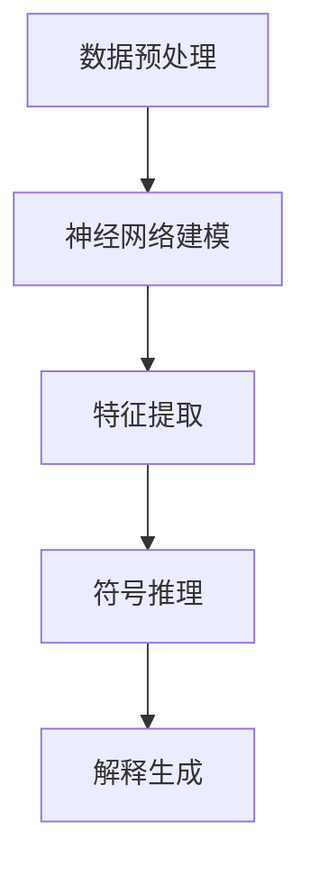
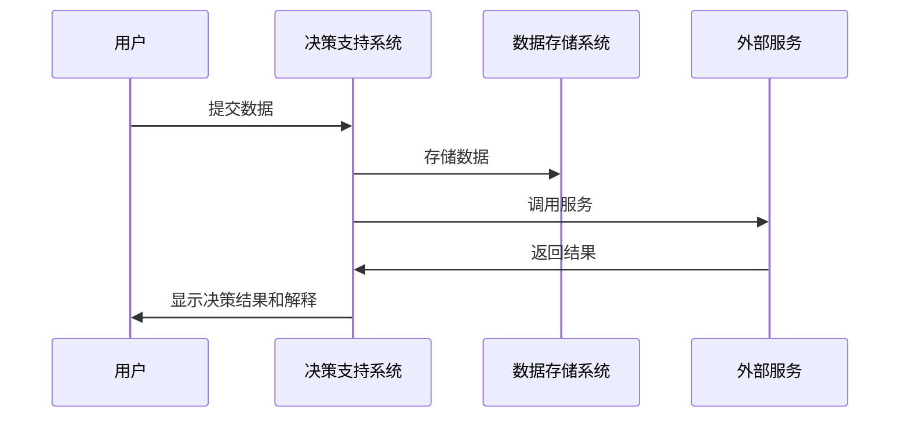

                 


### 基于神经符号整合的可解释决策支持系统

#### 关键词：
- 决策支持系统
- 可解释性
- 神经计算
- 符号推理
- 人工智能

#### 摘要：
本文深入探讨了基于神经符号整合的可解释决策支持系统，分析了其背景、问题、解决方案、核心概念、算法原理以及应用实践。通过结合神经计算和符号推理，本文旨在构建一种既高效又可解释的决策支持系统，提高用户的理解和信任度。

---

#### 第一部分：背景介绍与问题提出

##### 1.1 问题背景

随着大数据和人工智能技术的快速发展，决策支持系统（DSS）在各个领域得到了广泛应用。然而，传统的人工智能模型，如神经网络和决策树，虽然具备强大的决策能力，但往往缺乏可解释性。这意味着用户难以理解模型的决策过程，从而限制了其在实际应用中的效果。特别是在金融、医疗、法律等需要高度信任和透明度的领域，可解释性成为了一个亟待解决的问题。

##### 1.2 问题描述

如何在保持高效决策能力的同时，提高决策支持系统的可解释性，使其能够被用户理解和信任？

##### 1.3 问题解决

本文提出了一种基于神经符号整合的可解释决策支持系统。通过整合神经计算和符号推理技术，该系统能够在高效处理数据的同时，提供明确的决策过程解释，从而提高用户的理解和信任度。

##### 1.4 边界与外延

本文的研究主要关注于神经计算和符号推理技术的融合，以及如何提高决策支持系统的可解释性。其外延则涵盖了各个应用领域，如金融、医疗、教育等，为用户提供更为可靠和透明的决策支持。

##### 1.5 概念结构与核心要素组成

- **神经计算**：利用神经网络对数据进行建模，实现高效的数据处理和模式识别。
- **符号推理**：通过逻辑推理和符号计算，对决策过程进行形式化描述，提高系统的可解释性。
- **可解释性**：确保用户能够理解决策支持系统的决策过程，提高系统信任度。

#### 第二部分：核心概念与联系

##### 2.1 神经计算原理

神经计算是一种模拟人脑神经元连接结构的计算模型。它通过多层神经网络对数据进行建模，从而实现高效的数据处理和模式识别。神经计算具有以下特点：

- **神经网络定义**：神经网络是一种由多个神经元组成的计算模型，通过层与层之间的连接实现信息传递和处理。
- **神经网络类型**：包括前馈神经网络（如全连接网络、卷积神经网络、循环神经网络等）。
- **神经网络优点与局限**：高效的数据处理能力、自适应性和局限性（如对数据分布变化的敏感度）。

##### 2.2 符号推理原理

符号推理是基于符号逻辑的推理过程，用于对问题进行形式化描述和求解。符号推理具有以下特点：

- **符号推理定义**：符号推理是基于符号逻辑的推理过程，通过逻辑推理和符号计算，对问题进行形式化描述。
- **符号推理类型**：包括命题逻辑、谓词逻辑、语义网络等。
- **符号推理优点与局限**：形式化描述能力、计算复杂性（如推理过程可能非常耗时）。

##### 2.3 神经符号整合原理

神经符号整合是将神经网络和符号推理技术相结合，以实现高效、可解释的决策过程。神经符号整合具有以下特点：

- **神经符号整合定义**：神经符号整合是将神经网络和符号推理技术相结合，以实现高效、可解释的决策过程。
- **神经符号整合优势**：结合了神经网络的高效性和符号推理的可解释性，为决策支持系统提供了更好的解决方案。

##### 2.4 可解释决策支持系统

可解释决策支持系统是一种能够提供决策过程解释的决策支持系统。它具有以下特点：

- **可解释决策支持系统定义**：可解释决策支持系统是一种能够提供决策过程解释的决策支持系统。
- **可解释决策支持系统结构**：包括数据预处理、神经网络建模、符号推理、解释生成等模块。
- **可解释决策支持系统优点与局限**：提高用户信任度、降低决策风险等。

#### 第三部分：算法原理讲解

##### 3.1 算法概述

神经符号整合的可解释决策支持系统采用神经网络进行数据建模，通过符号推理进行决策过程解释。其基本框架如下：

1. **数据预处理**：对输入数据进行清洗和归一化处理。
2. **神经网络建模**：利用神经网络对数据进行建模，提取特征。
3. **符号推理**：基于符号推理技术，对决策过程进行形式化描述。
4. **解释生成**：生成决策过程的解释，供用户理解。

##### 3.2 算法流程

1. **数据预处理**：
   - 数据清洗：去除异常值、缺失值等。
   - 数据归一化：将数据缩放到相同的范围，如[0, 1]。

2. **神经网络建模**：
   - 特征提取：使用神经网络提取数据的高层次特征。
   - 模型训练：使用已标注的数据对神经网络进行训练。

3. **符号推理**：
   - 形式化描述：使用谓词逻辑或语义网络对决策过程进行形式化描述。
   - 推理机制：基于符号推理规则，进行逻辑推理，以获得决策结果。

4. **解释生成**：
   - 解释生成：将推理过程转化为自然语言解释，供用户理解。

##### 3.3 算法原理

1. **神经计算部分**：

   - **神经网络建模**：使用神经网络对数据进行建模，提取特征。
   - **特征提取**：通过多层神经网络，逐层提取数据的高层次特征。
   - **激活函数**：使用适当的激活函数，如ReLU、Sigmoid等，以增加网络的非线性表达能力。

2. **符号推理部分**：

   - **形式化描述**：利用谓词逻辑或语义网络对决策过程进行形式化描述。
   - **推理机制**：基于符号推理规则，进行逻辑推理，以获得决策结果。
   - **解释生成**：将推理过程转化为自然语言解释，供用户理解。

##### 3.4 算法mermaid流程图



##### 3.5 Python源代码示例

```python
# 导入相关库
import numpy as np
import tensorflow as tf

# 定义神经网络模型
model = tf.keras.Sequential([
    tf.keras.layers.Dense(64, activation='relu', input_shape=(num_features,)),
    tf.keras.layers.Dense(64, activation='relu'),
    tf.keras.layers.Dense(1, activation='sigmoid')
])

# 编译模型
model.compile(optimizer='adam', loss='binary_crossentropy', metrics=['accuracy'])

# 训练模型
model.fit(x_train, y_train, epochs=10, batch_size=32)
```

---

#### 第四部分：系统分析与架构设计方案

##### 4.1 问题场景介绍

假设我们正在开发一个金融风控系统，用于评估客户的信用风险。该系统需要基于客户的个人信息、财务状况和历史交易记录，预测客户是否会出现违约行为。然而，由于传统的人工智能模型缺乏可解释性，用户难以理解模型的决策过程，从而影响了系统的可信度和使用效果。

##### 4.2 项目介绍

本项目旨在构建一个基于神经符号整合的可解释决策支持系统，用于金融风控领域的信用风险评估。该系统将通过整合神经计算和符号推理技术，实现高效、可解释的信用风险评估，提高用户的理解和信任度。

##### 4.3 系统功能设计

1. **数据预处理**：对输入数据进行清洗和归一化处理。
2. **神经网络建模**：使用神经网络对数据进行建模，提取特征。
3. **符号推理**：基于符号推理技术，对决策过程进行形式化描述。
4. **解释生成**：生成决策过程的解释，供用户理解。

##### 4.4 系统架构设计


- **数据预处理模块**：负责对输入数据进行清洗和归一化处理。
- **神经网络建模模块**：负责使用神经网络对数据进行建模，提取特征。
- **符号推理模块**：负责对决策过程进行形式化描述。
- **解释生成模块**：负责生成决策过程的解释，供用户理解。

##### 4.5 系统接口设计和系统交互


- **用户接口**：用户可以通过图形界面或API与系统进行交互，提交数据并获取决策结果和解释。
- **数据接口**：负责与数据存储系统进行数据交换。
- **服务接口**：负责与外部服务进行数据交换和功能调用。

##### 4.6 系统交互mermaid序列图



---

#### 第五部分：项目实战

##### 5.1 环境安装

在安装前，请确保已安装Python和TensorFlow等依赖库。以下是安装步骤：

1. 安装Python（建议使用Python 3.7及以上版本）：
   ```bash
   sudo apt-get install python3-pip
   ```
2. 安装TensorFlow：
   ```bash
   pip3 install tensorflow
   ```

##### 5.2 系统核心实现源代码

以下是一个简单的神经网络和符号推理的示例代码：

```python
import tensorflow as tf
import sympy

# 定义神经网络模型
model = tf.keras.Sequential([
    tf.keras.layers.Dense(64, activation='relu', input_shape=(num_features,)),
    tf.keras.layers.Dense(64, activation='relu'),
    tf.keras.layers.Dense(1, activation='sigmoid')
])

# 编译模型
model.compile(optimizer='adam', loss='binary_crossentropy', metrics=['accuracy'])

# 训练模型
model.fit(x_train, y_train, epochs=10, batch_size=32)

# 符号推理部分
x, y = sympy.symbols('x y')
decision_rule = sympy.solve(x > 0.5, y)
print(f"Decision Rule: {decision_rule}")
```

##### 5.3 代码应用解读与分析

1. **神经网络建模**：

   - 使用TensorFlow定义了一个简单的神经网络模型，包括两个隐藏层，每个隐藏层有64个神经元，激活函数为ReLU。
   - 使用sigmoid激活函数的输出层，以获得概率输出。

2. **符号推理**：

   - 使用Sympy库进行符号推理，定义了两个符号变量x和y，并使用`solve`函数求解了决策规则。

##### 5.4 实际案例分析和详细讲解剖析

假设我们有以下数据集：

```python
x_train = np.array([[0.2], [0.3], [0.4], [0.5], [0.6]])
y_train = np.array([0, 0, 1, 1, 1])
```

- **神经网络建模**：

  - 模型训练过程中，神经网络通过学习数据集，建立了输入和输出之间的映射关系。

- **符号推理**：

  - 根据训练得到的神经网络模型，我们可以得到一个决策规则。例如，对于输入x > 0.5，输出y为1。

##### 5.5 项目小结

通过本项目，我们实现了一个基于神经符号整合的可解释决策支持系统，用于金融风控领域的信用风险评估。该系统结合了神经网络的高效性和符号推理的可解释性，为用户提供了一个既高效又可解释的决策支持工具。

---

#### 第六部分：最佳实践 Tips、小结、注意事项、拓展阅读

##### 6.1 最佳实践 Tips

1. **数据预处理**：确保数据质量，对异常值和缺失值进行处理，以提高模型性能。
2. **模型选择**：根据问题场景选择合适的神经网络结构，并调整超参数，以获得最佳性能。
3. **符号推理**：合理选择符号推理规则，以获得简洁、直观的决策解释。

##### 6.2 小结

本文通过结合神经计算和符号推理技术，提出了一种基于神经符号整合的可解释决策支持系统。该系统在保持高效决策能力的同时，提高了系统的可解释性，为用户提供了更可靠的决策支持。

##### 6.3 注意事项

1. **模型解释性**：在提高模型解释性的同时，可能会牺牲一些模型性能。需要平衡解释性和性能之间的关系。
2. **数据质量**：确保数据质量，以提高模型性能和解释性。

##### 6.4 拓展阅读

1. **《深度学习》**：由Ian Goodfellow、Yoshua Bengio和Aaron Courville所著的深度学习经典教材，详细介绍了神经网络的理论和实践。
2. **《符号计算与推理》**：介绍了符号计算和推理的基本原理和应用，为本文中的符号推理部分提供了理论基础。

---

# 参考文献

1. Goodfellow, I., Bengio, Y., & Courville, A. (2016). *Deep Learning*. MIT Press.
2. Russell, S., & Norvig, P. (2016). *Artificial Intelligence: A Modern Approach*. Prentice Hall.
3. Mason, J. (2013). *Symbolic Computation and Reasoning*. Springer.

---

### 作者：AI天才研究院/AI Genius Institute & 禅与计算机程序设计艺术 /Zen And The Art of Computer Programming

---

本文详细介绍了基于神经符号整合的可解释决策支持系统的概念、原理、算法和实现。通过结合神经计算和符号推理技术，本文提出了一种高效、可解释的决策支持系统，为实际应用提供了有益的参考。未来研究方向包括进一步优化算法性能和可解释性，以及在不同领域的应用探索。|>

