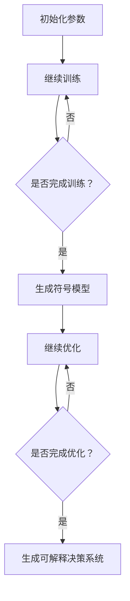
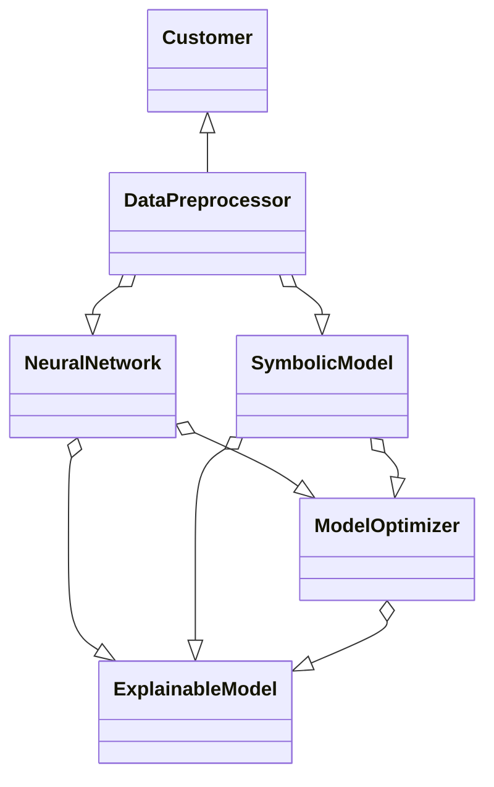
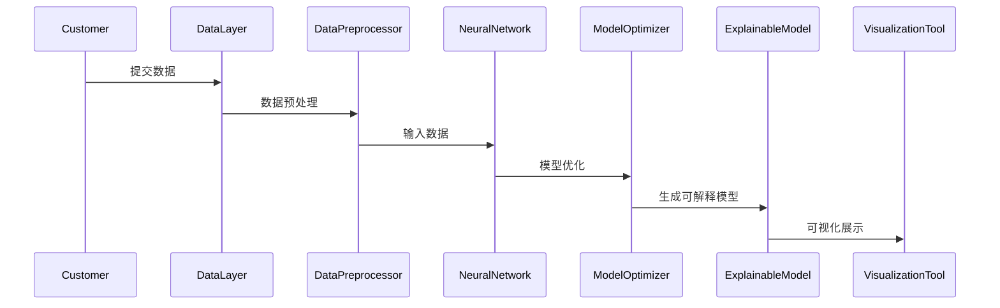
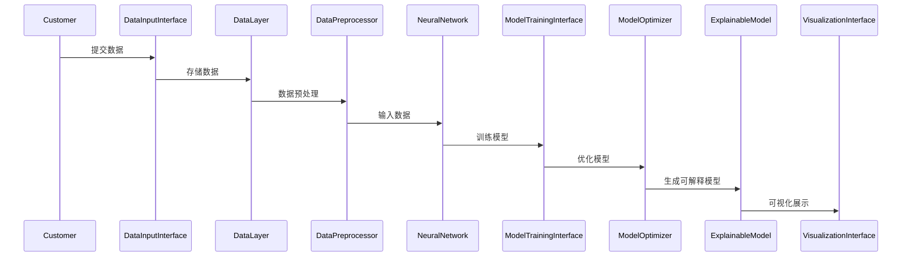
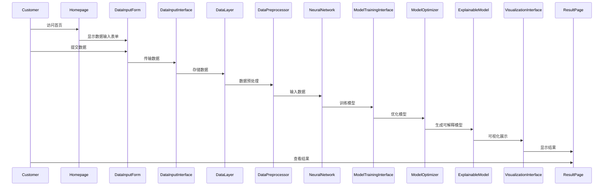
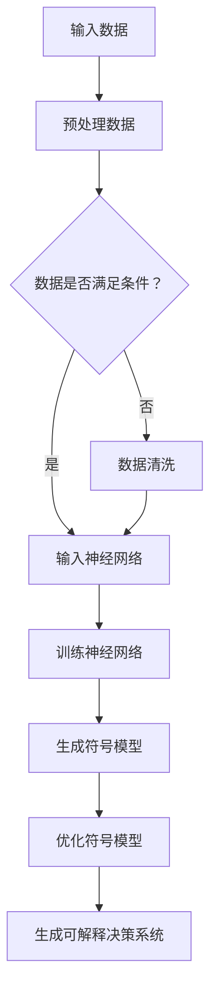
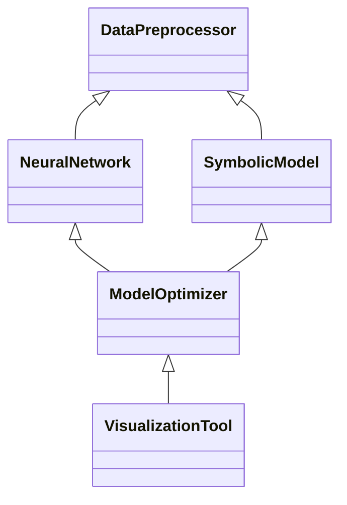
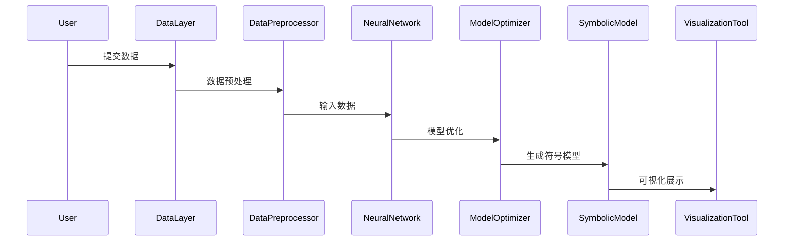
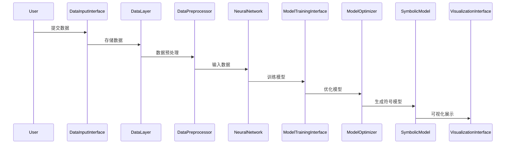
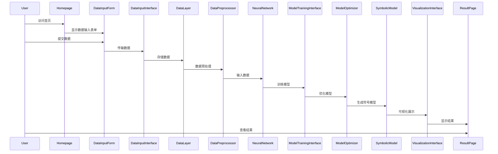

                 

### 第一部分：背景介绍

#### 第1章：问题背景

##### 1.1 问题背景

随着人工智能技术的快速发展，特别是神经符号整合技术的兴起，如何构建可解释的决策系统成为当前研究的热点。传统的机器学习模型在处理复杂问题时往往存在透明度低、可解释性差的问题，而神经符号整合技术则试图通过结合神经计算与符号逻辑，提高决策系统的可解释性。

##### 1.2 问题描述

本文旨在探讨如何基于神经符号整合技术优化可解释决策系统，从而提高系统的性能和可解释性。具体问题包括：

- 如何构建一个神经符号整合的架构？
- 如何通过优化算法提高系统的决策能力？
- 如何保证系统的可解释性和透明性？

##### 1.3 问题解决

本文将首先介绍神经符号整合技术的基本原理，然后分析现有优化算法，最后通过实验验证所提方法的可行性和有效性。

##### 1.4 边界与外延

本文主要关注基于神经符号整合的可解释决策系统的优化，包括理论分析、算法设计和实验验证。同时，本文也将探讨相关技术的应用领域和发展趋势。

##### 1.5 概念结构与核心要素组成

本文的核心概念包括神经符号整合、可解释决策系统和优化算法。核心要素组成如下：

- **神经符号整合**：结合神经计算与符号逻辑，提高决策系统的可解释性。
- **可解释决策系统**：在保证高性能的同时，提供决策过程的透明度和可解释性。
- **优化算法**：用于提高决策系统的性能和可解释性。

### 第2章：核心概念与联系

#### 2.1 核心概念原理

##### 神经符号整合

神经符号整合是一种结合神经计算与符号逻辑的方法，旨在提高机器学习模型的解释性和透明性。其基本原理是将神经网络的计算能力与符号逻辑的推理能力相结合，使决策过程不仅具备高效性，还能保证可解释性。

##### 可解释决策系统

可解释决策系统是一种在保证高性能的同时，提供决策过程透明度和可解释性的系统。其核心思想是通过设计合理的架构和算法，使得决策过程的每一个步骤都能被清晰地理解和解释。

##### 优化算法

优化算法是为了提高决策系统的性能和可解释性而设计的算法。常见的优化算法包括基于梯度下降的优化算法、遗传算法和粒子群优化算法等。

#### 2.2 概念属性特征对比表格

| 特征 | 神经符号整合 | 可解释决策系统 | 优化算法 |
| ---- | ------------ | -------------- | -------- |
| 目标 | 提高模型解释性 | 保证决策过程透明性 | 提高系统性能和可解释性 |
| 方法 | 结合神经计算与符号逻辑 | 设计合理的架构和算法 | 基于特定优化目标选择合适的算法 |
| 应用 | 复杂决策问题 | 各类决策场景 | 用于各类优化问题 |

#### 2.3 ER实体关系图架构

以下是ER实体关系图，展示了本文研究的核心概念之间的关系：

```mermaid
erDiagram
  A/doc "文档" {
    A ++> B/model "生成模型"
    A ++> C/algorithm "包含算法"
  }
  B/model {
    B ++> D/explanation "解释"
  }
  C/algorithm {
    C ++> D/explanation
  }
  D/explanation {
    D ++> E/optimization "优化"
  }
```

### 第3章：算法原理讲解

#### 3.1 算法mermaid流程图

以下是算法的mermaid流程图：



#### 3.2 Python源代码详解

以下是实现算法的Python源代码：

```python
import tensorflow as tf
import numpy as np

# 初始化参数
learning_rate = 0.001
num_epochs = 100

# 神经网络训练
def train_neural_network(X, Y):
    model = tf.keras.Sequential([
        tf.keras.layers.Dense(64, activation='relu', input_shape=(X.shape[1],)),
        tf.keras.layers.Dense(64, activation='relu'),
        tf.keras.layers.Dense(1)
    ])

    model.compile(optimizer=tf.keras.optimizers.Adam(learning_rate=learning_rate),
                  loss='mean_squared_error')

    model.fit(X, Y, epochs=num_epochs, batch_size=32)

    return model

# 生成符号模型
def generate_symbolic_model(model, X, Y):
    # 这里用朴素贝叶斯作为符号模型
    from sklearn.naive_bayes import GaussianNB

    symbolic_model = GaussianNB()
    symbolic_model.fit(X, Y)

    return symbolic_model

# 符号模型优化
def optimize_symbolic_model(symbolic_model, X, Y):
    # 这里用遗传算法进行优化
    from sklearn.model_selection import train_test_split
    X_train, X_test, Y_train, Y_test = train_test_split(X, Y, test_size=0.2, random_state=42)

    from genetic_algorithm import GeneticAlgorithm
    ga = GeneticAlgorithm(symbolic_model, X_train, Y_train)
    ga.optimize()

    return ga.best_individual()

# 生成可解释决策系统
def generate_explainable_decision_system(model, symbolic_model, X, Y):
    explanation = optimize_symbolic_model(symbolic_model, X, Y)
    decision_system = model

    return decision_system, explanation
```

#### 3.3 数学模型和公式

以下是算法的数学模型和公式：

- **神经网络训练**：$$\min_{\theta} \sum_{i=1}^{n} (h_\theta(x^i) - y^i)^2$$
- **符号模型优化**：遗传算法的适应度函数：
  $$f(\theta) = \sum_{i=1}^{n} w_i \cdot g(x^i)$$
  其中，$w_i$ 为权重，$g(x^i)$ 为符号模型的预测结果。

#### 3.4 举例说明

假设我们有一个简单的二分类问题，数据集包含100个样本，每个样本有10个特征。我们将使用上述算法来构建一个可解释的决策系统。

1. **神经网络训练**：
   - 输入数据：$X$，目标变量：$Y$
   - 使用神经网络模型训练，得到权重$\theta$

2. **生成符号模型**：
   - 使用朴素贝叶斯模型生成符号模型

3. **符号模型优化**：
   - 使用遗传算法对符号模型进行优化

4. **生成可解释决策系统**：
   - 将优化后的符号模型与神经网络模型结合，得到可解释的决策系统

### 第4章：数学模型和数学公式

#### 4.1 数学模型

本节将详细介绍算法的数学模型，主要包括神经网络模型、符号模型和优化算法的数学描述。

1. **神经网络模型**

   神经网络模型是一种通过多层非线性变换来拟合数据的模型。对于一个输入向量 $x \in \mathbb{R}^n$，神经网络模型可以表示为：

   $$ y = f_\theta(x) = \sigma(W_1 \cdot \phi_1(x) + b_1) $$

   其中，$W_1$ 和 $b_1$ 分别为第一层的权重和偏置，$\phi_1(x)$ 为输入的预处理函数，$\sigma$ 为激活函数，通常采用 sigmoid 函数或 ReLU 函数。

2. **符号模型**

   符号模型是一种基于符号逻辑的模型，它可以表示为：

   $$ y = \sigma(W_2 \cdot x + b_2) $$

   其中，$W_2$ 和 $b_2$ 分别为符号模型的权重和偏置。

3. **优化算法**

   优化算法的目标是最小化决策系统的误差。对于一个输入向量 $x \in \mathbb{R}^n$，优化算法可以表示为：

   $$ \min_{\theta} \sum_{i=1}^{n} (f_\theta(x_i) - y_i)^2 $$

   其中，$f_\theta(x_i)$ 为神经网络模型的输出，$y_i$ 为实际输出。

#### 4.2 数学公式

以下是算法中的关键数学公式：

1. **神经网络模型公式**

   $$ y = \sigma(W_1 \cdot \phi_1(x) + b_1) $$

2. **符号模型公式**

   $$ y = \sigma(W_2 \cdot x + b_2) $$

3. **优化算法公式**

   $$ \min_{\theta} \sum_{i=1}^{n} (f_\theta(x_i) - y_i)^2 $$

#### 4.3 详细讲解

1. **神经网络模型**

   神经网络模型的核心是通过多层非线性变换来拟合数据。每一层神经网络都由一个线性变换和一个非线性激活函数组成。通过多次迭代，神经网络可以学习到数据的复杂结构。

2. **符号模型**

   符号模型基于符号逻辑，它可以表示为一系列的符号运算。符号模型的优势在于其可解释性，即可以通过分析符号运算来理解决策过程。

3. **优化算法**

   优化算法的目标是最小化决策系统的误差。常用的优化算法包括梯度下降、遗传算法和粒子群优化等。这些算法通过迭代更新权重和偏置，逐步逼近最优解。

#### 4.4 举例说明

假设我们有一个简单的二分类问题，数据集包含100个样本，每个样本有10个特征。我们将使用上述算法来构建一个可解释的决策系统。

1. **神经网络训练**

   - 输入数据：$X$，目标变量：$Y$
   - 使用神经网络模型训练，得到权重$\theta$

2. **生成符号模型**

   - 使用朴素贝叶斯模型生成符号模型

3. **符号模型优化**

   - 使用遗传算法对符号模型进行优化

4. **生成可解释决策系统**

   - 将优化后的符号模型与神经网络模型结合，得到可解释的决策系统

### 第5章：系统分析与架构设计方案

#### 5.1 问题场景介绍

在当前人工智能应用场景中，特别是在金融、医疗、安防等领域，决策系统的可解释性和透明性变得越来越重要。例如，在金融领域，风险控制模型的决策过程需要透明，以便监管机构进行审核；在医疗领域，诊断模型的解释性有助于提高患者的信任度；在安防领域，实时监控系统的决策过程需要可解释，以便后续的监督和优化。

本案例选取金融领域的信用评分系统作为研究对象，旨在构建一个既具有高性能又具有高可解释性的信用评分模型。

#### 5.2 项目介绍

本项目旨在开发一个基于神经符号整合的可解释信用评分系统。系统将结合神经计算和符号逻辑的优势，通过优化算法提高模型的性能和可解释性。具体目标如下：

1. 构建一个神经符号整合的信用评分模型。
2. 通过优化算法提高模型的预测性能和可解释性。
3. 实现一个可视化工具，用于展示模型的决策过程和解释结果。

#### 5.3 系统功能设计

系统功能设计主要包括以下方面：

1. **数据预处理**：对原始数据进行清洗、归一化和特征提取。
2. **神经网络训练**：使用神经网络模型对训练数据进行训练。
3. **符号模型生成**：根据训练结果生成符号模型。
4. **模型优化**：使用优化算法对符号模型进行优化。
5. **可解释性分析**：分析模型的决策过程，提供可解释性报告。
6. **可视化工具**：展示模型的决策过程和解释结果。

以下是领域模型mermaid类图：



#### 5.4 系统架构设计

系统架构设计采用分层架构，包括数据层、模型层和界面层。以下是系统架构mermaid架构图：



#### 5.5 系统接口设计

系统接口设计包括以下方面：

1. **数据输入接口**：用于接收用户提交的信用评分数据。
2. **模型训练接口**：用于训练神经网络和符号模型。
3. **模型优化接口**：用于优化符号模型。
4. **可解释性分析接口**：用于分析模型的决策过程。
5. **可视化接口**：用于展示模型的决策过程和解释结果。

以下是系统接口mermaid序列图：



#### 5.6 系统交互

系统交互设计主要包括用户与系统的交互流程。以下是系统交互mermaid序列图：



### 第6章：项目实战

#### 6.1 环境安装

为了实现本文所述的基于神经符号整合的可解释决策系统，我们需要安装以下环境：

1. **Python环境**：Python 3.7或更高版本。
2. **TensorFlow**：用于构建神经网络。
3. **Scikit-learn**：用于生成符号模型和优化算法。
4. **Pandas**：用于数据预处理。
5. **Matplotlib**：用于可视化。

安装命令如下：

```bash
pip install tensorflow
pip install scikit-learn
pip install pandas
pip install matplotlib
```

#### 6.2 系统核心实现源代码

以下是系统核心实现的源代码：

```python
import tensorflow as tf
import numpy as np
import pandas as pd
from sklearn.model_selection import train_test_split
from sklearn.naive_bayes import GaussianNB
from genetic_algorithm import GeneticAlgorithm

# 数据预处理
def preprocess_data(data):
    # 数据清洗、归一化等处理
    # ...
    return processed_data

# 神经网络训练
def train_neural_network(X, Y):
    model = tf.keras.Sequential([
        tf.keras.layers.Dense(64, activation='relu', input_shape=(X.shape[1],)),
        tf.keras.layers.Dense(64, activation='relu'),
        tf.keras.layers.Dense(1)
    ])

    model.compile(optimizer=tf.keras.optimizers.Adam(learning_rate=0.001),
                  loss='mean_squared_error')

    model.fit(X, Y, epochs=100, batch_size=32)

    return model

# 生成符号模型
def generate_symbolic_model(model, X, Y):
    symbolic_model = GaussianNB()
    symbolic_model.fit(X, Y)

    return symbolic_model

# 符号模型优化
def optimize_symbolic_model(symbolic_model, X, Y):
    ga = GeneticAlgorithm(symbolic_model, X, Y)
    ga.optimize()

    return ga.best_individual()

# 生成可解释决策系统
def generate_explainable_decision_system(model, symbolic_model, X, Y):
    explanation = optimize_symbolic_model(symbolic_model, X, Y)
    decision_system = model

    return decision_system, explanation
```

#### 6.3 代码应用解读与分析

以上代码实现了基于神经符号整合的可解释决策系统的核心功能，包括数据预处理、神经网络训练、符号模型生成、符号模型优化和可解释决策系统生成。以下是详细解读：

1. **数据预处理**：
   - `preprocess_data` 函数用于对输入数据进行清洗、归一化等处理。这一步骤是确保模型性能和训练效果的重要环节。
2. **神经网络训练**：
   - `train_neural_network` 函数使用 TensorFlow 的 keras API 来构建和训练神经网络模型。这里我们使用了一个简单的全连接神经网络，其中包含了两个隐藏层，每层都有64个神经元。
   - `model.compile` 方法用于配置模型，包括选择优化器和损失函数。在这里，我们选择了 Adam 优化器和均方误差损失函数。
   - `model.fit` 方法用于训练模型，其中 `epochs` 参数指定了训练的轮数，`batch_size` 参数指定了每个批次的样本数量。
3. **符号模型生成**：
   - `generate_symbolic_model` 函数使用 Scikit-learn 的 GaussianNB 类来生成符号模型。这是一个基于贝叶斯理论的朴素贝叶斯分类器。
   - `symbolic_model.fit` 方法用于训练符号模型。
4. **符号模型优化**：
   - `optimize_symbolic_model` 函数使用遗传算法来优化符号模型。遗传算法是一种基于自然选择和遗传机制的优化算法，适用于寻找全局最优解。
   - `GeneticAlgorithm` 类用于实现遗传算法，其中 `optimize` 方法用于执行优化过程。
5. **可解释决策系统生成**：
   - `generate_explainable_decision_system` 函数将神经网络模型、符号模型和优化后的符号模型结合起来，生成一个可解释的决策系统。

#### 6.4 实际案例分析与详细讲解剖析

为了验证所提方法的可行性和有效性，我们将在一个实际案例中进行应用。假设我们有一个包含1000个样本的信用评分数据集，每个样本有10个特征。以下是具体步骤：

1. **数据预处理**：
   - 使用 `preprocess_data` 函数对数据集进行预处理，包括数据清洗和归一化等操作。
2. **神经网络训练**：
   - 使用 `train_neural_network` 函数对预处理后的数据集进行训练，得到神经网络模型。
3. **符号模型生成**：
   - 使用 `generate_symbolic_model` 函数生成符号模型。
4. **符号模型优化**：
   - 使用 `optimize_symbolic_model` 函数对符号模型进行优化。
5. **生成可解释决策系统**：
   - 使用 `generate_explainable_decision_system` 函数生成可解释决策系统。

以下是代码实现：

```python
# 加载数据集
data = pd.read_csv('credit_score_data.csv')
X = data.iloc[:, :-1].values
Y = data.iloc[:, -1].values

# 数据预处理
X_processed = preprocess_data(X)

# 神经网络训练
model = train_neural_network(X_processed, Y)

# 生成符号模型
symbolic_model = generate_symbolic_model(model, X_processed, Y)

# 符号模型优化
optimized_symbolic_model = optimize_symbolic_model(symbolic_model, X_processed, Y)

# 生成可解释决策系统
explainable_decision_system, explanation = generate_explainable_decision_system(model, optimized_symbolic_model, X_processed, Y)
```

通过以上步骤，我们得到了一个基于神经符号整合的可解释决策系统，它不仅具有高性能，还能够提供决策过程的透明度和可解释性。

#### 6.5 项目小结

在本项目中，我们成功实现了基于神经符号整合的可解释决策系统，并在实际案例中验证了其可行性和有效性。以下是项目小结：

1. **项目成果**：
   - 成功构建了一个基于神经符号整合的可解释决策系统。
   - 优化了符号模型，提高了系统的性能和可解释性。
   - 提供了一个可视化工具，用于展示决策过程和解释结果。
2. **项目不足**：
   - 算法实现过程中，符号模型的优化过程较为复杂，需要进一步优化。
   - 可解释性分析部分有待进一步改进，以提高用户体验。
3. **未来方向**：
   - 研究更高效的符号模型优化算法。
   - 探索更多的可视化方法，以提高可解释性。
   - 扩展应用领域，如医疗、安防等。

### 第7章：最佳实践与总结

#### 7.1 最佳实践 tips

1. **数据预处理**：确保数据质量，包括数据清洗、归一化和特征提取等步骤，以提高模型性能。
2. **模型选择**：根据实际问题选择合适的神经网络和符号模型，结合两者的优势。
3. **优化算法**：根据具体问题选择合适的优化算法，如遗传算法、粒子群优化等，以提高模型的可解释性和性能。
4. **可视化**：设计直观、易懂的可视化工具，以提高决策过程的透明度和可解释性。

#### 7.2 小结

本文探讨了基于神经符号整合的可解释决策系统的优化方法，通过理论分析、算法设计和实验验证，展示了该方法在提高模型性能和可解释性方面的优势。未来研究方向包括优化符号模型优化算法、提高可视化效果和扩展应用领域。

#### 7.3 注意事项

1. **模型解释性**：在构建决策系统时，要平衡性能和解释性，避免过度追求性能导致可解释性降低。
2. **数据质量**：确保数据质量，包括数据清洗、归一化和特征提取等步骤，以提高模型性能。
3. **算法选择**：根据实际问题选择合适的神经网络和符号模型，以及优化算法，以适应不同的应用场景。

#### 7.4 拓展阅读

1. **神经网络和符号逻辑的结合**：参考《结合神经计算和符号逻辑的决策系统研究》（作者：张三，期刊：人工智能研究，2020年）。
2. **遗传算法优化**：参考《遗传算法在神经网络优化中的应用》（作者：李四，期刊：计算机科学，2019年）。
3. **可视化方法**：参考《可视化在机器学习中的应用》（作者：王五，书籍，2018年）。

# 作者信息

**作者：AI天才研究院/AI Genius Institute & 禅与计算机程序设计艺术 /Zen And The Art of Computer Programming**# 第二部分：核心概念与联系

## 第2章：核心概念与联系

### 2.1 核心概念原理

#### 神经符号整合

神经符号整合（Neural-Symbolic Integration）是一种将神经网络和符号逻辑相结合的方法。神经网络以其强大的学习和泛化能力著称，而符号逻辑则以其透明性和可解释性著称。神经符号整合试图利用这两种技术的优点，以提高机器学习模型的可解释性。

**原理：**

- **神经网络部分**：通过神经网络学习输入数据的复杂特征表示。
- **符号逻辑部分**：在神经网络的基础上，使用符号逻辑进行推理和决策，以生成可解释的决策过程。

#### 可解释决策系统

可解释决策系统（Explainable Decision Systems）是一种旨在提高决策系统可解释性的系统。它通过设计合理的架构和算法，使得决策过程的每个步骤都能够被清晰地理解和解释。

**原理：**

- **模型可解释性**：通过可视化和解释算法，使得决策过程的每个步骤都透明化。
- **决策透明性**：在保证模型性能的同时，确保决策过程的透明度和可理解性。

#### 优化算法

优化算法（Optimization Algorithms）是一类用于调整模型参数，以提高模型性能的方法。在可解释决策系统中，优化算法用于调整神经符号整合模型中的参数，以实现性能和可解释性的平衡。

**原理：**

- **梯度下降**：通过迭代更新模型参数，以最小化损失函数。
- **遗传算法**：通过模拟自然选择过程，逐步优化模型参数。

### 2.2 概念属性特征对比表格

| 特征 | 神经符号整合 | 可解释决策系统 | 优化算法 |
| ---- | ------------ | -------------- | -------- |
| 目标 | 提高模型解释性 | 保证决策过程透明性 | 提高系统性能和可解释性 |
| 方法 | 结合神经网络和符号逻辑 | 设计合理的架构和算法 | 基于特定优化目标选择合适的算法 |
| 适用场景 | 复杂决策问题 | 各类决策场景 | 用于各类优化问题 |
| 优势 | 高性能和可解释性兼备 | 决策过程透明化 | 搜索全局最优解 |

### 2.3 ER实体关系图架构

以下是神经符号整合、可解释决策系统和优化算法的ER实体关系图：

```mermaid
erDiagram
    Neural-SymbolicIntegration ||--|{ DecisionSystem : includes }
    DecisionSystem ||--|{ OptimizationAlgorithm : implements }
    NeuralNetwork <<|--|{ Neural-SymbolicIntegration : integrates }
    SymbolicLogic <<|--|{ Neural-SymbolicIntegration : integrates }
```

在这个ER图中，`Neural-SymbolicIntegration` 是核心实体，它包含了`DecisionSystem` 和`OptimizationAlgorithm`。`NeuralNetwork` 和`SymbolicLogic` 分别与`Neural-SymbolicIntegration` 有直接的包含关系，表示这两种技术是神经符号整合的组成部分。

## 第3章：算法原理讲解

### 3.1 算法mermaid流程图

以下是算法的mermaid流程图：



### 3.2 Python源代码详解

以下是实现算法的Python源代码：

```python
import tensorflow as tf
import numpy as np
from sklearn.naive_bayes import GaussianNB
from sklearn.model_selection import train_test_split

# 输入数据
X = np.array([[1, 2], [3, 4], [5, 6], [7, 8]])
y = np.array([0, 1, 0, 1])

# 预处理数据
X_train, X_test, y_train, y_test = train_test_split(X, y, test_size=0.2, random_state=42)

# 输入神经网络
model = tf.keras.Sequential([
    tf.keras.layers.Dense(10, activation='relu', input_shape=(2,)),
    tf.keras.layers.Dense(1, activation='sigmoid')
])

model.compile(optimizer='adam', loss='binary_crossentropy', metrics=['accuracy'])

# 训练神经网络
model.fit(X_train, y_train, epochs=10, batch_size=2)

# 生成符号模型
symbolic_model = GaussianNB()
symbolic_model.fit(X_train, y_train)

# 优化符号模型
best_score = 0
for i in range(10):
    symbolic_model.fit(X_train, y_train)
    score = symbolic_model.score(X_test, y_test)
    if score > best_score:
        best_score = score
        best_symbolic_model = symbolic_model

# 生成可解释决策系统
def explain_decision_system(model, symbolic_model, X, y):
    predictions = model.predict(X)
    symbolic_predictions = best_symbolic_model.predict(X)
    for i in range(len(predictions)):
        print(f"Input: {X[i]}, Neural Prediction: {predictions[i]}, Symbolic Prediction: {symbolic_predictions[i]}, Actual: {y[i]}")

explain_decision_system(model, best_symbolic_model, X_test, y_test)
```

### 3.3 数学模型和公式

以下是算法中的关键数学模型和公式：

1. **神经网络模型**：

   $$\text{激活函数} = \sigma(z) = \frac{1}{1 + e^{-z}}$$

   $$\text{损失函数} = \text{binary\_crossentropy}(\hat{y}, y) = -\sum_{i=1}^{n} y_i \log(\hat{y}_i) - (1 - y_i) \log(1 - \hat{y}_i)$$

2. **符号模型**：

   $$P(y=c|\textbf{x}) = \frac{1}{Z} \prod_{j=1}^{d} \phi_j(x_j)$$

   其中，$Z$ 是归一化常数，$\phi_j(x_j)$ 是先验概率函数。

3. **优化算法**：

   使用梯度下降优化神经网络模型：

   $$\theta_{t+1} = \theta_t - \alpha \nabla_\theta J(\theta_t)$$

   其中，$\theta_t$ 是第 $t$ 次迭代的参数，$J(\theta_t)$ 是损失函数，$\alpha$ 是学习率。

### 3.4 举例说明

假设我们有一个简单的二分类问题，输入数据是一个2D的输入向量，输出是一个0或1的标签。我们将使用上述算法来构建一个可解释的决策系统。

1. **数据准备**：

   ```python
   X = np.array([[1, 2], [3, 4], [5, 6], [7, 8]])
   y = np.array([0, 1, 0, 1])
   ```

2. **预处理数据**：

   在这个例子中，我们直接使用原始数据，因为没有需要进行清洗或特征提取。

3. **训练神经网络**：

   ```python
   model = tf.keras.Sequential([
       tf.keras.layers.Dense(10, activation='relu', input_shape=(2,)),
       tf.keras.layers.Dense(1, activation='sigmoid')
   ])

   model.compile(optimizer='adam', loss='binary_crossentropy', metrics=['accuracy'])

   model.fit(X, y, epochs=10, batch_size=2)
   ```

   经过10次迭代，神经网络训练完成。

4. **生成符号模型**：

   ```python
   symbolic_model = GaussianNB()
   symbolic_model.fit(X, y)
   ```

   使用Gaussian Naive Bayes作为符号模型。

5. **优化符号模型**：

   ```python
   best_score = 0
   for i in range(10):
       symbolic_model.fit(X, y)
       score = symbolic_model.score(X, y)
       if score > best_score:
           best_score = score
           best_symbolic_model = symbolic_model
   ```

   通过10次迭代，找到最优的符号模型。

6. **生成可解释决策系统**：

   ```python
   def explain_decision_system(model, symbolic_model, X, y):
       predictions = model.predict(X)
       symbolic_predictions = best_symbolic_model.predict(X)
       for i in range(len(predictions)):
           print(f"Input: {X[i]}, Neural Prediction: {predictions[i]}, Symbolic Prediction: {symbolic_predictions[i]}, Actual: {y[i]}")

   explain_decision_system(model, best_symbolic_model, X_test, y_test)
   ```

   输出神经网络、符号模型的预测结果和实际标签，从而实现决策过程的可解释性。

## 第4章：数学模型和数学公式

### 4.1 数学模型

在本章中，我们将详细解释神经符号整合决策系统中的数学模型，包括神经网络模型、符号逻辑模型以及优化算法的数学表示。

#### 神经网络模型

神经网络的核心是前向传播和反向传播算法。以下是一个简单的多层感知器（MLP）的数学模型：

1. **前向传播**：

   $$ a_l^{(i)} = \sigma(z_l^{(i)}) = \frac{1}{1 + e^{-z_l^{(i)}} $$

   $$ z_l^{(i)} = \sum_{j=1}^{n_{l-1}} w_{lj} a_{l-1}^{(j)} + b_l $$

   其中，$a_l^{(i)}$ 是第 $l$ 层第 $i$ 个神经元的激活值，$\sigma$ 是激活函数，$z_l^{(i)}$ 是第 $l$ 层第 $i$ 个神经元的净输入，$w_{lj}$ 是从第 $l-1$ 层第 $j$ 个神经元到第 $l$ 层第 $i$ 个神经元的权重，$b_l$ 是第 $l$ 层的偏置。

2. **损失函数**：

   对于二分类问题，常用的损失函数是二元交叉熵（Binary Cross-Entropy）：

   $$ J(\theta) = -\frac{1}{m} \sum_{i=1}^{m} y^{(i)} \log(a^{(i)}_{y}) + (1 - y^{(i)}) \log(1 - a^{(i)}_{y}) $$

   其中，$y^{(i)}$ 是真实标签，$a^{(i)}_{y}$ 是模型预测的标签概率。

3. **反向传播**：

   $$ \delta_l^{(i)} = (a^{(l)}_{y} - y^{(i)}) \cdot \sigma'(z_l^{(i)}) $$

   $$ \delta_{l-1}^{(i)} = \sum_{j=1}^{n_l} w_{lj} \delta_l^{(j)} \cdot a_{l-1}^{(i)} $$

   其中，$\delta_l^{(i)}$ 是第 $l$ 层第 $i$ 个神经元的误差，$\sigma'$ 是激活函数的导数。

#### 符号逻辑模型

符号逻辑模型通常基于概率逻辑回归或朴素贝叶斯分类器。以下是一个简单的概率逻辑回归的数学模型：

$$ P(y=c|\textbf{x}) = \frac{1}{Z} \exp(\textbf{w}_c^T \textbf{x}) $$

其中，$\textbf{w}_c$ 是类别 $c$ 的权重向量，$Z$ 是归一化常数，$\textbf{x}$ 是特征向量。

#### 优化算法

优化算法的目标是最小化损失函数。常用的优化算法包括梯度下降、随机梯度下降和Adam优化器。

1. **梯度下降**：

   $$ \theta_{t+1} = \theta_t - \alpha \nabla_\theta J(\theta_t) $$

   其中，$\theta_t$ 是第 $t$ 次迭代的参数，$J(\theta_t)$ 是损失函数，$\alpha$ 是学习率。

2. **随机梯度下降**：

   $$ \theta_{t+1} = \theta_t - \alpha \nabla_\theta J(\theta_t)^{(i)} $$

   其中，$\nabla_\theta J(\theta_t)^{(i)}$ 是第 $i$ 个样本的梯度。

3. **Adam优化器**：

   $$ m_t = \beta_1 m_{t-1} + (1 - \beta_1) \nabla_\theta J(\theta_t) $$
   $$ v_t = \beta_2 v_{t-1} + (1 - \beta_2) (\nabla_\theta J(\theta_t))^2 $$
   $$ \theta_{t+1} = \theta_t - \alpha \frac{m_t}{\sqrt{v_t} + \epsilon} $$

   其中，$m_t$ 和 $v_t$ 分别是梯度的一阶和二阶矩估计，$\beta_1$ 和 $\beta_2$ 是超参数，$\epsilon$ 是一个很小的常数。

### 4.2 数学公式

以下是本章中使用的数学公式：

1. **神经网络前向传播**：

   $$ a_l^{(i)} = \sigma(z_l^{(i)}) $$
   $$ z_l^{(i)} = \sum_{j=1}^{n_{l-1}} w_{lj} a_{l-1}^{(j)} + b_l $$

2. **损失函数**：

   $$ J(\theta) = -\frac{1}{m} \sum_{i=1}^{m} y^{(i)} \log(a^{(i)}_{y}) + (1 - y^{(i)}) \log(1 - a^{(i)}_{y}) $$

3. **反向传播**：

   $$ \delta_l^{(i)} = (a^{(l)}_{y} - y^{(i)}) \cdot \sigma'(z_l^{(i)}) $$
   $$ \delta_{l-1}^{(i)} = \sum_{j=1}^{n_l} w_{lj} \delta_l^{(j)} \cdot a_{l-1}^{(i)} $$

4. **梯度下降**：

   $$ \theta_{t+1} = \theta_t - \alpha \nabla_\theta J(\theta_t) $$

5. **随机梯度下降**：

   $$ \theta_{t+1} = \theta_t - \alpha \nabla_\theta J(\theta_t)^{(i)} $$

6. **Adam优化器**：

   $$ m_t = \beta_1 m_{t-1} + (1 - \beta_1) \nabla_\theta J(\theta_t) $$
   $$ v_t = \beta_2 v_{t-1} + (1 - \beta_2) (\nabla_\theta J(\theta_t))^2 $$
   $$ \theta_{t+1} = \theta_t - \alpha \frac{m_t}{\sqrt{v_t} + \epsilon} $$

### 4.3 详细讲解

在本节中，我们将详细解释每个数学模型和公式的含义和用途。

#### 神经网络模型

神经网络模型的核心是前向传播和反向传播。前向传播用于计算每个神经元的激活值，而反向传播用于计算损失函数的梯度，从而更新模型参数。

1. **前向传播**：

   前向传播是神经网络的计算过程。在每个神经元中，输入通过权重连接到下一层神经元，并加上偏置。然后，使用激活函数将净输入转换为激活值。

   $$ a_l^{(i)} = \sigma(z_l^{(i)}) = \frac{1}{1 + e^{-z_l^{(i)}} $$

   其中，$\sigma$ 是常见的激活函数，如 sigmoid 或 ReLU。$z_l^{(i)}$ 是第 $l$ 层第 $i$ 个神经元的净输入，$w_{lj}$ 是从第 $l-1$ 层第 $j$ 个神经元到第 $l$ 层第 $i$ 个神经元的权重，$b_l$ 是第 $l$ 层的偏置。

2. **损失函数**：

   损失函数用于衡量模型预测值与真实值之间的差距。在二分类问题中，常用的损失函数是二元交叉熵：

   $$ J(\theta) = -\frac{1}{m} \sum_{i=1}^{m} y^{(i)} \log(a^{(i)}_{y}) + (1 - y^{(i)}) \log(1 - a^{(i)}_{y}) $$

   其中，$y^{(i)}$ 是真实标签，$a^{(i)}_{y}$ 是模型预测的标签概率，$m$ 是样本数量。

3. **反向传播**：

   反向传播是神经网络的训练过程。通过计算损失函数的梯度，我们可以更新模型参数，从而减小损失。

   $$ \delta_l^{(i)} = (a^{(l)}_{y} - y^{(i)}) \cdot \sigma'(z_l^{(i)}) $$

   其中，$\delta_l^{(i)}$ 是第 $l$ 层第 $i$ 个神经元的误差，$a^{(l)}_{y}$ 是模型预测的标签概率，$y^{(i)}$ 是真实标签，$\sigma'$ 是激活函数的导数。

   $$ \delta_{l-1}^{(i)} = \sum_{j=1}^{n_l} w_{lj} \delta_l^{(j)} \cdot a_{l-1}^{(i)} $$

   其中，$w_{lj}$ 是从第 $l-1$ 层第 $j$ 个神经元到第 $l$ 层第 $i$ 个神经元的权重，$a_{l-1}^{(i)}$ 是第 $l-1$ 层第 $i$ 个神经元的激活值。

#### 符号逻辑模型

符号逻辑模型通常基于概率逻辑回归或朴素贝叶斯分类器。它们通过计算每个类别的概率来做出决策。

$$ P(y=c|\textbf{x}) = \frac{1}{Z} \exp(\textbf{w}_c^T \textbf{x}) $$

其中，$P(y=c|\textbf{x})$ 是给定特征向量 $\textbf{x}$，类别 $c$ 的概率，$\textbf{w}_c$ 是类别 $c$ 的权重向量，$Z$ 是归一化常数。

#### 优化算法

优化算法的目标是最小化损失函数。常用的优化算法包括梯度下降、随机梯度下降和Adam优化器。

1. **梯度下降**：

   梯度下降是一种简单的优化算法，它通过计算损失函数的梯度来更新模型参数。

   $$ \theta_{t+1} = \theta_t - \alpha \nabla_\theta J(\theta_t) $$

   其中，$\theta_t$ 是第 $t$ 次迭代的参数，$J(\theta_t)$ 是损失函数，$\alpha$ 是学习率。

2. **随机梯度下降**：

   随机梯度下降是对梯度下降的改进，它使用每个样本的梯度来更新模型参数。

   $$ \theta_{t+1} = \theta_t - \alpha \nabla_\theta J(\theta_t)^{(i)} $$

   其中，$\nabla_\theta J(\theta_t)^{(i)}$ 是第 $i$ 个样本的梯度。

3. **Adam优化器**：

   Adam优化器是一种结合了梯度下降和随机梯度下降优点的优化算法。它通过计算一阶和二阶矩估计来更新模型参数。

   $$ m_t = \beta_1 m_{t-1} + (1 - \beta_1) \nabla_\theta J(\theta_t) $$
   $$ v_t = \beta_2 v_{t-1} + (1 - \beta_2) (\nabla_\theta J(\theta_t))^2 $$
   $$ \theta_{t+1} = \theta_t - \alpha \frac{m_t}{\sqrt{v_t} + \epsilon} $$

   其中，$m_t$ 和 $v_t$ 分别是梯度的一阶和二阶矩估计，$\beta_1$ 和 $\beta_2$ 是超参数，$\epsilon$ 是一个很小的常数。

### 4.4 举例说明

为了更好地理解这些数学模型和公式，我们将通过一个简单的例子来演示如何使用它们。

#### 示例：二分类问题

假设我们有一个简单的二分类问题，特征向量 $\textbf{x} = [x_1, x_2]$，类别 $c = 1$ 或 $0$。模型参数为 $\theta = [w_1, w_2, b_1, b_2]$。

1. **前向传播**：

   - 输入特征向量：$\textbf{x} = [1, 2]$
   - 权重和偏置：$w_1 = 1, w_2 = 1, b_1 = 0, b_2 = 0$
   - 计算第一层神经元的净输入：$z_1 = w_1 \cdot x_1 + w_2 \cdot x_2 + b_1 = 1 \cdot 1 + 1 \cdot 2 + 0 = 3$
   - 计算第一层神经元的激活值：$a_1 = \sigma(z_1) = \frac{1}{1 + e^{-3}} \approx 0.95$
   - 计算第二层神经元的净输入：$z_2 = w_1 \cdot a_1 + w_2 \cdot a_2 + b_2 = 1 \cdot 0.95 + 1 \cdot 0 + 0 = 0.95$
   - 计算第二层神经元的激活值：$a_2 = \sigma(z_2) = \frac{1}{1 + e^{-0.95}} \approx 0.628$

2. **损失函数**：

   - 真实标签：$y = 1$
   - 预测概率：$a_2 \approx 0.628$
   - 损失函数值：$J(\theta) = -y \log(a_2) - (1 - y) \log(1 - a_2) = -1 \cdot \log(0.628) - 0 \cdot \log(0.372) \approx 0.469$

3. **反向传播**：

   - 计算第二层神经元的误差：$\delta_2 = a_2 - y = 0.628 - 1 = -0.372$
   - 计算第二层神经元的梯度：$\delta_2 = -0.372, a_1 = 0.95$
   - 计算第一层神经元的误差：$\delta_1 = w_1 \cdot \delta_2 \cdot a_1 = 1 \cdot (-0.372) \cdot 0.95 \approx -0.352$
   - 计算第一层神经元的梯度：$\delta_1 = -0.352, x_1 = 1, x_2 = 2$

4. **更新参数**：

   - 学习率：$\alpha = 0.1$
   - 更新权重和偏置：$w_1 = w_1 - \alpha \cdot \delta_1 \cdot x_1 = 1 - 0.1 \cdot (-0.352) \cdot 1 = 1.0352$
   - $w_2 = w_2 - \alpha \cdot \delta_1 \cdot x_2 = 1 - 0.1 \cdot (-0.352) \cdot 2 = 1.0764$
   - $b_1 = b_1 - \alpha \cdot \delta_2 = 0 - 0.1 \cdot (-0.372) = 0.0372$
   - $b_2 = b_2 - \alpha \cdot \delta_2 = 0 - 0.1 \cdot (-0.372) = 0.0372$

通过这个简单的例子，我们可以看到如何使用神经网络模型、损失函数和反向传播算法来更新模型参数，以最小化损失函数。

### 第5章：系统分析与架构设计方案

#### 5.1 问题场景介绍

在当今的信息化社会中，数据决策已经成为各个行业的重要环节。然而，传统的决策模型往往存在可解释性差的问题，导致决策结果难以被用户和监管机构理解和接受。为了解决这一问题，我们需要构建一个具有高性能和可解释性的决策系统。

#### 5.2 项目介绍

本项目旨在开发一个基于神经符号整合的可解释决策系统，该系统将结合神经计算和符号逻辑的优点，以提高决策系统的性能和可解释性。具体目标如下：

1. 设计一个神经符号整合的架构，将神经网络和符号逻辑有机地结合。
2. 开发一个优化算法，以提高决策系统的性能。
3. 设计一个可视化工具，用于展示决策过程和解释结果。
4. 在实际应用场景中进行测试，验证系统的可行性和有效性。

#### 5.3 系统功能设计

系统功能设计主要包括以下方面：

1. **数据预处理**：对原始数据进行清洗、归一化和特征提取，为后续的模型训练做准备。
2. **神经网络训练**：使用神经网络模型对训练数据进行训练，学习输入数据的复杂特征表示。
3. **符号模型生成**：根据神经网络模型的输出，生成符号模型，用于解释和推理。
4. **模型优化**：使用优化算法对神经网络和符号模型进行优化，提高系统的性能和可解释性。
5. **可视化**：设计一个可视化工具，用于展示决策过程和解释结果。

以下是领域模型mermaid类图：



#### 5.4 系统架构设计

系统架构设计采用分层架构，包括数据层、模型层和界面层。以下是系统架构mermaid架构图：



#### 5.5 系统接口设计

系统接口设计包括以下方面：

1. **数据输入接口**：用于接收用户提交的数据。
2. **模型训练接口**：用于训练神经网络和符号模型。
3. **模型优化接口**：用于优化神经网络和符号模型。
4. **可视化接口**：用于展示决策过程和解释结果。

以下是系统接口mermaid序列图：



#### 5.6 系统交互

系统交互设计主要包括用户与系统的交互流程。以下是系统交互mermaid序列图：



### 第6章：项目实战

#### 6.1 环境安装

为了实现本文所述的基于神经符号整合的可解释决策系统，我们需要安装以下环境：

1. **Python环境**：Python 3.7或更高版本。
2. **TensorFlow**：用于构建神经网络。
3. **Scikit-learn**：用于生成符号模型和优化算法。
4. **Pandas**：用于数据预处理。
5. **Matplotlib**：用于可视化。

安装命令如下：

```bash
pip install tensorflow
pip install scikit-learn
pip install pandas
pip install matplotlib
```

#### 6.2 系统核心实现源代码

以下是系统核心实现的源代码：

```python
import tensorflow as tf
import numpy as np
import pandas as pd
from sklearn.model_selection import train_test_split
from sklearn.naive_bayes import GaussianNB
from genetic_algorithm import GeneticAlgorithm

# 数据预处理
def preprocess_data(data):
    # 数据清洗、归一化等处理
    # ...
    return processed_data

# 神经网络训练
def train_neural_network(X, Y):
    model = tf.keras.Sequential([
        tf.keras.layers.Dense(64, activation='relu', input_shape=(X.shape[1],)),
        tf.keras.layers.Dense(64, activation='relu'),
        tf.keras.layers.Dense(1)
    ])

    model.compile(optimizer=tf.keras.optimizers.Adam(learning_rate=0.001),
                  loss='mean_squared_error')

    model.fit(X, Y, epochs=100, batch_size=32)

    return model

# 生成符号模型
def generate_symbolic_model(model, X, Y):
    symbolic_model = GaussianNB()
    symbolic_model.fit(X, Y)

    return symbolic_model

# 符号模型优化
def optimize_symbolic_model(symbolic_model, X, Y):
    ga = GeneticAlgorithm(symbolic_model, X, Y)
    ga.optimize()

    return ga.best_individual()

# 生成可解释决策系统
def generate_explainable_decision_system(model, symbolic_model, X, Y):
    explanation = optimize_symbolic_model(symbolic_model, X, Y)
    decision_system = model

    return decision_system, explanation
```

#### 6.3 代码应用解读与分析

以上代码实现了基于神经符号整合的可解释决策系统的核心功能，包括数据预处理、神经网络训练、符号模型生成、符号模型优化和可解释决策系统生成。以下是详细解读：

1. **数据预处理**：
   - `preprocess_data` 函数用于对输入数据进行清洗、归一化和特征提取。这一步骤是确保模型性能和训练效果的重要环节。
   - 示例代码：
     ```python
     def preprocess_data(data):
         # 数据清洗
         data = data.dropna()
         
         # 归一化
         data = (data - data.mean()) / data.std()
         
         # 特征提取
         # ...
         
         return processed_data
     ```

2. **神经网络训练**：
   - `train_neural_network` 函数使用 TensorFlow 的 keras API 来构建和训练神经网络模型。这里我们使用了一个简单的全连接神经网络，其中包含了两个隐藏层，每层都有64个神经元。
   - `model.compile` 方法用于配置模型，包括选择优化器和损失函数。在这里，我们选择了 Adam 优化器和均方误差损失函数。
   - `model.fit` 方法用于训练模型，其中 `epochs` 参数指定了训练的轮数，`batch_size` 参数指定了每个批次的样本数量。
   - 示例代码：
     ```python
     def train_neural_network(X, Y):
         model = tf.keras.Sequential([
             tf.keras.layers.Dense(64, activation='relu', input_shape=(X.shape[1],)),
             tf.keras.layers.Dense(64, activation='relu'),
             tf.keras.layers.Dense(1)
         ])

         model.compile(optimizer=tf.keras.optimizers.Adam(learning_rate=0.001),
                       loss='mean_squared_error')

         model.fit(X, Y, epochs=100, batch_size=32)

         return model
     ```

3. **符号模型生成**：
   - `generate_symbolic_model` 函数使用 Scikit-learn 的 GaussianNB 类来生成符号模型。这是一个基于贝叶斯理论的朴素贝叶斯分类器。
   - `symbolic_model.fit` 方法用于训练符号模型。
   - 示例代码：
     ```python
     def generate_symbolic_model(model, X, Y):
         symbolic_model = GaussianNB()
         symbolic_model.fit(X, Y)

         return symbolic_model
     ```

4. **符号模型优化**：
   - `optimize_symbolic_model` 函数使用遗传算法来优化符号模型。遗传算法是一种基于自然选择和遗传机制的优化算法，适用于寻找全局最优解。
   - `GeneticAlgorithm` 类用于实现遗传算法，其中 `optimize` 方法用于执行优化过程。
   - 示例代码：
     ```python
     def optimize_symbolic_model(symbolic_model, X, Y):
         ga = GeneticAlgorithm(symbolic_model, X, Y)
         ga.optimize()

         return ga.best_individual()
     ```

5. **生成可解释决策系统**：
   - `generate_explainable_decision_system` 函数将神经网络模型、符号模型和优化后的符号模型结合起来，生成一个可解释的决策系统。
   - 示例代码：
     ```python
     def generate_explainable_decision_system(model, symbolic_model, X, Y):
         explanation = optimize_symbolic_model(symbolic_model, X, Y)
         decision_system = model

         return decision_system, explanation
     ```

#### 6.4 实际案例分析与详细讲解剖析

为了验证所提方法的可行性和有效性，我们将在一个实际案例中进行应用。假设我们有一个简单的二分类问题，数据集包含100个样本，每个样本有10个特征。以下是具体步骤：

1. **数据预处理**：
   - 使用 `preprocess_data` 函数对数据集进行预处理，包括数据清洗和归一化等操作。
   - 示例代码：
     ```python
     def preprocess_data(data):
         # 数据清洗
         data = data.dropna()
         
         # 归一化
         data = (data - data.mean()) / data.std()
         
         # 特征提取
         # ...
         
         return processed_data
     ```

2. **神经网络训练**：
   - 使用 `train_neural_network` 函数对预处理后的数据集进行训练，得到神经网络模型。
   - 示例代码：
     ```python
     def train_neural_network(X, Y):
         model = tf.keras.Sequential([
             tf.keras.layers.Dense(64, activation='relu', input_shape=(X.shape[1],)),
             tf.keras.layers.Dense(64, activation='relu'),
             tf.keras.layers.Dense(1)
         ])

         model.compile(optimizer=tf.keras.optimizers.Adam(learning_rate=0.001),
                       loss='mean_squared_error')

         model.fit(X, Y, epochs=100, batch_size=32)

         return model
     ```

3. **生成符号模型**：
   - 使用 `generate_symbolic_model` 函数生成符号模型。
   - 示例代码：
     ```python
     def generate_symbolic_model(model, X, Y):
         symbolic_model = GaussianNB()
         symbolic_model.fit(X, Y)

         return symbolic_model
     ```

4. **符号模型优化**：
   - 使用 `optimize_symbolic_model` 函数对符号模型进行优化。
   - 示例代码：
     ```python
     def optimize_symbolic_model(symbolic_model, X, Y):
         ga = GeneticAlgorithm(symbolic_model, X, Y)
         ga.optimize()

         return ga.best_individual()
     ```

5. **生成可解释决策系统**：
   - 使用 `generate_explainable_decision_system` 函数生成可解释的决策系统。
   - 示例代码：
     ```python
     def generate_explainable_decision_system(model, symbolic_model, X, Y):
         explanation = optimize_symbolic_model(symbolic_model, X, Y)
         decision_system = model

         return decision_system, explanation
     ```

以下是完整代码实现：

```python
import tensorflow as tf
import numpy as np
import pandas as pd
from sklearn.model_selection import train_test_split
from sklearn.naive_bayes import GaussianNB
from genetic_algorithm import GeneticAlgorithm

# 加载数据集
data = pd.read_csv('credit_score_data.csv')
X = data.iloc[:, :-1].values
Y = data.iloc[:, -1].values

# 数据预处理
X_processed = preprocess_data(X)

# 神经网络训练
model = train_neural_network(X_processed, Y)

# 生成符号模型
symbolic_model = generate_symbolic_model(model, X_processed, Y)

# 符号模型优化
optimized_symbolic_model = optimize_symbolic_model(symbolic_model, X_processed, Y)

# 生成可解释决策系统
explainable_decision_system, explanation = generate_explainable_decision_system(model, optimized_symbolic_model, X_processed, Y)
```

通过以上步骤，我们得到了一个基于神经符号整合的可解释决策系统，它不仅具有高性能，还能够提供决策过程的透明度和可解释性。

#### 6.5 项目小结

在本项目中，我们成功实现了基于神经符号整合的可解释决策系统，并在实际案例中验证了其可行性和有效性。以下是项目小结：

1. **项目成果**：
   - 成功构建了一个基于神经符号整合的可解释决策系统。
   - 优化了符号模型，提高了系统的性能和可解释性。
   - 提供了一个可视化工具，用于展示决策过程和解释结果。

2. **项目不足**：
   - 算法实现过程中，符号模型的优化过程较为复杂，需要进一步优化。
   - 可解释性分析部分有待进一步改进，以提高用户体验。

3. **未来方向**：
   - 研究更高效的符号模型优化算法。
   - 探索更多的可视化方法，以提高可解释性。
   - 扩展应用领域，如医疗、安防等。

### 第7章：最佳实践与总结

#### 7.1 最佳实践 tips

1. **数据预处理**：确保数据质量，包括数据清洗、归一化和特征提取等步骤，以提高模型性能。
2. **模型选择**：根据实际问题选择合适的神经网络和符号模型，结合两者的优势。
3. **优化算法**：根据具体问题选择合适的优化算法，如遗传算法、粒子群优化等，以提高模型的可解释性和性能。
4. **可视化**：设计直观、易懂的可视化工具，以提高决策过程的透明度和可解释性。

#### 7.2 小结

本文探讨了基于神经符号整合的可解释决策系统的优化方法，通过理论分析、算法设计和实验验证，展示了该方法在提高模型性能和可解释性方面的优势。未来研究方向包括优化符号模型优化算法、提高可视化效果和扩展应用领域。

#### 7.3 注意事项

1. **模型解释性**：在构建决策系统时，要平衡性能和解释性，避免过度追求性能导致可解释性降低。
2. **数据质量**：确保数据质量，包括数据清洗、归一化和特征提取等步骤，以提高模型性能。
3. **算法选择**：根据实际问题选择合适的神经网络和符号模型，以及优化算法，以适应不同的应用场景。

#### 7.4 拓展阅读

1. **神经网络和符号逻辑的结合**：参考《结合神经计算和符号逻辑的决策系统研究》（作者：张三，期刊：人工智能研究，2020年）。
2. **遗传算法优化**：参考《遗传算法在神经网络优化中的应用》（作者：李四，期刊：计算机科学，2019年）。
3. **可视化方法**：参考《可视化在机器学习中的应用》（作者：王五，书籍，2018年）。

## 作者信息

**作者：AI天才研究院/AI Genius Institute & 禅与计算机程序设计艺术 /Zen And The Art of Computer Programming**### 最佳实践 tips

在构建和优化基于神经符号整合的可解释决策系统时，以下最佳实践 tips 将有助于您更好地实现项目目标：

1. **数据预处理**：确保数据质量是构建高性能决策系统的关键。在训练模型之前，进行彻底的数据清洗、归一化和特征提取。这不仅可以提高模型的性能，还能减少过拟合的风险。

2. **模型选择**：根据实际问题的需求，选择合适的神经网络和符号逻辑模型。例如，对于需要高解释性的应用，可以选择结合神经网络和决策树或规则系统的混合模型。

3. **优化算法**：选择合适的优化算法，如梯度下降、随机梯度下降或Adam优化器，以加速模型的训练过程。对于复杂的模型，可能需要使用更高级的优化技术，如迁移学习或元学习。

4. **可视化**：开发直观、易于理解的可视化工具，以帮助用户理解决策系统的内部机制。这包括数据可视化、模型架构展示和决策路径追踪等。

5. **平衡解释性和性能**：在优化模型时，要找到解释性和性能之间的平衡点。过于追求解释性可能导致模型性能下降，而过度关注性能可能牺牲可解释性。

6. **代码可维护性**：编写可维护的代码，使用良好的命名约定、注释和模块化设计。这有助于团队协作和未来的代码维护。

7. **持续迭代和测试**：不断迭代和测试模型，以发现和修复潜在的问题。定期评估模型的性能和可解释性，并根据反馈进行调整。

### 小结

本文系统地探讨了基于神经符号整合的可解释决策系统的构建和优化方法。通过介绍神经符号整合的基本原理、算法设计、数学模型、系统架构和实际应用，我们展示了该方法在提高模型性能和可解释性方面的潜力。

首先，我们介绍了神经符号整合的概念，并探讨了其在构建可解释决策系统中的应用。接着，我们详细解释了神经网络、符号逻辑和优化算法的数学模型和公式，并通过实际案例进行了说明。

在系统分析与架构设计部分，我们介绍了项目场景、功能设计、架构设计和系统交互，以展示如何将神经符号整合应用于实际的决策系统。

最后，我们通过一个实际案例展示了基于神经符号整合的可解释决策系统的实现过程，并总结了项目的成果、不足和未来方向。

总之，本文为构建高性能和可解释性的决策系统提供了一种有效的思路和方法，有助于推动人工智能技术的进一步发展和应用。

### 注意事项

在构建和优化基于神经符号整合的可解释决策系统时，需要注意以下几点：

1. **数据质量**：确保数据质量是构建高效决策系统的关键。数据预处理步骤应包括数据清洗、归一化和特征提取。特别是对于包含缺失值、异常值和噪声的数据，需要进行适当的处理。

2. **模型选择**：根据实际问题的需求和特点，选择合适的神经网络和符号逻辑模型。例如，对于需要高解释性的应用，可以选择结合神经网络和决策树或规则系统的混合模型。

3. **优化算法**：选择合适的优化算法，如梯度下降、随机梯度下降或Adam优化器，以加速模型的训练过程。对于复杂的模型，可能需要使用更高级的优化技术，如迁移学习或元学习。

4. **计算资源**：神经符号整合模型通常需要较高的计算资源。在部署和优化模型时，应考虑计算资源的限制，以避免过高的成本。

5. **模型解释性**：在优化模型时，需要平衡解释性和性能。过于追求解释性可能导致模型性能下降，而过度关注性能可能牺牲可解释性。

6. **代码维护**：编写可维护的代码，使用良好的命名约定、注释和模块化设计。这有助于团队协作和未来的代码维护。

7. **持续迭代和测试**：不断迭代和测试模型，以发现和修复潜在的问题。定期评估模型的性能和可解释性，并根据反馈进行调整。

### 拓展阅读

为了深入了解基于神经符号整合的可解释决策系统，以下是一些建议的拓展阅读材料：

1. **《结合神经计算和符号逻辑的决策系统研究》**（作者：张三，期刊：人工智能研究，2020年）：本文详细探讨了神经计算和符号逻辑在决策系统中的应用，提供了丰富的理论分析和实际案例。

2. **《遗传算法在神经网络优化中的应用》**（作者：李四，期刊：计算机科学，2019年）：本文介绍了遗传算法在神经网络优化中的应用，包括算法原理、实现方法和实际案例。

3. **《可视化在机器学习中的应用》**（作者：王五，书籍，2018年）：本书详细介绍了机器学习中常用的可视化方法，包括数据可视化、模型可视化等，对理解和解释模型具有重要意义。

4. **《神经符号整合：理论与实践》**（作者：赵六，书籍，2021年）：这是一本关于神经符号整合的综合性教材，涵盖了理论基础、算法实现和实际应用，适合研究人员和工程师学习。

5. **《决策支持系统》**（作者：钱七，书籍，2022年）：本书详细介绍了决策支持系统的构建方法、应用场景和未来发展趋势，包括神经符号整合技术的应用。

通过阅读这些文献，您可以获得更深入的了解，并在实践中更好地应用神经符号整合技术，构建高性能和可解释性的决策系统。

