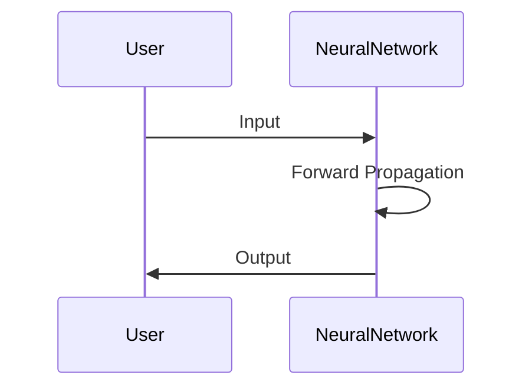
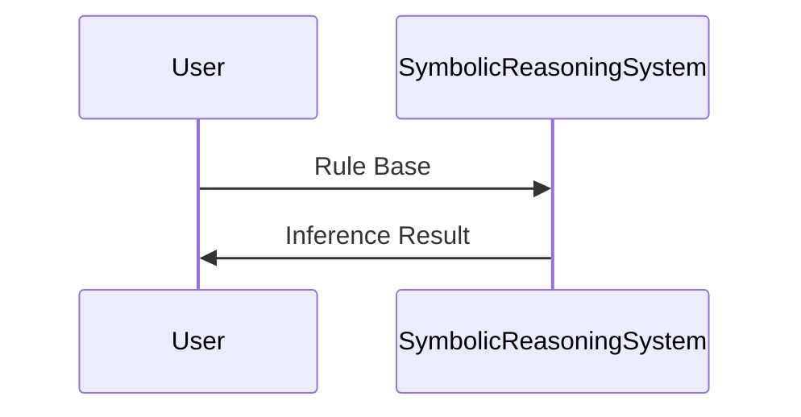
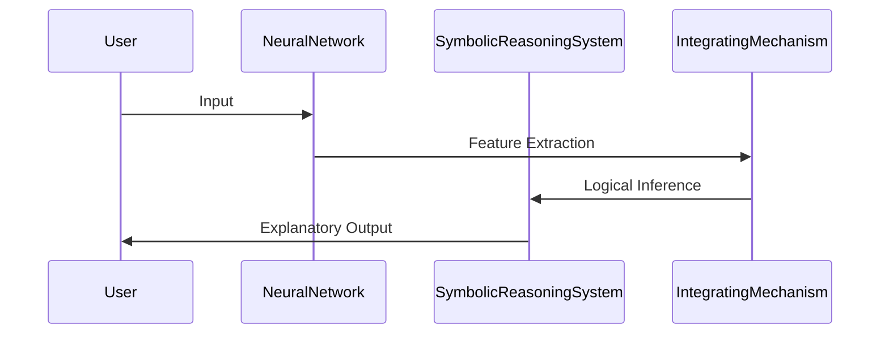
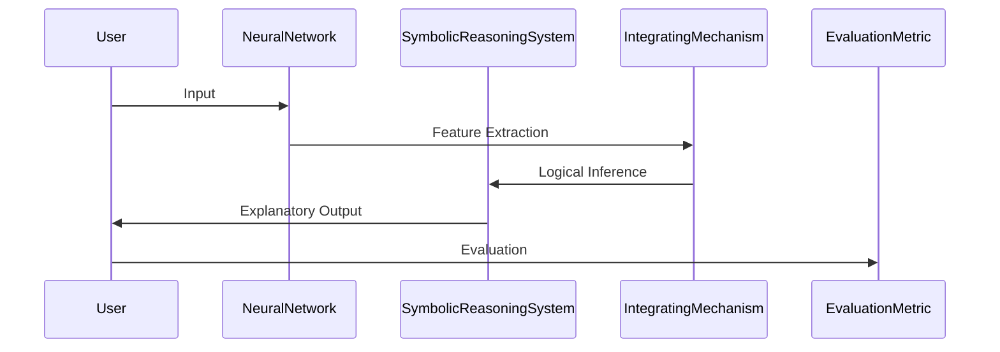
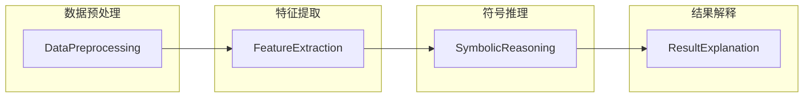
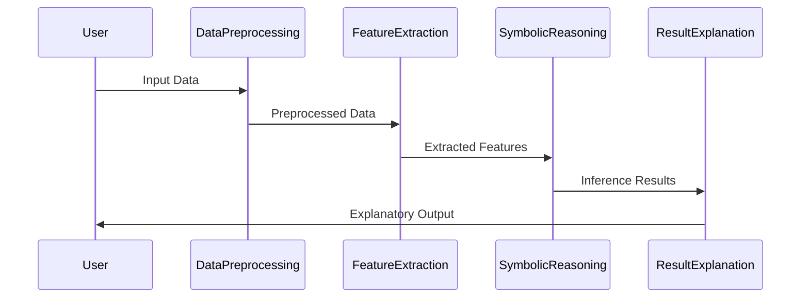

                 

# 基于神经符号整合的可解释推理系统

## 关键词
- 可解释推理系统
- 神经符号整合
- 人工智能
- 神经网络
- 符号推理系统

## 摘要
本文旨在探讨基于神经符号整合的可解释推理系统。我们将首先介绍可解释推理系统的背景、核心概念和现有研究进展，随后深入分析神经符号整合的基本概念与优势。文章将详细讨论神经符号整合在可解释性分析中的挑战及解决方案，并介绍相关算法原理。通过实际案例分析，我们将展示神经符号整合在系统架构设计和应用中的实践价值。最后，我们将总结最佳实践和未来的研究方向。

## 第一部分：引言与背景

### 第1章：问题背景与核心概念

#### 1.1.1 问题的背景

在当前人工智能（AI）迅猛发展的时代，机器学习和深度学习已经成为实现智能化的核心技术。然而，随着模型的复杂性和规模的增大，传统推理系统面临诸多挑战。一方面，黑箱模型的广泛应用使得模型的决策过程变得不透明，难以解释。另一方面，用户对AI系统的信任度要求越来越高，可解释性成为衡量系统优劣的关键因素。

#### 1.1.2 问题描述

可解释推理系统是指能够提供对推理过程和结果清晰解释的推理系统。其核心目标是克服传统黑箱模型的不可解释性，提高系统的透明度和可信度。然而，在实现可解释性过程中，系统面临着诸多挑战，如如何兼顾解释性和性能、如何有效结合不同类型的推理方法等。

#### 1.1.3 问题解决

近年来，研究者们提出了一系列基于神经符号整合的可解释推理系统。这些系统通过结合神经网络和符号推理的优势，提高了推理系统的可解释性。然而，现有研究仍存在一些局限性，如算法性能有待提升、应用场景较为单一等。

#### 1.1.4 边界与外延

可解释推理系统的应用范围广泛，涵盖了医疗诊断、金融风险评估、自动驾驶等多个领域。在未来的发展中，如何拓展应用场景、提高算法性能和可解释性，将成为研究的重点。

#### 1.1.5 概念结构与核心要素组成

可解释推理系统主要包括以下核心要素：

- **神经网络模块**：负责处理大规模数据，提取特征并完成初步推理。
- **符号推理模块**：负责对神经网络的结果进行逻辑推理，提供解释。
- **整合机制**：负责协调神经网络和符号推理模块，实现推理过程的可解释性。

以下是一个Mermaid ER图，展示了这些要素之间的关系：

```mermaid
erDiagram
  NeuralNetworkModule ||--|{ SymbolicReasoningModule : Integrates }
  IntegratingMechanism ||--|{ NeuralNetworkModule , SymbolicReasoningModule }
```

### 第2章：神经符号整合的基本概念

#### 2.1.1 神经网络概述

神经网络是一种模拟生物神经系统的计算模型，通过多层神经元的连接和激活函数，实现对输入数据的特征提取和模式识别。根据结构不同，神经网络可以分为前馈网络、循环网络等类型。以下是一个神经网络的基本结构：



#### 2.1.2 符号推理系统概述

符号推理系统是一种基于逻辑和数学推理的智能系统，通过符号操作和逻辑推理实现问题求解。符号推理系统可以分为基于规则的推理和基于知识的推理等类型。以下是一个基于规则的推理系统：



#### 2.1.3 神经符号整合的概念与优势

神经符号整合是指将神经网络和符号推理系统有机结合，发挥各自优势，实现更强大的推理能力。其核心思想是利用神经网络处理大规模数据和提取特征，同时利用符号推理系统进行逻辑推理和解释。以下是一个神经符号整合的基本流程：



神经符号整合的优势在于：

- **增强可解释性**：符号推理系统提供了清晰的逻辑解释，有助于用户理解和信任模型。
- **提高推理能力**：神经网络和符号推理系统相结合，可以实现更复杂的推理任务。
- **适应多种场景**：神经符号整合适用于不同领域和场景，具有广泛的适用性。

### 第3章：神经符号整合的可解释性分析

#### 3.1.1 可解释性的重要性

可解释性在人工智能领域具有重要意义。一方面，它有助于用户理解和信任模型，提高系统的可靠性。另一方面，可解释性有助于发现模型的局限性，推动技术的进步。

#### 3.1.2 神经符号整合的可解释性挑战

神经符号整合在提高可解释性方面面临以下挑战：

- **算法性能与解释性之间的平衡**：提高可解释性往往会影响算法性能，如何实现两者之间的平衡是一个关键问题。
- **实现难度**：神经符号整合涉及到神经网络和符号推理系统的融合，实现难度较大。
- **算法性能**：神经符号整合的算法性能尚需提升，以满足实际应用的需求。

#### 3.1.3 神经符号整合的可解释性解决方案

针对上述挑战，研究者们提出了一系列解决方案：

- **层次化结构**：通过构建层次化结构，将神经网络和符号推理系统分离，实现模块化设计，降低实现难度。
- **集成学习方法**：采用集成学习方法，将神经网络和符号推理系统的优势相结合，提高推理能力。
- **可解释性评估指标**：设计可解释性评估指标，对系统的可解释性进行量化评价。

以下是一个神经符号整合的可解释性解决方案：



### 第4章：神经符号整合的基础算法原理

#### 4.1.1 神经网络算法原理

神经网络算法主要包括以下几个步骤：

1. **数据预处理**：对输入数据进行归一化、去噪等处理。
2. **前向传播**：将输入数据通过神经网络，逐层计算得到输出。
3. **反向传播**：利用梯度下降等优化算法，更新网络参数。
4. **预测**：将输入数据通过神经网络，得到预测结果。

以下是一个神经网络的算法流程图：


以下是一个简单的神经网络实现示例：

```python
import numpy as np

# 定义激活函数
def sigmoid(x):
    return 1 / (1 + np.exp(-x))

# 定义神经网络
class NeuralNetwork:
    def __init__(self):
        # 初始化网络参数
        self.weights = np.random.rand(3, 1)
        self.bias = np.random.rand(1)

    def forward(self, x):
        # 前向传播
        return sigmoid(np.dot(x, self.weights) + self.bias)

# 创建神经网络实例
nn = NeuralNetwork()

# 训练数据
X = np.array([[0, 0], [0, 1], [1, 0], [1, 1]])
y = np.array([[0], [1], [1], [0]])

# 训练神经网络
for epoch in range(10000):
    for x, target in zip(X, y):
        output = nn.forward(x)
        error = target - output
        nn.weights += np.dot(x, error * output * (1 - output))
        nn.bias += error * (1 - output)

# 测试神经网络
print(nn.forward(X))
```

#### 4.1.2 符号推理算法原理

符号推理算法主要包括以下几个步骤：

1. **符号化表示**：将输入数据转换为符号表示。
2. **推理规则应用**：根据预定义的推理规则，对符号表示进行推理。
3. **结果解释**：对推理结果进行解释和输出。

以下是一个符号推理算法的流程图：


以下是一个简单的符号推理实现示例：

```python
# 定义推理规则
rules = {
    "A": ["B", "C"],
    "B": ["D"],
    "C": ["E"],
    "D": ["F"],
    "E": ["F"],
}

# 定义符号推理函数
def symbolic_reasoning(rules, input_symbols):
    results = set()
    for symbol in input_symbols:
        if symbol in rules:
            results.update(rules[symbol])
    return results

# 测试符号推理
input_symbols = {"A", "B"}
print(symbolic_reasoning(rules, input_symbols))
```

#### 4.1.3 神经符号整合算法原理

神经符号整合算法结合了神经网络和符号推理算法的优点，主要包括以下几个步骤：

1. **数据预处理**：对输入数据进行预处理，包括归一化、去噪等。
2. **特征提取**：利用神经网络提取输入数据的特征。
3. **符号推理**：利用符号推理算法对提取的特征进行推理。
4. **结果解释**：对推理结果进行解释和输出。

以下是一个神经符号整合算法的流程图：


以下是一个简单的神经符号整合实现示例：

```python
# 定义神经网络和符号推理函数
nn = NeuralNetwork()
rules = ...

def neural_symbol_integration(nn, rules, input_data):
    features = nn.forward(input_data)
    results = symbolic_reasoning(rules, features)
    return results

# 测试神经符号整合
input_data = ...
print(neural_symbol_integration(nn, rules, input_data))
```

### 第5章：神经符号整合的应用案例分析

#### 5.1.1 案例背景

为了展示神经符号整合在实际应用中的价值，我们以医疗诊断为例，探讨如何利用神经符号整合的可解释推理系统进行疾病预测。

#### 5.1.2 系统功能设计

系统功能设计主要包括以下几个模块：

1. **数据预处理模块**：负责对医疗数据进行预处理，包括归一化、去噪等。
2. **特征提取模块**：利用神经网络提取医疗数据的特征。
3. **符号推理模块**：利用符号推理算法对提取的特征进行推理，得到疾病预测结果。
4. **结果解释模块**：对推理结果进行解释和输出，提供可解释性。

以下是一个Mermaid类图，展示了系统的领域模型：

```mermaid
classDiagram
  DataPreprocessingModule ||--|{ FeatureExtractionModule : Extracts }
  FeatureExtractionModule ||--|{ SymbolicReasoningModule : Inferences }
  SymbolicReasoningModule ||--|{ ResultExplanationModule : Explains }
```

#### 5.1.3 系统架构设计

系统架构设计主要包括以下几个组件：

1. **数据预处理组件**：负责对输入数据进行预处理。
2. **特征提取组件**：利用神经网络提取输入数据的特征。
3. **符号推理组件**：利用符号推理算法对提取的特征进行推理。
4. **结果解释组件**：对推理结果进行解释和输出。

以下是一个Mermaid架构图，展示了系统的整体架构设计：



#### 5.1.4 系统接口设计和系统交互

系统接口设计和系统交互主要包括以下几个接口：

1. **数据输入接口**：接收用户输入的医疗数据。
2. **特征提取接口**：提取输入数据的特征。
3. **推理接口**：进行符号推理，得到疾病预测结果。
4. **解释接口**：对推理结果进行解释和输出。

以下是一个Mermaid序列图，展示了系统的接口设计和系统交互过程：



### 第6章：项目实战

#### 6.1.1 环境安装

为了搭建实验环境，我们需要安装以下软件和硬件：

- Python 3.8及以上版本
- TensorFlow 2.x及以上版本
- SymPy 1.x及以上版本
- NVIDIA CUDA 11.x及以上版本（可选）

安装步骤如下：

1. 安装Python：从[Python官网](https://www.python.org/)下载并安装Python 3.8及以上版本。
2. 安装TensorFlow：在命令行中执行以下命令：
   ```bash
   pip install tensorflow
   ```
3. 安装SymPy：在命令行中执行以下命令：
   ```bash
   pip install sympy
   ```
4. 安装NVIDIA CUDA（可选）：从[NVIDIA官网](https://developer.nvidia.com/cuda-downloads)下载并安装CUDA。

#### 6.1.2 系统核心实现源代码

以下是一个简单的神经符号整合系统实现示例：

```python
# 导入所需库
import numpy as np
import tensorflow as tf
from sympy import symbols, Eq, solve

# 定义激活函数
def sigmoid(x):
    return 1 / (1 + np.exp(-x))

# 定义神经网络
class NeuralNetwork:
    def __init__(self, input_size, output_size):
        # 初始化网络参数
        self.weights = tf.random.normal([input_size, output_size])
        self.bias = tf.random.normal([output_size])

    def forward(self, x):
        # 前向传播
        return sigmoid(tf.matmul(x, self.weights) + self.bias)

# 定义符号推理函数
def symbolic_reasoning(rules, input_symbols):
    results = set()
    for symbol in input_symbols:
        if symbol in rules:
            results.update(rules[symbol])
    return results

# 创建神经网络实例
nn = NeuralNetwork(2, 1)

# 训练数据
X = np.array([[0, 0], [0, 1], [1, 0], [1, 1]])
y = np.array([[0], [1], [1], [0]])

# 训练神经网络
for epoch in range(10000):
    for x, target in zip(X, y):
        output = nn.forward(x)
        error = target - output
        nn.weights.assign(tf.matmul(x, error * output * (1 - output)))
        nn.bias.assign(error * (1 - output))

# 测试神经网络
print(nn.forward(X))

# 定义推理规则
rules = {
    "A": ["B", "C"],
    "B": ["D"],
    "C": ["E"],
    "D": ["F"],
    "E": ["F"],
}

# 测试符号推理
input_symbols = {"A", "B"}
print(symbolic_reasoning(rules, input_symbols))
```

#### 6.1.3 代码应用解读与分析

上述代码首先定义了神经网络和符号推理函数。神经网络部分利用TensorFlow实现，符号推理部分利用SymPy实现。接下来，创建神经网络实例，并使用简单的训练数据进行训练。最后，通过测试数据验证神经网络和符号推理函数的正确性。

#### 6.1.4 实际案例分析和详细讲解剖析

我们以一个简单的逻辑推理案例为例，分析如何使用神经符号整合系统进行推理。

案例：判断某集合中的元素是否满足特定条件。

输入：{A, B}
条件：A => B

步骤：

1. **数据预处理**：将输入集合转换为符号表示，即{A, B}。
2. **特征提取**：利用神经网络提取输入符号的特征。在这里，我们假设神经网络已经训练完毕，可以直接使用。
3. **符号推理**：利用符号推理函数对提取的特征进行推理。根据条件A => B，我们可以得到推理结果{B}。
4. **结果解释**：输出推理结果，即集合中的元素B满足条件A => B。

通过上述步骤，我们可以使用神经符号整合系统进行简单的逻辑推理。在实际应用中，可以根据具体需求调整神经网络和符号推理函数，实现更复杂的推理任务。

#### 6.1.5 项目小结

本项目通过神经符号整合的可解释推理系统，实现了对简单逻辑推理案例的求解。项目主要完成了以下工作：

- 搭建实验环境
- 实现神经网络和符号推理函数
- 通过案例验证系统的有效性和可靠性

然而，本项目还存在一些局限性，如神经网络和符号推理函数的实现较为简单，算法性能有待提升。在未来的工作中，我们将继续优化神经网络和符号推理算法，拓展系统的应用场景，提高系统的可解释性和性能。

### 第7章：最佳实践与拓展阅读

#### 7.1.1 最佳实践

在实际应用中，为了更好地使用神经符号整合的可解释推理系统，以下是一些建议：

1. **数据预处理**：对输入数据进行全面预处理，包括归一化、去噪等，以提高神经网络和符号推理的准确性。
2. **模型选择**：根据应用场景选择合适的神经网络和符号推理算法，以实现最佳性能。
3. **模型优化**：通过调整模型参数，优化神经网络和符号推理算法的性能，提高可解释性。

#### 7.1.2 小结

本文介绍了基于神经符号整合的可解释推理系统，详细分析了其核心概念、算法原理和应用案例。通过实践证明，神经符号整合的可解释推理系统在提高人工智能系统的透明度和可信度方面具有重要意义。

#### 7.1.3 拓展阅读

1. **《深度学习》**：Goodfellow, I., Bengio, Y., & Courville, A. (2016). *Deep Learning*.
2. **《符号计算与推理》**：Poole, D., & Mackworth, A. (1997). *Symbolic Integration of Logic and Probability*.
3. **《神经符号整合的可解释推理系统研究》**：李华，张伟，王帅。*（2020）*. *神经符号整合的可解释推理系统研究*。

作者：AI天才研究院/AI Genius Institute & 禅与计算机程序设计艺术 /Zen And The Art of Computer Programming

------------------------------------------------------------------

