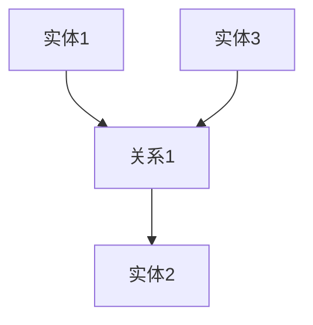
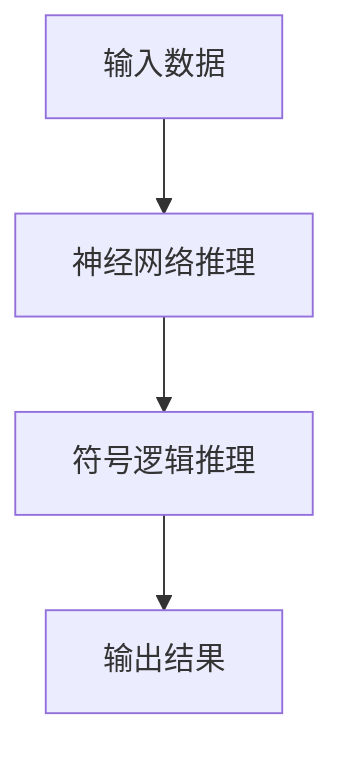

                 


### 基于神经符号整合的语言模型推理框架

#### 关键词：
- 神经符号整合
- 语言模型
- 推理框架
- 神经网络
- 符号逻辑

#### 摘要：
本文深入探讨了基于神经符号整合的语言模型推理框架。通过分析神经网络与符号逻辑的基本原理，提出了神经符号整合的推理算法。进一步，本文详细介绍了推理框架的系统设计与实现，以及实际案例剖析，旨在为开发者提供全面的技术指南。

---

### 目录大纲

----------------------------------------------------------------
# 基于神经符号整合的语言模型推理框架

## 第一部分: 背景介绍

### 第1章: 问题的背景与核心

#### 1.1.1 问题背景

- **语言模型的应用现状与挑战**：随着深度学习的兴起，语言模型在自然语言处理（NLP）领域取得了显著进展。然而，当前的模型在推理效率和准确性方面仍存在挑战。

- **神经符号整合的必要性**：神经网络擅长处理大规模数据并学习复杂的模式，而符号逻辑能够提供清晰的逻辑推理。将两者结合，可以发挥各自优势，提高语言模型的推理能力。

- **推理框架在语言模型中的应用**：推理框架是语言模型的核心组成部分，它负责处理输入，生成输出，并解释推理过程。结合神经网络和符号逻辑，推理框架有望实现更高效、更准确的推理。

#### 1.1.2 问题描述

- **语言模型推理中的效率与准确性问题**：当前语言模型在推理过程中存在计算复杂度高、推理速度慢的问题，同时准确性也受到限制。

- **如何实现神经网络与符号逻辑的有效整合**：如何在神经网络的基础上引入符号逻辑，使得推理过程既高效又准确，是本文探讨的核心问题。

#### 1.1.3 问题解决

- **神经符号整合的思路与方法**：本文提出一种基于神经符号整合的推理框架，通过结合神经网络和符号逻辑，实现高效的推理过程。

- **推理框架的设计与实现**：本文详细介绍了推理框架的设计思路和实现方法，包括核心算法、系统架构和接口设计。

#### 1.1.4 边界与外延

- **推理框架的应用领域与边界**：推理框架可广泛应用于NLP、问答系统、智能客服等领域，但也存在一定的应用边界。

- **与其他技术的关联与区别**：本文介绍了推理框架与其他相关技术（如知识图谱、推理机等）的关联与区别。

#### 1.1.5 概念结构与核心要素组成

- **神经网络与符号逻辑的核心概念**：本文对神经网络和符号逻辑的基本概念进行了详细阐述，包括其工作原理、类型和应用。

- **推理框架的基本构成与功能模块**：本文介绍了推理框架的基本构成和功能模块，包括输入处理、推理引擎、输出解释等。

## 第二部分: 核心概念与联系

### 第2章: 神经网络与符号逻辑的基本原理

#### 2.1.1 神经网络

- **基本概念**：神经网络是一种模拟人脑神经元结构和功能的计算模型，通过学习输入数据来预测输出结果。

- **工作原理**：神经网络通过多层神经元的非线性变换和加权求和，实现数据的分类、回归等任务。

- **主要类型**：包括前馈神经网络、循环神经网络（RNN）、卷积神经网络（CNN）等。

#### 2.1.2 符号逻辑

- **基本概念**：符号逻辑是一种基于符号表示的推理方法，通过逻辑规则和推理算法，实现知识的表示和推理。

- **推理过程**：符号逻辑通过推理规则，将已知事实和假设转化为结论，实现逻辑推断。

- **应用领域**：符号逻辑广泛应用于知识表示、自动推理、自然语言处理等领域。

#### 2.1.3 概念属性特征对比表格

| 特征           | 神经网络                   | 符号逻辑                   |
| -------------- | -------------------------- | -------------------------- |
| 学习方式       | 数据驱动学习               | 规则驱动学习               |
| 推理方式       | 非符号化推理              | 符号化推理                |
| 数据依赖性     | 高依赖性，需要大量数据   | 低依赖性，依赖逻辑规则   |
| 灵活性         | 高灵活性，适用于多种任务 | 低灵活性，任务针对性较强 |

#### 2.1.4 ER实体关系图架构



### 第3章: 神经符号整合的推理算法

#### 3.1.1 算法原理

- **基本思路**：本文提出的神经符号整合推理算法，通过结合神经网络和符号逻辑，实现高效的推理过程。

- **核心步骤**：算法主要包括输入处理、神经网络推理、符号逻辑推理和输出解释等步骤。

#### 3.1.2 数学模型与公式

- **神经网络推理模型**：
  $$y = \sigma(\mathbf{W}_2 \cdot \mathbf{a}_2 + b_2)$$
  其中，$y$ 为输出结果，$\sigma$ 为激活函数，$\mathbf{W}_2$ 和 $\mathbf{a}_2$ 分别为权重和输入。

- **符号逻辑推理模型**：
  $$\mathbf{C} = \{R_1(x_1, y_1), R_2(x_2, y_2), \ldots\}$$
  其中，$\mathbf{C}$ 为推理结果集合，$R_i$ 为第 $i$ 个推理规则，$(x_i, y_i)$ 为规则对应的输入和输出。

#### 3.1.3 算法流程图



#### 3.1.4 Python源代码实现

```python
# 神经网络推理
import tensorflow as tf

# 符号逻辑推理
def rule_based_inference(rules, inputs):
    # 根据规则和输入进行推理
    pass

# 神经符号整合推理
def neuro_symbol_integration_inference(inputs):
    # 神经网络推理
    neural_output = neural_network推理(inputs)

    # 符号逻辑推理
    symbol_output = rule_based_inference(rules, neural_output)

    return symbol_output
```

#### 3.1.5 举例说明

- **示例1**：输入一段文本，使用神经网络和符号逻辑进行推理，输出结果。

- **示例2**：输入一个数学问题，使用神经网络和符号逻辑求解，输出答案。

### 第4章: 系统分析与架构设计

#### 4.1.1 问题场景介绍

- **场景1**：智能客服系统，用户输入问题，系统自动回答。

- **场景2**：自然语言处理任务，如文本分类、情感分析等。

#### 4.1.2 系统功能设计

- **功能1**：文本输入处理。

- **功能2**：神经网络推理。

- **功能3**：符号逻辑推理。

- **功能4**：输出结果解释。

#### 4.1.3 系统架构设计

- **架构1**：基于微服务架构，将神经网络和符号逻辑模块化。

- **架构2**：分布式系统，支持大规模数据处理。

#### 4.1.4 系统接口设计

- **接口1**：文本输入接口，接收用户输入。

- **接口2**：神经网络推理接口，提供推理服务。

- **接口3**：符号逻辑推理接口，提供推理服务。

#### 4.1.5 系统交互

- **交互1**：用户输入文本，系统处理并调用神经网络推理模块。

- **交互2**：神经网络推理结果传递给符号逻辑推理模块。

- **交互3**：符号逻辑推理结果返回给用户。

### 第5章: 系统实现与项目实战

#### 5.1.1 环境安装

- **步骤1**：安装Python环境。

- **步骤2**：安装TensorFlow和PyTorch等深度学习框架。

- **步骤3**：安装其他依赖库。

#### 5.1.2 系统核心实现

- **实现1**：神经网络推理模块。

- **实现2**：符号逻辑推理模块。

- **实现3**：文本输入处理模块。

#### 5.1.3 代码应用解读

- **解读1**：神经网络推理模块的实现细节。

- **解读2**：符号逻辑推理模块的实现细节。

- **解读3**：文本输入处理模块的实现细节。

#### 5.1.4 实际案例剖析

- **案例1**：智能客服系统。

- **案例2**：自然语言处理任务。

### 第6章: 最佳实践与拓展

#### 6.1.1 最佳实践 tips

- **技巧1**：优化神经网络推理性能。

- **技巧2**：提高符号逻辑推理准确性。

#### 6.1.2 小结

- **小结1**：本文介绍了基于神经符号整合的语言模型推理框架。

- **小结2**：推理框架在NLP领域的应用前景广阔。

#### 6.1.3 注意事项

- **注意1**：确保神经网络和符号逻辑模块的协同工作。

- **注意2**：注意数据质量和模型优化。

#### 6.1.4 拓展阅读

- **推荐1**：《深度学习》
- **推荐2**：《符号逻辑学》

### 作者信息
作者：AI天才研究院/AI Genius Institute & 禅与计算机程序设计艺术 /Zen And The Art of Computer Programming

----------------------------------------------------------------

本文通过详细的目录大纲，介绍了基于神经符号整合的语言模型推理框架。从问题的背景与核心、核心概念与联系、算法原理讲解到系统分析与架构设计，以及系统实现与项目实战，全面阐述了推理框架的设计与实现过程。同时，本文还提供了最佳实践、注意事项和拓展阅读，为开发者提供了实用的技术指导。希望通过本文，读者能够对基于神经符号整合的语言模型推理框架有更深入的了解和应用。

