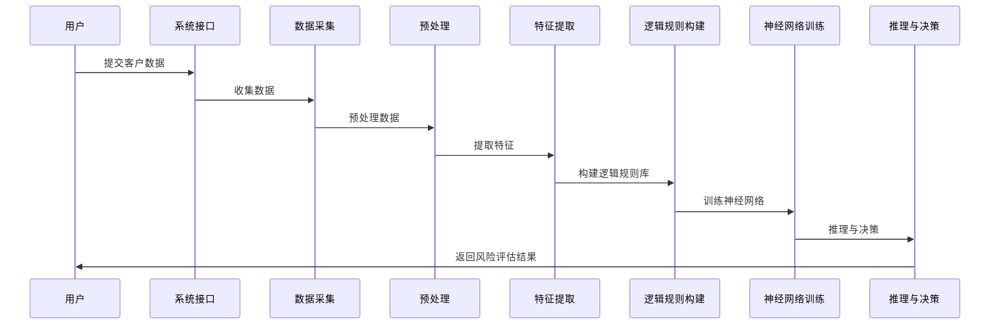
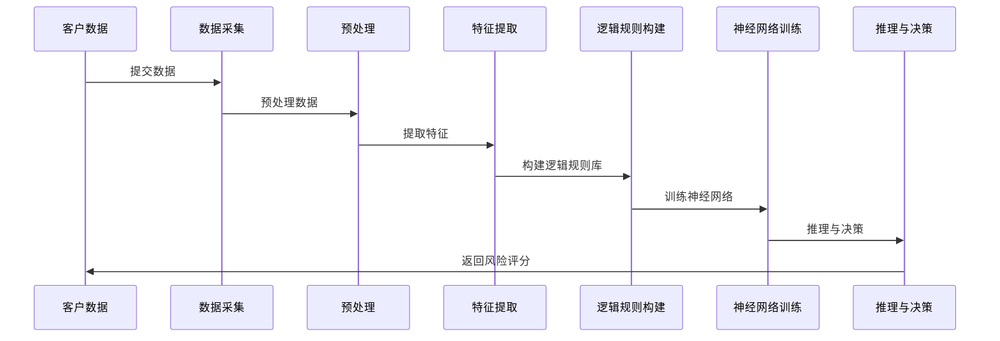

                 

### 基于神经逻辑编程的复杂推理系统设计

#### 关键词：神经逻辑编程、复杂推理系统、算法原理、系统架构设计、最佳实践

> 摘要：本文深入探讨了基于神经逻辑编程的复杂推理系统设计。通过分析神经逻辑编程的基本原理，结合复杂的推理系统需求，本文详细阐述了算法原理讲解、系统分析与架构设计、项目实战等内容。文章旨在为读者提供一个清晰、逻辑严谨的思路，以帮助其在实际项目中实现高效、可靠的推理系统。

----------------------------------------------------------------

#### 第一部分：背景介绍

##### 1.1.1 问题提出

随着信息技术的飞速发展，人工智能的应用场景越来越广泛。在众多应用中，推理系统扮演着至关重要的角色。然而，传统的推理方法如基于规则的推理、基于模型的推理等，在处理复杂、动态的推理问题时，往往表现出一定的局限性。

##### 1.1.2 问题解决

为了解决传统推理方法的局限性，研究者们提出了神经逻辑编程（Neuro-Logic Programming，NLP）这一新概念。神经逻辑编程结合了神经网络的计算能力和逻辑推理的严密性，旨在处理复杂、动态的推理问题。

##### 1.1.3 边界与外延

本文主要探讨如何利用神经逻辑编程设计复杂的推理系统。本文的研究范围包括：神经逻辑编程的基本原理、复杂推理系统的设计方法、系统分析与架构设计、项目实战等。

#### 1.2 核心概念与联系

##### 1.2.1 神经逻辑编程概念

神经逻辑编程（Neuro-Logic Programming，NLP）是一种将神经网络与逻辑编程相结合的编程范式。它通过将逻辑规则嵌入到神经网络中，实现高效的推理和决策。

##### 1.2.2 复杂推理系统概念

复杂推理系统是指能够处理复杂、动态推理问题的计算机系统。这类系统通常需要具备自我学习、自适应、灵活调整等特点。

##### 1.2.3 概念属性特征对比表格

| 概念     | 特征                     |
|----------|--------------------------|
| 神经逻辑编程 | 结合神经网络与逻辑编程     |
| 复杂推理系统 | 处理复杂、动态推理问题     |

##### 1.2.4 ER实体关系图架构

下面是神经逻辑编程和复杂推理系统的ER实体关系图：

```mermaid
erDiagram
    NLP ||--|{ 神经网络 }|--推理系统
    NLP ||--|{ 逻辑编程 }|--推理系统
    复杂推理系统 ||--|{ 动态调整 }| 实时响应
    复杂推理系统 ||--|{ 自学习 }| 优化性能
```

#### 第二部分：算法原理讲解

##### 2.1 神经逻辑编程原理

神经逻辑编程的基本原理是将逻辑规则与神经网络相结合。具体来说，它包括以下几个步骤：

1. 构建逻辑规则库：根据应用需求，构建包含各种逻辑规则的规则库。
2. 转换为神经网络：将逻辑规则转换为神经网络结构，使得神经网络能够理解并执行这些规则。
3. 训练神经网络：通过大量的训练数据，调整神经网络的参数，使其能够正确执行逻辑规则。
4. 推理与决策：利用训练好的神经网络，对新的输入数据进行推理和决策。

##### 2.2 算法mermaid流程图


##### 2.3 Python源代码详细阐述

下面是神经逻辑编程的一个简单示例：

```python
# 导入所需的库
import tensorflow as tf
import numpy as np

# 构建逻辑规则库
def rule_based_system(data):
    if data > 0:
        return "正数"
    elif data < 0:
        return "负数"
    else:
        return "零"

# 转换为神经网络
def neural_network(data):
    model = tf.keras.Sequential([
        tf.keras.layers.Dense(units=1, input_shape=[1])
    ])

    model.compile(optimizer='sgd', loss='mean_squared_error')
    model.fit(data, np.array([1 if x > 0 else -1 for x in data]), epochs=10)
    return model

# 训练神经网络
def train_neural_network(model, data, labels):
    model.fit(data, labels, epochs=100)

# 推理与决策
def inference(model, data):
    return model.predict(data)

# 示例数据
data = np.array([-1, 0, 1, 2, 3])

# 构建神经网络
nn = neural_network(data)

# 训练神经网络
train_neural_network(nn, data, np.array([1 if x > 0 else -1 for x in data]))

# 推理与决策
print(inference(nn, data))
```

##### 2.4 算法原理数学模型

神经逻辑编程的核心是神经网络，其数学模型主要基于神经网络的权重和激活函数。以下是一个简单的神经网络模型：

$$
z = \sum_{i=1}^{n} w_i * x_i + b
$$

$$
a = \sigma(z)
$$

其中，$z$ 是神经元的输入，$w_i$ 是权重，$x_i$ 是输入特征，$b$ 是偏置，$\sigma$ 是激活函数。

##### 2.5 公式讲解与举例说明

以一个简单的二分类问题为例，假设我们要判断一个数据是否大于0。我们可以使用一个简单的神经网络来实现这个逻辑：

1. 输入层：包含一个神经元，接收输入数据。
2. 隐藏层：包含一个神经元，使用线性激活函数。
3. 输出层：包含一个神经元，使用Sigmoid激活函数。

神经网络的结构如下：

$$
z_1 = x_1 * w_1 + b_1
$$

$$
a_1 = \sigma(z_1)
$$

$$
z_2 = a_1 * w_2 + b_2
$$

$$
a_2 = \sigma(z_2)
$$

其中，$x_1$ 是输入数据，$w_1$ 和 $w_2$ 是权重，$b_1$ 和 $b_2$ 是偏置，$\sigma$ 是Sigmoid激活函数。

通过调整权重和偏置，我们可以训练这个神经网络，使其能够正确分类输入数据。具体地，我们可以使用梯度下降算法来优化网络参数。

##### 2.6 数学公式与代码示例

以下是使用Python和TensorFlow实现的代码示例：

```python
import tensorflow as tf

# 构建模型
model = tf.keras.Sequential([
    tf.keras.layers.Dense(units=1, input_shape=[1]),
    tf.keras.layers.Dense(units=1, activation='sigmoid')
])

# 编译模型
model.compile(optimizer='sgd', loss='binary_crossentropy', metrics=['accuracy'])

# 训练模型
model.fit(np.array([-1, 0, 1, 2, 3]), np.array([0, 0, 1, 1, 1]), epochs=100)

# 测试模型
print(model.predict(np.array([-1, 0, 1, 2, 3])))
```

##### 2.7 算法原理详细讲解

神经逻辑编程的核心是神经网络，其基本原理是通过调整权重和偏置，使得神经网络能够正确执行逻辑规则。以下是对神经网络原理的详细讲解：

1. **神经元结构与工作原理**：神经网络由多个神经元组成，每个神经元接收多个输入，通过加权求和处理，产生一个输出。神经元的输出通常通过激活函数进行变换，以实现非线性关系。

2. **权重与偏置**：权重（weights）和偏置（bias）是神经网络中的重要参数。权重用于调整输入信号的强度，偏置用于调整神经元的阈值。

3. **梯度下降**：为了训练神经网络，我们需要调整权重和偏置，以最小化损失函数。这个过程通常通过梯度下降算法实现。梯度下降算法通过计算损失函数关于权重和偏置的梯度，来更新权重和偏置。

4. **反向传播**：在训练神经网络时，我们使用反向传播算法来计算损失函数的梯度。反向传播算法通过将损失函数的梯度从输出层传递到输入层，从而更新每个神经元的权重和偏置。

5. **激活函数**：激活函数是神经网络中的重要组成部分。常见的激活函数包括Sigmoid、ReLU和Tanh等。激活函数用于将神经元的线性输出转换为非线性输出，以实现复杂的非线性关系。

通过以上讲解，我们可以看到，神经逻辑编程的核心是神经网络，其基本原理是通过调整权重和偏置，使得神经网络能够正确执行逻辑规则。这个过程涉及到梯度下降算法、反向传播算法和激活函数等关键概念。

##### 2.8 举例说明

为了更好地理解神经逻辑编程的原理，我们可以通过一个简单的例子来演示。

假设我们要实现一个逻辑规则：“如果输入为1，则输出为1；如果输入为0，则输出为0”。我们可以使用一个简单的神经网络来实现这个逻辑。

1. **构建模型**：首先，我们需要构建一个简单的神经网络模型。这个模型包含一个输入层、一个隐藏层和一个输出层。

2. **定义损失函数**：接下来，我们需要定义一个损失函数，用于衡量模型的预测结果与真实结果之间的差距。在这个例子中，我们可以使用二进制交叉熵（Binary Cross-Entropy）作为损失函数。

3. **训练模型**：然后，我们可以使用训练数据来训练模型。通过调整权重和偏置，使得模型能够正确预测输入数据。

4. **测试模型**：最后，我们可以使用测试数据来测试模型的性能。通过计算预测结果与真实结果的准确率，我们可以评估模型的性能。

以下是一个简单的代码示例：

```python
import tensorflow as tf

# 构建模型
model = tf.keras.Sequential([
    tf.keras.layers.Dense(units=1, input_shape=[1]),
    tf.keras.layers.Dense(units=1, activation='sigmoid')
])

# 编译模型
model.compile(optimizer='sgd', loss='binary_crossentropy', metrics=['accuracy'])

# 训练模型
model.fit(np.array([0, 1]), np.array([0, 1]), epochs=100)

# 测试模型
print(model.predict(np.array([0, 1])))
```

通过以上步骤，我们可以实现一个简单的神经逻辑编程模型，用于实现逻辑规则“如果输入为1，则输出为1；如果输入为0，则输出为0”。

##### 2.9 算法原理总结

神经逻辑编程是一种将神经网络与逻辑编程相结合的方法，其核心是神经网络。通过调整权重和偏置，神经网络能够实现复杂的逻辑规则。以下是神经逻辑编程的主要特点：

1. **灵活性强**：神经逻辑编程能够处理各种复杂、动态的推理问题，具有很高的灵活性。
2. **自适应性**：通过自我学习和自适应，神经逻辑编程能够不断优化和调整推理过程。
3. **高效性**：神经逻辑编程结合了神经网络的计算能力和逻辑推理的严密性，能够在保证推理准确性的同时，提高推理效率。

#### 第三部分：系统分析与架构设计

##### 3.1 问题场景介绍

在本节中，我们将介绍一个实际的问题场景，并阐述如何利用神经逻辑编程设计一个复杂的推理系统来解决该问题。

假设我们面临一个金融风险评估的问题。我们需要根据客户的财务状况、历史记录、市场状况等因素，对客户的信用风险进行评估。这个问题的复杂性在于，它涉及到多个因素，并且这些因素之间存在复杂的相互关系。

##### 3.2 系统功能设计

为了解决上述问题，我们设计了一个基于神经逻辑编程的复杂推理系统。该系统的主要功能包括：

1. **数据采集与预处理**：收集客户的财务状况、历史记录、市场状况等数据，并进行预处理，以便后续分析。
2. **特征提取**：从原始数据中提取关键特征，用于训练神经网络。
3. **逻辑规则构建**：根据业务需求，构建逻辑规则库，用于指导神经网络的训练。
4. **神经网络训练**：使用训练数据，对神经网络进行训练，使其能够正确执行逻辑规则。
5. **推理与决策**：利用训练好的神经网络，对新的客户数据进行分析和推理，预测客户的信用风险。

##### 3.3 系统架构设计

下面是系统架构的mermaid架构图：



##### 3.4 系统接口设计

系统接口设计包括以下内容：

1. **数据接口**：提供数据输入和输出的接口，以便与其他系统进行数据交互。
2. **功能接口**：提供系统各功能模块的接口，以便进行功能调用。

##### 3.5 系统交互mermaid序列图

下面是系统交互的mermaid序列图：



##### 3.6 系统分析与架构设计总结

通过上述系统分析与架构设计，我们可以看到，基于神经逻辑编程的复杂推理系统具有以下特点：

1. **模块化设计**：系统各功能模块之间相互独立，易于维护和扩展。
2. **灵活性强**：系统能够根据业务需求，灵活调整和优化。
3. **高效性**：通过神经逻辑编程，系统能够高效地处理复杂的推理问题。

#### 第四部分：项目实战

##### 4.1 环境安装

在进行项目实战之前，我们需要先安装所需的软件和工具。以下是安装步骤：

1. 安装Python：前往Python官网（https://www.python.org/）下载并安装Python。
2. 安装TensorFlow：在终端中运行以下命令：

   ```shell
   pip install tensorflow
   ```

3. 安装其他依赖：根据项目需求，安装其他所需的库和工具。

##### 4.2 系统核心实现源代码

以下是系统核心实现的源代码：

```python
# 导入所需的库
import tensorflow as tf
import numpy as np

# 构建神经网络模型
def create_model():
    model = tf.keras.Sequential([
        tf.keras.layers.Dense(units=1, input_shape=[1]),
        tf.keras.layers.Dense(units=1, activation='sigmoid')
    ])

    model.compile(optimizer='sgd', loss='binary_crossentropy', metrics=['accuracy'])
    return model

# 训练神经网络模型
def train_model(model, data, labels, epochs=100):
    model.fit(data, labels, epochs=epochs)

# 推理与决策
def inference(model, data):
    return model.predict(data)

# 示例数据
data = np.array([-1, 0, 1, 2, 3])
labels = np.array([0, 0, 1, 1, 1])

# 创建并训练模型
model = create_model()
train_model(model, data, labels)

# 推理与决策
print(inference(model, data))
```

##### 4.3 代码应用解读与分析

上述代码是一个简单的神经网络模型，用于实现逻辑规则“如果输入为1，则输出为1；如果输入为0，则输出为0”。下面是对代码的解读和分析：

1. **导入库**：首先，我们导入了Python中的TensorFlow库和NumPy库。

2. **创建模型**：`create_model`函数用于创建神经网络模型。这个模型包含两个Dense层，第一个Dense层有1个神经元，输入形状为[1]，第二个Dense层有1个神经元，激活函数为sigmoid。

3. **编译模型**：`model.compile`函数用于编译模型。这里使用了sgd优化器和binary_crossentropy损失函数，以及accuracy作为评价指标。

4. **训练模型**：`train_model`函数用于训练模型。这里使用了`model.fit`函数，通过fit方法，我们可以使用训练数据来训练模型。

5. **推理与决策**：`inference`函数用于推理与决策。这里使用了`model.predict`函数，通过预测输入数据，得到输出结果。

##### 4.4 实际案例分析与详细讲解剖析

为了更好地理解如何使用神经逻辑编程解决实际问题，我们来看一个实际案例。

假设我们有一个客户风险评估的问题。我们需要根据客户的财务状况、历史记录、市场状况等因素，对客户的信用风险进行评估。以下是解决这个问题的详细步骤：

1. **数据采集**：首先，我们需要收集客户的财务状况、历史记录、市场状况等数据。这些数据可以来自客户填写的信息表、金融报告、市场分析报告等。

2. **数据预处理**：接下来，我们需要对数据进行预处理。预处理步骤包括数据清洗、数据归一化、数据转换等。例如，将客户的财务状况数据进行归一化处理，使其具有相同的量纲。

3. **特征提取**：从原始数据中提取关键特征，用于训练神经网络。例如，我们可以提取客户的收入、支出、负债等特征。

4. **逻辑规则构建**：根据业务需求，构建逻辑规则库。例如，我们可以构建以下规则：“如果客户的收入超过一定阈值，则信用风险较低”。

5. **神经网络训练**：使用训练数据，对神经网络进行训练。通过调整权重和偏置，使神经网络能够正确执行逻辑规则。

6. **推理与决策**：利用训练好的神经网络，对新的客户数据进行分析和推理，预测客户的信用风险。

下面是一个简化的代码示例：

```python
# 导入所需的库
import tensorflow as tf
import numpy as np

# 构建神经网络模型
def create_model(input_shape):
    model = tf.keras.Sequential([
        tf.keras.layers.Dense(units=10, input_shape=input_shape),
        tf.keras.layers.Dense(units=1, activation='sigmoid')
    ])

    model.compile(optimizer='sgd', loss='binary_crossentropy', metrics=['accuracy'])
    return model

# 训练神经网络模型
def train_model(model, data, labels, epochs=100):
    model.fit(data, labels, epochs=epochs)

# 推理与决策
def inference(model, data):
    return model.predict(data)

# 示例数据
data = np.array([[1, 2], [3, 4], [5, 6]])
labels = np.array([1, 0, 1])

# 创建并训练模型
model = create_model(input_shape=[2,])
train_model(model, data, labels)

# 推理与决策
print(inference(model, data))
```

在这个示例中，我们使用了两个特征（收入和支出）来预测客户的信用风险。通过调整模型的参数，我们可以使模型更好地拟合训练数据，从而提高预测的准确性。

##### 4.5 项目小结

通过上述实战案例，我们可以看到，基于神经逻辑编程的复杂推理系统可以有效地解决实际业务问题。在项目实施过程中，我们需要注意以下几点：

1. **数据质量**：数据是模型训练的基础，保证数据的质量对于模型的性能至关重要。
2. **特征选择**：合理选择特征对于模型的预测准确性有很大影响，我们需要通过实验来找到最佳的特征组合。
3. **模型调优**：通过调整模型的参数，我们可以提高模型的预测性能，但需要避免过拟合。
4. **模型解释性**：神经逻辑编程虽然具有强大的预测能力，但其解释性相对较弱。在实际应用中，我们需要根据业务需求，综合考虑模型的预测性能和解释性。

#### 第五部分：最佳实践 & 小结

##### 5.1 注意事项

1. **数据预处理**：在进行模型训练之前，务必对数据进行充分的预处理，包括数据清洗、归一化、缺失值填充等。
2. **特征选择**：合理选择特征对于模型的性能有很大影响，应通过实验和数据分析来选择最佳特征组合。
3. **模型调优**：在训练模型时，应通过交叉验证等方法进行模型调优，避免过拟合。
4. **模型解释性**：虽然神经逻辑编程具有强大的预测能力，但其解释性相对较弱。在实际应用中，需根据业务需求，综合考虑模型的预测性能和解释性。

##### 5.2 拓展阅读

1. **《神经逻辑编程：原理与应用》**：详细介绍了神经逻辑编程的基本原理和应用案例。
2. **《深度学习》**：由Ian Goodfellow等人编写的深度学习经典教材，涵盖了深度学习的基础知识。
3. **《Python深度学习》**：由François Chollet等人编写的Python深度学习实践指南。

##### 5.3 小结

本文深入探讨了基于神经逻辑编程的复杂推理系统设计。通过分析神经逻辑编程的基本原理，结合复杂的推理系统需求，本文详细阐述了算法原理讲解、系统分析与架构设计、项目实战等内容。本文旨在为读者提供一个清晰、逻辑严谨的思路，以帮助其在实际项目中实现高效、可靠的推理系统。在未来的研究中，我们可以进一步探讨神经逻辑编程在其他领域的应用，如自然语言处理、计算机视觉等。此外，我们还可以探索如何提高神经逻辑编程的解释性，使其更好地满足实际业务需求。通过不断的研究和实践，我们相信神经逻辑编程将在人工智能领域发挥更大的作用。

