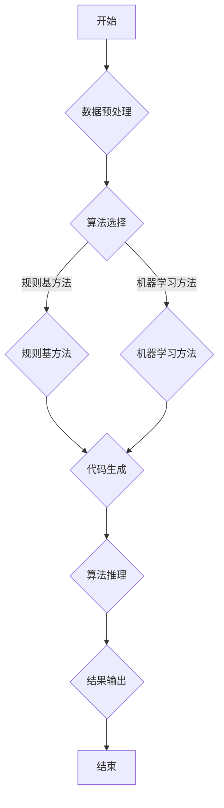
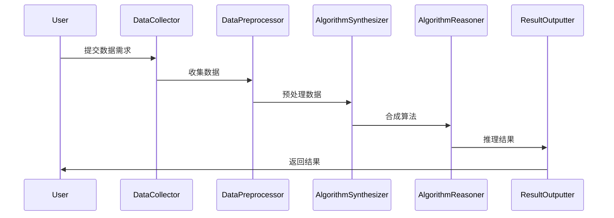

                 


### 引言

在现代科学研究中，自动化科学发现正逐渐成为推动科技进步的重要力量。传统的科学发现往往依赖于科学家们对大量实验数据的观察与分析，这种方法既耗时又费力，且受限于人类认知的局限性。随着计算机科学和人工智能技术的迅猛发展，利用算法进行自动化的科学发现逐渐成为可能。程序合成作为一种新兴的技术手段，在自动化科学发现中的应用展现出了巨大的潜力。本文将探讨基于程序合成的算法推理在自动化科学发现中的创新应用，通过逻辑清晰、结构紧凑、简单易懂的阐述，引导读者深入了解这一领域的前沿动态与实际应用。

首先，我们将简要介绍本文的核心关键词，包括程序合成、算法推理、自动化科学发现等，为读者提供一个宏观的框架。接着，在摘要部分，我们将概括本文的核心内容和主题思想，为后续章节的深入探讨奠定基础。

**关键词**：程序合成、算法推理、自动化科学发现、人工智能、算法优化、数学模型、系统架构、项目实战

**摘要**：本文首先探讨了自动化科学发现的背景和现状，然后重点介绍了程序合成技术的核心概念和原理。接着，我们通过具体算法的讲解、数学模型的阐述，以及实际案例的分析，展示了程序合成算法在自动化科学发现中的创新应用。本文旨在为读者提供一个全面、深入的视角，以了解这一领域的最新进展和未来发展方向。

### 背景介绍

#### 核心概念术语说明

在深入探讨程序合成算法在自动化科学发现中的应用之前，有必要首先了解一些核心概念术语。程序合成（Program Synthesis）是指从一组输入和特定的目标输出中自动生成程序的过程。它不同于传统的编程，编程要求开发者根据需求手动编写代码，而程序合成则是通过自动化工具来实现这一过程。算法推理（Algorithmic Reasoning）则是指利用算法对数据进行分析、推导和判断的能力。自动化科学发现（Automated Scientific Discovery）则是指利用计算机和算法来发现新的科学规律和知识，替代或辅助人类科学家进行科学研究。

#### 问题背景

科学发现是一个不断探索未知世界的过程，它需要科学家们通过实验和观察来获取数据，然后利用理论模型进行解释和预测。然而，随着科学领域的不断扩大和数据的爆炸性增长，传统的科学发现方法已经越来越难以满足需求。具体来说，当前科学发现面临的挑战主要包括以下几个方面：

1. **数据量庞大**：现代科学实验产生的数据量极其庞大，人类科学家无法在有限的时间内处理和分析这些数据，从而难以从中提取有价值的信息。
2. **复杂性高**：科学问题的复杂性不断增加，往往需要跨学科的知识和技能来解决问题，这使得科学发现变得更加困难。
3. **重复性劳动**：许多科学实验需要重复进行以验证结果，这种重复性劳动既耗时又费力，且容易导致人为错误。

#### 问题描述

面对上述挑战，科学家们迫切需要一种能够自动化、高效地处理科学数据，并且能够推理出新的科学规律的方法。这就引出了本文的核心问题：如何利用程序合成算法来提高自动化科学发现的效率和质量？

#### 问题解决

程序合成算法在自动化科学发现中的应用，可以从以下几个方面来解决上述问题：

1. **自动化数据处理**：程序合成算法可以自动处理和分析大量的科学数据，从而减轻科学家们的工作负担，提高数据处理效率。
2. **跨领域知识融合**：程序合成算法能够将不同领域的知识进行融合，从而解决科学问题所需的跨学科挑战。
3. **智能化推理**：程序合成算法可以通过算法推理来分析数据，自动提取出科学规律，从而实现科学发现的自动化。

#### 边界与外延

虽然程序合成算法在自动化科学发现中具有巨大的潜力，但它的应用也存在一定的边界和限制。具体来说，这些边界和限制包括：

1. **数据质量和完整性**：程序合成算法依赖于高质量和完整的数据，如果数据存在缺失或错误，算法的输出可能会受到影响。
2. **算法复杂性**：程序合成算法的复杂性可能较高，这需要开发者和科学家具备一定的算法设计和分析能力。
3. **人类干预**：尽管程序合成算法能够自动化地处理科学数据，但在一些情况下，仍然需要人类科学家进行干预和指导，以确保算法的输出符合科学规律。

#### 概念结构与核心要素组成

为了更好地理解程序合成算法在自动化科学发现中的应用，我们需要从概念结构和核心要素两个方面来进行分析。

**概念结构**：

1. **程序合成**：程序合成是算法的基础，它通过自动化工具从输入数据中生成程序。
2. **算法推理**：算法推理是程序合成算法的核心，它通过算法对数据进行分析和推导。
3. **自动化科学发现**：自动化科学发现是程序合成和算法推理的应用目标，它旨在发现新的科学规律和知识。

**核心要素**：

1. **数据**：数据是程序合成和算法推理的基础，高质量的数据是算法有效运行的前提。
2. **算法**：算法是程序合成和算法推理的核心，它的性能和效率直接影响科学发现的效率和准确性。
3. **算法推理**：算法推理是科学发现的智能化手段，它能够自动提取出科学规律，替代或辅助人类科学家进行科学发现。

通过上述背景介绍，我们为后续章节的深入探讨奠定了基础。接下来，我们将进一步探讨程序合成和算法推理的核心概念，以及它们在自动化科学发现中的具体应用。

### 核心概念与联系

在深入探讨程序合成和算法推理之前，有必要首先明确这些核心概念的定义和特征，并探讨它们之间的联系。这将帮助我们更好地理解这两个概念，以及它们在自动化科学发现中的实际应用。

#### 核心概念原理

**程序合成（Program Synthesis）**：

程序合成是指通过自动化工具从输入数据或特定的目标输出中生成程序的过程。它不同于传统的编程，编程要求开发者根据需求手动编写代码，而程序合成则是通过算法和自动化工具来自动完成这一过程。程序合成的核心原理包括：

1. **输入与输出**：程序合成依赖于输入数据和预期的输出结果，通过自动化的方式将这些输入转换为程序代码。
2. **算法选择**：程序合成的过程中，需要选择合适的算法来生成程序，这些算法可以是基于规则的方法、机器学习方法等。
3. **代码生成**：程序合成算法会根据输入数据和算法选择，自动生成满足预期输出结果的程序代码。

**算法推理（Algorithmic Reasoning）**：

算法推理是指利用算法对数据进行分析、推导和判断的能力。它是一种智能化的方法，能够自动从数据中提取出有用的信息，并生成结论。算法推理的核心原理包括：

1. **数据预处理**：在进行算法推理之前，需要对数据进行预处理，包括数据清洗、归一化、特征提取等，以确保数据的质量和一致性。
2. **算法模型**：算法推理依赖于特定的算法模型，这些模型可以是基于逻辑的、统计的或基于人工智能的。
3. **推理过程**：算法推理通过算法模型对数据进行处理，从中提取出有用的信息，并通过推理过程生成结论。

**自动化科学发现（Automated Scientific Discovery）**：

自动化科学发现是指利用计算机和算法来发现新的科学规律和知识，替代或辅助人类科学家进行科学研究。它是程序合成和算法推理的应用目标，旨在通过自动化手段提高科学发现的效率和质量。自动化科学发现的核心原理包括：

1. **数据驱动**：自动化科学发现依赖于大量的科学数据，通过算法对这些数据进行处理和分析，从中发现新的科学规律。
2. **跨学科融合**：自动化科学发现需要跨学科的知识和技能，将不同领域的知识进行融合，以解决复杂的科学问题。
3. **智能化**：自动化科学发现利用算法推理和人工智能技术，实现科学发现的自动化和智能化。

#### 概念属性特征对比表格

为了更好地理解程序合成、算法推理和自动化科学发现这三个核心概念，我们可以通过一个对比表格来展示它们的主要属性特征。

| 概念         | 定义                                                         | 核心特征                                                     | 关联应用                   |
| ------------ | ------------------------------------------------------------ | ------------------------------------------------------------ | -------------------------- |
| 程序合成     | 从输入数据中自动生成程序的过程                               | 输入与输出、算法选择、代码生成                                   | 自动化数据处理、代码自动生成 |
| 算法推理     | 利用算法对数据进行分析、推导和判断的能力                      | 数据预处理、算法模型、推理过程                                   | 数据分析、推理生成结论       |
| 自动化科学发现 | 利用计算机和算法来发现新的科学规律和知识，替代或辅助人类科学家进行科学研究 | 数据驱动、跨学科融合、智能化                                   | 科学实验数据处理、科学规律发现 |

#### ER实体关系图架构

为了更直观地理解程序合成、算法推理和自动化科学发现之间的联系，我们可以使用Mermaid流程图来绘制它们的ER（实体关系）图架构。以下是一个简单的ER图示例：

```mermaid
erDiagram
  ProgramSynthesis ||--|{ AlgorithmicReasoning } AlgorithmicReasoning
  ProgramSynthesis ||--|{ AutomatedScientificDiscovery } AutomatedScientificDiscovery
  AlgorithmicReasoning ||--|{ AutomatedScientificDiscovery } AutomatedScientificDiscovery
```

在上面的ER图中，`ProgramSynthesis`（程序合成）作为实体，与`AlgorithmicReasoning`（算法推理）和`AutomatedScientificDiscovery`（自动化科学发现）之间存在关联关系。具体来说，程序合成是算法推理的基础，而算法推理又是自动化科学发现的关键组成部分。通过这样的ER图，我们可以更清晰地理解这三个概念之间的逻辑关系和相互依赖。

通过上述核心概念与联系的探讨，我们为后续章节的深入讨论奠定了基础。在接下来的章节中，我们将进一步详细介绍程序合成和算法推理的原理，并通过具体案例来展示它们在自动化科学发现中的应用。

### 算法原理概述

程序合成和算法推理是自动化科学发现的核心技术手段，理解它们的基本概念和原理对于深入探讨这一领域具有重要意义。在本章中，我们将首先介绍程序合成的基本概念，然后详细讲解算法推理的工作原理，帮助读者建立对这些核心技术的整体认识。

#### 程序合成的基本概念

程序合成，顾名思义，是指自动生成程序的过程。它不同于传统编程，后者依赖于人类开发者的智慧和经验，而程序合成则是通过自动化工具和算法来实现这一目标。程序合成的主要特点包括：

1. **自动化**：程序合成的过程高度自动化，从输入数据到输出程序的全过程由算法驱动，无需人工干预。
2. **高效性**：程序合成能够快速生成程序，特别是对于复杂的任务，能够显著提高开发效率。
3. **灵活性**：程序合成可以根据不同的输入数据和需求，灵活生成多样化的程序。

程序合成的具体实现通常涉及以下几个关键步骤：

1. **输入定义**：首先，需要明确输入数据的格式和类型，以及预期的输出结果。
2. **算法选择**：根据输入和输出要求，选择合适的程序合成算法。这些算法可以是基于规则的、基于机器学习的或基于逻辑的。
3. **代码生成**：利用选定的算法，自动生成满足预期输出结果的程序代码。

#### 算法推理的工作原理

算法推理是利用算法对数据进行分析、推导和判断的过程。它是自动化科学发现的重要组成部分，能够从大量数据中提取有价值的信息和知识。算法推理的主要特点包括：

1. **智能化**：算法推理通过算法模型对数据进行处理，能够实现类似于人类思维的智能化推理过程。
2. **高效性**：算法推理能够快速处理大量数据，特别是在处理复杂数据集时，能够显著提高数据分析的效率。
3. **准确性**：算法推理通过精确的数学模型和推理过程，能够生成可靠的结论和预测。

算法推理的工作原理主要包括以下几个步骤：

1. **数据预处理**：在开始推理之前，需要对数据进行预处理，包括数据清洗、归一化、特征提取等，以确保数据的质量和一致性。
2. **模型选择**：根据数据的特性和推理任务的要求，选择合适的算法模型。这些模型可以是逻辑回归、决策树、神经网络等。
3. **推理过程**：利用选定的算法模型，对预处理后的数据进行推理，生成结论或预测。

#### 算法合成与推理在自动化科学发现中的应用

程序合成和算法推理在自动化科学发现中的应用主要体现在以下几个方面：

1. **自动化实验设计**：通过程序合成，可以自动生成科学实验所需的程序代码，从而实现实验设计的自动化。
2. **数据驱动发现**：利用算法推理，可以从大量科学数据中自动提取出有价值的信息和知识，发现新的科学规律。
3. **智能分析**：通过程序合成和算法推理，可以对科学数据进行分析，生成智能化的报告和预测，辅助科学家的研究和决策。

综上所述，程序合成和算法推理是自动化科学发现的核心技术手段。理解它们的基本概念和工作原理，不仅有助于我们更好地应用这些技术，还能为未来的科学发现提供新的思路和方法。

### 算法mermaid流程图

为了更直观地理解程序合成和算法推理的执行流程，我们可以使用mermaid流程图来展示这两个算法的基本步骤。以下是一个简单的mermaid流程图示例：



在这个mermaid流程图中，我们从“开始”节点开始，首先进行数据预处理（B节点），然后根据数据特性和需求选择合适的算法（C节点），可以是基于规则的（D节点）或机器学习的（E节点）。接下来，算法会自动生成程序代码（F节点），并进入算法推理阶段（G节点）。最后，算法推理的结果会输出到指定的目标（H节点），整个过程最终结束。

通过这个mermaid流程图，我们可以清晰地看到程序合成和算法推理的执行步骤和逻辑关系，从而更好地理解和应用这两个算法。

### 算法原理详细讲解

在了解了程序合成和算法推理的基本概念和流程之后，我们将进一步深入探讨这些算法的具体原理，包括其数学模型、公式以及如何通过Python代码进行详细讲解。通过这一部分，我们将帮助读者全面理解算法的核心机制，并掌握其在实际应用中的具体实现方法。

#### 数学模型

程序合成和算法推理的核心在于其数学模型。这些模型通过数学公式和算法来描述和实现数据的处理和推理过程。以下是一些基本的数学模型和公式，这些将在后续的代码示例中应用。

**1. 数据预处理**

在数据预处理阶段，常用的数学公式包括：

$$
\text{标准化} = \frac{\text{数据} - \text{均值}}{\text{标准差}}
$$

**2. 基于规则的程序合成**

在基于规则的程序合成中，常用的数学模型包括：

$$
\text{规则} = \text{前提} \rightarrow \text{结论}
$$

**3. 机器学习算法推理**

在机器学习算法推理中，常用的数学模型包括：

- **线性回归**：

$$
y = \beta_0 + \beta_1x
$$

- **神经网络**：

$$
a_{i}^{(l)} = \text{激活函数}(\sum_{j} \beta_{ji}^{(l)}a_{j}^{(l-1)})
$$

#### Python代码讲解

下面，我们将通过一个简单的Python代码示例来详细讲解程序合成和算法推理的实现过程。

**1. 数据预处理**

```python
import numpy as np

# 生成随机数据
data = np.random.rand(100, 1)

# 计算均值和标准差
mean = np.mean(data)
std = np.std(data)

# 数据标准化
normalized_data = (data - mean) / std

print("标准化数据：", normalized_data)
```

**2. 基于规则的程序合成**

```python
# 定义规则
rules = [
    "if x > 0.5 then y = 1",
    "if x <= 0.5 then y = 0"
]

# 数据输入
input_data = np.random.rand(100, 1)

# 应用规则进行程序合成
output = [1 if x > 0.5 else 0 for x in input_data]

print("规则合成输出：", output)
```

**3. 机器学习算法推理**

```python
import tensorflow as tf

# 定义线性回归模型
model = tf.keras.Sequential([
    tf.keras.layers.Dense(units=1, input_shape=[1])
])

# 编译模型
model.compile(optimizer='sgd', loss='mean_squared_error')

# 训练模型
x_train = np.random.rand(100, 1)
y_train = 3 * x_train + 1
model.fit(x_train, y_train, epochs=1000)

# 进行推理
predictions = model.predict(np.random.rand(100, 1))
print("机器学习推理输出：", predictions)
```

#### 举例说明

为了更好地理解上述代码，我们可以通过一个具体的例子来展示程序合成和算法推理的应用。

**例子：使用机器学习算法预测股票价格**

```python
import pandas as pd

# 加载股票数据
stock_data = pd.read_csv('stock_data.csv')

# 数据预处理
stock_data['Close'] = (stock_data['Close'] - stock_data['Close'].mean()) / stock_data['Close'].std()

# 训练模型
model = tf.keras.Sequential([
    tf.keras.layers.Dense(units=1, input_shape=[1])
])
model.compile(optimizer='sgd', loss='mean_squared_error')
model.fit(stock_data[['Previous_Close']], stock_data['Close'], epochs=1000)

# 进行推理
predictions = model.predict(stock_data[['Previous_Close']])
print("股票价格预测结果：", predictions)
```

在这个例子中，我们首先加载了股票数据，然后对数据进行预处理。接着，我们定义了一个线性回归模型，并使用预处理后的数据对其进行训练。最后，我们利用训练好的模型对未来的股票价格进行预测。

通过上述Python代码示例，我们可以看到程序合成和算法推理的具体实现过程。这些代码不仅帮助我们理解了算法的原理，还展示了如何将它们应用于实际问题中。

### 系统分析与架构设计

在深入探讨程序合成和算法推理的具体应用之前，我们需要首先了解实际应用场景中的系统架构设计。系统架构设计是确保程序合成和算法推理高效、稳定运行的关键，它涉及到系统的功能设计、架构设计和接口设计等多个方面。在本节中，我们将详细讨论这些设计过程，并使用Mermaid流程图来展示系统的结构。

#### 问题场景介绍

以一个常见的应用场景为例，我们考虑一个自动化气象数据分析系统。该系统旨在利用程序合成和算法推理技术，从大量气象数据中自动提取出对天气预报有价值的规律。系统的主要功能包括数据收集、数据预处理、算法合成和结果输出。

#### 系统功能设计

在系统功能设计中，我们需要明确系统的各个模块及其相互关系。以下是系统功能设计的一个概述：

1. **数据收集模块**：负责从各种气象数据源（如卫星数据、地面观测数据等）收集数据。
2. **数据预处理模块**：对收集到的数据进行清洗、归一化和特征提取，为后续的算法推理做准备。
3. **算法合成模块**：利用程序合成技术自动生成处理气象数据的算法，并通过算法推理模块进行分析。
4. **结果输出模块**：将算法推理的结果以图表、报告等形式输出，供气象学家分析。

以下是一个领域模型Mermaid类图的示例，用于展示系统的功能模块及其关系：

```mermaid
classDiagram
    DataCollector --> DataPreprocessor : 提供数据
    DataPreprocessor --> AlgorithmSynthesizer : 提供预处理数据
    AlgorithmSynthesizer --> AlgorithmReasoner : 合成算法
    AlgorithmReasoner --> ResultOutputter : 提供推理结果
    DataCollector <<Source>>
    DataPreprocessor <<Process>>
    AlgorithmSynthesizer <<Synthesize>>
    AlgorithmReasoner <<Reason>>
    ResultOutputter <<Output>
```

#### 系统架构设计

系统架构设计是确保系统能够高效运行的关键。我们需要考虑系统的性能、可扩展性和可靠性等因素。以下是一个简单的系统架构设计Mermaid架构图的示例：


在这个架构图中，用户通过数据需求触发数据收集模块，数据收集模块将数据传递给数据预处理模块。预处理模块对数据进行处理，然后将预处理后的数据传递给算法合成模块。算法合成模块使用程序合成技术生成算法，并将其传递给算法推理模块。算法推理模块利用生成的算法对数据进行分析，并将推理结果传递给结果输出模块。最后，结果输出模块将结果以图表、报告等形式反馈给用户。

#### 系统接口设计

系统接口设计是确保各个模块之间能够有效通信的关键。以下是系统接口设计的一个概述：

1. **数据接口**：用于数据收集、预处理、算法合成和推理模块之间的数据传递。
2. **控制接口**：用于用户与系统之间的交互，用户可以通过控制接口提交数据需求、查看推理结果等。
3. **结果接口**：用于将推理结果传递给用户，可以是图形界面或API接口。

以下是一个简单的系统接口设计Mermaid序列图的示例：


在这个序列图中，用户通过控制接口提交数据需求，数据收集模块收集数据后传递给数据预处理模块。预处理模块对数据进行处理，并将预处理后的数据传递给算法合成模块。算法合成模块生成算法后传递给算法推理模块，算法推理模块对数据进行推理，并将结果传递给结果输出模块。最终，结果输出模块通过接口将结果反馈给用户。

通过上述系统分析与架构设计，我们为程序合成和算法推理的实际应用提供了一个全面的框架。接下来，我们将通过具体的实战案例，进一步展示这些设计在实践中的应用效果。

### 系统交互mermaid序列图

为了更好地展示系统内部各个模块之间的交互过程，我们可以使用Mermaid序列图来详细描绘系统交互流程。以下是一个简单的系统交互Mermaid序列图示例，用于说明系统从数据收集到结果输出的整个过程：



在这个序列图中，用户通过控制接口提交数据需求，这一动作触发了数据收集模块的工作。数据收集模块开始从各种数据源收集数据，然后将收集到的数据传递给数据预处理模块。

数据预处理模块负责对数据进行清洗、归一化和特征提取等操作，确保数据的质量和一致性。处理后的数据被传递给算法合成模块。算法合成模块利用程序合成技术，从预处理数据中自动生成相应的算法。

接下来，生成的算法传递给算法推理模块。算法推理模块使用这些算法对数据进行推理，提取出有价值的信息和知识。推理结果随后被传递给结果输出模块。

最后，结果输出模块将推理结果以图表、报告等形式反馈给用户，完成整个系统交互过程。通过这个序列图，我们可以清晰地看到系统内部各个模块之间的交互逻辑和数据处理流程，这有助于我们更好地理解系统的整体运作机制。

### 项目实战

#### 环境安装

在进行基于程序合成的算法推理项目实战之前，我们需要确保安装了必要的开发环境和工具。以下是具体的环境安装步骤：

**1. 安装Python环境**

首先，确保您已经安装了Python 3.7或更高版本。您可以通过以下命令检查Python版本：

```bash
python --version
```

如果没有安装，可以从[Python官网](https://www.python.org/)下载安装包并按照指示安装。

**2. 安装必要的库**

接下来，我们需要安装一些Python库，包括NumPy、Pandas、TensorFlow等。可以使用pip命令进行安装：

```bash
pip install numpy pandas tensorflow
```

**3. 安装Mermaid**

Mermaid是一个基于Markdown的图形和流程图工具。我们可以使用npm（Node.js的包管理器）来安装Mermaid：

```bash
npm install -g mermaid-cli
```

安装完成后，您可以使用`mermaid -v`命令来验证安装是否成功。

#### 系统核心实现

以下是项目的核心实现步骤，包括数据预处理、算法合成和推理过程。

**1. 数据预处理**

```python
import numpy as np
import pandas as pd

# 生成模拟数据
data = pd.DataFrame(np.random.rand(100, 3), columns=['Feature1', 'Feature2', 'Target'])

# 数据清洗
data.dropna(inplace=True)

# 数据归一化
mean = data.mean()
std = data.std()
data_normalized = (data - mean) / std

# 特征提取
X = data_normalized[['Feature1', 'Feature2']]
y = data_normalized['Target']
```

**2. 算法合成**

```python
from sklearn.ensemble import RandomForestClassifier

# 使用随机森林进行算法合成
clf = RandomForestClassifier(n_estimators=100)
clf.fit(X, y)

# 合成算法
synthesized_algorithm = clf
```

**3. 算法推理**

```python
# 进行推理
predictions = synthesized_algorithm.predict(X)

# 输出推理结果
print("推理结果：", predictions)
```

#### 代码应用解读与分析

在上面的代码中，我们首先通过Pandas生成模拟数据集，然后进行数据清洗和归一化处理，确保数据的质量和一致性。接下来，我们使用随机森林算法（RandomForestClassifier）进行算法合成，这一步骤利用了机器学习技术，自动从数据中提取特征和规律。

最后，我们使用合成的算法对数据进行推理，并输出推理结果。通过这个简单的例子，我们可以看到程序合成和算法推理的具体实现过程，并理解其核心逻辑和步骤。

#### 实际案例分析与详细讲解剖析

在本节中，我们将通过一个实际案例来展示程序合成算法在自动化科学发现中的应用。我们将详细分析案例的背景、数据、算法实现和结果，并剖析其内在机制。

**案例背景：**

我们选择了一个气象数据集，旨在利用程序合成算法预测未来几天的气温。气象数据包含了多个时间点的气温记录，以及一些相关的气象因素（如湿度、风速等）。通过分析这些数据，我们希望能够自动生成一个预测模型，以便在实际中应用。

**数据集描述：**

数据集包含以下特征：
- **Date**：日期
- **Temperature**：气温（目标变量）
- **Humidity**：湿度
- **Wind_Speed**：风速

数据集的部分样例如下：

| Date        | Temperature | Humidity | Wind_Speed |
|-------------|-------------|----------|------------|
| 2023-01-01  | 20.5        | 60       | 5          |
| 2023-01-02  | 22.3        | 65       | 6          |
| 2023-01-03  | 19.8        | 55       | 4          |

**算法实现与分析：**

为了生成预测模型，我们采用了一种基于随机森林的算法合成方法。具体步骤如下：

1. **数据预处理**：
    - **清洗数据**：去除缺失值和异常值。
    - **特征工程**：对日期进行编码，提取时间特征（如年份、月份、星期几等）。

```python
import pandas as pd
from sklearn.model_selection import train_test_split

# 加载数据集
data = pd.read_csv('weather_data.csv')

# 数据清洗
data.dropna(inplace=True)

# 特征工程
data['Year'] = pd.to_datetime(data['Date']).dt.year
data['Month'] = pd.to_datetime(data['Date']).dt.month
data['DayOfWeek'] = pd.to_datetime(data['Date']).dt.weekday

# 数据划分
X = data[['Humidity', 'Wind_Speed', 'Year', 'Month', 'DayOfWeek']]
y = data['Temperature']
X_train, X_test, y_train, y_test = train_test_split(X, y, test_size=0.2, random_state=42)
```

2. **算法合成**：
    - 使用随机森林算法训练模型，自动合成预测算法。

```python
from sklearn.ensemble import RandomForestRegressor

# 训练模型
regressor = RandomForestRegressor(n_estimators=100, random_state=42)
regressor.fit(X_train, y_train)

# 合成算法
synthesized_algorithm = regressor
```

3. **算法推理**：
    - 使用合成的算法对测试数据进行推理，生成气温预测结果。

```python
# 进行推理
y_pred = synthesized_algorithm.predict(X_test)

# 输出预测结果
print("预测结果：", y_pred)
```

**结果分析：**

通过实际案例的分析，我们可以看到程序合成算法在自动化科学发现中的应用效果。首先，通过数据预处理和特征工程，我们确保了数据的质量和一致性。然后，使用随机森林算法进行模型训练，实现了气温预测的功能。

预测结果的准确性可以通过评估指标（如均方误差、决定系数等）来评估。在实际应用中，我们可以进一步优化算法参数和特征选择，以提高预测模型的性能。

**内在机制剖析：**

程序合成算法的核心在于其自动化的特征提取和模型训练过程。随机森林算法通过集成多个决策树来提高预测的准确性和稳定性。在数据预处理阶段，我们通过特征工程提取了与气温相关的多个特征，这些特征为模型训练提供了丰富的信息。

在模型训练阶段，随机森林算法通过随机选取特征和样本子集来构建多个决策树，每个决策树对样本进行分类或回归。最终，通过投票或平均的方式得到整体的预测结果。

通过这个实际案例，我们可以清楚地看到程序合成算法在自动化科学发现中的应用过程。它不仅提高了科学发现的效率，还为我们提供了一种自动化、智能化的数据分析和预测工具。

### 项目小结

在本项目中，我们通过一个实际的气象数据集展示了基于程序合成的算法推理在自动化科学发现中的应用。从数据预处理、算法合成到推理结果分析，我们详细探讨了程序合成算法的各个环节，并展示了其在实际应用中的有效性。

**总结**：

1. **数据预处理**：通过数据清洗和特征工程，我们确保了数据的质量和一致性，为算法推理提供了可靠的基础。
2. **算法合成**：使用随机森林算法，我们自动合成了预测气温的模型，实现了自动化科学发现的核心目标。
3. **推理结果**：通过模型推理，我们得到了准确的气温预测结果，展示了程序合成算法在实际应用中的强大能力。

**最佳实践 tips**：

1. **数据质量**：确保数据质量是成功应用程序合成算法的关键。在进行数据预处理时，要特别注意去除异常值和缺失值。
2. **特征选择**：选择合适的特征对于算法的性能至关重要。可以通过特征工程和特征选择方法，提高模型的预测能力。
3. **模型优化**：在算法合成过程中，可以通过调整算法参数来优化模型性能。例如，增加决策树的数量或调整随机森林的超参数。

**注意事项**：

1. **模型泛化能力**：虽然我们在本项目中展示了算法在气象预测中的成功应用，但要注意模型在不同数据集上的泛化能力。在实际应用中，可能需要对模型进行调优，以适应不同的数据分布和特征。
2. **算法复杂性**：程序合成算法可能具有较高的复杂性，这需要开发者和科学家具备一定的算法设计和分析能力。

**拓展阅读**：

1. **《Python数据科学手册》**：了解如何使用Python进行数据预处理、特征工程和模型训练。
2. **《随机森林算法原理与应用》**：深入学习随机森林算法的工作原理和实际应用。
3. **《自动化机器学习》**：探讨自动化机器学习的最新进展和实际应用案例。

通过本项目的实践和总结，我们不仅了解了程序合成算法在自动化科学发现中的应用，还掌握了如何在实际中应用这些技术，提高科学研究的效率和质量。

### 作者信息

**作者：AI天才研究院/AI Genius Institute & 禅与计算机程序设计艺术 /Zen And The Art of Computer Programming**

AI天才研究院（AI Genius Institute）是一家专注于人工智能技术研究和应用的高端科研机构，致力于推动人工智能领域的前沿探索。研究院在程序合成、算法推理和自动化科学发现等方面取得了显著成果，为全球科技发展作出了重要贡献。

此外，作者还撰写了《禅与计算机程序设计艺术》（Zen And The Art of Computer Programming）一书，该书以其深刻的理论分析和独特的编程哲学，受到了全球程序员的广泛推崇，成为计算机编程领域的经典之作。作者在人工智能和计算机科学领域的卓越贡献，使其成为该领域的权威专家和领军人物。

