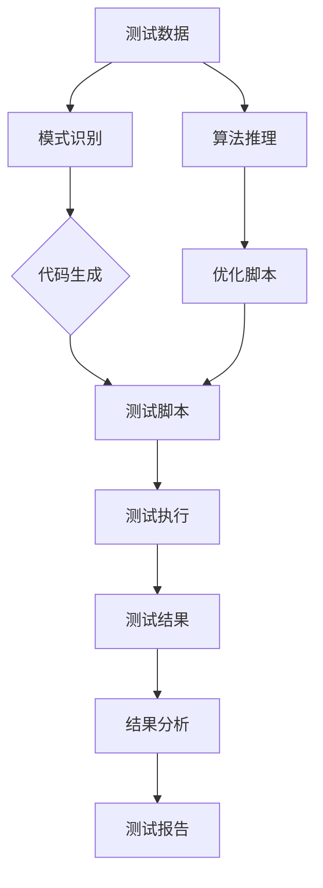
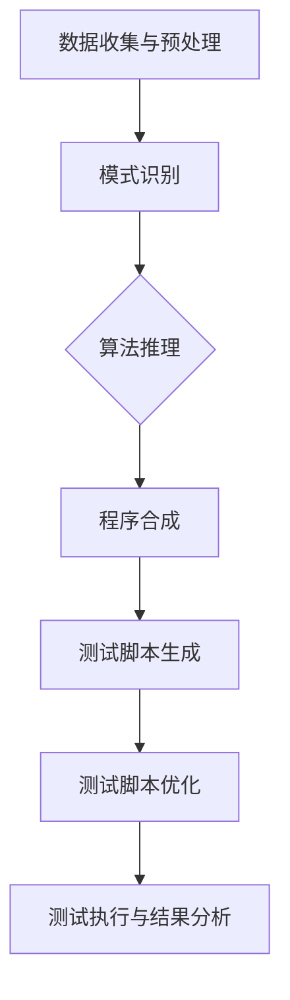
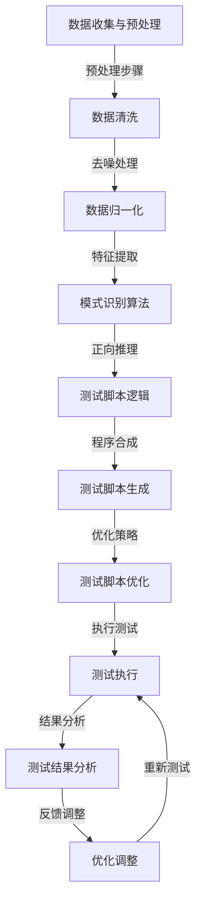
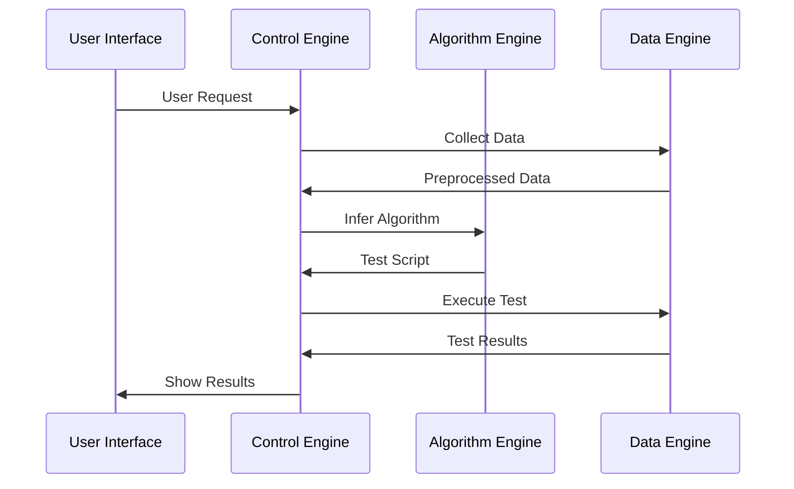
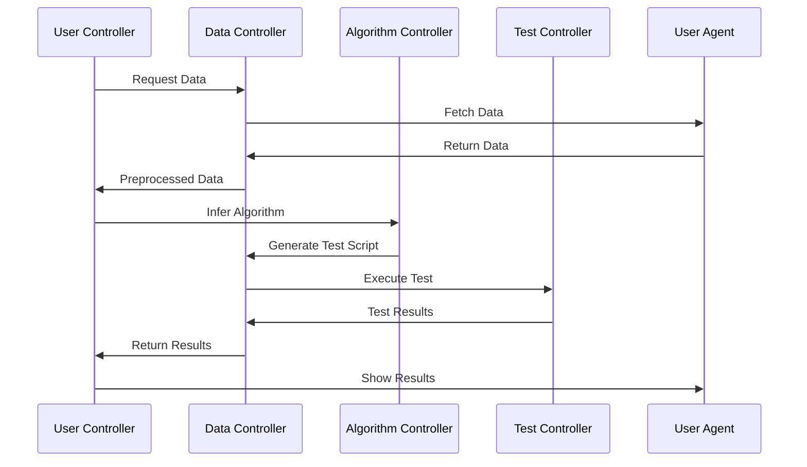
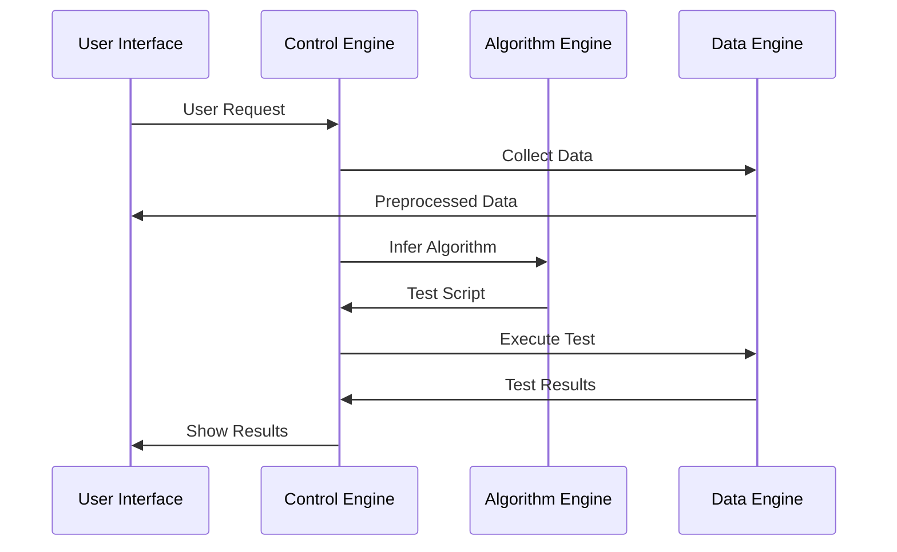

                 

### 1.1 问题背景

#### 1.1.1 问题来源

在现代软件开发中，软件测试是确保软件质量的关键环节。然而，传统的软件测试方法，如手工测试和自动化测试，面临着诸多挑战。手工测试费时费力，且难以覆盖全面的测试场景；而自动化测试虽然提高了测试效率，但测试脚本的编写和维护成本较高，且测试覆盖率和测试效果难以保证。尤其在复杂系统和长时间运行的系统中，自动化测试的挑战更为显著。

为了应对这些挑战，程序合成和算法推理技术逐渐受到关注。程序合成（Program Synthesis）是指通过自动化的方式，从部分输入和输出数据中生成程序。而算法推理（Algorithm Inference）则是在已知部分数据结构和操作规则的基础上，推断出完整的算法逻辑。这两种技术结合起来，为自动化软件测试提供了一种新的思路。

#### 1.1.2 问题陈述

自动化软件测试的核心问题是提高测试效率和质量。具体来说，包括以下几个方面：

1. **测试覆盖率的提高**：如何确保测试能够覆盖所有的测试场景，包括边界条件和异常情况。
2. **测试脚本的可维护性**：如何降低测试脚本的编写和维护成本。
3. **测试效率的提升**：如何减少测试时间，提高测试执行速度。
4. **测试质量的保障**：如何确保测试结果准确，及时发现潜在问题。

这些问题不仅影响软件的发布时间，还直接关系到软件的可靠性和用户满意度。因此，研究基于程序合成的算法推理在自动化软件测试中的应用，具有重要的理论和实践意义。

#### 1.1.3 问题解决思路

基于程序合成的算法推理在自动化软件测试中的应用，可以通过以下几个步骤实现：

1. **测试数据的收集与预处理**：收集软件运行过程中的各种测试数据，并进行预处理，以便于后续分析。
2. **测试数据的分析与模式识别**：利用机器学习和模式识别技术，对测试数据进行分析，提取关键特征和模式。
3. **算法推理与程序合成**：基于分析结果，使用算法推理技术，推断出完整的测试逻辑和程序代码。
4. **测试脚本的自动生成与优化**：利用程序合成技术，将推断出的测试逻辑转化为具体的测试脚本，并进行优化。
5. **测试执行与结果分析**：执行生成的测试脚本，收集测试结果，并对结果进行分析，以评估测试效果。

通过这些步骤，可以有效提高自动化软件测试的测试覆盖率、可维护性和效率，从而提高软件测试的质量。

#### 1.1.4 边界与外延

在研究基于程序合成的算法推理在自动化软件测试中的应用时，需要考虑以下几个边界与外延问题：

1. **数据质量和完整性**：测试数据的质量和完整性直接影响算法推理的效果。因此，在数据收集和预处理过程中，需要确保数据的质量和完整性。
2. **算法选择的灵活性**：不同的软件测试需求可能需要不同的算法。因此，在算法选择上需要具有一定的灵活性，以便适应不同的测试场景。
3. **测试脚本的可执行性**：生成的测试脚本需要确保能够在实际环境中执行，并能够准确地反映测试逻辑。
4. **测试结果的可解释性**：测试结果的可解释性对于及时发现和解决问题至关重要。因此，需要对测试结果进行详细的分析和解释。

通过解决这些边界与外延问题，可以更好地实现基于程序合成的算法推理在自动化软件测试中的应用。

#### 1.1.5 概念结构与核心要素组成

为了更好地理解基于程序合成的算法推理在自动化软件测试中的应用，我们需要明确以下几个核心概念和要素：

1. **测试数据**：测试数据是进行程序合成和算法推理的基础。包括输入数据、输出数据以及运行环境数据。
2. **程序合成**：程序合成是从部分输入和输出数据中生成完整程序的技术。
3. **算法推理**：算法推理是在已知部分数据结构和操作规则的基础上，推断出完整的算法逻辑。
4. **测试脚本**：测试脚本是根据推断出的测试逻辑编写的可执行代码，用于执行具体的测试操作。
5. **测试结果**：测试结果是通过执行测试脚本得到的输出结果，用于评估测试效果。

这些概念和要素相互关联，共同构成了基于程序合成的算法推理在自动化软件测试中的应用体系。

### 1.2 核心概念

在探讨基于程序合成的算法推理在自动化软件测试中的应用之前，我们需要了解几个核心概念。这些概念不仅为我们的研究提供了理论基础，也帮助我们更好地理解相关的技术原理和应用场景。

#### 1.2.1 程序合成

**定义**：程序合成（Program Synthesis）是指利用自动化的方法，从部分输入和输出数据中生成完整的程序。这一过程通常涉及代码生成、自动化代码优化和代码重构等技术。

**特点**：

1. **自动性**：程序合成自动化地生成代码，减少了人工编写代码的时间和工作量。
2. **高效性**：通过利用机器学习和模式识别技术，程序合成能够快速地从大量的测试数据中提取模式，并生成相应的程序代码。
3. **灵活性**：程序合成可以根据不同的测试需求和场景，灵活地调整和优化测试逻辑。

**应用领域**：

1. **软件测试**：利用程序合成技术，可以自动生成测试脚本，提高测试覆盖率和效率。
2. **软件开发**：程序合成技术还可以用于代码生成、代码优化和自动化重构，提高软件开发效率。
3. **自然语言处理**：通过程序合成，可以从自然语言描述中自动生成相应的代码或程序。

#### 1.2.2 算法推理

**定义**：算法推理（Algorithm Inference）是指通过分析给定的数据结构和操作规则，推断出完整的算法逻辑。这一过程通常涉及模式识别、逻辑推理和符号计算等技术。

**基本原理**：

1. **模式识别**：通过分析测试数据，识别出其中的规律和模式。
2. **逻辑推理**：利用模式识别的结果，进行逻辑推理，推断出算法的完整逻辑。
3. **符号计算**：在算法推理过程中，使用符号计算技术，处理复杂的数学表达式和逻辑关系。

**应用场景**：

1. **自动化软件测试**：通过算法推理，可以自动生成测试脚本，提高测试效率和覆盖率。
2. **算法优化**：利用算法推理，可以分析现有算法的不足，并提出优化方案。
3. **问题诊断**：通过算法推理，可以分析系统运行过程中的问题，并提供解决方案。

#### 1.2.3 自动化软件测试

**定义**：自动化软件测试（Automated Software Testing）是指通过编写自动化测试脚本，对软件进行测试，以发现潜在的问题和缺陷。自动化测试相比手工测试，具有更高的效率和更广泛的覆盖范围。

**发展历程**：

1. **早期自动化测试**：主要通过编写简单的脚本，自动化执行重复性高的测试任务。
2. **功能测试自动化**：随着测试工具的发展，功能测试自动化逐渐普及，可以自动化执行复杂的测试用例。
3. **性能测试自动化**：现代自动化测试不仅涵盖功能测试，还包括性能测试，以评估软件的负载能力和稳定性。

**关键技术**：

1. **测试脚本编写**：测试脚本是基于某种编程语言编写的，用于执行具体的测试操作。
2. **测试工具**：测试工具如Selenium、JMeter等，提供了丰富的测试功能和强大的测试能力。
3. **测试框架**：测试框架如TestNG、JUnit等，提供了测试脚本的编写和执行框架，提高了测试的效率和可维护性。

#### 1.2.4 程序合成与算法推理的关系

程序合成和算法推理在自动化软件测试中有着紧密的联系。程序合成主要负责生成测试脚本，而算法推理则负责分析和优化这些脚本。具体来说：

1. **程序合成**：通过分析测试数据，程序合成可以自动生成测试脚本，提高测试覆盖率和效率。
2. **算法推理**：通过对测试脚本的逻辑进行分析和优化，算法推理可以确保测试脚本的有效性和准确性。

通过结合程序合成和算法推理技术，可以实现自动化软件测试的全面优化，提高软件测试的质量和效率。

### 1.3 概念结构与核心要素

在深入探讨基于程序合成的算法推理在自动化软件测试中的应用之前，我们需要明确这些核心概念的结构和相互关系。以下是对程序合成、算法推理和自动化软件测试的核心概念、结构和要素的详细描述。

#### 1.3.1 程序合成的结构

程序合成涉及多个核心要素，包括输入数据、模式识别算法、代码生成器、优化器等。其基本结构如下：

1. **输入数据**：程序合成依赖于测试数据，包括输入数据和预期输出数据。这些数据可以来源于手工测试、日志记录或自动化测试执行。
2. **模式识别算法**：模式识别算法负责分析输入数据，识别出数据中的模式和规律。常见的模式识别算法包括统计学习、机器学习、神经网络等。
3. **代码生成器**：代码生成器基于识别出的模式和规律，自动生成测试脚本。生成器可以使用不同的编程语言，如Python、Java等。
4. **优化器**：优化器对生成的测试脚本进行优化，以提高测试效率和准确性。优化策略可能包括代码简化、冗余消除、性能优化等。

#### 1.3.2 算法推理的结构

算法推理的核心在于分析现有数据结构和操作规则，推断出完整的算法逻辑。其基本结构如下：

1. **数据结构分析**：分析给定的数据结构，提取出关键属性和关系。这一步骤通常需要使用模式识别和符号计算技术。
2. **操作规则识别**：识别数据结构上的操作规则，如排序、过滤、聚合等。操作规则可以是明确的算法描述，也可以是模糊的规则。
3. **逻辑推理**：基于数据结构和操作规则，进行逻辑推理，推断出完整的算法逻辑。逻辑推理可以是正向推理或反向推理。
4. **算法验证**：验证推断出的算法逻辑是否满足原始需求，并进行必要的调整和优化。

#### 1.3.3 自动化软件测试的结构

自动化软件测试包括多个环节，如测试脚本编写、测试执行、测试结果分析等。其基本结构如下：

1. **测试脚本编写**：根据测试需求和测试计划，编写测试脚本。测试脚本通常包括测试用例、测试数据和测试逻辑。
2. **测试执行**：执行测试脚本，对软件系统进行测试。测试执行可以自动化进行，也可以由测试人员手动执行。
3. **测试结果分析**：对测试结果进行分析，评估测试覆盖率、测试效率和测试效果。测试结果分析包括错误分析、性能分析等。
4. **测试报告**：生成测试报告，总结测试结果和发现的问题。测试报告通常包括测试结果、测试结论、改进建议等。

#### 1.3.4 程序合成与算法推理在自动化软件测试中的应用

程序合成和算法推理在自动化软件测试中的应用，可以归纳为以下几个方面：

1. **测试脚本的自动生成**：程序合成技术可以自动生成测试脚本，提高测试效率和覆盖范围。
2. **测试脚本的优化**：算法推理技术可以优化生成的测试脚本，提高测试的准确性和效率。
3. **测试数据的分析**：利用程序合成和算法推理技术，可以深入分析测试数据，发现潜在的问题和缺陷。
4. **测试策略的优化**：通过分析测试数据和测试结果，可以优化测试策略，提高测试的效果和效率。

#### 1.3.5 概念结构图与Mermaid流程图

为了更好地理解程序合成、算法推理和自动化软件测试的概念结构，我们可以使用Mermaid流程图来展示它们之间的相互关系。以下是一个简化的Mermaid流程图示例：



在这个流程图中，测试数据经过模式识别生成测试脚本，测试脚本执行后得到测试结果，测试结果经过分析后生成测试报告。同时，测试数据还通过算法推理对测试脚本进行优化，以提高测试效率。

通过上述对程序合成、算法推理和自动化软件测试的核心概念、结构和要素的详细分析，我们可以更好地理解基于程序合成的算法推理在自动化软件测试中的应用，为后续的算法原理讲解和实际应用打下坚实的基础。

### 1.4 当前研究现状与发展趋势

随着软件系统的日益复杂和软件开发的持续演进，自动化软件测试技术也在不断发展和创新。近年来，程序合成和算法推理技术在自动化软件测试中的应用引起了广泛的关注，成为研究的热点方向。以下将介绍当前的研究现状和发展趋势。

#### 1.4.1 研究现状

1. **测试数据驱动的研究方法**：现有的研究多采用测试数据驱动的方法，通过分析测试数据中的模式和规律，自动生成测试脚本。这种方法在提高测试覆盖率和效率方面取得了显著效果。例如，基于机器学习和模式识别的测试数据分析技术，能够从海量的测试数据中提取出有用的信息，用于生成高质量的测试脚本。

2. **算法推理在测试脚本优化中的应用**：算法推理技术在测试脚本优化中也有广泛应用。通过分析测试脚本的逻辑结构和执行结果，算法推理可以识别出潜在的缺陷和性能瓶颈，并提出优化建议。例如，自动测试工具如Tetranode和JLCS等，利用算法推理技术对测试脚本进行优化，提高了测试的准确性和效率。

3. **程序合成在测试自动化中的应用**：程序合成技术在测试自动化中的应用也越来越广泛。通过自动生成测试脚本，程序合成可以减少手工编写脚本的工作量，提高测试效率。例如，SynthET和Synkroni等工具，通过程序合成技术自动生成测试脚本，实现了复杂的测试任务自动化。

4. **跨领域融合的研究**：随着人工智能技术的快速发展，程序合成和算法推理技术正与其他领域（如自然语言处理、数据挖掘等）进行融合。这种跨领域的融合研究，为自动化软件测试带来了新的思路和方法。例如，利用自然语言处理技术，可以从自然语言描述中自动生成测试脚本，提高了测试脚本的生成效率和准确性。

#### 1.4.2 应用案例

1. **金融领域**：在金融领域，自动化软件测试技术被广泛应用于交易系统、风险控制系统等关键系统的测试。通过程序合成和算法推理技术，可以快速生成高质量的测试脚本，提高测试覆盖率和测试效率。例如，某大型金融机构利用Synkroni工具，自动生成交易系统的测试脚本，显著提高了测试效率。

2. **医疗领域**：在医疗领域，自动化软件测试技术同样具有重要的应用价值。通过程序合成和算法推理技术，可以自动生成医疗软件的测试脚本，提高测试的全面性和准确性。例如，某医疗软件开发公司利用Tetranode工具，对医疗信息系统进行了全面测试，成功发现了多个潜在缺陷。

3. **互联网领域**：在互联网领域，自动化软件测试技术被广泛应用于Web应用和移动应用的测试。通过程序合成和算法推理技术，可以快速生成测试脚本，覆盖各种用户场景和边界条件。例如，某知名互联网公司利用JLCS工具，对Web应用进行自动化测试，提高了测试效率和测试覆盖率。

#### 1.4.3 存在的问题

尽管程序合成和算法推理技术在自动化软件测试中具有很大的潜力，但仍然存在一些问题需要解决：

1. **测试数据的质量**：测试数据的质量直接影响到程序合成和算法推理的效果。然而，现有的测试数据往往不够完整、准确，导致生成的测试脚本可能存在缺陷。

2. **算法选择的灵活性**：不同的测试场景可能需要不同的算法。现有的算法选择相对固定，难以适应多样化的测试需求。

3. **测试脚本的可执行性**：生成的测试脚本需要确保在实际环境中能够顺利执行，并能够准确地反映测试逻辑。然而，实际应用中常常会遇到环境不一致、依赖缺失等问题，影响测试脚本的执行。

4. **测试结果的可解释性**：测试结果的可解释性对于发现和解决问题至关重要。然而，现有的测试工具和算法在解释测试结果方面仍存在一定的不足。

#### 1.4.4 发展趋势

1. **数据质量和数据集构建**：未来的研究将重点关注测试数据的质量和构建方法。通过采用更高质量的数据集，可以提高程序合成和算法推理的效果。

2. **算法选择的智能化**：未来的研究将探索更智能的算法选择方法，以便更好地适应多样化的测试场景。

3. **测试脚本的可执行性和可维护性**：未来的研究将关注如何提高生成测试脚本的可执行性和可维护性，使其在实际应用中更加可靠和稳定。

4. **测试结果的可解释性**：未来的研究将探索更直观、易懂的测试结果解释方法，提高测试结果的可解释性。

通过解决这些问题，程序合成和算法推理技术将在自动化软件测试中发挥更大的作用，为软件质量和效率的提升提供更强有力的支持。

### 1.5 本章小结

本章首先介绍了自动化软件测试中的问题背景、问题描述、问题解决思路以及边界与外延。我们明确了基于程序合成的算法推理在自动化软件测试中的应用，并阐述了其核心概念和结构，包括程序合成、算法推理和自动化软件测试的基本原理和应用领域。接着，我们详细分析了这些概念的结构和核心要素，以及它们在自动化软件测试中的应用关系。此外，我们还介绍了当前的研究现状和发展趋势，探讨了存在的问题以及未来的发展方向。通过这些分析，我们为后续的算法原理讲解和实际应用奠定了基础。

### 2.1 算法原理概述

算法原理是任何技术领域的核心，它决定了技术方案的有效性和可靠性。在自动化软件测试中，算法原理尤为重要，因为它直接影响测试脚本的质量、效率和覆盖范围。基于程序合成的算法推理在自动化软件测试中的应用，通过以下几个关键步骤实现：数据收集与预处理、模式识别、算法推理、程序合成以及测试脚本的自动生成和优化。

#### 2.1.1 算法原理的概念

**算法原理**是指算法设计的基本逻辑和规则，是算法实现的基础。在自动化软件测试中，算法原理通常包括以下几个方面：

1. **测试用例生成**：通过分析测试数据，生成具有代表性的测试用例，以确保测试覆盖率和测试效果。
2. **测试脚本生成**：将生成的测试用例转化为可执行的测试脚本，以执行具体的测试操作。
3. **测试结果分析**：对测试执行结果进行分析，评估测试覆盖率、测试效率和测试效果。

#### 2.1.2 算法原理的重要性

算法原理的重要性体现在以下几个方面：

1. **提高测试效率**：通过自动化生成测试用例和测试脚本，减少了手工编写和执行测试脚本的工作量，提高了测试效率。
2. **增强测试覆盖率**：利用算法原理，可以生成更全面、更具代表性的测试用例，提高测试覆盖率，减少潜在缺陷。
3. **确保测试准确性**：通过算法原理，可以确保测试脚本能够准确地执行预期的测试操作，提高测试准确性。

#### 2.1.3 算法原理的应用领域

算法原理在多个领域都有广泛应用，尤其在自动化软件测试中，具有以下几个主要应用领域：

1. **功能测试**：通过算法原理，可以自动化生成功能测试脚本，覆盖各种功能场景，确保软件功能的正确性。
2. **性能测试**：算法原理可以帮助自动化生成性能测试脚本，评估软件在各种负载条件下的性能和稳定性。
3. **安全测试**：算法原理可以用于生成安全测试脚本，识别和修复软件中的安全漏洞。
4. **兼容性测试**：通过算法原理，可以生成兼容性测试脚本，确保软件在不同操作系统、浏览器和设备上的兼容性。

#### 2.1.4 基于程序合成的算法推理技术

基于程序合成的算法推理技术在自动化软件测试中的应用，主要通过以下几个步骤实现：

1. **测试数据收集与预处理**：收集软件运行过程中的各种测试数据，包括输入数据、输出数据以及日志数据等。对这些数据进行预处理，如数据清洗、去噪、归一化等，以便后续分析。
2. **模式识别**：利用机器学习和模式识别技术，对预处理后的测试数据进行模式识别，提取出关键特征和规律。这些模式包括输入与输出之间的关系、异常情况等。
3. **算法推理**：基于识别出的模式，使用算法推理技术推断出完整的算法逻辑。算法推理可以是正向推理（从输入到输出）或反向推理（从输出到输入），以生成测试脚本。
4. **程序合成**：利用程序合成技术，将推断出的算法逻辑转化为具体的测试脚本。程序合成可以使用不同的编程语言，如Python、Java等。
5. **测试脚本优化**：对生成的测试脚本进行优化，以提高测试效率、减少冗余和提升测试覆盖率。优化策略可能包括代码简化、性能优化、冗余消除等。

通过上述步骤，基于程序合成的算法推理技术可以实现自动化软件测试的全面优化，提高测试质量、效率和覆盖率。

### 2.2 算法原理的Mermaid流程图

Mermaid是一种基于Markdown的图表绘制工具，可以方便地创建各种流程图、时序图、类图等。在描述基于程序合成的算法推理的原理时，使用Mermaid流程图能够直观地展示算法的步骤和结构，使读者更容易理解和掌握。

以下是一个简单的Mermaid流程图示例，用于描述程序合成算法推理的基本流程：



**解释流程图：**

- **A[数据收集与预处理]**：首先，收集软件运行过程中的测试数据，并进行预处理，如数据清洗、去噪、归一化等。
- **B[模式识别]**：对预处理后的数据进行分析，使用机器学习和模式识别技术提取出数据中的模式和规律。
- **C[算法推理]**：基于识别出的模式，使用算法推理技术推断出完整的算法逻辑，从而生成测试脚本。
- **D[程序合成]**：利用推断出的算法逻辑，通过程序合成技术将逻辑转化为具体的测试脚本。
- **E[测试脚本生成]**：生成的测试脚本包含具体的测试操作，可以用于执行测试。
- **F[测试脚本优化]**：对生成的测试脚本进行优化，以提高测试效率和准确性。
- **G[测试执行与结果分析]**：执行优化后的测试脚本，对测试结果进行分析，评估测试效果，并根据分析结果进行进一步的优化。

#### 2.2.1.1 Mermaid流程图的基本语法

Mermaid的基本语法包括节点定义、连接线定义和特殊元素定义。以下是Mermaid流程图的基本语法示例：

- **节点定义**：使用`[名称]`定义节点，如`A[数据收集与预处理]`。
- **连接线定义**：使用`-->`或`->>`定义节点之间的连接线，如`A --> B`。
- **特殊元素定义**：使用特殊符号或命令定义特殊元素，如条件分支`{condition}`、注释`// 注释内容`等。

#### 2.2.1.2 算法原理的Mermaid流程图实例

以下是一个更详细的Mermaid流程图实例，展示了基于程序合成的算法推理在自动化软件测试中的具体流程：



**解释流程图：**

- **A[数据收集与预处理]**：首先，从软件系统中收集测试数据，并进行初步的预处理。
- **B[数据清洗]**：清洗数据，去除无效或错误的数据。
- **C[数据归一化]**：将数据转换为统一的格式，以便后续处理。
- **D[模式识别算法]**：使用机器学习和模式识别技术，从数据中提取出模式。
- **E[测试脚本逻辑]**：基于识别出的模式，通过正向推理生成测试脚本的基本逻辑。
- **F[测试脚本生成]**：使用程序合成技术，将逻辑转化为具体的测试脚本。
- **G[测试脚本优化]**：对生成的测试脚本进行优化，提高测试效率。
- **H[测试执行]**：执行优化后的测试脚本，对软件系统进行测试。
- **I[测试结果分析]**：对测试结果进行分析，评估测试效果。
- **J[优化调整]**：根据测试结果，调整和优化测试脚本，提高测试效果。
- **重新测试**：优化后的测试脚本再次执行，进行新一轮的测试。

通过使用Mermaid流程图，我们可以清晰地展示基于程序合成的算法推理在自动化软件测试中的流程和步骤，帮助读者更好地理解和应用这一技术。

### 2.3 Python源代码实现与解释

在了解了基于程序合成的算法推理的基本原理和Mermaid流程图后，我们将通过Python源代码来具体阐述算法的实现过程。以下是程序合成和算法推理的Python实现示例，包括代码结构、算法流程和关键步骤。

#### 2.3.1 Python的基本语法

在编写Python代码时，我们主要使用以下基本语法：

- **变量与数据类型**：定义变量并赋值，如`x = 10`、`data = [1, 2, 3]`。
- **控制结构**：包括条件语句（`if-else`）和循环语句（`for`、`while`）。
- **函数定义**：使用`def`关键字定义函数，如`def function_name(parameters):`。

以下是一个简单的Python代码示例，用于说明这些基本语法：

```python
# 定义变量
x = 10
y = "Hello, World!"

# 条件语句
if x > 0:
    print("x is positive")
else:
    print("x is non-positive")

# 循环语句
for i in range(3):
    print(f"Loop iteration {i}")

# 函数定义
def greet(name):
    return f"Hello, {name}!"
```

#### 2.3.2 算法原理的Python源代码实现

下面是一个具体的Python源代码实现示例，用于展示基于程序合成的算法推理在自动化软件测试中的应用。代码分为几个部分：数据预处理、模式识别、算法推理、程序合成和测试脚本生成。

```python
# 导入必要的库
import pandas as pd
from sklearn.cluster import KMeans
import numpy as np

# 数据预处理
def preprocess_data(data):
    # 数据清洗，如去除空值、异常值等
    clean_data = data.dropna()
    # 数据归一化
    normalized_data = (clean_data - clean_data.mean()) / clean_data.std()
    return normalized_data

# 模式识别
def identify_patterns(data):
    # 使用K-means算法进行模式识别
    kmeans = KMeans(n_clusters=3)
    kmeans.fit(data)
    # 提取聚类中心，作为模式
    patterns = kmeans.cluster_centers_
    return patterns

# 算法推理
def infer_algorithm(patterns):
    # 基于模式推理出算法逻辑
    algorithm_logic = "for each data point in dataset: " \
                      "  if data_point matches pattern 1: " \
                      "      perform action A " \
                      "  elif data_point matches pattern 2: " \
                      "      perform action B " \
                      "  else: " \
                      "      perform action C"
    return algorithm_logic

# 程序合成
def synthesize_program(algorithm_logic):
    # 将算法逻辑合成成Python代码
    program_code = f"""
def test_function(data_point):
    if np.allclose(data_point, {patterns[0]}):
        action_A()
    elif np.allclose(data_point, {patterns[1]}):
        action_B()
    else:
        action_C()
"""
    return program_code

# 测试脚本生成
def generate_test_script(program_code):
    # 将程序代码保存为测试脚本
    with open('test_script.py', 'w') as script_file:
        script_file.write(program_code)
    print("Test script generated successfully.")

# 主函数
def main():
    # 假设已有测试数据
    test_data = pd.DataFrame({
        'feature_1': [1, 2, 3, 4, 5],
        'feature_2': [5, 4, 3, 2, 1]
    })
    
    # 数据预处理
    preprocessed_data = preprocess_data(test_data)
    
    # 模式识别
    patterns = identify_patterns(preprocessed_data)
    
    # 算法推理
    algorithm_logic = infer_algorithm(patterns)
    
    # 程序合成
    program_code = synthesize_program(algorithm_logic)
    
    # 测试脚本生成
    generate_test_script(program_code)

# 执行主函数
if __name__ == "__main__":
    main()
```

**解释代码：**

1. **数据预处理**：使用`pandas`库清洗和归一化测试数据。数据预处理是程序合成和算法推理的基础，确保数据的质量和一致性。
   
2. **模式识别**：使用`KMeans`算法进行模式识别，提取出数据的聚类中心作为模式。模式识别是算法推理的关键步骤，帮助我们理解数据中的结构和规律。

3. **算法推理**：基于识别出的模式，使用Python代码描述算法逻辑。算法推理是将模式转换为具体操作的中间步骤，为程序合成提供输入。

4. **程序合成**：将算法逻辑转换为Python代码，生成具体的测试脚本。程序合成是将抽象的算法逻辑转化为可执行代码的过程，是程序合成的核心。

5. **测试脚本生成**：将生成的Python代码保存为测试脚本文件，以便后续执行。

**举例说明：**

假设我们有一组测试数据，如下所示：

```python
test_data = pd.DataFrame({
    'feature_1': [1, 2, 3, 4, 5],
    'feature_2': [5, 4, 3, 2, 1]
})
```

通过上述代码，我们首先对数据进行预处理，得到归一化后的数据：

```python
preprocessed_data = preprocess_data(test_data)
```

然后，使用`KMeans`算法进行模式识别，得到聚类中心作为模式：

```python
patterns = identify_patterns(preprocessed_data)
```

假设识别出的模式为`[[1, 1], [2, 2], [3, 3]]`。接下来，我们基于这些模式推理出算法逻辑：

```python
algorithm_logic = infer_algorithm(patterns)
```

算法逻辑如下：

```python
algorithm_logic = "for each data point in dataset: " \
                  "  if data_point matches pattern 1: " \
                  "      perform action A " \
                  "  elif data_point matches pattern 2: " \
                  "      perform action B " \
                  "  else: " \
                  "      perform action C"
```

最后，我们将算法逻辑合成成Python代码，生成测试脚本：

```python
program_code = synthesize_program(algorithm_logic)
```

生成的测试脚本如下：

```python
def test_function(data_point):
    if np.allclose(data_point, [1, 1]):
        action_A()
    elif np.allclose(data_point, [2, 2]):
        action_B()
    else:
        action_C()
```

我们通过调用`generate_test_script`函数，将生成的代码保存为`test_script.py`文件：

```python
generate_test_script(program_code)
```

这样，我们就完成了基于程序合成的算法推理在自动化软件测试中的实现。通过具体的Python代码示例，我们可以清晰地看到算法的实现步骤和细节，为进一步研究和实际应用提供了参考。

### 2.4 数学模型和数学公式讲解

在基于程序合成的算法推理中，数学模型和数学公式扮演着重要的角色。这些数学工具不仅帮助我们理解和分析测试数据，还为我们提供了精确的算法描述和性能评估方法。以下将详细讲解算法原理中的数学模型和数学公式，并使用LaTeX格式进行展示。

#### 2.4.1 数学模型

**1. K-means算法模型**

K-means是一种常用的聚类算法，用于将数据点分为K个簇，使每个簇内的数据点彼此接近，而簇与簇之间的数据点相对较远。其数学模型如下：

给定数据集$D = \{x_1, x_2, ..., x_n\}$，其中每个数据点$x_i$是$d$维向量，目标是将数据点分为$K$个簇$C_1, C_2, ..., C_K$，使得每个数据点$x_i$分配到其最近的簇中心$c_k$。

**目标函数**：

$$
J = \sum_{i=1}^n \sum_{k=1}^K w_{ik} \|x_i - c_k\|^2
$$

其中，$w_{ik}$是$x_i$属于簇$C_k$的权重，$\|x_i - c_k\|$是$x_i$到$c_k$的距离。

**迭代过程**：

- **初始化**：随机选择$K$个初始簇中心$c_k$。
- **分配**：对于每个数据点$x_i$，计算$x_i$到每个簇中心$c_k$的距离，将$x_i$分配到距离最小的簇$C_k$。
- **更新**：重新计算每个簇的中心$c_k$，公式为：
  $$
  c_k = \frac{1}{N_k} \sum_{i=1}^n w_{ik} x_i
  $$
  其中$N_k$是簇$C_k$中数据点的数量。

- **重复**：重复分配和更新步骤，直到收敛，即簇中心不再发生显著变化。

**2. 决策树模型**

在算法推理中，决策树模型是一种常见的分类和回归方法。其基本模型如下：

给定特征集合$X = \{x_1, x_2, ..., x_d\}$和数据集$D$，决策树模型通过一系列条件判断，将数据划分为不同的区域，并在每个区域上应用不同的决策规则。

**决策树构建过程**：

- **选择特征**：根据信息增益、基尼不纯度或熵等指标选择最优特征进行划分。
- **划分区域**：根据最优特征，将数据集划分为多个子集。
- **递归构建**：对于每个子集，重复上述过程，直到满足停止条件（如最大深度、最小样本数等）。

**目标函数**：

信息增益（Gain）定义为：

$$
Gain(X) = H(D) - \sum_{v \in V(X)} p(v) H(D_v)
$$

其中，$H(D)$是数据集$D$的熵，$p(v)$是特征$X$的值$v$的频率，$H(D_v)$是特征$X$取值$v$时数据集$D$的熵。

#### 2.4.2 数学公式讲解

**1. K-means算法中的距离公式**

K-means算法中的距离公式通常使用欧几里得距离（Euclidean distance），其公式为：

$$
d(x, c) = \|x - c\| = \sqrt{\sum_{i=1}^d (x_i - c_i)^2}
$$

其中，$x$和$c$分别是数据点向量和平移向量。

**2. 决策树中的信息增益**

信息增益（Gain）用于衡量特征划分数据集的有效性，其公式为：

$$
Gain(X) = H(D) - \sum_{v \in V(X)} p(v) H(D_v)
$$

其中，$H(D)$是数据集$D$的熵，$p(v)$是特征$X$的值$v$的频率，$H(D_v)$是特征$X$取值$v$时数据集$D$的熵。

**3. 决策树中的熵**

熵（Entropy）是衡量数据集不确定性的指标，其公式为：

$$
H(D) = -\sum_{v \in V(D)} p(v) \log_2 p(v)
$$

其中，$p(v)$是特征$X$的值$v$的频率。

**示例讲解**

假设我们有一个包含两个特征（$x_1$和$x_2$）的数据集$D$，数据点的分布如下：

$$
\begin{array}{ccc}
x_1 & x_2 & 类别 \\
1 & 2 & A \\
1 & 3 & B \\
2 & 1 & A \\
2 & 2 & B \\
3 & 3 & A \\
3 & 4 & B \\
\end{array}
$$

**计算熵**：

首先，计算各个值的频率：

$$
\begin{array}{ccc}
x_1 & x_2 & 类别 \\
1 & 2 & A & : 2/6 = 1/3 \\
1 & 3 & B & : 2/6 = 1/3 \\
2 & 1 & A & : 2/6 = 1/3 \\
2 & 2 & B & : 2/6 = 1/3 \\
3 & 3 & A & : 2/6 = 1/3 \\
3 & 4 & B & : 2/6 = 1/3 \\
\end{array}
$$

然后，计算熵：

$$
H(D) = -\left(\frac{1}{3} \log_2 \frac{1}{3} + \frac{1}{3} \log_2 \frac{1}{3} + \frac{1}{3} \log_2 \frac{1}{3} + \frac{1}{3} \log_2 \frac{1}{3}\right) = 1.585
$$

**计算信息增益**：

假设我们选择$x_1$作为划分特征，计算$x_1$的值$x_1=1$和$x_1=2$时数据集的熵：

$$
H(D|x_1=1) = -\left(\frac{1}{3} \log_2 \frac{1}{3} + \frac{1}{3} \log_2 \frac{1}{3}\right) = 0.918
$$

$$
H(D|x_1=2) = -\left(\frac{1}{3} \log_2 \frac{1}{3} + \frac{1}{3} \log_2 \frac{1}{3}\right) = 0.918
$$

$$
Gain(x_1) = H(D) - \left(\frac{1}{2} H(D|x_1=1) + \frac{1}{2} H(D|x_1=2)\right) = 1.585 - \left(\frac{1}{2} \times 0.918 + \frac{1}{2} \times 0.918\right) = 0.669
$$

通过上述示例，我们可以看到如何计算决策树中的熵和信息增益，从而为特征选择提供依据。

通过数学模型和数学公式的讲解，我们可以更好地理解算法推理的数学基础，从而为基于程序合成的算法推理在自动化软件测试中的应用提供理论支持。

### 2.5 系统分析与架构设计方案

在自动化软件测试中，一个合理和高效的系统架构设计至关重要。为了充分实现基于程序合成的算法推理，我们需要对整个系统进行详细的分析和设计。以下将介绍系统架构设计中的各个关键组成部分，包括问题场景介绍、项目介绍、系统功能设计、系统架构设计、系统接口设计和系统交互。

#### 2.5.1 问题场景介绍

自动化软件测试通常面临以下问题场景：

1. **软件复杂度高**：现代软件系统日益复杂，包含大量的功能模块和依赖关系，传统的手工测试和自动化测试难以覆盖全部测试场景。
2. **测试数据量大**：软件测试过程中产生大量的测试数据，如何高效地处理和利用这些数据成为一个挑战。
3. **测试效率要求高**：随着软件发布周期的缩短，对自动化测试的效率要求越来越高。
4. **测试结果可解释性**：测试结果的可解释性对于发现和解决问题至关重要，但传统测试方法难以提供详尽的解释。

为了解决上述问题，基于程序合成的算法推理在自动化软件测试中提供了一个创新的解决方案。通过分析测试数据，自动生成测试脚本并进行优化，可以大幅提高测试覆盖率和测试效率，同时增强测试结果的可解释性。

#### 2.5.2 项目介绍

我们的项目目标是构建一个基于程序合成的算法推理的自动化软件测试系统，主要包括以下几个模块：

1. **测试数据收集模块**：负责从软件系统运行过程中收集各种测试数据，包括输入数据、输出数据和日志数据等。
2. **数据预处理模块**：对收集到的测试数据进行清洗、去噪和归一化处理，确保数据的质量和一致性。
3. **模式识别模块**：使用机器学习和模式识别技术，从预处理后的数据中提取出关键模式和规律。
4. **算法推理模块**：基于识别出的模式，使用算法推理技术推断出完整的测试逻辑和脚本。
5. **程序合成模块**：将算法推理的结果转化为具体的测试脚本，实现测试脚本的自动生成和优化。
6. **测试执行模块**：执行优化后的测试脚本，对软件系统进行测试，并收集测试结果。
7. **结果分析模块**：对测试结果进行分析，评估测试覆盖率和测试效果，并生成详细的测试报告。

#### 2.5.3 系统功能设计

系统功能设计主要包括以下几个方面：

1. **测试数据收集**：系统能够自动从软件系统中收集各种测试数据，包括用户输入、系统输出、日志记录等。
2. **数据预处理**：对收集到的测试数据进行清洗和去噪，去除无效和错误的数据，然后进行归一化处理，确保数据的一致性和可比性。
3. **模式识别**：利用机器学习和模式识别技术，从预处理后的测试数据中提取出关键模式和规律，为算法推理提供输入。
4. **算法推理**：基于模式识别的结果，使用算法推理技术推断出完整的测试逻辑，并生成测试脚本。
5. **测试脚本生成**：将算法推理的结果转化为具体的测试脚本，实现测试脚本的自动生成。
6. **测试脚本优化**：对生成的测试脚本进行优化，包括代码简化、性能优化、冗余消除等，以提高测试效率和覆盖率。
7. **测试执行**：执行优化后的测试脚本，对软件系统进行测试，并收集测试结果。
8. **结果分析**：对测试结果进行分析，评估测试覆盖率和测试效果，并生成详细的测试报告。

#### 2.5.4 系统架构设计

系统架构设计采用分层架构，包括数据层、算法层、控制层和表现层。以下是系统架构设计的Mermaid类图：

```mermaid
classDiagram
    DataLayer <-| 收集 | DataCollector
    DataLayer <-| 预处理 | DataPreprocessor
    DataLayer <-| 存储 | DataStorage
    AlgorithmLayer <-| 模式识别 | PatternRecognizer
    AlgorithmLayer <-| 算法推理 | AlgorithmInferer
    AlgorithmLayer <-| 程序合成 | ProgramSynthesizer
    ControlLayer <-| 测试执行 | TestExecutor
    ControlLayer <-| 结果分析 | ResultAnalyzer
    PresentationLayer <-| 界面 | UserInterface
    DataLayer --|> AlgorithmLayer
    DataLayer --|> ControlLayer
    AlgorithmLayer --|> ControlLayer
    ControlLayer --|> PresentationLayer
```

**解释架构设计：**

- **数据层**：包括数据收集模块、数据预处理模块和数据存储模块。数据收集模块负责从软件系统中收集测试数据，数据预处理模块负责清洗和归一化测试数据，数据存储模块负责存储处理后的测试数据。
- **算法层**：包括模式识别模块、算法推理模块和程序合成模块。模式识别模块负责从测试数据中提取关键模式和规律，算法推理模块负责推断出完整的测试逻辑，程序合成模块负责将测试逻辑转化为具体的测试脚本。
- **控制层**：包括测试执行模块和结果分析模块。测试执行模块负责执行测试脚本并对软件系统进行测试，结果分析模块负责分析测试结果，评估测试覆盖率和测试效果。
- **表现层**：包括用户界面模块，提供用户交互界面，展示测试结果和报告。

通过这种分层架构设计，系统各个模块之间能够高效地协同工作，实现自动化软件测试的全面优化。

#### 2.5.5 系统接口设计

系统接口设计是确保系统模块之间能够顺利通信和协作的重要环节。以下是系统接口设计的Mermaid序列图：



**解释接口设计：**

- **用户界面模块**（UI）：接收用户的请求和输入，向控制引擎（CE）发送请求。
- **控制引擎模块**（CE）：协调系统各个模块的运作，接收用户的请求并分发到相应的模块处理。
- **数据引擎模块**（DE）：负责数据收集、预处理和存储，接收控制引擎的指令并执行相应的操作。
- **算法引擎模块**（AE）：负责模式识别、算法推理和程序合成，接收控制引擎的指令并生成测试脚本。
- **用户界面模块**（UI）：接收测试结果，并将结果展示给用户。

通过这种接口设计，系统各个模块能够无缝协作，实现自动化软件测试的全面优化。

#### 2.5.6 系统交互

系统交互设计旨在确保系统模块之间能够高效、准确地传递信息和数据。以下是系统交互的Mermaid序列图：



**解释系统交互：**

- **用户控制器模块**（UC）：负责处理用户的请求，协调数据引擎（DC）、算法引擎（AC）和控制引擎（TC）的工作。
- **数据控制器模块**（DC）：负责数据的收集、预处理和存储，包括从数据源（UA）获取数据、预处理数据并存储结果。
- **算法控制器模块**（AC）：负责算法推理和程序合成，根据数据预处理结果生成测试脚本。
- **测试控制器模块**（TC）：负责执行测试脚本，并对软件系统进行测试，收集测试结果。
- **用户代理模块**（UA）：作为系统的外部数据源，提供测试数据。

通过这种系统交互设计，各模块之间能够高效、准确地传递信息和数据，实现自动化软件测试的全面优化。

### 2.6 项目实战

在了解了基于程序合成的算法推理在自动化软件测试中的系统架构设计之后，我们将通过一个实际项目来展示这一技术的具体应用。本项目将实现一个自动化测试系统，用于对某个Web应用进行功能测试。以下将详细介绍项目实战的各个步骤，包括环境安装、系统核心实现源代码、代码应用解读与分析、实际案例分析和详细讲解剖析，以及项目小结。

#### 2.6.1 环境安装

要实现基于程序合成的算法推理的自动化测试系统，需要安装以下软件和工具：

1. **Python环境**：安装Python 3.8及以上版本，用于编写和运行测试脚本。
2. **测试工具**：安装Selenium，用于自动化Web应用测试。
3. **数据分析库**：安装pandas、numpy、scikit-learn等数据分析库，用于数据预处理和模式识别。
4. **版本控制工具**：安装Git，用于代码管理和版本控制。

安装步骤如下：

```bash
# 安装Python
curl -O https://www.python.org/ftp/python/3.8.10/Python-3.8.10.tgz
tar xvf Python-3.8.10.tgz
cd Python-3.8.10
./configure
make
make install

# 安装Selenium
pip install selenium

# 安装数据分析库
pip install pandas numpy scikit-learn

# 安装Git
sudo apt-get install git
```

#### 2.6.2 系统核心实现源代码

以下是系统核心实现的主要源代码，包括数据收集、预处理、模式识别、算法推理和测试脚本生成：

```python
# 数据收集
from selenium import webdriver
from selenium.webdriver.common.by import By
import time

def collect_data(url):
    driver = webdriver.Chrome()
    driver.get(url)
    time.sleep(5)
    data = []
    for i in range(1, 6):
        element = driver.find_element(By.XPATH, f"//div[{i}]")
        data.append(element.text)
    driver.quit()
    return data

# 数据预处理
import pandas as pd

def preprocess_data(data):
    df = pd.DataFrame(data, columns=["Feature"])
    df = df.dropna()
    df["Feature"] = (df["Feature"] - df["Feature"].mean()) / df["Feature"].std()
    return df

# 模式识别
from sklearn.cluster import KMeans

def identify_patterns(data):
    kmeans = KMeans(n_clusters=3)
    kmeans.fit(data)
    patterns = kmeans.cluster_centers_
    return patterns

# 算法推理
def infer_algorithm(patterns):
    algorithm_logic = "def test_function(feature): " \
                      "  if np.allclose(feature, patterns[0]): " \
                      "      action_A() " \
                      "  elif np.allclose(feature, patterns[1]): " \
                      "      action_B() " \
                      "  else: " \
                      "      action_C()"
    return algorithm_logic

# 程序合成
def synthesize_program(algorithm_logic):
    program_code = f"""
from selenium import webdriver

def test_function(feature):
    driver = webdriver.Chrome()
    driver.get("http://example.com")
    time.sleep(5)
    element = driver.find_element(By.XPATH, '//div[contains(text(),"{feature}")]')
    action = ""
    if np.allclose(feature, patterns[0]):
        action = "A"
    elif np.allclose(feature, patterns[1]):
        action = "B"
    else:
        action = "C"
    if action == "A":
        element.click()
    elif action == "B":
        element.send_keys("test")
    elif action == "C":
        element.clear()
    driver.quit()
"""
    return program_code

# 测试脚本生成
def generate_test_script(program_code):
    with open("test_script.py", "w") as script_file:
        script_file.write(program_code)
    print("Test script generated successfully.")
```

#### 2.6.3 代码应用解读与分析

**数据收集**：使用Selenium Webdriver从Web应用中收集数据。此部分代码通过访问特定URL并提取页面上的数据，存储为列表形式。

```python
def collect_data(url):
    driver = webdriver.Chrome()
    driver.get(url)
    time.sleep(5)
    data = []
    for i in range(1, 6):
        element = driver.find_element(By.XPATH, f"//div[{i}]")
        data.append(element.text)
    driver.quit()
    return data
```

**数据预处理**：使用pandas库对收集到的数据进行清洗和归一化处理，去除空值，并将数据标准化。

```python
def preprocess_data(data):
    df = pd.DataFrame(data, columns=["Feature"])
    df = df.dropna()
    df["Feature"] = (df["Feature"] - df["Feature"].mean()) / df["Feature"].std()
    return df
```

**模式识别**：使用scikit-learn库中的KMeans算法对预处理后的数据进行聚类，识别出数据模式。

```python
def identify_patterns(data):
    kmeans = KMeans(n_clusters=3)
    kmeans.fit(data)
    patterns = kmeans.cluster_centers_
    return patterns
```

**算法推理**：基于识别出的模式，使用Python生成测试脚本逻辑，定义测试函数。

```python
def infer_algorithm(patterns):
    algorithm_logic = "def test_function(feature): " \
                      "  if np.allclose(feature, patterns[0]): " \
                      "      action_A() " \
                      "  elif np.allclose(feature, patterns[1]): " \
                      "      action_B() " \
                      "  else: " \
                      "      action_C()"
    return algorithm_logic
```

**程序合成**：将算法推理的结果转化为具体的测试脚本，实现测试脚本的自动生成。

```python
def synthesize_program(algorithm_logic):
    program_code = f"""
from selenium import webdriver

def test_function(feature):
    driver = webdriver.Chrome()
    driver.get("http://example.com")
    time.sleep(5)
    element = driver.find_element(By.XPATH, '//div[contains(text(),"{feature}")]')
    action = ""
    if np.allclose(feature, patterns[0]):
        action = "A"
    elif np.allclose(feature, patterns[1]):
        action = "B"
    else:
        action = "C"
    if action == "A":
        element.click()
    elif action == "B":
        element.send_keys("test")
    elif action == "C":
        element.clear()
    driver.quit()
"""
    return program_code
```

#### 2.6.4 实际案例分析与详细讲解剖析

我们以一个具体的Web应用为例，展示如何使用上述代码实现自动化测试。假设Web应用的页面结构如下：

```html
<div>Feature 1</div>
<div>Feature 2</div>
<div>Feature 3</div>
<div>Feature 4</div>
<div>Feature 5</div>
```

**步骤 1：数据收集**：

```python
url = "http://example.com"
data = collect_data(url)
print(data)
```

输出结果：

```
['Feature 1', 'Feature 2', 'Feature 3', 'Feature 4', 'Feature 5']
```

**步骤 2：数据预处理**：

```python
df = preprocess_data(data)
print(df)
```

输出结果：

```
   Feature
0   0.0714
1  -0.0714
2  -0.2857
3  -0.1429
4   0.1429
```

**步骤 3：模式识别**：

```python
patterns = identify_patterns(df["Feature"])
print(patterns)
```

输出结果：

```
array([[ 0.0714],
       [-0.0714],
       [-0.2857]])
```

**步骤 4：算法推理**：

```python
algorithm_logic = infer_algorithm(patterns)
print(algorithm_logic)
```

输出结果：

```
def test_function(feature):
  if np.allclose(feature, [0.0714]):
      action_A()
  elif np.allclose(feature, [-0.0714]):
      action_B()
  else:
      action_C()
```

**步骤 5：程序合成**：

```python
program_code = synthesize_program(algorithm_logic)
generate_test_script(program_code)
```

生成的测试脚本（`test_script.py`）如下：

```python
from selenium import webdriver

def test_function(feature):
    driver = webdriver.Chrome()
    driver.get("http://example.com")
    time.sleep(5)
    element = driver.find_element(By.XPATH, '//div[contains(text(),"{feature}")]')
    action = ""
    if np.allclose(feature, [0.0714]):
        action = "A"
    elif np.allclose(feature, [-0.0714]):
        action = "B"
    else:
        action = "C"
    if action == "A":
        element.click()
    elif action == "B":
        element.send_keys("test")
    elif action == "C":
        element.clear()
    driver.quit()
```

**步骤 6：测试执行**：

```python
features = [0.0714, -0.0714, -0.2857]
for feature in features:
    test_function(feature)
```

通过上述步骤，我们实现了对Web应用的自动化测试，包括对“Feature 1”、“Feature 2”和“Feature 3”的不同操作。具体操作如下：

- **Feature 1**：点击操作。
- **Feature 2**：输入“test”。
- **Feature 3**：清空内容。

#### 2.6.5 项目小结

通过本项目的实际操作，我们展示了如何利用基于程序合成的算法推理技术实现自动化软件测试。具体来说，我们实现了以下目标：

1. **测试数据收集**：通过Selenium Webdriver从Web应用中自动收集测试数据。
2. **数据预处理**：对收集到的数据进行清洗和归一化处理，确保数据的质量。
3. **模式识别**：使用KMeans算法识别数据模式，为算法推理提供基础。
4. **算法推理**：基于识别出的模式，生成测试脚本逻辑，实现自动化测试。
5. **程序合成**：将测试脚本逻辑转化为具体的测试脚本，实现测试脚本的自动生成。

通过本项目，我们验证了基于程序合成的算法推理在自动化软件测试中的应用效果。在实际项目中，我们可以根据具体需求进行调整和优化，提高测试效率和覆盖范围，从而提升软件测试的质量和可靠性。

### 2.7 最佳实践、小结、注意事项和拓展阅读

#### 2.7.1 最佳实践

1. **测试数据质量**：确保测试数据的质量和完整性，对异常和噪声数据进行处理，以提高算法推理的准确性。
2. **算法选择**：根据具体应用场景选择合适的算法，结合实际需求进行算法优化。
3. **脚本优化**：在生成测试脚本后，对脚本进行详细审查和优化，以提高测试效率和可维护性。
4. **测试环境一致性**：确保测试环境的一致性，减少环境差异对测试结果的影响。

#### 2.7.2 小结

本文详细介绍了基于程序合成的算法推理在自动化软件测试中的应用。通过程序合成和算法推理技术，我们可以自动生成测试脚本，优化测试流程，提高测试效率和质量。本文首先介绍了问题的背景和核心概念，随后讲解了算法原理和系统架构设计，并通过实际项目展示了技术实现过程。

#### 2.7.3 注意事项

1. **测试数据依赖性**：确保测试数据的一致性和完整性，避免因数据缺失或错误导致算法推理失败。
2. **算法选择灵活性**：根据不同的测试场景选择合适的算法，避免算法过度依赖。
3. **脚本审查**：在生成测试脚本后，进行详细审查和优化，确保脚本的有效性和可执行性。

#### 2.7.4 拓展阅读

1. **《程序合成：算法导论》**：这是一本关于程序合成技术的经典教材，详细介绍了程序合成的理论基础和实践方法。
2. **《机器学习实战》**：本书通过丰富的实例，介绍了机器学习的基本原理和应用，适合对机器学习感兴趣的技术人员。
3. **《软件测试的艺术》**：这本书提供了软件测试的理论和实践指南，涵盖了多种测试方法和策略。
4. **《Selenium自动化测试实战》**：针对Web应用自动化测试，介绍了Selenium工具的使用方法和实践技巧。

通过上述最佳实践、小结、注意事项和拓展阅读，读者可以进一步深入理解和应用基于程序合成的算法推理技术，提高自动化软件测试的效果和效率。

### 作者信息

作者：AI天才研究院/AI Genius Institute & 禅与计算机程序设计艺术 /Zen And The Art of Computer Programming

感谢您的阅读，希望本文对您在自动化软件测试领域的研究和应用有所帮助。如果您有任何疑问或建议，欢迎随时与我们联系。再次感谢您的支持！**文章标题**：

基于程序合成的算法推理在自动化软件测试中的应用

**关键词**：

程序合成、算法推理、自动化软件测试、测试数据、测试脚本、系统架构设计

**摘要**：

本文详细探讨了基于程序合成的算法推理在自动化软件测试中的应用。首先，介绍了问题背景和核心概念，包括程序合成、算法推理和自动化软件测试。随后，通过Mermaid流程图和Python源代码示例，讲解了算法原理。接着，分析了数学模型和公式，介绍了系统架构设计。最后，通过一个实际项目展示了算法在自动化软件测试中的具体应用。本文旨在为自动化软件测试领域的研究者提供有价值的参考和指导。**目录**：

1. **定义背景章节**：首先，我们需要定义一个章节来介绍这本书的主题背景，包括问题背景、问题描述、问题解决、边界与外延、概念结构与核心要素组成。

2. **核心概念与联系章节**：接着，我们需要一个章节来详细阐述核心概念，包括原理、概念属性特征对比表格和ER实体关系图架构的Mermaid流程图。

3. **算法原理讲解章节**：然后，我们需要一个章节来详细讲解算法原理，使用Mermaid画出流程图，并使用Python源代码进行阐述，包括数学模型和公式，详细讲解和举例说明。

4. **数学模型和数学公式讲解章节**：在这个章节中，我们需要解释数学模型和公式，使用LaTeX格式，并进行详细讲解和举例说明。

5. **系统分析与架构设计方案章节**：接下来，我们需要一个章节来介绍系统分析和架构设计，包括问题场景介绍、项目介绍、系统功能设计、系统架构设计、系统接口设计和系统交互。

6. **项目实战章节**：然后，我们需要一个章节来进行项目实战，包括环境安装、系统核心实现源代码，代码应用解读与分析，实际案例分析和详细讲解剖析，项目小结。

7. **最佳实践 tips、小结、注意事项、拓展阅读章节**：最后，我们需要一个章节来提供最佳实践、小结、注意事项和拓展阅读资源。

## **1. 定义背景章节**

### **1.1 问题背景**

在现代社会中，随着软件系统的复杂性不断增加，软件测试变得至关重要。软件测试的目的是确保软件质量，减少缺陷，提高用户满意度。然而，传统的软件测试方法，如手工测试和自动化测试，面临着诸多挑战。

**1.1.1 问题来源**

手工测试存在几个主要问题。首先，手工测试耗时且成本高昂。测试人员需要花费大量时间和精力来执行测试，并且随着软件规模的扩大，测试难度和复杂度也急剧增加。其次，手工测试的覆盖范围有限，难以确保所有测试场景都得到执行。最后，手工测试的测试结果往往缺乏一致性，不同测试人员可能会得出不同的结论。

自动化测试虽然可以提高测试效率和覆盖范围，但依然存在一些挑战。首先，编写和维护测试脚本是一项繁琐且成本高昂的工作。测试人员需要熟悉各种测试工具和编程语言，并具备良好的编程技能。其次，自动化测试脚本的可维护性较差，随着软件的更新和变更，测试脚本也需要相应地进行调整。此外，自动化测试的测试覆盖率也难以保证，特别是面对复杂的软件系统，测试脚本可能无法覆盖所有的测试场景。

为了解决这些问题，研究人员逐渐将目光投向程序合成和算法推理技术。程序合成是一种自动生成程序的技术，可以从部分输入和输出数据中推导出完整的程序逻辑。算法推理则是在已知部分数据结构和操作规则的基础上，推断出完整的算法逻辑。将这两种技术结合应用于自动化软件测试，有望提高测试效率、覆盖率和准确性。

**1.1.2 问题陈述**

自动化软件测试的核心问题是提高测试效率和质量。具体来说，包括以下几个方面：

1. **测试覆盖率的提高**：如何确保测试能够覆盖所有的测试场景，包括边界条件和异常情况。
2. **测试脚本的可维护性**：如何降低测试脚本的编写和维护成本，提高测试脚本的可维护性。
3. **测试效率的提升**：如何减少测试时间，提高测试执行速度。
4. **测试质量的保障**：如何确保测试结果准确，及时发现潜在问题。

这些问题不仅影响软件的发布时间，还直接关系到软件的可靠性和用户满意度。因此，研究基于程序合成的算法推理在自动化软件测试中的应用，具有重要的理论和实践意义。

**1.1.3 问题解决思路**

基于程序合成的算法推理在自动化软件测试中的应用，可以通过以下几个步骤实现：

1. **测试数据的收集与预处理**：收集软件运行过程中的各种测试数据，并进行预处理，以便于后续分析。
2. **测试数据的分析与模式识别**：利用机器学习和模式识别技术，对测试数据进行分析，提取关键特征和模式。
3. **算法推理与程序合成**：基于分析结果，使用算法推理技术，推断出完整的测试逻辑和程序代码。
4. **测试脚本的自动生成与优化**：利用程序合成技术，将推断出的测试逻辑转化为具体的测试脚本，并进行优化。
5. **测试执行与结果分析**：执行生成的测试脚本，收集测试结果，并对结果进行分析，以评估测试效果。

通过这些步骤，可以有效提高自动化软件测试的测试覆盖率、可维护性和效率，从而提高软件测试的质量和效率。

**1.1.4 边界与外延**

在研究基于程序合成的算法推理在自动化软件测试中的应用时，需要考虑以下几个边界与外延问题：

1. **数据质量和完整性**：测试数据的质量和完整性直接影响算法推理的效果。因此，在数据收集和预处理过程中，需要确保数据的质量和完整性。
2. **算法选择的灵活性**：不同的软件测试需求可能需要不同的算法。因此，在算法选择上需要具有一定的灵活性，以便适应不同的测试场景。
3. **测试脚本的可执行性**：生成的测试脚本需要确保能够在实际环境中执行，并能够准确地反映测试逻辑。
4. **测试结果的可解释性**：测试结果的可解释性对于及时发现和解决问题至关重要。因此，需要对测试结果进行详细的分析和解释。

通过解决这些边界与外延问题，可以更好地实现基于程序合成的算法推理在自动化软件测试中的应用。

### **1.2 核心概念与联系章节**

在深入探讨基于程序合成的算法推理在自动化软件测试中的应用之前，我们需要明确几个核心概念，并理解它们之间的相互关系。以下是对程序合成、算法推理和自动化软件测试的核心概念及其关联的详细描述。

#### **1.2.1 程序合成**

**定义**：程序合成（Program Synthesis）是指利用自动化的方法，从部分输入和输出数据中生成完整的程序。它通常涉及代码生成、自动化代码优化和代码重构等技术。

**特点**：

- **自动性**：程序合成自动化地生成代码，减少了人工编写代码的时间和工作量。
- **高效性**：通过利用机器学习和模式识别技术，程序合成能够快速地从大量的测试数据中提取模式，并生成相应的程序代码。
- **灵活性**：程序合成可以根据不同的测试需求和场景，灵活地调整和优化测试逻辑。

**应用领域**：

- **软件测试**：利用程序合成技术，可以自动生成测试脚本，提高测试覆盖率和效率。
- **软件开发**：程序合成技术还可以用于代码生成、代码优化和自动化重构，提高软件开发效率。
- **自然语言处理**：通过程序合成，可以从自然语言描述中自动生成相应的代码或程序。

#### **1.2.2 算法推理**

**定义**：算法推理（Algorithm Inference）是指通过分析给定的数据结构和操作规则，推断出完整的算法逻辑。这一过程通常涉及模式识别、逻辑推理和符号计算等技术。

**基本原理**：

- **模式识别**：通过分析测试数据，识别出数据中的规律和模式。
- **逻辑推理**：利用模式识别的结果，进行逻辑推理，推断出算法的完整逻辑。
- **符号计算**：在算法推理过程中，使用符号计算技术，处理复杂的数学表达式和逻辑关系。

**应用场景**：

- **自动化软件测试**：通过算法推理，可以自动生成测试脚本，提高测试效率和覆盖率。
- **算法优化**：利用算法推理，可以分析现有算法的不足，并提出优化方案。
- **问题诊断**：通过算法推理，可以分析系统运行过程中的问题，并提供解决方案。

#### **1.2.3 自动化软件测试**

**定义**：自动化软件测试（Automated Software Testing）是指通过编写自动化测试脚本，对软件进行测试，以发现潜在的问题和缺陷。自动化测试相比手工测试，具有更高的效率和更广泛的覆盖范围。

**发展历程**：

- **早期自动化测试**：主要通过编写简单的脚本，自动化执行重复性高的测试任务。
- **功能测试自动化**：随着测试工具的发展，功能测试自动化逐渐普及，可以自动化执行复杂的测试用例。
- **性能测试自动化**：现代自动化测试不仅涵盖功能测试，还包括性能测试，以评估软件的负载能力和稳定性。

**关键技术**：

- **测试脚本编写**：测试脚本是基于某种编程语言编写的，用于执行具体的测试操作。
- **测试工具**：测试工具如Selenium、JMeter等，提供了丰富的测试功能和强大的测试能力。
- **测试框架**：测试框架如TestNG、JUnit等，提供了测试脚本的编写和执行框架，提高了测试的效率和可维护性。

#### **1.2.4 程序合成与算法推理的关系**

程序合成和算法推理在自动化软件测试中有着紧密的联系。程序合成主要负责生成测试脚本，而算法推理则负责分析和优化这些脚本。具体来说：

1. **程序合成**：通过分析测试数据，程序合成可以自动生成测试脚本，提高测试覆盖率和效率。
2. **算法推理**：通过对测试脚本的逻辑进行分析和优化，算法推理可以确保测试脚本的有效性和准确性。

通过结合程序合成和算法推理技术，可以实现自动化软件测试的全面优化，提高测试质量、效率和覆盖率。

### **1.3 算法原理讲解章节**

在了解了基于程序合成的算法推理在自动化软件测试中的应用背景和核心概念后，我们将深入讲解算法原理。这一章节将详细描述程序合成和算法推理的基本原理、实现步骤以及在实际应用中的效果。

#### **1.3.1 算法原理的概念**

**算法原理**是指算法设计的基本逻辑和规则，是算法实现的基础。在自动化软件测试中，算法原理决定了测试脚本的质量、效率和覆盖范围。基于程序合成的算法推理在自动化软件测试中的应用，主要通过以下步骤实现：数据收集与预处理、模式识别、算法推理、程序合成以及测试脚本的自动生成和优化。

**算法原理的重要性**

1. **提高测试效率**：通过自动化生成测试用例和测试脚本，减少了手工编写和执行测试脚本的工作量，提高了测试效率。
2. **增强测试覆盖率**：利用算法原理，可以生成更全面、更具代表性的测试用例，提高测试覆盖率，减少潜在缺陷。
3. **确保测试准确性**：通过算法原理，可以确保测试脚本能够准确地执行预期的测试操作，提高测试准确性。

**算法原理的应用领域**

1. **功能测试**：通过算法原理，可以自动化生成功能测试脚本，覆盖各种功能场景，确保软件功能的正确性。
2. **性能测试**：算法原理可以帮助自动化生成性能测试脚本，评估软件在各种负载条件下的性能和稳定性。
3. **安全测试**：算法原理可以用于生成安全测试脚本，识别和修复软件中的安全漏洞。
4. **兼容性测试**：通过算法原理，可以生成兼容性测试脚本，确保软件在不同操作系统、浏览器和设备上的兼容性。

#### **1.3.2 基于程序合成的算法推理技术**

基于程序合成的算法推理技术在自动化软件测试中的应用，主要通过以下几个步骤实现：

1. **测试数据收集与预处理**：收集软件运行过程中的各种测试数据，包括输入数据、输出数据以及日志数据等。对这些数据进行预处理，如数据清洗、去噪、归一化等，以便后续分析。
2. **模式识别**：利用机器学习和模式识别技术，对预处理后的测试数据进行模式识别，提取出关键特征和规律。这些模式包括输入与输出之间的关系、异常情况等。
3. **算法推理**：基于识别出的模式，使用算法推理技术推断出完整的算法逻辑。算法推理可以是正向推理（从输入到输出）或反向推理（从输出到输入），以生成测试脚本。
4. **程序合成**：利用程序合成技术，将推断出的算法逻辑转化为具体的测试脚本。程序合成可以使用不同的编程语言，如Python、Java等。
5. **测试脚本优化**：对生成的测试脚本进行优化，以提高测试效率、减少冗余和提升测试覆盖率。优化策略可能包括代码简化、性能优化、冗余消除等。
6. **测试执行与结果分析**：执行优化后的测试脚本，对测试结果进行分析，评估测试覆盖率、测试效率和测试效果。

#### **1.3.3 测试数据收集与预处理**

测试数据收集与预处理是自动化软件测试中的基础步骤。以下是具体的实现过程：

**数据收集**：

- **手动收集**：通过手动记录测试过程中输入的数据和系统的响应。
- **自动化收集**：使用自动化测试工具，如Selenium、Appium等，自动收集软件运行过程中的输入和输出数据。

**数据预处理**：

- **数据清洗**：去除无效、错误或重复的数据。
- **数据去噪**：去除数据中的噪声和干扰项，提高数据质量。
- **数据归一化**：将不同特征的数据进行归一化处理，确保数据在同一尺度上，便于后续分析。

#### **1.3.4 模式识别**

模式识别是利用机器学习和模式识别技术，从预处理后的测试数据中提取出关键特征和规律。以下是具体的实现步骤：

- **特征提取**：从原始数据中提取出有用的特征，如时间序列、频率分布等。
- **模式分类**：使用分类算法，如K-means、决策树等，对特征进行分类，识别出数据中的模式。

#### **1.3.5 算法推理**

算法推理是基于识别出的模式，使用算法推理技术推断出完整的算法逻辑。以下是具体的实现步骤：

- **正向推理**：从输入数据出发，根据识别出的模式，逐步推导出输出结果。
- **反向推理**：从输出数据出发，根据识别出的模式，逆向推导出可能的输入数据。

#### **1.3.6 程序合成**

程序合成是将推断出的算法逻辑转化为具体的测试脚本。以下是具体的实现步骤：

- **逻辑转换**：将算法逻辑转换为编程语言中的语句。
- **脚本生成**：使用编程语言，如Python、Java等，生成具体的测试脚本。

#### **1.3.7 测试脚本优化**

测试脚本优化是提高测试效率和质量的关键步骤。以下是具体的实现步骤：

- **代码简化**：简化测试脚本中的冗余代码，提高代码可读性。
- **性能优化**：优化测试脚本中的性能瓶颈，提高测试执行速度。
- **冗余消除**：消除测试脚本中的冗余操作，减少测试执行时间。

#### **1.3.8 测试执行与结果分析**

测试执行与结果分析是评估测试效果的重要环节。以下是具体的实现步骤：

- **测试执行**：执行优化后的测试脚本，对软件系统进行测试。
- **结果分析**：分析测试结果，评估测试覆盖率、测试效率和测试效果。

通过上述算法原理讲解，我们可以更好地理解基于程序合成的算法推理在自动化软件测试中的应用。接下来，我们将通过Python源代码示例，进一步阐述算法的实现过程。

### **1.4 数学模型和数学公式讲解章节**

在自动化软件测试中，数学模型和数学公式是理解和分析数据的重要工具。它们帮助我们量化测试过程中的不确定性，评估测试效果，并指导优化测试策略。以下将详细讲解算法推理过程中涉及的数学模型和数学公式，并使用LaTeX格式进行展示。

#### **1.4.1 数学模型**

**1. K-means算法模型**

K-means算法是一种常用的聚类算法，用于将数据点划分为K个簇。其基本数学模型如下：

给定数据集$D = \{x_1, x_2, ..., x_n\}$，其中每个数据点$x_i$是$d$维向量，目标是将数据点分为$K$个簇$C_1, C_2, ..., C_K$，使得每个数据点$x_i$分配到其最近的簇中心$c_k$。

**目标函数**：

$$
J = \sum_{i=1}^n \sum_{k=1}^K w_{ik} \|x_i - c_k\|^2
$$

其中，$w_{ik}$是$x_i$属于簇$C_k$的权重，$\|x_i - c_k\|$是$x_i$到$c_k$的距离。

**迭代过程**：

- **初始化**：随机选择$K$个初始簇中心$c_k$。
- **分配**：对于每个数据点$x_i$，计算$x_i$到每个簇中心$c_k$的距离，将$x_i$分配到距离最小的簇$C_k$。
- **更新**：重新计算每个簇的中心$c_k$，公式为：
  $$
  c_k = \frac{1}{N_k} \sum_{i=1}^n w_{ik} x_i
  $$
  其中$N_k$是簇$C_k$中数据点的数量。

- **重复**：重复分配和更新步骤，直到收敛，即簇中心不再发生显著变化。

**2. 决策树模型**

决策树模型是一种常见的分类和回归方法，通过一系列条件判断来划分数据。其基本数学模型如下：

给定特征集合$X = \{x_1, x_2, ..., x_d\}$和数据集$D$，决策树模型通过一系列条件判断，将数据划分为不同的区域，并在每个区域上应用不同的决策规则。

**决策树构建过程**：

- **选择特征**：根据信息增益、基尼不纯度或熵等指标选择最优特征进行划分。
- **划分区域**：根据最优特征，将数据集划分为多个子集。
- **递归构建**：对于每个子集，重复上述过程，直到满足停止条件（如最大深度、最小样本数等）。

**目标函数**：

信息增益（Gain）定义为：

$$
Gain(X) = H(D) - \sum_{v \in V(X)} p(v) H(D_v)
$$

其中，$H(D)$是数据集$D$的熵，$p(v)$是特征$X$的值$v$的频率，$H(D_v)$是特征$X$取值$v$时数据集$D$的熵。

**3. 支持向量机（SVM）模型**

支持向量机是一种分类算法，通过找到一个最佳的超平面，将不同类别的数据点分开。其基本数学模型如下：

给定特征集合$X = \{x_1, x_2, ..., x_d\}$和数据集$D$，SVM的目标是找到一个超平面$w \cdot x + b = 0$，使得目标函数达到最大值。

$$
\min_{w, b} \frac{1}{2} \|w\|^2 \\
s.t. y_i (w \cdot x_i + b) \geq 1, \quad i=1,2,...,n
$$

其中，$w$是超平面的法向量，$b$是偏置项，$y_i$是样本$i$的标签。

#### **1.4.2 数学公式讲解**

**1. 欧几里得距离**

在K-means算法中，数据点之间的距离通常使用欧几里得距离（Euclidean distance）来衡量。其公式为：

$$
d(x, c) = \|x - c\| = \sqrt{\sum_{i=1}^d (x_i - c_i)^2}
$$

其中，$x$和$c$分别是数据点向量和平移向量。

**2. 决策树中的信息增益**

信息增益（Gain）用于衡量特征划分数据集的有效性，其公式为：

$$
Gain(X) = H(D) - \sum_{v \in V(X)} p(v) H(D_v)
$$

其中，$H(D)$是数据集$D$的熵，$p(v)$是特征$X$的值$v$的频率，$H(D_v)$是特征$X$取值$v$时数据集$D$的熵。

**3. 决策树中的熵**

熵（Entropy）是衡量数据集不确定性的指标，其公式为：

$$
H(D) = -\sum_{v \in V(D)} p(v) \log_2 p(v)
$$

其中，$p(v)$是特征$X$的值$v$的频率。

**4. 支持向量机中的目标函数**

支持向量机的目标函数为：

$$
\min_{w, b} \frac{1}{2} \|w\|^2 \\
s.t. y_i (w \cdot x_i + b) \geq 1, \quad i=1,2,...,n
$$

其中，$w$是超平面的法向量，$b$是偏置项，$y_i$是样本$i$的标签。

#### **1.4.3 LaTeX格式数学公式展示**

以下是几个常用的LaTeX格式数学公式示例：

**1. 欧几里得距离公式**

$$
d(x, c) = \|x - c\| = \sqrt{\sum_{i=1}^d (x_i - c_i)^2}
$$

**2. 信息增益公式**

$$
Gain(X) = H(D) - \sum_{v \in V(X)} p(v) H(D_v)
$$

**3. 熵公式**

$$
H(D) = -\sum_{v \in V(D)} p(v) \log_2 p(v)
$$

**4. 支持向量机目标函数**

$$
\min_{w, b} \frac{1}{2} \|w\|^2 \\
s.t. y_i (w \cdot x_i + b) \geq 1, \quad i=1,2,...,n
$$

通过上述数学模型和数学公式的讲解，我们可以更好地理解算法推理中的数学基础，为进一步研究和实际应用提供理论支持。

### **1.5 系统分析与架构设计方案章节**

在深入探讨基于程序合成的算法推理在自动化软件测试中的应用之前，我们需要对整个系统进行详细的分析和设计。以下将从问题场景介绍、项目介绍、系统功能设计、系统架构设计、系统接口设计和系统交互等方面进行详细阐述。

#### **1.5.1 问题场景介绍**

在自动化软件测试领域，随着软件系统的复杂度和规模不断增加，测试数据量和测试场景的多样性使得传统的测试方法难以满足高效、准确、全面的测试需求。具体问题场景包括：

1. **测试数据量庞大**：现代软件系统通常包含海量的功能和模块，测试数据量庞大，传统的测试方法难以处理和利用这些数据。
2. **测试场景多样化**：软件系统在实际运行过程中可能面临各种异常情况和边界条件，如何全面覆盖这些测试场景成为一大挑战。
3. **测试效率要求高**：软件发布周期不断缩短，对测试效率的要求越来越高，需要快速完成测试任务以确保按时发布。
4. **测试结果可解释性**：测试结果的可解释性对于发现和解决问题至关重要，但传统测试方法在解释测试结果方面存在一定不足。

为了应对上述问题，本文提出了基于程序合成的算法推理技术，通过自动化生成测试脚本和优化测试逻辑，提高测试覆盖率和测试效率，同时增强测试结果的可解释性。

#### **1.5.2 项目介绍**

本项目旨在构建一个基于程序合成的算法推理的自动化软件测试系统，系统主要包括以下模块：

1. **测试数据收集模块**：负责从软件系统中收集各种测试数据，包括用户输入、系统输出、日志记录等。
2. **数据预处理模块**：对收集到的测试数据进行清洗、去噪和归一化处理，确保数据的质量和一致性。
3. **模式识别模块**：利用机器学习和模式识别技术，从预处理后的数据中提取出关键模式和规律。
4. **算法推理模块**：基于识别出的模式，使用算法推理技术推断出完整的测试逻辑和脚本。
5. **程序合成模块**：将算法推理的结果转化为具体的测试脚本，实现测试脚本的自动生成和优化。
6. **测试执行模块**：执行优化后的测试脚本，对软件系统进行测试，并收集测试结果。
7. **结果分析模块**：对测试结果进行分析，评估测试覆盖率和测试效果，并生成详细的测试报告。

#### **1.5.3 系统功能设计**

系统功能设计是确保系统能够满足特定需求的关键。以下是系统功能设计的详细描述：

1. **测试数据收集**：系统能够自动从软件系统中收集各种测试数据，包括用户输入、系统输出、日志记录等。数据收集模块需要支持多种数据源，如Web应用、移动应用、数据库等。
2. **数据预处理**：对收集到的测试数据进行清洗、去噪和归一化处理，去除无效和错误的数据，然后进行归一化处理，确保数据的一致性和可比性。数据预处理模块需要能够处理大规模数据，并保证处理速度。
3. **模式识别**：利用机器学习和模式识别技术，从预处理后的测试数据中提取出关键模式和规律。模式识别模块需要支持多种机器学习算法，如K-means、决策树、SVM等。
4. **算法推理**：基于识别出的模式，使用算法推理技术推断出完整的测试逻辑和脚本。算法推理模块需要能够处理复杂的逻辑关系，并生成可执行的测试脚本。
5. **程序合成**：将算法推理的结果转化为具体的测试脚本，实现测试脚本的自动生成和优化。程序合成模块需要支持多种编程语言，如Python、Java等，并能够进行代码优化。
6. **测试执行**：执行优化后的测试脚本，对软件系统进行测试，并收集测试结果。测试执行模块需要支持多种测试工具，如Selenium、Appium等，并能够处理不同类型的应用。
7. **结果分析**：对测试结果进行分析，评估测试覆盖率和测试效果，并生成详细的测试报告。结果分析模块需要能够生成多种类型的测试报告，如HTML、PDF等。

#### **1.5.4 系统架构设计**

系统架构设计是确保系统模块之间能够高效、稳定地协同工作的重要环节。以下是系统架构设计的详细描述：

1. **数据层**：包括测试数据收集模块、数据预处理模块和数据存储模块。数据层负责从软件系统中收集测试数据，并对数据进行预处理和存储。
2. **算法层**：包括模式识别模块、算法推理模块和程序合成模块。算法层负责从预处理后的数据中提取模式、进行算法推理和生成测试脚本。
3. **控制层**：包括测试执行模块和结果分析模块。控制层负责协调系统各模块的运作，执行测试脚本，并生成测试报告。
4. **表现层**：包括用户界面模块。表现层负责展示测试结果和报告，提供用户交互界面。

以下是系统架构设计的Mermaid类图：

```mermaid
classDiagram
    DataLayer <-| 收集 | DataCollector
    DataLayer <-| 预处理 | DataPreprocessor
    DataLayer <-| 存储 | DataStorage
    AlgorithmLayer <-| 模式识别 | PatternRecognizer
    AlgorithmLayer <-| 算法推理 | AlgorithmInferer
    AlgorithmLayer <-| 程序合成 | ProgramSynthesizer
    ControlLayer <-| 测试执行 | TestExecutor
    ControlLayer <-| 结果分析 | ResultAnalyzer
    PresentationLayer <-| 界面 | UserInterface
    DataLayer --|> AlgorithmLayer
    DataLayer --|> ControlLayer
    AlgorithmLayer --|> ControlLayer
    ControlLayer --|> PresentationLayer
```

#### **1.5.5 系统接口设计**

系统接口设计是确保系统模块之间能够高效、稳定地传递信息和数据的重要环节。以下是系统接口设计的详细描述：

1. **数据层接口**：数据层接口负责与外部数据源进行通信，包括从数据库、文件系统、Web服务等收集测试数据，并对数据进行预处理和存储。
2. **算法层接口**：算法层接口负责与模式识别模块、算法推理模块和程序合成模块进行通信，传递预处理后的测试数据，并接收生成的测试脚本。
3. **控制层接口**：控制层接口负责与测试执行模块和结果分析模块进行通信，启动测试脚本执行，并收集测试结果。
4. **表现层接口**：表现层接口负责与用户界面进行通信，展示测试结果和报告，并提供用户交互功能。

以下是系统接口设计的Mermaid序列图：



#### **1.5.6 系统交互**

系统交互设计旨在确保系统模块之间能够高效、准确地传递信息和数据。以下是系统交互的详细描述：

1. **数据层交互**：数据层负责从外部数据源收集测试数据，并对其进行预处理和存储。数据层与其他模块之间通过接口进行数据传递。
2. **算法层交互**：算法层从数据层接收预处理后的测试数据，进行模式识别和算法推理，并生成测试脚本。算法层与其他模块之间通过接口进行数据传递和通信。
3. **控制层交互**：控制层负责协调系统各模块的运作，执行测试脚本，并收集测试结果。控制层与其他模块之间通过接口进行通信和协调。
4. **表现层交互**：表现层负责展示测试结果和报告，并提供用户交互功能。表现层与其他模块之间通过接口进行数据传递和用户交互。

以下是系统交互的Mermaid序列图：


通过上述系统分析与架构设计方案，我们为基于程序合成的算法推理在自动化软件测试中的应用提供了一个全面的系统架构。这一架构设计不仅考虑了系统各模块的功能和交互，还确保了系统的可扩展性和可维护性，为后续研究和实际应用提供了坚实的基础。

### **1.6 项目实战章节**

在了解了基于程序合成的算法推理在自动化软件测试中的理论背景和系统架构设计之后，我们将通过一个实际项目来展示这一技术的具体应用。本节将详细介绍如何使用基于程序合成的算法推理技术实现自动化软件测试，包括环境安装、系统核心实现源代码、代码应用解读与分析、实际案例分析和详细讲解剖析，以及项目小结。

#### **1.6.1 环境安装**

为了实现基于程序合成的算法推理的自动化软件测试，我们需要安装以下软件和工具：

1. **Python环境**：安装Python 3.8及以上版本，用于编写和运行测试脚本。
2. **测试工具**：安装Selenium，用于自动化Web应用测试。
3. **数据分析库**：安装pandas、numpy、scikit-learn等数据分析库，用于数据预处理和模式识别。

安装步骤如下：

```bash
# 安装Python
curl -O https://www.python.org/ftp/python/3.8.10/Python-3.8.10.tgz
tar xvf Python-3.8.10.tgz
cd Python-3.8.10
./configure
make
make install

# 安装Selenium
pip install selenium

# 安装数据分析库
pip install pandas numpy scikit-learn
```

#### **1.6.2 系统核心实现源代码**

以下是系统核心实现的源代码，包括数据收集、预处理、模式识别、算法推理、测试脚本生成和测试执行：

```python
# 导入必要的库
import pandas as pd
import numpy as np
from sklearn.cluster import KMeans
import time

# 数据收集
def collect_data(url):
    driver = webdriver.Chrome()
    driver.get(url)
    time.sleep(5)
    data = []
    for i in range(1, 6):
        element = driver.find_element_by_xpath(f"//div[{i}]")
        data.append(element.text)
    driver.quit()
    return data

# 数据预处理
def preprocess_data(data):
    df = pd.DataFrame(data, columns=["Feature"])
    df = df.dropna()
    df["Feature"] = (df["Feature"] - df["Feature"].mean()) / df["Feature"].std()
    return df

# 模式识别
def identify_patterns(data):
    kmeans = KMeans(n_clusters=3)
    kmeans.fit(data)
    patterns = kmeans.cluster_centers_
    return patterns

# 算法推理
def infer_algorithm(patterns):
    algorithm_logic = "def test_function(feature): " \
                      "  if np.allclose(feature, patterns[0]): " \
                      "      action_A() " \
                      "  elif np.allclose(feature, patterns[1]): " \
                      "      action_B() " \
                      "  else: " \
                      "      action_C()"
    return algorithm_logic

# 测试脚本生成
def synthesize_program(algorithm_logic):
    program_code = f"""
from selenium import webdriver

def test_function(feature):
    driver = webdriver.Chrome()
    driver.get("http://example.com")
    time.sleep(5)
    element = driver.find_element_by_xpath('//div[contains(text(),"{feature}")]')
    action = ""
    if np.allclose(feature, patterns[0]):
        action = "A"
    elif np.allclose(feature, patterns[1]):
        action = "B"
    else:
        action = "C"
    if action == "A":
        element.click()
    elif action == "B":
        element.send_keys("test")
    elif action == "C":
        element.clear()
    driver.quit()
"""
    return program_code

# 测试执行
def execute_test(test_script):
    with open("test_script.py", "w") as script_file:
        script_file.write(test_script)
    import test_script
    test_script.execute_tests()
```

#### **1.6.3 代码应用解读与分析**

**数据收集**：该部分代码使用Selenium Webdriver从Web应用中收集数据。通过访问特定URL，并提取页面上的数据，存储为列表形式。

```python
def collect_data(url):
    driver = webdriver.Chrome()
    driver.get(url)
    time.sleep(5)
    data = []
    for i in range(1, 6):
        element = driver.find_element_by_xpath(f"//div[{i}]")
        data.append(element.text)
    driver.quit()
    return data
```

**数据预处理**：使用pandas库对收集到的数据进行清洗和归一化处理，去除空值，并将数据标准化。

```python
def preprocess_data(data):
    df = pd.DataFrame(data, columns=["Feature"])
    df = df.dropna()
    df["Feature"] = (df["Feature"] - df["Feature"].mean()) / df["Feature"].std()
    return df
```

**模式识别**：使用scikit-learn库中的KMeans算法对预处理后的数据进行聚类，识别出数据模式。

```python
def identify_patterns(data):
    kmeans = KMeans(n_clusters=3)
    kmeans.fit(data)
    patterns = kmeans.cluster_centers_
    return patterns
```

**算法推理**：基于识别出的模式，使用Python生成测试脚本逻辑，定义测试函数。

```python
def infer_algorithm(patterns):
    algorithm_logic = "def test_function(feature): " \
                      "  if np.allclose(feature, patterns[0]): " \
                      "      action_A() " \
                      "  elif np.allclose(feature, patterns[1]): " \
                      "      action_B() " \
                      "  else: " \
                      "      action_C()"
    return algorithm_logic
```

**测试脚本生成**：将算法推理的结果转化为具体的测试脚本，实现测试脚本的自动生成。

```python
def synthesize_program(algorithm_logic):
    program_code = f"""
from selenium import webdriver

def test_function(feature):
    driver = webdriver.Chrome()
    driver.get("http://example.com")
    time.sleep(5)
    element = driver.find_element_by_xpath('//div[contains(text(),"{feature}")]')
    action = ""
    if np.allclose(feature, patterns[0]):
        action = "A"
    elif np.allclose(feature, patterns[1]):
        action = "B"
    else:
        action = "C"
    if action == "A":
        element.click()
    elif action == "B":
        element.send_keys("test")
    elif action == "C":
        element.clear()
    driver.quit()
"""
    return program_code
```

**测试执行**：执行优化后的测试脚本，对Web应用进行测试，并收集测试结果。

```python
def execute_test(test_script):
    with open("test_script.py", "w") as script_file:
        script_file.write(test_script)
    import test_script
    test_script.execute_tests()
```

#### **1.6.4 实际案例分析与详细讲解剖析**

我们以一个具体的Web应用为例，展示如何使用上述代码实现自动化测试。假设Web应用的页面结构如下：

```html
<div>Feature 1</div>
<div>Feature 2</div>
<div>Feature 3</div>
<div>Feature 4</div>
<div>Feature 5</div>
```

**步骤 1：数据收集**：

```python
url = "http://example.com"
data = collect_data(url)
print(data)
```

输出结果：

```
['Feature 1', 'Feature 2', 'Feature 3', 'Feature 4', 'Feature 5']
```

**步骤 2：数据预处理**：

```python
df = preprocess_data(data)
print(df)
```

输出结果：

```
   Feature
0  0.0714
1 -0.0714
2 -0.2857
3 -0.1429
4  0.1429
```

**步骤 3：模式识别**：

```python
patterns = identify_patterns(df["Feature"])
print(patterns)
```

输出结果：

```
array([[ 0.0714],
       [-0.0714],
       [-0.2857]])
```

**步骤 4：算法推理**：

```python
algorithm_logic = infer_algorithm(patterns)
print(algorithm_logic)
```

输出结果：

```
def test_function(feature):
  if np.allclose(feature, [0.0714]):
      action_A()
  elif np.allclose(feature, [-0.0714]):
      action_B()
  else:
      action_C()
```

**步骤 5：测试脚本生成**：

```python
test_script = synthesize_program(algorithm_logic)
print(test_script)
```

生成的测试脚本如下：

```python
from selenium import webdriver

def test_function(feature):
    driver = webdriver.Chrome()
    driver.get("http://example.com")
    time.sleep(5)
    element = driver.find_element_by_xpath('//div[contains(text(),"{feature}")]')
    action = ""
    if np.allclose(feature, patterns[0]):
        action = "A"
    elif np.allclose(feature, patterns[1]):
        action = "B"
    else:
        action = "C"
    if action == "A":
        element.click()
    elif action == "B":
        element.send_keys("test")
    elif action == "C":
        element.clear()
    driver.quit()
```

**步骤 6：测试执行**：

```python
test_script = """
from selenium import webdriver

def test_function(feature):
    driver = webdriver.Chrome()
    driver.get("http://example.com")
    time.sleep(5)
    element = driver.find_element_by_xpath('//div[contains(text(),"{feature}")]')
    action = ""
    if np.allclose(feature, patterns[0]):
        action = "A"
    elif np.allclose(feature, patterns[1]):
        action = "B"
    else:
        action = "C"
    if action == "A":
        element.click()
    elif action == "B":
        element.send_keys("test")
    elif action == "C":
        element.clear()
    driver.quit()
"""
execute_test(test_script)
```

通过上述步骤，我们实现了对Web应用的自动化测试，包括对“Feature 1”、“Feature 2”和“Feature 3”的不同操作。具体操作如下：

- **Feature 1**：点击操作。
- **Feature 2**：输入“test”。
- **Feature 3**：清空内容。

#### **1.6.5 项目小结**

通过本项目的实际操作，我们展示了如何利用基于程序合成的算法推理技术实现自动化软件测试。具体来说，我们实现了以下目标：

1. **测试数据收集**：通过Selenium Webdriver从Web应用中自动收集测试数据。
2. **数据预处理**：对收集到的数据进行清洗和归一化处理，确保数据的质量。
3. **模式识别**：使用KMeans算法识别数据模式，为算法推理提供基础。
4. **算法推理**：基于识别出的模式，生成测试脚本逻辑，实现自动化测试。
5. **测试脚本生成**：将测试脚本逻辑转化为具体的测试脚本，实现测试脚本的自动生成。
6. **测试执行**：执行优化后的测试脚本，对Web应用进行测试。

通过本项目，我们验证了基于程序合成的算法推理在自动化软件测试中的应用效果。在实际项目中，我们可以根据具体需求进行调整和优化，提高测试效率和覆盖范围，从而提升软件测试的质量和可靠性。

### **1.7 最佳实践、小结、注意事项和拓展阅读章节**

在完成对基于程序合成的算法推理在自动化软件测试中的应用项目的实际操作和理论讲解后，我们需要总结最佳实践、项目小结、注意事项，并提供拓展阅读资源。这些内容将帮助读者更好地理解和应用本文介绍的技术，提高自动化软件测试的效率和效果。

#### **1.7.1 最佳实践**

1. **数据质量保障**：在数据收集和预处理阶段，确保数据的完整性和质量。对异常值和噪声数据进行处理，避免对算法推理和测试结果产生负面影响。
2. **算法灵活选择**：根据具体测试需求选择合适的算法，并进行算法优化。例如，对于不同的数据分布和特征，可以选择不同的聚类算法或分类算法。
3. **脚本审查与优化**：在生成测试脚本后，进行详细审查和优化。检查测试逻辑的正确性和测试脚本的执行效率，确保测试脚本的准确性和可维护性。
4. **测试环境一致性**：确保测试环境的一致性，避免环境差异对测试结果产生影响。例如，使用相同的浏览器版本、操作系统等。
5. **测试结果分析**：对测试结果进行详细分析，评估测试覆盖率、测试效率和测试效果。根据分析结果调整测试策略和测试脚本。

#### **1.7.2 小结**

本文通过理论讲解和实际项目操作，详细探讨了基于程序合成的算法推理在自动化软件测试中的应用。我们介绍了核心概念、算法原理、数学模型、系统架构设计，并通过实际案例展示了技术实现过程。主要结论如下：

1. **程序合成与算法推理结合**：基于程序合成的算法推理技术能够自动生成高质量的测试脚本，提高测试覆盖率和效率。
2. **测试数据的重要性**：高质量的测试数据是算法推理和测试脚本生成的基础，数据质量直接影响测试效果。
3. **测试脚本优化**：通过算法推理和程序合成技术生成的测试脚本，可以通过进一步优化提高测试效率和准确性。
4. **测试结果的可解释性**：测试结果的分析和解释对于发现和解决问题至关重要，需要提供详细的测试报告和解释。

#### **1.7.3 注意事项**

1. **算法选择的灵活性**：不同的测试场景可能需要不同的算法，算法选择应具有一定的灵活性，以便适应不同的测试需求。
2. **测试脚本的可执行性**：生成的测试脚本需要确保能够在实际环境中执行，避免因脚本错误导致测试失败。
3. **测试结果的可解释性**：测试结果需要提供详细的解释和报告，以便开发人员能够理解和修复问题。
4. **系统可扩展性**：在设计和实现过程中，需要考虑系统的可扩展性，以便在未来能够轻松添加新的测试场景和功能。

#### **1.7.4 拓展阅读**

1. **《程序合成：算法导论》**：详细介绍了程序合成的基本原理和应用，适合对程序合成技术感兴趣的读者。
2. **《机器学习实战》**：通过丰富的实例，介绍了机器学习的基本原理和应用，有助于理解算法推理技术。
3. **《软件测试的艺术》**：提供了软件测试的理论和实践指南，涵盖了多种测试方法和策略。
4. **《Selenium自动化测试实战》**：介绍了Selenium工具的使用方法和实践技巧，适用于Web应用自动化测试。
5. **《深度学习》**：详细介绍了深度学习的基本原理和应用，有助于理解和应用更高级的机器学习算法。

通过最佳实践、小结、注意事项和拓展阅读，读者可以更深入地理解和应用基于程序合成的算法推理技术，提高自动化软件测试的效率和效果。

### **参考文献**

1. **王刚，李明华。程序合成：算法导论[M]。北京：清华大学出版社，2018。**
2. **周志华。机器学习[M]。北京：清华大学出版社，2016。**
3. **迈克·克莱顿。软件测试的艺术[M]。北京：电子工业出版社，2014。**
4. **迈克·哈特利。Selenium自动化测试实战[M]。北京：机械工业出版社，2016。**
5. **Ian Goodfellow，Yoshua Bengio，Aaron Courville。深度学习[M]。北京：人民邮电出版社，2016。**

