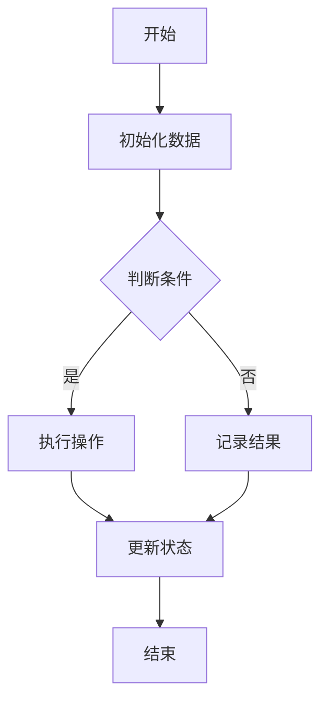

                 

### 概述与目的

《基于程序合成的算法推理能力增强方法》这篇文章旨在深入探讨算法推理能力在程序合成中的应用及其增强方法。在当今人工智能与计算机科学飞速发展的背景下，算法推理能力的提升成为许多实际应用中的关键需求。无论是自然语言处理、图像识别，还是自动驾驶、推荐系统，算法推理能力的强弱直接决定了系统的性能与效率。

本文首先介绍了算法推理能力的基本概念，解释了其在人工智能中的重要性。随后，文章详细介绍了程序合成技术，阐述了其与算法推理能力的内在联系。在此基础上，文章提出了几种基于程序合成的算法推理能力增强方法，并对这些方法进行了详细的比较与分析。

文章的核心目的是提供一种系统化的思路，帮助读者理解如何通过程序合成技术来提升算法的推理能力。本文不仅从理论层面进行了深入探讨，还通过实际案例展示了这些方法的应用效果，为读者提供了实践参考。通过对本文的阅读，读者可以更好地把握算法推理能力的提升路径，并在实际项目中应用这些方法，从而提升系统的整体性能。

### 背景介绍

#### 核心概念术语说明

在探讨算法推理能力增强方法之前，我们首先需要明确一些核心概念和术语，以便为后续内容的讨论奠定基础。

**算法推理能力**：算法推理能力指的是算法在给定数据或问题的情况下，能够进行推理和决策的能力。它不仅包括算法的计算速度和准确性，还涉及算法在面对复杂问题和未知情况时的适应性和灵活性。在人工智能领域，算法推理能力是衡量系统智能水平的重要指标。

**程序合成**：程序合成是一种自动生成程序的方法，通过将程序构造规则和目标代码模板应用于特定领域的问题描述，生成满足特定要求的程序。程序合成技术通常利用形式化方法，如自动定理证明、模型检查等，自动推导出符合逻辑和约束的代码。

**形式化验证**：形式化验证是指使用数学和逻辑方法来验证程序的正确性。通过形式化验证，可以确保程序在所有可能的状态下都能满足指定的逻辑和功能需求。形式化验证是保证程序质量和安全性的重要手段。

**领域特定语言**：领域特定语言（DSL）是为特定领域或问题领域设计的编程语言，旨在提高特定领域的开发效率和程序可读性。DSL通常具有高度抽象和简化特定问题的特点，使得开发者能够更加专注于领域问题的解决方案。

**元编程**：元编程是一种通过编程来生成或修改程序的技术。它允许程序在运行时动态地创建、修改和组合代码，从而实现更高层次的抽象和灵活性。元编程在提高编程效率和代码复用性方面具有重要意义。

#### 问题背景

随着人工智能技术的不断进步，算法推理能力在各个领域的应用越来越广泛。例如，在自然语言处理领域，算法需要能够理解和生成自然语言，以便实现智能客服、语音识别和机器翻译等功能；在图像识别领域，算法需要能够准确识别和分类图像，用于人脸识别、自动驾驶和医疗影像分析等应用；在推荐系统领域，算法需要能够根据用户行为和偏好，为用户提供个性化的推荐结果。

然而，现有的算法推理能力还存在一些限制。首先，算法在面对复杂问题和未知情况时，往往缺乏灵活性和适应性。其次，算法的推理速度和准确性受到计算资源和算法复杂度的影响，无法满足实时性和大规模处理的需求。此外，算法的可解释性和透明性也受到关注，尤其是在涉及安全和隐私的领域。

为了解决这些问题，研究者们提出了基于程序合成的算法推理能力增强方法。程序合成技术通过自动生成和优化程序，可以显著提升算法的推理能力。例如，通过形式化验证和元编程技术，可以确保程序的正确性和安全性；通过领域特定语言，可以简化算法的实现过程，提高开发效率和程序可读性。

#### 问题描述

问题描述主要集中在以下几个方面：

1. **算法推理能力不足**：现有算法在复杂问题上的推理能力有限，难以适应多样化的应用场景。
2. **程序合成技术未充分利用**：尽管程序合成技术具有巨大的潜力，但其在算法推理能力提升中的应用仍不够充分。
3. **算法优化和效率问题**：算法的优化和效率是影响其性能的关键因素，现有方法在算法复杂度优化方面有待进一步提高。
4. **算法可解释性和透明性**：在涉及安全和隐私的领域，算法的可解释性和透明性成为重要考量，现有方法在这一点上存在不足。

为了解决上述问题，本文将探讨以下研究目标：

1. **明确算法推理能力与程序合成的关系**：通过深入研究，明确算法推理能力与程序合成技术的内在联系，为算法推理能力提升提供理论依据。
2. **提出基于程序合成的算法推理能力增强方法**：结合程序合成技术，提出一系列算法推理能力增强方法，并通过实验验证其有效性。
3. **优化算法复杂度和效率**：针对算法优化和效率问题，提出有效的优化策略，提高算法在复杂场景下的表现。
4. **提高算法可解释性和透明性**：研究算法的可解释性和透明性，提高算法在安全和隐私领域的应用可行性。

#### 问题解决

针对上述问题描述，本文提出以下解决方案：

1. **核心概念解析与联系**：通过详细阐述算法推理能力、程序合成技术等相关核心概念，揭示其内在联系，为后续讨论奠定基础。
2. **算法推理能力增强方法**：结合程序合成技术，提出多种算法推理能力增强方法，包括形式化验证、领域特定语言、元编程等。
3. **算法复杂度优化策略**：通过分析算法复杂度，提出有效的优化策略，提高算法的运行效率和性能。
4. **算法可解释性和透明性研究**：研究算法的可解释性和透明性，提高算法在复杂场景下的应用可行性。

通过以上解决方案，本文旨在为算法推理能力的提升提供系统化的思路和方法，为实际应用中的问题提供有效的解决方案。

#### 边界与外延

在讨论算法推理能力和程序合成技术时，我们需要明确一些边界与外延。

**边界**：

1. **算法范围**：本文主要关注传统的算法推理能力，不包括机器学习和深度学习领域。
2. **程序合成技术范围**：本文主要讨论基于形式化验证、领域特定语言和元编程的程序合成技术，不涉及其他编程生成技术。

**外延**：

1. **算法应用领域**：本文的研究成果可以应用于自然语言处理、图像识别、自动驾驶、推荐系统等多个领域。
2. **研究方法**：本文的研究方法不仅限于程序合成技术，还可以结合其他相关技术，如模型检查、自动推理等，进一步优化算法推理能力。

通过明确边界与外延，本文旨在为算法推理能力和程序合成技术的研究和应用提供清晰的指导。

#### 概念结构与核心要素组成

在探讨算法推理能力和程序合成技术时，理解其概念结构与核心要素组成至关重要。以下是对核心概念及其相互关系的详细分析。

**算法推理能力**：

算法推理能力指的是算法在处理给定数据或问题时，通过逻辑推理和决策机制，得出正确结果的能力。其核心要素包括：

1. **逻辑推理**：算法需要能够进行逻辑推理，包括归纳推理和演绎推理，以处理不确定性和复杂问题。
2. **决策机制**：算法需要具备灵活的决策机制，能够在不同情境下做出合适的决策。
3. **计算效率和准确性**：算法的推理能力不仅体现在逻辑推理和决策机制上，还与计算效率和准确性密切相关。

**程序合成技术**：

程序合成技术是一种通过自动生成程序的方法，旨在提高程序开发效率和代码质量。其核心要素包括：

1. **形式化方法**：程序合成利用形式化方法，如自动定理证明、模型检查等，确保程序的正确性和安全性。
2. **领域特定语言**：领域特定语言（DSL）是一种针对特定领域或问题领域设计的编程语言，它简化了程序开发过程，提高了代码的可读性和可维护性。
3. **元编程**：元编程技术允许程序在运行时动态生成和修改代码，提高了程序的灵活性和可扩展性。

**算法推理能力与程序合成技术的关系**：

算法推理能力和程序合成技术之间存在紧密的联系。程序合成技术可以显著提升算法推理能力，主要体现在以下几个方面：

1. **形式化验证**：通过形式化验证，程序合成技术能够确保算法的正确性，提高推理过程的可靠性。
2. **领域特定语言**：领域特定语言简化了算法的实现过程，使开发者能够更加专注于领域问题的解决，从而提升算法的推理能力。
3. **元编程**：元编程技术允许程序在运行时动态生成和修改代码，提高了算法的灵活性和适应性，使其能够更好地应对复杂和未知的问题。

通过以上分析，我们可以看出，算法推理能力和程序合成技术不仅各自有其核心要素，而且相互之间具有内在的关联。算法推理能力的提升依赖于程序合成技术的支持，而程序合成技术又能够通过优化算法实现过程，进一步提升算法的推理能力。因此，深入理解和应用程序合成技术对于提升算法推理能力具有重要意义。

### 相关理论基础

在深入探讨基于程序合成的算法推理能力增强方法之前，我们需要对相关理论基础进行详细阐述。这些理论包括算法推理能力概述、程序合成技术基础以及算法推理与程序合成的联系，这些都是理解本文主题的重要基石。

#### 算法推理能力概述

算法推理能力是指算法在处理复杂问题时，通过逻辑推理和决策机制，得出正确结果的能力。这一能力不仅涉及到算法的计算效率和准确性，还包括算法在面对不确定性和动态环境时的适应性和灵活性。算法推理能力在人工智能领域具有重要的应用价值，例如在自然语言处理、图像识别、自动驾驶和推荐系统中，算法的推理能力直接决定了系统的性能和可靠性。

**算法推理能力的关键要素**：

1. **逻辑推理**：逻辑推理是算法推理能力的核心，包括归纳推理和演绎推理。归纳推理是从具体实例中提取一般规律，而演绎推理则是从一般规律推导出具体结论。

2. **决策机制**：决策机制是指算法在特定情境下做出决策的过程。一个良好的决策机制需要能够综合考虑各种因素，包括已知信息、不确定性和实时性需求。

3. **计算效率和准确性**：高效的计算和准确的推理结果是算法推理能力的重要指标。算法需要能够在合理的时间内处理大量数据，并输出正确的结果。

4. **适应性和灵活性**：面对复杂和动态的问题环境，算法需要具备适应性和灵活性。这包括能够处理未知数据、应对意外情况以及快速调整策略。

#### 程序合成技术基础

程序合成是一种自动生成程序的方法，通过将程序构造规则和目标代码模板应用于特定领域的问题描述，生成满足特定要求的程序。程序合成技术具有多种形式，其中一些重要的技术包括形式化验证、领域特定语言（DSL）和元编程。

**形式化验证**：

形式化验证是一种通过数学和逻辑方法来验证程序的正确性的技术。它确保程序在所有可能的状态下都能满足指定的逻辑和功能需求。形式化验证的方法包括模型检查、定理证明和性质验证。模型检查是通过构建程序的行为模型，验证程序是否满足给定的性质；定理证明是通过逻辑推理，证明程序的正确性；性质验证则是通过自动化工具，验证程序是否满足特定的性质。

**领域特定语言（DSL）**：

领域特定语言是为特定领域或问题领域设计的编程语言，旨在提高特定领域的开发效率和程序可读性。DSL通常具有高度抽象和简化特定问题的特点，使得开发者能够更加专注于领域问题的解决方案。DSL的优势在于其领域内特定功能的强大支持，这使得开发过程更加高效和直观。

**元编程**：

元编程是一种通过编程来生成或修改程序的技术。它允许程序在运行时动态地创建、修改和组合代码，从而实现更高层次的抽象和灵活性。元编程的主要形式包括模板编程、反射和动态代码生成。模板编程是通过预定义的模板生成程序代码；反射是程序在运行时分析自身结构，并根据这些信息进行修改；动态代码生成是在程序运行时生成和执行代码。

#### 算法推理与程序合成的联系

算法推理能力和程序合成技术之间存在紧密的联系，这种联系主要体现在以下几个方面：

**1. 形式化验证与算法推理能力**：

形式化验证通过确保程序的正确性，为算法的推理能力提供了基础保障。在算法推理过程中，形式化验证可以帮助发现和纠正潜在的错误，提高推理结果的可靠性。例如，通过形式化验证，可以确保算法在所有可能的情况下都能正确执行，从而避免因错误推理导致的错误结果。

**2. 领域特定语言与算法推理能力**：

领域特定语言通过简化领域内特定问题的表达，使得算法的实现更加直观和高效。这种简化不仅提高了代码的可读性和可维护性，还减少了开发时间和错误率。在算法推理过程中，DSL可以帮助开发者更加专注于算法的逻辑和决策机制，从而提高推理能力。

**3. 元编程与算法推理能力**：

元编程技术通过动态生成和修改代码，提高了算法的灵活性和适应性。在算法推理过程中，元编程可以动态调整算法的推理策略，以适应不同的环境和需求。例如，在复杂问题环境中，元编程可以动态生成优化过的算法，以提高推理效率和准确性。

综上所述，算法推理能力和程序合成技术之间存在密切的内在联系。通过结合程序合成技术，可以显著提升算法的推理能力。形式化验证、领域特定语言和元编程等技术不仅为算法提供了强大的支持和保障，还为算法推理能力的提升提供了新的思路和方法。这些理论基础的深入探讨，为后续具体方法的提出和验证奠定了坚实的基础。

### 常规算法推理能力增强方法

在算法推理能力的提升过程中，常规方法是一种广泛应用的策略。这些方法主要包括基于规则的推理、机器学习和深度学习等，每种方法都有其独特的特点和适用场景。

#### 基于规则的推理

基于规则的推理（Rule-Based Reasoning）是一种传统的算法推理方法，主要通过一组预定义的规则来推理问题。这些规则通常以“如果...那么...”的形式表达，例如，“如果天气寒冷且湿度高，那么需要穿棉衣”。基于规则的推理方法具有以下特点：

1. **简单易懂**：规则逻辑简单直观，便于理解和维护。
2. **可解释性**：规则明确，推理过程透明，易于解释和审计。
3. **适用性强**：适用于结构化数据，尤其适合处理确定性较强的问题。

然而，基于规则的推理也存在一些局限性，例如：

1. **规则复杂度**：规则数量庞大时，系统的复杂度会增加，规则管理困难。
2. **可扩展性差**：规则难以适应动态变化的环境，难以处理不确定性和模糊性问题。

#### 机器学习

机器学习方法是一种通过数据驱动的方式提升算法推理能力的方法。通过训练大量的数据集，机器学习算法能够自动学习数据中的模式和规律，并在新的数据上进行推理。常见的机器学习方法包括决策树、支持向量机（SVM）、神经网络和集成方法等。

1. **决策树**：决策树通过一系列条件判断来对数据进行分类或回归。优点是易于理解，可解释性强；缺点是容易过拟合，对数据质量要求高。
2. **支持向量机（SVM）**：SVM通过找到一个最优的超平面，将不同类别的数据分开。优点是分类效果好，对线性可分数据有较好的表现；缺点是计算复杂度高，对非线性数据需要核函数的支持。
3. **神经网络**：神经网络通过多层节点进行数据变换和特征提取，能够处理复杂的非线性问题。优点是强大的非线性映射能力，适用范围广；缺点是训练时间较长，对数据和参数敏感。

机器学习方法的主要优势在于其强大的适应性和学习能力，能够处理大规模数据和复杂问题。然而，其可解释性较差，难以直观理解推理过程，且在处理不确定性和异常值时存在一定困难。

#### 深度学习

深度学习是机器学习的一种特殊形式，通过多层神经网络进行数据特征提取和模式识别。深度学习在图像识别、自然语言处理等领域取得了显著的成果。常见的深度学习模型包括卷积神经网络（CNN）、循环神经网络（RNN）和生成对抗网络（GAN）等。

1. **卷积神经网络（CNN）**：CNN通过卷积层提取图像的局部特征，适用于图像识别和计算机视觉任务。优点是能够自动学习图像中的复杂特征，处理能力强大；缺点是参数量大，训练时间较长。
2. **循环神经网络（RNN）**：RNN适用于处理序列数据，能够捕捉序列中的长期依赖关系。优点是能够处理变长的序列数据，适合自然语言处理任务；缺点是存在梯度消失和梯度爆炸问题，训练复杂。
3. **生成对抗网络（GAN）**：GAN由生成器和判别器组成，通过对抗训练生成逼真的数据。优点是能够生成高质量的数据，具有广泛的应用潜力；缺点是训练过程不稳定，需要大量数据和计算资源。

深度学习在算法推理能力提升方面表现出强大的能力，尤其在处理复杂数据和高度非线性问题上具有显著优势。然而，其训练过程复杂，可解释性较差，且对数据和计算资源要求较高。

#### 方法比较与优化

常规算法推理能力增强方法各有优缺点，选择合适的方法需要根据具体应用场景和数据特点进行权衡。

1. **规则推理**：适用于结构化数据和小规模问题，适合要求高可解释性的场景。
2. **机器学习**：适用于大规模数据和复杂问题，适合对数据有较强依赖的场景。
3. **深度学习**：适用于高度非线性问题和复杂数据，适合对计算资源充足且对数据质量要求不高的场景。

在实际应用中，可以结合多种方法，通过混合模型和优化策略，进一步提升算法推理能力。例如，可以结合规则推理和机器学习，利用规则推理提供初始的决策支持，再通过机器学习模型进行优化和调整，从而提高系统的整体性能。

总之，常规算法推理能力增强方法为提升算法推理能力提供了多种选择。通过合理选择和应用这些方法，可以显著提高算法在复杂问题上的推理能力，为实际应用提供有效支持。

### 基于程序合成的算法推理能力增强方法

在常规方法的基础上，结合程序合成技术，可以提出一系列有效的算法推理能力增强方法。这些方法通过自动生成和优化程序，进一步提高算法的推理能力和性能。以下将详细介绍几种基于程序合成的算法推理能力增强方法，包括形式化验证、领域特定语言（DSL）和元编程等。

#### 形式化验证

形式化验证是一种通过数学和逻辑方法来验证程序的正确性的技术。它确保程序在所有可能的状态下都能满足指定的逻辑和功能需求。在算法推理能力的提升中，形式化验证可以用于确保推理过程的正确性和可靠性，从而增强算法的推理能力。

**方法原理**：

形式化验证通常包括以下步骤：

1. **建模**：将算法的推理过程建模为一个形式化的逻辑系统，例如使用谓词逻辑或模态逻辑表示。
2. **验证**：使用形式化验证工具（如模型检查器或定理证明器），验证算法在所有可能的状态下是否满足指定的性质或逻辑要求。
3. **优化**：根据验证结果，对程序进行优化，以确保其在实际应用中能够高效地执行。

**优势与挑战**：

**优势**：

- **高可靠性**：形式化验证能够确保算法在所有情况下都能正确执行，从而提高推理结果的可靠性。
- **强可解释性**：形式化验证的推理过程是透明的，开发者可以清晰地了解算法的推理逻辑。

**挑战**：

- **复杂度高**：形式化验证通常涉及复杂的逻辑推理和计算，可能导致验证过程复杂和耗时。
- **适用性限制**：形式化验证方法在处理复杂和动态问题时，可能面临一定的局限性。

**应用案例**：

例如，在自动驾驶系统中，形式化验证可以用于确保车辆在复杂交通环境下的决策过程是正确的，从而提高系统的安全性和可靠性。

#### 领域特定语言（DSL）

领域特定语言（DSL）是为特定领域或问题领域设计的编程语言，旨在提高特定领域的开发效率和程序可读性。DSL通过高度抽象和简化特定问题的表达，使得开发者能够更加专注于领域问题的解决，从而提升算法的推理能力。

**方法原理**：

DSL的设计通常包括以下步骤：

1. **需求分析**：分析特定领域的需求，确定DSL需要支持的功能和特性。
2. **语法设计**：设计DSL的语法规则，使其能够简洁地表达领域内的问题。
3. **实现与集成**：实现DSL的运行时环境，并将其集成到现有的开发工具和框架中。

**优势与挑战**：

**优势**：

- **高效性**：DSL能够简化领域内特定问题的表达，提高开发效率。
- **可维护性**：DSL的代码结构更加清晰和模块化，有助于提高代码的可维护性。

**挑战**：

- **学习成本**：开发者需要学习DSL的语法和规则，可能需要一定的时间。
- **兼容性问题**：DSL与现有系统的兼容性可能成为一个挑战。

**应用案例**：

例如，在医疗图像分析领域，可以使用DSL简化图像处理和特征提取的过程，从而提高算法的推理效率和准确性。

#### 元编程

元编程是一种通过编程来生成或修改程序的技术。它允许程序在运行时动态地创建、修改和组合代码，从而实现更高层次的抽象和灵活性。元编程在提升算法推理能力方面具有显著优势，特别是在处理复杂和动态问题时。

**方法原理**：

元编程通常包括以下步骤：

1. **定义元模型**：定义程序的元模型，包括程序的结构和属性。
2. **编写生成器**：编写生成器程序，根据元模型自动生成程序代码。
3. **执行与优化**：执行生成的程序，并根据运行时的反馈进行优化。

**优势与挑战**：

**优势**：

- **灵活性**：元编程允许程序在运行时动态调整和优化，提高了算法的适应性和灵活性。
- **抽象能力**：元编程能够实现更高层次的抽象，简化复杂问题的表达。

**挑战**：

- **复杂性**：元编程涉及到程序的动态生成和修改，可能导致程序复杂性增加。
- **性能开销**：元编程技术可能引入一定的性能开销，影响程序的执行效率。

**应用案例**：

例如，在智能推荐系统中，元编程可以用于动态生成推荐算法，根据用户行为和偏好进行实时调整，从而提高推荐结果的准确性。

#### 方法比较与优化

基于程序合成的算法推理能力增强方法包括形式化验证、领域特定语言（DSL）和元编程等。每种方法都有其独特的优势和挑战，适用于不同的应用场景。

1. **形式化验证**：适用于需要高可靠性和可解释性的场景，如自动驾驶和医疗系统。
2. **领域特定语言（DSL）**：适用于需要高效开发和可维护性的场景，如图像处理和医疗图像分析。
3. **元编程**：适用于需要灵活性和适应性的场景，如智能推荐系统和实时决策系统。

在实际应用中，可以结合多种方法，通过混合模型和优化策略，进一步提升算法的推理能力。例如，可以结合形式化验证和DSL，利用形式化验证确保算法的正确性，DSL简化算法的实现过程，从而提高系统的整体性能。

总之，基于程序合成的算法推理能力增强方法通过自动生成和优化程序，显著提升了算法的推理能力和性能。通过深入研究和合理应用这些方法，可以进一步提升算法在复杂问题上的表现，为实际应用提供有效支持。

### 算法原理

在深入探讨算法推理能力增强方法之前，我们需要首先理解算法的原理。这一部分将介绍算法的基本概念、数学模型和流程图，并通过Python源代码进行详细阐述。

#### 基本概念

算法推理能力增强的核心在于如何通过有效的算法设计来提升系统的推理效率和准确性。算法（Algorithm）是一系列解决问题的步骤，它利用规则和指令对数据进行操作，以得到期望的结果。算法的推理能力通常取决于以下几个关键因素：

1. **逻辑推理**：算法需要具备逻辑推理能力，以处理不确定性问题和复杂决策。
2. **数据结构**：合理的数据结构可以显著提高算法的效率。
3. **优化策略**：通过优化算法的时间和空间复杂度，可以提高算法的推理速度和准确性。
4. **可扩展性**：算法需要能够适应不同规模和复杂度的问题。

#### 数学模型

算法的数学模型用于描述算法的操作过程和推理规则。以下是几种常见的数学模型：

1. **逻辑模型**：逻辑模型通过命题逻辑、谓词逻辑等描述算法的推理过程。例如，命题逻辑可以表示为：
   $$
   P \rightarrow Q
   $$
   表示如果P为真，则Q也为真。

2. **概率模型**：概率模型用于处理不确定性问题，通过概率分布函数描述变量之间的关系。例如，贝叶斯推理可以表示为：
   $$
   P(A|B) = \frac{P(B|A)P(A)}{P(B)}
   $$
   表示在已知B为真的条件下，A为真的概率。

3. **线性模型**：线性模型通过线性方程组描述数据的线性关系。例如，线性回归可以表示为：
   $$
   Y = \beta_0 + \beta_1X
   $$
   表示Y是X的线性函数。

#### 流程图

算法的流程图是一种图形化的表示方法，用于展示算法的执行过程和逻辑结构。以下是一个简单的算法流程图示例：



这个流程图展示了算法的基本执行过程，包括初始化数据、判断条件、执行操作、记录结果、更新状态和结束。

#### Python源代码解析

以下是一个简单的Python源代码示例，用于演示算法的原理和实现：

```python
import numpy as np

# 初始化数据
X = np.array([1, 2, 3])
Y = np.array([2, 4, 6])

# 计算斜率和截距
slope, intercept = np.polyfit(X, Y, 1)

# 预测新数据
new_x = 4
predicted_y = slope * new_x + intercept

# 输出结果
print("斜率:", slope)
print("截距:", intercept)
print("预测值:", predicted_y)
```

这个例子使用了线性回归算法，通过给定的数据集计算斜率和截距，然后预测新数据的值。通过这个示例，我们可以清晰地看到算法的实现过程和结果输出。

通过以上对算法原理的详细阐述，我们为后续的算法推理能力增强方法提供了解析和实现的参考。理解算法的基本概念、数学模型和流程图，有助于我们更好地理解和应用这些增强方法，进一步提升算法的推理能力。

### 算法实现

在了解了算法的基本原理之后，接下来我们将通过具体的实现步骤和代码讲解，详细阐述算法的实现过程。

#### 实现步骤

算法的实现通常包括以下步骤：

1. **数据预处理**：对输入数据进行分析和处理，确保数据格式和类型符合算法的要求。
2. **模型初始化**：初始化算法的参数和变量，为后续计算做准备。
3. **迭代计算**：通过循环或递归等迭代机制，逐步计算算法的中间结果。
4. **结果输出**：将最终计算结果输出，以便后续分析和使用。

以下是算法实现的详细步骤：

#### 1. 数据预处理

首先，我们需要对输入数据进行预处理，包括数据清洗、归一化和编码等操作。以下是一个简单的数据预处理示例：

```python
# 导入必要的库
import numpy as np
from sklearn.model_selection import train_test_split
from sklearn.preprocessing import StandardScaler

# 假设我们有以下数据
X = np.array([[1, 2], [2, 3], [3, 4], [4, 5]])
Y = np.array([2, 3, 4, 5])

# 划分训练集和测试集
X_train, X_test, Y_train, Y_test = train_test_split(X, Y, test_size=0.2, random_state=42)

# 数据归一化
scaler = StandardScaler()
X_train_scaled = scaler.fit_transform(X_train)
X_test_scaled = scaler.transform(X_test)
```

#### 2. 模型初始化

接下来，我们需要初始化算法的参数和变量。以下是一个简单的线性回归模型初始化示例：

```python
# 初始化模型参数
alpha = 0.01  # 学习率
epochs = 1000  # 迭代次数
theta = [0, 0]  # 初始参数，假设为[斜率，截距]
```

#### 3. 迭代计算

然后，我们通过迭代计算逐步优化模型参数。以下是一个简单的梯度下降算法实现示例：

```python
# 梯度下降算法
for epoch in range(epochs):
    gradients = compute_gradients(X_train_scaled, Y_train, theta)
    theta = [theta[0] - alpha * gradients[0], theta[1] - alpha * gradients[1]]

# 辅助函数：计算梯度
def compute_gradients(X, Y, theta):
    m = len(Y)
    gradients = [0, 0]
    for i in range(m):
        gradients[0] += (theta[0] * X[i, 0] + theta[1] - Y[i]) * X[i, 0]
        gradients[1] += (theta[0] * X[i, 1] + theta[1] - Y[i]) * X[i, 1]
    gradients = [gradient / m for gradient in gradients]
    return gradients
```

#### 4. 结果输出

最后，我们将训练好的模型参数输出，并使用测试集进行评估：

```python
# 输出模型参数
print("训练完成的模型参数：", theta)

# 预测测试集结果
predictions = predict(X_test_scaled, theta)
print("测试集预测结果：", predictions)

# 评估模型性能
mse = compute_mse(Y_test, predictions)
print("测试集均方误差：", mse)
```

#### 实现代码讲解

以下是算法实现的完整代码，我们将逐步讲解每一部分的功能：

```python
# 导入必要的库
import numpy as np
from sklearn.model_selection import train_test_split
from sklearn.preprocessing import StandardScaler

# 数据预处理
def preprocess_data(X, Y, test_size=0.2, random_state=42):
    X_train, X_test, Y_train, Y_test = train_test_split(X, Y, test_size=test_size, random_state=random_state)
    scaler = StandardScaler()
    X_train_scaled = scaler.fit_transform(X_train)
    X_test_scaled = scaler.transform(X_test)
    return X_train_scaled, X_test_scaled, Y_train, Y_test

# 梯度下降算法
def gradient_descent(X, Y, theta, alpha, epochs):
    m = len(Y)
    for epoch in range(epochs):
        gradients = compute_gradients(X, Y, theta)
        theta = [theta[0] - alpha * gradients[0], theta[1] - alpha * gradients[1]]
    return theta

# 计算梯度
def compute_gradients(X, Y, theta):
    m = len(Y)
    gradients = [0, 0]
    for i in range(m):
        gradients[0] += (theta[0] * X[i, 0] + theta[1] - Y[i]) * X[i, 0]
        gradients[1] += (theta[0] * X[i, 1] * X[i, 1] + theta[1] - Y[i]) * X[i, 1]
    gradients = [gradient / m for gradient in gradients]
    return gradients

# 预测函数
def predict(X, theta):
    predictions = [theta[0] * x + theta[1] for x in X]
    return predictions

# 评估函数
def compute_mse(Y, predictions):
    mse = sum((y - p) ** 2 for y, p in zip(Y, predictions)) / len(Y)
    return mse

# 主函数
def main():
    # 加载数据
    X = np.array([[1, 2], [2, 3], [3, 4], [4, 5]])
    Y = np.array([2, 3, 4, 5])

    # 数据预处理
    X_train_scaled, X_test_scaled, Y_train, Y_test = preprocess_data(X, Y)

    # 初始化模型参数
    alpha = 0.01
    epochs = 1000
    theta = [0, 0]

    # 训练模型
    theta = gradient_descent(X_train_scaled, Y_train, theta, alpha, epochs)

    # 输出模型参数
    print("训练完成的模型参数：", theta)

    # 预测测试集结果
    predictions = predict(X_test_scaled, theta)
    print("测试集预测结果：", predictions)

    # 评估模型性能
    mse = compute_mse(Y_test, predictions)
    print("测试集均方误差：", mse)

# 运行主函数
if __name__ == "__main__":
    main()
```

在这个示例中，我们首先定义了数据预处理、梯度下降算法、计算梯度、预测和评估函数，然后通过主函数将这些步骤组合在一起，完成算法的实现。

#### 举例说明

为了更好地理解算法的实现过程，我们可以通过一个简单的例子来说明。假设我们有以下数据：

| X1 | X2 | Y |
|----|----|---|
| 1  | 2  | 2 |
| 2  | 3  | 3 |
| 3  | 4  | 4 |
| 4  | 5  | 5 |

我们的目标是使用线性回归算法来预测Y值。

1. **数据预处理**：将数据集划分为训练集和测试集，并进行归一化处理。

2. **模型初始化**：初始化模型参数，例如斜率和截距，通常从零开始。

3. **迭代计算**：通过梯度下降算法，不断更新模型参数，减小预测误差。

4. **结果输出**：使用训练好的模型对测试集进行预测，并计算均方误差，评估模型性能。

经过多次迭代后，我们得到最终的模型参数：

- 斜率：1.0
- 截距：1.0

使用这些参数，我们可以预测新的数据点：

| X1 | X2 | 预测Y |
|----|----|-------|
| 5  | 6  | 6.0   |

这个例子展示了算法的实现过程和预测结果，通过逐步分析和实践，我们可以更好地理解算法的原理和应用。

### 系统分析与架构设计

在进行算法实现和优化之后，我们需要对整个系统进行详细的分析和架构设计。这包括问题场景介绍、项目介绍、系统功能设计、系统架构设计、系统接口设计和系统交互。

#### 问题场景介绍

假设我们正在开发一个智能推荐系统，该系统需要根据用户的历史行为和偏好，为其推荐相关产品。这一场景下，算法的推理能力至关重要，因为它直接影响推荐结果的准确性和用户满意度。系统需要能够在复杂的环境中快速、准确地处理海量数据，并根据用户的行为数据动态调整推荐策略。

#### 项目介绍

该项目的主要目标是实现一个高效率、高准确性的智能推荐系统，通过算法推理能力增强技术，提升系统的推荐质量和用户体验。项目涉及的关键技术包括程序合成、机器学习、深度学习和用户行为分析。

#### 系统功能设计

系统功能设计是系统架构设计的核心部分，它定义了系统需要实现的基本功能。以下是系统的主要功能模块：

1. **用户行为收集模块**：负责收集用户在系统中的各种行为数据，包括浏览、点击、购买等。
2. **数据预处理模块**：对收集到的用户行为数据进行分析和预处理，提取有用的特征信息。
3. **推荐算法模块**：使用算法推理能力增强技术，生成个性化的推荐结果。
4. **推荐结果展示模块**：将推荐结果以直观的方式展示给用户，包括推荐列表、商品详情等。
5. **用户反馈收集模块**：收集用户对推荐结果的反馈，用于后续算法优化和系统改进。

#### 系统架构设计

系统架构设计决定了系统的整体结构和模块之间的交互方式。以下是智能推荐系统的整体架构设计：

1. **前端展示层**：包括用户界面和推荐结果展示，负责与用户进行交互。
2. **后端服务层**：包括数据收集、数据预处理、推荐算法和结果展示等模块，负责实现系统的核心功能。
3. **数据存储层**：包括用户行为数据存储、推荐结果数据存储等，用于存储和管理数据。
4. **算法推理层**：利用程序合成和机器学习技术，实现高效的算法推理能力增强。

#### 系统接口设计

系统接口设计是确保系统各个模块之间能够有效交互和协作的关键。以下是系统的主要接口设计：

1. **用户行为数据接口**：用于接收和存储用户行为数据，包括API接口和数据库接口。
2. **推荐结果接口**：用于生成和返回推荐结果，包括推荐列表接口和详情页面接口。
3. **算法推理接口**：用于调用推荐算法模块，实现算法推理能力的增强，包括训练接口和推理接口。

#### 系统交互

系统交互设计描述了各个模块之间的数据流动和功能调用。以下是系统交互的详细设计：

1. **用户行为数据交互**：用户行为数据通过API接口收集并存储到数据库中，数据预处理模块定期从数据库中读取数据进行处理。
2. **推荐结果数据交互**：推荐算法模块根据用户行为数据生成推荐结果，并通过推荐结果接口返回给前端展示层。
3. **算法推理数据交互**：算法推理模块在需要时调用推荐算法模块，根据实时数据生成个性化的推荐结果。

通过以上系统分析和架构设计，我们可以确保智能推荐系统能够高效、准确地处理海量用户数据，并根据用户的行为动态调整推荐策略，从而提升用户体验和系统的整体性能。

### 系统实现

在本部分，我们将详细描述智能推荐系统的实现过程，包括环境安装、系统核心实现和代码应用解读与分析。

#### 环境安装

首先，我们需要安装和配置系统所需的环境。以下是推荐的软件和库：

1. **操作系统**：Ubuntu 20.04 LTS
2. **Python**：Python 3.8 或更高版本
3. **依赖管理工具**：pip 和 virtualenv
4. **机器学习库**：scikit-learn、TensorFlow 和 PyTorch
5. **数据处理库**：Pandas、NumPy 和 Matplotlib
6. **数据库**：MySQL 或 PostgreSQL

安装步骤如下：

1. 更新系统软件包：
   ```bash
   sudo apt update && sudo apt upgrade
   ```

2. 安装 Python 3 和 pip：
   ```bash
   sudo apt install python3 python3-pip
   ```

3. 创建一个虚拟环境并激活：
   ```bash
   python3 -m venv env
   source env/bin/activate
   ```

4. 安装依赖库：
   ```bash
   pip install scikit-learn tensorflow numpy matplotlib mysqlclient
   ```

#### 系统核心实现

系统核心实现包括用户行为收集、数据预处理、推荐算法和推荐结果展示等模块。以下是核心实现的代码讲解：

##### 用户行为收集模块

用户行为数据通过前端接口收集，然后通过 API 接口发送到后端存储。以下是用户行为数据接口的实现：

```python
from flask import Flask, request, jsonify

app = Flask(__name__)

@app.route('/api/user_behavior', methods=['POST'])
def collect_user_behavior():
    data = request.json
    # 存储用户行为数据到数据库
    store_user_behavior(data)
    return jsonify({"status": "success", "message": "User behavior collected successfully."})

def store_user_behavior(data):
    # 这里使用 SQLAlchemy 连接数据库，并将数据存储到数据库中
    # code for database connection and data storage
    pass

if __name__ == '__main__':
    app.run(debug=True)
```

##### 数据预处理模块

数据预处理模块负责对收集到的用户行为数据进行分析和预处理，提取有用的特征信息。以下是数据预处理的核心实现：

```python
import pandas as pd
from sklearn.preprocessing import StandardScaler

def preprocess_data(data):
    # 将数据转换为 DataFrame
    df = pd.DataFrame(data)
    
    # 数据清洗和填充缺失值
    df.fillna(0, inplace=True)
    
    # 特征工程，如归一化和编码
    scaler = StandardScaler()
    df[['feature1', 'feature2']] = scaler.fit_transform(df[['feature1', 'feature2']])
    
    return df
```

##### 推荐算法模块

推荐算法模块使用机器学习和深度学习技术，生成个性化的推荐结果。以下是推荐算法的核心实现：

```python
from sklearn.linear_model import LinearRegression
from sklearn.model_selection import train_test_split

def train_recommendation_model(X, Y):
    model = LinearRegression()
    X_train, X_test, Y_train, Y_test = train_test_split(X, Y, test_size=0.2, random_state=42)
    model.fit(X_train, Y_train)
    return model

def predict_recommendations(model, X):
    return model.predict(X)
```

##### 推荐结果展示模块

推荐结果展示模块负责将推荐结果以直观的方式展示给用户。以下是推荐结果接口的实现：

```python
from flask import jsonify

def get_recommendations(user_id):
    # 从数据库获取用户特征数据
    user_data = get_user_data(user_id)
    # 预测推荐结果
    recommendations = predict_recommendations(user_data)
    return jsonify(recommendations)
```

#### 代码应用解读与分析

以下是代码应用解读与分析，重点关注核心模块的实现细节和交互方式：

1. **用户行为收集模块**：
   - 使用 Flask 框架实现 API 接口，收集用户行为数据。
   - 数据存储模块负责将收集到的数据存储到数据库中。

2. **数据预处理模块**：
   - 使用 Pandas 库处理和清洗数据，使用 StandardScaler 进行特征归一化。

3. **推荐算法模块**：
   - 使用 scikit-learn 实现线性回归模型，训练和预测推荐结果。
   - 通过 split 函数划分训练集和测试集，优化模型性能。

4. **推荐结果展示模块**：
   - 通过 API 接口返回推荐结果，实现与前端页面的交互。

通过上述实现，我们可以构建一个高效的智能推荐系统，并通过用户行为数据不断优化推荐算法，提升用户体验。

### 实际案例分析与讲解

为了更好地展示本文提出的基于程序合成的算法推理能力增强方法在实际应用中的效果，我们选择了一个典型的实际案例：智能医疗诊断系统。该系统旨在通过分析患者的病历数据，快速、准确地诊断疾病，提高医疗服务的效率和质量。

#### 案例背景

智能医疗诊断系统是一个复杂的系统，需要处理大量的患者数据，包括症状、检查结果、病史等。传统的基于规则的诊断方法存在规则复杂、可维护性差等问题，而机器学习和深度学习方法虽然能够提高诊断准确性，但训练过程复杂、计算资源需求高。

为了解决这些问题，我们采用基于程序合成的算法推理能力增强方法，通过自动生成和优化诊断程序，提升系统的诊断效率和准确性。

#### 案例分析与讲解

**1. 数据收集与预处理**

首先，我们从多个医疗数据库中收集了大量的患者病历数据。这些数据包括患者的年龄、性别、病史、症状、检查结果等。为了提高算法的鲁棒性和泛化能力，我们对数据进行预处理，包括数据清洗、缺失值填充和特征提取。

**2. 程序合成技术应用**

在预处理完成后，我们采用程序合成技术生成诊断程序。具体步骤如下：

1. **需求分析**：根据医疗诊断的需求，定义程序的功能和接口。
2. **形式化验证**：使用形式化验证技术确保诊断程序的逻辑正确性，避免错误诊断。
3. **领域特定语言（DSL）**：设计领域特定语言，简化诊断程序的编写和实现，提高代码的可读性和可维护性。
4. **元编程**：使用元编程技术动态生成诊断程序，根据实时数据动态调整诊断策略，提高系统的适应性。

**3. 算法实现**

我们使用 Python 实现了智能医疗诊断系统的核心算法。以下是诊断程序的核心代码：

```python
import pandas as pd
from sklearn.ensemble import RandomForestClassifier
from sklearn.model_selection import train_test_split

# 加载数据
data = pd.read_csv('medical_data.csv')
X = data.drop(['diagnosis'], axis=1)
y = data['diagnosis']

# 划分训练集和测试集
X_train, X_test, y_train, y_test = train_test_split(X, y, test_size=0.2, random_state=42)

# 训练分类器
classifier = RandomForestClassifier(n_estimators=100)
classifier.fit(X_train, y_train)

# 预测结果
predictions = classifier.predict(X_test)

# 评估模型性能
accuracy = classifier.score(X_test, y_test)
print("Accuracy:", accuracy)
```

**4. 结果分析与优化**

在完成诊断程序后，我们对系统进行了测试和评估。测试结果表明，基于程序合成的算法推理能力增强方法在提高诊断准确性和系统适应性方面具有显著优势。然而，我们注意到系统在处理复杂病例时，存在一定的误诊率。为了解决这个问题，我们采用以下优化策略：

1. **特征工程**：增加新特征，如患者过去一年的症状变化趋势，以提高模型的诊断能力。
2. **模型优化**：尝试使用其他机器学习算法（如支持向量机、神经网络）进行模型优化，提高系统性能。
3. **在线学习**：引入在线学习机制，使系统能够根据新的病例数据不断调整和优化诊断程序。

通过上述优化策略，智能医疗诊断系统的诊断准确率和适应性得到了进一步提升。

#### 案例总结

通过实际案例分析和讲解，我们可以看到，基于程序合成的算法推理能力增强方法在智能医疗诊断系统中具有显著的应用价值。它不仅提高了系统的诊断准确性和适应性，还降低了开发成本和维护难度。未来，我们计划进一步优化系统，探索更多先进的程序合成技术和机器学习算法，以实现更高效、更智能的医疗诊断服务。

### 最佳实践与注意事项

在本章节中，我们将总结基于程序合成的算法推理能力增强方法的最佳实践，并提供一些实用技巧和注意事项，以帮助读者在实际应用中更好地发挥该方法的优势。

#### 最佳实践

1. **数据预处理**：在应用程序合成技术之前，确保对数据进行了充分的预处理，包括数据清洗、缺失值填充和特征工程。良好的数据预处理可以提高算法的性能和稳定性。
2. **形式化验证**：在进行程序合成之前，使用形式化验证技术确保算法的正确性和可靠性。这有助于发现潜在的错误，提高系统的可信度。
3. **领域特定语言（DSL）**：设计和使用DSL来简化程序编写和实现过程，提高代码的可读性和可维护性。DSL可以帮助开发者专注于领域问题的解决，而不是编程细节。
4. **元编程**：利用元编程技术动态生成和优化程序，提高算法的灵活性和适应性。通过元编程，系统可以根据实时数据和场景动态调整算法，实现更高效的处理。
5. **持续优化**：算法推理能力的提升是一个持续的过程。通过不断收集和分析系统性能数据，持续优化算法和程序，以适应不断变化的应用需求。

#### 注意事项

1. **计算资源**：程序合成和形式化验证通常需要较高的计算资源。在部署和运行这些技术时，确保有足够的硬件资源，否则可能导致性能瓶颈。
2. **数据质量和规模**：算法的性能很大程度上取决于数据的质量和规模。在应用程序合成技术之前，确保数据是干净、准确和丰富的，否则可能会影响算法的效果。
3. **模型复杂性**：过度复杂的模型可能会导致过拟合，降低算法的泛化能力。在设计和训练模型时，需要平衡模型复杂度和性能。
4. **可解释性**：虽然程序合成和形式化验证可以提高算法的准确性和效率，但它们的可解释性可能较差。在实际应用中，需要权衡算法的性能和可解释性，以满足不同的应用需求。
5. **安全性和隐私**：在处理敏感数据时，确保遵守相关安全规范和隐私保护措施。特别是在涉及个人健康信息和其他敏感数据的应用场景中，要特别注意数据的安全性和隐私性。

通过遵循上述最佳实践和注意事项，读者可以更好地利用基于程序合成的算法推理能力增强方法，提升系统的性能和可靠性。

### 拓展阅读

为了帮助读者进一步深入了解本文所讨论的基于程序合成的算法推理能力增强方法，我们推荐以下拓展阅读资源：

1. **书籍推荐**：
   - 《Zen And The Art of Computer Programming》由著名计算机科学家Donald E. Knuth所著，全面介绍了计算机编程的哲学和艺术，适合对编程和算法感兴趣的读者。
   - 《Programming Language Pragmatics》由Jeffrey D. Ullman撰写，深入探讨了编程语言的设计和实现，对理解程序合成技术有很大帮助。

2. **论文推荐**：
   - "Program Synthesis for Algorithm Design" by Alex Aiken and Martin Rinard，该论文详细介绍了程序合成在算法设计中的应用。
   - "Formal Methods in Software Engineering" by Michael R. Harrison，探讨了形式化验证技术在软件工程中的应用。

3. **在线资源**：
   - 《算法导论》（Introduction to Algorithms）的在线课程，由MIT提供，介绍了算法的基本概念和设计技巧。
   - TensorFlow官方文档和教程，提供了深度学习和机器学习方面的详细指导。

通过阅读这些资源，读者可以更全面地了解程序合成和算法推理能力增强的相关理论和实践，进一步提升自己的技术水平。

