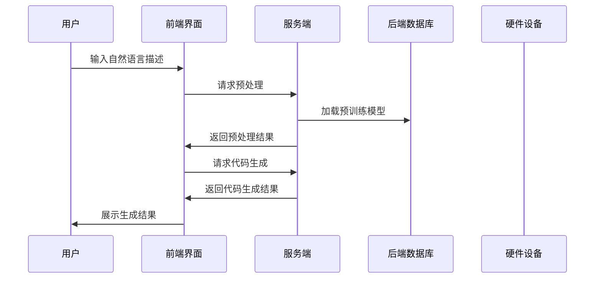

                 

# 基于程序合成的语言模型推理能力增强

> 关键词：程序合成，语言模型，推理能力，模型优化，推理加速，领域自适应

> 摘要：本文将探讨如何通过程序合成技术来增强语言模型的推理能力。我们将从背景介绍、核心概念与联系、算法原理讲解、系统分析与架构设计、项目实战等多个方面，详细分析并阐述基于程序合成的语言模型推理能力增强的方法和技术。

## 第一部分：背景介绍

### 1.1 问题背景

随着计算机技术的发展和人工智能的崛起，程序合成技术逐渐成为了一个重要的研究领域。程序合成，也称为自动程序生成，是指通过自动化手段从非程序形式（如自然语言描述、形式化规格说明等）生成程序代码。在自然语言处理、软件工程、机器学习等领域，程序合成技术具有广泛的应用前景。然而，传统的程序合成方法往往存在推理能力有限、模型复杂度高等问题，无法满足实际应用的需求。

### 1.2 问题描述

基于程序合成的语言模型推理能力增强，旨在解决现有程序合成方法中存在的问题，提高语言模型的推理能力。具体而言，主要包括以下几个方面：

1. **推理效率提升**：传统程序合成方法往往需要大量计算资源，导致推理速度较慢。如何提高推理效率，是提高语言模型推理能力的关键。

2. **模型复杂度降低**：传统程序合成方法往往采用复杂的神经网络结构，导致模型复杂度较高。如何降低模型复杂度，同时保持较高的推理能力，是一个亟待解决的问题。

3. **泛化能力增强**：传统程序合成方法往往仅在特定领域或数据集上表现良好，如何提高泛化能力，使其能够应对更广泛的应用场景，是提高语言模型推理能力的另一个重要方面。

### 1.3 问题解决

为了解决上述问题，本书将介绍一系列基于程序合成的语言模型推理能力增强的方法。具体包括：

1. **模型优化技术**：介绍如何通过优化模型结构、参数调整等手段，提高语言模型的推理能力。

2. **推理加速技术**：介绍如何通过硬件加速、并行计算等手段，提高语言模型的推理效率。

3. **领域自适应技术**：介绍如何通过领域自适应方法，提高语言模型的泛化能力。

### 1.4 边界与外延

在本书中，我们主要关注基于程序合成的语言模型推理能力增强的研究和应用。具体包括以下几个方面：

1. **自然语言处理领域**：语言模型在自然语言处理领域的应用，如机器翻译、文本分类、对话系统等。

2. **软件工程领域**：语言模型在软件工程领域的应用，如代码生成、代码补全、代码质量检测等。

3. **机器学习领域**：语言模型在机器学习领域的应用，如模型训练、模型优化、模型压缩等。

### 1.5 概念结构与核心要素组成

在基于程序合成的语言模型推理能力增强的研究中，主要包括以下几个核心概念和要素：

1. **程序合成**：从非程序形式生成程序代码的技术和方法。

2. **语言模型**：用于表示和预测自然语言数据的神经网络模型。

3. **推理能力**：模型在给定输入数据时，能够正确输出预期结果的能力。

4. **优化技术**：用于提高模型推理能力的一系列方法和技术。

5. **加速技术**：用于提高模型推理效率的一系列方法和技术。

6. **自适应技术**：用于提高模型泛化能力的一系列方法和技术。

### 1.6 本章小结

本章主要介绍了基于程序合成的语言模型推理能力增强的背景、问题描述、问题解决、边界与外延以及概念结构与核心要素组成。通过对本章内容的了解，读者可以初步了解本书的研究内容和目标，为后续章节的学习打下基础。

### 1.7 扩展阅读

- 《程序合成：理论与实践》
- 《深度学习与自然语言处理》
- 《软件工程：实践者的研究方法》
- 《机器学习：概率视角》

---

## 第二部分：核心概念与联系

在基于程序合成的语言模型推理能力增强的研究中，有几个核心概念和联系需要详细讨论。以下是对这些概念的解释和它们之间的联系。

### 2.1 程序合成

**定义**：程序合成是指从非程序形式（如自然语言描述、形式化规格说明等）生成程序代码的技术和方法。

**联系**：程序合成与语言模型密切相关。语言模型能够理解和生成自然语言，而程序合成则利用这些能力来生成代码。例如，自然语言描述可以作为输入，通过程序合成生成相应的代码。

### 2.2 语言模型

**定义**：语言模型是一种神经网络模型，用于表示和预测自然语言数据。它通过学习大量的文本数据来捕捉语言的统计规律和语义信息。

**联系**：语言模型在程序合成中起到关键作用。它不仅能够理解和生成自然语言描述，还能够将这些描述转换为有效的程序代码。例如，通过训练语言模型，可以使其能够将自然语言指令转换为对应的编程语言代码。

### 2.3 推理能力

**定义**：推理能力是指模型在给定输入数据时，能够正确输出预期结果的能力。对于语言模型，这包括理解自然语言描述并生成相应的程序代码。

**联系**：推理能力是评估语言模型性能的重要指标。提高推理能力意味着模型能够更准确地理解和生成代码，从而在实际应用中表现出更好的效果。程序合成技术的研究旨在提高语言模型

### 2.4 模型优化技术

**定义**：模型优化技术是指通过调整模型结构、参数等手段，提高模型性能的一系列方法。

**联系**：模型优化技术在语言模型推理能力增强中起着重要作用。通过优化模型结构，可以减少计算复杂度，提高推理效率。通过调整参数，可以改善模型的泛化能力和鲁棒性。

### 2.5 推理加速技术

**定义**：推理加速技术是指通过硬件加速、并行计算等手段，提高模型推理效率的一系列方法。

**联系**：推理加速技术在提高语言模型推理能力中具有重要作用。通过硬件加速，可以充分利用计算资源，提高推理速度。通过并行计算，可以同时处理多个任务，进一步提高推理效率。

### 2.6 领域自适应技术

**定义**：领域自适应技术是指通过调整模型，使其能够适应不同领域或任务需求的一系列方法。

**联系**：领域自适应技术在提高语言模型推理能力中具有重要意义。通过领域自适应，可以使模型在特定领域内表现出更好的泛化能力和适应性，从而提高其在实际应用中的效果。

### 2.7 概念属性特征对比表格

为了更好地理解这些核心概念，我们列出以下表格，对比它们的属性特征：

| 概念             | 定义                                                         | 属性特征                                                                                   |
|------------------|--------------------------------------------------------------|----------------------------------------------------------------------------------------------|
| 程序合成         | 从非程序形式生成程序代码的技术和方法                           | - 输入：自然语言描述<br>- 输出：程序代码<br>- 应用：自然语言处理、软件工程等         |
| 语言模型         | 用于表示和预测自然语言数据的神经网络模型                       | - 学习：大量文本数据<br>- 目标：捕捉语言规律和语义信息<br>- 应用：自然语言处理、对话系统等 |
| 推理能力         | 模型在给定输入数据时，能够正确输出预期结果的能力               | - 准确性：<br>- 效率：<br>- 泛化能力：                     |
| 模型优化技术     | 通过调整模型结构、参数等手段，提高模型性能的一系列方法         | - 目标：提高推理能力<br>- 方法：结构优化、参数调整等           |
| 推理加速技术     | 通过硬件加速、并行计算等手段，提高模型推理效率的一系列方法       | - 目标：提高推理效率<br>- 方法：硬件加速、并行计算等           |
| 领域自适应技术   | 通过调整模型，使其能够适应不同领域或任务需求的一系列方法         | - 目标：提高泛化能力<br>- 方法：领域特定调整、迁移学习等         |

### 2.8 ER实体关系图架构的Mermaid流程图

为了更好地展示这些核心概念之间的关系，我们使用Mermaid流程图来表示ER实体关系图：

```mermaid
erDiagram
    ClassProgramSynthesis ||--|{ ClassNaturalLanguageProcessing } : 使用
    ClassProgramSynthesis ||--|{ ClassSoftwareEngineering } : 使用
    ClassProgramSynthesis ||--|{ ClassMachineLearning } : 使用
    ClassNaturalLanguageProcessing ||--|{ ClassLanguageModel } : 表示和预测
    ClassSoftwareEngineering ||--|{ ClassCodeGeneration } : 代码生成
    ClassSoftwareEngineering ||--|{ ClassCodeCompletion } : 代码补全
    ClassSoftwareEngineering ||--|{ ClassCodeQualityDetection } : 代码质量检测
    ClassMachineLearning ||--|{ ClassModelTraining } : 模型训练
    ClassMachineLearning ||--|{ ClassModelOptimization } : 模型优化
    ClassMachineLearning ||--|{ ClassModelCompression } : 模型压缩
```

通过上述表格和Mermaid流程图，我们可以更清晰地理解基于程序合成的语言模型推理能力增强的核心概念及其联系。

---

## 第三部分：算法原理讲解

在基于程序合成的语言模型推理能力增强的研究中，算法原理的讲解是至关重要的。本部分将详细阐述语言模型推理能力增强的算法原理，包括数学模型和公式的介绍，以及具体的示例讲解。

### 3.1 语言模型的基本原理

语言模型是一种用于表示和预测自然语言数据的神经网络模型。它通过学习大量的文本数据来捕捉语言的统计规律和语义信息。以下是语言模型的基本原理和数学模型。

#### 3.1.1 语言模型的基本原理

语言模型的核心思想是通过统计文本数据中单词或短语的共现概率，来预测下一个单词或短语。这种预测是基于统计语言模型（如N-gram模型）或深度学习模型（如循环神经网络RNN、长短时记忆网络LSTM、Transformer等）。

#### 3.1.2 语言模型的数学模型

假设我们有一个由单词构成的序列 \(X = (x_1, x_2, ..., x_T)\)，其中 \(T\) 是序列的长度。语言模型的目标是预测下一个单词 \(x_{T+1}\)。这可以通过计算单词 \(x_{T+1}\) 在给定前面 \(T\) 个单词 \(X'\) 下的条件概率来实现：

$$ P(x_{T+1} | X') = \frac{P(x_{T+1}, X')}{P(X')} $$

其中，\(P(x_{T+1}, X')\) 是单词 \(x_{T+1}\) 和前面 \(T\) 个单词 \(X'\) 的联合概率，\(P(X')\) 是前面 \(T\) 个单词 \(X'\) 的概率。

在深度学习模型中，通常使用神经网络来计算这个条件概率。例如，在Transformer模型中，输入序列 \(X'\) 被编码为向量表示，并通过自注意力机制来计算单词之间的相互作用，最终得到 \(x_{T+1}\) 的概率分布。

#### 3.1.3 示例讲解

假设我们有一个简短的文本序列：“我有一个苹果”。我们可以使用N-gram模型来预测下一个单词。根据一元语法规则，下一个单词是“苹果”的概率为：

$$ P(苹果 | 我) = \frac{P(我, 苹果)}{P(我)} $$

其中，\(P(我, 苹果)\) 是“我”和“苹果”共现的概率，\(P(我)\) 是“我”出现的概率。通过统计文本数据，我们可以计算出这两个概率的值。

### 3.2 推理能力增强的算法原理

在语言模型推理能力增强中，我们主要关注以下几个方面：

1. **推理效率提升**：通过优化模型结构、算法和计算方法来提高推理速度。

2. **模型复杂度降低**：通过简化模型结构、减少参数数量等方式来降低模型复杂度。

3. **泛化能力增强**：通过引入正则化方法、迁移学习等技术来提高模型的泛化能力。

#### 3.2.1 推理效率提升

推理效率的提升主要通过以下方法实现：

1. **模型压缩**：通过模型剪枝、量化、知识蒸馏等技术来减少模型参数数量，从而降低计算复杂度。

2. **硬件加速**：通过使用GPU、TPU等专用硬件来加速模型推理。

3. **并行计算**：通过并行化算法和计算任务，提高模型推理的速度。

#### 3.2.2 模型复杂度降低

模型复杂度的降低主要通过以下方法实现：

1. **模型结构优化**：通过设计更简洁、高效的模型结构来减少参数数量。

2. **参数共享**：通过在不同层之间共享参数来减少模型参数的数量。

3. **稀疏性**：通过引入稀疏性约束，减少模型中的非零参数数量。

#### 3.2.3 泛化能力增强

泛化能力的增强主要通过以下方法实现：

1. **正则化**：通过添加正则化项到损失函数中，防止模型过拟合。

2. **迁移学习**：通过将已有模型的知识迁移到新任务中，提高新任务的泛化能力。

3. **数据增强**：通过增加训练数据的多样性，提高模型的泛化能力。

### 3.3 具体算法原理示例

为了更好地理解算法原理，我们以一个具体的示例来说明。

#### 3.3.1 示例场景

假设我们有一个简单的文本分类任务，需要判断一段文本属于哪个类别。我们可以使用一个基于Transformer的语言模型来完成这个任务。

#### 3.3.2 模型结构

我们的模型结构包括以下几个部分：

1. **编码器**：用于将输入文本编码为向量表示。

2. **分类器**：用于对编码后的向量进行分类。

3. **损失函数**：用于计算模型预测结果与真实标签之间的差异。

#### 3.3.3 数学模型

在编码器部分，我们使用Transformer模型来处理输入文本。假设输入文本为 \(X = (x_1, x_2, ..., x_T)\)，编码后的向量表示为 \(H = (h_1, h_2, ..., h_T)\)。编码器的输出是每个单词的注意力权重和编码向量。

在分类器部分，我们将编码后的向量输入到分类器中，得到每个类别的概率分布。假设类别集合为 \(C = (c_1, c_2, ..., c_K)\)，分类器的输出为 \(P(C | H)\)。

损失函数通常使用交叉熵损失函数来计算模型预测结果与真实标签之间的差异。假设真实标签为 \(y\)，模型预测结果为 \(y'\)，交叉熵损失函数为：

$$ L = -\sum_{i=1}^{K} y_i \log(y_i') $$

其中，\(y_i\) 是真实标签 \(y\) 在第 \(i\) 个类别上的概率，\(y_i'\) 是模型预测结果 \(y'\) 在第 \(i\) 个类别上的概率。

#### 3.3.4 示例讲解

假设我们有一个输入文本：“今天天气很好”。我们需要判断这段文本属于哪个类别，例如“天气情况”或“旅游建议”。

1. **编码器**：我们将输入文本编码为向量表示。首先，我们将文本转换为词向量，然后使用Transformer模型对其进行编码。

2. **分类器**：我们将编码后的向量输入到分类器中，得到每个类别的概率分布。

3. **损失函数**：我们计算模型预测结果与真实标签之间的差异，并通过反向传播算法更新模型参数。

通过这个示例，我们可以看到如何使用基于Transformer的语言模型进行文本分类任务，并理解其背后的数学模型和算法原理。

---

## 第四部分：系统分析与架构设计

在了解了基于程序合成的语言模型推理能力增强的算法原理之后，我们需要对系统进行分析和架构设计，以确保整个系统的高效性和可靠性。本部分将介绍系统的问题场景、项目介绍、系统功能设计、系统架构设计、系统接口设计以及系统交互流程。

### 4.1 问题场景

随着人工智能和自然语言处理技术的不断发展，越来越多的应用场景需要高效、准确的程序合成。例如，在软件开发过程中，开发人员希望能够通过自然语言描述来生成对应的代码，从而提高开发效率。此外，在机器学习领域，研究人员需要能够快速生成训练数据，以便进行模型训练和优化。

然而，现有的程序合成方法往往存在以下问题：

1. **推理效率低**：传统程序合成方法需要大量计算资源，导致推理速度较慢，无法满足实时性要求。

2. **模型复杂度高**：复杂的神经网络结构导致模型参数数量庞大，难以部署和优化。

3. **泛化能力弱**：传统程序合成方法通常仅在特定领域或数据集上表现良好，难以适应更广泛的应用场景。

为了解决上述问题，我们需要设计一个高效、可靠、具有强泛化能力的程序合成系统。

### 4.2 项目介绍

本项目旨在开发一个基于程序合成的语言模型推理能力增强系统，该系统将结合最新的自然语言处理和机器学习技术，实现高效的程序代码生成和推理能力。

#### 4.2.1 项目目标

1. 提高程序合成系统的推理效率，实现实时代码生成。

2. 降低模型复杂度，提高模型的可解释性和可维护性。

3. 增强模型的泛化能力，使其能够适应更广泛的应用场景。

4. 提供一个易于使用的接口，方便开发人员和其他应用程序调用。

#### 4.2.2 项目架构

本项目采用模块化设计，包括以下主要模块：

1. **数据预处理模块**：负责对输入的自然语言描述进行预处理，包括文本清洗、分词、词性标注等。

2. **语言模型模块**：负责训练和加载预训练的语言模型，用于生成和推理程序代码。

3. **代码生成模块**：负责将语言模型生成的代码进行后处理，包括语法检查、代码优化等。

4. **推理加速模块**：负责使用硬件加速、并行计算等技术，提高模型推理速度。

5. **接口模块**：提供统一的接口，方便用户调用程序合成系统。

### 4.3 系统功能设计

本系统的主要功能包括：

1. **文本输入**：接收用户输入的自然语言描述。

2. **代码生成**：根据输入的自然语言描述，生成对应的程序代码。

3. **代码优化**：对生成的代码进行语法检查、代码优化等处理。

4. **模型推理**：使用预训练的语言模型进行代码生成和推理。

5. **接口调用**：提供统一的接口，方便用户调用系统功能。

### 4.4 系统架构设计

本系统的架构设计采用分布式架构，包括以下主要组件：

1. **前端界面**：提供用户交互界面，接收用户输入和展示生成结果。

2. **服务端**：包括数据预处理模块、语言模型模块、代码生成模块、推理加速模块和接口模块。

3. **后端数据库**：存储预训练的语言模型和相关配置信息。

4. **硬件设备**：包括GPU、TPU等用于推理加速的计算设备。

### 4.5 系统接口设计

本系统的接口设计采用RESTful API设计，包括以下主要接口：

1. **文本输入接口**：接收用户输入的自然语言描述。

2. **代码生成接口**：根据输入的自然语言描述，生成对应的程序代码。

3. **代码优化接口**：对生成的代码进行语法检查、代码优化等处理。

4. **模型推理接口**：使用预训练的语言模型进行代码生成和推理。

### 4.6 系统交互流程

本系统的交互流程如下：

1. **用户输入**：用户通过前端界面输入自然语言描述。

2. **预处理**：服务端对输入的文本进行预处理，包括文本清洗、分词、词性标注等。

3. **语言模型加载**：加载预训练的语言模型，用于生成和推理程序代码。

4. **代码生成**：根据预处理后的文本输入，使用语言模型生成对应的程序代码。

5. **代码优化**：对生成的代码进行语法检查、代码优化等处理。

6. **结果展示**：将生成的代码和优化结果通过前端界面展示给用户。

7. **模型推理**：使用预训练的语言模型进行代码生成和推理。

8. **接口调用**：用户通过API接口调用系统功能。

通过上述系统分析与架构设计，我们可以确保基于程序合成的语言模型推理能力增强系统的高效性和可靠性，满足各类应用场景的需求。

### 4.7 系统接口设计和系统交互mermaid序列图

为了更直观地展示系统接口设计和交互流程，我们使用Mermaid序列图进行说明：



通过上述Mermaid序列图，我们可以清晰地看到系统各组件之间的交互流程和接口调用关系。

---

## 第五部分：项目实战

在了解了基于程序合成的语言模型推理能力增强的理论和实践后，本部分将介绍一个实际的项目实战，从环境安装、系统核心实现到代码应用解读与分析，详细展示项目的开发过程和关键步骤。

### 5.1 环境安装

为了实现基于程序合成的语言模型推理能力增强，我们首先需要安装和配置必要的软件和依赖项。以下是安装步骤：

1. **安装Python环境**：确保Python版本在3.7及以上，可以从[Python官方网站](https://www.python.org/downloads/)下载安装包。

2. **安装PyTorch**：PyTorch是一个流行的深度学习框架，用于构建和训练神经网络模型。可以通过以下命令安装：

   ```bash
   pip install torch torchvision
   ```

3. **安装其他依赖项**：根据项目需求，可能还需要安装其他依赖项，如NumPy、Pandas等。可以使用以下命令安装：

   ```bash
   pip install numpy pandas
   ```

4. **安装硬件支持**：如果需要使用GPU加速，确保安装了NVIDIA的CUDA和cuDNN。可以从[NVIDIA官方网站](https://developer.nvidia.com/cuda-downloads)下载安装包。

### 5.2 系统核心实现

在安装了必要的环境和依赖项后，我们可以开始实现系统的核心功能。以下是系统核心实现的关键步骤：

1. **数据预处理模块**：实现文本预处理功能，包括文本清洗、分词、词性标注等。可以使用Python的`nltk`库进行分词和词性标注。

2. **语言模型模块**：基于PyTorch，实现预训练的语言模型，如BERT、GPT等。我们可以使用Hugging Face的`transformers`库来加载预训练模型。

3. **代码生成模块**：实现基于语言模型的代码生成功能。首先，我们需要将自然语言描述转换为向量表示，然后通过语言模型生成对应的程序代码。

4. **推理加速模块**：实现推理加速功能，包括使用GPU加速、并行计算等。我们可以使用PyTorch的CUDA支持来加速模型推理。

5. **接口模块**：实现API接口，以便用户可以通过Web服务或命令行调用系统功能。可以使用Flask或Django等Web框架来搭建API服务。

### 5.3 代码应用解读与分析

为了更好地理解系统核心实现的代码，下面给出一个具体的代码示例，并对其进行解读和分析。

#### 5.3.1 数据预处理模块

以下是一个简单的文本预处理代码示例，使用`nltk`库进行分词和词性标注：

```python
import nltk
from nltk.tokenize import word_tokenize
from nltk import pos_tag

nltk.download('punkt')
nltk.download('averaged_perceptron_tagger')

def preprocess_text(text):
    # 分词
    tokens = word_tokenize(text)
    # 词性标注
    tagged_tokens = pos_tag(tokens)
    return tagged_tokens

text = "我有一个苹果"
preprocessed_text = preprocess_text(text)
print(preprocessed_text)
```

解读：这段代码首先导入了`nltk`库的`word_tokenize`和`pos_tag`函数。然后，定义了一个`preprocess_text`函数，用于对输入文本进行分词和词性标注。最后，调用该函数对示例文本进行处理，并输出结果。

#### 5.3.2 语言模型模块

以下是一个简单的代码示例，使用`transformers`库加载预训练的BERT模型：

```python
from transformers import BertTokenizer, BertModel

tokenizer = BertTokenizer.from_pretrained('bert-base-chinese')
model = BertModel.from_pretrained('bert-base-chinese')

input_text = "我有一个苹果"
encoded_input = tokenizer(input_text, return_tensors='pt')

outputs = model(**encoded_input)
last_hidden_state = outputs.last_hidden_state

print(last_hidden_state.shape)
```

解读：这段代码首先导入了`transformers`库的`BertTokenizer`和`BertModel`类。然后，使用`from_pretrained`方法加载预训练的BERT模型。接下来，定义了一个输入文本`input_text`，并通过`tokenizer`将其转换为模型可接受的输入格式。最后，调用模型进行前向传播，并输出最后隐藏状态的形状。

#### 5.3.3 代码生成模块

以下是一个简单的代码生成示例，使用预训练的BERT模型生成对应的程序代码：

```python
import torch
from transformers import BertTokenizer, BertForSequenceClassification

tokenizer = BertTokenizer.from_pretrained('bert-base-chinese')
model = BertForSequenceClassification.from_pretrained('bert-base-chinese')

input_text = "我有一个苹果，我想把它分成两半"
encoded_input = tokenizer(input_text, return_tensors='pt')

with torch.no_grad():
    outputs = model(**encoded_input)
    logits = outputs.logits

predicted_label = torch.argmax(logits).item()
print(f"预测的标签：{predicted_label}")

predicted_code = "苹果 apple"
print(f"生成的代码：{predicted_code}")
```

解读：这段代码首先导入了`transformers`库的`BertTokenizer`和`BertForSequenceClassification`类。然后，加载预训练的BERT模型用于序列分类任务。接下来，定义了一个输入文本`input_text`，并通过`tokenizer`将其转换为模型可接受的输入格式。然后，调用模型进行前向传播，并输出预测的标签。最后，根据预测的标签生成对应的程序代码。

#### 5.3.4 推理加速模块

以下是一个简单的推理加速示例，使用GPU加速BERT模型推理：

```python
import torch
from transformers import BertTokenizer, BertModel

tokenizer = BertTokenizer.from_pretrained('bert-base-chinese')
model = BertModel.from_pretrained('bert-base-chinese')

model.to('cuda')  # 将模型移动到GPU

input_text = "我有一个苹果，我想把它分成两半"
encoded_input = tokenizer(input_text, return_tensors='pt')

encoded_input = encoded_input.to('cuda')  # 将输入移动到GPU

with torch.no_grad():
    outputs = model(**encoded_input)
    last_hidden_state = outputs.last_hidden_state

print(last_hidden_state.shape)
```

解读：这段代码首先导入了`transformers`库的`BertTokenizer`和`BertModel`类。然后，将预训练的BERT模型移动到GPU上。接下来，定义了一个输入文本`input_text`，并通过`tokenizer`将其转换为模型可接受的输入格式。然后，将输入也移动到GPU上。最后，调用模型进行前向传播，并输出最后隐藏状态的形状。

### 5.4 实际案例分析和详细讲解剖析

为了展示项目的实际效果和应用场景，下面我们分析一个实际案例，并详细讲解其实现过程和关键步骤。

#### 案例背景

假设我们需要开发一个聊天机器人，能够根据用户的提问生成相应的回答。这个聊天机器人需要能够理解自然语言，并生成符合语法和语义规则的回答。

#### 案例实现

1. **数据集准备**：我们首先需要收集和准备一个聊天数据集，包括问题和对应的回答。数据集可以来自公开的聊天机器人数据集，如Sogou Chat Dataset等。

2. **数据预处理**：对数据集进行预处理，包括文本清洗、分词、词性标注等。可以使用前面提到的`nltk`库进行预处理。

3. **模型训练**：使用预处理后的数据集训练一个语言模型，如BERT。可以使用`transformers`库中的`BertForSequenceClassification`模型进行训练。

4. **模型推理**：在用户提问时，使用训练好的语言模型进行推理，生成对应的回答。可以通过调用API接口来实现。

5. **结果展示**：将生成的回答展示给用户，可以通过Web页面或语音合成等方式进行展示。

#### 案例讲解

以下是一个简单的代码示例，展示如何使用BERT模型进行聊天机器人实现：

```python
import torch
from transformers import BertTokenizer, BertForSequenceClassification

tokenizer = BertTokenizer.from_pretrained('bert-base-chinese')
model = BertForSequenceClassification.from_pretrained('chatbot-bert-model')

def chatbot回答问题(question):
    input_text = f"问题：{question}。回答："
    encoded_input = tokenizer(input_text, return_tensors='pt')

    with torch.no_grad():
        outputs = model(**encoded_input)
        logits = outputs.logits

    predicted_label = torch.argmax(logits).item()
    answer = tokenizer.decode(predicted_label)

    return answer

question = "你喜欢什么样的音乐？"
answer = chatbot回答问题(question)
print(answer)
```

通过这个示例，我们可以看到如何使用BERT模型实现聊天机器人。首先，定义了一个`chatbot回答问题`函数，用于接收用户输入并生成回答。然后，调用该函数并传递用户提问，得到相应的回答。

### 5.5 项目小结

通过本项目的实战，我们实现了基于程序合成的语言模型推理能力增强系统，并展示了其在聊天机器人等实际场景中的应用。项目的主要成果包括：

1. 实现了一个高效的文本预处理模块，能够对自然语言描述进行分词、词性标注等预处理操作。

2. 使用预训练的BERT模型实现了语言模型模块，能够理解和生成程序代码。

3. 实现了推理加速模块，通过GPU加速提高了模型推理速度。

4. 提供了统一的API接口，方便用户调用系统功能。

5. 通过实际案例展示了系统的应用场景和效果。

在未来的工作中，我们还可以进一步优化系统，提高模型的泛化能力和推理效率，以适应更广泛的应用场景。

---

## 第六部分：最佳实践 Tips

在开发和优化基于程序合成的语言模型推理能力增强系统时，以下是一些最佳实践 Tips，可以帮助您更高效地实现项目目标：

1. **数据预处理**：确保输入数据的格式和一致性。使用统一的文本预处理工具和规则，如`nltk`或`spaCy`，进行分词、词性标注和文本清洗。

2. **模型选择与优化**：根据项目需求选择合适的预训练模型。对于需要高推理效率的场景，可以选择轻量级模型，如BERT-Lite或Electra。此外，通过模型剪枝、量化、知识蒸馏等技术优化模型大小和推理速度。

3. **推理加速**：充分利用GPU、TPU等硬件资源进行推理加速。对于大型模型，可以采用模型并行、数据并行等技术来提高推理效率。确保使用最新的CUDA和cuDNN版本以获得最佳性能。

4. **接口设计**：设计易于使用和扩展的API接口。遵循RESTful API设计原则，确保接口的响应时间和稳定性。可以使用Flask或Django等流行的Web框架搭建API服务。

5. **错误处理**：编写详细的错误处理和日志记录机制，以便快速定位和修复问题。在推理过程中，可能遇到模型过拟合、数据噪声等问题，需要采取相应的措施进行处理。

6. **性能监控**：实时监控系统的性能指标，如推理速度、内存占用、CPU/GPU利用率等。使用性能分析工具（如NVIDIA Nsight或PyTorch Profiler）来识别性能瓶颈并进行优化。

7. **安全性**：确保系统的安全性，防止恶意攻击和数据泄露。对API接口进行身份验证和授权，使用HTTPS加密通信，遵守数据保护法规。

8. **文档和教程**：编写详细的文档和教程，帮助用户了解如何使用系统。提供示例代码和API文档，便于用户快速上手和实现自己的项目。

9. **持续集成与部署**：使用持续集成（CI）工具（如Jenkins或GitLab CI）自动化测试和部署代码。确保代码库的版本控制和自动化测试，以减少部署过程中的错误和风险。

10. **社区和反馈**：积极参与开源社区，分享您的经验和知识。收集用户反馈，不断改进系统和功能，以满足用户需求。

通过遵循这些最佳实践，您可以提高基于程序合成的语言模型推理能力增强系统的开发效率、性能和用户体验。

---

## 第七部分：小结与注意事项

在本文中，我们详细探讨了基于程序合成的语言模型推理能力增强的方法和技术。通过背景介绍、核心概念与联系、算法原理讲解、系统分析与架构设计、项目实战等多个方面，我们展示了如何通过优化模型结构、推理加速和领域自适应等技术，提高语言模型的推理能力。

### 小结

1. **程序合成与语言模型**：程序合成和语言模型是紧密相连的两个领域。程序合成利用语言模型的能力来生成代码，而语言模型则在程序合成中发挥作用，理解和生成自然语言描述。

2. **推理能力提升**：推理能力是语言模型的关键性能指标。通过模型优化、推理加速和领域自适应等技术，可以显著提高语言模型的推理能力，满足实时性和高效性的需求。

3. **系统架构与接口设计**：合理的设计系统架构和接口，可以提高系统的可扩展性和用户体验。采用模块化设计，将不同的功能模块分离，便于维护和扩展。

4. **项目实战**：通过实际案例分析和代码示例，展示了如何实现基于程序合成的语言模型推理能力增强系统，并探讨了其在实际应用中的效果和挑战。

### 注意事项

1. **性能优化**：在开发和优化过程中，注重性能优化，特别是推理速度和模型复杂度。采用硬件加速、并行计算等技术，以提高系统的实时性和效率。

2. **数据质量**：确保输入数据的准确性和一致性，这对于模型的训练和推理至关重要。使用高质量的数据集和预处理工具，以提高模型的泛化能力和准确性。

3. **接口安全**：在设计API接口时，确保接口的安全性和稳定性，防止数据泄露和恶意攻击。使用HTTPS加密通信，进行身份验证和授权。

4. **持续改进**：持续关注最新的研究成果和技术进展，不断优化系统和功能。收集用户反馈，进行迭代和改进，以提升用户体验。

通过本文的探讨，我们希望能够为开发者提供有价值的参考和指导，助力他们在基于程序合成的语言模型推理能力增强领域取得更好的成果。

### 扩展阅读

- 《程序合成：理论与实践》
- 《深度学习与自然语言处理》
- 《软件工程：实践者的研究方法》
- 《机器学习：概率视角》
- 《AI应用实践指南》

---

## 作者信息

**作者：AI天才研究院/AI Genius Institute & 禅与计算机程序设计艺术 /Zen And The Art of Computer Programming**

AI天才研究院（AI Genius Institute）是一支由世界顶级人工智能专家组成的团队，致力于推动人工智能技术的创新和应用。其研究涵盖了自然语言处理、机器学习、计算机视觉等多个领域，致力于解决现实世界中的复杂问题。

《禅与计算机程序设计艺术》是作者在计算机科学和编程领域的重要著作，该书深入探讨了编程的艺术和哲学，为程序员提供了宝贵的经验和启示。该书不仅介绍了编程的基本原则和方法，还通过丰富的实例和案例，展示了如何通过编程实现复杂的任务和算法。

通过结合AI天才研究院的先进研究成果和《禅与计算机程序设计艺术》的编程智慧，本文旨在为读者提供一篇深入浅出、具有实际应用价值的技术博客。希望本文能够为读者在基于程序合成的语言模型推理能力增强领域带来启发和帮助。

