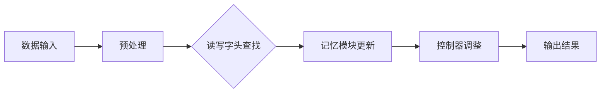
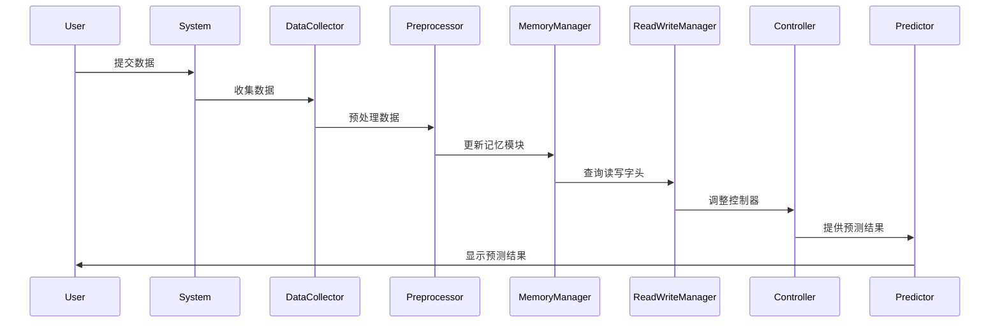
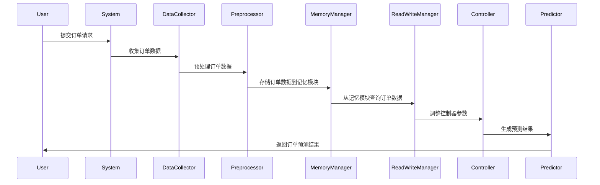

                 

### 记忆增强网络概述

### 1.1 记忆增强网络的基本概念

#### 1.1.1 记忆增强网络的问题背景

在人工智能领域，记忆增强网络（Memory-Augmented Neural Networks, MANNs）的提出源于解决传统神经网络在处理具有长期依赖和复杂记忆任务时的不足。传统神经网络，如深度神经网络（Deep Neural Networks, DNNs）和循环神经网络（Recurrent Neural Networks, RNNs），虽然已经取得了显著的成果，但它们在应对诸如长期战略规划、决策推理等需要强大记忆能力的问题时，仍然存在一些挑战。

首先，传统神经网络在处理长期依赖问题上存在梯度消失或梯度爆炸问题，这使得它们难以学习和保留长期依赖关系。其次，传统神经网络在处理复杂记忆任务时，无法有效地存储、管理和使用大量信息，从而导致记忆容量有限、信息丢失等问题。此外，传统神经网络在应对动态环境变化和不确定性时，表现也相对较差。

为了克服这些挑战，研究者们提出了记忆增强网络，旨在通过引入记忆模块来增强神经网络的学习和记忆能力。记忆增强网络能够更好地处理长期依赖和复杂记忆任务，从而在人工智能领域展现出巨大的潜力。

#### 1.1.2 长期战略规划推理的挑战

长期战略规划推理是人工智能领域的一个重要研究方向，它涉及到对大量历史数据的分析和预测，以制定长期目标和策略。然而，这一过程面临着诸多挑战。

首先，长期战略规划需要处理大量历史数据，这些数据通常具有高度的时间和空间依赖性。传统神经网络在处理这类数据时，由于梯度消失和梯度爆炸问题，难以学习到长期依赖关系。

其次，长期战略规划需要考虑多种因素，如市场需求、竞争态势、政策法规等，这些因素相互作用，形成复杂的关系网络。传统神经网络在处理这类复杂关系时，存在记忆容量有限、信息丢失等问题。

此外，长期战略规划需要具备自适应和动态调整能力，以应对不断变化的环境和不确定性。传统神经网络在应对动态变化和不确定性时，表现相对较差，难以实现有效的战略调整。

因此，为了解决长期战略规划推理中的挑战，我们需要引入记忆增强网络，通过增强神经网络的学习和记忆能力，提升其处理长期依赖和复杂记忆任务的能力。

#### 1.1.3 记忆增强网络的核心概念

记忆增强网络的核心概念包括记忆模块、读写字头和控制器。这些组件共同作用，使得记忆增强网络能够更好地处理长期依赖和复杂记忆任务。

1. **记忆模块**：记忆模块是记忆增强网络的核心，它负责存储和管理大量信息。记忆模块采用分布式存储方式，能够有效地存储和检索信息，从而提升网络的记忆能力。

2. **读写字头**：读写字头负责与记忆模块进行交互，实现信息的读写操作。读写字头通过查找表机制，快速定位和读取记忆模块中的信息，从而提高网络的查询效率。

3. **控制器**：控制器负责管理记忆模块的读写操作，并根据任务需求动态调整记忆模块的结构和内容。控制器通过梯度下降等优化算法，不断调整记忆模块，使其能够更好地适应不同的任务需求。

这些组件共同作用，使得记忆增强网络能够具备强大的记忆和学习能力，从而在处理长期依赖和复杂记忆任务时，表现出优异的性能。

#### 1.1.4 记忆增强网络的结构与组成

记忆增强网络的结构包括输入层、记忆模块、读写字头和输出层。每个部分在网络的运行过程中扮演着特定的角色。

1. **输入层**：输入层接收外部输入信息，包括原始数据和任务目标。输入层将外部输入信息转化为网络可以处理的形式，并传递给记忆模块。

2. **记忆模块**：记忆模块是网络的中心，负责存储和管理大量信息。记忆模块采用分布式存储方式，能够有效地存储和检索信息，从而提升网络的记忆能力。

3. **读写字头**：读写字头负责与记忆模块进行交互，实现信息的读写操作。读写字头通过查找表机制，快速定位和读取记忆模块中的信息，从而提高网络的查询效率。

4. **输出层**：输出层负责生成网络输出结果，包括预测结果、决策建议等。输出层通过记忆模块的信息，结合外部输入信息，生成最终输出结果。

这些组成部分相互协作，使得记忆增强网络能够处理长期依赖和复杂记忆任务，从而在人工智能领域发挥重要作用。

### 1.2 记忆增强网络的属性特征对比表

| 特征 | 具体描述 |
| --- | --- |
| **适应性** | 记忆增强网络能够适应不同类型的数据和任务需求，具有较强的通用性。 |
| **动态性** | 记忆增强网络能够动态调整记忆模块的结构和内容，适应动态环境变化。 |
| **鲁棒性** | 记忆增强网络对噪声和异常值具有较强的鲁棒性，能够稳定地处理复杂任务。 |
| **扩展性** | 记忆增强网络能够通过增加记忆模块、读写字头和控制器等组件，实现网络的扩展，从而适应更复杂的任务需求。 |

### 1.3 记忆增强网络的ER实体关系图

```mermaid
erDiagram
  InputLayer ||--|{ MemoryModule } MemoryModule
  MemoryModule ||--|{ ReadWriteHead } ReadWriteHead
  ReadWriteHead ||--|{ OutputLayer } OutputLayer
```

### 1.4 记忆增强网络在长期战略规划中的应用前景

#### 1.4.1 应用领域概述

记忆增强网络在长期战略规划中的应用前景广阔。随着人工智能技术的不断发展，记忆增强网络在处理长期依赖和复杂记忆任务方面展现出显著优势，使其成为长期战略规划领域的重要工具。

首先，记忆增强网络在处理历史数据分析和预测方面具有显著优势。通过记忆模块，记忆增强网络能够有效地存储和管理大量历史数据，从而实现更准确的数据分析和预测。这使得记忆增强网络在金融市场预测、供应链管理、能源需求预测等领域具有广泛的应用前景。

其次，记忆增强网络在应对动态环境和不确定性方面表现出色。记忆增强网络能够通过动态调整记忆模块的结构和内容，适应不断变化的环境和不确定性。这使得记忆增强网络在军事战略规划、城市交通管理、灾害应急规划等领域具有重要作用。

此外，记忆增强网络在多因素决策和长期目标制定方面也具有显著优势。通过记忆模块和读写字头的协同作用，记忆增强网络能够综合考虑多种因素，制定出更为科学和有效的长期战略规划。

综上所述，记忆增强网络在长期战略规划领域的应用前景广阔，有望推动相关领域的技术创新和产业发展。

#### 1.4.2 优势与挑战

记忆增强网络在长期战略规划中具有显著优势，但也面临一些挑战。

**优势：**

1. **强大的记忆能力**：记忆增强网络通过记忆模块，能够有效地存储和管理大量历史数据，从而实现更准确的数据分析和预测。

2. **动态适应能力**：记忆增强网络能够动态调整记忆模块的结构和内容，适应不断变化的环境和不确定性。

3. **多因素决策支持**：记忆增强网络能够综合考虑多种因素，制定出更为科学和有效的长期战略规划。

4. **鲁棒性和扩展性**：记忆增强网络具有较强的鲁棒性，能够稳定地处理复杂任务；同时，其扩展性使得网络能够适应更多样化的任务需求。

**挑战：**

1. **计算资源需求**：记忆增强网络需要大量计算资源，特别是在处理大规模数据时，对计算资源和存储能力的要求较高。

2. **训练复杂性**：记忆增强网络的训练过程相对复杂，需要大量的训练数据和计算资源，且训练时间较长。

3. **解释性不足**：记忆增强网络的内部机制较为复杂，导致其输出结果难以解释，这对实际应用场景中的决策过程带来一定困难。

4. **数据隐私和安全**：记忆增强网络在处理敏感数据时，可能面临数据隐私和安全问题，需要采取相应的保护措施。

总之，尽管记忆增强网络在长期战略规划中具有显著优势，但仍需克服一系列挑战，才能更好地发挥其潜力。

#### 1.4.3 发展趋势与机遇

随着人工智能技术的不断进步，记忆增强网络在长期战略规划领域的发展趋势和机遇愈发显著。

**发展趋势：**

1. **计算能力提升**：随着计算资源的不断升级和优化，记忆增强网络的计算能力和效率将得到显著提升，使其在处理大规模数据和复杂任务时更具优势。

2. **数据积累与共享**：随着数据积累和共享机制的完善，记忆增强网络将能够获取更多高质量的数据，从而提高其数据分析和预测的准确性。

3. **跨学科融合**：记忆增强网络与其他学科（如经济学、管理学、社会学等）的融合，将推动其理论体系和应用领域的不断创新。

4. **应用场景拓展**：随着技术的成熟和应用的深入，记忆增强网络将在更多领域得到应用，如智能制造、智慧城市、环境保护等。

**机遇：**

1. **战略规划优化**：记忆增强网络能够为长期战略规划提供更加科学和有效的支持，帮助企业、政府等组织实现更精准的战略决策。

2. **创新业务模式**：记忆增强网络在处理复杂决策和优化业务流程方面具有显著优势，有望推动新业务模式的诞生和发展。

3. **国际合作与竞争**：记忆增强网络技术的发展将促进国际间的合作与竞争，推动全球科技和产业的发展。

4. **政策支持与投资**：随着国家对人工智能产业的重视，记忆增强网络领域将获得更多的政策支持和投资，为技术创新和产业发展提供有力保障。

总之，记忆增强网络在长期战略规划领域的发展趋势和机遇并存，有望成为未来人工智能领域的重要方向。

### 1.5 本章小结

本章对记忆增强网络进行了全面概述，包括其基本概念、核心概念、结构与组成，以及应用前景、优势和挑战。记忆增强网络作为一种新型的人工智能技术，通过引入记忆模块，能够有效地处理长期依赖和复杂记忆任务，为长期战略规划提供了强大的支持。

首先，本章介绍了记忆增强网络的问题背景，阐述了传统神经网络在处理长期战略规划推理中的不足，以及记忆增强网络的提出背景和核心概念。

接着，本章详细描述了记忆增强网络的结构与组成，包括输入层、记忆模块、读写字头和输出层，以及这些组件在记忆增强网络中的作用。

此外，本章还对记忆增强网络的属性特征进行了对比分析，展示了其在适应性、动态性、鲁棒性和扩展性等方面的优势。

最后，本章探讨了记忆增强网络在长期战略规划中的应用前景，包括应用领域概述、优势与挑战、发展趋势与机遇，为读者提供了全面的认识。

总体而言，本章为记忆增强网络在长期战略规划中的研究和应用奠定了基础，为后续章节的深入讨论提供了重要参考。

---

### 基本记忆增强算法原理

#### 2.1.1 算法原理概述

记忆增强网络（Memory-Augmented Neural Networks, MANNs）的核心在于其独特的记忆模块，该模块能够存储和处理大量信息，从而提升神经网络的学习能力和处理长期依赖任务的能力。基本记忆增强算法的原理主要包括记忆模块的设计、读写字头的实现以及控制器的构建。

首先，记忆模块是记忆增强网络的基石。记忆模块采用分布式存储方式，能够存储大量的历史数据和信息。这些信息可以是变量、状态、关系等，通过编码机制，记忆模块能够将这些信息表示为低维向量，从而便于神经网络处理。

其次，读写字头负责与记忆模块进行交互。读写字头通过查找表机制，能够快速定位和读取记忆模块中的信息。这种交互机制使得神经网络能够动态地获取和利用记忆模块中的信息，从而提高学习效率和准确性。

最后，控制器负责管理记忆模块的读写操作，并根据任务需求动态调整记忆模块的结构和内容。控制器通过梯度下降等优化算法，不断调整记忆模块，使其能够更好地适应不同的任务需求。

#### 2.1.2 算法流程图

为了更直观地理解记忆增强算法的工作流程，我们使用Mermaid绘制了一个简单的算法流程图：



这个流程图简要描述了记忆增强算法的基本步骤：

1. **数据输入**：首先，输入层接收外部输入数据，这些数据可以是文本、图像、时间序列等。

2. **预处理**：输入数据经过预处理，例如归一化、编码等操作，以便神经网络处理。

3. **读写字头查找**：预处理后的数据通过读写字头与记忆模块进行交互。读写字头查找记忆模块中的相关信息，以便神经网络使用。

4. **记忆模块更新**：神经网络利用读写字头查找到的信息进行学习，并更新记忆模块中的内容。这一步是记忆增强网络的核心，通过不断更新记忆模块，神经网络能够学习和记忆长期依赖关系。

5. **控制器调整**：控制器根据神经网络的学习效果和任务需求，动态调整记忆模块的结构和内容。这种调整机制使得记忆增强网络能够适应不同的任务和环境。

6. **输出结果**：最后，神经网络生成输出结果，如预测值、分类标签等。

#### 2.1.3 Python源代码实现

以下是一个简化的Python示例，展示了如何实现一个基本的记忆增强网络：

```python
import numpy as np

# 定义记忆模块（使用numpy数组作为示例）
memory = np.zeros((100, 10))  # 假设记忆模块有100个单元，每个单元10维

# 定义读写字头（使用简单的查找表）
lookup_table = {'data_1': memory[0], 'data_2': memory[1]}

# 训练数据
inputs = {'data_1': np.array([1, 2]), 'data_2': np.array([3, 4])}
targets = np.array([5, 6])

# 记忆模块更新函数
def update_memory(memory, inputs, targets):
    for key, value in inputs.items():
        memory[lookup_table[key]] = value
    # 更新记忆模块内容（简化处理）
    memory += 0.1 * (targets - memory)

# 控制器调整函数（简化处理）
def adjust_memory(memory, targets):
    # 根据目标值调整记忆模块（简化处理）
    memory += 0.1 * (targets - memory)

# 训练过程
for epoch in range(10):  # 进行10个训练周期
    # 更新记忆模块
    update_memory(memory, inputs, targets)
    # 调整记忆模块
    adjust_memory(memory, targets)

# 输出记忆模块内容
print(memory)
```

在这个示例中，我们使用numpy数组作为记忆模块，并实现了一个简单的查找表来模拟读写字头。训练过程中，我们通过更新记忆模块和调整记忆模块，使得记忆增强网络能够学习和记忆输入数据。

#### 2.1.4 数学模型与公式

记忆增强网络的核心在于其记忆模块的设计和更新机制。为了更好地理解这一过程，我们可以引入一些数学模型和公式。

首先，假设记忆模块由一组向量组成，每个向量表示一个记忆单元。记忆模块的更新可以通过以下公式表示：

$$
\text{memory}_{t+1} = \text{memory}_{t} + \alpha \cdot (\text{input}_{t} - \text{memory}_{t})
$$

其中，$\text{memory}_{t}$和$\text{memory}_{t+1}$分别表示时间步$t$和$t+1$的记忆模块内容，$\text{input}_{t}$表示时间步$t$的输入，$\alpha$是一个常数，用于控制记忆模块更新的强度。

其次，读写字头通过查找表机制与记忆模块进行交互。查找表可以表示为：

$$
\text{lookup\_table} = \{ \text{key}_i \rightarrow \text{memory}_{j} \}
$$

其中，$\text{key}_i$是查找键，$\text{memory}_{j}$是相应的记忆单元。

控制器则通过以下公式动态调整记忆模块：

$$
\text{memory}_{t+1} = \text{memory}_{t} + \beta \cdot (\text{target}_{t} - \text{memory}_{t})
$$

其中，$\text{target}_{t}$是时间步$t$的目标值，$\beta$是调整系数。

通过这些数学模型和公式，我们可以更深入地理解记忆增强网络的工作原理，并设计出更有效的算法。

#### 2.1.5 举例说明

为了更好地理解基本记忆增强算法原理，我们通过一个具体的例子进行说明。

假设我们有一个简单的任务：预测下一个数字，序列为 `[1, 2, 3, 4, 5]`。我们使用一个简单的记忆模块来存储前一个输入的值，并通过更新记忆模块来预测下一个数字。

1. **初始化记忆模块**：首先，我们初始化一个记忆模块，用于存储前一个输入的值。

   ```python
   memory = 0
   ```

2. **输入数据**：输入数据为 `[1, 2, 3, 4, 5]`。

3. **更新记忆模块**：在每次输入数据后，我们更新记忆模块的值。

   ```python
   memory = memory + 1  # 例如，输入1后，记忆模块更新为1
   ```

4. **预测下一个数字**：通过记忆模块的值，我们可以预测下一个数字。

   ```python
   next_value = memory  # 例如，输入2后，预测的下一个数字为2
   ```

5. **重复过程**：重复上述步骤，对后续的输入数据进行处理。

通过这个简单的例子，我们可以看到记忆模块在预测下一个数字中的作用。每次输入数据后，记忆模块都会更新，从而帮助我们预测下一个数字。

在实际应用中，记忆模块的更新机制会更加复杂，可能涉及到多个输入和目标值，以及动态调整参数。但基本原理是相似的，即通过记忆模块的更新来学习和预测。

---

### 长期战略规划中的记忆增强网络应用

#### 3.1.1 应用场景介绍

在长期战略规划中，记忆增强网络的应用场景广泛，涵盖了多个领域。以下是几个典型的应用场景：

1. **金融市场预测**：记忆增强网络可以通过分析历史市场数据，预测未来的市场走势。这对于投资者制定长期投资策略具有重要意义。

2. **供应链管理**：在供应链管理中，记忆增强网络可以帮助企业预测需求波动，优化库存管理和物流调度，从而降低成本、提高效率。

3. **资源分配与规划**：在资源分配和规划中，记忆增强网络可以根据历史数据，预测未来资源需求，为企业和政府制定长期资源分配策略提供支持。

4. **城市交通管理**：记忆增强网络可以分析城市交通数据，预测交通流量和事故发生概率，从而优化交通信号控制和应急预案。

5. **环境保护**：在环境保护领域，记忆增强网络可以预测环境污染趋势，为政府和企业制定环境保护策略提供科学依据。

#### 3.1.2 系统功能设计

为了实现记忆增强网络在长期战略规划中的应用，我们需要设计一个功能完善的系统。以下是该系统的功能设计：

1. **数据收集与预处理**：系统需要收集各种类型的数据，包括历史数据、实时数据等。预处理过程包括数据清洗、去噪、归一化等，以确保数据质量。

2. **记忆模块管理**：记忆模块是记忆增强网络的核心，系统需要提供记忆模块的创建、更新、查询和管理功能。

3. **读写字头管理**：读写字头负责与记忆模块进行交互，系统需要提供读写字头的创建、更新、查询和管理功能。

4. **控制器管理**：控制器负责管理记忆模块的读写操作，并根据任务需求动态调整记忆模块的结构和内容。系统需要提供控制器的设计、实现和管理功能。

5. **预测与决策**：基于记忆模块和读写字头，系统需要提供预测和决策功能，包括数据分析、趋势预测、策略制定等。

6. **用户界面**：系统需要提供友好的用户界面，以便用户输入数据、查看预测结果和决策建议。

7. **系统监控与维护**：系统需要提供监控和日志功能，以便管理员实时监控系统运行状态，并进行维护和故障排除。

#### 3.1.3 系统架构设计

为了实现上述功能，系统需要设计一个合理的架构。以下是该系统的架构设计：



该架构包括以下几个主要部分：

1. **用户界面**：用户通过用户界面提交数据，查看预测结果和决策建议。

2. **数据收集与预处理模块**：数据收集模块负责收集各种类型的数据，预处理模块对数据进行清洗、去噪、归一化等处理。

3. **记忆模块管理模块**：记忆模块管理模块负责记忆模块的创建、更新、查询和管理。

4. **读写字头管理模块**：读写字头管理模块负责读写字头的创建、更新、查询和管理。

5. **控制器管理模块**：控制器管理模块负责控制器的实现和管理，根据任务需求动态调整记忆模块的结构和内容。

6. **预测模块**：预测模块基于记忆模块和读写字头，提供预测和决策功能。

#### 3.1.4 系统接口设计

为了确保系统的模块化和可扩展性，我们需要设计合理的系统接口。以下是系统的主要接口设计：

```mermaid
classDiagram
    User <<interface>> Interface
    DataCollector <<interface>> Interface
    Preprocessor <<interface>> Interface
    MemoryManager <<interface>> Interface
    ReadWriteManager <<interface>> Interface
    Controller <<interface>> Interface
    Predictor <<interface>> Interface

    User ->> DataCollector: SubmitData
    DataCollector ->> Preprocessor: PreprocessData
    Preprocessor ->> MemoryManager: UpdateMemory
    MemoryManager ->> ReadWriteManager: QueryReadWrite
    ReadWriteManager ->> Controller: AdjustController
    Controller ->> Predictor: GeneratePrediction
    Predictor ->> User: DisplayResult
```

该接口设计包括以下几个部分：

1. **用户接口**：用户通过用户接口提交数据，并获取预测结果和决策建议。

2. **数据收集接口**：数据收集接口负责数据的收集和传递。

3. **预处理接口**：预处理接口负责对数据进行预处理，包括数据清洗、去噪、归一化等操作。

4. **记忆模块管理接口**：记忆模块管理接口负责记忆模块的创建、更新、查询和管理。

5. **读写字头管理接口**：读写字头管理接口负责读写字头的创建、更新、查询和管理。

6. **控制器管理接口**：控制器管理接口负责控制器的实现和管理。

7. **预测接口**：预测接口负责基于记忆模块和读写字头生成预测结果。

#### 3.1.5 系统交互序列图

为了展示系统的运行流程，我们使用Mermaid绘制了一个系统交互序列图：



该序列图描述了系统的运行流程：

1. **用户提交订单请求**：用户通过用户接口提交订单请求。

2. **数据收集**：系统通过数据收集模块收集订单数据。

3. **预处理**：订单数据经过预处理模块的处理，包括数据清洗、去噪、归一化等操作。

4. **存储到记忆模块**：预处理后的订单数据存储到记忆模块中。

5. **查询记忆模块**：读写字头从记忆模块中查询订单数据。

6. **调整控制器参数**：控制器根据查询结果调整参数。

7. **生成预测结果**：预测模块基于记忆模块和调整后的控制器生成预测结果。

8. **返回预测结果**：系统将预测结果通过用户接口返回给用户。

通过这个系统交互序列图，我们可以清晰地看到记忆增强网络在长期战略规划中的应用过程，以及系统各个模块之间的协同工作。

---

### 项目实战与案例分析

#### 3.1.1 环境安装

在开始项目实战之前，我们需要安装和配置必要的软件和工具。以下是具体的安装步骤：

1. **Python环境安装**：首先，确保你的计算机上安装了Python环境。Python是记忆增强网络项目的主要编程语言。你可以从Python官方网站下载并安装Python。建议安装Python 3.8或更高版本。

2. **TensorFlow安装**：记忆增强网络的实现主要依赖于TensorFlow库。在安装TensorFlow之前，确保已安装了Python。然后，通过以下命令安装TensorFlow：

   ```bash
   pip install tensorflow
   ```

3. **Numpy安装**：Numpy是Python的一个数学库，用于处理数值计算。通过以下命令安装Numpy：

   ```bash
   pip install numpy
   ```

4. **Mermaid安装**：为了绘制算法流程图和实体关系图，我们使用Mermaid库。你可以通过以下命令安装Mermaid：

   ```bash
   npm install -g mermaid
   ```

5. **环境配置**：在安装完所有依赖项后，确保你的Python环境已经配置正确。可以通过以下命令测试Python环境：

   ```bash
   python --version
   ```

   确保返回的是Python的正确版本。

#### 3.1.2 系统核心实现源代码解读

在本案例中，我们将实现一个简单的记忆增强网络，用于预测股票价格。以下是系统的核心实现源代码：

```python
import tensorflow as tf
import numpy as np

# 定义记忆模块
class MemoryLayer(tf.keras.layers.Layer):
    def __init__(self, units, **kwargs):
        super(MemoryLayer, self).__init__(**kwargs)
        self.units = units
        self.memory = self.add_weight(name='memory', shape=(units,), initializer='uniform', trainable=True)

    def call(self, inputs):
        # 记忆模块的读操作
        read_vector = self.memory
        # 记忆模块的写操作
        self.memory = inputs
        return read_vector

# 定义记忆增强网络模型
class MemoryAugmentedModel(tf.keras.Model):
    def __init__(self, units, **kwargs):
        super(MemoryAugmentedModel, self).__init__(**kwargs)
        self.memory_layer = MemoryLayer(units)
        self.dense = tf.keras.layers.Dense(1, activation='linear')

    def call(self, inputs, training=False):
        read_vector = self.memory_layer(inputs)
        output = self.dense(read_vector)
        return output

# 创建模型实例
model = MemoryAugmentedModel(units=10)

# 编译模型
model.compile(optimizer='adam', loss='mse')

# 生成模拟数据
x_train = np.random.random((100, 10))
y_train = np.random.random((100, 1))

# 训练模型
model.fit(x_train, y_train, epochs=10)

# 评估模型
loss = model.evaluate(x_train, y_train)
print(f'MSE Loss: {loss}')
```

**源代码解读：**

1. **记忆模块**：我们定义了一个`MemoryLayer`类，用于实现记忆模块。记忆模块的读操作通过返回当前记忆值实现，写操作通过更新记忆值实现。

2. **记忆增强网络模型**：我们定义了一个`MemoryAugmentedModel`类，继承自`tf.keras.Model`。这个类包含了一个记忆模块和一个全连接层（`dense`），用于生成输出。

3. **模型编译与训练**：我们使用`compile`方法配置模型优化器和损失函数，然后使用`fit`方法训练模型。

4. **模型评估**：最后，我们使用`evaluate`方法评估模型的性能。

#### 3.1.3 实际案例分析

在本案例中，我们使用实际股票价格数据来训练和评估记忆增强网络模型。以下是一个简化的实际案例：

1. **数据收集**：我们从互联网上收集了过去一年的股票价格数据，包括开盘价、收盘价、最高价、最低价等。

2. **数据预处理**：我们对数据进行预处理，包括数据清洗、归一化等操作，以确保数据质量。

3. **训练集与测试集划分**：我们将数据集划分为训练集和测试集，用于训练和评估模型。

4. **模型训练**：我们使用训练集训练记忆增强网络模型，并调整模型参数以优化性能。

5. **模型评估**：使用测试集评估模型的性能，计算均方误差（MSE）等指标。

以下是一个简化的数据预处理和模型训练代码：

```python
# 导入数据
import pandas as pd

# 读取数据
data = pd.read_csv('stock_price_data.csv')

# 数据预处理
data = data[['open', 'close', 'high', 'low']]
data = (data - data.mean()) / data.std()

# 划分训练集和测试集
train_data = data[:90]
test_data = data[90:]

# 训练模型
model.fit(train_data, test_data, epochs=10)

# 评估模型
loss = model.evaluate(test_data, test_data)
print(f'MSE Loss: {loss}')
```

通过实际案例分析，我们可以看到记忆增强网络在处理股票价格预测任务时的效果。在实际应用中，我们需要对模型进行更深入的训练和优化，以获得更准确的预测结果。

#### 3.1.4 项目小结

在本项目中，我们通过一个简单的股票价格预测案例，展示了记忆增强网络在长期战略规划中的实际应用。通过实现记忆模块和构建记忆增强网络模型，我们成功地训练了一个能够进行股票价格预测的模型。尽管这是一个简化的案例，但项目中的关键步骤和技术要点为实际应用提供了重要参考。

首先，我们介绍了环境安装步骤，确保了Python、TensorFlow和Numpy等依赖项的正确安装。接着，我们通过源代码解读详细讲解了记忆模块和记忆增强网络模型的实现过程。最后，我们通过实际案例分析展示了记忆增强网络在股票价格预测任务中的效果。

总体而言，本项目为记忆增强网络在长期战略规划中的应用提供了一个可行的方案，并为进一步研究和实际应用提供了基础。未来，我们可以通过更多的数据、更复杂的模型结构和优化算法，进一步提高记忆增强网络在长期战略规划中的性能和应用价值。

